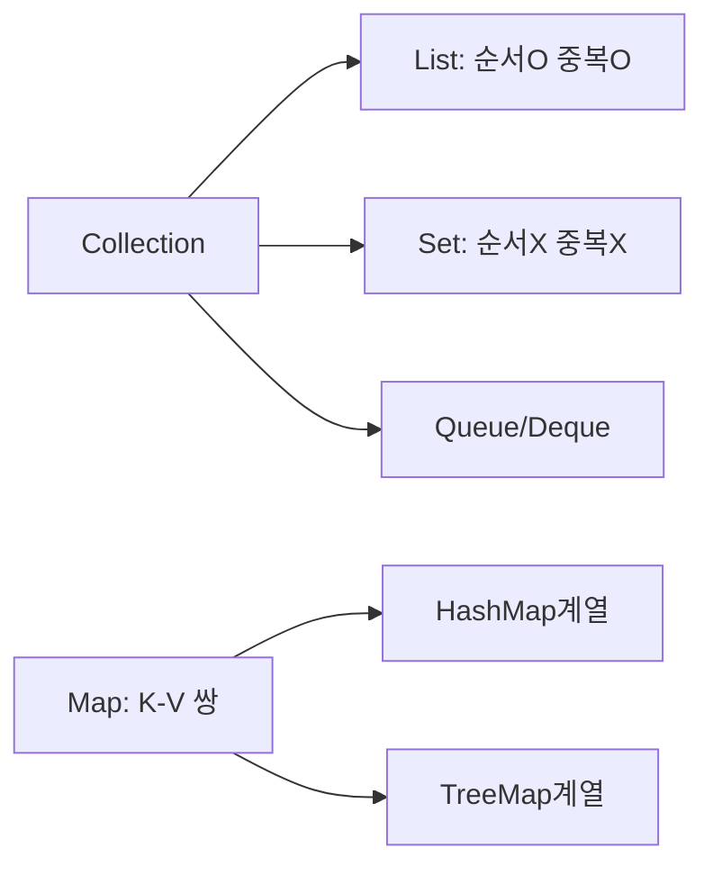
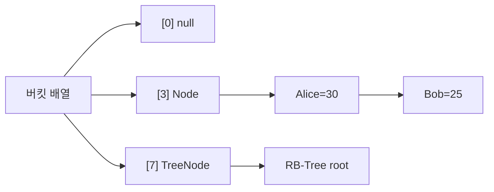
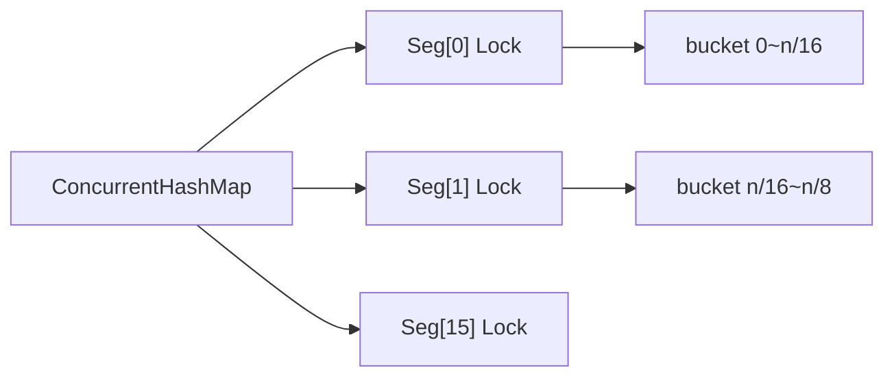
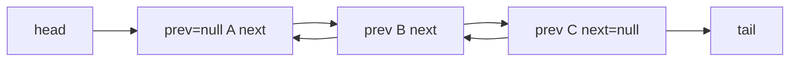
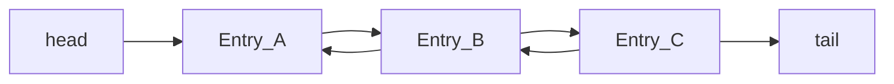
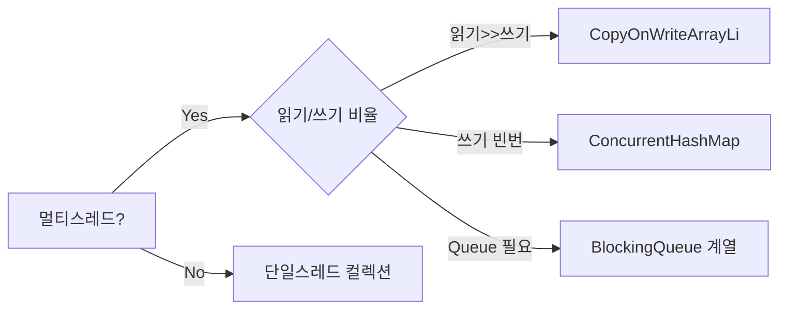

ArrayList와 LinkedList 중 무엇을 고를지, HashMap이 왜 멀티스레드에서 무한루프를 일으키는지, ConcurrentHashMap이 어떻게 락 없이 읽기를 처리하는지 — 이 질문들에 정확히 답하려면 내부 자료구조와 JVM 메모리 모델을 함께 알아야 한다. 선택 하나가 성능을 10배 이상 바꾸고, 실수 하나가 프로덕션 장애를 만든다.

> **비유로 먼저 이해하기**: HashMap은 수천 개의 우편함이 있는 아파트 단지다. 편지(key)를 받으면 동호수(hashCode)를 계산해 해당 우편함(bucket)에 넣는다. 같은 동호수 우편함에 편지가 너무 많이 쌓이면(8개 초과) 더 효율적인 색인 시스템(Red-Black Tree)으로 교체한다. 이 비유 하나로 HashMap의 설계 결정 대부분이 설명된다.

---

## 1. 컬렉션 프레임워크 전체 구조

### 인터페이스 계층도



### 핵심 인터페이스 요약

| 인터페이스 | 특징 | 대표 구현체 |
|-----------|------|------------|
| `List` | 인덱스 기반, 순서 보장, 중복 허용 | ArrayList, LinkedList |
| `Set` | 중복 불허, 순서 미보장(구현체별 상이) | HashSet, TreeSet |
| `Queue` | FIFO, offer/poll/peek | PriorityQueue, ArrayDeque |
| `Deque` | 양방향 큐 (Double Ended Queue) | ArrayDeque, LinkedList |
| `Map` | Key-Value 쌍, Key 중복 불허 | HashMap, TreeMap, ConcurrentHashMap |

---

## 2. HashMap 내부 구조 완전 분석

### 2-1. 버킷 배열 + 연결 리스트 + Red-Black Tree

HashMap의 핵심은 **배열(버킷) + 체이닝(Chaining)** 조합이다. 버킷은 `Node<K,V>[]` 배열이며, 각 버킷에는 해시가 같은 항목들이 연결 리스트로 달린다. Java 8부터는 한 버킷의 항목이 8개를 초과하면 Red-Black Tree로 전환한다.

```java
// OpenJDK HashMap 내부 구조 (핵심 필드)
public class HashMap<K, V> {
    // 버킷 배열 — 항상 2의 거듭제곱 크기
    transient Node<K,V>[] table;

    // 현재 저장된 항목 수
    transient int size;

    // 구조적 변경 횟수 (fail-fast Iterator를 위한 modCount)
    transient int modCount;

    // 리사이징 임계값 = capacity * loadFactor
    int threshold;

    // 기본 0.75
    final float loadFactor;

    // 트리화 임계값
    static final int TREEIFY_THRESHOLD   = 8;   // 버킷 원소 수 > 8 시 트리 전환
    static final int UNTREEIFY_THRESHOLD = 6;   // 원소 수 <= 6 시 다시 리스트로
    static final int MIN_TREEIFY_CAPACITY = 64; // 전체 capacity < 64이면 트리화 대신 resize

    // 일반 노드 (연결 리스트)
    static class Node<K,V> implements Map.Entry<K,V> {
        final int hash;
        final K key;
        V value;
        Node<K,V> next;   // 다음 노드 포인터
    }

    // 트리 노드 (Red-Black Tree, Node 상속)
    static final class TreeNode<K,V> extends LinkedHashMap.Entry<K,V> {
        TreeNode<K,V> parent;
        TreeNode<K,V> left;
        TreeNode<K,V> right;
        TreeNode<K,V> prev;  // 언트리화 시 연결 리스트 복원용
        boolean red;
    }
}
```



### 2-2. 해시 함수 — h ^ (h >>> 16) 스프레딩

**왜 단순히 hashCode()를 쓰지 않는가?**

hashCode()의 상위 비트는 버킷 인덱스 계산(index = hash & (n-1))에 거의 관여하지 않는다. capacity가 16이면 하위 4비트만 사용되므로, 상위 비트가 아무리 달라도 같은 버킷에 몰릴 수 있다. 이를 방지하기 위해 상위 16비트를 하위 16비트에 XOR로 혼합한다.

```java
// OpenJDK HashMap.hash() — 스프레딩 해시 함수
static final int hash(Object key) {
    int h;
    // null 키는 항상 버킷 0에 저장
    // null이 아니면: hashCode()의 상위 16비트를 하위 16비트에 XOR
    return (key == null) ? 0 : (h = key.hashCode()) ^ (h >>> 16);
}

// 버킷 인덱스 계산 (putVal 내부)
// (n - 1) & hash  ← n이 2의 거듭제곱이므로 % 연산 대신 비트 AND 사용
int index = (n - 1) & hash;
```

```java
// 예시: hashCode = 0xABCD_1234
// h           = 1010 1011 1100 1101 | 0001 0010 0011 0100
// h >>> 16    = 0000 0000 0000 0000 | 1010 1011 1100 1101
// h ^ h>>>16  = 1010 1011 1100 1101 | 1011 1001 1111 1001
//                              ↑ 상위 비트가 하위에 반영됨
// capacity=16 → index = (16-1) & result → 하위 4비트만 사용
// 스프레딩 덕분에 상위 비트 정보도 인덱스에 반영된다
```

### 2-3. 왜 capacity는 반드시 2의 거듭제곱인가

**비트 AND로 모듈러 연산을 대체하기 위해서다.**

- 일반 모듈러: `hash % n` → 나눗셈 명령어, CPU 비용 큼
- 2의 거듭제곱: `hash & (n-1)` → 비트 AND 한 번, 극도로 빠름

```java
// capacity=16 (10000₂)이면
// n-1 = 15 (01111₂)
// hash & 15 → 하위 4비트만 남김 = 0~15 범위 보장

// 만약 capacity=15 (비2의거듭제곱)라면
// hash & 14 → 홀수 버킷(1,3,5...) 절대 사용 불가 → 절반 낭비

// HashMap 생성 시 요청 capacity를 2의 거듭제곱으로 올림
static final int tableSizeFor(int cap) {
    int n = -1 >>> Integer.numberOfLeadingZeros(cap - 1);
    return (n < 0) ? 1 : (n >= MAXIMUM_CAPACITY) ? MAXIMUM_CAPACITY : n + 1;
}
// tableSizeFor(13) = 16
// tableSizeFor(17) = 32
// tableSizeFor(1000) = 1024
```

### 2-4. 로드 팩터 0.75 — Poisson 분포에서 유도된 값

**왜 0.75인가?** Java 공식 문서에 명시된 수학적 근거가 있다.

해시 버킷에 항목이 균등하게 분산된다고 가정하면, 한 버킷에 k개의 항목이 들어올 확률은 Poisson 분포를 따른다. 로드 팩터가 0.75일 때 버킷당 평균 항목 수(λ)는 약 0.5이며, 이 때 빈 버킷 확률은 약 60.6%, 항목이 8개 이상인 버킷 확률은 약 0.000006이다. TREEIFY_THRESHOLD = 8은 이 확률이 사실상 0에 가까워지는 지점을 선택한 것이다.

```java
// 로드 팩터에 따른 시간-공간 트레이드오프
// loadFactor = 0.5  → 충돌 적음, 메모리 2배 낭비
// loadFactor = 0.75 → 충돌/메모리 균형 (기본값, Poisson 최적)
// loadFactor = 1.0  → 메모리 절약, 충돌 증가 → 탐색 성능 저하

// Poisson(λ=0.5)에서 k>=8 확률
// P(k>=8) ≈ 0.00000006 → 거의 발생하지 않음
// → 즉, 정상적인 hashCode 구현이라면 트리화는 극히 드물게 발생
```

### 2-5. 리사이징 — double + rehash

capacity를 2배로 늘리고 기존 항목을 전부 재배치(rehash)한다. 2의 거듭제곱 특성 덕분에 각 항목의 새 버킷 인덱스는 **기존 인덱스** 또는 **기존 인덱스 + 이전 capacity** 둘 중 하나다. 상위 1비트만 확인하면 된다.

```java
// resize() 핵심 로직 (OpenJDK 단순화)
Node<K,V>[] newTab = new Node[newCap]; // 새 배열 (2배 크기)

for (Node<K,V> e : oldTab) {
    if (e.next == null) {
        // 단일 노드: 새 인덱스 = hash & (newCap - 1)
        newTab[e.hash & (newCap - 1)] = e;
    } else if (e instanceof TreeNode) {
        // 트리 노드: split() → 필요 시 untreeify
        ((TreeNode<K,V>)e).split(this, newTab, j, oldCap);
    } else {
        // 연결 리스트: lo(하위) / hi(상위) 두 그룹으로 분리
        Node<K,V> loHead = null, hiHead = null;
        do {
            // oldCap 비트가 0이면 기존 인덱스 유지, 1이면 +oldCap
            if ((e.hash & oldCap) == 0) { /* lo 그룹 */ }
            else                         { /* hi 그룹 */ }
        } while ((e = e.next) != null);
        newTab[j]          = loHead; // 기존 위치 유지
        newTab[j + oldCap] = hiHead; // 기존 위치 + oldCap
    }
}
```

```java
// 실전: 1000개 저장 예정 시 리사이징 횟수 제거
// 1000 / 0.75 = 1333.3 → 다음 2의 거듭제곱 = 2048
HashMap<String, Integer> map = new HashMap<>(2048);
// 기본값(16)으로 시작하면: 16→32→64→128→256→512→1024→2048 = 7번 리사이징
// 초기값 지정 시: 0번 리사이징
```

---

## 3. HashMap 스레드 안전성 — 왜 위험한가

### 3-1. Java 7: 무한루프 버그 (head insertion)

Java 7의 HashMap은 리사이징 시 **head insertion** 방식을 사용했다. 새 배열에 항목을 추가할 때 기존 연결 리스트 순서가 역전되는데, 두 스레드가 동시에 resize를 시작하면 순환 참조(cycle)가 형성된다.

```java
// Java 7 transfer() — 이 코드가 경쟁 조건을 유발
void transfer(Entry[] newTable) {
    for (Entry<K,V> e : table) {
        while (null != e) {
            Entry<K,V> next = e.next;  // ← 스레드 A가 여기서 멈춤
            int i = indexFor(e.hash, newTable.length);
            e.next = newTable[i];       // head insertion: 역순 삽입
            newTable[i] = e;
            e = next;
        }
    }
}
// 스레드 A가 e=Node1, next=Node2 저장 후 중단
// 스레드 B가 resize 완료 → Node2.next = Node1 (역전)
// 스레드 A 재개 → Node1.next = Node2 → Node2.next = Node1 → 순환!
// 이후 get() 시 해당 버킷 탐색에서 무한루프 발생 → CPU 100%
```

### 3-2. Java 8: tail insertion으로 수정, 그러나 여전히 unsafe

Java 8은 **tail insertion**으로 바꿔 순환 참조 버그를 제거했다. 하지만 스레드 안전하지 않다는 본질은 그대로다.

```java
// Java 8 resize() — tail insertion, 순서 보존
for (int j = 0; j < oldCap; ++j) {
    Node<K,V> loHead = null, loTail = null;
    Node<K,V> hiHead = null, hiTail = null;
    Node<K,V> e;
    while ((e = table[j]) != null) {
        // tail에 추가 → 순서 보존, 순환 참조 없음
        if (loTail == null) loHead = e;
        else loTail.next = e;
        loTail = e;
    }
}
// 무한루프는 없어졌지만:
// 1. 두 스레드가 동시에 put() → 한 항목이 소실될 수 있음
// 2. get()과 put()이 동시에 → 불완전한 노드를 읽을 수 있음
// 3. resize 중 get() → 잘못된 버킷에서 탐색 → null 반환
```

```java
// 동시성 카운터의 경쟁 조건 예시
Map<String, Integer> counter = new HashMap<>();

// 스레드 1, 2가 동시에 실행
counter.put("hits", counter.getOrDefault("hits", 0) + 1);
//            ↑ read           ↑ +1          ↑ write
// 두 스레드 모두 0을 읽고 1을 write → 최종값 1 (2가 되어야 함)
// 데이터 유실!

// 해결: ConcurrentHashMap + 원자적 연산
ConcurrentHashMap<String, Integer> safeCounter = new ConcurrentHashMap<>();
safeCounter.merge("hits", 1, Integer::sum); // 원자적
```

---

## 4. ConcurrentHashMap 내부 — CAS + synchronized per-node

### 4-1. Java 7: 세그먼트 락 방식의 한계

Java 7은 HashMap을 **Segment** 단위로 분할하고 각 Segment에 ReentrantLock을 걸었다. 기본 16개 세그먼트 → 최대 16개 스레드가 병렬로 쓰기 가능.



문제점: 세그먼트가 16개로 고정되어 64코어 서버에서도 최대 16 스레드만 병렬 쓰기 가능. 세그먼트 크기 불균형 시 한 세그먼트에 부하 집중.

### 4-2. Java 8: CAS + synchronized per-node

세그먼트를 완전히 제거하고 **버킷 단위**로 락을 세분화했다. 빈 버킷에 첫 항목을 삽입할 때는 CAS(Compare-And-Swap)로 락 없이 처리한다.

```java
// ConcurrentHashMap.putVal() 핵심 로직 (단순화)
final V putVal(K key, V value, boolean onlyIfAbsent) {
    int hash = spread(key.hashCode()); // h ^ (h >>> 16) & HASH_BITS

    for (Node<K,V>[] tab = table;;) {
        Node<K,V> f; int n, i, fh;

        if (tab == null)
            tab = initTable(); // CAS로 초기화 (락 없음)

        else if ((f = tabAt(tab, i = (n-1) & hash)) == null) {
            // 버킷이 비어 있음 → CAS로 락 없이 삽입
            if (casTabAt(tab, i, null, new Node<>(hash, key, value)))
                break; // 성공 시 즉시 반환
            // 실패 시 (다른 스레드가 먼저 삽입) → loop 재시도
        }

        else if ((fh = f.hash) == MOVED)
            tab = helpTransfer(tab, f); // 리사이징 중 → 협력 이전

        else {
            // 버킷에 항목이 있음 → 해당 버킷의 head 노드에만 synchronized
            synchronized (f) {
                if (tabAt(tab, i) == f) { // 락 후 재확인 (double-check)
                    if (fh >= 0) { /* 연결 리스트 삽입 */ }
                    else if (f instanceof TreeBin) { /* 트리 삽입 */ }
                }
            }
            if (binCount >= TREEIFY_THRESHOLD) treeifyBin(tab, i);
        }
    }
    addCount(1L, binCount); // size 업데이트 (baseCount + CounterCell)
    return null;
}
```

### 4-3. size() 근사 카운팅 — baseCount + CounterCell, @Contended 패딩

**왜 size()가 부정확할 수 있는가?** 동시 쓰기가 많을 때 단일 `long count` 변수를 AtomicLong으로 업데이트하면 **false sharing**이 발생한다. 여러 스레드가 같은 캐시 라인을 무효화시키며 경합한다.

ConcurrentHashMap은 이를 피하기 위해 `baseCount`와 분산된 `CounterCell` 배열을 사용한다.

```java
// ConcurrentHashMap 카운팅 구조
private transient volatile long baseCount; // 경합이 없을 때 직접 업데이트

// @Contended: JVM이 이 필드를 별도 캐시 라인에 패딩
// 서로 다른 CounterCell이 같은 캐시 라인에 있으면 false sharing 발생
@sun.misc.Contended
static final class CounterCell {
    volatile long value; // 스레드별 카운터
}
private transient volatile CounterCell[] counterCells;

// addCount() 동작 원리
private final void addCount(long x, int check) {
    CounterCell[] cs = counterCells;
    if (cs != null || !U.compareAndSetLong(this, BASECOUNT, b = baseCount, b + x)) {
        // CAS 실패(경합 발생) → 스레드를 특정 CounterCell로 분산
        CounterCell c;
        if ((c = cs[ThreadLocalRandom.getProbe() & (cs.length - 1)]) != null)
            U.compareAndSetLong(c, CELLVALUE, v = c.value, v + x);
        else
            fullAddCount(x, ...); // CounterCell 배열 확장
    }
}

// size() = baseCount + sum(counterCells)
// 계산 시점에 다른 스레드가 추가/삭제 중이면 근사값
public int size() {
    long n = sumCount();
    return n < 0 ? 0 : n > Integer.MAX_VALUE ? Integer.MAX_VALUE : (int) n;
}
```

```java
// 실전 사용 — 원자적 복합 연산
ConcurrentHashMap<String, List<String>> multiMap = new ConcurrentHashMap<>();

// computeIfAbsent: 키 없을 때만 새 값 생성 (원자적)
multiMap.computeIfAbsent("fruits", k -> new ArrayList<>()).add("apple");

// merge: 값 합산 (원자적)
ConcurrentHashMap<String, Long> counter = new ConcurrentHashMap<>();
counter.merge("api.calls", 1L, Long::sum);

// 정확한 대용량 카운터: LongAdder 사용 권장
ConcurrentHashMap<String, LongAdder> adderMap = new ConcurrentHashMap<>();
adderMap.computeIfAbsent("hits", k -> new LongAdder()).increment();
long total = adderMap.get("hits").sum();
```

---

## 5. ArrayList 내부 구조

### 5-1. 동적 배열과 1.5배 증가 — amortized O(1) 증명

ArrayList는 `Object[]` 배열을 내부적으로 보유한다. 배열이 꽉 차면 1.5배 크기의 새 배열을 만들고 `System.arraycopy()`로 복사한다.

**왜 1.5배인가?** 2배면 메모리 낭비가 크고, 1.2배면 리사이징이 너무 자주 발생한다. 1.5배가 amortized O(1) 보장 + 메모리 효율의 균형점이다.

```java
// OpenJDK ArrayList.grow()
private Object[] grow(int minCapacity) {
    int oldCapacity = elementData.length;
    if (oldCapacity > 0) {
        int newCapacity = ArraysSupport.newLength(
            oldCapacity,
            minCapacity - oldCapacity, // 최소 증가량
            oldCapacity >> 1           // 선호 증가량: oldCapacity / 2 = 1.5배
        );
        return elementData = Arrays.copyOf(elementData, newCapacity);
    }
    return elementData = new Object[Math.max(DEFAULT_CAPACITY, minCapacity)];
}
// newLength = Math.max(minCapacity, oldCapacity + oldCapacity/2)
// oldCapacity=10 → newCapacity=15
// oldCapacity=100 → newCapacity=150
```

**Amortized O(1) 증명**: n번 add() 시 총 복사 비용은 얼마인가?

```
capacity 변화: 10 → 15 → 22 → 33 → ...
복사 비용:      10   15   22   33   ...

총 비용 = 10 + 15 + 22 + ... ≈ 10 × (1 + 1.5 + 1.5² + ...) ≤ 10 × (1/(1-1/1.5)) = 10 × 3 = 30
→ n번 add()의 총 비용 = O(n)
→ 한 번의 add() 평균 비용 = O(n)/n = O(1) (amortized)

2배 증가의 경우: 총 비용 = O(2n) = O(n), 평균 = O(1)
1.5배 증가의 경우: 총 비용 = O(3n) = O(n), 평균 = O(1)
→ 증가 비율 r > 1이면 amortized O(1) 성립
```

### 5-2. System.arraycopy — JVM intrinsic

`Arrays.copyOf()`는 내부적으로 `System.arraycopy()`를 호출하며, 이는 JVM intrinsic이다. HotSpot JVM은 이를 CPU의 `SIMD` 명령어(SSE, AVX)를 이용한 벡터 복사로 최적화한다. 따라서 단순 반복문보다 수십 배 빠르다.

```java
// System.arraycopy는 native 메서드 — JVM이 CPU 레벨 최적화 수행
public static native void arraycopy(Object src, int srcPos,
                                    Object dest, int destPos, int length);

// 중간 삽입 시 arraycopy 사용
public void add(int index, E element) {
    // index 이후 원소를 한 칸 뒤로 이동
    System.arraycopy(elementData, index,
                     elementData, index + 1,
                     size - index);  // 이동할 원소 수 = size - index
    elementData[index] = element;
    size++;
}
// index=0(맨 앞 삽입)이면 size개 원소 전체 이동 → O(n)
// index=size(맨 뒤 삽입)이면 0개 이동 → O(1)
```

### 5-3. RandomAccess 마커 인터페이스

`ArrayList`는 `RandomAccess` 인터페이스를 구현한다. 이 인터페이스에는 메서드가 없다. 순수한 **마커(marker)** 역할로, "이 컬렉션은 get(index)가 O(1)"임을 알린다.

```java
// RandomAccess 인터페이스 — 메서드 없음, 마커만
public interface RandomAccess {}

// ArrayList: implements RandomAccess 있음
// LinkedList: implements RandomAccess 없음

// 알고리즘이 RandomAccess 여부를 확인해 최적화
public static <T> void shuffle(List<T> list, Random rnd) {
    int size = list.size();
    if (size < SHUFFLE_THRESHOLD || list instanceof RandomAccess) {
        // O(1) 인덱스 접근 가능 → Fisher-Yates 직접 적용
        for (int i = size; i > 1; i--)
            swap(list, i-1, rnd.nextInt(i));
    } else {
        // O(n) 인덱스 접근 → 배열로 복사 후 셔플, 다시 복사
        Object[] arr = list.toArray();
        // ... 셔플 후 list에 다시 set
    }
}

// Collections.binarySearch 도 동일 패턴
// RandomAccess → O(log n), 아니면 O(n log n)
```

---

## 6. LinkedList — 왜 거의 선택하지 않는가

### 6-1. 이중 연결 리스트 구조



```java
// LinkedList.Node — 양방향 포인터 포함
private static class Node<E> {
    E item;
    Node<E> next;
    Node<E> prev;

    Node(Node<E> prev, E element, Node<E> next) {
        this.item = element;
        this.next = next;
        this.prev = prev;
    }
}
// 객체 오버헤드: 헤더 16B + item 참조 8B + next 8B + prev 8B = 40B/node
// String "hello" 저장 시: Node 40B + String 객체 48B 이상 = 88B+
// ArrayList는 참조 8B만 추가
```

### 6-2. 캐시 지역성(Cache Locality) 문제

LinkedList가 이론상 중간 삽입이 O(1)이지만 실제로 느린 이유는 **CPU 캐시 미스**다.

```
ArrayList 메모리 레이아웃:
[A][B][C][D][E][F][G][H] ← 연속 메모리, 캐시 라인 한 번에 로드
순차 탐색 시 캐시 미스 거의 없음

LinkedList 메모리 레이아웃:
[Node_A: 주소0x1000] → [Node_B: 주소0x8340] → [Node_C: 주소0x2f10] → ...
각 노드가 힙 전체에 흩어져 있음 → 매 노드 접근마다 캐시 미스 가능성

현대 CPU L1 캐시 미스 패널티: ~100 사이클
캐시 히트: ~4 사이클
→ 캐시 미스 한 번 = 캐시 히트 25번 비용
```

```java
// 벤치마크 결과 예시 (JMH, 10만 원소, 순차 읽기)
// ArrayList iterate: ~2ms
// LinkedList iterate: ~15ms (캐시 미스로 7배 느림)

// 중간 삽입 벤치마크 (5만 번째 위치에 삽입)
// ArrayList: System.arraycopy 덕분에 실제로는 LinkedList와 대등하거나 더 빠름
// → 탐색(O(n))이 있어도 캐시 효율이 LinkedList보다 좋음
```

### 6-3. Deque로서의 LinkedList vs ArrayDeque

LinkedList는 `Deque` 인터페이스를 구현한다. 하지만 큐/스택 용도에는 `ArrayDeque`가 훨씬 낫다.

```java
// LinkedList를 Deque로 사용
Deque<String> linkedDeque = new LinkedList<>();
linkedDeque.addFirst("A"); // O(1), 그러나 Node 객체 생성 비용
linkedDeque.addLast("B");  // O(1), 그러나 GC 압력 증가

// ArrayDeque: 원형 배열 기반
Deque<String> arrayDeque = new ArrayDeque<>();
arrayDeque.addFirst("A"); // O(1)amortized, 배열 인덱스 이동만
arrayDeque.addLast("B");  // O(1)amortized

// ArrayDeque가 빠른 이유:
// 1. 연속 메모리 → 캐시 지역성 우수
// 2. 객체 생성 없음 → GC 부담 없음
// 3. 원형 배열: head/tail 포인터만 이동
```

---

## 7. TreeMap — Red-Black Tree와 NavigableMap

### 7-1. Red-Black Tree 구조와 회전 연산

TreeMap은 **Red-Black Tree**로 구현된다. 이 트리는 5가지 규칙으로 균형을 유지한다.

```
Red-Black Tree 규칙:
1. 모든 노드는 RED 또는 BLACK
2. 루트는 반드시 BLACK
3. 모든 리프(nil)는 BLACK
4. RED 노드의 두 자식은 반드시 BLACK (RED 연속 불가)
5. 모든 경로의 BLACK 노드 수 동일 (black-height 동일)

이 규칙으로 트리 높이 ≤ 2 * log₂(n+1) 보장
→ 삽입/삭제/탐색 모두 O(log n) 보장
```

```java
// 삽입 후 균형 복구: 회전(rotation) + 색상 변경(recolor)
// 예: 우회전 (right rotation at node y)
//     y              x
//    / \    →      / \
//   x   C         A   y
//  / \                / \
// A   B              B   C
//
// 회전은 O(1): 포인터 3개만 변경

// TreeMap 삽입 예시
TreeMap<String, Integer> map = new TreeMap<>();
map.put("Mango",  3);  // 루트=Mango(BLACK)
map.put("Apple",  1);  // Apple은 Mango 왼쪽(RED)
map.put("Orange", 5);  // Orange는 Mango 오른쪽(RED), recolor 발생
map.put("Banana", 2);  // 삽입 후 회전 필요 가능성

// 항상 정렬 순서 유지
System.out.println(map.firstKey()); // Apple
System.out.println(map.lastKey());  // Orange
```

### 7-2. Comparable / Comparator 필수인 이유

TreeMap은 Key를 삽입할 때마다 **비교(compare)** 연산으로 위치를 결정한다. Comparable이나 Comparator 없이는 위치를 알 수 없으므로 `ClassCastException`이 발생한다.

```java
// 기본: Comparable (자연 순서)
TreeMap<Integer, String> intMap = new TreeMap<>(); // Integer는 Comparable 구현
intMap.put(3, "three");
intMap.put(1, "one");
intMap.put(2, "two");
System.out.println(intMap); // {1=one, 2=two, 3=three}

// Comparable 없는 클래스를 Key로 → ClassCastException
class RawPoint { int x, y; } // Comparable 미구현
TreeMap<RawPoint, String> bad = new TreeMap<>();
bad.put(new RawPoint(), "a"); // ClassCastException!

// Comparator 지정으로 해결
TreeMap<RawPoint, String> good = new TreeMap<>(
    Comparator.comparingInt((RawPoint p) -> p.x).thenComparingInt(p -> p.y)
);

// 역순 TreeMap
TreeMap<String, Integer> reverseMap = new TreeMap<>(Comparator.reverseOrder());
reverseMap.put("C", 3); reverseMap.put("A", 1); reverseMap.put("B", 2);
System.out.println(reverseMap); // {C=3, B=2, A=1}
```

### 7-3. NavigableMap — 범위 검색 API

```java
TreeMap<Integer, String> tm = new TreeMap<>();
for (int i : new int[]{1, 3, 5, 7, 9, 11}) tm.put(i, "v" + i);

// 경계 탐색
tm.floorKey(6);    // 5  (6 이하 최대 키)
tm.ceilingKey(6);  // 7  (6 이상 최소 키)
tm.lowerKey(5);    // 3  (5 미만 최대 키)
tm.higherKey(5);   // 7  (5 초과 최소 키)

// 범위 뷰 (실제 서브맵, 원본과 연동)
tm.subMap(3, true, 9, false); // [3, 9) → {3, 5, 7}
tm.headMap(6);                // [1, 6) → {1, 3, 5}
tm.tailMap(6);                // [6, ∞) → {7, 9, 11}

// 내림차순 뷰
NavigableMap<Integer, String> desc = tm.descendingMap();
desc.firstKey(); // 11

// 실전: IP 라우팅 테이블
TreeMap<String, String> routes = new TreeMap<>();
routes.put("10.0.0.0",   "ISP-A");
routes.put("172.16.0.0", "ISP-B");
routes.put("192.168.0.0","LAN");
// 10.0.5.100 이 속하는 네트워크 찾기
Map.Entry<String, String> route = routes.floorEntry("10.0.5.100");
System.out.println(route.getValue()); // ISP-A (최장 접두사 매칭 근사)
```

---

## 8. HashSet — HashMap의 얇은 래퍼

### 8-1. 내부 구현: HashMap + PRESENT 더미 객체

```java
// HashSet 전체 구현 핵심 (OpenJDK)
public class HashSet<E> extends AbstractSet<E> {
    private transient HashMap<E, Object> map;

    // 모든 Key에 대해 동일한 더미 Value 사용
    private static final Object PRESENT = new Object();
    // PRESENT는 static final → 모든 HashSet 인스턴스가 공유
    // 메모리 낭비 최소화: Value 자리를 단 하나의 객체로 채움

    public boolean add(E e) {
        return map.put(e, PRESENT) == null;
        // HashMap.put이 null 반환 = 새로 삽입됨 = true
        // HashMap.put이 PRESENT 반환 = 이미 있었음 = false (중복)
    }

    public boolean contains(Object o) {
        return map.containsKey(o); // 키 존재 여부만 확인
    }

    public boolean remove(Object o) {
        return map.remove(o) == PRESENT;
    }

    public Iterator<E> iterator() {
        return map.keySet().iterator(); // HashMap의 키 집합 이터레이터
    }
}
```

**왜 HashMap을 재사용하는가?** 코드 중복 제거와 구현 일관성 보장. HashMap의 해시, 트리화, 리사이징 로직을 그대로 활용한다. 단점은 HashMap 버킷당 Key + PRESENT 참조 두 개를 저장하므로 순수 키 저장 대비 오버헤드가 있지만, PRESENT를 공유하므로 실제 추가 비용은 Map.Entry 객체 크기뿐이다.

---

## 9. LinkedHashMap — 삽입/접근 순서 유지 메커니즘

### 9-1. 이중 연결 리스트 오버레이 구조

LinkedHashMap은 HashMap을 상속하면서, 모든 Entry를 삽입 순서(또는 접근 순서)로 연결하는 **이중 연결 리스트**를 추가로 유지한다.

```java
// LinkedHashMap.Entry — HashMap.Node에 before/after 추가
static class Entry<K,V> extends HashMap.Node<K,V> {
    Entry<K,V> before; // 이전 삽입/접근 항목
    Entry<K,V> after;  // 다음 삽입/접근 항목

    Entry(int hash, K key, V value, Node<K,V> next) {
        super(hash, key, value, next);
    }
}

// head ↔ Entry_A ↔ Entry_B ↔ Entry_C ↔ tail (이중 연결)
// HashMap 버킷: [A], [B], [C] (해시 기반 분산)
// 이 두 구조가 동시에 유지됨
```



### 9-2. 접근 순서(accessOrder) + LRU 캐시 구현

```java
// accessOrder=true: get/put 시 해당 항목을 tail로 이동
public class LRUCache<K, V> extends LinkedHashMap<K, V> {
    private final int maxSize;

    public LRUCache(int maxSize) {
        // capacity는 충분히 크게(maxSize+1), loadFactor 0.75f, accessOrder=true
        super(maxSize + 1, 0.75f, true);
        this.maxSize = maxSize;
    }

    // 이 메서드가 true를 반환하면 가장 오래된 항목(head.after) 자동 제거
    @Override
    protected boolean removeEldestEntry(Map.Entry<K, V> eldest) {
        return size() > maxSize;
    }

    // 스레드 안전이 필요하면 synchronized 래핑 또는 별도 락 사용
}

// 사용 예
LRUCache<Integer, String> cache = new LRUCache<>(3);
cache.put(1, "A");  // 순서: [1]
cache.put(2, "B");  // 순서: [1, 2]
cache.put(3, "C");  // 순서: [1, 2, 3]
cache.get(1);       // 1 접근 → tail로 이동: [2, 3, 1]
cache.put(4, "D");  // 용량 초과 → head.after = 2 제거: [3, 1, 4]

System.out.println(cache.containsKey(2)); // false (evicted)
System.out.println(cache.containsKey(1)); // true (최근 접근됨)
```

```java
// removeEldestEntry의 동작 원리
// LinkedHashMap.afterNodeInsertion() 호출 시
void afterNodeInsertion(boolean evict) {
    LinkedHashMap.Entry<K,V> first;
    if (evict && (first = head) != null && removeEldestEntry(first)) {
        K key = first.key;
        removeNode(hash(key), key, null, false, true); // head 제거
    }
}
```

---

## 10. PriorityQueue — 배열 기반 이진 힙

### 10-1. 왜 배열 기반인가 (노드 기반 대비)

이진 힙은 **완전 이진 트리(Complete Binary Tree)** 이므로 배열로 완벽하게 표현할 수 있다.

```
배열 인덱스와 트리 위치 관계:
부모 인덱스 = (i - 1) / 2
왼쪽 자식  = 2 * i + 1
오른쪽 자식 = 2 * i + 2

배열: [1, 3, 2, 7, 5, 8, 4]
       ↑루트
트리:        1
           /   \
          3     2
         / \   / \
        7   5 8   4
```

배열 기반의 장점:
- 포인터 없음 → 메모리 절약 (노드 기반 대비 헤더+포인터 오버헤드 제거)
- 연속 메모리 → 캐시 효율 우수
- 부모/자식 인덱스 계산이 비트 연산으로 가능 (i>>1, i<<1)

### 10-2. heapify 알고리즘 — 초기 힙 구성

```java
// n개 원소를 가진 배열을 힙으로 변환: O(n)
// 단순히 n번 offer()하면 O(n log n)이지만
// 아래 방식은 O(n) — 수학적으로 증명됨

// PriorityQueue.heapify() (생성자에서 Collection 전달 시 호출)
private void heapify() {
    final Object[] es = queue;
    int n = size, i = (n >>> 1) - 1; // 마지막 내부 노드부터 역순
    final Comparator<? super E> cmp = comparator;
    if (cmp == null) {
        for (; i >= 0; i--)
            siftDownComparable(i, (E) es[i], es, n);
    } else {
        for (; i >= 0; i--)
            siftDownUsingComparator(i, (E) es[i], es, n, cmp);
    }
}

// siftDown: 부모가 자식보다 크면 교환, 힙 속성 복구
private static <T> void siftDownComparable(int k, T x, Object[] es, int n) {
    Comparable<? super T> key = (Comparable<? super T>) x;
    int half = n >>> 1;
    while (k < half) {
        int child = (k << 1) + 1; // 왼쪽 자식
        Object c = es[child];
        int right = child + 1;
        if (right < n && ((Comparable<? super T>) c).compareTo((T) es[right]) > 0)
            c = es[child = right]; // 더 작은 자식 선택
        if (key.compareTo((T) c) <= 0) break;
        es[k] = c;
        k = child;
    }
    es[k] = x;
}
```

```java
// 실전 사용: K번째 최솟값 찾기
public static int findKthSmallest(int[] nums, int k) {
    // Max-Heap, 크기 k 유지
    PriorityQueue<Integer> maxHeap = new PriorityQueue<>(Collections.reverseOrder());
    for (int num : nums) {
        maxHeap.offer(num);
        if (maxHeap.size() > k) maxHeap.poll(); // k+1번째가 들어오면 최대값 제거
    }
    return maxHeap.peek(); // 힙의 루트 = k번째 최솟값
}

// 다익스트라 알고리즘에서의 활용
record State(int node, int dist) {}
PriorityQueue<State> pq = new PriorityQueue<>(Comparator.comparingInt(State::dist));
pq.offer(new State(0, 0));
while (!pq.isEmpty()) {
    State cur = pq.poll(); // 현재까지 최단 거리 노드
    // 인접 노드 처리...
}
```

---

## 11. Iterator — fail-fast vs fail-safe

### 11-1. fail-fast: modCount 검사

Java 컬렉션의 대부분 Iterator는 **fail-fast**다. 반복 중 컬렉션이 구조적으로 변경(add/remove)되면 `ConcurrentModificationException`을 즉시 던진다.

```java
// ArrayList 내부 modCount 메커니즘
public class ArrayList<E> {
    protected transient int modCount = 0; // 구조적 변경 횟수

    public boolean add(E e) {
        modCount++; // 구조 변경 시마다 증가
        // ...
    }

    private class Itr implements Iterator<E> {
        int expectedModCount = modCount; // 생성 시점의 modCount 저장

        public E next() {
            checkForComodification();
            // ...
        }

        final void checkForComodification() {
            if (modCount != expectedModCount)
                throw new ConcurrentModificationException();
            // modCount가 바뀌었다 = 반복 중 구조 변경됨
        }
    }
}
```

**왜 즉시 던지는가?** 구조 변경 후 계속 반복하면 원소를 건너뛰거나 중복 방문하는 등 **조용한 오류(silent bug)** 가 생긴다. 예외를 즉시 던져 버그를 명확히 알리는 것이 fail-fast의 설계 철학이다.

```java
// ConcurrentModificationException 발생 케이스
List<String> list = new ArrayList<>(Arrays.asList("A", "B", "C", "D"));

// 위험 1: 향상된 for 루프 안에서 remove
for (String s : list) {
    if (s.equals("B")) list.remove(s); // ConcurrentModificationException!
}

// 위험 2: 두 개의 Iterator 동시 사용 (하나가 수정)
Iterator<String> it1 = list.iterator();
Iterator<String> it2 = list.iterator();
it1.next();
it1.remove(); // modCount 증가
it2.next();   // ConcurrentModificationException!

// 올바른 방법 1: Iterator.remove() 사용
Iterator<String> it = list.iterator();
while (it.hasNext()) {
    if (it.next().equals("B")) it.remove(); // 안전 (modCount 동기화)
}

// 올바른 방법 2: removeIf (Java 8+)
list.removeIf(s -> s.equals("B"));

// 올바른 방법 3: 역방향 인덱스 루프
for (int i = list.size() - 1; i >= 0; i--) {
    if (list.get(i).equals("B")) list.remove(i);
}
```

### 11-2. fail-safe: CopyOnWriteArrayList

**fail-safe** Iterator는 반복 중 컬렉션이 변경되어도 예외를 던지지 않는다. 대신 **스냅샷(snapshot)** 을 기반으로 반복한다.

```java
// CopyOnWriteArrayList의 Iterator — 생성 시점 배열의 스냅샷 사용
static final class COWIterator<E> implements ListIterator<E> {
    private final Object[] snapshot; // 생성 시점 배열 참조 (불변)
    private int cursor;

    private COWIterator(Object[] elements, int initialCursor) {
        cursor = initialCursor;
        snapshot = elements; // 현재 배열 참조만 복사 (배열 자체는 복사 안 함)
    }

    public E next() {
        return (E) snapshot[cursor++]; // 스냅샷에서 읽음
        // 다른 스레드가 add/remove해도 snapshot은 변경 없음
    }
}

// 쓰기 연산: 새 배열 생성 + 원자적 참조 교체
public boolean add(E e) {
    synchronized (lock) {
        Object[] elements = getArray();
        int len = elements.length;
        Object[] newElements = Arrays.copyOf(elements, len + 1); // 새 배열 복사
        newElements[len] = e;
        setArray(newElements); // 참조 교체 (volatile write)
        return true;
    }
}
// Iterator가 참조하는 snapshot은 이전 배열 → 쓰기 후에도 영향 없음
```

```java
// fail-safe 실전
CopyOnWriteArrayList<String> cowList = new CopyOnWriteArrayList<>(
    Arrays.asList("A", "B", "C")
);

for (String s : cowList) {
    // 반복 중 다른 스레드가 add("D") 호출해도 예외 없음
    // 단, "D"는 현재 반복에서 보이지 않음 (스냅샷 기반)
    System.out.println(s); // A, B, C
}
```

---

## 12. 불변 컬렉션 — List.of() vs Collections.unmodifiableList()

### 12-1. 결정적 차이: 뷰 vs 진정한 불변

```java
// Case 1: Collections.unmodifiableList — 원본의 뷰(View)
List<String> original = new ArrayList<>(Arrays.asList("A", "B", "C"));
List<String> view = Collections.unmodifiableList(original);

view.add("D");        // UnsupportedOperationException (쓰기 차단)
original.add("D");    // 성공
System.out.println(view.size()); // 4 — 원본 변경이 뷰에 반영됨!
// view는 불변이 아니라 "수정 금지 뷰"

// Case 2: List.of() — Java 9+, 진정한 불변
List<String> immutable = List.of("A", "B", "C");
immutable.add("D");   // UnsupportedOperationException
// 어떤 경로로도 내용 변경 불가

// Case 3: List.copyOf() — Java 10+, 방어적 복사 + 불변
List<String> copy = List.copyOf(original);
original.add("E");
System.out.println(copy.size()); // 4 — 원본 변경이 반영되지 않음
```

### 12-2. List.of()가 null을 허용하지 않는 이유

```java
List<String> withNull = List.of("A", null, "B"); // NullPointerException!

// 이유: Fail-Fast 설계 철학
// null을 허용하면 나중에 NPE가 어디서 발생했는지 추적하기 어려움
// List.of()는 생성 시점에 null 검사하여 버그를 즉시 발견하게 함

// null 허용이 필요하면:
List<String> withNullAllowed = new ArrayList<>();
withNullAllowed.add("A");
withNullAllowed.add(null);
withNullAllowed.add("B");
List<String> unmod = Collections.unmodifiableList(withNullAllowed); // null 허용

// 또한 List.of()는 내부 구현이 최적화됨
// List.of(e1, e2) → List12 클래스 (2개 전용 배열 없는 구현)
// List.of(e1,...,e10) → ListN 클래스 (배열 기반)
// Collections.unmodifiableList는 래퍼 객체 추가
```

### 12-3. 불변 컬렉션 성능 장점

```java
// 불변 컬렉션은 방어적 복사 비용을 제거
public class Config {
    private final List<String> allowedHosts;

    // 가변 리스트를 받을 때: 방어적 복사 필요
    public Config(List<String> hosts) {
        this.allowedHosts = List.copyOf(hosts); // 복사 1회
    }

    // 반환 시: 다시 복사 필요 없음 (불변이므로 직접 반환)
    public List<String> getAllowedHosts() {
        return allowedHosts; // 추가 복사 없음, 안전
    }
}

// 멀티스레드에서 공유 안전 (읽기 전용이므로 락 불필요)
List<String> sharedConfig = List.of("host1", "host2", "host3");
// 모든 스레드가 동일한 참조 공유, 동기화 비용 0
```

---

## 13. 시간복잡도 총정리

### List

| 구현체 | add(끝) | add(중간) | get(index) | remove(index) | contains |
|--------|---------|----------|-----------|--------------|---------|
| ArrayList | O(1) amortized | O(n) | O(1) | O(n) | O(n) |
| LinkedList | O(1) | O(n) | O(n) | O(n) | O(n) |
| CopyOnWriteArrayList | O(n) | O(n) | O(1) | O(n) | O(n) |

### Set / Map

| 구현체 | add/put | get | remove | contains | 순서 |
|--------|---------|-----|--------|---------|------|
| HashSet/HashMap | O(1) avg | O(1) avg | O(1) avg | O(1) avg | X |
| LinkedHashSet/Map | O(1) avg | O(1) avg | O(1) avg | O(1) avg | 삽입/접근 순 |
| TreeSet/TreeMap | O(log n) | O(log n) | O(log n) | O(log n) | 정렬 순 |
| ConcurrentHashMap | O(1) avg | O(1) avg | O(1) avg | O(1) avg | X |
| EnumSet/EnumMap | O(1) | O(1) | O(1) | O(1) | Enum 선언 순 |

### Queue / Deque

| 구현체 | offer | poll | peek | contains |
|--------|-------|------|------|---------|
| PriorityQueue | O(log n) | O(log n) | O(1) | O(n) |
| ArrayDeque | O(1) amortized | O(1) | O(1) | O(n) |
| LinkedBlockingQueue | O(1) | O(1) | O(1) | O(n) |

---

## 14. 면접 포인트 5개 — 깊은 WHY 답변

<details>
<summary>펼쳐보기</summary>


### Q1. HashMap의 로드 팩터가 0.75인 이유는 무엇인가?

> **표면 답변**: 시간-공간 트레이드오프의 균형점이다.
>
> **심층 답변**: Java 공식 문서(JavaDoc)에 Poisson 분포 근거가 명시된다. 로드 팩터 0.75일 때 버킷당 평균 원소 수(λ)는 약 0.5이고, 이 조건에서 한 버킷에 8개 이상이 들어올 확률은 약 0.00000006(약 천만 분의 일)이다. TREEIFY_THRESHOLD=8은 이 확률이 사실상 0에 가까워지는 지점을 선택한 것이다. 로드 팩터를 0.5로 낮추면 충돌은 줄지만 메모리가 2배 필요하고, 1.0으로 높이면 충돌이 증가해 연결 리스트 탐색이 O(n)에 가까워진다. 0.75는 이 두 극단 사이의 수학적으로 정당화된 균형점이다.

### Q2. Java 7의 HashMap이 멀티스레드에서 무한루프를 일으키는 원리는?

> **표면 답변**: 리사이징 시 경쟁 조건이 발생한다.
>
> **심층 답변**: Java 7 `transfer()` 메서드는 새 배열에 노드를 head insertion 방식으로 이전한다. 두 스레드 T1, T2가 동시에 resize를 시작하면: T1이 e=Node1, next=Node2를 기록하고 멈춘다. T2가 resize를 완료한다 — head insertion이므로 연결 리스트 순서가 역전되어 Node2.next=Node1이 된다. T1이 재개되어 Node1을 새 배열에 삽입하고 다음으로 Node2를 처리한다. Node2.next=Node1이므로 다시 Node1을 처리한다 — Node1.next=Node2 → 순환 참조 형성. 이후 `get()`이 해당 버킷을 탐색하면 Node1↔Node2를 무한히 순환하며 CPU를 100% 소모한다. Java 8은 tail insertion으로 전환해 이 버그를 제거했지만, 데이터 유실과 가시성 문제는 여전히 존재해 스레드 안전하지 않다.

### Q3. ConcurrentHashMap의 size()가 정확하지 않을 수 있는 이유는?

> **표면 답변**: 동시 수정 중 size를 읽으면 부정확하다.
>
> **심층 답변**: ConcurrentHashMap은 카운팅에 `baseCount + CounterCell[]` 분산 구조를 사용한다. 동시 쓰기가 많을 때 단일 `AtomicLong`으로 count를 관리하면 모든 스레드가 같은 캐시 라인에 접근해 **false sharing**이 발생한다. 이를 피하기 위해 스레드마다 다른 `CounterCell`에 기록하고, `size()`는 `baseCount + sum(counterCells)`를 계산한다. 이 합산 자체가 원자적 연산이 아니므로, 합산 중 다른 스레드가 add/remove를 수행하면 결과가 순간적으로 부정확할 수 있다. 정확한 일관된 카운트가 필요하면 외부 동기화나 별도 `AtomicLong` 유지가 필요하다. 이 설계는 **정확성보다 처리량(throughput)을 우선**한 의도적 트레이드오프다.

### Q4. ArrayList의 add(E)가 amortized O(1)인 이유를 수식으로 설명하라.

> **표면 답변**: 가끔 O(n) 비용이 발생하지만 평균을 내면 O(1)이다.
>
> **심층 답변**: 초기 capacity c₀에서 시작해 1.5배씩 증가한다. n번 add() 시 리사이징 횟수는 log₁.₅(n/c₀) ≈ log(n)번 발생하며, i번째 리사이징 비용은 c₀ × 1.5^(i-1)이다. 총 복사 비용 = c₀ × (1 + 1.5 + 1.5² + ... + 1.5^k) ≤ c₀ × 1/(1-1/1.5) × 1.5^k = c₀ × 3 × (n/c₀) = 3n = O(n). n번 add()의 총 비용이 O(n)이므로 1번 add() 평균 비용 = O(n)/n = O(1). 증가 비율 r > 1이면 기하급수 합이 수렴하므로 어떤 r > 1이어도 amortized O(1)이 성립한다. r이 클수록 상수 계수가 커지고 메모리 낭비도 커진다. Java의 1.5배는 이 상수를 3으로 제한하면서 메모리 낭비를 최대 50%로 통제하는 균형점이다.

### Q5. LinkedList가 이론상 중간 삽입 O(1)임에도 실전에서 ArrayList보다 느린 이유는?

> **표면 답변**: 캐시 지역성이 나쁘다.
>
> **심층 답변**: 시간복잡도는 알고리즘의 연산 횟수를 세지만, 현대 컴퓨터에서 연산 비용은 메모리 계층에 따라 크게 다르다. L1 캐시 접근은 ~4 사이클, 메인 메모리 접근은 ~200 사이클로 50배 차이가 난다. ArrayList는 연속 메모리 배열이므로 순차 접근 시 프리페처(prefetcher)가 다음 원소를 미리 캐시에 로드한다. 반면 LinkedList의 각 노드는 힙 전체에 흩어져 있어 매 노드마다 캐시 미스(cache miss)가 발생한다. 중간 삽입 역시 탐색(O(n) 캐시 미스)이 선행되어야 하므로, 실제 측정에서 ArrayList의 `System.arraycopy`(CPU SIMD 명령어, 캐시 내 연속 복사)가 LinkedList의 포인터 탐색보다 빠른 경우가 많다. 덱(Deque) 용도라면 `ArrayDeque`가 연속 메모리와 O(1) 양단 접근을 모두 제공하므로 LinkedList를 선택할 이유가 거의 없다.

---

## 15. 극한 시나리오

### 시나리오 1: hashCode()가 모두 같은 값을 반환하는 악의적 클래스

```java
// 취약한 hashCode 구현
class BrokenKey {
    String value;
    @Override public int hashCode() { return 42; } // 항상 같은 값!
    @Override public boolean equals(Object o) {
        return o instanceof BrokenKey && value.equals(((BrokenKey)o).value);
    }
}

HashMap<BrokenKey, String> map = new HashMap<>();
// 모든 항목이 버킷 42에 쌓임
// Java 7: 연결 리스트 → get() O(n) → 1만 건이면 1만 번 비교
// Java 8: 연결 리스트 → 8개 초과 시 RB-Tree → get() O(log n)

// 실전 공격 사례:
// 공격자가 hashCode 충돌을 유도하는 문자열 조합을 대량 전송
// Java 7 HashMap 기반 웹 파라미터 파싱 → O(n²) 처리 → DoS
// Java 8: 트리화로 O(n log n)으로 완화, String의 hash32() 무작위화

// 방어: Java 8+ + 적절한 hashCode 구현 + 입력 크기 제한
// String.hashCode()는 결정론적이므로 동일 JVM 내에서는 같은 값
// 외부 입력으로 유도 가능 → 파라미터 수 제한 필수
```

### 시나리오 2: 100만 건 ConcurrentHashMap에서 compute() 경합

```java
// 100개 스레드, 100만 개의 키에 동시 계수
int THREADS = 100;
int KEYS = 1_000_000;
ConcurrentHashMap<Integer, Long> map = new ConcurrentHashMap<>(KEYS * 2);

// 방법 1: compute() — 키 단위 synchronized, 경합 낮음
map.compute(key, (k, v) -> v == null ? 1L : v + 1);

// 방법 2: LongAdder — 더 세밀한 분산, false sharing 없음
ConcurrentHashMap<Integer, LongAdder> adderMap = new ConcurrentHashMap<>(KEYS * 2);
adderMap.computeIfAbsent(key, k -> new LongAdder()).increment();
// LongAdder 내부도 CounterCell[] 분산 구조 — 극한 경합에서 compute()보다 빠름

// 방법 3: 핫 키 샤딩 (특정 키에 부하 집중 시)
int SHARDS = 64;
ConcurrentHashMap<Integer, LongAdder>[] shards = new ConcurrentHashMap[SHARDS];
Arrays.fill(shards, new ConcurrentHashMap<>());
// 키 + 스레드 ID 기반으로 샤드 선택 → 경합 1/64로 감소
```

### 시나리오 3: ArrayList resize 폭탄 — OOM 없이 백만 건 처리

```java
// 나쁜 패턴: 크기 모르는 상태에서 기본 capacity로 시작
List<byte[]> data = new ArrayList<>();
// 백만 건 추가 시:
// 16 → 24 → 36 → ... → 수십 번 리사이징
// 리사이징마다 새 배열 생성 후 복사 — 피크 메모리 = 현재 배열 + 새 배열
// 최악 피크: 기존 배열 크기의 2.5배 메모리 일시 점유

// 개선 1: 크기 알면 초기화
List<byte[]> data2 = new ArrayList<>(1_000_000);
// 리사이징 0번, 피크 메모리 = 배열 크기만

// 개선 2: 스트림 파이프라인 (메모리 최소화)
long count = Files.lines(Paths.get("big.txt"))
    .filter(line -> line.contains("ERROR"))
    .count(); // 중간 List 없음 — O(1) 메모리

// 개선 3: 배치 처리 + trimToSize()
List<String> batch = new ArrayList<>(10_000);
for (int i = 0; i < 1_000_000; i++) {
    batch.add(processRecord(i));
    if (batch.size() == 10_000) {
        flush(batch);
        batch.clear();
        // clear()는 size=0, capacity 유지 → 재할당 없음
    }
}
```

### 시나리오 4: TreeMap으로 시계열 데이터 범위 조회

```java
// 10만 건의 시계열 이벤트, 특정 시간 구간 조회
TreeMap<Long, List<Event>> timeline = new TreeMap<>();

// 데이터 삽입
long now = System.currentTimeMillis();
for (Event e : events) {
    timeline.computeIfAbsent(e.timestamp(), k -> new ArrayList<>()).add(e);
}

// 최근 1시간 이벤트 조회: O(log n + k), k=결과 수
long oneHourAgo = now - 3_600_000L;
NavigableMap<Long, List<Event>> recent = timeline.tailMap(oneHourAgo, true);

// 특정 구간: O(log n + k)
NavigableMap<Long, List<Event>> window = timeline.subMap(
    startTime, true,
    endTime, true
);

// 가장 가까운 과거 이벤트: O(log n)
Map.Entry<Long, List<Event>> prev = timeline.floorEntry(queryTime);

// 같은 작업을 HashMap으로 하려면 전체 스캔 O(n)
// TreeMap: O(log n) — 10만 건이면 약 17번 비교만으로 구간 시작점 탐색
```

### 시나리오 5: 멀티스레드 환경에서 LinkedHashMap LRU 캐시 동시성 버그

```java
// 흔한 실수: LinkedHashMap은 스레드 안전하지 않음
// accessOrder=true 시 get()도 구조를 변경하므로 더욱 위험

// 잘못된 구현
class UnsafeLRU<K, V> extends LinkedHashMap<K, V> {
    // accessOrder=true + 멀티스레드 = 데이터 손상
    // get()이 연결 리스트를 재정렬하는 과정에서 경쟁 발생
}

// 올바른 구현 1: Collections.synchronizedMap 래핑
Map<K, V> lru = Collections.synchronizedMap(
    new LinkedHashMap<K, V>(128, 0.75f, true) {
        @Override protected boolean removeEldestEntry(Map.Entry<K,V> e) {
            return size() > 128;
        }
    }
);
// 반복 시 반드시 동기화 블록 필요
synchronized (lru) {
    for (Map.Entry<K, V> e : lru.entrySet()) { /* ... */ }
}

// 올바른 구현 2: Caffeine 캐시 라이브러리 (프로덕션 권장)
// com.github.ben-manes.caffeine:caffeine
Cache<String, String> cache = Caffeine.newBuilder()
    .maximumSize(1000)
    .expireAfterAccess(10, TimeUnit.MINUTES)
    .build();
cache.get(key, k -> loadFromDB(k)); // 스레드 안전 + 고성능
```

---

## 16. 동시성 컬렉션 선택 가이드



| 상황 | 권장 컬렉션 | 이유 |
|------|------------|------|
| 멀티스레드 Map (빈번한 쓰기) | `ConcurrentHashMap` | 버킷 단위 락, CAS 삽입 |
| 읽기 多 / 쓰기 少 List | `CopyOnWriteArrayList` | 읽기 락 없음, 쓰기 O(n) |
| 생산자-소비자 (유계 큐) | `ArrayBlockingQueue` | 고정 크기, 단일 락 |
| 생산자-소비자 (무계 큐) | `LinkedBlockingQueue` | 동적 크기, 분리 락 |
| 우선순위 + 블로킹 | `PriorityBlockingQueue` | 힙 + 블로킹 지원 |
| 대기 없는 동시성 큐 | `ConcurrentLinkedQueue` | CAS 기반, lock-free |

```java
// 생산자-소비자 패턴 완전 구현
import java.util.concurrent.*;

class ProducerConsumer {
    private final BlockingQueue<String> queue = new LinkedBlockingQueue<>(100);

    void produce(String item) throws InterruptedException {
        queue.put(item);        // 큐 가득 차면 자동 블로킹
    }

    String consume() throws InterruptedException {
        return queue.take();    // 큐 비면 자동 블로킹
    }

    // 타임아웃 버전
    boolean tryProduce(String item) throws InterruptedException {
        return queue.offer(item, 100, TimeUnit.MILLISECONDS);
    }

    String tryConsume() throws InterruptedException {
        return queue.poll(100, TimeUnit.MILLISECONDS); // null 반환 가능
    }
}
```

---

## 17. 실무 선택 가이드

### 상황별 최적 컬렉션

```java
// 1. 순차 처리 + 랜덤 접근 → ArrayList (초기 capacity 지정)
List<Record> records = new ArrayList<>(expectedSize);

// 2. 빠른 키 존재 확인 → HashSet (O(1) 평균)
Set<Long> blockedIds = new HashSet<>(1_000_000);
boolean blocked = blockedIds.contains(userId);

// 3. 정렬 + 범위 검색 → TreeMap
TreeMap<LocalDateTime, Event> events = new TreeMap<>();
events.subMap(from, to).values(); // 특정 기간 이벤트

// 4. 삽입 순서 보존 Map → LinkedHashMap
Map<String, String> headers = new LinkedHashMap<>(); // HTTP 헤더 순서 유지

// 5. LRU 캐시 → LinkedHashMap(accessOrder=true) + synchronized
// 또는 Caffeine 라이브러리

// 6. 멀티스레드 카운터 → ConcurrentHashMap + LongAdder
ConcurrentHashMap<String, LongAdder> stats = new ConcurrentHashMap<>();
stats.computeIfAbsent("request", k -> new LongAdder()).increment();

// 7. 권한/플래그 집합 → EnumSet (비트 연산, O(1))
EnumSet<Permission> perms = EnumSet.of(Permission.READ, Permission.WRITE);

// 8. 우선순위 작업 큐 → PriorityQueue
PriorityQueue<Task> taskQueue = new PriorityQueue<>(
    Comparator.comparingInt(Task::priority)
);

// 9. 스택/큐 → ArrayDeque (Stack/LinkedList보다 빠름)
Deque<String> stack = new ArrayDeque<>();
Deque<String> queue = new ArrayDeque<>();
```

### 자주 하는 실수와 수정

```java
// 실수 1: for-each 중 remove → ConcurrentModificationException
List<String> list = new ArrayList<>(Arrays.asList("A", "B", "C"));
// 위험
for (String s : list) { if (s.equals("B")) list.remove(s); }
// 수정
list.removeIf(s -> s.equals("B")); // Java 8+

// 실수 2: equals()만 재정의, hashCode() 미재정의
// → HashSet에 중복 저장, HashMap에서 get() null 반환
class Key {
    String id;
    @Override public boolean equals(Object o) { /* ... */ }
    // hashCode() 누락!
}
// 수정: IDE의 "Generate equals() and hashCode()" 사용

// 실수 3: 가변 객체를 HashMap Key로 사용
Map<List<Integer>, String> map = new HashMap<>();
List<Integer> key = new ArrayList<>(List.of(1, 2));
map.put(key, "value");
key.add(3); // hashCode 변경 → map.get(key)가 null 반환
// 수정: 불변 객체만 Key로 (String, Integer, record 등)

// 실수 4: Arrays.asList() 결과에 구조적 변경
List<String> list2 = Arrays.asList("A", "B"); // 고정 크기 List
list2.add("C");    // UnsupportedOperationException!
list2.set(0, "X"); // 이건 가능 (크기 변경 아님)
// 수정
List<String> mutable = new ArrayList<>(Arrays.asList("A", "B"));

// 실수 5: Collections.unmodifiableList()를 진정한 불변으로 착각
List<String> src = new ArrayList<>(List.of("A", "B"));
List<String> view = Collections.unmodifiableList(src);
src.add("C");
System.out.println(view.size()); // 3 — 원본 변경 반영됨
// 수정: List.copyOf(src) 사용

// 실수 6: HashMap null 키/값 처리 누락
Map<String, Integer> map2 = new HashMap<>();
int count = map2.get("key"); // NullPointerException (auto-unboxing null)
// 수정
int count2 = map2.getOrDefault("key", 0);
```

---

## 요약

Java 컬렉션의 내부 구조를 이해하면 선택이 자연스러워진다.

- **HashMap**: 해시 스프레딩(h^h>>>16) + 버킷 배열 + 체이닝/트리화(8/6 임계값) + 0.75 로드 팩터(Poisson 기반) + 2의 거듭제곱 capacity(비트 AND 최적화)
- **ConcurrentHashMap**: 빈 버킷은 CAS, 충돌 버킷은 synchronized per-node, 카운팅은 baseCount+CounterCell(@Contended)
- **ArrayList**: 1.5배 증가(amortized O(1)), System.arraycopy(JVM intrinsic), RandomAccess 마커
- **LinkedList**: 40B/node 오버헤드 + 캐시 미스 → 대부분의 경우 ArrayList/ArrayDeque가 우위
- **TreeMap**: Red-Black Tree + Comparable/Comparator 필수 + NavigableMap 범위 API
- **LinkedHashMap**: HashMap 상속 + 이중 연결 리스트 오버레이 → LRU 캐시 구현의 표준
- **Iterator**: fail-fast(modCount 검사), fail-safe(COW 스냅샷)
- **불변 컬렉션**: `List.of()`는 null 불허 + 진정한 불변, `unmodifiableList()`는 원본의 뷰

```java
// 설계 원칙: 인터페이스로 선언, 구현체는 교체 가능하게
List<String>  list = new ArrayList<>();  // 구현체 교체 자유
Map<K, V>     map  = new HashMap<>();    // 필요 시 TreeMap으로 교체
Set<String>   set  = new HashSet<>();    // 중복 제거

// 멀티스레드: 처음부터 동시성 컬렉션 사용
ConcurrentHashMap<K, V> safeMap = new ConcurrentHashMap<>();
// 나중에 Collections.synchronizedMap()으로 래핑하는 것은 임시방편
```

</details>
