ArrayList를 써야 할지 LinkedList를 써야 할지, HashMap과 TreeMap의 차이는 무엇인지 — 컬렉션 선택 하나가 성능을 10배 이상 바꿀 수 있다. 내부 구조를 알아야 올바른 선택이 가능하다.

> **비유로 먼저 이해하기**: 컬렉션은 정리함의 종류와 같다. 순서대로 쌓아두는 서랍(List), 중복 없이 담는 바구니(Set), 이름표를 붙여 찾는 사물함(Map) — 무엇을 담고 어떻게 꺼낼지에 따라 적합한 용기가 다르다.

Java 컬렉션 프레임워크(Java Collections Framework, JCF)는 데이터를 저장하고 조작하기 위한 통합된 아키텍처를 제공합니다. 인터페이스, 구현체, 알고리즘으로 구성되며, 실무에서 가장 자주 사용되는 핵심 API 중 하나입니다.

---

## 1. 컬렉션 프레임워크 전체 구조

### 인터페이스 계층도

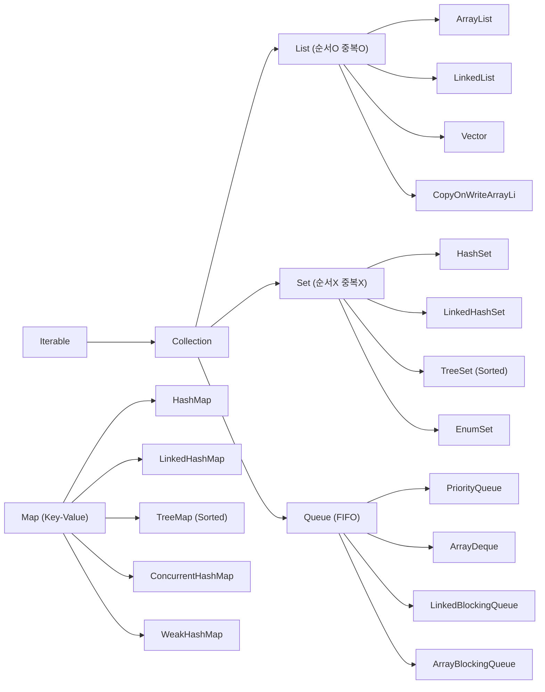

### 핵심 인터페이스 요약

| 인터페이스 | 특징 | 대표 구현체 |
|-----------|------|------------|
| `Collection` | 모든 컬렉션의 루트 | - |
| `List` | 인덱스 기반, 순서 보장, 중복 허용 | ArrayList, LinkedList |
| `Set` | 중복 불허, 순서 미보장(구현체마다 다름) | HashSet, TreeSet |
| `Queue` | FIFO 큐, offer/poll/peek | PriorityQueue, ArrayDeque |
| `Deque` | 양방향 큐 (Double Ended Queue) | ArrayDeque, LinkedList |
| `Map` | Key-Value 쌍, Key 중복 불허 | HashMap, TreeMap |

---

## 2. List 구현체

### 2-1. ArrayList

가장 많이 사용되는 List 구현체로, **내부적으로 Object 배열**을 사용합니다.

#### 내부 구조

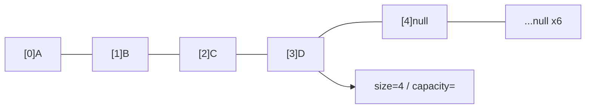

#### 동적 확장 (grow)

배열이 꽉 차면 새로운 배열을 생성하고 기존 데이터를 복사합니다.

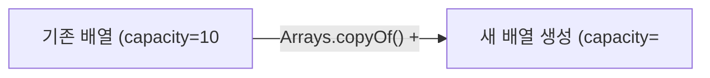

Java 소스 코드 (OpenJDK):
```java
private Object[] grow(int minCapacity) {
    int oldCapacity = elementData.length;
    if (oldCapacity > 0 || elementData != DEFAULTCAPACITY_EMPTY_ELEMENTDATA) {
        int newCapacity = ArraysSupport.newLength(oldCapacity,
                minCapacity - oldCapacity, /* minimum growth */
                oldCapacity >> 1           /* preferred growth: 1.5배 */);
        return elementData = Arrays.copyOf(elementData, newCapacity);
    } else {
        return elementData = new Object[Math.max(DEFAULT_CAPACITY, minCapacity)];
    }
}
```

#### 시간복잡도

| 연산 | 시간복잡도 | 설명 |
|------|-----------|------|
| `add(E e)` | O(1) amortized | 배열 끝에 추가. 확장 시 O(n)이지만 분할 상환 O(1) |
| `add(int i, E e)` | O(n) | i 이후 원소를 전부 한 칸 이동 |
| `get(int i)` | O(1) | 인덱스 직접 접근 |
| `remove(int i)` | O(n) | i 이후 원소를 한 칸 앞으로 이동 |
| `contains(Object o)` | O(n) | 순차 탐색 |
| `size()` | O(1) | 필드 참조 |

#### 코드 예제

```java
import java.util.ArrayList;
import java.util.List;

List<String> list = new ArrayList<>(16); // 초기 capacity 지정으로 resize 최소화
list.add("Apple");
list.add("Banana");
list.add(0, "Avocado"); // O(n): 앞 삽입은 비쌈

// 인덱스 접근 O(1)
String first = list.get(0); // "Avocado"

// 중간 삭제 O(n)
list.remove(1); // "Apple" 삭제, 이후 원소 이동

// 예측 가능한 크기라면 초기 capacity를 지정해 resize 비용 제거
List<String> optimized = new ArrayList<>(1000);
```

---

### 2-2. LinkedList

**이중 연결 리스트(Doubly Linked List)** 로 구현된 List이자 Deque입니다.

#### 내부 구조

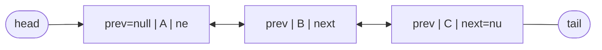

각 노드(Node)는 이전/다음 노드의 참조와 데이터를 보관합니다:

```java
// LinkedList 내부 Node 클래스 (OpenJDK)
private static class Node<E> {
    E item;
    Node<E> next;
    Node<E> prev;

    Node(Node<E> prev, E element, Node<E> next) {
        this.item = element;
        this.next = next;
        this.prev = prev;
    }
}
```

#### 시간복잡도

| 연산 | 시간복잡도 | 설명 |
|------|-----------|------|
| `addFirst(E e)` / `addLast(E e)` | O(1) | head/tail 포인터만 변경 |
| `add(int i, E e)` | O(n) | i번째 노드까지 순차 탐색 후 삽입 |
| `get(int i)` | O(n) | i번째 노드까지 순차 탐색 |
| `remove(Object o)` | O(n) | 탐색 O(n) + 포인터 변경 O(1) |
| `removeFirst()` / `removeLast()` | O(1) | head/tail 포인터만 변경 |

#### ArrayList vs LinkedList 선택 기준

```java
// LinkedList가 유리한 경우: 양 끝 삽입/삭제가 빈번할 때
Deque<String> deque = new LinkedList<>();
deque.addFirst("first");  // O(1)
deque.addLast("last");    // O(1)
deque.removeFirst();      // O(1)

// ArrayList가 유리한 경우: 랜덤 접근, 순차 읽기
List<String> list = new ArrayList<>();
String val = list.get(500); // O(1) — LinkedList라면 O(n)
```

> **실무 팁**: 대부분의 경우 ArrayList가 빠릅니다. LinkedList는 캐시 지역성(cache locality)이 나쁘고, 노드마다 prev/next 포인터 오버헤드(객체 헤더 포함 약 24~32 bytes/node)가 있습니다. 큐/덱 목적이라면 `ArrayDeque`이 더 좋습니다.

---

### 2-3. Vector

`ArrayList`와 동일한 배열 기반 구조이지만, **모든 메서드에 `synchronized`** 가 붙어 있어 스레드 안전합니다.

```java
// Vector의 add 메서드 — 메서드 전체에 synchronized
public synchronized boolean add(E e) {
    modCount++;
    add(e, elementData, elementCount);
    return true;
}
```

단점: 단일 스레드 환경에서도 락을 획득해야 하므로 `ArrayList`보다 느립니다. **Java 1.0 시대 레거시 클래스**이므로 새 코드에서는 사용을 피하세요.

---

### 2-4. CopyOnWriteArrayList

**쓰기 시 배열 전체를 복사**하는 스레드 안전 List입니다. `java.util.concurrent` 패키지에 속합니다.

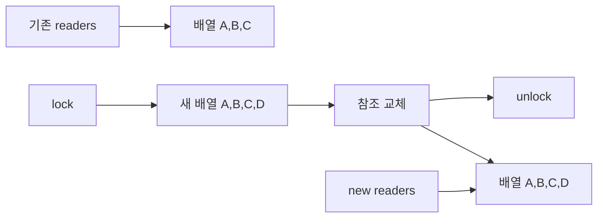

```java
import java.util.concurrent.CopyOnWriteArrayList;

CopyOnWriteArrayList<String> cowList = new CopyOnWriteArrayList<>();
cowList.add("A");

// 읽기는 락 없음 — 매우 빠름
for (String s : cowList) {
    // 반복 중 다른 스레드가 add해도 ConcurrentModificationException 없음
    System.out.println(s);
}
```

| 특성 | CopyOnWriteArrayList | Collections.synchronizedList |
|------|---------------------|------------------------------|
| 읽기 성능 | 락 없음 (매우 빠름) | 매 읽기마다 락 |
| 쓰기 성능 | 배열 전체 복사 (느림) | 락만 획득 (상대적으로 빠름) |
| 반복 안전성 | 항상 안전 (스냅샷) | 수동으로 동기화 필요 |
| 적합한 상황 | 읽기 多, 쓰기 少 | 읽기/쓰기 균형 |

---

## 3. Set 구현체

### 3-1. HashSet

**내부적으로 `HashMap`을 사용**합니다. 원소를 HashMap의 Key로, dummy 값(`PRESENT`)을 Value로 저장합니다.

```java
// HashSet 내부 (OpenJDK)
private transient HashMap<E,Object> map;
private static final Object PRESENT = new Object();

public boolean add(E e) {
    return map.put(e, PRESENT) == null;
}
```

#### equals / hashCode 계약

HashSet의 중복 판단 과정:

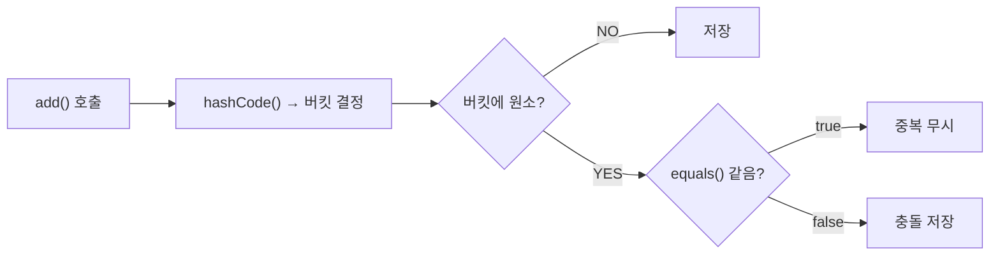

**계약(Contract)**:
- `a.equals(b)` 가 `true`이면 `a.hashCode() == b.hashCode()` 이어야 합니다.
- 역은 성립하지 않아도 됩니다 (해시 충돌 허용).

```java
// 잘못된 예: equals만 재정의하고 hashCode를 재정의하지 않음
class BadKey {
    String name;
    @Override
    public boolean equals(Object o) {
        return ((BadKey) o).name.equals(this.name);
    }
    // hashCode 미재정의 → Object의 기본 hashCode(메모리 주소 기반) 사용
    // equals는 같지만 hashCode가 달라 HashSet에 중복 저장됨!
}

Set<BadKey> set = new HashSet<>();
set.add(new BadKey("kim")); // hashCode = 1234
set.add(new BadKey("kim")); // hashCode = 5678 → 다른 버킷 → 중복 허용!
System.out.println(set.size()); // 2 (잘못된 결과)

// 올바른 예
class GoodKey {
    String name;
    @Override
    public boolean equals(Object o) {
        if (this == o) return true;
        if (!(o instanceof GoodKey)) return false;
        return name.equals(((GoodKey) o).name);
    }
    @Override
    public int hashCode() {
        return Objects.hash(name); // name 기반 hashCode
    }
}
```

#### 해시 충돌 처리 — 체이닝 → 트리화 (Java 8+)

Java 7까지는 같은 버킷에 충돌이 많아지면 연결 리스트가 길어져 탐색이 O(n)으로 악화됩니다. 특히 `hashCode()`가 잘못 구현된 클래스를 키로 사용하면 모든 원소가 같은 버킷에 몰려 HashMap이 사실상 연결 리스트처럼 동작합니다. Java 8은 이 문제를 트리화(Treeify)로 해결했습니다.

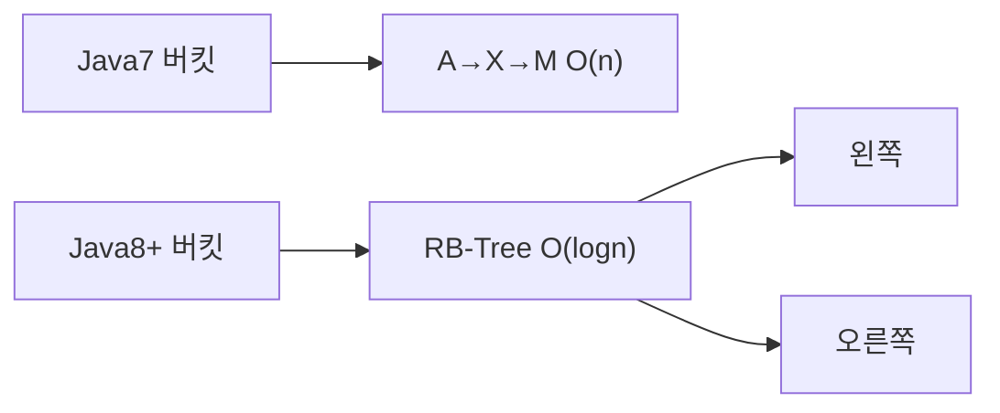

---

### 3-2. LinkedHashSet

`HashSet`을 상속하며, 내부적으로 **`LinkedHashMap`을 사용**해 **삽입 순서를 유지**합니다.

```java
Set<String> linked = new LinkedHashSet<>();
linked.add("Banana");
linked.add("Apple");
linked.add("Cherry");

System.out.println(linked); // [Banana, Apple, Cherry] — 삽입 순서 유지
// HashSet이라면: [Apple, Banana, Cherry] (순서 미보장)
```

내부적으로 이중 연결 리스트로 각 버킷의 원소들을 삽입 순서로 연결합니다.

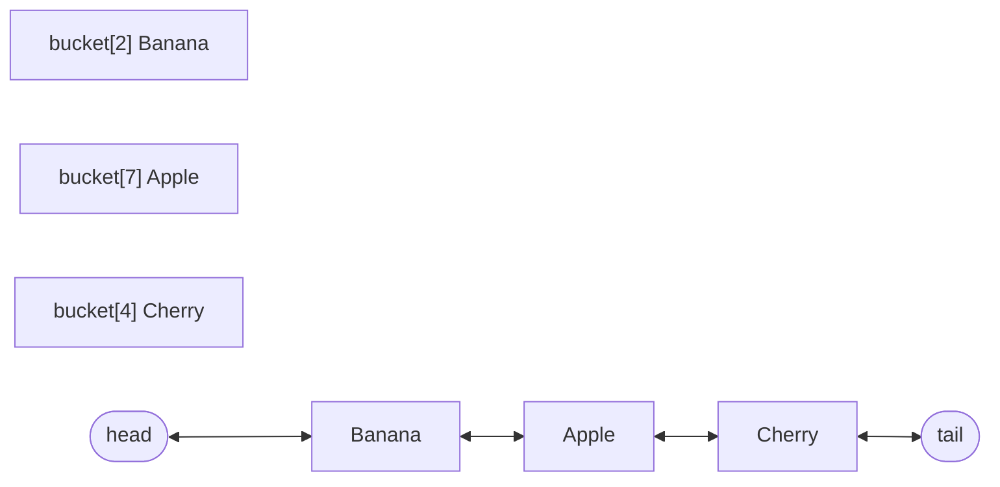

---

### 3-3. TreeSet

**Red-Black Tree** 기반의 `NavigableSet` 구현체입니다. 원소를 **항상 정렬된 상태**로 유지합니다.

#### Red-Black Tree 구조

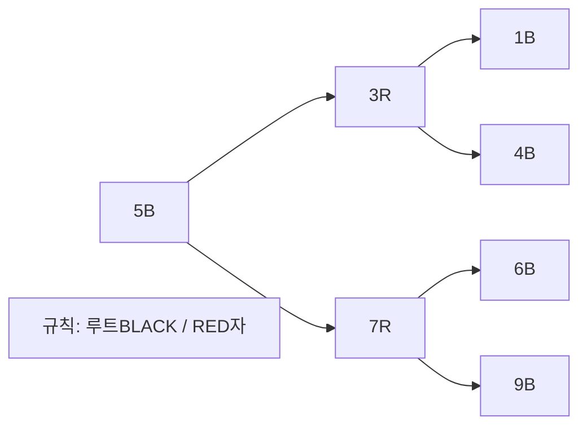

#### Comparable vs Comparator

```java
// 1. Comparable 구현 (자연 순서)
class Student implements Comparable<Student> {
    String name;
    int score;

    @Override
    public int compareTo(Student other) {
        return Integer.compare(this.score, other.score); // 점수 오름차순
    }
}

TreeSet<Student> byScore = new TreeSet<>();
byScore.add(new Student("Kim", 90));
byScore.add(new Student("Lee", 80));

// 2. Comparator 지정 (커스텀 순서)
TreeSet<String> byLength = new TreeSet<>(
    Comparator.comparingInt(String::length).thenComparing(Comparator.naturalOrder())
);
byLength.add("Banana");
byLength.add("Apple");
byLength.add("Fig");
System.out.println(byLength); // [Fig, Apple, Banana] — 길이 순
```

#### NavigableSet 범위 검색

```java
TreeSet<Integer> ts = new TreeSet<>(Set.of(1, 3, 5, 7, 9, 11));

System.out.println(ts.headSet(6));          // [1, 3, 5]      — 6 미만
System.out.println(ts.tailSet(6));          // [7, 9, 11]     — 6 이상
System.out.println(ts.subSet(3, 9));        // [3, 5, 7]      — [3, 9)
System.out.println(ts.floor(6));            // 5              — 6 이하 최대
System.out.println(ts.ceiling(6));          // 7              — 6 이상 최소
System.out.println(ts.higher(5));           // 7              — 5 초과 최소
System.out.println(ts.lower(5));            // 3              — 5 미만 최대
```

| 연산 | 시간복잡도 |
|------|-----------|
| `add`, `remove`, `contains` | O(log n) |
| `first`, `last` | O(log n) |
| `headSet`, `tailSet`, `subSet` | O(log n) (뷰 생성) |

---

### 3-4. EnumSet

**Enum 타입 전용** Set으로, 내부적으로 **비트 벡터(bit vector)** 를 사용합니다.

#### 왜 빠른가?

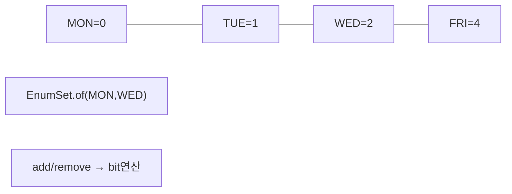

- Enum 상수가 64개 이하 → `RegularEnumSet` (long 하나)
- 65개 이상 → `JumboEnumSet` (long 배열)

```java
import java.util.EnumSet;

enum Permission { READ, WRITE, EXECUTE, DELETE }

EnumSet<Permission> adminPerms = EnumSet.allOf(Permission.class);
EnumSet<Permission> readOnly   = EnumSet.of(Permission.READ);
EnumSet<Permission> noDelete   = EnumSet.complementOf(EnumSet.of(Permission.DELETE));

// 비트 연산 기반이라 모든 연산이 O(1)
adminPerms.containsAll(readOnly); // true
```

---

## 4. Map 구현체

### 4-1. HashMap

Java 컬렉션에서 가장 많이 사용되는 Map 구현체입니다.

#### 내부 해시 버킷 구조

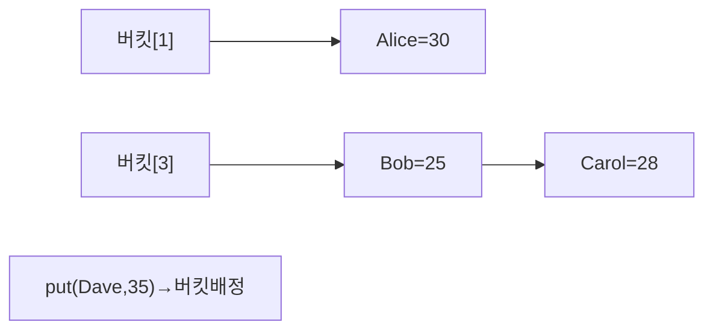

#### 초기 용량(initialCapacity)과 로드 팩터(loadFactor)

```java
// 기본값: capacity=16, loadFactor=0.75
HashMap<String, Integer> map = new HashMap<>();

// 리사이징 임계값: capacity × loadFactor = 16 × 0.75 = 12
// 원소가 12개를 초과하면 capacity를 2배(32)로 확장하고 rehashing
```

**리사이징 비용 예측이 가능하다면 초기 용량을 지정하세요:**

```java
// 1000개 원소를 저장할 예정이라면:
// capacity = ceil(1000 / 0.75) + 1 = 1335 → 다음 2의 거듭제곱 = 2048
int expectedSize = 1000;
int initialCapacity = (int) (expectedSize / 0.75) + 1;
HashMap<String, Integer> optimized = new HashMap<>(initialCapacity);
```

#### Java 8 트리화 (Treeify)

```java
// HashMap 상수
static final int TREEIFY_THRESHOLD = 8;   // 버킷 원소 8개 초과 시 트리화
static final int UNTREEIFY_THRESHOLD = 6; // 원소 6개 이하로 감소 시 복원
static final int MIN_TREEIFY_CAPACITY = 64; // 전체 capacity가 64 미만이면 트리화 대신 resize
```

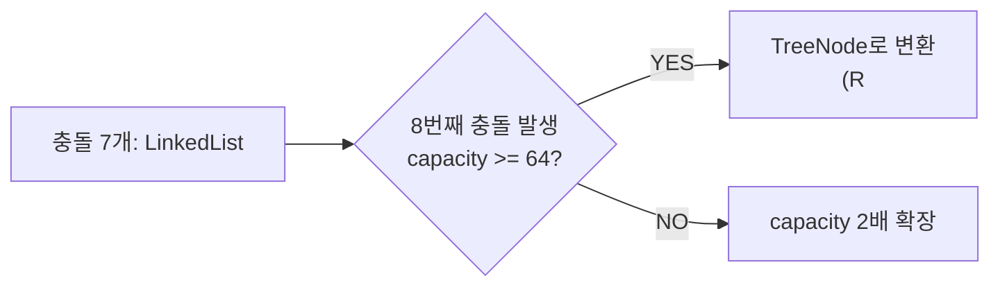

#### 시간복잡도

| 연산 | 평균 | 최악 (모든 원소 같은 버킷) |
|------|------|--------------------------|
| `put` | O(1) | O(log n) [Java 8+, 트리화 후] |
| `get` | O(1) | O(log n) |
| `remove` | O(1) | O(log n) |
| `containsKey` | O(1) | O(log n) |

```java
Map<String, Integer> wordCount = new HashMap<>();
String[] words = {"apple", "banana", "apple", "cherry", "banana", "apple"};

for (String word : words) {
    wordCount.merge(word, 1, Integer::sum); // getOrDefault + put 보다 간결
}
System.out.println(wordCount); // {apple=3, banana=2, cherry=1}

// computeIfAbsent: 키 없을 때만 계산
Map<String, List<String>> groups = new HashMap<>();
groups.computeIfAbsent("fruits", k -> new ArrayList<>()).add("apple");
groups.computeIfAbsent("fruits", k -> new ArrayList<>()).add("banana");
// groups: {fruits=[apple, banana]}
```

---

### 4-2. LinkedHashMap — LRU 캐시 구현

`HashMap`을 상속하며, 이중 연결 리스트로 **삽입 순서** 또는 **접근 순서(accessOrder)**를 유지합니다.

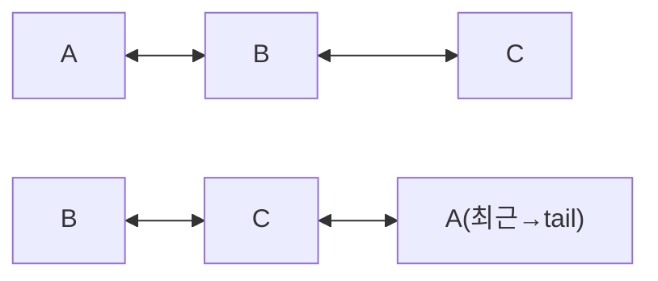

#### LRU 캐시 구현

```java
import java.util.LinkedHashMap;
import java.util.Map;

public class LRUCache<K, V> extends LinkedHashMap<K, V> {
    private final int maxSize;

    public LRUCache(int maxSize) {
        // accessOrder=true: get/put 시 해당 항목을 tail(최근)으로 이동
        super(maxSize, 0.75f, true);
        this.maxSize = maxSize;
    }

    @Override
    protected boolean removeEldestEntry(Map.Entry<K, V> eldest) {
        // 크기 초과 시 가장 오래된(head) 항목 자동 제거
        return size() > maxSize;
    }
}

LRUCache<String, String> cache = new LRUCache<>(3);
cache.put("A", "val_A");
cache.put("B", "val_B");
cache.put("C", "val_C");
cache.get("A");           // A 접근 → A가 최근으로 이동: B ↔ C ↔ A
cache.put("D", "val_D"); // 용량 초과 → 가장 오래된 B 제거: C ↔ A ↔ D
System.out.println(cache.containsKey("B")); // false (evicted)
```

---

### 4-3. TreeMap

**Red-Black Tree** 기반 `NavigableMap`으로, Key를 항상 정렬된 상태로 유지합니다.

```java
TreeMap<String, Integer> scores = new TreeMap<>();
scores.put("Charlie", 85);
scores.put("Alice", 92);
scores.put("Bob", 78);

System.out.println(scores);              // {Alice=92, Bob=78, Charlie=85} — Key 오름차순
System.out.println(scores.firstKey());  // Alice
System.out.println(scores.lastKey());   // Charlie
System.out.println(scores.floorKey("Bz")); // Bob — "Bz" 이하 최대 Key
System.out.println(scores.ceilingKey("Bz")); // Charlie — "Bz" 이상 최소 Key

// 범위 조회
Map<String, Integer> sub = scores.subMap("Alice", "Charlie"); // [Alice, Charlie)
System.out.println(sub); // {Alice=92, Bob=78}

// 내림차순
NavigableMap<String, Integer> desc = scores.descendingMap();
System.out.println(desc); // {Charlie=85, Bob=78, Alice=92}
```

---

### 4-4. ConcurrentHashMap

멀티스레드 환경에서 안전한 Map입니다.

#### Java 7: 세그먼트 락(Segment Lock)

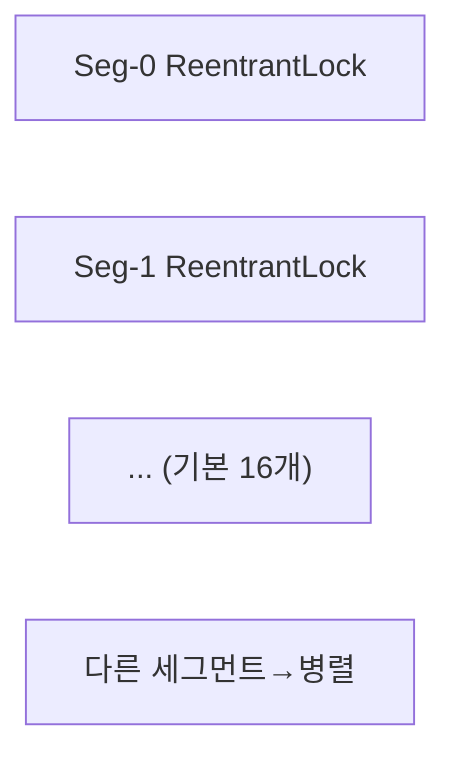

#### Java 8: CAS + synchronized (버킷 단위 락)

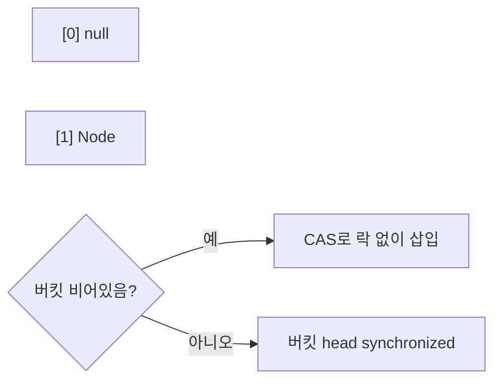

```java
import java.util.concurrent.ConcurrentHashMap;

ConcurrentHashMap<String, Integer> map = new ConcurrentHashMap<>();

// 스레드 안전한 원자적 연산
map.put("count", 0);
map.compute("count", (k, v) -> v == null ? 1 : v + 1); // 원자적
map.merge("count", 1, Integer::sum);                    // 원자적

// putIfAbsent: 키 없을 때만 삽입 (원자적)
map.putIfAbsent("new_key", 100);

// 동시성 높은 집계
long total = map.reduceValues(1, v -> (long) v, Long::sum); // 병렬 집계
```

#### Hashtable vs Collections.synchronizedMap vs ConcurrentHashMap

| 특성 | Hashtable | synchronizedMap | ConcurrentHashMap |
|------|-----------|-----------------|-------------------|
| 락 범위 | 메서드 전체 | 메서드 전체 | 버킷 단위 |
| 동시 읽기 | 불가 | 불가 | 가능 (락 없음) |
| null Key/Value | 불허 | 허용 | 불허 |
| 성능 | 낮음 | 낮음 | 높음 |
| 추천 여부 | 레거시 | 비추천 | 권장 |

---

### 4-5. WeakHashMap

Key에 **약한 참조(WeakReference)** 를 사용하는 Map입니다.

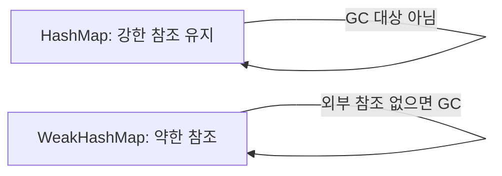

```java
import java.util.WeakHashMap;

WeakHashMap<Object, String> cache = new WeakHashMap<>();

Object key1 = new Object();
Object key2 = new Object();
cache.put(key1, "value1");
cache.put(key2, "value2");

System.out.println(cache.size()); // 2

key1 = null; // key1에 대한 강한 참조 제거
System.gc();  // GC 힌트 (보장은 아님)

// GC 후 key1 Entry가 자동 제거될 수 있음
System.out.println(cache.size()); // 1 (또는 2, GC 타이밍에 따라)
```

**주요 사용 사례**: 메타데이터 캐시 (객체에 부가 정보를 붙이되, 객체가 사라지면 정보도 자동 제거).

---

## 5. Queue / Deque

### 5-1. PriorityQueue

**최소 힙(Min-Heap)** 으로 구현된 우선순위 큐입니다. `poll()`을 호출하면 항상 **가장 작은 원소**가 반환됩니다.

#### 힙 구조 (배열로 표현)

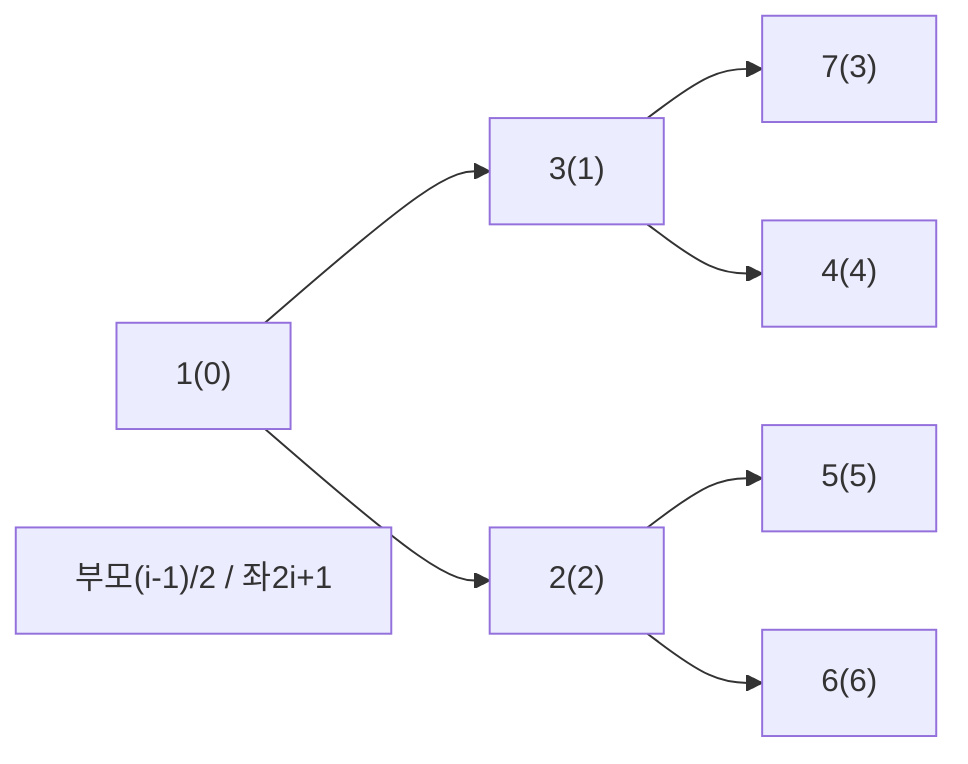

#### 주요 연산 시간복잡도

| 연산 | 시간복잡도 | 설명 |
|------|-----------|------|
| `offer(E e)` | O(log n) | 배열 끝에 삽입 후 sift-up |
| `poll()` | O(log n) | 루트 제거 후 sift-down |
| `peek()` | O(1) | 루트(최솟값) 조회만 |
| `contains(Object o)` | O(n) | 선형 탐색 |
| `remove(Object o)` | O(n) | 탐색 O(n) + sift O(log n) |

```java
import java.util.PriorityQueue;
import java.util.Collections;

// 기본: Min-Heap (오름차순)
PriorityQueue<Integer> minHeap = new PriorityQueue<>();
minHeap.offer(5);
minHeap.offer(1);
minHeap.offer(3);
System.out.println(minHeap.poll()); // 1 (최솟값)
System.out.println(minHeap.poll()); // 3

// Max-Heap (내림차순)
PriorityQueue<Integer> maxHeap = new PriorityQueue<>(Collections.reverseOrder());
maxHeap.offer(5);
maxHeap.offer(1);
maxHeap.offer(3);
System.out.println(maxHeap.poll()); // 5 (최댓값)

// 커스텀 우선순위: Task 처리 순서
record Task(String name, int priority) {}
PriorityQueue<Task> taskQueue = new PriorityQueue<>(
    Comparator.comparingInt(Task::priority)
);
taskQueue.offer(new Task("저우선", 10));
taskQueue.offer(new Task("고우선", 1));
taskQueue.offer(new Task("중우선", 5));
System.out.println(taskQueue.poll().name()); // "고우선"
```

---

### 5-2. ArrayDeque

**원형 배열(Circular Array)** 기반의 Deque(Double Ended Queue)입니다. Stack과 Queue 모두 대체 가능합니다.

#### 원형 배열 구조

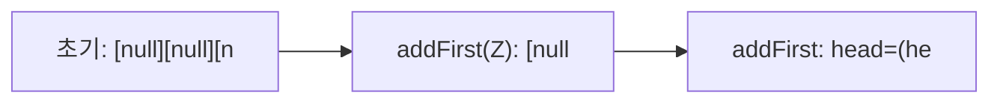

```java
import java.util.ArrayDeque;
import java.util.Deque;

// Stack으로 사용 (LIFO)
Deque<String> stack = new ArrayDeque<>();
stack.push("first");    // addFirst()
stack.push("second");   // addFirst()
System.out.println(stack.pop()); // "second" (removeFirst())

// Queue로 사용 (FIFO)
Deque<String> queue = new ArrayDeque<>();
queue.offer("first");   // addLast()
queue.offer("second");  // addLast()
System.out.println(queue.poll()); // "first" (removeFirst())

// Stack 클래스보다 ArrayDeque를 권장하는 이유:
// - Stack은 Vector 상속 → 불필요한 synchronized 오버헤드
// - ArrayDeque는 synchronized 없음 → 단일 스레드에서 더 빠름
```

---

### 5-3. 블로킹 큐 (BlockingQueue) — 생산자-소비자 패턴

`BlockingQueue` 인터페이스는 스레드 간 안전한 데이터 교환을 위한 **블로킹 연산**을 제공합니다.

#### LinkedBlockingQueue

내부적으로 **연결 리스트** 사용. 생산자/소비자 각각 별도 Lock(putLock/takeLock)으로 동시성을 높입니다.

```java
import java.util.concurrent.LinkedBlockingQueue;

// 용량 제한 있는 큐
LinkedBlockingQueue<String> queue = new LinkedBlockingQueue<>(100);

// 생산자 스레드
Thread producer = new Thread(() -> {
    try {
        for (int i = 0; i < 200; i++) {
            queue.put("item-" + i); // 큐가 가득 차면 블로킹
        }
    } catch (InterruptedException e) {
        Thread.currentThread().interrupt();
    }
});

// 소비자 스레드
Thread consumer = new Thread(() -> {
    try {
        while (true) {
            String item = queue.take(); // 큐가 비면 블로킹
            System.out.println("처리: " + item);
        }
    } catch (InterruptedException e) {
        Thread.currentThread().interrupt();
    }
});
```

#### ArrayBlockingQueue

내부적으로 **고정 크기 배열** 사용. 단일 Lock 사용(LinkedBlockingQueue보다 처리량이 낮을 수 있음).

```java
import java.util.concurrent.ArrayBlockingQueue;

// 반드시 초기 용량 지정 필요 (고정 크기)
ArrayBlockingQueue<Integer> queue = new ArrayBlockingQueue<>(50);

// offer: 즉시 반환 (타임아웃 버전도 있음)
boolean added = queue.offer(42);                          // 가득 차면 false
boolean addedWithTimeout = queue.offer(42, 1, TimeUnit.SECONDS); // 1초 대기

// poll: 즉시 반환 (타임아웃 버전도 있음)
Integer val = queue.poll();                               // 비었으면 null
Integer valWithTimeout = queue.poll(1, TimeUnit.SECONDS); // 1초 대기
```

#### BlockingQueue 메서드 비교

| 동작 | 예외 발생 | 특수 값 반환 | 블로킹 | 타임아웃 |
|------|----------|------------|--------|--------|
| 삽입 | `add(e)` | `offer(e)` | `put(e)` | `offer(e, t, unit)` |
| 제거 | `remove()` | `poll()` | `take()` | `poll(t, unit)` |
| 조회 | `element()` | `peek()` | - | - |

---

## 6. 시간복잡도 총정리 표

### List

| 구현체 | add(끝) | add(중간) | get(index) | remove(index) | contains |
|--------|---------|----------|-----------|--------------|---------|
| ArrayList | O(1)* | O(n) | O(1) | O(n) | O(n) |
| LinkedList | O(1) | O(n) | O(n) | O(n) | O(n) |
| CopyOnWriteArrayList | O(n) | O(n) | O(1) | O(n) | O(n) |

*amortized (분할 상환)

### Set

| 구현체 | add | remove | contains | 순서 |
|--------|-----|--------|---------|------|
| HashSet | O(1)* | O(1)* | O(1)* | X |
| LinkedHashSet | O(1)* | O(1)* | O(1)* | 삽입 순서 |
| TreeSet | O(log n) | O(log n) | O(log n) | 정렬 순서 |
| EnumSet | O(1) | O(1) | O(1) | Enum 선언 순서 |

*평균 (최악 O(log n), Java 8+ 트리화)

### Map

| 구현체 | put | get | remove | containsKey | 순서 |
|--------|-----|-----|--------|------------|------|
| HashMap | O(1)* | O(1)* | O(1)* | O(1)* | X |
| LinkedHashMap | O(1)* | O(1)* | O(1)* | O(1)* | 삽입/접근 순서 |
| TreeMap | O(log n) | O(log n) | O(log n) | O(log n) | Key 정렬 |
| ConcurrentHashMap | O(1)* | O(1)* | O(1)* | O(1)* | X |
| WeakHashMap | O(1)* | O(1)* | O(1)* | O(1)* | X |

### Queue / Deque

| 구현체 | offer | poll | peek | contains |
|--------|-------|------|------|---------|
| PriorityQueue | O(log n) | O(log n) | O(1) | O(n) |
| ArrayDeque | O(1)* | O(1) | O(1) | O(n) |
| LinkedBlockingQueue | O(1) | O(1) | O(1) | O(n) |
| ArrayBlockingQueue | O(1) | O(1) | O(1) | O(n) |

---

## 7. 동시성 컬렉션 정리

### Collections.synchronizedXxx vs Concurrent 계열

```java
// 방법 1: Collections.synchronizedXxx 래퍼
List<String>  syncList = Collections.synchronizedList(new ArrayList<>());
Map<String, Integer> syncMap = Collections.synchronizedMap(new HashMap<>());

// 반복 시 반드시 수동 동기화 필요!
synchronized (syncList) {
    Iterator<String> it = syncList.iterator();
    while (it.hasNext()) {
        System.out.println(it.next());
    }
}

// 방법 2: Concurrent 계열 (권장)
import java.util.concurrent.*;

ConcurrentHashMap<String, Integer> concMap = new ConcurrentHashMap<>();
CopyOnWriteArrayList<String> cowList = new CopyOnWriteArrayList<>();
ConcurrentLinkedQueue<String> clQueue = new ConcurrentLinkedQueue<>();

// Concurrent 계열은 반복 중 수동 동기화 불필요 (약한 일관성 보장)
for (String s : cowList) {
    System.out.println(s); // 안전
}
```

### 동시성 컬렉션 선택 가이드

| 상황 | 권장 컬렉션 |
|------|------------|
| 멀티스레드 Map | `ConcurrentHashMap` |
| 읽기 多, 쓰기 少 List | `CopyOnWriteArrayList` |
| 생산자-소비자 큐 (유계) | `ArrayBlockingQueue` |
| 생산자-소비자 큐 (무계) | `LinkedBlockingQueue` |
| 동시성 단순 큐 | `ConcurrentLinkedQueue` |
| 동시성 덱 | `ConcurrentLinkedDeque` |
| 동시성 우선순위 큐 | `PriorityBlockingQueue` |

---

## 8. 실무 선택 가이드

### List 선택

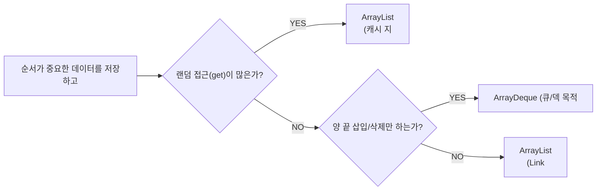

### Set 선택

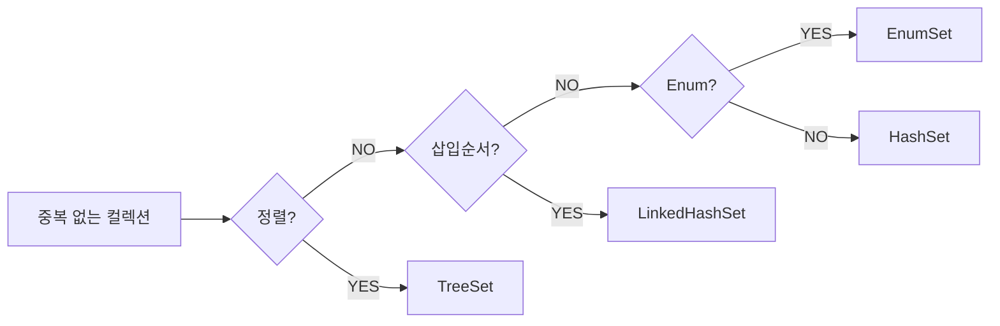

### Map 선택

```mermaid
graph LR
    M0["Key-Value 저장"] --> M1{"멀티스레드?"}
    M1 -->|YES| M2["ConcurrentHashMap"]
    M1 -->|NO| M3{"Key 정렬?"}
    M3 -->|YES| M4["TreeMap"]
    M3 -->|NO| M5{"순서 보존?"}
    M5 -->|YES| M6["LinkedHashMap (LRU"]
    M5 -->|NO| M7{"Key=Enum?"}
    M7 -->|YES| M8["EnumMap (빠름)"]
    M7 -->|NO| M9["HashMap (기본)"]
```

### 상황별 선택 예제

```java
// 1. 대용량 데이터 순차 처리 → ArrayList
List<Record> records = new ArrayList<>(100_000);
// 이유: 연속 메모리 → CPU 캐시 적중률 높음

// 2. 이력 순서 보존 로그 → LinkedHashMap
Map<String, String> auditLog = new LinkedHashMap<>();
auditLog.put("2026-01-01", "로그인");
auditLog.put("2026-01-02", "수정");
// 삽입 순서대로 이터레이션 보장

// 3. 멤버십 체크 (수백만 건) → HashSet
Set<Long> blockedUserIds = new HashSet<>(1_000_000);
boolean isBlocked = blockedUserIds.contains(userId); // O(1)

// 4. IP 대역 범위 검색 → TreeMap
TreeMap<String, String> ipRoutes = new TreeMap<>();
ipRoutes.put("10.0.0.0", "route_A");
ipRoutes.put("192.168.0.0", "route_B");
String route = ipRoutes.floorEntry("10.0.1.5").getValue(); // 범위 매칭

// 5. 스레드 풀 작업 큐 → ArrayBlockingQueue
BlockingQueue<Runnable> workQueue = new ArrayBlockingQueue<>(200);
ThreadPoolExecutor pool = new ThreadPoolExecutor(
    4, 8, 60L, TimeUnit.SECONDS, workQueue
);

// 6. 권한 집합 → EnumSet
EnumSet<Permission> userPerms = EnumSet.of(Permission.READ, Permission.WRITE);
if (userPerms.contains(Permission.DELETE)) { /* ... */ }

// 7. 캐시 (메모리 민감) → WeakHashMap
WeakHashMap<Object, CachedData> cache = new WeakHashMap<>();
// 키 객체가 GC되면 캐시 항목도 자동 제거

// 8. 이벤트 리스너 목록 (읽기 多) → CopyOnWriteArrayList
CopyOnWriteArrayList<EventListener> listeners = new CopyOnWriteArrayList<>();
// 리스너 등록/해제는 드물고 이벤트 발생(읽기)은 빈번
```

### 컬렉션 사용 시 자주 하는 실수

```java
// 실수 1: for 루프 안에서 List.remove()
// → ConcurrentModificationException 발생
List<String> list = new ArrayList<>(Arrays.asList("A", "B", "C"));
for (String s : list) {
    if (s.equals("B")) list.remove(s); // 위험!
}
// 올바른 방법: Iterator 또는 removeIf
list.removeIf(s -> s.equals("B")); // Java 8+

// 실수 2: HashMap에 가변 객체를 Key로 사용
Map<List<Integer>, String> map = new HashMap<>();
List<Integer> key = new ArrayList<>(List.of(1, 2, 3));
map.put(key, "value");
key.add(4); // key 변경 → hashCode 변경 → map에서 찾을 수 없음!
map.get(key); // null 반환

// 실수 3: Arrays.asList() 결과에 add/remove
List<String> fixed = Arrays.asList("A", "B", "C");
fixed.add("D"); // UnsupportedOperationException!
// 올바른 방법:
List<String> mutable = new ArrayList<>(Arrays.asList("A", "B", "C"));

// 실수 4: HashMap null 처리 누락
Map<String, Integer> map2 = new HashMap<>();
int count = map2.get("key"); // NullPointerException! (auto-unboxing)
// 올바른 방법:
int count2 = map2.getOrDefault("key", 0);
```

---

## 왜 이 기술인가?

Java Collections Framework를 사용하는 이유는 **인터페이스-구현체 분리 설계**와 **풍부한 알고리즘 지원** 때문이다.

| 대안 | 비교 | 결론 |
|------|------|------|
| 배열(Array) | 크기 고정, 제네릭 미지원, 유틸 메서드 부재 | 성능 극한 상황에서만 선택 |
| Java Collections | 크기 동적, 제네릭, Iterator/Stream 통합 | 일반 업무 로직의 표준 |
| Apache Commons Collections | Java 표준에 없는 멀티맵·양방향맵 제공 | 특수 자료구조 필요 시 추가 |
| Eclipse Collections | 원시 타입 컬렉션, 메모리 효율 우선 | 대용량 숫자 처리 시 유리 |
| Guava ImmutableCollections | 불변 컬렉션, 방어적 복사 제거 | 공유 상태 안전 보장 필요 시 |

**선택 가이드**
- 순서 보장 + 랜덤 접근 → `ArrayList`
- 빠른 삽입/삭제(중간) → `LinkedList` (단, 캐시 미스 주의)
- 중복 제거 + 순서 불필요 → `HashSet`
- 정렬 유지 → `TreeSet` / `TreeMap`
- 삽입 순서 유지 Map → `LinkedHashMap`
- 멀티스레드 읽기 압도적 → `CopyOnWriteArrayList`
- 멀티스레드 쓰기 빈번 → `ConcurrentHashMap`

---

## 실무에서 자주 하는 실수

### 실수 1: ArrayList를 무조건 기본 컬렉션으로 사용

ArrayList는 인덱스 조회(O(1))에 강하지만 중간 삽입/삭제(O(n))가 느립니다. 큐나 덱(deque) 용도로 ArrayList를 사용하면 매 연산마다 배열 이동이 발생합니다.

```java
// 나쁜 예: ArrayList로 큐 구현
List<Task> queue = new ArrayList<>();
queue.add(task);           // 뒤에 추가 O(1)
queue.remove(0);           // 앞에서 제거 O(n) — 전체 이동 발생!

// 좋은 예: ArrayDeque 사용
Deque<Task> queue = new ArrayDeque<>();
queue.offer(task);         // O(1)
queue.poll();              // O(1)
```

### 실수 2: HashMap의 초기 용량을 지정하지 않음

HashMap은 기본 초기 용량이 16이고 load factor가 0.75입니다. 저장할 데이터 수를 미리 알고 있다면 초기 용량을 지정해 리해시(rehash)를 방지해야 합니다.

```java
// 나쁜 예: 1000개를 저장할 Map을 기본 용량으로 생성
Map<String, User> users = new HashMap<>(); // 16 → 32 → 64 → ... 리해시 반복

// 좋은 예: 예상 크기 / 0.75 + 1 로 초기 용량 지정
Map<String, User> users = new HashMap<>(1334); // 1000 / 0.75 ≈ 1334
```

### 실수 3: 멀티스레드 환경에서 일반 HashMap 사용

HashMap은 스레드 안전하지 않습니다. 동시 수정 시 무한 루프(Java 7)나 데이터 손실(Java 8+)이 발생할 수 있습니다.

```java
// 위험: 멀티스레드에서 공유 HashMap
Map<String, Integer> counter = new HashMap<>();
// 여러 스레드가 동시에 put() 호출 → 데이터 손실

// 개선: ConcurrentHashMap + 원자적 업데이트
Map<String, Integer> counter = new ConcurrentHashMap<>();
counter.merge(key, 1, Integer::sum);

// 단순 카운터는 LongAdder가 더 효율적
ConcurrentHashMap<String, LongAdder> counter2 = new ConcurrentHashMap<>();
counter2.computeIfAbsent(key, k -> new LongAdder()).increment();
```

### 실수 4: LinkedList를 랜덤 접근에 사용

LinkedList는 순차 탐색(O(n))만 지원합니다. `get(index)` 호출 시 head부터 순서대로 탐색하므로 대용량 리스트에서 극도로 느립니다.

```java
// 나쁜 예: LinkedList에서 인덱스 접근
List<String> list = new LinkedList<>();
// 10만 건 추가 후
String item = list.get(50000); // head부터 50000번 탐색 O(n)

// 좋은 예: 인덱스 접근이 필요하면 ArrayList
List<String> list2 = new ArrayList<>();
String item2 = list2.get(50000); // 배열 인덱스 직접 접근 O(1)
```

### 실수 5: Collections.unmodifiableList()를 불변으로 착각

`Collections.unmodifiableList()`는 뷰(view)를 반환합니다. 원본 리스트가 변경되면 뷰도 변경됩니다. 진정한 불변 컬렉션은 `List.copyOf()`를 사용해야 합니다.

```java
List<String> original = new ArrayList<>(Arrays.asList("a", "b", "c"));
List<String> view = Collections.unmodifiableList(original);

original.add("d");
System.out.println(view.size()); // 4 — 뷰도 변경됨!

// 진정한 불변 복사본 (Java 10+)
List<String> immutable = List.copyOf(original);
original.add("e");
System.out.println(immutable.size()); // 4 — 변경 없음
```

---


## 면접 포인트

**Q1. ArrayList와 LinkedList의 시간복잡도 차이를 설명하고, 어떤 상황에서 각각을 선택하나요?**
> ArrayList는 인덱스 접근 O(1), 중간 삽입/삭제 O(n). LinkedList는 중간 삽입/삭제 O(1)(노드 참조 시), 인덱스 접근 O(n). 실무에서는 캐시 지역성(cache locality) 때문에 LinkedList가 이론상 유리한 상황에서도 ArrayList가 더 빠른 경우가 많다. 중간 삽입이 정말 빈번하다면 LinkedList보다 `ArrayDeque`나 배치 처리를 먼저 고려한다.

**Q2. HashMap의 내부 동작 원리와 Java 8에서 바뀐 점은?**
> key.hashCode()로 버킷 인덱스 계산 → 같은 버킷에 충돌 시 연결 리스트로 체이닝. Java 8부터 같은 버킷의 엔트리가 8개 초과 시 Red-Black Tree로 변환(treeifyBin)해 최악 탐색이 O(n)→O(log n)으로 개선됨. loadFactor 기본값 0.75는 시간-공간 트레이드오프의 실험적 최적값.

**Q3. ConcurrentHashMap과 Collections.synchronizedMap의 차이점은?**
> `synchronizedMap`은 모든 연산에 단일 락(map 전체) → 동시성 낮음. `ConcurrentHashMap`은 Java 8부터 버킷 레벨 CAS + synchronized(해당 버킷만)로 세분화 → 읽기는 락 없음, 쓰기는 버킷 단위 락. 복합 연산(check-then-act)은 `computeIfAbsent`, `merge` 등 원자적 메서드 사용 필수.

**Q4. HashSet의 중복 제거 원리를 설명하세요. equals()만 재정의하면 되나요?**
> HashSet은 내부적으로 HashMap 사용. 저장 시 hashCode()로 버킷 결정 후 equals()로 동등성 비교. hashCode()를 재정의하지 않으면 두 객체가 equals()로 같아도 다른 버킷에 들어가 중복 제거 실패. **반드시 hashCode()와 equals()를 함께 재정의**해야 한다.

**Q5. List.of()와 new ArrayList()의 차이는 무엇인가요?**
> `List.of()`는 Java 9+ 불변 리스트 — 수정 시 UnsupportedOperationException. null 원소 불허. 방어적 복사 없이 공유해도 안전. `Collections.unmodifiableList()`는 원본 리스트의 뷰(원본 변경 시 함께 변경). 진정한 불변이 필요하면 `List.copyOf()` 또는 Guava `ImmutableList.copyOf()` 사용.

---

## 극한 시나리오

### 100 TPS (소규모 서비스)

이 규모에서는 컬렉션 선택이 성능에 미치는 영향이 크지 않습니다. 코드 가독성과 안전성을 우선시하고, 기본 구현체(`ArrayList`, `HashMap`, `HashSet`)를 사용하면 충분합니다. 동시성 컬렉션도 필요 없습니다.

```java
// 100 TPS: 단순 HashMap으로 충분, 초기 capacity 지정으로 resize 비용 제거
Map<String, UserSession> sessions = new HashMap<>(256); // 예상 동시 세션 수
List<Order> pendingOrders = new ArrayList<>(64);
Set<String> processedIds = new HashSet<>(128);
```

### 10,000 TPS (중규모 서비스)

멀티스레드 환경에서 컬렉션이 공유되기 시작합니다. `HashMap` 대신 `ConcurrentHashMap`이 필요하며, 읽기/쓰기 패턴에 따라 `CopyOnWriteArrayList`를 검토합니다. 초기 capacity 설정이 resize 비용을 줄이는 데 중요해집니다.

```java
// 10K TPS: 동시성 컬렉션 + 초기 용량 최적화

// 세션 저장소 — 스레드 안전 필수
ConcurrentHashMap<String, Session> sessionStore =
    new ConcurrentHashMap<>(4096); // 예상 동시 세션에 맞게 초기화

// 원자적 집계 — 일반 Map은 race condition 발생
sessionStore.merge(userId, newSession, (old, neu) -> neu); // 원자적 교체

// 이벤트 리스너 — 읽기(이벤트 발행)가 쓰기(등록/해제)보다 압도적으로 많음
CopyOnWriteArrayList<EventListener> listeners = new CopyOnWriteArrayList<>();
// 이벤트 발행 시 락 없이 읽기 → 10K TPS에서도 병목 없음

// 캐시 크기 제한 — LinkedHashMap LRU로 메모리 통제
Map<Long, ProductInfo> productCache = Collections.synchronizedMap(
    new LinkedHashMap<Long, ProductInfo>(1024, 0.75f, true) {
        @Override
        protected boolean removeEldestEntry(Map.Entry<Long, ProductInfo> eldest) {
            return size() > 1000; // 최대 1000개 유지
        }
    }
);
```

### 100,000 TPS (대규모 서비스)

단일 JVM의 인메모리 컬렉션만으로는 상태를 관리하기 어렵습니다. `ConcurrentHashMap`의 세밀한 설정과 lock-free 연산이 필수이며, 대용량 집합 조회는 `BloomFilter` 같은 확률적 자료구조를 도입해야 합니다.

```java
// 100K TPS: 세밀한 동시성 제어

// concurrencyLevel 힌트 제공 (Java 8+에서는 무시되지만 명시적 문서화 효과)
ConcurrentHashMap<String, AtomicLong> counters =
    new ConcurrentHashMap<>(1024, 0.75f, 64); // 64개 동시 쓰기 예상

// compute()로 원자적 업데이트 — synchronized 없이 안전
counters.compute("api.calls", (k, v) -> v == null ? new AtomicLong(1) : v);
counters.get("api.calls").incrementAndGet(); // lock-free increment

// 차단 목록 조회 (수백만 건) — HashSet은 메모리 사용量이 큼
// Guava BloomFilter: 메모리 1/10, 오탐률 1% 허용 시
// BloomFilter<String> blocklist = BloomFilter.create(
//     Funnels.stringFunnel(StandardCharsets.UTF_8), 10_000_000, 0.01);

// 핫 파티션 방지 — 키에 샤딩 적용
int shardCount = 16;
List<ConcurrentHashMap<String, Object>> shards = IntStream.range(0, shardCount)
    .mapToObj(i -> new ConcurrentHashMap<String, Object>(256))
    .collect(Collectors.toList());
// 특정 키가 한 Map에 집중되지 않도록 분산
ConcurrentHashMap<String, Object> getShard(String key) {
    return shards.get(Math.abs(key.hashCode()) % shardCount);
}
```

100K TPS를 넘으면 인메모리 컬렉션의 한계를 인식해야 합니다. 세션은 Redis, 메시지는 Kafka, 통계 집계는 별도 스트림 처리 플랫폼(Flink, Spark)으로 외부화하는 아키텍처가 필요합니다.

---
## 요약

Java 컬렉션 프레임워크는 **인터페이스-구현체 분리 원칙**을 따르므로, 변수 타입은 인터페이스(`List`, `Map`, `Set`)로 선언하고 구현체는 필요에 따라 교체하는 것이 좋은 설계입니다.

```java
// 좋은 예: 인터페이스로 선언
List<String> list = new ArrayList<>();
Map<String, Integer> map = new HashMap<>();
Set<String> set = new HashSet<>();

// 나쁜 예: 구현체로 선언 (불필요한 결합도)
ArrayList<String> list2 = new ArrayList<>(); // 피하세요
```

성능 최적화가 필요하다면 **초기 capacity 지정**, **적절한 구현체 선택**, **불필요한 박싱/언박싱 제거** 순서로 접근하는 것을 권장합니다.
