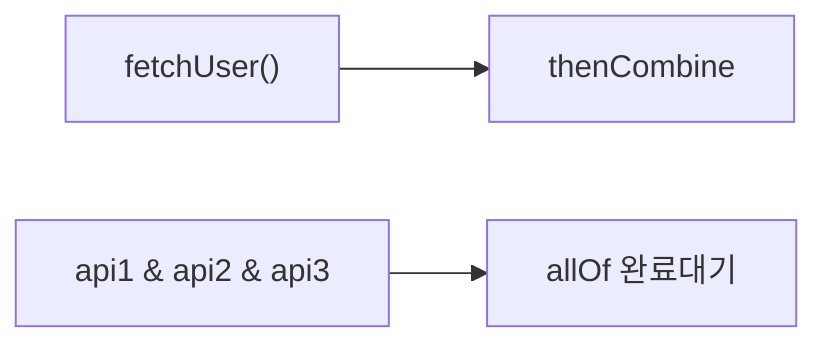

상품 정보, 재고, 가격을 각각 다른 API에서 가져와야 한다. 순차적으로 호출하면 300ms + 200ms + 150ms = 650ms가 걸린다. 병렬로 처리하면 300ms면 된다. CompletableFuture가 이 병렬 조합을 깔끔하게 표현해준다.

> **비유로 먼저 이해하기**: CompletableFuture는 배달앱 주문과 같다. 주문을 넣고(비동기 작업 시작) 다른 일을 하다가, 도착 알림이 오면(콜백) 그때 받으면 된다. 피자와 치킨을 동시에 시키고(병렬 실행) 둘 다 도착하면 파티를 시작하는(allOf) 것도 가능하다.

`CompletableFuture`는 Java 8에서 도입된 비동기 프로그래밍 API다. 기존 `Future`의 한계를 극복하고, 비동기 작업의 체이닝·조합·예외처리를 선언적으로 표현할 수 있다.

---

## Future의 한계

Java 5에서 도입된 `Future`는 비동기 작업의 결과를 나타내는 인터페이스지만, 여러 한계가 있다.

기존 `Future`는 결과를 얻으려면 반드시 `get()`을 호출해야 하며, 이 호출은 결과가 준비될 때까지 현재 스레드를 완전히 차단한다. 마치 배달을 시켜놓고 문 앞에서 꼼짝도 않고 기다리는 것과 같다.

```java
ExecutorService executor = Executors.newFixedThreadPool(4);

Future<String> future = executor.submit(() -> {
    Thread.sleep(1000);
    return "결과";
});

// 한계 1: get()이 블로킹 — 결과를 기다리는 동안 현재 스레드 멈춤
String result = future.get(); // 블로킹

// 한계 2: 취소 외에 완료 통보 수단 없음 (콜백 불가)
// 한계 3: 예외 처리가 불편 (ExecutionException으로 래핑)
// 한계 4: 여러 Future를 조합하는 API 없음
// 한계 5: 수동으로 완료 처리 불가
```

**핵심 문제**: 비동기로 시작했지만 결국 동기적으로 기다려야 하므로 병렬 처리의 이점이 사라진다.

---

## CompletableFuture 동작 원리

`CompletableFuture`는 비동기 작업의 결과를 미래에 "완성"할 수 있는 컨테이너다. 작업이 완료되기 전에도 다음에 할 일(콜백)을 미리 등록해 둘 수 있다.

```mermaid
flowchart LR
    A["supplyAsync()"] --> B["작업 실행 중"]
    B --> C{"완료?"}
    C -->|"성공"| D["thenApply/th..|"실패"| E["exceptionally/hand"]
    D --> F["최종 결과"]
    E --> F
```

1️⃣ **비캡처링 vs 캡처링**: 외부 변수를 참조하지 않는 람다(비캡처링)는 JVM이 인스턴스를 재사용할 수 있다. 외부 변수를 캡처하면 매번 새 인스턴스가 생성된다.

2️⃣ **ForkJoinPool**: 기본 Executor는 `ForkJoinPool.commonPool()`이다. CPU 코어 수 - 1개의 스레드를 사용하므로 I/O 바운드 작업에는 적합하지 않다.

---

## CompletableFuture 생성

### 기본 생성

```java
// 1. 이미 완료된 Future (값이 이미 있는 경우)
CompletableFuture<String> completed = CompletableFuture.completedFuture("즉시 결과");

// 2. 실패한 Future
CompletableFuture<String> failed = CompletableFuture.failedFuture(new RuntimeException("실패"));

// 3. 비동기 실행 — 반환값 없음 (ForkJoinPool.commonPool() 사용)
CompletableFuture<Void> runAsync = CompletableFuture.runAsync(() -> {
    System.out.println("비동기 실행");
});

// 4. 비동기 실행 — 반환값 있음
CompletableFuture<String> supplyAsync = CompletableFuture.supplyAsync(() -> {
    return "비동기 결과";
});

// 5. 커스텀 Executor 지정 (권장)
ExecutorService executor = Executors.newFixedThreadPool(10);
CompletableFuture<String> withExecutor = CompletableFuture.supplyAsync(() -> {
    return "커스텀 스레드 풀 결과";
}, executor);
```

### 수동 완료

```java
CompletableFuture<String> future = new CompletableFuture<>();

// 다른 곳에서 완료 처리
executor.submit(() -> {
    try {
        String result = doWork();
        future.complete(result);       // 정상 완료
    } catch (Exception e) {
        future.completeExceptionally(e); // 예외로 완료
    }
});

// 타임아웃 후 기본값으로 완료 (Java 9+)
future.completeOnTimeout("기본값", 3, TimeUnit.SECONDS);
```

---

## 체이닝 (Chaining)

체이닝의 핵심은 각 단계가 완료된 후 자동으로 다음 단계가 실행된다는 점이다. 마치 파이프라인처럼 데이터가 변환되며 흐른다.

### thenApply — 결과 변환 (동기)

`thenApply`는 이전 단계와 **같은 스레드**에서 실행된다. 단순한 변환 작업에 적합하다.

```java
CompletableFuture<String> future = CompletableFuture
    .supplyAsync(() -> fetchUserId())        // Long 반환
    .thenApply(id -> "USER-" + id)          // Long → String 변환 (같은 스레드)
    .thenApply(String::toUpperCase);         // String → String 변환

String result = future.get();
```

### thenApplyAsync — 결과 변환 (비동기)

```java
CompletableFuture<String> future = CompletableFuture
    .supplyAsync(() -> fetchUserId())
    .thenApplyAsync(id -> callExternalApi(id), executor); // 별도 스레드에서 변환
```

### thenAccept — 결과 소비 (반환값 없음)

```java
CompletableFuture.supplyAsync(() -> fetchUser(1L))
    .thenAccept(user -> log.info("조회된 사용자: {}", user.getName()));
// Void 반환
```

### thenRun — 완료 후 실행 (결과 무관)

```java
CompletableFuture.supplyAsync(() -> processData())
    .thenRun(() -> log.info("처리 완료"));
```

### thenCompose — 비동기 작업 평탄화 (flatMap)

`thenApply`로 비동기 메서드를 연결하면 `CompletableFuture<CompletableFuture<T>>`라는 중첩 구조가 된다. `thenCompose`는 이를 평탄화한다.

```java
// 잘못된 방법: thenApply로 중첩 Future 발생
CompletableFuture<CompletableFuture<Order>> nested =
    CompletableFuture.supplyAsync(() -> fetchUserId())
        .thenApply(id -> fetchOrderAsync(id)); // CompletableFuture<CompletableFuture<Order>>

// 올바른 방법: thenCompose로 평탄화
CompletableFuture<Order> flat =
    CompletableFuture.supplyAsync(() -> fetchUserId())
        .thenCompose(id -> fetchOrderAsync(id)); // CompletableFuture<Order>
```

**핵심**: `thenApply`는 `Stream.map()`, `thenCompose`는 `Stream.flatMap()`에 대응한다.

**실전 체이닝 예시**
```java
CompletableFuture<OrderConfirmation> orderFuture = CompletableFuture
    .supplyAsync(() -> validateUser(userId), executor)         // 사용자 검증
    .thenCompose(user -> reserveInventory(user, productId))    // 재고 예약
    .thenCompose(reservation -> processPayment(reservation))   // 결제 처리
    .thenApply(payment -> createConfirmation(payment))         // 확인서 생성
    .thenCompose(confirmation -> sendNotification(confirmation) // 알림 발송
        .thenApply(v -> confirmation));                        // 원래 결과 유지

OrderConfirmation result = orderFuture.get(10, TimeUnit.SECONDS);
```

---

## 예외 처리

### exceptionally — 예외 발생 시 기본값 반환

예외가 발생했을 때만 실행된다. 성공 시에는 원래 값이 그대로 전파된다.

```java
CompletableFuture<String> future = CompletableFuture
    .supplyAsync(() -> {
        if (Math.random() > 0.5) throw new RuntimeException("랜덤 실패");
        return "성공";
    })
    .exceptionally(ex -> {
        log.error("실패: {}", ex.getMessage());
        return "기본값"; // 예외 대신 반환할 값
    });
```

### handle — 성공/실패 모두 처리

```java
CompletableFuture<String> future = CompletableFuture
    .supplyAsync(() -> riskyOperation())
    .handle((result, ex) -> {
        if (ex != null) {
            log.error("실패", ex);
            return "기본값";
        }
        return result.toUpperCase(); // 성공 시 변환
    });
```

### whenComplete — 결과를 변경하지 않고 부수효과 처리

```java
CompletableFuture<String> future = CompletableFuture
    .supplyAsync(() -> fetchData())
    .whenComplete((result, ex) -> {
        if (ex != null) {
            metricsService.recordFailure("fetchData");
        } else {
            metricsService.recordSuccess("fetchData");
        }
        // 결과를 변경하지 않음 — 원래 result/ex가 그대로 전파됨
    });
```

### 예외 복구 체이닝

```java
CompletableFuture<User> future = CompletableFuture
    .supplyAsync(() -> fetchFromPrimaryDB(userId))
    .exceptionallyCompose(ex -> {                         // Java 12+
        log.warn("Primary DB 실패, 폴백 시도");
        return CompletableFuture.supplyAsync(() -> fetchFromSecondaryDB(userId));
    })
    .exceptionally(ex -> {
        log.error("Secondary DB도 실패");
        return User.anonymous();
    });
```

---

## 조합 (Combining)

병렬 실행과 결과 조합이 CompletableFuture의 가장 강력한 기능이다.



### thenCombine — 두 Future 결과 합치기

```java
CompletableFuture<String> userFuture =
    CompletableFuture.supplyAsync(() -> fetchUser(userId));   // 병렬 실행

CompletableFuture<List<Order>> orderFuture =
    CompletableFuture.supplyAsync(() -> fetchOrders(userId)); // 병렬 실행

// 두 결과가 모두 완료되면 합침
CompletableFuture<UserWithOrders> combined = userFuture.thenCombine(
    orderFuture,
    (user, orders) -> new UserWithOrders(user, orders)
);
```

### allOf — 모든 Future 완료 대기

```java
CompletableFuture<String> f1 = CompletableFuture.supplyAsync(() -> callApi1());
CompletableFuture<String> f2 = CompletableFuture.supplyAsync(() -> callApi2());
CompletableFuture<String> f3 = CompletableFuture.supplyAsync(() -> callApi3());

// 모두 완료될 때까지 대기 (반환값 없음)
CompletableFuture<Void> all = CompletableFuture.allOf(f1, f2, f3);

// 더 깔끔한 방법
List<CompletableFuture<String>> futures = List.of(f1, f2, f3);
CompletableFuture<List<String>> results = CompletableFuture
    .allOf(futures.toArray(new CompletableFuture[0]))
    .thenApply(v -> futures.stream()
        .map(CompletableFuture::join)  // join()은 get()과 같지만 unchecked exception
        .toList()
    );
```

### anyOf — 가장 빠른 Future 결과 사용

```java
CompletableFuture<Object> fastest = CompletableFuture.anyOf(
    CompletableFuture.supplyAsync(() -> callRegion("us-east")),
    CompletableFuture.supplyAsync(() -> callRegion("eu-west")),
    CompletableFuture.supplyAsync(() -> callRegion("ap-northeast"))
);
// 가장 먼저 응답한 리전의 결과 사용
Object result = fastest.get();
```

---

## 타임아웃

### orTimeout (Java 9+)

```java
CompletableFuture<String> future = CompletableFuture
    .supplyAsync(() -> slowOperation())
    .orTimeout(3, TimeUnit.SECONDS); // 3초 초과 시 TimeoutException 발생

try {
    String result = future.get();
} catch (ExecutionException e) {
    if (e.getCause() instanceof TimeoutException) {
        log.warn("타임아웃 발생");
    }
}
```

### completeOnTimeout (Java 9+)

```java
CompletableFuture<String> future = CompletableFuture
    .supplyAsync(() -> slowOperation())
    .completeOnTimeout("기본값", 3, TimeUnit.SECONDS); // 3초 초과 시 기본값으로 완료

String result = future.get(); // 타임아웃 시 "기본값" 반환
```

---

## 실무 패턴

### 병렬 API 호출 후 집계

```java
@Service
@RequiredArgsConstructor
public class DashboardService {

    private final UserServiceClient userClient;
    private final OrderServiceClient orderClient;
    private final ProductServiceClient productClient;
    private final ExecutorService executor;

    public DashboardData buildDashboard(Long userId) {
        // 3개 API 병렬 호출
        CompletableFuture<UserInfo> userFuture =
            CompletableFuture.supplyAsync(() -> userClient.getUser(userId), executor);

        CompletableFuture<List<Order>> orderFuture =
            CompletableFuture.supplyAsync(() -> orderClient.getRecentOrders(userId), executor);

        CompletableFuture<List<Product>> recommendFuture =
            CompletableFuture.supplyAsync(() -> productClient.getRecommendations(userId), executor);

        return CompletableFuture.allOf(userFuture, orderFuture, recommendFuture)
            .thenApply(v -> DashboardData.builder()
                .user(userFuture.join())
                .recentOrders(orderFuture.join())
                .recommendations(recommendFuture.join())
                .build()
            )
            .orTimeout(5, TimeUnit.SECONDS)
            .exceptionally(ex -> DashboardData.empty())
            .join();
    }
}
```

### 재시도 패턴

```java
public <T> CompletableFuture<T> withRetry(
        Supplier<T> task,
        int maxRetries,
        Duration delay,
        ExecutorService executor) {

    CompletableFuture<T> future = CompletableFuture.supplyAsync(task, executor);

    for (int i = 0; i < maxRetries; i++) {
        future = future.exceptionallyCompose(ex -> {
            log.warn("재시도 중... cause={}", ex.getMessage());
            return CompletableFuture.supplyAsync(() -> {
                try {
                    Thread.sleep(delay.toMillis());
                } catch (InterruptedException e) {
                    Thread.currentThread().interrupt();
                }
                return task.get();
            }, executor);
        });
    }

    return future;
}

// 사용
CompletableFuture<String> result = withRetry(
    () -> externalApi.call(),
    3,
    Duration.ofSeconds(1),
    executor
);
```

### 배치 처리 (N개 작업, 동시성 제한)

```java
public <T, R> List<R> processBatch(
        List<T> items,
        Function<T, R> processor,
        int concurrency) {

    Semaphore semaphore = new Semaphore(concurrency);

    List<CompletableFuture<R>> futures = items.stream()
        .map(item -> CompletableFuture.supplyAsync(() -> {
            try {
                semaphore.acquire();
                return processor.apply(item);
            } catch (InterruptedException e) {
                Thread.currentThread().interrupt();
                throw new RuntimeException(e);
            } finally {
                semaphore.release();
            }
        }, executor))
        .toList();

    return CompletableFuture.allOf(futures.toArray(new CompletableFuture[0]))
        .thenApply(v -> futures.stream().map(CompletableFuture::join).toList())
        .join();
}
```

---

## get() vs join()

```java
CompletableFuture<String> future = CompletableFuture.supplyAsync(() -> "결과");

// get() — checked exception 발생 (InterruptedException, ExecutionException)
try {
    String result = future.get();
    String result2 = future.get(3, TimeUnit.SECONDS); // 타임아웃 지정
} catch (InterruptedException | ExecutionException | TimeoutException e) {
    // 처리 필요
}

// join() — unchecked exception (CompletionException)
String result = future.join(); // try-catch 불필요 (하지만 예외는 발생함)
```

---

## ForkJoinPool vs 커스텀 Executor

`CompletableFuture.supplyAsync()`의 기본 Executor는 `ForkJoinPool.commonPool()`이다.

> **실무 실수**: I/O 바운드 작업(HTTP 호출, DB 조회)에 `ForkJoinPool.commonPool()`을 사용하면 JVM 전체의 비동기 처리가 느려진다. CPU 코어 수 - 1개 스레드만 있으므로 I/O 대기로 블로킹되면 다른 CompletableFuture도 영향받는다.

```mermaid
graph LR
    A["ForkJoinPool 공용"] -->|"I/O 블로킹"| B["Thread 고갈"]
..|"I/O 격리"| E["안정적인 성능"]
```

```java
// 올바른 설정
@Bean
public ExecutorService asyncExecutor() {
    return new ThreadPoolExecutor(
        10,                                    // corePoolSize
        50,                                    // maxPoolSize
        60L, TimeUnit.SECONDS,                 // keepAliveTime
        new LinkedBlockingQueue<>(500),        // workQueue
        new ThreadFactory() {
            private final AtomicInteger count = new AtomicInteger(0);
            @Override
            public Thread newThread(Runnable r) {
                Thread t = new Thread(r);
                t.setName("async-" + count.getAndIncrement());
                t.setDaemon(true);
                return t;
            }
        },
        new ThreadPoolExecutor.CallerRunsPolicy()
    );
}

// 사용
CompletableFuture.supplyAsync(() -> callExternalApi(), asyncExecutor);
```

---

## 주요 메서드 요약

| 메서드 | 설명 | 스레드 |
|--------|------|--------|
| `supplyAsync(supplier)` | 비동기 실행, 결과 반환 | commonPool |
| `runAsync(runnable)` | 비동기 실행, 결과 없음 | commonPool |
| `thenApply(fn)` | 결과 변환 (동기) | 이전 스레드 |
| `thenApplyAsync(fn)` | 결과 변환 (비동기) | commonPool |
| `thenCompose(fn)` | CF 반환 함수와 평탄화 | 이전 스레드 |
| `thenCombine(cf, fn)` | 두 CF 결과 합치기 | 이전 스레드 |
| `allOf(cfs...)` | 모든 CF 완료 대기 | — |
| `anyOf(cfs...)` | 가장 빠른 CF 결과 | — |
| `exceptionally(fn)` | 예외 시 기본값 | 이전 스레드 |
| `handle(fn)` | 성공/실패 모두 처리 | 이전 스레드 |
| `whenComplete(fn)` | 완료 후 부수효과 | 이전 스레드 |
| `orTimeout(n, unit)` | 타임아웃 시 예외 | — |
| `completeOnTimeout(v, n, unit)` | 타임아웃 시 기본값 | — |

---

## 왜 이 기술인가?

Java에서 비동기 처리를 구현하는 방법은 여러 가지가 있다. CompletableFuture를 선택하는 이유를 다른 대안과 비교한다.

| 대안 | 장점 | 단점 | 선택 기준 |
|------|------|------|-----------|
| `Future` (Java 5) | 표준, 단순 | get() 블로킹, 체이닝 불가, 예외 처리 불편 | 레거시 코드 유지보수만 |
| `CompletableFuture` (Java 8) | 체이닝, 조합, 예외 처리 통합 | 콜백 중첩 시 가독성 저하 | **일반 비동기 병렬 처리 표준** |
| Project Reactor (WebFlux) | 배압(backpressure), 스트림 처리 | 러닝커브 높음, 디버깅 어려움 | 대용량 스트림·마이크로서비스 |
| Virtual Thread (Java 21) | 블로킹 코드 그대로 사용, 간단 | JDK 21+ 필요, 핀닝 주의 | 신규 프로젝트, I/O 집약 서버 |
| Kotlin Coroutines | 구조적 동시성, 취소 내장 | Kotlin 언어 필요 | Kotlin 프로젝트 |

**선택 가이드**
- 단순 병렬 API 호출 집계 → `CompletableFuture.allOf()`
- 순차 비동기 파이프라인 → `thenCompose()` 체이닝
- 대용량 이벤트 스트림 → Reactor/RxJava
- JDK 21+ 신규 서버 → Virtual Thread + 동기 코드

---

## 실무에서 자주 하는 실수

### 실수 1: ForkJoinPool에 I/O 바운드 작업 넣기

```java
// 나쁜 예: 기본 ForkJoinPool은 CPU 코어 수만큼만 스레드 → I/O 대기 시 모든 스레드 블록
CompletableFuture.supplyAsync(() -> callExternalApi());  // commonPool 사용

// 좋은 예: I/O 전용 Executor 분리
Executor ioExecutor = Executors.newFixedThreadPool(100);
CompletableFuture.supplyAsync(() -> callExternalApi(), ioExecutor);
```

### 실수 2: 예외 처리 누락으로 조용한 실패

```java
// 나쁜 예: 예외 발생 시 체인 전체가 중단되나 알아채기 어려움
CompletableFuture.supplyAsync(() -> riskyCall())
    .thenApply(result -> process(result));  // 예외 삼켜짐

// 좋은 예: exceptionally 또는 handle로 명시적 처리
CompletableFuture.supplyAsync(() -> riskyCall())
    .exceptionally(ex -> {
        log.error("비동기 작업 실패", ex);
        return fallbackValue();
    })
    .thenApply(result -> process(result));
```

### 실수 3: join()을 메인 스레드에서 과도하게 사용

```java
// 나쁜 예: 비동기로 시작했지만 즉시 블로킹 — 비동기 의미 없음
String result = CompletableFuture.supplyAsync(() -> fetch()).join();

// 좋은 예: 최대한 늦게 결합하거나 thenAccept로 비블로킹 처리
CompletableFuture.supplyAsync(() -> fetch())
    .thenAccept(result -> render(result));
```

### 실수 4: allOf() 후 결과 수집 방법 오해

```java
// 나쁜 예: allOf()는 CompletableFuture<Void> 반환 — 결과 직접 접근 불가
CompletableFuture<Void> all = CompletableFuture.allOf(f1, f2, f3);
// all.get() 만으로는 f1, f2, f3 결과 얻을 수 없음

// 좋은 예: 각 Future를 별도 참조로 유지하고 allOf 완료 후 join()
List<CompletableFuture<String>> futures = List.of(f1, f2, f3);
CompletableFuture.allOf(futures.toArray(new CompletableFuture[0]))
    .thenApply(v -> futures.stream().map(CompletableFuture::join).toList());
```

### 실수 5: 타임아웃 미설정으로 무한 대기

```java
// 나쁜 예: 외부 API 호출 시 타임아웃 없음
CompletableFuture<String> result = CompletableFuture.supplyAsync(() -> slowApi());

// 좋은 예: Java 9+ orTimeout 또는 completeOnTimeout 사용
CompletableFuture<String> result = CompletableFuture
    .supplyAsync(() -> slowApi())
    .orTimeout(3, TimeUnit.SECONDS)
    .exceptionally(ex -> "timeout-fallback");
```

---

## 면접 포인트

**Q1. CompletableFuture와 Future의 차이점은 무엇인가요?**
> `Future`는 `get()` 블로킹만 지원하며, 결과가 나올 때까지 스레드가 대기한다. `CompletableFuture`는 비블로킹 체이닝(`thenApply`, `thenCompose`), 예외 처리(`exceptionally`, `handle`), 복수 Future 조합(`allOf`, `anyOf`), 타임아웃(`orTimeout`) 등을 지원한다. 또한 `complete()`로 외부에서 값을 주입하는 Promise 패턴도 가능하다.

**Q2. thenApply, thenCompose, thenCombine의 차이를 설명하세요.**
> `thenApply(fn)`: 완료된 값을 동기 변환 (T → U). `thenCompose(fn)`: 완료된 값으로 새 CompletableFuture 생성 후 평탄화 — 비동기 체이닝에 사용 (T → CompletableFuture\<U\>). `thenCombine(other, fn)`: 두 Future가 모두 완료된 후 결과 결합 (T, U → V). `thenCompose`는 flatMap, `thenApply`는 map에 해당한다.

**Q3. exceptionally와 handle의 차이는?**
> `exceptionally(fn)`: 예외 발생 시에만 호출, 복구값 반환. 정상 완료 시 통과. `handle(fn)`: 성공·실패 모두 호출 — (result, exception) 두 인자 수신. 예외 유무에 관계없이 항상 변환 로직 실행 시 사용. `whenComplete`는 handle과 유사하나 값을 변환하지 않고 부수효과만 실행.

**Q4. CompletableFuture에서 스레드 풀을 어떻게 관리해야 하나요?**
> 기본은 `ForkJoinPool.commonPool()` (CPU 코어 수 - 1 스레드). CPU 바운드 작업은 commonPool 적합. I/O 바운드(DB, HTTP)는 전용 스레드 풀을 `supplyAsync(task, executor)` 두 번째 인자로 전달해야 한다. 프로덕션에서는 `ThreadPoolExecutor`로 코어/최대 스레드 수, 큐 용량, 거절 정책을 명시적으로 설정한다.

**Q5. CompletableFuture의 cancel()은 실제로 작업을 중단하나요?**
> 아니다. `cancel(true)`를 호출해도 이미 실행 중인 작업은 중단되지 않는다. Future를 cancelled 상태로 만들어 이후 `get()`/`join()`이 `CancellationException`을 던지게 할 뿐이다. 실제 작업 중단이 필요하면 `Thread.interrupt()` 또는 별도 AtomicBoolean 취소 플래그를 작업 내부에서 확인하는 방식을 사용해야 한다.

---

## 마치며

`CompletableFuture`는 Java에서 비동기 처리를 구성하는 표준 방법이다. `thenCompose`로 순차 비동기 작업을, `thenCombine`/`allOf`로 병렬 집계를 표현할 수 있다. 실무에서 가장 흔한 실수는 ForkJoinPool을 I/O 바운드 작업에 사용하는 것이다. 항상 커스텀 Executor를 지정하고, 타임아웃을 설정하며, 예외를 반드시 처리해야 한다.

---
## 면접 포인트

**Q1. CompletableFuture와 Future의 핵심 차이는?**
Future는 `get()` 호출 시 결과가 나올 때까지 현재 스레드를 블로킹합니다. 완료 콜백 등록이 불가하고, 예외 처리가 `ExecutionException`으로 감싸져 불편합니다. CompletableFuture는 완료 시 실행될 콜백을 등록(`thenApply`, `thenAccept`)해 논블로킹 파이프라인을 구성합니다. 여러 비동기 작업을 조합(`allOf`, `anyOf`, `thenCombine`)하는 것도 가능합니다. Spring WebFlux나 Reactor를 쓰지 않는 환경에서 비동기 처리의 표준 방법입니다.

**Q2. thenApply와 thenApplyAsync의 차이는?**
`thenApply`는 이전 작업을 완료한 스레드에서 콜백을 실행합니다. 이전 작업이 ForkJoinPool 스레드에서 완료됐다면 그 스레드가 콜백도 처리합니다. `thenApplyAsync`는 콜백을 ForkJoinPool의 다른 스레드(또는 지정 Executor)에 제출합니다. CPU 집약적인 콜백이 연속될 때 `thenApplyAsync`로 분산하면 스레드 독점을 방지합니다. I/O 대기가 없는 단순 변환은 `thenApply`로 충분합니다.

**Q3. CompletableFuture에서 예외가 발생하면 다운스트림 콜백은 어떻게 되는가?**
예외가 발생하면 해당 CompletableFuture가 예외 상태로 완료되고, 이후 `thenApply` / `thenAccept` 콜백은 모두 건너뜁니다. `exceptionally`나 `handle`을 등록한 단계에서 예외를 포착해 복구하거나 기본값을 반환해야 이후 체인이 정상 실행됩니다. `handle`은 성공/실패 모두에서 실행되므로 항상 후속 단계가 필요할 때 사용합니다.

**Q4. allOf로 여러 Future를 기다릴 때 하나가 실패하면?**
`CompletableFuture.allOf(f1, f2, f3)`는 하나가 예외로 완료돼도 나머지를 취소하지 않습니다. 모두 완료(성공 또는 실패)된 후에야 allOf Future가 완료됩니다. allOf에 `exceptionally`를 붙여도 실패한 개별 Future의 예외를 확인하려면 각각 `join()`을 try-catch로 감싸야 합니다. 하나라도 실패 시 즉시 전체 실패를 원하면 각 Future에 예외 발생 시 allOf의 completeExceptionally를 호출하는 로직을 추가해야 합니다.

**Q5. Spring에서 CompletableFuture를 사용할 때 스레드 풀 설정은?**
기본 ForkJoinPool.commonPool()을 사용하면 모든 비동기 작업이 공용 풀을 공유합니다. DB 조회처럼 블로킹 I/O가 많은 작업이 공용 풀을 점유하면 다른 비동기 작업에 영향을 줍니다. Spring에서는 `@Async`와 함께 사용할 전용 `ThreadPoolTaskExecutor`를 빈으로 등록하고 `supplyAsync(task, customExecutor)` 형태로 격리합니다. Virtual Thread(Java 21) 환경에서는 스레드 풀 튜닝 부담이 크게 줄어듭니다.
