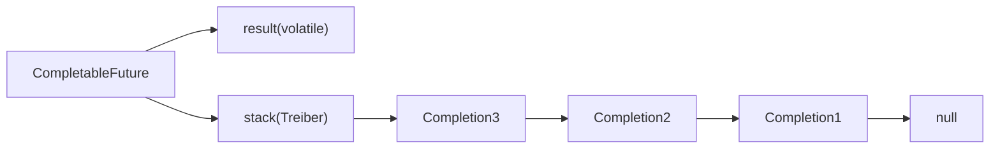
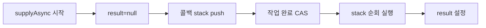
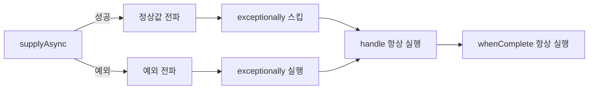

전자상거래 주문 처리 서버가 있다. 상품 정보(300ms), 재고 확인(200ms), 가격 계산(150ms)을 순차 호출하면 650ms다. 세 호출을 병렬로 띄우면 300ms면 충분하다. 그런데 단순히 `Thread`를 3개 생성하는 것과 `CompletableFuture`를 사용하는 것은 완전히 다른 이야기다. 스레드 생성 비용, 결과 조합 방법, 예외 전파 경로, 타임아웃 제어까지 — 내부에서 무슨 일이 벌어지는지 모르면 프로덕션에서 반드시 사고가 난다.

> **비유로 먼저**: CompletableFuture는 레스토랑의 주문 티켓 시스템이다. 손님(호출자)이 주문서를 내고(비동기 작업 등록) 자리로 간다. 주방(스레드 풀)이 요리를 마치면 서버(콜백)가 자동으로 음식을 가져다준다. 피자와 파스타를 동시에 주문하고(병렬 실행) 둘 다 나와야 식사를 시작하거나(allOf), 어느 쪽이든 먼저 나오면 먹을 수 있다(anyOf). 손님은 주방 앞에서 기다리지 않는다.

---

## 1. Future의 구조적 한계 — 왜 블로킹인가

`Future`(Java 5)가 블로킹인 이유는 설계 철학에서 비롯된다. `Future`는 "미래에 완료될 계산의 핸들"이지, "완료 시 다음 동작을 등록하는 파이프라인"이 아니다.

### get()이 블로킹인 이유 — JVM 내부

`Future.get()`의 블로킹 메커니즘은 `AbstractQueuedSynchronizer(AQS)`를 통해 구현된다. `FutureTask`의 내부 상태는 정수 하나로 표현된다.

```
NEW(0) → COMPLETING(1) → NORMAL(2)
                       → EXCEPTIONAL(3)
         → CANCELLED(4)
         → INTERRUPTING(5) → INTERRUPTED(6)
```

`get()`을 호출한 스레드가 상태가 `NORMAL` 또는 `EXCEPTIONAL`이 아니면, AQS의 대기 큐에 자신을 등록하고 `LockSupport.park()`으로 잠든다. 작업이 완료되면 `LockSupport.unpark()`로 깨어난다. 이 과정에서 호출 스레드는 OS 스케줄러에 제어권을 반납하고 완전히 멈춘다.

```java
// Future의 5가지 구조적 한계를 재현하는 코드
import java.util.concurrent.*;

public class FutureLimitations {

    public static void main(String[] args) throws Exception {
        ExecutorService executor = Executors.newFixedThreadPool(4);

        // 한계 1: get()이 블로킹 — 결과를 기다리는 동안 호출 스레드 전체가 멈춤
        Future<String> future1 = executor.submit(() -> {
            Thread.sleep(2000);
            return "결과";
        });
        // 이 시점에서 main 스레드는 2초간 아무것도 못 함
        String result = future1.get(); // BLOCKING

        // 한계 2: 콜백 등록 불가 — 완료 시점에 자동으로 실행할 코드 등록 방법 없음
        // future1.onComplete(r -> System.out.println(r)); // 이런 API가 없다

        // 한계 3: 체이닝 불가 — "완료되면 다음 작업" 표현 불가
        // Future<Integer> length = future1.thenApply(String::length); // 없음

        // 한계 4: 조합 불가 — 여러 Future를 병렬 실행 후 하나로 합치는 API 없음
        Future<String> f1 = executor.submit(() -> "A");
        Future<String> f2 = executor.submit(() -> "B");
        // 둘 다 완료되면 합치는 표준 방법? → 없음. 수동으로 두 번 get() 해야 함
        String combined = f1.get() + f2.get(); // 순차 블로킹

        // 한계 5: 예외 처리 불편 — 항상 ExecutionException으로 래핑됨
        Future<String> failing = executor.submit(() -> {
            throw new RuntimeException("실패");
        });
        try {
            failing.get();
        } catch (ExecutionException e) {
            Throwable cause = e.getCause(); // 한 겹 벗겨야 실제 예외
        }

        executor.shutdown();
    }
}
```

**핵심 통찰**: `Future`는 비동기 실행은 가능하지만, 결과를 활용하는 시점에서 반드시 동기 지점이 생긴다. 비동기로 시작했지만 결국 동기로 끝나므로 병렬 처리의 이점이 반감된다.

---

## 2. CompletableFuture 내부 구조 — Treiber Stack과 CAS

`CompletableFuture`의 내부를 이해하려면 세 가지 핵심 필드를 알아야 한다.

```java
// java.util.concurrent.CompletableFuture 소스 (간략화)
public class CompletableFuture<T> implements Future<T>, CompletionStage<T> {

    volatile Object result;       // 완료된 결과 또는 AltResult(예외 래퍼)
    volatile Completion stack;    // Treiber stack — 등록된 콜백 체인의 헤드

    // 내부 상태는 별도 정수 필드가 아닌 result 필드로 판단
    // result == null → 아직 미완료
    // result == NIL → null로 완료 (null은 미완료와 구분 불가하므로 NIL 센티넬 사용)
    // result instanceof AltResult → 예외 또는 취소로 완료
    // otherwise → 정상 완료된 값
}
```

### Treiber Stack — 락 없는 콜백 등록

`thenApply`, `thenCompose` 등을 호출하면 새 `Completion` 노드가 stack 헤드에 CAS(Compare-And-Swap)로 push된다. 이것이 **Treiber Stack** 패턴이다.

마치 포스트잇을 앞면에 한 장씩 붙이는 것처럼, 콜백이 등록될 때마다 Treiber Stack의 앞에 추가됩니다. 작업이 완료되면 포스트잇을 앞에서부터 한 장씩 떼어 실행합니다.



```
stack → [Completion3] → [Completion2] → [Completion1] → null
```

작업이 완료되면 stack을 순회하며 모든 콜백을 실행한다. CAS 기반이므로 락 없이 스레드 안전하게 동작한다.



### CAS 기반 상태 전환

`complete(T value)`가 호출되면 내부적으로 다음이 일어난다.

```java
// 실제 JDK 소스에 가까운 의사코드
boolean completeValue(T t) {
    return RESULT.compareAndSet(this, null, (t == null) ? NIL : t);
    // CAS 성공: 이 스레드가 완료 처리 담당 → stack 콜백 트리거
    // CAS 실패: 다른 스레드가 이미 완료 → 무시
}
```

CAS가 성공한 스레드만 콜백 체인을 실행할 권한을 얻는다. 이것이 `complete()`를 여러 스레드에서 동시에 호출해도 안전한 이유다. **첫 번째 CAS 성공만 유효하다.**

### 직접 확인 — 미완료 상태의 result

```java
import java.util.concurrent.CompletableFuture;
import java.lang.reflect.Field;

public class InternalInspector {

    public static void main(String[] args) throws Exception {
        CompletableFuture<String> cf = new CompletableFuture<>();

        // 미완료 상태: result 필드는 null
        Field resultField = CompletableFuture.class.getDeclaredField("result");
        resultField.setAccessible(true);
        System.out.println("완료 전 result: " + resultField.get(cf)); // null

        cf.complete("hello");

        System.out.println("완료 후 result: " + resultField.get(cf)); // hello

        // null 값으로 완료 시 NIL 센티넬 사용 확인
        CompletableFuture<String> nilCf = CompletableFuture.completedFuture(null);
        Object nilResult = resultField.get(nilCf);
        System.out.println("null 완료 result 타입: " + nilResult.getClass().getName());
        // java.util.concurrent.CompletableFuture$AltResult 또는 내부 NIL
    }
}
```

---

## 3. CompletableFuture 생성 — 다섯 가지 방법

```java
import java.util.concurrent.*;

public class CreationPatterns {

    private static final ExecutorService IO_EXECUTOR =
        Executors.newFixedThreadPool(20, r -> {
            Thread t = new Thread(r, "io-pool-" + System.nanoTime());
            t.setDaemon(true);
            return t;
        });

    public static void main(String[] args) throws Exception {

        // 1. 이미 완료된 Future — 캐시 히트, 테스트 더블에 유용
        CompletableFuture<String> already = CompletableFuture.completedFuture("캐시값");

        // 2. 이미 실패한 Future — 팩토리 메서드 레이어에서 유효성 실패 표현
        CompletableFuture<String> failed =
            CompletableFuture.failedFuture(new IllegalArgumentException("userId가 null"));

        // 3. 반환값 없는 비동기 실행 (ForkJoinPool.commonPool 사용 — 권장하지 않음)
        CompletableFuture<Void> fire = CompletableFuture.runAsync(() ->
            System.out.println("스레드: " + Thread.currentThread().getName())
        );

        // 4. 반환값 있는 비동기 실행 — I/O라면 반드시 전용 Executor 전달
        CompletableFuture<String> supply = CompletableFuture.supplyAsync(
            () -> fetchFromDatabase("user-1"),
            IO_EXECUTOR  // commonPool 대신 I/O 전용 풀
        );

        // 5. 수동 완료 — Promise 패턴, 콜백 기반 레거시 API 래핑에 사용
        CompletableFuture<String> promise = new CompletableFuture<>();

        IO_EXECUTOR.submit(() -> {
            try {
                String result = callLegacyCallbackApi(); // 콜백 기반 구 API 결과를 받아서
                promise.complete(result);                // CF로 주입
            } catch (Exception e) {
                promise.completeExceptionally(e);
            }
        });

        // 타임아웃 후 기본값으로 완료 (Java 9+) — 결과를 반환하지 않는 외부 시스템에 유용
        promise.completeOnTimeout("기본값", 3, TimeUnit.SECONDS);

        IO_EXECUTOR.shutdown();
    }

    private static String fetchFromDatabase(String id) { return "user-data"; }
    private static String callLegacyCallbackApi() { return "legacy-result"; }
}
```

---

## 4. 스레드 실행 모델 — thenApply vs thenApplyAsync

이것이 가장 자주 잘못 이해되는 부분이다. "Async가 붙으면 비동기, 없으면 동기"라고 단순화하면 틀린다.

### 실행 스레드 결정 규칙

| 메서드 | 실행 스레드 |
|--------|-----------|
| `thenApply(fn)` | 이전 단계를 완료한 스레드. 단, 이전 단계가 이미 완료된 경우 `thenApply`를 호출한 스레드 |
| `thenApplyAsync(fn)` | ForkJoinPool.commonPool |
| `thenApplyAsync(fn, executor)` | 지정된 executor |

`thenApply`의 "이미 완료된 경우" 규칙이 핵심이다. 이를 **동기 완료 최적화(synchronous completion optimization)**라 한다.

```java
import java.util.concurrent.*;

public class ThreadExecutionModel {

    public static void main(String[] args) throws Exception {
        ExecutorService pool = Executors.newSingleThreadExecutor(r -> new Thread(r, "my-thread"));

        // 케이스 1: 아직 미완료 상태에서 thenApply 등록
        CompletableFuture<String> cf1 = CompletableFuture.supplyAsync(() -> {
            System.out.println("공급: " + Thread.currentThread().getName()); // my-thread 또는 FJP
            return "data";
        }, pool);

        cf1.thenApply(s -> {
            // 이전 단계(supplyAsync)를 완료한 스레드가 이걸 실행
            System.out.println("thenApply: " + Thread.currentThread().getName()); // pool 스레드
            return s.length();
        });

        // 케이스 2: 이미 완료된 CF에 thenApply 등록
        CompletableFuture<String> alreadyDone = CompletableFuture.completedFuture("즉시");
        alreadyDone.thenApply(s -> {
            // alreadyDone은 이미 완료 → thenApply 호출 스레드(main)가 실행
            System.out.println("즉시완료 thenApply: " + Thread.currentThread().getName()); // main
            return s.length();
        });

        // 케이스 3: thenApplyAsync는 항상 새 스레드 제출
        cf1.thenApplyAsync(s -> {
            System.out.println("thenApplyAsync: " + Thread.currentThread().getName()); // FJP 스레드
            return s.length();
        });

        pool.shutdown();
        pool.awaitTermination(5, TimeUnit.SECONDS);

        /*
         * 왜 중요한가:
         * thenApply 콜백이 무거운 CPU 작업이면 이전 스레드가 블록됨
         * I/O 집약 파이프라인에서 thenApply를 남용하면
         * 한 스레드가 긴 체인 전체를 혼자 처리하는 "체인 점유" 발생
         * → 무거운 콜백은 thenApplyAsync(fn, cpuExecutor) 사용
         */
    }
}
```

### ForkJoinPool.commonPool() — 크기와 한계

```java
import java.util.concurrent.ForkJoinPool;

public class CommonPoolInfo {

    public static void main(String[] args) {
        ForkJoinPool commonPool = ForkJoinPool.commonPool();

        // 기본 병렬성 = Runtime.getRuntime().availableProcessors() - 1
        // 4코어 CPU → 3개 스레드
        // -Djava.util.concurrent.ForkJoinPool.common.parallelism=N 으로 JVM 옵션 조정 가능
        System.out.println("병렬성: " + commonPool.getParallelism());
        System.out.println("활성 스레드: " + commonPool.getActiveThreadCount());
        System.out.println("풀 크기: " + commonPool.getPoolSize());

        /*
         * 왜 CPU-1인가:
         * ForkJoinPool은 work-stealing 방식 — 스레드들이 서로 작업을 빼앗음
         * main 스레드(또는 호출 스레드)도 작업자로 참여 가능
         * 따라서 논리 코어 수 - 1개의 추가 스레드로 전체 코어 활용 가능
         *
         * I/O 바운드 작업에 commonPool이 나쁜 이유:
         * DB 커넥션 대기로 3개 스레드 모두 blocked → 신규 CompletableFuture 작업 대기
         * JVM 전체 비동기 처리가 멈춤 (Gradle, Spring, Netty 모두 commonPool 공유)
         */
    }
}
```

### 올바른 Executor 설계

```java
import java.util.concurrent.*;
import java.util.concurrent.atomic.AtomicInteger;

public class ExecutorConfiguration {

    // I/O 바운드용 — 스레드 수 많이, 큐 짧게
    public static ExecutorService buildIoExecutor(String name, int maxThreads) {
        AtomicInteger counter = new AtomicInteger();
        return new ThreadPoolExecutor(
            maxThreads / 2,            // corePoolSize: 평시 유지 스레드
            maxThreads,                // maximumPoolSize: 피크 시 최대
            60L, TimeUnit.SECONDS,     // keepAliveTime: 유휴 초과 스레드 제거
            new LinkedBlockingQueue<>(500), // workQueue: 큐 포화 시 reject
            r -> {
                Thread t = new Thread(r);
                t.setName(name + "-" + counter.incrementAndGet());
                t.setDaemon(true);     // JVM 종료 방해 금지
                return t;
            },
            new ThreadPoolExecutor.CallerRunsPolicy() // 큐 포화 시 호출 스레드가 직접 실행 (배압)
        );
    }

    // CPU 바운드용 — 스레드 수 = 코어 수
    public static ExecutorService buildCpuExecutor(String name) {
        int cpuCount = Runtime.getRuntime().availableProcessors();
        AtomicInteger counter = new AtomicInteger();
        return new ThreadPoolExecutor(
            cpuCount, cpuCount,        // core = max = CPU 수 (컨텍스트 스위칭 최소화)
            0L, TimeUnit.MILLISECONDS,
            new LinkedBlockingQueue<>(200),
            r -> {
                Thread t = new Thread(r);
                t.setName(name + "-" + counter.incrementAndGet());
                t.setDaemon(true);
                return t;
            },
            new ThreadPoolExecutor.AbortPolicy() // CPU 작업 큐 포화 시 즉시 오류 (빠른 실패)
        );
    }

    public static void main(String[] args) throws Exception {
        ExecutorService ioExec = buildIoExecutor("io-worker", 50);
        ExecutorService cpuExec = buildCpuExecutor("cpu-worker");

        // I/O 작업 → I/O 전용 풀
        CompletableFuture<String> dbResult = CompletableFuture.supplyAsync(
            () -> queryDatabase(), ioExec
        );

        // CPU 집약 변환 → CPU 전용 풀
        CompletableFuture<Integer> processed = dbResult.thenApplyAsync(
            data -> heavyJsonParsing(data), cpuExec
        );

        System.out.println(processed.get(5, TimeUnit.SECONDS));

        ioExec.shutdown();
        cpuExec.shutdown();
    }

    private static String queryDatabase() { return "{\"id\":1}"; }
    private static int heavyJsonParsing(String json) { return json.length(); }
}
```

---

## 5. 체이닝 — thenApply, thenCompose, thenCombine

### thenApply — map (동기 변환)

```java
// Stream.map()과 동일한 개념 — T → U 변환
CompletableFuture<Integer> lengthFuture = CompletableFuture
    .supplyAsync(() -> "Hello, World")   // CompletableFuture<String>
    .thenApply(String::length)           // CompletableFuture<Integer>
    .thenApply(len -> len * 2);          // CompletableFuture<Integer>

// 내부 동작:
// 1. supplyAsync: FJP 스레드에서 "Hello, World" 반환, result 필드에 CAS 설정
// 2. stack에 등록된 thenApply 콜백 실행 (같은 FJP 스레드)
// 3. 결과 12로 두 번째 thenApply 실행
```

### thenCompose — flatMap (비동기 작업 체이닝)

`thenApply`로 `CompletableFuture`를 반환하는 함수를 적용하면 중첩이 발생한다.

```java
// 잘못된 방법: 중첩 CompletableFuture
CompletableFuture<CompletableFuture<String>> nested =
    CompletableFuture.supplyAsync(() -> 42L)
        .thenApply(id -> fetchUserAsync(id)); // T → CompletableFuture<U> → 중첩!

// 올바른 방법: thenCompose로 평탄화
CompletableFuture<String> flat =
    CompletableFuture.supplyAsync(() -> 42L)
        .thenCompose(id -> fetchUserAsync(id)); // T → CompletableFuture<U> → U

// 내부 동작 차이:
// thenApply: fn의 결과를 그대로 result로 설정 → CompletableFuture<CompletableFuture<U>>
// thenCompose: fn이 반환한 CF가 완료될 때까지 기다렸다가 그 결과를 result로 설정 → CF<U>
```

**thenCompose 내부 구현 원리**:

```java
// thenCompose 구현 의사코드
public <U> CompletableFuture<U> thenCompose(Function<T, CompletableFuture<U>> fn) {
    CompletableFuture<U> result = new CompletableFuture<>();

    this.whenComplete((value, ex) -> {
        if (ex != null) {
            result.completeExceptionally(ex);
        } else {
            CompletableFuture<U> inner = fn.apply(value); // 내부 CF 생성
            inner.whenComplete((innerVal, innerEx) -> {   // 내부 CF 완료 대기
                if (innerEx != null) {
                    result.completeExceptionally(innerEx);
                } else {
                    result.complete(innerVal);
                }
            });
        }
    });

    return result;
}
```

### 실전 체이닝 파이프라인

```java
import java.util.concurrent.*;

public class OrderPipeline {

    private final ExecutorService executor = buildIoExecutor();

    // 비동기 단계마다 thenCompose — 각 단계가 완료되어야 다음 단계 시작
    public CompletableFuture<OrderConfirmation> placeOrder(long userId, long productId) {
        return CompletableFuture.supplyAsync(() -> validateUser(userId), executor)
            .thenCompose(user -> checkInventory(user, productId))    // 재고 확인
            .thenCompose(inventory -> processPayment(inventory))      // 결제
            .thenCompose(payment -> issueReceipt(payment))            // 영수증 발행
            .thenCompose(receipt -> notifyUser(receipt)               // 알림
                .thenApply(ignored -> receipt))                       // receipt 유지
            .orTimeout(15, TimeUnit.SECONDS)
            .exceptionally(ex -> {
                // TimeoutException, PaymentException 등 모두 여기서 처리
                log("주문 실패: " + ex.getMessage());
                return OrderConfirmation.failed(userId, ex);
            });
    }

    private User validateUser(long userId) { /* DB 조회 */ return new User(userId); }
    private CompletableFuture<Inventory> checkInventory(User u, long pid) {
        return CompletableFuture.supplyAsync(() -> new Inventory(pid), executor);
    }
    private CompletableFuture<Payment> processPayment(Inventory inv) {
        return CompletableFuture.supplyAsync(() -> new Payment(inv), executor);
    }
    private CompletableFuture<Receipt> issueReceipt(Payment p) {
        return CompletableFuture.supplyAsync(() -> new Receipt(p), executor);
    }
    private CompletableFuture<Void> notifyUser(Receipt r) {
        return CompletableFuture.runAsync(() -> sendEmail(r), executor);
    }

    private void log(String msg) { System.out.println(msg); }
    private void sendEmail(Receipt r) {}
    private ExecutorService buildIoExecutor() {
        return Executors.newFixedThreadPool(20, r -> {
            Thread t = new Thread(r); t.setDaemon(true); return t;
        });
    }

    // --- 내부 DTO ---
    record User(long id) {}
    record Inventory(long productId) {}
    record Payment(Inventory inv) {}
    record Receipt(Payment payment) {}
    record OrderConfirmation(long userId, boolean success, String error) {
        static OrderConfirmation failed(long uid, Throwable ex) {
            return new OrderConfirmation(uid, false, ex.getMessage());
        }
    }
}
```

### thenCombine — 두 독립 CF 결과 결합

```java
import java.util.concurrent.*;

public class CombineExample {

    public static void main(String[] args) throws Exception {
        ExecutorService exec = Executors.newFixedThreadPool(4);

        // 두 작업을 병렬로 실행 (서로 의존성 없음)
        CompletableFuture<String> userFuture =
            CompletableFuture.supplyAsync(() -> fetchUser(1L), exec);   // 150ms

        CompletableFuture<Double> scoreFuture =
            CompletableFuture.supplyAsync(() -> fetchScore(1L), exec);  // 200ms

        // 둘 다 완료되면 결합 — 총 소요 시간: max(150, 200) = 200ms
        CompletableFuture<String> combined = userFuture.thenCombine(
            scoreFuture,
            (user, score) -> user + " (점수: " + score + ")"
        );

        System.out.println(combined.get(3, TimeUnit.SECONDS));

        // thenCombine 내부 동작:
        // BiConsumer를 양쪽 CF에 등록
        // 먼저 완료된 쪽이 AtomicReference로 자신의 값을 저장
        // 나중에 완료된 쪽이 양쪽 값을 꺼내어 fn 실행
        exec.shutdown();
    }

    private static String fetchUser(long id) { return "Kim"; }
    private static double fetchScore(long id) { return 98.5; }
}
```

---

## 6. allOf와 anyOf — 내부 동작 이해

### allOf — fan-out/fan-in 패턴

```java
import java.util.*;
import java.util.concurrent.*;
import java.util.stream.Collectors;

public class AllOfPattern {

    private static final ExecutorService exec =
        Executors.newFixedThreadPool(10, r -> { Thread t = new Thread(r); t.setDaemon(true); return t; });

    public static void main(String[] args) throws Exception {

        // allOf 내부 동작:
        // 각 CF에 whenComplete 콜백 등록
        // 모든 CF 완료 시 AtomicInteger 카운터를 CAS로 감소
        // 카운터가 0이 되면 allOf CF를 complete() 호출

        List<Long> userIds = List.of(1L, 2L, 3L, 4L, 5L);

        // fan-out: 5개 병렬 실행
        List<CompletableFuture<String>> futures = userIds.stream()
            .map(id -> CompletableFuture.supplyAsync(() -> fetchUser(id), exec))
            .collect(Collectors.toList());

        // fan-in: 모두 완료 후 집계
        CompletableFuture<List<String>> allResults = CompletableFuture
            .allOf(futures.toArray(new CompletableFuture[0]))
            .thenApply(ignored -> futures.stream()
                .map(CompletableFuture::join) // 이 시점엔 모두 완료 → join() 즉시 반환
                .collect(Collectors.toList())
            );

        List<String> users = allResults.get(5, TimeUnit.SECONDS);
        System.out.println("수집된 사용자: " + users);

        // 주의: allOf()는 CompletableFuture<Void> 반환
        // 내부 CF들의 결과는 allOf 자체에서 꺼낼 수 없다
        // 반드시 원본 futures 리스트를 유지하고 thenApply에서 join() 해야 함
    }

    // 하나라도 실패 시 전체 실패 패턴
    public static <T> CompletableFuture<List<T>> allOfOrFail(
            List<CompletableFuture<T>> futures) {

        CompletableFuture<List<T>> allResult = new CompletableFuture<>();

        CompletableFuture.allOf(futures.toArray(new CompletableFuture[0]))
            .whenComplete((ignored, ex) -> {
                if (ex != null) {
                    allResult.completeExceptionally(ex); // allOf 자체 실패 전파
                } else {
                    // 개별 CF 예외 확인 (allOf는 개별 예외를 전파하지 않음)
                    List<Throwable> errors = futures.stream()
                        .filter(CompletableFuture::isCompletedExceptionally)
                        .map(f -> {
                            try { f.join(); return null; }
                            catch (Exception e) { return (Throwable) e.getCause(); }
                        })
                        .filter(Objects::nonNull)
                        .collect(Collectors.toList());

                    if (!errors.isEmpty()) {
                        RuntimeException combined = new RuntimeException("일부 작업 실패");
                        errors.forEach(combined::addSuppressed);
                        allResult.completeExceptionally(combined);
                    } else {
                        List<T> results = futures.stream()
                            .map(CompletableFuture::join)
                            .collect(Collectors.toList());
                        allResult.complete(results);
                    }
                }
            });

        return allResult;
    }

    private static String fetchUser(long id) {
        try { Thread.sleep(100); } catch (InterruptedException e) { Thread.currentThread().interrupt(); }
        return "user-" + id;
    }
}
```

### anyOf — 최초 완료 응답

```java
import java.util.concurrent.*;

public class AnyOfPattern {

    public static void main(String[] args) throws Exception {
        ExecutorService exec = Executors.newFixedThreadPool(3);

        // anyOf 내부 동작:
        // 각 CF에 whenComplete 콜백 등록
        // 첫 번째로 완료된 CF가 anyOf CF를 complete()
        // 나머지 CF들은 취소되지 않고 계속 실행됨 (주의!)

        CompletableFuture<String> usEast = CompletableFuture.supplyAsync(
            () -> { sleep(300); return "us-east 응답"; }, exec);
        CompletableFuture<String> euWest = CompletableFuture.supplyAsync(
            () -> { sleep(500); return "eu-west 응답"; }, exec);
        CompletableFuture<String> apNe = CompletableFuture.supplyAsync(
            () -> { sleep(200); return "ap-northeast 응답"; }, exec);

        // Object 타입 반환이 단점 — 타입 안전성 잃음
        Object fastest = CompletableFuture.anyOf(usEast, euWest, apNe).get();
        System.out.println("최초 응답: " + fastest); // ap-northeast 응답

        // 타입 안전 버전 (Java 21+에서는 첫 번째 완료 CF를 추적하는 유틸 권장)
        CompletableFuture<String> typeSafe = anyOfTyped(
            List.of(usEast, euWest, apNe), String.class);
        System.out.println("타입 안전: " + typeSafe.get());

        exec.shutdown();
    }

    @SuppressWarnings("unchecked")
    private static <T> CompletableFuture<T> anyOfTyped(
            List<CompletableFuture<T>> futures, Class<T> type) {
        return (CompletableFuture<T>) CompletableFuture.anyOf(
            futures.toArray(new CompletableFuture[0]));
    }

    private static void sleep(long ms) {
        try { Thread.sleep(ms); } catch (InterruptedException e) { Thread.currentThread().interrupt(); }
    }
}
```

---

## 7. 예외 처리 — exceptionally, handle, whenComplete 내부 흐름

세 메서드는 목적이 다르고 내부 동작도 다르다. 혼동하면 예외가 조용히 삼켜지거나 의도치 않게 덮어씌워진다.



### exceptionally — 예외 시 복구값 반환

```java
import java.util.concurrent.*;

public class ExceptionHandling {

    public static void main(String[] args) throws Exception {

        // exceptionally 내부 동작:
        // CF가 예외로 완료 → fn 실행, 반환값으로 새 CF 정상 완료
        // CF가 정상 완료 → fn 실행 안 함, 원래 값 그대로 전파

        CompletableFuture<String> result = CompletableFuture
            .supplyAsync(() -> {
                if (Math.random() > 0.5) throw new RuntimeException("API 오류");
                return "정상 데이터";
            })
            .exceptionally(ex -> {
                // ex는 CompletionException으로 래핑됨 — getCause()로 실제 예외 확인
                Throwable cause = ex.getCause() != null ? ex.getCause() : ex;
                System.err.println("복구: " + cause.getMessage());
                return "기본값";
            });

        System.out.println(result.get()); // "정상 데이터" 또는 "기본값"

        // 예외 체인에서의 exceptionally 위치:
        CompletableFuture<String> chain = CompletableFuture
            .supplyAsync(() -> { throw new RuntimeException("1단계 실패"); })
            .thenApply(s -> s + " 변환")    // 예외 전파 → 스킵
            .thenApply(s -> s.toUpperCase()) // 예외 전파 → 스킵
            .exceptionally(ex -> "복구됨")   // 여기서 포착
            .thenApply(s -> s + " 후처리"); // 정상 실행

        System.out.println(chain.get()); // "복구됨 후처리"
    }
}
```

### handle — 성공/실패 모두 처리하는 변환

```java
public class HandleExample {

    public static void main(String[] args) throws Exception {

        // handle 내부 동작:
        // 성공이든 실패든 항상 fn(result, exception) 호출
        // fn의 반환값으로 새 CF 완료
        // fn 자체에서 예외 던지면 새 CF가 예외로 완료

        CompletableFuture<String> result = CompletableFuture
            .supplyAsync(() -> fetchData())
            .handle((data, ex) -> {
                if (ex != null) {
                    // 예외 처리 분기
                    logError(ex.getMessage());
                    return "폴백";
                }
                // 정상 처리 분기 — 값 변환도 가능
                return data.toUpperCase();
            });

        // handle vs exceptionally 선택 기준:
        // - 예외만 처리하고 정상값은 그대로 → exceptionally
        // - 예외/성공 모두에서 값을 변환해야 함 → handle
        // - 부수효과만 원하고 값 변경 금지 → whenComplete

        System.out.println(result.get());
    }

    private static String fetchData() {
        throw new RuntimeException("네트워크 오류");
    }

    private static void logError(String msg) {
        System.err.println("오류: " + msg);
    }
}
```

### whenComplete — 부수효과만, 값은 그대로

```java
import java.util.concurrent.*;

public class WhenCompleteExample {

    public static void main(String[] args) throws Exception {

        // whenComplete 내부 동작:
        // 성공이든 실패든 항상 fn(result, exception) 호출
        // fn의 반환값 무시 — 원래 결과(또는 예외)를 그대로 downstream 전파
        // fn 자체에서 예외 발생 시 원래 예외와 새 예외 중 하나만 전파 (원래 예외 우선)

        CompletableFuture<String> result = CompletableFuture
            .supplyAsync(() -> callApi())
            .whenComplete((value, ex) -> {
                // 메트릭 기록 — 결과에 영향 없음
                if (ex != null) {
                    MetricsRegistry.counter("api.error").increment();
                } else {
                    MetricsRegistry.counter("api.success").increment();
                    MetricsRegistry.timer("api.latency").record(value.length());
                }
                // return 값 없음 (void Consumer — 결과 불변)
            })
            .whenComplete((value, ex) -> {
                // 여러 whenComplete 체이닝 가능 — 모두 실행됨
                AuditLogger.log("api 호출 완료", value, ex);
            });

        // whenComplete 후에도 원래 값/예외가 전파됨
        System.out.println(result.get());
    }

    private static String callApi() { return "api-response"; }

    static class MetricsRegistry {
        static Counter counter(String name) { return new Counter(name); }
        static Timer timer(String name) { return new Timer(name); }
        record Counter(String name) { void increment() {} }
        record Timer(String name) { void record(long v) {} }
    }
    static class AuditLogger {
        static void log(String event, Object val, Throwable ex) {}
    }
}
```

### 예외 복구 체이닝 — exceptionallyCompose (Java 12+)

```java
import java.util.concurrent.*;

public class ExceptionallyCompose {

    private static final ExecutorService exec = Executors.newFixedThreadPool(5);

    public static void main(String[] args) throws Exception {

        // DB 주 서버 실패 → 읽기 전용 복제본 시도 → 캐시 폴백 → 빈 결과
        CompletableFuture<String> resilientFetch =
            CompletableFuture.supplyAsync(() -> queryPrimaryDb(), exec)

            // exceptionallyCompose: 예외 시 다른 CF로 교체 (exceptionally의 flatMap 버전)
            .exceptionallyCompose(ex -> {
                System.err.println("Primary 실패, 복제본 시도: " + ex.getMessage());
                return CompletableFuture.supplyAsync(() -> queryReplicaDb(), exec);
            })

            .exceptionallyCompose(ex -> {
                System.err.println("복제본도 실패, 캐시 조회: " + ex.getMessage());
                return CompletableFuture.supplyAsync(() -> queryCache(), exec);
            })

            .exceptionally(ex -> {
                System.err.println("모두 실패, 빈 결과 반환");
                return "";
            });

        System.out.println("결과: " + resilientFetch.get(10, TimeUnit.SECONDS));
        exec.shutdown();
    }

    private static String queryPrimaryDb() { throw new RuntimeException("Primary DB down"); }
    private static String queryReplicaDb() { throw new RuntimeException("Replica DB down"); }
    private static String queryCache() { return "캐시 데이터"; }
}
```

---

## 8. 타임아웃 — 왜 마이크로서비스에서 필수인가

타임아웃이 없으면 하나의 느린 downstream 서비스가 전체 스레드 풀을 고갈시킬 수 있다. 100ms 내에 응답해야 할 서비스가 10초 응답하면, 그 동안 들어오는 모든 요청 스레드가 블로킹되어 서버 전체가 멈춘다. 이것이 **Cascading Failure(연쇄 장애)**다.

### orTimeout vs completeOnTimeout

```java
import java.util.concurrent.*;

public class TimeoutPatterns {

    public static void main(String[] args) throws Exception {
        ExecutorService exec = Executors.newFixedThreadPool(4);

        // orTimeout (Java 9+):
        // 지정 시간 초과 시 TimeoutException으로 CF를 예외 완료
        // ScheduledThreadPoolExecutor의 Delayer가 내부적으로 타이머 등록
        CompletableFuture<String> withTimeout = CompletableFuture
            .supplyAsync(() -> slowOperation(), exec)
            .orTimeout(3, TimeUnit.SECONDS);

        try {
            withTimeout.get();
        } catch (ExecutionException e) {
            if (e.getCause() instanceof TimeoutException) {
                System.out.println("타임아웃 — 서킷 브레이커 트리거");
            }
        }

        // completeOnTimeout (Java 9+):
        // 지정 시간 초과 시 기본값으로 CF를 정상 완료
        // 예외 처리 없이 폴백 값으로 자연스럽게 이어짐
        CompletableFuture<String> withDefault = CompletableFuture
            .supplyAsync(() -> slowOperation(), exec)
            .completeOnTimeout("캐시에서 가져온 기본값", 3, TimeUnit.SECONDS);

        System.out.println(withDefault.get()); // 타임아웃 시 "캐시에서 가져온 기본값"

        // 조합 패턴: 타임아웃 + 폴백 + 메트릭
        CompletableFuture<String> production = CompletableFuture
            .supplyAsync(() -> callExternalApi(), exec)
            .orTimeout(2, TimeUnit.SECONDS)
            .exceptionally(ex -> {
                if (ex instanceof TimeoutException || ex.getCause() instanceof TimeoutException) {
                    MetricsService.recordTimeout("external-api");
                    return fetchFromCache(); // 타임아웃 시 캐시
                }
                MetricsService.recordError("external-api", ex);
                return "오류 기본값";
            });

        System.out.println(production.get(5, TimeUnit.SECONDS));
        exec.shutdown();
    }

    // 내부 타이머 메커니즘:
    // Java 9+에서 CompletableFuture 내부에 Delayer 싱글톤 ScheduledThreadPoolExecutor가 있음
    // orTimeout 호출 시 delay 후 cf.completeExceptionally(new TimeoutException()) 예약
    // cf가 먼저 완료되면 타이머 취소 — 타이머 스레드 낭비 없음

    private static String slowOperation() {
        try { Thread.sleep(10000); } catch (InterruptedException e) { Thread.currentThread().interrupt(); }
        return "느린 결과";
    }
    private static String callExternalApi() {
        try { Thread.sleep(5000); } catch (InterruptedException e) { Thread.currentThread().interrupt(); }
        return "API 결과";
    }
    private static String fetchFromCache() { return "캐시값"; }

    static class MetricsService {
        static void recordTimeout(String name) { System.err.println(name + " timeout"); }
        static void recordError(String name, Throwable ex) { System.err.println(name + " error: " + ex); }
    }
}
```

---

## 9. 실전 패턴 — 프로덕션 레벨 구현

### 패턴 1: Fan-out / Fan-in (Scatter-Gather)

마이크로서비스 환경에서 가장 자주 등장하는 패턴이다. 여러 서비스에 동시에 요청을 보내고(fan-out), 모든 결과를 모아(fan-in) 응답을 구성한다.

```java
import java.util.*;
import java.util.concurrent.*;
import java.util.stream.Collectors;

// 상품 상세 페이지: 상품정보 + 재고 + 가격 + 리뷰 + 추천상품을 병렬 조회
public class ProductDetailService {

    private final ExecutorService ioExecutor;
    private final ProductRepository productRepo;
    private final InventoryClient inventoryClient;
    private final PricingClient pricingClient;
    private final ReviewClient reviewClient;
    private final RecommendationClient recommendClient;

    public ProductDetailService(ExecutorService ioExecutor,
            ProductRepository productRepo, InventoryClient inventoryClient,
            PricingClient pricingClient, ReviewClient reviewClient,
            RecommendationClient recommendClient) {
        this.ioExecutor = ioExecutor;
        this.productRepo = productRepo;
        this.inventoryClient = inventoryClient;
        this.pricingClient = pricingClient;
        this.reviewClient = reviewClient;
        this.recommendClient = recommendClient;
    }

    public ProductDetail getProductDetail(long productId, long userId) {
        // fan-out: 5개 동시 실행
        CompletableFuture<Product> productFuture =
            CompletableFuture.supplyAsync(() -> productRepo.findById(productId), ioExecutor)
                .orTimeout(2, TimeUnit.SECONDS)
                .exceptionally(ex -> Product.notFound(productId));

        CompletableFuture<Inventory> inventoryFuture =
            CompletableFuture.supplyAsync(() -> inventoryClient.check(productId), ioExecutor)
                .orTimeout(1, TimeUnit.SECONDS)
                .exceptionally(ex -> Inventory.unknown()); // 재고 불명 → 판매 계속 (정책 결정)

        CompletableFuture<Price> priceFuture =
            CompletableFuture.supplyAsync(() -> pricingClient.getPrice(productId, userId), ioExecutor)
                .orTimeout(1, TimeUnit.SECONDS)
                .exceptionally(ex -> pricingClient.getDefaultPrice(productId)); // 개인화 실패 → 기본가

        CompletableFuture<List<Review>> reviewFuture =
            CompletableFuture.supplyAsync(() -> reviewClient.getTop10(productId), ioExecutor)
                .orTimeout(2, TimeUnit.SECONDS)
                .exceptionally(ex -> Collections.emptyList()); // 리뷰 없어도 페이지 표시

        CompletableFuture<List<Product>> recommendFuture =
            CompletableFuture.supplyAsync(() -> recommendClient.getSimilar(productId, userId), ioExecutor)
                .orTimeout(3, TimeUnit.SECONDS)
                .exceptionally(ex -> Collections.emptyList());

        // fan-in: 모두 완료 후 조합 — 총 소요시간 = max(각 타임아웃 중 실제 응답시간)
        return CompletableFuture.allOf(
                productFuture, inventoryFuture, priceFuture, reviewFuture, recommendFuture)
            .thenApply(ignored -> ProductDetail.builder()
                .product(productFuture.join())
                .inventory(inventoryFuture.join())
                .price(priceFuture.join())
                .reviews(reviewFuture.join())
                .recommendations(recommendFuture.join())
                .build())
            .orTimeout(5, TimeUnit.SECONDS) // 전체 조합에 대한 상한 타임아웃
            .exceptionally(ex -> ProductDetail.degraded(productId)) // 조합 자체 실패 시
            .join();
    }

    // --- 내부 DTO (간략화) ---
    record Product(long id, String name) {
        static Product notFound(long id) { return new Product(id, "알 수 없음"); }
    }
    record Inventory(int qty, boolean unknown) {
        static Inventory unknown() { return new Inventory(0, true); }
    }
    record Price(double amount, boolean isDefault) {}
    record Review(String content, int rating) {}

    static class ProductDetail {
        Product product; Inventory inventory; Price price;
        List<Review> reviews; List<Product> recommendations;

        static Builder builder() { return new Builder(); }
        static ProductDetail degraded(long id) { return new ProductDetail(); }

        static class Builder {
            private final ProductDetail d = new ProductDetail();
            Builder product(Product p) { d.product = p; return this; }
            Builder inventory(Inventory i) { d.inventory = i; return this; }
            Builder price(Price pr) { d.price = pr; return this; }
            Builder reviews(List<Review> r) { d.reviews = r; return this; }
            Builder recommendations(List<Product> rec) { d.recommendations = rec; return this; }
            ProductDetail build() { return d; }
        }
    }

    // 인터페이스 (실제 구현 생략)
    interface ProductRepository { Product findById(long id); }
    interface InventoryClient { Inventory check(long id); }
    interface PricingClient { Price getPrice(long id, long uid); Price getDefaultPrice(long id); }
    interface ReviewClient { List<Review> getTop10(long id); }
    interface RecommendationClient { List<Product> getSimilar(long pid, long uid); }
}
```

### 패턴 2: 동적 Fan-out — N개 항목 병렬 처리

```java
import java.util.*;
import java.util.concurrent.*;
import java.util.stream.Collectors;

public class BatchProcessor {

    private final ExecutorService executor;
    private final int concurrencyLimit;

    public BatchProcessor(ExecutorService executor, int concurrencyLimit) {
        this.executor = executor;
        this.concurrencyLimit = concurrencyLimit;
    }

    // Semaphore로 동시 실행 수 제한
    public <T, R> List<R> processConcurrent(List<T> items, ConcurrentTask<T, R> task) {
        Semaphore semaphore = new Semaphore(concurrencyLimit);

        List<CompletableFuture<R>> futures = items.stream()
            .map(item -> CompletableFuture.supplyAsync(() -> {
                try {
                    semaphore.acquire();
                    return task.execute(item);
                } catch (InterruptedException e) {
                    Thread.currentThread().interrupt();
                    throw new RuntimeException("인터럽트 발생", e);
                } finally {
                    semaphore.release();
                }
            }, executor))
            .collect(Collectors.toList());

        return CompletableFuture.allOf(futures.toArray(new CompletableFuture[0]))
            .thenApply(ignored -> futures.stream()
                .map(CompletableFuture::join)
                .collect(Collectors.toList()))
            .join();
    }

    // 부분 실패 허용 — 성공한 결과만 수집
    public <T, R> List<R> processWithPartialFailure(List<T> items, ConcurrentTask<T, R> task) {
        List<CompletableFuture<Optional<R>>> futures = items.stream()
            .map(item -> CompletableFuture.supplyAsync(() -> task.execute(item), executor)
                .thenApply(Optional::of)
                .exceptionally(ex -> {
                    System.err.println("항목 처리 실패: " + item + " → " + ex.getMessage());
                    return Optional.empty(); // 실패한 항목은 Optional.empty()
                }))
            .collect(Collectors.toList());

        return CompletableFuture.allOf(futures.toArray(new CompletableFuture[0]))
            .thenApply(ignored -> futures.stream()
                .map(CompletableFuture::join)
                .filter(Optional::isPresent)
                .map(Optional::get)
                .collect(Collectors.toList()))
            .join();
    }

    @FunctionalInterface
    public interface ConcurrentTask<T, R> {
        R execute(T item);
    }

    // 사용 예
    public static void main(String[] args) {
        ExecutorService exec = Executors.newFixedThreadPool(20);
        BatchProcessor processor = new BatchProcessor(exec, 5); // 동시 5개

        List<Long> orderIds = List.of(1L, 2L, 3L, 4L, 5L, 6L, 7L, 8L, 9L, 10L);

        List<String> results = processor.processConcurrent(
            orderIds,
            id -> processOrder(id) // 10개 주문을 동시 5개씩 처리
        );

        System.out.println("처리 완료: " + results.size() + "건");
        exec.shutdown();
    }

    private static String processOrder(long orderId) {
        try { Thread.sleep(100); } catch (InterruptedException e) { Thread.currentThread().interrupt(); }
        return "order-" + orderId + "-processed";
    }
}
```

### 패턴 3: 서킷 브레이커 통합

```java
import java.util.concurrent.*;
import java.util.concurrent.atomic.*;

// 간단한 서킷 브레이커와 CompletableFuture 통합
public class CircuitBreakerIntegration {

    enum State { CLOSED, OPEN, HALF_OPEN }

    private final AtomicReference<State> state = new AtomicReference<>(State.CLOSED);
    private final AtomicInteger failureCount = new AtomicInteger(0);
    private final AtomicLong lastFailureTime = new AtomicLong(0);

    private static final int FAILURE_THRESHOLD = 5;
    private static final long OPEN_DURATION_MS = 30_000;

    private final ExecutorService executor;

    public CircuitBreakerIntegration(ExecutorService executor) {
        this.executor = executor;
    }

    public <T> CompletableFuture<T> execute(String serviceName, Supplier<T> task, T fallback) {
        State current = state.get();

        // OPEN 상태: 즉시 폴백 반환 (외부 호출 차단)
        if (current == State.OPEN) {
            if (System.currentTimeMillis() - lastFailureTime.get() > OPEN_DURATION_MS) {
                state.compareAndSet(State.OPEN, State.HALF_OPEN);
                System.out.println(serviceName + " 서킷 HALF_OPEN — 탐색 요청 허용");
            } else {
                System.out.println(serviceName + " 서킷 OPEN — 즉시 폴백");
                return CompletableFuture.completedFuture(fallback);
            }
        }

        return CompletableFuture.supplyAsync(task, executor)
            .whenComplete((result, ex) -> {
                if (ex != null) {
                    int failures = failureCount.incrementAndGet();
                    lastFailureTime.set(System.currentTimeMillis());

                    if (failures >= FAILURE_THRESHOLD) {
                        state.set(State.OPEN);
                        System.err.println(serviceName + " 서킷 OPEN (실패 " + failures + "회)");
                    }
                } else {
                    // 성공 시 카운터 리셋 (HALF_OPEN → CLOSED 포함)
                    failureCount.set(0);
                    state.compareAndSet(State.HALF_OPEN, State.CLOSED);
                }
            })
            .exceptionally(ex -> {
                System.err.println(serviceName + " 실패: " + ex.getMessage() + " → 폴백 반환");
                return fallback;
            });
    }

    public static void main(String[] args) throws Exception {
        ExecutorService exec = Executors.newFixedThreadPool(10);
        CircuitBreakerIntegration cb = new CircuitBreakerIntegration(exec);

        for (int i = 0; i < 20; i++) {
            final int req = i;
            CompletableFuture<String> result = cb.execute(
                "payment-service",
                () -> {
                    if (req < 8) throw new RuntimeException("결제 서비스 다운");
                    return "결제 성공";
                },
                "결제 서비스 임시 불가"
            );

            System.out.println("요청 " + req + ": " + result.get(2, TimeUnit.SECONDS));
        }

        exec.shutdown();
    }
}
```

### 패턴 4: 재시도 with 지수 백오프

```java
import java.util.concurrent.*;
import java.util.function.Supplier;

public class RetryWithBackoff {

    private final ScheduledExecutorService scheduler =
        Executors.newScheduledThreadPool(2, r -> {
            Thread t = new Thread(r, "retry-scheduler");
            t.setDaemon(true);
            return t;
        });

    private final ExecutorService executor;

    public RetryWithBackoff(ExecutorService executor) {
        this.executor = executor;
    }

    public <T> CompletableFuture<T> withExponentialBackoff(
            Supplier<T> task,
            int maxAttempts,
            long initialDelayMs,
            double multiplier) {

        return attemptWithRetry(task, maxAttempts, 1, initialDelayMs, multiplier);
    }

    private <T> CompletableFuture<T> attemptWithRetry(
            Supplier<T> task, int maxAttempts, int attempt,
            long delayMs, double multiplier) {

        return CompletableFuture.supplyAsync(task, executor)
            .exceptionallyCompose(ex -> {
                if (attempt >= maxAttempts) {
                    // 최대 재시도 초과 — 예외 전파
                    CompletableFuture<T> failed = new CompletableFuture<>();
                    failed.completeExceptionally(
                        new RuntimeException(maxAttempts + "회 시도 후 실패", ex));
                    return failed;
                }

                long nextDelay = (long) (delayMs * Math.pow(multiplier, attempt - 1));
                System.out.printf("시도 %d 실패 (%s), %dms 후 재시도%n",
                    attempt, ex.getMessage(), nextDelay);

                // ScheduledExecutorService로 지연 후 재시도
                CompletableFuture<T> retryResult = new CompletableFuture<>();
                scheduler.schedule(() -> {
                    attemptWithRetry(task, maxAttempts, attempt + 1, delayMs, multiplier)
                        .whenComplete((val, retryEx) -> {
                            if (retryEx != null) retryResult.completeExceptionally(retryEx);
                            else retryResult.complete(val);
                        });
                }, nextDelay, TimeUnit.MILLISECONDS);

                return retryResult;
            });
    }

    public static void main(String[] args) throws Exception {
        ExecutorService exec = Executors.newFixedThreadPool(5);
        RetryWithBackoff retrier = new RetryWithBackoff(exec);

        AtomicInteger callCount = new AtomicInteger(0);

        try {
            String result = retrier.withExponentialBackoff(
                () -> {
                    int n = callCount.incrementAndGet();
                    if (n < 4) throw new RuntimeException("일시적 오류 (시도 " + n + ")");
                    return "성공 (시도 " + n + ")";
                },
                5,       // 최대 5회 시도
                100,     // 초기 100ms 지연
                2.0      // 200ms, 400ms, 800ms ...
            ).get(10, TimeUnit.SECONDS);

            System.out.println("최종 결과: " + result);
        } catch (Exception e) {
            System.err.println("최종 실패: " + e.getMessage());
        }

        exec.shutdown();
    }

    import java.util.concurrent.atomic.AtomicInteger;
}
```

---

## 10. get() vs join() — 언제 무엇을 쓰는가

```java
import java.util.concurrent.*;

public class GetVsJoin {

    public static void main(String[] args) {
        CompletableFuture<String> cf = CompletableFuture.supplyAsync(() -> "결과");

        // get() — checked exception 강제
        // InterruptedException: 현재 스레드가 인터럽트 당한 경우
        // ExecutionException: 내부 작업에서 예외 발생한 경우 (getCause()로 실제 예외 접근)
        // TimeoutException: 지정 시간 초과
        try {
            String r1 = cf.get();                          // 무한 대기
            String r2 = cf.get(3, TimeUnit.SECONDS);       // 타임아웃 지정
        } catch (InterruptedException e) {
            Thread.currentThread().interrupt(); // 인터럽트 상태 복원 필수
        } catch (ExecutionException e) {
            Throwable cause = e.getCause(); // 실제 예외
        } catch (TimeoutException e) {
            System.err.println("타임아웃");
        }

        // join() — unchecked exception
        // CompletionException: 내부 작업에서 예외 발생 (getCause()로 실제 예외 접근)
        // InterruptedException은 RuntimeException으로 래핑되지 않음 (주의!)
        String r3 = cf.join(); // checked exception 없음 — 스트림 내부에서 편리

        // 스트림에서 join() 활용
        List<CompletableFuture<String>> futures = List.of(
            CompletableFuture.supplyAsync(() -> "a"),
            CompletableFuture.supplyAsync(() -> "b")
        );

        List<String> results = futures.stream()
            .map(CompletableFuture::join) // 람다 내 checked exception 불가 → join() 선택
            .toList();

        // 선택 가이드:
        // - 체인 마지막, 스트림 내부 → join()
        // - InterruptedException을 명시적으로 처리해야 하는 경우 → get()
        // - 타임아웃을 정확히 지정해야 하는 경우 → get(timeout, unit)
    }
}
```

---

## 11. 성능 — commonPool 크기와 I/O/CPU 분리

### 극한 시나리오: commonPool 고갈

```java
import java.util.concurrent.*;
import java.util.stream.IntStream;
import java.util.List;
import java.util.stream.Collectors;

public class CommonPoolExhaustion {

    public static void main(String[] args) throws Exception {

        // 4코어 CPU → commonPool에 3개 스레드
        System.out.println("commonPool 병렬성: " +
            ForkJoinPool.commonPool().getParallelism()); // 보통 3

        // 시나리오: 100개 CompletableFuture가 commonPool 사용
        // 각각 DB 호출(500ms) — I/O 블로킹
        // 3개 스레드 → 나머지 97개는 대기
        // → 총 소요시간 ≈ 100/3 * 500ms ≈ 17초 (병렬의 의미 없음)

        long start = System.currentTimeMillis();

        List<CompletableFuture<String>> badFutures = IntStream.range(0, 10)
            .mapToObj(i -> CompletableFuture.supplyAsync(() -> {
                // I/O 시뮬레이션 — commonPool 스레드 블로킹
                sleep(200);
                return "result-" + i;
            })) // 기본 commonPool 사용 — 위험!
            .collect(Collectors.toList());

        CompletableFuture.allOf(badFutures.toArray(new CompletableFuture[0])).get();
        System.out.println("commonPool 소요: " + (System.currentTimeMillis() - start) + "ms");

        // 해결: 전용 I/O 풀 사용
        ExecutorService ioPool = Executors.newFixedThreadPool(20);
        start = System.currentTimeMillis();

        List<CompletableFuture<String>> goodFutures = IntStream.range(0, 10)
            .mapToObj(i -> CompletableFuture.supplyAsync(() -> {
                sleep(200);
                return "result-" + i;
            }, ioPool)) // I/O 전용 풀 — 20개 스레드, 10개 동시 실행 가능
            .collect(Collectors.toList());

        CompletableFuture.allOf(goodFutures.toArray(new CompletableFuture[0])).get();
        System.out.println("전용풀 소요: " + (System.currentTimeMillis() - start) + "ms");
        // 10개 동시 실행 → 약 200ms

        ioPool.shutdown();
    }

    private static void sleep(long ms) {
        try { Thread.sleep(ms); } catch (InterruptedException e) { Thread.currentThread().interrupt(); }
    }
}
```

---

## 12. Virtual Thread와 CompletableFuture — 언제 어떤 것을 쓰는가

Java 21의 Virtual Thread는 CompletableFuture의 존재 이유 중 일부를 흡수한다. 이 관계를 정확히 이해해야 한다.

### Virtual Thread가 해결하는 것

```java
import java.util.concurrent.*;

public class VirtualThreadComparison {

    // CompletableFuture 방식 — 비동기 파이프라인
    public static String processWithCF(ExecutorService ioExecutor) throws Exception {
        return CompletableFuture.supplyAsync(() -> fetchFromDb(), ioExecutor)
            .thenApplyAsync(data -> callExternalApi(data), ioExecutor)
            .thenApply(result -> transform(result))
            .get(5, TimeUnit.SECONDS);
    }

    // Virtual Thread 방식 — 동기 코드처럼 작성, 실제로는 비블로킹
    public static String processWithVT() throws Exception {
        // Executors.newVirtualThreadPerTaskExecutor() — Java 21+
        try (ExecutorService vtExecutor = Executors.newVirtualThreadPerTaskExecutor()) {
            return vtExecutor.submit(() -> {
                String data = fetchFromDb();        // 블로킹처럼 보이지만 VT가 파킹
                String apiResult = callExternalApi(data); // VT 파킹 → OS 스레드 해방
                return transform(apiResult);
            }).get(5, TimeUnit.SECONDS);
        }
    }

    // Virtual Thread에서 CompletableFuture가 여전히 필요한 경우:
    public static void whenCfStillNeeded() throws Exception {
        try (ExecutorService vtExec = Executors.newVirtualThreadPerTaskExecutor()) {

            // 1. 병렬 실행 + 결과 조합 — allOf/anyOf는 VT에서도 유용
            CompletableFuture<String> f1 = CompletableFuture.supplyAsync(
                () -> fetchA(), vtExec);
            CompletableFuture<String> f2 = CompletableFuture.supplyAsync(
                () -> fetchB(), vtExec);

            String combined = CompletableFuture.allOf(f1, f2)
                .thenApply(ignored -> f1.join() + f2.join())
                .get();
            System.out.println(combined);

            // 2. 타임아웃 제어 — orTimeout은 VT에서도 동작
            String result = CompletableFuture.supplyAsync(() -> slowFetch(), vtExec)
                .orTimeout(2, TimeUnit.SECONDS)
                .exceptionally(ex -> "폴백")
                .get();

            // 3. 비동기 이벤트 응답 — 외부 시스템(웹소켓, 콜백 API)과 연동
            CompletableFuture<String> eventDriven = new CompletableFuture<>();
            registerWebSocketHandler(msg -> eventDriven.complete(msg));
            String wsResult = eventDriven.get(10, TimeUnit.SECONDS);
        }
    }

    // VT에서 주의: synchronized 블록 → 플랫폼 스레드 "고정(pinning)"
    // 고정된 VT는 블로킹 시 OS 스레드도 블로킹 → VT 이점 소실
    public static void pinnedVtProblem() {
        // 나쁜 예: synchronized 내부에서 블로킹 I/O
        // synchronized (lock) { fetchFromDb(); } // 고정 발생

        // 좋은 예: ReentrantLock 사용 (VT-friendly)
        ReentrantLock lock = new ReentrantLock();
        lock.lock();
        try {
            fetchFromDb(); // VT 파킹 가능 → 고정 없음
        } finally {
            lock.unlock();
        }
    }

    private static String fetchFromDb() { sleep(100); return "db-data"; }
    private static String callExternalApi(String d) { sleep(150); return "api-" + d; }
    private static String transform(String s) { return s.toUpperCase(); }
    private static String fetchA() { sleep(200); return "A"; }
    private static String fetchB() { sleep(300); return "B"; }
    private static String slowFetch() { sleep(5000); return "slow"; }
    private static void registerWebSocketHandler(java.util.function.Consumer<String> h) {}
    private static void sleep(long ms) {
        try { Thread.sleep(ms); } catch (InterruptedException e) { Thread.currentThread().interrupt(); }
    }
}
```

### VT vs CF 선택 기준

```
┌─────────────────────────────────┬──────────────────────┬────────────────────────┐
│ 시나리오                          │ 권장                  │ 이유                   │
├─────────────────────────────────┼──────────────────────┼────────────────────────┤
│ 단순 I/O (DB, HTTP 1개)          │ Virtual Thread        │ 동기 코드 유지, 단순    │
│ 병렬 실행 + 결과 조합              │ CF + VT Executor      │ allOf/anyOf 표현력     │
│ 복잡한 비동기 파이프라인            │ CF (thenCompose)     │ 명시적 흐름 제어        │
│ 타임아웃/서킷브레이커              │ CF (orTimeout)        │ 내장 지원              │
│ 외부 콜백 API 래핑                │ CompletableFuture     │ Promise 패턴           │
│ Java 8~17 환경                   │ CompletableFuture     │ VT 미지원              │
│ Java 21+ 신규 서버                │ VT 우선, CF 보조      │ 코드 단순성            │
└─────────────────────────────────┴──────────────────────┴────────────────────────┘
```

---

## 13. 테스트 — CompletableFuture를 단위 테스트로 검증하기

비동기 코드의 테스트는 타이밍 의존성 때문에 플레이키(flaky)해지기 쉽다. 올바른 전략이 필요하다.

```java
import org.junit.jupiter.api.*;
import java.util.concurrent.*;
import java.util.concurrent.atomic.AtomicInteger;
import static org.assertj.core.api.Assertions.*;

class CompletableFutureTest {

    // 전략 1: 이미 완료된 CF 주입 — 테스트에서 비동기 제거
    @Test
    void fetchUser_success() throws Exception {
        // UserService가 CF<User>를 반환한다고 가정
        // 실제 비동기 실행 없이 즉시 완료된 CF로 대체
        CompletableFuture<String> immediate = CompletableFuture.completedFuture("user-1");

        String result = immediate
            .thenApply(s -> s.toUpperCase())
            .get(1, TimeUnit.SECONDS);

        assertThat(result).isEqualTo("USER-1");
    }

    // 전략 2: 실패한 CF 주입 — 예외 처리 경로 테스트
    @Test
    void fetchUser_failure_returnsDefault() throws Exception {
        CompletableFuture<String> failed =
            CompletableFuture.failedFuture(new RuntimeException("DB 오류"));

        String result = failed
            .exceptionally(ex -> "default-user")
            .get(1, TimeUnit.SECONDS);

        assertThat(result).isEqualTo("default-user");
    }

    // 전략 3: 직접 complete() 제어 — 타이밍 시뮬레이션
    @Test
    void timeout_completesWithDefault() throws Exception {
        CompletableFuture<String> promise = new CompletableFuture<>();

        // 타임아웃 설정 (실제 지연 없이 completeOnTimeout으로 즉시 테스트)
        CompletableFuture<String> withDefault = promise
            .completeOnTimeout("기본값", 100, TimeUnit.MILLISECONDS);

        // promise를 완료하지 않으면 100ms 후 "기본값" 반환
        String result = withDefault.get(1, TimeUnit.SECONDS);
        assertThat(result).isEqualTo("기본값");
    }

    // 전략 4: 콜백 실행 순서 검증
    @Test
    void callbacks_executeInOrder() throws Exception {
        AtomicInteger order = new AtomicInteger(0);
        CopyOnWriteArrayList<Integer> executionOrder = new CopyOnWriteArrayList<>();

        CompletableFuture.completedFuture("start")
            .thenApply(s -> {
                executionOrder.add(order.incrementAndGet()); // 1
                return s + "-step1";
            })
            .thenApply(s -> {
                executionOrder.add(order.incrementAndGet()); // 2
                return s + "-step2";
            })
            .thenAccept(s -> {
                executionOrder.add(order.incrementAndGet()); // 3
            })
            .get(1, TimeUnit.SECONDS);

        assertThat(executionOrder).containsExactly(1, 2, 3);
    }

    // 전략 5: 비동기 실행을 테스트 전용 Executor로 제어
    @Test
    void async_withDeterministicExecutor() throws Exception {
        // 단일 스레드 Executor — 실행 순서 결정적
        ExecutorService testExecutor = Executors.newSingleThreadExecutor();

        AtomicInteger executionCount = new AtomicInteger(0);

        CompletableFuture<String> result = CompletableFuture.supplyAsync(() -> {
            executionCount.incrementAndGet();
            return "data";
        }, testExecutor).thenApplyAsync(s -> {
            executionCount.incrementAndGet();
            return s.toUpperCase();
        }, testExecutor);

        assertThat(result.get(2, TimeUnit.SECONDS)).isEqualTo("DATA");
        assertThat(executionCount.get()).isEqualTo(2);

        testExecutor.shutdown();
    }

    // 전략 6: allOf 동작 검증
    @Test
    void allOf_collectsAllResults() throws Exception {
        CompletableFuture<String> f1 = CompletableFuture.completedFuture("A");
        CompletableFuture<String> f2 = CompletableFuture.completedFuture("B");
        CompletableFuture<String> f3 = CompletableFuture.completedFuture("C");

        List<String> results = CompletableFuture.allOf(f1, f2, f3)
            .thenApply(ignored -> List.of(f1.join(), f2.join(), f3.join()))
            .get(1, TimeUnit.SECONDS);

        assertThat(results).containsExactly("A", "B", "C");
    }

    // 전략 7: 예외 타입 검증
    @Test
    void exception_wrapsInCompletionException() {
        CompletableFuture<String> failed =
            CompletableFuture.failedFuture(new IllegalStateException("잘못된 상태"));

        assertThatThrownBy(() -> failed.join())
            .isInstanceOf(CompletionException.class)
            .hasCauseInstanceOf(IllegalStateException.class)
            .hasMessageContaining("잘못된 상태");
    }
}
```

---

## 14. 자주 하는 실수 — 안티패턴과 수정 방법

### 실수 1: I/O 바운드에 commonPool 사용

```java
// 나쁜 예 — commonPool(CPU-1 스레드)에 DB 호출
CompletableFuture.supplyAsync(() -> jdbcTemplate.query("SELECT ..."));

// 좋은 예 — I/O 전용 풀
CompletableFuture.supplyAsync(() -> jdbcTemplate.query("SELECT ..."), ioExecutor);
```

### 실수 2: 예외 처리 없는 체인 — 조용한 실패

```java
// 나쁜 예 — 예외 발생 시 체인 전체 중단, 호출자는 영원히 대기
CompletableFuture<String> cf = CompletableFuture.supplyAsync(() -> {
    throw new RuntimeException("예기치 않은 오류");
}).thenApply(s -> s.toUpperCase());
// cf.join() → CompletionException 발생하지만 감지 못하면 조용히 실패

// 좋은 예 — 명시적 예외 처리
CompletableFuture<String> cf = CompletableFuture.supplyAsync(() -> {
    throw new RuntimeException("예기치 않은 오류");
}).thenApply(s -> s.toUpperCase())
  .exceptionally(ex -> {
      log.error("비동기 작업 실패", ex);
      return "기본값";
  });
```

### 실수 3: thenApply에서 또 다른 비동기 호출

```java
// 나쁜 예 — 중첩 CompletableFuture
CompletableFuture<CompletableFuture<String>> nested =
    CompletableFuture.supplyAsync(() -> userId)
        .thenApply(id -> CompletableFuture.supplyAsync(() -> fetchUser(id)));
// 사용 시 nested.get().get() 이중 get 필요

// 좋은 예 — thenCompose로 평탄화
CompletableFuture<String> flat =
    CompletableFuture.supplyAsync(() -> userId)
        .thenCompose(id -> CompletableFuture.supplyAsync(() -> fetchUser(id)));
```

### 실수 4: allOf 이후 결과 수집 방법 오해

```java
// 나쁜 예 — allOf는 Void 반환, 결과 직접 접근 불가
CompletableFuture<Void> all = CompletableFuture.allOf(f1, f2, f3);
all.get(); // 완료 대기
// String r1 = all.get(); // 컴파일 오류 — Void

// 좋은 예 — 원본 Future 참조를 유지하고 thenApply에서 join()
List<CompletableFuture<String>> futures = List.of(f1, f2, f3);
List<String> results = CompletableFuture.allOf(futures.toArray(new CompletableFuture[0]))
    .thenApply(ignored -> futures.stream().map(CompletableFuture::join).toList())
    .get();
```

### 실수 5: 타임아웃 없는 외부 호출

```java
// 나쁜 예 — 외부 API가 무응답이면 스레드 영구 점유
CompletableFuture.supplyAsync(() -> externalApi.call());

// 좋은 예 — 항상 타임아웃 지정
CompletableFuture.supplyAsync(() -> externalApi.call())
    .orTimeout(3, TimeUnit.SECONDS)
    .exceptionally(ex -> fallback.get());
```

### 실수 6: 완료 후에도 작업 계속 실행 (anyOf의 함정)

```java
// anyOf 사용 시 나머지 CF들은 취소되지 않음
// 첫 번째 응답 후에도 나머지 API 호출이 백그라운드에서 계속 실행
// → 불필요한 자원 소비, 예상치 못한 부수효과

CompletableFuture<Object> any = CompletableFuture.anyOf(
    supplyAsync(() -> callApi1()), // 가장 먼저 완료되어도
    supplyAsync(() -> callApi2()), // 이 호출은 계속 실행됨
    supplyAsync(() -> callApi3())  // 이것도
);
// 해결: 취소 필요 시 외부에서 Future를 추적하고 cancel() 호출
// 단 cancel()은 실행 중인 작업을 실제로 중단하지는 않음 (Future 상태만 변경)
```

---

## 15. 면접 포인트 5개

### Q. Future의 get()은 왜 블로킹인가? CompletableFuture는 어떻게 이를 해결하는가?

> **WHY**: `FutureTask.get()`은 내부적으로 `AbstractQueuedSynchronizer(AQS)`의 `acquire()` 메커니즘을 사용한다. 작업이 `NORMAL` 또는 `EXCEPTIONAL` 상태가 되기 전까지 호출 스레드를 `LockSupport.park()`으로 잠재운다. 작업 완료 시 `LockSupport.unpark(thread)`로 깨우지만, 그 동안 스레드 자체는 OS 스케줄러에서 제거된 상태다. 스레드 = 자원이므로 블로킹 스레드 수만큼 자원이 낭비된다.
>
> **해결**: `CompletableFuture`는 `result` 필드(volatile Object)와 `stack` 필드(Treiber Stack)를 통해 콜백 등록을 가능케 한다. `thenApply(fn)` 호출 시 fn을 `Completion` 노드로 감싸 stack에 CAS로 push한다. 작업 완료 시 `result`를 CAS로 설정하고 stack을 순회하며 등록된 콜백을 실행한다. 호출 스레드는 블로킹되지 않고 즉시 반환된다.
>
> **극한 시나리오**: 4코어 서버에서 1000개 HTTP 요청을 `Future.get()`으로 처리하면 1000개 스레드가 블로킹 대기 → 메모리 1GB+ 소비(스레드당 ~1MB). `CompletableFuture` + 전용 20스레드 I/O 풀이면 같은 처리를 20개 스레드로 수행 가능.

---

### Q. thenApply와 thenApplyAsync의 실행 스레드는 구체적으로 어떻게 결정되는가?

> **thenApply**: 이전 단계 CF가 이미 완료된 상태면 `thenApply`를 호출한 스레드가 콜백을 즉시 실행한다(동기 완료 최적화). 아직 미완료 상태라면 이전 단계를 완료시킨 스레드가 콜백을 이어서 실행한다. 즉 **실행 스레드가 고정되지 않는다**.
>
> **thenApplyAsync**: 항상 지정된 `Executor`(기본 `ForkJoinPool.commonPool()`)에 새 작업을 제출한다. 이전 단계 완료 여부와 무관하게 항상 새 스레드(또는 다른 풀 스레드)에서 실행된다.
>
> **선택 기준**: 콜백이 단순 변환(in-memory 연산)이면 `thenApply`가 컨텍스트 스위칭 비용 없이 빠르다. 콜백이 또 다른 I/O 호출이거나 CPU 집약 연산이라면 `thenApplyAsync(fn, dedicatedExecutor)`로 전용 풀에 격리해야 한다.
>
> **극한 시나리오**: 긴 체인에서 `thenApply`만 사용하면 한 FJP 스레드가 체인 전체를 순차 실행 → 다른 CF들이 그 스레드를 점유당해 지연 발생. 중간에 `thenApplyAsync`를 끼워 넣으면 FJP 큐에 재제출되어 다른 스레드가 처리 가능.

---

### Q. exceptionally, handle, whenComplete의 내부 흐름과 사용 기준은?

> **exceptionally**: 상위 CF가 예외 상태로 완료됐을 때만 fn 실행. 정상 완료 시 원래 값 그대로 전파. fn의 반환값으로 새 CF를 **정상 완료**시킴. 예외를 값으로 복구할 때 사용.
>
> **handle**: 성공이든 실패든 항상 `fn(result, exception)` 실행. fn의 반환값으로 새 CF 완료. fn이 예외를 던지면 새 CF가 예외로 완료. 성공/실패 모두에서 값을 변환해야 할 때 사용 (예: API 응답 통합, 메트릭 기록 + 변환 동시 수행).
>
> **whenComplete**: 성공이든 실패든 항상 `fn(result, exception)` 실행. **fn의 반환값을 무시**하고 원래 결과/예외를 downstream으로 그대로 전파. 부수효과(로깅, 메트릭)만 원할 때 사용. fn에서 새 예외가 발생하면 원래 예외와 새 예외 중 원래 예외가 우선한다.
>
> **면접 심화**: `whenComplete` 체인에서 콜백이 예외를 던지면 "원래 예외가 억제됨(suppressed)"이 아니라 JVM 구현에 따라 둘 중 하나만 전파된다. 이 때문에 `whenComplete` 내부에서는 예외를 던지지 않는 것이 원칙.

---

### Q. allOf에서 하나가 실패하면 어떻게 되는가? 즉시 전체 실패를 구현하려면?

> **기본 동작**: `CompletableFuture.allOf(f1, f2, f3)`는 모든 CF가 완료(성공 또는 실패)될 때까지 기다린다. **하나가 실패해도 나머지를 취소하지 않는다.** 모두 완료된 후 `allOf` CF가 예외로 완료된다. 단, `allOf`는 개별 CF의 예외를 직접 노출하지 않으므로 각각 `join()`으로 확인해야 한다.
>
> **즉시 전체 실패 구현**: 각 CF에 `whenComplete`를 등록해 예외 발생 시 외부 `CompletableFuture<Void>`에 `completeExceptionally()`를 호출하는 패턴을 사용한다. 또는 Guava의 `Futures.allAsList()` 활용.
>
> **극한 시나리오**: 10개 외부 API를 `allOf`로 묶었을 때 1번 API가 30초 타임아웃이라면? 나머지 9개가 0.1초 만에 완료되어도 allOf는 30초 후에야 완료된다. 각 CF에 `orTimeout`을 개별 적용하거나 `allOf` 후 최상단 `orTimeout`을 걸어야 한다.

---

### Q. Java 21 Virtual Thread 환경에서 CompletableFuture는 여전히 필요한가?

> **VT가 대체하는 것**: I/O 블로킹 시 OS 스레드가 아닌 VT 자신만 파킹되므로 스레드 수 제한이 없어진다. 동기 코드처럼 작성해도 높은 동시성을 달성할 수 있다. 단순 순차 I/O 파이프라인(`fetchDb → callApi → transform`)은 VT를 쓴 동기 코드가 CF 체인보다 읽기 쉽다.
>
> **CF가 여전히 필요한 것**: (1) 병렬 실행 + 결과 조합 — `allOf`/`anyOf`의 표현력은 VT만으로 대체 불가. (2) 외부 콜백 기반 API 래핑 — Promise 패턴은 CF가 자연스럽다. (3) 복잡한 폴백/재시도 체인 — `exceptionallyCompose`, `orTimeout` 조합. (4) 기존 CF 기반 라이브러리(Spring WebFlux, Reactor) 연동.
>
> **VT 주의사항**: `synchronized` 블록 내 블로킹 I/O는 VT를 OS 스레드에 고정(pinning)시켜 이점이 사라진다. `ReentrantLock` 사용 권장. 또한 VT는 CPU 집약 작업에 부적합 — 수백만 VT가 CPU를 놓고 경쟁하면 컨텍스트 스위칭 오버헤드 발생.
>
> **최종 답**: VT와 CF는 대체 관계가 아닌 상호 보완 관계다. `Executors.newVirtualThreadPerTaskExecutor()`를 CF의 Executor로 전달하면 VT의 고동시성과 CF의 조합 표현력을 동시에 활용할 수 있다.

---

## 마치며

`CompletableFuture`는 Java 비동기 프로그래밍의 핵심이다. 내부의 Treiber Stack, CAS 기반 상태 전환, `result` 필드 구조를 이해하면 왜 블로킹이 없는지, 왜 여러 스레드에서 `complete()`를 호출해도 안전한지 자연스럽게 이해된다.

실무에서 가장 중요한 세 가지를 기억한다.

첫째, I/O 바운드 작업에는 반드시 전용 `ExecutorService`를 지정한다. `ForkJoinPool.commonPool()`은 CPU 바운드 전용이다.

둘째, 외부 시스템 호출에는 항상 `orTimeout()`을 지정한다. 하나의 느린 서비스가 연쇄 장애를 일으킨다.

셋째, 비동기 작업 체인의 끝에는 반드시 예외 처리를 붙인다. 처리되지 않은 예외는 조용히 삼켜진다.

Java 21 이상에서는 Virtual Thread Executor를 CF에 조합하는 것이 현재 최선의 패턴이다.
