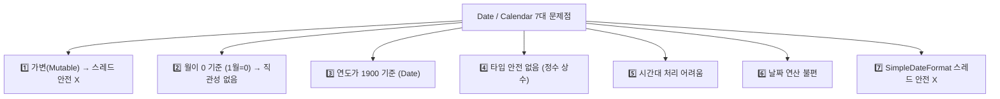
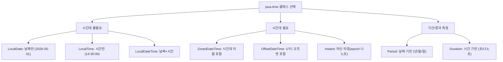
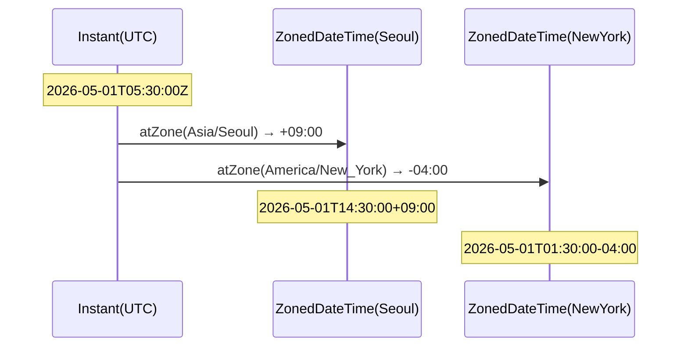
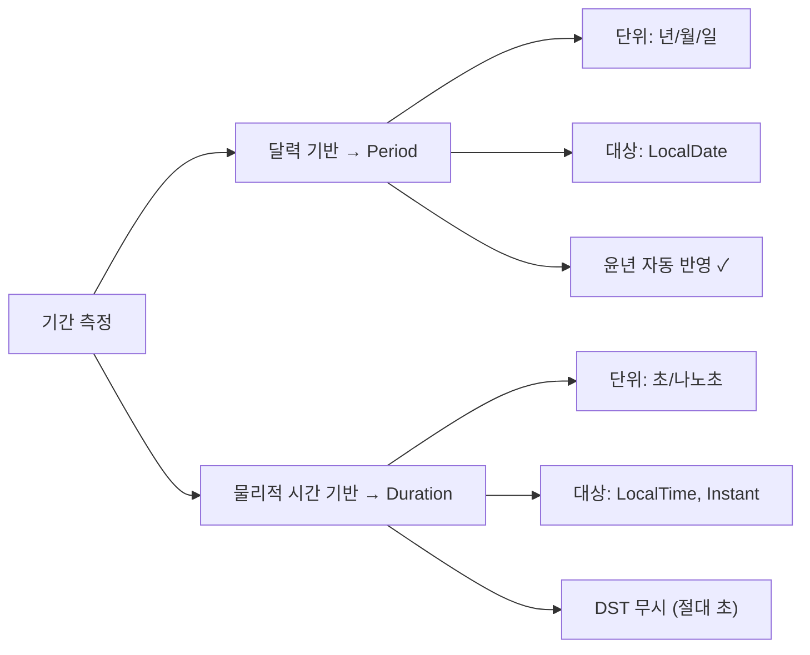
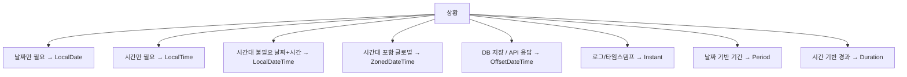

Java 8에서 도입된 `java.time` 패키지는 기존 `Date`와 `Calendar`의 고질적인 문제를 해결하고, 불변(Immutable) 설계와 직관적인 API를 제공합니다. 현대 Java 개발에서 날짜·시간 처리의 표준입니다.

---

## 1. Date, Calendar의 문제점

### java.util.Date의 문제

`Date` 클래스는 Java 1.0 시절에 만들어진 낡은 유물입니다. 연도를 1900 기준으로, 월을 0 기준으로 설계하는 바람에 직관과 완전히 반대로 동작합니다. 비유하자면, 은행 창구에 가서 "2026년 5월 1일 오세요"라고 말했는데 "126년 4번째 달 1일"로 해석하는 것과 같습니다.

```java
// Java 1.0 시절 Date — 거의 모든 메서드가 deprecated
Date date = new Date(2026, 5, 1);  // deprecated!
// 연도는 1900 기준, 월은 0 기준 → 직관에 어긋남
// 2026년 5월 1일을 만들려면:
Date date = new Date(126, 4, 1);  // 126=2026-1900, 4=5월-1

// 문제점
date.getYear()   // 126 (1900 기준)
date.getMonth()  // 4 (0 기준, 5월이 4)
```

### java.util.Calendar의 문제

`Calendar`는 `Date`의 문제를 개선하려 했지만 절반만 성공했습니다. 가장 치명적인 문제는 **가변(Mutable)** 설계입니다. 캘린더 객체를 여러 스레드에서 공유하면 한 스레드가 날짜를 바꾸는 순간 다른 스레드가 엉뚱한 날짜를 읽게 됩니다.

```java
Calendar cal = Calendar.getInstance();
cal.set(2026, Calendar.MAY, 1);  // 월 상수 제공하지만 여전히 불편

// 1. 가변(Mutable) — 스레드 안전 X
cal.set(Calendar.YEAR, 2027);  // 기존 객체 변경

// 2. 월이 0부터 시작 (여전히)
cal.get(Calendar.MONTH)  // 4 (5월)

// 3. 요일이 1부터 (일요일=1, 월요일=2, ...)
cal.get(Calendar.DAY_OF_WEEK)  // 헷갈림

// 4. 타입 안전 없음
cal.set(Calendar.MONTH, 99);  // 컴파일 에러 없음!

// 5. 시간대 처리 복잡
```

### 문제점 요약



**실무 실수:** `SimpleDateFormat`을 `static` 필드로 공유하면 멀티스레드 환경에서 날짜가 뒤섞이는 버그가 발생합니다. 재현도 어렵고 원인 파악도 늦어지는 대표적인 실무 함정입니다.

---

## 2. java.time 패키지 전체 구조

`java.time`의 설계 철학은 간단합니다. **"시간대 정보가 필요한가?"** 를 기준으로 클래스를 선택합니다. 시간대가 없으면 `Local*`, 시간대까지 포함하면 `Zoned*`, 절대 시각(UTC 기준 나노초)이 필요하면 `Instant`를 씁니다.



---

## 3. LocalDate, LocalTime, LocalDateTime

`LocalDate`는 시간대 개념이 없는 날짜만의 표현입니다. 내부적으로 연·월·일을 `int` 필드 3개로 저장하며, 모든 메서드는 새 객체를 반환합니다. 이 덕분에 다수의 스레드가 동일한 `LocalDate` 인스턴스를 공유해도 절대 안전합니다.

### LocalDate — 날짜만

```java
// 생성
LocalDate today = LocalDate.now();                    // 2026-05-01
LocalDate date  = LocalDate.of(2026, 5, 1);          // 2026-05-01
LocalDate date2 = LocalDate.of(2026, Month.MAY, 1);  // Month 상수 사용
LocalDate date3 = LocalDate.parse("2026-05-01");      // 파싱

// 정보 조회
today.getYear()        // 2026
today.getMonthValue()  // 5 (1 기준!)
today.getMonth()       // MAY (Month 열거형)
today.getDayOfMonth()  // 1
today.getDayOfWeek()   // FRIDAY (DayOfWeek 열거형)
today.getDayOfYear()   // 121
today.lengthOfMonth()  // 31 (5월)
today.isLeapYear()     // false

// 불변 연산 — 새 객체 반환
LocalDate tomorrow    = today.plusDays(1);     // 2026-05-02
LocalDate nextMonth   = today.plusMonths(1);   // 2026-06-01
LocalDate nextYear    = today.plusYears(1);    // 2027-05-01
LocalDate yesterday   = today.minusDays(1);    // 2026-04-30
LocalDate lastMonday  = today.with(DayOfWeek.MONDAY);  // 이번 주 월요일

// 비교
LocalDate d1 = LocalDate.of(2026, 1, 1);
LocalDate d2 = LocalDate.of(2026, 12, 31);
d1.isBefore(d2)   // true
d1.isAfter(d2)    // false
d1.isEqual(d2)    // false
d1.compareTo(d2)  // 음수
```

결과적으로 `today.plusDays(1)`은 `today`를 전혀 바꾸지 않고 새 `LocalDate`를 돌려줍니다. `today = today.plusDays(1);`처럼 **재할당**해야 변경된 날짜를 사용할 수 있습니다.

### LocalTime — 시간만

```java
// 생성
LocalTime now      = LocalTime.now();
LocalTime time     = LocalTime.of(14, 30);           // 14:30:00
LocalTime time2    = LocalTime.of(14, 30, 45);       // 14:30:45
LocalTime time3    = LocalTime.of(14, 30, 45, 123_000_000);  // 나노초 포함
LocalTime time4    = LocalTime.parse("14:30:45");

// 정보 조회
time.getHour()    // 14
time.getMinute()  // 30
time.getSecond()  // 45
time.getNano()    // 나노초

// 불변 연산
time.plusHours(2)     // 16:30:45
time.minusMinutes(30) // 14:00:45
time.plusSeconds(15)  // 14:31:00

// 상수
LocalTime.MIDNIGHT  // 00:00
LocalTime.NOON      // 12:00
LocalTime.MAX       // 23:59:59.999999999
LocalTime.MIN       // 00:00
```

### LocalDateTime — 날짜 + 시간

```java
// 생성
LocalDateTime now  = LocalDateTime.now();
LocalDateTime dt   = LocalDateTime.of(2026, 5, 1, 14, 30, 45);
LocalDateTime dt2  = LocalDateTime.of(LocalDate.now(), LocalTime.now());
LocalDateTime dt3  = LocalDateTime.parse("2026-05-01T14:30:45");

// 날짜/시간 분리
LocalDate date = dt.toLocalDate();
LocalTime time = dt.toLocalTime();

// 불변 연산
dt.plusDays(7).minusHours(2).withMinute(0)

// 비교
dt.isBefore(LocalDateTime.now())
dt.isAfter(LocalDateTime.now())
```

---

## 4. ZonedDateTime, OffsetDateTime, Instant

### 시간대 처리 동작 원리

`Instant`는 1970-01-01T00:00:00Z(UTC)를 기준으로 경과한 초와 나노초를 저장합니다. 전 세계 어디서도 동일한 절대 시각을 나타냅니다. `ZonedDateTime`은 `Instant` + 지역 시간대(`ZoneId`)의 조합으로, 서울 14:30과 뉴욕 01:30이 사실 같은 순간임을 표현합니다.



### Instant — 머신 시간 (Unix epoch 기준)

```java
// 1970-01-01T00:00:00Z 기준 나노초
Instant now   = Instant.now();
Instant epoch = Instant.EPOCH;         // 1970-01-01T00:00:00Z
Instant future = Instant.now().plusSeconds(3600);

now.getEpochSecond()  // 초 (long)
now.getNano()         // 나노초 부분

// 타임스탬프 변환
long millis = now.toEpochMilli();
Instant fromMillis = Instant.ofEpochMilli(millis);

// Date 변환 (레거시 연동)
Date legacyDate = Date.from(now);
Instant fromDate = legacyDate.toInstant();
```

### ZoneId — 시간대

```java
// 시간대 목록
ZoneId.getAvailableZoneIds()  // 600개 이상

ZoneId seoul   = ZoneId.of("Asia/Seoul");
ZoneId utc     = ZoneId.of("UTC");
ZoneId tokyo   = ZoneId.of("Asia/Tokyo");
ZoneId ny      = ZoneId.of("America/New_York");
ZoneId system  = ZoneId.systemDefault();
```

### ZonedDateTime — 시간대 포함 날짜시간

```java
ZonedDateTime seoulTime = ZonedDateTime.now(ZoneId.of("Asia/Seoul"));
// 2026-05-01T14:30:45+09:00[Asia/Seoul]

ZonedDateTime utcTime = ZonedDateTime.now(ZoneId.of("UTC"));

// 시간대 변환
ZonedDateTime nyTime = seoulTime.withZoneSameInstant(ZoneId.of("America/New_York"));
// 같은 순간, 다른 시간대 표현

// 생성
ZonedDateTime zdt = ZonedDateTime.of(
    LocalDateTime.of(2026, 5, 1, 14, 30),
    ZoneId.of("Asia/Seoul")
);
```

### OffsetDateTime — UTC 오프셋 포함

```java
// ZoneId(시간대 이름) 없이 오프셋만 포함
OffsetDateTime odt = OffsetDateTime.now(ZoneOffset.of("+09:00"));
// 2026-05-01T14:30:45+09:00

// DB 저장 시 권장 (시간대 정치적 변경에 영향 없음)
OffsetDateTime forDb = ZonedDateTime.now().toOffsetDateTime();
```

### 시간대 처리 Best Practice

```java
// 1. 내부 처리는 Instant 또는 UTC
Instant eventTime = Instant.now();

// 2. 표시는 ZonedDateTime으로 변환
ZonedDateTime display = eventTime.atZone(ZoneId.of("Asia/Seoul"));

// 3. DB 저장은 UTC Instant 또는 OffsetDateTime
// TIMESTAMP WITH TIME ZONE 컬럼 권장

// 4. 사용자 입력은 명시적 시간대 포함
ZonedDateTime userInput = ZonedDateTime.parse("2026-05-01T14:30:00+09:00");
Instant stored = userInput.toInstant();  // UTC로 변환 후 저장
```

**극한 시나리오:** 글로벌 서비스에서 한국 사용자가 설정한 "매일 오전 9시 알림"을 서버가 `LocalDateTime`으로 저장했다가 서버를 AWS us-east-1로 이전하면 갑자기 오후 10시 알림으로 바뀝니다. 반드시 `ZonedDateTime`이나 `Instant + ZoneId` 조합으로 저장해야 합니다.

---

## 5. Period vs Duration

### 동작 원리 비교

`Period`는 달력(calendar) 기반입니다. "3개월 후"를 계산할 때 실제 달력을 따라가므로 윤년과 월의 일수 차이를 자동으로 반영합니다. `Duration`은 물리적 시간 기반입니다. "3시간 후"는 정확히 10800초 후입니다. 서머타임(DST)도 무시합니다.

### Period — 날짜 기반 기간 (년/월/일)

```java
// 생성
Period period = Period.of(1, 6, 15);    // 1년 6개월 15일
Period years  = Period.ofYears(2);
Period months = Period.ofMonths(3);
Period days   = Period.ofDays(10);
Period week   = Period.ofWeeks(2);      // 14일

// 두 날짜 사이의 기간
LocalDate start = LocalDate.of(2024, 1, 1);
LocalDate end   = LocalDate.of(2026, 5, 1);
Period between = Period.between(start, end);

between.getYears()   // 2
between.getMonths()  // 4
between.getDays()    // 0
between.toTotalMonths()  // 28

// 날짜에 적용
LocalDate future = start.plus(period);
LocalDate past   = end.minus(Period.ofMonths(6));
```

### Duration — 시간 기반 기간 (초/나노초)

```java
// 생성
Duration duration = Duration.ofHours(2).plusMinutes(30);
Duration d1 = Duration.of(90, ChronoUnit.MINUTES);
Duration d2 = Duration.ofDays(1);    // 86400초
Duration d3 = Duration.ofHours(24);
Duration d4 = Duration.ofMinutes(60);
Duration d5 = Duration.ofSeconds(3600);
Duration d6 = Duration.ofMillis(1000);
Duration d7 = Duration.ofNanos(1_000_000_000L);

// 두 시간 사이
LocalTime t1 = LocalTime.of(9, 0);
LocalTime t2 = LocalTime.of(17, 30);
Duration workDay = Duration.between(t1, t2);  // 8시간 30분

workDay.toHours()    // 8
workDay.toMinutes()  // 510
workDay.toSeconds()  // 30600

// Instant 사이 경과 시간
Instant start = Instant.now();
// ... 작업 ...
Instant end = Instant.now();
Duration elapsed = Duration.between(start, end);
System.out.println("소요 시간: " + elapsed.toMillis() + "ms");
```

### Period vs Duration 비교



**비유:** Period는 "3개월 후 만나요"처럼 달력을 보고 세는 것이고, Duration은 스톱워치처럼 물리적 시간을 측정하는 것입니다.

---

## 6. DateTimeFormatter — 포맷팅/파싱

### 동작 원리

`DateTimeFormatter`는 불변(immutable) 객체입니다. `SimpleDateFormat`과 달리 내부 상태가 없어서 여러 스레드가 동시에 호출해도 안전합니다. 한 번 생성한 포맷터는 `static final`로 선언해 전체 애플리케이션에서 공유할 수 있습니다.

### 미리 정의된 포맷터

```java
LocalDate date = LocalDate.of(2026, 5, 1);

date.format(DateTimeFormatter.ISO_DATE)           // 2026-05-01
date.format(DateTimeFormatter.ISO_LOCAL_DATE)     // 2026-05-01
date.format(DateTimeFormatter.BASIC_ISO_DATE)     // 20260501
date.format(DateTimeFormatter.ISO_ORDINAL_DATE)   // 2026-121

LocalDateTime dt = LocalDateTime.now();
dt.format(DateTimeFormatter.ISO_LOCAL_DATE_TIME)  // 2026-05-01T14:30:45
dt.format(DateTimeFormatter.ISO_DATE_TIME)
```

### 커스텀 포맷터

```java
// 포맷 패턴
DateTimeFormatter formatter = DateTimeFormatter.ofPattern("yyyy년 MM월 dd일 HH:mm:ss");
String formatted = LocalDateTime.now().format(formatter);
// "2026년 05월 01일 14:30:45"

// 파싱
LocalDateTime parsed = LocalDateTime.parse("2026년 05월 01일 14:30:45", formatter);

// 자주 쓰는 패턴
DateTimeFormatter.ofPattern("yyyy-MM-dd")           // 2026-05-01
DateTimeFormatter.ofPattern("yyyyMMdd")             // 20260501
DateTimeFormatter.ofPattern("yyyy/MM/dd HH:mm")     // 2026/05/01 14:30
DateTimeFormatter.ofPattern("dd-MMM-yyyy")          // 01-May-2026
DateTimeFormatter.ofPattern("E, dd MMM yyyy", Locale.ENGLISH)  // Fri, 01 May 2026
```

### 포맷 패턴 문자 참조

| 패턴 | 의미 | 예시 |
|------|------|------|
| `yyyy` | 4자리 연도 | 2026 |
| `MM` | 2자리 월 | 05 |
| `MMM` | 월 약자 | May |
| `dd` | 2자리 일 | 01 |
| `HH` | 24시간 | 14 |
| `hh` | 12시간 | 02 |
| `mm` | 분 | 30 |
| `ss` | 초 | 45 |
| `SSS` | 밀리초 | 123 |
| `EEEE` | 요일 전체 | Friday |
| `z` | 시간대 이름 | KST |
| `Z` | 오프셋 | +0900 |

### SimpleDateFormat vs DateTimeFormatter

```java
// SimpleDateFormat — 스레드 안전 X
SimpleDateFormat sdf = new SimpleDateFormat("yyyy-MM-dd");
// 여러 스레드에서 공유하면 버그 발생!

// DateTimeFormatter — 불변, 스레드 안전 O
private static final DateTimeFormatter FORMATTER =
    DateTimeFormatter.ofPattern("yyyy-MM-dd");
// 안전하게 static으로 공유 가능
```

### 로케일 포맷터

```java
// 지역화 포맷
DateTimeFormatter koFormatter = DateTimeFormatter
    .ofLocalizedDate(FormatStyle.FULL)
    .withLocale(Locale.KOREAN);
LocalDate.now().format(koFormatter);  // 2026년 5월 1일 금요일

DateTimeFormatter enFormatter = DateTimeFormatter
    .ofLocalizedDate(FormatStyle.LONG)
    .withLocale(Locale.ENGLISH);
LocalDate.now().format(enFormatter);  // May 1, 2026
```

---

## 7. 시간대(ZoneId) 처리

### 한국 시간 처리

```java
ZoneId KOREA = ZoneId.of("Asia/Seoul");  // UTC+9, KST

// 현재 한국 시간
ZonedDateTime nowKorea = ZonedDateTime.now(KOREA);

// UTC → KST 변환
Instant utcInstant = Instant.now();
ZonedDateTime kst = utcInstant.atZone(KOREA);

// KST → UTC 변환
ZonedDateTime kstTime = ZonedDateTime.of(2026, 5, 1, 14, 30, 0, 0, KOREA);
Instant utc = kstTime.toInstant();
```

### 서머타임(DST) 처리

```java
ZoneId ny = ZoneId.of("America/New_York");

// ZonedDateTime은 DST 자동 처리
ZonedDateTime before = ZonedDateTime.of(2026, 3, 8, 1, 0, 0, 0, ny);
ZonedDateTime after = before.plusHours(1);
// DST 시작 시 2:00가 3:00로 이동 → 자동 처리

// Duration은 절대 초 기준 (DST 무시)
Duration d = Duration.ofHours(25);  // 항상 25*3600초
```

---

## 8. 불변 객체 설계와 날짜 API

### java.time이 불변인 이유

불변 설계의 핵심 이점은 **공유 안전성**입니다. 레스토랑 메뉴판처럼 모두가 볼 수 있지만 누구도 내용을 지울 수 없는 구조입니다. 어떤 코드가 `LocalDate`를 전달받아도 원본을 수정할 수 없으니 방어적 복사가 필요 없습니다.

```java
// 모든 수정 메서드는 새 객체 반환
LocalDate date = LocalDate.of(2026, 5, 1);
LocalDate modified = date.plusDays(10);  // date는 그대로

System.out.println(date);      // 2026-05-01 (변경 없음)
System.out.println(modified);  // 2026-05-11

// 스레드 안전: 여러 스레드가 같은 LocalDate 공유 가능
private static final LocalDate START_DATE = LocalDate.of(2026, 1, 1);
// 변경 불가이므로 안전하게 공유
```

### 날짜 유효성 검증

```java
// 잘못된 날짜 — 즉시 예외
LocalDate.of(2026, 2, 30);  // DateTimeException: Invalid date
LocalDate.of(2026, 13, 1);  // DateTimeException: Invalid month

// 안전한 파싱
try {
    LocalDate date = LocalDate.parse(input);
} catch (DateTimeParseException e) {
    // 처리
}
```

### 레거시 Date 연동

```java
// Date → LocalDateTime
Date legacyDate = new Date();
LocalDateTime ldt = legacyDate.toInstant()
    .atZone(ZoneId.systemDefault())
    .toLocalDateTime();

// LocalDateTime → Date
LocalDateTime ldt = LocalDateTime.now();
Date legacyDate = Date.from(ldt.atZone(ZoneId.systemDefault()).toInstant());

// Calendar → LocalDateTime
Calendar cal = Calendar.getInstance();
LocalDateTime ldt = cal.toInstant()
    .atZone(ZoneId.systemDefault())
    .toLocalDateTime();
```

---

## 9. 자주 쓰는 날짜 연산 모음

```java
// 이번 달 첫날 / 마지막날
LocalDate firstDay = LocalDate.now().withDayOfMonth(1);
LocalDate lastDay  = LocalDate.now().with(TemporalAdjusters.lastDayOfMonth());

// 다음 달 첫날
LocalDate nextMonth = LocalDate.now().with(TemporalAdjusters.firstDayOfNextMonth());

// 이번 주 월요일
LocalDate monday = LocalDate.now().with(DayOfWeek.MONDAY);

// 다음 금요일
LocalDate nextFriday = LocalDate.now().with(TemporalAdjusters.next(DayOfWeek.FRIDAY));

// D-Day 계산
LocalDate target = LocalDate.of(2026, 12, 31);
long daysLeft = ChronoUnit.DAYS.between(LocalDate.now(), target);
System.out.println("D-" + daysLeft);

// 나이 계산
LocalDate birthday = LocalDate.of(1990, 8, 15);
int age = Period.between(birthday, LocalDate.now()).getYears();

// 두 날짜 사이 모든 날
LocalDate start = LocalDate.of(2026, 5, 1);
LocalDate end   = LocalDate.of(2026, 5, 7);
start.datesUntil(end).forEach(System.out::println);  // Java 9+
```

---

## 10. 전체 요약



**핵심 원칙 요약:**
- `Date`/`Calendar`는 신규 코드에서 사용 금지
- `DateTimeFormatter`는 `static final`로 공유
- DB 저장은 UTC `Instant` 또는 `OffsetDateTime`
- 사용자 표시는 `ZonedDateTime` + 시간대 변환
- `SimpleDateFormat` `static` 공유 절대 금지 (스레드 안전 X)
