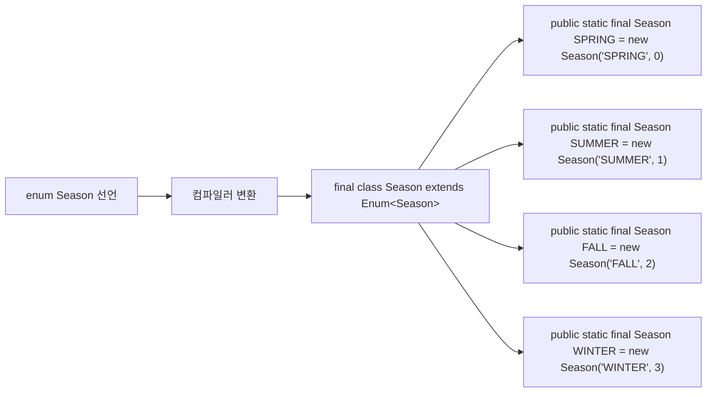
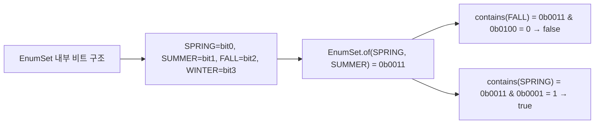
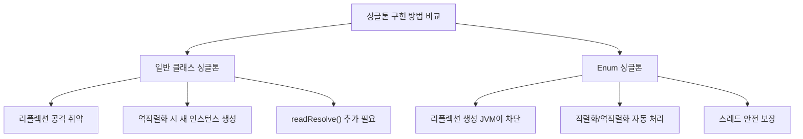
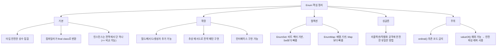

Java의 `enum`은 단순히 상수 집합을 표현하는 것을 넘어, 필드·메서드·추상 메서드를 가질 수 있는 완전한 클래스입니다. 상수 대신 Enum을 사용해야 하는 이유부터 EnumSet, EnumMap, 싱글톤 패턴까지 완전히 정리합니다.

> **비유:** Enum은 "번호표"가 아니라 "신분증"입니다. 정수 상수가 번호표(숫자만 적혀 있고, 아무 번호나 끼워넣을 수 있음)라면, Enum은 사진·이름·주민번호가 모두 박힌 신분증입니다. 위조가 불가능하고(타입 안전), 신분증에 적힌 정보로 바로 업무를 처리할 수 있습니다(필드·메서드 내장).

---

## 1. Enum이란? 왜 상수 대신 Enum을 쓰는가

### 정수 상수 패턴의 문제점

정수 상수 패턴의 핵심 문제는 **타입 안전성 없음**입니다. 메서드 시그니처에 `int`를 쓰면 컴파일러는 어떤 정수도 받아들입니다. 신호등 색상 상수에 999를 넘겨도, 음수를 넘겨도 컴파일 단계에서 막을 방법이 없습니다.

```java
// 안티패턴: 정수 상수
public class Season {
    public static final int SPRING = 0;
    public static final int SUMMER = 1;
    public static final int FALL   = 2;
    public static final int WINTER = 3;
}

// 문제점
void doSomething(int season) { ... }
doSomething(Season.SPRING);  // OK
doSomething(999);            // 컴파일 에러 없음! 런타임 버그
doSomething(0);              // 어떤 계절인지 의미 불명확
```

### Enum으로 해결

```java
// Enum: 타입 안전 상수
public enum Season {
    SPRING, SUMMER, FALL, WINTER
}

void doSomething(Season season) { ... }
doSomething(Season.SPRING);  // OK
doSomething(999);            // 컴파일 에러! — 타입 안전
```

### 상수 패턴 vs Enum 비교

| 항목 | 정수 상수 | Enum |
|------|-----------|------|
| 타입 안전 | X | O |
| 의미 있는 이름 | X (숫자) | O (SPRING) |
| switch 사용 | O | O |
| 메서드 추가 | X | O |
| 네임스페이스 | X (충돌 위험) | O (Season.SPRING) |
| 디버깅 | 숫자만 표시 | 이름 표시 |
| 확장성 | 어려움 | 쉬움 |

---

## 2. Enum 내부 구현 (컴파일 시 클래스 변환)

> **비유:** Enum 선언은 "주문서"이고, 컴파일러는 "공장"입니다. 개발자가 `enum Season { SPRING, SUMMER, FALL, WINTER }`라고 주문서를 쓰면, 컴파일러 공장이 `final class` + `static final` 인스턴스 4개를 찍어냅니다. 공장 문은 잠겨 있어서(private 생성자) 외부에서 추가 인스턴스를 만들 수 없습니다.

### 동작 원리

`enum`을 선언하면 컴파일러는 내부적으로 `java.lang.Enum<E>`를 상속하는 `final class`로 변환합니다. 각 상수는 해당 클래스의 `public static final` 인스턴스로 생성되며, JVM이 클래스를 로딩하는 시점에 딱 한 번 초기화됩니다. 이 덕분에 JVM 전체에서 동일한 상수는 항상 동일한 인스턴스(`==` 비교 가능)임이 보장됩니다.



### 컴파일러가 생성하는 코드

```java
// 작성한 코드
public enum Season {
    SPRING, SUMMER, FALL, WINTER
}

// 컴파일러가 생성하는 코드 (대략적)
public final class Season extends Enum<Season> {
    public static final Season SPRING = new Season("SPRING", 0);
    public static final Season SUMMER = new Season("SUMMER", 1);
    public static final Season FALL   = new Season("FALL",   2);
    public static final Season WINTER = new Season("WINTER", 3);

    private static final Season[] $VALUES = { SPRING, SUMMER, FALL, WINTER };

    private Season(String name, int ordinal) {
        super(name, ordinal);
    }

    public static Season[] values() {
        return $VALUES.clone();
    }

    public static Season valueOf(String name) {
        return Enum.valueOf(Season.class, name);
    }
}
```

컴파일러가 생성한 코드를 보면 `final class`이므로 상속이 불가능하고, 생성자가 `private`이므로 외부에서 새 인스턴스를 만들 수도 없습니다. 이 두 가지 제약이 "상수 집합으로서의 Enum" 의미를 강제합니다.

### Enum의 특성

```java
// 1. final 클래스 — 상속 불가
// class MySeason extends Season { }  // 컴파일 에러!

// 2. Enum끼리 상속 불가 (java.lang.Enum만 상속)
// enum Child extends Season { }  // 문법 자체 없음

// 3. 인터페이스 구현 가능
enum Season implements Printable {
    SPRING, SUMMER, FALL, WINTER;

    @Override
    public void print() {
        System.out.println(name());
    }
}

// 4. 인스턴스는 JVM 전역에서 단 하나
Season s1 = Season.SPRING;
Season s2 = Season.SPRING;
System.out.println(s1 == s2);  // true (항상)
```

---

## 3. Enum 기본 메서드

> **비유:** Enum 기본 메서드는 신분증의 기본 정보란입니다. `name()`은 신분증에 적힌 이름, `ordinal()`은 발급 순서 번호, `valueOf()`는 이름으로 신분증을 조회하는 민원 창구입니다. 단, `ordinal()`(발급 순서)에 의존하는 것은 직원 번호가 바뀔 때마다 시스템이 깨지는 것과 같습니다.

### java.lang.Enum이 제공하는 메서드

```java
Season s = Season.SUMMER;

// name() — 선언된 이름 반환
s.name()         // "SUMMER"

// ordinal() — 선언 순서 (0부터)
s.ordinal()      // 1

// toString() — 기본적으로 name()과 동일, 오버라이딩 가능
s.toString()     // "SUMMER"

// compareTo() — ordinal 기준 비교
Season.SPRING.compareTo(Season.WINTER)  // 음수 (SPRING < WINTER)

// values() — 모든 상수 배열 반환
Season[] seasons = Season.values();

// valueOf() — 이름으로 상수 반환
Season spring = Season.valueOf("SPRING");
// 없는 이름이면 IllegalArgumentException
```

### 실용적인 활용

```java
// 모든 상수 순회
for (Season s : Season.values()) {
    System.out.println(s.ordinal() + ": " + s.name());
}
// 0: SPRING
// 1: SUMMER
// 2: FALL
// 3: WINTER

// switch 문
Season season = Season.SUMMER;
switch (season) {
    case SPRING -> System.out.println("봄");
    case SUMMER -> System.out.println("여름");
    case FALL   -> System.out.println("가을");
    case WINTER -> System.out.println("겨울");
}

// Java 14+ switch 표현식
String korean = switch (season) {
    case SPRING -> "봄";
    case SUMMER -> "여름";
    case FALL   -> "가을";
    case WINTER -> "겨울";
};
```

### ordinal() 사용 주의

`ordinal()`에 의존하는 코드는 Enum 상수의 순서가 바뀌거나 중간에 새 상수가 추가되면 전체 로직이 무너집니다. DB에 ordinal 값을 저장하고 있다면 새 상수를 추가하는 것만으로도 데이터 정합성이 깨질 수 있습니다.

```java
// ordinal()에 의존하는 코드는 위험
// 상수 순서가 바뀌면 전체 로직 붕괴
int idx = season.ordinal();  // 피하는 것이 좋음

// 대신 명시적 필드 사용
enum Season {
    SPRING(1), SUMMER(2), FALL(3), WINTER(4);
    private final int number;
    Season(int number) { this.number = number; }
    public int getNumber() { return number; }
}
```

---

## 4. Enum에 필드 / 메서드 / 생성자 추가

> **비유:** 기본 Enum이 이름만 적힌 명함이라면, 필드와 메서드를 추가한 Enum은 직함·연락처·전문 분야까지 적힌 비즈니스 카드입니다. 명함 하나를 건네면 상대방이 바로 업무를 처리할 수 있듯이, Enum 상수 하나에 데이터와 행동이 모두 들어있어 별도의 조회 없이 즉시 사용할 수 있습니다.

### 동작 원리

Enum 생성자는 항상 `private`이며 각 상수 선언 시 한 번만 호출됩니다. 필드와 메서드를 추가하면 Enum이 단순한 상수 목록을 넘어 **데이터와 행동을 함께 캡슐화**하는 완전한 도메인 객체가 됩니다.

### 필드와 생성자

```java
public enum Planet {
    MERCURY(3.303e+23, 2.4397e6),
    VENUS  (4.869e+24, 6.0518e6),
    EARTH  (5.976e+24, 6.37814e6),
    MARS   (6.421e+23, 3.3972e6);

    private final double mass;    // kg
    private final double radius;  // m

    // Enum 생성자는 항상 private (외부 생성 불가)
    Planet(double mass, double radius) {
        this.mass = mass;
        this.radius = radius;
    }

    static final double G = 6.67300E-11;

    // 메서드 추가 가능
    double surfaceGravity() {
        return G * mass / (radius * radius);
    }

    double surfaceWeight(double otherMass) {
        return otherMass * surfaceGravity();
    }
}

// 사용
double earthWeight = 75.0;
double mass = earthWeight / Planet.EARTH.surfaceGravity();
for (Planet p : Planet.values()) {
    System.out.printf("체중 on %s: %6.2f%n", p, p.surfaceWeight(mass));
}
```

### 인터페이스 구현

```java
interface Discountable {
    double discount();
}

public enum MemberGrade implements Discountable {
    BRONZE {
        @Override
        public double discount() { return 0.05; }
    },
    SILVER {
        @Override
        public double discount() { return 0.10; }
    },
    GOLD {
        @Override
        public double discount() { return 0.20; }
    };
}
```

---

## 5. Enum + 추상 메서드 (전략 패턴)

> **비유:** 추상 메서드가 있는 Enum은 "같은 직급, 다른 업무"를 가진 팀원들입니다. `Operation.PLUS`와 `Operation.DIVIDE`는 모두 "연산자"라는 같은 직급이지만, 실제로 수행하는 계산은 완전히 다릅니다. 새 팀원(상수)을 추가할 때 "네 업무가 뭐야?"(추상 메서드 구현)를 반드시 정의해야 하므로 빠뜨릴 수 없습니다.

### 동작 원리

각 Enum 상수가 추상 메서드를 서로 다르게 구현하면 `if-else` 체인 없이 상수 자체가 분기 로직을 내포하게 됩니다. 새 연산을 추가할 때 기존 코드를 수정하지 않고 상수만 추가하면 되므로 개방-폐쇄 원칙을 지킵니다.

### 각 상수마다 다른 동작 구현

```java
public enum Operation {
    PLUS("+") {
        @Override
        public double apply(double x, double y) { return x + y; }
    },
    MINUS("-") {
        @Override
        public double apply(double x, double y) { return x - y; }
    },
    TIMES("*") {
        @Override
        public double apply(double x, double y) { return x * y; }
    },
    DIVIDE("/") {
        @Override
        public double apply(double x, double y) { return x / y; }
    };

    private final String symbol;

    Operation(String symbol) {
        this.symbol = symbol;
    }

    // 추상 메서드 — 각 상수가 반드시 구현
    public abstract double apply(double x, double y);

    @Override
    public String toString() { return symbol; }
}

// 사용
double x = 10, y = 3;
for (Operation op : Operation.values()) {
    System.out.printf("%.1f %s %.1f = %.1f%n", x, op, y, op.apply(x, y));
}
// 10.0 + 3.0 = 13.0
// 10.0 - 3.0 = 7.0
// 10.0 * 3.0 = 30.0
// 10.0 / 3.0 = 3.3
```

### 람다를 필드로 사용하는 패턴 (Java 8+)

```java
import java.util.function.DoubleBinaryOperator;

public enum Operation {
    PLUS  ("+", (x, y) -> x + y),
    MINUS ("-", (x, y) -> x - y),
    TIMES ("*", (x, y) -> x * y),
    DIVIDE("/", (x, y) -> x / y);

    private final String symbol;
    private final DoubleBinaryOperator op;

    Operation(String symbol, DoubleBinaryOperator op) {
        this.symbol = symbol;
        this.op = op;
    }

    public double apply(double x, double y) {
        return op.applyAsDouble(x, y);
    }

    @Override
    public String toString() { return symbol; }
}
```

### 전략 Enum 패턴

```java
// 요일별 급여 계산
public enum PayrollDay {
    MONDAY, TUESDAY, WEDNESDAY, THURSDAY, FRIDAY,
    SATURDAY(PayType.WEEKEND), SUNDAY(PayType.WEEKEND);

    private final PayType payType;

    PayrollDay() { this.payType = PayType.WEEKDAY; }
    PayrollDay(PayType payType) { this.payType = payType; }

    int pay(int minutesWorked, int payRate) {
        return payType.pay(minutesWorked, payRate);
    }

    // 전략 열거 타입
    enum PayType {
        WEEKDAY {
            @Override
            int overtimePay(int mins, int payRate) {
                return mins <= MINS_PER_SHIFT ? 0 : (mins - MINS_PER_SHIFT) * payRate / 2;
            }
        },
        WEEKEND {
            @Override
            int overtimePay(int mins, int payRate) {
                return mins * payRate / 2;
            }
        };

        abstract int overtimePay(int mins, int payRate);
        private static final int MINS_PER_SHIFT = 8 * 60;

        int pay(int minsWorked, int payRate) {
            int basePay = minsWorked * payRate;
            return basePay + overtimePay(minsWorked, payRate);
        }
    }
}
```

---

## 6. EnumSet, EnumMap 활용

> **비유:** `EnumSet`은 스위치 패널입니다. 4개의 스위치(Enum 상수)가 있고, 각 스위치는 ON(포함) 또는 OFF(미포함) 두 가지 상태만 가집니다. 내부적으로 비트 하나가 스위치 하나를 표현하므로 `long` 하나(64비트)로 64개 스위치를 관리합니다. `EnumMap`은 사물함입니다. 번호(ordinal)별로 칸이 고정되어 있어 해시 계산 없이 바로 해당 칸을 열 수 있습니다.

### EnumSet 동작 원리

`EnumSet`은 내부적으로 `long` 타입의 비트 벡터 하나로 최대 64개 Enum 상수를 표현합니다. 예를 들어 `SPRING=0, SUMMER=1, FALL=2, WINTER=3`이라면 `EnumSet.of(SPRING, FALL)`은 내부적으로 `0b0101`(십진수 5)를 저장합니다. `contains()`, `add()`, `remove()` 모두 비트 연산 한 번으로 처리되어 극도로 빠릅니다.

```java
import java.util.EnumSet;

// 비트 벡터 기반 — 극도로 빠른 집합 연산
EnumSet<Season> springAndSummer = EnumSet.of(Season.SPRING, Season.SUMMER);
EnumSet<Season> all = EnumSet.allOf(Season.class);
EnumSet<Season> none = EnumSet.noneOf(Season.class);
EnumSet<Season> complement = EnumSet.complementOf(springAndSummer);

// 집합 연산
springAndSummer.contains(Season.SPRING);  // true
springAndSummer.add(Season.FALL);
springAndSummer.remove(Season.SPRING);
```



```java
// 권한(Permission) 표현 — 실무 활용
public enum Permission {
    READ, WRITE, EXECUTE, DELETE
}

// 사용자 권한 설정
EnumSet<Permission> adminPermissions = EnumSet.allOf(Permission.class);
EnumSet<Permission> readOnly = EnumSet.of(Permission.READ);
EnumSet<Permission> userPermissions = EnumSet.of(Permission.READ, Permission.WRITE);

// 권한 체크
if (userPermissions.contains(Permission.WRITE)) {
    // 쓰기 허용
}
```

### EnumMap 동작 원리

`EnumMap`은 Enum의 `ordinal()`을 배열 인덱스로 사용합니다. 해시 계산이 전혀 없고 배열의 특정 위치에 직접 접근하므로 `HashMap`보다 훨씬 빠릅니다.

```java
import java.util.EnumMap;

// 배열 기반 — 일반 HashMap보다 빠름
EnumMap<Season, String> activities = new EnumMap<>(Season.class);
activities.put(Season.SPRING, "꽃구경");
activities.put(Season.SUMMER, "수영");
activities.put(Season.FALL, "단풍놀이");
activities.put(Season.WINTER, "스키");

System.out.println(activities.get(Season.SUMMER));  // 수영

// 순서 보장 (선언 순서)
activities.forEach((season, activity) ->
    System.out.println(season + ": " + activity));
// SPRING: 꽃구경
// SUMMER: 수영
// FALL: 단풍놀이
// WINTER: 스키
```

내부 배열 구조:

| 인덱스 | 값 | 대응 상수 |
|--------|-----|----------|
| [0] | "꽃구경" | SPRING (ordinal=0) |
| [1] | "수영" | SUMMER (ordinal=1) |
| [2] | "단풍놀이" | FALL (ordinal=2) |
| [3] | "스키" | WINTER (ordinal=3) |

### EnumSet / EnumMap vs 일반 컬렉션

```java
// 일반 HashSet/HashMap 사용 금지 (Enum일 때)
Set<Season> set = new HashSet<>();        // 느림
Map<Season, String> map = new HashMap<>(); // 느림

// EnumSet / EnumMap 사용 (성능 + 명확성)
Set<Season> set = EnumSet.noneOf(Season.class);  // 빠름
Map<Season, String> map = new EnumMap<>(Season.class); // 빠름
```

---

## 7. Enum 싱글톤 패턴

> **비유:** Enum 싱글톤은 국가에 단 하나뿐인 중앙은행입니다. 법률(JVM)이 중앙은행을 딱 하나만 허용하고, 누군가 위조 중앙은행을 만들려고 해도(리플렉션) 법률이 차단합니다. 일반 클래스 싱글톤은 "이 건물이 본점입니다"라고 약속하는 수준이라 뒷문(리플렉션)으로 들어오면 막을 방법이 없습니다.

### Enum 싱글톤이란?

Joshua Bloch(Effective Java)이 권장하는 싱글톤 구현 방식입니다.

```java
public enum DatabaseConnection {
    INSTANCE;

    private final Connection connection;

    DatabaseConnection() {
        // 싱글톤 초기화 — JVM이 한 번만 실행 보장
        try {
            this.connection = DriverManager.getConnection(
                "jdbc:mysql://localhost:3306/mydb", "user", "password"
            );
        } catch (SQLException e) {
            throw new RuntimeException("DB 연결 실패", e);
        }
    }

    public Connection getConnection() {
        return connection;
    }

    public void executeQuery(String sql) {
        // ...
    }
}

// 사용
Connection conn = DatabaseConnection.INSTANCE.getConnection();
```

### Enum 싱글톤의 장점

일반 싱글톤은 두 가지 공격에 취약합니다. 첫째, 리플렉션으로 `private` 생성자를 강제 호출해 두 번째 인스턴스를 만들 수 있습니다. 둘째, 역직렬화 시 새 인스턴스가 생성될 수 있어 `readResolve()` 메서드를 별도로 추가해야 합니다. Enum은 JVM이 이 두 경우를 언어 수준에서 원천 차단합니다.



```java
// 리플렉션 공격 불가
try {
    Constructor<DatabaseConnection> c =
        DatabaseConnection.class.getDeclaredConstructor(String.class, int.class);
    c.setAccessible(true);
    c.newInstance("INSTANCE", 0);
} catch (Exception e) {
    // java.lang.IllegalArgumentException: Cannot reflectively create enum objects
}
```

### 실무에서의 Enum 싱글톤

```java
// 설정 관리
public enum AppConfig {
    INSTANCE;

    private final Properties props = new Properties();

    AppConfig() {
        try (InputStream is = getClass().getResourceAsStream("/app.properties")) {
            props.load(is);
        } catch (IOException e) {
            throw new RuntimeException(e);
        }
    }

    public String get(String key) {
        return props.getProperty(key);
    }

    public String get(String key, String defaultValue) {
        return props.getProperty(key, defaultValue);
    }
}

// 사용
String host = AppConfig.INSTANCE.get("db.host", "localhost");
```

---

## 8. 실무 활용 패턴

> **비유:** Enum 활용 패턴은 스위스 아미 나이프입니다. 같은 도구(Enum)인데 상태 머신으로 쓰면 칼날, 안전 파싱으로 쓰면 가위, 전략 패턴으로 쓰면 드라이버가 됩니다. 핵심은 "상수에 행동을 입히면 if-else 체인이 사라진다"는 것입니다.

### 상태 머신 (State Machine)

```java
public enum OrderStatus {
    PENDING {
        @Override
        public OrderStatus next() { return CONFIRMED; }
        @Override
        public boolean canCancel() { return true; }
    },
    CONFIRMED {
        @Override
        public OrderStatus next() { return SHIPPED; }
        @Override
        public boolean canCancel() { return true; }
    },
    SHIPPED {
        @Override
        public OrderStatus next() { return DELIVERED; }
        @Override
        public boolean canCancel() { return false; }
    },
    DELIVERED {
        @Override
        public OrderStatus next() { throw new IllegalStateException("최종 상태"); }
        @Override
        public boolean canCancel() { return false; }
    };

    public abstract OrderStatus next();
    public abstract boolean canCancel();
}

// 사용
OrderStatus status = OrderStatus.PENDING;
if (status.canCancel()) {
    System.out.println("취소 가능");
}
status = status.next();  // CONFIRMED
```

### valueOf 안전 파싱

```java
// valueOf는 없는 이름이면 예외
Season s = Season.valueOf("INVALID");  // IllegalArgumentException!

// 안전한 파싱 유틸
public static <T extends Enum<T>> Optional<T> safeValueOf(Class<T> enumClass, String name) {
    try {
        return Optional.of(Enum.valueOf(enumClass, name));
    } catch (IllegalArgumentException e) {
        return Optional.empty();
    }
}

// 또는 Map으로 구현
public enum Season {
    SPRING, SUMMER, FALL, WINTER;

    private static final Map<String, Season> BY_NAME = Arrays.stream(values())
        .collect(Collectors.toMap(Season::name, s -> s));

    public static Optional<Season> fromName(String name) {
        return Optional.ofNullable(BY_NAME.get(name));
    }
}
```

**실무 실수:** 외부 API나 DB에서 받은 문자열을 그대로 `valueOf()`에 넣으면 대소문자 불일치 또는 오타 하나로 `IllegalArgumentException`이 발생해 전체 요청이 실패합니다. 안전 파싱 래퍼를 항상 사용하세요.

---

<details class="extreme-scenario-details" ontoggle="if(this.open){var ad=this.querySelector('.extreme-scenario-ad');if(ad&&!ad.dataset.loaded){ad.dataset.loaded='1';(adsbygoogle=window.adsbygoogle||[]).push({});}}">
<summary class="extreme-scenario-summary">
<span class="extreme-scenario-icon">🔥</span>
<span class="extreme-scenario-label">극한 시나리오 — 클릭하여 펼치기</span>
<span class="extreme-scenario-toggle"></span>
</summary>
<div class="extreme-scenario-body">
<div class="extreme-scenario-ad" style="text-align:center; margin-bottom:1.5em;">
<ins class="adsbygoogle"
     style="display:block"
     data-ad-client="ca-pub-7225106491387870"
     data-ad-slot="0000000000"
     data-ad-format="auto"
     data-full-width-responsive="true"></ins>
</div>
<div class="extreme-scenario-content" markdown="1">

### 시나리오 1: 주문 상태 관리 (100 TPS)

> **비유:** 택배 추적 시스템입니다. 상태가 "접수 → 확인 → 배송중 → 배달완료"로 흐르는데, 잘못된 상태 전이("배달완료 → 접수")를 허용하면 고객이 이미 받은 택배를 "접수 중"으로 보게 됩니다.

- **문제:** 주문 상태를 `String`으로 관리하면 오타("SHIPED"), 잘못된 전이("DELIVERED→PENDING"), 존재하지 않는 상태("LOST")를 컴파일 타임에 잡을 수 없습니다.
- **해결:** `OrderStatus` Enum에 `next()`, `canCancel()` 추상 메서드를 정의하여 상태 전이 규칙을 상수 자체에 내장합니다. 잘못된 전이는 `IllegalStateException`으로 즉시 차단합니다.
- **근거:** Enum 기반 상태 머신은 허용된 전이만 컴파일 타임에 보장하고, 새 상태 추가 시 추상 메서드 구현을 강제하므로 누락이 불가능합니다.

### 시나리오 2: 권한 시스템 (10K TPS)

> **비유:** 건물 출입증의 권한 스티커입니다. "읽기", "쓰기", "삭제" 스티커를 조합해서 붙이는데, `EnumSet`은 이 스티커 조합을 비트 하나씩으로 표현하므로 10,000번 권한 검사를 해도 비트 AND 연산 한 번으로 끝납니다.

- **문제:** 초당 10,000건의 API 요청마다 사용자 권한을 `HashSet<String>`으로 검사하면 해시 계산, 문자열 비교, GC 압력이 누적됩니다.
- **해결:** `EnumSet<Permission>`으로 교체하면 `contains()`가 비트 AND 한 번(`O(1)`, 분기 예측 친화)으로 처리됩니다. 64개 이하의 Enum이면 `long` 하나에 모든 권한이 들어갑니다.
- **근거:** `EnumSet.contains()`는 `(elements & (1L << ordinal)) != 0` 한 줄로 구현되어 `HashSet`보다 10배 이상 빠릅니다.

### 시나리오 3: 결제 수단 분기 (100K TPS)

> **비유:** 셀프 계산대에서 카드/현금/포인트를 처리하는 것입니다. if-else 체인은 계산원이 매번 "카드인가? 아니면 현금인가? 아니면 포인트인가?" 순서대로 물어보는 것이고, Enum 전략 패턴은 투입구에 넣는 순간 자동으로 해당 처리 로직이 실행되는 것입니다.

- **문제:** 결제 수단이 10가지이고 각 수단마다 수수료·정산·환불 로직이 다른데, `if-else` 체인으로 분기하면 새 결제 수단 추가 시 3곳을 동시에 수정해야 합니다.
- **해결:** `PaymentMethod` Enum에 `calcFee()`, `settle()`, `refund()` 추상 메서드를 정의하면 새 결제 수단 추가 시 한 곳(상수 선언)에서 모든 로직을 구현합니다.
- **근거:** switch 표현식 + sealed Enum은 컴파일러가 누락된 분기를 감지하므로 런타임 버그를 원천 차단합니다.

---
</div>
</div>
</details>

## 10. 실무에서 자주 하는 실수

### 실수 1: ordinal()을 DB에 저장

```java
// 위험: SPRING=0, SUMMER=1로 DB에 저장 후
// 나중에 PRE_SPRING을 맨 앞에 추가하면 전체 매핑 붕괴
int dbValue = season.ordinal();  // 절대 금지

// 해결: 명시적 코드 필드 사용
enum Season {
    SPRING("SP"), SUMMER("SM"), FALL("FL"), WINTER("WT");
    private final String code;
    // ...
}
```

### 실수 2: valueOf()를 예외 처리 없이 사용

```java
// 위험: 외부 입력을 그대로 valueOf()에 전달
Season s = Season.valueOf(request.getParameter("season"));  // IllegalArgumentException 가능!

// 해결: 안전 파싱 래퍼 사용
Optional<Season> s = safeValueOf(Season.class, input);
```

### 실수 3: Enum에 가변 필드 추가

```java
// 위험: Enum 인스턴스는 JVM 전역 싱글톤인데 가변 상태를 넣으면 스레드 안전 깨짐
enum Counter {
    INSTANCE;
    int count = 0;  // 여러 스레드에서 동시 접근 시 경쟁 조건 발생!
}

// 해결: 가변 상태가 필요하면 AtomicInteger 사용 또는 Enum 외부에 상태 관리
```

### 실수 4: == 대신 equals() 사용

```java
// 불필요: Enum은 인스턴스가 유일하므로 == 비교가 정확하고 빠름
if (season.equals(Season.SPRING)) { }  // 불필요한 메서드 호출
if (season == Season.SPRING) { }       // 권장: null-safe하고 빠름
```

### 실수 5: Enum 상수에 HashSet/HashMap 사용

```java
// 비효율: Enum 키에 HashMap 사용
Map<Season, String> map = new HashMap<>();  // 해시 계산 오버헤드

// 해결: EnumMap은 배열 직접 접근으로 해시 계산 제로
Map<Season, String> map = new EnumMap<>(Season.class);
```

---

## 11. 면접 포인트

### Q1: Enum이 내부적으로 어떻게 구현되나요?

**A:** 컴파일러가 `java.lang.Enum<E>`를 상속하는 `final class`로 변환합니다. 각 상수는 `public static final` 인스턴스로 클래스 로딩 시점에 한 번 생성됩니다. `final class`이므로 상속 불가, `private` 생성자이므로 외부 생성 불가, JVM이 인스턴스 유일성을 보장하므로 `==` 비교가 가능합니다.

### Q2: Enum 싱글톤이 일반 싱글톤보다 나은 이유는?

**A:** 두 가지 공격을 원천 차단합니다. 첫째, 리플렉션으로 `private` 생성자를 호출해도 JVM이 `IllegalArgumentException`을 던집니다. 둘째, 직렬화/역직렬화 시 자동으로 동일 인스턴스를 반환하므로 `readResolve()` 구현이 필요 없습니다. 또한 클래스 로딩 시 초기화되므로 별도 동기화도 불필요합니다.

### Q3: EnumSet이 HashSet보다 빠른 이유는?

**A:** `EnumSet`은 내부적으로 `long` 타입의 비트 벡터를 사용합니다. `contains()`는 `(elements & (1L << ordinal)) != 0`이라는 비트 AND 한 번으로 처리되므로 `O(1)`이고, `HashSet`처럼 해시 계산·버킷 탐색·`equals()` 호출이 없습니다. 64개 이하의 Enum이면 `RegularEnumSet`(long 1개), 65개 이상이면 `JumboEnumSet`(long 배열)을 사용합니다.

### Q4: ordinal()을 사용하면 안 되는 이유는?

**A:** `ordinal()`은 Enum 상수의 선언 순서에 의존합니다. 중간에 새 상수를 추가하거나 순서를 변경하면 기존 ordinal 값이 전부 바뀌어 DB에 저장된 값, 배열 인덱스, 프로토콜 코드 등이 모두 깨집니다. 대신 명시적인 코드 필드(`private final int code`)를 사용하여 순서와 무관한 매핑을 유지해야 합니다.

### Q5: Enum에 추상 메서드를 쓰는 것과 switch문의 차이는?

**A:** switch문은 새 상수를 추가해도 컴파일러가 분기 누락을 경고만 하거나(Java 17 이전) 무시합니다. 추상 메서드는 새 상수가 반드시 구현해야 하므로 빠뜨리면 컴파일 에러가 발생합니다. 개방-폐쇄 원칙을 지키며, 상수별 로직이 한 곳에 모여 가독성과 유지보수성이 높아집니다.

---

## 12. 전체 요약


