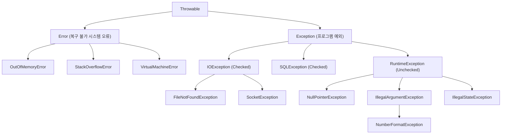
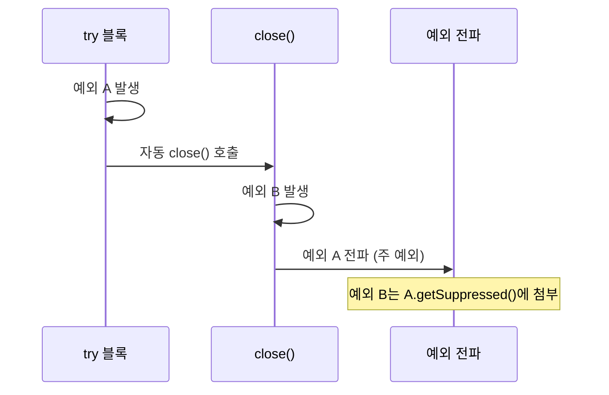
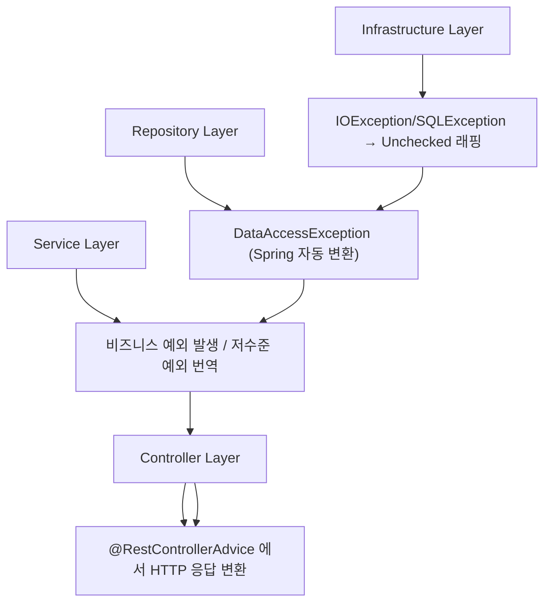
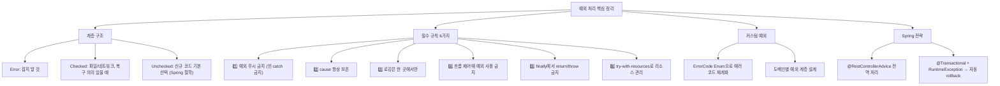

Java의 예외 처리는 단순한 try-catch 문법을 넘어, 시스템의 견고성과 유지보수성을 결정하는 설계 영역입니다. 예외 계층 구조부터 커스텀 예외 설계, Spring의 예외 전략까지 완전히 정리합니다.

---

## 1. 예외 계층 구조

### 동작 원리

JVM은 예외가 발생하면 해당 예외 타입과 `catch` 블록의 타입을 위에서 아래로 순서대로 대조합니다. `IOException`을 잡으려면 그보다 구체적인 `FileNotFoundException`을 먼저 선언해야 합니다. 컴파일러는 더 넓은 타입이 위에 있으면 아래 `catch`가 절대 도달 불가임을 감지하고 에러를 냅니다.



### Error

```java
// Error — JVM 레벨 문제, 절대 catch하지 말 것
try {
    recurse();
} catch (StackOverflowError e) {
    // 의미 없음 — 스택이 이미 가득 참
    // 복구 불가
}

// 올바른 대응
// → 로직 수정, 메모리/스택 설정 조정
// → catch (Throwable e) 도 피할 것
```

---

## 2. Checked vs Unchecked 예외

### 동작 원리

Checked 예외는 컴파일러가 처리 강제를 통해 "이 예외는 발생할 수 있으니 반드시 대비하세요"라는 계약을 코드 레벨에서 강제합니다. 반면 Unchecked(RuntimeException)는 개발자 실수나 프로그래밍 오류를 나타내며, 사전 조건 체크로 방지할 수 있는 경우가 많아 컴파일러가 강제하지 않습니다.

비유하자면, Checked는 "이 도로는 낙석 위험 지역이니 헬멧을 쓰고 가세요(컴파일러 강제)"이고, Unchecked는 "속도를 지키지 않으면 사고납니다(프로그래머 책임)"입니다.

### Checked 예외 (확인된 예외)

```java
// Exception을 직접 상속 (RuntimeException 제외)
// 컴파일러가 처리를 강제

public void readFile(String path) throws IOException {
    // 반드시 throws 선언 또는 try-catch
    FileReader fr = new FileReader(path);  // FileNotFoundException (Checked)
    // ...
}

// 호출 측도 처리해야 함
try {
    readFile("data.txt");
} catch (IOException e) {
    System.err.println("파일 읽기 실패: " + e.getMessage());
}
```

### Unchecked 예외 (RuntimeException)

```java
// RuntimeException 상속
// 컴파일러가 처리를 강제하지 않음

public int divide(int a, int b) {
    if (b == 0) throw new ArithmeticException("0으로 나눌 수 없음");
    return a / b;
}

// 호출 측이 선택적으로 처리
divide(10, 0);  // 예외 전파 (선택)
```

### 설계 철학: 언제 무엇을 쓸까

Checked 예외는 파일, 네트워크, DB처럼 외부 환경에 의존하고 호출 측에서 복구 가능한 상황에 씁니다. Unchecked는 잘못된 인수나 null 전달처럼 프로그래밍 오류(버그)에 씁니다. 현대 실무에서는 Checked 예외를 점점 기피하는 추세입니다. 중간 계층 전체에 `throws` 선언이 전파되고, 람다와 Stream에서 처리가 번거롭기 때문입니다.

```java
// Checked 예외와 Stream의 충돌
List<String> paths = List.of("a.txt", "b.txt");

// 컴파일 에러! — IOException은 Checked
paths.stream()
     .map(p -> new FileReader(p))  // IOException 처리 강요
     .collect(toList());

// 해결: Unchecked로 래핑
paths.stream()
     .map(p -> {
         try { return new FileReader(p); }
         catch (IOException e) { throw new RuntimeException(e); }
     })
     .collect(toList());

// 또는 유틸리티
@FunctionalInterface
interface ThrowingFunction<T, R> {
    R apply(T t) throws Exception;

    static <T, R> Function<T, R> wrap(ThrowingFunction<T, R> f) {
        return t -> {
            try { return f.apply(t); }
            catch (Exception e) { throw new RuntimeException(e); }
        };
    }
}

paths.stream()
     .map(ThrowingFunction.wrap(FileReader::new))
     .collect(toList());
```

---

## 3. try-catch-finally 동작

### 동작 원리

`try` 블록에서 예외가 발생하면 JVM은 즉시 나머지 코드 실행을 중단하고 `catch` 블록을 순서대로 탐색합니다. 일치하는 타입을 찾으면 해당 `catch`를 실행하고, 없으면 예외를 호출 스택으로 전파합니다. `finally`는 예외 발생 여부, `return` 여부와 무관하게 항상 실행됩니다. 이 덕분에 리소스 해제 코드를 `finally`에 두면 어떤 경로로 빠져나가도 안전합니다.

### 기본 구조

```java
try {
    // 예외 발생 가능 코드
    int result = riskyOperation();
} catch (NullPointerException e) {
    // 특정 예외 처리
    System.err.println("NPE: " + e.getMessage());
} catch (IllegalArgumentException e) {
    // 또 다른 예외 처리
    System.err.println("잘못된 인수: " + e.getMessage());
} catch (Exception e) {
    // 상위 타입 — 더 구체적인 catch 뒤에 위치
    System.err.println("기타 예외: " + e.getMessage());
} finally {
    // 예외 여부와 무관하게 항상 실행
    cleanup();
}
```

### finally 실행 보장

```java
// return이 있어도 finally 실행
public int test() {
    try {
        return 1;
    } finally {
        System.out.println("finally 실행");  // 항상 출력
        // return 2;  // 이렇게 하면 finally의 return이 이김!
    }
}

// 예외가 발생해도 finally 실행
try {
    throw new RuntimeException("에러");
} finally {
    System.out.println("finally 실행");  // 출력 후 예외 전파
}
```

### finally에서 예외 발생 시

```java
try {
    throw new RuntimeException("원래 예외");
} finally {
    throw new RuntimeException("finally 예외");  // 원래 예외가 사라짐!
}
// → "finally 예외"만 전파 (원래 예외 소멸)
// 이 때문에 finally에서 예외를 던지면 안 됨
```

**극한 시나리오:** `finally`에서 예외가 발생하면 원래 `try` 블록의 예외가 통째로 삼켜집니다. 운영 로그에 "finally 예외"만 남고 원래 원인이 사라지면 디버깅이 극도로 어려워집니다.

### catch 순서

```java
// 잘못된 순서 — 컴파일 에러
try { }
catch (Exception e) { }     // 상위 먼저
catch (IOException e) { }   // 컴파일 에러! 도달 불가 코드

// 올바른 순서 — 구체적인 것 먼저
try { }
catch (FileNotFoundException e) { }  // 더 구체적
catch (IOException e) { }            // 덜 구체적
catch (Exception e) { }              // 가장 상위
```

---

## 4. try-with-resources (AutoCloseable)

### 동작 원리

`try-with-resources`는 컴파일러가 자동으로 `finally { resource.close(); }` 코드를 생성합니다. 단순한 편의 문법이 아니라 **Suppressed Exception** 처리도 자동으로 해줍니다. `try` 블록과 `close()` 양쪽에서 예외가 발생하면, `try` 예외를 주 예외로 전파하고 `close()` 예외는 `getSuppressed()`로 조회할 수 있는 억제된 예외로 첨부합니다.



### 기본 동작

```java
// Java 7 이전 — 번거로운 finally
BufferedReader br = null;
try {
    br = new BufferedReader(new FileReader("file.txt"));
    String line = br.readLine();
} catch (IOException e) {
    e.printStackTrace();
} finally {
    if (br != null) {
        try { br.close(); }
        catch (IOException e) { e.printStackTrace(); }
    }
}

// Java 7+ try-with-resources — close() 자동 호출
try (BufferedReader br = new BufferedReader(new FileReader("file.txt"))) {
    String line = br.readLine();
    System.out.println(line);
} catch (IOException e) {
    e.printStackTrace();
}
// 블록을 벗어나면 br.close() 자동 호출
```

### 다중 리소스

```java
// 선언 역순으로 close() 호출
try (
    Connection conn = dataSource.getConnection();
    PreparedStatement ps = conn.prepareStatement("SELECT * FROM users");
    ResultSet rs = ps.executeQuery()
) {
    while (rs.next()) {
        System.out.println(rs.getString("name"));
    }
}
// rs.close() → ps.close() → conn.close() 순서

// Java 9+: 기존 변수 사용 가능
Connection conn = dataSource.getConnection();
try (conn) {  // effectively final이어야 함
    // ...
}
```

### Suppressed Exception

```java
// try 블록과 close()에서 동시에 예외 발생 시
// → try 예외가 주 예외, close() 예외는 suppressed
class BrokenResource implements AutoCloseable {
    public void use() throws Exception {
        throw new Exception("use 예외");
    }

    @Override
    public void close() throws Exception {
        throw new Exception("close 예외");
    }
}

try (BrokenResource r = new BrokenResource()) {
    r.use();
} catch (Exception e) {
    System.out.println(e.getMessage());           // "use 예외" (주 예외)
    Throwable[] suppressed = e.getSuppressed();
    System.out.println(suppressed[0].getMessage()); // "close 예외" (억제됨)
}
```

### AutoCloseable 구현

```java
public class DatabaseTransaction implements AutoCloseable {
    private final Connection conn;
    private boolean committed = false;

    public DatabaseTransaction(DataSource ds) throws SQLException {
        this.conn = ds.getConnection();
        this.conn.setAutoCommit(false);
    }

    public void commit() throws SQLException {
        conn.commit();
        committed = true;
    }

    @Override
    public void close() throws SQLException {
        try {
            if (!committed) {
                conn.rollback();  // 커밋 안 하면 자동 롤백
            }
        } finally {
            conn.close();
        }
    }
}

// 사용
try (DatabaseTransaction tx = new DatabaseTransaction(dataSource)) {
    // DB 작업
    tx.commit();
}  // 예외 발생 시 자동 rollback + close
```

---

## 5. 멀티 캐치, 예외 되던지기

### 멀티 캐치 (Java 7+)

```java
// Java 7 이전 — 반복
try {
    // ...
} catch (IOException e) {
    log.error("IO 오류", e);
    throw new ServiceException(e);
} catch (SQLException e) {
    log.error("DB 오류", e);
    throw new ServiceException(e);
}

// Java 7+ 멀티 캐치 — 중복 제거
try {
    // ...
} catch (IOException | SQLException e) {
    log.error("오류", e);
    throw new ServiceException(e);
    // 주의: e는 사실상 final — e = new IOException() 불가
}
```

### 예외 되던지기 (Re-throwing)

```java
// 1. 그대로 되던지기
try {
    riskyOperation();
} catch (IOException e) {
    log.error("실패", e);
    throw e;  // 다시 던지기
}

// 2. 래핑해서 던지기 (예외 번역)
try {
    lowLevelOperation();
} catch (SQLException e) {
    // 저수준 예외를 고수준 예외로 변환
    throw new DataAccessException("DB 오류", e);  // cause 보존!
}

// 3. 예외 체이닝 — cause 보존이 핵심
// e.getCause() 로 원래 예외를 추적 가능
```

### Java 7 정밀 재던지기 (Precise Rethrow)

```java
// Java 7+: catch (Exception e) 로 잡아도 실제 예외 타입으로 던질 수 있음
public void method() throws IOException, SQLException {
    try {
        // IOException 또는 SQLException 발생 가능
        riskyOperation();
    } catch (Exception e) {
        log.error("오류", e);
        throw e;  // 컴파일러가 IOException | SQLException임을 추론
    }
}
```

---

## 6. 커스텀 예외 설계

### 동작 원리

커스텀 예외의 핵심은 **도메인 언어로 오류를 표현**하는 것입니다. `RuntimeException`을 상속해 Unchecked로 만들고, 에러 코드를 `Enum`으로 체계화하면 `@ControllerAdvice`에서 HTTP 상태 코드와 응답 코드를 일관되게 매핑할 수 있습니다.

### 기본 패턴

```java
// Unchecked 커스텀 예외 (권장)
public class UserNotFoundException extends RuntimeException {

    private final long userId;

    public UserNotFoundException(long userId) {
        super("사용자를 찾을 수 없습니다. id=" + userId);
        this.userId = userId;
    }

    public UserNotFoundException(long userId, Throwable cause) {
        super("사용자를 찾을 수 없습니다. id=" + userId, cause);
        this.userId = userId;
    }

    public long getUserId() {
        return userId;
    }
}
```

### 예외 계층 설계

```java
// 도메인별 예외 계층
public class AppException extends RuntimeException {
    private final ErrorCode errorCode;

    public AppException(ErrorCode errorCode) {
        super(errorCode.getMessage());
        this.errorCode = errorCode;
    }

    public AppException(ErrorCode errorCode, Throwable cause) {
        super(errorCode.getMessage(), cause);
        this.errorCode = errorCode;
    }

    public ErrorCode getErrorCode() {
        return errorCode;
    }
}

public class UserException extends AppException {
    public UserException(ErrorCode errorCode) {
        super(errorCode);
    }
}

public class OrderException extends AppException {
    private final long orderId;

    public OrderException(ErrorCode errorCode, long orderId) {
        super(errorCode);
        this.orderId = orderId;
    }
}

// 에러 코드 Enum
public enum ErrorCode {
    USER_NOT_FOUND("U001", "사용자를 찾을 수 없습니다"),
    USER_ALREADY_EXISTS("U002", "이미 존재하는 사용자입니다"),
    ORDER_NOT_FOUND("O001", "주문을 찾을 수 없습니다"),
    INSUFFICIENT_STOCK("O002", "재고가 부족합니다");

    private final String code;
    private final String message;

    ErrorCode(String code, String message) {
        this.code = code;
        this.message = message;
    }

    public String getCode() { return code; }
    public String getMessage() { return message; }
}
```

### 커스텀 예외 생성자 4종

```java
public class CustomException extends RuntimeException {

    // 1. 메시지만
    public CustomException(String message) {
        super(message);
    }

    // 2. 메시지 + 원인
    public CustomException(String message, Throwable cause) {
        super(message, cause);
    }

    // 3. 원인만
    public CustomException(Throwable cause) {
        super(cause);
    }

    // 4. 모두 (suppression, writable stacktrace 제어)
    protected CustomException(String message, Throwable cause,
                              boolean enableSuppression,
                              boolean writableStackTrace) {
        super(message, cause, enableSuppression, writableStackTrace);
    }
}
```

---

## 7. 예외 처리 안티패턴

### 안티패턴 1: catch로 예외 무시

```java
// 최악의 패턴 — 예외 삼키기
try {
    importantOperation();
} catch (Exception e) {
    // 아무것도 안 함 — 문제가 있음을 나중에야 알게 됨
}

// 최소한 로깅
try {
    importantOperation();
} catch (Exception e) {
    log.error("예상치 못한 오류", e);
    // 또는 재던지기
}
```

### 안티패턴 2: 너무 광범위한 catch

```java
// 나쁜 예
try {
    String s = null;
    s.length();      // NPE
    int[] arr = {};
    arr[5] = 1;      // ArrayIndexOutOfBoundsException
    Integer.parseInt("abc");  // NumberFormatException
} catch (Exception e) {
    // 무슨 예외인지 알 수 없음
    System.out.println("오류: " + e.getMessage());
}

// 좋은 예 — 구체적인 예외 처리
try {
    processInput(input);
} catch (NumberFormatException e) {
    throw new IllegalArgumentException("숫자가 아닌 입력: " + input, e);
}
```

### 안티패턴 3: 흐름 제어에 예외 사용

예외는 예외적 상황을 위한 것입니다. 예외를 정상 흐름 분기에 사용하면 JVM이 스택 트레이스를 생성하는 비용이 발생해 매우 느립니다. 반복문에서 사용하면 성능이 수십 배 저하될 수 있습니다.

```java
// 나쁜 예 — 예외로 흐름 제어 (매우 느림)
try {
    int value = Integer.parseInt(input);
    return value;
} catch (NumberFormatException e) {
    return defaultValue;  // 예외로 기본값 분기 — 느리고 나쁜 설계
}

// 좋은 예 — 명시적 체크
if (isNumeric(input)) {
    return Integer.parseInt(input);
}
return defaultValue;

// 또는 Optional 활용
return parseIntSafely(input).orElse(defaultValue);
```

### 안티패턴 4: cause 없이 예외 번역

```java
// 나쁜 예 — 원인 소멸
try {
    db.query(sql);
} catch (SQLException e) {
    throw new ServiceException("DB 오류");  // cause 누락! 스택 트레이스 소실
}

// 좋은 예 — cause 보존
try {
    db.query(sql);
} catch (SQLException e) {
    throw new ServiceException("DB 오류", e);  // 원인 체이닝
}
```

**실무 실수:** `cause`를 전달하지 않으면 운영 로그에 "DB 오류"만 남고 원래 SQL 예외 정보가 사라집니다. 새벽 장애 대응 때 원인을 알 수 없는 최악의 상황이 됩니다.

### 안티패턴 5: 스택 트레이스 출력 후 재던지기

```java
// 나쁜 예 — 중복 로깅
try {
    operation();
} catch (Exception e) {
    e.printStackTrace();      // 여기서 한 번
    throw new RuntimeException(e);  // 상위에서 또 로깅 → 중복
}

// 좋은 예 — 한 곳에서만 로깅
// 중간 계층: 로깅 없이 재던지기
try {
    operation();
} catch (Exception e) {
    throw new ServiceException("처리 실패", e);  // 로깅은 최상위에서
}
```

### 안티패턴 6: finally에서 return

```java
// 나쁜 예 — try의 return/예외를 덮어씀
public int calculate() {
    try {
        return 1;
    } finally {
        return 2;  // try의 return 1이 사라짐!
    }
}
// → 항상 2 반환 (예외도 삼킴!)
```

---

## 8. Spring의 예외 처리 전략

### 계층별 예외 흐름



### @ControllerAdvice / @RestControllerAdvice

```java
@RestControllerAdvice
public class GlobalExceptionHandler {

    // 커스텀 비즈니스 예외
    @ExceptionHandler(UserNotFoundException.class)
    public ResponseEntity<ErrorResponse> handleUserNotFound(UserNotFoundException e) {
        log.warn("사용자 없음: {}", e.getMessage());
        return ResponseEntity
            .status(HttpStatus.NOT_FOUND)
            .body(new ErrorResponse(e.getErrorCode().getCode(), e.getMessage()));
    }

    // 유효성 검증 실패 (Bean Validation)
    @ExceptionHandler(MethodArgumentNotValidException.class)
    public ResponseEntity<ErrorResponse> handleValidation(MethodArgumentNotValidException e) {
        String message = e.getBindingResult().getFieldErrors().stream()
            .map(fe -> fe.getField() + ": " + fe.getDefaultMessage())
            .collect(joining(", "));
        return ResponseEntity
            .status(HttpStatus.BAD_REQUEST)
            .body(new ErrorResponse("VALIDATION_FAILED", message));
    }

    // 최상위 예외 — 예상치 못한 오류
    @ExceptionHandler(Exception.class)
    public ResponseEntity<ErrorResponse> handleException(Exception e) {
        log.error("처리되지 않은 예외", e);
        return ResponseEntity
            .status(HttpStatus.INTERNAL_SERVER_ERROR)
            .body(new ErrorResponse("INTERNAL_ERROR", "서버 내부 오류가 발생했습니다"));
    }
}

// 응답 DTO
public record ErrorResponse(String code, String message) { }
```

### @ResponseStatus

```java
@ResponseStatus(HttpStatus.NOT_FOUND)
public class UserNotFoundException extends RuntimeException {
    public UserNotFoundException(long id) {
        super("User not found: " + id);
    }
}
// @ControllerAdvice 없이 간단하게 HTTP 상태 코드 매핑
```

### Spring의 DataAccessException

```java
// Spring은 JDBC/JPA 예외를 DataAccessException (Unchecked)으로 변환
// SQLException (Checked) → DataAccessException (Unchecked)

// 활용
try {
    userRepository.save(user);
} catch (DataIntegrityViolationException e) {
    throw new UserAlreadyExistsException(user.getEmail());
}
```

### 트랜잭션과 예외

```java
@Service
public class UserService {

    @Transactional
    public void createUser(UserDto dto) {
        // RuntimeException → 자동 rollback
        // Checked Exception → rollback 안 함 (기본값)
        userRepository.save(dto.toEntity());
        sendWelcomeEmail(dto.getEmail());  // 실패해도 rollback 안 됨
    }

    // rollbackFor로 명시적 지정
    @Transactional(rollbackFor = Exception.class)
    public void createUserWithRollback(UserDto dto) throws Exception {
        userRepository.save(dto.toEntity());
        sendWelcomeEmail(dto.getEmail());  // 예외 시 rollback
    }

    // noRollbackFor — 특정 예외는 rollback 제외
    @Transactional(noRollbackFor = UserNotFoundException.class)
    public void process() { ... }
}
```

**극한 시나리오:** `@Transactional` 메서드에서 Checked 예외가 발생하면 기본적으로 롤백이 일어나지 않습니다. DB에 절반만 저장된 상태로 커밋되어 데이터 정합성이 깨질 수 있습니다. 비즈니스 로직에서 Checked 예외를 던지는 경우 반드시 `rollbackFor`를 명시하세요.

---

## 9. 예외 처리 Best Practice 종합

```java
// 실전 예시
@Service
@RequiredArgsConstructor
public class OrderService {

    private final OrderRepository orderRepository;
    private final UserRepository userRepository;

    @Transactional
    public OrderDto createOrder(long userId, OrderRequest request) {
        // 1. 비즈니스 검증 — 구체적 예외
        User user = userRepository.findById(userId)
            .orElseThrow(() -> new UserNotFoundException(userId));

        if (!user.isActive()) {
            throw new IllegalStateException("비활성 사용자는 주문할 수 없습니다");
        }

        // 2. 도메인 로직
        Order order = Order.create(user, request.getItems());

        // 3. 저장 — DataAccessException 가능 (자동 rollback)
        try {
            return orderRepository.save(order).toDto();
        } catch (DataIntegrityViolationException e) {
            throw new OrderException(ErrorCode.ORDER_DUPLICATE, order.getId());
        }
    }
}
```

---

## 10. 전체 요약


