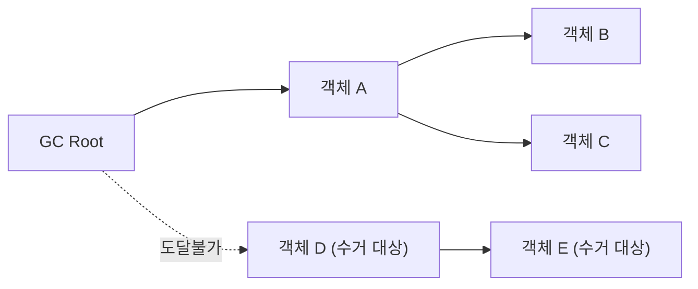
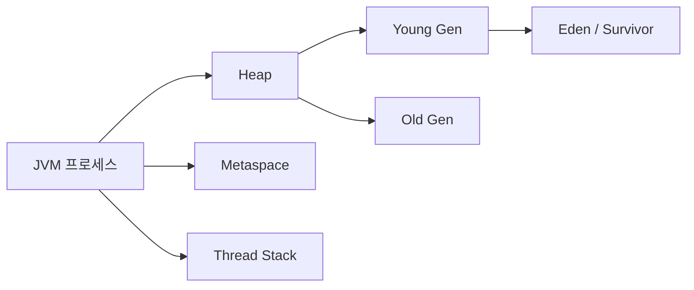
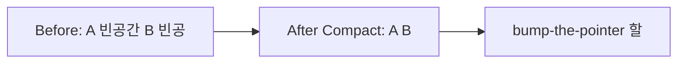
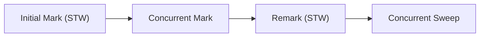
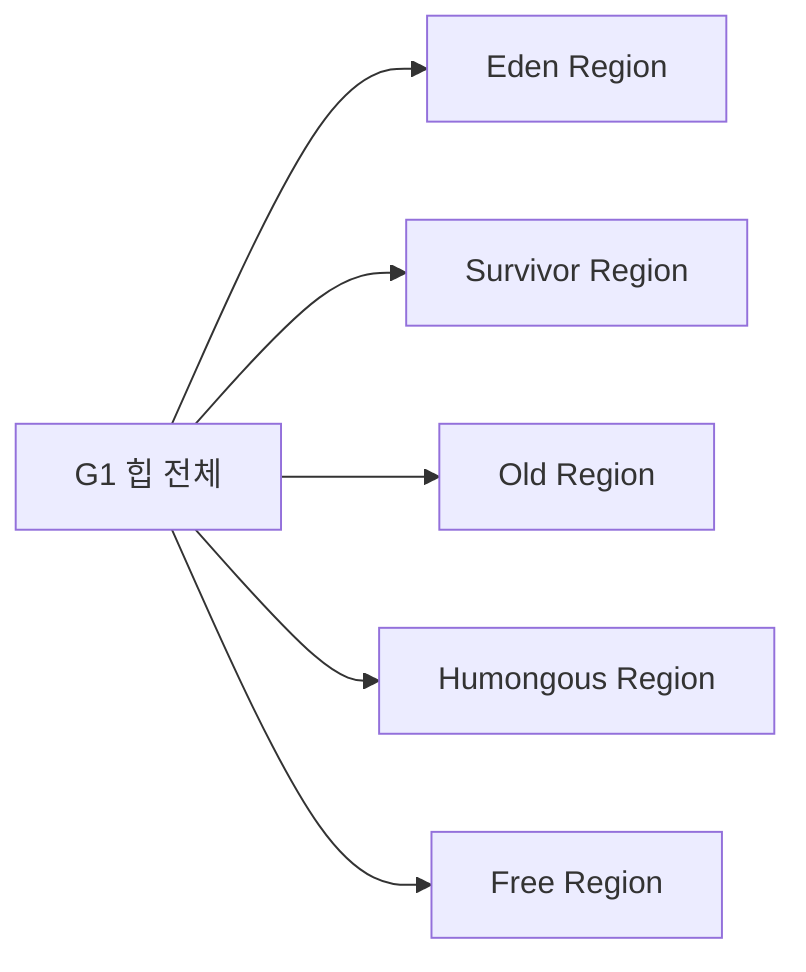
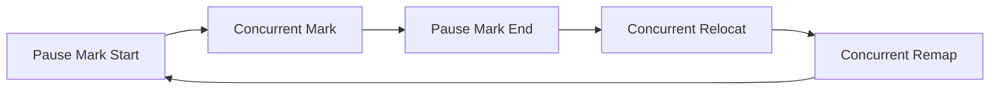
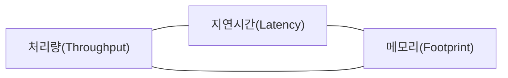
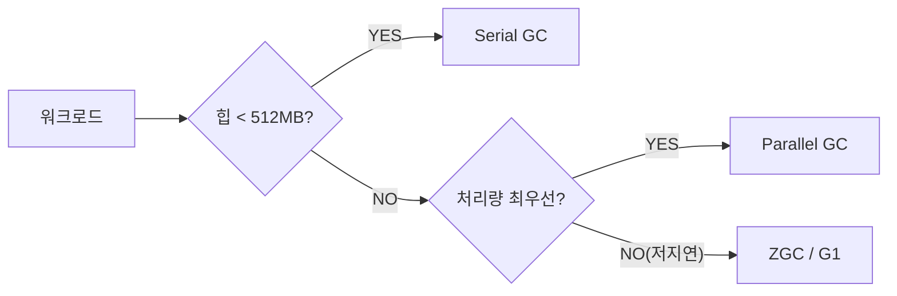
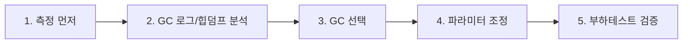

API 응답이 평소엔 8ms인데 가끔 340ms로 폭등한다. GC 로그를 열면 그 순간 `Pause Full (Ergonomics) 312ms`가 찍혀 있다. 원인은 알겠는데, 왜 이 시점에 Full GC가 터졌고, 어떻게 막아야 할지 모르면 튜닝은 찍기 게임이 된다. GC를 알고리즘 수준에서 이해해야 정확한 처방이 나온다.

> **비유로 먼저**: GC는 대형 건물의 청소부 시스템이다. Serial GC는 혼자 일하는 청소부가 건물 전체를 막고 청소한다. Parallel GC는 청소부 여럿이 동시에 달려들어 빠르게 끝낸다. G1 GC는 구역마다 청소 우선순위를 매겨 "가장 더러운 구역"부터 공략한다. ZGC는 건물 운영을 중단하지 않고 청소부가 입주자 옆에서 동시에 청소한다. 어떤 방식이든 청소 도중 "전체 운영 중단(Stop-the-World)"이 얼마나 짧냐가 핵심이다.

---

## 1. 수동 메모리 관리의 실패와 GC의 등장

C/C++ 시대에 개발자가 직접 메모리를 해제하면 두 가지 치명적인 버그가 항상 따라다녔다.

**댕글링 포인터(Dangling Pointer)**: 이미 해제된 메모리를 계속 참조한다. 운이 나쁘면 다른 프로세스가 그 영역을 덮어쓴 뒤에도 참조해서 데이터 오염이나 보안 취약점으로 이어진다.

**메모리 누수(Memory Leak)**: 해제를 깜빡하면 프로세스가 살아 있는 한 메모리가 회수되지 않는다. 서버가 며칠 돌면 OOM으로 프로세스가 죽는 이유의 상당수가 이 패턴이다.

Java는 **GC가 도달 불가능한(unreachable) 객체를 자동으로 회수**한다. 도달 가능성(reachability)은 GC Root에서 참조 체인을 따라갈 수 있느냐로 판단한다.

```java
// GC Root가 되는 것들
// 1. 스택 프레임의 지역 변수
void method() {
    String s = new String("hello"); // s가 GC Root
    // method() 반환 후 s는 스택에서 사라짐 → 객체 도달 불가 → GC 대상
}

// 2. static 필드
public class App {
    static Object singleton = new MyObject(); // GC Root, 앱 종료까지 살아 있음
}

// 3. JNI 로컬/글로벌 레퍼런스
// 4. 활성 스레드 객체
```



GC가 공짜는 아니다. GC가 힙을 탐색하고 메모리를 정리하는 동안 애플리케이션 스레드가 멈추는 **Stop-the-World(STW)** 가 발생한다. 모든 GC 알고리즘의 혁신은 이 STW를 줄이기 위한 싸움이다.

---

## 2. JVM 힙 구조: 왜 이렇게 생겼는가

### 전체 메모리 레이아웃



### 각 영역의 역할과 크기

| 영역 | 위치 | 기본 크기 비율 | 역할 |
|------|------|-------------|------|
| Eden | Heap / Young | Young의 약 80% | 새로 생성된 객체의 첫 집 |
| Survivor S0 | Heap / Young | Young의 약 10% | Minor GC 생존 객체 보관 |
| Survivor S1 | Heap / Young | Young의 약 10% | S0의 대칭 복사 공간 |
| Old (Tenured) | Heap / Old | Heap의 약 2/3 | 오래 살아남은 객체 |
| Metaspace | Native Memory | 제한 없음(기본) | 클래스 메타데이터 |
| Code Cache | Native Memory | ~240MB | JIT 컴파일 코드 |
| Thread Stack | Native Memory | 스레드당 512KB~1MB | 호출 스택, 지역 변수 |

```java
// JVM 힙 구조 확인 코드
public class HeapInspector {
    public static void main(String[] args) throws Exception {
        // ManagementFactory로 각 메모리 풀 조회
        for (MemoryPoolMXBean pool : ManagementFactory.getMemoryPoolMXBeans()) {
            MemoryUsage usage = pool.getUsage();
            System.out.printf("Pool: %-30s | Used: %6d MB | Max: %6d MB%n",
                pool.getName(),
                usage.getUsed() / (1024 * 1024),
                usage.getMax() == -1 ? -1 : usage.getMax() / (1024 * 1024));
        }
        // 출력 예시 (G1GC):
        // Pool: G1 Eden Space               | Used:    256 MB | Max:     -1 MB
        // Pool: G1 Survivor Space           | Used:     32 MB | Max:     -1 MB
        // Pool: G1 Old Gen                  | Used:    512 MB | Max:   6144 MB
        // Pool: Metaspace                   | Used:     89 MB | Max:     -1 MB
    }
}
```

### TLAB(Thread-Local Allocation Buffer): 왜 객체 할당이 빠른가

Eden에 객체를 할당할 때 락 없이 `bump-the-pointer` 방식으로 한다. 멀티스레드 환경에서 여러 스레드가 동시에 Eden 포인터를 움직이면 경합이 발생하므로, 각 스레드에 Eden의 일부를 **TLAB**으로 미리 예약해 준다.

```java
// TLAB 동작 원리 (JVM 내부 의사코드)
class TLAB {
    void* start;   // 이 스레드 전용 Eden 시작 주소
    void* top;     // 현재 할당 위치 (bump pointer)
    void* end;     // 이 스레드 TLAB 끝

    void* allocate(size_t size) {
        if (top + size <= end) {
            void* obj = top;
            top += size;   // 포인터만 이동, 락 없음 → 극도로 빠름
            return obj;
        }
        // TLAB이 부족하면 새 TLAB 요청 또는 Eden 직접 할당
        return allocate_slow_path(size);
    }
}
```

```bash
# TLAB 통계 확인
-XX:+PrintTLAB                    # TLAB 할당/폐기 로그
-XX:TLABSize=512k                 # TLAB 크기 수동 지정 (기본: 자동)
-XX:+ResizeTLAB                   # 자동 크기 조정 (기본 활성화)

# 실행 중 확인
jcmd <pid> VM.native_memory summary scale=MB
```

### Metaspace: PermGen을 왜 없앴는가

Java 7까지 클래스 메타데이터(클래스 정의, 메서드 바이트코드, 상수 풀)는 Heap 내부의 **PermGen(Permanent Generation)**에 저장됐다. PermGen의 치명적 문제는 **크기가 고정**이라는 점이다. WAS에 WAR를 여러 번 배포하면 클래스로더가 누적되고 PermGen이 꽉 차서 `OutOfMemoryError: PermGen space`가 터졌다.

Java 8부터 PermGen을 폐지하고 **Metaspace(Native 메모리)** 로 대체했다. Native 메모리는 OS가 관리하므로 JVM 힙과 무관하게 확장된다. 단, 무제한으로 두면 Metaspace 누수가 발생할 수 있으므로 상한을 설정하는 것이 안전하다.

```bash
# Metaspace 설정 (상한 필수)
-XX:MetaspaceSize=256m        # 초기 Metaspace 크기 (첫 GC 트리거 임계값)
-XX:MaxMetaspaceSize=512m     # 최대 Metaspace (이 이상이면 OOM)

# 클래스로더 누수 모니터링
jcmd <pid> VM.native_memory summary
# 출력에서 Class 항목의 committed 값이 계속 오르면 누수 의심
```

---

## 3. Mark-Sweep-Compact: GC 알고리즘의 뼈대

### Mark 단계: 삼색 마킹(Tri-Color Marking)

GC Root에서 출발해 참조 체인을 BFS(너비 우선 탐색)로 따라가며 살아있는 객체를 표시한다. 단순히 "방문했다/안했다"가 아니라 **삼색 마킹**으로 동시성 문제를 해결한다.

- **흰색(White)**: 아직 방문하지 않은 객체. GC 완료 후 흰색이면 수거 대상.
- **회색(Gray)**: 방문했지만 자식 참조를 아직 스캔하지 않은 객체. 작업 대기 큐에 있음.
- **검색(Black)**: 자신과 모든 자식까지 스캔 완료. 이 주기에서 살아남음.

```java
// 삼색 마킹 의사코드
void mark() {
    // 1. 모든 객체를 흰색으로 초기화
    for (Object obj : allObjects) obj.color = WHITE;

    // 2. GC Root를 회색으로 표시하고 큐에 삽입
    Queue<Object> gray = new ArrayDeque<>();
    for (Object root : gcRoots) {
        root.color = GRAY;
        gray.add(root);
    }

    // 3. 회색 객체를 하나씩 꺼내 자식 스캔
    while (!gray.isEmpty()) {
        Object obj = gray.poll();
        for (Object child : obj.references()) {
            if (child.color == WHITE) {
                child.color = GRAY;
                gray.add(child);
            }
        }
        obj.color = BLACK; // 자식 모두 스캔 완료
    }
    // 4. 남은 흰색 객체 = 수거 대상
}
```

삼색 마킹이 중요한 이유는 **동시 마킹(Concurrent Mark)** 에서다. 애플리케이션이 실행 중에 마킹이 진행되면 새로운 참조가 생기거나 끊어진다. 검은 객체가 흰 객체를 새로 참조하면(검정→흰 참조 추가), 흰 객체는 회색 큐에 들어간 적이 없으므로 수거될 위험이 있다. 이를 **잃어버린 객체 문제(Lost Object Problem)**라 하며, G1/ZGC/Shenandoah는 Write Barrier(쓰기 장벽)로 이를 탐지해 회색 큐에 다시 넣는다.

### Sweep 단계: 왜 단편화가 발생하는가

Mark 후 흰색(죽은) 객체의 메모리를 해제하면 그 자리에 구멍이 생긴다. 살아있는 객체 A(8바이트), 죽은 객체(16바이트), 살아있는 객체 B(8바이트) 구조라면, 16바이트짜리 빈 공간이 생기지만 24바이트 객체는 들어갈 수 없다. 이것이 **외부 단편화(External Fragmentation)**다.

```
Sweep 전: [A: 8B 살아있음][16B 죽음][B: 8B 살아있음][24B 빈공간]
Sweep 후: [A: 8B       ][ 16B 빈  ][B: 8B       ][ 24B 빈    ]

→ 총 빈 공간: 40B
→ 하지만 40B 연속 블록 없음 → 36B 객체 할당 실패!
```

### Compact 단계: 왜 필요하고 왜 비싼가

살아있는 객체를 메모리 앞쪽으로 밀어 빈 공간을 하나로 합친다. 단편화를 완전히 제거해 이후 할당이 bump-the-pointer로 빠르게 이루어진다. 하지만 객체를 이동하면 기존 참조 주소가 모두 무효가 된다. **모든 참조를 새 주소로 업데이트**해야 하므로 전체 힙을 한 번 더 스캔해야 한다. 이 비용 때문에 Compact는 STW를 길게 만든다.



### Copying(복사) 알고리즘: Young Generation의 해법

단편화 없이 Compact 효과를 얻는 방법이 복사 알고리즘이다. From 영역에서 살아있는 객체만 To 영역으로 복사하고, From 전체를 한 번에 비운다.

```
From:  [A 살아있음][16B 죽음][B 살아있음][C 살아있음][죽음]
To:    [A][B][C]  ← 살아있는 것만 압축 복사, 이후 bump-the-pointer로 빠른 할당

From: 전체 비움 (pointer 하나 초기화)
```

Young Generation이 Eden + S0 + S1 구조인 이유가 바로 이 복사 알고리즘 때문이다. Eden과 Active Survivor에서 살아남은 객체를 Inactive Survivor로 복사하고, Eden + Active Survivor를 한 번에 비운다.

---

## 4. 약한 세대 가설(Weak Generational Hypothesis): 왜 Young/Old를 분리하는가

### 가설의 근거

수십 년간 수백만 개의 Java 프로그램을 분석한 결과, 객체 생존 시간은 **역지수 분포**를 따른다. 대부분의 객체는 생성 직후 수 밀리초 안에 참조가 끊기고, 살아남은 소수의 객체는 매우 오래 산다.

```java
// 전형적인 단명 객체 패턴 (요청 처리마다 생성/소멸)
public Response handleRequest(Request req) {
    // 이 메서드 실행 중에만 존재하는 임시 객체들
    UserDto dto = new UserDto(req.getUserId());         // 메서드 종료 후 사망
    List<String> errors = new ArrayList<>();             // 메서드 종료 후 사망
    StringBuilder sb = new StringBuilder();             // 메서드 종료 후 사망
    String json = objectMapper.writeValueAsString(dto); // 반환 후 사망

    return new Response(200, json); // 컨트롤러에서 직렬화 후 사망
}

// 장수하는 객체 패턴
public class ApplicationContext {
    // 애플리케이션 시작부터 종료까지 살아 있음
    private final DataSource dataSource = createDataSource();
    private final Map<String, BeanDefinition> beanDefinitions = new HashMap<>();
    private final ThreadPoolExecutor executor = createExecutor();
}
```

이 패턴을 활용하면 전체 힙을 스캔하지 않고 **Young Generation만 자주 수집**해서 대부분의 객체를 빠르게 회수할 수 있다. Old Generation은 드물게 수집해도 문제없다.

### Minor GC 동작 상세

```java
// Minor GC 발생 조건: Eden이 가득 참
// 예: Eden 256MB, 초당 객체 생성량 200MB → 약 1.3초마다 Minor GC 발생

// Minor GC 동작 (Copying 알고리즘)
// 1. Eden + Active Survivor(S0)의 살아있는 객체 식별
// 2. 살아있는 객체를 Inactive Survivor(S1)로 복사 + age 증가
// 3. age >= MaxTenuringThreshold(기본 15)이면 Old Gen으로 승격
// 4. Eden + S0 전체 비움 → 다음엔 S0가 Inactive, S1이 Active
```

```bash
# 객체 나이(age) 분포 확인 → 승격 시점 최적화에 활용
-Xlog:gc+age*=debug

# 출력 예:
# [gc,age] GC(42) Desired survivor size 26214400 bytes, new threshold 15 (max threshold 15)
# [gc,age] GC(42) - age   1:   8388608 bytes,   8388608 total  ← S1에 8MB
# [gc,age] GC(42) - age   2:   4194304 bytes,  12582912 total
# [gc,age] GC(42) - age  15:    524288 bytes,  13107200 total  ← 이 객체들이 Old로 승격
```

### Promotion: Survivor가 가득 차면 어떻게 되나

Survivor 공간이 부족해 살아있는 객체를 모두 담지 못하면 **Premature Promotion(조기 승격)**이 발생한다. 본래 Young에서 죽었어야 할 객체가 Old로 올라가고, Old가 빠르게 찬다. 이것이 Major GC 빈도 증가의 주요 원인이다.

```bash
# Survivor 비율 조정으로 조기 승격 방지
-XX:SurvivorRatio=6    # Eden:S0:S1 = 6:1:1 → Survivor 각각 Young의 12.5%
                       # (기본값 8 → Survivor 각각 10%)

# 승격 임계값 조정
-XX:MaxTenuringThreshold=10    # 기본 15, 낮추면 빨리 Old로, 높이면 Young에 더 오래

# Survivor 적정 크기 판단 기준
# jstat -gcutil <pid> 1000 출력에서
# S0/S1 컬럼이 항상 95%+이면 Survivor가 너무 작은 것
```

---

## 5. Serial GC: 가장 단순한 GC

### 작동 방식

단일 GC 스레드가 모든 애플리케이션 스레드를 멈추고(STW) Young GC는 Copying, Old GC는 Mark-Sweep-Compact를 수행한다.

```
시간축:
App Thread 1: ████████ ░░░░░ ████████████  ← GC 동안 완전 중단
App Thread 2: ████████ ░░░░░ ████████████
App Thread 3: ████████ ░░░░░ ████████████
GC Thread:            █████               ← 혼자 GC 수행
              ────────┬─────┬────────────
                    STW시작 STW끝
```

```bash
# Serial GC 활성화 + 로그
java -XX:+UseSerialGC \
     -Xms256m -Xmx512m \
     -Xlog:gc*:file=serial-gc.log:time,uptime \
     -jar app.jar
```

```java
// Serial GC가 적합한 사례: 소규모 배치 스크립트
public class DataMigration {
    public static void main(String[] args) {
        // 힙 256MB, 단일 스레드 처리, 응답시간 무관
        // Serial GC로 GC 오버헤드 최소화 → 전체 처리 시간 단축
        List<Record> records = loadAllRecords();  // 200MB 로드
        records.forEach(DataMigration::transform);
        saveAll(records);
        // 처리 후 records 전체가 죽음 → 한 번의 GC로 깔끔하게 정리
    }
}
```

| 특성 | 내용 |
|------|------|
| 적합 환경 | 힙 512MB 이하, 단일 코어, CLI 도구, 임베디드 JVM |
| Young GC | Copying (단일 스레드) |
| Old GC | Mark-Sweep-Compact (단일 스레드) |
| STW | Young 수십 ms / Old 수백 ms~수 초 |
| CPU 오버헤드 | 최소 (GC용 추가 스레드 없음) |

---

## 6. Parallel GC: 처리량(Throughput) 최우선

### Serial GC와의 차이: 병렬 GC 스레드

Parallel GC는 GC 스레드를 여러 개 띄워 힙을 분할 스캔한다. STW는 여전히 발생하지만 병렬 처리로 STW 시간이 Serial 대비 코어 수에 비례해 줄어든다.

```
시간축:
App Threads:  ████████ ░░░ ████████████  ← STW 발생, 하지만 Serial보다 짧음
GC Thread 1:          ███               ← Eden 1/4 담당
GC Thread 2:          ███               ← Eden 2/4 담당
GC Thread 3:          ███               ← Eden 3/4 담당
GC Thread 4:          ███               ← Eden 4/4 담당
              ────────┬───┬────────────
                    STW  STW끝 (병렬로 빠름)
```

```bash
# Parallel GC 설정
-XX:+UseParallelGC                  # Java 8 기본값
-XX:ParallelGCThreads=8             # GC 스레드 수 (기본: CPU 코어 수)
-XX:GCTimeRatio=19                  # 목표: GC 시간이 전체의 1/(1+19)=5% 이하
-XX:MaxGCPauseMillis=200            # 최대 STW 목표 ms (GCTimeRatio와 상충)
-XX:+UseAdaptiveSizePolicy          # 힙 비율 자동 조정 (기본 활성화)
```

### Adaptive Size Policy: 왜 Parallel GC가 자동으로 튜닝하는가

Parallel GC의 `UseAdaptiveSizePolicy`는 각 GC 후에 다음 목표를 달성하도록 Eden, Survivor, Old 크기를 자동 조정한다.

1. **MaxGCPauseMillis**: 설정된 목표보다 STW가 길면 Young Gen 크기를 줄여 수집 빈도를 올리고 한 번당 STW를 단축한다.
2. **GCTimeRatio**: GC 시간 비율이 목표를 초과하면 힙을 키워 GC 빈도를 낮춘다.

```java
// Adaptive Size Policy 확인 코드
public class GCMetricsMonitor {
    private final GarbageCollectorMXBean youngGC;
    private final GarbageCollectorMXBean oldGC;

    public GCMetricsMonitor() {
        List<GarbageCollectorMXBean> gcs = ManagementFactory.getGarbageCollectorMXBeans();
        // G1/Parallel: GC 이름으로 Young/Old 구분
        youngGC = gcs.stream()
            .filter(g -> g.getName().contains("Young") || g.getName().contains("Copy"))
            .findFirst().orElseThrow();
        oldGC = gcs.stream()
            .filter(g -> g.getName().contains("Old") || g.getName().contains("MarkSweep"))
            .findFirst().orElseThrow();
    }

    public void printStats() {
        System.out.printf("Young GC: count=%d, totalTime=%dms, avgTime=%.1fms%n",
            youngGC.getCollectionCount(),
            youngGC.getCollectionTime(),
            youngGC.getCollectionCount() == 0 ? 0.0 :
                (double) youngGC.getCollectionTime() / youngGC.getCollectionCount());

        System.out.printf("Old GC:   count=%d, totalTime=%dms, avgTime=%.1fms%n",
            oldGC.getCollectionCount(),
            oldGC.getCollectionTime(),
            oldGC.getCollectionCount() == 0 ? 0.0 :
                (double) oldGC.getCollectionTime() / oldGC.getCollectionCount());
    }
}
```

```bash
# Parallel GC 적합 워크로드
# - 야간 배치 처리 (8시간 동안 최대 처리량, 응답시간 무관)
# - 데이터 파이프라인 (Kafka Consumer → 변환 → DB 저장)
# - 과학 계산, 빅데이터 처리

java -XX:+UseParallelGC \
     -XX:ParallelGCThreads=16 \
     -XX:GCTimeRatio=9 \         # GC 시간 10% 이하 목표
     -Xms16g -Xmx16g \
     -jar batch-processor.jar
```

---

## 7. CMS GC: 동시성의 첫 시도, 그리고 실패

### 4단계 동작 원리

CMS(Concurrent Mark-Sweep)는 STW를 최소화하기 위해 **마킹과 스위핑을 애플리케이션과 동시에** 수행한다.



**1단계 Initial Mark (STW, 매우 짧음)**: GC Root에서 직접 참조하는 Old 객체만 표시. STW지만 깊이 1만 스캔하므로 수 밀리초.

**2단계 Concurrent Mark (애플리케이션 동시 실행)**: Initial Mark에서 표시된 객체에서 시작해 전체 참조 체인을 따라감. 앱이 실행 중이므로 새 참조 변경이 생긴다.

**3단계 Remark (STW)**: 2단계 중에 변경된 참조를 재검토. Write Barrier로 기록해둔 변경분만 다시 스캔하므로 Initial Mark보다는 길지만 수십 ms 수준.

**4단계 Concurrent Sweep (애플리케이션 동시 실행)**: 흰색 객체의 메모리를 해제. **Compact는 하지 않는다.**

```java
// CMS GC 설정 (참고용 - Java 14에서 제거됨)
// -XX:+UseConcMarkSweepGC         // Java 9 Deprecated, Java 14 제거
// -XX:CMSInitiatingOccupancyFraction=70  // Old Gen 70% 차면 CM 시작
// -XX:+UseCMSInitiatingOccupancyOnly     // 위 설정을 항상 적용
// -XX:ConcGCThreads=4                    // 동시 GC 스레드 수
```

### CMS가 실패한 세 가지 이유

**이유 1: 단편화 → Concurrent Mode Failure**

Compact를 하지 않으므로 Old Generation에 단편화가 누적된다. 새 객체를 Old에 할당하려는데 연속된 빈 블록이 없으면 **Concurrent Mode Failure**가 발생하고, CMS는 Single-Thread Full GC(STW)로 전환된다. 정확히 피하려던 상황이 더 최악의 형태로 터진다.

```
# CMS GC 로그에서 이 줄을 보면 이미 늦은 것
[GC (Allocation Failure) -- [PSYoungGen: 2097152K->2097152K(2097152K)]
 [ParOldGen: 5242880K->5242624K(5242880K)] concurrent mode failure
 Heap after GC invocations=1 (full gc): ...
 Full GC: 8743ms   ← 8.7초 STW!
```

**이유 2: Floating Garbage**

Concurrent Sweep 도중 앱이 새 객체를 만들고 버리면, 그 객체는 이미 스캔이 끝난 후에 생겼으므로 이번 사이클에서는 수거되지 않는다. **다음 CMS 사이클까지 남아있는 이 객체가 Floating Garbage다.** Old가 조금씩 더 차는 원인이 된다.

**이유 3: CPU 자원 경쟁**

동시 마킹/스위핑 중 GC 스레드가 CPU를 점유한다. 4코어 서버에서 CMS가 2스레드를 사용하면 앱은 2코어로만 돌아간다. 트래픽 피크와 CMS Concurrent 단계가 겹치면 응답 시간이 나빠진다.

---

## 8. G1 GC: Region 기반 혁신

### 왜 Region인가

기존 GC는 Young/Old 영역이 물리적으로 연속된 메모리 블록이다. Old가 차면 전체 Old를 한꺼번에 수집해야 하므로 힙이 클수록 STW가 길어진다. G1은 힙을 **동일 크기의 Region**으로 잘게 나눠, 가장 많은 가비지를 담은 Region부터 수집한다. 이것이 "Garbage First"라는 이름의 유래다.

```java
// Region 크기 계산 원리
// Region 수 = 2048개 (고정)
// Region 크기 = 힙 크기 / 2048 (1MB~32MB, 2의 거듭제곱으로 반올림)

// 예: 힙 4GB → 4096MB / 2048 = 2MB per Region
// 예: 힙 16GB → 16384MB / 2048 = 8MB per Region
// 예: 힙 64GB → 64KB * 2048 = 32MB per Region (상한 적용)

// Region 크기 수동 설정 (Humongous 임계값 조정에 유용)
// -XX:G1HeapRegionSize=16m   → Humongous 임계값 = 8MB
```



### Humongous 객체: 왜 위험한가

Region 크기의 50% 이상인 객체는 **Humongous 객체**로 분류되어 연속된 Humongous Region에 직접 할당된다. Young GC 대상이 아닌 Old처럼 취급되므로, 짧게 살고 죽는 대형 객체가 많으면 Old가 빠르게 차고 Mixed GC 부담이 커진다.

```java
public class HumongousObjectDemo {
    // G1 힙 4GB → Region 2MB → Humongous 임계값 1MB
    public void badPattern() {
        // 매 요청마다 1.5MB 배열 생성 → Humongous → Old Gen 직접 할당
        byte[] buffer = new byte[1536 * 1024]; // 1.5MB, Humongous!
        processData(buffer);
        // 메서드 종료 후 죽음, 하지만 Old GC까지 회수 안 됨
    }

    public void goodPattern() {
        // Humongous 임계값 이하로 분할
        int chunkSize = 512 * 1024; // 512KB
        for (int offset = 0; offset < totalSize; offset += chunkSize) {
            byte[] chunk = new byte[chunkSize]; // Young Gen에 할당
            processChunk(chunk, offset);
            // chunk는 Minor GC에서 회수됨 → Old 압박 없음
        }
    }
}
```

### Remembered Set과 Card Table: Young GC가 빠른 이유

Young GC 시 Young Region만 수집하려면 "Old Region에서 Young Region을 참조하는 포인터"를 빠르게 찾아야 한다. 이를 위해 G1은 두 가지 구조를 유지한다.

**Card Table**: 힙을 512바이트 단위의 카드로 나누고, Old 객체가 Young 객체를 참조하는 쓰기 연산(Write Barrier)이 발생하면 해당 카드를 dirty로 표시한다.

**Remembered Set(RemSet)**: 각 Region이 가진 자료구조. "이 Region을 참조하는 다른 Region의 카드 목록"을 보관한다.

```java
// Write Barrier 의사코드 (JVM 내부)
// Old 객체 필드에 Young 객체 주소를 쓸 때 자동 삽입됨
void writeBarrier(Object* field, Object* newValue) {
    *field = newValue;  // 실제 쓰기

    // 카드 테이블 dirty 표시
    byte* card = cardTableBase + ((uintptr_t)field >> 9); // 512 = 2^9
    if (*card != DIRTY) {
        *card = DIRTY;
        // 나중에 리파인먼트 스레드가 dirty 카드를 읽어 RemSet 업데이트
    }
}
```

Young GC 시 전체 힙 대신 **Young Region의 RemSet만 확인**하면 Old→Young 참조를 찾을 수 있다. 힙이 32GB여도 Young Region만 스캔하므로 STW가 짧다.

### G1 GC 수집 사이클

**Young-only 단계**: Young GC(STW)를 반복. Old Gen 점유율이 `InitiatingHeapOccupancyPercent(IHOP)` (기본 45%)를 넘으면 Concurrent Mark 사이클 시작.

**Concurrent Mark 사이클**:
1. **Initial Mark (STW, 짧음)**: Young GC와 병합해서 진행. GC Root에서 직접 참조 표시.
2. **Concurrent Mark**: 앱과 동시에 전체 참조 체인 스캔.
3. **Remark (STW, 짧음)**: SATB(Snapshot-At-The-Beginning) 방식으로 변경분 처리.
4. **Cleanup (STW, 짧음)**: 완전히 빈 Old Region 즉시 회수. 수집할 Region 목록 계산.

**Mixed GC 단계**: Young Region + 가비지 밀도 높은 Old Region 일부를 함께 수집. 여러 번 반복.

```bash
# G1 GC 핵심 설정
-XX:+UseG1GC                              # Java 9+ 기본값
-XX:MaxGCPauseMillis=200                  # STW 목표 (보장 아님, 목표)
-XX:G1HeapRegionSize=16m                  # Region 크기 수동 설정
-XX:InitiatingHeapOccupancyPercent=45     # Concurrent Mark 시작 임계값
-XX:G1ReservePercent=10                   # 승격 실패 방지 예비 공간 10%
-XX:G1MixedGCLiveThresholdPercent=85      # 이 이상 살아있는 Old Region은 Mixed GC 제외
-XX:G1MixedGCCountTarget=8               # Mixed GC 사이클 최대 반복 횟수
-XX:ConcGCThreads=4                       # 동시 GC 스레드 수 (기본: ParallelGCThreads/4)
-XX:ParallelGCThreads=8                   # STW GC 병렬 스레드 수
```

```java
// G1 GC 상태를 GcNotificationListener로 추적
import com.sun.management.GarbageCollectionNotificationInfo;

public class G1GCMonitor {
    public void register() {
        for (GarbageCollectorMXBean gc : ManagementFactory.getGarbageCollectorMXBeans()) {
            ((NotificationEmitter) gc).addNotificationListener((notif, handback) -> {
                GarbageCollectionNotificationInfo info =
                    GarbageCollectionNotificationInfo.from(
                        (CompositeData) notif.getUserData());

                String gcName = info.getGcName();         // "G1 Young Generation"
                String gcCause = info.getGcCause();       // "G1 Evacuation Pause"
                long duration = info.getGcInfo().getDuration(); // ms

                if (duration > 100) {
                    log.warn("GC 경고: {} ({}) - {}ms", gcName, gcCause, duration);
                }
            }, null, null);
        }
    }
}
```

---

## 9. ZGC: 서브밀리초 STW의 원리

### 왜 ZGC는 힙 크기와 무관하게 1ms 이하인가

G1의 STW가 힙 크기에 비례하는 이유는 STW 중에 객체를 이동(Evacuation)하고 참조를 갱신하기 때문이다. 힙이 크면 이동할 객체도 많고 갱신할 참조도 많다. ZGC는 **이 모든 작업을 동시(Concurrent)에 수행**하고, STW에는 극소수 작업만 남긴다.

이를 가능하게 하는 두 가지 핵심 기술이 Colored Pointer와 Load Barrier다.

### Colored Pointer: 포인터 안에 GC 상태를 저장

64비트 시스템에서 실제 사용하는 포인터 비트는 42~48비트다(OS/CPU 제한). ZGC는 남는 비트에 GC 메타데이터를 저장한다.

```
일반 포인터 (64비트):
[0000 0000 0000 0000] [0000 xxxx xxxx xxxx xxxx xxxx xxxx xxxx xxxx xxxx]
 ← 사용 안 함 →              ← 실제 주소 42비트 →

ZGC Colored Pointer:
[0000] [M] [F] [R1][R2] [0000 xxxx xxxx xxxx xxxx xxxx xxxx xxxx xxxx xxxx]
        ↑    ↑    ↑  ↑
        │    │    └──┴── Remapped 비트: 객체가 현재 GC 뷰에서 최신 위치인가?
        │    └────────── Finalizable 비트: finalize 대상인가?
        └─────────────── Marked 비트: 현재 GC 사이클에서 도달 가능한가?
```

이 구조 덕분에 객체 이동 후 포인터의 Remapped 비트만 바꾸면 "이 포인터는 구 주소다"를 표시할 수 있다. 실제 참조 갱신은 다음번 로드 시 Load Barrier가 처리한다.

```java
// Colored Pointer를 활용한 다중 매핑(Multi-Mapping) 기법
// ZGC는 같은 물리 메모리 페이지를 3개의 가상 주소 범위에 동시 매핑한다:
// - Marked0 범위 (0x0xxx...)
// - Marked1 범위 (0x1xxx...)
// - Remapped 범위 (0x4xxx...)
//
// 컬러 비트를 바꾸면 사실상 다른 가상 주소를 가리키지만
// OS 레벨에서는 같은 물리 페이지로 매핑되므로 실제 데이터 복사 없음
// → Concurrent Relocation 중에도 old/new 포인터가 같은 물리 데이터를 가리킴
```

### Load Barrier: 참조 접근마다 삽입되는 자가수복 코드

```java
// 개발자가 작성한 코드:
Object obj = someObject.field;

// JIT 컴파일 후 ZGC Load Barrier가 삽입된 실제 코드 (의사코드):
Object obj = someObject.field;  // 필드에서 colored pointer 로드
if (!isGoodColor(obj)) {        // 현재 GC 뷰의 기대 색상과 불일치?
    obj = healPointer(obj);     // 최신 주소로 수정 (self-healing)
    someObject.field = obj;     // 포인터 갱신 (다음번엔 barrier 통과)
}
// 이제 obj는 올바른 최신 주소를 가리킴

// healPointer 비용: 단순 비교 + 조건 분기
// 캐시 히트 시 ~1ns, 전체 처리 오버헤드 약 5~15%
```

Load Barrier의 핵심 가치: **객체를 이동해도 참조를 즉시 갱신하지 않아도 된다**. 다음번에 그 필드를 읽을 때 Barrier가 자동으로 수정한다. 덕분에 Concurrent Relocation이 가능하다.

### ZGC 동작 단계



| 단계 | 방식 | STW 시간 | 하는 일 |
|------|------|---------|---------|
| Pause Mark Start | STW | <1ms | GC Root에서 직접 참조만 마킹 |
| Concurrent Mark | 동시 | 없음 | 전체 힙 마킹 (앱과 함께) |
| Pause Mark End | STW | <1ms | 동시 마킹 중 변경분 처리 |
| Concurrent Prepare Reloc | 동시 | 없음 | 이동할 Region 선정, RelocationSet 구성 |
| Pause Relocate Start | STW | <1ms | RelocationSet의 Root 참조만 업데이트 |
| Concurrent Relocate | 동시 | 없음 | 실제 객체 이동, 포워딩 테이블 구성 |
| Concurrent Remap | 동시 | 없음 | 남은 구 포인터 → 새 포인터 갱신 |

STW가 세 번 발생하지만 각각 GC Root만 처리하므로 힙 크기와 무관하게 1ms 이하다.

```bash
# ZGC 설정
-XX:+UseZGC                        # Java 15+ Production Ready
-XX:+ZGenerational                 # Java 21+: Generational ZGC (처리량 향상)
-XX:SoftMaxHeapSize=28g            # 힙 28GB 초과 시 적극 GC (Xmx는 32g)
-XX:ConcGCThreads=4                # 동시 GC 스레드 수

# GC 로그에서 ZGC 확인
-Xlog:gc*:file=zgc.log:time,uptime
# 출력 예:
# [gc] GC(42) Garbage Collection (Warmup)
# [gc] GC(42) Pause Mark Start 0.721ms   ← STW 0.7ms
# [gc] GC(42) Concurrent Mark 12.453ms
# [gc] GC(42) Pause Mark End 0.519ms     ← STW 0.5ms
# [gc] GC(42) Concurrent Relocate 8.234ms
# [gc] GC(42) Pause Relocate Start 0.382ms  ← STW 0.4ms
# [gc] GC(42) Concurrent Remap 6.112ms
```

```java
// ZGC 성능 측정 코드 - STW 감지
public class STWDetector {
    private final AtomicLong lastTick = new AtomicLong(System.nanoTime());

    public void startDetector() {
        // 백그라운드 스레드가 10ms마다 tick
        // STW 발생 시 이 스레드도 멈추므로 간격이 늘어남
        Thread detector = new Thread(() -> {
            while (!Thread.currentThread().isInterrupted()) {
                long now = System.nanoTime();
                long elapsed = now - lastTick.getAndSet(now);
                long elapsedMs = elapsed / 1_000_000;

                if (elapsedMs > 20) { // 10ms 간격인데 20ms 이상이면 STW 의심
                    System.out.printf("STW 감지: 예상 10ms, 실제 %dms%n", elapsedMs);
                }
                LockSupport.parkNanos(10_000_000L); // 10ms 대기
            }
        });
        detector.setDaemon(true);
        detector.start();
    }
}
```

---

## 10. Shenandoah GC: Brooks Pointer로 동시 압축

### Brooks Pointer: ZGC와 다른 접근법

ZGC가 Colored Pointer(포인터 비트 활용)를 쓴다면, Shenandoah는 **Brooks Pointer**를 쓴다. 모든 객체 헤더 앞에 **포워딩 포인터**를 하나 추가해서, 객체가 이동하면 포워딩 포인터만 새 주소를 가리키도록 한다.

```
이동 전:
[헤더|포워딩→자기자신][필드A][필드B]  ← 자기자신을 가리킴 (이동 전 상태)

이동 후:
[헤더|포워딩→새주소][필드A][필드B]   ← 이전 위치 (구 포인터로 접근 시 포워딩)
        ↓
[헤더|포워딩→자기자신][필드A][필드B] ← 새 위치 (실제 데이터)
```

외부에서 구 포인터로 접근하면 포워딩 포인터를 따라 자동으로 새 위치로 이동한다. 이 덕분에 Concurrent Compaction(동시 압축)이 가능하다.

```java
// Brooks Pointer 오버헤드: 객체당 1 word(8바이트) 추가
// 힙 8GB에 객체 평균 64바이트라면:
// 객체 수 ≈ 8GB / 64B = 1억 3천만 개
// Brooks Pointer 오버헤드 ≈ 1억 3천만 × 8B = ~1GB (약 12.5%)
// ZGC는 포인터 비트 활용이므로 추가 메모리 없음
```

```bash
# Shenandoah GC 설정
-XX:+UseShenandoahGC                     # Java 12+ (OpenJDK 포함)
-XX:ShenandoahGCHeuristics=adaptive      # 기본: 적응형 트리거
-XX:ShenandoahInitFreeThreshold=70       # 여유 공간 70% 이하면 GC 시작
-XX:ShenandoahMinFreeThreshold=10        # 10% 이하면 즉시 GC (Degenerated 방지)
```

### ZGC vs Shenandoah 비교

| 항목 | ZGC | Shenandoah |
|------|-----|------------|
| 개발사 | Oracle | Red Hat |
| 포인터 기법 | Colored Pointer (비트 활용) | Brooks Pointer (헤더 추가) |
| 메모리 오버헤드 | 낮음 (포인터 비트만) | 약 12~15% (헤더 8B/객체) |
| Load Barrier | 있음 (포인터 색상 검사) | 있음 (포워딩 포인터 추적) |
| Store Barrier | 없음 | 있음 (동시 마킹용) |
| 최대 STW | <1ms | <10ms (목표) |
| 대용량 힙 | TB 단위 공식 지원 | 수백 GB |
| Generational | Java 21부터 | 미지원 (2026 기준) |
| 최소 JDK | OpenJDK 15 (Production) | OpenJDK 12 |

### Shenandoah가 유리한 경우

```java
// Shenandoah는 응답 시간 일관성(P99 < 10ms)이 목표고
// 힙이 4~32GB 범위이며 Red Hat 기반 환경(RHEL, OpenShift)이면 적합

// 반면 ZGC는 더 큰 힙(16GB~TB), Oracle JDK 환경, Java 21 Generational 이점이 있음

// 간단 선택 기준:
// - Oracle JDK + 힙 > 16GB → ZGC
// - Red Hat/IBM JDK + 힙 4~16GB → Shenandoah 검토
// - 두 경우 모두: 실제 워크로드로 벤치마크 후 결정
```

---

## 11. GC 튜닝: 측정 → 분석 → 조정

### 힙 크기 설정 원칙

```bash
# 1. Xms == Xmx: 힙 동적 조정(shrink/expand) 비용 제거
#    힙 확장 시 OS가 메모리를 할당하고 GC가 새 영역을 초기화 → STW 추가 발생
java -Xms8g -Xmx8g -XX:+UseG1GC -jar app.jar

# 2. 컨테이너 환경: MaxRAMPercentage 사용 (Xmx 하드코딩 위험)
#    Pod 메모리 2GB → 힙 1.5GB 자동 설정
java -XX:MaxRAMPercentage=75 \
     -XX:InitialRAMPercentage=75 \
     -XX:+UseContainerSupport \
     -XX:+UseG1GC -jar app.jar

# 3. 적정 힙 크기 = 라이브셋(Live Set) × 2~3배
#    라이브셋: Old Gen이 안정화된 후의 실제 사용량
#    jstat -gcutil <pid> 5000으로 O(Old) 컬럼 관찰
```

### NewRatio와 SurvivorRatio 조정

```bash
# NewRatio: Old:Young 비율 (기본값 2 → Young이 힙의 1/3)
-XX:NewRatio=1   # Old:Young = 1:1 → 단명 객체가 매우 많은 서비스 (채팅 서버 등)
-XX:NewRatio=3   # Old:Young = 3:1 → 장수 객체가 많은 서비스 (세션 서버 등)

# SurvivorRatio: Eden:Survivor 비율 (기본값 8 → Eden 80%, S0/S1 각 10%)
-XX:SurvivorRatio=6   # Eden 75%, S0/S1 각 12.5% → Survivor 공간 확대
-XX:SurvivorRatio=12  # Eden 85.7%, S0/S1 각 7.1% → Eden 확대 (객체 생성량 많을 때)

# G1GC에서는 Region 단위이므로 위 옵션이 다르게 적용됨
# G1에서 Young 비율 조정:
-XX:G1NewSizePercent=10      # Young 최소 10%
-XX:G1MaxNewSizePercent=40   # Young 최대 40%
```

### GC 로그 분석 실전

```bash
# Java 17+ 권장 GC 로그 설정 (운영 환경)
java -XX:+UseG1GC \
     -Xms8g -Xmx8g \
     -Xlog:gc*,gc+heap=debug,gc+age=trace:file=/var/log/app/gc.log \
             :time,uptime,pid,level,tags \
             :filecount=10,filesize=50m \
     -XX:+HeapDumpOnOutOfMemoryError \
     -XX:HeapDumpPath=/var/log/app/heap-%t.hprof \
     -jar app.jar
```

```java
// GC 로그 실시간 파싱 예시 (운영 모니터링용)
public class GCLogTailer {
    private static final Pattern PAUSE_PATTERN =
        Pattern.compile("Pause (\\w+) .* (\\d+\\.\\d+)ms");

    public void tail(String logFile) throws IOException {
        try (BufferedReader reader = new BufferedReader(new FileReader(logFile))) {
            String line;
            while ((line = reader.readLine()) != null) {
                Matcher m = PAUSE_PATTERN.matcher(line);
                if (m.find()) {
                    String gcType = m.group(1);   // "Young", "Mixed", "Full"
                    double pauseMs = Double.parseDouble(m.group(2));

                    if (pauseMs > 200) {
                        alertOnCall("GC STW 경고: " + gcType + " " + pauseMs + "ms");
                    }
                    metrics.record("gc.pause." + gcType.toLowerCase(), pauseMs);
                }
            }
        }
    }
}
```

### GC 분석 도구 활용

```bash
# 1. jstat: 실시간 GC 통계 (가장 빠른 확인)
jstat -gcutil <pid> 2000
# 출력:
#   S0     S1     E      O      M     CCS    YGC     YGCT    FGC    FGCT     GCT
#  0.00  45.23  72.11  35.67  95.12  92.34     42    0.834     1    0.312    1.146
#  ↑S0   ↑S1   ↑Eden  ↑Old  ↑Meta           ↑Minor  ↑s    ↑Full   ↑s     ↑합계s

# 2. jstat -gc: 절대 크기 포함
jstat -gc <pid> 2000
# S0C/S0U: S0 용량/사용량 (KB)
# EC/EU: Eden 용량/사용량
# OC/OU: Old 용량/사용량

# 3. jcmd: GC 강제 실행, 힙 정보
jcmd <pid> GC.run              # GC 강제 실행
jcmd <pid> GC.heap_info        # 힙 구조 출력
jcmd <pid> VM.native_memory summary  # 네이티브 메모리 분석

# 4. jmap: 힙 덤프
jmap -dump:format=b,file=/tmp/heap-$(date +%Y%m%d-%H%M%S).hprof <pid>
```

### Promotion Threshold 튜닝 흐름

```java
// 조기 승격(Premature Promotion) 진단 코드
public class PromotionDiagnostics {
    public static void diagnose() {
        // GC 전/후 Old Gen 사용량 비교
        MemoryPoolMXBean oldGen = ManagementFactory.getMemoryPoolMXBeans()
            .stream()
            .filter(p -> p.getName().contains("Old") || p.getName().contains("Tenured"))
            .findFirst().orElseThrow();

        long beforeGC = oldGen.getUsage().getUsed();

        // GC 알림 리스너에서:
        // GC 후 Old Gen 증가량이 Minor GC당 크면 조기 승격이 심한 것
        // 목표: Minor GC당 Old 증가 < 1MB (서비스마다 다름)

        // 처방:
        // 1. SurvivorRatio 낮춤 → Survivor 크게 → 조기 승격 감소
        // 2. MaxTenuringThreshold 높임 → Young에 더 오래 → 죽을 기회 더 줌
        // 3. Young Gen 자체를 키움 → Eden이 크면 Minor GC 빈도 줄고 생존 객체도 줄어듦
    }
}
```

---

## 12. 메모리 누수 탐지: 힙 덤프 분석

### 힙 덤프 생성과 분석

```bash
# OOM 발생 시 자동 힙 덤프 (필수 운영 설정)
-XX:+HeapDumpOnOutOfMemoryError
-XX:HeapDumpPath=/var/log/app/heap-%t.hprof

# 실행 중 수동 덤프 (STW 발생 주의)
jmap -dump:live,format=b,file=/tmp/heap.hprof <pid>
# live 옵션: GC를 먼저 실행해 죽은 객체 제외 (더 작은 덤프)

# 덤프 크기 문제 시 히스토그램으로 빠른 확인
jmap -histo:live <pid> | head -30
# 출력 예:
#  num     #instances         #bytes  class name
#    1:       5432198      869551680  [B                    ← byte[]가 869MB!
#    2:       1234567      197530720  java.lang.String
#    3:        987654       94214784  java.util.HashMap$Node
```

### Eclipse MAT으로 Dominator Tree 분석

```java
// Dominator Tree: "이 객체가 살아있기 때문에 유지되는 전체 서브그래프 크기"
// MAT에서 Dominator Tree를 열면:

// 예시 출력:
// ClassName                         Shallow Heap    Retained Heap    %
// ─────────────────────────────────────────────────────────────────────
// HashMap @ 0x7f234...              48 B            512 MB           65%  ← 이게 범인
//   └─ HashMap$Node[16384] @ ...    131072 B        512 MB
//       └─ [각 엔트리들 ...]

// Retained Heap이 크면 "이 객체가 살아있는 한 512MB가 회수 안 됨"을 의미
```

```java
// 메모리 누수 패턴 1: static 컬렉션 무한 증가
public class MetricsRegistry {
    // 이 Map이 GC Root → 모든 값이 영원히 살아있음
    private static final Map<String, List<Double>> metrics = new HashMap<>();

    public static void record(String key, double value) {
        metrics.computeIfAbsent(key, k -> new ArrayList<>()).add(value);
        // remove나 크기 제한 없음 → 수백만 엔트리 쌓임 → OOM
    }

    // 수정: 크기 제한 + 약한 참조
    private static final int MAX_HISTORY = 1000;
    public static void recordSafe(String key, double value) {
        List<Double> history = metrics.computeIfAbsent(key, k -> new ArrayList<>());
        if (history.size() >= MAX_HISTORY) {
            history.remove(0); // 가장 오래된 항목 제거
        }
        history.add(value);
    }
}
```

```java
// 메모리 누수 패턴 2: ThreadLocal 미정리
@Component
public class TenantContextFilter implements Filter {
    private static final ThreadLocal<String> TENANT = new ThreadLocal<>();

    @Override
    public void doFilter(ServletRequest req, ServletResponse res, FilterChain chain)
            throws IOException, ServletException {
        String tenant = ((HttpServletRequest) req).getHeader("X-Tenant-ID");
        TENANT.set(tenant);
        try {
            chain.doFilter(req, res);
        } finally {
            TENANT.remove(); // 이게 없으면 스레드 풀의 스레드에 tenant가 영원히 남음
            // 스레드 풀은 스레드를 재사용 → 이전 tenant가 다음 요청에 노출될 수 있음
        }
    }

    public static String currentTenant() {
        return TENANT.get();
    }
}
```

```java
// 메모리 누수 패턴 3: 리스너 미해제 → 내부 클래스 캡처
public class EventDrivenService {
    private final byte[] largeConfig = new byte[10 * 1024 * 1024]; // 10MB

    public void init(EventBus bus) {
        // 문제: 비정적 익명 클래스가 EventDrivenService 전체(largeConfig 포함)를 캡처
        bus.subscribe("config.updated", new EventHandler() {
            @Override
            public void handle(Event e) {
                // largeConfig 사용 안 해도 this$0(EventDrivenService)가 살아있음
                reload();
            }
        });
        // 서비스가 종료돼도 bus가 EventHandler를 참조 → EventDrivenService 회수 불가
    }

    // 수정: static 내부 클래스 + 명시적 구독 해제
    private EventHandler configHandler;

    public void init2(EventBus bus) {
        configHandler = e -> reload(); // 람다: this 캡처 안 함 (reload()는 메서드 참조)
        bus.subscribe("config.updated", configHandler);
    }

    @PreDestroy
    public void destroy(EventBus bus) {
        bus.unsubscribe("config.updated", configHandler); // 반드시 해제
    }
}
```

```java
// 메모리 누수 패턴 4: 클래스로더 누수 → Metaspace OOM
public class PluginManager {
    // static 컬렉션이 동적 로드 클래스를 강하게 참조
    private static final List<Class<?>> pluginClasses = new ArrayList<>();

    public void loadPlugin(URL[] urls) throws Exception {
        URLClassLoader loader = new URLClassLoader(urls, getClass().getClassLoader());
        Class<?> plugin = loader.loadClass("com.example.Plugin");
        pluginClasses.add(plugin);
        // plugin → URLClassLoader → Metaspace의 모든 클래스 정보 유지
        // WAS에 WAR 재배포할 때마다 이 패턴이 반복 → Metaspace OOM
    }

    // 수정: WeakReference + 명시적 클로즈
    private final List<WeakReference<URLClassLoader>> loaders = new ArrayList<>();

    public void loadPluginSafe(URL[] urls) throws Exception {
        URLClassLoader loader = new URLClassLoader(urls, getClass().getClassLoader());
        loaders.add(new WeakReference<>(loader));
        Class<?> plugin = loader.loadClass("com.example.Plugin");
        // plugin을 static에 저장하지 않음
    }

    public void unloadPlugin(URLClassLoader loader) throws IOException {
        loader.close(); // Java 7+: 클래스로더 명시적 닫기
        // 강한 참조 제거 후 GC → Metaspace 회수
    }
}
```

### GC Root Chain 추적 (MAT 사용)

```
Eclipse MAT에서 OOM 원인 찾는 순서:

1. File → Open Heap Dump → heap.hprof 로드
2. Overview → Leak Suspects Report → 자동 분석 보고서
3. 수동 분석:
   - Window → Heap Dump Details → Dominator Tree
   - Retained Heap 상위 5개 확인
   - 가장 큰 객체 우클릭 → "Path to GC Roots" → "Exclude weak/soft/phantom references"
   - GC Root까지의 참조 체인 확인 → 어디서 붙들고 있는지 파악

4. 주요 질문:
   - "누가 이 객체를 살아있게 하는가?" → GC Root Chain
   - "이 객체 하나가 몇 MB를 붙잡고 있는가?" → Retained Heap
```

---

## 13. GC 선택 가이드: 처리량 vs 지연시간 vs 메모리 삼각형

### 세 가지 목표는 동시에 달성할 수 없다



처리량을 높이려면 GC 오버헤드를 줄여야 하므로 STW를 길게 허용한다(지연시간 희생). 지연시간을 줄이려면 자주, 짧게 GC해야 하므로 오버헤드가 증가하고 메모리도 더 필요하다. 메모리를 아끼려면 힙을 작게 써야 하므로 GC 빈도가 올라간다.

### 워크로드별 GC 선택

```bash
# 1. 배치 처리 / 데이터 파이프라인 → Parallel GC
#    목표: 8시간 내 1TB 데이터 처리. 응답시간 무관. 처리량 최대화.
java -XX:+UseParallelGC \
     -XX:ParallelGCThreads=16 \
     -XX:GCTimeRatio=9 \          # GC 시간 10% 이하 목표
     -Xms32g -Xmx32g \
     -jar batch-processor.jar

# 2. 일반 웹 API (힙 < 8GB) → G1 GC (기본값 그대로 대부분 OK)
java -XX:+UseG1GC \
     -XX:MaxGCPauseMillis=200 \
     -Xms4g -Xmx4g \
     -jar web-api.jar

# 3. 저지연 서비스 (결제, 거래, 게임) → ZGC
#    요구사항: P99 < 50ms, 힙 8GB+
java -XX:+UseZGC \
     -XX:+ZGenerational \         # Java 21+
     -Xms16g -Xmx16g \
     -XX:SoftMaxHeapSize=14g \
     -jar payment-service.jar

# 4. 소규모 마이크로서비스 (힙 512MB 이하) → SerialGC 또는 G1
#    이유: 힙이 작으면 어떤 GC도 STW가 짧음, 단순한 게 유지보수 이점
java -XX:+UseSerialGC \
     -Xms256m -Xmx512m \
     -jar simple-service.jar

# 5. Kubernetes Pod (메모리 2GB) → G1 + ContainerSupport
java -XX:+UseG1GC \
     -XX:+UseContainerSupport \
     -XX:MaxRAMPercentage=75 \
     -jar k8s-service.jar
```

### GC 선택 판단 트리



---

## 14. 극한 시나리오

### 시나리오 1: 결제 서버, P99 응답 50ms 요구사항 위반

**상황**: 결제 서비스가 평균 15ms 응답. P99가 380ms. SLA 50ms 위반.

```bash
# GC 로그 분석 결과:
# [GC(234)] Pause Young (G1 Evacuation Pause) 8ms    ← 정상
# [GC(235)] Pause Young (G1 Evacuation Pause) 12ms   ← 정상
# [GC(236)] Pause Mixed (G1 Evacuation Pause) 342ms  ← 범인! Mixed GC STW
# [GC(237)] Pause Full (Ergonomics) 8743ms           ← 대재앙: 8.7초 Full GC

# 원인 분석:
# 1. Mixed GC 342ms: MaxGCPauseMillis=200 설정했는데 왜?
#    → G1이 한 Mixed GC에 너무 많은 Old Region 포함함
#    → G1MixedGCCountTarget을 늘려 분산 처리

# 2. Full GC 8.7초: 왜 Full GC가?
#    → Humongous 객체(결제 JSON 직렬화 중 3MB 문자열 생성)가 Old Gen 압박
#    → Concurrent Mark가 따라잡지 못함 → Concurrent Mode Failure
```

```java
// 1단계: 문제 코드 수정 (Humongous 객체 제거)
public class PaymentSerializer {
    // 문제: ObjectMapper가 매 요청마다 큰 중간 문자열 생성
    public String serialize(PaymentRequest req) throws JsonProcessingException {
        return objectMapper.writeValueAsString(req); // 내부적으로 큰 StringBuilder
    }

    // 수정: StreamingOutput으로 직접 쓰기 (중간 객체 없음)
    public void serialize(PaymentRequest req, OutputStream out) throws IOException {
        objectMapper.writeValue(out, req);
    }
}
```

```bash
# 2단계: ZGC로 전환 (STW 1ms 이하)
java -XX:+UseZGC \
     -XX:+ZGenerational \
     -Xms8g -Xmx8g \
     -XX:SoftMaxHeapSize=7g \
     -Xlog:gc*:file=/var/log/payment-gc.log:time,uptime:filecount=10,filesize=50m \
     -XX:+HeapDumpOnOutOfMemoryError \
     -XX:HeapDumpPath=/var/log/payment-heap-%t.hprof \
     -jar payment-service.jar

# 결과:
# ZGC Pause Mark Start:   0.7ms  ← 전체 STW 2ms 이하
# ZGC Pause Mark End:     0.5ms
# ZGC Pause Relocate:     0.4ms
# P99 응답: 380ms → 18ms (96% 개선)
```

### 시나리오 2: 32GB 힙 서버에서 Old Gen 점진적 증가 → OOM

**상황**: 캐싱 서비스. 힙 32GB. 매일 오전 3시 OOM으로 재시작.

```bash
# jstat 관찰 결과 (7일 연속):
# Day 1  08:00: O(Old) = 45%  → 정상
# Day 1  20:00: O(Old) = 52%  → 천천히 증가
# Day 2  08:00: O(Old) = 59%
# Day 3  08:00: O(Old) = 67%
# ...
# Day 7  03:00: O(Old) = 98%  → OOM: GC Overhead Limit Exceeded

# 패턴: Old Gen이 절대 줄지 않고 단조 증가 → 메모리 누수 확실
```

```java
// 힙 덤프 분석 결과:
// Dominator Tree 상위 1위:
// HashMap @ 0x7f23... Retained: 28GB (87.5% of heap!)
//   └─ CacheManager.globalCache (static field)
//       └─ HashMap$Node[4194304]
//           └─ [각 캐시 엔트리...]

// 코드 확인:
public class CacheManager {
    // 이 static Map이 28GB를 붙잡고 있는 범인
    private static final Map<String, byte[]> globalCache = new HashMap<>();

    public static void put(String key, byte[] value) {
        globalCache.put(key, value);
        // 만료 로직 없음, remove 없음 → 영원히 쌓임
    }
}

// 수정: Caffeine 캐시로 교체 (TTL + 최대 크기 제한)
import com.github.benmanes.caffeine.cache.Cache;
import com.github.benmanes.caffeine.cache.Caffeine;

public class CacheManager {
    private static final Cache<String, byte[]> globalCache = Caffeine.newBuilder()
        .maximumWeight(8L * 1024 * 1024 * 1024)   // 최대 8GB
        .weigher((String k, byte[] v) -> v.length) // 값 크기 기준
        .expireAfterWrite(Duration.ofHours(1))      // 1시간 TTL
        .recordStats()                              // 히트율 모니터링
        .build();

    public static void put(String key, byte[] value) {
        globalCache.put(key, value);
    }

    // 캐시 통계 주기적 확인
    public static void logStats() {
        CacheStats stats = globalCache.stats();
        log.info("Cache hitRate={:.1f}%, size={}, evictions={}",
            stats.hitRate() * 100,
            globalCache.estimatedSize(),
            stats.evictionCount());
    }
}
```

### 시나리오 3: 100K TPS에서 GC로 인한 연쇄 타임아웃

**상황**: 광고 입찰 서버. 100K TPS. G1 GC로 운영 중. 가끔 G1 Mixed GC가 150ms STW 발생 → 그동안 15,000건 요청 대기 → 타임아웃 연쇄 → 서킷 브레이커 오픈 → 장애.

```bash
# 1단계: GC 로그로 패턴 파악
grep "Pause Mixed\|Pause Full" gc.log | awk '{print $NF}' | sort -n | tail -20
# 126ms 131ms 138ms 142ms 155ms 163ms 189ms 197ms 204ms → P99 200ms대

# 2단계: ZGC 전환 + 객체 생성 최소화
java -XX:+UseZGC \
     -XX:+ZGenerational \
     -Xms32g -Xmx32g \
     -XX:SoftMaxHeapSize=28g \
     -XX:ConcGCThreads=8 \
     -Xlog:gc*:file=/var/log/bid-gc.log:time,uptime:filecount=20,filesize=100m \
     -jar bid-server.jar
```

```java
// 3단계: 객체 생성 최소화 (GC 근본 원인 제거)
// 입찰 처리당 임시 객체 생성량 측정 → 줄이기

// Before: 매 요청마다 새 객체 생성
public BidResponse processBid(BidRequest req) {
    Map<String, Object> context = new HashMap<>();      // 생성
    List<String> eligibleAds = new ArrayList<>();       // 생성
    StringBuilder logBuilder = new StringBuilder();    // 생성
    // ...
    return new BidResponse(winningAd, price);           // 생성
}

// After: 객체 풀 + 스레드 로컬 재사용
private static final ObjectPool<BidContext> contextPool =
    new GenericObjectPool<>(new BidContextFactory(), poolConfig);

public BidResponse processBid(BidRequest req) throws Exception {
    BidContext ctx = contextPool.borrowObject();
    try {
        ctx.reset(); // 필드 초기화
        ctx.setRequest(req);
        BidResponse resp = ctx.process();
        return resp;
    } finally {
        contextPool.returnObject(ctx);
    }
}

// 결과: 객체 생성량 90% 감소 → GC 빈도 1/10 → ZGC STW P99 0.8ms
```

### 시나리오 4: GC 튜닝이 아닌 코드가 문제인 경우

**상황**: GC 튜닝을 아무리 해도 Old Gen이 계속 찬다. GC 로그보다 JFR(Java Flight Recorder)이 정답을 알려준다.

```bash
# JFR 프로파일링: 객체 할당 핫스팟 찾기
java -XX:+FlightRecorder \
     -XX:StartFlightRecording=duration=60s,filename=profile.jfr \
     -jar app.jar

# jfr 분석 (JDK Mission Control 또는 CLI)
jfr print --events jdk.ObjectAllocationInNewTLAB,jdk.ObjectAllocationOutsideTLAB \
          --stack-depth 10 \
          profile.jfr | head -100

# 출력에서 "총 할당량" 상위 메서드 확인
# 예: UserService.enrichUser() → 60% 할당
#     → 이 메서드가 매 호출마다 DTO를 깊이 복사하고 있었음
```

```java
// JFR 프로그래밍 방식으로 분석
public class AllocationProfiler {
    public static void enableProfiling() throws Exception {
        FlightRecorder.register(AllocationEvent.class);
    }

    @Name("com.example.LargeAllocation")
    @Label("Large Object Allocation")
    @StackTrace
    public static class AllocationEvent extends Event {
        @Label("Class Name")
        String className;
        @Label("Size Bytes")
        long sizeBytes;
    }

    // 대형 객체 할당 시 이벤트 발행
    public static void trackAllocation(Object obj, long size) {
        if (size > 1024 * 1024) { // 1MB 이상
            AllocationEvent event = new AllocationEvent();
            if (event.shouldCommit()) {
                event.className = obj.getClass().getName();
                event.sizeBytes = size;
                event.commit();
            }
        }
    }
}
```

---

## 15. GC 종류별 최종 비교

| GC | STW 특성 | 처리량 | 메모리 오버헤드 | 최소 Java 버전 | 추천 힙 크기 |
|----|---------|--------|--------------|-------------|------------|
| Serial | Young 수십ms, Full 수초 | 낮음 | 최소 | 모든 버전 | < 512MB |
| Parallel | Young 수ms~수십ms, Full 수백ms | 최고 | 낮음 | 모든 버전 | 1~32GB |
| CMS | Major 수십ms | 높음 | 중간 | 제거됨 (Java 14) | 사용 금지 |
| G1 | 수십~수백ms (목표 설정) | 높음 | 중간 (~10%) | Java 9 기본 | 4GB~32GB |
| ZGC | <1ms (힙 무관) | 약 5~15% 감소 | 낮음 (포인터 비트) | Java 15 (Production) | 8GB~TB |
| Shenandoah | <10ms | 약 10~20% 감소 | 약 12~15% | Java 12 | 4~128GB |

---

## 면접 포인트

### Q1. G1 GC와 ZGC의 구체적인 차이와 선택 기준은 무엇인가요?
G1은 힙을 Region으로 나눠 가비지 밀도 높은 Region을 우선 수집합니다. STW 중에 객체를 이동(Evacuation)하므로 힙이 클수록 STW가 길어집니다. `MaxGCPauseMillis`는 목표일 뿐 보장이 아닙니다. Mixed GC에서 수십~수백 ms STW가 발생합니다.

ZGC는 Colored Pointer(포인터의 여분 비트에 GC 상태 저장)와 Load Barrier(참조 접근마다 포인터 색상 검사·자가수복)를 사용해 객체 이동을 STW 없이 동시에 수행합니다. STW는 GC Root만 처리하는 세 번의 극단적으로 짧은 단계(각 <1ms)뿐입니다.

**선택 기준**: P99 지연이 50ms 이하여야 하거나 힙이 16GB를 초과하면 ZGC가 거의 확실한 선택입니다. 일반적인 웹 API(힙 4~8GB, P99 < 200ms 허용)는 G1 기본 설정으로 충분합니다.

---

### Q2. Full GC가 발생하는 원인과 방지 방법은 무엇인가요?
G1 GC에서 Full GC는 세 가지 상황에서 발생합니다. 첫째, **Concurrent Mode Failure**: Concurrent Mark가 Young GC 승격 속도를 따라잡지 못해 Old Gen이 꽉 차면 Single-Thread Full GC로 전환됩니다. 처방은 `InitiatingHeapOccupancyPercent`를 낮춰 일찍 Concurrent Mark를 시작하는 것입니다. 둘째, **Humongous 객체**: Region 크기의 50% 이상 객체가 빈번히 생성되면 Old Gen을 직접 점유하고 단편화를 유발합니다. 처방은 G1HeapRegionSize를 키우거나 코드에서 대형 객체를 분할하는 것입니다. 셋째, **Evacuation Failure**: Young GC 중 객체를 이동할 빈 Region이 없으면 Full GC로 폴백합니다. 처방은 `G1ReservePercent`를 높여 예비 공간을 확보하는 것입니다.

---

### Q3. 삼색 마킹(Tri-Color Marking)이 동시 GC에서 왜 필요한가요?
단순 흑/백 마킹만으로는 동시 마킹 중 "잃어버린 객체 문제"가 발생합니다. 이미 검정(완료)으로 표시된 객체 A가 아직 흰색(미방문)인 객체 C를 새로 참조하고, 동시에 회색(진행 중) 객체 B에서 C로의 참조가 끊어지면, C는 GC 워크 큐에서 사라져 수거될 위험이 있습니다. 삼색 마킹은 이 상황을 Write Barrier로 탐지합니다. G1은 SATB(Snapshot-At-The-Beginning) 방식을 사용해 마킹 시작 시점의 참조 스냅샷 기준으로 처리하고, ZGC는 Load Barrier로 구 포인터 접근 시 마킹 큐에 재삽입합니다. 이 메커니즘 없이는 애플리케이션과 동시에 마킹하는 것이 불가능합니다.

---

### Q4. 약한 세대 가설이 틀리는 경우와 그 대처법은 무엇인가요?
약한 세대 가설이 맞지 않는 대표적인 워크로드는 대용량 캐시 서버, 인메모리 데이터 그리드, ML 모델 서빙입니다. 객체가 짧게 살지 않고 수분~수시간 살아있다가 한꺼번에 죽습니다. 이 패턴에서는 Young Gen이 커봤자 Minor GC마다 객체가 살아남아 Old로 승격되고, Old가 빠르게 차서 Major GC가 빈발합니다.

대처법은 세 가지입니다. 첫째, ZGC나 Shenandoah처럼 세대 구분 없이(혹은 ZGenerational 없이) 전체 힙을 균일하게 처리하는 GC를 선택합니다. 둘째, `MaxTenuringThreshold=1`로 낮춰 Young에서 한 번만 살아남으면 바로 Old로 승격시켜 Survivor 낭비를 줄입니다. 셋째, Off-heap 저장소(DirectByteBuffer, Memcached, Chronicle Map)로 캐시를 JVM 힙 밖으로 옮겨 GC 대상 자체를 줄입니다.

---

### Q5. OOM: GC Overhead Limit Exceeded는 왜 발생하며 어떻게 대응하나요?
JVM이 GC에 CPU 시간의 98% 이상을 쓰면서 힙을 2% 미만밖에 회수하지 못하는 상황이 5번 연속 발생하면 이 에러를 던집니다. "GC를 아무리 해도 메모리가 안 비워진다"는 뜻이므로 힙 크기 문제가 아닌 **메모리 누수**인 경우가 대부분입니다.

대응 순서: 1) `-XX:+HeapDumpOnOutOfMemoryError`로 힙 덤프를 확보합니다. 2) Eclipse MAT으로 Dominator Tree를 열어 Retained Heap 상위 객체를 확인합니다. 3) GC Root Chain을 추적해 어느 static 필드나 스레드가 수십 GB를 붙잡고 있는지 찾습니다. 일시적으로 `-XX:-UseGCOverheadLimit`으로 에러를 억제해 덤프를 확보할 시간을 버는 방법도 있습니다. 단, 이것은 임시방편이고 근본 원인인 누수 코드를 반드시 수정해야 합니다.

---

## 정리



**측정 없는 튜닝은 찍기다.** GC 로그와 힙 덤프가 모든 답을 갖고 있다. GC를 선택하기 전에 실제 워크로드로 GC 로그를 수집하고 GCEasy나 GCViewer로 분석한다. Full GC가 없고 STW가 SLA 이내면 기본값이 정답이다. Full GC가 터지면 원인(Humongous/CMF/Evacuation Failure)을 찾아 코드와 파라미터를 함께 수정한다. STW가 SLA를 초과하면 ZGC나 Shenandoah로 전환한다.

```java
// GC 튜닝 체크리스트 (코드로 구현)
public class GCTuningChecklist {
    /*
     * [1] GC 로그 활성화 되어 있는가?
     *     -Xlog:gc*:file=gc.log:time,uptime:filecount=10,filesize=50m
     *
     * [2] OOM 시 힙 덤프 자동 생성 설정되어 있는가?
     *     -XX:+HeapDumpOnOutOfMemoryError -XX:HeapDumpPath=/var/log/heap-%t.hprof
     *
     * [3] Xms == Xmx 인가? (힙 리사이징 STW 방지)
     *     -Xms8g -Xmx8g
     *
     * [4] 컨테이너 환경에서 UseContainerSupport 활성화 되어 있는가?
     *     -XX:+UseContainerSupport -XX:MaxRAMPercentage=75
     *
     * [5] 워크로드에 맞는 GC가 선택되어 있는가?
     *     배치→ParallelGC, 웹API→G1, 저지연→ZGC
     *
     * [6] GC 메트릭이 APM에 연동되어 있는가?
     *     GcNotificationListener → Prometheus → Grafana
     *
     * [7] 메모리 누수 패턴이 없는가?
     *     static 컬렉션 TTL/크기 제한, ThreadLocal.remove(), 리스너 해제
     */
}
```
