API 응답이 평소엔 10ms인데 가끔 500ms로 튄다. GC 로그를 보면 Stop-the-World가 발생한 시점과 정확히 일치한다. GC 동작 원리를 모르면 튜닝 방향을 잡을 수 없다.

> **비유로 먼저 이해하기**: GC는 쓰레기 수거 트럭과 같다. 아무도 참조하지 않는 객체(버려진 쓰레기)를 주기적으로 찾아 메모리(거리)를 치운다. 트럭이 수거하는 동안 일부 도로가 막히는 것(Stop-the-World)이 성능에 영향을 준다.

Java GC의 동작 원리부터 GC 종류별 아키텍처, 튜닝 옵션, 실무 선택 가이드까지 완전히 정리합니다.

---

## 1. GC란? 왜 필요한가?

Garbage Collection(GC)은 프로그램이 동적으로 할당한 메모리 중 더 이상 사용하지 않는 객체를 자동으로 탐지하고 회수하는 메커니즘입니다.

### 수동 메모리 관리의 문제

C/C++처럼 프로그래머가 직접 메모리를 해제하면 두 가지 치명적 버그가 발생합니다.


Java는 GC가 객체 회수를 책임지므로 개발자는 비즈니스 로직에만 집중할 수 있습니다. 단, GC가 동작하는 동안 발생하는 **Stop-the-World(STW)** 일시 정지가 애플리케이션 응답성에 영향을 미칩니다.

---

## 2. JVM 메모리 구조

### 전체 메모리 영역

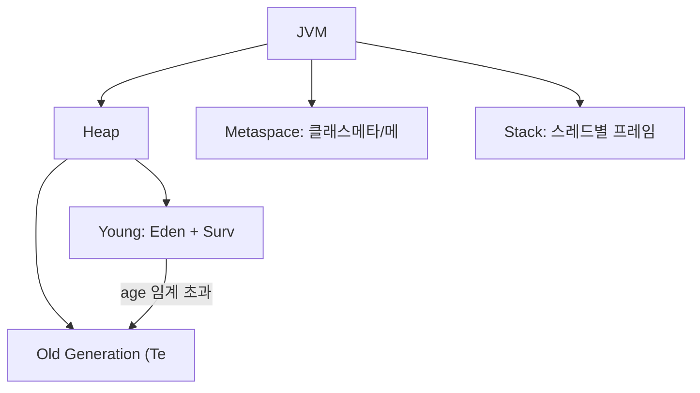

### 각 영역 설명

| 영역 | 위치 | 내용 | GC 대상 |
|------|------|------|---------|
| Eden | Heap/Young | 새로 생성된 객체 | Minor GC |
| Survivor S0/S1 | Heap/Young | Eden에서 살아남은 객체 | Minor GC |
| Old (Tenured) | Heap/Old | 오래 살아남은 객체 | Major/Full GC |
| Metaspace | Native Memory | 클래스 메타데이터 | Full GC |
| Stack | Thread별 | 지역 변수, 스택 프레임 | GC 대상 아님 |
| Code Cache | Native Memory | JIT 컴파일된 코드 | GC 대상 아님 |

### Metaspace (Java 8+)

Java 7까지는 클래스 정보를 Heap 내의 **PermGen(Permanent Generation)**에 저장했습니다. PermGen은 크기가 고정되어 있어 클래스가 많으면 `OutOfMemoryError: PermGen space` 오류가 자주 발생했습니다.

Java 8부터 PermGen을 폐지하고 **Metaspace**로 대체했습니다. Metaspace는 Native 메모리를 사용하며 필요에 따라 자동으로 확장됩니다.

```bash
# Metaspace 크기 제한 설정 (설정 없으면 무제한 확장)
-XX:MetaspaceSize=256m
-XX:MaxMetaspaceSize=512m
```

---

## 3. GC 기본 알고리즘

### Mark-and-Sweep

GC의 가장 기본적인 알고리즘입니다. 두 단계로 동작합니다.

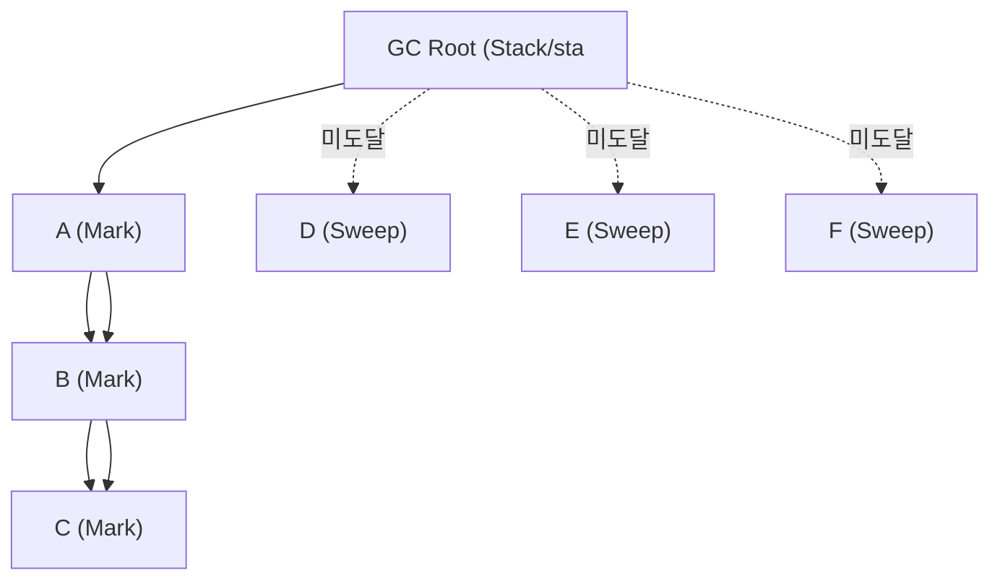

**단점**: Sweep 후 메모리 단편화(Fragmentation) 발생. 큰 객체 할당 실패 가능.

### Mark-and-Compact

Mark-and-Sweep에 압축(Compact) 단계를 추가합니다.

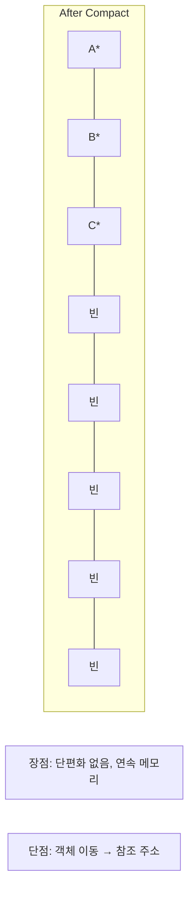

### Copying (복사 알고리즘)

메모리를 두 영역으로 나누어 사용 중인 절반의 살아있는 객체를 다른 절반으로 복사합니다.

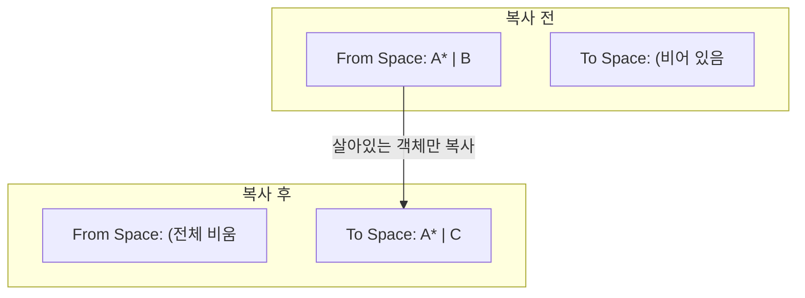

**장점**: 단편화 없음, 할당 속도 빠름(포인터 하나만 이동).
**단점**: 메모리 절반만 사용 가능.
Young Generation의 Eden ↔ Survivor 복사에 이 방식을 사용합니다.

### Reference Counting (Java 미사용)

각 객체에 참조 횟수를 저장하고 0이 되면 즉시 해제합니다. Python, Swift 등에서 사용하지만 Java는 채택하지 않았습니다.

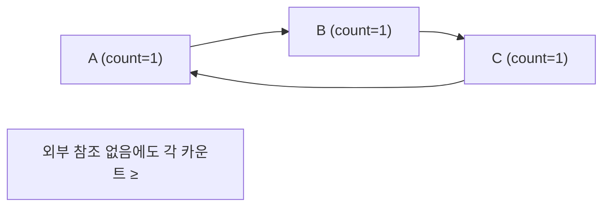

---

## 4. Generational GC 가설 — 약한 세대 가설

### 핵심 가설

**"대부분의 객체는 생성 직후 금방 죽는다(짧은 수명을 가진다)."**

실제 프로그램에서 객체 생존 패턴을 분석하면 다음 분포를 보입니다.

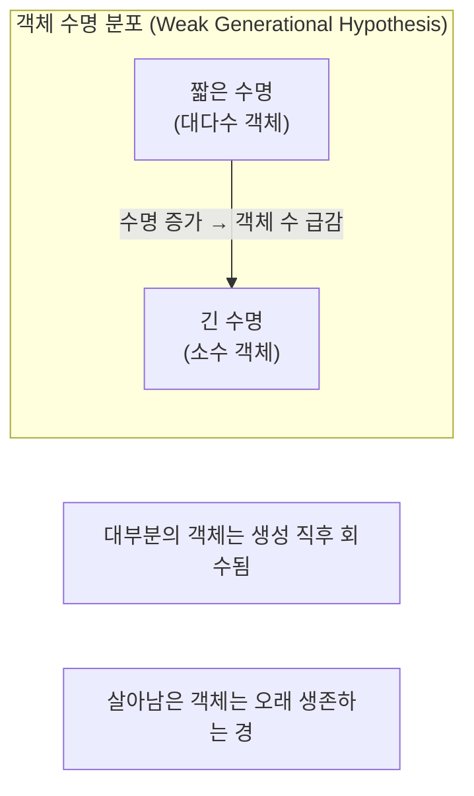

이 가설을 바탕으로 메모리를 **Young Generation**과 **Old Generation**으로 분리합니다.

### Young Generation 구조

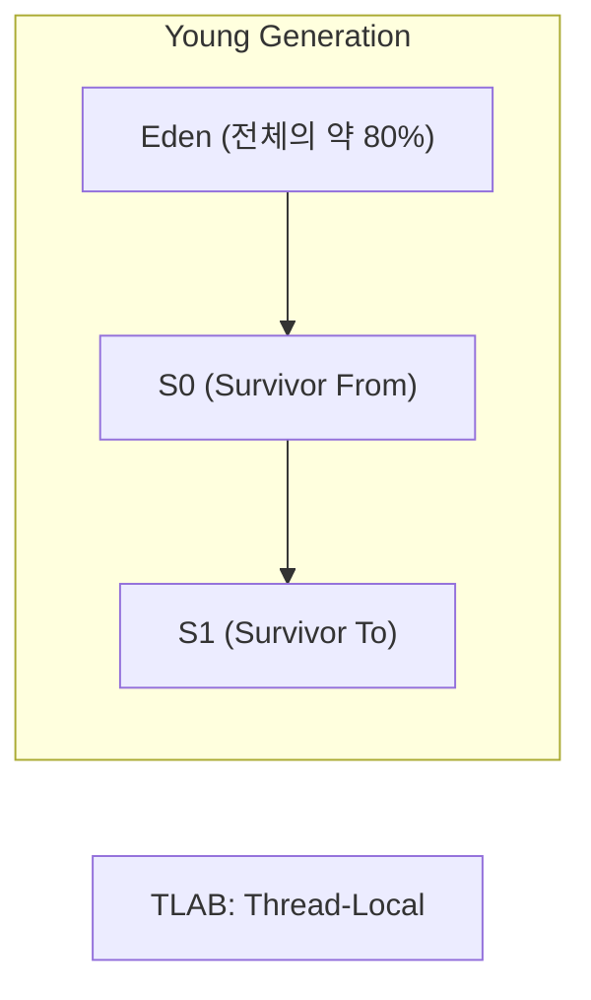

### Minor GC vs Major GC vs Full GC

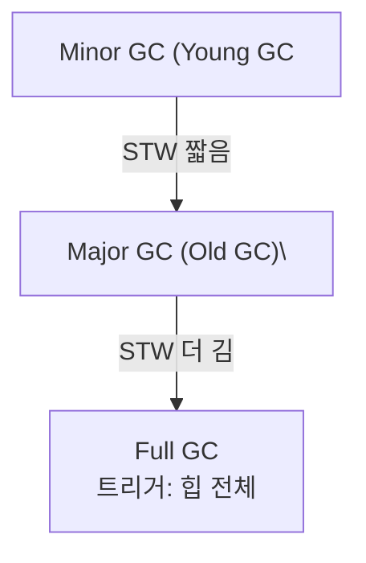

### 객체 승격(Promotion) 과정

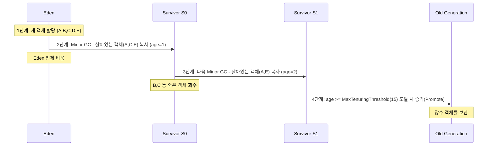

---

## 5. GC 종류별 상세 설명

### Serial GC

단일 스레드로 GC를 수행합니다. GC 동안 애플리케이션 스레드가 모두 멈춥니다.

```mermaid
gantt
    title Serial GC 동작 (단일 GC 스레드)
    dateFormat X
    axisFormat %s
    section App Thread 1~3
    실행중 : 0, 10
    STW : crit, 10, 16
    실행중 : 16, 26
    section GC Thread
    Mark→Sweep→Compact : active, 10, 16
```

```bash
# Serial GC 활성화
-XX:+UseSerialGC
```

| 항목 | 내용 |
|------|------|
| 적합 환경 | 단일 코어, 소규모 힙(~수백 MB), 클라이언트 앱 |
| 일시 정지 | 길음 |
| 처리량 | 낮음 |
| 메모리 오버헤드 | 최소 |

### Parallel GC (Throughput GC)

멀티 스레드로 Minor GC를 수행합니다. Java 8까지의 기본 GC였습니다.

```mermaid
gantt
    title Parallel GC 동작
    dateFormat X
    axisFormat %s
    section App
    실행중 : 0, 10
    STW : crit, 10, 20
    실행중 : 20, 30
    section GC
    병렬 GC : active, 10, 20
```

```bash
-XX:+UseParallelGC
-XX:ParallelGCThreads=8      # GC 스레드 수
-XX:GCTimeRatio=19           # GC 시간 비율 (1/(1+19) = 5% 목표)
-XX:MaxGCPauseMillis=200     # 최대 일시 정지 목표 (ms)
```

| 항목 | 내용 |
|------|------|
| 적합 환경 | 배치 처리, 대용량 데이터 처리 (응답 시간보다 처리량 중요) |
| 일시 정지 | 중간 (Serial보다 짧음) |
| 처리량 | 높음 |

### CMS (Concurrent Mark-Sweep) GC — Deprecated

애플리케이션 스레드와 GC 스레드가 **동시에(Concurrent)** 실행되어 STW를 최소화합니다. Java 9에서 Deprecated, Java 14에서 완전 제거되었습니다.

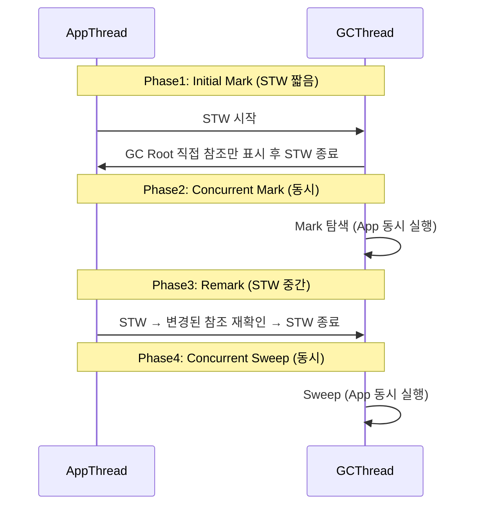

**CMS 단점**:
- Compact 미수행 → 단편화 심각 → 결국 Full GC (STW) 발생
- 높은 CPU 사용률 (GC 스레드가 CPU 지속 소비)
- Floating Garbage (동시 실행 중 발생한 새 가비지는 다음 사이클에 처리)

### G1 GC (Garbage First) — Java 9+ 기본

**Region 기반**으로 힙을 동일한 크기의 블록으로 나누어 관리합니다. 각 Region은 역할이 동적으로 변합니다.

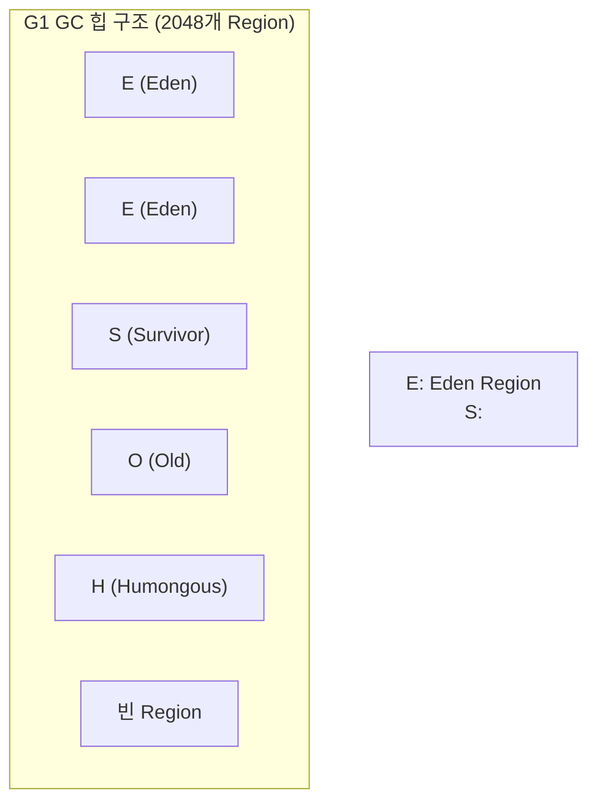

**G1 GC 동작 단계**:

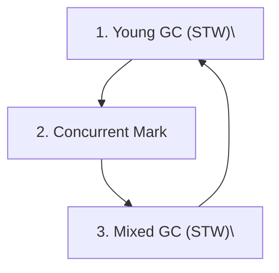

**Humongous 객체**:

```java
// Region 크기의 50% 이상인 객체는 Humongous Region에 배치
// Region 크기 = 힙 크기 / 2048 (1MB ~ 32MB)
// 예: 힙 4GB → Region 크기 2MB → 1MB 이상 객체가 Humongous

byte[] hugeArray = new byte[2 * 1024 * 1024]; // 2MB → Humongous

// Humongous 객체는 Old에 직접 할당 → Young GC로 회수 안 됨
// 짧게 사는 큰 객체는 GC 부담 증가 → 가능하면 분할
```

**G1 GC 주요 옵션**:

```bash
-XX:+UseG1GC                      # G1 활성화 (Java 9+는 기본값)
-XX:MaxGCPauseMillis=200          # 목표 최대 일시 정지 시간 (ms)
-XX:G1HeapRegionSize=16m          # Region 크기 (1~32MB, 2의 거듭제곱)
-XX:G1NewSizePercent=5            # Young Generation 최소 비율
-XX:G1MaxNewSizePercent=60        # Young Generation 최대 비율
-XX:G1MixedGCLiveThresholdPercent=85  # Mixed GC 포함 Old Region 기준
-XX:InitiatingHeapOccupancyPercent=45 # Concurrent Mark 시작 힙 점유율
```

**Remembered Set과 Card Table**:

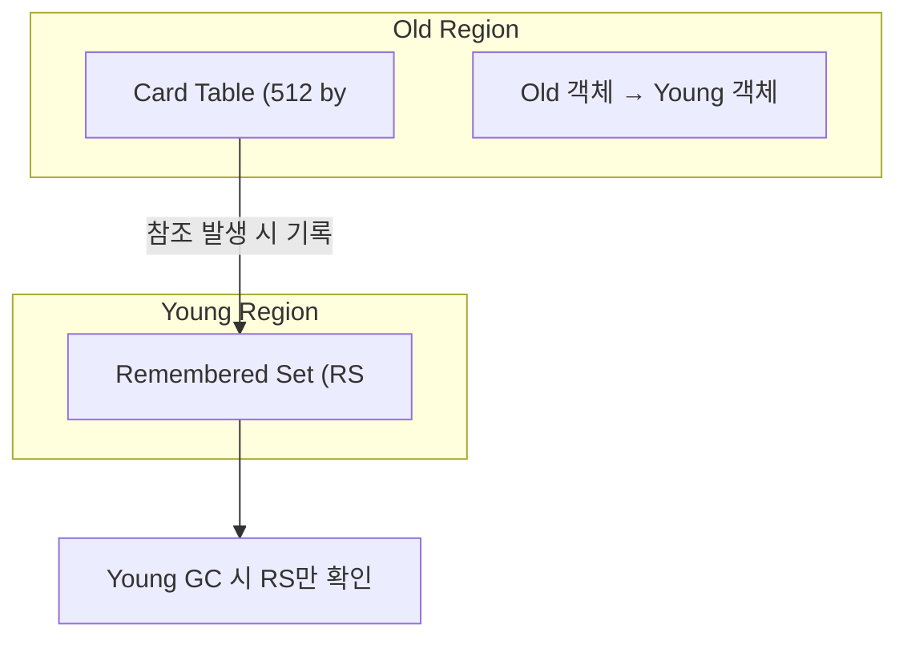

### ZGC (Z Garbage Collector) — Java 15+ Production

목표: **최대 일시 정지 1ms 미만** (힙 크기와 무관).

```bash
-XX:+UseZGC
```

**ZGC 핵심 기술**:

**1. Colored Pointer (색상 포인터)**

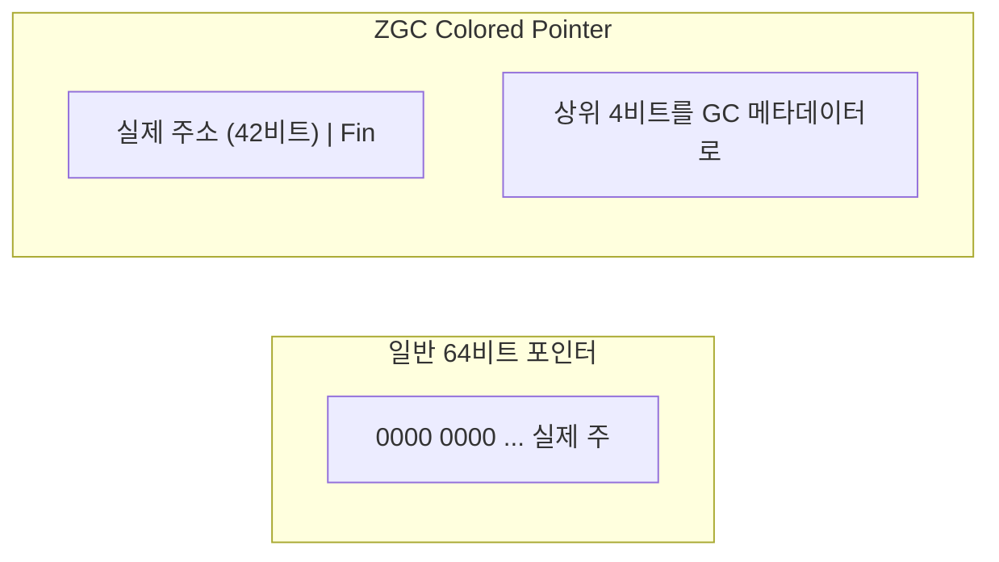

객체 주소 자체에 GC 상태를 저장하여 추가 메모리 없이 동시 처리를 구현합니다.

**2. Load Barrier (부하 장벽)**

```java
// 코드상 단순 참조 접근:
Object obj = someField;

// JIT 컴파일 후 (Load Barrier 삽입):
Object obj = someField;
if (obj의 포인터 색상이 현재 GC 뷰와 불일치) {
    obj = GC가 알고 있는 최신 주소로 수정; // 힙 이동 후 참조 갱신
}
```

Load Barrier가 모든 객체 참조 접근 시 동작하여 동시 이동(Concurrent Relocation) 중에도 올바른 주소를 보장합니다.

**ZGC 동작 단계**:

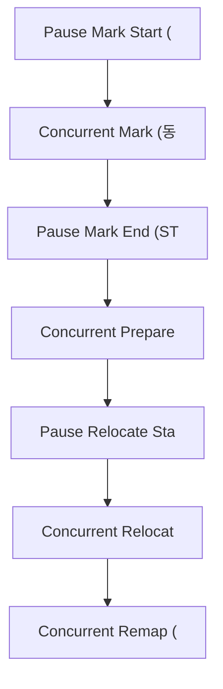

**대용량 힙 지원**:

```bash
# ZGC는 TB 단위 힙도 지원
-Xmx16t   # 16 Terabytes
-XX:+UseZGC
```

**Generational ZGC (Java 21)**:

Java 21부터 ZGC도 Young/Old Generation을 분리하는 Generational 모드를 지원합니다.

```bash
-XX:+UseZGC -XX:+ZGenerational  # Java 21
# Java 23부터 Generational이 기본값
```

### Shenandoah GC

RedHat이 개발한 **동시 압축(Concurrent Compaction)** GC입니다.

```bash
-XX:+UseShenandoahGC
```

**ZGC와의 차이점**:

**Brooks Pointer (브룩스 포인터)**:

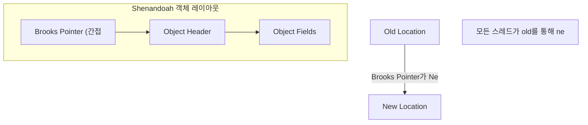

| 항목 | ZGC | Shenandoah |
|------|-----|------------|
| 개발사 | Oracle | RedHat |
| 포인터 기법 | Colored Pointer | Brooks Pointer |
| Load Barrier | 있음 | 있음 |
| 메모리 오버헤드 | 낮음 | 약간 높음 (헤더 추가) |
| 대용량 힙 | 매우 강함 | 강함 |
| OpenJDK 포함 | Java 15+ | Java 12+ |

---

## 6. GC 종류별 비교 표

| GC | 최대 일시 정지 | 처리량 | 메모리 오버헤드 | 구현 복잡도 | 적합 환경 |
|----|--------------|--------|--------------|-----------|---------|
| Serial | 초 단위 가능 | 낮음 | 최소 | 매우 낮음 | 단일 코어, 임베디드 |
| Parallel | 수십~수백 ms | 최고 | 낮음 | 낮음 | 배치, 과학 계산 |
| CMS | 수십 ms (Mark/Remark) | 높음 | 중간 | 높음 | (Deprecated, 사용 지양) |
| G1 | 수십~수백 ms (목표 설정) | 높음 | 중간 | 중간 | 범용, 4GB+ 힙 |
| ZGC | <1ms (목표) | 약간 낮음 | 약간 높음 | 높음 | 저지연, TB급 힙 |
| Shenandoah | <10ms (목표) | 약간 낮음 | 약간 높음 | 높음 | 저지연, 범용 |

---

## 7. GC 튜닝 핵심 옵션

### 힙 크기 설정

```bash
-Xms2g                  # 초기 힙 크기 2GB
-Xmx8g                  # 최대 힙 크기 8GB
# 실무 팁: Xms == Xmx로 설정 시 동적 조정 비용 제거
#           컨테이너에서는 MaxRAMPercentage 사용 권장
-XX:MaxRAMPercentage=75 # 컨테이너 메모리의 75%를 힙에 할당
```

### Young/Old 비율 조정

```bash
-XX:NewRatio=2          # Old:Young = 2:1 → Young이 힙의 1/3
-XX:NewSize=512m        # Young Generation 초기 크기
-XX:MaxNewSize=2g       # Young Generation 최대 크기
-XX:SurvivorRatio=8     # Eden:Survivor = 8:1:1 → Eden이 Young의 80%
```

### GC 종류 선택

```bash
-XX:+UseSerialGC        # Serial GC
-XX:+UseParallelGC      # Parallel GC
-XX:+UseG1GC            # G1 GC (Java 9+ 기본)
-XX:+UseZGC             # ZGC (Java 15+)
-XX:+UseShenandoahGC    # Shenandoah
```

### G1 GC 튜닝

```bash
-XX:MaxGCPauseMillis=200         # 목표 최대 STW 시간
-XX:G1HeapRegionSize=16m         # Region 크기
-XX:InitiatingHeapOccupancyPercent=45  # Concurrent Cycle 시작 임계값
-XX:G1ReservePercent=10          # 승격 실패 방지용 예비 힙 비율
-XX:ConcGCThreads=4              # 동시 GC 스레드 수
```

### GC 로그 설정

```bash
# Java 9+ 권장 방식
-Xlog:gc*:file=gc.log:time,uptime,level,tags:filecount=5,filesize=20m

# 주요 태그
-Xlog:gc                    # 기본 GC 요약
-Xlog:gc*                   # 모든 GC 관련 로그
-Xlog:gc+heap               # 힙 사용량 포함
-Xlog:gc+age                # 객체 나이 분포

# Java 8 (구 방식)
-XX:+PrintGCDetails
-XX:+PrintGCDateStamps
-Xloggc:/var/log/app/gc.log
-XX:+UseGCLogFileRotation
-XX:NumberOfGCLogFiles=5
-XX:GCLogFileSize=20m
```

---

## 8. GC 로그 분석

### G1 GC 로그 읽기

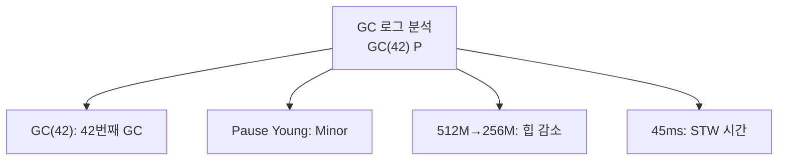

```mermaid
graph TD
    LOG2["GC(43) Pause Young"]
    B1["Concurrent Start:"]
    B2["Mixed: Young + 일부"]
    LOG2 --> B1
    LOG2 --> B2
```

### ZGC 로그 읽기

```mermaid
graph TD
    ZLC["GC(10) 2048M(100%)"]
    Z1["Pause Mark Start:"]
    Z2["Concurrent Mark: 2"]
    Z3["Pause Mark End: 0."]
    Z4["Concurrent Process"]
    Z5["Pause Relocate Sta"]
    Z6["Concurrent Relocat"]
    ZLC --> Z1 --> Z2 --> Z3 --> Z4 --> Z5 --> Z6
```

### GC 분석 도구

**GCEasy (온라인)**:

```mermaid
graph LR
    UPLOAD["GC 로그 파일 업로드\nhttp"] --> ANALYZE["자동 분석"]
    ANALYZE --> R1["GC 발생 빈도 및 패턴"]
    ANALYZE --> R2["STW 시간 분포"]
    ANALYZE --> R3["힙 사용량 추이"]
    ANALYZE --> R4["잠재적 메모리 누수 탐지"]
```

**GCViewer (로컬 도구)**:

```bash
java -jar gcviewer-1.36.jar gc.log
# 타임라인 그래프, 통계 제공
```

**JVM 내장 도구**:

```bash
# JVM 실행 중 GC 정보 확인
jstat -gcutil <pid> 1000    # 1초 간격으로 GC 통계 출력
jstat -gc <pid> 1000        # 힙 크기 및 GC 횟수/시간
jcmd <pid> GC.run           # GC 강제 실행
jcmd <pid> VM.native_memory # 네이티브 메모리 사용량
```

---

## 9. Stop-the-World 최소화 전략

### 1. 객체 수명 단축

```java
// 나쁜 예 — 불필요한 Long-lived 객체
public class Cache {
    private static final Map<String, byte[]> cache = new HashMap<>();
    // static Map에 byte[]를 계속 추가 → Old Generation 점유 증가
}

// 좋은 예 — 약한 참조 + 크기 제한
public class BoundedCache {
    private final Map<String, SoftReference<byte[]>> cache =
        new LinkedHashMap<>(100, 0.75f, true) {
            @Override
            protected boolean removeEldestEntry(Map.Entry e) {
                return size() > 100; // 최대 100개 유지
            }
        };
}
```

### 2. 힙 크기 적절히 설정

```mermaid
graph TD
    SMALL["힙이 너무 작음\nGC 빈도 증가"]
    LARGE["힙이 너무 큼\nGC 당 STW"]
    OPT["권장: 실제 워킹셋의 2~3배 설"]
    SMALL --> OPT
    LARGE --> OPT
```

### 3. 객체 풀링 (신중하게)

```java
// 대용량 임시 버퍼는 풀링으로 GC 부담 감소
public class BufferPool {
    private final Queue<byte[]> pool = new ConcurrentLinkedQueue<>();
    private static final int BUFFER_SIZE = 64 * 1024; // 64KB

    public byte[] acquire() {
        byte[] buf = pool.poll();
        return buf != null ? buf : new byte[BUFFER_SIZE];
    }

    public void release(byte[] buf) {
        // 풀 크기 제한 (메모리 누수 방지)
        if (pool.size() < 100) {
            pool.offer(buf);
        }
    }
}
```

### 4. 대용량 배열 처리 주의

```java
// Humongous 객체 발생 방지 (G1 GC 기준)
// G1 Region 크기(기본 자동 계산) > 객체 크기/2 이면 Humongous

// 나쁜 예 — 매 요청마다 큰 배열 생성
byte[] buffer = new byte[10 * 1024 * 1024]; // 10MB, Humongous!

// 좋은 예 — 청크 단위 처리
int chunkSize = 512 * 1024; // 512KB
for (int offset = 0; offset < totalSize; offset += chunkSize) {
    byte[] chunk = new byte[Math.min(chunkSize, totalSize - offset)];
    process(chunk, data, offset);
}
```

### 5. GC 친화적 자료구조

```java
// int[] vs List<Integer> 비교
int[] primitiveArray = new int[1_000_000];     // 4MB, GC 부담 최소
List<Integer> boxedList = new ArrayList<>(1_000_000); // ~16MB + 객체 오버헤드

// 대량 기본 타입 데이터는 배열 또는 primitive 특화 컬렉션 사용
// (Eclipse Collections, Trove, Koloboke 등)
```

---

## 10. 메모리 누수 패턴

### static 컬렉션

```java
// 메모리 누수 — static Map에 무한정 추가
public class EventRegistry {
    // static Map은 애플리케이션 생명주기 동안 유지
    private static final Map<String, List<Object>> handlers = new HashMap<>();

    public static void register(String event, Object handler) {
        handlers.computeIfAbsent(event, k -> new ArrayList<>()).add(handler);
        // remove() 없으면 영원히 쌓임
    }
}

// 해결: 명시적 remove 또는 WeakHashMap 사용
private static final Map<String, List<Object>> handlers = new WeakHashMap<>();
```

### 리스너/콜백 미해제

```java
// 메모리 누수 — 등록한 리스너를 해제하지 않음
public class MyService {
    public void start() {
        eventBus.subscribe("user.created", this::onUserCreated);
        // 서비스 종료 시 unsubscribe 안 하면
        // MyService 인스턴스가 GC 대상에서 제외됨
    }

    @PreDestroy
    public void stop() {
        eventBus.unsubscribe("user.created", this::onUserCreated); // 반드시 해제
    }
}
```

### ThreadLocal 미정리

```java
// 메모리 누수 — 스레드 풀에서 ThreadLocal 미정리
public class RequestFilter {
    private static final ThreadLocal<UserContext> CONTEXT = new ThreadLocal<>();

    public void doFilter(Request req, Response res, FilterChain chain) {
        CONTEXT.set(new UserContext(req.getUserId()));
        try {
            chain.doFilter(req, res);
        } finally {
            CONTEXT.remove(); // 반드시! 스레드 풀 스레드는 재사용되므로
        }
    }
}
```

### 클래스로더 누수

```java
// 메모리 누수 — 동적 클래스로더와 static 참조
public class PluginLoader {
    // static 컬렉션이 동적으로 로드된 클래스를 참조
    private static final List<Class<?>> loadedClasses = new ArrayList<>();

    public void loadPlugin(URL[] urls) {
        URLClassLoader loader = new URLClassLoader(urls);
        Class<?> pluginClass = loader.loadClass("com.example.Plugin");
        loadedClasses.add(pluginClass); // 클래스로더가 GC 불가 → Metaspace 누수

        // 해결: 플러그인 언로드 시 loadedClasses에서 제거 + loader.close()
    }
}
```

### 내부 클래스 참조

```java
// 메모리 누수 — 비정적 내부 클래스가 외부 클래스를 암묵적으로 참조
public class Outer {
    private final byte[] largeData = new byte[10 * 1024 * 1024]; // 10MB

    public Runnable createTask() {
        // 비정적 내부 클래스 → Outer 인스턴스에 대한 암묵적 참조 보유
        return new Runnable() {
            @Override
            public void run() {
                // largeData를 직접 사용하지 않아도 Outer가 GC 불가
            }
        };
    }
}

// 해결: static 내부 클래스 또는 람다 + 명시적 캡처
public Runnable createTask() {
    byte[] needed = this.largeData; // 필요한 것만 캡처
    return () -> process(needed);   // Outer 전체를 참조하지 않음
}
```

### 메모리 누수 진단 도구

```bash
# 힙 덤프 생성
jmap -dump:format=b,file=heap.hprof <pid>
# OOM 발생 시 자동 덤프
-XX:+HeapDumpOnOutOfMemoryError
-XX:HeapDumpPath=/var/log/app/heap.hprof

# 힙 덤프 분석
# Eclipse MAT (Memory Analyzer Tool): https://eclipse.dev/mat/
# VisualVM: jvisualvm 명령

# 실시간 모니터링
jcmd <pid> VM.native_memory summary
jstat -gcutil <pid> 2000  # 2초 간격
```

---

## 11. 실무 GC 선택 가이드

### 워크로드별 추천

```mermaid
graph TD
    BATCH["배치 처리 / 데이터 파이프라인\"]
    WEB["일반 웹 서비스 API\n(균형형"]
    LOWLAT["저지연 서비스\n(실시간 거래,"]
    SHEN["저지연 + 범용\n(ZGC보다 C"]
    MICRO["마이크로서비스 / 컨테이너\n(소"]
```

### 선택 플로우차트

```mermaid
graph TD
    S["앱 특성 분석"]
    Q1{"힙 < 1GB?"}
    Q2{"처리량 최우선?"}
    Q3{"STW < 100ms?"}
    S --> Q1
    Q1 -->|YES| A1["Serial/G1"]
    Q1 -->|NO| Q2
    Q2 -->|YES| A2["Parallel GC"]
    Q2 -->|NO| Q3
    Q3 -->|YES| A3["ZGC/Shenandoah"]
    Q3 -->|NO| A4["G1 GC"]
```

### 컨테이너 환경 필수 설정

```bash
# Docker/Kubernetes 컨테이너에서 JVM 메모리 올바르게 인식
# Java 10+ 권장 설정
-XX:+UseContainerSupport          # 컨테이너 메모리 인식 (기본 활성화)
-XX:MaxRAMPercentage=75           # 컨테이너 메모리의 75%를 힙에 할당
-XX:InitialRAMPercentage=50       # 초기 힙 = 50%

# 예: 컨테이너 메모리 2GB → 최대 힙 1.5GB 자동 설정
```

### 프로파일링 기반 튜닝 절차

```mermaid
graph TD
    S1["1. 기본 설정으로 부하 테스트"]
    S2["2. GC 로그 수집\n-Xlog"]
    S3["3. GCEasy 또는 GCVie"]
    S4["4. 파라미터 조정 → 재측정 반"]
    S5["5. 안정화 후 운영 배포"]
    S1 --> S2 --> S3 --> S4 --> S5
    S4 -->|"목표 미달 시 반복"| S1
```

---

## 실무에서 자주 하는 실수

### 실수 1: GC 로그 없이 튜닝 시도

GC 문제를 추정으로 해결하려는 것이 가장 흔한 실수입니다. Full GC 발생 여부, STW 시간, Old Generation 증가 추세는 반드시 로그로 확인해야 합니다.

```bash
# GC 로그 활성화 (Java 9+)
java -Xlog:gc*:file=gc.log:time,uptime:filecount=5,filesize=20m \
     -XX:+HeapDumpOnOutOfMemoryError \
     -XX:HeapDumpPath=/var/log/app/heap.hprof \
     -jar app.jar
```

GCEasy(https://gceasy.io) 또는 GCViewer로 로그를 분석하면 Full GC 빈도, 평균 STW 시간, 힙 사용 패턴을 시각적으로 파악할 수 있습니다.

### 실수 2: Xmx만 크게 설정하면 해결된다는 믿음

힙을 크게 잡으면 GC 빈도는 줄지만, Full GC 한 번의 STW 시간이 길어집니다. 8GB 힙에서 Full GC가 발생하면 수 초~수십 초 STW가 발생할 수 있습니다.

```bash
# 나쁜 예: 무작정 힙만 크게
java -Xmx16g -jar app.jar

# 좋은 예: 힙 크기 + GC 알고리즘 함께 조정
java -Xmx8g \
     -XX:+UseZGC \          # 저지연 GC로 STW를 ms 수준으로 제한
     -XX:MaxGCPauseMillis=50 \
     -jar app.jar
```

### 실수 3: static 컬렉션에 객체를 넣고 빼지 않음

static 필드에 저장된 컬렉션은 GC Root로부터 항상 도달 가능하므로 절대 수거되지 않습니다. 캐시처럼 사용하다가 메모리 누수의 주범이 됩니다.

```java
// 위험: static Map에 넣기만 하고 제거하지 않음
public class SessionManager {
    private static final Map<String, Session> sessions = new HashMap<>();

    public void addSession(String id, Session session) {
        sessions.put(id, session); // 세션이 만료돼도 Map에 남아있음
    }
    // remove() 없음 → 메모리 누수
}

// 개선: WeakHashMap 또는 만료 기반 캐시
private static final Map<String, Session> sessions =
    Collections.synchronizedMap(new WeakHashMap<>());
// 또는 Caffeine 캐시로 TTL 설정
```

### 실수 4: finalize() 또는 Cleaner를 잘못 사용

`finalize()`는 GC가 실행할 시점을 보장하지 않으며 성능 문제를 유발합니다. Java 9부터 deprecated이며, Java 18부터는 제거 예정입니다.

```java
// 나쁜 예: finalize() 사용
@Override
protected void finalize() throws Throwable {
    connection.close(); // GC 타이밍 불확실, 성능 저하
}

// 좋은 예: try-with-resources 또는 Cleaner
public class Resource implements AutoCloseable {
    @Override
    public void close() {
        connection.close(); // 명시적 호출 보장
    }
}

try (Resource r = new Resource()) {
    r.use();
} // 자동으로 close() 호출
```

### 실수 5: Young Generation 비율을 기본값에서 건드리지 않음

단명 객체(요청 처리 중 생성되는 DTO, 임시 문자열)가 많은 서버 애플리케이션에서 Young Generation이 너무 작으면 Minor GC가 과도하게 발생합니다.

```bash
# Young Generation 비율 조정
java -Xmx8g \
     -XX:NewRatio=2 \        # Young:Old = 1:2 (Young = 약 2.7GB)
     -XX:SurvivorRatio=8 \   # Eden:Survivor = 8:1:1
     -XX:+UseG1GC \
     -jar app.jar

# G1GC에서는 Region 크기로 제어
java -Xmx8g \
     -XX:+UseG1GC \
     -XX:G1HeapRegionSize=16m \  # 대형 객체(Humongous) 임계값 상향
     -jar app.jar
```

---


## 극한 시나리오

### 100 TPS — G1GC 기본 설정으로 충분

초당 100건의 요청은 기본 G1GC 설정으로 충분히 처리됩니다. 추가 튜닝보다 메모리 누수 여부 모니터링이 더 중요합니다.

```bash
# 100 TPS: 기본 설정 + 모니터링만 추가
java -Xms2g -Xmx4g \
     -XX:+UseG1GC \
     -XX:+HeapDumpOnOutOfMemoryError \
     -Xlog:gc*:file=gc.log:time,uptime \
     -jar app.jar
```

Heap 사용량이 시간이 지나도 일정 수준에서 안정화되는지 확인합니다. 점진적으로 증가한다면 메모리 누수를 의심해야 합니다.

### 10,000 TPS — STW 최소화가 핵심

초당 10,000건에서 100ms STW가 발생하면 해당 시간 동안 1,000건의 요청이 지연됩니다. STW를 50ms 이하로 제한하는 것이 목표입니다.

```bash
# 10K TPS: G1GC + STW 목표 설정
java -Xms8g -Xmx8g \          # Min=Max로 힙 크기 고정 (리사이징 STW 방지)
     -XX:+UseG1GC \
     -XX:MaxGCPauseMillis=50 \ # STW 목표 50ms
     -XX:G1HeapOccupancyPercent=45 \ # Old GC 트리거 임계값 낮춤
     -XX:G1NewSizePercent=20 \
     -XX:G1MaxNewSizePercent=40 \
     -jar app.jar
```

```java
// 객체 생성 최소화: 요청당 임시 객체를 줄여 GC 압력 감소
// 나쁜 예: 매 요청마다 새 StringBuilder
public String buildResponse(List<Item> items) {
    String result = "";
    for (Item item : items) {
        result += item.toString(); // 매 반복마다 String 객체 생성
    }
    return result;
}

// 좋은 예: StringBuilder 재사용 패턴 또는 ThreadLocal
private static final ThreadLocal<StringBuilder> SB =
    ThreadLocal.withInitial(StringBuilder::new);

public String buildResponse(List<Item> items) {
    StringBuilder sb = SB.get();
    sb.setLength(0); // 재사용
    items.forEach(item -> sb.append(item.toString()));
    return sb.toString();
}
```

### 100,000 TPS — ZGC + 힙 외 메모리 전략

초당 100,000건에서는 GC STW가 수십 ms만 되어도 서비스에 영향을 줍니다. ZGC 또는 Shenandoah로 STW를 1~2ms 이하로 줄이고, Off-heap 메모리 활용을 검토합니다.

```bash
# 100K TPS: ZGC로 STW 최소화
java -Xms32g -Xmx32g \
     -XX:+UseZGC \
     -XX:SoftMaxHeapSize=28g \     # 힙 28GB 초과 시 적극적 GC
     -XX:ConcGCThreads=4 \        # 동시 GC 스레드 수
     -XX:+ZGenerational \         # Java 21+: Generational ZGC
     -jar app.jar
```

```java
// Off-heap 캐시: DirectByteBuffer로 GC 대상 외 메모리 사용
public class OffHeapCache {
    // GC가 관리하지 않는 네이티브 메모리에 캐시 저장
    private final ByteBuffer buffer = ByteBuffer.allocateDirect(1024 * 1024 * 512); // 512MB

    public void put(int offset, byte[] data) {
        buffer.position(offset);
        buffer.put(data); // GC 압력 없음
    }
}
```

```mermaid
graph TD
    subgraph "100K TPS GC 전략"
        Z["ZGC / Generational"]
        OH["Off-heap 캐시\nDirec"]
        OBJ["객체 풀링\nApache Comm"]
        VAL["Value Objects 최소화\"]
        MON["실시간 모니터링\nJFR + Pr"]
    end
    Z -->|"STW 1ms 이하"| MON
    OH -->|"GC 압력 감소"| MON
    OBJ -->|"할당 빈도 감소"| MON
    VAL -->|"Young GC 감소"| MON
```

100K TPS에서는 GC 튜닝 이전에 애플리케이션 코드에서 불필요한 객체 생성을 줄이는 것이 선행되어야 합니다. JFR(Java Flight Recorder)로 어느 코드가 가장 많은 객체를 생성하는지 프로파일링한 후 최적화하는 순서가 효과적입니다.

---
## 정리

```mermaid
graph TD
    GC["GC 선택"]
    GC --> PAR["처리량 최우선 → Parallel"]
    GC --> G1["범용 균형 → G1 GC (기본값"]
    GC --> ZGC["저지연 → ZGC / Shenan"]
    GC --> SER["소규모 → Serial GC"]
    TUNE["튜닝 3원칙: 측정먼저 / 하나씩"]
    LEAK["누수 방지: static컬렉션 r"]
```
