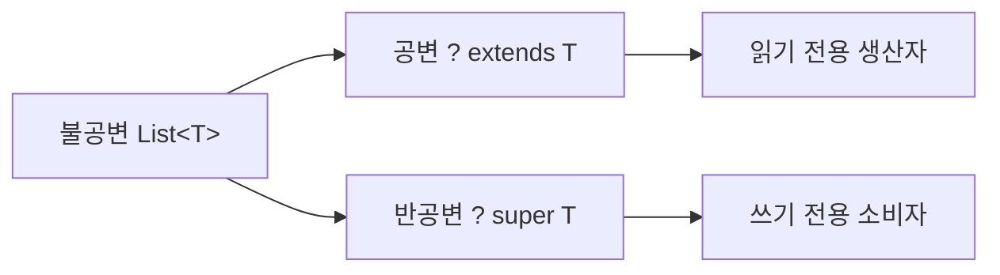

Java 제네릭은 1995년 출시된 Java에 2004년(Java 5) 뒤늦게 합류한 기능입니다. 단순한 "타입 파라미터 문법" 수준을 넘어, **타입 소거(Type Erasure)**, **브리지 메서드**, **PECS**, **힙 오염**, **Reified 제네릭 부재** 등 JVM 설계 철학이 깊게 녹아 있는 주제입니다. 이 글은 왜 그런 설계를 선택했는지 내부 메커니즘 중심으로 파고듭니다.

> **비유**: 제네릭은 공항 수하물 태그와 같습니다. 비행기(JVM)는 어떤 짐(Object)이든 실을 수 있지만, 탑승 수속 카운터(컴파일러)에서 태그를 붙여 목적지(타입)를 검증합니다. 비행기가 이륙하면(런타임) 태그는 제거되고 짐 자체만 남습니다. 수하물이 뒤바뀌는 사고(ClassCastException)는 지상(컴파일 타임)에서 막아야지, 하늘(런타임)에서 막으면 이미 늦습니다.

---

## 1. 제네릭이 필요한 근본 이유

### Java 5 이전: Object 캐스팅의 구조적 취약점

Java 컬렉션 API 초기 설계는 모든 원소를 `Object`로 받는 구조였습니다. 이는 두 가지 근본적 문제를 일으켰습니다.

```java
// Java 1.4 시대 코드
List userNames = new ArrayList();
userNames.add("Alice");
userNames.add("Bob");
userNames.add(42);          // 실수 — 컴파일러가 전혀 모름

for (int i = 0; i < userNames.size(); i++) {
    String name = (String) userNames.get(i); // 3번째에서 런타임 폭발
    System.out.println(name.toUpperCase());
}
// java.lang.ClassCastException: class java.lang.Integer
//   cannot be cast to class java.lang.String
```

문제의 핵심은 **에러 발생 시점의 지연**입니다. 42를 넣는 시점(개발)과 ClassCastException이 터지는 시점(운영)이 다릅니다. 프로덕션에서 야간 배치가 수천 건 처리 후 3001번째에서 터지면 이미 데이터는 오염되어 있습니다.

```java
// Java 5 이후 — 컴파일 타임 차단
List<String> userNames = new ArrayList<>();
userNames.add("Alice");
userNames.add("Bob");
// userNames.add(42); // 컴파일 에러: incompatible types: int cannot be converted to String

for (String name : userNames) { // 캐스팅 코드 자체가 불필요
    System.out.println(name.toUpperCase());
}
```

이 변화는 단순한 편의 기능이 아닙니다. **에러 발견 시점을 런타임에서 컴파일 타임으로 당기는** 패러다임 전환입니다.

---

## 2. 타입 소거(Type Erasure): Java가 선택한 설계 철학

### 왜 타입 소거를 선택했는가 — 하위 호환성의 딜레마

Java 5가 출시될 당시 이미 수백만 줄의 Java 코드가 존재했습니다. C#은 .NET 2.0에서 Reified 제네릭(런타임 타입 정보 유지)을 선택했지만, Java는 달랐습니다.

**핵심 제약**: 기존 `List`(Raw 타입)로 작성된 코드가 Java 5 컴파일러와 JVM에서 수정 없이 동작해야 했습니다. 또한 `ArrayList<String>`으로 컴파일된 `.class` 파일이 Java 1.4 런타임에서도 동작해야 했습니다(바이너리 하위 호환성).

이를 달성하는 유일한 방법은 **제네릭 타입 정보를 컴파일러가 검사 후 소거**하는 것이었습니다. 런타임 JVM은 그대로 두고, 컴파일러 레이어에서만 타입 안전성을 추가한 것입니다.


### 컴파일 타임에 정확히 무슨 일이 일어나는가

컴파일러는 세 가지 변환을 순서대로 수행합니다.

**변환 1: 타입 파라미터를 바운드 타입으로 교체**

```java
// 원본 소스코드
public class Box<T> {
    private T value;

    public T getValue() { return value; }
    public void setValue(T value) { this.value = value; }
}

public class NumericBox<T extends Number> {
    private T value;
    public double sum() { return value.doubleValue(); }
}
```

```java
// 소거 후 바이트코드 (javap -c 로 확인 가능한 형태)
public class Box {
    private Object value;       // T → Object (바운드 없으면 Object)

    public Object getValue() { return value; }
    public void setValue(Object value) { this.value = value; }
}

public class NumericBox {
    private Number value;       // T extends Number → Number (첫 번째 바운드)
    public double sum() { return value.doubleValue(); }
}
```

**변환 2: 호출 지점에 자동 캐스팅 삽입**

```java
// 원본
List<String> list = new ArrayList<>();
list.add("hello");
String s = list.get(0);

// 소거 후 (컴파일러가 생성하는 실제 바이트코드)
List list = new ArrayList();
list.add("hello");
String s = (String) list.get(0); // 컴파일러가 자동으로 체크캐스트 삽입
```

컴파일러가 자동으로 삽입하는 캐스팅은 **절대 실패하지 않음을 컴파일러가 보장**합니다. 타입 검사가 이미 끝났기 때문입니다. Raw 타입이나 unchecked 경고를 무시하지 않는 한 런타임 ClassCastException은 발생하지 않습니다.

**변환 3: 런타임 타입 동일성 확인**

```java
List<String> stringList = new ArrayList<>();
List<Integer> intList = new ArrayList<>();

// 런타임에 동일한 클래스 — 제네릭 타입 파라미터는 이미 소거됨
System.out.println(stringList.getClass() == intList.getClass()); // true
System.out.println(stringList.getClass().getName()); // java.util.ArrayList

// instanceof도 마찬가지
System.out.println(stringList instanceof List);    // true
System.out.println(stringList instanceof ArrayList); // true
// System.out.println(stringList instanceof List<String>); // 컴파일 에러!
```

### 브리지 메서드(Bridge Methods): 다형성 보존 장치

타입 소거로 인해 오버라이드 관계가 깨지는 상황이 생깁니다. 컴파일러는 이를 자동으로 수정하는 **브리지 메서드**를 생성합니다.

```java
// 원본 코드
public interface Comparable<T> {
    int compareTo(T other);
}

public class Money implements Comparable<Money> {
    private final long cents;

    public Money(long cents) { this.cents = cents; }

    @Override
    public int compareTo(Money other) {
        return Long.compare(this.cents, other.cents);
    }
}
```

```java
// 타입 소거 후 컴파일러가 실제로 생성하는 바이트코드
public class Money implements Comparable {

    // 원본 메서드 — 소거 후에도 유지
    public int compareTo(Money other) {
        return Long.compare(this.cents, other.cents);
    }

    // 브리지 메서드 — 컴파일러 자동 생성 (ACC_BRIDGE | ACC_SYNTHETIC 플래그)
    // Comparable 인터페이스의 compareTo(Object)를 구현하기 위해 필요
    public int compareTo(Object other) {
        return this.compareTo((Money) other); // 실제 메서드로 위임
    }
}
```

브리지 메서드 없이는 `Comparable` 인터페이스의 `compareTo(Object)`를 구현하지 않으므로 다형성이 깨집니다. `Collections.sort()`는 `Comparable.compareTo(Object)`를 호출하기 때문에 브리지 메서드가 없으면 `Money`를 정렬할 수 없습니다.

```bash
# javap로 실제 브리지 메서드 확인
$ javap -verbose Money.class | grep -A3 "bridge"
# flags: (0x1041) ACC_PUBLIC, ACC_BRIDGE, ACC_SYNTHETIC
# descriptor: (Ljava/lang/Object;)I
```

**브리지 메서드가 생기는 또 다른 케이스: 공변 반환 타입**

```java
public class Animal {
    public Animal create() { return new Animal(); }
}

public class Dog extends Animal {
    @Override
    public Dog create() { return new Dog(); } // 공변 반환 타입
}

// 컴파일러가 Dog에 브리지 메서드 생성
// public Animal create() { return this.create(); }  // 브리지
// public Dog create() { return new Dog(); }          // 실제
```

---

## 3. 경계 타입 파라미터(Bounded Type Parameters): extends vs super의 내부 원리

### 상한 경계(Upper Bound): `T extends Type`

상한 경계는 두 가지 역할을 합니다.

1. **허용 타입 제한**: T는 반드시 `Type`의 서브타입이어야 함
2. **메서드 접근 허용**: T를 `Type`처럼 취급하여 `Type`의 메서드를 호출 가능

```java
// 경계 없이는 T를 Object로만 취급 — Number의 메서드 호출 불가
public static <T> double naiveSum(List<T> list) {
    double total = 0;
    for (T element : list) {
        // total += element.doubleValue(); // 컴파일 에러! T는 Object
    }
    return total;
}

// T extends Number — T를 Number처럼 취급 가능
public static <T extends Number> double sum(List<T> list) {
    double total = 0;
    for (T element : list) {
        total += element.doubleValue(); // OK — Number의 메서드
    }
    return total;
}

// 사용
System.out.println(sum(List.of(1, 2, 3)));           // 6.0 (Integer)
System.out.println(sum(List.of(1.5, 2.5)));          // 4.0 (Double)
System.out.println(sum(List.of(1L, 2L, 3L)));        // 6.0 (Long)
// System.out.println(sum(List.of("a", "b")));       // 컴파일 에러
```

소거 후 `T`는 `Number`로 교체되므로 `doubleValue()` 호출이 가능합니다. 이것이 바운드가 없을 때와의 근본적 차이입니다.

### 다중 바운드(Multiple Bounds)와 타입 교차(Type Intersection)

`&`로 여러 타입을 동시에 만족해야 하는 교차 타입을 표현합니다. **클래스는 반드시 첫 번째, 최대 하나**라는 규칙은 JVM의 단일 상속 제약에서 비롯됩니다.

```java
// Serializable + Comparable을 동시에 만족하는 타입만 허용
public static <T extends Serializable & Comparable<T>> T clamp(T value, T min, T max) {
    if (value.compareTo(min) < 0) return min;
    if (value.compareTo(max) > 0) return max;
    return value;
}

// String은 Serializable, Comparable<String> 모두 구현
String result = clamp("mango", "apple", "orange"); // "mango"
Integer n = clamp(150, 0, 100); // 100

// 소거 후 T는 첫 번째 바운드인 Serializable로 교체
// Comparable 메서드는 체크캐스트 삽입 후 호출
```

**실전 활용: 직렬화 가능하고 정렬 가능한 캐시 키**

```java
public class SortedCache<K extends Serializable & Comparable<K>, V> {
    private final TreeMap<K, V> store = new TreeMap<>(); // TreeMap은 정렬 필요

    public void put(K key, V value) {
        store.put(key, value);
    }

    public List<V> getRange(K from, K to) {
        return new ArrayList<>(store.subMap(from, true, to, true).values());
    }

    public byte[] serialize() throws IOException {
        // K가 Serializable이므로 TreeMap 직렬화 가능
        ByteArrayOutputStream baos = new ByteArrayOutputStream();
        new ObjectOutputStream(baos).writeObject(store);
        return baos.toByteArray();
    }
}

SortedCache<String, Integer> cache = new SortedCache<>();
cache.put("banana", 2);
cache.put("apple", 1);
cache.put("cherry", 3);
List<Integer> result = cache.getRange("apple", "cherry"); // [1, 2, 3]
```

---

## 4. PECS: Producer-Extends Consumer-Super의 수학적 근거

### 공변성과 반공변성: 타입 시스템의 기초

배열은 **공변(Covariant)**입니다.

```java
String[] strings = {"a", "b", "c"};
Object[] objects = strings; // OK — 배열은 공변
objects[0] = 42; // 런타임 java.lang.ArrayStoreException!
```

배열의 공변성은 런타임에 `ArrayStoreException`으로 타입 안전성을 보장합니다. 그러나 이는 런타임 체크 비용과 예외 위험을 동반합니다.

제네릭은 **불공변(Invariant)**으로 설계되어 이 문제를 컴파일 타임에 차단합니다.

```java
List<String> strings = new ArrayList<>();
// List<Object> objects = strings; // 컴파일 에러! 불공변

// 만약 허용된다면?
List<Object> objects = strings; // (가상)
objects.add(42);                // Integer를 String 리스트에 삽입
String s = strings.get(0);     // ClassCastException — 이래서 불공변!
```

이 불공변 제약이 너무 엄격할 때 유연성을 제공하는 장치가 와일드카드입니다.

### PECS 원칙의 논리적 도출

`? extends T`(상한 와일드카드)는 **공변** 동작을 흉내냅니다. 단, **읽기 전용**이라는 제약을 걸어 안전성을 보장합니다.

```java
List<Integer> integers = List.of(1, 2, 3);
List<? extends Number> numbers = integers; // OK — 읽기 전용이므로 안전

// 읽기: ? extends Number이므로 최소 Number로 보장
Number n = numbers.get(0); // OK
// 쓰기: 실제 타입이 Integer인지 Double인지 모르므로 차단
// numbers.add(1.0); // 컴파일 에러!
// numbers.add(1);   // 컴파일 에러!
numbers.add(null); // null만 허용 — 모든 참조 타입의 공통값
```

`? super T`(하한 와일드카드)는 **반공변** 동작입니다. **쓰기 전용**으로 안전성을 확보합니다.

```java
List<Number> numbers = new ArrayList<>();
List<? super Integer> sink = numbers; // OK — Integer의 슈퍼타입

// 쓰기: ? super Integer이므로 Integer(와 그 서브타입)는 안전하게 삽입
sink.add(1);    // OK — Integer는 무조건 ? super Integer를 만족
sink.add(42);   // OK
// 읽기: ? super Integer의 상한을 알 수 없으므로 Object로만 취급
Object obj = sink.get(0); // OK
// Integer i = sink.get(0); // 컴파일 에러!
```

### PECS 실전 적용

```java
// Collections.copy의 실제 JDK 시그니처
public static <T> void copy(List<? super T> dest, List<? extends T> src) {
    int srcSize = src.size();
    if (srcSize > dest.size())
        throw new IndexOutOfBoundsException("Source does not fit in dest");
    // src에서 읽어서(Producer = extends) dest에 씀(Consumer = super)
    for (int i = 0; i < srcSize; i++)
        dest.set(i, src.get(i));
}
```

```java
// 실전: 제네릭 스택의 PECS 적용
public class GenericStack<E> {
    private final Deque<E> store = new ArrayDeque<>();

    public void push(E item) { store.push(item); }

    public E pop() { return store.pop(); }

    // src는 Producer — E를 공급함, extends 사용
    public void pushAll(Iterable<? extends E> src) {
        for (E e : src) store.push(e);
    }

    // dst는 Consumer — E를 소비함, super 사용
    public void popAll(Collection<? super E> dst) {
        while (!store.isEmpty()) dst.add(store.pop());
    }
}

GenericStack<Number> stack = new GenericStack<>();

// Integer는 Number의 서브타입 — pushAll 가능 (? extends Number)
stack.pushAll(List.of(1, 2, 3));
// Double도 OK
stack.pushAll(List.of(1.1, 2.2));

// Object는 Number의 슈퍼타입 — popAll 가능 (? super Number)
List<Object> sink = new ArrayList<>();
stack.popAll(sink);
System.out.println(sink); // [2.2, 1.1, 3, 2, 1]
```

**PECS 없이 작성했다면 발생하는 컴파일 에러**

```java
// PECS 미적용 — 과도하게 제한적
public void pushAllWrong(Iterable<E> src) { ... }
// stack.pushAll(intList); // 컴파일 에러! List<Integer> != Iterable<Number>

public void popAllWrong(Collection<E> dst) { ... }
// stack.popAll(objectList); // 컴파일 에러! List<Object> != Collection<Number>
```

---

## 5. 와일드카드 심층: `?` vs `T`, 캡처 변환

### 비한정 와일드카드(Unbounded Wildcard)와 Object의 차이

```java
// List<Object>: 오직 List<Object> 타입만 받음
public static void printAll(List<Object> list) {
    for (Object o : list) System.out.println(o);
}
printAll(new ArrayList<String>()); // 컴파일 에러! 불공변

// List<?>: 어떤 타입 파라미터의 List든 받음
public static void printAny(List<?> list) {
    for (Object o : list) System.out.println(o); // 원소는 Object로 취급
}
printAny(new ArrayList<String>());  // OK
printAny(new ArrayList<Integer>()); // OK
printAny(new ArrayList<>());        // OK
```

`List<?>`와 `List<Object>`의 본질적 차이는 **수용 범위**입니다. `List<Object>`는 `List<Object>` 딱 하나만 받지만, `List<?>`는 어떤 타입의 리스트든 받습니다. 단, 원소 타입이 무엇인지 모르므로 `null` 외에는 추가할 수 없습니다.

### 캡처 변환(Capture Conversion)

컴파일러가 `?`를 내부적으로 고유한 타입 변수로 교체하는 과정입니다. 이를 통해 와일드카드로는 표현할 수 없는 연산(swap)을 헬퍼 메서드로 구현합니다.

```java
// 직접 구현 불가 — ? 타입을 임시 변수에 저장할 수 없음
public static void swapDirect(List<?> list, int i, int j) {
    Object temp = list.get(i);
    // list.set(i, list.get(j)); // 컴파일 에러! set의 인수가 ? 타입
}

// 캡처 변환 활용 — 헬퍼 메서드로 ? 를 T로 캡처
public static void swap(List<?> list, int i, int j) {
    swapHelper(list, i, j); // 컴파일러가 ? 를 캡처하여 T로 추론
}

private static <T> void swapHelper(List<T> list, int i, int j) {
    T temp = list.get(i); // T로 캡처되었으므로 가능
    list.set(i, list.get(j));
    list.set(j, temp);
}

// 사용
List<String> words = new ArrayList<>(List.of("apple", "banana", "cherry"));
swap(words, 0, 2);
System.out.println(words); // [cherry, banana, apple]
```

`swapHelper`를 호출하는 순간 컴파일러는 `?`를 고유한 타입 `CAP#1`으로 캡처합니다. `CAP#1`을 `T`에 바인딩하여 `List<CAP#1>`로 처리합니다. 이것이 캡처 변환입니다.

### `?` vs `T`: 언제 무엇을 쓸 것인가

```java
// 규칙 1: 타입 파라미터가 여러 곳에 연결되어야 하면 T
public static <T> T firstOrDefault(List<T> list, T defaultValue) {
    return list.isEmpty() ? defaultValue : list.get(0);
    // 반환 타입이 list의 원소 타입과 같아야 함 — T 필수
}

// 규칙 2: 단순히 "임의 타입"을 의미하면 ?
public static int size(List<?> list) {
    return list.size(); // 원소 타입과 무관한 연산
}

// 규칙 3: 반환 타입에 ?를 쓰면 호출자가 고통받음
public static List<?> problemMethod() { ... }
List<?> result = problemMethod();
// String s = result.get(0); // 컴파일 에러! ? 타입
// 사용자는 Object로만 처리 가능 — 불편
```

---

## 6. 제네릭 메서드: 타입 추론과 정적 메서드 제약

### 타입 추론(Type Inference)의 동작 원리

컴파일러는 메서드 인수의 타입을 분석하여 타입 파라미터를 자동으로 결정합니다. Java 8부터 타입 추론이 대폭 향상되어 대부분의 경우 명시적 타입 지정이 불필요합니다.

```java
public class TypeInferenceDemo {

    public static <T> List<T> singletonList(T element) {
        List<T> list = new ArrayList<>();
        list.add(element);
        return list;
    }

    public static <T> T firstNonNull(T first, T second) {
        return first != null ? first : second;
    }

    public static <K, V> Map<K, V> mapOf(K key, V value) {
        Map<K, V> map = new HashMap<>();
        map.put(key, value);
        return map;
    }
}

// 타입 추론 예시
List<String> strList = TypeInferenceDemo.singletonList("hello"); // T=String 추론
List<Integer> intList = TypeInferenceDemo.singletonList(42);     // T=Integer 추론

// 복잡한 추론: 공통 슈퍼타입 결정
Number n = TypeInferenceDemo.firstNonNull(1, 2.0); // T=Number (Integer와 Double의 공통 슈퍼)
Object o = TypeInferenceDemo.firstNonNull("str", 42); // T=Object (String과 Integer의 공통 슈퍼)

// 명시적 타입 지정 (컴파일러가 추론 못할 때)
List<Number> explicit = TypeInferenceDemo.<Number>singletonList(42);
```

### 다이아몬드 연산자(`<>`)의 내부 동작

```java
// Java 7 이전 — 반복되는 타입 지정
Map<String, List<Integer>> map1 = new HashMap<String, List<Integer>>();

// Java 7 이후 — 다이아몬드 연산자
Map<String, List<Integer>> map2 = new HashMap<>(); // 좌변에서 추론

// Java 9 — 익명 클래스에도 적용
Comparator<String> comp = new Comparator<>() {      // Java 9+
    @Override
    public int compare(String a, String b) {
        return a.compareTo(b);
    }
};
```

다이아몬드 연산자는 문법 설탕이 아닙니다. **대상 타입 추론(Target-Type Inference)**이라는 별도 알고리즘으로 좌변의 타입 선언으로부터 우변의 타입 파라미터를 역산합니다.

### 왜 정적 메서드는 클래스 타입 파라미터를 사용할 수 없는가

이것은 면접에서 자주 나오는 질문입니다. 답은 **타입 파라미터의 바인딩 시점** 차이에 있습니다.

```java
public class Container<T> {
    private T value;

    // 인스턴스 메서드 — T는 인스턴스 생성 시 바인딩됨 (OK)
    public T getValue() { return value; }
    public void setValue(T value) { this.value = value; }

    // 정적 필드 — 컴파일 에러
    // private static T staticValue; // 에러!

    // 정적 메서드에서 클래스 T 사용 — 컴파일 에러
    // public static T getDefault() { return null; } // 에러!

    // 정적 메서드 전용 타입 파라미터 — OK (클래스 T와 무관)
    public static <E> Container<E> of(E element) {
        Container<E> c = new Container<>();
        c.value = (E) element; // 내부 캐스팅
        return c;
    }
}
```

`T`는 `new Container<String>()`처럼 **인스턴스를 만들 때** 결정됩니다. 반면 `static` 메서드는 인스턴스 없이 `Container.getDefault()`처럼 호출합니다. 이 시점에 `T`가 무엇인지 결정된 컨텍스트가 없습니다. `Container.getDefault()`를 호출할 때 `T=String`인지 `T=Integer`인지 JVM이 알 수 없습니다.

```java
// 이것이 왜 문제인지 — 가상 시나리오
Container<String> cs = new Container<>();
Container<Integer> ci = new Container<>();

// static T getDefault()가 허용된다면?
T val1 = Container<String>.getDefault(); // T=String? (불가능한 문법)
T val2 = Container.getDefault();         // T=??

// 결국 정적 메서드는 별도 타입 파라미터 <E>를 독립적으로 선언해야 함
Container<String> c = Container.<String>of("hello"); // E=String
```

---

## 7. Reified 제네릭: Java가 갖지 못한 것

### Java의 한계와 C#/Kotlin과의 비교

**C# Reified 제네릭**: 런타임에도 타입 파라미터 정보가 유지됩니다.

```csharp
// C# — 런타임에 타입 정보 보존
public class Container<T> {
    public void PrintType() {
        Console.WriteLine(typeof(T).Name); // 런타임에 접근 가능
    }

    public T CreateInstance() {
        return Activator.CreateInstance<T>(); // new T() 가능
    }

    public bool IsString() {
        return typeof(T) == typeof(string); // 런타임 타입 비교
    }
}

var c = new Container<string>();
c.PrintType();    // "String" 출력
var s = c.CreateInstance(); // new string()
```

**Java의 소거 방식**: 런타임에는 타입 정보가 없습니다.

```java
// Java — 동일 시도 불가
public class Container<T> {
    public void printType() {
        // T.class; // 컴파일 에러!
        // new T(); // 컴파일 에러!
    }
}
```

**Kotlin의 reified 타입 파라미터**: `inline` 함수를 통해 소거를 우회합니다.

```kotlin
// Kotlin — inline + reified로 런타임 타입 접근
inline fun <reified T> isType(value: Any): Boolean {
    return value is T // 런타임 타입 체크 가능
}

inline fun <reified T> parseJson(json: String): T {
    return ObjectMapper().readValue(json, T::class.java) // T::class 접근 가능
}

// 사용
println(isType<String>("hello"))  // true
println(isType<Int>("hello"))     // false
val user: User = parseJson<User>(jsonString)
```

Kotlin `reified`의 원리: `inline` 함수는 호출 지점에 바이트코드가 복사 붙여넣기됩니다. 컴파일러가 `T`를 실제 타입(예: `String`)으로 교체한 후 인라이닝하므로 런타임에 타입 정보가 유지됩니다. Java는 `inline` 함수 메커니즘이 없으므로 이 방식을 쓸 수 없습니다.

### TypeToken/TypeReference: Java의 우회 방법

**핵심 원리**: 타입 소거로 제네릭 타입 파라미터는 런타임에 사라지지만, **클래스의 제네릭 슈퍼클래스 정보**는 런타임에도 접근 가능합니다(`getGenericSuperclass()`). 익명 클래스를 만들면 이 특성을 활용할 수 있습니다.

```java
// 슈퍼 타입 토큰 (Super Type Token) 구현
public abstract class TypeToken<T> {
    private final Type type;

    protected TypeToken() {
        // getGenericSuperclass()는 런타임에 제네릭 슈퍼클래스 정보를 반환
        // new TypeToken<List<String>>(){} 형태의 익명 클래스가 필요
        ParameterizedType superClass = (ParameterizedType) getClass().getGenericSuperclass();
        this.type = superClass.getActualTypeArguments()[0];
    }

    public Type getType() { return type; }

    @Override
    public String toString() { return type.toString(); }
}

// 사용
TypeToken<List<String>> token = new TypeToken<List<String>>() {};
System.out.println(token.getType());
// java.util.List<java.lang.String> — 런타임에 제네릭 타입 정보 보존!

TypeToken<Map<String, List<Integer>>> complexToken =
    new TypeToken<Map<String, List<Integer>>>() {};
System.out.println(complexToken.getType());
// java.util.Map<java.lang.String, java.util.List<java.lang.Integer>>
```

**Jackson의 TypeReference가 이 원리를 사용합니다**

```java
// Jackson으로 List<User> 역직렬화
String json = "[{\"name\":\"Alice\"}, {\"name\":\"Bob\"}]";

// TypeReference 없이는 LinkedHashMap 리스트로 역직렬화됨
List raw = mapper.readValue(json, List.class);
// ((Map) raw.get(0)).get("name") — 불편하고 타입 불안전

// TypeReference로 List<User> 타입 정보 보존
List<User> users = mapper.readValue(json, new TypeReference<List<User>>() {});
// TypeReference<List<User>>의 익명 클래스가 제네릭 슈퍼클래스 정보를 제공
System.out.println(users.get(0).getName()); // "Alice" — 타입 안전
```

**Jackson TypeReference의 핵심 구현 원리**

```java
// Jackson의 TypeReference (단순화)
public abstract class TypeReference<T> {
    protected final Type _type;

    protected TypeReference() {
        Type superClass = getClass().getGenericSuperclass();
        if (superClass instanceof Class<?>) {
            throw new IllegalArgumentException("TypeReference는 익명 클래스로 사용해야 합니다");
        }
        _type = ((ParameterizedType) superClass).getActualTypeArguments()[0];
    }

    public Type getType() { return _type; }
}
```

---

## 8. 힙 오염(Heap Pollution)과 @SafeVarargs

### 힙 오염이란 무엇인가

힙 오염은 **제네릭 타입 변수가 실제와 다른 타입의 객체를 가리키는 상태**입니다. 런타임에 ClassCastException을 일으키는 잠재적 폭탄입니다.

```java
// 힙 오염 발생 시나리오 1: Raw 타입 혼용
List<String> strings = new ArrayList<>();
List raw = strings;          // Raw 타입 대입 — 경고 발생
raw.add(42);                  // Integer를 String 리스트에 삽입 — 컴파일은 됨

String s = strings.get(0);   // 런타임 ClassCastException!
// 자동 삽입된 체크캐스트: (String) 42 → ClassCastException
```

```java
// 힙 오염 발생 시나리오 2: 비검사 캐스팅
@SuppressWarnings("unchecked")
public static <T> List<T> dangerousCast(List<?> list) {
    return (List<T>) list; // 비검사 캐스팅 — 힙 오염 시작
}

List<Integer> integers = List.of(1, 2, 3);
List<String> strings = dangerousCast(integers); // 경고를 무시하면 컴파일됨

String s = strings.get(0); // 런타임 ClassCastException!
```

### 가변 인수(varargs)와 힙 오염

varargs는 배열로 구현됩니다. 제네릭 타입 배열을 만들 수 없음에도 varargs 파라미터로는 만들어집니다. 이것이 힙 오염의 주요 경로입니다.

```java
// 경고: [unchecked] Possible heap pollution from parameterized vararg type
public static <T> List<T> asList(T... elements) {
    // elements의 실제 타입은 Object[] (타입 소거)
    // 하지만 List<T>로 취급됨 — 힙 오염 가능
    return Arrays.asList(elements);
}

// 극한 시나리오: 힙 오염이 실제로 발생하는 케이스
static void pollute(List<String>... stringLists) {
    Object[] objectArrays = stringLists;          // 배열은 공변 — OK
    objectArrays[0] = List.of(42, 43);            // List<Integer> 삽입
    String s = stringLists[0].get(0);             // ClassCastException!
}

// 이 코드는 컴파일 경고를 발생시키며, 실제로 위험함
pollute(new ArrayList<>(), new ArrayList<>());
```

### @SafeVarargs: 안전성 보장 선언

`@SafeVarargs`는 메서드 작성자가 "이 varargs 사용은 힙 오염을 일으키지 않음을 보장"한다고 컴파일러에게 약속하는 어노테이션입니다.

```java
// 안전한 varargs — 배열을 읽기만 하고 외부로 노출하지 않음
@SafeVarargs
public static <T> List<T> safeCombine(List<T>... lists) {
    List<T> result = new ArrayList<>();
    for (List<T> list : lists) {
        result.addAll(list); // 읽기만 함 — 안전
    }
    return result;
    // lists 배열 자체를 반환하거나 외부에 저장하지 않으므로 안전
}

// 안전 조건 위반 — @SafeVarargs 붙이면 안 됨
// public static <T> T[] toArray(T... elements) {
//     return elements; // 배열 자체를 반환 — 힙 오염 가능
// }
```

**@SafeVarargs 사용 조건**

```java
// 조건 1: final 또는 static 메서드 (재정의 불가여야 함)
// 조건 2: varargs 파라미터 배열에 쓰기 연산이 없어야 함
// 조건 3: varargs 배열(또는 복제본)을 외부에 노출하지 않아야 함

@SafeVarargs
public final <T> void processAll(T... items) { // final 메서드 — OK
    for (T item : items) process(item); // 읽기만 — OK
}

// Java 9+: private 메서드에도 적용 가능
@SafeVarargs
private <T> List<T> collect(T... items) {
    return new ArrayList<>(Arrays.asList(items));
}
```

---

## 9. 재귀 타입 경계(Recursive Type Bounds)

### `Comparable<T extends Comparable<T>>`의 의미

`T extends Comparable<T>`는 "T는 T 자신과 비교할 수 있어야 한다"는 재귀적 계약입니다.

```java
// 왜 단순히 T extends Comparable이 아닌가?
public static <T extends Comparable> T wrongMax(List<T> list) {
    T result = list.get(0);
    for (T e : list) {
        // e.compareTo(result)의 결과가 보장되지 않음
        // T가 Comparable<Integer>인데 String을 비교하면?
        if (e.compareTo(result) > 0) result = e;
    }
    return result;
}

// 올바른 구현: T extends Comparable<T>
public static <T extends Comparable<T>> T max(List<T> list) {
    if (list.isEmpty()) throw new NoSuchElementException();
    T result = list.get(0);
    for (T e : list) {
        if (e.compareTo(result) > 0) result = e; // 타입 안전한 비교
    }
    return result;
}

// 더 유연한 버전 (JDK Collections.max의 실제 시그니처)
public static <T extends Comparable<? super T>> T maxFlexible(List<T> list) {
    // ? super T: T 또는 T의 슈퍼타입과 비교 가능하면 허용
    // 예: Dog extends Animal, Animal implements Comparable<Animal>
    // Dog는 Comparable<Dog>가 아니라 Comparable<Animal>을 구현
    // Comparable<? super Dog>는 Comparable<Animal>을 포함하므로 OK
    T result = list.get(0);
    for (T e : list) {
        if (e.compareTo(result) > 0) result = e;
    }
    return result;
}
```

### 빌더 패턴의 재귀 타입 경계: 계층 상속 문제 해결

제네릭 없이 빌더 계층을 만들면 메서드 체이닝이 깨집니다.

```java
// 문제: 제네릭 없는 빌더 상속
public abstract class Vehicle {
    protected String brand;
    protected int year;

    public abstract static class Builder {
        protected String brand;
        protected int year;

        public Builder brand(String brand) {
            this.brand = brand;
            return this; // Animal.Builder 반환 — 타입 정보 손실!
        }

        public Builder year(int year) {
            this.year = year;
            return this;
        }
    }
}

public class Car extends Vehicle {
    private int doors;

    public static class Builder extends Vehicle.Builder {
        private int doors;

        public Builder doors(int doors) {
            this.doors = doors;
            return this;
        }
    }
}

// 문제 발생: brand()가 Vehicle.Builder를 반환하므로 doors() 호출 불가
// new Car.Builder().brand("Toyota").doors(4).build(); // 컴파일 에러!
// brand() 이후 Vehicle.Builder가 반환되어 doors() 미존재
```

```java
// 해결: 재귀 타입 경계로 Self 타입 모사
public abstract class Vehicle {
    protected final String brand;
    protected final int year;

    protected Vehicle(Builder<?> builder) {
        this.brand = builder.brand;
        this.year = builder.year;
    }

    // B는 자기 자신의 서브타입 — Self-referential generic
    public abstract static class Builder<B extends Builder<B>> {
        protected String brand;
        protected int year;

        @SuppressWarnings("unchecked")
        public B brand(String brand) {
            this.brand = brand;
            return (B) this; // 실제 서브타입 B 반환
        }

        @SuppressWarnings("unchecked")
        public B year(int year) {
            this.year = year;
            return (B) this;
        }

        public abstract Vehicle build();
    }
}

public class Car extends Vehicle {
    private final int doors;
    private final String fuelType;

    private Car(Builder builder) {
        super(builder);
        this.doors = builder.doors;
        this.fuelType = builder.fuelType;
    }

    public static class Builder extends Vehicle.Builder<Builder> {
        private int doors;
        private String fuelType;

        public Builder doors(int doors) {
            this.doors = doors;
            return this; // Car.Builder 반환
        }

        public Builder fuelType(String fuelType) {
            this.fuelType = fuelType;
            return this;
        }

        @Override
        public Car build() {
            return new Car(this);
        }
    }
}

public class ElectricCar extends Car {
    private final int range;

    private ElectricCar(Builder builder) {
        super(builder);
        this.range = builder.range;
    }

    // 3단계 계층도 자연스럽게 지원
    public static class Builder extends Car.Builder {
        private int range;

        public Builder range(int range) {
            this.range = range;
            return this;
        }

        @Override
        public ElectricCar build() {
            return new ElectricCar(this);
        }
    }
}

// 메서드 체이닝이 계층 전반에서 올바른 타입 반환
ElectricCar tesla = new ElectricCar.Builder()
        .brand("Tesla")      // Vehicle.Builder<Builder>.brand() → Builder 반환
        .year(2024)          // Vehicle.Builder<Builder>.year() → Builder 반환
        .doors(4)            // Car.Builder.doors() → Car.Builder의 B 반환
        .fuelType("Electric") // Car.Builder.fuelType() → Builder 반환
        .range(500)          // ElectricCar.Builder.range() → Builder 반환
        .build();            // ElectricCar
```

---

## 10. 컬렉션과 제네릭: 공변성과 반공변성 전체 그림



### `List<? extends Number>` vs `List<Number>`: 실제 차이

```java
// List<Number>: Number 타입 원소만 직접 보유
List<Number> numList = new ArrayList<>();
numList.add(1);      // OK — Integer는 Number
numList.add(1.5);    // OK — Double은 Number
numList.add(1L);     // OK — Long은 Number

// List<Integer>를 List<Number>에 대입 불가 — 불공변
// List<Number> fromInt = new ArrayList<Integer>(); // 컴파일 에러!

// List<? extends Number>: Number 서브타입 리스트라면 무엇이든 대입 가능
List<? extends Number> wildcardList;
wildcardList = new ArrayList<Integer>(); // OK
wildcardList = new ArrayList<Double>();  // OK
wildcardList = new ArrayList<Number>();  // OK

// 하지만 원소 추가 불가
// wildcardList.add(1);   // 컴파일 에러!
// wildcardList.add(1.5); // 컴파일 에러!
Number n = wildcardList.get(0); // 읽기는 OK
```

### 실전: 제네릭 컬렉션 유틸리티

```java
public class CollectionUtils {

    // 합계: Producer (읽기) — extends
    public static double sum(List<? extends Number> numbers) {
        return numbers.stream()
                .mapToDouble(Number::doubleValue)
                .sum();
    }

    // 필터 후 다른 컬렉션에 추가: src는 Producer, dest는 Consumer
    public static <T> void filterAndCollect(
            List<? extends T> src,
            List<? super T> dest,
            Predicate<? super T> predicate) {
        for (T item : src) {
            if (predicate.test(item)) {
                dest.add(item);
            }
        }
    }

    // 변환: Function의 입력은 ? super T (반공변), 출력은 ? extends R (공변)
    public static <T, R> List<R> transform(
            List<? extends T> src,
            Function<? super T, ? extends R> mapper) {
        List<R> result = new ArrayList<>();
        for (T item : src) {
            result.add(mapper.apply(item));
        }
        return result;
    }
}

// 사용
List<Integer> scores = List.of(85, 92, 78, 95, 60);
double avg = CollectionUtils.sum(scores) / scores.size(); // sum은 extends

List<Number> above80 = new ArrayList<>();
CollectionUtils.filterAndCollect(scores, above80, n -> n.intValue() > 80);
// scores는 List<Integer> (? extends Number), above80은 List<Number> (? super Integer)

List<String> scoreStrings = CollectionUtils.transform(scores, n -> n + "점");
System.out.println(scoreStrings); // [85점, 92점, 78점, 95점, 60점]
```

---

## 11. 리플렉션과 제네릭: Spring DI의 동작 원리

### ParameterizedType과 getActualTypeArguments()

타입 소거에도 불구하고 다음 경우에는 런타임에 제네릭 타입 정보에 접근할 수 있습니다.

1. 클래스의 제네릭 슈퍼클래스 (`getGenericSuperclass()`)
2. 클래스가 구현한 제네릭 인터페이스 (`getGenericInterfaces()`)
3. 필드의 제네릭 타입 (`Field.getGenericType()`)
4. 메서드의 제네릭 파라미터/반환 타입

```java
import java.lang.reflect.*;
import java.util.*;

// 런타임 제네릭 타입 정보 접근
public class ReflectionGenericsDemo {

    // 1. 제네릭 슈퍼클래스 정보
    static class StringList extends ArrayList<String> {}

    public static void inspectSuperclass() throws Exception {
        Type superType = StringList.class.getGenericSuperclass();
        // java.util.ArrayList<java.lang.String>

        if (superType instanceof ParameterizedType pt) {
            Type[] args = pt.getActualTypeArguments();
            System.out.println(args[0]); // class java.lang.String
        }
    }

    // 2. 제네릭 인터페이스 정보
    static class UserRepo implements Comparator<String> {
        @Override
        public int compare(String a, String b) { return a.compareTo(b); }
    }

    public static void inspectInterface() {
        Type[] interfaces = UserRepo.class.getGenericInterfaces();
        for (Type iface : interfaces) {
            if (iface instanceof ParameterizedType pt) {
                System.out.println(pt.getRawType());           // interface java.util.Comparator
                System.out.println(pt.getActualTypeArguments()[0]); // class java.lang.String
            }
        }
    }

    // 3. 필드의 제네릭 타입
    static class Container {
        private Map<String, List<Integer>> data;
    }

    public static void inspectField() throws Exception {
        Field field = Container.class.getDeclaredField("data");
        Type genericType = field.getGenericType();

        if (genericType instanceof ParameterizedType pt) {
            System.out.println(pt.getRawType()); // interface java.util.Map
            System.out.println(Arrays.toString(pt.getActualTypeArguments()));
            // [class java.lang.String, java.util.List<java.lang.Integer>]
        }
    }

    // 4. 메서드 파라미터 제네릭 타입
    static class Service {
        public void process(List<String> items) {}
    }

    public static void inspectMethod() throws Exception {
        Method m = Service.class.getMethod("process", List.class);
        Type[] paramTypes = m.getGenericParameterTypes();
        if (paramTypes[0] instanceof ParameterizedType pt) {
            System.out.println(pt.getActualTypeArguments()[0]); // class java.lang.String
        }
    }
}
```

### Spring이 이를 어떻게 활용하는가: DI 타입 매칭

Spring의 의존성 주입이 `List<UserRepository>`나 `Optional<UserService>` 같은 제네릭 타입을 올바르게 매칭할 수 있는 비결이 바로 리플렉션 제네릭 정보입니다.

```java
// Spring DI 시나리오
@Service
public class OrderService {

    // Spring은 이 필드의 제네릭 타입 정보를 리플렉션으로 읽어
    // List<OrderRepository>의 모든 빈을 주입
    @Autowired
    private List<OrderRepository> repositories;

    // ResolvableType을 사용하여 Optional<PaymentGateway>의
    // 실제 타입 파라미터를 분석하여 PaymentGateway 빈을 찾음
    @Autowired
    private Optional<PaymentGateway> gateway;
}
```

**Spring ResolvableType의 핵심 동작을 직접 구현해보면**

```java
// Spring의 타입 매칭 핵심 로직 (단순화)
public class SimpleTypeResolver {

    // 필드의 제네릭 타입 파라미터를 추출
    public static List<Class<?>> getTypeArguments(Field field) {
        Type genericType = field.getGenericType();
        List<Class<?>> result = new ArrayList<>();

        if (genericType instanceof ParameterizedType pt) {
            for (Type arg : pt.getActualTypeArguments()) {
                if (arg instanceof Class<?> clazz) {
                    result.add(clazz);
                } else if (arg instanceof ParameterizedType nested) {
                    result.add((Class<?>) nested.getRawType());
                }
            }
        }
        return result;
    }

    // 특정 인터페이스의 제네릭 타입 인수 추출
    // 예: UserRepository가 CrudRepository<User, Long>을 구현할 때
    //     User와 Long을 추출
    public static Type[] getInterfaceTypeArguments(Class<?> clazz, Class<?> targetInterface) {
        for (Type iface : clazz.getGenericInterfaces()) {
            if (iface instanceof ParameterizedType pt) {
                if (pt.getRawType() == targetInterface) {
                    return pt.getActualTypeArguments();
                }
            }
        }
        return new Type[0];
    }
}

// 활용 예시
public class UserRepository implements CrudRepository<User, Long> {
    // 구현...
}

Type[] args = SimpleTypeResolver.getInterfaceTypeArguments(
    UserRepository.class, CrudRepository.class);
System.out.println(args[0]); // class User
System.out.println(args[1]); // class java.lang.Long
```

### JPA AbstractJpaRepository의 실제 패턴

```java
// Spring Data JPA의 SimpleJpaRepository가 실제로 하는 일
public abstract class AbstractRepository<T, ID> {
    protected final Class<T> entityClass;
    protected final EntityManager em;

    @SuppressWarnings("unchecked")
    protected AbstractRepository(EntityManager em) {
        this.em = em;
        // 서브클래스의 제네릭 슈퍼클래스 정보에서 T 추출
        ParameterizedType superType =
            (ParameterizedType) getClass().getGenericSuperclass();
        this.entityClass = (Class<T>) superType.getActualTypeArguments()[0];
        // new UserRepository() → AbstractRepository<User, Long>
        // → getActualTypeArguments()[0] = User.class
    }

    public Optional<T> findById(ID id) {
        return Optional.ofNullable(em.find(entityClass, id));
        // entityClass가 User.class이므로 em.find(User.class, id)
    }

    public List<T> findAll() {
        return em.createQuery(
            "SELECT e FROM " + entityClass.getSimpleName() + " e",
            entityClass
        ).getResultList();
    }
}

// 구체 클래스
@Repository
public class UserRepository extends AbstractRepository<User, Long> {
    public UserRepository(EntityManager em) {
        super(em); // entityClass = User.class 자동 추출
    }

    public List<User> findByEmail(String email) {
        return em.createQuery(
            "SELECT u FROM User u WHERE u.email = :email", User.class)
            .setParameter("email", email)
            .getResultList();
    }
}
```

---

## 12. 타입 안전 이기종 컨테이너(Typesafe Heterogeneous Container)

다양한 타입의 값을 하나의 컨테이너에 타입 안전하게 보관하는 Effective Java 아이템 33의 핵심 패턴입니다.

```java
public class TypesafeContainer {
    private final Map<Class<?>, Object> map = new HashMap<>();

    // Class<T>가 키이자 타입 증명서 역할
    public <T> void put(Class<T> type, T value) {
        map.put(Objects.requireNonNull(type), type.cast(value));
        // type.cast()로 힙 오염 방지 — 저장 시점에 타입 검증
    }

    public <T> T get(Class<T> type) {
        // Class.cast()는 checked cast — ClassCastException 발생 불가
        // (put에서 이미 검증했으므로)
        return type.cast(map.get(type));
    }

    public <T> boolean contains(Class<T> type) {
        return map.containsKey(type);
    }

    // 한계: List<String>.class는 존재하지 않음
    // put(List.class, strings)는 타입 파라미터 정보를 잃음
}

TypesafeContainer container = new TypesafeContainer();
container.put(String.class, "hello");
container.put(Integer.class, 42);
container.put(LocalDate.class, LocalDate.of(2024, 1, 1));

String s = container.get(String.class);          // "hello" — 캐스팅 불필요
Integer n = container.get(Integer.class);        // 42
LocalDate d = container.get(LocalDate.class);    // 2024-01-01
```

**한계 극복: 슈퍼 타입 토큰 기반 컨테이너**

```java
public class AdvancedContainer {
    private final Map<Type, Object> map = new HashMap<>();

    public <T> void put(TypeToken<T> token, T value) {
        map.put(token.getType(), value);
    }

    @SuppressWarnings("unchecked")
    public <T> T get(TypeToken<T> token) {
        return (T) map.get(token.getType());
    }
}

AdvancedContainer container = new AdvancedContainer();

// List<String> 타입 정보 보존
container.put(new TypeToken<List<String>>() {}, List.of("a", "b", "c"));
container.put(new TypeToken<Map<String, Integer>>() {}, Map.of("score", 100));

List<String> list = container.get(new TypeToken<List<String>>() {});
System.out.println(list); // [a, b, c]
```

---

## 13. 제네릭 제약사항: 왜 이런 제한이 있는가

### 기본형 사용 불가: 타입 소거의 직접적 결과

```java
// 컴파일 에러
// List<int> list = new ArrayList<>(); // int는 Object의 서브타입이 아님

// 이유: 소거 후 T는 Object가 됨 — int는 Object가 될 수 없음
// Object value = 42; (오토박싱) → Object value = Integer.valueOf(42)
// 기본형은 힙이 아닌 스택에 저장 — 제네릭 컬렉션은 힙 기반

List<Integer> list = new ArrayList<>(); // OK — 오토박싱으로 편의성 제공
list.add(1);    // 오토박싱: int → Integer
int n = list.get(0); // 언박싱: Integer → int
```

Java 10부터 Valhalla 프로젝트에서 `List<int>` 지원을 추진 중이지만 아직 프로덕션 릴리즈 전입니다.

### 제네릭 배열 생성 불가: 배열 공변성과의 충돌

```java
// 컴파일 에러
// List<String>[] arr = new List<String>[10]; // 에러!

// 왜 위험한가 — 가상 시나리오
List<String>[] arr = new List<String>[2]; // (가상)
Object[] objArr = arr;              // 배열은 공변 — OK
objArr[0] = List.of(1, 2, 3);       // List<Integer> 삽입 — 배열 타입 검사 통과
// arr[0]은 런타임에 그냥 List (소거됨) — ArrayStoreException 발생 안 함
String s = arr[0].get(0);           // ClassCastException!

// 대안 1: Object 배열 생성 후 캐스팅 (경고 발생)
@SuppressWarnings("unchecked")
List<String>[] arr2 = new List[10]; // Raw 타입 배열로 우회

// 대안 2: List of List 사용 (권장)
List<List<String>> listOfLists = new ArrayList<>();
```

### `new T()` 불가: 런타임 타입 부재

```java
// 불가 — 소거 후 T가 Object이므로 new Object()가 되어버림
// public <T> T create() { return new T(); }

// 해결 1: Supplier<T> (람다 친화적, 권장)
public <T> T create(Supplier<T> factory) {
    return factory.get();
}

UserService service = create(UserService::new); // 메서드 참조

// 해결 2: Class<T> + 리플렉션
public <T> T create(Class<T> clazz) {
    try {
        return clazz.getDeclaredConstructor().newInstance();
    } catch (ReflectiveOperationException e) {
        throw new RuntimeException("인스턴스 생성 실패: " + clazz, e);
    }
}

UserService service2 = create(UserService.class);

// 해결 3: 팩토리 패턴 인터페이스
@FunctionalInterface
public interface Factory<T> {
    T create();
}

public <T> T create(Factory<T> factory) {
    return factory.create();
}
```

### 제네릭 예외 클래스 불가

```java
// 컴파일 에러 — catch 블록은 런타임 타입으로 매칭되는데 타입 소거로 정보 없음
// public class GenericException<T extends Exception> extends Exception {}
// catch (GenericException<IOException> e) {} // 불가

// throws 절에는 타입 파라미터 사용 가능 (컴파일 타임 정보만 필요)
public <T extends Exception> void execute(Runnable task, Class<T> exType) throws T {
    try {
        task.run();
    } catch (RuntimeException e) {
        throw exType.cast(e); // 런타임 타입 변환
    }
}

// 예외 처리의 현실적 대안
public class AppException extends RuntimeException {
    private final String errorCode;
    private final Object detail; // 타입 파라미터 대신 Object

    public AppException(String errorCode, Object detail, String message) {
        super(message);
        this.errorCode = errorCode;
        this.detail = detail;
    }
}
```

---

## 14. 극한 시나리오

### 시나리오 1: 제네릭 이벤트 버스에서의 힙 오염

100K TPS 이벤트 시스템에서 타입 안전성을 최대화하면서 다양한 이벤트 타입을 지원해야 합니다.

```java
public class TypeSafeEventBus {
    // 키: 이벤트 클래스, 값: 해당 타입 핸들러 목록
    private final ConcurrentHashMap<Class<?>, CopyOnWriteArrayList<Consumer<?>>> handlers =
            new ConcurrentHashMap<>();

    // 등록 — 타입 안전
    public <E> void on(Class<E> eventType, Consumer<E> handler) {
        handlers.computeIfAbsent(eventType, k -> new CopyOnWriteArrayList<>())
                .add(handler);
    }

    // 발행 — 내부에서만 unchecked cast, @SafeVarargs와 유사한 의도
    @SuppressWarnings("unchecked")
    public <E> void emit(E event) {
        Class<?> type = event.getClass();
        // 이벤트 타입 계층 순회 — 부모 타입 핸들러도 실행
        while (type != null) {
            CopyOnWriteArrayList<Consumer<?>> list = handlers.get(type);
            if (list != null) {
                for (Consumer<?> h : list) {
                    ((Consumer<E>) h).accept(event); // 타입 안전성은 on()에서 보장
                }
            }
            type = type.getSuperclass();
        }
    }
}

// 사용 — 타입 안전
TypeSafeEventBus bus = new TypeSafeEventBus();

bus.on(OrderCreatedEvent.class, event -> {
    // event는 OrderCreatedEvent 타입 — 캐스팅 불필요
    System.out.println("주문 생성: " + event.getOrderId());
});

bus.on(OrderEvent.class, event -> {
    // OrderCreatedEvent가 OrderEvent를 상속하면 이 핸들러도 실행
    System.out.println("주문 이벤트: " + event.getType());
});

bus.emit(new OrderCreatedEvent("ORD-001")); // 두 핸들러 모두 실행
```

### 시나리오 2: 제네릭 파이프라인 빌더

```java
// 타입 안전한 함수형 파이프라인
public class Pipeline<I, O> {
    private final Function<I, O> transform;

    private Pipeline(Function<I, O> transform) {
        this.transform = transform;
    }

    public static <T> Pipeline<T, T> identity() {
        return new Pipeline<>(Function.identity());
    }

    public static <I, O> Pipeline<I, O> of(Function<I, O> fn) {
        return new Pipeline<>(fn);
    }

    // 파이프라인 연결 — O가 다음 Pipeline의 I
    public <R> Pipeline<I, R> then(Pipeline<O, R> next) {
        return new Pipeline<>(transform.andThen(next.transform));
    }

    public <R> Pipeline<I, R> then(Function<O, R> fn) {
        return new Pipeline<>(transform.andThen(fn));
    }

    public O execute(I input) {
        return transform.apply(input);
    }
}

// 타입이 단계마다 안전하게 추적됨
Pipeline<String, Integer> pipeline = Pipeline
        .<String, String>of(String::trim)          // String → String
        .then(String::toUpperCase)                  // String → String
        .then(s -> s.split(","))                    // String → String[]
        .then(arr -> arr.length);                   // String[] → Integer

int count = pipeline.execute("  apple, banana, cherry  "); // 3
```

### 시나리오 3: 재귀 타입 경계의 극한 — `Enum<E extends Enum<E>>`

JDK의 Enum 클래스 선언은 재귀 타입 경계의 가장 복잡한 예입니다.

```java
// JDK의 실제 Enum 선언
public abstract class Enum<E extends Enum<E>> implements Comparable<E>, Serializable {
    private final String name;
    private final int ordinal;

    protected Enum(String name, int ordinal) {
        this.name = name;
        this.ordinal = ordinal;
    }

    public final int compareTo(E other) {
        return this.ordinal - other.ordinal;
    }
}

// Color는 Enum<Color>를 상속
// E = Color, E extends Enum<Color> — Color는 Enum<Color>의 서브타입이어야 함
public enum Color extends Enum<Color> { // (컴파일러가 자동 처리)
    RED, GREEN, BLUE
}
```

`E extends Enum<E>`의 의미: "E는 반드시 E를 타입 파라미터로 가지는 Enum의 서브타입이어야 한다." 즉 `Color`는 `Enum<Color>`를 상속해야 합니다. 이것이 `Color.RED.compareTo(Color.GREEN)`이 타입 안전하게 컴파일되고, `Color.RED.compareTo(Status.ACTIVE)` 같은 엉뚱한 비교가 컴파일 에러가 나는 이유입니다.

```java
// Enum의 타입 안전 활용
public static <E extends Enum<E>> E findByName(Class<E> enumClass, String name) {
    return Arrays.stream(enumClass.getEnumConstants())
            .filter(e -> e.name().equalsIgnoreCase(name))
            .findFirst()
            .orElseThrow(() -> new IllegalArgumentException(
                    "No enum constant " + enumClass.getSimpleName() + "." + name));
}

Color color = findByName(Color.class, "red");  // Color.RED
Status status = findByName(Status.class, "active"); // Status.ACTIVE
// findByName(Color.class, "active") — 실행시간에 예외, 하지만 타입은 안전
```

---

## 면접 포인트 5개

### Q1. 타입 소거가 필요한 이유와 그로 인한 구체적 제약은?

**핵심 WHY**: Java 5는 기존 수백만 줄의 Java 코드와 바이너리 호환성을 유지하면서 제네릭을 도입해야 했습니다. C#처럼 런타임에 타입 정보를 유지하는 Reified 제네릭을 도입하면 JVM을 전면 교체해야 하고, 기존 `.class` 파일과 호환되지 않습니다. 그래서 컴파일러만 수정하고(타입 검사 추가), 런타임 JVM은 그대로 두는 타입 소거를 선택했습니다.

**구체적 제약**:
- `new T()` 불가 → `Supplier<T>` 또는 `Class<T>` 주입으로 해결
- `new T[10]` 불가 → `List<T>` 또는 `(T[]) new Object[10]`으로 우회
- `instanceof List<String>` 불가 → `instanceof List<?>` 사용
- `static T field` 불가 → T는 인스턴스 단위, static은 클래스 단위
- `List<String>.class` 없음 → `TypeToken`/`TypeReference`으로 우회

**극한 질문**: "그렇다면 `List<String>`과 `List<Integer>`가 런타임에 같은 클래스인데, Spring은 어떻게 `List<UserRepository>` 주입을 구현하나요?"
→ Spring은 `Field.getGenericType()`으로 필드의 제네릭 타입 정보를 읽습니다. 선언 정보는 소거되지 않고 바이트코드에 남습니다(`LocalVariable` 정보는 소거되지만 `Field`/`Method` 시그니처는 보존). `ParameterizedType.getActualTypeArguments()`로 `UserRepository.class`를 얻어 해당 빈을 찾습니다.

---

### Q2. PECS 원칙의 수학적 근거와 위반 시 발생하는 실제 문제는?

**핵심 WHY**: 공변성/반공변성의 안전성 보장에서 나옵니다. `List<? extends T>`는 공변 읽기를 허용하지만 쓰기를 막습니다. 왜냐면 `List<Integer>`에 `Double`을 쓰면 안 되는데, 컴파일러는 실제 타입이 `Integer`인지 `Double`인지 모르기 때문입니다. `List<? super T>`는 반공변 쓰기를 허용하지만 타입 보장된 읽기를 막습니다. `List<Number>`에서 꺼낸 것이 `Integer`인지 `Double`인지 모르기 때문입니다.

**위반 시 컴파일 에러**:
```java
// extends로 쓰기 시도 — 컴파일 에러
public void addTo(List<? extends Number> list) {
    list.add(1);   // 에러: ? extends Number에 Integer 추가 불가
    list.add(1.0); // 에러: 마찬가지
}

// super로 타입 안전 읽기 시도 — 컴파일 에러
public void readFrom(List<? super Integer> list) {
    Integer i = list.get(0); // 에러: ? super Integer는 Object
}
```

**극한 시나리오**: 대용량 데이터 변환 파이프라인에서 PECS 미적용 시 매번 새 타입의 컬렉션을 만들어야 해서 GC 압박이 증가합니다. PECS를 제대로 적용하면 하나의 메서드가 다양한 타입 조합을 처리하므로 코드 중복과 메모리 할당이 줄어듭니다.

---

### Q3. 브리지 메서드가 없으면 무슨 일이 생기는가?

**핵심 WHY**: `Comparable<T>`의 `compareTo(T)`는 소거 후 `compareTo(Object)`가 되어야 합니다. `Money implements Comparable<Money>`에서 `compareTo(Money)` 메서드만 있으면, JVM 입장에서 `Comparable` 인터페이스의 `compareTo(Object)` 메서드가 구현되지 않은 것입니다. 다형성이 깨집니다.

```java
// 브리지 메서드 없는 세상 (가상)
Comparable c = new Money(100); // Raw 타입으로 대입
c.compareTo(new Money(200));   // compareTo(Object) 없음 — AbstractMethodError!

// 브리지 메서드가 있는 현실
// compareTo(Object other) { return compareTo((Money) other); }
// 이 브리지가 다형성을 연결함
```

**확인 방법**: `javap -verbose Money.class | grep -A5 bridge`로 `ACC_BRIDGE | ACC_SYNTHETIC` 플래그를 확인할 수 있습니다.

---

### Q4. `@SafeVarargs`를 붙여야 할 때와 붙이면 안 될 때의 정확한 기준은?

**핵심 WHY**: varargs는 내부적으로 배열로 구현됩니다. `T... items`는 `T[] items`이고, 제네릭 배열은 타입 소거로 `Object[]`가 됩니다. 이 배열에 다른 타입을 넣으면 힙 오염이 발생합니다.

**붙여야 할 때 (안전한 경우)**:
- varargs 배열에서 읽기만 함
- varargs 배열을 외부에 노출하지 않음 (반환하거나 외부 변수에 저장 금지)

**붙이면 안 될 때 (위험한 경우)**:
```java
// 위험 1: 배열 반환 — 힙 오염 전파
static <T> T[] dangerous1(T... items) {
    return items; // 배열 자체를 반환 — 타입 정보 손실
}

// 위험 2: 다른 컬렉션에 배열 저장
static <T> void dangerous2(List<T> list, T... items) {
    list.addAll(Arrays.asList(items));
    // 위험: list의 타입과 items의 실제 타입이 다를 수 있음
}

String[] result = dangerous1("a", "b"); // 얼핏 OK
Object[] objResult = dangerous1("a", "b"); // 여기에 Integer 넣으면 후폭풍
```

---

### Q5. `List<? extends Number>`에 원소를 추가하지 못하는 이유를 JVM 내부 관점에서 설명하라

**핵심 WHY**: 컴파일러가 `List<? extends Number>`의 실제 타입 파라미터를 알 수 없기 때문입니다. `? extends Number`는 `Number`, `Integer`, `Double`, `Long`, `BigDecimal` 중 어느 것이든 될 수 있습니다.

```java
List<? extends Number> list = new ArrayList<Integer>(); // 실제는 List<Integer>
// list.add(1.0); // 만약 허용된다면?
// → 내부 ArrayList<Integer>에 Double 1.0이 삽입됨
// → Integer n = ((ArrayList<Integer>) list).get(0);
// → ClassCastException!
```

컴파일러는 `list`의 실제 타입이 `List<Integer>`인지 `List<Double>`인지 모릅니다. 어떤 타입을 추가해도 안전하지 않을 수 있으므로 아예 막는 것입니다. `null`만 허용되는 이유는 `null`은 어떤 참조 타입으로도 캐스팅 가능하므로 항상 안전하기 때문입니다.

**반대로 읽기가 안전한 이유**: `? extends Number`이므로 어떤 타입이 실제로 들어있어도 최소한 `Number`임은 보장됩니다. `Number n = list.get(0)`은 항상 성공합니다.

---

## 정리

| 개념 | 핵심 메커니즘 | 실무 함의 |
|------|------------|---------|
| 타입 소거 | 컴파일 타임 검사 후 런타임에 제거 | instanceof T, new T[], static T 불가 |
| 브리지 메서드 | 컴파일러가 다형성 복원용 메서드 자동 생성 | javap으로 확인 가능, 리플렉션 주의 |
| PECS | Producer=extends(읽기), Consumer=super(쓰기) | API 설계 시 와일드카드 방향 결정 기준 |
| 힙 오염 | 잘못된 캐스팅으로 제네릭 타입 불일치 | @SafeVarargs, unchecked 경고 무시 금지 |
| TypeToken | 익명 서브클래스로 제네릭 타입 정보 보존 | Jackson TypeReference, Spring ResolvableType |
| 재귀 타입 경계 | T extends Comparable&lt;T&gt;로 Self 타입 모사 | 빌더 패턴, Enum 계층 구조 |
| 리플렉션+제네릭 | Field/Method 시그니처는 소거 대상 아님 | Spring DI, JPA AbstractRepository |
| Reified 부재 | JVM 하위 호환 선택의 결과 | Kotlin inline reified, TypeToken으로 우회 |

핵심 규칙:

- **읽으면 extends, 쓰면 super** — PECS는 암기가 아니라 공변/반공변 원리에서 유도
- **타입 소거는 컴파일러의 선택, 바이트코드 시그니처는 소거 안 됨** — Spring/JPA가 리플렉션으로 타입 정보를 읽는 이유
- **unchecked 경고는 타입 안전성의 구멍** — @SuppressWarnings 전 반드시 안전성 직접 증명
- **브리지 메서드는 JVM의 다형성 보존 장치** — 소거와 OOP 계약의 충돌을 컴파일러가 자동 해결
- **TypeToken은 제네릭 타입 정보 보존의 유일한 우회책** — Jackson, Guava, Spring 모두 이 원리 사용
