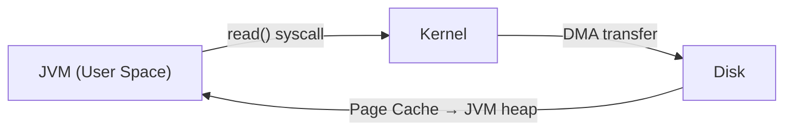
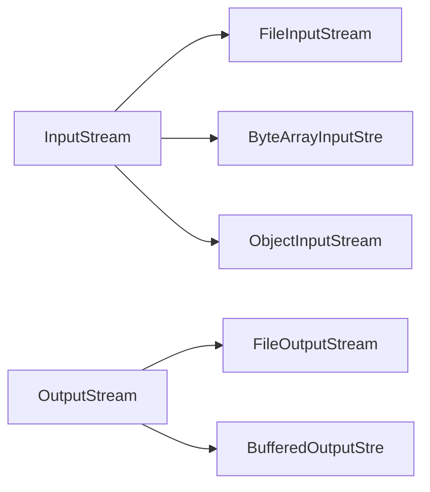
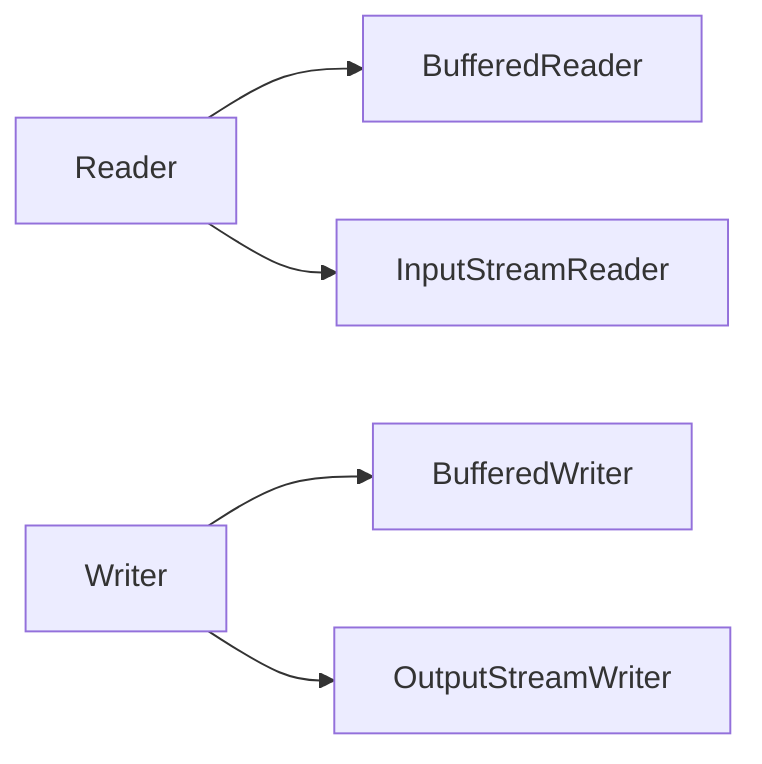
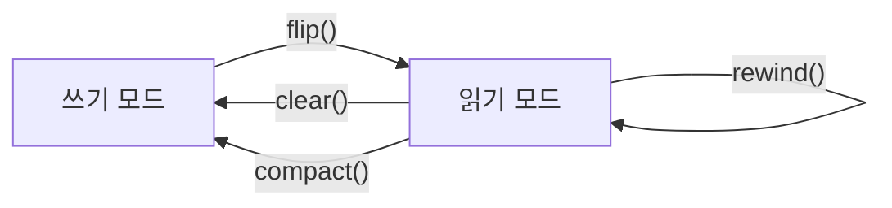
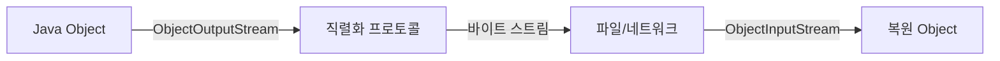
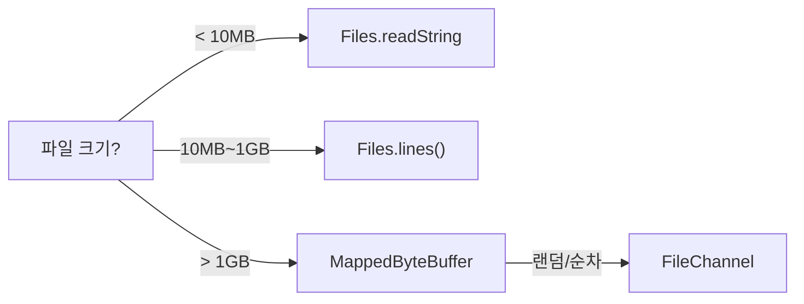

Java I/O는 단순한 파일 읽기/쓰기가 아닙니다. OS 커널의 시스템 콜, 페이지 캐시, epoll, zero-copy 같은 저수준 메커니즘이 Java API 뒤에 숨어 있습니다. 이 글은 "왜 그렇게 설계했는가"를 중심으로 InputStream 바이트 계층부터 NIO.2 비동기 채널까지 전 체계를 해부합니다.

> **비유로 이해하기**: java.io는 창고 직원 한 명이 상자 하나씩 들고 뛰는 방식입니다. 배달이 오지 않으면 문 앞에서 멍하니 기다립니다(블로킹). java.nio는 컨베이어 벨트(Buffer) + 고속 통로(Channel) + CCTV(Selector)를 갖춘 물류 센터입니다. CCTV가 어느 통로에 짐이 쌓였는지 감시하므로 직원 한 명이 수천 개 통로를 동시에 관리합니다. java.nio.file은 물류 센터 위에 올라탄 관리 포털 — "이 파일을 저기로 복사해" 한 줄이면 끝납니다.

---

## 1. I/O 기본 개념 — 왜 시스템 콜이 비싼가

### 1.1 User Space vs Kernel Space

I/O 연산은 반드시 OS 커널을 경유합니다. Java 코드(User Space)가 `read()`를 호출하면 CPU가 User Mode → Kernel Mode로 전환됩니다. 이 컨텍스트 스위치가 수백 나노초 ~ 수 마이크로초를 소모합니다.

```java
// 이 한 줄이 OS 시스템 콜을 발생시킵니다
int b = fileInputStream.read(); // read(2) 시스템 콜 → Kernel이 디스크에서 1바이트 복사
```



핵심 WHY: **버퍼(Buffer)가 필요한 근본 이유는 시스템 콜 비용을 분할상환(amortize)하기 위해서입니다.** 1바이트마다 syscall을 내리면 8KB 파일을 읽는 데 8,192번의 syscall이 발생합니다. 8KB 버퍼로 한 번에 읽으면 syscall이 1번으로 끝납니다.

### 1.2 스트림(Stream)의 단방향성

스트림은 데이터가 흐르는 단방향 파이프입니다. 수도관처럼 역류가 불가능하기 때문에 읽기와 쓰기는 별개의 스트림을 사용합니다.


---

## 2. InputStream / OutputStream — 바이트 스트림 계층 구조

### 2.1 왜 바이트 스트림이 기본인가

컴퓨터의 모든 데이터는 궁극적으로 바이트입니다. 파일, 네트워크 패킷, 메모리 — 어떤 형태든 바이트 배열로 표현됩니다. Java는 바이트 스트림을 최하위 계층으로 두고 그 위에 모든 I/O 추상화를 쌓았습니다.



### 2.2 InputStream의 핵심 계약

```java
public abstract class InputStream implements Closeable {
    // 핵심 메서드: 1바이트를 0~255 int로 반환, EOF이면 -1
    // 왜 int를 반환하는가? byte는 -128~127이므로 EOF(-1)를 표현할 수 없음
    // int로 반환하면 0~255는 정상 데이터, -1은 EOF
    public abstract int read() throws IOException;

    // 배열로 읽기 — 실제로는 read()를 반복 호출하는 기본 구현
    // 서브클래스에서 재정의해 시스템 콜 1번으로 처리
    public int read(byte[] b) throws IOException {
        return read(b, 0, b.length);
    }

    // available(): 블로킹 없이 읽을 수 있는 바이트 수 추정
    // 주의: 이 값을 신뢰해서 루프를 짜면 안 됨 — 네트워크에서는 항상 0 가능
    public int available() throws IOException { return 0; }

    // Closeable → AutoCloseable: try-with-resources 사용 가능
    public void close() throws IOException {}
}
```

### 2.3 FileInputStream 내부 동작

```java
import java.io.*;
import java.nio.file.*;

public class ByteStreamDeepDive {

    public static void main(String[] args) throws IOException {
        // FileInputStream은 OS의 파일 디스크립터(fd)를 보유
        // open(2) 시스템 콜로 fd를 얻은 후 read(2)로 데이터를 읽음
        try (FileInputStream fis = new FileInputStream("data.bin")) {

            // 1바이트씩 읽기 — 절대 하지 말아야 할 방식
            // 10MB 파일이면 10,485,760번의 read(2) 시스템 콜 발생
            int b;
            while ((b = fis.read()) != -1) {
                process(b); // 각 바이트 처리
            }
        }

        // 올바른 방식 — 배열 버퍼로 한 번에 읽기
        try (FileInputStream fis = new FileInputStream("data.bin")) {
            byte[] buffer = new byte[8192]; // 8KB: OS 페이지 크기(4KB)의 2배
            int bytesRead;
            // read(buffer)는 최대 8192바이트를 한 번의 read(2)로 읽음
            // 반환값이 8192보다 작을 수 있음 — 항상 반환값으로 실제 읽은 양 확인
            while ((bytesRead = fis.read(buffer)) != -1) {
                process(buffer, 0, bytesRead);
            }
        }
    }

    // 파일 복사: 바이트 스트림의 실전 패턴
    public static long copyBinary(Path src, Path dst) throws IOException {
        long totalBytes = 0;
        try (FileInputStream in = new FileInputStream(src.toFile());
             FileOutputStream out = new FileOutputStream(dst.toFile())) {

            byte[] buf = new byte[65536]; // 64KB: L1 캐시 크기 고려
            int n;
            while ((n = in.read(buf)) != -1) {
                out.write(buf, 0, n);
                totalBytes += n;
            }
            // FileOutputStream.close()가 flush()를 자동 호출
            // 하지만 명시적 flush()를 권장 — 특히 BufferedOutputStream을 감쌀 때
        }
        return totalBytes;
    }

    private static void process(int b) {}
    private static void process(byte[] b, int off, int len) {}
}
```

### 2.4 OutputStream의 핵심 계약

```java
public abstract class OutputStream implements Closeable, Flushable {
    // 1바이트 쓰기 — 하위 8비트만 사용 (int의 상위 24비트 무시)
    public abstract void write(int b) throws IOException;

    // 배열 쓰기
    public void write(byte[] b) throws IOException { write(b, 0, b.length); }
    public void write(byte[] b, int off, int len) throws IOException { /* ... */ }

    // flush(): 버퍼에 남은 데이터를 하위 스트림으로 강제 전송
    // FileOutputStream은 OS 버퍼 → 파일 디스크립터로만 flush
    // 물리 디스크에 쓰려면 FileDescriptor.sync()나 FileChannel.force(true) 필요
    public void flush() throws IOException {}
}
```

---

## 3. Reader / Writer — 문자 스트림이 별도로 존재하는 이유

### 3.1 왜 문자 스트림이 필요한가 — 인코딩 문제

바이트 스트림은 텍스트 파일을 다룰 때 인코딩 변환을 직접 해야 합니다. 'A'라는 문자는 ASCII에서 0x41(1바이트)이지만, UTF-16에서는 0x00 0x41(2바이트), 한글 '가'는 UTF-8에서 0xEA 0xB0 0x80(3바이트)입니다.


Reader/Writer는 바이트 ↔ 문자 변환을 내부적으로 처리합니다. 인코딩을 지정하지 않으면 `Charset.defaultCharset()`을 사용하는데, Windows에서는 `MS949`, Linux에서는 `UTF-8`이 될 수 있어 이식성 문제가 발생합니다.

```java
import java.io.*;
import java.nio.charset.*;
import java.nio.file.*;

public class CharStreamDeepDive {

    public static void demonstrateEncodingProblem() throws IOException {
        // 위험한 코드 — 플랫폼 기본 인코딩에 의존
        // Windows: MS949, Linux: UTF-8 → 같은 코드, 다른 동작
        FileReader dangerous = new FileReader("korean.txt"); // 절대 쓰지 말것

        // 올바른 코드 — 항상 인코딩 명시
        FileReader safe = new FileReader("korean.txt", StandardCharsets.UTF_8);

        // InputStreamReader: 바이트 스트림 → 문자 스트림 변환 브릿지
        // 내부에서 StreamDecoder가 Charset을 사용해 바이트→char 변환
        InputStreamReader isr = new InputStreamReader(
            new FileInputStream("korean.txt"),
            StandardCharsets.UTF_8
        );
    }

    // 텍스트 파일 읽기 — 실전 패턴
    public static String readTextFile(Path path) throws IOException {
        StringBuilder sb = new StringBuilder();
        // BufferedReader는 8192 char 버퍼를 유지
        // readLine()은 내부 버퍼에서 '\n' 또는 '\r\n'을 찾아 반환
        // 시스템 콜 없이 메모리에서 처리 → 매우 빠름
        try (BufferedReader br = new BufferedReader(
                new InputStreamReader(
                    new FileInputStream(path.toFile()),
                    StandardCharsets.UTF_8),
                16384)) { // 16KB 버퍼 (기본 8KB의 2배)

            String line;
            while ((line = br.readLine()) != null) {
                sb.append(line).append('\n');
            }
        }
        return sb.toString();
    }

    // 텍스트 파일 쓰기 — 실전 패턴
    public static void writeTextFile(Path path, String content) throws IOException {
        try (BufferedWriter bw = new BufferedWriter(
                new OutputStreamWriter(
                    new FileOutputStream(path.toFile()),
                    StandardCharsets.UTF_8))) {

            bw.write(content);
            bw.newLine(); // OS에 맞는 줄바꿈 (\n 또는 \r\n)
            bw.flush();   // 버퍼 강제 비우기
        }
    }
}
```

### 3.2 Reader / Writer 계층 구조



`InputStreamReader` → `StreamDecoder` → `Charset.decode()` → `ByteBuffer` → `CharBuffer`의 파이프라인으로 바이트가 문자로 변환됩니다.

---

## 4. BufferedStream — 왜 버퍼 크기가 8192인가

### 4.1 8192(8KB)의 근거

Java BufferedInputStream/BufferedReader의 기본 버퍼 크기는 8192바이트입니다. 이 숫자의 근거는 다음과 같습니다.

1. **OS 페이지 크기**: 대부분의 OS는 4KB 페이지를 사용합니다. 8KB는 2페이지로 DMA 전송 단위와 정렬됩니다.
2. **L1 캐시**: 대부분의 CPU L1 캐시는 32~64KB입니다. 8KB 버퍼는 다른 데이터와 함께 L1에 안전하게 올라갑니다.
3. **실측 기반**: Java 초기 개발팀이 실측한 최적 지점이 8KB 근방이었습니다.

```java
import java.io.*;

public class BufferedStreamInternals {

    // BufferedInputStream 내부 동작을 시뮬레이션
    public static void demonstrateBuffer() throws IOException {
        // 기본 버퍼 8192바이트
        // 내부적으로 byte[] buf = new byte[8192] 보유
        // fill()이 호출될 때 underlying stream에서 최대 8192바이트를 한 번에 읽어 buf에 채움
        try (BufferedInputStream bis = new BufferedInputStream(
                new FileInputStream("large_file.bin"))) {

            // 첫 번째 read() 호출 시:
            // 1. buf가 비어있음 → fill() 호출
            // 2. FileInputStream.read(buf, 0, 8192) → read(2) syscall 1번
            // 3. buf[0..n-1]에 데이터 채워짐
            // 4. buf[0] 반환, count=n, pos=1

            // 두 번째 read() 호출 시:
            // 1. pos < count → buf[1] 반환, pos=2
            // (syscall 없음! 메모리에서 바로 반환)
            int b1 = bis.read(); // syscall 발생
            int b2 = bis.read(); // syscall 없음, 버퍼에서 반환
        }

        // flush()의 의미: BufferedOutputStream에서 중요
        try (BufferedOutputStream bos = new BufferedOutputStream(
                new FileOutputStream("output.bin"))) {
            // write()는 내부 버퍼에만 씀 — 파일에는 아직 반영 안 됨
            bos.write(new byte[100]);

            // 버퍼가 꽉 차거나(8192바이트), flush() 호출 시
            // write(2) syscall로 실제 파일에 씀
            bos.flush(); // 중간 결과를 즉시 반영해야 할 때 명시적 호출

            // close()는 flush() 후 fd를 닫음
        } // close() → flush() → write(2) syscall → close(2) syscall
    }

    // mark/reset: 되돌아가기 기능
    public static void demonstrateMarkReset() throws IOException {
        try (BufferedInputStream bis = new BufferedInputStream(
                new FileInputStream("data.bin"), 1024)) {

            bis.mark(256); // 최대 256바이트까지 되감기 지원

            byte[] preview = new byte[16];
            bis.read(preview); // 16바이트 미리보기

            // 매직 바이트 확인 (파일 시그니처)
            if (preview[0] == (byte)0xFF && preview[1] == (byte)0xD8) {
                System.out.println("JPEG 파일");
            }

            bis.reset(); // 읽기 위치를 mark() 지점으로 되돌림
            // 이제 처음부터 다시 읽음
        }
    }
}
```

### 4.2 DataInputStream / DataOutputStream — 기본형 바이너리 직렬화

```java
import java.io.*;

public class DataStreamExample {

    // 빅 엔디언(Big-Endian)으로 기본형을 바이너리에 씀
    // WHY 빅 엔디언: Java는 플랫폼 독립성을 위해 네트워크 바이트 순서(빅 엔디언)를 선택
    // CPU는 보통 리틀 엔디언(Intel x86)이지만 Java는 추상화로 숨김
    public static void writeBinary(String filePath) throws IOException {
        try (DataOutputStream dos = new DataOutputStream(
                new BufferedOutputStream(new FileOutputStream(filePath)))) {

            dos.writeInt(0x12345678);    // 4바이트: 0x12, 0x34, 0x56, 0x78 순서로 저장
            dos.writeLong(System.nanoTime());  // 8바이트 빅 엔디언
            dos.writeDouble(Math.PI);    // IEEE 754 64-bit double, 빅 엔디언
            dos.writeBoolean(true);      // 1바이트: 0x01
            dos.writeUTF("안녕하세요"); // 변형 UTF-8: 앞에 2바이트 길이 + 데이터
            // writeUTF의 변형 UTF-8은 표준 UTF-8과 다름 — null 문자(U+0000)를 다르게 인코딩
            // 따라서 writeUTF로 쓴 데이터는 readUTF로만 읽어야 함
        }
    }

    public static void readBinary(String filePath) throws IOException {
        try (DataInputStream dis = new DataInputStream(
                new BufferedInputStream(new FileInputStream(filePath)))) {

            int magic = dis.readInt();       // 쓴 순서와 동일하게 읽어야 함
            long timestamp = dis.readLong();
            double pi = dis.readDouble();
            boolean flag = dis.readBoolean();
            String text = dis.readUTF();

            System.out.printf("magic=0x%X, ts=%d, pi=%.5f, flag=%b, text=%s%n",
                magic, timestamp, pi, flag, text);
        }
    }
}
```

---

## 5. NIO — Channel + Buffer + Selector

### 5.1 왜 NIO가 등장했는가

마치 콜센터처럼 생각해 보세요. java.io 방식은 고객 1명당 직원 1명이 붙어서(스레드 1:1) 통화가 끝날 때까지 대기합니다. NIO의 Selector 방식은 한 직원이 헤드셋을 여러 개 끼고 누군가 말할 때만 반응합니다. 10만 고객에게 java.io 방식은 직원 10만 명이, NIO 방식은 직원 몇 명으로도 충분합니다.

java.io의 근본적 한계는 두 가지입니다.

**첫째, 블로킹(Blocking) 문제**: `read()`를 호출한 스레드는 데이터가 올 때까지 멈춥니다. 클라이언트 10만 개를 동시에 처리하려면 스레드 10만 개가 필요한데, JVM 스레드는 OS 스레드와 1:1 매핑되고 스레드당 기본 1MB 스택을 사용하므로 10만 스레드 = 100GB 메모리가 필요합니다.

**둘째, 복사 오버헤드**: 파일 데이터가 `디스크 → 커널 버퍼 → JVM 힙` 으로 두 번 복사됩니다. 대용량 파일 전송 시 메모리 대역폭을 낭비합니다.

NIO는 Channel + Buffer 모델로 이 두 문제를 해결합니다.

### 5.2 ByteBuffer — 핵심 상태 머신

ByteBuffer는 `capacity`, `limit`, `position`, `mark` 네 개의 포인터로 상태를 관리합니다. 이 상태 머신을 이해하지 못하면 NIO 버그의 절반이 발생합니다.



```java
import java.nio.*;
import java.nio.channels.*;
import java.nio.file.*;

public class ByteBufferDeepDive {

    public static void demonstrateStateMachine() {
        // allocate: JVM 힙에 버퍼 할당
        // capacity=10, limit=10, position=0, mark=-1
        ByteBuffer buf = ByteBuffer.allocate(10);

        System.out.println("초기: pos=" + buf.position() + " lim=" + buf.limit()); // 0, 10

        // 쓰기: position 증가
        buf.put((byte) 'H'); // pos=1
        buf.put((byte) 'i'); // pos=2
        buf.putInt(42);      // pos=6 (int = 4바이트)

        System.out.println("쓰기후: pos=" + buf.position()); // 6

        // flip(): 쓰기 모드 → 읽기 모드 전환
        // limit = position (쓴 마지막 위치)
        // position = 0 (처음부터 읽기)
        // 이걸 빠뜨리면 hasRemaining()이 false → 아무것도 읽지 못함
        buf.flip();
        System.out.println("flip후: pos=" + buf.position() + " lim=" + buf.limit()); // 0, 6

        // 읽기
        byte h = buf.get();   // 'H', pos=1
        byte i = buf.get();   // 'i', pos=2
        int num = buf.getInt(); // 42, pos=6

        System.out.println("읽기후: pos=" + buf.position()); // 6

        // clear(): 완전 초기화 — 실제 데이터는 지우지 않음, 포인터만 리셋
        buf.clear(); // pos=0, limit=capacity=10
        System.out.println("clear후: pos=" + buf.position() + " lim=" + buf.limit()); // 0, 10

        // compact(): 읽지 않은 데이터를 앞으로 이동 후 쓰기 모드로 전환
        // 부분 읽기 후 추가 데이터를 이어서 쓸 때 사용
        ByteBuffer buf2 = ByteBuffer.allocate(10);
        buf2.put(new byte[]{1, 2, 3, 4, 5});
        buf2.flip();
        buf2.get(); buf2.get(); buf2.get(); // 3개 읽음, 2개 남음
        // compact(): [4, 5, X, X, X, X, X, X, X, X], pos=2, limit=10
        buf2.compact(); // 안 읽은 [4,5]를 앞으로 복사, pos=2, limit=10
        buf2.put((byte) 6); // 이어서 쓰기 가능
    }

    // 절대 주소(absolute) vs 상대 주소(relative) 접근
    public static void demonstrateAbsoluteAccess() {
        ByteBuffer buf = ByteBuffer.allocate(20);

        // 상대 접근: position이 증가
        buf.putInt(100);  // position: 0→4
        buf.putInt(200);  // position: 4→8

        // 절대 접근: position 변경 없음
        buf.putInt(0, 999);   // 오프셋 0에 999 저장, position 변화 없음
        buf.putInt(4, 888);   // 오프셋 4에 888 저장

        System.out.println("절대 읽기: " + buf.getInt(0)); // 999
        System.out.println("position: " + buf.position());  // 8 (변화 없음)
    }
}
```

### 5.3 Heap Buffer vs Direct Buffer — 언제 무엇을 쓰는가

```java
public class BufferTypeComparison {

    public static void compareBufferTypes() throws IOException {
        // 힙 버퍼 (Heap Buffer)
        // 장점: GC가 관리, 생성 빠름, 디버깅 용이
        // 단점: I/O 시 OS가 JVM 힙을 직접 읽을 수 없음
        //       → 내부적으로 임시 다이렉트 버퍼로 복사 후 I/O
        ByteBuffer heapBuf = ByteBuffer.allocate(4096);

        // 다이렉트 버퍼 (Direct Buffer)
        // 장점: OS 네이티브 메모리에 직접 할당 → I/O 시 복사 없음 (zero-copy)
        //       네트워크 전송, 대용량 파일 I/O에서 힙 버퍼보다 최대 2배 빠름
        // 단점: GC 대상 아님 → 해제가 늦어질 수 있음 (메모리 누수 주의)
        //       생성 비용이 큼 → 재사용 필수 (풀링 권장)
        //       ByteBuffer.allocateDirect()는 Cleaner를 통해 GC 시 해제됨
        ByteBuffer directBuf = ByteBuffer.allocateDirect(4096);

        // WHY: FileChannel.read(heapBuf) 내부 코드
        // if (dst.isDirect()) {
        //     return IOUtil.read(fd, dst, position, nd);  // 직접 읽기
        // } else {
        //     ByteBuffer tmp = Util.getTemporaryDirectBuffer(dst.remaining()); // 임시 버퍼 생성
        //     IOUtil.read(fd, tmp, position, nd); // 네이티브 버퍼에 읽음
        //     tmp.flip();
        //     dst.put(tmp);                        // 힙 버퍼로 복사
        //     Util.releaseTemporaryDirectBuffer(tmp);
        // }

        // 실전: I/O 핫패스에는 Direct, 로직 처리에는 Heap 사용
        try (FileChannel fc = FileChannel.open(Path.of("data.bin"), StandardOpenOption.READ)) {
            ByteBuffer direct = ByteBuffer.allocateDirect(65536); // 64KB, 재사용

            while (fc.read(direct) != -1) {
                direct.flip();
                // 처리 로직에서는 Heap 버퍼로 변환 (절대 주소 접근 편의)
                byte[] arr = new byte[direct.remaining()];
                direct.get(arr);
                processData(arr);
                direct.clear();
            }
        }
    }

    private static void processData(byte[] data) {}
}
```

### 5.4 FileChannel — zero-copy와 memory-mapped file

```java
import java.io.*;
import java.nio.*;
import java.nio.channels.*;
import java.nio.file.*;

public class FileChannelDeepDive {

    // transferTo: 진정한 zero-copy
    // WHY: 일반 파일 전송은 4단계 복사
    //   1. 디스크 → 커널 읽기 버퍼 (DMA)
    //   2. 커널 읽기 버퍼 → JVM 힙 (CPU 복사)
    //   3. JVM 힙 → 커널 쓰기 버퍼 (CPU 복사)
    //   4. 커널 쓰기 버퍼 → 소켓/파일 (DMA)
    // transferTo는 Linux sendfile(2) / splice(2) syscall 사용:
    //   1. 디스크 → 커널 페이지 캐시 (DMA)
    //   2. 커널 페이지 캐시 → 소켓 버퍼 (CPU 복사 or DMA, OS에 따라)
    // JVM 힙을 거치지 않아 CPU 복사 1~2회 절감
    public static void zeroCopyTransfer(Path srcFile, SocketChannel socket) throws IOException {
        try (FileChannel fc = FileChannel.open(srcFile, StandardOpenOption.READ)) {
            long size = fc.size();
            long transferred = 0;

            // transferTo는 한 번에 전송을 보장하지 않음 (네트워크 버퍼 제한)
            // 루프로 완전 전송 보장
            while (transferred < size) {
                long n = fc.transferTo(transferred, size - transferred, socket);
                if (n == 0) break; // 소켓 버퍼가 꽉 찬 경우
                transferred += n;
            }
        }
    }

    // FileChannel 간 파일 복사 (transferTo)
    public static void fileCopyZeroCopy(Path src, Path dst) throws IOException {
        try (FileChannel in = FileChannel.open(src, StandardOpenOption.READ);
             FileChannel out = FileChannel.open(dst,
                 StandardOpenOption.CREATE,
                 StandardOpenOption.WRITE,
                 StandardOpenOption.TRUNCATE_EXISTING)) {

            long size = in.size();
            long copied = 0;
            while (copied < size) {
                // transferTo: 일반적으로 2GB 이하 단위로 잘라서 호출해야 함
                copied += in.transferTo(copied, size - copied, out);
            }
        }
    }

    // Memory-Mapped File: OS 가상 메모리에 파일 매핑
    // WHY: 대용량 파일을 모두 메모리에 올리지 않고 필요한 페이지만 on-demand로 로드
    // mmap(2) syscall: 파일을 프로세스 주소 공간에 직접 매핑
    // 읽기: 매핑된 주소 접근 → 페이지 폴트 → OS가 디스크에서 페이지 로드 → 재시작
    // 쓰기: 매핑된 주소에 쓰기 → dirty 페이지 → OS가 백그라운드로 파일에 동기화
    public static void memoryMappedRead(Path filePath) throws IOException {
        try (FileChannel fc = FileChannel.open(filePath, StandardOpenOption.READ)) {
            long fileSize = fc.size();

            // 주의: 파일 전체를 한 번에 매핑하면 32비트 JVM에서는 불가 (주소 공간 부족)
            // 64비트 JVM에서도 파일 크기가 가상 메모리보다 작아야 함
            // 실제 물리 메모리 사용량은 접근한 페이지만큼만 증가
            MappedByteBuffer mbb = fc.map(FileChannel.MapMode.READ_ONLY, 0, fileSize);

            // mbb는 DirectByteBuffer — OS 페이지 캐시를 직접 참조
            // get() 호출이 단순 메모리 읽기와 동일한 속도
            mbb.load(); // 선택적: OS에 전체 파일을 페이지 캐시에 미리 로드 요청

            // 고정 크기 레코드 직접 접근
            int recordSize = 16; // 각 레코드: int(4) + long(8) + int(4)
            long recordCount = fileSize / recordSize;

            for (int i = 0; i < recordCount; i++) {
                int id = mbb.getInt(i * recordSize);          // 오프셋 직접 접근
                long timestamp = mbb.getLong(i * recordSize + 4);
                int value = mbb.getInt(i * recordSize + 12);
                processRecord(id, timestamp, value);
            }
        }
        // 주의: MappedByteBuffer는 GC로 해제됨
        // 파일 삭제나 재오픈이 필요하면 sun.misc.Cleaner를 사용한 명시적 해제 필요 (트릭)
    }

    // MappedByteBuffer 읽기/쓰기
    public static void memoryMappedWrite(Path filePath) throws IOException {
        try (FileChannel fc = FileChannel.open(filePath,
                StandardOpenOption.READ, StandardOpenOption.WRITE)) {

            MappedByteBuffer mbb = fc.map(FileChannel.MapMode.READ_WRITE, 0, 4096);

            mbb.putInt(0, 42);          // 오프셋 0에 int 쓰기 (포인터 변화 없음)
            mbb.putLong(4, System.nanoTime());
            mbb.put(12, (byte) 0xFF);

            // force(): 변경사항을 파일에 강제 동기화 (msync syscall)
            // 호출하지 않으면 OS가 적절한 시점에 자동 동기화
            // 크래시 복구가 중요한 경우 force() 필수
            mbb.force();
        }
    }

    // 2GB+ 대용량 파일: 청크 단위 매핑
    public static void largeFileMappedProcessing(Path filePath) throws IOException {
        try (FileChannel fc = FileChannel.open(filePath, StandardOpenOption.READ)) {
            long fileSize = fc.size();
            long chunkSize = 512L * 1024 * 1024; // 512MB 청크

            for (long offset = 0; offset < fileSize; offset += chunkSize) {
                long size = Math.min(chunkSize, fileSize - offset);
                MappedByteBuffer chunk = fc.map(FileChannel.MapMode.READ_ONLY, offset, size);
                processChunk(chunk);
                // chunk는 GC 대상이 되지만 명시적 해제가 어려움
                // DirectByteBuffer의 Cleaner를 리플렉션으로 호출하는 트릭 존재
            }
        }
    }

    private static void processRecord(int id, long ts, int val) {}
    private static void processChunk(MappedByteBuffer buf) {}
}
```

### 5.5 Selector — epoll 매핑과 논블로킹 I/O

```java
import java.io.*;
import java.net.*;
import java.nio.*;
import java.nio.channels.*;
import java.util.*;

public class SelectorDeepDive {

    // WHY Selector가 필요한가:
    // 블로킹 모델: 클라이언트마다 스레드 1개 → 10만 연결 = 10만 스레드 (불가능)
    // Selector 모델: OS의 I/O 멀티플렉싱 활용
    //   Linux: epoll (epoll_create1, epoll_ctl, epoll_wait)
    //   macOS: kqueue
    //   Windows: IOCP (Windows NIO는 내부적으로 select 사용, 성능 제한)
    // epoll: O(1) 이벤트 감지, 수십만 fd 등록 가능
    // select(2): O(n) fd 탐색, 최대 1024 fd 제한 (epoll 이전 방식)

    public static void echoServer(int port) throws IOException {
        // Selector.open(): OS에 epoll 인스턴스 생성
        Selector selector = Selector.open();

        ServerSocketChannel serverChannel = ServerSocketChannel.open();
        serverChannel.configureBlocking(false); // 논블로킹 모드 — 필수
        serverChannel.bind(new InetSocketAddress(port));

        // register: epoll_ctl(ADD) — 서버 채널을 epoll에 등록
        // SelectionKey.OP_ACCEPT: 클라이언트 연결 수락 이벤트
        // 다른 이벤트: OP_READ(0x1), OP_WRITE(0x4), OP_CONNECT(0x8), OP_ACCEPT(0x10)
        serverChannel.register(selector, SelectionKey.OP_ACCEPT);

        System.out.println("서버 시작: " + port);

        while (true) {
            // select(): epoll_wait syscall — I/O 이벤트가 발생할 때까지 블로킹
            // 반환값: 준비된 채널 수
            // select(0): 논블로킹 즉시 반환
            // select(timeout): 타임아웃 지정
            int ready = selector.select(1000); // 1초 타임아웃

            if (ready == 0) {
                // 타임아웃 — 주기적 작업 수행 기회
                System.out.print("."); // 하트비트
                continue;
            }

            // selectedKeys(): 이벤트가 발생한 채널들의 SelectionKey 집합
            Set<SelectionKey> keys = selector.selectedKeys();
            Iterator<SelectionKey> iter = keys.iterator();

            while (iter.hasNext()) {
                SelectionKey key = iter.next();
                // 중요: 처리한 키는 반드시 remove() — 자동으로 제거되지 않음
                // remove() 누락 시 다음 select()에서 같은 키가 또 반환됨
                iter.remove();

                if (!key.isValid()) continue;

                if (key.isAcceptable()) {
                    handleAccept(key, selector);
                } else if (key.isReadable()) {
                    handleRead(key);
                } else if (key.isWritable()) {
                    handleWrite(key);
                }
            }
        }
    }

    private static void handleAccept(SelectionKey key, Selector selector) throws IOException {
        ServerSocketChannel server = (ServerSocketChannel) key.channel();
        SocketChannel client = server.accept(); // 논블로킹: 즉시 반환 (연결 없으면 null)
        if (client == null) return;

        client.configureBlocking(false);

        // 클라이언트 채널을 Selector에 등록 — OP_READ 이벤트 감시
        // SelectionKey에 attachment 저장 가능 (클라이언트 상태 객체 등)
        ByteBuffer buf = ByteBuffer.allocateDirect(1024);
        client.register(selector, SelectionKey.OP_READ, buf);

        System.out.println("클라이언트 연결: " + client.getRemoteAddress());
    }

    private static void handleRead(SelectionKey key) throws IOException {
        SocketChannel client = (SocketChannel) key.channel();
        ByteBuffer buf = (ByteBuffer) key.attachment();

        buf.clear();
        int bytesRead = client.read(buf); // 논블로킹: 현재 사용 가능한 데이터만 읽음

        if (bytesRead == -1) {
            // 클라이언트가 연결을 닫음
            client.close();
            key.cancel(); // epoll_ctl(DEL)
            return;
        }

        buf.flip();
        // 에코: 읽은 데이터를 그대로 쓰기
        // 쓰기 버퍼가 꽉 차면 일부만 쓸 수 있으므로 OP_WRITE 등록
        if (buf.hasRemaining()) {
            // 쓰기 버퍼가 준비될 때 OP_WRITE 이벤트 받기
            key.interestOps(SelectionKey.OP_WRITE);
        }
    }

    private static void handleWrite(SelectionKey key) throws IOException {
        SocketChannel client = (SocketChannel) key.channel();
        ByteBuffer buf = (ByteBuffer) key.attachment();

        client.write(buf); // 논블로킹: 소켓 버퍼에 쓸 수 있는 만큼만 씀

        if (!buf.hasRemaining()) {
            // 쓰기 완료 — OP_WRITE 해제 (쓰기 준비 이벤트는 항상 true이므로 해제 필수)
            key.interestOps(SelectionKey.OP_READ);
        }
    }
}
```

---

## 6. Path / Files API — Java 7+ NIO.2

### 6.1 왜 File 클래스를 버리고 Path를 도입했는가

`java.io.File`의 문제점은 설계 결함이 많았습니다.

- `File.delete()`가 실패해도 `false`만 반환하고 이유를 알 수 없음
- `File.list()`가 오류 시 `null` 반환 (NullPointerException 유발)
- 심볼릭 링크 지원 없음
- 임시 파일이 JVM 종료 시 삭제 보장 안 됨
- 파일 이동이 원자적이지 않음

`Path` + `Files`는 이 모든 문제를 해결합니다.

```java
import java.io.*;
import java.nio.charset.*;
import java.nio.file.*;
import java.nio.file.attribute.*;
import java.util.stream.*;

public class NIO2DeepDive {

    public static void pathOperations() throws IOException {
        // Path는 인터페이스 — 실제 구현은 OS에 따라 다름
        // Windows: WindowsPath, Unix: UnixPath
        Path p = Path.of("/home/user/documents/file.txt"); // Java 11+
        // Java 7~10: Paths.get("/home/user/documents/file.txt")

        // 경로 분해
        System.out.println(p.getFileName()); // file.txt (Path 타입)
        System.out.println(p.getParent());   // /home/user/documents
        System.out.println(p.getRoot());     // / (Unix) or C:\ (Windows)
        System.out.println(p.getNameCount()); // 4 (home, user, documents, file.txt)
        System.out.println(p.getName(2));    // documents

        // 경로 조합
        Path base = Path.of("/home/user");
        Path full = base.resolve("documents/file.txt"); // /home/user/documents/file.txt
        Path rel = base.relativize(full);               // documents/file.txt

        // 정규화: .. 과 . 제거
        Path messy = Path.of("/home/user/../user/./docs");
        System.out.println(messy.normalize()); // /home/user/docs

        // 실제 파일시스템 경로로 변환 (심볼릭 링크 해소)
        // Path.toRealPath(): 파일이 존재해야 함
        // Path.toAbsolutePath(): 현재 디렉토리 기준으로 절대 경로만 변환
        try {
            Path real = p.toRealPath(LinkOption.NOFOLLOW_LINKS); // 심볼릭 링크 유지
        } catch (NoSuchFileException e) {
            System.out.println("파일 없음");
        }
    }

    public static void filesOperations() throws IOException {
        Path path = Path.of("example.txt");

        // 파일 읽기 — 크기별 선택 기준
        // < 10MB: readString 또는 readAllBytes (간결함)
        // 10MB~수GB: lines() 스트림 (메모리 절약)
        // 수GB+: FileChannel + MappedByteBuffer

        // Java 11+: 가장 간결
        String content = Files.readString(path, StandardCharsets.UTF_8);

        // 전통적 방식: 바이트 배열로
        byte[] bytes = Files.readAllBytes(path);

        // 대용량 처리: 스트림 — 파일을 한 줄씩 처리, 메모리 O(1)
        try (Stream<String> lines = Files.lines(path, StandardCharsets.UTF_8)) {
            long errorCount = lines
                .filter(line -> line.startsWith("ERROR"))
                .count();
            System.out.println("에러 수: " + errorCount);
        } // 스트림 닫히면 파일 핸들도 자동 해제

        // 파일 쓰기
        Files.writeString(path, "내용", StandardCharsets.UTF_8,
            StandardOpenOption.CREATE,
            StandardOpenOption.APPEND);

        // BufferedWriter로 제어력 있는 쓰기
        try (BufferedWriter bw = Files.newBufferedWriter(path, StandardCharsets.UTF_8,
                StandardOpenOption.CREATE, StandardOpenOption.APPEND)) {
            bw.write("첫 번째 줄");
            bw.newLine();
            bw.write("두 번째 줄");
        }
    }

    public static void fileOperations() throws IOException {
        Path src = Path.of("source.txt");
        Path dst = Path.of("dest.txt");

        // 복사: 실패 시 IOException, 이유 포함 (File.copy와 다름)
        Files.copy(src, dst, StandardCopyOption.REPLACE_EXISTING,
                              StandardCopyOption.COPY_ATTRIBUTES);

        // 이동: ATOMIC_MOVE → rename(2) syscall (같은 파티션이면 원자적)
        // 다른 파티션이면 ATOMIC_MOVE 불가 → AtomicMoveNotSupportedException
        Files.move(src, dst, StandardCopyOption.ATOMIC_MOVE);

        // 삭제
        Files.delete(path()); // 없으면 NoSuchFileException (원인 명확)
        Files.deleteIfExists(path()); // 없어도 OK

        // 속성 조회
        BasicFileAttributes attrs = Files.readAttributes(src, BasicFileAttributes.class);
        System.out.println("크기: " + attrs.size());
        System.out.println("생성: " + attrs.creationTime());
        System.out.println("수정: " + attrs.lastModifiedTime());
        System.out.println("디렉토리: " + attrs.isDirectory());
        System.out.println("심볼릭링크: " + attrs.isSymbolicLink());
    }

    public static void directoryWalk() throws IOException {
        Path dir = Path.of("/home/user/projects");

        // list(): 1레벨만 (ls -1)
        try (Stream<Path> entries = Files.list(dir)) {
            entries.forEach(System.out::println);
        }

        // walk(): 재귀 탐색 (깊이 제한 가능)
        try (Stream<Path> walk = Files.walk(dir, 5)) { // 최대 5레벨
            walk.filter(p -> p.toString().endsWith(".java"))
                .sorted()
                .forEach(System.out::println);
        }

        // find(): 속성 필터링
        try (Stream<Path> found = Files.find(dir, Integer.MAX_VALUE,
                (p, attrs) -> attrs.isRegularFile()
                    && attrs.size() > 1_000_000 // 1MB 이상
                    && p.toString().endsWith(".log"))) {
            found.forEach(System.out::println);
        }

        // SimpleFileVisitor: 정교한 제어 (방문 전/후 콜백, 오류 처리)
        Files.walkFileTree(dir, new SimpleFileVisitor<>() {
            @Override
            public FileVisitResult preVisitDirectory(Path d, BasicFileAttributes attrs) {
                if (d.getFileName().toString().equals(".git")) {
                    return FileVisitResult.SKIP_SUBTREE; // .git 디렉토리 건너뜀
                }
                return FileVisitResult.CONTINUE;
            }

            @Override
            public FileVisitResult visitFile(Path file, BasicFileAttributes attrs) {
                System.out.println(file + " (" + attrs.size() + " bytes)");
                return FileVisitResult.CONTINUE;
            }

            @Override
            public FileVisitResult visitFileFailed(Path file, IOException exc) {
                System.err.println("접근 실패: " + file + " - " + exc.getMessage());
                return FileVisitResult.CONTINUE; // 실패해도 계속 (File 클래스는 이게 불가능했음)
            }
        });
    }

    private static Path path() { return Path.of("example.txt"); }
}
```

### 6.2 WatchService — 파일시스템 이벤트 감시

```java
import java.io.*;
import java.nio.file.*;

public class WatchServiceExample {

    // WatchService: OS의 파일 시스템 이벤트 알림 API 활용
    // Linux: inotify (inotify_init, inotify_add_watch, read)
    // macOS: FSEvents 또는 kqueue
    // Windows: ReadDirectoryChangesW
    // Java 코드가 inotify와 FSEvents를 추상화함
    public static void watchDirectory(String dirPath) throws IOException, InterruptedException {
        WatchService watcher = FileSystems.getDefault().newWatchService();
        Path dir = Path.of(dirPath);

        // inotify_add_watch: 감시 이벤트 등록
        WatchKey key = dir.register(watcher,
            StandardWatchEventKinds.ENTRY_CREATE,  // 파일 생성
            StandardWatchEventKinds.ENTRY_DELETE,  // 파일 삭제
            StandardWatchEventKinds.ENTRY_MODIFY,  // 파일 수정
            StandardWatchEventKinds.OVERFLOW        // 이벤트 유실 (OS 큐 오버플로우)
        );

        System.out.println("감시 시작: " + dir);

        while (true) {
            // take(): 이벤트 큐에서 WatchKey 꺼내기 — 없으면 블로킹
            // poll(): 즉시 반환 (없으면 null)
            // poll(timeout, unit): 타임아웃
            WatchKey detected = watcher.take();

            for (WatchEvent<?> event : detected.pollEvents()) {
                WatchEvent.Kind<?> kind = event.kind();

                if (kind == StandardWatchEventKinds.OVERFLOW) {
                    System.err.println("이벤트 유실 발생!");
                    continue;
                }

                @SuppressWarnings("unchecked")
                WatchEvent<Path> pathEvent = (WatchEvent<Path>) event;
                Path filename = dir.resolve(pathEvent.context());

                System.out.printf("[%s] %s (count=%d)%n",
                    kind.name(), filename, event.count());
                // event.count(): ENTRY_MODIFY에서 수정 횟수 (압축되어 1보다 클 수 있음)
            }

            // reset() 필수: false 반환 시 디렉토리가 삭제되었거나 접근 불가
            if (!detected.reset()) {
                System.out.println("감시 종료 (디렉토리 삭제됨)");
                break;
            }
        }
    }
}
```

---

## 7. try-with-resources — AutoCloseable과 Suppressed Exception

### 7.1 왜 finally 블록으로는 부족한가

```java
// 전통적 방식의 문제: finally에서 예외가 발생하면 try의 예외가 사라짐
public static void traditionalProblem() throws IOException {
    FileInputStream fis = null;
    try {
        fis = new FileInputStream("file.txt");
        throw new IOException("본문 예외"); // 이 예외가
    } finally {
        if (fis != null) {
            // close()에서 예외가 발생하면 본문 예외가 덮어씌워짐!
            fis.close(); // IOException 발생 시 "본문 예외"는 완전히 사라짐
        }
    }
}
```

### 7.2 try-with-resources의 내부 동작

```java
import java.io.*;

public class TryWithResourcesDeepDive {

    // try-with-resources 컴파일 후 바이트코드에서 실제로는 이렇게 동작
    // (Java 컴파일러가 자동 생성)
    public static void compiledEquivalent() throws IOException {
        FileInputStream primaryException = null;
        FileInputStream fis = null;
        try {
            fis = new FileInputStream("file.txt");
            try {
                // 본문
                int data = fis.read();
            } catch (Throwable t) {
                primaryException = null; // 사실은 t를 저장
                try {
                    fis.close();
                } catch (Throwable suppressed) {
                    // 핵심: 본문 예외를 주 예외로 유지하고
                    // close()의 예외를 억제된 예외로 첨부
                    t.addSuppressed(suppressed); // Throwable.addSuppressed()
                }
                throw t; // 본문 예외를 다시 throw
            }
            fis.close(); // 예외 없는 정상 종료
        } catch (Throwable t) {
            throw new IOException(t);
        }
    }

    // 실전: 여러 자원의 close 순서
    public static void multipleResources() throws IOException {
        // 자원은 선언 역순으로 close() 호출됨
        // 선언: A, B, C → close: C.close(), B.close(), A.close()
        try (FileInputStream a = new FileInputStream("a.txt");    // 마지막에 close
             BufferedInputStream b = new BufferedInputStream(a);  // 두 번째
             DataInputStream c = new DataInputStream(b)) {        // 첫 번째 close
            int data = c.readInt();
        }
        // c.close() → b.close() → a.close() 순서
        // b.close()는 내부적으로 a.close()를 다시 호출하지만 안전
    }

    // Suppressed Exception 확인
    public static void suppressedExceptionExample() {
        class BrokenResource implements AutoCloseable {
            private final String name;
            BrokenResource(String name) { this.name = name; }

            public void doWork() throws Exception {
                throw new Exception(name + ": 작업 예외");
            }

            @Override
            public void close() throws Exception {
                throw new Exception(name + ": close 예외");
            }
        }

        try (BrokenResource r = new BrokenResource("R1")) {
            r.doWork(); // 이 예외가 주 예외
        } catch (Exception e) {
            System.out.println("주 예외: " + e.getMessage()); // "R1: 작업 예외"

            // close()의 예외는 억제되어 getSuppressed()로 확인
            for (Throwable suppressed : e.getSuppressed()) {
                System.out.println("억제: " + suppressed.getMessage()); // "R1: close 예외"
            }
        }
    }

    // AutoCloseable vs Closeable
    // Closeable: throws IOException (구체적 예외)
    // AutoCloseable: throws Exception (더 넓은 예외 — 비 I/O 자원에 사용)
    public static class ManagedTransaction implements AutoCloseable {
        private boolean committed = false;

        public void commit() {
            committed = true;
            System.out.println("트랜잭션 커밋");
        }

        @Override
        public void close() throws Exception {
            if (!committed) {
                System.out.println("트랜잭션 롤백"); // 예외 없이 성공하면 커밋, 아니면 자동 롤백
            }
        }
    }

    public static void transactionPattern() throws Exception {
        try (ManagedTransaction tx = new ManagedTransaction()) {
            // 작업 수행
            processData();
            tx.commit(); // 성공하면 commit 호출
        } // 예외 발생 시 close()에서 자동 롤백
    }

    private static void processData() {}
}
```

---

## 8. 직렬화 — ObjectOutputStream, serialVersionUID, Externalizable

### 8.1 직렬화 내부 프로토콜



직렬화 스트림의 구조는 정해진 바이너리 프로토콜을 따릅니다:
- 매직 헤더: `0xACED 0x0005` (STREAM_MAGIC + STREAM_VERSION)
- 클래스 디스크립터: 클래스 이름, serialVersionUID, 필드 목록
- 인스턴스 데이터: 각 필드 값

```java
import java.io.*;
import java.util.*;

public class SerializationDeepDive {

    // WHY serialVersionUID:
    // 직렬화 프로토콜은 클래스 구조가 같은지 확인하기 위해 UID를 사용
    // 명시하지 않으면 JVM이 클래스 이름, 필드, 메서드 시그니처를 SHA-1로 해시해 자동 생성
    // 필드 하나만 추가해도 해시값이 바뀜 → 기존 직렬화 데이터 읽기 실패
    // InvalidClassException: local class incompatible: stream classdesc serialVersionUID = X,
    //                          local class serialVersionUID = Y
    public static class Employee implements Serializable {
        private static final long serialVersionUID = 1L; // 명시적 선언 필수

        private String name;
        private int age;
        private String department;

        // transient: 직렬화 제외
        // WHY: 보안(비밀번호), 재생성 가능한 값(계산 결과), 직렬화 불가 타입(Thread)
        private transient String sessionToken; // 직렬화 제외
        private transient Thread workerThread; // Thread는 Serializable 아님 → transient 필수

        // static: 인스턴스 상태 아님 → 직렬화 안 됨
        private static String company = "Example Corp";

        public Employee(String name, int age, String dept) {
            this.name = name;
            this.age = age;
            this.department = dept;
            this.sessionToken = UUID.randomUUID().toString();
        }

        @Override
        public String toString() {
            return String.format("Employee{name=%s, age=%d, dept=%s, token=%s}",
                name, age, department, sessionToken);
        }
    }

    public static void basicSerialize() throws IOException, ClassNotFoundException {
        Employee emp = new Employee("김자바", 35, "개발팀");
        System.out.println("직렬화 전: " + emp);

        // 직렬화
        try (ObjectOutputStream oos = new ObjectOutputStream(
                new BufferedOutputStream(new FileOutputStream("employee.ser")))) {
            // 매직 헤더 + 클래스 디스크립터 + 필드 값 순서로 씀
            oos.writeObject(emp);
            oos.flush();
        }

        // 역직렬화
        try (ObjectInputStream ois = new ObjectInputStream(
                new BufferedInputStream(new FileInputStream("employee.ser")))) {
            // readObject()는 클래스의 기본 생성자를 호출하지 않음!
            // 직렬화된 바이트에서 직접 필드를 복원
            // transient 필드는 기본값(null, 0, false)으로 초기화
            Employee restored = (Employee) ois.readObject();
            System.out.println("역직렬화 후: " + restored);
            // transient sessionToken은 null
        }
    }
}
```

### 8.2 커스텀 직렬화 — writeObject / readObject

```java
import java.io.*;
import java.security.*;
import java.util.Base64;

public class CustomSerialization implements Serializable {
    private static final long serialVersionUID = 2L;

    private String username;
    private transient char[] password; // char[]를 사용하면 메모리에서 명시적 제거 가능

    public CustomSerialization(String username, char[] password) {
        this.username = username;
        this.password = password;
    }

    // JVM이 직렬화 시 자동 호출 (리플렉션으로 private 메서드 접근)
    private void writeObject(ObjectOutputStream oos) throws IOException {
        oos.defaultWriteObject(); // username 등 기본 필드 직렬화

        // password를 암호화해서 저장 (transient이므로 defaultWriteObject에서 제외됨)
        String encrypted = encrypt(new String(password));
        oos.writeObject(encrypted);
    }

    // JVM이 역직렬화 시 자동 호출
    private void readObject(ObjectInputStream ois) throws IOException, ClassNotFoundException {
        ois.defaultReadObject(); // 기본 필드 역직렬화

        // 암호화된 값 복원
        String encrypted = (String) ois.readObject();
        this.password = decrypt(encrypted).toCharArray();
    }

    // 역직렬화 후 호출 — 객체 유효성 검증
    private Object readResolve() throws ObjectStreamException {
        // 싱글톤 패턴에서 역직렬화 시 기존 인스턴스 반환할 때 사용
        // 또는 유효성 검증 후 예외 throw
        if (username == null || username.isEmpty()) {
            throw new InvalidObjectException("username이 null입니다");
        }
        return this;
    }

    private String encrypt(String data) {
        // 실제로는 AES 등 사용
        return Base64.getEncoder().encodeToString(data.getBytes());
    }

    private String decrypt(String data) {
        return new String(Base64.getDecoder().decode(data));
    }
}
```

### 8.3 Externalizable — 완전한 커스텀 직렬화

```java
import java.io.*;

// Externalizable: Serializable보다 더 완전한 제어
// writeExternal/readExternal을 직접 구현 — defaultWriteObject 없음
// 성능: Java 기본 직렬화보다 빠름 (불필요한 메타데이터 제거 가능)
// 단점: 필드 추가 시 readExternal 수동 관리 필요
public class Point3D implements Externalizable {
    private double x, y, z;

    // Externalizable은 기본 생성자가 반드시 필요 (역직렬화 시 호출)
    public Point3D() {}

    public Point3D(double x, double y, double z) {
        this.x = x;
        this.y = y;
        this.z = z;
    }

    @Override
    public void writeExternal(ObjectOutput out) throws IOException {
        out.writeDouble(x);
        out.writeDouble(y);
        out.writeDouble(z);
        // 딱 24바이트만 씀 — 클래스 디스크립터 메타데이터 없음
    }

    @Override
    public void readExternal(ObjectInput in) throws IOException, ClassNotFoundException {
        x = in.readDouble();
        y = in.readDouble();
        z = in.readDouble();
    }
}
```

### 8.4 직렬화의 위험성과 대안

```java
// 위험 1: 역직렬화 취약점 (Java 직렬화는 RCE(원격 코드 실행) 공격 벡터)
// 악의적으로 조작된 바이트 스트림 → readObject()에서 임의 코드 실행 가능
// Apache Commons Collections 취약점 (CVE-2015-7501) 이 대표 사례
// 대응: ObjectInputFilter (Java 9+)로 허용 클래스 화이트리스트 지정

ObjectInputStream ois = new ObjectInputStream(inputStream);
ois.setObjectInputFilter(info -> {
    // 특정 클래스만 역직렬화 허용
    if (info.serialClass() == Employee.class) {
        return ObjectInputFilter.Status.ALLOWED;
    }
    return ObjectInputFilter.Status.REJECTED; // 나머지는 거부
});

// 현대적 대안: Java 직렬화 대신 다음을 사용
// 1. JSON: Jackson, Gson — 가독성, 언어 독립
// 2. Protocol Buffers: Google — 고성능, 스키마 진화
// 3. Avro: 스키마 진화에 강함
// 4. MessagePack: 바이너리 JSON — 성능과 가독성 균형
```

---

## 9. NIO.2 AsynchronousFileChannel — 비동기 파일 I/O

### 9.1 왜 비동기 I/O가 필요한가

동기 I/O는 `read()`를 호출한 스레드가 I/O가 완료될 때까지 블로킹됩니다. 이 스레드는 CPU를 사용하지 않으면서 OS 스레드 스택(기본 1MB)을 점유합니다. 비동기 I/O는 I/O를 요청하고 즉시 반환한 뒤, I/O 완료 시 콜백을 받습니다.

Linux에서 `AsynchronousFileChannel`은 내부적으로 스레드 풀로 구현됩니다 (실제 커널 AIO는 Java에서 제한적으로 사용). 네트워크 비동기 채널(`AsynchronousSocketChannel`)은 epoll + 스레드 풀을 결합해 사용합니다.

```java
import java.io.*;
import java.nio.*;
import java.nio.channels.*;
import java.nio.file.*;
import java.util.concurrent.*;

public class AsyncFileChannelDeepDive {

    // CompletionHandler 방식: 콜백 기반
    public static void readWithCallback(Path filePath) throws IOException {
        AsynchronousFileChannel afc = AsynchronousFileChannel.open(
            filePath,
            StandardOpenOption.READ
        );

        ByteBuffer buffer = ByteBuffer.allocate(4096);
        long position = 0;

        // read()는 즉시 반환 (논블로킹)
        // I/O 완료 시 OS가 CompletionHandler 콜백 호출
        // 콜백은 AsynchronousChannelGroup의 스레드 풀에서 실행
        afc.read(buffer, position, buffer, new CompletionHandler<Integer, ByteBuffer>() {
            @Override
            public void completed(Integer bytesRead, ByteBuffer buf) {
                if (bytesRead == -1) {
                    System.out.println("파일 읽기 완료");
                    try { afc.close(); } catch (IOException e) { e.printStackTrace(); }
                    return;
                }

                buf.flip();
                byte[] data = new byte[buf.remaining()];
                buf.get(data);
                processData(data);

                // 다음 청크 비동기 읽기
                buf.clear();
                long nextPosition = position + bytesRead;
                afc.read(buf, nextPosition, buf, this); // 재귀적 비동기 읽기
            }

            @Override
            public void failed(Throwable exc, ByteBuffer buf) {
                System.err.println("읽기 실패: " + exc.getMessage());
                try { afc.close(); } catch (IOException e) { e.printStackTrace(); }
            }
        });
    }

    // Future 방식: 동기적으로 결과를 기다리거나 폴링
    public static byte[] readWithFuture(Path filePath) throws Exception {
        try (AsynchronousFileChannel afc = AsynchronousFileChannel.open(
                filePath, StandardOpenOption.READ)) {

            long fileSize = afc.size();
            ByteBuffer buffer = ByteBuffer.allocate((int) fileSize);

            // read()는 Future 반환 — 즉시 반환
            Future<Integer> future = afc.read(buffer, 0);

            // 다른 작업 수행 가능
            doOtherWork();

            // future.get(): I/O 완료까지 블로킹 (타임아웃 지정 권장)
            int bytesRead = future.get(30, TimeUnit.SECONDS);

            buffer.flip();
            byte[] result = new byte[bytesRead];
            buffer.get(result);
            return result;
        }
    }

    // 비동기 파일 쓰기
    public static CompletableFuture<Void> writeAsync(Path filePath, byte[] data) {
        CompletableFuture<Void> result = new CompletableFuture<>();

        try {
            AsynchronousFileChannel afc = AsynchronousFileChannel.open(
                filePath,
                StandardOpenOption.CREATE,
                StandardOpenOption.WRITE
            );

            ByteBuffer buffer = ByteBuffer.wrap(data);

            afc.write(buffer, 0, null, new CompletionHandler<Integer, Void>() {
                @Override
                public void completed(Integer written, Void attachment) {
                    try {
                        afc.close();
                        result.complete(null);
                    } catch (IOException e) {
                        result.completeExceptionally(e);
                    }
                }

                @Override
                public void failed(Throwable exc, Void attachment) {
                    result.completeExceptionally(exc);
                    try { afc.close(); } catch (IOException e) { e.addSuppressed(exc); }
                }
            });
        } catch (IOException e) {
            result.completeExceptionally(e);
        }

        return result;
    }

    // AsynchronousChannelGroup: 스레드 풀 공유
    public static void withCustomThreadPool() throws IOException {
        // 기본 스레드 풀 대신 커스텀 스레드 풀 사용
        ExecutorService executor = Executors.newFixedThreadPool(
            Runtime.getRuntime().availableProcessors()
        );
        AsynchronousChannelGroup group = AsynchronousChannelGroup.withThreadPool(executor);

        AsynchronousFileChannel afc = AsynchronousFileChannel.open(
            Path.of("data.bin"),
            Set.of(StandardOpenOption.READ),
            group // 이 그룹의 스레드 풀에서 콜백 실행
        );

        // group을 닫으면 소속된 모든 채널이 닫힘
        // group.shutdown() → group.awaitTermination(30, TimeUnit.SECONDS)
    }

    private static void processData(byte[] data) {}
    private static void doOtherWork() {}
}
```

---

## 10. 성능 비교 및 상황별 선택 기준

### 10.1 API 선택 트리



```java
import java.io.*;
import java.nio.*;
import java.nio.channels.*;
import java.nio.charset.*;
import java.nio.file.*;
import java.util.stream.*;

public class IOPatternGuide {

    // 패턴 1: 설정 파일 읽기 (< 1MB) — Files.readString
    public static String readConfig(Path configPath) throws IOException {
        return Files.readString(configPath, StandardCharsets.UTF_8);
    }

    // 패턴 2: 대용량 로그 분석 — Files.lines 스트림 (메모리 효율)
    public static Map<String, Long> analyzeLog(Path logPath) throws IOException {
        try (Stream<String> lines = Files.lines(logPath, StandardCharsets.UTF_8)) {
            return lines
                .filter(line -> line.contains("ERROR"))
                .collect(Collectors.groupingBy(
                    line -> line.substring(0, 10), // 날짜 키
                    Collectors.counting()
                ));
        }
    }

    // 패턴 3: 이진 파일 복사 — transferTo zero-copy
    public static void copyFile(Path src, Path dst) throws IOException {
        try (FileChannel in = FileChannel.open(src, StandardOpenOption.READ);
             FileChannel out = FileChannel.open(dst,
                 StandardOpenOption.CREATE, StandardOpenOption.WRITE)) {
            long size = in.size();
            long copied = 0;
            while (copied < size) {
                copied += in.transferTo(copied, size - copied, out);
            }
        }
    }

    // 패턴 4: 고정 크기 레코드 랜덤 접근 — MappedByteBuffer
    public static int readRecord(MappedByteBuffer mmap, int index, int recordSize) {
        return mmap.getInt(index * recordSize);
    }

    // 패턴 5: 고성능 바이너리 프로토콜 — ByteBuffer + Direct
    public static void writeProtocolMessage(FileChannel channel, int messageType,
                                             byte[] payload) throws IOException {
        ByteBuffer header = ByteBuffer.allocateDirect(8);
        header.putInt(messageType);
        header.putInt(payload.length);
        header.flip();

        ByteBuffer body = ByteBuffer.wrap(payload);

        // scatter/gather I/O: 여러 버퍼를 한 번의 syscall로 쓰기
        channel.write(new ByteBuffer[]{header, body});
    }

    // 패턴 6: 텍스트 파일 쓰기 — BufferedWriter
    public static void writeReport(Path outputPath, Iterable<String> lines) throws IOException {
        try (BufferedWriter bw = Files.newBufferedWriter(outputPath, StandardCharsets.UTF_8,
                StandardOpenOption.CREATE, StandardOpenOption.TRUNCATE_EXISTING)) {
            for (String line : lines) {
                bw.write(line);
                bw.newLine();
            }
        }
    }

    private static Map<String, Long> result;
    private static java.util.Map<String, Long> createMap() { return new java.util.HashMap<>(); }
}
```

### 10.2 버퍼 크기 최적화

```java
public class BufferSizeOptimization {

    // 버퍼 크기 선택 기준
    public static void demonstrateBufferSizes() {
        // 4KB: OS 페이지 크기 — 최소 의미 있는 크기
        // 8KB: Java 기본값 — 대부분의 경우 충분
        // 64KB: 네트워크 TCP 소켓 버퍼와 정렬 — 네트워크 I/O에 권장
        // 256KB~1MB: 순차 디스크 I/O에서 처리량 최대화
        // 실측: 같은 작업을 4KB, 8KB, 64KB, 256KB 버퍼로 측정하고 최적값 선택

        int[] bufferSizes = {4096, 8192, 65536, 262144, 1048576};
        for (int size : bufferSizes) {
            long start = System.nanoTime();
            // readLargeFile(size);
            long elapsed = System.nanoTime() - start;
            System.out.printf("Buffer %6d bytes: %,d ms%n", size, elapsed / 1_000_000);
        }
        // 일반적 결과: 64KB~256KB 근방에서 처리량 최대, 이후 거의 변화 없음
        // WHY: 디스크 읽기 속도가 병목이 되면 버퍼 크기가 중요하지 않음
        //      CPU 처리가 병목이면 작은 버퍼가 L1/L2 캐시 친화적
    }
}
```

---

## 11. 실무에서 자주 나오는 실수

### 실수 1: 스트림 닫지 않아 파일 핸들 누수

```java
// 위험: 예외 발생 시 close() 미호출
public void dangerousRead(String path) throws IOException {
    FileInputStream fis = new FileInputStream(path);
    int data = fis.read(); // 예외 발생 시 fis 누수
    fis.close();           // 여기까지 도달 못 함
}

// 올바른 방식
public void safeRead(String path) throws IOException {
    try (FileInputStream fis = new FileInputStream(path)) {
        int data = fis.read();
    } // 예외 발생 여부와 무관하게 자동 close()
}
```

파일 핸들은 OS 자원입니다. Linux의 기본 `ulimit -n`은 1024(프로세스당 최대 fd 수)입니다. 누수가 쌓이면 `Too many open files` 오류로 새 파일을 열 수 없게 됩니다.

### 실수 2: 인코딩 미지정으로 한글 깨짐

```java
// 위험: 플랫폼 기본 인코딩 사용
FileReader fr = new FileReader("korean.txt"); // Windows: MS949, Linux: UTF-8

// 올바른 방식: 항상 UTF-8 명시
FileReader fr = new FileReader("korean.txt", StandardCharsets.UTF_8);
// 또는
String content = Files.readString(Path.of("korean.txt"), StandardCharsets.UTF_8);
```

### 실수 3: flip() 누락

```java
// 위험: flip() 없이 Channel에서 읽은 Buffer를 바로 읽기
ByteBuffer buf = ByteBuffer.allocate(1024);
channel.read(buf); // position = 512 (읽은 바이트 수)
// buf.flip() 누락!
while (buf.hasRemaining()) { // position(512) == limit(1024)? No. 이미 512 ~ 1024 구간 읽음
    process(buf.get()); // 쓰레기 값 또는 기대와 다른 결과
}

// 올바른 방식
channel.read(buf);
buf.flip(); // limit = 512, position = 0
while (buf.hasRemaining()) {
    process(buf.get());
}
buf.clear();
```

### 실수 4: BufferedOutputStream.close() 전 flush() 미확인

```java
// 주의: PrintWriter의 autoFlush=false(기본값)이면 close() 시에만 flush
// 프로그램 비정상 종료 시 마지막 버퍼 내용 유실
PrintWriter pw = new PrintWriter(new FileWriter("log.txt")); // autoFlush=false
pw.println("중요한 로그");
// 예외로 pw.close()가 실행 안 되면 "중요한 로그"가 파일에 없음

// 올바른 방식
try (PrintWriter pw = new PrintWriter(
        new BufferedWriter(new FileWriter("log.txt")), true)) { // autoFlush=true
    pw.println("중요한 로그");
}
// 또는 명시적 flush
pw.flush();
```

### 실수 5: serialVersionUID 미선언

```java
// 위험: 클래스 변경 시 역직렬화 불가
public class Config implements Serializable {
    private String host; // serialVersionUID 자동 생성 — 클래스 변경 시 바뀜
}

// 안전: 명시적 선언으로 하위 호환 유지
public class Config implements Serializable {
    private static final long serialVersionUID = 1L;
    private String host;
    private int port = 8080; // 필드 추가해도 serialVersionUID 동일 → 하위 호환
}
```

---

## 12. 극한 시나리오

### 시나리오 1: 서버 OOM — Files.readAllBytes()로 10GB 로그 읽기

```java
// 대형 장애 사례: 10GB 로그 파일을 한 번에 메모리에 올리려다 OOM
byte[] allBytes = Files.readAllBytes(Path.of("10gb.log")); // OutOfMemoryError!

// 올바른 방식: 스트리밍으로 처리
try (Stream<String> lines = Files.lines(Path.of("10gb.log"), StandardCharsets.UTF_8)) {
    lines
        .filter(line -> line.contains("ERROR"))
        .map(line -> parseError(line))
        .forEach(error -> errorRepository.save(error));
    // 메모리 사용량: 버퍼 크기(수십 KB) 수준으로 유지
}

// 더 빠른 방식: MappedByteBuffer + 직접 파싱
try (FileChannel fc = FileChannel.open(Path.of("10gb.log"), StandardOpenOption.READ)) {
    long size = fc.size();
    long chunkSize = 256L * 1024 * 1024; // 256MB 청크

    for (long offset = 0; offset < size; offset += chunkSize) {
        long len = Math.min(chunkSize, size - offset);
        MappedByteBuffer chunk = fc.map(FileChannel.MapMode.READ_ONLY, offset, len);
        // 청크 내 줄 단위 파싱 — OS 페이지 캐시에서 직접 읽기
        parseLines(chunk);
    }
}
```

### 시나리오 2: 10만 동시 연결 — 스레드 기반 vs Selector 기반

```java
// 스레드 기반 (BIO): 10만 연결 = 10만 스레드 = ~100GB 메모리 필요 → 불가능
ServerSocket ss = new ServerSocket(8080);
while (true) {
    Socket client = ss.accept();
    // 스레드 1개당 1MB 스택 → 10만 연결 = 100GB
    new Thread(() -> handleClient(client)).start(); // 실패
}

// Selector 기반 (NIO): 10만 연결을 수십 개 스레드로 처리
// Netty 사용 시 내부적으로 이 패턴
// Boss 스레드: accept 담당 (1개)
// Worker 스레드: 실제 I/O 처리 (CPU 코어 수)
// 10만 연결 @ 1GB 메모리 — 현실적으로 가능

// Java 21 Virtual Thread: 스레드 기반의 단순함 + NIO의 효율성
// Virtual Thread는 I/O 블로킹 시 OS 스레드를 자동으로 해제
try (var executor = Executors.newVirtualThreadPerTaskExecutor()) {
    ServerSocket ss = new ServerSocket(8080);
    while (true) {
        Socket client = ss.accept();
        executor.submit(() -> handleClient(client)); // Virtual Thread 사용
        // Virtual Thread는 수백만 개 생성 가능 (경량, 힙에 저장)
        // read() 블로킹 → Virtual Thread unmount → OS 스레드 반환
        // I/O 완료 → Virtual Thread remount → 재개
    }
}
```

### 시나리오 3: 직렬화 취약점 공격 방어

```java
// 공격: ObjectInputStream.readObject()는 바이트 스트림만 있으면 임의 클래스 인스턴스 생성
// Commons Collections 가젯 체인: 역직렬화 시 Runtime.exec() 호출 가능
// 방어 1: ObjectInputFilter (Java 9+) — 화이트리스트 기반

ObjectInputStream ois = new ObjectInputStream(untrustedStream);

// 전역 필터 설정 (JVM 시작 시 한 번)
ObjectInputFilter.Config.setSerialFilter(info -> {
    Class<?> cl = info.serialClass();
    if (cl == null) return ObjectInputFilter.Status.UNDECIDED;

    // 허용 패키지만 화이트리스트
    if (cl.getPackageName().startsWith("com.myapp.model")) {
        return ObjectInputFilter.Status.ALLOWED;
    }
    return ObjectInputFilter.Status.REJECTED;
});

// 방어 2: 직렬화 자체를 포기하고 JSON/Protobuf로 전환
// Jackson ObjectMapper를 사용하면 가젯 체인 공격 불가
ObjectMapper mapper = new ObjectMapper();
MyObject obj = mapper.readValue(json, MyObject.class); // 타입 안전
```

### 시나리오 4: Zero-Copy HTTP 파일 서버 vs 일반 스트리밍

```java
// 일반 방식: 4번 복사
// 디스크 → 커널 읽기 버퍼 (DMA)
// 커널 읽기 버퍼 → JVM 힙 (CPU)
// JVM 힙 → 커널 소켓 버퍼 (CPU)
// 커널 소켓 버퍼 → NIC (DMA)
public void serveFileOld(Path file, OutputStream httpOut) throws IOException {
    byte[] buf = new byte[65536];
    try (FileInputStream fis = new FileInputStream(file.toFile())) {
        int n;
        while ((n = fis.read(buf)) != -1) {
            httpOut.write(buf, 0, n); // JVM 힙 경유 — CPU 복사 2회
        }
    }
}

// Zero-Copy 방식: Linux sendfile(2) 활용 — CPU 복사 0~1회
// 디스크 → 커널 페이지 캐시 (DMA)
// 커널 페이지 캐시 → NIC 버퍼 (최신 Linux DMA, 또는 CPU 복사 1회)
public void serveFileZeroCopy(Path file, SocketChannel socket) throws IOException {
    try (FileChannel fc = FileChannel.open(file, StandardOpenOption.READ)) {
        long size = fc.size();
        long sent = 0;
        while (sent < size) {
            sent += fc.transferTo(sent, size - sent, socket);
        }
        // 처리량: 일반 방식의 2~3배 향상 가능 (대용량 파일, 고부하 시)
    }
}
```

---

## 13. 면접 포인트 5개 (Deep WHY)

### Q. java.io와 java.nio의 근본적 차이는 무엇인가?

**표면적 답변**: java.io는 스트림 기반 블로킹 I/O, java.nio는 채널+버퍼 기반으로 논블로킹 가능.

**심층 WHY**: java.io에서 `read()` 호출은 데이터가 없으면 OS가 해당 스레드를 `WAIT` 상태로 전환합니다. 이 스레드는 CPU를 쓰지 않지만 OS 스레드 스택(기본 512KB~1MB)을 점유합니다. 10만 연결 = 10만 개의 블로킹 스레드 = 최대 100GB 메모리 → 현실 불가능.

java.nio의 Selector는 Linux의 `epoll_wait()`을 호출합니다. epoll은 커널 이벤트 테이블에 fd를 등록해 두고 이벤트(데이터 도착, 쓰기 가능)가 발생하면 `epoll_wait()`가 반환됩니다. 10만 fd를 등록해도 준비된 fd만 반환하므로 스레드 수는 CPU 코어 수 정도로 충분합니다. Netty, Spring WebFlux, Vert.x 모두 이 원리로 고성능 서버를 구현합니다.

단, Java 21 Virtual Thread 등장 이후 블로킹 I/O도 고성능이 가능해졌습니다. Virtual Thread는 `read()` 블로킹 시 OS 스레드를 반환하고 I/O 완료 시 재개하므로 스레드 수 문제가 해결됩니다.

### Q. ByteBuffer의 flip(), compact(), clear() 차이와 내부 동작은?

**표면적 답변**: flip은 쓰기→읽기 전환, clear는 초기화, compact는 미읽은 데이터 보존.

**심층 WHY**: ByteBuffer는 position, limit, capacity 세 포인터로 상태를 관리합니다.

`flip()`: `limit = position; position = 0; mark = -1`. Channel에서 읽은 데이터(position이 데이터 끝 가리킴)를 애플리케이션이 읽으려면 처음(position=0)부터 데이터 끝(limit=이전 position)까지만 읽어야 합니다. flip()이 이 전환을 합니다. NIO 버그의 30% 이상이 flip() 누락입니다.

`clear()`: `position = 0; limit = capacity; mark = -1`. 데이터를 지우지 않고 포인터만 초기화합니다. 다음 Channel.read()가 처음부터 덮어씁니다.

`compact()`: 현재 position에서 limit까지 읽지 않은 데이터를 버퍼 앞으로 이동 후 `position = remaining; limit = capacity`. 부분 읽기 후 추가 데이터를 이어 쓸 때 사용합니다. 예: 프레이밍 프로토콜에서 패킷 경계가 버퍼 중간에 걸릴 때.

### Q. FileChannel.transferTo()가 zero-copy인 이유는?

**표면적 답변**: 커널 공간에서 직접 전송해 JVM 힙을 거치지 않습니다.

**심층 WHY**: 일반 파일 전송은 4단계: (1) 디스크 → 커널 읽기 버퍼 (DMA), (2) 커널 읽기 버퍼 → JVM 힙 (CPU 복사), (3) JVM 힙 → 커널 소켓 버퍼 (CPU 복사), (4) 커널 소켓 버퍼 → NIC (DMA). CPU 복사가 2번 발생합니다.

`transferTo()`는 Linux `sendfile(2)` 또는 `splice(2)`를 사용합니다. 커널 페이지 캐시의 파일 데이터를 NIC 버퍼로 직접 전달합니다. 최신 Linux(scatter-gather DMA 지원 시): 커널 페이지 캐시 → NIC (DMA, CPU 복사 0회). 구형 Linux: 커널 페이지 캐시 → 소켓 버퍼 (CPU 복사 1회). JVM 힙을 전혀 거치지 않으므로 GC 압력도 없습니다. 1GB 파일 전송에서 일반 방식 대비 2~4배 처리량 향상이 가능합니다.

### Q. MappedByteBuffer와 일반 ByteBuffer의 차이는?

**표면적 답변**: MappedByteBuffer는 파일을 가상 메모리에 매핑해 직접 접근합니다.

**심층 WHY**: `FileChannel.map()`은 `mmap(2)` syscall을 호출합니다. 이 syscall은 파일의 일부(또는 전체)를 프로세스의 가상 주소 공간에 매핑합니다. 실제 물리 메모리에 올리는 것이 아니라 "이 가상 주소 범위는 이 파일의 이 오프셋에 해당한다"는 매핑 테이블을 만드는 것입니다.

처음 해당 주소를 읽으면 **페이지 폴트**가 발생하고, OS가 디스크에서 해당 4KB 페이지를 커널 페이지 캐시에 로드한 뒤 접근을 재개합니다. 이후 같은 페이지 접근은 메모리 읽기와 동일 속도입니다.

장점: read() syscall 없이 메모리 접근으로 파일 읽기. 여러 프로세스가 같은 파일을 mmap하면 커널이 페이지 캐시를 공유합니다. 고정 크기 레코드의 랜덤 접근이 특히 빠릅니다.

단점: GC로 명시적 해제 불가 — JVM 종료 전까지 페이지 캐시를 점유할 수 있습니다. 파일 삭제 후에도 매핑이 살아있으면 파일이 실제 삭제되지 않습니다. 2GB 이상 매핑은 주소 공간 분할이 필요합니다.

### Q. Java 직렬화의 대안과 serialVersionUID 관리 전략은?

**표면적 답변**: JSON/Protobuf 사용하고 serialVersionUID를 명시합니다.

**심층 WHY**: Java 직렬화는 세 가지 치명적 문제가 있습니다.

**보안**: `ObjectInputStream.readObject()`는 클래스패스의 모든 클래스를 인스턴스화할 수 있습니다. Apache Commons Collections의 `InvokerTransformer` 가젯 체인을 활용하면 역직렬화 시 `Runtime.exec()`를 호출할 수 있습니다(RCE 공격). ObjectInputFilter(Java 9+)로 허용 클래스를 화이트리스트로 제한해야 합니다.

**유지보수**: serialVersionUID를 명시하지 않으면 JVM이 클래스 구조를 SHA-1로 해시해 자동 생성합니다. 필드 추가 → 해시 변경 → 기존 직렬화 데이터 역직렬화 실패(`InvalidClassException`). 해결책: 항상 `private static final long serialVersionUID = 1L` 명시. 하위 호환을 유지하면서 필드를 추가할 때는 serialVersionUID를 변경하지 않습니다.

**성능**: Java 직렬화는 클래스 디스크립터, 타입 정보 등 메타데이터가 많아 Protocol Buffers 대비 5~10배 큰 바이트 크기를 생성합니다.

**대안 선택 기준**:
- REST API / 로그: JSON (Jackson — `@JsonIgnore`로 transient 대체)
- 마이크로서비스 IPC: Protocol Buffers (스키마 진화, 언어 중립)
- 대용량 데이터: Avro (Hadoop 생태계) 또는 MessagePack (바이너리 JSON)
- JVM 내부 세션 등: Java 직렬화 가능하나 ObjectInputFilter 필수

---

## 핵심 정리

| 항목 | java.io | java.nio | java.nio.file (NIO.2) |
|------|---------|----------|-----------------------|
| 도입 | Java 1.0 | Java 1.4 | Java 7 |
| 처리 단위 | 스트림(바이트/문자) | 버퍼+채널 | Path 기반 |
| 블로킹 | 항상 블로킹 | 논블로킹 가능 | 동기 (내부 채널 사용) |
| 인코딩 제어 | InputStreamReader | CharsetDecoder | StandardCharsets 지정 |
| 성능 | 버퍼 없이 낮음 | 높음 (Direct, transferTo) | 높음 (내부적으로 NIO) |
| 편의성 | 중간 | 낮음 (복잡) | 매우 높음 |
| 비동기 | 불가 | Selector (논블로킹) | AsynchronousFileChannel |
| 직렬화 | ObjectOutputStream | — | — |
| 주요 사용처 | 레거시, 간단한 작업 | 고성능 서버, 대용량 처리 | 일반 파일 작업 |
