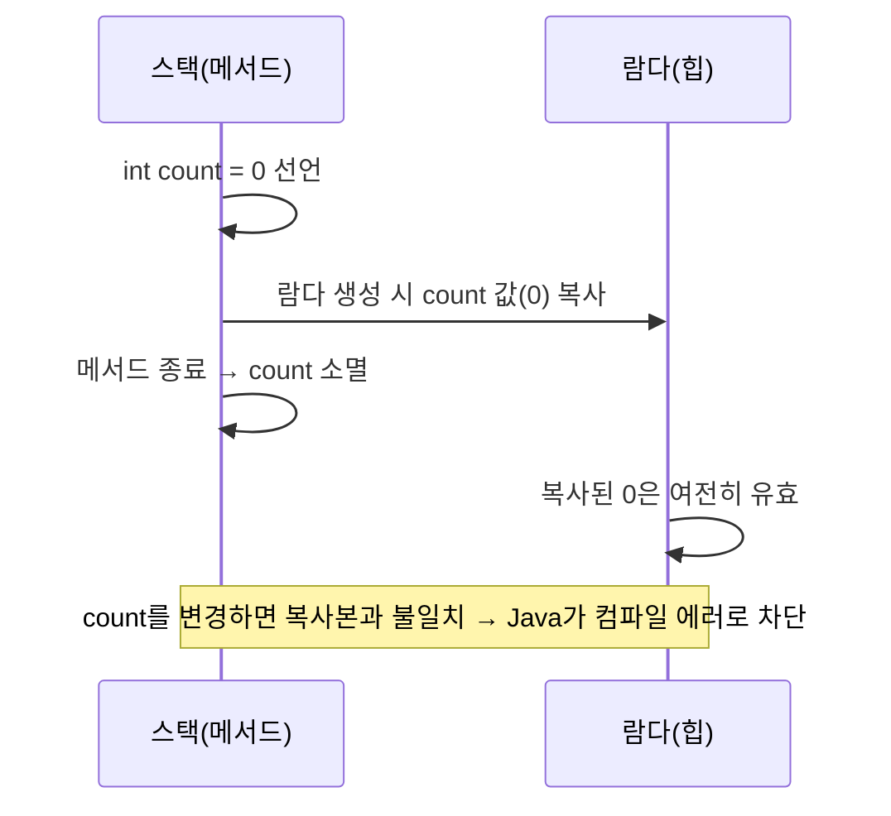
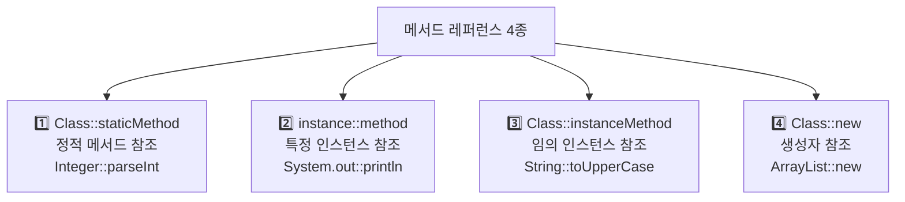
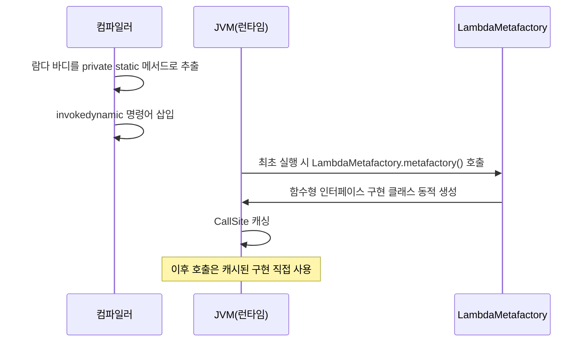
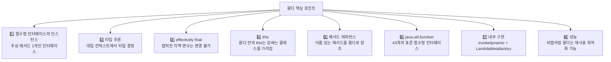

Java 8에서 도입된 람다(Lambda) 표현식은 Java를 함수형 프로그래밍 언어로 진화시킨 핵심 기능입니다. 단순한 문법 설탕(syntactic sugar)처럼 보이지만, 그 내부 동작 원리부터 실전 활용까지 깊이 있게 이해해야 제대로 쓸 수 있습니다.

## 1. 람다란? 왜 필요한가?

### 람다 이전의 세계

Java 8 이전에는 동작(behavior)을 파라미터로 전달하려면 익명 클래스(anonymous class)를 사용해야 했습니다.

```java
// Java 8 이전 — 익명 클래스로 동작 전달
List<String> names = Arrays.asList("Charlie", "Alice", "Bob");

Collections.sort(names, new Comparator<String>() {
    @Override
    public int compare(String a, String b) {
        return a.compareTo(b);
    }
});
```

이 코드의 문제점은 명확합니다. 실제로 하고 싶은 일은 `a.compareTo(b)` 한 줄인데, 그것을 감싸는 보일러플레이트(boilerplate) 코드가 6줄이나 됩니다.

### 람다로 개선

```java
// Java 8 이후 — 람다 표현식
List<String> names = Arrays.asList("Charlie", "Alice", "Bob");
Collections.sort(names, (a, b) -> a.compareTo(b));

// 더 나아가 메서드 레퍼런스로
Collections.sort(names, String::compareTo);
```

### 람다가 필요한 이유

람다는 **동작 파라미터화(behavior parameterization)** 패턴을 간결하게 표현하기 위해 도입되었습니다. "무엇을 할지(what)"를 "어떻게 할지(how)"와 분리하여, 동작 자체를 값처럼 다루는 것이 핵심 아이디어입니다.

```java
// 전략 패턴을 람다로 — 검증 로직을 동적으로 교체
public static List<String> filter(List<String> list, Predicate<String> condition) {
    List<String> result = new ArrayList<>();
    for (String s : list) {
        if (condition.test(s)) {
            result.add(s);
        }
    }
    return result;
}

// 호출 시 동작을 주입
List<String> longNames = filter(names, name -> name.length() > 5);
List<String> aNames   = filter(names, name -> name.startsWith("A"));
```

---

## 2. 함수형 인터페이스 (@FunctionalInterface)

### 정의

람다 표현식은 **함수형 인터페이스(functional interface)** 의 인스턴스입니다. 함수형 인터페이스란 **추상 메서드가 정확히 하나**인 인터페이스입니다. 컴파일러는 람다 표현식이 대입되는 타입(target type)을 보고 어떤 함수형 인터페이스의 구현인지 추론합니다.

```java
@FunctionalInterface
public interface Runnable {
    void run();  // 추상 메서드 1개
}

@FunctionalInterface
public interface Comparator<T> {
    int compare(T o1, T o2);  // 추상 메서드 1개
    // equals()는 Object의 메서드이므로 제외
    // default 메서드는 제외
}
```

### @FunctionalInterface 어노테이션

이 어노테이션은 컴파일러에게 "이 인터페이스는 함수형 인터페이스여야 한다"고 알립니다. 추상 메서드가 2개 이상이면 컴파일 에러가 발생합니다.

```java
@FunctionalInterface
public interface StringProcessor {
    String process(String input);

    // default 메서드는 허용 (추상 메서드 아님)
    default StringProcessor andThen(StringProcessor after) {
        return s -> after.process(this.process(s));
    }

    // static 메서드도 허용
    static StringProcessor identity() {
        return s -> s;
    }

    // Object의 메서드 오버라이드도 허용
    @Override
    String toString();  // 이건 추상 메서드로 카운트되지 않음
}
```

### 직접 만드는 함수형 인터페이스

```java
// 예외를 던지는 함수형 인터페이스 — 표준 라이브러리에 없어서 자주 직접 만듦
@FunctionalInterface
public interface ThrowingSupplier<T> {
    T get() throws Exception;
}

// 사용
ThrowingSupplier<Connection> connSupplier = () -> DriverManager.getConnection(url);
```

---

## 3. 람다 문법

### 기본 구조

```java
// (파라미터) -> { 바디 }

// 1. 파라미터 없음
Runnable r = () -> System.out.println("Hello");

// 2. 파라미터 1개 — 괄호 생략 가능
Consumer<String> c = s -> System.out.println(s);
Consumer<String> c2 = (s) -> System.out.println(s);  // 동일

// 3. 파라미터 2개 이상 — 괄호 필수
Comparator<String> comp = (a, b) -> a.compareTo(b);

// 4. 타입 명시 (선택)
Comparator<String> comp2 = (String a, String b) -> a.compareTo(b);

// 5. 바디가 단일 표현식 — 중괄호, return, 세미콜론 생략
Function<Integer, Integer> square = x -> x * x;

// 6. 바디가 여러 문장 — 중괄호 필수, return 명시
Function<Integer, Integer> process = x -> {
    int doubled = x * 2;
    int shifted = doubled + 1;
    return shifted;
};

// 7. void 반환 — 단일 표현식이어도 중괄호 없이 가능
Consumer<String> printer = s -> System.out.println(s);

// 8. 예외 처리 — 체크 예외는 선언 필요
@FunctionalInterface
interface IOAction {
    void perform() throws IOException;
}
IOAction readFile = () -> new FileReader("test.txt").read();
```

---

## 4. 타입 추론

람다의 타입은 **대입되는 컨텍스트(target type)** 에서 추론됩니다. 컴파일러는 람다가 대입되는 함수형 인터페이스의 제네릭 타입 파라미터를 분석해 파라미터 타입과 반환 타입을 결정합니다.

```java
// 컴파일러가 Comparator<String>임을 알아서 T=String으로 추론
Comparator<String> comp = (a, b) -> a.compareTo(b);
//                         ↑  ↑
//                    String으로 자동 추론

// 메서드 파라미터에서 추론
List<String> names = Arrays.asList("B", "A", "C");
names.sort((a, b) -> a.compareTo(b));
//  sort(Comparator<? super String>) 시그니처에서 추론

// 제네릭 메서드에서 추론
<T> T firstOrDefault(List<T> list, Supplier<T> defaultSupplier) {
    return list.isEmpty() ? defaultSupplier.get() : list.get(0);
}

String result = firstOrDefault(names, () -> "default");
//                                         ↑ Supplier<String>으로 추론
```

### 타입 추론이 실패하는 경우

```java
// 모호한 경우 — 명시적 캐스팅 또는 타입 지정 필요
Object o = (Runnable) () -> System.out.println("hi");  // OK
Object o2 = () -> System.out.println("hi");  // 컴파일 에러: target type 불명확
```

---

## 5. 변수 캡처와 effectively final 제약

람다는 외부 스코프의 변수를 **캡처(capture)** 할 수 있습니다. 단, 중요한 제약이 있습니다.

### effectively final 규칙

```java
// OK — final 변수
final int threshold = 10;
Predicate<Integer> p = x -> x > threshold;

// OK — effectively final (변경되지 않으면 final과 동일 취급)
int threshold2 = 10;
Predicate<Integer> p2 = x -> x > threshold2;
// threshold2를 이후에 변경하면 컴파일 에러 발생

// 컴파일 에러 — 변경된 변수는 캡처 불가
int count = 0;
Runnable r = () -> System.out.println(count);  // count가 effectively final이면 OK
count++;  // 이 줄이 있으면 위의 람다도 컴파일 에러
```

### 왜 effectively final 제약이 있는가?

스택 변수는 메서드가 끝나면 사라지지만, 람다 인스턴스는 힙에서 더 오래 살 수 있습니다. 람다가 스택 변수를 직접 참조하면 메서드 종료 후 댕글링 참조가 발생합니다. 해결책은 **람다 생성 시점의 값을 복사(copy-by-value)** 하는 것입니다. 복사 후 원본이 바뀌면 복사본과 불일치가 생겨 혼란이 발생하므로, Java는 변경 자체를 금지합니다.



### 우회 방법 — 변경 가능한 컨테이너 사용

```java
// 1. 배열로 우회 (권장하지 않음 — 코드 의도 불명확)
int[] counter = {0};
Runnable r = () -> counter[0]++;

// 2. AtomicInteger 사용 (스레드 안전)
AtomicInteger atomicCounter = new AtomicInteger(0);
Runnable r2 = () -> atomicCounter.incrementAndGet();

// 3. 상태를 가진 클래스로 캡슐화
class Counter {
    int value = 0;
}
Counter c = new Counter();
Runnable r3 = () -> c.value++;
// c 자체는 effectively final (재할당 안 함), c.value는 가변
```

### 인스턴스 변수와 정적 변수는 자유롭게 캡처

```java
public class LambdaCapture {
    private int instanceVar = 100;
    private static int staticVar = 200;

    public Runnable createLambda() {
        // 인스턴스 변수 — this를 통해 접근, 제약 없음
        return () -> System.out.println(instanceVar++);  // OK

        // 정적 변수 — 제약 없음
        // return () -> System.out.println(staticVar++);  // OK
    }
}
```

---

## 6. 메서드 레퍼런스 (Method Reference)

메서드 레퍼런스는 이미 이름이 있는 메서드를 람다 대신 참조하는 간결한 문법입니다. 컴파일러는 메서드 레퍼런스를 람다와 동일한 방식으로 처리합니다.

### 6.1 정적 메서드 참조 (Class::staticMethod)

```java
// 람다
Function<String, Integer> parser = s -> Integer.parseInt(s);
// 메서드 레퍼런스
Function<String, Integer> parser2 = Integer::parseInt;

// 활용
List<String> numberStrings = Arrays.asList("1", "2", "3");
List<Integer> numbers = numberStrings.stream()
    .map(Integer::parseInt)
    .collect(Collectors.toList());
```

### 6.2 특정 인스턴스의 메서드 참조 (instance::method)

```java
String prefix = "Hello, ";
// 람다
Function<String, String> greeter = name -> prefix.concat(name);
// 메서드 레퍼런스 — 특정 인스턴스(prefix)의 메서드
Function<String, String> greeter2 = prefix::concat;

// PrintStream 인스턴스의 println 참조
Consumer<String> consolePrinter = System.out::println;
//                                 ↑ System.out이 특정 인스턴스

List<String> list = Arrays.asList("A", "B", "C");
list.forEach(System.out::println);
```

### 6.3 임의 인스턴스의 메서드 참조 (Class::instanceMethod)

파라미터로 들어오는 인스턴스의 메서드를 참조합니다.

```java
// 람다
Function<String, String> toUpper = s -> s.toUpperCase();
// 메서드 레퍼런스 — String 타입의 어떤 인스턴스든 toUpperCase() 호출
Function<String, String> toUpper2 = String::toUpperCase;

// BiFunction으로 두 파라미터 중 첫 번째가 수신자
BiFunction<String, String, Boolean> startsWith = String::startsWith;
// 동일한 람다: (str, prefix) -> str.startsWith(prefix)

boolean result = startsWith.apply("Hello", "He");  // true
```

### 6.4 생성자 참조 (Class::new)

```java
// 람다
Supplier<ArrayList<String>> listMaker = () -> new ArrayList<>();
// 생성자 참조
Supplier<ArrayList<String>> listMaker2 = ArrayList::new;

// 파라미터가 있는 생성자
Function<String, StringBuilder> sbMaker = StringBuilder::new;
StringBuilder sb = sbMaker.apply("initial");

// 배열 생성자
IntFunction<int[]> arrayMaker = int[]::new;
int[] arr = arrayMaker.apply(10);  // new int[10]

// 실전 — Stream.toArray()에서 사용
String[] nameArr = names.stream().toArray(String[]::new);
```

### 메서드 레퍼런스 4종 요약



---

## 7. java.util.function 패키지 핵심 인터페이스

Java 8은 자주 쓰이는 함수형 인터페이스를 `java.util.function` 패키지로 제공합니다.

### 7.1 Function&lt;T, R&gt;

T를 받아 R을 반환합니다.

```java
Function<String, Integer> length = String::length;
Function<Integer, String> intToStr = Object::toString;

// andThen — 두 함수를 합성: f.andThen(g) = g(f(x))
Function<String, String> process = length.andThen(intToStr);
String result = process.apply("hello");  // "5"

// compose — andThen의 역순: f.compose(g) = f(g(x))
Function<Integer, Integer> times2 = x -> x * 2;
Function<Integer, Integer> plus3  = x -> x + 3;
Function<Integer, Integer> times2ThenPlus3 = plus3.compose(times2);
// times2ThenPlus3.apply(4) = plus3(times2(4)) = plus3(8) = 11

// identity — 입력을 그대로 반환
Function<String, String> id = Function.identity();  // s -> s
```

### 7.2 Consumer&lt;T&gt;

T를 받아 아무것도 반환하지 않습니다 (소비).

```java
Consumer<String> printer = System.out::println;
Consumer<List<String>> listClearer = List::clear;

// andThen — 두 Consumer를 순서대로 실행
Consumer<String> printAndLog = printer.andThen(s -> log(s));
printAndLog.accept("Hello");  // 출력 후 로깅

// forEach에서 자주 사용
List<String> names = Arrays.asList("Alice", "Bob");
names.forEach(System.out::println);
```

### 7.3 Supplier&lt;T&gt;

아무것도 받지 않고 T를 반환합니다 (생산). 지연 계산(lazy evaluation)에 가장 많이 활용됩니다.

```java
Supplier<String> greeting = () -> "Hello, World!";
Supplier<List<String>> listFactory = ArrayList::new;
Supplier<LocalDate> today = LocalDate::now;

// 지연 계산(lazy evaluation)에 유용
public <T> T getOrCompute(T cached, Supplier<T> expensive) {
    return cached != null ? cached : expensive.get();
}

// Optional과 함께
String value = Optional.ofNullable(null)
    .orElseGet(() -> "computed default");  // Supplier 사용
```

### 7.4 Predicate&lt;T&gt;

T를 받아 boolean을 반환합니다.

```java
Predicate<String> isEmpty  = String::isEmpty;
Predicate<String> isNotEmpty = isEmpty.negate();         // 부정
Predicate<String> startsA  = s -> s.startsWith("A");
Predicate<String> longName = s -> s.length() > 5;

// and, or 조합
Predicate<String> startsAAndLong = startsA.and(longName);
Predicate<String> startsAOrEmpty = startsA.or(isEmpty);

// 필터링에서 자주 사용
List<String> names = Arrays.asList("Alice", "Bob", "Alexander", "");
List<String> filtered = names.stream()
    .filter(startsAAndLong)
    .collect(Collectors.toList());  // ["Alexander"]
```

### 7.5 UnaryOperator&lt;T&gt;, BinaryOperator&lt;T&gt;

입출력 타입이 동일한 Function/BiFunction의 특수화입니다.

```java
// UnaryOperator<T> extends Function<T, T>
UnaryOperator<String> trim = String::trim;
UnaryOperator<Integer> negate = x -> -x;

// List.replaceAll에서 사용
List<String> words = new ArrayList<>(Arrays.asList("  hello  ", "  world  "));
words.replaceAll(String::trim);  // ["hello", "world"]

// BinaryOperator<T> extends BiFunction<T, T, T>
BinaryOperator<Integer> add  = Integer::sum;
BinaryOperator<Integer> max  = Integer::max;

// reduce에서 사용
int sum = IntStream.rangeClosed(1, 10)
    .reduce(0, Integer::sum);  // 55
```

### 기본형 특수화 인터페이스

박싱/언박싱 오버헤드를 줄이기 위한 특수화 버전입니다. `int`, `long`, `double`을 직접 다루므로 `Integer` 객체를 생성하지 않습니다.

```java
// IntFunction<R>, LongFunction<R>, DoubleFunction<R>
IntFunction<String> intToStr = i -> String.valueOf(i);

// ToIntFunction<T>, ToLongFunction<T>, ToDoubleFunction<T>
ToIntFunction<String> strLen = String::length;

// IntUnaryOperator, LongUnaryOperator, DoubleUnaryOperator
IntUnaryOperator doubler = x -> x * 2;

// IntBinaryOperator, LongBinaryOperator, DoubleBinaryOperator
IntBinaryOperator add = (a, b) -> a + b;

// IntConsumer, LongConsumer, DoubleConsumer
IntConsumer printInt = System.out::println;

// IntSupplier, LongSupplier, DoubleSupplier
IntSupplier random = () -> (int)(Math.random() * 100);

// IntPredicate, LongPredicate, DoublePredicate
IntPredicate isPositive = x -> x > 0;
```

---

## 8. 람다 합성과 조합

### Function 합성

```java
Function<String, String> trim    = String::trim;
Function<String, String> lower   = String::toLowerCase;
Function<String, String> exclaim = s -> s + "!";

// andThen: 왼쪽 → 오른쪽
Function<String, String> normalize = trim.andThen(lower).andThen(exclaim);
normalize.apply("  Hello  ");  // "hello!"
```

### Predicate 조합

```java
Predicate<Integer> isPositive = x -> x > 0;
Predicate<Integer> isEven     = x -> x % 2 == 0;
Predicate<Integer> isSmall    = x -> x < 100;

// and — 모두 만족
Predicate<Integer> positiveEven = isPositive.and(isEven);

// or — 하나 이상 만족
Predicate<Integer> positiveOrSmall = isPositive.or(isSmall);

// negate — 부정
Predicate<Integer> isNegativeOrZero = isPositive.negate();

// 복잡한 조합
Predicate<Integer> complex = isPositive.and(isEven).and(isSmall.negate());
// 양수이고 짝수이고 100 이상인 수
```

### Consumer 체이닝

```java
Consumer<String> log    = s -> System.out.println("[LOG] " + s);
Consumer<String> audit  = s -> auditService.record(s);
Consumer<String> notify = s -> emailService.send(s);

// andThen으로 체이닝 — 순서대로 실행
Consumer<String> fullPipeline = log.andThen(audit).andThen(notify);
fullPipeline.accept("User login event");
```

---

## 9. 람다 vs 익명 클래스 차이

람다와 익명 클래스는 겉으로 비슷해 보이지만 `this`의 의미, 스코프, 바이트코드 구현 방식이 모두 다릅니다.

### this의 의미 차이

```java
public class ThisExample {
    private String name = "outer";

    public void demonstrate() {
        // 익명 클래스 — this는 익명 클래스 인스턴스를 가리킴
        Runnable anon = new Runnable() {
            @Override
            public void run() {
                System.out.println(this.getClass().getSimpleName());
                // 출력: ThisExample$1 (익명 클래스)
            }
        };

        // 람다 — this는 람다를 감싸는 클래스(ThisExample)를 가리킴
        Runnable lambda = () -> {
            System.out.println(this.name);
            // 출력: outer (ThisExample의 name 필드)
            // this는 ThisExample 인스턴스를 참조
        };
    }
}
```

### 새 스코프 생성 여부

```java
public void scopeExample() {
    int x = 10;

    // 익명 클래스 — 새로운 스코프 생성
    Runnable anon = new Runnable() {
        int x = 20;  // OK — 외부 x와 다른 스코프
        @Override
        public void run() {
            System.out.println(x);  // 20 (내부 x)
        }
    };

    // 람다 — 스코프 생성 안 함
    Runnable lambda = () -> {
        // int x = 20;  // 컴파일 에러: 이미 x가 정의된 스코프
        System.out.println(x);  // 10 (외부 x)
    };
}
```

---

## 10. 람다의 내부 구현 — invokedynamic과 LambdaMetafactory

### invokedynamic 동작 원리

람다는 익명 클래스처럼 별도의 `.class` 파일을 생성하지 않습니다. 대신 Java 7에서 도입된 `invokedynamic` JVM 명령어를 사용합니다. 첫 번째 호출 시 `LambdaMetafactory`가 런타임에 함수형 인터페이스 구현 클래스를 동적으로 생성하고 캐싱합니다. 이후 호출에서는 캐시된 구현을 재사용하므로 클래스 로딩 비용이 없습니다.



### 캡처링 람다 vs 비캡처링 람다

```java
// 비캡처링 람다 (non-capturing) — 외부 변수를 캡처하지 않음
// → 매번 동일한 인스턴스 재사용 가능 (JVM 최적화)
Runnable r1 = () -> System.out.println("hello");
Runnable r2 = () -> System.out.println("hello");
// JVM에 따라 r1 == r2일 수 있음 (동일 인스턴스)

// 캡처링 람다 (capturing) — 외부 변수를 캡처
String message = "hello";
Runnable r3 = () -> System.out.println(message);
// 캡처된 값을 저장하는 새 인스턴스 생성 필요
// r3마다 다른 인스턴스
```

### 실제 성능 영향

```java
// 주의: 루프 내에서 람다 생성 — 캡처링이면 객체 생성 발생
for (int i = 0; i < 1000000; i++) {
    int captured = i;
    Runnable r = () -> System.out.println(captured);  // 매번 새 객체
    executor.submit(r);
}

// 비캡처링으로 개선하면 재사용 가능
Runnable constant = () -> System.out.println("done");  // 재사용
for (int i = 0; i < 1000000; i++) {
    executor.submit(constant);  // 동일 객체 재사용
}
```

**실무 실수:** 캡처링 람다를 100만 번 생성하면 100만 개의 객체가 GC 압력을 만듭니다. 루프 내부에 람다가 있고 외부 변수를 캡처하고 있다면 람다를 루프 밖으로 빼거나 캡처를 제거하는 것이 좋습니다.

---

## 정리 요약


