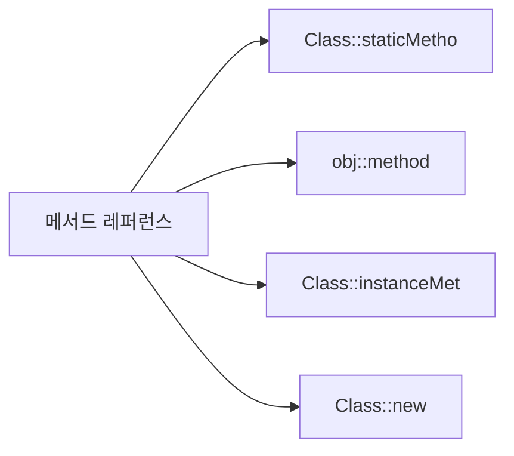
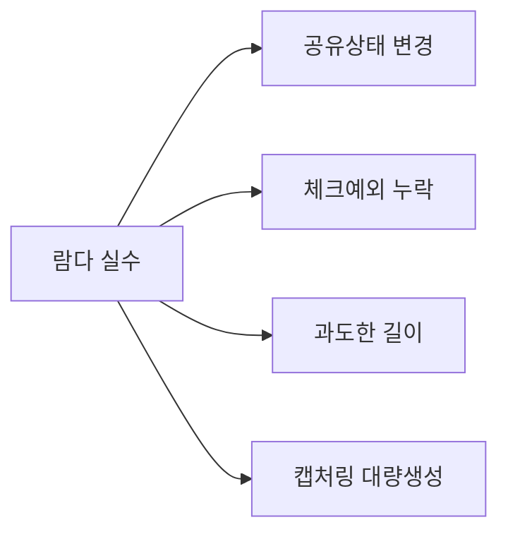
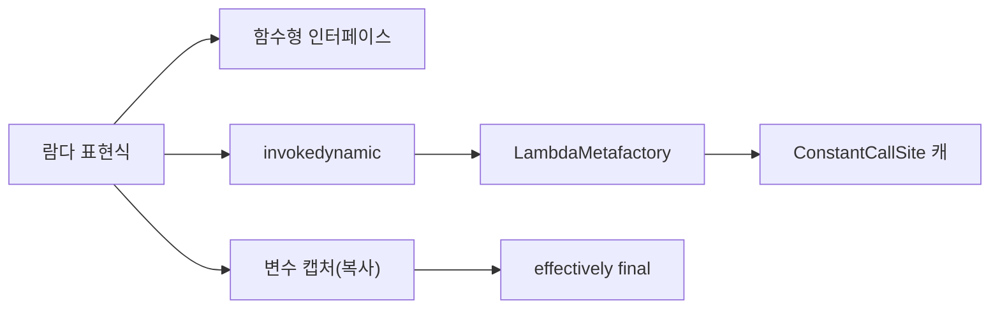

Java 8이 람다를 도입한 것은 단순한 문법 편의가 아닙니다. JVM 명령어 체계 자체를 확장(invokedynamic)하고, 런타임 코드 생성 메커니즘(LambdaMetafactory)을 추가하며, 함수형 인터페이스 타입 시스템을 설계했습니다. 겉으로 보이는 `(a, b) -> a + b` 뒤에는 바이트코드 부트스트랩, CallSite 캐싱, 스택 변수 복사, SAM 변환 등 정교한 엔지니어링이 숨어 있습니다. 이 글은 그 내부 구조를 면접 답변 수준으로 파헤칩니다.

> **비유:** 람다는 공항 자동 출입국 심사대입니다. 예전(익명 클래스)에는 직원이 여권을 받아 도장을 찍고 대장에 기록했습니다(클래스 파일 생성, 클래스 로딩, 인스턴스화). 람다는 안면 인식(invokedynamic)으로 첫 번째만 등록하고 이후에는 캐시된 게이트(CallSite)를 통과합니다. 결과는 같지만 과정이 근본적으로 다릅니다.

---

## 1. 람다 이전의 세계 — 익명 클래스의 비용

Java 8 이전에 "동작(behavior)을 값처럼 전달"하려면 익명 클래스(anonymous class)가 유일한 방법이었습니다.

```java
import java.util.*;

List<String> names = Arrays.asList("Charlie", "Alice", "Bob");

// 익명 클래스로 Comparator 전달
Collections.sort(names, new Comparator<String>() {
    @Override
    public int compare(String a, String b) {
        return a.compareTo(b);
    }
});
```

실제로 하고 싶은 일은 `a.compareTo(b)` 한 줄입니다. 그런데 그것을 감싸는 보일러플레이트가 5줄입니다. 더 심각한 문제는 컴파일러 동작입니다.

**익명 클래스 컴파일 결과:**

```
OuterClass.class
OuterClass$1.class   ← 익명 클래스마다 별도 .class 파일 생성
OuterClass$2.class   ← 두 번째 익명 클래스
```

익명 클래스는 컴파일 시점에 `OuterClass$1.class` 형태의 별도 파일이 생성됩니다. JVM은 이 파일을 클래스 로더가 로딩하고, 검증(verification)하고, 메타데이터를 Metaspace에 올립니다. 익명 클래스 100개면 `.class` 파일 100개, 클래스 로딩 100번입니다.

람다가 이 구조를 어떻게 바꾸는지가 이 글의 핵심입니다.

---

## 2. 람다 표현식 — 문법과 규칙

```java
import java.util.*;
import java.util.function.*;

// (파라미터) -> 표현식 또는 { 블록 }

// 1. 파라미터 없음
Runnable r = () -> System.out.println("Hello");

// 2. 파라미터 1개 — 괄호 생략 가능
Consumer<String> c = s -> System.out.println(s);

// 3. 파라미터 2개 이상 — 괄호 필수
Comparator<String> comp = (a, b) -> a.compareTo(b);

// 4. 타입 명시 (생략 가능, 컴파일러가 추론)
Comparator<String> comp2 = (String a, String b) -> a.compareTo(b);

// 5. 단일 표현식 — return, 세미콜론, 중괄호 모두 생략
Function<Integer, Integer> square = x -> x * x;

// 6. 블록 바디 — return 명시, 세미콜론 포함
Function<Integer, Integer> process = x -> {
    int doubled = x * 2;
    return doubled + 1;
};

// 7. 람다 → 메서드 레퍼런스로 더 간결하게
Collections.sort(names, String::compareTo);
```

---

## 3. 함수형 인터페이스 (Functional Interface)와 @FunctionalInterface

### 3.1 정의와 핵심 규칙

람다 표현식은 **함수형 인터페이스(functional interface)** 의 인스턴스입니다. 함수형 인터페이스란 **추상 메서드가 정확히 하나**인 인터페이스입니다.

> **비유:** 함수형 인터페이스는 "단 하나의 빈칸이 있는 계약서"입니다. 빈칸이 하나면 람다(포스트잇)로 채울 수 있습니다. 빈칸이 2개면 어느 칸을 채우는지 모호해집니다. 컴파일러는 빈칸이 하나임을 보장하는 계약서에만 람다를 허용합니다.

```java
@FunctionalInterface
public interface Transformer<T, R> {
    R transform(T input);           // 추상 메서드: 정확히 1개

    // default 메서드 — 추상 메서드 카운트에서 제외
    default <V> Transformer<T, V> andThen(Transformer<R, V> after) {
        return t -> after.transform(this.transform(t));
    }

    // static 메서드 — 제외
    static <T> Transformer<T, T> identity() {
        return t -> t;
    }

    // Object 메서드 오버라이드 — 제외
    @Override
    String toString();
}
```

`@FunctionalInterface` 어노테이션은 컴파일러에게 "이 인터페이스는 SAM(Single Abstract Method) 규칙을 강제하라"고 지시합니다. 추상 메서드가 2개 이상이면 컴파일 에러가 발생합니다.

### 3.2 @FunctionalInterface가 없어도 동작하는가?

```java
// @FunctionalInterface 없이도 람다 대입 가능 — 단, 보호 없음
interface Converter<F, T> {
    T convert(F from);
    // 이 인터페이스에 추상 메서드를 하나 더 추가해도 컴파일러가 경고하지 않음
    // 결과적으로 람다를 대입하던 코드가 런타임이 아닌 컴파일 에러로 터짐 (뒤늦게 발견)
}

Converter<String, Integer> c = Integer::valueOf;  // 현재는 동작
```

`@FunctionalInterface`는 실수로 추상 메서드를 추가하는 것을 컴파일 타임에 차단합니다. API를 공개할 때 반드시 붙여야 합니다.

### 3.3 체크 예외를 던지는 커스텀 함수형 인터페이스

표준 `java.util.function` 인터페이스는 체크 예외를 선언하지 않습니다. 파일 I/O, DB 조회 등 체크 예외가 발생하는 코드를 람다로 쓰려면 직접 정의해야 합니다.

```java
@FunctionalInterface
public interface ThrowingFunction<T, R> {
    R apply(T t) throws Exception;

    // unchecked로 래핑하는 정적 헬퍼
    static <T, R> Function<T, R> wrap(ThrowingFunction<T, R> f) {
        return t -> {
            try {
                return f.apply(t);
            } catch (Exception e) {
                throw new RuntimeException(e);
            }
        };
    }
}

// 사용 — 체크 예외가 있는 Files.readString을 Stream에서 사용
import java.nio.file.*;
import java.util.stream.*;

List<Path> paths = List.of(Path.of("a.txt"), Path.of("b.txt"));

List<String> contents = paths.stream()
    .map(ThrowingFunction.wrap(Files::readString))
    .collect(Collectors.toList());
```

---

## 4. SAM 변환 — 람다가 타입을 얻는 방법

SAM(Single Abstract Method) 변환은 컴파일러가 람다 표현식을 보고 "이 람다는 어떤 함수형 인터페이스 타입인가?"를 결정하는 과정입니다.

```java
// 타겟 타입(target type)이 변환의 기준
Runnable r       = () -> {};               // target: Runnable
Callable<String> c = () -> "hello";        // target: Callable<String>
Comparator<String> comp = (a, b) -> 0;    // target: Comparator<String>
```

컴파일러는 **대입 컨텍스트(assignment context)**, **메서드 인수 컨텍스트(invocation context)**, **캐스팅 컨텍스트(cast context)** 세 가지에서 타겟 타입을 추론합니다.

```java
import java.util.concurrent.Callable;

// 대입 컨텍스트
Callable<String> c1 = () -> "hello";

// 메서드 인수 컨텍스트
void execute(Callable<String> task) { ... }
execute(() -> "hello");   // Callable<String>으로 추론

// 캐스팅 컨텍스트
Object o = (Runnable) () -> {};   // Runnable로 강제

// 추론 실패 — 타겟 타입 불명확
Object o2 = () -> {};     // 컴파일 에러: target type 없음
```

### SAM 변환이 실패하는 경우

```java
// 메서드 오버로딩으로 타겟이 모호한 경우
void process(Runnable r) { r.run(); }
void process(Callable<Void> c) throws Exception { c.call(); }

process(() -> System.out.println("hi"));  // 컴파일 에러: ambiguous
// 해결: 캐스팅으로 명시
process((Runnable) () -> System.out.println("hi"));
```

---

## 5. 변수 캡처와 effectively final — 스택 vs 힙의 생명 주기 문제

### 5.1 왜 effectively final 제약이 존재하는가?

> **비유:** 변수 캡처는 "법정 증거 사진"입니다. 사진(캡처된 복사본)은 찍는 순간 고정됩니다. 사건 현장(원본 변수)이 나중에 바뀌면 사진과 실물이 달라져 증거 능력을 잃습니다. 법원(JVM)은 아예 현장 변경을 금지합니다.

람다는 외부 지역 변수를 **값으로 복사(copy-by-value)** 합니다. 왜 참조가 아닌 복사인가?

```
메서드 스택 프레임:
  int threshold = 10;   ← 스택에 위치

람다 인스턴스 (힙):
  captured_threshold = 10  ← 힙에 복사본 보관
```

메서드가 반환되면 스택 프레임이 사라지고 `threshold` 자체는 소멸합니다. 하지만 람다 인스턴스는 힙에서 계속 살아 있습니다. 람다가 소멸된 스택 변수를 직접 참조하면 댕글링 참조(dangling reference)가 됩니다. 해결책은 복사입니다.

복사 이후 원본이 바뀌면 복사본과 불일치가 생깁니다. 특히 람다가 다른 스레드에서 실행될 때 메모리 가시성(visibility) 문제까지 더해집니다. Java는 이 불일치를 **컴파일 타임에 금지**합니다. 변경되지 않는 변수(effectively final)만 캡처를 허용합니다.

```java
import java.util.function.*;

// OK — final 명시
final int threshold = 10;
Predicate<Integer> p1 = x -> x > threshold;

// OK — effectively final (이후에 재할당되지 않음)
int limit = 20;
Predicate<Integer> p2 = x -> x < limit;
// limit = 30;  // 이 줄을 추가하면 p2 선언도 컴파일 에러

// 에러 — 변경된 변수는 캡처 불가
int count = 0;
count++;
// Runnable r = () -> System.out.println(count);  // 컴파일 에러
```

### 5.2 인스턴스 변수와 정적 변수는 자유롭게 캡처

```java
public class EventHandler {
    private int callCount = 0;           // 인스턴스 변수
    private static int totalCalls = 0;  // 정적 변수

    public Runnable buildHandler() {
        // this.callCount — 힙의 객체 필드이므로 스택과 무관, 제약 없음
        return () -> {
            callCount++;        // this.callCount++와 동일
            totalCalls++;       // EventHandler.totalCalls++와 동일
            System.out.println("call: " + callCount);
        };
    }
}
```

인스턴스 변수는 힙에 존재하며, 람다가 `this` 참조를 통해 접근합니다. 정적 변수도 힙(Metaspace) 영역이므로 스택 생명주기와 무관합니다.

### 5.3 effectively final 우회 패턴

```java
import java.util.concurrent.atomic.*;

// 1. AtomicInteger — 스레드 안전, 권장
AtomicInteger counter = new AtomicInteger(0);
Runnable r1 = () -> counter.incrementAndGet();  // counter 참조는 불변, 내부 값만 변경

// 2. int[] 배열 — 비권장 (의도 불명확)
int[] mutable = {0};
Runnable r2 = () -> mutable[0]++;  // 배열 참조는 불변, 원소만 변경

// 3. 상태를 가진 객체로 캡슐화
class Box<T> { T value; Box(T v) { this.value = v; } }
Box<Integer> box = new Box<>(0);
Runnable r3 = () -> box.value++;  // box 참조는 불변, box.value만 변경
```

---

## 6. 람다 vs 익명 클래스 — invokedynamic vs inner class file

이 차이를 이해하는 것이 면접에서 가장 중요한 부분입니다.

### 6.1 this의 의미

```java
public class ScopeDemo {
    private String name = "outer";

    public void run() {
        // 익명 클래스 — this는 익명 클래스 인스턴스를 가리킴
        Runnable anon = new Runnable() {
            @Override
            public void run() {
                // this → ScopeDemo$1 (익명 클래스)
                System.out.println(this.getClass().getSimpleName());
                // 외부 필드 접근: ScopeDemo.this.name
                System.out.println(ScopeDemo.this.name);
            }
        };

        // 람다 — this는 람다를 감싸는 클래스(ScopeDemo)를 가리킴
        Runnable lambda = () -> {
            // this → ScopeDemo 인스턴스
            System.out.println(this.name);   // "outer" 직접 접근
            System.out.println(this.getClass().getSimpleName()); // "ScopeDemo"
        };
    }
}
```

### 6.2 스코프와 변수 셰도잉

```java
public void scopeTest() {
    int x = 10;

    // 익명 클래스 — 새 스코프 생성
    Runnable anon = new Runnable() {
        int x = 20;     // OK: 별도 스코프이므로 외부 x와 충돌 없음
        @Override
        public void run() {
            System.out.println(x);  // 20 (내부 x)
        }
    };

    // 람다 — 스코프 생성 안 함, 외부 스코프 연장
    Runnable lambda = () -> {
        // int x = 20;  // 컴파일 에러: x는 이미 이 스코프에 존재
        System.out.println(x);  // 10 (외부 x)
    };
}
```

### 6.3 바이트코드 수준 차이

익명 클래스가 생성하는 바이트코드(javap -c 결과 간략화):

```
// 익명 클래스 방식
new #2  <ScopeDemo$1>           // 새 인스턴스 생성
dup
aload_0                         // outer this 로드 (캡처)
invokespecial #3 <init>         // 생성자 호출
astore_1
```

람다 방식:

```
// 람다 방식 — invokedynamic
invokedynamic #4 run()          // 부트스트랩 메서드 호출
  BootstrapMethods:
    #0 LambdaMetafactory.metafactory(...)
astore_1
```

익명 클래스는 `new + invokespecial`로 매번 객체를 만듭니다. 람다는 `invokedynamic` 하나로 처리하고, 최초 실행 시에만 `LambdaMetafactory`를 호출합니다.

---

## 7. invokedynamic + LambdaMetafactory 내부 동작

### 7.1 invokedynamic이 등장한 배경

Java 7 이전 JVM의 메서드 호출 명령어:

| 명령어 | 용도 |
|---|---|
| invokevirtual | 인스턴스 메서드 (다형성) |
| invokestatic | 정적 메서드 |
| invokespecial | 생성자, private, super |
| invokeinterface | 인터페이스 메서드 |

이 네 가지는 컴파일 시점에 호출 대상이 고정됩니다. `invokedynamic`(Java 7, JSR 292)은 **최초 호출 시 런타임에 호출 대상을 결정**하고 이후에는 그 결정을 캐싱하는 메커니즘입니다. 동적 언어(JRuby, Groovy) 지원을 위해 만들어졌지만, Java 8 람다 구현에 핵심적으로 활용됩니다.

### 7.2 부트스트랩 메서드와 CallSite

```
invokedynamic 명령어 실행 흐름:

1. JVM이 invokedynamic 명령어를 처음 만남
2. 바이트코드에 지정된 부트스트랩 메서드(bootstrap method) 호출
   → LambdaMetafactory.metafactory()
3. metafactory()가 함수형 인터페이스 구현체를 런타임에 생성
4. 생성된 구현체를 ConstantCallSite에 캐싱
5. 이후 같은 invokedynamic 지점은 캐시된 CallSite 직접 사용
```


### 7.3 LambdaMetafactory.metafactory() 시그니처

```java
// java.lang.invoke 패키지
public static CallSite metafactory(
    MethodHandles.Lookup caller,         // 호출 컨텍스트 (접근 권한 검사용)
    String interfaceMethodName,          // 구현할 추상 메서드 이름 (예: "run")
    MethodType factoryType,              // 팩토리 메서드의 타입
                                         // (캡처된 변수 → 함수형 인터페이스)
    MethodType interfaceMethodType,      // 함수형 인터페이스 메서드의 타입
    MethodHandle implementation,         // 람다 바디가 추출된 private static 메서드 핸들
    MethodType dynamicMethodType         // 실제 구현 메서드의 타입
) throws LambdaConversionException
```

### 7.4 컴파일러가 람다 바디를 처리하는 방법

```java
// 원본 코드
public class Example {
    public void process() {
        int threshold = 5;
        Predicate<String> p = s -> s.length() > threshold;
    }
}
```

컴파일러는 이를 다음과 동등하게 변환합니다:

```java
public class Example {
    // 1. 람다 바디를 private static 메서드로 추출
    private static boolean lambda$process$0(int threshold, String s) {
        return s.length() > threshold;
    }

    public void process() {
        int threshold = 5;
        // 2. invokedynamic으로 Predicate 구현체 요청
        //    factoryType: (int) -> Predicate<String>  ← threshold를 캡처
        //    implementation: lambda$process$0 메서드 핸들
        Predicate<String> p = [invokedynamic: LambdaMetafactory.metafactory(...)];
    }
}
```

실제 javap -p -c 출력에서 `lambda$process$0` 같은 합성 메서드를 확인할 수 있습니다.

### 7.5 캡처링 vs 비캡처링 람다의 CallSite 차이

```java
// 비캡처링 람다 (non-capturing)
Runnable r = () -> System.out.println("hello");
// factoryType: () -> Runnable  (캡처 없음)
// → ConstantCallSite: 항상 동일한 인스턴스 반환 가능
// → JVM이 싱글톤 최적화 적용 가능

// 캡처링 람다 (capturing)
String msg = "hello";
Runnable r2 = () -> System.out.println(msg);
// factoryType: (String) -> Runnable  (msg 캡처)
// → 호출마다 새 인스턴스 생성 (msg 값을 저장해야 하므로)
```

---

## 8. 람다 성능 — 컴파일 시 클래스 파일 미생성의 의미

### 8.1 익명 클래스 vs 람다 시작 비용 비교

| 항목 | 익명 클래스 | 람다 |
|---|---|---|
| 컴파일 결과 | `Outer$1.class` 파일 생성 | 별도 파일 없음 |
| 클래스 로딩 | 최초 사용 시 클래스 로더가 `.class` 파일 로드 | 최초 invokedynamic 실행 시 LambdaMetafactory가 런타임 생성 |
| Metaspace 사용 | 각 익명 클래스마다 메타데이터 점유 | 생성된 클래스도 Metaspace 사용 (그러나 프레임워크 제어 가능) |
| 이후 호출 | 일반 가상 디스패치 | ConstantCallSite 직접 호출 (monomorphic) |
| 인스턴스 재사용 | 항상 새 인스턴스 | 비캡처링은 JVM이 재사용 |

### 8.2 핫 경로에서의 실측 차이

```java
import java.util.function.*;

// 핫 경로: 비캡처링 람다를 상수로 선언 → JVM이 싱글톤 최적화
private static final Predicate<String> NOT_EMPTY = s -> !s.isEmpty();

public List<String> filterHot(List<String> input) {
    // NOT_EMPTY는 매번 같은 인스턴스 — GC 압력 없음
    return input.stream().filter(NOT_EMPTY).collect(Collectors.toList());
}

// 위험 패턴: 루프 내 캡처링 람다 — 매 반복마다 새 객체
public void dangerousLoop(List<String> input) {
    for (String prefix : List.of("A", "B", "C")) {
        // prefix를 캡처하므로 매 반복마다 Predicate 인스턴스 생성
        long count = input.stream()
            .filter(s -> s.startsWith(prefix))  // 캡처링!
            .count();
        System.out.println(prefix + ": " + count);
    }
}
```

### 8.3 JIT 컴파일 이후

JIT(Just-In-Time) 컴파일러는 ConstantCallSite를 통해 람다 호출이 항상 동일한 구현체임을 알 수 있습니다. 이를 통해 **인라이닝(inlining)** 이 가능합니다. 충분히 호출된 비캡처링 람다는 사실상 직접 메서드 호출과 동등한 성능에 도달합니다.

---

## 9. 메서드 레퍼런스 — 4가지 유형 완전 분석

> **비유:** 메서드 레퍼런스는 "사람 주소록"입니다. 람다가 "이 사람 찾아가서 이 일 시켜"라고 직접 지시하는 것이라면, 메서드 레퍼런스는 주소록에서 해당 항목을 가리키며 "여기 봐, 이 사람이 해"라고 합니다. 주소록의 항목 형태에 따라 4종류로 나뉩니다.

### 9.1 정적 메서드 참조 (ClassName::staticMethod)

```java
import java.util.function.*;
import java.util.*;
import java.util.stream.*;

// 람다 → 메서드 레퍼런스
Function<String, Integer> f1 = s -> Integer.parseInt(s);
Function<String, Integer> f2 = Integer::parseInt;   // 동일

// 인수가 여러 개인 정적 메서드
BiFunction<String, String, String> join1 = (a, b) -> String.join(", ", a, b);
// String.join은 (CharSequence, CharSequence...) 이므로 이 형태는 직접 참조 불가
// 실제 사용 가능한 예:
BiFunction<Integer, Integer, Integer> max1 = (a, b) -> Integer.max(a, b);
BiFunction<Integer, Integer, Integer> max2 = Integer::max;   // 동일

// Stream에서 활용
List<String> strings = List.of("1", "2", "3");
List<Integer> numbers = strings.stream()
    .map(Integer::parseInt)
    .collect(Collectors.toList());   // [1, 2, 3]
```

바이트코드 수준에서 `Integer::parseInt`는 `invokestatic Integer.parseInt(String)` 메서드 핸들을 LambdaMetafactory에 전달합니다.

### 9.2 특정 인스턴스 메서드 참조 (instance::instanceMethod)

```java
// 특정 인스턴스(고정됨)의 메서드를 참조
String greeting = "Hello, ";
Function<String, String> greeter1 = name -> greeting.concat(name);
Function<String, String> greeter2 = greeting::concat;   // 동일

// PrintStream 인스턴스 System.out의 println 참조
Consumer<String> printer1 = s -> System.out.println(s);
Consumer<String> printer2 = System.out::println;        // 동일

List<String> names = List.of("Alice", "Bob");
names.forEach(System.out::println);

// 비교자 인스턴스 참조 — 상태를 가진 객체의 메서드
Comparator<String> byLength = Comparator.comparingInt(String::length);
List<String> words = new ArrayList<>(List.of("banana", "apple", "kiwi"));
words.sort(byLength::compare);   // byLength 인스턴스의 compare 참조
```

### 9.3 임의 인스턴스 메서드 참조 (ClassName::instanceMethod)

파라미터로 들어온 인스턴스의 메서드를 참조합니다. **첫 번째 파라미터가 수신자(receiver)** 가 됩니다.

```java
// s라는 String 인스턴스의 toUpperCase를 호출
Function<String, String> upper1 = s -> s.toUpperCase();
Function<String, String> upper2 = String::toUpperCase;   // 동일

// 두 파라미터 — 첫 번째가 수신자, 두 번째가 인수
BiFunction<String, String, Boolean> startsWith1 = (str, pfx) -> str.startsWith(pfx);
BiFunction<String, String, Boolean> startsWith2 = String::startsWith;   // 동일

// BiFunction<String, String, Integer>로 compareTo 참조
BiFunction<String, String, Integer> compare = String::compareTo;
int result = compare.apply("apple", "banana");  // 음수

// 정렬에서 임의 인스턴스 참조
List<String> list = new ArrayList<>(List.of("banana", "apple"));
list.sort(String::compareTo);  // Comparator<String>으로 SAM 변환
```

이 유형이 가장 혼동하기 쉽습니다. `String::toUpperCase`는 정적 메서드 참조가 아닙니다. `toUpperCase()`는 인스턴스 메서드이고, `String::toUpperCase`는 "어떤 String 인스턴스든 그것의 toUpperCase를 호출"하는 임의 인스턴스 참조입니다.

### 9.4 생성자 참조 (ClassName::new)

```java
// 기본 생성자
Supplier<ArrayList<String>> listFactory1 = () -> new ArrayList<>();
Supplier<ArrayList<String>> listFactory2 = ArrayList::new;   // 동일

// 파라미터가 있는 생성자
Function<String, StringBuilder> sbFactory1 = s -> new StringBuilder(s);
Function<String, StringBuilder> sbFactory2 = StringBuilder::new;   // 동일

// 배열 생성자
IntFunction<String[]> arrFactory = String[]::new;
String[] arr = arrFactory.apply(5);  // new String[5]

// Stream.toArray에서 배열 생성자 참조 활용
List<String> names = List.of("Alice", "Bob", "Charlie");
String[] nameArr = names.stream().toArray(String[]::new);
// String[]::new → IntFunction<String[]> — Stream이 크기를 전달
```

### 9.5 4종 요약



| 유형 | 문법 | 람다 동등 표현 | 수신자 |
|---|---|---|---|
| 정적 메서드 | `Integer::parseInt` | `s -> Integer.parseInt(s)` | 없음 |
| 특정 인스턴스 | `obj::method` | `x -> obj.method(x)` | 고정 인스턴스 |
| 임의 인스턴스 | `String::toUpperCase` | `s -> s.toUpperCase()` | 첫 번째 파라미터 |
| 생성자 | `ArrayList::new` | `() -> new ArrayList<>()` | 없음 |

---

## 10. java.util.function 핵심 인터페이스 — 내부 합성 원리

### 10.1 Function<T, R> — andThen vs compose 내부 구현

```java
import java.util.function.*;

// Function 소스 코드 (간략화)
@FunctionalInterface
public interface Function<T, R> {
    R apply(T t);

    // andThen: f.andThen(g) → x → g(f(x))
    // g(f(x)): f를 먼저 적용, 그 결과에 g 적용
    default <V> Function<T, V> andThen(Function<? super R, ? extends V> after) {
        Objects.requireNonNull(after);
        return (T t) -> after.apply(this.apply(t));  // ← 람다로 구현된 합성
    }

    // compose: f.compose(g) → x → f(g(x))
    // g를 먼저 적용, 그 결과에 f 적용 (수학적 함수 합성 순서)
    default <V> Function<V, R> compose(Function<? super V, ? extends T> before) {
        Objects.requireNonNull(before);
        return (V v) -> this.apply(before.apply(v));
    }

    static <T> Function<T, T> identity() {
        return t -> t;
    }
}
```

```java
Function<String, String> trim    = String::trim;
Function<String, String> lower   = String::toLowerCase;
Function<String, String> exclaim = s -> s + "!";

// andThen: 왼쪽→오른쪽 (파이프라인 순서)
Function<String, String> pipeline = trim.andThen(lower).andThen(exclaim);
System.out.println(pipeline.apply("  Hello  "));  // "hello!"

// compose: 오른쪽→왼쪽 (수학 표기 순서)
// trim.compose(lower): lower 먼저, 그 다음 trim
Function<String, String> reverse = trim.compose(lower);
// reverse.apply("  Hello  ") → lower("  Hello  ") → trim("  hello  ") → "hello"
```

### 10.2 Predicate<T> — and/or/negate의 단락 평가(Short-circuit)

```java
@FunctionalInterface
public interface Predicate<T> {
    boolean test(T t);

    // and: 왼쪽이 false면 오른쪽 평가 안 함 (&&)
    default Predicate<T> and(Predicate<? super T> other) {
        Objects.requireNonNull(other);
        return (t) -> test(t) && other.test(t);  // && 연산자: short-circuit
    }

    // or: 왼쪽이 true면 오른쪽 평가 안 함 (||)
    default Predicate<T> or(Predicate<? super T> other) {
        Objects.requireNonNull(other);
        return (t) -> test(t) || other.test(t);  // || 연산자: short-circuit
    }

    // negate: 결과 반전
    default Predicate<T> negate() {
        return (t) -> !test(t);
    }

    // 두 객체가 equals인지 확인하는 정적 팩토리
    static <T> Predicate<T> isEqual(Object targetRef) {
        return (null == targetRef)
            ? Objects::isNull
            : object -> targetRef.equals(object);
    }
}
```

```java
import java.util.stream.*;

Predicate<String> isLong   = s -> s.length() > 5;
Predicate<String> startsA  = s -> s.startsWith("A");
Predicate<String> hasDigit = s -> s.chars().anyMatch(Character::isDigit);

// 단락 평가 활용 — 비용이 싼 조건을 앞에 배치
Predicate<String> combined = isLong.and(startsA).and(hasDigit);
// isLong이 false면 startsA, hasDigit은 평가하지 않음

List<String> data = List.of("Alexander1", "Bob", "Alice2", "Charlie");
List<String> result = data.stream()
    .filter(combined)
    .collect(Collectors.toList());  // ["Alexander1"]

// 동적 Predicate 합성 — 조건 리스트를 런타임에 조합
List<Predicate<String>> conditions = List.of(isLong, startsA);
Predicate<String> dynamic = conditions.stream()
    .reduce(Predicate::and)         // reduce로 순서대로 and 합성
    .orElse(s -> true);             // 조건 없으면 모두 통과
```

### 10.3 Consumer<T> — andThen 체이닝

```java
// Consumer.andThen 소스
default Consumer<T> andThen(Consumer<? super T> after) {
    Objects.requireNonNull(after);
    return (T t) -> { accept(t); after.accept(t); };
    // accept()에서 예외 발생 시 after.accept()는 실행되지 않음
}
```

```java
Consumer<String> log    = s -> System.out.println("[LOG] " + s);
Consumer<String> audit  = s -> System.out.println("[AUDIT] " + s);
Consumer<String> metric = s -> System.out.println("[METRIC] len=" + s.length());

Consumer<String> fullPipeline = log.andThen(audit).andThen(metric);
fullPipeline.accept("user.login");
// [LOG] user.login
// [AUDIT] user.login
// [METRIC] len=10
```

### 10.4 Supplier<T> — 지연 평가(Lazy Evaluation)

```java
import java.util.Optional;

// Supplier는 "값을 나중에 계산"하는 약속
Supplier<String> expensive = () -> {
    // DB 조회, 네트워크 호출 등 비용이 큰 연산
    return fetchFromDatabase();
};

// 값이 필요할 때만 get() 호출
public <T> T getOrCompute(T cached, Supplier<T> fallback) {
    return cached != null ? cached : fallback.get();  // cached가 있으면 fallback 미실행
}

// Optional.orElseGet — Supplier로 지연 평가
String value = Optional.<String>empty()
    .orElseGet(() -> "computed");   // empty일 때만 람다 실행

// orElse는 항상 실행됨 (주의)
String bad = Optional.<String>empty()
    .orElse(expensiveDefault());    // expensiveDefault()는 항상 호출됨!
```

### 10.5 UnaryOperator<T>, BinaryOperator<T>

```java
import java.util.function.*;

// UnaryOperator<T> extends Function<T, T> — 입출력 타입 동일
UnaryOperator<String> trim    = String::trim;
UnaryOperator<String> upper   = String::toUpperCase;
UnaryOperator<String> trimAndUpper = trim.andThen(upper)::apply;
// 주의: andThen 반환 타입은 Function<T,R>, UnaryOperator<T>로 직접 체이닝 어려움
// 명시적 캐스팅 또는 별도 합성 필요

List<String> words = new ArrayList<>(List.of("  hello  ", "  world  "));
words.replaceAll(String::trim);  // List.replaceAll(UnaryOperator<E>)
System.out.println(words);  // [hello, world]

// BinaryOperator<T> extends BiFunction<T, T, T> — 두 입력, 한 출력, 모두 같은 타입
BinaryOperator<Integer> add  = Integer::sum;
BinaryOperator<Integer> max  = Integer::max;
BinaryOperator<String>  concat = String::concat;

// Stream.reduce에서 BinaryOperator 활용
import java.util.stream.*;
int total = IntStream.rangeClosed(1, 10)
    .boxed()
    .reduce(0, Integer::sum);  // BinaryOperator<Integer>
System.out.println(total);  // 55

Optional<String> joined = Stream.of("Hello", " ", "World")
    .reduce(String::concat);
System.out.println(joined.get());  // "Hello World"
```

---

## 11. 커링(Currying)과 부분 적용(Partial Application)

### 11.1 커링이란?

> **비유:** 커링은 "요리 레시피 분리"입니다. "소금 + 설탕 + 재료를 넣어 볶아라"는 3인수 함수를 "소금을 정하면 → 설탕을 정하면 → 재료를 받아 볶는 함수"로 단계별로 분리하는 것입니다. 소금 양을 미리 정해두면 나머지 단계를 재사용할 수 있습니다.

커링은 `f(a, b, c)` 형태의 다인수 함수를 `f(a)(b)(c)` 형태 — 인수를 하나씩 받는 함수들의 연쇄 — 로 변환하는 기법입니다.

```java
import java.util.function.*;

// 2인수 함수 → 커링
// BiFunction<A, B, R> 대신 Function<A, Function<B, R>>
Function<Integer, Function<Integer, Integer>> curriedAdd =
    a -> b -> a + b;

// 사용
Function<Integer, Integer> add5 = curriedAdd.apply(5);  // 5를 고정
System.out.println(add5.apply(3));   // 8
System.out.println(add5.apply(10));  // 15

// 3인수 커링
Function<String, Function<Integer, Function<Boolean, String>>> formatter =
    prefix -> count -> uppercase ->
        (uppercase ? prefix.toUpperCase() : prefix) + " x" + count;

String result = formatter.apply("item").apply(3).apply(true);
System.out.println(result);  // "ITEM x3"
```

### 11.2 부분 적용(Partial Application)

커링이 인수를 하나씩 받는 함수 체인으로 변환하는 것이라면, 부분 적용은 다인수 함수의 일부 인수를 미리 고정하는 것입니다.

```java
// BiFunction의 첫 번째 인수를 고정하는 부분 적용 헬퍼
static <A, B, R> Function<B, R> partial(BiFunction<A, B, R> f, A a) {
    return b -> f.apply(a, b);
}

BiFunction<String, String, String> format =
    (template, value) -> template.replace("{}", value);

// "Hello, {}"라는 템플릿을 고정
Function<String, String> greeter = partial(format, "Hello, {}");
System.out.println(greeter.apply("Alice"));  // "Hello, Alice"
System.out.println(greeter.apply("Bob"));    // "Hello, Bob"
```

### 11.3 실전 커링 — 설정 주입 패턴

```java
import java.util.function.*;
import java.util.*;

// DB 쿼리를 커링으로 구성
Function<String, Function<Integer, Function<Boolean, List<String>>>> queryBuilder =
    tableName -> limit -> includeDeleted ->
        buildQuery(tableName, limit, includeDeleted);

// 테이블명만 고정한 쿼리 팩토리
Function<Integer, Function<Boolean, List<String>>> userQuery =
    queryBuilder.apply("users");

// limit만 추가 고정
Function<Boolean, List<String>> top10Users = userQuery.apply(10);

// 실제 실행 시 includeDeleted만 전달
List<String> activeUsers  = top10Users.apply(false);
List<String> allUsers     = top10Users.apply(true);
```

### 11.4 BiFunction을 커링으로 변환하는 유틸리티

```java
static <A, B, R> Function<A, Function<B, R>> curry(BiFunction<A, B, R> f) {
    return a -> b -> f.apply(a, b);
}

BiFunction<String, Integer, String> repeat = (s, n) ->
    s.repeat(n);

Function<String, Function<Integer, String>> curriedRepeat = curry(repeat);
Function<Integer, String> repeatHello = curriedRepeat.apply("Hello");
System.out.println(repeatHello.apply(3));  // "HelloHelloHello"
```

---

## 12. 람다 직렬화 (Serialization of Lambda)

### 12.1 람다를 직렬화할 수 있는가?

람다는 기본적으로 직렬화되지 않습니다. 함수형 인터페이스와 람다 모두 `Serializable`을 구현해야 직렬화가 가능합니다.

```java
import java.io.*;
import java.util.function.*;

// Serializable과 함수형 인터페이스를 교차 캐스팅으로 직렬화
Comparator<String> c = (Comparator<String> & Serializable)
    (a, b) -> a.compareTo(b);

// 직렬화 시도
try (ObjectOutputStream oos = new ObjectOutputStream(
        new FileOutputStream("comparator.ser"))) {
    oos.writeObject(c);  // 동작
}

// 역직렬화
try (ObjectInputStream ois = new ObjectInputStream(
        new FileInputStream("comparator.ser"))) {
    Comparator<String> restored = (Comparator<String>) ois.readObject();
    System.out.println(restored.compare("B", "A"));  // 양수
}
```

### 12.2 람다 직렬화의 위험성

```java
// 직렬화된 람다는 생성된 클래스명에 의존
// → JDK 버전, 컴파일러 버전이 바뀌면 역직렬화 실패
// → lambda$serialize$0 같은 합성 이름이 변경될 수 있음

// 권장: 람다 대신 명시적 클래스로 직렬화
public class StringComparator implements Comparator<String>, Serializable {
    private static final long serialVersionUID = 1L;
    @Override
    public int compare(String a, String b) { return a.compareTo(b); }
}
```

### 12.3 람다 직렬화가 필요한 경우

Spark, Flink 같은 분산 처리 프레임워크는 람다를 네트워크를 통해 워커 노드로 전송합니다. 이 경우 직렬화가 필수입니다.

```java
// Spark 스타일 — Serializable 람다
import java.io.Serializable;
import java.util.function.*;

@FunctionalInterface
public interface SerializableFunction<T, R>
    extends Function<T, R>, Serializable {}

SerializableFunction<String, Integer> lengthFn = String::length;
// 메서드 레퍼런스도 직렬화 가능 (단, 대상 클래스가 classpath에 있어야 함)
```

---

## 13. Predicate/Function/Consumer/Supplier 합성 — 실전 파이프라인

### 13.1 데이터 변환 파이프라인

```java
import java.util.*;
import java.util.function.*;
import java.util.stream.*;

// 단계별 독립 변환 함수 정의
Function<String, String>   trim       = String::trim;
Function<String, String>   lower      = String::toLowerCase;
Function<String, Integer>  length     = String::length;
Predicate<Integer>         isValid    = n -> n >= 3 && n <= 20;
Function<Integer, String>  classify   = n -> n < 10 ? "SHORT" : "LONG";

// 함수 합성으로 파이프라인 구성
Function<String, Integer> preprocess = trim.andThen(lower).andThen(length);
// preprocess: String → (trim) → (lower) → (length) → Integer

List<String> inputs = List.of("  Hello  ", "Hi", "  Java Programming  ", "X");

List<String> results = inputs.stream()
    .map(preprocess)            // String → Integer
    .filter(isValid)            // 유효 길이 필터
    .map(classify)              // Integer → "SHORT"/"LONG"
    .collect(Collectors.toList());

System.out.println(results);  // [SHORT, LONG]
```

### 13.2 이벤트 처리 파이프라인

```java
import java.util.function.*;

record Event(String type, String payload, int priority) {}

Predicate<Event> isHighPriority  = e -> e.priority() >= 8;
Predicate<Event> isLoginEvent    = e -> e.type().equals("LOGIN");
Predicate<Event> hasPayload      = e -> !e.payload().isEmpty();

Function<Event, String>  extractPayload = Event::payload;
Function<String, String> sanitize       = s -> s.replaceAll("[<>]", "");

Consumer<String> store  = payload -> System.out.println("[STORE] " + payload);
Consumer<String> notify = payload -> System.out.println("[NOTIFY] " + payload);

// 고우선순위 로그인 이벤트의 payload를 sanitize 후 저장 + 알림
Predicate<Event> shouldProcess = isHighPriority.and(isLoginEvent).and(hasPayload);
Function<Event, String> transform = extractPayload.andThen(sanitize);
Consumer<String> action = store.andThen(notify);

List<Event> events = List.of(
    new Event("LOGIN",  "<admin>",  9),
    new Event("LOGIN",  "user1",    5),
    new Event("LOGOUT", "<admin>",  9)
);

events.stream()
    .filter(shouldProcess)
    .map(transform)
    .forEach(action);
// [STORE] admin
// [NOTIFY] admin
```

---

## 14. 람다와 스트림 — 주요 오용 패턴

### 14.1 parallelStream에서 공유 상태 변경

```java
import java.util.*;
import java.util.concurrent.*;
import java.util.stream.*;

// 위험: ArrayList는 스레드 안전하지 않음
List<String> unsafe = new ArrayList<>();
List<String> data = List.of("a", "b", "c", "d", "e");

data.parallelStream()
    .map(String::toUpperCase)
    .forEach(unsafe::add);  // 경쟁 조건! 결과 불확정

// 안전: collect 사용
List<String> safe = data.parallelStream()
    .map(String::toUpperCase)
    .collect(Collectors.toList());  // 내부적으로 스레드 안전하게 합산

// 안전: 스레드 안전 컬렉션 사용
List<String> concurrent = new CopyOnWriteArrayList<>();
data.parallelStream()
    .map(String::toUpperCase)
    .forEach(concurrent::add);  // CopyOnWriteArrayList는 add가 synchronized
```

### 14.2 체크 예외를 람다 안에서 처리하는 패턴

```java
import java.nio.file.*;
import java.util.function.*;

// 안티패턴: 람다 안에서 직접 try-catch
Function<Path, String> reader = path -> {
    try {
        return Files.readString(path);
    } catch (IOException e) {
        throw new RuntimeException(e);  // 체크 예외를 unchecked로 래핑
    }
};

// 개선: 래핑 헬퍼를 한번만 정의하고 재사용
@FunctionalInterface
interface ThrowingFunction<T, R> {
    R apply(T t) throws Exception;

    static <T, R> Function<T, R> wrap(ThrowingFunction<T, R> f) {
        return t -> {
            try { return f.apply(t); }
            catch (Exception e) { throw new RuntimeException(e); }
        };
    }
}

Function<Path, String> reader2 = ThrowingFunction.wrap(Files::readString);

List<Path> paths = List.of(Path.of("a.txt"), Path.of("b.txt"));
List<String> contents = paths.stream()
    .map(ThrowingFunction.wrap(Files::readString))
    .collect(Collectors.toList());
```

### 14.3 지나치게 긴 람다

```java
// 안티패턴: 20줄짜리 람다
List<Order> orders = fetchOrders();
List<Invoice> invoices = orders.stream()
    .filter(order -> {
        // 10줄의 필터링 로직
        if (order.getAmount() < 0) return false;
        if (order.getStatus() == null) return false;
        // ... 7줄 더
        return true;
    })
    .map(order -> {
        // 15줄의 변환 로직
        Invoice invoice = new Invoice();
        // ...
        return invoice;
    })
    .collect(Collectors.toList());

// 개선: 메서드 추출 후 메서드 레퍼런스
List<Invoice> invoices2 = orders.stream()
    .filter(this::isValidOrder)   // 메서드로 추출
    .map(this::toInvoice)         // 메서드로 추출
    .collect(Collectors.toList());
```

---

## 15. 면접 포인트 5개 — 깊은 WHY 분석

<details>
<summary>펼쳐보기</summary>


### Q1: 람다와 익명 클래스의 근본적인 차이는 무엇인가?

**표면적 차이:** 문법의 간결함, this의 의미, 스코프.

**근본적 차이 — 바이트코드 구현:**

익명 클래스는 컴파일 시 `Outer$1.class`를 생성합니다. JVM은 이 파일을 클래스 로더로 로딩하고, Metaspace에 클래스 메타데이터를 올립니다. 실행 시 `new + invokespecial`로 인스턴스를 생성합니다. 이 과정은 모든 익명 클래스마다 반복됩니다.

람다는 컴파일 시 별도 파일을 생성하지 않습니다. 대신 바이트코드에 `invokedynamic` 명령어를 삽입합니다. 최초 실행 시 JVM이 `LambdaMetafactory.metafactory()`를 호출해 런타임에 구현 클래스를 생성하고 `ConstantCallSite`에 캐싱합니다. 이후 실행은 캐시된 CallSite를 직접 사용합니다.

**실무 함의:** 람다가 익명 클래스보다 무조건 빠른 것은 아닙니다. 클래스 로딩 비용은 줄지만, 비캡처링 람다는 싱글톤 최적화로 GC 압력이 없는 반면, 캡처링 람다는 매번 새 인스턴스를 생성합니다. 최초 invokedynamic 실행 비용(LambdaMetafactory 호출)이 있지만 이후에는 익명 클래스와 동등하거나 더 빠릅니다.

### Q2: effectively final 제약이 필요한 이유를 JVM 메모리 모델 관점에서 설명하라

**스택 vs 힙 생명주기:** 지역 변수는 메서드 스택 프레임에 위치합니다. 메서드 반환 시 스택 프레임이 제거되고 변수는 소멸합니다. 람다 인스턴스는 힙에 존재하며 GC가 수거하기 전까지 살아있습니다. 람다가 소멸된 스택 변수를 직접 참조하면 댕글링 참조가 됩니다.

**해결책 — 복사:** Java는 캡처 시 지역 변수의 현재 값을 람다 인스턴스 필드에 복사합니다. 복사본은 람다와 함께 힙에서 생존합니다.

**불일치 방지:** 복사 이후 원본이 변경되면 람다가 보유한 복사본과 불일치가 발생합니다. 특히 람다가 다른 스레드에서 실행될 때, Java Memory Model의 happens-before 보장 없이 원본 변경이 복사본에 전파되지 않을 수 있습니다. effectively final 제약은 이 불일치 자체를 컴파일 타임에 봉쇄합니다.

**인스턴스 변수가 자유로운 이유:** 인스턴스 변수는 `this` 참조를 통해 접근합니다. `this`는 힙 객체이므로 스택 생명주기 문제가 없습니다. 다만 스레드 안전성은 여전히 고려해야 합니다.

### Q3: invokedynamic과 LambdaMetafactory의 역할을 부트스트랩 메서드까지 설명하라

**invokedynamic의 역할:** `invokedynamic` 명령어는 바이트코드에 "이 지점의 호출 대상은 런타임에 결정하라"고 기록합니다. 각 `invokedynamic` 명령어는 상수 풀(constant pool)에 부트스트랩 메서드 참조를 포함합니다.

**최초 실행:** JVM이 처음으로 `invokedynamic` 명령어를 만나면 부트스트랩 메서드를 호출합니다. 람다의 경우 부트스트랩 메서드는 `LambdaMetafactory.metafactory()`입니다.

**LambdaMetafactory.metafactory()의 동작:**
1. 호출 컨텍스트(`MethodHandles.Lookup`)를 통해 접근 권한을 검사합니다.
2. 컴파일러가 추출한 람다 바디 메서드 핸들(`implementation`)을 받습니다.
3. 함수형 인터페이스(`interfaceMethodType`)를 구현하는 클래스를 바이트코드 수준에서 동적 생성합니다. (내부적으로 ASM 또는 런타임 Proxy 기법 사용)
4. 생성된 클래스의 인스턴스 또는 팩토리를 담은 `ConstantCallSite`를 반환합니다.

**이후 실행:** JVM은 `ConstantCallSite`에 저장된 `MethodHandle`을 직접 호출합니다. 부트스트랩은 다시 실행되지 않습니다. JIT 컴파일러는 이 ConstantCallSite를 모노모픽(monomorphic) 호출로 최적화하고 인라이닝까지 적용합니다.

### Q4: 캡처링 람다 vs 비캡처링 람다의 성능 차이를 GC 관점에서 설명하라

**비캡처링 람다:**
```
factoryType: () → Runnable   (인수 없음 — 캡처 없음)
```
LambdaMetafactory는 인수 없는 팩토리를 생성합니다. 팩토리가 항상 같은 인스턴스를 반환하도록 JVM이 최적화할 수 있습니다. 핫스팟 JVM은 실제로 비캡처링 람다를 정적 필드에 캐싱해 싱글톤처럼 동작시킵니다.

```java
// 비캡처링 — JVM이 싱글톤으로 최적화 가능
Runnable r1 = () -> System.out.println("hi");
Runnable r2 = () -> System.out.println("hi");
System.out.println(r1 == r2);  // JVM에 따라 true 가능
```

**캡처링 람다:**
```
factoryType: (int) → Predicate<String>   (int 인수 — 캡처 있음)
```
캡처된 값을 저장하기 위해 매번 새 인스턴스를 생성해야 합니다. 루프에서 10만 번 생성하면 10만 개의 객체가 Young GC 대상이 됩니다.

**실무 해결책:**
```java
// 루프 내 캡처링 람다 — 위험
for (String prefix : prefixes) {
    list.stream().filter(s -> s.startsWith(prefix)).count();  // 매번 새 Predicate
}

// 개선 1: 비캡처링으로 전환 (가능하면)
// 개선 2: static final로 선언 (캡처가 불필요한 경우)
private static final Predicate<String> NOT_EMPTY = s -> !s.isEmpty();
```

### Q5: 람다로 커링을 구현할 때의 타입 시스템 한계와 해결 방법은?

**Java 타입 시스템의 한계:** Java의 제네릭은 타입 소거(type erasure)를 사용합니다. 3인수 커링을 표현하면:

```java
Function<A, Function<B, Function<C, R>>>
```

이 타입은 가독성이 매우 낮고, 4인수면 더 깊어집니다. 또한 고차 함수 합성 시 타입 추론이 실패해 명시적 타입 지정이 필요한 경우가 많습니다.

**해결 방법 1 — 전용 함수형 인터페이스 정의:**
```java
@FunctionalInterface
interface TriFunction<A, B, C, R> {
    R apply(A a, B b, C c);

    default <V> TriFunction<A, B, C, V> andThen(Function<? super R, ? extends V> after) {
        return (a, b, c) -> after.apply(this.apply(a, b, c));
    }

    default BiFunction<B, C, R> partial(A a) {
        return (b, c) -> this.apply(a, b, c);
    }
}
```

**해결 방법 2 — Vavr 같은 라이브러리 활용:**

Vavr의 `Function3<A, B, C, R>`은 `curried()`, `partial()`, `andThen()`, `compose()`를 모두 제공합니다. 커링이 필요한 도메인 코드에서는 직접 구현보다 검증된 라이브러리가 더 안전합니다.

**면접 핵심 답변:** Java 람다는 커링 표현이 가능하지만 타입 가독성 한계가 있습니다. 2인수 정도는 `Function<A, Function<B, R>>`이 실용적이고, 3인수 이상이면 전용 함수형 인터페이스나 Vavr를 고려해야 합니다.

---

## 16. 극한 시나리오

### 시나리오 1: 초당 100만 이벤트 필터링 파이프라인

> **비유:** 공항 보안 검색대 100개가 동시에 돌아가는 상황입니다. 1차(금속탐지) → 2차(X-ray) → 3차(수동)로 이어지는 검문을 Predicate 체이닝으로 구현했는데, 각 검문 단계를 런타임에 추가/제거해야 합니다.

**문제:** 초당 100만 건의 로그 이벤트를 레벨, 서비스명, 키워드 등 10가지 이상의 조건으로 필터링합니다. 조건이 자주 변경됩니다.

**구현:**
```java
import java.util.*;
import java.util.function.*;
import java.util.concurrent.*;
import java.util.stream.*;

record LogEvent(String level, String service, String message) {}

class EventFilter {
    // CopyOnWriteArrayList: 읽기 성능 최적화, 드문 쓰기(조건 변경)에 적합
    private final CopyOnWriteArrayList<Predicate<LogEvent>> conditions =
        new CopyOnWriteArrayList<>();

    public void addCondition(Predicate<LogEvent> condition) {
        conditions.add(condition);
    }

    public void removeCondition(Predicate<LogEvent> condition) {
        conditions.remove(condition);
    }

    // 비싼 조건은 뒤에 배치 — and는 short-circuit이므로 앞이 false면 뒤는 미평가
    public Predicate<LogEvent> buildFilter() {
        return conditions.stream()
            .reduce(e -> true, Predicate::and);  // 조건 없으면 모두 통과
    }
}

// 사용
EventFilter filter = new EventFilter();
filter.addCondition(e -> !"DEBUG".equals(e.level()));             // 저비용
filter.addCondition(e -> "payment-service".equals(e.service())); // 저비용
filter.addCondition(e -> isSpamDetected(e.message()));            // 고비용: 뒤에 배치

// parallelStream + 비캡처링 Predicate
Predicate<LogEvent> combined = filter.buildFilter();
List<LogEvent> relevant = events.parallelStream()
    .filter(combined)   // combined는 비캡처링(EventFilter의 인스턴스 변수 아닌 지역)
    .collect(Collectors.toList());
```

**핵심 포인트:**
- `Predicate::and`로 동적 합성 — 재배포 없이 조건 변경
- 단락 평가 활용을 위해 비용 순서로 배치
- `combined`가 캡처링 람다면 매 이벤트마다 새 인스턴스 — 반드시 루프 밖으로 추출

### 시나리오 2: 분산 처리 프레임워크에서 람다 직렬화 실패

> **비유:** 공장 라인의 제어 명령을 다른 공장으로 팩스(직렬화)로 보내려는데, 팩스 기계(JDK 버전)가 달라서 명령서(람다 클래스명)를 읽지 못합니다.

**문제:** Apache Spark 작업에서 람다를 직렬화해 워커 노드로 전송하는데, 서버마다 JDK 버전이 달라 `InvalidClassException`이 발생합니다.

**원인:** 람다는 `lambda$processData$0` 같은 합성 이름의 클래스로 생성됩니다. 이 이름은 JDK 버전, 컴파일러 버전, 파일 내 람다 순서에 따라 달라집니다. `serialVersionUID`도 자동 계산되므로 버전 간 불일치가 잦습니다.

**해결:**
```java
import java.io.Serializable;
import java.util.function.*;

// 1. 명시적 Serializable 클래스 사용 (가장 안전)
public class LengthFilter implements Predicate<String>, Serializable {
    private static final long serialVersionUID = 1L;
    private final int minLength;

    public LengthFilter(int minLength) { this.minLength = minLength; }

    @Override
    public boolean test(String s) { return s.length() >= minLength; }
}

// 2. Serializable 교차 타입으로 람다 직렬화 (단기 해결)
Predicate<String> p = (Predicate<String> & Serializable) s -> s.length() >= 5;

// 3. 커스텀 SerializableFunction 인터페이스 (프레임워크 내부 표준)
@FunctionalInterface
interface SerializablePredicate<T> extends Predicate<T>, Serializable {
    // serialVersionUID 정의 불가 (인터페이스), 구현 클래스에서 정의
}
```

**교훈:** 분산 환경에서 람다 직렬화는 버전 안정성이 떨어집니다. 운영 환경에서는 명시적 `Serializable` 클래스가 더 안전합니다.

### 시나리오 3: 루프 내 캡처링 람다가 GC를 포화시키는 상황

> **비유:** 100만 장의 즉석사진을 인화하는 것과 같습니다. 한 장(싱글톤 람다)만 있으면 되는데, 매번 새 사진을 인화합니다.

**문제:** 초당 10만 건의 요청을 처리하는 서버에서 GC 로그를 보니 Young GC가 5초마다 발생하고 STW(Stop-The-World) 시간이 50ms에 달합니다. 프로파일링 결과 특정 서비스 클래스에서 람다 객체가 초당 10만 개 생성됩니다.

```java
// 문제 코드
public boolean processRequest(Request req) {
    String userId = req.getUserId();  // 요청마다 다른 값
    // 매 요청마다 Predicate 인스턴스 생성!
    return userRepository.findAll().stream()
        .filter(u -> u.getId().equals(userId))  // userId 캡처
        .findFirst()
        .isPresent();
}
```

**해결:**
```java
// 개선 1: 람다 제거, 직접 메서드 호출
public boolean processRequest(Request req) {
    return userRepository.findById(req.getUserId()).isPresent();
}

// 개선 2: 캡처를 메서드 파라미터로 이동 (람다 자체를 비캡처링으로)
private static boolean matchesId(User u, String id) {
    return u.getId().equals(id);
}

public boolean processRequest(Request req) {
    String userId = req.getUserId();
    return userRepository.findAll().stream()
        .anyMatch(u -> matchesId(u, userId));
    // anyMatch 내 람다: u -> matchesId(u, userId) — 여전히 userId 캡처
    // 개선 불완전, 개선 1이 최선
}

// 개선 3: 비캡처링 Predicate를 static으로 선언 (userId 조건이 고정인 경우만)
private static final Predicate<User> IS_ACTIVE = u -> u.isActive();
```

---

## 17. 실무에서 자주 하는 실수 요약



| 실수 | 증상 | 해결 |
|---|---|---|
| parallelStream + 공유 ArrayList | 데이터 유실, ConcurrentModificationException | collect 사용, 스레드 안전 컬렉션 |
| 람다 내 체크 예외 | 컴파일 에러 | ThrowingFunction.wrap(), try-catch 내부 처리 |
| 20줄 람다 | 가독성 저하, 테스트 불가 | 메서드 추출 후 메서드 레퍼런스 |
| 루프 내 캡처링 람다 | GC 과부하, 높은 STW 빈도 | 루프 밖으로 추출, 비캡처링 전환 |
| `orElse(expensive())` | Supplier 미사용 — 항상 실행 | `orElseGet(() -> expensive())` |
| 람다에서 `this` 혼동 | 예상치 못한 외부 객체 접근 | 익명 클래스와 달리 this는 외부 클래스임을 인지 |

---

## 18. 정리 요약



Java 람다는 문법 설탕이 아닙니다. `invokedynamic`이라는 JVM 명령어 확장 위에, `LambdaMetafactory`라는 런타임 코드 생성기가, `ConstantCallSite` 캐싱으로 성능을 보장하는 정교한 시스템입니다. 이 구조를 이해하면 "왜 비캡처링 람다가 싱글톤으로 최적화되는지", "왜 effectively final이 필요한지", "왜 익명 클래스와 this가 다른지"를 논리적으로 설명할 수 있습니다.

면접에서 람다를 설명할 때 "편한 문법"으로 끝내지 말고, `invokedynamic → LambdaMetafactory → CallSite → 비캡처링 싱글톤 최적화`의 흐름으로 답변하면 시니어 수준의 이해를 보여줄 수 있습니다.

</details>
