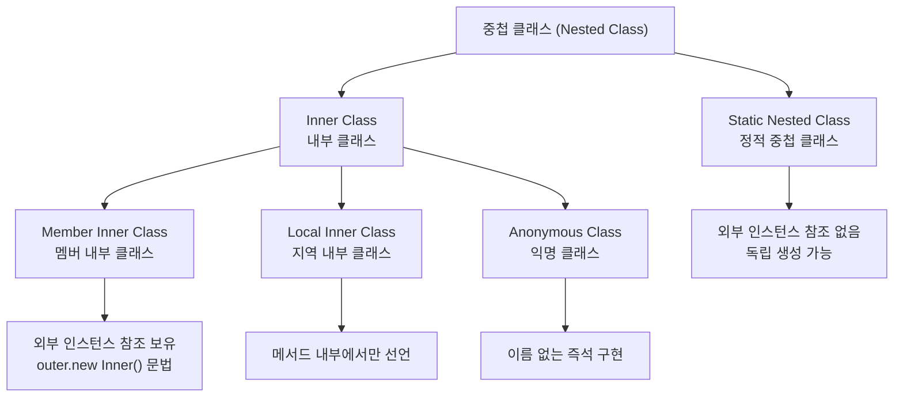
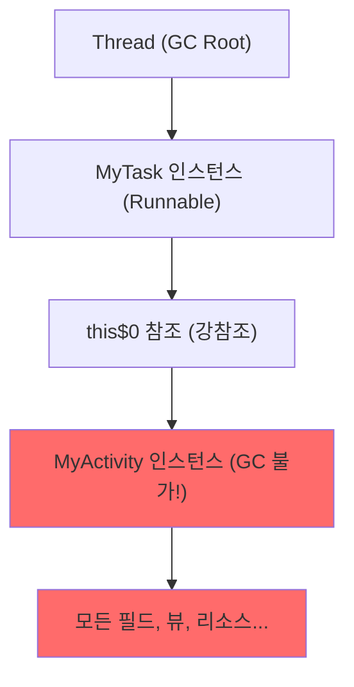
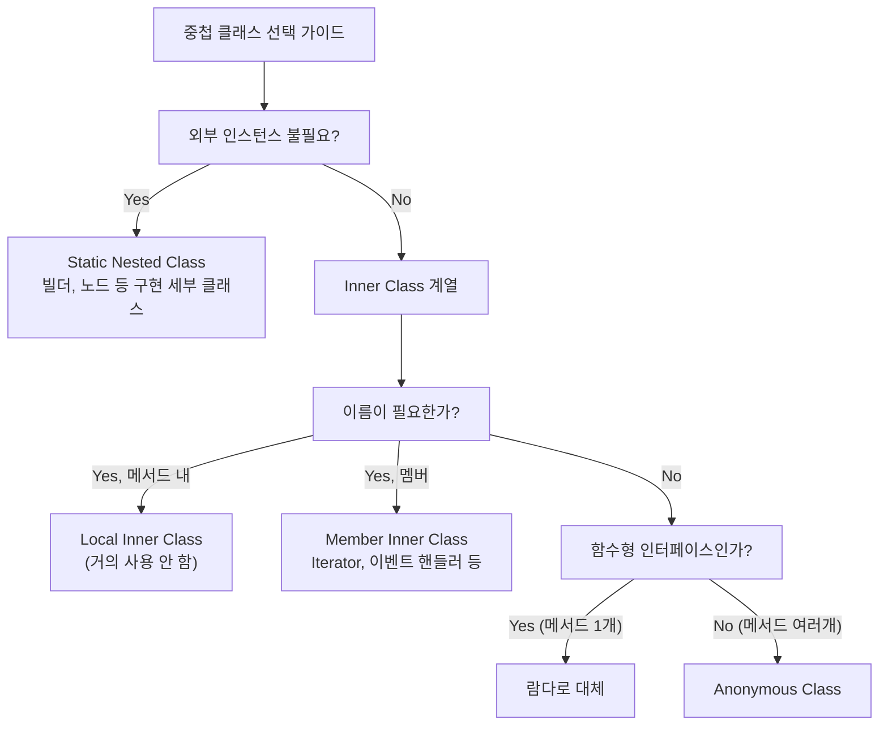

Java는 클래스 안에 클래스를 선언할 수 있습니다. 이를 중첩 클래스(Nested Class)라고 하며, 종류에 따라 동작 방식과 사용 목적이 크게 다릅니다. 잘못 사용하면 메모리 누수의 원인이 되기도 하므로, 각각의 특성을 정확히 이해하는 것이 중요합니다.

---

## 1. 중첩 클래스 종류 전체 구조

중첩 클래스의 가장 중요한 분류 기준은 **외부 클래스 인스턴스에 대한 참조를 보유하는가** 여부입니다. `static`으로 선언된 중첩 클래스는 외부 참조가 없어 독립적으로 생성 가능하고, 비static(inner) 클래스는 항상 외부 인스턴스를 참조합니다. 이 차이가 메모리 누수 가능성을 결정합니다.



| 종류 | static | 외부 인스턴스 참조 | 선언 위치 |
|------|--------|-------------------|-----------|
| Static Nested Class | O | X | 클래스 멤버 |
| Member Inner Class | X | O | 클래스 멤버 |
| Local Inner Class | X | O | 메서드 내부 |
| Anonymous Class | X | O | 표현식 위치 |

---

## 2. Static 중첩 클래스 (Static Nested Class)

### 동작 원리

`static`을 붙이면 외부 클래스의 인스턴스와 완전히 독립됩니다. 외부 클래스의 `static` 멤버에만 접근 가능하고, 인스턴스 멤버에는 접근할 수 없습니다. `Outer` 인스턴스 없이 `new Outer.StaticNested()`로 바로 생성합니다.

```java
public class Outer {
    private static String staticField = "static";
    private String instanceField = "instance";

    // static 중첩 클래스
    public static class StaticNested {
        public void show() {
            System.out.println(staticField);    // OK — static 멤버 접근 가능
            // System.out.println(instanceField); // 컴파일 에러! — 인스턴스 멤버 접근 불가
        }
    }
}

// 사용 — Outer 인스턴스 불필요
Outer.StaticNested nested = new Outer.StaticNested();
nested.show();
```

### 사용 시점

```java
// 1. LinkedList 내부 Node — 논리적으로 연관되지만 독립적인 클래스
public class LinkedList<E> {
    // Node는 LinkedList의 구현 세부사항
    private static class Node<E> {
        E item;
        Node<E> next;
        Node<E> prev;

        Node(E element, Node<E> next, Node<E> prev) {
            this.item = element;
            this.next = next;
            this.prev = prev;
        }
    }
}

// 2. 빌더 패턴
public class Person {
    private final String name;
    private final int age;
    private final String email;

    private Person(Builder builder) {
        this.name  = builder.name;
        this.age   = builder.age;
        this.email = builder.email;
    }

    public static class Builder {
        private String name;
        private int age;
        private String email;

        public Builder name(String name) {
            this.name = name;
            return this;
        }

        public Builder age(int age) {
            this.age = age;
            return this;
        }

        public Builder email(String email) {
            this.email = email;
            return this;
        }

        public Person build() {
            return new Person(this);
        }
    }
}

// 사용
Person person = new Person.Builder()
    .name("Alice")
    .age(30)
    .email("alice@example.com")
    .build();
```

---

## 3. 멤버 내부 클래스 (Member Inner Class)

### 동작 원리

멤버 내부 클래스는 컴파일러가 자동으로 외부 클래스 인스턴스에 대한 숨겨진 참조(`this$0`)를 필드로 추가합니다. `Inner` 인스턴스를 생성하려면 반드시 `Outer` 인스턴스가 먼저 있어야 하고, `outer.new Inner()` 라는 독특한 문법을 사용합니다. 이 숨겨진 참조가 메모리 누수의 핵심 원인입니다.

```java
public class Outer {
    private String name = "Outer";

    // 멤버 내부 클래스
    public class Inner {
        private String name = "Inner";

        public void show() {
            // 외부 클래스 인스턴스 멤버 접근 가능
            System.out.println(name);          // "Inner" — 자신의 필드
            System.out.println(Outer.this.name); // "Outer" — 외부 참조
        }
    }
}

// 사용 — Outer 인스턴스 필요!
Outer outer = new Outer();
Outer.Inner inner = outer.new Inner();  // 독특한 문법
inner.show();
```

### 컴파일러가 생성하는 실제 코드

```java
// 컴파일러가 생성하는 Inner 클래스 (대략)
class Outer$Inner {
    private String name;
    final Outer this$0;  // 외부 클래스 참조 — 메모리 누수 원인!

    Outer$Inner(Outer outer) {
        this.this$0 = outer;
        this.name = "Inner";
    }
}
```

### Outer.this 사용

```java
public class ScrollPane {
    private String scrollMode = "smooth";

    public class Adjustable {
        private String scrollMode = "step";

        public void scroll() {
            System.out.println(scrollMode);            // "step" (자신)
            System.out.println(ScrollPane.this.scrollMode); // "smooth" (외부)
        }
    }
}
```

---

## 4. 지역 내부 클래스 (Local Inner Class)

### 동작 원리

메서드 내부에서 선언하는 클래스입니다. 해당 메서드 스코프 안에서만 사용할 수 있어 외부 공개 없이 특정 메서드 전용 로직을 캡슐화할 때 씁니다. 람다가 없던 시절에는 이 방식을 썼지만 현대에는 거의 사용하지 않습니다.

```java
public class Outer {
    public void method() {
        final String localVar = "local";  // 사실상 final이어야 함 (effectively final)

        // 메서드 내부에서 클래스 선언
        class LocalInner {
            public void show() {
                System.out.println(localVar);  // 지역 변수 접근 가능
            }
        }

        LocalInner local = new LocalInner();
        local.show();
    }
}
```

### effectively final 규칙

```java
public void method() {
    int x = 10;
    // x = 20;  // 주석 해제 시 아래 익명/지역 내부 클래스에서 에러

    class Inner {
        void show() {
            System.out.println(x);  // x가 effectively final이어야 함
        }
    }
}
```

---

## 5. 익명 클래스 (Anonymous Class)

### 동작 원리

익명 클래스는 인터페이스나 추상 클래스를 즉석에서 구현하는 문법입니다. 컴파일러는 `Outer$1.class`, `Outer$2.class` 같은 별도 파일을 생성합니다. Java 8 이후로는 함수형 인터페이스(추상 메서드 1개)라면 람다로 대체하는 것이 권장됩니다.

```java
// 인터페이스나 추상 클래스를 즉석에서 구현
Runnable r = new Runnable() {
    @Override
    public void run() {
        System.out.println("익명 클래스 실행");
    }
};
r.run();

// 추상 클래스 익명 구현
abstract class Greeting {
    abstract void greet();
    void common() { System.out.println("공통 동작"); }
}

Greeting g = new Greeting() {
    @Override
    void greet() {
        System.out.println("안녕하세요!");
    }
};
g.greet();
g.common();
```

### 익명 클래스의 캡처

```java
String prefix = "Hello";  // effectively final

Runnable r = new Runnable() {
    @Override
    public void run() {
        System.out.println(prefix);  // 외부 변수 캡처
    }
};
```

---

## 6. 익명 클래스 → 람다 전환

### Java 8 이전 vs 이후

```java
// Java 8 이전 — 익명 클래스
List<String> list = Arrays.asList("banana", "apple", "cherry");
Collections.sort(list, new Comparator<String>() {
    @Override
    public int compare(String a, String b) {
        return a.compareTo(b);
    }
});

// Java 8+ — 람다 (함수형 인터페이스)
list.sort((a, b) -> a.compareTo(b));

// 메서드 참조
list.sort(String::compareTo);
```

### 익명 클래스 vs 람다 차이

```java
// 1. this 의미 다름
Runnable r1 = new Runnable() {
    public void run() {
        System.out.println(this);  // 익명 클래스 인스턴스
    }
};

Runnable r2 = () -> System.out.println(this);  // 외부 클래스 인스턴스!

// 2. 람다는 상태(필드)를 가질 수 없음
Runnable counter = new Runnable() {
    int count = 0;  // 가능
    public void run() { count++; }
};

// 람다에는 필드 선언 불가
Runnable lambdaCounter = () -> { /* count++ 불가 */ };

// 3. 익명 클래스는 여러 메서드 구현 가능
```

---

## 7. 메모리 누수 주의사항

### 내부 클래스의 외부 참조 문제

비static 내부 클래스 인스턴스가 외부 클래스 인스턴스보다 오래 살면 GC가 외부 클래스를 수거하지 못합니다. `Thread`나 `Handler` 같은 장수 객체가 내부 클래스 인스턴스를 보유할 때 특히 위험합니다.



```java
// 위험한 패턴 — Activity / Fragment에서 자주 발생
public class MyActivity {
    private String data = "중요 데이터";

    // 멤버 내부 클래스 — Outer 인스턴스 강하게 참조
    class MyTask implements Runnable {
        @Override
        public void run() {
            // data 접근 시 MyActivity 참조 유지
            System.out.println(data);
        }
    }

    public void startTask() {
        // MyTask가 백그라운드 스레드에서 실행되면
        // 스레드가 살아있는 동안 MyActivity 전체가 GC 불가!
        new Thread(new MyTask()).start();
    }
}
```

### 해결 방법 1: Static Nested Class + WeakReference

```java
public class MyActivity {
    private String data = "중요 데이터";

    // static → 외부 참조 없음
    static class MyTask implements Runnable {
        private final WeakReference<MyActivity> activityRef;

        MyTask(MyActivity activity) {
            this.activityRef = new WeakReference<>(activity);
        }

        @Override
        public void run() {
            MyActivity activity = activityRef.get();
            if (activity != null) {  // null 체크 필수
                System.out.println(activity.data);
            }
            // activity가 GC되었으면 아무것도 안 함
        }
    }

    public void startTask() {
        new Thread(new MyTask(this)).start();
    }
}
```

### 해결 방법 2: 람다 캡처 주의

```java
public class EventSource {
    private final List<Runnable> listeners = new ArrayList<>();

    public void addListener(Runnable listener) {
        listeners.add(listener);
    }

    // 위험: this 전체를 캡처
    public void badRegister() {
        addListener(() -> processData(this.data));  // this 캡처 → 누수 가능
    }

    // 안전: 필요한 값만 캡처
    public void safeRegister() {
        String snapshot = this.data;  // 값만 복사
        addListener(() -> processData(snapshot));
    }
}
```

### 해결 방법 3: 명시적 제거

```java
// 리스너 등록 시 항상 제거 쌍을 고려
EventBus.register(this);
// ...
EventBus.unregister(this);  // 반드시 제거

// try-finally 또는 AutoCloseable 패턴
class MyComponent implements AutoCloseable {
    MyComponent() { EventBus.register(this); }

    @Override
    public void close() { EventBus.unregister(this); }
}
```

**비유:** 멤버 내부 클래스는 집주인(외부 클래스)의 열쇠를 가진 세입자(내부 클래스)입니다. 세입자가 이사를 가지 않는 한(GC), 집주인도 집을 비울 수 없습니다(GC 불가). `WeakReference`는 열쇠를 종이에 적어두는 것과 같습니다. 집주인이 이미 집을 비웠다면(GC됨) 종이의 주소는 무효가 됩니다.

**극한 시나리오:** 안드로이드 앱에서 `Activity` 안에 `AsyncTask`(멤버 내부 클래스)를 생성한 뒤 화면을 회전시키면 새 `Activity`가 생성되는데, 백그라운드 작업이 끝날 때까지 이전 `Activity`가 GC되지 않아 `OutOfMemoryError`로 앱이 크래시됩니다.

---

## 8. 실무 활용 패턴

### Iterator 패턴

```java
public class NumberRange implements Iterable<Integer> {
    private final int start;
    private final int end;

    public NumberRange(int start, int end) {
        this.start = start;
        this.end = end;
    }

    @Override
    public Iterator<Integer> iterator() {
        return new Iterator<Integer>() {
            private int current = start;

            @Override
            public boolean hasNext() { return current <= end; }

            @Override
            public Integer next() {
                if (!hasNext()) throw new NoSuchElementException();
                return current++;
            }
        };
    }
}

// 사용
for (int n : new NumberRange(1, 5)) {
    System.out.println(n);  // 1 2 3 4 5
}
```

### 이벤트 리스너 패턴

```java
// Java Swing 스타일 (레거시)
button.addActionListener(new ActionListener() {
    @Override
    public void actionPerformed(ActionEvent e) {
        System.out.println("클릭!");
    }
});

// 람다로 전환 (현대적)
button.addActionListener(e -> System.out.println("클릭!"));
```

### 팩토리 메서드와 익명 클래스

```java
public abstract class Template {
    public final void execute() {
        step1();
        step2();  // 추상 — 하위 구현
        step3();
    }

    protected abstract void step2();

    protected void step1() { System.out.println("Step 1"); }
    protected void step3() { System.out.println("Step 3"); }
}

// 즉석 구현
Template t = new Template() {
    @Override
    protected void step2() {
        System.out.println("커스텀 Step 2");
    }
};
t.execute();
```

---

## 9. 전체 요약



**핵심 규칙:**
1. 외부 인스턴스가 필요 없으면 → static 중첩 클래스 우선 선택
2. 멤버 내부 클래스 + 백그라운드 작업 → 메모리 누수 반드시 확인
3. 함수형 인터페이스 → 람다로 교체
4. `this$0` 참조를 항상 인식하고 설계할 것
