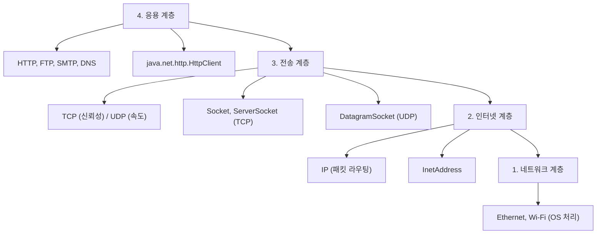
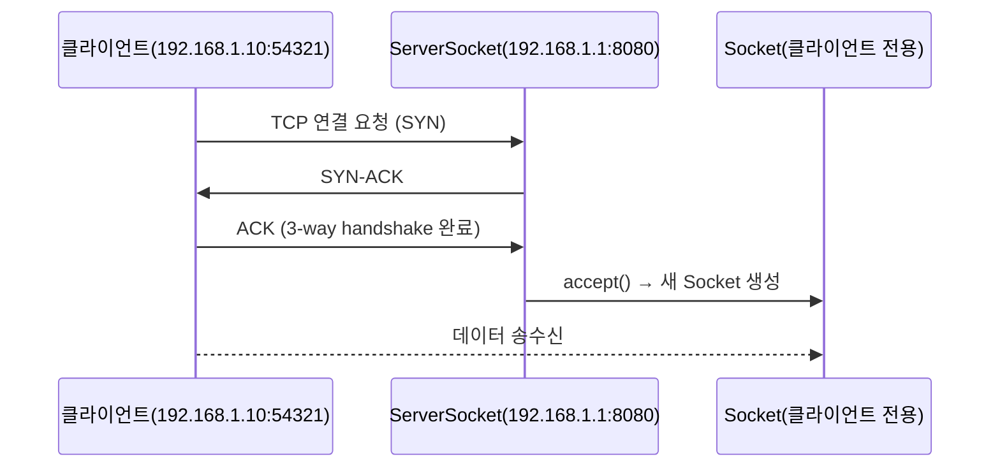
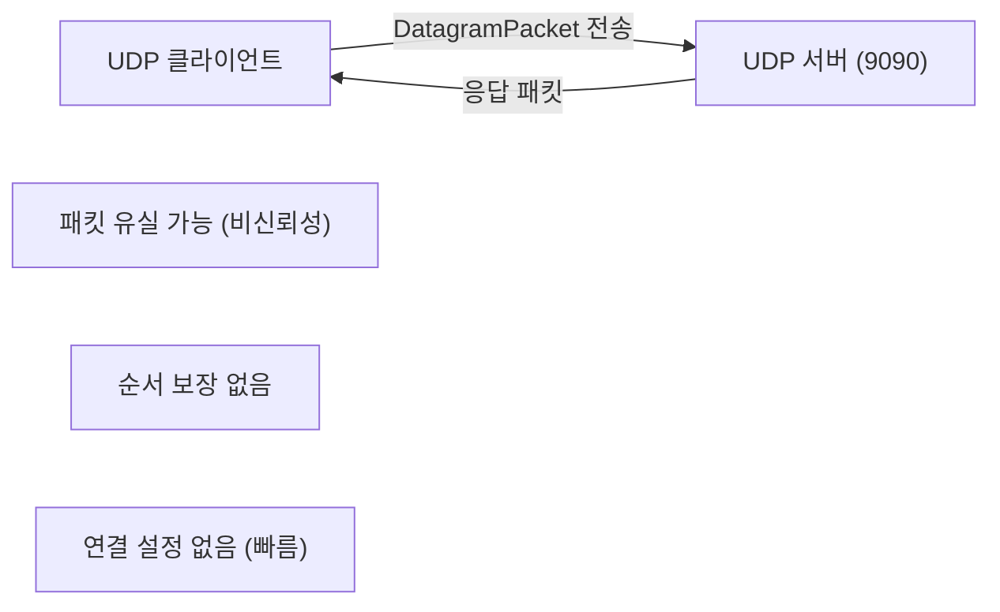
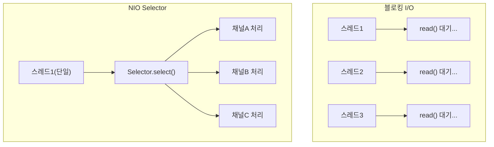
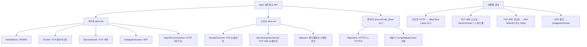

Java는 소켓부터 HTTP 클라이언트까지 풍부한 네트워크 API를 제공합니다. TCP/UDP 저수준 통신부터 NIO 기반 고성능 서버까지 전체를 상세히 정리합니다.

---

## 1. 네트워크 기본 개념

### 1.1 TCP/IP 계층 구조

Java 네트워크 API는 계층 구조에 따라 역할이 나뉩니다. 응용 계층의 `HttpClient`는 HTTP 프로토콜을 추상화하고, 전송 계층의 `Socket`은 TCP/UDP를 직접 다루며, 인터넷 계층의 `InetAddress`는 IP 주소와 DNS를 처리합니다.



### 1.2 소켓(Socket)이란?

소켓은 네트워크 통신의 끝점(Endpoint)입니다. IP 주소 + 포트 번호로 식별됩니다.



### 1.3 TCP vs UDP

| 항목 | TCP | UDP |
|------|-----|-----|
| 연결 | 연결 지향 (3-way handshake) | 비연결 |
| 신뢰성 | 보장 (재전송, 순서 보장) | 보장 안 함 |
| 속도 | 상대적으로 느림 | 빠름 |
| 용도 | HTTP, FTP, 채팅 | 동영상 스트리밍, DNS, 게임 |
| Java 클래스 | Socket, ServerSocket | DatagramSocket |

---

## 2. InetAddress — IP 주소 다루기

```java
import java.net.*;

// IP 주소 조회
InetAddress local = InetAddress.getLocalHost();
System.out.println("호스트명: " + local.getHostName());
System.out.println("IP 주소: " + local.getHostAddress());

// 도메인 → IP 변환 (DNS 조회)
InetAddress google = InetAddress.getByName("www.google.com");
System.out.println("Google IP: " + google.getHostAddress());

// 여러 IP 주소 (라운드 로빈 DNS)
InetAddress[] addresses = InetAddress.getAllByName("www.google.com");
for (InetAddress addr : addresses) {
    System.out.println(addr.getHostAddress());
}

// IP → 도메인 역조회
InetAddress byIp = InetAddress.getByName("8.8.8.8");
System.out.println("역조회: " + byIp.getHostName());

// 연결 가능 여부 확인
boolean reachable = google.isReachable(3000);  // 3초 타임아웃
System.out.println("연결 가능: " + reachable);

// 주소 타입 확인
System.out.println("루프백: " + local.isLoopbackAddress());
System.out.println("멀티캐스트: " + google.isMulticastAddress());

// IPv4 vs IPv6
InetAddress v4 = InetAddress.getByName("192.168.1.1");
InetAddress v6 = InetAddress.getByName("::1");
System.out.println("IPv4: " + (v4 instanceof Inet4Address));
System.out.println("IPv6: " + (v6 instanceof Inet6Address));
```

---

## 3. Socket / ServerSocket — TCP 통신

### 동작 원리

`ServerSocket`은 특정 포트에서 연결을 기다립니다. `accept()`는 클라이언트가 연결할 때까지 현재 스레드를 블로킹합니다. 연결이 들어오면 클라이언트 전용 `Socket`을 반환합니다. 이 구조에서 단일 스레드 서버는 한 번에 한 클라이언트만 처리할 수 있으므로 실무에서는 반드시 스레드풀과 함께 사용합니다.

### 3.1 기본 TCP 에코 서버

```java
// 서버
public class EchoServer {
    public static void main(String[] args) throws IOException {
        // 포트 8080에서 대기, backlog=50 (연결 대기 큐 크기)
        try (ServerSocket serverSocket = new ServerSocket(8080, 50)) {
            System.out.println("서버 시작: " + serverSocket.getLocalSocketAddress());

            while (true) {
                Socket clientSocket = serverSocket.accept();  // 블로킹: 클라이언트 대기
                System.out.println("클라이언트 연결: " + clientSocket.getRemoteSocketAddress());

                // 단일 스레드: 한 번에 하나만 처리 (실무에서는 멀티스레드 사용)
                handleClient(clientSocket);
            }
        }
    }

    private static void handleClient(Socket socket) throws IOException {
        try (socket;
             BufferedReader in = new BufferedReader(
                     new InputStreamReader(socket.getInputStream(), StandardCharsets.UTF_8));
             PrintWriter out = new PrintWriter(
                     new BufferedWriter(
                             new OutputStreamWriter(socket.getOutputStream(), StandardCharsets.UTF_8)),
                     true)) {  // autoFlush=true

            String line;
            while ((line = in.readLine()) != null) {
                System.out.println("수신: " + line);
                out.println("ECHO: " + line);  // 에코
            }
        }
    }
}
```

### 3.2 기본 TCP 클라이언트

```java
public class EchoClient {
    public static void main(String[] args) throws IOException {
        try (Socket socket = new Socket("localhost", 8080);
             BufferedReader in = new BufferedReader(
                     new InputStreamReader(socket.getInputStream(), StandardCharsets.UTF_8));
             PrintWriter out = new PrintWriter(
                     new BufferedWriter(
                             new OutputStreamWriter(socket.getOutputStream(), StandardCharsets.UTF_8)),
                     true);
             Scanner scanner = new Scanner(System.in)) {

            System.out.println("서버에 연결됨: " + socket.getRemoteSocketAddress());

            while (scanner.hasNextLine()) {
                String input = scanner.nextLine();
                if ("quit".equalsIgnoreCase(input)) break;

                out.println(input);           // 서버로 전송
                String response = in.readLine(); // 서버 응답 수신
                System.out.println("서버 응답: " + response);
            }
        }
    }
}
```

### 3.3 소켓 옵션 설정

```java
Socket socket = new Socket();

// 연결 타임아웃 설정 (connect 전에 설정)
socket.connect(new InetSocketAddress("example.com", 80), 5000);  // 5초

// 읽기 타임아웃 (SocketTimeoutException 발생)
socket.setSoTimeout(10000);  // 10초

// TCP_NODELAY: 작은 패킷 즉시 전송 (Nagle 알고리즘 비활성화)
socket.setTcpNoDelay(true);

// SO_KEEPALIVE: 연결 유지 확인 패킷 전송
socket.setKeepAlive(true);

// SO_LINGER: close() 시 데이터 전송 보장 대기
socket.setSoLinger(true, 5);  // 최대 5초 대기

// 수신/송신 버퍼 크기
socket.setReceiveBufferSize(65536);  // 64KB
socket.setSendBufferSize(65536);

// SO_REUSEADDR: 이미 사용 중인 포트 재사용 (서버 재시작 시 유용)
ServerSocket serverSocket = new ServerSocket();
serverSocket.setReuseAddress(true);
serverSocket.bind(new InetSocketAddress(8080));
```

### 3.4 멀티스레드 TCP 서버

```java
public class MultiThreadServer {
    private final ExecutorService threadPool = Executors.newFixedThreadPool(100);

    public void start(int port) throws IOException {
        try (ServerSocket serverSocket = new ServerSocket(port)) {
            System.out.println("멀티스레드 서버 시작: " + port);

            while (!Thread.currentThread().isInterrupted()) {
                Socket clientSocket = serverSocket.accept();
                // 각 클라이언트를 별도 스레드에서 처리
                threadPool.submit(() -> handleClient(clientSocket));
            }
        } finally {
            threadPool.shutdown();
        }
    }

    private void handleClient(Socket socket) {
        try (socket;
             var in = new BufferedReader(new InputStreamReader(
                     socket.getInputStream(), StandardCharsets.UTF_8));
             var out = new PrintWriter(socket.getOutputStream(), true)) {

            String line;
            while ((line = in.readLine()) != null) {
                out.println(processRequest(line));
            }
        } catch (IOException e) {
            System.err.println("클라이언트 처리 오류: " + e.getMessage());
        }
    }

    private String processRequest(String request) {
        return "처리결과: " + request.toUpperCase();
    }

    public static void main(String[] args) throws IOException {
        new MultiThreadServer().start(8080);
    }
}
```

---

## 4. DatagramSocket — UDP 통신

UDP는 연결 설정 없이 데이터그램 패킷을 독립적으로 전송합니다. 각 패킷은 독립적으로 라우팅되며 순서가 바뀌거나 유실될 수 있습니다. 그 대신 연결 수립 오버헤드가 없어 레이턴시가 낮습니다.



```java
// UDP 서버
public class UdpServer {
    public static void main(String[] args) throws IOException {
        try (DatagramSocket socket = new DatagramSocket(9090)) {
            System.out.println("UDP 서버 시작: 9090");
            byte[] buffer = new byte[1024];

            while (true) {
                DatagramPacket packet = new DatagramPacket(buffer, buffer.length);
                socket.receive(packet);  // 블로킹: 패킷 수신 대기

                String received = new String(packet.getData(), 0,
                        packet.getLength(), StandardCharsets.UTF_8);
                System.out.println("수신(" + packet.getAddress() + "): " + received);

                // 응답 전송
                String response = "UDP ECHO: " + received;
                byte[] responseBytes = response.getBytes(StandardCharsets.UTF_8);
                DatagramPacket responsePacket = new DatagramPacket(
                        responseBytes, responseBytes.length,
                        packet.getAddress(), packet.getPort());
                socket.send(responsePacket);
            }
        }
    }
}

// UDP 클라이언트
public class UdpClient {
    public static void main(String[] args) throws IOException {
        try (DatagramSocket socket = new DatagramSocket()) {
            socket.setSoTimeout(5000);  // 5초 타임아웃

            InetAddress serverAddress = InetAddress.getByName("localhost");
            byte[] data = "Hello UDP".getBytes(StandardCharsets.UTF_8);

            // 전송
            DatagramPacket sendPacket = new DatagramPacket(
                    data, data.length, serverAddress, 9090);
            socket.send(sendPacket);

            // 수신
            byte[] buffer = new byte[1024];
            DatagramPacket receivePacket = new DatagramPacket(buffer, buffer.length);
            socket.receive(receivePacket);

            String response = new String(receivePacket.getData(), 0,
                    receivePacket.getLength(), StandardCharsets.UTF_8);
            System.out.println("응답: " + response);
        }
    }
}
```

### 4.1 멀티캐스트 (UDP)

```java
// 멀티캐스트 그룹 주소: 224.0.0.0 ~ 239.255.255.255
InetAddress group = InetAddress.getByName("224.0.0.1");

// 멀티캐스트 수신자 (그룹 참여)
try (MulticastSocket ms = new MulticastSocket(5000)) {
    ms.joinGroup(group);
    byte[] buffer = new byte[1024];
    DatagramPacket packet = new DatagramPacket(buffer, buffer.length);
    ms.receive(packet);
    System.out.println("멀티캐스트 수신: " +
            new String(packet.getData(), 0, packet.getLength()));
    ms.leaveGroup(group);
}

// 멀티캐스트 송신자
try (DatagramSocket ds = new DatagramSocket()) {
    String msg = "멀티캐스트 메시지";
    byte[] data = msg.getBytes(StandardCharsets.UTF_8);
    DatagramPacket packet = new DatagramPacket(data, data.length, group, 5000);
    ds.send(packet);
}
```

---

## 5. URL과 URLConnection

```java
// URL 파싱
URL url = new URL("https://api.example.com:8443/v1/users?page=1&size=10#section");
System.out.println("프로토콜: " + url.getProtocol());  // https
System.out.println("호스트:   " + url.getHost());      // api.example.com
System.out.println("포트:     " + url.getPort());      // 8443
System.out.println("경로:     " + url.getPath());      // /v1/users
System.out.println("쿼리:     " + url.getQuery());     // page=1&size=10
System.out.println("앵커:     " + url.getRef());       // section

// URLConnection으로 HTTP 요청
URL apiUrl = new URL("https://httpbin.org/get");
HttpURLConnection conn = (HttpURLConnection) apiUrl.openConnection();

conn.setRequestMethod("GET");
conn.setRequestProperty("Accept", "application/json");
conn.setConnectTimeout(5000);
conn.setReadTimeout(10000);

int responseCode = conn.getResponseCode();
System.out.println("응답 코드: " + responseCode);

try (BufferedReader reader = new BufferedReader(
        new InputStreamReader(conn.getInputStream(), StandardCharsets.UTF_8))) {
    String line;
    StringBuilder response = new StringBuilder();
    while ((line = reader.readLine()) != null) {
        response.append(line);
    }
    System.out.println("응답: " + response);
}
conn.disconnect();
```

---

## 6. HttpURLConnection — HTTP 통신

```java
public class HttpUtils {

    // GET 요청
    public static String get(String urlStr) throws IOException {
        URL url = new URL(urlStr);
        HttpURLConnection conn = (HttpURLConnection) url.openConnection();
        conn.setRequestMethod("GET");
        conn.setRequestProperty("User-Agent", "JavaApp/1.0");
        conn.setConnectTimeout(5000);
        conn.setReadTimeout(15000);

        try {
            int code = conn.getResponseCode();
            InputStream is = (code >= 400) ? conn.getErrorStream() : conn.getInputStream();

            try (BufferedReader reader = new BufferedReader(
                    new InputStreamReader(is, StandardCharsets.UTF_8))) {
                return reader.lines().collect(Collectors.joining("\n"));
            }
        } finally {
            conn.disconnect();
        }
    }

    // POST 요청 (JSON body)
    public static String post(String urlStr, String jsonBody) throws IOException {
        URL url = new URL(urlStr);
        HttpURLConnection conn = (HttpURLConnection) url.openConnection();
        conn.setRequestMethod("POST");
        conn.setRequestProperty("Content-Type", "application/json; charset=UTF-8");
        conn.setRequestProperty("Accept", "application/json");
        conn.setDoOutput(true);  // 요청 body 사용
        conn.setConnectTimeout(5000);
        conn.setReadTimeout(15000);

        // 요청 body 전송
        try (OutputStream os = conn.getOutputStream()) {
            os.write(jsonBody.getBytes(StandardCharsets.UTF_8));
        }

        int code = conn.getResponseCode();
        InputStream is = (code >= 400) ? conn.getErrorStream() : conn.getInputStream();

        try (BufferedReader reader = new BufferedReader(
                new InputStreamReader(is, StandardCharsets.UTF_8))) {
            return reader.lines().collect(Collectors.joining("\n"));
        } finally {
            conn.disconnect();
        }
    }
}
```

---

## 7. HttpClient (Java 11+) — 현대적 HTTP 클라이언트

Java 11에서 도입된 `java.net.http.HttpClient`는 HTTP/2, WebSocket, 비동기 처리를 지원합니다. `HttpURLConnection`과 달리 불변 빌더 패턴으로 설정하고, `CompletableFuture` 기반의 비동기 API를 제공합니다.

```java
import java.net.http.*;
import java.net.http.HttpResponse.*;

// HttpClient 생성 (재사용 권장 — 내부적으로 커넥션 풀 관리)
HttpClient client = HttpClient.newBuilder()
        .version(HttpClient.Version.HTTP_2)   // HTTP/2 우선
        .followRedirects(HttpClient.Redirect.NORMAL)
        .connectTimeout(Duration.ofSeconds(5))
        .executor(Executors.newFixedThreadPool(10))
        .build();

// 동기 GET 요청
HttpRequest getRequest = HttpRequest.newBuilder()
        .uri(URI.create("https://httpbin.org/get"))
        .header("Accept", "application/json")
        .timeout(Duration.ofSeconds(10))
        .GET()
        .build();

HttpResponse<String> response = client.send(getRequest, BodyHandlers.ofString());
System.out.println("상태 코드: " + response.statusCode());
System.out.println("응답 본문: " + response.body());
System.out.println("응답 헤더: " + response.headers().map());

// 비동기 요청 (CompletableFuture)
CompletableFuture<HttpResponse<String>> futureResponse =
        client.sendAsync(getRequest, BodyHandlers.ofString());

futureResponse
        .thenApply(HttpResponse::body)
        .thenAccept(body -> System.out.println("비동기 응답: " + body))
        .exceptionally(e -> {
            System.err.println("오류: " + e.getMessage());
            return null;
        });

// 여러 요청 병렬 처리
List<URI> uris = List.of(
        URI.create("https://httpbin.org/get"),
        URI.create("https://httpbin.org/ip"),
        URI.create("https://httpbin.org/user-agent")
);

List<CompletableFuture<String>> futures = uris.stream()
        .map(uri -> HttpRequest.newBuilder(uri).build())
        .map(req -> client.sendAsync(req, BodyHandlers.ofString())
                         .thenApply(HttpResponse::body))
        .toList();

CompletableFuture.allOf(futures.toArray(new CompletableFuture[0]))
        .thenRun(() -> futures.forEach(f ->
                System.out.println(f.join().substring(0, 100))))
        .join();
```

---

## 8. 블로킹 vs 논블로킹 I/O

### 동작 원리 비교

블로킹 I/O는 스레드가 데이터를 기다리는 동안 아무 일도 하지 못합니다. 클라이언트 10,000개를 동시에 처리하려면 10,000개의 스레드가 필요하고(C10K 문제), 스레드 메모리와 컨텍스트 스위칭 비용이 폭발적으로 증가합니다.

NIO Selector는 하나의 스레드가 여러 채널을 감시하다가 이벤트가 발생한 채널만 처리합니다. 비유하자면 블로킹은 "손님마다 직원 한 명이 전담"이고, NIO는 "안내 직원 한 명이 전화벨 울리는 테이블만 달려가는" 구조입니다.



### 8.1 Selector 기반 논블로킹 서버

```java
public class NioServer {
    private final Selector selector;
    private final ServerSocketChannel serverChannel;
    private final Map<SocketChannel, Queue<ByteBuffer>> pendingWrites = new HashMap<>();

    public NioServer(int port) throws IOException {
        selector = Selector.open();

        serverChannel = ServerSocketChannel.open();
        serverChannel.bind(new InetSocketAddress(port));
        serverChannel.configureBlocking(false);
        serverChannel.register(selector, SelectionKey.OP_ACCEPT);

        System.out.println("NIO 서버 시작: " + port);
    }

    public void run() throws IOException {
        while (true) {
            selector.select();  // 이벤트 발생까지 블로킹

            Iterator<SelectionKey> keys = selector.selectedKeys().iterator();
            while (keys.hasNext()) {
                SelectionKey key = keys.next();
                keys.remove();

                if (!key.isValid()) continue;

                if (key.isAcceptable())      handleAccept(key);
                else if (key.isReadable())   handleRead(key);
                else if (key.isWritable())   handleWrite(key);
            }
        }
    }

    private void handleAccept(SelectionKey key) throws IOException {
        ServerSocketChannel server = (ServerSocketChannel) key.channel();
        SocketChannel client = server.accept();
        client.configureBlocking(false);
        client.register(selector, SelectionKey.OP_READ);
        System.out.println("연결 수락: " + client.getRemoteAddress());
    }

    private void handleRead(SelectionKey key) throws IOException {
        SocketChannel client = (SocketChannel) key.channel();
        ByteBuffer buffer = ByteBuffer.allocate(1024);

        int bytesRead = client.read(buffer);
        if (bytesRead == -1) {
            client.close();
            return;
        }

        buffer.flip();
        String received = StandardCharsets.UTF_8.decode(buffer).toString().trim();
        System.out.println("수신: " + received);

        // 쓰기 예약
        ByteBuffer response = StandardCharsets.UTF_8.encode("ECHO: " + received + "\n");
        pendingWrites.computeIfAbsent(client, k -> new LinkedList<>()).add(response);
        key.interestOps(SelectionKey.OP_READ | SelectionKey.OP_WRITE);
    }

    private void handleWrite(SelectionKey key) throws IOException {
        SocketChannel client = (SocketChannel) key.channel();
        Queue<ByteBuffer> queue = pendingWrites.get(client);

        while (queue != null && !queue.isEmpty()) {
            ByteBuffer buf = queue.peek();
            client.write(buf);
            if (buf.hasRemaining()) break;  // 소켓 버퍼 가득 참
            queue.poll();
        }

        if (queue == null || queue.isEmpty()) {
            pendingWrites.remove(client);
            key.interestOps(SelectionKey.OP_READ);  // 쓰기 감시 해제
        }
    }

    public static void main(String[] args) throws IOException {
        new NioServer(8080).run();
    }
}
```

---

## 9. 채팅 서버 예제

### 9.1 멀티스레드 채팅 서버

```java
public class ChatServer {
    private final Set<PrintWriter> clients = ConcurrentHashMap.newKeySet();
    private final ExecutorService pool = Executors.newCachedThreadPool();

    public void start(int port) throws IOException {
        try (ServerSocket server = new ServerSocket(port)) {
            System.out.println("채팅 서버 시작: " + port);
            while (true) {
                Socket socket = server.accept();
                pool.submit(() -> handleClient(socket));
            }
        }
    }

    private void handleClient(Socket socket) {
        PrintWriter out = null;
        try (socket;
             var in = new BufferedReader(new InputStreamReader(
                     socket.getInputStream(), StandardCharsets.UTF_8))) {
            out = new PrintWriter(new BufferedWriter(new OutputStreamWriter(
                    socket.getOutputStream(), StandardCharsets.UTF_8)), true);

            // 닉네임 수신
            out.println("닉네임을 입력하세요:");
            String nickname = in.readLine();
            clients.add(out);
            broadcast("[시스템] " + nickname + "님이 입장했습니다.", null);

            String message;
            while ((message = in.readLine()) != null) {
                broadcast("[" + nickname + "] " + message, null);
            }

            broadcast("[시스템] " + nickname + "님이 퇴장했습니다.", null);
        } catch (IOException e) {
            System.err.println("클라이언트 오류: " + e.getMessage());
        } finally {
            if (out != null) clients.remove(out);
        }
    }

    private void broadcast(String message, PrintWriter exclude) {
        System.out.println(message);
        for (PrintWriter client : clients) {
            if (client != exclude) {
                client.println(message);
            }
        }
    }

    public static void main(String[] args) throws IOException {
        new ChatServer().start(8080);
    }
}
```

---

## 10. 네트워크 프로그래밍 주의사항

### 10.1 타임아웃 반드시 설정

타임아웃을 설정하지 않으면 네트워크가 끊겼을 때 스레드가 영원히 블로킹됩니다. 스레드풀의 모든 스레드가 블로킹되면 서비스 전체가 멈추는 **스레드 고갈(Thread Starvation)** 이 발생합니다.

```java
// 연결 타임아웃 + 읽기 타임아웃 항상 설정
Socket socket = new Socket();
socket.connect(new InetSocketAddress("remote-server.com", 8080), 5_000);  // 연결: 5초
socket.setSoTimeout(30_000);  // 읽기: 30초

// HttpClient
HttpClient client = HttpClient.newBuilder()
        .connectTimeout(Duration.ofSeconds(5))
        .build();

HttpRequest request = HttpRequest.newBuilder()
        .uri(URI.create("https://api.example.com"))
        .timeout(Duration.ofSeconds(30))  // 요청 전체 타임아웃
        .build();
```

### 10.2 리소스 반드시 해제

```java
// try-with-resources 항상 사용
try (ServerSocket server = new ServerSocket(8080);
     Socket client = server.accept();
     BufferedReader in = new BufferedReader(
             new InputStreamReader(client.getInputStream()))) {
    // 처리
}  // 자동으로 모두 close()
```

### 10.3 버퍼 관리

```java
// NIO 버퍼 읽기 - 루프로 완전 수신 보장
private String readFully(SocketChannel channel, int expectedLength) throws IOException {
    ByteBuffer buffer = ByteBuffer.allocate(expectedLength);

    while (buffer.hasRemaining()) {
        int read = channel.read(buffer);
        if (read == -1) throw new EOFException("연결이 끊어졌습니다");
    }

    buffer.flip();
    return StandardCharsets.UTF_8.decode(buffer).toString();
}

// 메시지 경계 처리: 길이-값(Length-Value) 프로토콜
private void sendMessage(SocketChannel channel, String message) throws IOException {
    byte[] data = message.getBytes(StandardCharsets.UTF_8);
    ByteBuffer buffer = ByteBuffer.allocate(4 + data.length);
    buffer.putInt(data.length);  // 먼저 길이 전송
    buffer.put(data);
    buffer.flip();

    while (buffer.hasRemaining()) {
        channel.write(buffer);
    }
}
```

**극한 시나리오:** TCP는 스트림 프로토콜이라 "메시지 경계"가 없습니다. 1000바이트 데이터를 한 번에 보내도 수신 측에서는 500+500, 300+700, 1000 등 임의로 나눠 받을 수 있습니다. 길이-값 프로토콜 없이 `readLine()`에만 의존하면 대용량 데이터나 지연이 있는 네트워크에서 데이터가 잘려 읽히는 버그가 발생합니다.

**실무 실수:** `HttpURLConnection`을 사용할 때 `conn.disconnect()`를 `finally`에서 호출하지 않으면 커넥션이 풀에 반환되지 않아 연결 고갈(connection exhaustion)이 발생합니다.

---

## 11. 전체 구조 요약


