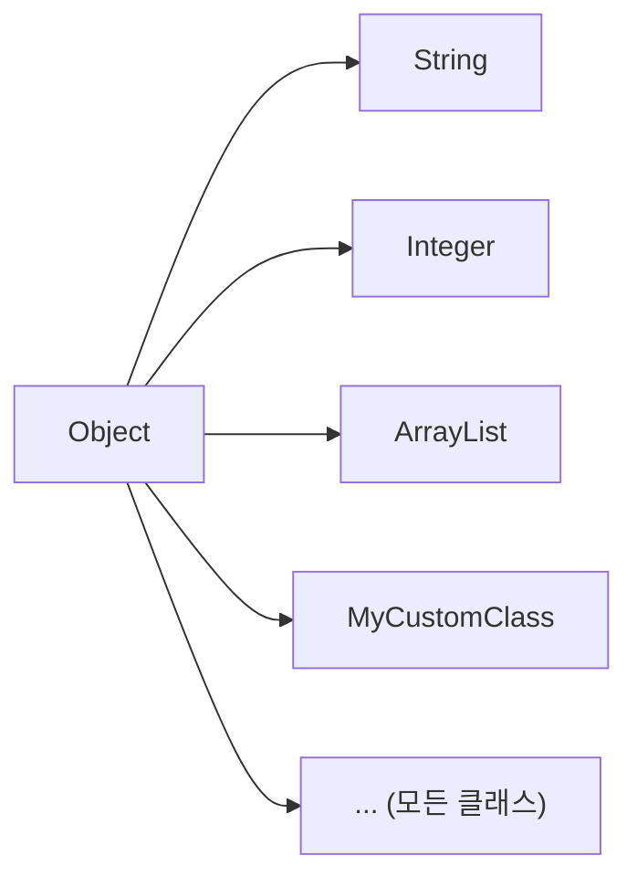
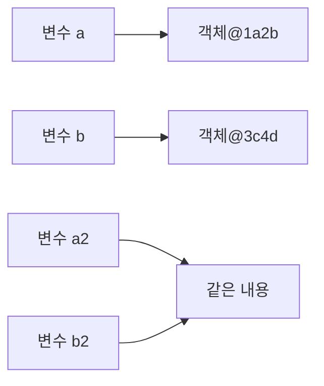
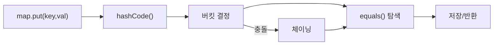
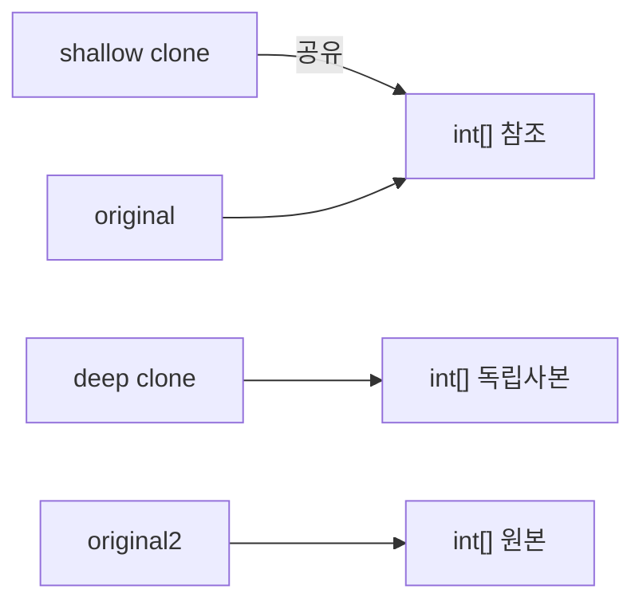
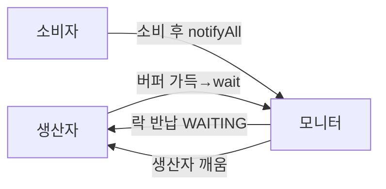
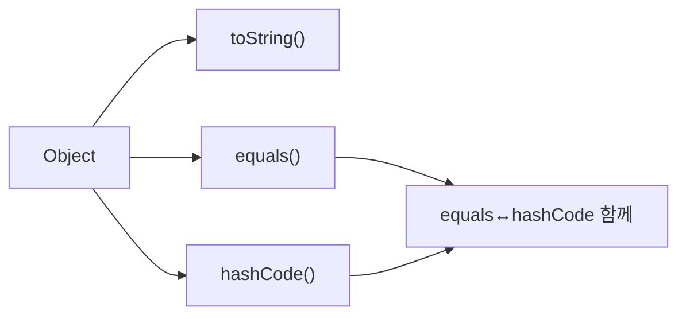

Java의 모든 클래스는 명시적으로 상속을 선언하지 않아도 `java.lang.Object`를 최상위 부모로 가집니다. Object 클래스가 제공하는 메서드들은 Java 객체 시스템의 근간을 이루며, 이를 올바르게 이해하고 오버라이딩하는 것은 Java 개발의 핵심입니다.

---

## 1. Object 클래스가 최상위 부모인 이유

### 단일 루트 계층 구조

Java는 **단일 루트 계층(Single Root Hierarchy)** 을 채택합니다. 모든 클래스가 Object를 상속하므로 다음이 보장됩니다.



```java
// 명시적 선언 없어도 동일
class Foo { }
class Foo extends Object { }  // 컴파일러가 자동으로 추가
```

### 단일 루트가 주는 이점

| 이점 | 설명 |
|------|------|
| 다형성 기반 | `Object` 타입으로 모든 객체 참조 가능 |
| 공통 동작 보장 | toString, equals, hashCode 등 기본 구현 제공 |
| 제네릭 상한 | `<T>` 의 암묵적 상한이 Object |
| 리플렉션 | `getClass()` 를 통해 런타임 타입 정보 획득 |

```java
// 모든 객체를 Object로 다룰 수 있음
Object obj = new ArrayList<>();
Object obj2 = "Hello";
Object obj3 = 42;  // 오토박싱 → Integer → Object
```

### Object의 전체 메서드 목록

```java
public class Object {
    // 객체 정보
    public final Class<?> getClass()
    public String toString()

    // 동등성 / 해시
    public boolean equals(Object obj)
    public int hashCode()

    // 복사
    protected Object clone() throws CloneNotSupportedException

    // 스레드 동기화
    public final void wait() throws InterruptedException
    public final void wait(long timeoutMillis) throws InterruptedException
    public final void wait(long timeoutMillis, int nanos) throws InterruptedException
    public final void notify()
    public final void notifyAll()

    // GC 관련 (Java 9 deprecated)
    protected void finalize() throws Throwable
}
```

---

## 2. toString()

### 기본 동작

Object의 기본 `toString()`은 다음과 같이 구현되어 있습니다.

```java
// Object.toString() 기본 구현
public String toString() {
    return getClass().getName() + "@" + Integer.toHexString(hashCode());
}
```

```java
class Point {
    int x, y;
    Point(int x, int y) { this.x = x; this.y = y; }
}

Point p = new Point(3, 4);
System.out.println(p);  // Point@1b6d3586 (쓸모없는 출력)
```

### 오버라이딩 패턴

```java
class Point {
    int x, y;

    Point(int x, int y) {
        this.x = x;
        this.y = y;
    }

    @Override
    public String toString() {
        return "Point{x=" + x + ", y=" + y + "}";
    }
}

System.out.println(new Point(3, 4));  // Point{x=3, y=4}
```

### toString()이 자동 호출되는 상황

```java
Point p = new Point(3, 4);

// 모두 toString()을 암묵적으로 호출
System.out.println(p);           // println(Object)
String s = "좌표: " + p;        // 문자열 연결
String.format("p = %s", p);     // %s 포맷
log.info("point={}", p);        // 대부분의 로거
```

### 실무 패턴: Lombok, Record

```java
// Lombok
@ToString
class Point {
    int x, y;
}

// Java 16+ Record (toString 자동 생성)
record Point(int x, int y) { }
System.out.println(new Point(3, 4));  // Point[x=3, y=4]
```

---

## 3. equals()

### 동작 원리 — 동일성(Identity) vs 동등성(Equality)

Java에서 `==` 연산자는 **메모리 주소(참조)** 를 비교합니다. 두 변수가 힙의 동일한 객체를 가리키는지 확인하는 것입니다. 반면 `equals()`는 **논리적 동등성** 을 비교합니다. 객체가 서로 다른 메모리 위치에 있더라도 "같은 것"으로 취급할 기준을 개발자가 정의할 수 있습니다.

Object의 기본 `equals()`는 `==`와 동일하게 동작합니다. String이나 Integer 등이 내용 기반 비교를 하는 것은 이미 오버라이딩을 했기 때문입니다.



```java
String a = new String("hello");
String b = new String("hello");

a == b       // false  (다른 객체)
a.equals(b)  // true   (내용 동일)
```

### Object의 기본 equals()

```java
// Object 기본 구현 — 동일성과 동일
public boolean equals(Object obj) {
    return (this == obj);
}
```

### equals() 올바른 오버라이딩 — 5가지 규칙

Java 명세가 요구하는 `equals()` 계약(contract)입니다.

#### 규칙 1: 반사성 (Reflexivity)
```java
// x.equals(x) == true
Point p = new Point(1, 2);
assert p.equals(p);  // 항상 true
```

#### 규칙 2: 대칭성 (Symmetry)
```java
// x.equals(y) == y.equals(x)
Point a = new Point(1, 2);
Point b = new Point(1, 2);
assert a.equals(b) == b.equals(a);  // 항상 동일

// 위반 예시 (잘못된 구현)
class BadPoint {
    @Override
    public boolean equals(Object obj) {
        if (obj instanceof String) return toString().equals(obj);
        // Point와 String을 비교 — 대칭성 위반!
        return super.equals(obj);
    }
}
```

#### 규칙 3: 추이성 (Transitivity)
```java
// x.equals(y) && y.equals(z) → x.equals(z)
// 상속 시 추이성 위반이 발생하기 쉬움

class ColorPoint extends Point {
    Color color;

    @Override
    public boolean equals(Object obj) {
        if (!(obj instanceof Point)) return false;
        if (!(obj instanceof ColorPoint))
            return super.equals(obj);  // color 무시 — 추이성 위반 가능
        return super.equals(obj) && color == ((ColorPoint) obj).color;
    }
}
// 해결책: 상속 대신 컴포지션 사용
```

#### 규칙 4: 일관성 (Consistency)
```java
// 객체가 변하지 않는 한 equals()는 항상 같은 결과
// 가변 상태에 의존하지 말 것
```

#### 규칙 5: null 비교
```java
// x.equals(null) == false (예외 발생 X)
Point p = new Point(1, 2);
assert !p.equals(null);  // NullPointerException 아님
```

### 올바른 equals() 구현 템플릿

```java
class Point {
    private final int x;
    private final int y;

    public Point(int x, int y) {
        this.x = x;
        this.y = y;
    }

    @Override
    public boolean equals(Object obj) {
        // 1. 자기 자신 비교 (성능 최적화)
        if (this == obj) return true;

        // 2. null 체크 + 타입 체크
        if (!(obj instanceof Point)) return false;

        // 3. 타입 캐스팅
        Point other = (Point) obj;

        // 4. 핵심 필드 비교
        return this.x == other.x && this.y == other.y;
    }
}
```

**핵심 요약:** equals를 오버라이딩할 때 instanceof 체크로 null과 타입 불일치를 한 번에 처리하고, 자기 자신과의 비교를 먼저 수행해 성능을 최적화합니다.

### Java 14+ record — equals 자동 생성

```java
record Point(int x, int y) { }
// equals(), hashCode(), toString() 자동 생성
// 모든 필드를 기준으로 동등성 비교
```

---

## 4. hashCode()

### 동작 원리 — hashCode와 HashMap의 관계

HashMap은 내부적으로 배열(버킷)과 연결 리스트/트리의 조합으로 구현됩니다. 키-값 쌍을 저장할 때 `hashCode()`로 버킷 인덱스를 결정하고, 같은 버킷에 여러 항목이 있으면 `equals()`로 정확한 항목을 찾습니다.

**equals를 오버라이딩하고 hashCode를 빠뜨리면 HashMap이 망가집니다.** equals가 true인 두 객체가 서로 다른 버킷에 들어가게 되어 같은 키로 저장했어도 찾을 수 없게 됩니다.



### hashCode() 계약

1. **일관성**: 같은 실행 내에서 반복 호출 시 같은 값
2. **equals 연동**: `a.equals(b)` → `a.hashCode() == b.hashCode()` (역은 성립 안 해도 됨)
3. **충돌 최소화**: 다른 객체는 가급적 다른 해시코드 (성능)

```java
// hashCode를 오버라이딩하지 않으면 HashMap이 망가짐
class BadPoint {
    int x, y;

    @Override
    public boolean equals(Object obj) {
        if (!(obj instanceof BadPoint)) return false;
        BadPoint o = (BadPoint) obj;
        return x == o.x && y == o.y;
    }
    // hashCode 오버라이딩 안 함!
}

Map<BadPoint, String> map = new HashMap<>();
BadPoint p1 = new BadPoint(1, 2);
map.put(p1, "hello");

BadPoint p2 = new BadPoint(1, 2);  // p1과 equals는 true
map.get(p2);  // null 반환! hashCode가 달라 다른 버킷 탐색
```

### 올바른 hashCode() 구현

```java
class Point {
    private final int x;
    private final int y;

    @Override
    public int hashCode() {
        // Java 7+: Objects.hash() 활용 (간단하지만 약간 느림)
        return Objects.hash(x, y);
    }

    // 또는 직접 구현 (성능 중시)
    @Override
    public int hashCode() {
        int result = 17;           // 임의의 홀수 소수
        result = 31 * result + x;  // 31: 소수, 비트 시프트 최적화
        result = 31 * result + y;
        return result;
    }
}
```

### 해시 코드 캐싱 (불변 객체)

```java
// 불변 객체에서 해시코드 캐싱
class ImmutablePoint {
    private final int x;
    private final int y;
    private int hashCode;  // 기본값 0

    @Override
    public int hashCode() {
        int result = hashCode;
        if (result == 0) {
            result = Objects.hash(x, y);
            hashCode = result;
        }
        return result;
    }
}
```

**핵심 요약:** `equals()`를 오버라이딩하면 반드시 `hashCode()`도 함께 오버라이딩해야 합니다. 이 계약을 어기면 HashMap, HashSet 등 해시 기반 컬렉션에서 예측 불가능한 동작이 발생합니다.

---

## 5. clone()

### 동작 원리 — 얕은 복사 vs 깊은 복사

`clone()`은 JVM 네이티브 메서드로, 객체의 메모리를 그대로 복사합니다. 기본 동작은 **얕은 복사(Shallow Copy)** 입니다. 기본형 필드는 값 자체가 복사되지만, 참조형 필드는 참조(주소)만 복사됩니다. 즉 원본과 복사본이 같은 객체를 가리키게 됩니다.

배열이나 컬렉션처럼 내부 상태가 변할 수 있는 필드가 있다면 **깊은 복사(Deep Copy)** 를 직접 구현해야 합니다.



```java
class ShallowExample implements Cloneable {
    int[] data;

    ShallowExample(int[] data) {
        this.data = data;
    }

    @Override
    public ShallowExample clone() {
        try {
            return (ShallowExample) super.clone();  // 얕은 복사
        } catch (CloneNotSupportedException e) {
            throw new AssertionError();
        }
    }
}

ShallowExample a = new ShallowExample(new int[]{1, 2, 3});
ShallowExample b = a.clone();
b.data[0] = 99;
System.out.println(a.data[0]);  // 99! — 같은 배열을 참조
```

```java
class DeepExample implements Cloneable {
    int[] data;

    @Override
    public DeepExample clone() {
        try {
            DeepExample clone = (DeepExample) super.clone();
            clone.data = data.clone();  // 배열도 복사 — 깊은 복사
            return clone;
        } catch (CloneNotSupportedException e) {
            throw new AssertionError();
        }
    }
}
```

### Cloneable의 문제점과 대안

```java
// clone()의 문제점
// 1. CloneNotSupportedException — checked 예외로 사용 불편
// 2. 얕은 복사 기본값 — 실수하기 쉬움
// 3. 생성자 없이 객체 생성 — 불변 보장 어려움
// 4. final 필드와 충돌

// 권장 대안 1: 복사 생성자(Copy Constructor)
class Point {
    int x, y;
    Point(int x, int y) { this.x = x; this.y = y; }

    // 복사 생성자
    Point(Point other) {
        this.x = other.x;
        this.y = other.y;
    }
}

// 권장 대안 2: 정적 팩토리 메서드
class Point {
    static Point copyOf(Point other) {
        return new Point(other.x, other.y);
    }
}

// 권장 대안 3: 방어적 복사(Defensive Copy)
class Period {
    private final Date start;
    private final Date end;

    // 입력 방어
    public Period(Date start, Date end) {
        this.start = new Date(start.getTime());  // 복사본 저장
        this.end   = new Date(end.getTime());
    }

    // 출력 방어
    public Date getStart() {
        return new Date(start.getTime());  // 복사본 반환
    }
}
```

---

## 6. getClass()

```java
public final Class<?> getClass()
```

런타임에 객체의 실제 타입을 반환합니다. `final`이므로 오버라이딩 불가.

```java
Object obj = new ArrayList<String>();
Class<?> cls = obj.getClass();

System.out.println(cls.getName());        // java.util.ArrayList
System.out.println(cls.getSimpleName()); // ArrayList
System.out.println(cls.getSuperclass()); // class java.util.AbstractList

// instanceof vs getClass()
obj instanceof List      // true (다형성 고려)
obj.getClass() == List.class  // false! (정확한 타입만)
obj.getClass() == ArrayList.class  // true

// 리플렉션 활용
Method[] methods = cls.getDeclaredMethods();
Field[]  fields  = cls.getDeclaredFields();
```

### 타입 비교 시 주의

```java
// equals에서 타입 비교: instanceof vs getClass()

// instanceof — 하위 클래스 허용 (리스코프 치환 원칙 친화)
if (obj instanceof Point) { ... }

// getClass() — 정확히 같은 타입만 (대칭성 보장 쉬움)
if (obj.getClass() == getClass()) { ... }
```

---

## 7. finalize()

### Java 9에서 deprecated, Java 18에서 제거 예정

```java
// Object.finalize() — 절대 사용하지 말 것
@Deprecated(since="9")
protected void finalize() throws Throwable { }
```

### finalize()의 문제점

`finalize()`는 GC가 객체를 수거할 때 호출하도록 설계되었으나 실제로는 심각한 문제를 내포합니다.

- **GC 호출 시점 보장 없음**: 언제 실행될지 전혀 알 수 없고 실행 자체가 보장되지 않습니다.
- **성능 저하**: GC가 finalize 대상 객체를 별도 큐에서 관리해 GC 사이클이 길어집니다.
- **예외 무시**: `finalize()` 내부에서 발생한 예외가 조용히 사라집니다.
- **보안 취약점**: finalize 공격(finalizer attack)을 통해 불완전하게 초기화된 객체가 외부에 노출될 수 있습니다.

### 올바른 대안: AutoCloseable + try-with-resources

```java
// 리소스 해제는 AutoCloseable로
class Resource implements AutoCloseable {
    public Resource() {
        System.out.println("리소스 열림");
    }

    @Override
    public void close() {
        System.out.println("리소스 닫힘");
    }
}

// try-with-resources로 자동 close()
try (Resource r = new Resource()) {
    // 사용
}  // 자동으로 r.close() 호출
```

---

## 8. wait() / notify() / notifyAll()

### 동작 원리 — 모니터 락과 대기

`wait()`, `notify()`, `notifyAll()`은 Java의 내장 모니터(Monitor) 메커니즘을 활용합니다. `synchronized` 블록으로 진입할 때 스레드는 해당 객체의 모니터 락을 획득하고, `wait()`을 호출하면 **락을 반납하고** WAITING 상태로 전환됩니다. 락을 반납하기 때문에 다른 스레드가 `synchronized` 블록에 진입할 수 있습니다. `notify()`를 받으면 다시 락을 경쟁해 획득한 후 실행을 재개합니다.



```java
class SharedBuffer {
    private final Queue<Integer> buffer = new LinkedList<>();
    private final int MAX_SIZE = 10;

    // 생산자
    public synchronized void produce(int value) throws InterruptedException {
        while (buffer.size() == MAX_SIZE) {
            wait();  // 버퍼 가득 참 → 대기
        }
        buffer.add(value);
        notifyAll();  // 소비자 깨우기
    }

    // 소비자
    public synchronized int consume() throws InterruptedException {
        while (buffer.isEmpty()) {
            wait();  // 버퍼 비어 있음 → 대기
        }
        int value = buffer.poll();
        notifyAll();  // 생산자 깨우기
        return value;
    }
}
```

`notify()`는 대기 중인 스레드 1개를 임의로 깨우고, `notifyAll()`은 모든 대기 스레드를 깨웁니다. 어떤 스레드가 깨어날지 보장이 없으므로 실무에서는 `notifyAll()`을 우선 사용합니다.

> 실무에서는 `java.util.concurrent` 패키지의 `Lock`, `Condition`, `BlockingQueue`를 우선 사용합니다.

---

## 9. 비유와 극한 시나리오

### 비유: 도서관 대출 카드

Object의 `equals()`와 `hashCode()`는 도서관 대출 시스템과 같습니다. `hashCode()`는 책장 번호(버킷)를 결정하고, `equals()`는 그 책장에서 정확한 책을 찾습니다. 책장 번호(`hashCode`)가 다르면 아무리 같은 책이어도 찾을 수 없습니다.

### 극한 시나리오: equals 오버라이딩 후 hashCode 미구현

```java
// 수백만 건의 데이터를 HashMap에 저장하는 서비스
class UserId {
    final String value;
    UserId(String value) { this.value = value; }

    @Override
    public boolean equals(Object o) {
        if (!(o instanceof UserId)) return false;
        return value.equals(((UserId) o).value);
    }
    // hashCode 오버라이딩 없음!
}

Map<UserId, UserProfile> cache = new HashMap<>();
// 100만 사용자 프로필 캐싱
for (User u : users) {
    cache.put(new UserId(u.id), u.profile);
}

// 조회 시 매번 null 반환
UserProfile profile = cache.get(new UserId("user123")); // null!
// → 100만 건 전부 다시 DB 조회 → 서비스 장애
```

### 실무 실수

**실수 1: equals와 hashCode를 따로 관리하다 불일치 발생**

코드 리뷰 없이 equals에 새 필드를 추가하면서 hashCode를 갱신하지 않는 경우입니다. HashSet에 넣은 객체가 사라지거나 중복 저장되는 현상이 발생합니다.

```java
// 원래 코드
class Order {
    String id;
    // equals: id만 비교
    // hashCode: id 기반
}

// 리팩토링 중 실수
class Order {
    String id;
    String customerId;  // 추가
    // equals에 customerId 추가했지만 hashCode는 그대로!
    // → Set에서 중복 체크 실패
}
```

**실수 2: 가변 객체를 HashMap 키로 사용**

```java
class MutableKey {
    int value;
    // equals, hashCode 모두 value 기반
}

MutableKey key = new MutableKey();
key.value = 1;
map.put(key, "hello");

key.value = 2;  // 키 변경!
map.get(key);   // null — hashCode가 바뀌어 다른 버킷 탐색
```

---

## 10. 전체 요약



---
## 면접 포인트

### Q1. equals()와 hashCode()를 함께 오버라이딩해야 하는 이유는?
HashMap/HashSet의 동작 원리 때문입니다. HashMap은 키를 버킷에 배치할 때 `hashCode()`로 버킷 인덱스를 계산하고, 같은 버킷 내 기존 키와 비교할 때 `equals()`를 사용합니다. `equals()`만 오버라이딩하면 논리적으로 같은 두 객체가 다른 hashCode를 가져 다른 버킷에 배치됩니다. `map.put(key1, value); map.get(key2)`에서 key1.equals(key2)가 true여도 null을 반환합니다. Java 규약: equals()가 true이면 hashCode()는 같아야 합니다.

### Q2. clone()이 위험한 이유와 대안은?
`Object.clone()`은 얕은 복사(shallow copy)를 수행합니다. 필드가 참조 타입이면 참조만 복사되어 원본과 복사본이 같은 객체를 공유합니다. `Cloneable` 마커 인터페이스는 `clone()` 시그니처를 포함하지 않아 컴파일 타임 검증이 없습니다. Effective Java는 clone() 사용을 강하게 반대합니다. 대안: ① 복사 생성자 `new User(originalUser)` ② 복사 팩토리 메서드 `User.copyOf(original)` ③ 직렬화 후 역직렬화. 이 방식들이 더 명확하고 안전합니다.

### Q3. toString()을 오버라이딩하지 않으면 어떤 문제가 생기는가?
기본 `toString()`은 `클래스명@해시코드(16진수)` 형태입니다. 로그에 `Order@1a2b3c4d`가 출력되면 디버깅이 불가합니다. 어떤 주문인지, 어떤 상태인지 알 수 없습니다. 특히 예외 메시지에 객체를 포함할 때 의미 없는 해시 코드만 남습니다. 운영 환경 장애 분석 시 로그에서 상태를 파악할 수 없어 추가 DB 조회가 필요합니다. 모든 도메인 객체는 `@ToString` (Lombok) 또는 수동 오버라이딩으로 의미 있는 문자열을 제공해야 합니다.

### Q4. wait()/notify()와 현대적 동기화 도구의 차이는?
`wait()/notify()`는 Object의 메서드로 synchronized 블록 내에서만 사용 가능합니다. 구현이 복잡하고 `notify()`가 어떤 스레드를 깨울지 보장이 없습니다. 현대 대안: `ReentrantLock` + `Condition` — 특정 조건에 대한 대기/신호 분리 가능. `BlockingQueue` — 생산자-소비자 패턴의 표준. `CountDownLatch` — N개 작업 완료 대기. `Semaphore` — 리소스 접근 제어. `CyclicBarrier` — 여러 스레드가 동시에 특정 지점 도달 대기. 실무에서 `wait()/notify()` 직접 사용은 거의 없습니다.

### Q5. Java의 equals() 5가지 규약을 설명하라.
① 반사성(Reflexive): `x.equals(x)` = true. ② 대칭성(Symmetric): `x.equals(y)` = true이면 `y.equals(x)` = true. ③ 추이성(Transitive): `x.equals(y)`, `y.equals(z)` = true이면 `x.equals(z)` = true. ④ 일관성(Consistent): 객체가 변경되지 않으면 반복 호출 시 항상 같은 결과. ⑤ null 비교: `x.equals(null)` = false (NullPointerException 던지지 않음). 상속 관계에서 equals()를 확장하면 대칭성이나 추이성을 깨기 쉽습니다. Effective Java 권장: 값 기반 동등성이 필요하면 상속보다 컴포지션을 사용합니다.

### Q1. equals와 hashCode를 같이 재정의해야 하는 이유는?
A. Java 명세는 equals()가 true인 두 객체는 동일한 hashCode()를 가져야 한다고 규정한다. hashCode만 재정의하지 않으면 HashMap/HashSet에서 동일 객체가 다른 버킷에 들어가 contains(), get() 조회가 실패한다. 반대로 equals만 재정의하면 동일 내용 객체가 컬렉션에 중복 저장된다.

### Q2. == 연산자와 equals()의 차이점은?
A. ==는 참조(주소)를 비교하고, equals()는 객체의 논리적 동등성을 비교한다. String의 경우 `"hello" == "hello"`는 상수 풀에서 같은 객체를 가리킬 때 true지만, `new String("hello") == new String("hello")`는 false다. 문자열 비교는 항상 equals()를 사용해야 한다.

### Q3. Object.clone()을 사용할 때 주의해야 할 점은?
A. clone()은 얕은 복사(shallow copy)만 수행한다. 객체가 참조 타입 필드를 가지면, 복사본과 원본이 같은 참조를 공유한다. 깊은 복사가 필요하면 clone() 내에서 참조 필드도 재귀적으로 복사하거나, 복사 생성자나 정적 팩터리 메서드를 대안으로 사용해야 한다.

### Q4. finalize() 메서드가 권장되지 않는 이유는?
A. finalize()는 GC가 호출 시점을 보장하지 않아 자원 해제가 언제 일어날지 예측 불가하다. 심각한 경우 아예 호출되지 않을 수도 있다. Java 9부터 deprecated 됐으며, 자원 해제는 try-with-resources와 AutoCloseable로 처리해야 한다.

### Q5. Object.wait()와 Thread.sleep()의 차이점은?
A. sleep()은 단순히 현재 스레드를 지정 시간 동안 일시 정지하며 락을 해제하지 않는다. wait()는 synchronized 블록 안에서만 호출 가능하며, 호출 시 락을 해제하고 다른 스레드가 notify()를 호출할 때까지 대기한다. 스레드 간 협력에는 wait/notify, 단순 지연에는 sleep을 사용한다.
