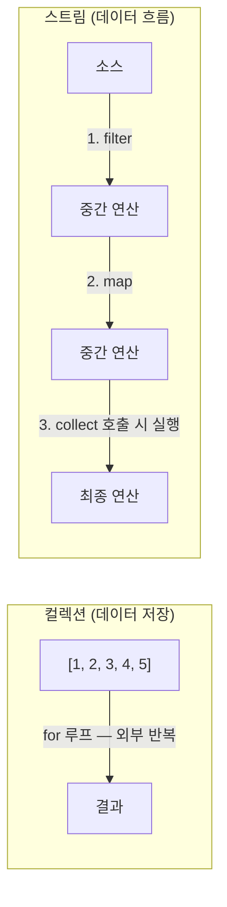
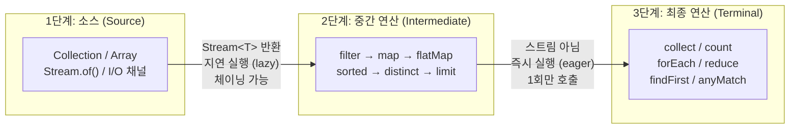
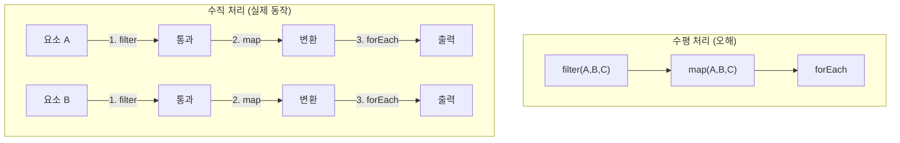
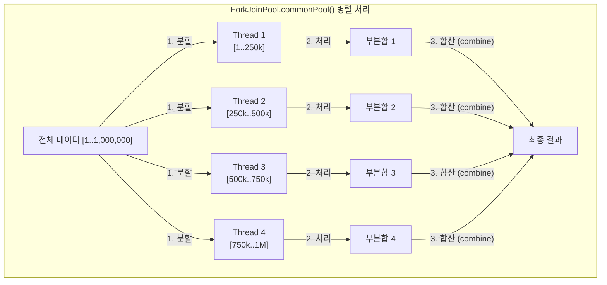

Java 8의 Stream API는 컬렉션 데이터를 선언적으로 처리하는 강력한 도구입니다. 단순히 for 루프를 대체하는 것이 아니라, 지연 연산(lazy evaluation), 병렬 처리, 함수 합성을 통해 데이터 파이프라인을 구성하는 새로운 패러다임입니다.

> **비유로 이해하기**: 스트림은 공장의 컨베이어 벨트와 같습니다. 원재료(데이터)를 벨트에 올려놓으면 여러 가공 단계(중간 연산)를 차례로 거쳐 최종 제품(결과)으로 나옵니다. 컨베이어 벨트 자체는 제품을 보관하지 않고 흘려보낼 뿐입니다. 중요한 점은, 첫 번째 제품이 모든 단계를 통과한 뒤 두 번째 제품이 투입되는 것이 아니라, **모든 제품이 동시에 각자의 단계를 처리**합니다(수직 실행).

## 1. 스트림이란? 컬렉션과의 차이

### 스트림의 정의

스트림(Stream)은 **데이터의 흐름**입니다. 컬렉션과 달리 데이터를 저장하지 않고, 소스(source)로부터 데이터를 끌어와 연산 파이프라인을 통과시킵니다.



스트림의 세 가지 핵심 특성을 이해해야 합니다. 첫째, 스트림은 데이터를 저장하지 않습니다. filter나 map은 새 스트림을 반환할 뿐 어디에도 중간 결과를 저장하지 않습니다. 둘째, 지연 연산(lazy evaluation)으로 동작합니다. `filter()`를 호출해도 그 즉시 필터링이 일어나지 않고, `collect()`처럼 최종 연산이 호출될 때 비로소 파이프라인 전체가 실행됩니다. 셋째, 1회용입니다. 한 번 소비된 스트림은 재사용할 수 없습니다.

### 컬렉션 vs 스트림 비교

| 특성 | 컬렉션 | 스트림 |
|------|--------|--------|
| 데이터 저장 | 저장함 | 저장 안 함 |
| 반복 방식 | 외부 반복 (for-each) | 내부 반복 (라이브러리가 처리) |
| 재사용 | 여러 번 가능 | 1회만 (소비 후 재사용 불가) |
| 연산 시점 | 즉시 | 지연 (최종 연산 시) |
| 병렬화 | 직접 구현 | parallelStream()으로 간단히 |

```java
// 컬렉션 방식 — 외부 반복, 즉시 계산
List<String> names = Arrays.asList("Alice", "Bob", "Charlie", "David");
List<String> result = new ArrayList<>();
for (String name : names) {
    if (name.length() > 3) {
        result.add(name.toUpperCase());
    }
}

// 스트림 방식 — 내부 반복, 지연 계산, 선언적
List<String> result2 = names.stream()
    .filter(name -> name.length() > 3)
    .map(String::toUpperCase)
    .collect(Collectors.toList());
```

---

## 2. 스트림 파이프라인

스트림 파이프라인은 세 부분으로 구성됩니다.



중간 연산과 최종 연산의 차이는 핵심입니다. 중간 연산은 항상 `Stream<T>`를 반환하므로 계속 체이닝할 수 있고, 최종 연산이 호출되기 전까지는 아무것도 실행되지 않습니다. 반면 최종 연산은 스트림이 아닌 실제 결과(List, int, void 등)를 반환하며, 이 시점에 파이프라인 전체가 실행됩니다. 최종 연산이 없으면 파이프라인에 아무리 많은 중간 연산을 걸어도 실행 자체가 되지 않습니다.

```java
// 파이프라인 예시
long count = Stream.of("apple", "banana", "cherry", "date", "elderberry")
    .filter(s -> s.length() > 4)       // 중간 연산 1
    .map(String::toUpperCase)           // 중간 연산 2
    .sorted()                           // 중간 연산 3
    .peek(System.out::println)          // 중간 연산 4 (디버깅용)
    .count();                           // 최종 연산 → 여기서 실제 실행!
```

---

## 3. 지연 연산 (Lazy Evaluation) 동작 원리

스트림의 중간 연산은 **최종 연산이 호출되기 전까지 실행되지 않습니다.** 이것이 지연 연산(lazy evaluation)입니다.

### 지연 연산 확인

```java
// 이 코드는 아무것도 출력하지 않음
Stream<String> stream = Stream.of("A", "B", "C")
    .filter(s -> {
        System.out.println("filter: " + s);
        return true;
    })
    .map(s -> {
        System.out.println("map: " + s);
        return s.toLowerCase();
    });
// 최종 연산 없음 → 위의 filter, map 람다 실행 안 됨

// 최종 연산 호출 시 비로소 실행
stream.forEach(System.out::println);
// 출력:
// filter: A
// map: A
// a
// filter: B
// map: B
// b
// filter: C
// map: C
// c
```

### 수직 실행 (Vertical Processing)

중요한 점은 스트림이 요소를 하나씩 파이프라인 전체를 통과시키는 **수직 실행** 방식을 사용한다는 것입니다.

많은 개발자가 "filter가 모든 요소를 처리한 다음, map이 모든 요소를 처리한다"고 오해합니다. 실제 동작은 그 반대로, 요소 하나가 파이프라인의 끝까지 이동한 뒤 다음 요소가 처리됩니다. 이 방식 덕분에 `limit(1)`을 붙이면 첫 번째 요소가 최종 연산을 통과하는 즉시 나머지 요소의 처리가 완전히 중단됩니다.



```java
// limit과 함께 단락(short-circuit) 최적화
long count = Stream.iterate(1, n -> n + 1)  // 무한 스트림!
    .filter(n -> n % 2 == 0)
    .limit(5)     // 5개만 소비하면 스트림 종료
    .count();     // 5
// limit 덕분에 무한 스트림도 안전하게 처리
```

---

## 4. 스트림 생성 방법

### 컬렉션에서

```java
List<String> list = Arrays.asList("a", "b", "c");
Stream<String> stream1 = list.stream();           // 순차 스트림
Stream<String> stream2 = list.parallelStream();   // 병렬 스트림

Set<Integer> set = new HashSet<>(Arrays.asList(1, 2, 3));
Stream<Integer> stream3 = set.stream();

Map<String, Integer> map = Map.of("a", 1, "b", 2);
Stream<Map.Entry<String, Integer>> entryStream = map.entrySet().stream();
```

### 배열에서

```java
String[] arr = {"x", "y", "z"};
Stream<String> stream = Arrays.stream(arr);
Stream<String> partial = Arrays.stream(arr, 1, 3);  // 부분 배열 [y, z]

int[] intArr = {1, 2, 3, 4, 5};
IntStream intStream = Arrays.stream(intArr);  // 기본형 스트림
```

### Stream 팩토리 메서드

```java
// Stream.of
Stream<String> of = Stream.of("a", "b", "c");
Stream<String> single = Stream.of("only");
Stream<String> empty = Stream.empty();

// Stream.iterate — 시드값과 함수로 무한 스트림 생성
Stream<Integer> naturals = Stream.iterate(1, n -> n + 1);  // 1, 2, 3, ...
Stream<Integer> evens = Stream.iterate(0, n -> n + 2);     // 0, 2, 4, ...

// Java 9 — 종료 조건 추가
Stream<Integer> under100 = Stream.iterate(1, n -> n < 100, n -> n + 1);

// Stream.generate — Supplier로 무한 스트림 생성
Stream<Double> randoms = Stream.generate(Math::random);
Stream<String> hellos  = Stream.generate(() -> "hello");
Stream<UUID> uuids     = Stream.generate(UUID::randomUUID);
```

### 숫자 범위 (기본형 스트림)

```java
// IntStream.range — 끝값 미포함
IntStream range = IntStream.range(1, 6);       // 1, 2, 3, 4, 5

// IntStream.rangeClosed — 끝값 포함
IntStream rangeClosed = IntStream.rangeClosed(1, 5);  // 1, 2, 3, 4, 5

// LongStream, DoubleStream도 동일
LongStream longRange = LongStream.range(1L, 1000000000L);
```

### 기타 소스

```java
// 문자열의 각 문자
IntStream chars = "hello".chars();  // IntStream (char의 int 값)
chars.mapToObj(c -> String.valueOf((char) c)).forEach(System.out::println);

// 파일의 각 줄 (try-with-resources 권장)
try (Stream<String> lines = Files.lines(Path.of("file.txt"))) {
    lines.filter(line -> !line.isEmpty()).forEach(System.out::println);
}

// 정규식 분리
Pattern.compile(",").splitAsStream("a,b,c,d")
    .map(String::trim)
    .forEach(System.out::println);
```

---

## 5. 중간 연산 상세

### filter — 조건에 맞는 요소만 통과

```java
// Predicate<T>를 받음
List<Integer> numbers = Arrays.asList(1, 2, 3, 4, 5, 6, 7, 8, 9, 10);

List<Integer> evens = numbers.stream()
    .filter(n -> n % 2 == 0)
    .collect(Collectors.toList());  // [2, 4, 6, 8, 10]

// 복합 조건
List<String> names = Arrays.asList("Alice", "Bob", "Charlie", "Dave");
List<String> filtered = names.stream()
    .filter(s -> s.length() > 3 && s.startsWith("C"))
    .collect(Collectors.toList());  // ["Charlie"]
```

### map — 요소를 다른 타입/값으로 변환

```java
// Function<T, R>을 받음
List<String> words = Arrays.asList("hello", "world");

List<Integer> lengths = words.stream()
    .map(String::length)
    .collect(Collectors.toList());  // [5, 5]

List<String> upper = words.stream()
    .map(String::toUpperCase)
    .collect(Collectors.toList());  // ["HELLO", "WORLD"]

// 객체 변환
record Person(String name, int age) {}
List<Person> people = List.of(new Person("Alice", 30), new Person("Bob", 25));

List<String> personNames = people.stream()
    .map(Person::name)
    .collect(Collectors.toList());  // ["Alice", "Bob"]
```

### flatMap — 중첩 구조를 평탄화

```java
// Function<T, Stream<R>>을 받음 — 각 요소를 스트림으로 변환 후 하나로 합침
List<List<Integer>> nested = Arrays.asList(
    Arrays.asList(1, 2, 3),
    Arrays.asList(4, 5, 6),
    Arrays.asList(7, 8, 9)
);

List<Integer> flat = nested.stream()
    .flatMap(Collection::stream)
    .collect(Collectors.toList());  // [1, 2, 3, 4, 5, 6, 7, 8, 9]

// 문장에서 단어 추출
List<String> sentences = Arrays.asList("Hello World", "Java Stream API");
List<String> words = sentences.stream()
    .flatMap(s -> Arrays.stream(s.split(" ")))
    .collect(Collectors.toList());
// ["Hello", "World", "Java", "Stream", "API"]

// Optional과 flatMap
List<Optional<String>> optionals = Arrays.asList(
    Optional.of("a"), Optional.empty(), Optional.of("b")
);
List<String> values = optionals.stream()
    .flatMap(Optional::stream)  // Java 9+: Optional.stream()
    .collect(Collectors.toList());  // ["a", "b"]
```

### distinct, sorted, peek, limit, skip

```java
List<Integer> nums = Arrays.asList(1, 2, 2, 3, 3, 3, 4, 5);

// distinct — 중복 제거 (equals/hashCode 기반)
List<Integer> unique = nums.stream()
    .distinct()
    .collect(Collectors.toList());  // [1, 2, 3, 4, 5]

// sorted — 정렬
List<Integer> sorted = nums.stream()
    .distinct()
    .sorted()
    .collect(Collectors.toList());  // 자연 순서

List<String> sortedNames = names.stream()
    .sorted(Comparator.comparingInt(String::length).reversed())
    .collect(Collectors.toList());  // 길이 내림차순

// peek — 중간 확인 (디버깅 전용, 부수효과 주의)
List<Integer> result = nums.stream()
    .filter(n -> n % 2 == 0)
    .peek(n -> System.out.println("After filter: " + n))
    .map(n -> n * n)
    .peek(n -> System.out.println("After map: " + n))
    .collect(Collectors.toList());

// limit — 앞에서 n개
List<Integer> first3 = nums.stream().limit(3).collect(Collectors.toList());  // [1, 2, 2]

// skip — 앞에서 n개 건너뜀
List<Integer> after3 = nums.stream().skip(3).collect(Collectors.toList());   // [3, 3, 3, 4, 5]

// limit + skip으로 페이지네이션
int page = 2, pageSize = 3;
List<Integer> page2 = nums.stream()
    .skip((long)(page - 1) * pageSize)
    .limit(pageSize)
    .collect(Collectors.toList());
```

### mapToInt/Long/Double — 기본형 스트림으로 변환

```java
List<String> words2 = Arrays.asList("apple", "banana", "cherry");

// Stream<String> → IntStream (박싱 없이 int 처리)
IntStream lengths = words2.stream().mapToInt(String::length);

// 기본형 스트림의 집계 연산
int sum     = lengths.sum();
OptionalDouble avg = words2.stream().mapToInt(String::length).average();
OptionalInt max    = words2.stream().mapToInt(String::length).max();

// boxed() — 기본형 → 박싱 타입 스트림으로 변환
Stream<Integer> boxed = IntStream.range(1, 5).boxed();

// asLongStream, asDoubleStream
LongStream longStream = IntStream.range(1, 5).asLongStream();
```

---

## 6. 최종 연산 상세

### forEach, count

```java
List<String> names = Arrays.asList("Alice", "Bob", "Charlie");

// forEach — 각 요소에 Consumer 적용
names.stream().forEach(System.out::println);

// forEachOrdered — 병렬 스트림에서도 순서 유지
names.parallelStream().forEachOrdered(System.out::println);

// count — 요소 수 반환
long count = names.stream().filter(s -> s.length() > 3).count();  // 2
```

### collect

가장 유연하고 강력한 최종 연산입니다. Collector를 받아 결과를 수집합니다.

```java
// 기본 수집
List<String> list  = stream.collect(Collectors.toList());
Set<String>  set   = stream.collect(Collectors.toSet());
String joined      = stream.collect(Collectors.joining(", ", "[", "]"));

// 상세한 toMap
Map<String, Integer> nameLengthMap = names.stream()
    .collect(Collectors.toMap(
        s -> s,           // 키 매퍼
        String::length,   // 값 매퍼
        (a, b) -> a       // 충돌 시 병합 함수 (선택)
    ));
```

### reduce — 누적 연산

```java
List<Integer> numbers = Arrays.asList(1, 2, 3, 4, 5);

// reduce(identity, BinaryOperator) — 항등원부터 시작
int sum = numbers.stream().reduce(0, Integer::sum);   // 15
int product = numbers.stream().reduce(1, (a, b) -> a * b);  // 120

// reduce(BinaryOperator) — Optional 반환 (빈 스트림 대비)
Optional<Integer> max = numbers.stream().reduce(Integer::max);
max.ifPresent(System.out::println);  // 5

// reduce(identity, BiFunction, BinaryOperator) — 병렬 스트림에서 타입 변환
// 아이덴티티 값, 누적 함수, 결합 함수
int sumOfLengths = names.stream()
    .reduce(0, (acc, s) -> acc + s.length(), Integer::sum);
```

### findFirst, findAny, anyMatch, allMatch, noneMatch

이 연산들은 **단락(short-circuit)** 연산입니다 — 조건을 만족하는 즉시 나머지 요소를 처리하지 않습니다.

```java
List<Integer> numbers = Arrays.asList(1, 2, 3, 4, 5);

// find — Optional 반환
Optional<Integer> first = numbers.stream().filter(n -> n > 3).findFirst();  // Optional[4]
Optional<Integer> any   = numbers.parallelStream().filter(n -> n > 3).findAny();  // 순서 보장 안 됨

// match — boolean 반환
boolean anyEven   = numbers.stream().anyMatch(n -> n % 2 == 0);   // true
boolean allPositive = numbers.stream().allMatch(n -> n > 0);      // true
boolean noneNeg   = numbers.stream().noneMatch(n -> n < 0);       // true

// 빈 스트림에서의 동작
boolean emptyAny = Stream.<Integer>empty().anyMatch(n -> true);    // false
boolean emptyAll = Stream.<Integer>empty().allMatch(n -> false);   // true (vacuously true)
boolean emptyNone = Stream.<Integer>empty().noneMatch(n -> true);  // true
```

### min, max (기본형 스트림의 sum, average)

```java
List<String> words = Arrays.asList("apple", "banana", "cherry");

// 객체 스트림 — Comparator 필요
Optional<String> longest  = words.stream().max(Comparator.comparingInt(String::length));
Optional<String> shortest = words.stream().min(Comparator.comparingInt(String::length));

// 기본형 스트림 — 직접 사용
int[] arr = {3, 1, 4, 1, 5, 9, 2, 6};
OptionalInt max = Arrays.stream(arr).max();       // OptionalInt[9]
OptionalInt min = Arrays.stream(arr).min();       // OptionalInt[1]
int sum          = Arrays.stream(arr).sum();       // 31
OptionalDouble avg = Arrays.stream(arr).average(); // OptionalDouble[3.875]

// IntSummaryStatistics — 한 번에 여러 통계
IntSummaryStatistics stats = Arrays.stream(arr).summaryStatistics();
System.out.println(stats.getMax());    // 9
System.out.println(stats.getMin());    // 1
System.out.println(stats.getSum());    // 31
System.out.println(stats.getAverage()); // 3.875
System.out.println(stats.getCount());  // 8
```

---

## 7. Collectors 딥다이브

### 기본 수집

```java
Stream<String> stream = Stream.of("a", "b", "c", "b", "a");

// toList — Java 16+에서는 Stream.toList()도 가능 (불변)
List<String> list = stream.collect(Collectors.toList());

// toUnmodifiableList — 불변 리스트 (Java 10+)
List<String> unmodifiable = Stream.of("a", "b").collect(Collectors.toUnmodifiableList());

// toSet
Set<String> set = Stream.of("a", "b", "c", "b").collect(Collectors.toSet());

// toMap
Map<String, Integer> map = Stream.of("apple", "banana", "cherry")
    .collect(Collectors.toMap(
        s -> s,         // 키
        String::length  // 값
    ));

// 키 충돌 처리
Map<Integer, String> lengthToName = Stream.of("apple", "banana", "cherry", "date")
    .collect(Collectors.toMap(
        String::length,
        s -> s,
        (existing, newVal) -> existing + "," + newVal  // 충돌 시 합치기
    ));

// 특정 Map 구현체 지정
TreeMap<String, Integer> sorted = Stream.of("c", "a", "b")
    .collect(Collectors.toMap(s -> s, String::length, (a, b) -> a, TreeMap::new));
```

### joining

```java
List<String> words = Arrays.asList("Java", "Stream", "API");

String simple    = words.stream().collect(Collectors.joining());           // "JavaStreamAPI"
String delimited = words.stream().collect(Collectors.joining(", "));       // "Java, Stream, API"
String decorated = words.stream().collect(Collectors.joining(", ", "[", "]")); // "[Java, Stream, API]"
```

### counting, summingInt, averagingInt

```java
List<String> words = Arrays.asList("apple", "banana", "cherry");

long count   = words.stream().collect(Collectors.counting());            // 3
int totalLen = words.stream().collect(Collectors.summingInt(String::length)); // 18
double avgLen = words.stream().collect(Collectors.averagingInt(String::length)); // 6.0
IntSummaryStatistics stats = words.stream()
    .collect(Collectors.summarizingInt(String::length));
```

### groupingBy — 그룹화

```java
List<String> words = Arrays.asList("apple", "banana", "cherry", "avocado", "blueberry");

// 기본 — 첫 글자로 그룹화
Map<Character, List<String>> byFirstChar = words.stream()
    .collect(Collectors.groupingBy(s -> s.charAt(0)));
// {a=[apple, avocado], b=[banana, blueberry], c=[cherry]}

// 다운스트림 Collector 지정
Map<Character, Long> countByFirstChar = words.stream()
    .collect(Collectors.groupingBy(s -> s.charAt(0), Collectors.counting()));
// {a=2, b=2, c=1}

Map<Character, Integer> sumLengthByChar = words.stream()
    .collect(Collectors.groupingBy(
        s -> s.charAt(0),
        Collectors.summingInt(String::length)
    ));

// 다단계 그룹화
record Person(String name, String city, int age) {}
List<Person> people = List.of(
    new Person("Alice", "Seoul", 30),
    new Person("Bob", "Seoul", 25),
    new Person("Charlie", "Busan", 35)
);

Map<String, Map<Integer, List<Person>>> grouped = people.stream()
    .collect(Collectors.groupingBy(
        Person::city,
        Collectors.groupingBy(p -> p.age() / 10 * 10)  // 연령대
    ));

// 그룹화 후 변환
Map<String, List<String>> namesByCity = people.stream()
    .collect(Collectors.groupingBy(
        Person::city,
        Collectors.mapping(Person::name, Collectors.toList())
    ));
```

### partitioningBy — 이분 분류

```java
List<Integer> numbers = IntStream.rangeClosed(1, 10).boxed().collect(Collectors.toList());

// 짝수/홀수로 파티션
Map<Boolean, List<Integer>> partitioned = numbers.stream()
    .collect(Collectors.partitioningBy(n -> n % 2 == 0));
// {false=[1, 3, 5, 7, 9], true=[2, 4, 6, 8, 10]}

// 다운스트림 Collector 사용
Map<Boolean, Long> countPartitioned = numbers.stream()
    .collect(Collectors.partitioningBy(n -> n % 2 == 0, Collectors.counting()));
// {false=5, true=5}
```

### reducing

```java
// Collectors.reducing은 reduce()와 유사하지만 groupingBy의 다운스트림으로 사용 가능
Optional<Integer> maxOpt = Stream.of(1, 2, 3, 4, 5)
    .collect(Collectors.reducing(Integer::max));

Integer sum = Stream.of(1, 2, 3, 4, 5)
    .collect(Collectors.reducing(0, Integer::sum));

// 타입 변환 reducing
Integer totalLength = Stream.of("apple", "banana", "cherry")
    .collect(Collectors.reducing(0, String::length, Integer::sum));  // 18
```

### collectingAndThen — 수집 후 변환

```java
// 수집 결과에 추가 변환 적용
List<String> unmodifiable = Stream.of("a", "b", "c")
    .collect(Collectors.collectingAndThen(
        Collectors.toList(),
        Collections::unmodifiableList
    ));

// 수집 후 최댓값 추출
String longestWord = Stream.of("apple", "banana", "cherry")
    .collect(Collectors.collectingAndThen(
        Collectors.maxBy(Comparator.comparingInt(String::length)),
        opt -> opt.orElse("none")
    ));
```

### 커스텀 Collector 만들기

`Collector` 인터페이스를 직접 구현하거나 `Collector.of()`를 사용합니다.

```java
// Collector.of() 사용 — 쉼표로 구분된 문자열로 수집
Collector<String, StringBuilder, String> joiner = Collector.of(
    StringBuilder::new,                              // supplier: 빈 StringBuilder 생성
    (sb, s) -> {                                     // accumulator: 요소를 누적
        if (sb.length() > 0) sb.append(", ");
        sb.append(s);
    },
    (sb1, sb2) -> {                                  // combiner: 병렬 처리 시 합치기
        if (sb1.length() > 0 && sb2.length() > 0) sb1.append(", ");
        return sb1.append(sb2);
    },
    StringBuilder::toString                          // finisher: 최종 변환
);

String result = Stream.of("Java", "Stream", "Collector")
    .collect(joiner);  // "Java, Stream, Collector"

// 더 복잡한 커스텀 Collector — 상위 N개 수집
public static <T> Collector<T, ?, List<T>> topN(int n, Comparator<T> comparator) {
    return Collector.of(
        () -> new TreeSet<>(comparator),
        (set, t) -> {
            set.add(t);
            if (set.size() > n) set.pollLast();  // 가장 작은 것 제거
        },
        (set1, set2) -> {
            set1.addAll(set2);
            while (set1.size() > n) set1.pollLast();
            return set1;
        },
        ArrayList::new
    );
}

// 사용
List<Integer> top3 = Stream.of(5, 3, 8, 1, 9, 2, 7)
    .collect(topN(3, Comparator.naturalOrder()));  // [7, 8, 9]
```

---

## 8. 병렬 스트림 (parallelStream)

### 기본 사용

```java
List<Integer> numbers = IntStream.rangeClosed(1, 1000000).boxed().collect(Collectors.toList());

// 순차 스트림
long seqStart = System.currentTimeMillis();
long seqSum = numbers.stream().mapToLong(Integer::longValue).sum();
long seqTime = System.currentTimeMillis() - seqStart;

// 병렬 스트림
long parStart = System.currentTimeMillis();
long parSum = numbers.parallelStream().mapToLong(Integer::longValue).sum();
long parTime = System.currentTimeMillis() - parStart;

// 기존 스트림을 병렬로 전환
Stream<Integer> parallelized = numbers.stream().parallel();

// 병렬 스트림을 순차로 되돌리기
Stream<Integer> sequential = numbers.parallelStream().sequential();
```

### ForkJoinPool 기반 동작

병렬 스트림은 내부적으로 `ForkJoinPool.commonPool()`을 사용해 데이터를 분할하고 각 스레드가 독립적으로 처리한 뒤 결과를 합산합니다. 이 분할-처리-합산(Fork-Join) 구조가 병렬 스트림의 핵심입니다. 기본 스레드 수는 `Runtime.getRuntime().availableProcessors()`로 결정되며, 대부분의 경우 CPU 코어 수와 동일합니다.



```java
// 커스텀 ForkJoinPool 사용 (공통 풀 외부)
ForkJoinPool customPool = new ForkJoinPool(4);
long result = customPool.submit(() ->
    numbers.parallelStream().mapToLong(Integer::longValue).sum()
).get();
customPool.shutdown();
```

### 언제 병렬 스트림을 써야 하는가

```java
// 병렬 스트림이 유리한 경우:
// 1. 데이터 양이 충분히 클 때 (일반적으로 수만 개 이상)
// 2. 연산이 CPU 집약적일 때 (I/O 바운드 아님)
// 3. 분할 비용이 낮은 소스 (ArrayList, 배열 → 좋음 / LinkedList → 나쁨)
// 4. 각 연산이 독립적 (공유 상태 없음)

// 좋은 예 — 무거운 계산
List<Double> results = largeList.parallelStream()
    .map(x -> heavyComputation(x))  // CPU 집약적
    .collect(Collectors.toList());

// 나쁜 예 1 — 데이터가 너무 적음
List<String> small = Arrays.asList("a", "b", "c");
small.parallelStream().forEach(System.out::println);  // 오버헤드만 발생

// 나쁜 예 2 — 공유 상태 변경 (스레드 안전하지 않음!)
List<Integer> results2 = new ArrayList<>();  // 비동기 수정 = 버그!
numbers.parallelStream().forEach(results2::add);  // 경쟁 조건 발생

// 올바른 방법
List<Integer> results3 = numbers.parallelStream()
    .collect(Collectors.toList());  // Collector는 스레드 안전하게 처리
```

### 스레드 안전성 주의사항

```java
// 문제: 공유 mutable 상태
int[] shared = {0};
IntStream.range(0, 1000).parallel()
    .forEach(i -> shared[0]++);  // 경쟁 조건! 결과 < 1000

// 해결 1: 스레드 안전 클래스 사용
AtomicInteger atomic = new AtomicInteger(0);
IntStream.range(0, 1000).parallel()
    .forEach(i -> atomic.incrementAndGet());  // 안전, 결과 = 1000

// 해결 2: reduce 사용 (부수효과 없음)
int sum = IntStream.range(0, 1000).parallel().reduce(0, Integer::sum);  // 안전

// 해결 3: collect 사용
List<Integer> list = IntStream.range(0, 1000).parallel()
    .boxed()
    .collect(Collectors.toList());  // 안전
```

### 순서 보장 문제

```java
// 병렬 스트림에서 순서 있는 소스 + 순서 유지 연산 = 성능 저하 가능
List<Integer> ordered = IntStream.range(1, 1000).boxed().collect(Collectors.toList());

// forEachOrdered — 순서 보장하지만 병렬화 이점 감소
ordered.parallelStream().forEachOrdered(System.out::println);

// unordered() — 순서 포기하고 성능 확보
long count = ordered.parallelStream()
    .unordered()
    .filter(n -> n % 2 == 0)
    .limit(100)
    .count();
```

---

## 9. Optional과 스트림

### Optional 기본

```java
// 생성
Optional<String> present = Optional.of("value");
Optional<String> empty   = Optional.empty();
Optional<String> nullable = Optional.ofNullable(null);  // empty

// 값 꺼내기
String val1 = present.get();                        // 없으면 NoSuchElementException
String val2 = present.orElse("default");            // 없으면 기본값
String val3 = present.orElseGet(() -> compute());   // 없으면 Supplier 실행
String val4 = present.orElseThrow(RuntimeException::new);  // 없으면 예외

// 조건 확인
boolean has = present.isPresent();   // true
boolean empty2 = empty.isEmpty();    // Java 11+

// 변환
Optional<Integer> length = present.map(String::length);     // Optional[5]
Optional<Integer> none   = empty.map(String::length);       // Optional.empty

// ifPresent, ifPresentOrElse
present.ifPresent(System.out::println);
present.ifPresentOrElse(                                    // Java 9+
    System.out::println,
    () -> System.out.println("empty")
);
```

### Optional과 스트림 연결

```java
// Optional.stream() — Java 9+: Optional을 0 또는 1개의 스트림으로
Optional<String> opt = Optional.of("hello");
Stream<String> stream = opt.stream();  // Stream["hello"]

// 실용 예: Optional 리스트에서 값 있는 것만 추출
List<Optional<String>> opts = Arrays.asList(
    Optional.of("a"), Optional.empty(), Optional.of("b"), Optional.empty()
);

List<String> values = opts.stream()
    .flatMap(Optional::stream)  // Java 9+
    .collect(Collectors.toList());  // ["a", "b"]

// Stream의 findFirst/findAny는 Optional 반환
Optional<String> found = Stream.of("apple", "banana")
    .filter(s -> s.startsWith("b"))
    .findFirst();  // Optional["banana"]

// Optional 체이닝
Optional<String> result = Optional.of("  Hello  ")
    .map(String::trim)
    .filter(s -> s.length() > 3)
    .map(String::toLowerCase);  // Optional["hello"]

// or() — Java 9+: 비었을 때 다른 Optional 반환
Optional<String> fallback = empty.or(() -> Optional.of("fallback"));
```

---

## 10. 성능 주의사항

### 박싱(Boxing) 오버헤드

```java
// 나쁜 예 — 불필요한 박싱
List<Integer> numbers = IntStream.rangeClosed(1, 1000000).boxed()
    .collect(Collectors.toList());
int sum = numbers.stream()
    .mapToInt(Integer::intValue)  // 언박싱 발생
    .sum();

// 좋은 예 — 기본형 스트림 사용
int sum2 = IntStream.rangeClosed(1, 1000000).sum();  // 박싱 없음

// 객체 스트림에서 집계 시 기본형 스트림으로 변환
List<String> words = Arrays.asList("apple", "banana", "cherry");
int totalLen = words.stream()
    .mapToInt(String::length)  // IntStream으로 변환
    .sum();  // 박싱 없이 합산
```

### 무한 스트림 — limit 필수

```java
// 위험 — limit 없는 무한 스트림에 최종 연산
// Stream.generate(Math::random).forEach(System.out::println);  // 무한 루프!

// 안전 — limit으로 수량 제한
Stream.generate(Math::random)
    .limit(10)
    .forEach(System.out::println);

// iterate도 마찬가지
Stream.iterate(0, n -> n + 1)
    .filter(n -> n % 2 == 0)
    .limit(5)
    .forEach(System.out::println);  // 0, 2, 4, 6, 8
```

### 부수효과(Side Effects) 금지

```java
// 나쁜 예 — 중간 연산에서 외부 상태 변경
List<Integer> collected = new ArrayList<>();
Stream.of(1, 2, 3)
    .filter(n -> n > 1)
    .forEach(collected::add);  // forEach는 최종 연산이라 그나마 낫지만...

// 절대 나쁜 예 — peek에서 외부 상태 변경
List<Integer> sideEffect = new ArrayList<>();
long count = Stream.of(1, 2, 3)
    .peek(sideEffect::add)  // 중간 연산에서 부수효과 — 병렬 시 깨짐
    .count();

// 올바른 방법 — collect 사용
List<Integer> proper = Stream.of(1, 2, 3)
    .filter(n -> n > 1)
    .collect(Collectors.toList());
```

### 스트림 재사용 불가

```java
Stream<String> stream = Stream.of("a", "b", "c");
stream.forEach(System.out::println);   // OK
stream.forEach(System.out::println);   // IllegalStateException: stream has already been operated upon or closed

// 스트림이 필요할 때마다 새로 생성
Supplier<Stream<String>> streamSupplier = () -> Stream.of("a", "b", "c");
streamSupplier.get().forEach(System.out::println);  // OK
streamSupplier.get().count();                       // OK
```

---

## 실무에서 자주 하는 실수

**실수 1: 스트림을 두 번 사용하려는 시도**

```java
// 잘못된 코드
Stream<String> stream = list.stream().filter(s -> s.length() > 3);
long count = stream.count();
List<String> result = stream.collect(Collectors.toList()); // IllegalStateException!

// 올바른 코드 — 필요할 때마다 새 스트림 생성
Supplier<Stream<String>> streamSupplier = () -> list.stream().filter(s -> s.length() > 3);
long count = streamSupplier.get().count();
List<String> result = streamSupplier.get().collect(Collectors.toList());
```

`collect()`, `count()`, `forEach()` 등 최종 연산을 호출하면 스트림은 닫힙니다. 같은 스트림 객체에 다시 연산을 걸면 `IllegalStateException`이 발생합니다. 이 오류는 스트림을 변수에 담아 재사용하려 할 때 자주 발생합니다.

**실수 2: peek()을 데이터 수집에 사용**

```java
// 잘못된 코드 — peek은 디버깅 전용
List<String> result = new ArrayList<>();
stream.peek(result::add).count(); // count()가 최적화로 실행 안 될 수도 있음!

// 올바른 코드
List<String> result = stream.collect(Collectors.toList());
```

`peek()`은 중간 연산이므로 최종 연산의 실행 방식에 따라 생략될 수 있습니다. JVM 최적화로 인해 `count()` 앞의 `peek()`이 아예 실행되지 않는 경우도 있습니다. 데이터를 수집하려면 항상 최종 연산(`collect`, `forEach`)을 사용하세요.

**실수 3: 병렬 스트림에서 공유 컬렉션에 직접 추가**

```java
// 위험한 코드 — ArrayList는 스레드 안전하지 않음
List<Integer> result = new ArrayList<>();
IntStream.range(0, 10000).parallel().forEach(result::add); // 결과 누락, ConcurrentModificationException 가능

// 올바른 코드
List<Integer> result = IntStream.range(0, 10000).parallel()
    .boxed()
    .collect(Collectors.toList()); // Collector가 내부적으로 스레드 안전하게 처리
```

**실수 4: 기본형 스트림을 쓰지 않아 발생하는 박싱 오버헤드**

```java
// 느린 코드 — Integer 박싱/언박싱 반복
List<Integer> numbers = /* 100만 개 */;
int sum = numbers.stream().reduce(0, Integer::sum); // 매 연산마다 언박싱

// 빠른 코드 — 박싱 없이 int 연산
int sum = numbers.stream().mapToInt(Integer::intValue).sum(); // IntStream 사용
// 또는
int sum = IntStream.rangeClosed(1, 1000000).sum(); // 처음부터 기본형 스트림
```

**실수 5: sorted() 후 limit() 순서 오류**

```java
// 잘못된 코드 — 3개만 필요한데 100만 개 전체 정렬
Stream.of(/* 100만 개 */).limit(3).sorted(); // limit 먼저 → 3개만 정렬 (의도와 다를 수 있음)

// 상위 3개를 정렬해서 가져오려면
Stream.of(/* 100만 개 */).sorted(Comparator.reverseOrder()).limit(3); // 전체 정렬 후 3개
// 성능이 중요하면 PriorityQueue를 직접 사용 고려
```

---

<details class="extreme-scenario-details" ontoggle="if(this.open){var ad=this.querySelector('.extreme-scenario-ad');if(ad&&!ad.dataset.loaded){ad.dataset.loaded='1';(adsbygoogle=window.adsbygoogle||[]).push({});}}">
<summary class="extreme-scenario-summary">
<span class="extreme-scenario-icon">🔥</span>
<span class="extreme-scenario-label">극한 시나리오 — 클릭하여 펼치기</span>
<span class="extreme-scenario-toggle"></span>
</summary>
<div class="extreme-scenario-body">
<div class="extreme-scenario-ad" style="text-align:center; margin-bottom:1.5em;">
<ins class="adsbygoogle"
     style="display:block"
     data-ad-client="ca-pub-7225106491387870"
     data-ad-slot="0000000000"
     data-ad-format="auto"
     data-full-width-responsive="true"></ins>
</div>
<div class="extreme-scenario-content" markdown="1">

### 100 TPS (소규모 서비스)

데이터 처리 건수가 적으므로 스트림 API의 기본 사용으로 충분합니다. 코드 가독성을 최우선으로 하고, 병렬 스트림은 오히려 스레드 오버헤드가 발생할 수 있으므로 불필요합니다.

```java
// 단순 순차 스트림으로 충분
List<OrderDto> result = orders.stream()
    .filter(o -> o.getStatus() == OrderStatus.PENDING)
    .map(OrderDto::from)
    .collect(Collectors.toList());
```

### 10,000 TPS (중규모 서비스)

요청당 처리 데이터가 늘어납니다. **기본형 스트림**을 적극 활용해 박싱 오버헤드를 제거하고, `Collectors.groupingBy()`로 집계를 DB 쿼리 대신 애플리케이션 레벨에서 처리하는 전략이 유효합니다. 병렬 스트림은 데이터 크기가 수만 건 이상일 때만 사용합니다.

```java
// 박싱 오버헤드 제거 — 매출 합산
long totalRevenue = orders.stream()
    .mapToLong(Order::getAmount) // LongStream으로 변환
    .sum(); // 박싱 없이 직접 합산

// 메모리 내 집계로 DB 쿼리 감소
Map<String, DoubleSummaryStatistics> statsByCategory = products.stream()
    .collect(Collectors.groupingBy(
        Product::getCategory,
        Collectors.summarizingDouble(Product::getPrice)
    ));
```

### 100,000 TPS (대규모 서비스)

이 규모에서는 스트림의 한계를 인식해야 합니다. 단일 JVM에서 스트림으로 모든 데이터를 처리하는 것 자체가 병목이 됩니다. 다음 전략을 고려하세요.

- **병렬 스트림 + 커스텀 ForkJoinPool**: 공통 풀 오염을 막고 스레드 수를 제어
- **Spliterator 커스텀 구현**: 데이터 분할 전략을 직접 제어해 불균형 분할 방지
- **배치 처리 + 스트림**: 데이터를 청크 단위로 나눠 처리
- **Reactive Streams(Project Reactor/RxJava)**: 배압(backpressure) 제어가 필요하면 스트림 대신 Reactive 방식

```java
// 100K TPS 환경에서 안전한 병렬 처리 패턴
ForkJoinPool customPool = new ForkJoinPool(
    Runtime.getRuntime().availableProcessors() * 2 // I/O 포함 시 계수 조정
);

try {
    List<Result> results = customPool.submit(() ->
        largeDataset.parallelStream()
            .filter(item -> item.isValid())
            .map(item -> processHeavy(item))
            .collect(Collectors.toList())
    ).get(30, TimeUnit.SECONDS);
} finally {
    customPool.shutdown();
}
```

---
</div>
</div>
</details>

## 정리 요약

```
Stream API 핵심 포인트:

파이프라인 구조:
  소스 → 중간 연산* → 최종 연산

지연 연산:
  - 최종 연산 호출 전까지 실행 안 됨
  - 수직 처리: 요소 하나씩 파이프라인 전체 통과
  - 단락(short-circuit): limit, findFirst 등으로 조기 종료

중간 연산 선택 기준:
  filter   → 조건 필터링
  map      → 타입/값 변환
  flatMap  → 중첩 구조 평탄화
  distinct → 중복 제거
  sorted   → 정렬
  limit/skip → 수량 제어

최종 연산 선택 기준:
  collect  → 컬렉션/문자열 등으로 수집
  reduce   → 누적 연산
  count    → 개수
  forEach  → 소비
  findFirst/Any, match → 단락 탐색

병렬 스트림 주의:
  - 충분히 큰 데이터 + CPU 집약적 연산에서만 이득
  - 공유 mutable 상태 절대 금지
  - collect 사용으로 스레드 안전 보장
  - 순서 보장이 필요하면 forEachOrdered

성능 팁:
  - 기본형 스트림(IntStream 등)으로 박싱 오버헤드 제거
  - 무한 스트림에는 반드시 limit 사용
  - 중간 연산에서 부수효과 금지
```
