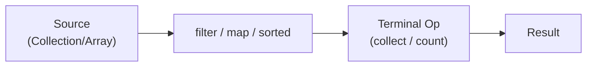
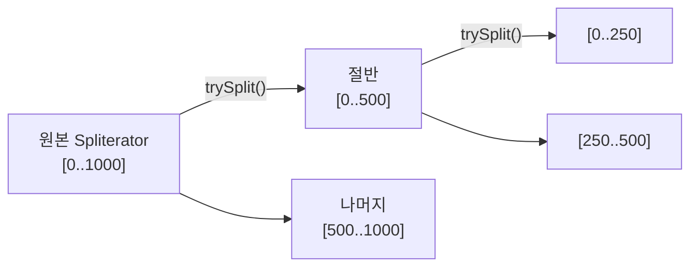
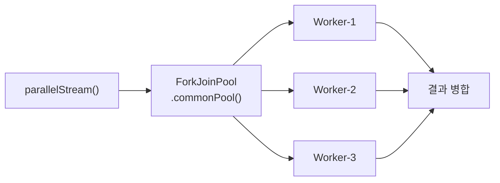
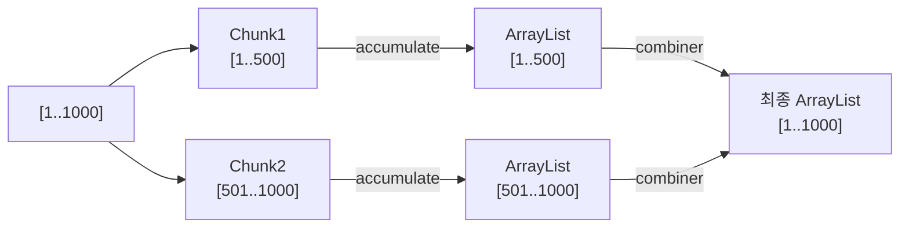

Java 8에서 등장한 Stream API는 단순히 for-loop를 대체하는 편의 문법이 아닙니다. 지연 평가(lazy evaluation), Spliterator 기반 분할, ForkJoin 병렬화, Collector 파이프라인이 맞물려 돌아가는 정교한 데이터 처리 엔진입니다. 이 글은 면접에서 "왜?"라는 질문에 답할 수 있도록, 각 개념의 내부 동작 원리까지 파고듭니다.

> **비유로 시작하기**: 스트림은 공장의 컨베이어 벨트가 아니라 **조립 라인 명세서(blueprint)**입니다. `filter().map().sorted()`를 호출하는 순간 실제 작업은 시작되지 않습니다. 최종 연산인 `collect()`를 호출하는 순간 명세서를 보고 컨베이어 벨트가 가동됩니다. 이 "명세서 선실행, 가동 후실행" 구조가 모든 최적화의 핵심입니다.

---

## 1. Stream 파이프라인: 지연 평가가 WHY

### 파이프라인 구조와 내부 표현

Stream 파이프라인은 세 단계로 구성됩니다. **소스(Source)** 는 데이터 공급자이고, **중간 연산(Intermediate Operations)** 은 `Stream<T>`를 반환하는 연산의 체인이며, **최종 연산(Terminal Operation)** 은 실제 결과를 생성하는 트리거입니다.



중간 연산은 호출 즉시 실행되지 않습니다. 대신 `AbstractPipeline`의 연결 리스트에 **스테이지(stage)** 로 등록됩니다. JDK 내부 코드에서 이 구조는 다음과 같이 동작합니다.

```java
// java.util.stream.ReferencePipeline 내부 (단순화)
abstract class AbstractPipeline {
    private final AbstractPipeline previousStage; // 이전 스테이지 참조
    private final int sourceOrOpFlags;            // 특성 플래그
    private Spliterator<?> sourceSpliterator;     // 소스 분할기
}
```

`filter(predicate)`를 호출하면 새로운 `StatelessOp` 객체가 생성되어 이전 스테이지에 연결됩니다. 이 시점에 predicate는 람다 객체로만 저장되고, 실제 원소에 적용되지 않습니다.

### 왜 지연 평가인가: 세 가지 이유

**이유 1 - 단락 평가(Short-Circuit) 최적화**

```java
// 100만 개 중 조건에 맞는 첫 번째 원소만 필요
Optional<String> result = veryLargeList.stream()
    .filter(s -> s.startsWith("X"))
    .map(String::toUpperCase)
    .findFirst();
// 조건에 맞는 첫 원소 발견 즉시 파이프라인 종료
// 즉시 평가 방식이라면 100만 개 전부 filter → map 처리 후 첫 번째만 반환
```

**이유 2 - 불필요한 연산 제거**

```java
// sorted()는 스테이트풀 연산이므로 모든 원소를 버퍼에 담아야 함
// 하지만 limit(5)이 있으면 정렬 후 5개만 필요하다는 것을 파이프라인이 알 수 있음
list.stream()
    .filter(expensive)
    .sorted()
    .limit(5)
    .collect(Collectors.toList());
// 지연 평가 덕분에 파이프라인 전체를 분석한 뒤 실행 계획 수립 가능
```

**이유 3 - 수직 처리(Vertical Processing)**

즉시 평가 방식에서는 `filter`가 100만 개를 모두 처리한 뒤 그 결과를 `map`에 넘기므로 중간 컬렉션이 발생합니다. 스트림은 원소 하나가 파이프라인 끝까지 이동한 뒤 다음 원소가 처리됩니다.

```java
// 수직 처리 확인 실험
Stream.of("A", "B", "C")
    .filter(s -> {
        System.out.println("filter: " + s);
        return true;
    })
    .map(s -> {
        System.out.println("map: " + s);
        return s.toLowerCase();
    })
    .forEach(s -> System.out.println("forEach: " + s));

// 실제 출력 순서:
// filter: A  ← A가 filter 통과
// map: A     ← A가 map 통과
// forEach: a ← A가 최종 출력
// filter: B  ← B 차례
// map: B
// forEach: b
// filter: C
// map: C
// forEach: c
// "수평 처리"라면 filter A/B/C → map A/B/C → forEach A/B/C 순서였을 것
```

중간 컬렉션이 없으므로 메모리 사용량이 O(1)에 가깝습니다. 100만 개 원소를 처리해도 한 번에 한 원소씩 처리하므로 스택 프레임 수준의 메모리만 필요합니다.

### 스테이트리스 vs 스테이트풀 중간 연산

중간 연산은 두 종류로 나뉩니다. 이 구분이 병렬 스트림 성능에 결정적 영향을 미칩니다.

| 구분 | 연산 | 병렬 특성 |
|------|------|-----------|
| 스테이트리스 | filter, map, flatMap, peek | 원소 간 독립, 완전 병렬화 가능 |
| 스테이트풀 | sorted, distinct, limit, skip | 이전 원소 상태 필요, 병렬화 제약 |

```java
// sorted()는 스테이트풀: 모든 원소를 버퍼에 담아 정렬 후 downstream으로 전달
// 병렬 스트림에서 sorted()는 각 청크를 따로 정렬 후 병합 → 오버헤드 발생
List<Integer> sorted = IntStream.range(0, 1_000_000)
    .parallel()
    .boxed()
    .sorted()           // 병렬 정렬: 비용 큼
    .limit(10)
    .collect(Collectors.toList());

// 대안: 정렬 후 limit이 목적이라면 PriorityQueue가 O(n log k)로 더 효율적
```

---

## 2. Spliterator: 분할의 핵심 메커니즘

### Spliterator란 무엇인가

`Iterator`는 순방향으로 한 원소씩 꺼내는 단순 인터페이스입니다. `Spliterator`(Splittable Iterator)는 **분할 기능**이 추가된 고급 반복자입니다. 병렬 스트림의 모든 분할 작업은 Spliterator가 담당합니다.

```java
public interface Spliterator<T> {
    // 다음 원소 처리 (있으면 true)
    boolean tryAdvance(Consumer<? super T> action);

    // 소스를 두 부분으로 분할 (분할 불가능하면 null)
    Spliterator<T> trySplit();

    // 남은 원소 수 추정 (정확하지 않을 수 있음)
    long estimateSize();

    // 특성 플래그 반환
    int characteristics();
}
```

### trySplit()의 동작 원리

`ForkJoinPool`이 병렬 스트림을 처리할 때 `trySplit()`을 반복 호출하여 데이터를 재귀적으로 절반씩 분할합니다.



```java
// ArrayList의 Spliterator 직접 사용 예시 (내부 동작 이해용)
List<Integer> list = IntStream.range(0, 1000).boxed().collect(Collectors.toList());
Spliterator<Integer> spliterator = list.spliterator();

System.out.println("전체 크기: " + spliterator.estimateSize()); // 1000

Spliterator<Integer> firstHalf = spliterator.trySplit();
System.out.println("분할 후 앞 절반: " + firstHalf.estimateSize()); // 500
System.out.println("분할 후 뒷 절반: " + spliterator.estimateSize()); // 500

// tryAdvance로 개별 원소 처리
firstHalf.tryAdvance(i -> System.out.println("첫 번째: " + i)); // 첫 번째: 0
```

### characteristics 플래그와 최적화

`characteristics()`는 비트 플래그로 소스의 특성을 알려줍니다. 스트림 내부는 이 플래그를 보고 최적화 경로를 선택합니다.

```java
// 주요 특성 플래그 (java.util.Spliterator 상수)
int ORDERED   = 0x00000010; // 원소에 순서가 있음 (List, 배열)
int DISTINCT  = 0x00000001; // 중복 없음 (Set, distinct() 후)
int SORTED    = 0x00000004; // 정렬되어 있음 (TreeSet, sorted() 후)
int SIZED     = 0x00000040; // 정확한 크기를 알 수 있음 (ArrayList)
int NONNULL   = 0x00000100; // null 원소 없음
int IMMUTABLE = 0x00000400; // 구조 변경 불가 (수정 중 예외 없음)
int CONCURRENT= 0x00001000; // 동시 수정 안전
int SUBSIZED  = 0x00004000; // 분할 후 크기도 정확함
```

```java
// 실제 최적화 예시
// SIZED + SUBSIZED → 병렬 분할 시 크기를 미리 알아 균등 분할 가능
// ArrayList는 SIZED | SUBSIZED | ORDERED | IMMUTABLE(수정X기준)

// DISTINCT 플래그가 있으면 .distinct() 중간 연산이 no-op으로 최적화됨
Set<Integer> set = new HashSet<>(Arrays.asList(1, 2, 3));
// Set의 Spliterator는 DISTINCT 포함
// .distinct()를 붙여도 내부적으로 이미 distinct임을 알고 필터링 건너뜀
long count = set.stream().distinct().count(); // distinct() 실제 작동 안 함

// SORTED 플래그가 있으면 .sorted(naturalOrder())가 no-op
TreeSet<Integer> sorted = new TreeSet<>(Arrays.asList(3, 1, 2));
// sorted()를 붙여도 이미 정렬됐다고 판단, 불필요한 정렬 생략
```

### 커스텀 Spliterator 구현

```java
// 매우 큰 파일을 청크 단위로 병렬 처리하는 커스텀 Spliterator
public class ChunkSpliterator implements Spliterator<List<String>> {
    private final List<String> lines;
    private int start;
    private final int end;
    private final int chunkSize;

    public ChunkSpliterator(List<String> lines, int start, int end, int chunkSize) {
        this.lines = lines;
        this.start = start;
        this.end = end;
        this.chunkSize = chunkSize;
    }

    @Override
    public boolean tryAdvance(Consumer<? super List<String>> action) {
        if (start >= end) return false;
        int chunkEnd = Math.min(start + chunkSize, end);
        action.accept(lines.subList(start, chunkEnd));
        start = chunkEnd;
        return true;
    }

    @Override
    public Spliterator<List<String>> trySplit() {
        int remaining = end - start;
        if (remaining <= chunkSize) return null; // 더 이상 분할 불가

        int mid = start + remaining / 2;
        // mid를 청크 경계에 맞춤
        mid = (mid / chunkSize) * chunkSize;

        Spliterator<List<String>> prefix =
            new ChunkSpliterator(lines, start, mid, chunkSize);
        start = mid;
        return prefix;
    }

    @Override
    public long estimateSize() {
        return (end - start + chunkSize - 1) / chunkSize;
    }

    @Override
    public int characteristics() {
        return ORDERED | SIZED | SUBSIZED | IMMUTABLE;
    }
}

// 사용: 100만 라인을 1000줄 청크로 병렬 처리
List<String> hugeFile = loadLines();
StreamSupport.stream(
    new ChunkSpliterator(hugeFile, 0, hugeFile.size(), 1000), true)
    .map(chunk -> processChunk(chunk))
    .collect(Collectors.toList());
```

LinkedList는 `trySplit()`이 비효율적입니다. 인덱스 접근이 O(n)이므로 절반 지점을 찾는 데만 O(n)이 걸립니다. 병렬 스트림의 소스로 LinkedList를 사용하면 분할 비용이 처리 비용을 압도할 수 있습니다.

---

## 3. 단락 평가(Short-Circuiting): 조기 종료 메커니즘

### findFirst vs findAny

```java
List<String> names = Arrays.asList("Alice", "Bob", "Charlie", "David", "Eve");

// findFirst: ORDERED 스트림에서 순서 보장된 첫 번째 원소
Optional<String> first = names.stream()
    .filter(s -> s.length() > 3)
    .findFirst(); // "Alice" 보장

// findAny: 순서 보장 없음, 병렬 시 가장 빨리 처리된 스레드의 결과
Optional<String> any = names.parallelStream()
    .filter(s -> s.length() > 3)
    .findAny(); // "Alice", "Charlie", "David", "Eve" 중 어느 것이든 가능
```

왜 `findAny`가 병렬 스트림에서 빠른가? `findFirst`는 ORDERED 스트림에서 스레드들이 결과를 찾아도 더 앞선 인덱스의 결과가 있는지 기다려야 합니다. `findAny`는 어느 스레드에서든 결과가 나오면 즉시 다른 스레드를 취소합니다.

```java
// 단락 평가가 없으면 생기는 문제: 무한 스트림
// 단락 연산이 있어서 안전
long count = Stream.iterate(1, n -> n + 1)  // 무한 스트림
    .filter(n -> n % 2 == 0)
    .limit(5)           // 단락 연산: 5개 발견 즉시 종료
    .count();           // 10 (2, 4, 6, 8, 10)

// findFirst도 단락 연산
Optional<Integer> bigEven = Stream.iterate(1, n -> n + 1)
    .filter(n -> n % 1_000_000 == 0)
    .findFirst();       // 1_000_000 발견 즉시 종료, 그 이상 탐색 안 함
```

### anyMatch / allMatch / noneMatch 내부 동작

```java
List<Integer> numbers = Arrays.asList(1, 2, 3, 4, 5, 100, 6, 7);

// anyMatch: 조건 만족 즉시 true 반환 (나머지 평가 안 함)
boolean hasHundred = numbers.stream()
    .peek(n -> System.out.println("checking: " + n))
    .anyMatch(n -> n == 100);
// 출력: checking: 1, 2, 3, 4, 5, 100 → 멈춤 (6, 7은 확인 안 함)

// allMatch: 조건 실패 즉시 false 반환
boolean allPositive = numbers.stream()
    .peek(n -> System.out.println("checking: " + n))
    .allMatch(n -> n > 0);
// 모두 양수이므로 전체 탐색

// 빈 스트림에서의 vacuous truth (논리학 용어)
boolean emptyAll  = Stream.empty().allMatch(x -> false); // true (거짓말이 없으면 참)
boolean emptyNone = Stream.empty().noneMatch(x -> true); // true
boolean emptyAny  = Stream.empty().anyMatch(x -> true);  // false (만족하는 원소 없음)
```

### limit과 sorted의 상호작용: 함정

```java
// 함정: sorted()는 스테이트풀이므로 limit 전에 전체를 버퍼에 담아야 함
Stream.iterate(1, n -> n + 1)
    .limit(100)
    .sorted()      // 100개를 전부 버퍼에 담은 뒤 정렬
    .limit(3)
    .forEach(System.out::println); // 1, 2, 3

// sorted()가 limit(100) 뒤에 있어도 sorted()가 실행될 때는
// 이미 limit(100)으로 100개가 확정된 상태이므로 안전
// 하지만 아래 케이스는 주의:

Stream.iterate(1, n -> n + 1)
    .sorted()      // 무한 스트림에 sorted() → OutOfMemoryError!
    .limit(3)
    .forEach(System.out::println);
// sorted()는 무한한 원소를 모두 버퍼에 담으려 함
```

---

## 4. 병렬 스트림: ForkJoinPool.commonPool() 내부

### ForkJoinPool 구조

병렬 스트림은 `ForkJoinPool.commonPool()`을 사용합니다. 이 풀은 JVM 레벨의 전역 공유 풀입니다.



```java
// 기본 스레드 수 확인
int parallelism = ForkJoinPool.commonPool().getParallelism();
// 일반적으로 CPU 코어 수 - 1 (메인 스레드 포함 시 코어 수)
System.out.println("병렬화 레벨: " + parallelism);

// 조정 방법 (JVM 옵션)
// -Djava.util.concurrent.ForkJoinPool.common.parallelism=8

// 커스텀 ForkJoinPool로 격리 (공통 풀 오염 방지)
ForkJoinPool customPool = new ForkJoinPool(4);
try {
    List<Result> results = customPool.submit(() ->
        data.parallelStream()
            .map(item -> expensiveCompute(item))
            .collect(Collectors.toList())
    ).get();
} finally {
    customPool.shutdown();
}
```

### Work-Stealing 알고리즘

ForkJoinPool의 핵심은 **작업 훔치기(Work-Stealing)**입니다. 각 워커 스레드는 자신의 덱(deque)에서 작업을 꺼내 처리합니다. 덱이 비면 다른 스레드의 덱 끝에서 작업을 "훔쳐" 옵니다.

```java
// ForkJoin이 병렬 스트림 처리 시 하는 일 (의사 코드)
// 1. Spliterator.trySplit()으로 반복 분할
// 2. 분할된 청크를 ForkJoinTask로 포장
// 3. 워커들이 청크를 독립 처리
// 4. 결과를 combiner로 병합

// 실제 ArrayList 병렬 스트림의 분할 과정
List<Integer> list = IntStream.range(0, 16).boxed().collect(Collectors.toList());
// 4코어 환경에서:
// [0..16] → trySplit → [0..8], [8..16]
//           → trySplit → [0..4], [4..8], [8..12], [12..16]
// 각 청크를 다른 스레드가 처리
```

### 언제 병렬 스트림이 느린가 (함정 5가지)

**함정 1 - 데이터가 너무 작을 때**

```java
// 스레드 생성, 분할, 결과 병합 오버헤드 > 실제 연산 시간
List<Integer> tiny = Arrays.asList(1, 2, 3, 4, 5);
tiny.parallelStream().map(i -> i * 2).collect(Collectors.toList());
// 순차 스트림보다 5~10배 느릴 수 있음
// NQ 모델: N(원소 수) * Q(연산 비용) > 10_000 이상일 때 병렬화 효과
```

**함정 2 - LinkedList (분할 비용 폭증)**

```java
// ArrayList: trySplit() → O(1) (인덱스 기반 절반 분할)
// LinkedList: trySplit() → O(n) (절반 지점까지 순회)
LinkedList<Integer> linked = new LinkedList<>(IntStream.range(0, 100_000)
    .boxed().collect(Collectors.toList()));
linked.parallelStream().map(i -> i * 2).count();
// 분할 비용이 처리 비용보다 커서 오히려 느림
```

**함정 3 - 정렬 요구 (ORDERED 오버헤드)**

```java
// forEachOrdered는 병렬로 처리하지만 출력 순서는 원래대로 유지
// → 결과 버퍼링 + 순서 맞추기 오버헤드 발생
data.parallelStream()
    .map(x -> x * 2)
    .forEachOrdered(System.out::println); // 병렬화 이점 대부분 상쇄

// unordered() 힌트로 오더링 포기
data.parallelStream()
    .unordered()           // ORDERED 특성 제거
    .filter(x -> x % 2 == 0)
    .limit(1000)           // unordered + limit = 훨씬 빠름
    .collect(Collectors.toList());
```

**함정 4 - I/O 바운드 작업 (공통 풀 고갈)**

```java
// 절대 하지 말 것: 공통 풀에서 I/O 블로킹
data.parallelStream()
    .map(item -> {
        // DB 조회, HTTP 호출 등 블로킹 I/O
        return callExternalApi(item); // 스레드 블로킹!
    })
    .collect(Collectors.toList());
// 공통 풀 스레드가 모두 I/O 대기로 잡혀 JVM 전체 마비 가능

// 올바른 방법: CompletableFuture + 별도 스레드 풀
ExecutorService ioPool = Executors.newFixedThreadPool(50);
List<CompletableFuture<Result>> futures = data.stream()
    .map(item -> CompletableFuture.supplyAsync(
        () -> callExternalApi(item), ioPool))
    .collect(Collectors.toList());
List<Result> results = futures.stream()
    .map(CompletableFuture::join)
    .collect(Collectors.toList());
```

**함정 5 - 공유 가변 상태 (데이터 경쟁)**

```java
// 버그: ArrayList는 스레드 안전하지 않음
List<Integer> shared = new ArrayList<>();
IntStream.range(0, 10_000).parallel()
    .forEach(shared::add); // 경쟁 조건! 결과 개수 < 10_000

// 올바른 방법 1: Collector 사용 (내부적으로 스레드 안전)
List<Integer> correct = IntStream.range(0, 10_000).parallel()
    .boxed()
    .collect(Collectors.toList());

// 올바른 방법 2: ConcurrentLinkedQueue
ConcurrentLinkedQueue<Integer> queue = new ConcurrentLinkedQueue<>();
IntStream.range(0, 10_000).parallel()
    .forEach(queue::add); // ConcurrentLinkedQueue는 스레드 안전

// 올바른 방법 3: AtomicInteger로 집계
AtomicInteger sum = new AtomicInteger(0);
IntStream.range(0, 10_000).parallel()
    .forEach(sum::addAndGet);
```

### 병렬 스트림 성능 측정 기준 (NQ 모델)

```java
// N: 원소 수, Q: 원소당 처리 비용(나노초 기준)
// NQ > 100_000 이면 병렬화 효과 기대 가능
// NQ > 1_000_000 이면 병렬화 강력 권장

// 예: N=10_000, Q=100ns → NQ=1_000_000 → 병렬화 효과 있음
// 예: N=100, Q=10ns → NQ=1_000 → 병렬화 오히려 손해

// 반드시 JMH로 벤치마크 후 결정
@Benchmark
public long sequentialSum(BenchmarkState state) {
    return state.list.stream().mapToLong(Long::longValue).sum();
}

@Benchmark
public long parallelSum(BenchmarkState state) {
    return state.list.parallelStream().mapToLong(Long::longValue).sum();
}
```

---

## 5. Collector 내부: supplier / accumulator / combiner / finisher

### Collector 인터페이스 해부

`Collector<T, A, R>` 제네릭 파라미터는 T=입력 타입, A=중간 누적 컨테이너 타입, R=최종 결과 타입입니다.

```java
public interface Collector<T, A, R> {
    Supplier<A>          supplier();     // 빈 컨테이너 생성
    BiConsumer<A, T>     accumulator();  // 컨테이너에 원소 추가
    BinaryOperator<A>    combiner();     // 병렬 처리 시 컨테이너 병합
    Function<A, R>       finisher();     // 컨테이너를 최종 결과로 변환
    Set<Characteristics> characteristics(); // CONCURRENT, UNORDERED, IDENTITY_FINISH
}
```

`Collectors.toList()`의 내부를 들여다보면:

```java
// Collectors.toList() 등가 구현
Collector<String, List<String>, List<String>> toListCollector = Collector.of(
    ArrayList::new,           // supplier:    새 ArrayList 생성
    List::add,                // accumulator: 원소를 ArrayList에 추가
    (left, right) -> {        // combiner:    두 ArrayList 병합 (병렬 시 사용)
        left.addAll(right);
        return left;
    },
    Collector.Characteristics.IDENTITY_FINISH // finisher가 identity (Function.identity())
    // IDENTITY_FINISH가 있으면 finisher() 호출 생략 최적화
);
```

### combiner가 왜 필요한가: 병렬 처리의 핵심

순차 스트림에서는 combiner가 **절대 호출되지 않습니다.** combiner는 오직 병렬 스트림에서 각 스레드가 독립적으로 만든 중간 컨테이너를 하나로 합칠 때만 사용됩니다.



```java
// combiner가 잘못 구현된 커스텀 Collector의 함정
Collector<Integer, List<Integer>, List<Integer>> buggyCollector = Collector.of(
    ArrayList::new,
    List::add,
    (left, right) -> {
        left.addAll(right);
        return left;       // 올바름: left를 수정하고 반환
        // 잘못된 예:
        // return new ArrayList<>(right); // left의 원소 유실!
        // return right;                  // left의 원소 유실!
    }
);

// 올바른 combiner: 두 컨테이너를 병합해 하나 반환
```

### finisher와 IDENTITY_FINISH 최적화

```java
// finisher가 의미 있는 Collector: groupingBy
// 내부 누적 컨테이너 Map<K, List<T>>를 그대로 반환하므로 IDENTITY_FINISH
// 반면 counting()은 Long 타입 변환을 finisher에서 수행

// toUnmodifiableList의 finisher
Collector<String, ?, List<String>> unmodifiableCollector = Collector.of(
    ArrayList::new,
    List::add,
    (l1, l2) -> { l1.addAll(l2); return l1; },
    Collections::unmodifiableList  // finisher: ArrayList → 불변 List로 래핑
    // IDENTITY_FINISH 없음: finisher 반드시 호출
);
```

### 고급 커스텀 Collector: 통계 + 변환 한 번에

```java
// 이동 평균을 스트림 한 번 순회로 계산하는 커스텀 Collector
public static Collector<Double, ?, List<Double>> movingAverage(int windowSize) {
    return Collector.of(
        () -> new double[windowSize + 1][1], // [0..windowSize-1]=윈도우, [windowSize][0]=합계
        // 위 설계 대신 더 명확하게:
        () -> {
            Deque<Double> window = new ArrayDeque<>();
            double[] sum = {0.0};
            List<Double> result = new ArrayList<>();
            return new Object[]{ window, sum, result };
        },
        (container, value) -> {
            @SuppressWarnings("unchecked")
            Deque<Double> window = (Deque<Double>) container[0];
            double[] sum = (double[]) container[1];
            @SuppressWarnings("unchecked")
            List<Double> result = (List<Double>) container[2];

            window.addLast(value);
            sum[0] += value;
            if (window.size() > windowSize) {
                sum[0] -= window.removeFirst();
            }
            if (window.size() == windowSize) {
                result.add(sum[0] / windowSize);
            }
        },
        (c1, c2) -> {
            throw new UnsupportedOperationException("순차 전용 Collector");
            // 병렬 스트림에서 이동 평균은 청크 간 상태 연속성이 필요하므로 병합 불가
        },
        container -> (List<Double>) container[2]
    );
}

// 사용
List<Double> prices = Arrays.asList(10.0, 12.0, 11.0, 14.0, 13.0, 15.0, 16.0);
List<Double> ma3 = prices.stream().collect(movingAverage(3));
// [11.0, 12.33..., 12.67..., 14.0, 14.67...]
```

### Characteristics 플래그의 의미

```java
// CONCURRENT: accumulator가 여러 스레드에서 동시 호출 가능
// → 단일 공유 컨테이너에 동시 추가 허용 (ConcurrentHashMap 등)
// → combiner 불필요

// UNORDERED: 결과가 원소 순서에 의존하지 않음
// → 병렬 시 순서 맞추기 오버헤드 제거

// IDENTITY_FINISH: finisher()가 Function.identity()와 동등
// → finisher 호출 생략, 캐스팅으로 대체

// Collectors.groupingByConcurrent()는 CONCURRENT + UNORDERED
// 병렬 스트림에서 ConcurrentHashMap에 직접 누적 → combiner 없이 빠름
Map<String, List<Person>> grouped = people.parallelStream()
    .collect(Collectors.groupingByConcurrent(Person::city));
// groupingBy보다 빠르지만 순서 보장 없음
```

---

## 6. flatMap vs map: 구독 흐름 차이

### 내부 실행 모델 비교

`map`은 원소 하나에 함수를 적용해 다른 원소 하나를 반환합니다. `flatMap`은 원소 하나에 함수를 적용해 Stream을 반환하고, 그 Stream을 **inline으로 펼쳐** 이어지는 파이프라인에 연결합니다.

```java
// map: 1 → 1 변환
Stream<List<Integer>> mapResult = Stream.of(
    Arrays.asList(1, 2, 3),
    Arrays.asList(4, 5, 6)
).map(list -> list); // Stream<List<Integer>> 그대로

// flatMap: 1 → N 변환 (중첩 해제)
Stream<Integer> flatResult = Stream.of(
    Arrays.asList(1, 2, 3),
    Arrays.asList(4, 5, 6)
).flatMap(Collection::stream); // Stream<Integer>: 1, 2, 3, 4, 5, 6
```

### flatMap의 내부 동작: 서브 스트림 생성과 소비

```java
// flatMap 내부 동작 (단순화된 의사 코드)
// 각 원소에 mapper를 적용해 Stream을 얻은 뒤
// 그 Stream의 원소들을 하나씩 downstream으로 전달
// 서브 스트림은 즉시 소비되고 닫힘

// 실제 순서 확인
Stream.of("AB", "CD")
    .flatMap(s -> {
        System.out.println("mapper 호출: " + s);
        return Stream.of(s.split("")).peek(c -> System.out.println("  char: " + c));
    })
    .forEach(c -> System.out.println("forEach: " + c));

// 출력:
// mapper 호출: AB
//   char: A
// forEach: A
//   char: B
// forEach: B
// mapper 호출: CD  ← AB의 서브 스트림 다 소비된 뒤 CD 처리
//   char: C
// forEach: C
//   char: D
// forEach: D
```

### flatMap 핵심 활용 패턴

```java
// 패턴 1: 중첩 컬렉션 평탄화
record Order(String id, List<OrderItem> items) {}
record OrderItem(String productId, int quantity) {}

List<Order> orders = getOrders();
List<String> allProductIds = orders.stream()
    .flatMap(order -> order.items().stream())
    .map(OrderItem::productId)
    .distinct()
    .collect(Collectors.toList());

// 패턴 2: Optional 평탄화
// map 사용 시: Stream<Optional<User>> → Optional 안에 Optional이 중첩
// flatMap 사용 시: Stream<User> → 깔끔하게 평탄화
Optional<String> address = findUser(userId)           // Optional<User>
    .flatMap(user -> findAddress(user.id()))           // Optional<Address>
    .flatMap(addr -> Optional.ofNullable(addr.street())); // Optional<String>
// map을 쓰면 Optional<Optional<Optional<String>>>이 됨

// 패턴 3: 문자열 파싱
String csv = "Alice,30\nBob,25\nCharlie,35";
List<int[]> parsed = Arrays.stream(csv.split("\n"))
    .flatMap(line -> {
        String[] parts = line.split(",");
        return Stream.of(new int[]{Integer.parseInt(parts[1])});
    })
    .collect(Collectors.toList());

// 패턴 4: 조건부 확장 (0개 또는 여러 개)
List<String> expanded = Stream.of("a", "bb", "ccc")
    .flatMap(s -> s.length() > 1
        ? Stream.generate(() -> s).limit(s.length()) // 길이만큼 반복
        : Stream.empty())                              // 1글자는 제거
    .collect(Collectors.toList());
// ["bb", "bb", "ccc", "ccc", "ccc"]
```

### mapMulti (Java 16): flatMap의 성능 개선판

```java
// flatMap은 각 원소마다 새 Stream 객체 생성 → 오버헤드 존재
// mapMulti는 Consumer를 통해 직접 다음 스테이지에 push → Stream 객체 생성 없음

List<String> result = Stream.of("hello", "world", "java")
    .<String>mapMulti((str, consumer) -> {
        consumer.accept(str.toUpperCase());
        consumer.accept(str.toLowerCase());
        // 조건부로 0개, 1개, N개 emit 가능
    })
    .collect(Collectors.toList());
// ["HELLO", "hello", "WORLD", "world", "JAVA", "java"]

// 성능 비교: 대량 데이터에서 mapMulti가 flatMap보다 빠름
// 이유: Stream 객체 GC 압력 없음
```

---

## 7. Stream vs for-loop: 성능 현실

### JIT 최적화와 스트림의 격차

```java
// JMH 벤치마크 환경 예시 (실제 수치는 환경마다 다름)
// 테스트: int 배열 100만 개 합산

// 방법 1: 전통적 for-loop
int sum1 = 0;
for (int i = 0; i < arr.length; i++) {
    sum1 += arr[i];
}
// JIT가 SIMD 벡터화 가능 → 가장 빠름 (기준선)

// 방법 2: IntStream (기본형 스트림)
int sum2 = Arrays.stream(arr).sum();
// JIT 최적화 후 for-loop에 근접 (~5% 느림)

// 방법 3: Stream<Integer> (박싱)
int sum3 = IntStream.range(0, arr.length).boxed()
    .reduce(0, Integer::sum);
// 박싱/언박싱 오버헤드 → for-loop보다 10~20배 느릴 수 있음

// 결론: 기본형 데이터는 IntStream/LongStream/DoubleStream 사용
```

### 스트림이 for-loop보다 빠른 시나리오

```java
// 병렬 처리
long parallelSum = LongStream.range(0, 1_000_000_000L)
    .parallel()
    .sum();
// 4코어에서 for-loop 대비 ~3.5배 빠름

// 복잡한 체인에서의 단락 평가
Optional<Employee> found = employees.stream()
    .filter(e -> e.department().equals("Engineering"))
    .filter(e -> e.salary() > 100_000)
    .filter(e -> e.yearsOfExperience() > 5)
    .findFirst();
// 각 filter 조건을 순서대로 단락 평가
// for-loop로 동일 구현 시 같은 성능이지만 코드 가독성 압도적 차이
```

### 스트림이 for-loop보다 느린 시나리오

```java
// 시나리오 1: 박싱 비용 (가장 흔한 함정)
List<Integer> boxedList = getMillionIntegers();
int sum = boxedList.stream()
    .reduce(0, Integer::sum); // 매 연산마다 언박싱
// vs
int sum2 = boxedList.stream()
    .mapToInt(Integer::intValue).sum(); // 한 번 변환 후 기본형 연산

// 시나리오 2: 아주 단순한 루프
// 람다 호출 오버헤드 (인터페이스 invoke) vs 단순 연산
for (int i = 0; i < 10; i++) {
    arr[i] = i * 2; // 단순 배열 접근
}
// vs
IntStream.range(0, 10).forEach(i -> arr[i] = i * 2);
// 람다 호출 오버헤드가 작업보다 클 때 스트림이 느림

// 시나리오 3: 이중 루프 (nested)
// 내부 루프에서 스트림 생성 비용 반복
for (int i = 0; i < 1000; i++) {
    for (int j = 0; j < 1000; j++) {
        // 스트림을 내부 루프에 쓰면 매번 파이프라인 설정 오버헤드
    }
}
```

### for-loop가 불가피한 케이스

```java
// 케이스 1: 인덱스 접근이 필요할 때
for (int i = 0; i < list.size(); i++) {
    list.set(i, transform(list.get(i), i)); // i를 사용
}
// 스트림으로 표현하려면 IntStream.range + get 조합 필요 (어색)

// 케이스 2: 중간에 continue/break가 필요할 때
for (String s : list) {
    if (s.isEmpty()) continue;
    if (s.equals("STOP")) break;
    process(s);
}
// 스트림에서는 filter + findFirst로 대응 가능하지만 의미가 바뀜

// 케이스 3: 체크드 예외 처리
for (String path : paths) {
    try {
        Files.delete(Path.of(path)); // IOException: checked exception
    } catch (IOException e) {
        log.error("삭제 실패", e);
    }
}
// 스트림 람다 내에서 체크드 예외 직접 사용 불가 → 언체크드로 래핑 필요
```

---

## 8. Optional 체인: 깊이 있는 활용

### Optional의 존재 이유

NullPointerException은 Java에서 가장 흔한 런타임 예외입니다. Optional은 "값이 없을 수 있음"을 타입 시스템에 명시적으로 표현하여 NPE를 컴파일 타임에 강제로 처리하게 만듭니다.

```java
// Optional 없이: NPE 잠재적 위험
String city = user.getAddress().getCity().toUpperCase(); // NullPointerException 가능

// Optional 사용: 각 단계에서 null 가능성 명시적 처리
String city = Optional.ofNullable(user)
    .map(User::getAddress)
    .map(Address::getCity)
    .map(String::toUpperCase)
    .orElse("UNKNOWN");
```

### map vs flatMap in Optional

```java
// map: Optional<T> → Optional<U> (함수가 U 반환)
Optional<String> name = Optional.of("  Alice  ");
Optional<String> trimmed = name.map(String::trim); // Optional["Alice"]

// flatMap: Optional<T> → Optional<U> (함수가 Optional<U> 반환)
// map을 쓰면 Optional<Optional<U>>가 됨
Optional<User> user = findUser(id);

// 잘못된 방법: map + Optional 반환 메서드 = 중첩 Optional
Optional<Optional<Address>> nested = user.map(u -> findAddress(u.id()));
// findAddress()가 Optional<Address>를 반환하므로 Optional 중첩 발생

// 올바른 방법: flatMap으로 평탄화
Optional<Address> address = user.flatMap(u -> findAddress(u.id()));
```

### filter in Optional

```java
// 조건에 맞지 않으면 Optional.empty() 반환
Optional<String> validEmail = Optional.of("user@example.com")
    .filter(s -> s.contains("@"))  // 조건 만족 → 그대로 통과
    .filter(s -> s.length() < 100); // 조건 만족 → 그대로 통과
// Optional["user@example.com"]

Optional<String> invalidEmail = Optional.of("notAnEmail")
    .filter(s -> s.contains("@")); // 조건 불만족 → Optional.empty()
// Optional.empty
```

### orElseThrow와 예외 설계

```java
// orElseThrow: 값 없으면 예외 던지기 (Java 10+: 인자 없이 NoSuchElementException)
User user = findUser(id)
    .orElseThrow(() -> new UserNotFoundException("User not found: " + id));

// 도메인 예외와 결합
Order order = findOrder(orderId)
    .filter(o -> o.status() == OrderStatus.ACTIVE)
    .orElseThrow(() -> new OrderNotActiveException(orderId));

// 주의: Optional.get()은 가급적 사용하지 말 것
// isPresent() 체크 후 get()은 Optional 사용 의도를 무너뜨림
if (opt.isPresent()) {
    return opt.get(); // 안티패턴: orElseThrow로 대체
}
```

### Optional 체인의 완전한 예시

```java
// 복잡한 도메인 모델에서 안전한 체인
record User(String id, String name, Optional<Address> address) {}
record Address(String street, String city, Optional<GeoCoord> coord) {}
record GeoCoord(double lat, double lon) {}

// 사용자 → 주소 → 좌표 → 위도 추출
double latitude = findUser(userId)
    .flatMap(User::address)          // Optional<User> → Optional<Address>
    .flatMap(Address::coord)         // Optional<Address> → Optional<GeoCoord>
    .map(GeoCoord::lat)              // Optional<GeoCoord> → Optional<Double>
    .orElse(0.0);                    // 없으면 기본값

// or() 사용: Java 9+, 대안 Optional 제공
Optional<Address> address = findUser(userId)
    .flatMap(User::address)
    .or(() -> findDefaultAddress()); // 없으면 다른 Optional 시도
```

### Optional 안티패턴

```java
// 안티패턴 1: Optional을 컬렉션 원소나 필드로 사용
// Optional은 반환 타입 전용, 필드/파라미터/컬렉션 원소는 부적절
class User {
    Optional<String> nickname; // 나쁨: 직렬화 문제, 불필요한 래핑
    String nickname;           // null 허용이면 @Nullable 어노테이션 사용
}

// 안티패턴 2: Optional.of(null) - NullPointerException 즉시 발생
Optional<String> opt = Optional.of(null); // NPE!
Optional<String> safe = Optional.ofNullable(null); // Optional.empty

// 안티패턴 3: isPresent() + get() 콤보
if (opt.isPresent()) {
    process(opt.get()); // ifPresent로 대체
}
opt.ifPresent(this::process); // 올바름

// 안티패턴 4: orElse로 비용 있는 연산
Optional<Config> config = Optional.empty();
Config result = config.orElse(loadFromDatabase()); // DB 조회는 항상 실행됨!
Config result2 = config.orElseGet(() -> loadFromDatabase()); // DB 조회는 필요할 때만
```

---

## 9. 흔한 함정과 올바른 패턴

### 함정 1: 스트림 재사용

```java
// 잘못된 코드: 스트림 재사용
Stream<String> stream = list.stream().filter(s -> s.length() > 3);
long count = stream.count();                          // 스트림 소비됨
List<String> result = stream.collect(Collectors.toList()); // IllegalStateException!

// 올바른 방법 1: 매번 새 스트림 생성
long count = list.stream().filter(s -> s.length() > 3).count();
List<String> result = list.stream().filter(s -> s.length() > 3).collect(Collectors.toList());

// 올바른 방법 2: Supplier로 스트림 팩토리 캡슐화
Supplier<Stream<String>> filtered = () -> list.stream().filter(s -> s.length() > 3);
long count = filtered.get().count();
List<String> result = filtered.get().collect(Collectors.toList());
```

### 함정 2: 부수 효과(Side Effect)

```java
// 금지: 중간 연산에서 외부 상태 변경
Map<String, Integer> wordCount = new HashMap<>();
Stream.of("apple", "banana", "apple", "cherry")
    .forEach(word -> wordCount.merge(word, 1, Integer::sum)); // forEach는 최종 연산이라 괜찮지만...

// 더 나쁜 예: peek에서 외부 상태 변경
List<String> sideList = new ArrayList<>();
long count = stream.peek(sideList::add).count();
// count() 최적화로 peek이 무시될 수 있음 (JDK 버전에 따라 다름)

// 올바른 방법: Collector 사용
Map<String, Long> wordCount = Stream.of("apple", "banana", "apple", "cherry")
    .collect(Collectors.groupingBy(w -> w, Collectors.counting()));

// 외부 상태 변경이 필요하면 최종 연산 후 처리
List<String> words = stream.collect(Collectors.toList());
words.forEach(w -> externalMap.put(w, process(w)));
```

### 함정 3: reduce의 항등원(Identity) 오류

```java
// reduce의 identity는 어떤 원소와 결합해도 원소를 바꾸지 않아야 함
// 덧셈: identity = 0 (a + 0 = a)
// 곱셈: identity = 1 (a * 1 = a)
// 문자열 연결: identity = "" (a + "" = a)

// 잘못된 identity: 결과가 항상 100 이상이 됨
int sum = Stream.of(1, 2, 3)
    .reduce(100, Integer::sum); // 106 (100 + 1 + 2 + 3)
// 병렬 스트림에서 더 위험:
int parallelBug = Stream.of(1, 2, 3)
    .parallel()
    .reduce(100, Integer::sum);
// 각 청크마다 identity 100을 더해 결과 = 400! (100+1=101, 100+2=102, 100+3=103, 101+102+103=306?)
// 실제로는 청크 분할 방식에 따라 결과가 달라져 예측 불가

// 항등원의 정확한 정의: 모든 t에 대해 combiner(identity, t) == t
// 병렬 reduce에서 identity가 올바르지 않으면 결과가 스레드 수에 따라 달라짐
```

### 함정 4: 순서 손실

```java
// UNORDERED 힌트 후 순서 의존 연산 사용
List<Integer> list = Arrays.asList(1, 2, 3, 4, 5);
List<Integer> result = list.stream()
    .unordered()           // 순서 포기 힌트
    .limit(3)              // 어떤 3개? 1,2,3이 보장 안 됨
    .collect(Collectors.toList()); // [1,3,5]? [2,3,4]? 비결정적!

// 병렬 스트림에서 순서 있는 소스의 distinct()
List<Integer> distinct = Arrays.asList(1, 2, 2, 3, 3, 3).parallelStream()
    .distinct()
    .collect(Collectors.toList()); // 순서는 [1,2,3]이 보장됨 (ORDERED 소스)
// 하지만 성능 저하 발생 → unordered().distinct()로 순서 포기 시 빠름
```

### 함정 5: 파일/네트워크 스트림 누수

```java
// 위험: 예외 발생 시 스트림 미닫힘 → 파일 핸들 누수
Stream<String> lines = Files.lines(Path.of("huge.txt"));
lines.filter(l -> l.contains("ERROR")).forEach(System.out::println);
// 예외 발생 시 lines가 닫히지 않음

// 올바른 방법: try-with-resources
try (Stream<String> lines = Files.lines(Path.of("huge.txt"))) {
    lines.filter(l -> l.contains("ERROR"))
         .forEach(System.out::println);
} // 자동으로 close() 호출

// Stream.close()는 BaseStream 인터페이스에 정의됨
// onClose() 핸들러 등록 가능
Stream<String> stream = Files.lines(Path.of("file.txt"))
    .onClose(() -> System.out.println("스트림 닫힘"));
```

---

## 10. Gatherers (JDK 22): 새로운 중간 연산 API

### Gatherer란 무엇인가

JDK 22에서 Preview, JDK 24에서 정식 도입된 `Gatherer<T, A, R>`는 커스텀 중간 연산을 만들 수 있는 API입니다. 기존 `Collector`가 최종 연산의 커스텀을 담당한다면, `Gatherer`는 **중간 연산의 커스텀**을 담당합니다.

```java
public interface Gatherer<T, A, R> {
    Supplier<A>                 initializer();  // 중간 상태 초기화
    Integrator<A, T, R>         integrator();   // 각 원소 처리 + downstream으로 emit
    BinaryOperator<A>           combiner();     // 병렬 시 상태 병합
    BiConsumer<A, Downstream<R>> finisher();    // 남은 상태 처리 (완료 시)
}
```

### 슬라이딩 윈도우 Gatherer

```java
import java.util.stream.Gatherers;

// JDK 24 내장 Gatherer: 슬라이딩 윈도우
List<List<Integer>> windows = Stream.of(1, 2, 3, 4, 5, 6)
    .gather(Gatherers.windowSliding(3))
    .collect(Collectors.toList());
// [[1,2,3], [2,3,4], [3,4,5], [4,5,6]]

// 고정 크기 윈도우 (겹침 없음)
List<List<Integer>> fixed = Stream.of(1, 2, 3, 4, 5, 6)
    .gather(Gatherers.windowFixed(3))
    .collect(Collectors.toList());
// [[1,2,3], [4,5,6]]
```

### scan Gatherer (누적 중간값)

```java
// scan: reduce의 중간값을 모두 emit
// "누적 합" 시리즈 생성
List<Integer> runningSum = Stream.of(1, 2, 3, 4, 5)
    .gather(Gatherers.scan(() -> 0, Integer::sum))
    .collect(Collectors.toList());
// [1, 3, 6, 10, 15]

// 커스텀 scan: 이동 최댓값
List<Integer> runningMax = Stream.of(3, 1, 4, 1, 5, 9, 2, 6)
    .gather(Gatherers.scan(() -> Integer.MIN_VALUE, Integer::max))
    .collect(Collectors.toList());
// [3, 3, 4, 4, 5, 9, 9, 9]
```

### 커스텀 Gatherer: 중복 제거 with 윈도우

```java
// 커스텀 Gatherer: 연속 중복 제거 (distinct는 전체 중복 제거, 이건 연속만)
// SQL의 LAG() 함수와 유사
public static <T> Gatherer<T, ?, T> dedupConsecutive() {
    return Gatherer.ofSequential(
        () -> new Object[]{null, false}, // [마지막값, 초기화여부]
        Gatherer.Integrator.ofGreedy((state, element, downstream) -> {
            @SuppressWarnings("unchecked")
            T last = (T) state[0];
            boolean initialized = (boolean) state[1];

            if (!initialized || !element.equals(last)) {
                state[0] = element;
                state[1] = true;
                return downstream.push(element); // downstream으로 emit
            }
            return true; // 중복이면 emit 안 함
        })
    );
}

// 사용
List<Integer> deduped = Stream.of(1, 1, 2, 3, 3, 3, 2, 2, 1)
    .gather(dedupConsecutive())
    .collect(Collectors.toList());
// [1, 2, 3, 2, 1] (연속 중복만 제거, distinct()는 [1,2,3])
```

### fold Gatherer (병렬 안전 누적)

```java
// fold: 병렬 스트림에서도 안전한 누적
// Gatherers.fold는 이전 상태와 현재 원소를 받아 새 상태 반환
Optional<Integer> product = Stream.of(1, 2, 3, 4, 5)
    .gather(Gatherers.fold(() -> 1, (acc, n) -> acc * n))
    .findFirst(); // Optional[120]

// Gatherer 체이닝: 여러 Gatherer를 andThen으로 연결
List<List<Integer>> result = Stream.of(1, 2, 3, 4, 5, 6, 7, 8)
    .gather(Gatherers.windowFixed(3)          // 3개씩 묶기
        .andThen(Gatherers.windowSliding(2))) // 결과를 2개 슬라이딩
    .collect(Collectors.toList());
// windowFixed: [[1,2,3], [4,5,6], [7,8]]
// 그 결과의 windowSliding: [[[1,2,3],[4,5,6]], [[4,5,6],[7,8]]]
```

### 기존 Stream API로 불가능했던 패턴

```java
// 패턴 1: 원소 간 차이(delta) 계산
List<Integer> prices = Arrays.asList(100, 110, 105, 120, 115);
List<Integer> deltas = prices.stream()
    .gather(Gatherers.windowSliding(2))
    .map(w -> w.get(1) - w.get(0)) // 현재 - 이전
    .collect(Collectors.toList());
// [10, -5, 15, -5]

// 패턴 2: 처음 n개 이후 상태를 기반으로 계속 emit
// takeWhile이 불가능했던 복잡한 조건 (이전 원소에 의존)
// Gatherer로 이전 상태를 유지하면서 조건 평가 가능

// 패턴 3: 배치 + 단락 평가 조합
// flatMap으로 배치를 만들면 단락 평가가 배치 경계를 넘어가지 못함
// Gatherer.ofSequential의 Integrator.of(greedy=false)로 단락 가능
```

---

## 11. 기본형 스트림과 박싱 최적화

### IntStream / LongStream / DoubleStream

```java
// 기본형 스트림: 박싱 없이 primitive 처리
IntStream intStream = IntStream.range(1, 1_000_001);
long sum = intStream.sum(); // int 연산, 박싱 없음

// Stream<Integer>와 비교
Stream<Integer> boxedStream = IntStream.range(1, 1_000_001).boxed();
// boxed()는 각 int를 Integer 객체로 래핑 → GC 압력 증가

// 기본형 스트림의 추가 메서드
IntSummaryStatistics stats = IntStream.range(1, 101).summaryStatistics();
System.out.println(stats.getSum());     // 5050
System.out.println(stats.getAverage()); // 50.5
System.out.println(stats.getMax());     // 100
System.out.println(stats.getCount());   // 100

// 기본형 스트림 간 변환
LongStream longStream = IntStream.range(1, 100).asLongStream();
DoubleStream doubleStream = IntStream.range(1, 100).asDoubleStream();

// 기본형 스트림 → 객체 스트림
Stream<Integer> boxed = IntStream.range(1, 10).boxed();
Stream<String> mapped = IntStream.range(1, 10).mapToObj(Integer::toString);
```

### 박싱 비용이 큰 연산에서의 올바른 패턴

```java
// 잘못된 패턴: Stream<Integer>로 합산
List<Integer> numbers = new ArrayList<>();
for (int i = 0; i < 1_000_000; i++) numbers.add(i);

int sum1 = numbers.stream()
    .reduce(0, Integer::sum);
// 매 reduce 단계마다 Integer 언박싱, 결과를 Integer로 박싱 → 200만 번 박싱/언박싱

// 올바른 패턴: mapToInt 후 합산
int sum2 = numbers.stream()
    .mapToInt(Integer::intValue) // 한 번에 IntStream으로 변환
    .sum(); // 이후 모든 연산은 primitive int

// 가장 좋은 패턴: 처음부터 기본형 스트림
int sum3 = IntStream.range(0, 1_000_000).sum(); // 박싱 없음

// 컬렉션에서 기본형 집계
double avgAge = employees.stream()
    .mapToInt(Employee::age)
    .average()
    .orElse(0.0);
```

---

## 12. 면접 포인트 5개: 극한 WHY 답변

### Q1. Stream의 지연 평가가 왜 필요한가? 즉시 평가 방식의 문제점은?

즉시 평가 방식이라면 `filter(p1).map(f).filter(p2)`가 실행될 때 먼저 모든 원소에 `p1`을 적용한 중간 컬렉션을 만들고, 그 컬렉션 전체에 `f`를 적용한 중간 컬렉션을 만들고, 다시 `p2`를 적용합니다. 3단계 파이프라인에서 원본 크기에 비례하는 중간 컬렉션이 2개 생성됩니다.

지연 평가 방식에서는 최종 연산이 Spliterator를 통해 소스에 "다음 원소 주세요"를 요청하면, 그 원소 하나가 `p1 → f → p2`를 모두 통과한 뒤 결과를 반환합니다. 중간 컬렉션이 없습니다.

극한 시나리오: 100GB 파일 처리 시 즉시 평가라면 각 단계마다 중간 데이터가 수십 GB 필요합니다. 지연 평가 + 수직 처리라면 한 줄씩 읽어 파이프라인을 통과시키므로 메모리는 단 한 줄 분량만 필요합니다.

```java
// Files.lines()가 실제로 이렇게 동작
try (Stream<String> lines = Files.lines(Path.of("100gb.log"))) {
    lines
        .filter(l -> l.contains("ERROR"))   // 조건 미충족 시 즉시 다음 줄
        .map(LogParser::parse)              // 한 줄씩 파싱
        .filter(log -> log.severity() > 3)  // 심각도 필터
        .findFirst()                        // 첫 번째 발견 즉시 종료
        .ifPresent(System.out::println);
    // 메모리 사용: O(1) (파일 크기와 무관)
}
```

### Q2. Spliterator의 trySplit()이 병렬 성능에 미치는 영향은?

병렬 스트림 성능은 `trySplit()`의 품질에 의존합니다. 이상적인 `trySplit()`은 O(1)에 균등 분할을 제공해야 합니다.

- **ArrayList**: `trySplit()` → O(1), 배열 인덱스 기반 균등 분할, 병렬화 효율 95%+
- **LinkedList**: `trySplit()` → O(n), 절반 지점까지 순회 필요, 병렬화 오히려 손해
- **HashSet**: `trySplit()` → O(1) 수준, 버킷 배열 기반 분할, 균등성은 데이터 분포에 의존
- **TreeSet**: `trySplit()` → O(n), 중간 노드 찾기 위해 순회 필요

극한 시나리오: 커스텀 데이터 구조를 병렬 스트림 소스로 사용할 때, `trySplit()`을 O(1) 균등 분할로 구현하지 않으면 ForkJoin이 불균등한 청크를 만들어 일부 스레드는 일찍 끝나고 다른 스레드는 과부하가 됩니다. 이 **불균형(load imbalance)** 이 병렬화 이득을 완전히 상쇄할 수 있습니다.

```java
// 불균등 분할의 문제
// 1000개 → [900개, 100개]로 분할 시
// Thread-1: 900개 처리 (오래 걸림)
// Thread-2: 100개 처리 후 대기
// 실질적 병렬화: ~10% 수준
```

### Q3. Collector의 combiner가 순차 스트림에서 호출되지 않는 이유는?

순차 스트림은 단일 스레드에서 모든 원소를 하나의 컨테이너에 순서대로 누적합니다. `supplier`로 컨테이너를 만들고 `accumulator`로 모든 원소를 추가한 뒤 `finisher`로 변환합니다. 컨테이너가 하나뿐이므로 병합할 대상이 없습니다.

병렬 스트림에서는 각 청크가 별도 컨테이너를 가집니다. 4스레드 병렬이면 4개의 독립 컨테이너가 동시에 채워집니다. 청크 처리가 끝나면 `combiner`로 4개를 2개로, 2개를 1개로 트리 방식으로 병합합니다. `combiner`가 없는(또는 잘못 구현된) Collector는 병렬 스트림에서 결과 손실이 발생합니다.

극한 시나리오: `StringBuilder`를 누적 컨테이너로 쓰는 커스텀 Collector에서 `combiner`를 `(a, b) -> a`로 구현하면 순차에서는 정상이지만 병렬에서는 b의 내용이 사라집니다. 스레드 수가 많을수록 유실 비율이 증가합니다.

```java
// 잘못된 combiner (병렬 시 데이터 유실)
Collector<String, StringBuilder, String> buggy = Collector.of(
    StringBuilder::new,
    StringBuilder::append,
    (a, b) -> a,             // b를 버림! 병렬 시 절반 데이터 유실
    StringBuilder::toString
);

// 올바른 combiner
Collector<String, StringBuilder, String> correct = Collector.of(
    StringBuilder::new,
    StringBuilder::append,
    (a, b) -> a.append(b),   // b를 a에 병합 후 반환
    StringBuilder::toString
);
```

### Q4. 병렬 스트림에서 ForkJoinPool.commonPool()이 문제가 되는 시나리오는?

`commonPool()`은 JVM 전역으로 공유됩니다. Spring Boot 애플리케이션에서 `CompletableFuture.supplyAsync()`의 기본 풀도 `commonPool()`이고, 병렬 스트림도 `commonPool()`을 사용합니다.

요청 처리 중 병렬 스트림으로 무거운 DB 집계를 하면서, 동시에 다른 요청들도 `CompletableFuture`로 외부 API를 호출한다면 같은 `commonPool`의 스레드를 놓고 경합합니다. DB 조회가 블로킹되면 `commonPool` 스레드가 전부 잡혀 `CompletableFuture` 작업들이 실행되지 못해 전체 서버 응답이 멈출 수 있습니다.

극한 시나리오: 100 TPS 서비스에서 각 요청이 병렬 스트림으로 1초짜리 집계를 합니다. 4코어 서버의 `commonPool`은 3개 스레드(코어-1)입니다. 3개 요청이 동시에 들어오면 4번째 요청은 `commonPool` 스레드를 얻지 못해 수십 초 대기할 수 있습니다.

```java
// 해결: 커스텀 풀로 격리
// 각 요청마다 새 ForkJoinPool은 오버헤드 → 공유 커스텀 풀 사용
private static final ForkJoinPool BATCH_POOL =
    new ForkJoinPool(Runtime.getRuntime().availableProcessors());

public List<Result> processBatch(List<Item> items) {
    try {
        return BATCH_POOL.submit(() ->
            items.parallelStream()
                .map(this::process)
                .collect(Collectors.toList())
        ).get(30, TimeUnit.SECONDS);
    } catch (Exception e) {
        throw new RuntimeException("배치 처리 실패", e);
    }
}
```

### Q5. reduce에서 identity 값의 올바른 정의와 병렬 스트림에서의 함정은?

`reduce(identity, accumulator)`에서 identity는 `accumulator(identity, t) == t`를 **모든 t에 대해** 만족해야 합니다. 이것이 수학적 항등원입니다.

순차 스트림에서는 `identity`를 초기값으로 한 번만 사용하므로 잘못된 identity도 결과에 일정한 오류만 발생합니다. 그러나 병렬 스트림에서는 각 청크마다 `identity`를 초기값으로 사용한 뒤 청크 결과를 병합합니다. 4개 청크라면 `identity`가 4번 더해집니다.

극한 시나리오: `reduce(100, Integer::sum)`을 16코어 서버에서 실행하면 청크가 15개 만들어질 수 있어 `100 * 15`만큼 결과가 부풀어 오릅니다. 동일 코드가 개발 환경(4코어)과 운영 환경(32코어)에서 다른 결과를 내는 버그입니다.

```java
// 위험: 환경에 따라 결과가 달라지는 reduce
int WRONG = Stream.of(1, 2, 3, 4, 5)
    .parallel()
    .reduce(100, Integer::sum); // 개발 4코어: 115, 운영 32코어: ?

// 올바른 방법 1: identity를 올바르게 (항등원 사용)
int correct = Stream.of(1, 2, 3, 4, 5)
    .parallel()
    .reduce(0, Integer::sum); // 15, 코어 수 무관

// 올바른 방법 2: 초기값이 필요하면 reduce 후 더함
int withOffset = Stream.of(1, 2, 3, 4, 5)
    .parallel()
    .reduce(0, Integer::sum) + 100; // 115, 코어 수 무관
```

---

## 13. 극한 시나리오: 실전 적용

### 100만 건 주문 데이터 집계 (10,000 TPS)

```java
// 요구사항: 도시별 + 카테고리별 매출 합계를 메모리 내에서 집계
// 데이터: 1,000,000 건의 Order 레코드

record Order(String city, String category, long amount, OrderStatus status) {}

// 안전한 병렬 처리: CONCURRENT Collector + groupingByConcurrent
Map<String, Map<String, Long>> salesByCityCategory = orders.parallelStream()
    .filter(o -> o.status() == OrderStatus.COMPLETED)
    .collect(Collectors.groupingByConcurrent(
        Order::city,
        Collectors.groupingBy(
            Order::category,
            Collectors.summingLong(Order::amount)
        )
    ));
// groupingByConcurrent: CONCURRENT + UNORDERED
// 단일 ConcurrentHashMap에 모든 스레드가 직접 누적 → combiner 불필요
// 순차 groupingBy 대비 병렬에서 2~4배 빠름 (데이터 크기에 따라)
```

### 무한 이벤트 스트림에서 이상 감지

```java
// 실시간 센서 데이터에서 이상치 감지
// Spliterator로 BlockingQueue를 스트림 소스로 만들기

public class QueueSpliterator<T> implements Spliterator<T> {
    private final BlockingQueue<T> queue;
    private final T poisonPill; // 종료 신호

    @Override
    public boolean tryAdvance(Consumer<? super T> action) {
        try {
            T element = queue.poll(1, TimeUnit.SECONDS);
            if (element == null || element.equals(poisonPill)) return false;
            action.accept(element);
            return true;
        } catch (InterruptedException e) {
            Thread.currentThread().interrupt();
            return false;
        }
    }

    @Override
    public Spliterator<T> trySplit() {
        return null; // 순차 처리, 분할 불가
    }

    @Override
    public long estimateSize() {
        return Long.MAX_VALUE; // 크기 미지
    }

    @Override
    public int characteristics() {
        return ORDERED; // 순서 있음, SIZED 없음
    }
}

// 사용: 실시간 스트림으로 이상 감지
Stream<SensorData> sensorStream = StreamSupport.stream(
    new QueueSpliterator<>(sensorQueue, POISON_PILL), false);

sensorStream
    .gather(Gatherers.windowSliding(10))    // 10개 슬라이딩 윈도우
    .map(window -> {
        double avg = window.stream().mapToDouble(SensorData::value).average().orElse(0);
        double latest = window.get(window.size() - 1).value();
        return new AnomalyCheck(latest, avg, Math.abs(latest - avg) > avg * 0.3);
    })
    .filter(AnomalyCheck::isAnomaly)
    .forEach(a -> alertService.alert(a));
```

### Spliterator 기반 CSV 병렬 파싱

```java
// 100GB CSV 파일을 청크 단위로 병렬 파싱
public class CsvChunkSpliterator implements Spliterator<List<String>> {
    private final RandomAccessFile file;
    private long start;
    private long end;
    private final long chunkSize = 10 * 1024 * 1024L; // 10MB 청크

    @Override
    public Spliterator<List<String>> trySplit() {
        long remaining = end - start;
        if (remaining < chunkSize * 2) return null; // 더 이상 분할 안 함

        long mid = start + remaining / 2;
        // 줄 경계에 맞추기: mid에서 다음 줄바꿈 위치 찾기
        try {
            file.seek(mid);
            while (mid < end && file.read() != '\n') mid++;
            mid++; // 줄바꿈 다음 위치
        } catch (IOException e) {
            return null;
        }

        CsvChunkSpliterator prefix = new CsvChunkSpliterator(file, start, mid, ...);
        this.start = mid;
        return prefix;
    }

    @Override
    public int characteristics() {
        return ORDERED | NONNULL;
        // SIZED 없음: 파일 크기는 알지만 레코드 수는 파싱 전엔 모름
    }
}
```

---

## 14. 스트림 디버깅 전략

### peek의 올바른 사용

```java
// peek: 디버깅 전용, 프로덕션 코드에는 남기지 말 것
List<String> result = names.stream()
    .peek(s -> System.out.println("[INPUT] " + s))
    .filter(s -> s.length() > 3)
    .peek(s -> System.out.println("[AFTER FILTER] " + s))
    .map(String::toUpperCase)
    .peek(s -> System.out.println("[AFTER MAP] " + s))
    .collect(Collectors.toList());

// 주의: count() 앞의 peek은 JDK 9+에서 실행 안 될 수 있음
// count()가 소스 크기를 Spliterator.estimateSize()에서 직접 가져오는 경우
long count = stream.peek(System.out::println).count(); // peek 실행 보장 안 됨
```

### 지연 평가 추적

```java
// 지연 평가 순서를 명확히 확인하는 디버그 기법
AtomicInteger filterCount = new AtomicInteger(0);
AtomicInteger mapCount    = new AtomicInteger(0);

List<String> result = IntStream.range(0, 100).boxed()
    .filter(n -> {
        filterCount.incrementAndGet();
        return n % 2 == 0;
    })
    .map(n -> {
        mapCount.incrementAndGet();
        return "val-" + n;
    })
    .limit(5)
    .collect(Collectors.toList());

System.out.println("filter 호출: " + filterCount.get()); // 11 (0,1,2,...,9,10에서 10번째 짝수=10 찾기)
System.out.println("map 호출: "    + mapCount.get());    // 5
// filter는 짝수 5개를 찾기 위해 10개를 검사 (0,2,4,6,8 통과, 1,3,5,7,9 탈락)
// map은 통과한 5개만 처리
```

---

## 정리 요약

```
Stream API 핵심 원리:

[파이프라인]
  소스(Spliterator) → 중간 연산(스테이지 체인) → 최종 연산(실행 트리거)
  중간 연산은 AbstractPipeline에 스테이지로 등록만 됨

[지연 평가]
  최종 연산 호출 전: 아무것도 실행 안 됨
  실행 시: 원소 하나씩 파이프라인 전체 통과 (수직 처리)
  이점: 중간 컬렉션 없음, 단락 평가로 조기 종료 가능

[Spliterator]
  trySplit(): 병렬 분할 품질 결정
  characteristics(): 최적화 힌트 (SIZED, SORTED, DISTINCT 등)
  ArrayList=O(1)분할 vs LinkedList=O(n)분할 → 병렬 성능 차이 결정적

[병렬 스트림]
  ForkJoinPool.commonPool() 사용: JVM 전역 공유
  Work-Stealing으로 유휴 스레드 활용
  언제 쓰면 안 되나: 소규모 데이터, I/O 블로킹, 공유 가변 상태, LinkedList 소스

[Collector]
  supplier: 빈 컨테이너 생성
  accumulator: 원소 추가
  combiner: 병렬 청크 병합 (순차에서는 호출 안 됨!)
  finisher: 최종 변환
  IDENTITY_FINISH: finisher 생략 최적화

[Gatherer (JDK 22)]
  커스텀 중간 연산 구현
  windowSliding/windowFixed/scan/fold 내장
  flatMap으로 불가능한 상태 기반 중간 연산 가능

[면접 핵심]
  지연 평가 → 왜: 중간 컬렉션 제거, 단락 평가, 무한 스트림 지원
  combiner → 왜: 병렬 청크 독립 처리 후 병합 필요
  identity → 항등원: 병렬에서 청크마다 사용됨
  commonPool → 전역 공유: I/O 블로킹 시 JVM 전체 영향
  Spliterator → 병렬 성능: trySplit() 품질이 분할 효율 결정
```

---

## 참고 자료

- [Java Stream API 공식 문서](https://docs.oracle.com/en/java/docs/api/java.base/java/util/stream/package-summary.html)
- [JEP 473: Stream Gatherers (JDK 22)](https://openjdk.org/jeps/473)
- [Spliterator 공식 문서](https://docs.oracle.com/en/java/docs/api/java.base/java/util/Spliterator.html)
- [ForkJoinPool.commonPool() 동작 원리](https://docs.oracle.com/en/java/docs/api/java.base/java/util/concurrent/ForkJoinPool.html)
