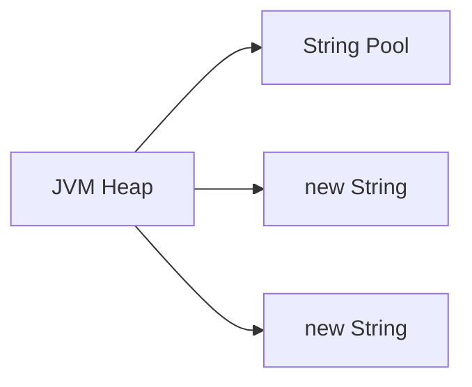
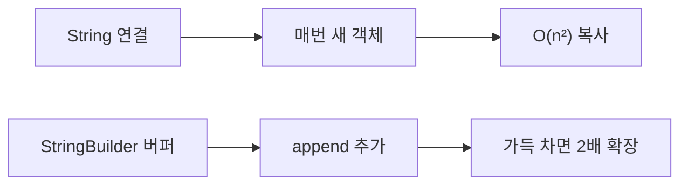
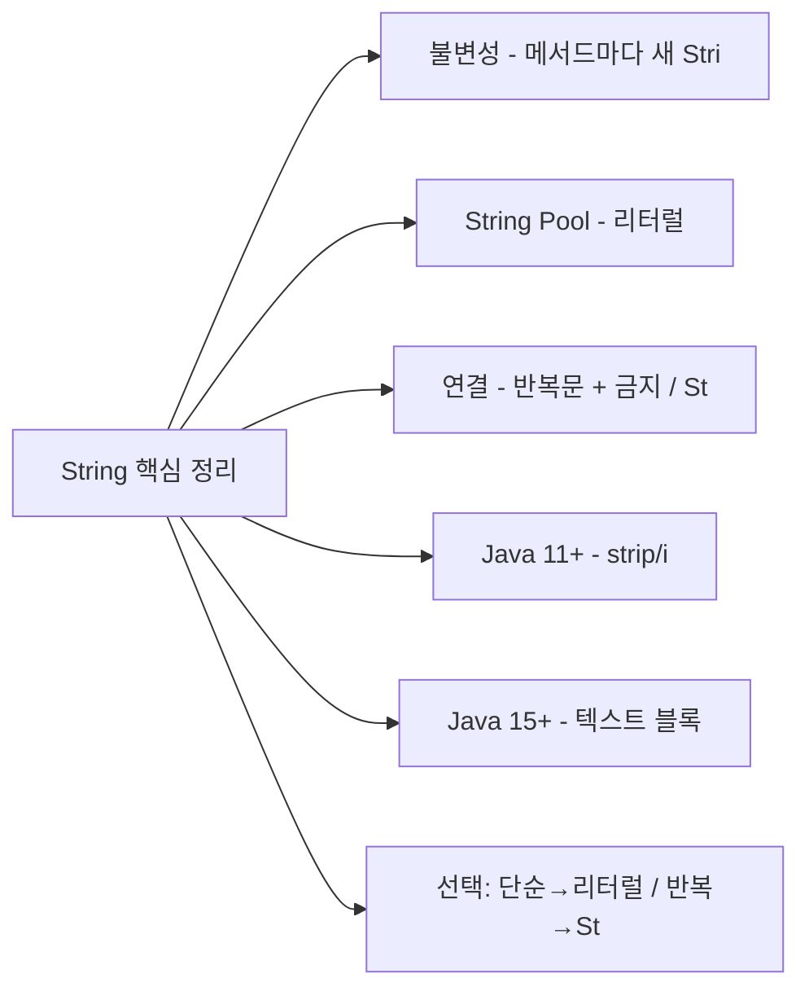

Java에서 `String`은 가장 많이 사용되는 클래스이면서, 동시에 가장 많은 오해가 있는 클래스입니다. 불변성(Immutability), String Pool, 성능 최적화, 그리고 Java 11~17에서 추가된 메서드까지 완전히 정리합니다.

---

## 1. String이 불변(Immutable)인 이유

### 동작 원리 — 불변이란 무엇인가?

Java에서 `String`이 불변이라는 것은 한 번 생성된 `String` 객체의 내용이 절대 변경되지 않는다는 의미입니다. `toUpperCase()`, `replace()`, `concat()` 등 모든 String 메서드는 원본을 수정하는 것이 아니라 **새로운 String 객체를 만들어 반환**합니다.

내부적으로 Java 9 이후 `String`은 `byte[]` 배열로 문자열 데이터를 저장하며, 이 배열 자체가 `private final`로 선언되어 있습니다. 필드가 final이고 배열의 참조도 변경할 수 없으므로 외부에서 내용을 바꿀 방법이 없습니다.

```java
String s = "Hello";
s.toUpperCase();         // 새로운 String 반환
System.out.println(s);  // "Hello" — s 자체는 변하지 않음

s = s.toUpperCase();    // 참조를 새 객체로 교체
System.out.println(s);  // "HELLO"
```

변수 `s`를 재할당하면 변수가 새 객체를 가리키는 것이지, 기존 객체가 변한 것이 아닙니다. 기존 "Hello" 객체는 더 이상 참조되지 않으면 GC 대상이 됩니다.

### 불변으로 설계한 이유

**1. String Pool 공유 가능**
```java
String a = "hello";
String b = "hello";
// 같은 객체를 공유해도 안전 — 변경 불가이므로
System.out.println(a == b);  // true (같은 Pool 객체)
```

**2. 스레드 안전 (Thread-Safe)**
```java
// 불변 객체는 동기화 없이 여러 스레드에서 공유 가능
String shared = "공유 문자열";
// 어떤 스레드도 shared를 변경할 수 없음
```

**3. 해시코드 캐싱**
```java
// String의 hashCode는 한 번만 계산하고 캐싱
// HashMap, HashSet의 키로 안전하게 사용 가능
private int hash; // 기본값 0, 처음 hashCode() 호출 시 계산
```

**4. 보안**
```java
// 파일 경로, URL, DB 연결 문자열이 중간에 변경되면 보안 위협
// 불변이므로 한 번 검증하면 안전
void openFile(String path) {
    validate(path);         // 검증
    // path가 변경될 수 없으므로 안전하게 사용
    Files.open(path);
}
```

### 내부 구현

```java
// Java 9 이후 String 내부 (compact strings)
public final class String {
    private final byte[] value;   // UTF-16 또는 Latin-1
    private final byte coder;     // LATIN1=0, UTF16=1
    private int hash;             // 캐싱된 hashCode
}
```

---

## 2. String Pool (intern) 동작 원리

### 동작 원리 — JVM 내 문자열 캐시

String Pool은 JVM Heap 내의 특별한 영역(Java 7+: Heap, 이전: PermGen)으로, 문자열 리터럴을 캐싱합니다. 소스 코드에서 `"hello"`라는 리터럴을 사용하면 컴파일러가 상수 풀(Constant Pool)에 등록하고, JVM이 해당 클래스를 로딩할 때 String Pool에서 동일한 문자열을 찾아 재사용합니다.

`new String("hello")`는 이 메커니즘을 우회해 항상 새 객체를 힙에 만듭니다. 따라서 리터럴과 `new String()`으로 만든 객체는 `==` 비교에서 false가 됩니다.



### 리터럴 vs new String()

```java
String a = "hello";              // Pool에서 가져옴
String b = "hello";              // Pool의 같은 객체
String c = new String("hello");  // Pool 밖 새 객체
String d = new String("hello");  // 또 다른 새 객체

System.out.println(a == b);  // true  (같은 Pool 객체)
System.out.println(a == c);  // false (다른 객체)
System.out.println(c == d);  // false (다른 객체)

System.out.println(a.equals(c));  // true (내용 동일)
```

### intern() 메서드

```java
String c = new String("hello");
String e = c.intern();  // Pool에서 "hello" 반환 (없으면 등록 후 반환)

System.out.println(a == e);  // true (Pool의 같은 객체)
```

### 컴파일 타임 상수 풀링

```java
// 컴파일러가 자동으로 결합
String a = "hello";
String b = "hel" + "lo";  // 컴파일 타임에 "hello"로 결합
System.out.println(a == b);  // true

// 런타임 결합 — Pool 미적용
String prefix = "hel";
String c = prefix + "lo";  // 런타임 → new String
System.out.println(a == c);  // false

// final 변수는 컴파일 타임 상수
final String prefix2 = "hel";
String d = prefix2 + "lo";  // 컴파일 타임 → Pool 적용
System.out.println(a == d);  // true
```

**핵심 요약:** String Pool은 동일한 문자열 리터럴을 공유해 메모리를 절약합니다. 하지만 이 덕분에 `==` 비교가 우연히 동작하는 경우가 생겨, 항상 `equals()`를 사용해야 한다는 원칙을 흐릴 수 있으므로 주의가 필요합니다.

---

## 3. String vs StringBuilder vs StringBuffer 성능 비교

### 동작 원리 — O(n²) vs O(n)

String 연결에서 `+` 연산자를 반복 사용하면 매번 새 String 객체가 생성됩니다. `"a" + "b"`는 `new StringBuilder().append("a").append("b").toString()`으로 컴파일되는데, **반복문 안에서는 매 반복마다 새 StringBuilder가 생성**됩니다. n번 반복하면 1+2+3+...+n 크기의 복사가 일어나 O(n²) 시간 복잡도가 됩니다.

StringBuilder는 내부에 `char[]` 버퍼를 갖고 있고, `append()` 시 버퍼가 부족해지면 현재 크기의 2배로 늘립니다(동적 배열 확장). 이 덕분에 n번 append해도 평균 O(n) 시간 복잡도를 달성합니다.



### 특성 비교

| 항목 | String | StringBuilder | StringBuffer |
|------|--------|---------------|--------------|
| 불변성 | 불변 | 가변 | 가변 |
| 스레드 안전 | O (불변이므로) | X | O (synchronized) |
| 성능 | 연결 시 느림 | 빠름 | StringBuilder보다 느림 |
| 도입 버전 | Java 1.0 | Java 5 | Java 1.0 |

### 성능 차이 원리

```java
// String 연결 — 매번 새 객체 생성
String result = "";
for (int i = 0; i < 10000; i++) {
    result += i;  // 매 반복마다 새 String 생성 → O(n²)
}

// StringBuilder — 내부 버퍼 확장
StringBuilder sb = new StringBuilder();
for (int i = 0; i < 10000; i++) {
    sb.append(i);  // 버퍼에 추가 → O(n)
}
String result = sb.toString();
```

### 컴파일러 최적화

```java
// Java 컴파일러는 + 연산을 자동으로 StringBuilder로 변환
String a = "Hello" + " " + "World";
// 컴파일 후:
String a = new StringBuilder().append("Hello").append(" ").append("World").toString();

// 단, 반복문 내에서는 매번 새 StringBuilder 생성
for (int i = 0; i < n; i++) {
    result += i;
    // 컴파일 후: result = new StringBuilder(result).append(i).toString();
    // 여전히 O(n²)!
}
```

### Java 9+ StringConcatFactory

```java
// Java 9부터 invokedynamic 기반 최적화
// 단순 연결은 StringBuilder보다 빠를 수 있음
// 하지만 반복문 내 연결은 여전히 StringBuilder 권장
```

### 사용 가이드라인

```java
// 1. 단순 리터럴 조합 → String 리터럴
String name = "Hello, " + userName + "!";

// 2. 반복문 내 연결 → StringBuilder
StringBuilder sb = new StringBuilder(capacity);
for (String s : list) {
    sb.append(s).append(", ");
}

// 3. 멀티스레드 공유 버퍼 → StringBuffer (드문 경우)
StringBuffer sharedBuffer = new StringBuffer();
```

---

## 4. 문자열 연결 성능 상세

### 벤치마크 비교 (JMH 기준)

연산 100,000회 기준 상대적 성능 비교입니다.

| 방법 | 상대 시간 | 비고 |
|------|-----------|------|
| String + (반복) | 100x | O(n²), 객체 폭발 |
| concat() (반복) | 80x | 약간 낫지만 동일 문제 |
| StringBuilder | 1x | 최적, 권장 |
| StringBuffer | 1.2x | synchronized 오버헤드 |
| String.join() | 1.5x | 내부적으로 StringBuilder 사용 |

### String.join() / Collectors.joining()

```java
// 구분자로 연결
String result = String.join(", ", "A", "B", "C");  // "A, B, C"

List<String> list = List.of("Apple", "Banana", "Cherry");
String joined = String.join(" | ", list);  // "Apple | Banana | Cherry"

// Stream에서
String csv = list.stream()
    .collect(Collectors.joining(", ", "[", "]"));
// "[Apple, Banana, Cherry]"
```

---

## 5. String 메서드 총정리

### 기본 메서드

```java
String s = "Hello, World!";

// 길이 / 비어있는지
s.length()           // 13
s.isEmpty()          // false
s.isBlank()          // false (Java 11+, 공백만 있어도 true)

// 검색
s.charAt(0)          // 'H'
s.indexOf('o')       // 4 (첫 번째)
s.lastIndexOf('o')   // 8 (마지막)
s.contains("World")  // true
s.startsWith("Hello")// true
s.endsWith("!")      // true

// 추출
s.substring(7)       // "World!"
s.substring(7, 12)   // "World"

// 변환
s.toLowerCase()      // "hello, world!"
s.toUpperCase()      // "HELLO, WORLD!"
s.trim()             // 앞뒤 ASCII 공백 제거
s.strip()            // 앞뒤 유니코드 공백 제거 (Java 11+)
s.replace('l', 'r')  // "Herro, Worrd!"
s.replace("World", "Java")  // "Hello, Java!"

// 분리 / 결합
s.split(", ")        // ["Hello", "World!"]
String.join("-", "A", "B")  // "A-B"

// 변환
s.toCharArray()      // char[]
s.getBytes()         // byte[] (기본 charset)
String.valueOf(42)   // "42"
```

### Java 11 추가 메서드

```java
// isBlank() — 공백만 있으면 true
"   ".isBlank()   // true
"  a".isBlank()   // false

// strip() — 유니코드 공백 처리 (trim()보다 권장)
"\u2000Hello\u2000".strip()       // "Hello"
"\u2000Hello\u2000".trim()        // "\u2000Hello\u2000" (제거 안 됨)
"  Hello  ".stripLeading()        // "Hello  "
"  Hello  ".stripTrailing()       // "  Hello"

// lines() — 줄 단위 Stream
"line1\nline2\nline3".lines()
    .forEach(System.out::println);
// line1
// line2
// line3

// repeat() — 반복
"ab".repeat(3)  // "ababab"
```

### Java 12 추가 메서드

```java
// indent() — 들여쓰기 추가/제거
String text = "Hello\nWorld";
text.indent(4);
// "    Hello\n    World\n"

// transform() — 변환 함수 적용
String result = "  hello  "
    .transform(String::strip)
    .transform(String::toUpperCase);
// "HELLO"
```

### Java 15 추가 메서드

```java
// formatted() — String.format()의 인스턴스 버전
String msg = "Hello, %s! You are %d years old."
    .formatted("Alice", 30);
// "Hello, Alice! You are 30 years old."
```

### Java 16 추가 메서드

```java
// stripIndent() — 텍스트 블록 들여쓰기 제거
String html = "  <html>\n    <body>\n  </html>";
html.stripIndent();

// translateEscapes() — 이스케이프 시퀀스 해석
"Hello\\nWorld".translateEscapes();  // "Hello\nWorld"
```

---

## 6. 정규표현식과 String

### 기본 활용

```java
String email = "user@example.com";

// matches() — 전체 문자열이 패턴과 일치?
email.matches("[a-zA-Z0-9._%+-]+@[a-zA-Z0-9.-]+\\.[a-zA-Z]{2,}");  // true

// replaceAll() / replaceFirst()
String text = "Hello 123 World 456";
text.replaceAll("\\d+", "#");   // "Hello # World #"
text.replaceFirst("\\d+", "#"); // "Hello # World 456"

// split() 정규표현식
"a1b2c3".split("\\d");  // ["a", "b", "c"]
```

### Pattern / Matcher (고성능)

```java
import java.util.regex.*;

// 패턴 미리 컴파일 (반복 사용 시 필수)
Pattern pattern = Pattern.compile("\\d+");
Matcher matcher = pattern.matcher("abc123def456");

// 찾기
while (matcher.find()) {
    System.out.println(matcher.group());  // 123, 456
    System.out.println(matcher.start());  // 시작 인덱스
}

// 그룹 캡처
Pattern datePattern = Pattern.compile("(\\d{4})-(\\d{2})-(\\d{2})");
Matcher m = datePattern.matcher("2026-05-01");
if (m.matches()) {
    String year  = m.group(1);  // "2026"
    String month = m.group(2);  // "05"
    String day   = m.group(3);  // "01"
}
```

### 성능 주의사항

```java
// 나쁜 예: 반복 호출 시마다 Pattern 컴파일
for (String s : list) {
    if (s.matches("\\d+")) { ... }  // 매번 Pattern.compile() 호출!
}

// 좋은 예: 미리 컴파일
private static final Pattern DIGIT_PATTERN = Pattern.compile("\\d+");

for (String s : list) {
    if (DIGIT_PATTERN.matcher(s).matches()) { ... }  // 재사용
}
```

---

## 7. 텍스트 블록 (Text Block, Java 13 Preview → Java 15 정식)

### 기본 문법

```java
// 기존 방식 — 가독성 나쁨
String json = "{\n" +
              "  \"name\": \"Alice\",\n" +
              "  \"age\": 30\n" +
              "}";

// 텍스트 블록 — 훨씬 읽기 쉬움
String json = """
        {
          "name": "Alice",
          "age": 30
        }
        """;
```

### 들여쓰기 규칙

```java
// 닫는 """ 위치가 들여쓰기 기준점
String text = """
        Hello
        World
        """;
// → "Hello\nWorld\n"  (공통 들여쓰기 8칸 제거)

String text2 = """
        Hello
        World
""";  // 닫는 """가 컬럼 0에 위치
// → "        Hello\n        World\n"  (들여쓰기 유지)
```

### 실용 예제

```java
// SQL
String sql = """
        SELECT u.id, u.name, o.total
        FROM users u
        JOIN orders o ON u.id = o.user_id
        WHERE u.active = true
          AND o.total > :minAmount
        ORDER BY o.total DESC
        """;

// HTML
String html = """
        <html>
            <body>
                <p>Hello, %s!</p>
            </body>
        </html>
        """.formatted(name);

// JSON
String json = """
        {
            "status": "ok",
            "message": "%s"
        }
        """.formatted(message);
```

### 이스케이프 처리

```java
// \n 줄 바꿈 억제 (긴 줄 가독성 유지)
String oneLine = """
        This is a very long line \
        that continues here.
        """;
// → "This is a very long line that continues here.\n"

// \s — 공백 유지 (후행 공백 보존)
String padded = """
        one  \s
        two  \s
        """;
```

---

## 8. String 관련 주요 패턴

### 문자열 → 기본형 변환

```java
int    i = Integer.parseInt("42");
double d = Double.parseDouble("3.14");
long   l = Long.parseLong("1234567890");
boolean b = Boolean.parseBoolean("true");

// 안전한 파싱
try {
    int val = Integer.parseInt(input);
} catch (NumberFormatException e) {
    // 처리
}
```

### 기본형 → 문자열

```java
String s1 = String.valueOf(42);      // "42"
String s2 = Integer.toString(42);    // "42"
String s3 = "" + 42;                 // "42" (권장하지 않음)
```

### 문자열 비교 함정

```java
// == 절대 사용 금지 (Pool 외부 객체)
String a = new String("hello");
String b = new String("hello");
a == b           // false
a.equals(b)      // true ← 항상 이것을 사용

// 대소문자 무시
a.equalsIgnoreCase("HELLO");  // true

// null 안전 비교 (NPE 방지)
"hello".equals(userInput);    // 리터럴을 앞에
Objects.equals(a, b);         // 둘 다 null-safe
```

---

## 9. 비유와 극한 시나리오

### 비유: 화이트보드 vs 새 종이

String은 화이트보드에 쓴 내용에 수정액을 칠하고 새로 쓰는 것이 아니라, 매번 새 종이를 꺼내 새로 쓰는 방식입니다. String Pool은 자주 쓰는 문구를 복사해 두는 템플릿 파일 폴더와 같습니다. StringBuilder는 지우개로 지우고 다시 쓸 수 있는 화이트보드입니다.

### 극한 시나리오: 반복 연결로 인한 OOM

```java
// 대용량 로그 파싱 서비스
public String buildReport(List<String> logLines) {
    String report = "";
    for (String line : logLines) {  // 10만 줄
        if (line.contains("ERROR")) {
            report += line + "\n";  // 매 반복마다 새 String 생성!
        }
    }
    return report;
    // 평균 1% 에러율 → 1,000개 에러 라인
    // 총 복사량: 1 + 2 + 3 + ... + 1000 ≈ 50만 번 복사
    // 각 라인 100자면 5,000만 자 복사 → OOM 또는 극심한 GC
}

// 올바른 구현
public String buildReport(List<String> logLines) {
    StringBuilder sb = new StringBuilder();
    for (String line : logLines) {
        if (line.contains("ERROR")) {
            sb.append(line).append('\n');  // 버퍼에 추가만
        }
    }
    return sb.toString();  // 마지막에 한 번만 String 생성
}
```

### 실무 실수

**실수 1: == 비교가 테스트에서만 통과**

```java
// 테스트 코드에서는 리터럴 사용으로 Pool을 통해 true
String expected = "hello";
String actual = "hello";
assert expected == actual;  // 통과 (둘 다 Pool)

// 실서비스에서 DB나 외부 API 값이 오면 실패
String dbValue = rs.getString("name");  // new String 반환
assert expected == dbValue;  // 실패!
```

**실수 2: SimpleDateFormat 공유로 인한 파싱 오류**

```java
// 나쁜 예: static 공유 → 스레드 안전 아님
private static final SimpleDateFormat SDF = new SimpleDateFormat("yyyy-MM-dd");

public Date parse(String date) throws ParseException {
    return SDF.parse(date);  // 멀티스레드에서 날짜가 뒤섞임!
}

// 좋은 예: ThreadLocal 또는 DateTimeFormatter 사용
private static final DateTimeFormatter DTF =
    DateTimeFormatter.ofPattern("yyyy-MM-dd");  // 불변, 스레드 안전

public LocalDate parse(String date) {
    return LocalDate.parse(date, DTF);
}
```

---

## 왜 이 기술인가? — String vs char[] vs StringBuilder

String이 불변인 이유는 단순한 설계 선택이 아닙니다. 보안, 성능, 스레드 안전성을 동시에 달성하기 위한 필수 결정이었습니다.

| 비교 항목 | String (불변) | char[] (가변 배열) | StringBuilder (가변) |
|-----------|-------------|-----------------|---------------------|
| 스레드 안전 | O (동기화 불필요) | X (외부 동기화 필요) | X |
| String Pool 공유 | O (메모리 절약) | X | X |
| 해시코드 캐싱 | O (HashMap 키로 최적) | X | X |
| 반복 연결 성능 | 나쁨 O(n²) | 나쁨 (직접 확장 구현 필요) | 좋음 O(n) |
| null 표현 | O | X (null 배열) | O |
| API 풍부성 | 매우 풍부 | 기본적 | 중간 |

**왜 char[]을 쓰지 않는가?** 배열은 final로 선언해도 내용은 변경 가능합니다(`arr[0] = 'x'`). String의 불변성은 `private final byte[]`와 이를 외부에 노출하지 않는 캡슐화로 함께 달성됩니다. 보안 민감 정보(패스워드)에 char[]를 쓰는 이유는 역설적으로 GC 전 명시적 초기화(`Arrays.fill(password, '\0')`)가 가능하기 때문입니다.

**왜 StringBuffer 대신 StringBuilder인가?** StringBuffer는 모든 메서드가 synchronized로 성능 오버헤드가 있습니다. 단일 스레드에서 문자열 조작에는 StringBuilder가 항상 우선입니다. StringBuffer가 필요한 경우는 여러 스레드가 동일한 버퍼에 동시에 append할 때뿐이며, 실무에서는 거의 없습니다.

---

## 실무에서 자주 하는 실수

**실수 1: 반복문 안에서 String + 연산으로 OOM**

```java
// 나쁜 예: O(n²) 객체 생성
String result = "";
for (String line : logLines) {  // 10만 줄
    result += line + "\n";  // 매 반복마다 새 String 생성
}
// 10만 라인이면 약 50억 번의 문자 복사 → OOM 또는 수십 초 소요

// 좋은 예: O(n)
StringBuilder sb = new StringBuilder(logLines.size() * 80); // 예상 용량 사전 할당
for (String line : logLines) {
    sb.append(line).append('\n');
}
String result = sb.toString();
```

**실수 2: == 비교가 테스트에서만 통과하는 버그**

```java
// 테스트: Pool 범위의 리터럴만 써서 통과
String a = "hello";
String b = "hello";
System.out.println(a == b); // true (둘 다 Pool)

// 운영: DB, API, 파일에서 읽은 값은 Pool 밖
String dbValue = resultSet.getString("col"); // new String
System.out.println(a == dbValue); // false → 조건 분기 실패, 버그
// 항상 equals() 사용
```

**실수 3: split() 정규식 미컴파일로 반복 오버헤드**

```java
// 나쁜 예: 루프마다 Pattern.compile() 내부 호출
for (String line : lines) {
    String[] parts = line.split(","); // 매번 정규식 컴파일
}

// 좋은 예: 사전 컴파일
private static final Pattern COMMA = Pattern.compile(",");
for (String line : lines) {
    String[] parts = COMMA.split(line); // 재사용
}
```

**실수 4: trim() vs strip() 차이 무시 (Java 11+)**

```java
String s = "\u2000hello\u2000"; // 유니코드 공백 포함
s.trim();   // "\u2000hello\u2000" — 제거 안 됨 (ASCII 공백만 처리)
s.strip();  // "hello" — 유니코드 공백까지 제거

// Java 11+에서는 strip()을 기본으로 사용
```

**실수 5: String.format() 남용으로 로그 성능 저하**

```java
// 나쁜 예: 로그 레벨이 DEBUG여도 format 비용은 항상 발생
log.debug(String.format("User %s processed %d items", userId, count));

// 좋은 예: SLF4J 지연 평가 활용
log.debug("User {} processed {} items", userId, count); // DEBUG 꺼져있으면 format 안 함
```

---

## 면접 포인트

<details>
<summary>펼쳐보기</summary>


**Q1. String이 불변인 이유 3가지를 설명하세요.**

String Pool 공유 안전성(불변이어야 같은 객체를 여러 변수가 공유할 수 있음), 해시코드 캐싱(HashMap 키로 반복 사용 시 재계산 불필요), 보안(파일 경로, DB URL 등 보안 민감 정보가 중간에 변경되지 않음). 그리고 스레드 안전성(불변 객체는 동기화 없이 공유 가능)을 추가로 언급하면 좋습니다.

**Q2. new String("hello")와 "hello"의 차이는 무엇인가요?**

리터럴 `"hello"`는 컴파일 시 상수풀에 등록되고, JVM 로딩 시 String Pool에 배치됩니다. `new String("hello")`는 항상 Heap에 새 객체를 생성합니다. `==` 비교 결과가 다르며, 내용 비교에는 항상 `equals()`를 사용해야 합니다. `intern()`을 호출하면 Pool 객체를 반환합니다.

**Q3. 반복문에서 StringBuilder를 써야 하는 이유는?**

`String + 연산`은 컴파일러가 `new StringBuilder().append(...).toString()`으로 변환하지만, 반복문 안에서는 **매 반복마다** 새 StringBuilder를 생성합니다. n번 반복하면 누적 복사량이 O(n²)입니다. 외부에 StringBuilder를 선언하고 반복문 안에서 `append()`만 호출하면 O(n)입니다.

**Q4. String Pool의 위치가 Java 7에서 왜 변경됐나요?**

Java 6 이하에서는 PermGen(Method Area)에 있었습니다. PermGen은 고정 크기이고 GC 대상이 아니었기 때문에, `intern()`을 남용하면 `OutOfMemoryError: PermGen space`가 발생했습니다. Java 7부터 Heap으로 이동해 GC 대상이 됐으며, Java 8부터 PermGen이 Metaspace로 교체됐습니다.

**Q5. 텍스트 블록(Text Block)이 기존 방식보다 나은 점은?**

멀티라인 문자열에서 `\n`, `\"`, `+` 연산자를 직접 쓸 필요가 없어 가독성이 대폭 향상됩니다. 닫는 `"""`의 위치로 공통 들여쓰기를 자동 제거합니다. `stripIndent()`와 `translateEscapes()`가 자동 적용됩니다. SQL, JSON, HTML 같은 멀티라인 리터럴 작성에 필수입니다.

---

## 10. 전체 요약



---
## 면접 포인트

**Q1. String Pool(intern)의 동작 원리와 실무 주의사항은?**
문자열 리터럴은 JVM 내 String Pool(Metaspace)에 저장됩니다. 같은 리터럴은 동일 인스턴스를 공유합니다. `new String("hello")`는 Pool 밖 Heap에 새 객체를 생성합니다. `intern()`을 호출하면 Pool에 추가하거나 이미 있는 Pool 인스턴스를 반환합니다. 대량의 동적 문자열에 `intern()`을 남발하면 Metaspace가 증가해 OOM이 발생할 수 있습니다. 실무에서 `intern()`은 반복적으로 등장하는 고정 문자열(국가코드, 통화코드 등)에만 사용합니다.

**Q2. `+` 연산자로 문자열을 반복 연결하면 왜 O(n²)인가?**
`String`은 불변이므로 `a + b`는 새 `String` 객체를 생성합니다. 루프에서 N번 연결하면 총 복사량이 1+2+3+...+N = N(N+1)/2 = O(n²). N=10만이면 약 50억 문자 복사. `StringBuilder`는 내부 char 배열에 append해 최종 `toString()` 시 한 번만 복사합니다. Java 컴파일러는 단순 `+` 연결을 `StringBuilder`로 자동 최적화하지만, 루프 내부에서 `+`를 사용하면 루프마다 새 `StringBuilder`를 생성하므로 최적화되지 않습니다.

**Q3. String.format()과 문자열 템플릿 성능 차이는?**
`String.format("Hello %s", name)`은 형식 문자열을 파싱하고 리플렉션을 사용하므로 단순 연결 대비 5~10배 느립니다. 로깅 핫 경로에서 `log.info("User: " + userId)` 대신 `log.info("User: {}", userId)`를 사용해야 하는 이유입니다(SLF4J는 로그 레벨이 활성화됐을 때만 문자열을 구성). Java 21 String Templates(Preview)는 컴파일 타임에 처리되어 성능 오버헤드가 없습니다. 일반 출력에는 `StringBuilder`, 로깅에는 파라미터화된 메시지를 사용합니다.

**Q4. equals()로 문자열 비교 시 `==` 대신 써야 하는 이유는?**
`==`는 참조(주소) 비교입니다. `new String("a") == new String("a")`는 `false`입니다. 서로 다른 객체이기 때문입니다. `equals()`는 내용 비교입니다. `"a".equals("a")`는 항상 `true`. 리터럴끼리는 Pool을 공유하므로 `==`가 우연히 true가 되지만, 런타임에 생성된 문자열(DB 조회, API 응답)은 반드시 `equals()`를 사용해야 합니다. Null-safe 비교는 `Objects.equals(a, b)` 또는 리터럴을 앞에 두는 `"expected".equals(variable)` 패턴을 사용합니다.

**Q5. Java 9+ Compact Strings의 개선점은?**
Java 8 이전 String은 내부적으로 `char[]`(2바이트/문자)를 사용했습니다. 영문자는 1바이트로 충분한데 2배 메모리를 낭비합니다. Java 9부터 `byte[]` + 인코딩 플래그를 사용합니다. Latin-1(ASCII 범위)이면 1바이트, 한글/일본어 등은 UTF-16 2바이트로 저장합니다. 영문 위주 서비스에서 Heap 내 String 메모리 사용량이 약 40~50% 감소합니다. 한글 문자열은 변화 없음. JVM 업그레이드만으로 자동 적용되는 무료 최적화입니다.

</details>
