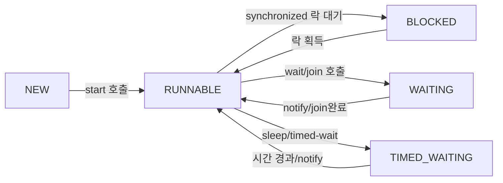
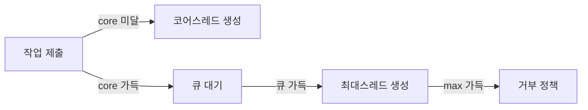
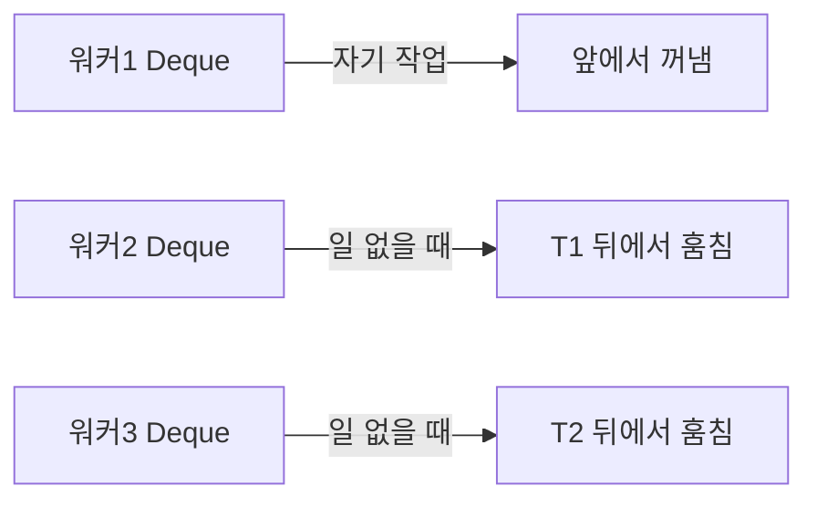

주문 처리와 이메일 발송을 순차적으로 하면 사용자는 이메일 발송이 끝날 때까지 기다려야 한다. 스레드를 분리하면 주문 처리 응답을 즉시 돌려주고 이메일은 백그라운드에서 보낼 수 있다. 하지만 스레드를 잘못 다루면 데이터가 조용히 망가진다. 예외 없이, 로그 없이, 오직 잘못된 결과만 남긴다.

> **비유로 먼저 이해하기**: 스레드는 주방의 요리사다. 요리사가 한 명(단일 스레드)이면 한 번에 한 요리만 된다. 여러 명(멀티 스레드)이면 동시에 여러 요리를 할 수 있지만, 같은 재료(공유 자원)를 동시에 집으려 하면 충돌이 생긴다. 이 충돌을 막는 규칙이 동기화다. 동기화를 너무 느슨하게 하면 데이터 충돌, 너무 엄격하게 하면 교착상태(Deadlock)가 발생한다.

Java 스레드와 동시성 프로그래밍의 핵심 개념부터 내부 메커니즘까지 시니어 면접 수준으로 완전히 정리합니다. 단순 사용법이 아니라 **왜(WHY)** 그렇게 동작하는지를 JVM 내부, 하드웨어 아키텍처, OS 스케줄러까지 파고듭니다.

---

## 1. 스레드 생명주기 — NEW부터 TERMINATED까지

### 6가지 상태와 전이 트리거

Java 스레드는 `java.lang.Thread.State` 열거형으로 정확히 6가지 상태를 가집니다. 각 전이(transition)에는 명확한 트리거가 있으며, 이를 이해해야 스레드 덤프(thread dump)를 읽을 수 있습니다.



**NEW**: `new Thread()`로 객체가 생성되었지만 `start()`가 호출되지 않은 상태. JVM 내부에는 아직 OS 커널 스레드가 존재하지 않습니다. 단순한 Java 객체일 뿐입니다.

**RUNNABLE**: `start()`를 호출하면 JVM이 OS 커널 스레드를 생성하고(`pthread_create` on Linux), OS 스케줄러의 실행 큐에 등록됩니다. RUNNABLE은 두 가지 하위 상태를 포함합니다. CPU를 실제로 사용 중인 **Running**과 CPU 할당을 기다리는 **Ready**입니다. Java Thread.State는 이 둘을 구분하지 않습니다. OS 레벨에서는 다른 상태지만 Java 레벨에서는 모두 RUNNABLE로 보입니다.

**BLOCKED**: `synchronized` 블록이나 메서드에 진입하려는데 다른 스레드가 이미 해당 객체의 모니터 락을 보유하고 있을 때 진입합니다. 락이 해제되면 다시 RUNNABLE로 돌아갑니다. BLOCKED는 오직 `synchronized` 대기에서만 발생합니다. `ReentrantLock`의 `lock()` 대기는 WAITING으로 나타납니다.

**WAITING**: `Object.wait()`, `Thread.join()`, `LockSupport.park()` 호출 시 진입합니다. 타임아웃 없이 무기한 대기합니다. 반드시 다른 스레드의 `notify()`, `notifyAll()`, `unpark()` 또는 join 대상 스레드의 종료가 있어야 깨어납니다.

**TIMED_WAITING**: `Thread.sleep(n)`, `Object.wait(n)`, `Thread.join(n)`, `LockSupport.parkNanos(n)` 호출 시 진입합니다. 지정된 시간이 경과하거나 외부 신호를 받으면 RUNNABLE로 돌아갑니다.

**TERMINATED**: `run()` 메서드가 정상 종료되거나 처리되지 않은 예외로 종료된 상태입니다. 한 번 TERMINATED가 된 스레드는 다시 시작할 수 없습니다. `start()`를 다시 호출하면 `IllegalThreadStateException`이 발생합니다.

```java
public class ThreadLifecycleDemo {
    public static void main(String[] args) throws InterruptedException {
        Object lock = new Object();

        Thread waiting = new Thread(() -> {
            synchronized (lock) {
                try {
                    lock.wait(); // WAITING 상태로 전이
                } catch (InterruptedException e) {
                    Thread.currentThread().interrupt();
                }
            }
        });

        Thread blocked = new Thread(() -> {
            synchronized (lock) { // waiting 스레드가 락 보유 중이면 BLOCKED
                System.out.println("blocked thread got lock");
            }
        });

        System.out.println("waiting state before start: " + waiting.getState()); // NEW

        synchronized (lock) {
            waiting.start();
            Thread.sleep(100); // waiting 스레드가 wait()에 진입할 시간
            System.out.println("waiting state: " + waiting.getState()); // WAITING

            blocked.start();
            Thread.sleep(100); // blocked 스레드가 synchronized 진입 시도
            System.out.println("blocked state: " + blocked.getState()); // BLOCKED

            lock.notifyAll();
        }

        waiting.join();
        blocked.join();
        System.out.println("waiting state after join: " + waiting.getState()); // TERMINATED
    }
}
```

### WHY: start()와 run()의 차이가 중요한 이유

`thread.run()`을 직접 호출하면 OS 커널 스레드가 생성되지 않습니다. 현재 스레드에서 `run()` 메서드가 단순 메서드 호출로 실행됩니다. 새로운 실행 흐름이 만들어지지 않습니다. 반드시 `start()`를 호출해야 JVM이 `Thread.start0()`이라는 native 메서드를 통해 OS에 커널 스레드 생성을 요청합니다.

---

## 2. Thread vs Runnable vs Callable — 왜 Callable이 도입되었나

### Thread와 Runnable의 한계

Java 초기(1.0)부터 스레드를 실행하는 두 가지 방법이 있었습니다.

```java
// 방법 1: Thread 상속
class MyThread extends Thread {
    @Override
    public void run() {
        System.out.println("Thread 상속 방식");
    }
}

// 방법 2: Runnable 구현 (권장)
class MyTask implements Runnable {
    @Override
    public void run() {
        System.out.println("Runnable 구현 방식");
    }
}

public class BasicThreadDemo {
    public static void main(String[] args) {
        new MyThread().start();
        new Thread(new MyTask()).start();

        // Java 8+ 람다
        new Thread(() -> System.out.println("람다 방식")).start();
    }
}
```

**Thread 상속의 문제**: Java는 단일 상속만 지원합니다. `Thread`를 상속받으면 다른 클래스를 상속받을 수 없습니다. 또한 스레드 실행 메커니즘과 비즈니스 로직이 하나의 클래스에 섞입니다.

**Runnable의 한계**: `run()` 메서드의 반환 타입은 `void`입니다. 결과값을 반환할 수 없습니다. 또한 checked exception을 던질 수 없습니다(`throws` 선언 불가). 결과를 얻으려면 공유 변수나 콜백을 사용해야 했고, 이는 동기화 문제를 유발했습니다.

### Callable 도입 — Java 5에서 해결한 두 가지 문제

Java 5(2004년)에서 `java.util.concurrent` 패키지와 함께 `Callable<V>`가 도입되었습니다.

```java
@FunctionalInterface
public interface Callable<V> {
    V call() throws Exception; // 반환값 있음, checked exception 허용
}
```

`Runnable.run()`과 비교하면 두 가지가 다릅니다. 첫째로 제네릭 반환 타입 `V`가 있어 결과를 타입 안전하게 반환할 수 있습니다. 둘째로 `throws Exception`이 있어 checked exception을 던질 수 있습니다.

### Future.get() — 비동기 결과 수집의 핵심

`Callable`의 실행 결과는 `Future<V>` 인터페이스를 통해 수집합니다.

```java
import java.util.concurrent.*;

public class CallableFutureDemo {
    public static void main(String[] args) throws ExecutionException, InterruptedException {
        ExecutorService executor = Executors.newSingleThreadExecutor();

        // Callable 제출 — 즉시 반환, 백그라운드에서 실행 시작
        Future<Integer> future = executor.submit(() -> {
            System.out.println("계산 중... thread: " + Thread.currentThread().getName());
            Thread.sleep(1000); // 시뮬레이션
            return 42;
        });

        System.out.println("다른 작업 수행 중..."); // future.get() 이전에 실행

        // future.get()은 블로킹 호출 — 결과가 준비될 때까지 현재 스레드를 WAITING 상태로 만듦
        Integer result = future.get(); // 최대 1초 대기
        System.out.println("결과: " + result); // 42

        executor.shutdown();
    }
}
```

**WHY future.get()은 블로킹인가**: `FutureTask` 내부적으로 `LockSupport.park()`를 사용합니다. 결과가 아직 없으면 호출 스레드를 WAITING 상태로 전환하고, 작업이 완료되면 `LockSupport.unpark()`로 깨웁니다. 타임아웃 버전인 `future.get(timeout, unit)`은 `LockSupport.parkNanos()`를 사용해 TIMED_WAITING 상태로 대기합니다.

```java
// 타임아웃과 예외 처리 패턴
public class FutureExceptionDemo {
    public static void main(String[] args) {
        ExecutorService executor = Executors.newSingleThreadExecutor();

        Future<String> future = executor.submit(() -> {
            if (Math.random() > 0.5) {
                throw new IOException("네트워크 오류"); // checked exception 가능
            }
            return "성공";
        });

        try {
            String result = future.get(2, TimeUnit.SECONDS);
            System.out.println("결과: " + result);
        } catch (TimeoutException e) {
            future.cancel(true); // 인터럽트로 작업 취소
            System.out.println("타임아웃으로 취소");
        } catch (ExecutionException e) {
            // Callable이 던진 예외는 ExecutionException으로 래핑됨
            Throwable cause = e.getCause(); // 원래 IOException
            System.out.println("작업 예외: " + cause.getMessage());
        } catch (InterruptedException e) {
            Thread.currentThread().interrupt();
        } finally {
            executor.shutdown();
        }
    }
}
```

---

## 3. synchronized — 모니터 락의 내부 구조

### 모니터(Monitor)란 무엇인가

Java의 모든 객체는 **모니터(Monitor)**를 가집니다. 모니터는 뮤텍스(mutex) + 조건 변수(condition variable)의 결합입니다. `synchronized` 키워드는 이 모니터를 활용합니다.

```java
public class SynchronizedDemo {
    private int count = 0;

    // 메서드 레벨 synchronized — this 객체의 모니터 사용
    public synchronized void increment() {
        count++;
    }

    // 블록 레벨 synchronized — 특정 객체의 모니터 사용
    public void incrementBlock() {
        synchronized (this) {
            count++;
        }
    }

    // static synchronized — Class 객체의 모니터 사용
    public static synchronized void staticMethod() {
        // SynchronizedDemo.class 객체의 모니터 획득
    }
}
```

### Object Header Mark Word — 락 정보가 저장되는 곳

JVM에서 Java 객체는 **Object Header**를 포함합니다. 64비트 JVM 기준 헤더는 두 부분으로 구성됩니다.

**Mark Word (8 bytes)**: 객체의 해시코드, GC 나이(age), 락 상태 정보를 저장합니다. 락 상태에 따라 Mark Word의 비트 레이아웃이 달라집니다.

**Klass Pointer (4 bytes, CompressedOops 사용 시)**: 객체의 클래스 정보를 가리키는 포인터입니다.

```
Mark Word 비트 레이아웃 (64비트 JVM):
┌────────────────────────────────────────────────────────┬────────┐
│                    내용                                │ 상태   │
├────────────────────────────────────────────────────────┼────────┤
│ [해시코드 25비트][나이 4비트][0][01]                    │ 잠금해제│
│ [스레드ID 54비트][Epoch 2비트][나이 4비트][1][01]        │ 편향락 │
│ [포인터 62비트][00]                                    │ 경량락 │
│ [포인터 62비트][10]                                    │ 중량락 │
│ [포워딩포인터 62비트][11]                               │ GC마킹 │
└────────────────────────────────────────────────────────┴────────┘
```

### 락 에스컬레이션 — Biased → Thin → Fat Lock

JVM은 성능 최적화를 위해 세 단계의 락을 사용합니다. 경합 정도에 따라 점점 무거운 락으로 **에스컬레이션(escalation)**됩니다. 락은 에스컬레이션만 되고, 다운그레이드되지 않습니다(Java 15 이전 기준).


**편향 락(Biased Locking)**: 대부분의 경우 하나의 스레드만 락을 반복적으로 획득합니다. 편향 락은 Mark Word에 해당 스레드 ID를 기록해두고, 이후 같은 스레드가 진입할 때 CAS 없이 즉시 락을 획득합니다. 락 해제도 Mark Word를 변경하지 않습니다. 비용이 거의 없습니다.

**경량 락(Thin Lock / Lightweight Lock)**: 다른 스레드가 접근하면 편향 락을 해제하고 경량 락으로 전환합니다. 스레드 스택에 **Lock Record**를 만들고 CAS(Compare-And-Swap)로 Mark Word를 교체합니다. CAS 성공 시 락 획득, 실패 시 스핀(spin)을 시도합니다. 적응형 스피닝(Adaptive Spinning)으로 과거 성공률에 따라 스핀 횟수를 조절합니다.

**중량 락(Fat Lock / Inflated Lock)**: 스핀 실패가 반복되면 OS 뮤텍스(pthread_mutex)를 사용하는 중량 락으로 에스컬레이션됩니다. 대기 스레드는 OS 수준에서 블로킹되어 CPU를 소비하지 않습니다. 하지만 OS 컨텍스트 스위칭 비용이 발생합니다.

### WHY 편향 락이 Java 15에서 제거되었나

JEP 374로 Java 15에서 편향 락이 deprecated되고 Java 21에서 완전히 제거되었습니다. 이유는 다음과 같습니다.

첫째, 현대 애플리케이션은 멀티 스레드 경합이 일반적입니다. 편향 락이 유효한 단일 스레드 접근 패턴이 드물어졌습니다.

둘째, 편향 락 취소(revocation) 비용이 큽니다. 편향된 스레드를 Safe Point까지 정지시키고 Mark Word를 복구하는 과정이 STW(Stop-The-World)와 유사합니다. ConcurrentHashMap 같은 자료구조는 의도적으로 편향 락을 비활성화했을 만큼 역효과가 있었습니다.

셋째, OpenJDK 팀의 분석에 따르면 편향 락 관련 코드가 JVM 전체에서 가장 복잡한 부분 중 하나였습니다. 유지보수 비용 대비 이점이 사라졌습니다.

```java
// 실제 synchronized 성능 확인 방법
public class MonitorDemo {
    private final Object monitor = new Object();
    private long counter = 0;

    public void increment() {
        synchronized (monitor) {
            counter++;
        }
    }

    // 재진입(Reentrant) 가능 — 같은 스레드는 이미 획득한 락을 다시 획득 가능
    public synchronized void outer() {
        System.out.println("outer: " + counter);
        inner(); // 같은 스레드이므로 즉시 재진입 가능
    }

    public synchronized void inner() {
        System.out.println("inner: " + counter);
    }
}
```

---

## 4. volatile — 메모리 가시성과 CPU 캐시

### CPU 캐시와 메모리 불일치 문제

멀티코어 CPU에서 각 코어는 자체 L1/L2 캐시를 가집니다. 스레드가 변수를 읽으면 메인 메모리에서 CPU 캐시로 복사됩니다. 수정은 캐시에 먼저 반영되고 메인 메모리에는 나중에 플러시됩니다. 이 때문에 한 스레드의 변경이 다른 스레드에 보이지 않을 수 있습니다.

```java
// volatile 없이 — 다른 스레드의 변경이 보이지 않을 수 있음
public class VisibilityProblem {
    private boolean running = true; // volatile 없음

    public void stop() {
        running = false; // CPU 캐시에만 반영, 메인 메모리 반영 보장 없음
    }

    public void run() {
        while (running) { // 캐시된 값(true)을 계속 읽어 무한 루프 가능
            doWork();
        }
    }
}

// volatile로 해결
public class VisibilitySolved {
    private volatile boolean running = true; // 항상 메인 메모리에서 읽고 씀

    public void stop() {
        running = false; // 즉시 메인 메모리에 반영
    }

    public void run() {
        while (running) { // 항상 최신 값을 읽음
            doWork();
        }
    }
}
```

### MESI 프로토콜 — 캐시 일관성 하드웨어 메커니즘

현대 CPU는 **MESI 프로토콜**로 캐시 일관성을 유지합니다. 각 캐시 라인은 네 가지 상태를 가집니다.

**M(Modified)**: 이 캐시만 수정된 값을 가지고, 메인 메모리와 다릅니다. 다른 코어의 읽기 요청 시 메인 메모리에 write-back 후 S로 전환됩니다.

**E(Exclusive)**: 이 캐시만 해당 데이터를 보유하며, 메인 메모리와 일치합니다.

**S(Shared)**: 여러 캐시가 동일한 데이터를 보유합니다. 읽기 전용입니다.

**I(Invalid)**: 캐시 라인이 무효화되었습니다. 다음 접근 시 메인 메모리나 다른 캐시에서 가져와야 합니다.

`volatile` 변수를 수정하면 JVM이 **메모리 배리어(Memory Barrier)**를 삽입하여 CPU가 캐시를 메인 메모리에 플러시하고, 다른 코어의 해당 캐시 라인을 Invalid로 만들도록 강제합니다.

### 메모리 배리어(Memory Barrier) — JVM 레벨 구현

`volatile`은 JVM이 생성하는 바이트코드에 메모리 배리어 명령어를 추가합니다.

```
volatile 쓰기 전: StoreStore 배리어 (이전 쓰기가 완료된 후 volatile 쓰기)
volatile 쓰기 후: StoreLoad 배리어 (volatile 쓰기가 완료된 후 이후 읽기)
volatile 읽기 전: LoadLoad 배리어 (이전 읽기가 완료된 후 volatile 읽기)
volatile 읽기 후: LoadStore 배리어 (volatile 읽기가 완료된 후 이후 쓰기)
```

x86 아키텍처에서 `StoreLoad` 배리어는 `MFENCE` 또는 `LOCK ADD` 명령어로 구현됩니다. 이것이 `volatile` 읽기/쓰기가 일반 변수보다 느린 이유입니다.

### happens-before 관계

Java 메모리 모델(JMM)은 **happens-before** 관계로 메모리 가시성을 정의합니다. A happens-before B란, A의 결과가 B에 반드시 보인다는 보장입니다.

`volatile` 변수의 쓰기는 이후의 해당 변수 읽기보다 happens-before 관계를 가집니다. 이를 통해 `volatile` 변수 쓰기 이전의 모든 쓰기도 이후 읽기에 보입니다.

```java
public class HappensBeforeDemo {
    private int data = 0;
    private volatile boolean ready = false;

    // 스레드 A
    public void writer() {
        data = 42;          // 1. 일반 변수 쓰기
        ready = true;       // 2. volatile 쓰기 — 1이 반드시 먼저 완료됨 (happens-before)
    }

    // 스레드 B
    public void reader() {
        if (ready) {        // 3. volatile 읽기
            // 4. data 읽기 — ready 읽기(3)가 ready 쓰기(2)를 본다면,
            //    data 읽기(4)는 data 쓰기(1)를 반드시 봄 (happens-before 전이)
            System.out.println(data); // 반드시 42
        }
    }
}
```

### WHY volatile은 복합 연산에 안전하지 않은가

`volatile`은 **단일 읽기/쓰기**의 원자성만 보장합니다. `count++`는 세 단계(읽기, 증가, 쓰기)이므로 `volatile`만으로는 스레드 안전하지 않습니다.

```java
public class VolatileLimitation {
    private volatile int count = 0;

    // 스레드 안전하지 않음! volatile은 복합 연산 원자성 보장 안 함
    public void increment() {
        count++; // read-modify-write: 원자적이지 않음
    }

    // 해결책: AtomicInteger 사용
    private final AtomicInteger atomicCount = new AtomicInteger(0);

    public void safeIncrement() {
        atomicCount.incrementAndGet(); // CAS 기반 원자적 연산
    }
}
```

---

## 5. wait()/notify() — 스레드 간 통신

### 왜 반드시 synchronized 블록 안에서 호출해야 하는가

`wait()`와 `notify()`는 반드시 해당 객체의 모니터를 보유한 상태에서 호출해야 합니다. 그렇지 않으면 `IllegalMonitorStateException`이 발생합니다. 이유는 다음과 같습니다.

**Lost Wakeup 문제 방지**: `wait()`와 `notify()` 사이의 경쟁 조건(race condition)을 방지하기 위해서입니다.

```java
// synchronized 없이는 이런 문제 발생
// 스레드 A: 조건 확인 후 wait() 호출 직전에
// 스레드 B: notify() 호출 → lost wakeup!
// 스레드 A: wait()로 진입하여 영원히 대기

// synchronized로 보호하면 조건 확인과 wait()가 원자적으로 실행됨
synchronized (lock) {
    while (!condition) { // 조건 재확인 (spurious wakeup 방어)
        lock.wait();     // 모니터를 해제하고 WAITING 상태로 전환
    }
    // 조건이 충족된 상태에서 작업 수행
}
```

`wait()` 호출 시 내부적으로 두 가지가 원자적으로 발생합니다. 첫째, 해당 객체의 모니터 락을 해제합니다. 둘째, 현재 스레드를 해당 객체의 대기 집합(Wait Set)에 추가하고 WAITING 상태로 전환합니다. 이 두 동작이 원자적이어야 하기 때문에 모니터 내부에서 실행되어야 합니다.

### 허위 깨움(Spurious Wakeup) — if가 아니라 while을 써야 하는 이유

`wait()`는 예외적으로 `notify()`나 `notifyAll()` 없이도 깨어날 수 있습니다. 이를 **허위 깨움(Spurious Wakeup)**이라 합니다. POSIX 스레드 표준이 허위 깨움을 허용하며, Linux의 `futex` 시스템 콜도 허위 반환이 가능합니다.

```java
// 잘못된 코드 — if 사용
synchronized (queue) {
    if (queue.isEmpty()) {
        queue.wait(); // 허위 깨움 후 queue가 여전히 비어있어도 진행
    }
    Object item = queue.poll(); // NPE 또는 잘못된 동작 가능
}

// 올바른 코드 — while 사용
synchronized (queue) {
    while (queue.isEmpty()) { // 깨어날 때마다 조건 재확인
        queue.wait();
    }
    Object item = queue.poll(); // 반드시 큐에 요소가 있음
}
```

### 생산자-소비자 패턴 구현

```java
import java.util.LinkedList;
import java.util.Queue;

public class ProducerConsumerDemo {
    private final Queue<Integer> queue = new LinkedList<>();
    private final int MAX_SIZE = 5;
    private final Object lock = new Object();

    // 생산자
    public void produce(int item) throws InterruptedException {
        synchronized (lock) {
            while (queue.size() == MAX_SIZE) {
                System.out.println("큐 가득 참 — 생산자 대기");
                lock.wait(); // 소비자가 빈 공간을 만들 때까지 대기
            }
            queue.offer(item);
            System.out.println("생산: " + item + ", 큐 크기: " + queue.size());
            lock.notifyAll(); // 대기 중인 소비자에게 알림
        }
    }

    // 소비자
    public int consume() throws InterruptedException {
        synchronized (lock) {
            while (queue.isEmpty()) {
                System.out.println("큐 비어있음 — 소비자 대기");
                lock.wait(); // 생산자가 아이템을 넣을 때까지 대기
            }
            int item = queue.poll();
            System.out.println("소비: " + item + ", 큐 크기: " + queue.size());
            lock.notifyAll(); // 대기 중인 생산자에게 알림
            return item;
        }
    }
}
```

### WHY notify()보다 notifyAll()이 안전한가

`notify()`는 대기 집합에서 임의의 스레드 하나만 깨웁니다. 여러 종류의 스레드가 같은 객체를 기다리면 엉뚱한 스레드가 깨어날 수 있습니다. `notifyAll()`은 모든 대기 스레드를 깨우고, 각 스레드가 `while` 루프로 조건을 재확인하게 합니다. 불필요한 스레드는 다시 `wait()`으로 돌아갑니다. 성능상 오버헤드가 있지만 정확성이 우선입니다.

---

## 6. ThreadPoolExecutor 내부 — 왜 Executors 팩토리를 피해야 하는가

### ThreadPoolExecutor 핵심 파라미터

```java
public ThreadPoolExecutor(
    int corePoolSize,           // 기본 상주 스레드 수
    int maximumPoolSize,        // 최대 스레드 수
    long keepAliveTime,         // core 초과 스레드의 유휴 생존 시간
    TimeUnit unit,
    BlockingQueue<Runnable> workQueue,      // 작업 대기열
    ThreadFactory threadFactory,            // 스레드 생성 팩토리
    RejectedExecutionHandler handler        // 큐 가득 찼을 때 처리 정책
)
```

### 스레드 풀 작업 처리 흐름



1. 현재 스레드 수 < `corePoolSize`: 새 스레드를 생성하여 작업 실행.
2. 현재 스레드 수 >= `corePoolSize`: 작업을 `workQueue`에 추가.
3. `workQueue`가 가득 참 && 현재 스레드 수 < `maximumPoolSize`: 새 스레드 생성.
4. `workQueue`가 가득 참 && 현재 스레드 수 == `maximumPoolSize`: `RejectedExecutionHandler` 호출.

### WHY Executors.newFixedThreadPool은 위험한가

```java
// Executors.newFixedThreadPool 내부 구현
public static ExecutorService newFixedThreadPool(int nThreads) {
    return new ThreadPoolExecutor(
        nThreads, nThreads,
        0L, TimeUnit.MILLISECONDS,
        new LinkedBlockingQueue<Runnable>() // 크기 제한 없음! Integer.MAX_VALUE
    );
}
```

`LinkedBlockingQueue()`의 기본 용량은 `Integer.MAX_VALUE`(약 21억)입니다. 스레드 풀이 처리할 수 없을 만큼 작업이 쌓이면 큐에 무한정 누적됩니다. 결국 `OutOfMemoryError`가 발생합니다. 거부 정책도 발동되지 않습니다.

`Executors.newCachedThreadPool()`도 위험합니다. `maximumPoolSize`가 `Integer.MAX_VALUE`입니다. 작업이 폭발적으로 들어오면 스레드를 무한정 생성하여 OOM이 발생합니다.

### 올바른 ThreadPoolExecutor 설정

```java
import java.util.concurrent.*;

public class ProperThreadPoolDemo {
    public static void main(String[] args) {
        // CPU 집약적 작업: CPU 코어 수 + 1
        int cpuCores = Runtime.getRuntime().availableProcessors();

        // I/O 집약적 작업: CPU 코어 수 * (1 + 대기시간/처리시간)
        // 예: I/O 대기 90%, 처리 10% → 코어 수 * 10

        ThreadPoolExecutor executor = new ThreadPoolExecutor(
            cpuCores,                           // corePoolSize
            cpuCores * 2,                       // maximumPoolSize
            60L, TimeUnit.SECONDS,              // keepAliveTime
            new ArrayBlockingQueue<>(1000),     // 유한 크기 큐
            new ThreadFactory() {
                private int count = 0;
                @Override
                public Thread newThread(Runnable r) {
                    Thread t = new Thread(r, "worker-" + count++);
                    t.setDaemon(true); // JVM 종료 시 자동 종료
                    return t;
                }
            },
            new ThreadPoolExecutor.CallerRunsPolicy() // 백프레셔
        );

        // 풀 상태 모니터링
        System.out.println("활성 스레드: " + executor.getActiveCount());
        System.out.println("완료 작업: " + executor.getCompletedTaskCount());
        System.out.println("큐 크기: " + executor.getQueue().size());
    }
}
```

### 거부 정책(RejectedExecutionHandler) 4가지

```java
// 1. AbortPolicy (기본값): RejectedExecutionException 던짐
// 2. CallerRunsPolicy: 제출 스레드가 직접 실행 (자연스러운 백프레셔)
// 3. DiscardPolicy: 조용히 버림 (데이터 유실 위험)
// 4. DiscardOldestPolicy: 큐에서 가장 오래된 작업을 버리고 재시도

// CallerRunsPolicy의 백프레셔 효과:
// 생산자 스레드가 작업을 직접 실행하므로 새 작업 제출 속도가 느려짐
// → 자연스럽게 부하 조절 (서킷 브레이커 역할)

public class CustomRejectedHandler implements RejectedExecutionHandler {
    @Override
    public void rejectedExecution(Runnable r, ThreadPoolExecutor executor) {
        // 메트릭 기록, 알림 발송, 재시도 큐에 저장 등
        System.err.println("작업 거부됨. 큐 크기: " + executor.getQueue().size());
        // 필요시 CallerRunsPolicy처럼 현재 스레드에서 실행
        if (!executor.isShutdown()) {
            r.run();
        }
    }
}
```

---

## 7. ReentrantLock vs synchronized — AQS 내부 구조

### AQS(AbstractQueuedSynchronizer) — 동기화의 뼈대

`ReentrantLock`, `Semaphore`, `CountDownLatch`, `CyclicBarrier` 등 `java.util.concurrent`의 대부분 동기화 도구는 **AQS(AbstractQueuedSynchronizer)**를 기반으로 합니다.

AQS의 핵심은 두 가지입니다. 하나는 `volatile int state` 필드로, 동기화 상태를 나타냅니다. 다른 하나는 **CLH 큐(Craig-Landin-Hagersten queue)**로, 락을 기다리는 스레드들의 이중 연결 리스트입니다.

```java
// AQS 핵심 구조 (OpenJDK 소스 단순화)
public abstract class AbstractQueuedSynchronizer {
    private volatile int state; // 동기화 상태

    // CLH 큐의 head/tail 노드
    private transient volatile Node head;
    private transient volatile Node tail;

    // 서브클래스가 구현해야 하는 메서드
    protected boolean tryAcquire(int arg) { throw new UnsupportedOperationException(); }
    protected boolean tryRelease(int arg) { throw new UnsupportedOperationException(); }
}
```

### CLH 큐 동작 방식

CLH 큐는 스핀락 기반의 대기 큐입니다. 각 노드는 이전 노드의 상태를 감시(spin)합니다. 락을 획득하지 못하면 노드를 큐 끝에 추가하고 이전 노드가 해제될 때까지 `LockSupport.park()`로 대기합니다.

```
CLH 큐 상태:
HEAD(가상) → Node(T1, SIGNAL) → Node(T2, WAITING) → Node(T3, WAITING) → TAIL

T1이 락 보유 중:
- T2: T1의 해제를 기다림 (park 상태)
- T3: T2가 완료될 때까지 대기
```

```java
import java.util.concurrent.locks.ReentrantLock;
import java.util.concurrent.locks.Condition;

public class ReentrantLockDemo {
    private final ReentrantLock lock = new ReentrantLock(true); // true = 공정 락
    private final Condition notEmpty = lock.newCondition();
    private final Condition notFull = lock.newCondition();

    public void fairnessDemo() throws InterruptedException {
        // tryLock: 락 획득 시도, 실패 시 즉시 반환 (synchronized로 불가)
        if (lock.tryLock()) {
            try {
                // 임계 구역
            } finally {
                lock.unlock();
            }
        } else {
            System.out.println("락 획득 실패 — 다른 작업 수행");
        }
    }

    public void timedLockDemo() throws InterruptedException {
        // 시간 제한 락 획득 시도 (synchronized로 불가)
        if (lock.tryLock(100, java.util.concurrent.TimeUnit.MILLISECONDS)) {
            try {
                // 임계 구역
            } finally {
                lock.unlock();
            }
        }
    }

    public void conditionDemo() throws InterruptedException {
        lock.lock();
        try {
            while (/* 큐가 비었으면 */ false) {
                notEmpty.await(); // Object.wait()와 동일하지만 여러 조건 변수 사용 가능
            }
            notFull.signal(); // Object.notify()와 동일
        } finally {
            lock.unlock(); // 반드시 finally에서 해제
        }
    }
}
```

### ReentrantLock vs synchronized 비교

| 특성 | synchronized | ReentrantLock |
|------|-------------|---------------|
| 락 획득 방식 | 블로킹만 | tryLock, 타임아웃 |
| 공정성 | 보장 없음 | 선택 가능 |
| 조건 변수 | 1개(wait/notify) | 다수(Condition) |
| 인터럽트 | 불가 | lockInterruptibly() |
| 성능 | JVM 최적화됨 | 유사 |
| 코드 | 간결 | 장황(try-finally) |

**WHY ReentrantLock이 필요한가**: `synchronized`는 블록 구조(block-structured)입니다. 락 획득 시도를 포기하거나(tryLock), 타임아웃을 설정하거나, 인터럽트에 반응하거나, 여러 조건 변수를 분리할 수 없습니다. 이런 고급 시나리오에서 `ReentrantLock`이 필요합니다.

**공정 락(Fair Lock)의 트레이드오프**: 공정 락은 FIFO 순서를 보장하여 starvation을 방지합니다. 하지만 스레드를 깨우는 오버헤드(park/unpark)가 추가되어 처리량이 낮아집니다. 불공정 락은 현재 실행 중인 스레드에게 락 획득 기회를 더 주므로 처리량이 높지만 이론적으로 starvation이 가능합니다.

---

## 8. CountDownLatch / CyclicBarrier / Semaphore

### CountDownLatch — 일회성 카운트다운

`CountDownLatch`는 N개의 이벤트가 완료될 때까지 하나 이상의 스레드를 대기시킵니다. 카운터는 0이 되면 재사용할 수 없습니다.

**내부 메커니즘**: AQS의 `state`를 카운터로 사용합니다. `countDown()`은 `state--`를 CAS로 수행합니다. `await()`는 `state == 0`이 될 때까지 `LockSupport.park()`로 대기합니다.

```java
import java.util.concurrent.CountDownLatch;

public class CountDownLatchDemo {
    public static void main(String[] args) throws InterruptedException {
        int workerCount = 5;
        CountDownLatch startGate = new CountDownLatch(1); // 출발 신호
        CountDownLatch endGate = new CountDownLatch(workerCount); // 완료 신호

        for (int i = 0; i < workerCount; i++) {
            final int workerId = i;
            new Thread(() -> {
                try {
                    startGate.await(); // 출발 신호 대기 — 모든 스레드가 동시에 시작
                    System.out.println("Worker " + workerId + " 작업 중");
                    Thread.sleep((long)(Math.random() * 1000));
                } catch (InterruptedException e) {
                    Thread.currentThread().interrupt();
                } finally {
                    endGate.countDown(); // 작업 완료 알림
                }
            }).start();
        }

        long start = System.nanoTime();
        startGate.countDown(); // 모든 워커 동시 출발
        endGate.await();       // 모든 워커 완료 대기
        long elapsed = System.nanoTime() - start;
        System.out.println("전체 완료: " + elapsed / 1_000_000 + "ms");
    }
}
```

### CyclicBarrier — 반복 가능한 집결점

`CyclicBarrier`는 N개의 스레드가 모두 특정 지점에 도달할 때까지 서로 기다립니다. 모두 도달하면 선택적으로 배리어 액션을 실행하고 재사용할 수 있습니다(Cyclic).

**내부 메커니즘**: `ReentrantLock`과 `Condition`을 사용합니다. `await()` 호출 시 카운터를 감소시키고, 0이 되면 `Condition.signalAll()`로 모든 스레드를 깨웁니다. 배리어는 초기 카운터로 리셋되어 재사용됩니다.

```java
import java.util.concurrent.CyclicBarrier;
import java.util.concurrent.BrokenBarrierException;

public class CyclicBarrierDemo {
    public static void main(String[] args) {
        int phases = 3;
        int threadCount = 4;

        CyclicBarrier barrier = new CyclicBarrier(threadCount, () -> {
            // 배리어 액션: 모든 스레드가 도달했을 때 한 번 실행
            System.out.println("=== 모든 스레드 집결 완료 — 다음 페이즈 시작 ===");
        });

        for (int i = 0; i < threadCount; i++) {
            final int threadId = i;
            new Thread(() -> {
                try {
                    for (int phase = 0; phase < phases; phase++) {
                        // 각 페이즈 작업 수행
                        Thread.sleep((long)(Math.random() * 500));
                        System.out.println("Thread-" + threadId + " 페이즈 " + phase + " 완료, 집결 대기");

                        barrier.await(); // 다른 스레드들 대기

                        // 여기서부터 다음 페이즈
                        System.out.println("Thread-" + threadId + " 페이즈 " + phase + " 시작");
                    }
                } catch (InterruptedException | BrokenBarrierException e) {
                    Thread.currentThread().interrupt();
                }
            }).start();
        }
    }
}
```

**CountDownLatch vs CyclicBarrier 핵심 차이**:
- `CountDownLatch`: N → 0 방향 카운트다운. 재사용 불가. 주로 1:N 대기 관계.
- `CyclicBarrier`: N개 스레드가 서로 대기. 재사용 가능. N:N 상호 대기 관계.

### Semaphore — 자원 접근 제한

`Semaphore`는 동시에 접근할 수 있는 스레드 수를 제한합니다. 데이터베이스 커넥션 풀, 파일 접근 제한 등에 활용합니다.

**내부 메커니즘**: AQS의 `state`를 허가(permit) 수로 사용합니다. `acquire()`는 `state > 0`이면 CAS로 감소시키고, `state == 0`이면 `LockSupport.park()`로 대기합니다. `release()`는 `state++` 후 대기 스레드를 깨웁니다.

```java
import java.util.concurrent.Semaphore;

public class SemaphoreDemo {
    private static final int MAX_CONNECTIONS = 3;
    private final Semaphore semaphore = new Semaphore(MAX_CONNECTIONS, true); // 공정 모드

    public void accessResource(int threadId) throws InterruptedException {
        semaphore.acquire(); // 허가 획득 (없으면 대기)
        try {
            System.out.println("Thread-" + threadId + " 자원 사용 중. 남은 허가: " + semaphore.availablePermits());
            Thread.sleep(1000); // 자원 사용 시뮬레이션
        } finally {
            semaphore.release(); // 반드시 반환
            System.out.println("Thread-" + threadId + " 자원 반환");
        }
    }

    public static void main(String[] args) {
        SemaphoreDemo demo = new SemaphoreDemo();
        for (int i = 0; i < 10; i++) {
            final int id = i;
            new Thread(() -> {
                try {
                    demo.accessResource(id);
                } catch (InterruptedException e) {
                    Thread.currentThread().interrupt();
                }
            }).start();
        }
    }
}
```

---

## 9. Deadlock — 교착상태 분석과 해결

### 4가지 필요 조건

교착상태(Deadlock)는 다음 4가지 조건이 **동시에** 성립할 때 발생합니다. 하나라도 깨면 교착상태를 예방할 수 있습니다.

**1. 상호 배제(Mutual Exclusion)**: 한 번에 하나의 스레드만 자원을 사용할 수 있습니다. (락의 본질적 특성 — 제거 불가)

**2. 점유와 대기(Hold-and-Wait)**: 자원을 보유한 채로 다른 자원을 대기합니다.

**3. 비선점(No Preemption)**: 강제로 자원을 빼앗을 수 없습니다. 자발적으로 해제해야 합니다.

**4. 순환 대기(Circular Wait)**: T1 → T2 → T3 → T1 형태의 순환 의존성이 존재합니다.

```java
// 전형적인 Deadlock 예제
public class DeadlockDemo {
    private final Object lockA = new Object();
    private final Object lockB = new Object();

    // 스레드 1: A 획득 후 B 대기
    public void method1() throws InterruptedException {
        synchronized (lockA) {
            System.out.println("Thread1: lockA 획득");
            Thread.sleep(100); // 스레드2가 lockB를 획득할 시간
            synchronized (lockB) { // lockB를 Thread2가 보유 중 → 대기
                System.out.println("Thread1: lockB 획득");
            }
        }
    }

    // 스레드 2: B 획득 후 A 대기
    public void method2() throws InterruptedException {
        synchronized (lockB) {
            System.out.println("Thread2: lockB 획득");
            Thread.sleep(100); // 스레드1이 lockA를 획득할 시간
            synchronized (lockA) { // lockA를 Thread1이 보유 중 → 대기
                System.out.println("Thread2: lockA 획득"); // 절대 실행 안 됨
            }
        }
    }
}
```

### jstack으로 Deadlock 탐지

```bash
# 실행 중인 JVM의 PID 확인
jps -l

# 스레드 덤프 출력 (jstack)
jstack <PID>

# jstack 출력 예시 (Deadlock 탐지)
# Found one Java-level deadlock:
# =============================
# "Thread-1":
#   waiting to lock monitor 0x00007f8a1c003ae8 (object 0x000000076b6a4e88, a java.lang.Object),
#   which is held by "Thread-0"
# "Thread-0":
#   waiting to lock monitor 0x00007f8a1c006168 (object 0x000000076b6a4e98, a java.lang.Object),
#   which is held by "Thread-1"
```

### Deadlock 예방 전략

```java
// 전략 1: 락 순서 정렬 (순환 대기 제거)
public class DeadlockPrevention {
    private final Object lockA = new Object();
    private final Object lockB = new Object();

    // 항상 lockA → lockB 순서로 획득 (두 메서드 모두 동일한 순서)
    public void method1() {
        synchronized (lockA) {
            synchronized (lockB) { // 항상 A 먼저
                // 작업
            }
        }
    }

    public void method2() {
        synchronized (lockA) { // method1과 동일한 순서
            synchronized (lockB) {
                // 작업
            }
        }
    }
}

// 전략 2: tryLock으로 비선점 조건 완화
public class TryLockPrevention {
    private final ReentrantLock lockA = new ReentrantLock();
    private final ReentrantLock lockB = new ReentrantLock();

    public void method() throws InterruptedException {
        while (true) {
            if (lockA.tryLock(50, TimeUnit.MILLISECONDS)) {
                try {
                    if (lockB.tryLock(50, TimeUnit.MILLISECONDS)) {
                        try {
                            // 두 락 모두 획득 성공
                            return;
                        } finally {
                            lockB.unlock();
                        }
                    }
                } finally {
                    lockA.unlock();
                }
            }
            // 두 락 중 하나라도 실패 → 잠깐 대기 후 재시도
            Thread.sleep(10 + (long)(Math.random() * 10)); // 랜덤 백오프
        }
    }
}
```

---

## 10. Thread Safety — CAS와 원자 연산

### CAS(Compare-And-Swap) — 락 없는 원자 연산

CAS는 현대 CPU가 제공하는 **단일 하드웨어 명령어**입니다. "현재 값이 예상값과 같으면 새 값으로 교체하고 true를 반환, 다르면 false를 반환"합니다. x86에서는 `CMPXCHG` 명령어로 구현됩니다.

```java
// CAS의 의사 코드 (실제로는 단일 CPU 명령어로 실행)
boolean compareAndSwap(Object obj, int expected, int newValue) {
    // 이 블록 전체가 원자적으로 실행됨 (중단 불가)
    if (obj.value == expected) {
        obj.value = newValue;
        return true;
    }
    return false;
}
```

```java
import java.util.concurrent.atomic.AtomicInteger;

public class CASDemo {
    private final AtomicInteger count = new AtomicInteger(0);

    public void increment() {
        // AtomicInteger.incrementAndGet() 내부 구현
        // do {
        //     current = get();
        //     next = current + 1;
        // } while (!compareAndSet(current, next)); // CAS 실패 시 재시도
        count.incrementAndGet();
    }

    // AtomicInteger를 사용한 스택 구현
    public static class LockFreeCounter {
        private final AtomicInteger value = new AtomicInteger(0);

        public int getAndIncrement() {
            int current;
            do {
                current = value.get();
            } while (!value.compareAndSet(current, current + 1));
            return current;
        }
    }
}
```

### ABA 문제 — CAS의 숨겨진 함정

CAS의 "현재 값 == 예상값"이라는 조건에는 함정이 있습니다. 값이 A → B → A로 변했지만 관찰하면 여전히 A처럼 보입니다. 이 사이의 변화를 놓칩니다.

```java
// ABA 문제 시나리오
// 스레드 1: 스택 top = A → pop() 준비, expected = A
// 스레드 2: pop A, pop B, push A → 스택 상태 변경됨
// 스레드 1: CAS(A, new_top) 성공 → 하지만 B는 사라짐!

// AtomicStampedReference로 해결 — 버전 번호 추가
import java.util.concurrent.atomic.AtomicStampedReference;

public class ABAProblemSolution {
    private final AtomicStampedReference<Integer> ref =
        new AtomicStampedReference<>(0, 0); // 값, 스탬프(버전)

    public void update() {
        int[] stampHolder = new int[1];
        int current = ref.get(stampHolder); // 현재 값과 스탬프 동시 획득
        int currentStamp = stampHolder[0];

        // 값과 스탬프가 모두 일치해야 CAS 성공
        boolean success = ref.compareAndSet(
            current, current + 1,        // 값: current → current+1
            currentStamp, currentStamp + 1 // 스탬프: 증가
        );

        // A → B → A로 바뀌어도 스탬프가 다르므로 CAS 실패
    }
}
```

### AtomicReference와 Unsafe

Java의 `AtomicInteger`, `AtomicLong`, `AtomicReference` 등은 내부적으로 `sun.misc.Unsafe`의 `compareAndSwapInt()` 등을 호출합니다. `Unsafe`는 JVM 내부의 저수준 메모리 조작 클래스로, 직접 CPU의 CAS 명령어를 사용합니다.

```java
import java.util.concurrent.atomic.AtomicReference;

public class AtomicReferenceDemo {
    static class Node<T> {
        T value;
        Node<T> next;
        Node(T value) { this.value = value; }
    }

    // 락 없는 스택 (Treiber Stack)
    static class LockFreeStack<T> {
        private final AtomicReference<Node<T>> top = new AtomicReference<>();

        public void push(T value) {
            Node<T> newHead = new Node<>(value);
            Node<T> oldHead;
            do {
                oldHead = top.get();
                newHead.next = oldHead;
            } while (!top.compareAndSet(oldHead, newHead)); // CAS 실패 시 재시도
        }

        public T pop() {
            Node<T> oldHead;
            Node<T> newHead;
            do {
                oldHead = top.get();
                if (oldHead == null) return null;
                newHead = oldHead.next;
            } while (!top.compareAndSet(oldHead, newHead));
            return oldHead.value;
        }
    }
}
```

---

## 11. Fork/Join — 분할 정복 병렬 처리

### Work-Stealing 알고리즘 — 왜 Deque를 사용하는가

`ForkJoinPool`은 **Work-Stealing** 알고리즘을 사용합니다. 각 워커 스레드는 자신만의 **양방향 큐(Deque, Double-Ended Queue)**를 가집니다.



**왜 Deque인가**: 각 스레드는 자신의 Deque 앞(head)에서 작업을 꺼냅니다(LIFO). 다른 스레드가 훔칠 때는 뒤(tail)에서 꺼냅니다(FIFO). 이렇게 하면 같은 노드를 두 스레드가 동시에 접근할 확률이 최소화됩니다. 작업 도둑은 가장 오래된(큰) 작업을 훔치므로 분할 오버헤드를 줄입니다.

### RecursiveTask와 RecursiveAction

```java
import java.util.concurrent.*;

public class ForkJoinDemo {

    // 결과 반환 있음 — RecursiveTask
    static class SumTask extends RecursiveTask<Long> {
        private static final int THRESHOLD = 1000; // 분할 임계값
        private final long[] array;
        private final int start, end;

        SumTask(long[] array, int start, int end) {
            this.array = array;
            this.start = start;
            this.end = end;
        }

        @Override
        protected Long compute() {
            int length = end - start;

            if (length <= THRESHOLD) {
                // 임계값 이하 — 직접 계산 (순차 처리)
                long sum = 0;
                for (int i = start; i < end; i++) {
                    sum += array[i];
                }
                return sum;
            }

            // 임계값 초과 — 두 개로 분할 (fork)
            int mid = start + length / 2;
            SumTask leftTask = new SumTask(array, start, mid);
            SumTask rightTask = new SumTask(array, mid, end);

            leftTask.fork();             // 비동기로 왼쪽 작업 제출
            long rightResult = rightTask.compute(); // 현재 스레드에서 오른쪽 처리
            long leftResult = leftTask.join();      // 왼쪽 결과 대기 (join)

            return leftResult + rightResult;
        }
    }

    public static void main(String[] args) throws InterruptedException {
        int size = 10_000_000;
        long[] array = new long[size];
        for (int i = 0; i < size; i++) array[i] = i + 1;

        ForkJoinPool pool = new ForkJoinPool(); // 기본: 코어 수만큼 워커
        SumTask task = new SumTask(array, 0, size);

        long result = pool.invoke(task);
        System.out.println("합계: " + result); // n*(n+1)/2 확인
        pool.shutdown();
    }
}
```

### WHY leftTask.fork() 후 rightTask.compute()를 현재 스레드에서 처리하는가

`leftTask.fork()` 후 `rightTask.fork()`를 하고 두 결과를 `join()`하는 패턴은 비효율적입니다. 현재 스레드가 아무 일도 안 하고 두 결과를 기다리기 때문입니다.

올바른 패턴은 `leftTask.fork()` 후 현재 스레드에서 직접 `rightTask.compute()`를 실행합니다. 현재 스레드는 유휴 상태가 되지 않습니다. 그 후 `leftTask.join()`으로 왼쪽 결과만 기다립니다. 이렇게 하면 n개의 작업에 n개의 스레드를 최대한 활용합니다.

```java
// 비효율적인 패턴 (두 번 fork)
leftTask.fork();
rightTask.fork();
return leftTask.join() + rightTask.join(); // 현재 스레드 유휴

// 효율적인 패턴 (한 번 fork, 한 번 직접 실행)
leftTask.fork();
long rightResult = rightTask.compute(); // 현재 스레드 활용
return leftTask.join() + rightResult;  // 왼쪽만 대기
```

---

## 12. 극한 시나리오

### 시나리오 1: 주문 처리 시스템에서 ThreadPool OOM

**상황**: 플래시 세일로 초당 10,000개의 주문이 들어오는데 DB 처리는 평균 50ms 걸린다. `Executors.newFixedThreadPool(200)`을 사용 중.

```java
// 문제 코드
ExecutorService pool = Executors.newFixedThreadPool(200);
// 내부: LinkedBlockingQueue() — 무한 큐!

for (Order order : orders) {
    pool.submit(() -> processOrder(order));
}
// 초당 10,000 제출, 초당 200 * (1000/50) = 4,000 처리
// 초당 6,000씩 큐에 누적 → OOM
```

```java
// 해결 코드
ThreadPoolExecutor pool = new ThreadPoolExecutor(
    200, 400,
    60L, TimeUnit.SECONDS,
    new ArrayBlockingQueue<>(2000),      // 유한 큐 — OOM 방지
    new ThreadPoolExecutor.CallerRunsPolicy() // 큐 가득 차면 HTTP 요청 스레드가 직접 처리
    // → HTTP Accept 속도 자연 감소 → 클라이언트에 자연스러운 백프레셔
);
```

### 시나리오 2: volatile 없이 플래그로 스레드 종료 시도

**상황**: `running = false`로 백그라운드 스레드를 멈추려는데 스레드가 계속 실행된다.

```java
// 문제: JIT 컴파일러가 running을 레지스터에 캐시
// 루프를 hoisting하여 while (true)처럼 최적화할 수 있음
private boolean running = true; // volatile 없음

// 해결 1: volatile 사용
private volatile boolean running = true;

// 해결 2: 인터럽트 메커니즘 활용 (더 표준적)
Thread worker = new Thread(() -> {
    while (!Thread.currentThread().isInterrupted()) {
        doWork();
    }
});
worker.start();
// 종료 시
worker.interrupt(); // isInterrupted() = true로 설정
```

### 시나리오 3: wait()/notify() 대신 notifyAll()을 써야 하는 이유

```java
// 상황: 생산자 1개, 소비자 A와 소비자 B가 동일 큐 대기
// 생산자가 아이템 추가 후 notify() 호출
// → 소비자 A가 깨어남 (소비자 B는 그대로 대기)
// → 소비자 A가 아이템 소비 후 큐 비어 있음
// → 생산자가 다시 넣고 notify()
// → 이번엔 소비자 A가 또 깨어남 (소비자 B는 영원히 대기 — starvation)

// 해결: notifyAll()로 모두 깨우고 while 루프로 조건 재확인
```

### 시나리오 4: Deadlock + 타임아웃 방어

```java
// 분산 트랜잭션에서 여러 서비스 락을 순서 없이 획득 시도
// → 서비스 A가 order 락, 서비스 B가 inventory 락 보유
// → 각각 상대방의 락을 기다림 → 분산 Deadlock

// 해결: tryLock + 랜덤 백오프 + 락 획득 순서 글로벌 정렬
// 예: 서비스 이름 알파벳 순으로 항상 동일 순서로 락 획득
```

### 시나리오 5: CAS 스핀이 오히려 CPU를 100%로 만드는 경우

```java
// 상황: 고경합 AtomicInteger에서 CAS 실패가 반복됨
// 수백 스레드가 같은 변수를 동시에 수정 → CAS 무한 재시도 → CPU 포화

// 해결: LongAdder 사용 (Java 8+)
// 내부적으로 Cell 배열에 분산하여 기록, sum()으로 합산
import java.util.concurrent.atomic.LongAdder;

LongAdder counter = new LongAdder();
counter.increment(); // 각 스레드가 자신의 Cell에 기록
long total = counter.sum(); // Cell 합산 — 읽기 시 약간의 오차 허용
```

---

## 13. 면접 포인트 5선

### Q. synchronized와 volatile의 차이를 내부 메커니즘으로 설명하라

**핵심**: `synchronized`는 원자성(Atomicity) + 가시성(Visibility) + 순서보장(Ordering)을 모두 제공합니다. `volatile`은 가시성과 순서보장만 제공하고 원자성은 단일 읽기/쓰기에 대해서만 보장합니다.

`synchronized`는 모니터 락을 통해 임계 구역에 한 번에 하나의 스레드만 진입하게 합니다. 진입 시 CPU 캐시를 메인 메모리와 동기화(invalidate)하고, 해제 시 수정 내용을 메인 메모리에 플러시합니다.

`volatile`은 메모리 배리어(x86의 MFENCE)를 삽입하여 해당 변수의 읽기/쓰기가 반드시 메인 메모리를 통하도록 강제합니다. 락을 획득하지 않으므로 여러 스레드가 동시에 읽을 수 있습니다. `count++`처럼 복합 연산은 보호하지 못합니다.

WHY: 성능 때문입니다. `volatile`은 락 없이 가시성만 필요할 때 사용합니다. 예: 상태 플래그(running), 싱글톤의 DCL(Double-Checked Locking) 패턴.

### Q. wait()는 왜 synchronized 안에서만 호출 가능한가

**핵심**: Lost Wakeup 문제를 방지하기 위해서입니다.

조건 확인(`while (!condition)`)과 대기(`wait()`)는 원자적으로 실행되어야 합니다. `synchronized` 블록이 이 원자성을 보장합니다. `synchronized` 밖에서 `wait()`를 호출하면 조건 확인 직후, `wait()` 진입 직전에 다른 스레드가 `notify()`를 호출할 수 있습니다. 그러면 `wait()`는 이미 지나간 `notify()`를 영원히 기다립니다(Lost Wakeup).

JVM 구현 상으로도, `wait()`는 내부적으로 모니터의 Wait Set에 현재 스레드를 추가하고 모니터를 해제하는 작업을 원자적으로 수행합니다. 모니터를 보유하지 않으면 이 작업이 불가능하므로 `IllegalMonitorStateException`을 던집니다.

### Q. ReentrantLock과 synchronized의 내부 차이는 무엇인가

**핵심**: `synchronized`는 JVM이 바이트코드 레벨(`monitorenter`/`monitorexit`)에서 처리하며 JVM이 직접 최적화합니다. `ReentrantLock`은 Java 코드로 구현된 AQS 기반 락입니다.

`synchronized`의 락 에스컬레이션(Biased → Thin → Fat)은 JVM이 자동으로 처리합니다. `ReentrantLock`은 항상 AQS의 CAS → CLH 큐 대기 순서를 따릅니다.

`ReentrantLock`이 필요한 경우: `tryLock()`으로 비블로킹 시도, 타임아웃 설정, `lockInterruptibly()`로 인터럽트 가능, 여러 `Condition`으로 세밀한 스레드 통신, 락 획득 대기 스레드 수 조회(`getQueueLength()`).

`synchronized`가 나은 경우: 단순하고 짧은 임계 구역, JVM의 자동 최적화 혜택, 코드 가독성.

### Q. ThreadPoolExecutor의 작업 처리 순서와 올바른 설정 방법을 설명하라

**핵심**: 작업 처리 순서는 corePoolSize → workQueue → maximumPoolSize → rejected handler입니다. 많은 개발자가 순서를 잘못 알고 있습니다. "core가 가득 차면 max까지 스레드를 늘린다"고 생각하지만, **실제로는 큐가 먼저**입니다.

`Executors` 팩토리의 문제: `newFixedThreadPool`은 무한 큐로 OOM 위험, `newCachedThreadPool`은 무한 스레드로 OOM 위험. 프로덕션에서는 직접 `ThreadPoolExecutor`를 생성하고 모든 파라미터를 명시해야 합니다.

설정 공식:
- CPU 집약적: `coreSize = N_cpu + 1`
- I/O 집약적: `coreSize = N_cpu * (1 + W/C)` (W=대기시간, C=처리시간)
- 큐 크기: 초당 처리량 * 허용 최대 대기 시간

### Q. Deadlock 4가지 조건과 실무 예방 전략을 설명하라

**핵심**: 4가지 조건(상호 배제, 점유 대기, 비선점, 순환 대기) 중 현실적으로 제거 가능한 것은 **점유 대기** 또는 **순환 대기**입니다.

**점유 대기 제거**: 필요한 모든 락을 한 번에 획득하거나, 실패 시 모두 해제합니다(`tryLock` 패턴).

**순환 대기 제거**: 모든 락에 전역 순서를 부여하고 항상 같은 순서로 획득합니다. 예를 들어 락 객체의 `System.identityHashCode()`를 기준으로 작은 것부터 획득합니다.

**실무 도구**: `jstack`으로 스레드 덤프 분석, Java Flight Recorder(JFR)로 실시간 교착상태 탐지, `ThreadMXBean.findDeadlockedThreads()`로 프로그래매틱 탐지.

```java
// 프로그래매틱 Deadlock 탐지
import java.lang.management.ManagementFactory;
import java.lang.management.ThreadMXBean;

public class DeadlockDetector {
    private final ThreadMXBean mbean = ManagementFactory.getThreadMXBean();

    public void detectDeadlock() {
        long[] deadlockedIds = mbean.findDeadlockedThreads();
        if (deadlockedIds != null) {
            System.err.println("Deadlock 탐지! 관련 스레드:");
            for (long id : deadlockedIds) {
                System.err.println(mbean.getThreadInfo(id));
            }
            // 알림 발송, 재시작 등
        }
    }
}
```

---

## 14. 추가 심화 — 실무에서 자주 쓰는 동시성 패턴

### Double-Checked Locking (DCL) 싱글톤

```java
public class Singleton {
    // volatile 필수: 객체 생성의 부분 초기화(partial initialization) 방지
    // new Singleton()은 세 단계: 메모리 할당 → 초기화 → 참조 저장
    // 컴파일러/CPU 재정렬로 초기화 전에 참조가 저장될 수 있음
    private static volatile Singleton instance;

    private Singleton() {}

    public static Singleton getInstance() {
        if (instance == null) {              // 1차 확인 (락 없이) — 성능
            synchronized (Singleton.class) {
                if (instance == null) {       // 2차 확인 (락 안에서) — 안전
                    instance = new Singleton();
                }
            }
        }
        return instance;
    }
}

// 더 간단한 대안: Holder 패턴 (volatile, synchronized 불필요)
public class SingletonHolder {
    private SingletonHolder() {}

    private static class Holder {
        // JVM의 클래스 로딩 메커니즘이 thread-safe 초기화를 보장
        static final SingletonHolder INSTANCE = new SingletonHolder();
    }

    public static SingletonHolder getInstance() {
        return Holder.INSTANCE;
    }
}
```

### BlockingQueue를 이용한 스레드 안전 생산자-소비자

```java
import java.util.concurrent.BlockingQueue;
import java.util.concurrent.LinkedBlockingQueue;

public class BlockingQueueDemo {
    private final BlockingQueue<String> queue = new LinkedBlockingQueue<>(100);

    // 생산자 — queue.put()은 가득 차면 자동으로 블로킹
    public void producer() throws InterruptedException {
        while (true) {
            String data = fetchData(); // 데이터 수집
            queue.put(data);           // 큐 가득 차면 블로킹 (wait/notify 내장)
        }
    }

    // 소비자 — queue.take()는 비면 자동으로 블로킹
    public void consumer() throws InterruptedException {
        while (true) {
            String data = queue.take(); // 큐 비면 블로킹
            process(data);
        }
    }

    private String fetchData() { return "data"; }
    private void process(String data) { System.out.println("처리: " + data); }
}
```

### CompletableFuture — 비동기 파이프라인

```java
import java.util.concurrent.CompletableFuture;
import java.util.concurrent.ExecutorService;
import java.util.concurrent.Executors;

public class CompletableFutureDemo {
    private static final ExecutorService executor =
        new ThreadPoolExecutor(4, 8, 60L, TimeUnit.SECONDS,
            new ArrayBlockingQueue<>(1000),
            new ThreadPoolExecutor.CallerRunsPolicy());

    public static void main(String[] args) throws Exception {
        CompletableFuture<String> future = CompletableFuture
            .supplyAsync(() -> fetchUser(1), executor)       // 비동기 사용자 조회
            .thenApplyAsync(user -> fetchOrders(user), executor) // 비동기 주문 조회
            .thenApplyAsync(orders -> formatReport(orders), executor) // 비동기 리포트 생성
            .exceptionally(ex -> "오류 발생: " + ex.getMessage()); // 예외 처리

        // 두 작업 병렬 실행 후 결합
        CompletableFuture<String> combined = CompletableFuture
            .allOf(
                CompletableFuture.supplyAsync(() -> "작업A", executor),
                CompletableFuture.supplyAsync(() -> "작업B", executor)
            )
            .thenApply(v -> "모든 작업 완료");

        System.out.println(future.get());
        System.out.println(combined.get());
        executor.shutdown();
    }

    static String fetchUser(int id) { return "User" + id; }
    static String fetchOrders(String user) { return user + "'s orders"; }
    static String formatReport(String orders) { return "Report: " + orders; }
}
```

---

## 정리

Java 동시성 프로그래밍의 핵심은 **왜(WHY)**를 이해하는 것입니다.

| 도구 | 적용 상황 | 핵심 메커니즘 |
|------|-----------|--------------|
| `volatile` | 단순 플래그, 가시성만 필요 | 메모리 배리어, MESI |
| `synchronized` | 일반 임계 구역 | 모니터 락, 락 에스컬레이션 |
| `ReentrantLock` | tryLock, 다중 Condition | AQS, CLH 큐 |
| `AtomicXxx` | 단일 변수 원자 연산 | CAS, CMPXCHG |
| `ThreadPoolExecutor` | 작업 병렬 처리 | 워커 스레드, 블로킹 큐 |
| `CountDownLatch` | 일회성 N개 이벤트 대기 | AQS state 카운트다운 |
| `CyclicBarrier` | 반복 집결점 | ReentrantLock + Condition |
| `Semaphore` | 자원 접근 수 제한 | AQS permit 관리 |
| `ForkJoinPool` | 분할 정복 병렬 처리 | Work-Stealing, Deque |

동시성 버그는 재현이 어렵고 디버깅이 어렵습니다. 설계 단계에서 **공유 상태를 최소화**하고, 공유가 불가피하면 **가장 단순한 도구**를 선택하고, 선택한 도구의 **내부 동작**을 이해한 상태에서 사용해야 합니다.
