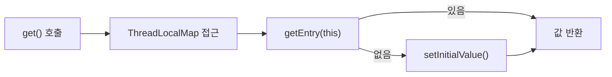
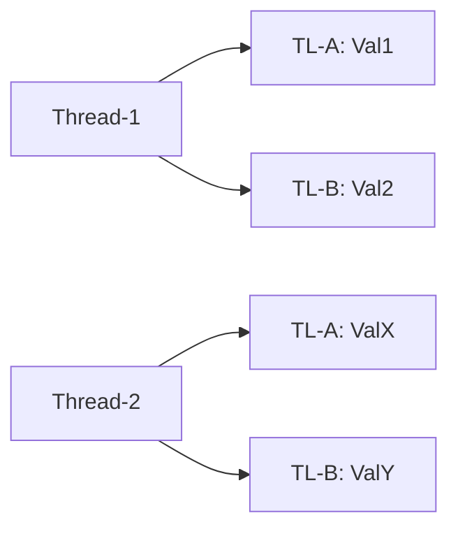
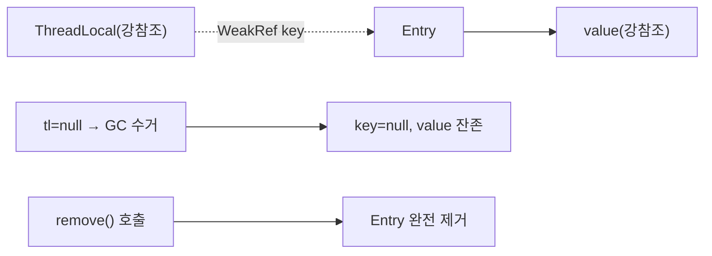
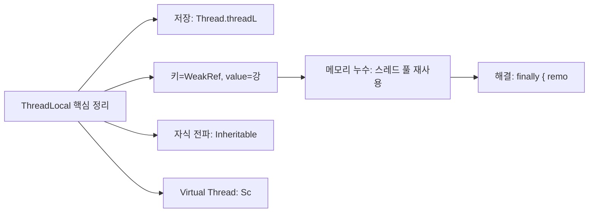

Java의 멀티스레드 환경에서 스레드 간 공유 없이 각 스레드마다 독립적인 변수를 유지해야 할 때 `ThreadLocal`을 사용합니다. 이 글에서는 ThreadLocal의 내부 구조부터 메모리 누수 방지, 실무 활용 패턴까지 깊이 있게 다룹니다.

---

## ThreadLocal이란? 왜 필요한가?

멀티스레드 환경에서 여러 스레드가 하나의 객체를 공유하면 동시성 문제(race condition)가 발생합니다. 이를 해결하는 방법은 크게 두 가지입니다.

1. **동기화(Synchronization)** — `synchronized`, `Lock` 등으로 접근을 직렬화
2. **스레드 격리(Thread Isolation)** — 스레드마다 별도의 변수 인스턴스를 유지

`ThreadLocal`은 두 번째 방식을 구현합니다. 동기화 없이 스레드별로 완전히 독립된 변수를 제공하므로, 성능 부담 없이 스레드 안전성을 확보할 수 있습니다.

```java
// 동기화 방식 — 성능 저하 발생
public class DateUtil {
    private static final SimpleDateFormat sdf = new SimpleDateFormat("yyyy-MM-dd");

    public static synchronized String format(Date date) {
        return sdf.format(date); // synchronized로 직렬화
    }
}

// ThreadLocal 방식 — 스레드별 독립 인스턴스
public class DateUtil {
    private static final ThreadLocal<SimpleDateFormat> sdfHolder =
        ThreadLocal.withInitial(() -> new SimpleDateFormat("yyyy-MM-dd"));

    public static String format(Date date) {
        return sdfHolder.get().format(date); // 동기화 불필요
    }
}
```

**ThreadLocal이 적합한 상황:**
- 요청마다 독립적으로 유지해야 하는 컨텍스트 정보 (사용자 정보, 트랜잭션 컨텍스트)
- 스레드 안전하지 않은 객체를 스레드별로 재사용 (`SimpleDateFormat`, `Random`)
- 로깅 컨텍스트(MDC) 관리

---

## 동작 원리 — Thread 내부 ThreadLocalMap 구조

`ThreadLocal`의 핵심 원리는 **값이 `ThreadLocal` 객체가 아닌 `Thread` 객체 내부에 저장된다**는 점입니다. 여러 스레드가 같은 `ThreadLocal` 인스턴스를 공유하더라도, 각 스레드는 자신의 `Thread` 객체 안에 있는 `ThreadLocalMap`에 독립적인 값을 저장합니다. `ThreadLocal` 인스턴스 자체는 단순히 맵의 키(key) 역할만 합니다.

```java
// Thread 클래스 내부 (JDK 소스)
public class Thread implements Runnable {
    // 각 Thread 인스턴스가 자신만의 맵을 가짐
    ThreadLocal.ThreadLocalMap threadLocals = null;
    ThreadLocal.ThreadLocalMap inheritableThreadLocals = null;
    // ...
}
```

`ThreadLocal.get()`을 호출하면 다음 순서로 동작합니다.



```java
// ThreadLocal.get() 내부 구현 (단순화)
public T get() {
    Thread t = Thread.currentThread();
    ThreadLocalMap map = getMap(t); // t.threadLocals 반환
    if (map != null) {
        ThreadLocalMap.Entry e = map.getEntry(this); // this = ThreadLocal 인스턴스
        if (e != null) {
            return (T) e.value;
        }
    }
    return setInitialValue(); // 초기값 설정 후 반환
}

ThreadLocalMap getMap(Thread t) {
    return t.threadLocals;
}
```

**핵심 구조 — 스레드별 독립 저장:**

각 Thread는 자신만의 `ThreadLocalMap`을 가지고, 동일한 `ThreadLocal` 키에 대해 서로 다른 값을 독립적으로 저장합니다.



---

## ThreadLocalMap 해시 충돌 처리 (Linear Probing)

`ThreadLocalMap`은 `java.util.HashMap`과 달리 **선형 탐색(Linear Probing)** 방식으로 해시 충돌을 처리합니다. 체이닝(Chaining) 방식과 달리 별도의 LinkedList 없이 배열 내에서 다음 빈 슬롯을 순차 탐색합니다.

```java
// ThreadLocalMap 내부 — 핵심 구조
static class ThreadLocalMap {
    // Entry는 WeakReference<ThreadLocal<?>>를 키로 사용
    static class Entry extends WeakReference<ThreadLocal<?>> {
        Object value;
        Entry(ThreadLocal<?> k, Object v) {
            super(k); // 키를 WeakReference로 저장
            value = v;
        }
    }

    private Entry[] table; // 내부 배열 (초기 크기 16)
    private int size = 0;
    private int threshold; // 리사이즈 임계값 (2/3 지점)

    // 해시 인덱스 계산
    private static int nextIndex(int i, int len) {
        return ((i + 1 < len) ? i + 1 : 0); // 원형 배열 순환
    }
}
```

**getEntry() 동작 방식:**

```java
private Entry getEntry(ThreadLocal<?> key) {
    int i = key.threadLocalHashCode & (table.length - 1); // 초기 인덱스
    Entry e = table[i];
    if (e != null && e.get() == key)
        return e; // 바로 찾은 경우
    else
        return getEntryAfterMiss(key, i, e); // 선형 탐색
}

private Entry getEntryAfterMiss(ThreadLocal<?> key, int i, Entry e) {
    Entry[] tab = table;
    int len = tab.length;
    while (e != null) {
        ThreadLocal<?> k = e.get();
        if (k == key)
            return e; // 발견
        if (k == null)
            expungeStaleEntry(i); // 만료된 엔트리 정리 (stale entry cleanup)
        else
            i = nextIndex(i, len); // 다음 슬롯으로
        e = tab[i];
    }
    return null;
}
```

**Linear Probing 충돌 예시:**

초기 상태(배열 크기 8)에서 ThreadLocal-A와 ThreadLocal-B가 모두 인덱스 3에 해시되면, B는 4번 슬롯으로 밀립니다. 이후 A가 GC로 수거되면 인덱스 3의 키(WeakRef)는 null이 되지만 value는 남아 만료 엔트리(stale entry)가 됩니다.


---

## WeakReference 키와 메모리 누수

### 왜 Entry의 key가 WeakReference인가?

`ThreadLocalMap.Entry`의 키는 `WeakReference<ThreadLocal<?>>`로 저장됩니다. 이 설계의 이유는 **ThreadLocal 변수가 더 이상 사용되지 않을 때 GC가 수거할 수 있도록** 하기 위함입니다.

강참조(Strong Reference)로 저장했다면, 외부에서 `ThreadLocal` 변수를 null로 해도 `ThreadLocalMap`이 강참조를 유지해 GC가 수거하지 못합니다. WeakReference를 사용하면 외부 강참조가 사라졌을 때 GC가 키를 수거할 수 있습니다.

단, **키가 수거되어도 value는 여전히 강참조로 남습니다.** 이것이 메모리 누수의 원인입니다.



### 메모리 누수 시나리오 (스레드 풀 + ThreadLocal)

스레드 풀 환경에서는 스레드가 재사용되므로 `ThreadLocal.remove()`를 호출하지 않으면 이전 요청의 값이 남아있게 됩니다.

1. 스레드 풀에서 Thread-1이 요청 처리
2. ThreadLocal에 대용량 객체(예: Map) 저장
3. 요청 처리 완료, Thread-1은 풀에 반환
4. 해당 ThreadLocal 변수가 외부에서 null 참조로 변경
5. GC → Entry.key(WeakRef) = null (키는 수거됨)
6. 하지만 Entry.value(강참조)는 여전히 살아있음
7. Thread-1이 풀에 살아있는 동안 메모리 누수 지속

```java
// 메모리 누수 발생 코드
public class LeakyService {
    private static ThreadLocal<Map<String, Object>> contextHolder = new ThreadLocal<>();

    public void processRequest(Map<String, Object> data) {
        contextHolder.set(data); // 스레드 풀에서 실행
        try {
            doProcess();
        } finally {
            // remove() 호출 없음 → 메모리 누수!
        }
    }
}

// 올바른 코드
public class SafeService {
    private static final ThreadLocal<Map<String, Object>> contextHolder =
        ThreadLocal.withInitial(HashMap::new);

    public void processRequest(Map<String, Object> data) {
        contextHolder.set(data);
        try {
            doProcess();
        } finally {
            contextHolder.remove(); // 반드시 제거
        }
    }
}
```

### remove() 필수 호출

`remove()`는 단순한 메모리 절약이 아닌 **정확성(correctness)** 문제이기도 합니다.

```java
// 스레드 풀에서 remove() 없을 때 발생하는 버그
@RestController
public class UserController {
    private static final ThreadLocal<String> currentUser = new ThreadLocal<>();

    @GetMapping("/profile")
    public String getProfile() {
        String user = resolveUserFromToken(); // 요청에서 사용자 추출
        currentUser.set(user);
        return userService.getProfile(currentUser.get());
        // remove() 없음 → 다음 요청에서 이전 사용자 정보가 남아있을 수 있음
    }
}

// Filter에서 안전하게 관리
@Component
public class UserContextFilter implements Filter {
    @Override
    public void doFilter(ServletRequest req, ServletResponse res, FilterChain chain)
            throws IOException, ServletException {
        try {
            currentUser.set(extractUser(req));
            chain.doFilter(req, res);
        } finally {
            currentUser.remove(); // 반드시 finally에서 제거
        }
    }
}
```

**stale entry 자동 정리:** `ThreadLocalMap`은 `get()`, `set()`, `remove()` 호출 시 `expungeStaleEntry()`를 통해 키가 null인 만료 엔트리를 자동 정리하지만, 이는 보조 메커니즘일 뿐 `remove()` 호출을 대체하지 않습니다.

---

## InheritableThreadLocal — 자식 스레드로 값 전파

`InheritableThreadLocal`은 부모 스레드의 값을 자식 스레드가 상속받을 수 있도록 합니다.

```java
// Thread 내부
ThreadLocal.ThreadLocalMap inheritableThreadLocals = null;

// Thread 생성 시 상속 처리 (Thread 생성자 내부)
private void init(ThreadGroup g, Runnable target, ...) {
    Thread parent = currentThread();
    if (parent.inheritableThreadLocals != null) {
        this.inheritableThreadLocals =
            ThreadLocal.createInheritedMap(parent.inheritableThreadLocals);
    }
}
```

```java
// 사용 예시
public class InheritableExample {
    private static final InheritableThreadLocal<String> requestId =
        new InheritableThreadLocal<>();

    public static void main(String[] args) throws InterruptedException {
        requestId.set("REQ-001");
        System.out.println("Parent: " + requestId.get()); // REQ-001

        Thread child = new Thread(() -> {
            System.out.println("Child: " + requestId.get()); // REQ-001 (상속됨)
            requestId.set("REQ-002"); // 자식에서 변경
            System.out.println("Child modified: " + requestId.get()); // REQ-002
        });
        child.start();
        child.join();

        System.out.println("Parent after: " + requestId.get()); // REQ-001 (부모는 영향 없음)
    }
}
```

**주의사항:**
- 값의 **복사(shallow copy)** 가 이루어지므로 참조 타입의 경우 같은 객체를 가리킵니다.
- 스레드 풀에서는 스레드 생성 시점(풀 초기화 시)에만 상속이 일어나므로 요청마다 다른 값이 전파되지 않습니다.
- 스레드 풀 환경에서는 `TransmittableThreadLocal`(Alibaba 오픈소스) 사용을 권장합니다.

```java
// 값 상속 방식 커스터마이즈
InheritableThreadLocal<List<String>> listHolder = new InheritableThreadLocal<>() {
    @Override
    protected List<String> childValue(List<String> parentValue) {
        // deep copy로 독립성 보장
        return parentValue == null ? null : new ArrayList<>(parentValue);
    }
};
```

---

## 실무 활용 패턴

### 사용자 인증 정보 (SecurityContextHolder)

Spring Security의 `SecurityContextHolder`는 ThreadLocal 기반입니다.

```java
// Spring Security 내부 방식과 유사한 구현
public class SecurityContextHolder {
    private static final ThreadLocal<SecurityContext> contextHolder =
        new ThreadLocal<>();

    public static SecurityContext getContext() {
        SecurityContext ctx = contextHolder.get();
        if (ctx == null) {
            ctx = createEmptyContext();
            contextHolder.set(ctx);
        }
        return ctx;
    }

    public static void clearContext() {
        contextHolder.remove(); // 반드시 호출 필요
    }
}

// 서비스 레이어에서 사용
@Service
public class OrderService {
    public Order createOrder(OrderRequest request) {
        // SecurityContextHolder에서 현재 사용자 조회
        Authentication auth = SecurityContextHolder.getContext().getAuthentication();
        String userId = auth.getName();
        // ... 주문 생성 로직
    }
}
```

### 트랜잭션 컨텍스트

Spring의 트랜잭션 관리는 내부적으로 `TransactionSynchronizationManager`를 통해 ThreadLocal로 Connection을 관리합니다.

```java
// Spring의 TransactionSynchronizationManager 내부 방식
public abstract class TransactionSynchronizationManager {
    private static final ThreadLocal<Map<Object, Object>> resources =
        new NamedThreadLocal<>("Transactional resources");

    private static final ThreadLocal<Boolean> actualTransactionActive =
        new NamedThreadLocal<>("Actual transaction active");

    public static Object getResource(Object key) {
        Map<Object, Object> map = resources.get();
        return map != null ? map.get(key) : null;
    }
}

// 실무에서 트랜잭션 컨텍스트 직접 활용 예
@Component
public class TenantContextHolder {
    private static final ThreadLocal<String> currentTenant =
        ThreadLocal.withInitial(() -> "default");

    public static String getCurrentTenant() {
        return currentTenant.get();
    }

    public static void setCurrentTenant(String tenant) {
        currentTenant.set(tenant);
    }

    public static void clear() {
        currentTenant.remove();
    }
}
```

### 날짜 포맷터 (SimpleDateFormat 스레드 안전)

`SimpleDateFormat`은 스레드 안전하지 않아 공유 시 파싱 오류가 발생합니다.

```java
public class ThreadSafeDateUtil {
    // ThreadLocal로 스레드별 독립 인스턴스 유지
    private static final ThreadLocal<SimpleDateFormat> DATE_FORMAT =
        ThreadLocal.withInitial(() -> new SimpleDateFormat("yyyy-MM-dd HH:mm:ss"));

    private static final ThreadLocal<SimpleDateFormat> DATE_ONLY_FORMAT =
        ThreadLocal.withInitial(() -> new SimpleDateFormat("yyyy-MM-dd"));

    public static String formatDateTime(Date date) {
        return DATE_FORMAT.get().format(date);
    }

    public static Date parseDateOnly(String dateStr) throws ParseException {
        return DATE_ONLY_FORMAT.get().parse(dateStr);
    }
}

// 참고: Java 8+ DateTimeFormatter는 불변 객체라 ThreadLocal 불필요
private static final DateTimeFormatter FORMATTER =
    DateTimeFormatter.ofPattern("yyyy-MM-dd HH:mm:ss"); // thread-safe
```

### MDC (Mapped Diagnostic Context)

Logback/Log4j2의 MDC는 ThreadLocal 기반으로 동작합니다.

```java
// Filter에서 traceId 설정
@Component
@Order(1)
public class TraceIdFilter implements Filter {
    @Override
    public void doFilter(ServletRequest req, ServletResponse res, FilterChain chain)
            throws IOException, ServletException {
        String traceId = UUID.randomUUID().toString().replace("-", "").substring(0, 16);
        MDC.put("traceId", traceId);
        try {
            chain.doFilter(req, res);
        } finally {
            MDC.clear(); // ThreadLocal 정리
        }
    }
}

// 로그에서 traceId 자동 출력
// logback-spring.xml 패턴: [%X{traceId}] %msg%n
log.info("주문 처리 시작"); // [a1b2c3d4e5f60001] 주문 처리 시작
```

---

## Virtual Thread(Java 21)와 ThreadLocal 문제

Java 21에서 도입된 Virtual Thread는 스레드 수가 수백만 개까지 늘어날 수 있습니다. 이때 ThreadLocal은 두 가지 문제를 야기합니다.

**1. 메모리 문제:** Virtual Thread 수만큼 ThreadLocalMap이 생성되어 메모리 급증

**2. 핀닝(Pinning) 문제:** ThreadLocal 접근 시 OS 스레드 핀닝이 발생할 수 있어 Virtual Thread의 이점을 상쇄

```java
// 문제: 100만 개 Virtual Thread에 ThreadLocal 사용
try (var executor = Executors.newVirtualThreadPerTaskExecutor()) {
    for (int i = 0; i < 1_000_000; i++) {
        executor.submit(() -> {
            threadLocalValue.set(new LargeObject()); // 100만 개의 LargeObject!
            // ...
        });
    }
}
```

### ScopedValue 대안

Java 21에서 Preview로 도입된 `ScopedValue`는 Virtual Thread 환경에 최적화된 ThreadLocal 대체제입니다.

```java
// ScopedValue — Java 21+ (Preview)
public class ScopedValueExample {
    // final로 선언, 불변 바인딩
    public static final ScopedValue<String> CURRENT_USER = ScopedValue.newInstance();

    public void handleRequest(String userId) {
        // ScopedValue.where()로 범위 지정 실행
        ScopedValue.where(CURRENT_USER, userId).run(() -> {
            processRequest();
        });
        // 블록 벗어나면 자동으로 값 해제 — remove() 불필요
    }

    private void processRequest() {
        String user = CURRENT_USER.get(); // 현재 범위의 값 조회
        log.info("처리 중인 사용자: {}", user);
    }
}
```

**ThreadLocal vs ScopedValue 비교:**

| 항목 | ThreadLocal | ScopedValue |
|------|-------------|-------------|
| 값 변경 | 언제든 가능 (`set()`) | 불가 (불변 바인딩) |
| 값 해제 | 수동 (`remove()`) | 자동 (범위 종료 시) |
| 상속 | InheritableThreadLocal 필요 | 기본적으로 자식 스레드 전파 |
| Virtual Thread | 메모리 문제 가능 | 최적화됨 |
| 가용 버전 | Java 1.2+ | Java 21+ (Preview) |
| 메모리 누수 위험 | 높음 | 없음 |

---

## ThreadLocal 안티패턴과 Best Practice

### 안티패턴

**1. static 필드에 저장하되 remove() 미호출**

```java
// 안티패턴
public class BadExample {
    public static final ThreadLocal<Connection> connectionHolder = new ThreadLocal<>();
    // remove() 호출 없음 → 스레드 풀에서 메모리 누수
}
```

**2. ThreadLocal에 무거운 객체 저장**

```java
// 안티패턴
ThreadLocal<byte[]> bufferHolder = ThreadLocal.withInitial(() -> new byte[1024 * 1024]); // 1MB 버퍼
// 스레드마다 1MB 차지, 스레드 풀 크기 * 1MB 메모리 점유
```

**3. 스레드 풀에서 InheritableThreadLocal 의존**

```java
// 안티패턴 — 스레드 풀에서는 생성 시점 값이 상속됨
ExecutorService pool = Executors.newFixedThreadPool(4);
inheritableLocal.set("request-123");
pool.submit(() -> {
    // "request-123"이 아닌 풀 생성 시점의 값이 올 수 있음
    System.out.println(inheritableLocal.get());
});
```

### Best Practice

```java
// Best Practice 1: 항상 finally에서 remove()
public void execute() {
    threadLocal.set(value);
    try {
        doWork();
    } finally {
        threadLocal.remove(); // 필수
    }
}

// Best Practice 2: withInitial()로 기본값 설정
private static final ThreadLocal<List<String>> logBuffer =
    ThreadLocal.withInitial(ArrayList::new);

// Best Practice 3: static final로 선언 (하나의 ThreadLocal 인스턴스 재사용)
private static final ThreadLocal<Context> contextHolder = new ThreadLocal<>();
// non-static이면 인스턴스마다 ThreadLocal이 생성되어 관리 복잡도 증가

// Best Practice 4: 래퍼 클래스로 생명주기 캡슐화
public class RequestContext {
    private static final ThreadLocal<RequestContext> holder = new ThreadLocal<>();

    private final String traceId;
    private final String userId;

    private RequestContext(String traceId, String userId) {
        this.traceId = traceId;
        this.userId = userId;
    }

    public static void set(String traceId, String userId) {
        holder.set(new RequestContext(traceId, userId));
    }

    public static RequestContext get() {
        return holder.get();
    }

    public static void clear() {
        holder.remove();
    }

    public String getTraceId() { return traceId; }
    public String getUserId() { return userId; }
}
```

---

## 비유와 극한 시나리오

### 비유: 개인 사물함

ThreadLocal은 회사의 개인 사물함과 같습니다. 사물함 번호(ThreadLocal 인스턴스)는 모든 직원이 알지만, 각자의 사물함에는 자신의 물건만 들어 있습니다. 사무실(Thread)을 바꿔도 사물함 번호로 자신의 물건을 찾습니다. 퇴직(스레드 종료)할 때 사물함을 비우지 않으면(remove() 미호출) 내용물이 방치됩니다.

### 극한 시나리오: 대규모 웹 서비스에서의 사용자 정보 오염

```java
// 50개 스레드 풀에서 운영되는 REST API
// 특정 요청에서 remove()를 빠뜨린 경우

@RestController
class OrderController {
    private static final ThreadLocal<String> currentUserId = new ThreadLocal<>();

    @GetMapping("/orders")
    public List<Order> getOrders(HttpServletRequest request) {
        String userId = extractUserId(request);
        currentUserId.set(userId);
        return orderService.getOrders();
        // remove() 없음!
    }
}

// 스레드 풀 크기 50, TPS 1000
// 스레드 재사용 시 이전 사용자의 userId가 남아있음
// A 사용자 요청 → Thread-1에 "user-A" 저장
// Thread-1이 pool에 반환 후 B 사용자 요청이 Thread-1에 배정
// currentUserId.get() → "user-A" (B가 A의 주문을 볼 수 있음!)
// → 심각한 데이터 유출 보안 사고
```

### 실무 실수

**실수 1: static이 아닌 ThreadLocal 필드 선언**

```java
// 안티패턴: 인스턴스 필드로 ThreadLocal 선언
@Service
class UserService {
    private ThreadLocal<String> currentUser = new ThreadLocal<>();
    // 서비스 빈이 프로토타입 스코프가 아닌 한 사실상 static처럼 동작하지만
    // 인스턴스마다 별도 ThreadLocal 생성 → 불필요한 복잡도
}

// 올바른 패턴
@Service
class UserService {
    private static final ThreadLocal<String> currentUser = new ThreadLocal<>();
}
```

**실수 2: 비동기 처리에서 ThreadLocal 값 미전달**

```java
// 문제: CompletableFuture로 비동기 처리 시 ThreadLocal 값이 전달되지 않음
@Service
class AsyncService {
    public CompletableFuture<Result> processAsync() {
        String traceId = TraceContext.getTraceId(); // ThreadLocal에서 가져옴
        return CompletableFuture.supplyAsync(() -> {
            // 별도 스레드에서 실행 → traceId ThreadLocal 값이 없음!
            String id = TraceContext.getTraceId(); // null 또는 다른 값
            return doWork();
        });
    }
}

// 해결: 명시적 값 전달
public CompletableFuture<Result> processAsync() {
    String traceId = TraceContext.getTraceId();
    return CompletableFuture.supplyAsync(() -> {
        TraceContext.setTraceId(traceId); // 새 스레드에 명시적 설정
        try {
            return doWork();
        } finally {
            TraceContext.clear(); // 정리
        }
    });
}
```

---

## 왜 이 기술인가? — ThreadLocal vs 대안들

| 비교 항목 | ThreadLocal | 메서드 파라미터 전달 | synchronized 공유 변수 | ScopedValue (Java 21+) |
|-----------|------------|------------------|----------------------|------------------------|
| 스레드 격리 | O | O (명시적) | X (공유) | O |
| 코드 침습성 | 낮음 (전역 접근) | 높음 (모든 시그니처 변경) | 낮음 | 낮음 |
| 성능 | 높음 (락 없음) | 높음 | 낮음 (락 경합) | 높음 |
| 메모리 누수 위험 | 높음 (remove 필수) | 없음 | 낮음 | 없음 (자동 해제) |
| 가변성 | O (set/get 자유) | O | O | X (불변 바인딩) |
| Virtual Thread | 메모리 주의 | 문제없음 | 문제없음 | 최적화됨 |

**언제 ThreadLocal을 선택하는가?**

요청 컨텍스트(사용자 인증 정보, 트랜잭션 ID, 로케일)를 호출 스택 전체에서 접근해야 하는데, 모든 메서드 시그니처를 바꾸는 것이 현실적으로 불가능할 때입니다. Spring Security, MDC, Spring 트랜잭션 관리가 이 패턴을 사용합니다.

**언제 ThreadLocal을 피해야 하는가?**

비동기 처리(`CompletableFuture`, `@Async`)에서는 다른 스레드로 컨텍스트가 전달되지 않습니다. 스레드 풀 환경에서 `remove()`를 누락하면 값 오염과 메모리 누수가 동시에 발생합니다. Java 21+ Virtual Thread를 대량 사용하는 경우 `ScopedValue`가 더 안전합니다.

---

## 실무에서 자주 하는 실수

**실수 1: 스레드 풀에서 remove() 미호출로 값 오염**

```java
// 심각한 보안 버그 — 50개 스레드 풀에서 운영 중인 REST API
@RestController
class OrderController {
    private static final ThreadLocal<String> currentUserId = new ThreadLocal<>();

    @GetMapping("/orders")
    public List<Order> getOrders(HttpServletRequest req) {
        currentUserId.set(extractUserId(req));
        return orderService.getOrders(currentUserId.get());
        // remove() 없음! → Thread-1이 "user-A"를 저장 후 풀에 반환
        // 다음 요청 Thread-1이 재사용될 때 "user-A"가 그대로 남아있음
        // B 사용자가 A의 주문을 볼 수 있는 데이터 유출 발생!
    }
}

// 올바른 패턴 — Filter에서 생명주기 관리
public void doFilter(ServletRequest req, ServletResponse res, FilterChain chain) {
    try {
        currentUserId.set(extractUserId(req));
        chain.doFilter(req, res);
    } finally {
        currentUserId.remove(); // 반드시 finally에서 제거
    }
}
```

**실수 2: 비동기 처리에서 ThreadLocal 값 미전달**

```java
// 문제: CompletableFuture는 다른 스레드에서 실행
@Service
class ReportService {
    public CompletableFuture<Report> generateAsync() {
        String tenantId = TenantContext.get(); // ThreadLocal에서 가져옴
        return CompletableFuture.supplyAsync(() -> {
            // 별도 스레드 → tenantId ThreadLocal 값이 없음!
            String id = TenantContext.get(); // null → NullPointerException
            return queryReport(id);
        });
    }
}

// 해결: 값을 명시적으로 캡처해서 전달
public CompletableFuture<Report> generateAsync() {
    String tenantId = TenantContext.get(); // 현재 스레드에서 캡처
    return CompletableFuture.supplyAsync(() -> {
        TenantContext.set(tenantId); // 새 스레드에 명시적 설정
        try {
            return queryReport(tenantId);
        } finally {
            TenantContext.clear(); // 정리
        }
    });
}
```

**실수 3: static이 아닌 ThreadLocal 인스턴스 필드 선언**

```java
// 안티패턴: 인스턴스마다 다른 ThreadLocal 생성
@Service // 싱글톤이지만...
class BadService {
    private ThreadLocal<String> local = new ThreadLocal<>(); // non-static
    // 스프링 빈이 프로토타입이면 매 요청마다 새 ThreadLocal 생성 → 관리 불가
}

// 올바른 패턴: static final로 선언
@Service
class GoodService {
    private static final ThreadLocal<String> local = new ThreadLocal<>();
    // 하나의 ThreadLocal 인스턴스, 스레드별로 독립된 값 저장
}
```

---

## 면접 포인트

**Q1. ThreadLocal의 메모리 누수 원인을 설명하세요.**

`ThreadLocalMap.Entry`의 키는 `WeakReference<ThreadLocal<?>>`입니다. 외부에서 ThreadLocal 변수를 null로 해도 키의 WeakReference가 GC에 의해 수거됩니다. 그러나 Entry의 value는 강참조로 남아 있습니다. 스레드 풀의 스레드는 JVM 종료까지 살아있으므로, 스레드가 살아있는 한 값이 계속 메모리를 점유합니다. 해결책은 반드시 `finally`에서 `remove()`를 호출하는 것입니다.

**Q2. ThreadLocal.withInitial()의 사용 목적은?**

`get()`을 처음 호출할 때 null 대신 기본값을 반환하도록 초기값 공급자를 지정합니다. `ThreadLocal.withInitial(() -> new ArrayList<>())`처럼 사용하면 각 스레드가 처음 `get()` 호출 시 새 ArrayList를 받습니다. null 체크 없이 바로 사용할 수 있어 코드가 간결해집니다.

**Q3. InheritableThreadLocal의 한계는?**

부모 스레드에서 자식 스레드를 생성할 때 값을 상속합니다. 그러나 스레드 풀에서는 스레드가 풀 초기화 시점에 한 번만 생성됩니다. 이후 요청마다 스레드를 재사용하므로 부모(요청 처리) 스레드의 값이 자식 스레드에 전파되지 않습니다. 스레드 풀 + 컨텍스트 전파가 필요하면 Alibaba의 `TransmittableThreadLocal(TTL)`을 사용합니다.

**Q4. ScopedValue와 ThreadLocal의 핵심 차이는?**

`ThreadLocal`은 언제든 `set()`으로 값을 변경할 수 있고 `remove()`를 수동으로 호출해야 합니다. `ScopedValue`는 `where().run()` 블록 내에서만 유효한 불변 바인딩입니다. 블록을 벗어나면 자동으로 해제됩니다. Virtual Thread 환경에서 수백만 개의 스레드가 생성될 때 메모리 효율이 훨씬 좋습니다. Java 21+ 권장 대안입니다.

**Q5. Spring Security는 왜 ThreadLocal을 사용하나요?**

HTTP 요청-응답 주기 동안 인증된 사용자 정보(`Authentication`)를 어디서든 접근할 수 있어야 합니다. 메서드 파라미터로 전달하면 모든 서비스/레포지토리 메서드 시그니처에 `Authentication`이 추가되어야 합니다. ThreadLocal을 사용하면 코드 침습 없이 `SecurityContextHolder.getContext().getAuthentication()`으로 어디서나 접근 가능합니다. Spring이 `SecurityContextPersistenceFilter`에서 요청 시작 시 설정하고 종료 시 정리합니다.

---

## 전체 구조 요약



ThreadLocal은 올바르게 사용하면 동기화 없이 스레드 안전성을 확보하는 강력한 도구입니다. 핵심은 **사용 후 반드시 `remove()` 호출**하는 것입니다. 특히 스레드 풀 환경에서는 이를 소홀히 하면 값 오염과 메모리 누수라는 두 가지 위험이 동시에 발생합니다.

---
## 면접 포인트

**Q1. ThreadLocal 메모리 누수의 정확한 메커니즘은?**
`ThreadLocalMap`의 Entry는 `WeakReference<ThreadLocal>`을 키로 사용합니다. ThreadLocal 객체 자체가 GC되면 키가 null이 됩니다. 그러나 value는 강한 참조로 남아있습니다. 스레드 풀에서 스레드가 재사용될 때 이 null 키 + 살아있는 value가 계속 누적됩니다. `remove()`를 호출하지 않으면 스레드가 살아있는 한 value가 GC되지 않습니다. 대용량 객체(HttpServletRequest, DB Connection)를 value로 저장하고 remove 없이 반환하면 OutOfMemory로 이어집니다.

**Q2. Spring Security의 SecurityContextHolder가 ThreadLocal을 사용하는 이유는?**
HTTP 요청 처리는 단일 스레드에서 Controller → Service → Repository 전체가 실행됩니다. 인증 정보를 모든 메서드 파라미터로 전달하면 모든 메서드 시그니처가 오염됩니다. ThreadLocal에 저장하면 같은 스레드 어디서든 `SecurityContextHolder.getContext().getAuthentication()`으로 접근 가능합니다. 요청 완료 후 Filter에서 `SecurityContextHolder.clearContext()`로 반드시 정리합니다. Spring Security의 `SecurityContextPersistenceFilter`가 이 정리를 자동으로 수행합니다.

**Q3. Virtual Thread 환경에서 ThreadLocal 사용의 문제점은?**
Virtual Thread는 수백만 개가 동시에 존재할 수 있습니다. 각 Virtual Thread가 독립적인 ThreadLocalMap을 가지므로 ThreadLocal value가 수백만 개의 복사본으로 증가합니다. 수백만 개의 `RequestContext`, `UserContext` 복사본이 힙을 점유합니다. Java 21의 `ScopedValue`가 대안입니다. 불변 값을 특정 실행 범위에서만 접근 가능하게 하고, 메모리를 공유해 복사본 문제가 없습니다.

**Q4. InheritableThreadLocal의 동작과 주의사항은?**
`InheritableThreadLocal`은 부모 스레드의 값을 자식 스레드가 상속합니다. `Thread` 생성 시 부모의 `inheritableThreadLocals`를 복사합니다. 스레드 풀의 스레드는 풀에 처음 생성될 때 부모(요청 스레드)의 값을 상속합니다. 그러나 이후 재사용되는 풀 스레드는 다른 요청의 자식이지만 첫 번째 요청의 값을 가지고 있을 수 있습니다. 실무에서 스레드 풀과 InheritableThreadLocal 조합은 데이터 오염을 일으킵니다. Alibaba의 TransmittableThreadLocal이 이 문제를 해결합니다.

**Q5. MDC(Mapped Diagnostic Context)와 ThreadLocal의 관계는?**
SLF4J의 MDC는 내부적으로 ThreadLocal을 사용합니다. `MDC.put("traceId", "abc123")`으로 저장하면 같은 스레드의 모든 로그에 `traceId=abc123`이 자동 포함됩니다. 분산 추적에서 요청 ID를 MDC에 저장하면 해당 요청의 전체 로그를 추적 ID로 필터링할 수 있습니다. 단, 비동기 처리(`@Async`, `CompletableFuture`)에서는 다른 스레드로 MDC 컨텍스트가 전달되지 않습니다. `MDCAdapter`를 구현하거나 작업 제출 시 MDC 스냅샷을 명시적으로 복사해야 합니다.
