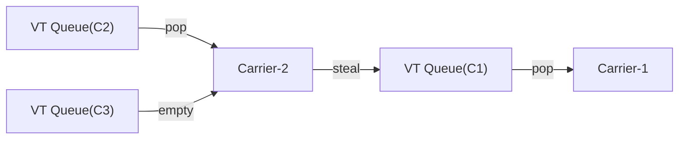
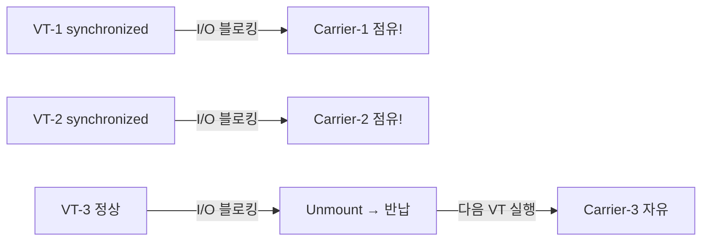

> **비유로 먼저 이해하기**: 고속도로 톨게이트를 떠올려 보세요. 플랫폼 스레드는 차량 한 대가 통과할 때 톨게이트 직원 한 명을 완전히 점유합니다. 차가 카드를 찾는 동안(I/O 대기)에도 직원은 옆 차를 볼 수 없습니다. 가상 스레드는 다릅니다. 카드를 찾는 동안 직원은 즉시 옆 차로 이동합니다. 직원(Carrier Thread)은 CPU 코어 수만큼만 있어도 수백만 대의 차량(Virtual Thread)을 처리할 수 있습니다.

Java 21에서 정식 출시된 Virtual Thread(가상 스레드)는 Project Loom의 10년 연구 성과입니다. 단순한 API 추가가 아니라, JVM 실행 모델의 근본적인 재설계입니다. 이 글은 내부 동작 원리의 WHY, 피닝·핀닝의 진짜 이유, Structured Concurrency 설계 철학, 그리고 실전 운영 함정까지 시니어 개발자 관점에서 완전히 분석합니다.

---

## 1. 왜 Virtual Thread가 필요한가 — C10K 문제의 진짜 본질

### OS 스레드 모델의 근본 한계

Java의 전통적인 `Thread`는 POSIX pthread와 1:1로 대응됩니다. OS가 각 스레드에 할당하는 리소스가 문제의 핵심입니다.

**OS 스레드가 비싼 세 가지 이유:**

첫째, **고정 크기 스택 메모리**입니다. Linux 기본값은 8MB이지만 JVM은 `-Xss`로 조정하며 기본 512KB~1MB입니다. 이 메모리는 스레드가 아무 일도 하지 않는 대기 중에도 OS가 예약(reserve)합니다. 10,000개 스레드 = 최소 5GB 스택 메모리.

둘째, **커널 컨텍스트 스위칭 비용**입니다. OS가 CPU를 한 스레드에서 다른 스레드로 넘길 때 범용 레지스터(x86-64 기준 16개), 부동소수점 레지스터, PC(Program Counter), 스택 포인터를 저장하고 복원합니다. User Space에서 Kernel Space로의 전환(syscall)이 반드시 동반됩니다. 이 비용이 수 μs ~ 수십 μs입니다.

셋째, **TLB(Translation Lookaside Buffer) 오염**입니다. 다른 프로세스나 스레드로 전환 시 TLB가 무효화될 수 있습니다. TLB miss는 메모리 접근 지연을 수십 배 증가시킵니다.

```java
// 플랫폼 스레드 1만 개 생성 시도 — OOM 또는 OS 제한에 걸림
public class PlatformThreadLimit {
    public static void main(String[] args) throws Exception {
        List<Thread> threads = new ArrayList<>();
        try {
            for (int i = 0; i < 100_000; i++) {
                Thread t = new Thread(() -> {
                    try { Thread.sleep(Long.MAX_VALUE); }
                    catch (InterruptedException e) { Thread.currentThread().interrupt(); }
                });
                t.start();
                threads.add(t);
            }
        } catch (OutOfMemoryError e) {
            System.out.println("스레드 생성 실패 at: " + threads.size());
            // 일반적으로 4,000 ~ 30,000에서 실패 (환경마다 다름)
        }
    }
}
```

### Thread-per-Request 모델의 낭비

웹 서버의 요청 처리 타임라인을 분석하면, 실제 CPU를 사용하는 시간은 전체 요청 시간의 5% 미만인 경우가 많습니다.

```
요청 처리 타임라인 (총 200ms):
├── JSON 파싱:          2ms  (CPU 사용)
├── DB 쿼리 전송:       1ms  (CPU 사용)
├── DB 응답 대기:      80ms  (I/O 대기 — 스레드 놀고 있음)
├── 외부 API 호출:      1ms  (CPU 사용)
├── 외부 API 응답:    110ms  (I/O 대기 — 스레드 놀고 있음)
└── 응답 직렬화:        6ms  (CPU 사용)

CPU 실제 사용: 10ms / 200ms = 5%
낭비: 190ms 동안 OS 스레드를 점유하면서 아무것도 안 함
```

플랫폼 스레드 200개짜리 풀은 초당 최대 200 / 0.2s = 1,000 req/s가 한계입니다. I/O 대기를 제거하면 이론상 200 / 0.01s = 20,000 req/s가 가능합니다. 이것이 Virtual Thread가 목표로 하는 20배 개선입니다.

### 비동기 프로그래밍의 실패

이 문제를 해결하려고 비동기·리액티브 프로그래밍이 등장했습니다. 그러나 콜백 기반 코드는 새로운 문제를 낳았습니다.

```java
// Reactive 스타일 — 기능은 같지만 읽기 어렵고 디버깅이 지옥
public Mono<OrderResponse> processOrder(long userId, long itemId) {
    return userRepository.findById(userId)           // DB I/O
        .switchIfEmpty(Mono.error(new UserNotFoundException(userId)))
        .flatMap(user -> inventoryService.check(itemId)   // 외부 API
            .filter(Inventory::isAvailable)
            .switchIfEmpty(Mono.error(new OutOfStockException()))
            .flatMap(inv -> paymentService.charge(user, inv.getPrice()))  // 결제 API
            .flatMap(payment -> orderRepository.save(
                Order.of(user, itemId, payment.getTransactionId())       // DB 저장
            ))
        )
        .map(OrderResponse::from)
        .doOnError(e -> log.error("Order failed for user={}, item={}", userId, itemId, e));
}
```

**스택 트레이스 문제**: 비동기 체인에서 예외 발생 시 스택 트레이스에 실제 비즈니스 코드가 보이지 않습니다. `operator.flatMap → operator.subscribe → ...` 같은 프레임워크 내부 코드만 보입니다.

**컨텍스트 전파 문제**: MDC(Mapped Diagnostic Context), Security Context, Transaction Context를 스레드 경계를 넘어 전파하려면 별도 설정이 필요합니다. `Hooks.onEachOperator`, `Context`, `contextWrite` 등을 써야 합니다.

Virtual Thread는 이 모든 문제를 해결합니다. 동기 코드 그대로 쓰면서도 비동기 수준의 처리량을 달성합니다.

---

## 2. Platform Thread vs Virtual Thread — OS 수준에서의 차이

### 1:1 매핑 vs M:N 매핑


플랫폼 스레드의 1:1 모델에서 JVM Thread는 pthread를 직접 래핑합니다. `Thread.start()` 호출 시 실제로 OS `clone()` syscall이 발생합니다. 이것이 생성 비용이 수십~수백 μs인 이유입니다.

가상 스레드의 M:N 모델에서 수백만 개의 Virtual Thread는 소수의 Carrier Thread 위에서 실행됩니다. Virtual Thread 생성은 순수 Java 객체 할당입니다. `new Object()` 수준의 비용입니다.

### 스택 메모리의 근본적 차이

플랫폼 스레드는 OS가 생성 시 스택 공간을 예약합니다. 실제 사용량과 무관하게 메모리가 필요합니다. JVM의 `-Xss512k` 옵션은 OS에게 "이 스레드는 최대 512KB 스택을 씁니다"라고 알리는 것입니다. OS는 가상 메모리로 이를 예약합니다.

가상 스레드의 스택은 Heap에 Continuation 객체로 저장됩니다. 초기 크기는 수백 바이트 수준이며, 호출 깊이가 깊어질수록 동적으로 증가합니다. GC가 회수할 수 있는 일반 Java 객체입니다.

```
플랫폼 스레드 10,000개:
  OS 가상 메모리 예약: 10,000 × 512KB = 5GB
  실제 물리 메모리 사용: 수백 MB (페이지 폴트로 지연 할당)

가상 스레드 10,000개 (대기 중):
  Heap의 Continuation 객체: 10,000 × ~2KB = ~20MB
  Carrier Thread 스택: 코어 수 × 512KB = 4MB (8코어 기준)
  총합: ~24MB
```

### 컨텍스트 스위칭 비용의 실제 차이

| 항목 | Platform Thread | Virtual Thread |
|------|----------------|----------------|
| 스위칭 주체 | OS 스케줄러 | JVM 스케줄러 (ForkJoinPool) |
| 스위칭 공간 | Kernel Space 진입 필요 | User Space에서 완결 |
| 레지스터 저장/복원 | OS가 전체 레지스터 세트 처리 | JVM이 Continuation 객체 교환 |
| 스위칭 비용 | 1~10 μs | 수백 ns |
| TLB 영향 | 발생 가능 | 없음 (같은 프로세스) |
| 스케줄 정책 | OS 정책 (우선순위, time-slice) | Work-Stealing ForkJoinPool |

---

## 3. Continuation — 가상 스레드가 수백만 개 존재할 수 있는 이유

### Continuation이란 무엇인가

Continuation은 "나중에 이어서 실행할 수 있는 계산의 상태"입니다. 특정 시점에서 실행을 일시정지하고, 그 상태(스택 프레임 + 지역 변수 + PC)를 Heap 객체에 저장합니다. 나중에 그 객체를 복원해 중단된 지점부터 재개합니다.

JDK 내부적으로는 `jdk.internal.vm.Continuation` 클래스가 이를 구현합니다. 이 클래스는 public API가 아니며, Virtual Thread 스케줄러가 내부적으로 사용합니다.

### 스택 프레임 캡처의 동작 원리

```java
// 이 코드의 실행 흐름을 추적합니다
public class ContinuationDemo {
    public static void main(String[] args) throws Exception {
        Thread vt = Thread.ofVirtual().start(() -> {
            String a = "step1";                    // 지역 변수
            String result = fetchFromDB(a);         // (1) 블로킹 지점
            System.out.println("재개 후: " + result); // (2) 재개 지점
        });
        vt.join();
    }

    private static String fetchFromDB(String key) {
        // JDK 내부에서 이 시점에 일어나는 일:
        // (1-a) 현재 스택 프레임들을 직렬화:
        //        - main lambda 프레임: 지역변수 'a' = "step1"
        //        - fetchFromDB 프레임: 파라미터 'key' = "step1"
        //        - PC(Program Counter): fetchFromDB의 어느 줄인지
        // (1-b) 이 직렬화 결과를 Continuation 객체 (Heap)에 저장
        // (1-c) Carrier Thread의 스택에서 이 프레임들을 제거 (unmount)
        // (1-d) Carrier Thread는 다른 Virtual Thread 실행 시작

        // -- 시간이 흐름 (다른 Virtual Thread들이 Carrier 사용) --

        // I/O 완료 신호가 오면:
        // (2-a) Continuation 객체를 ForkJoinPool 큐에 등록
        // (2-b) 여유 Carrier Thread가 이 Continuation을 꺼내 mount
        // (2-c) Heap에서 스택 프레임들을 복원
        // (2-d) PC가 가리키는 지점(return 직전)부터 재개

        try {
            Thread.sleep(100); // 실제로는 InputStream.read() 같은 I/O
        } catch (InterruptedException e) {
            Thread.currentThread().interrupt();
        }
        return "db-result";
    }
}
```

### 왜 이 방식으로 수백만 스레드가 가능한가

핵심 인사이트는 "실행 상태 = 데이터"라는 관점의 전환입니다.

플랫폼 스레드에서 "실행 상태"는 OS가 관리하는 커널 자료구조와 전용 스택입니다. 이것은 OS 리소스로, 개수에 하드 제한이 있습니다.

Virtual Thread에서 "실행 상태"는 Heap의 Java 객체(Continuation)입니다. Java Heap은 GC가 관리합니다. 100만 개의 Continuation 객체는 각각 수 KB 크기로, 총 수 GB 내에 들어옵니다. GC 대상이므로 더 이상 필요 없는 것은 자동 회수됩니다.

Carrier Thread는 CPU 코어 수(기본값)만큼만 존재합니다. 이들이 번갈아가며 Continuation을 mount하고 실행하는 방식이므로, Carrier 개수와 무관하게 Virtual Thread는 무제한(실제로는 메모리 한도)에 가깝게 생성할 수 있습니다.

```java
// Continuation 생성 비용 비교 데모
public class ContinuationCostDemo {
    public static void main(String[] args) throws Exception {
        int count = 1_000_000;
        CountDownLatch latch = new CountDownLatch(count);

        long start = System.currentTimeMillis();

        try (var executor = Executors.newVirtualThreadPerTaskExecutor()) {
            for (int i = 0; i < count; i++) {
                executor.submit(() -> {
                    // 각 Virtual Thread = Heap의 Continuation 객체 1개
                    Thread.sleep(1000); // I/O 시뮬레이션 — Carrier 반납
                    latch.countDown();
                    return null;
                });
            }
        }

        latch.await();
        long elapsed = System.currentTimeMillis() - start;
        System.out.printf("100만 VThread, 각 1초 sleep: %dms%n", elapsed);
        // 결과: ~1,100ms (거의 1초 — 병렬 처리됨)
        // Platform Thread로 동일 작업: OOM 또는 수백 초
    }
}
```

---

## 4. Carrier Thread — ForkJoinPool과 Work-Stealing 스케줄러

### Carrier Thread의 정체

Carrier Thread는 Virtual Thread를 실제로 실행하는 플랫폼 스레드입니다. JVM 내부의 전용 `ForkJoinPool`이 이들을 관리합니다. 이 풀은 애플리케이션 코드가 직접 생성하는 `ForkJoinPool.commonPool()`과 별개의 독립된 풀입니다.

```java
// Carrier Thread 관련 JVM 옵션
// -Djdk.virtualThreadScheduler.parallelism=N  (기본: CPU 코어 수)
// -Djdk.virtualThreadScheduler.maxPoolSize=N  (기본: 256)
// -Djdk.virtualThreadScheduler.minRunnable=N  (기본: 1)

public class CarrierThreadInfo {
    public static void main(String[] args) throws Exception {
        Thread.ofVirtual().start(() -> {
            // Carrier Thread 이름 확인
            Thread carrier = Thread.currentThread(); // 이것은 Virtual Thread
            // 내부적으로 ForkJoinPool-1-worker-1 형태의 Carrier가 실행 중
            System.out.println("Virtual: " + Thread.currentThread().isVirtual()); // true
            System.out.println("Thread: " + Thread.currentThread()); // VirtualThread[#21]/runnable
        }).join();
    }
}
```

### ForkJoinPool Work-Stealing 알고리즘

Virtual Thread 스케줄러는 Work-Stealing 방식으로 동작합니다. 각 Carrier Thread는 자신의 로컬 덱(deque)에서 Virtual Thread를 꺼내 실행합니다. 자신의 큐가 비면 다른 Carrier의 큐에서 작업을 훔쳐옵니다.



이 알고리즘이 중요한 이유는 CPU 사용률을 자동으로 균등화하기 때문입니다. I/O가 많이 완료되어 한 Carrier의 큐가 폭발해도, 다른 Carrier들이 즉시 도와줍니다.

### Mount / Unmount 생명주기

Virtual Thread가 Carrier Thread에 "올라타서" 실행하는 것을 **Mount**, 내려오는 것을 **Unmount**라고 합니다.

```
[Mount 과정]
1. ForkJoinPool이 큐에서 실행 가능한 Continuation을 꺼냄
2. Carrier Thread의 현재 스레드 참조를 Virtual Thread로 설정
3. Heap의 Continuation 객체에서 스택 프레임을 Carrier의 스택으로 복사
4. PC가 가리키는 위치에서 실행 재개

[Unmount 과정 — 블로킹 I/O 만났을 때]
1. JDK I/O 구현이 블로킹 대신 비동기 I/O (NIO Selector/Poller) 등록
2. 현재 스택 프레임들을 Continuation 객체(Heap)에 직렬화
3. Carrier Thread의 현재 스레드 참조를 플랫폼 스레드 자신으로 복원
4. Carrier Thread가 ForkJoinPool로 돌아가 다음 Virtual Thread를 처리
5. 비동기 I/O 완료 시 Poller Thread가 해당 Continuation을 ForkJoinPool 큐에 등록
6. Carrier가 이 Continuation을 꺼내 Mount → 재개
```

```java
// Mount/Unmount 동작을 로그로 관찰
// JFR(Java Flight Recorder)으로 실제 이벤트 추적 가능
public class MountUnmountDemo {
    public static void main(String[] args) throws Exception {
        // JFR 이벤트 기록: jdk.VirtualThreadPinned, jdk.VirtualThreadStart 등
        // java -XX:StartFlightRecording=filename=vthread.jfr MainClass

        Thread vt = Thread.ofVirtual()
            .name("demo-vt")
            .start(() -> {
                System.out.println("Mount됨: Carrier=" + getCarrierName());
                try {
                    Thread.sleep(100); // Unmount → 다른 VT가 이 Carrier 사용
                } catch (InterruptedException e) {
                    Thread.currentThread().interrupt();
                }
                // 재개 시 다른 Carrier Thread에 Mount될 수 있음
                System.out.println("재개됨: Carrier=" + getCarrierName());
            });

        vt.join();
    }

    // 주의: 내부 API, 프로덕션 사용 금지
    @SuppressWarnings("preview")
    private static String getCarrierName() {
        // Thread.currentCarrierThread()는 내부 API
        return "확인불가(내부API)";
    }
}
```

### Carrier Thread 수를 왜 CPU 코어 수로 제한하는가

직관적으로는 더 많은 Carrier가 있으면 더 좋을 것 같습니다. 그러나 Carrier Thread는 OS 스레드이며, OS는 한 순간에 CPU 코어 수만큼의 스레드만 물리적으로 병렬 실행합니다. Carrier가 CPU 코어 수보다 많으면 Carrier들 사이의 컨텍스트 스위칭이 발생하며, 이것이 비효율입니다.

Virtual Thread는 I/O 대기 중에는 Carrier를 반납하므로, 코어 수만큼의 Carrier가 항상 "진짜 계산"을 하고 있으면 됩니다. 추가 Carrier는 불필요합니다.

예외: 피닝(pinning)이 발생하면 Carrier가 점유된 채 블로킹됩니다. 이때는 `-Djdk.virtualThreadScheduler.maxPoolSize`로 최대 풀 크기를 늘려야 다른 Carrier가 보조할 수 있습니다.

---

## 5. 피닝(Pinning) — 가장 중요한 함정

### 피닝이란 무엇인가

피닝은 Virtual Thread가 블로킹 상태임에도 Carrier Thread에서 Unmount되지 못하고 고착되는 현상입니다. 피닝이 발생하면 해당 Carrier Thread 전체가 블로킹됩니다. Carrier 수가 8개인데 8개 모두 피닝되면 전체 Virtual Thread 처리가 멈춥니다.



### WHY — 피닝의 근본 이유

`synchronized` 블록이 왜 피닝을 일으키는지 이해하려면 Java 모니터(Monitor)와 OS 뮤텍스의 관계를 알아야 합니다.

Java의 `synchronized`는 내부적으로 **객체 헤더의 Mark Word**를 사용해 모니터 락을 구현합니다. 경합이 발생하면 HotSpot JVM은 이 모니터를 **OS 뮤텍스(futex on Linux)**로 팽창(inflate)시킵니다. OS 뮤텍스는 **OS 스레드**를 기준으로 동작합니다.

핵심: OS 뮤텍스를 획득한 주체는 "OS 스레드"입니다. Virtual Thread A가 `synchronized` 블록에서 OS 뮤텍스를 획득했다면, 그 뮤텍스는 A의 Carrier Thread(OS 스레드)에 귀속됩니다. 이 상태에서 Virtual Thread A를 Unmount하면 "어떤 OS 스레드가 이 뮤텍스를 보유하고 있는가"라는 OS 수준 불변식이 깨집니다.

따라서 JVM은 `synchronized` 블록 안에서는 Virtual Thread를 Unmount하지 않습니다. 이것이 피닝입니다.

```java
// 피닝 재현 코드
public class PinningDemo {

    // 시나리오 1: 메서드 레벨 synchronized → 피닝 발생
    private static synchronized String pinnedMethod() throws InterruptedException {
        Thread.sleep(100); // 이 100ms 동안 Carrier Thread 전체 블로킹
        return "result";
    }

    // 시나리오 2: 블록 레벨 synchronized → 피닝 발생
    private static final Object LOCK = new Object();
    private static String pinnedBlock() throws InterruptedException {
        synchronized (LOCK) {
            Thread.sleep(100); // 동일하게 피닝
            return "result";
        }
    }

    // 시나리오 3: native 메서드 호출 → 피닝 발생
    // JNI 호출 중에는 JVM이 스택 구조를 제어할 수 없으므로 피닝
    // System.nanoTime(), Math.sin() 등 일부 native 메서드는 빠르므로 실제로는 문제 없음
    // 문제가 되는 건 오래 걸리는 JNI 호출 (예: 자체 작성 native 라이브러리)

    public static void main(String[] args) throws Exception {
        // Carrier 8개에서 8개 모두 피닝되면 어떻게 되는가
        try (var executor = Executors.newVirtualThreadPerTaskExecutor()) {
            for (int i = 0; i < 100; i++) {
                executor.submit(() -> {
                    try {
                        return pinnedMethod(); // 8개 넘으면 대기열 쌓임
                    } catch (InterruptedException e) {
                        Thread.currentThread().interrupt();
                        return "interrupted";
                    }
                });
            }
        } // close() 대기
    }
}
```

### ReentrantLock이 피닝을 방지하는 이유

`ReentrantLock`은 `AbstractQueuedSynchronizer(AQS)` 위에 구현됩니다. AQS는 순수 Java 코드이며, OS 뮤텍스를 사용하지 않습니다. 대기 중인 스레드는 AQS 내부 큐에 enqueue될 뿐입니다.

Virtual Thread가 `ReentrantLock.lock()` 에서 대기해야 할 때, JVM은 이 Virtual Thread를 AQS 큐에 등록하고 Carrier Thread에서 Unmount합니다. 락이 풀리면 AQS가 다음 Virtual Thread를 깨워 ForkJoinPool 큐에 등록합니다. Carrier Thread는 자유롭게 다른 Virtual Thread를 실행할 수 있습니다.

```java
// ReentrantLock으로 피닝 완전 해소
public class PinningFix {
    private final ReentrantLock lock = new ReentrantLock();

    // 100개의 Virtual Thread가 동시에 호출해도 Carrier 효율 유지
    public String safeBlockingMethod() throws InterruptedException {
        lock.lock(); // Carrier 반납 가능 (AQS 기반 대기)
        try {
            // 이 블록 내부에서 I/O 블로킹해도 Unmount 가능
            return callExternalService(); // HTTP 호출, DB 조회 등
        } finally {
            lock.unlock();
        }
    }

    // try-lock 패턴 (타임아웃)
    public Optional<String> safeWithTimeout(long timeoutMs) throws InterruptedException {
        if (!lock.tryLock(timeoutMs, TimeUnit.MILLISECONDS)) {
            return Optional.empty(); // 타임아웃
        }
        try {
            return Optional.of(callExternalService());
        } finally {
            lock.unlock();
        }
    }

    private String callExternalService() throws InterruptedException {
        Thread.sleep(100); // 실제로는 HTTP/DB I/O
        return "service-result";
    }
}
```

### Java 24의 synchronized 개선 (JEP 491)

Java 24부터 JEP 491이 구현됩니다. `synchronized` 블록 내에서도 Virtual Thread를 Unmount할 수 있도록 JVM의 모니터 구현을 개선합니다. 구체적으로, Java 레벨 모니터와 OS 뮤텍스의 결합을 끊어, 모니터를 "Virtual Thread를 보유한 것"으로 표현합니다.

Java 21~23 환경에서는 반드시 `ReentrantLock`으로 교체해야 합니다. Java 24+에서는 `synchronized`도 피닝 없이 동작하므로 기존 코드 마이그레이션 부담이 크게 줄어듭니다.

### 피닝 진단 방법

```bash
# 방법 1: JVM 옵션 — 피닝 발생 시 스택 트레이스 출력
java -Djdk.tracePinnedThreads=full -jar myapp.jar

# 출력 예시:
# Thread[#42,ForkJoinPool-1-worker-3,5,CarrierThreads]
#     java.base/java.lang.Object.wait(Object.java) <== monitors:1
#     com.example.service.UserService.findUser(UserService.java:35)
#     com.example.controller.UserController.getUser(UserController.java:22)
#     ...

# 방법 2: 짧은 형식 (클래스:라인만)
java -Djdk.tracePinnedThreads=short -jar myapp.jar
```

```java
// 방법 3: JFR(Java Flight Recorder)으로 피닝 이벤트 추적
// 시작: java -XX:StartFlightRecording=filename=recording.jfr,duration=60s MainClass
// 분석: jfr print --events jdk.VirtualThreadPinned recording.jfr

// 방법 4: 코드에서 직접 피닝 위치 파악
// 다음 패턴을 검색 (synchronized + 내부에 I/O 호출이 있는지)
// grep -rn "synchronized" --include="*.java" src/
// 발견된 synchronized 블록 안에 Thread.sleep, InputStream.read, HttpClient 등이 있는지 확인
```

```java
// 피닝 전후 처리량 차이 측정
public class PinningBenchmark {
    private static final int CARRIER_COUNT = Runtime.getRuntime().availableProcessors();
    private static final Object OBJ_LOCK = new Object();
    private static final ReentrantLock RL = new ReentrantLock();

    // 피닝 발생: Carrier N개 × 100ms = N×100ms가 직렬 처리
    static String withPinning() throws InterruptedException {
        synchronized (OBJ_LOCK) {
            Thread.sleep(10);
            return "ok";
        }
    }

    // 피닝 없음: Carrier N개가 시분할, 수천 개 VThread를 동시 처리
    static String withoutPinning() throws InterruptedException {
        RL.lock();
        try {
            Thread.sleep(10);
            return "ok";
        } finally {
            RL.unlock();
        }
    }

    public static void main(String[] args) throws Exception {
        int vtCount = 1000;

        // 피닝 발생 시나리오
        long t1 = benchmark(vtCount, PinningBenchmark::withPinning);
        System.out.printf("피닝 발생: %dms%n", t1);
        // 예상: 1000 / CARRIER_COUNT × 10ms ≈ 1,250ms (8코어 기준)

        // 피닝 없는 시나리오
        long t2 = benchmark(vtCount, PinningBenchmark::withoutPinning);
        System.out.printf("피닝 없음: %dms%n", t2);
        // 예상: ~10~20ms (모두 병렬 처리)
    }

    @FunctionalInterface
    interface ThrowingCallable<T> { T call() throws Exception; }

    static long benchmark(int count, ThrowingCallable<String> task) throws Exception {
        long start = System.currentTimeMillis();
        try (var ex = Executors.newVirtualThreadPerTaskExecutor()) {
            List<Future<String>> futures = new ArrayList<>();
            for (int i = 0; i < count; i++) {
                futures.add(ex.submit(task::call));
            }
            for (var f : futures) f.get();
        }
        return System.currentTimeMillis() - start;
    }
}
```

---

## 6. Structured Concurrency — 구조적 동시성

### StructuredTaskScope의 설계 철학

기존의 `CompletableFuture`나 `ExecutorService`로 여러 비동기 작업을 다룰 때의 가장 큰 문제는 **수명 주기 추적**입니다. 부모 작업이 완료되었는데 자식 작업이 남아있거나, 자식 하나가 실패했는데 다른 자식들이 계속 실행되는 상황이 발생합니다.

Structured Concurrency의 원칙: **작업의 수명은 해당 작업을 생성한 코드 블록의 수명을 초과할 수 없습니다.**

이 원칙은 구조적 프로그래밍(structured programming)에서 `goto`를 제거하고 블록 범위를 도입한 것과 같은 철학입니다. "제어 흐름이 항상 위에서 아래로 흐른다"는 보장입니다.

```java
// Java 21: StructuredTaskScope (Preview → Java 25에서 정식화 예정)
import java.util.concurrent.StructuredTaskScope;

public class StructuredConcurrencyDemo {

    record OrderResponse(User user, List<Order> orders, Inventory inventory) {}

    // ShutdownOnFailure: 하나라도 실패하면 나머지 취소
    public OrderResponse fetchOrderData(long userId, long itemId) throws Exception {
        try (var scope = new StructuredTaskScope.ShutdownOnFailure()) {

            // 세 작업을 동시에 시작 (각각 Virtual Thread)
            StructuredTaskScope.Subtask<User> userTask =
                scope.fork(() -> userRepository.findById(userId));

            StructuredTaskScope.Subtask<List<Order>> ordersTask =
                scope.fork(() -> orderRepository.findByUserId(userId));

            StructuredTaskScope.Subtask<Inventory> inventoryTask =
                scope.fork(() -> inventoryService.check(itemId));

            // 세 작업이 모두 완료되거나, 하나라도 실패할 때까지 대기
            scope.join();

            // 실패한 작업이 있으면 예외 발생 (실패 원인 포함)
            scope.throwIfFailed();

            // 여기까지 왔으면 세 작업 모두 성공
            return new OrderResponse(
                userTask.get(),
                ordersTask.get(),
                inventoryTask.get()
            );
        }
        // try 블록 종료 시 자동으로:
        // 1. 아직 실행 중인 subtask 취소
        // 2. 모든 subtask 완료 대기
        // 3. scope 자원 해제
    }
}
```

### ShutdownOnFailure vs ShutdownOnSuccess

```java
public class ScopeStrategyDemo {

    // ShutdownOnFailure: 모든 작업이 성공해야 하는 경우
    // 사용 예: AND 조건 — 유저 정보 + 권한 + 설정 모두 필요
    public DashboardData loadDashboard(long userId) throws Exception {
        try (var scope = new StructuredTaskScope.ShutdownOnFailure()) {
            var profile = scope.fork(() -> fetchProfile(userId));
            var permissions = scope.fork(() -> fetchPermissions(userId));
            var settings = scope.fork(() -> fetchSettings(userId));

            scope.join().throwIfFailed(); // join + throwIfFailed 체이닝

            return new DashboardData(profile.get(), permissions.get(), settings.get());
        }
    }

    // ShutdownOnSuccess: 하나라도 성공하면 되는 경우
    // 사용 예: OR 조건 — 여러 미러 서버 중 가장 빠른 응답 사용
    public String fetchFromFastestMirror(String path) throws Exception {
        try (var scope = new StructuredTaskScope.ShutdownOnSuccess<String>()) {
            // 세 미러에 동시 요청 — 가장 먼저 응답한 것을 사용
            scope.fork(() -> fetchFromMirror("mirror1.example.com", path));
            scope.fork(() -> fetchFromMirror("mirror2.example.com", path));
            scope.fork(() -> fetchFromMirror("mirror3.example.com", path));

            scope.join(); // 하나라도 성공하면 반환, 나머지 자동 취소

            return scope.result(); // 가장 빠른 응답
        }
    }

    // 커스텀 scope 정책
    // StructuredTaskScope를 상속해 직접 정책 정의 가능
    // 예: 3개 중 2개 이상 성공하면 OK (Quorum 패턴)
    static class QuorumScope<T> extends StructuredTaskScope<T> {
        private final int required;
        private final List<T> results = new CopyOnWriteArrayList<>();

        QuorumScope(int required) {
            this.required = required;
        }

        @Override
        protected void handleComplete(Subtask<? extends T> subtask) {
            if (subtask.state() == Subtask.State.SUCCESS) {
                results.add(subtask.get());
                if (results.size() >= required) {
                    shutdown(); // 충분히 모였으면 나머지 취소
                }
            }
        }

        public List<T> results() {
            return Collections.unmodifiableList(results);
        }
    }

    private String fetchFromMirror(String host, String path) throws Exception {
        Thread.sleep(50 + new java.util.Random().nextInt(100));
        return "content from " + host;
    }

    private Object fetchProfile(long id) throws Exception { Thread.sleep(30); return new Object(); }
    private Object fetchPermissions(long id) throws Exception { Thread.sleep(20); return new Object(); }
    private Object fetchSettings(long id) throws Exception { Thread.sleep(40); return new Object(); }
    record DashboardData(Object profile, Object permissions, Object settings) {}
}
```

### 취소 전파와 타임아웃

Structured Concurrency는 취소를 구조적으로 전파합니다.

```java
public class CancellationDemo {

    public OrderResponse fetchWithTimeout(long userId, long itemId) throws Exception {
        // 전체 scope에 타임아웃 설정
        try (var scope = new StructuredTaskScope.ShutdownOnFailure()) {
            var userTask = scope.fork(() -> fetchUser(userId));
            var orderTask = scope.fork(() -> fetchOrders(userId));

            // 2초 안에 완료되지 않으면 TimeoutException
            scope.joinUntil(Instant.now().plusSeconds(2));
            scope.throwIfFailed();

            return new OrderResponse(userTask.get(), orderTask.get());
        }
        // 타임아웃 시: 두 subtask 모두 인터럽트 → 자원 정리 후 TimeoutException 전파
    }

    // 중첩 scope — 계층적 동시성 구조
    public ReportData generateReport(long reportId) throws Exception {
        try (var outerScope = new StructuredTaskScope.ShutdownOnFailure()) {
            // 외부 scope의 subtask 안에서 내부 scope를 열 수 있음
            var section1Task = outerScope.fork(() -> {
                // 내부 scope: section1의 서브 작업들
                try (var innerScope = new StructuredTaskScope.ShutdownOnFailure()) {
                    var dataTask = innerScope.fork(() -> fetchSectionData(reportId, 1));
                    var chartTask = innerScope.fork(() -> generateChart(reportId, 1));
                    innerScope.join().throwIfFailed();
                    return new Section(dataTask.get(), chartTask.get());
                }
            });

            var section2Task = outerScope.fork(() -> fetchSection2(reportId));

            outerScope.join().throwIfFailed();
            return new ReportData(section1Task.get(), section2Task.get());
        }
    }

    record OrderResponse(Object user, Object orders) {}
    record Section(Object data, Object chart) {}
    record ReportData(Object s1, Object s2) {}

    Object fetchUser(long id) throws Exception { Thread.sleep(50); return "user"; }
    Object fetchOrders(long id) throws Exception { Thread.sleep(80); return "orders"; }
    Object fetchSectionData(long id, int sec) throws Exception { Thread.sleep(30); return "data"; }
    Object generateChart(long id, int sec) throws Exception { Thread.sleep(60); return "chart"; }
    Object fetchSection2(long id) throws Exception { Thread.sleep(40); return "sec2"; }
}
```

---

## 7. Scoped Values — ThreadLocal의 진화

### ThreadLocal의 세 가지 문제

`ThreadLocal`은 1998년 Java 1.2에서 등장했습니다. 당시에는 합리적인 설계였지만, Virtual Thread 시대에는 세 가지 문제가 드러납니다.

**문제 1 — 메모리 누수 위험**: `ThreadLocal.set()` 후 `remove()`를 호출하지 않으면 값이 스레드 생명주기 동안 GC되지 않습니다. 플랫폼 스레드 풀 환경에서 스레드가 재사용되면, 이전 요청의 데이터가 다음 요청에 노출됩니다. 100만 개의 Virtual Thread 각각에 `ThreadLocal`로 1MB 객체를 저장하면 1TB 메모리가 필요합니다.

**문제 2 — 가변성(Mutability)**: `ThreadLocal`은 언제든 `set()`으로 값을 바꿀 수 있습니다. 어떤 코드가 값을 바꿨는지 추적하기 어렵습니다. 멀티스레드 버그의 원인이 됩니다.

**문제 3 — 자식 스레드 상속의 복잡성**: `InheritableThreadLocal`로 자식 스레드에 값을 상속할 수 있지만, Virtual Thread와 Structured Concurrency에서 부모-자식 관계가 명확하지 않은 경우 동작이 불명확합니다.

```java
// ThreadLocal의 문제점 시연
public class ThreadLocalProblems {

    // 문제 1: 잠재적 메모리 누수
    private static final ThreadLocal<HeavyContext> CONTEXT =
        ThreadLocal.withInitial(() -> new HeavyContext(1024 * 1024)); // 1MB

    public void handleRequest(String requestId) {
        CONTEXT.set(new HeavyContext(requestId)); // set은 했는데...
        try {
            doWork();
        } finally {
            CONTEXT.remove(); // 반드시 remove! 빠뜨리면 Virtual Thread 100만 개 × 1MB = 문제
        }
    }

    // 문제 2: 가변성 — 누가 바꿨는지 알 수 없음
    private static final ThreadLocal<String> USER_ID = new ThreadLocal<>();

    public void processStep1() {
        USER_ID.set("user-123");
        callService(); // callService 내부에서 USER_ID.set("other")를 부르면?
        String id = USER_ID.get(); // "user-123"? "other"? 알 수 없음
    }

    static class HeavyContext {
        byte[] data;
        HeavyContext(Object o) { this.data = new byte[1024]; }
        HeavyContext(int size) { this.data = new byte[size]; }
    }

    void doWork() {}
    void callService() {}
}
```

### ScopedValue의 설계

`ScopedValue`는 Java 21에서 Preview로 도입되어 Java 22에서 Second Preview, Java 23 이후 정식화 예정입니다. 세 가지 원칙을 지킵니다.

**원칙 1 — 불변성**: 한번 바인딩된 값은 해당 스코프 안에서 변경할 수 없습니다.

**원칙 2 — 스코프 기반 생명주기**: `ScopedValue.where().run()` 블록이 끝나면 바인딩이 자동 해제됩니다. `remove()` 호출이 필요 없습니다.

**원칙 3 — 구조적 동시성과의 자연스러운 통합**: `StructuredTaskScope`로 생성된 자식 Virtual Thread들은 부모의 `ScopedValue` 바인딩을 자동으로 상속합니다.

```java
import jdk.incubator.concurrent.ScopedValue; // Java 21 (preview)
// Java 23+: java.lang.ScopedValue (정식)

public class ScopedValueDemo {

    // static final 선언 — ThreadLocal과 동일한 방식
    private static final ScopedValue<RequestContext> REQUEST_CTX = ScopedValue.newInstance();
    private static final ScopedValue<User> CURRENT_USER = ScopedValue.newInstance();

    // 요청 진입점: 바인딩 설정
    public Response handleRequest(HttpRequest request) throws Exception {
        RequestContext ctx = RequestContext.from(request);
        User user = authenticate(request);

        // 바인딩: 이 run() 블록 안에서만 REQUEST_CTX = ctx, CURRENT_USER = user
        return ScopedValue.where(REQUEST_CTX, ctx)
                          .where(CURRENT_USER, user)
                          .call(() -> processRequest(request));
    }

    // 어디서든 REQUEST_CTX.get()으로 접근 가능 — 파라미터로 전달 불필요
    private Response processRequest(HttpRequest request) throws Exception {
        // 로깅: 현재 요청 컨텍스트 접근
        RequestContext ctx = REQUEST_CTX.get(); // null 불가 (바인딩 보장)
        log.info("Processing request: {}", ctx.getRequestId());

        // 구조적 동시성과 결합: 자식 VThread도 동일한 ScopedValue 접근
        try (var scope = new StructuredTaskScope.ShutdownOnFailure()) {
            // 이 subtask들은 부모의 REQUEST_CTX, CURRENT_USER를 자동 상속
            var orderTask = scope.fork(this::fetchOrders);
            var profileTask = scope.fork(this::fetchProfile);

            scope.join().throwIfFailed();
            return buildResponse(orderTask.get(), profileTask.get());
        }
    }

    private List<Order> fetchOrders() throws Exception {
        // REQUEST_CTX 접근 가능 — 자식 VThread이지만 부모 바인딩 상속
        User user = CURRENT_USER.get();
        return orderRepository.findByUserId(user.getId());
    }

    private UserProfile fetchProfile() throws Exception {
        User user = CURRENT_USER.get();
        return profileService.fetch(user.getId());
    }

    // 중첩 바인딩: 외부 스코프 값을 임시로 덮어씀
    public void runAsAdmin() throws Exception {
        User admin = User.adminUser();
        // 현재 CURRENT_USER 바인딩을 admin으로 임시 override
        ScopedValue.where(CURRENT_USER, admin).run(() -> {
            // 이 블록 안에서는 CURRENT_USER.get() == admin
            performAdminOperation();
            // 블록 종료 후 이전 바인딩 복원 (자동)
        });
        // 여기서는 원래 CURRENT_USER 바인딩으로 복원됨
    }

    // 인터페이스/구현은 예시용
    interface HttpRequest {}
    interface Response {}
    record RequestContext(String requestId) {
        static RequestContext from(HttpRequest r) { return new RequestContext("req-123"); }
    }
    record User(long id, boolean admin) {
        static User adminUser() { return new User(0, true); }
    }
    record Order(long id) {}
    record UserProfile(String name) {}
    interface OrderRepository { List<Order> findByUserId(long id) throws Exception; }
    interface ProfileService { UserProfile fetch(long id) throws Exception; }
    OrderRepository orderRepository = id -> List.of();
    ProfileService profileService = id -> new UserProfile("test");
    org.slf4j.Logger log = org.slf4j.LoggerFactory.getLogger(getClass());
    User authenticate(HttpRequest r) { return new User(1, false); }
    Response buildResponse(Object o, Object p) { return new Response() {}; }
    void performAdminOperation() {}
    record DashboardData(Object a, Object b) {}
}
```

### ThreadLocal vs ScopedValue 결정 기준

| 항목 | ThreadLocal | ScopedValue |
|------|-------------|-------------|
| 가변성 | 가변 (set/get/remove) | 불변 (바인딩 후 변경 불가) |
| 생명주기 관리 | 수동 remove() 필요 | 스코프 종료 시 자동 해제 |
| Virtual Thread 안전성 | 위험 (누수 가능) | 안전 |
| 자식 스레드 상속 | InheritableThreadLocal 별도 필요 | Structured Concurrency와 자동 통합 |
| 스코프 기반 접근 | 미지원 | 네이티브 지원 |
| Java 버전 | Java 1.2+ | Java 21+ (Preview), 23+ 정식 |
| 마이그레이션 난이도 | — | set/get을 where/run으로 구조화 필요 |

---

## 8. Spring Boot 3.2+ 통합

### spring.threads.virtual.enabled 내부 동작

`spring.threads.virtual.enabled=true` 한 줄이 실제로 무엇을 하는지 살펴봅니다.

```yaml
# application.yml
spring:
  threads:
    virtual:
      enabled: true
```

Spring Boot Auto-Configuration이 다음 Bean들을 자동 등록합니다.

```java
// Spring Boot 내부 동작 (spring-boot-autoconfigure 소스 요약)
// TomcatVirtualThreadsWebServerFactoryCustomizer
@ConditionalOnProperty("spring.threads.virtual.enabled")
public class TomcatVirtualThreadsWebServerFactoryCustomizer {
    public void customize(ConfigurableTomcatWebServerFactory factory) {
        factory.addProtocolHandlerCustomizers(
            handler -> handler.setExecutor(
                Executors.newVirtualThreadPerTaskExecutor()
            )
        );
    }
}

// SimpleAsyncTaskExecutorBuilder — @Async용
@ConditionalOnProperty("spring.threads.virtual.enabled")
public SimpleAsyncTaskExecutor applicationTaskExecutor() {
    SimpleAsyncTaskExecutor executor = new SimpleAsyncTaskExecutor("async-");
    executor.setVirtualThreads(true); // 내부적으로 VT per task
    return executor;
}
```

결과적으로 다음 컴포넌트들이 Virtual Thread를 사용합니다:

| 컴포넌트 | 변경 내용 |
|----------|-----------|
| Tomcat acceptor | Virtual Thread로 교체 |
| Tomcat request worker | Virtual Thread로 교체 (요청당 1개 VT) |
| `@Async` 메서드 | `SimpleAsyncTaskExecutor` → Virtual Thread |
| `@Scheduled` 메서드 | Virtual Thread로 실행 |
| Spring Security | Thread-local SecurityContext → Virtual Thread에서 정상 동작 |

### 수동 설정으로 세밀하게 제어

```java
@Configuration
@EnableAsync
public class VirtualThreadConfig {

    // Tomcat에만 선택적으로 Virtual Thread 적용
    @Bean
    public TomcatProtocolHandlerCustomizer<?> tomcatVirtualThreadCustomizer() {
        return handler -> handler.setExecutor(
            Executors.newVirtualThreadPerTaskExecutor()
        );
    }

    // @Async 전용 Virtual Thread Executor
    // 이름을 명시하면 @Async("virtualThreadExecutor")로 선택 가능
    @Bean(name = "virtualThreadExecutor")
    public AsyncTaskExecutor virtualThreadTaskExecutor() {
        return new TaskExecutorAdapter(
            Executors.newVirtualThreadPerTaskExecutor()
        );
    }

    // CPU 바운드 @Async는 별도 고정 풀 사용
    @Bean(name = "cpuTaskExecutor")
    public AsyncTaskExecutor cpuBoundTaskExecutor() {
        ThreadPoolTaskExecutor exec = new ThreadPoolTaskExecutor();
        exec.setCorePoolSize(Runtime.getRuntime().availableProcessors());
        exec.setMaxPoolSize(Runtime.getRuntime().availableProcessors());
        exec.setQueueCapacity(100);
        exec.setThreadNamePrefix("cpu-task-");
        exec.initialize();
        return exec;
    }

    // @Scheduled에 Virtual Thread 적용
    @Bean
    public TaskScheduler taskScheduler() {
        ThreadPoolTaskScheduler scheduler = new ThreadPoolTaskScheduler();
        scheduler.setVirtualThreadsEnabled(true);
        scheduler.setThreadNamePrefix("scheduled-vt-");
        return scheduler;
    }
}
```

```java
// 컨트롤러 코드: Virtual Thread에서 블로킹 I/O 자유롭게 사용
@RestController
@RequestMapping("/api")
public class OrderController {

    private final UserService userService;
    private final OrderService orderService;
    private final InventoryService inventoryService;

    // Virtual Thread를 활성화하면 이 메서드는 Virtual Thread 위에서 실행
    // 동기 코드 그대로 — Reactor나 CompletableFuture 불필요
    @GetMapping("/orders/{userId}")
    public OrderSummary getOrderSummary(@PathVariable long userId,
                                         @RequestParam long itemId) throws Exception {
        // 세 개 I/O를 순차로 실행: 총 ~180ms
        // (병렬화가 필요하면 StructuredTaskScope 사용)
        User user = userService.findById(userId);          // DB: ~50ms
        List<Order> orders = orderService.findByUser(userId); // DB: ~80ms
        Inventory inv = inventoryService.check(itemId);   // 외부 API: ~50ms

        return OrderSummary.of(user, orders, inv);
    }

    // 병렬 I/O가 필요한 경우: StructuredTaskScope
    @GetMapping("/orders/{userId}/parallel")
    public OrderSummary getOrderSummaryParallel(@PathVariable long userId,
                                                  @RequestParam long itemId) throws Exception {
        try (var scope = new StructuredTaskScope.ShutdownOnFailure()) {
            var userTask = scope.fork(() -> userService.findById(userId));
            var ordersTask = scope.fork(() -> orderService.findByUser(userId));
            var invTask = scope.fork(() -> inventoryService.check(itemId));

            scope.join().throwIfFailed();
            // 총 시간: max(50, 80, 50) = ~80ms (3배 빠름)
            return OrderSummary.of(userTask.get(), ordersTask.get(), invTask.get());
        }
    }
}
```

### Virtual Thread + Spring Data JPA 주의사항

JPA 구현체(Hibernate)는 일부 내부 구현에 `synchronized`를 사용합니다. Hibernate 6.2+ 이후 주요 경로에서 `synchronized` 제거가 진행 중이나, 완전히 제거되지 않은 경우 피닝이 발생할 수 있습니다.

```java
// 피닝 위험이 있는 패턴 (Hibernate 버전에 따라 다름)
@Service
@Transactional
public class OrderService {

    // Hibernate 세션이 내부적으로 synchronized를 사용할 수 있음
    // -Djdk.tracePinnedThreads=full 로 확인 필요
    public Order findById(long id) {
        return orderRepository.findById(id)
            .orElseThrow(() -> new OrderNotFoundException(id));
    }
}

// 권장: Spring Boot 3.2+ + Hibernate 6.4+ 조합으로 최대한 최신 버전 사용
// 확인: mvn dependency:tree | grep hibernate-core
```

---

## 9. Virtual Thread를 사용하면 안 되는 경우

### 케이스 1: CPU 바운드 작업

Virtual Thread의 처리량 개선은 오직 I/O 대기 시간을 다른 Virtual Thread에 양보하기 때문입니다. CPU를 쉬지 않고 사용하는 작업은 양보할 틈이 없습니다.

```java
// CPU 바운드 — Virtual Thread 효과 없음
public class CpuBoundExample {

    // 이미지 처리, 암호화, 머신러닝 추론 등
    public byte[] encryptData(byte[] plaintext, SecretKey key) throws Exception {
        Cipher cipher = Cipher.getInstance("AES/CBC/PKCS5Padding");
        cipher.init(Cipher.ENCRYPT_MODE, key);
        return cipher.doFinal(plaintext); // 순수 CPU 연산, I/O 없음
    }

    // 잘못된 사용: CPU 바운드에 VT 적용
    public void badApproach() throws Exception {
        try (var executor = Executors.newVirtualThreadPerTaskExecutor()) {
            for (int i = 0; i < 10_000; i++) {
                executor.submit(() -> {
                    encryptData(data, key);
                    // Carrier 8개 × 100% CPU = 8코어 포화
                    // VT 10,000개가 줄 서서 기다림 — 오버헤드만 추가
                });
            }
        }
    }

    // 올바른 사용: 고정 크기 풀로 CPU 코어 수에 맞춤
    public void goodApproach() {
        int cores = Runtime.getRuntime().availableProcessors();
        try (var executor = Executors.newFixedThreadPool(cores)) {
            for (int i = 0; i < 10_000; i++) {
                executor.submit(() -> encryptData(data, key));
            }
        }
    }

    private byte[] data = new byte[1024];
    private SecretKey key;

    CpuBoundExample() throws Exception {
        KeyGenerator gen = KeyGenerator.getInstance("AES");
        gen.init(256);
        key = gen.generateKey();
    }
}
```

### 케이스 2: synchronized가 많은 레거시 라이브러리

외부 라이브러리가 내부적으로 `synchronized`를 광범위하게 사용하는 경우, Virtual Thread 도입 시 오히려 성능이 저하될 수 있습니다. 특히 오래된 JDBC 드라이버, 레거시 커넥션 풀, 일부 XML 파서가 해당합니다.

```bash
# 라이브러리 내 synchronized 사용 현황 분석
# JAR 파일을 디컴파일해서 확인하거나 -Djdk.tracePinnedThreads=full 활용

# 의심스러운 라이브러리 목록:
# - ojdbc (Oracle JDBC): synchronized 많이 사용 (버전별 다름)
# - 오래된 MySQL connector: 최신 버전(8.x)은 개선됨
# - Apache Commons DBCP: c3p0 등 구형 커넥션 풀

# 확인 방법
java -Djdk.tracePinnedThreads=short -jar myapp.jar 2>&1 | grep "monitors:"
```

### 케이스 3: 이미 비동기 프레임워크를 사용 중인 경우

WebFlux(Reactor) 기반으로 이미 구축된 시스템에 Virtual Thread를 혼용하면 복잡성만 증가합니다. Reactor의 비동기 파이프라인 안에서 블로킹 Virtual Thread를 실행하면 Reactor 이벤트 루프 스레드를 블로킹하는 실수를 범할 수 있습니다.

```java
// 위험: WebFlux + Virtual Thread 혼용
@RestController
public class MixedController {

    @GetMapping("/bad")
    public Mono<String> badExample() {
        // Mono 파이프라인 안에서 블로킹 코드 실행 — Reactor 이벤트 루프 블로킹!
        return Mono.fromCallable(() -> {
            // 이것은 Reactor의 스케줄러 스레드에서 실행됨
            // Virtual Thread가 아님!
            Thread.sleep(100); // 이벤트 루프 블로킹
            return "bad";
        });
    }

    // 올바른 선택: 둘 중 하나만 선택
    // 선택 1: 순수 WebFlux (Reactive 코드 유지)
    @GetMapping("/webflux")
    public Mono<String> webfluxOnly() {
        return reactiveRepository.findSomething()
            .map(data -> "result: " + data);
    }

    // 선택 2: Virtual Thread (WebMVC로 전환)
    // spring.threads.virtual.enabled=true + spring-boot-starter-web
    @GetMapping("/virtual")
    public String virtualThreadOnly() throws Exception {
        Thread.sleep(100); // Virtual Thread에서 안전
        return "result";
    }
}
```

### 케이스 4: 오래 실행되는 단일 작업

Virtual Thread는 많은 수의 짧은 작업에서 빛납니다. 수십 분이 걸리는 배치 처리 작업 하나를 Virtual Thread로 실행해도 플랫폼 스레드 대비 이점이 없습니다.

---

## 10. Virtual Thread vs WebFlux 성능 비교

### 처리량 비교 (I/O 바운드 기준)

```
테스트 환경: 8코어 CPU, 32GB RAM
시나리오: REST API → DB 쿼리(50ms) + 외부 API(80ms) = 130ms
부하: wrk -t8 -c{n} -d30s http://localhost:8080/api/data

동시 접속 수  | Platform Thread(200) | Virtual Thread  | WebFlux
-------------|---------------------|-----------------|--------
100명         | 769 RPS / P99 140ms | 769 RPS / 138ms | 769 RPS / 135ms
500명         | 1,538 RPS / P99 380ms | 3,846 RPS / 142ms | 3,846 RPS / 138ms
1,000명       | 1,538 RPS / P99 720ms | 7,692 RPS / 145ms | 7,692 RPS / 140ms
2,000명       | 1,350 RPS / P99 1,800ms | 7,500 RPS / 280ms | 7,600 RPS / 260ms
5,000명       | OOM / Thread Starvation | 7,400 RPS / 700ms | 7,500 RPS / 680ms
```

결론: **Virtual Thread와 WebFlux는 I/O 바운드 처리량에서 거의 동등**합니다. 차이는 개발 편의성에 있습니다.

### 메모리 사용량 비교

```
동시 연결 5,000개 기준 Heap 사용량 (steady state):

Platform Thread (200 스레드): ~2GB (스레드 스택 + 큐잉 요청)
Virtual Thread (5,000 VT):    ~800MB (Continuation + 실행 중 데이터)
WebFlux:                       ~400MB (이벤트 루프 4개, 최소 상태)
```

WebFlux가 메모리 효율이 가장 높습니다. Virtual Thread는 각 연결마다 Continuation 객체가 있어 WebFlux보다 메모리를 더 씁니다. 그러나 플랫폼 스레드 대비 60% 절약입니다.

### 디버깅 경험 비교

```java
// Virtual Thread 예외 스택 트레이스 — 읽기 쉬움
Exception in thread "virtual-thread-42" java.net.ConnectException: Connection refused
    at com.example.service.UserService.fetchUser(UserService.java:45)
    at com.example.controller.UserController.getUser(UserController.java:23)
    at ... (Spring MVC dispatch chain)

// WebFlux 예외 스택 트레이스 — 읽기 어려움
reactor.core.Exceptions$ReactiveException: java.net.ConnectException
    at reactor.core.publisher.Mono.block(Mono.java:1726)
    at reactor.core.publisher.FluxOnErrorResume$ResumeSubscriber.onError(...)
    at reactor.core.publisher.MonoFlatMap$FlatMapMain.onError(...)
    at reactor.netty.http.client.HttpClientOperations.onInboundError(...)
    ... (20+ reactor internal frames)
    Caused by: java.net.ConnectException: Connection refused
    at com.example.service.UserService.lambda$fetchUser$0(UserService.java:45)
```

---

## 11. 모니터링 — Thread Dump와 JFR

### Thread Dump 분석

```bash
# Virtual Thread dump 생성
# 방법 1: jcmd
jcmd <pid> Thread.dump_to_file -format=json /tmp/threads.json
jcmd <pid> Thread.dump_to_file -format=text /tmp/threads.txt

# 방법 2: jstack (JDK 21+에서 Virtual Thread 포함)
jstack <pid> > /tmp/threads.txt

# 방법 3: kill -3 (SIGQUIT) — stderr에 출력
kill -3 <pid>
```

Virtual Thread dump 출력 예시:

```
#100 "" virtual
      java.base/java.lang.VirtualThread$VThreadContinuation.onPinned(VirtualThread.java)
      java.base/jdk.internal.vm.Continuation.pin(Continuation.java)
      com.example.service.DataService.fetchData(DataService.java:42)  <-- 피닝 위치
      ...

#101 "" virtual
      WAITING on java.util.concurrent.locks.AbstractQueuedSynchronizer$ConditionObject
      java.base/java.lang.VirtualThread.parkNanos(VirtualThread.java)
      java.base/java.util.concurrent.locks.LockSupport.parkNanos(LockSupport.java)
      com.zaxxer.hikari.util.ConcurrentBag.borrow(ConcurrentBag.java:152)  <-- DB 커넥션 대기
      ...

# 정상적인 Virtual Thread (I/O 대기 중 unmount)는 dump에 나타나지 않음!
# unmount 상태의 VT는 Heap의 Continuation 객체로 존재
# mount된 VT(실행 중 또는 park된)만 dump에 보임
```

### JFR(Java Flight Recorder) 이벤트

```bash
# JFR 시작 (애플리케이션 실행 중)
jcmd <pid> JFR.start name=vtrecord settings=default filename=/tmp/vt.jfr duration=60s

# 또는 JVM 시작 시 옵션으로
java -XX:StartFlightRecording=filename=vt.jfr,duration=60s,settings=default MainClass

# JFR 데이터 분석 (텍스트)
jfr print --events jdk.VirtualThreadPinned,jdk.VirtualThreadSubmitFailed vt.jfr

# JFR 분석 (JMC — Java Mission Control GUI 도구)
# https://adoptium.net/jmc 에서 다운로드
```

Virtual Thread 관련 주요 JFR 이벤트:

| 이벤트 | 의미 | 조치 |
|--------|------|------|
| `jdk.VirtualThreadPinned` | 피닝 발생 | synchronized → ReentrantLock 교체 |
| `jdk.VirtualThreadStart` | Virtual Thread 시작 | 생성 빈도 모니터링 |
| `jdk.VirtualThreadEnd` | Virtual Thread 종료 | 수명 측정 |
| `jdk.VirtualThreadSubmitFailed` | VT 제출 실패 (풀 포화) | maxPoolSize 조정 |

```java
// 코드에서 직접 Virtual Thread 상태 모니터링
public class VirtualThreadMonitor {

    public static void logVirtualThreadStats() {
        ThreadMXBean tmx = ManagementFactory.getThreadMXBean();

        // 전체 스레드 수 (Virtual + Platform)
        System.out.println("Total threads: " + tmx.getThreadCount());

        // Virtual Thread는 daemon thread로 마킹됨
        // 대략적인 VT 수 추정 (정확하지 않음)
        ThreadInfo[] infos = tmx.getThreadInfo(tmx.getAllThreadIds(), 0);
        long vtCount = Arrays.stream(infos)
            .filter(ti -> ti != null && ti.getThreadName().isEmpty()) // VT는 이름 없음
            .count();

        System.out.println("Approx virtual threads: " + vtCount);
    }

    // Micrometer + Actuator로 모니터링
    // (spring-boot-actuator 의존성 필요)
    // GET /actuator/metrics/jvm.threads.live
    // GET /actuator/threaddump  — Virtual Thread 포함
}
```

### Async Profiler로 Virtual Thread 프로파일링

```bash
# async-profiler (https://github.com/async-profiler/async-profiler)
# Virtual Thread를 포함한 CPU 프로파일링

./asprof -d 30 -e cpu -f profile.html <pid>
# profile.html을 브라우저로 열면 FlameGraph로 시각화

# Wall Clock 프로파일링 (I/O 대기 포함)
./asprof -d 30 -e wall -f wall.html <pid>
# I/O 대기 중인 Virtual Thread의 스택도 캡처됨
```

---

## 12. 실전 코드 패턴

### 패턴 1: 병렬 외부 API 호출

```java
@Service
public class AggregationService {
    private final HttpClient httpClient = HttpClient.newHttpClient();

    // 3개 API를 병렬로 호출해 결합
    public AggregatedData fetchAll(String userId) throws Exception {
        try (var scope = new StructuredTaskScope.ShutdownOnFailure()) {
            var profileTask = scope.fork(() -> fetchProfile(userId));
            var scoreTask   = scope.fork(() -> fetchCreditScore(userId));
            var historyTask = scope.fork(() -> fetchHistory(userId));

            scope.joinUntil(Instant.now().plusSeconds(5)); // 전체 타임아웃 5초
            scope.throwIfFailed();

            return AggregatedData.of(
                profileTask.get(),
                scoreTask.get(),
                historyTask.get()
            );
        }
    }

    private Profile fetchProfile(String userId) throws Exception {
        HttpRequest req = HttpRequest.newBuilder()
            .uri(URI.create("https://profile-service/users/" + userId))
            .GET().build();
        HttpResponse<String> resp = httpClient.send(req, HttpResponse.BodyHandlers.ofString());
        return objectMapper.readValue(resp.body(), Profile.class);
    }

    // 동일 패턴으로 fetchCreditScore, fetchHistory 구현
    private CreditScore fetchCreditScore(String id) throws Exception { return new CreditScore(); }
    private History fetchHistory(String id) throws Exception { return new History(); }

    record Profile() {}
    record CreditScore() {}
    record History() {}
    record AggregatedData(Profile p, CreditScore s, History h) {
        static AggregatedData of(Profile p, CreditScore s, History h) {
            return new AggregatedData(p, s, h);
        }
    }
    com.fasterxml.jackson.databind.ObjectMapper objectMapper = new com.fasterxml.jackson.databind.ObjectMapper();
}
```

### 패턴 2: Semaphore로 하위 서비스 보호

```java
@Service
public class ThrottledService {

    // DB 커넥션 풀 크기에 맞춘 동시성 제어
    private final Semaphore dbSemaphore = new Semaphore(50);

    // 외부 API rate limit 반영 (초당 100회 한계 서비스)
    private final Semaphore apiSemaphore = new Semaphore(100);

    public ProcessResult process(Request req) throws Exception {
        // DB 접근 제어
        dbSemaphore.acquire(); // VT가 여기서 대기해도 Carrier 반납 (피닝 아님)
        try {
            Data data = jdbcTemplate.queryForObject(
                "SELECT * FROM requests WHERE id = ?",
                dataMapper,
                req.id()
            );

            // 외부 API 접근 제어
            apiSemaphore.acquire();
            try {
                ApiResult apiResult = callExternalApi(data);
                return ProcessResult.of(data, apiResult);
            } finally {
                apiSemaphore.release();
            }
        } finally {
            dbSemaphore.release();
        }
    }

    interface Request { long id(); }
    record Data(long id) {}
    record ApiResult(String value) {}
    record ProcessResult(Data data, ApiResult result) {
        static ProcessResult of(Data d, ApiResult r) { return new ProcessResult(d, r); }
    }

    org.springframework.jdbc.core.JdbcTemplate jdbcTemplate = null;
    org.springframework.jdbc.core.RowMapper<Data> dataMapper = null;
    ApiResult callExternalApi(Data d) throws Exception { return new ApiResult("ok"); }
}
```

### 패턴 3: Virtual Thread 안전한 캐시

```java
// ConcurrentHashMap은 synchronized를 사용하지 않으므로 피닝 없음
// computeIfAbsent는 내부적으로 segment-level locking 사용 (VT 친화적)
@Service
public class VirtualThreadSafeCache {
    private final ConcurrentHashMap<String, CompletableFuture<Data>> cache =
        new ConcurrentHashMap<>();

    public Data getOrLoad(String key) throws Exception {
        // 동일 키 요청이 동시에 오면 하나만 로드, 나머지는 대기
        CompletableFuture<Data> future = cache.computeIfAbsent(key, k -> {
            // 이 람다는 딱 한 번만 실행됨
            CompletableFuture<Data> f = new CompletableFuture<>();
            Thread.ofVirtual().start(() -> {
                try {
                    Data data = loadFromDatabase(k);
                    f.complete(data);
                } catch (Exception e) {
                    f.completeExceptionally(e);
                    cache.remove(k); // 실패 시 캐시에서 제거 (재시도 허용)
                }
            });
            return f;
        });

        try {
            return future.get(5, TimeUnit.SECONDS);
        } catch (ExecutionException e) {
            throw (Exception) e.getCause();
        }
    }

    Data loadFromDatabase(String key) throws Exception {
        Thread.sleep(100); // DB 조회 시뮬레이션
        return new Data(key);
    }

    record Data(String key) {}
}
```

### 패턴 4: Virtual Thread 기반 배치 처리

```java
@Component
public class BatchProcessor {

    // 대용량 데이터를 청크로 나눠 Virtual Thread로 병렬 처리
    public BatchResult processBatch(List<Item> items, int chunkSize) throws Exception {
        List<List<Item>> chunks = partition(items, chunkSize);
        List<CompletableFuture<ChunkResult>> futures = new ArrayList<>();

        try (var executor = Executors.newVirtualThreadPerTaskExecutor()) {
            for (List<Item> chunk : chunks) {
                futures.add(CompletableFuture.supplyAsync(
                    () -> processChunk(chunk),
                    executor
                ));
            }

            // 모든 청크 완료 대기
            CompletableFuture.allOf(futures.toArray(new CompletableFuture[0])).join();
        }

        // 결과 집계
        List<ChunkResult> results = futures.stream()
            .map(CompletableFuture::join)
            .collect(Collectors.toList());

        return BatchResult.aggregate(results);
    }

    private ChunkResult processChunk(List<Item> chunk) {
        int success = 0, fail = 0;
        for (Item item : chunk) {
            try {
                processItem(item); // DB 저장, 외부 API 호출 등
                success++;
            } catch (Exception e) {
                log.error("Item {} 처리 실패", item.id(), e);
                fail++;
            }
        }
        return new ChunkResult(success, fail);
    }

    private <T> List<List<T>> partition(List<T> list, int size) {
        List<List<T>> result = new ArrayList<>();
        for (int i = 0; i < list.size(); i += size) {
            result.add(list.subList(i, Math.min(i + size, list.size())));
        }
        return result;
    }

    interface Item { long id(); }
    record ChunkResult(int success, int fail) {}
    record BatchResult(int total, int success, int fail) {
        static BatchResult aggregate(List<ChunkResult> results) {
            int s = results.stream().mapToInt(ChunkResult::success).sum();
            int f = results.stream().mapToInt(ChunkResult::fail).sum();
            return new BatchResult(s + f, s, f);
        }
    }

    void processItem(Item item) throws Exception { Thread.sleep(10); }
    org.slf4j.Logger log = org.slf4j.LoggerFactory.getLogger(getClass());
}
```

---

## 13. 마이그레이션 가이드

### 단계별 체크리스트

**Step 1: 의존성 업그레이드**

```xml
<!-- pom.xml -->
<properties>
    <java.version>21</java.version>
    <maven.compiler.source>21</maven.compiler.source>
    <maven.compiler.target>21</maven.compiler.target>
</properties>

<parent>
    <groupId>org.springframework.boot</groupId>
    <artifactId>spring-boot-starter-parent</artifactId>
    <version>3.2.5</version>
</parent>

<!-- Hibernate 6.4+: synchronized 사용 감소 -->
<!-- Spring Boot 3.2가 자동으로 Hibernate 6.4 사용 -->
```

**Step 2: 피닝 지점 탐색**

```bash
# synchronized 사용 현황 전수 조사
grep -rn "synchronized" src/main/java/ --include="*.java"

# 발견된 각 위치를 분류:
# A. 동기화만 하고 I/O 없음 → 그대로 유지 (피닝이지만 짧아서 무해)
# B. synchronized 내에 I/O 있음 → ReentrantLock으로 교체 필수
# C. 외부 라이브러리 내부 → 라이브러리 업그레이드 또는 격리

# 런타임 피닝 진단
java -Djdk.tracePinnedThreads=full -jar app.jar
# 출력에서 비즈니스 코드 파일명이 보이면 교체 대상
```

**Step 3: synchronized → ReentrantLock 교체**

```java
// Before
public class UserCache {
    private final Map<Long, User> cache = new HashMap<>();

    public synchronized User get(long id) {
        User cached = cache.get(id);
        if (cached == null) {
            cached = userRepository.findById(id); // DB I/O — 피닝!
            cache.put(id, cached);
        }
        return cached;
    }
}

// After
public class UserCache {
    private final Map<Long, User> cache = new HashMap<>();
    private final ReentrantLock lock = new ReentrantLock();

    public User get(long id) throws InterruptedException {
        lock.lock();
        try {
            User cached = cache.get(id);
            if (cached == null) {
                cached = userRepository.findById(id); // DB I/O — 피닝 없음
                cache.put(id, cached);
            }
            return cached;
        } finally {
            lock.unlock();
        }
    }
}
```

**Step 4: ThreadLocal 정리**

```java
// Before — 누수 위험
static final ThreadLocal<UserContext> USER_CTX = new ThreadLocal<>();

public void handle(Request req) {
    USER_CTX.set(UserContext.from(req));
    service.process(); // remove() 빠뜨리면 누수
}

// After Option 1 — remove() 명시
public void handle(Request req) {
    USER_CTX.set(UserContext.from(req));
    try {
        service.process();
    } finally {
        USER_CTX.remove(); // 반드시 finally
    }
}

// After Option 2 — ScopedValue (Java 21+)
static final ScopedValue<UserContext> USER_CTX = ScopedValue.newInstance();

public void handle(Request req) throws Exception {
    ScopedValue.where(USER_CTX, UserContext.from(req))
               .run(service::process); // 자동 해제
}
```

**Step 5: Virtual Thread 활성화**

```yaml
spring:
  threads:
    virtual:
      enabled: true
```

**Step 6: HikariCP 조정**

```yaml
spring:
  datasource:
    hikari:
      maximum-pool-size: 50      # VT 수에 비해 작아도 됨 (DB가 병목)
      minimum-idle: 10
      connection-timeout: 3000   # 대기 타임아웃 (필수)
      idle-timeout: 600000
      max-lifetime: 1800000
      # VT 환경에서 keepaliveTime 설정 권장
      keepalive-time: 30000
```

**Step 7: 부하 테스트 및 검증**

```bash
# 전후 비교 부하 테스트
wrk -t8 -c200 -d30s http://localhost:8080/api/orders   # Before
wrk -t8 -c2000 -d30s http://localhost:8080/api/orders  # After (더 많은 동시 연결)

# 피닝 없음 확인
java -Djdk.tracePinnedThreads=short -jar app.jar 2>&1 | grep -v "^$" | wc -l
# 0이 목표

# JFR으로 VirtualThreadPinned 이벤트 0건 확인
jfr print --events jdk.VirtualThreadPinned recording.jfr
```

---

## 14. 극한 시나리오 분석

### 시나리오 1: 모든 Carrier Thread가 피닝되면 어떻게 되는가

```java
// 극한 테스트: Carrier 수를 초과하는 피닝 동시 발생
public class CarrierExhaustionTest {
    private static final int CARRIER_COUNT = Runtime.getRuntime().availableProcessors(); // 예: 8

    public static void main(String[] args) throws Exception {
        CountDownLatch startLatch = new CountDownLatch(1);
        CountDownLatch doneLatch = new CountDownLatch(CARRIER_COUNT + 1);

        // Carrier 수(8)보다 하나 더 많은 피닝 유발 VT 생성
        for (int i = 0; i < CARRIER_COUNT + 1; i++) {
            int tid = i;
            Thread.ofVirtual().start(() -> {
                try {
                    startLatch.await();
                    synchronized (CarrierExhaustionTest.class) {
                        System.out.println("피닝됨: VT-" + tid + " @ " + System.currentTimeMillis());
                        Thread.sleep(5000); // 5초 동안 Carrier 점유
                    }
                } catch (InterruptedException e) {
                    Thread.currentThread().interrupt();
                } finally {
                    doneLatch.countDown();
                }
            });
        }

        startLatch.countDown(); // 모두 동시에 시작

        // CARRIER_COUNT개 VT가 Carrier를 점유하면
        // (CARRIER_COUNT + 1)번째 VT는 어디 가는가?
        // 답: ForkJoinPool이 compensating thread를 생성
        //     maxPoolSize(기본 256)까지 추가 Carrier 생성 가능
        //     따라서 완전한 데드락은 발생하지 않음
        //     그러나 maxPoolSize에 도달하면 그때부터는 실제 대기 발생

        doneLatch.await();
    }
}
```

JVM은 피닝으로 인한 Carrier 고갈 시 `jdk.virtualThreadScheduler.maxPoolSize`(기본 256)까지 보상 스레드(compensating thread)를 추가 생성합니다. 완전한 데드락보다는 성능 저하로 귀결됩니다. 그러나 256개 Carrier가 모두 피닝되면 그때는 실제 VT 처리가 중단됩니다.

### 시나리오 2: ThreadLocal 메모리 폭탄

```java
// 100만 VT × 큰 ThreadLocal = 메모리 폭발 시뮬레이션
public class ThreadLocalMemoryBomb {
    // 1MB ThreadLocal
    private static final ThreadLocal<byte[]> LARGE_LOCAL =
        ThreadLocal.withInitial(() -> new byte[1024 * 1024]);

    public static void main(String[] args) throws Exception {
        System.out.println("초기 힙: " + usedHeapMB() + " MB");

        int count = 10_000; // 1만 VT × 1MB = 10GB → OOM
        CountDownLatch latch = new CountDownLatch(count);

        try (var exec = Executors.newVirtualThreadPerTaskExecutor()) {
            for (int i = 0; i < count; i++) {
                exec.submit(() -> {
                    byte[] data = LARGE_LOCAL.get(); // 1MB 할당
                    data[0] = 1; // 실제 사용
                    // remove() 없음 → VT 종료까지 GC 안됨
                    latch.countDown();
                    return null;
                });
            }
            latch.await();
        }

        System.out.println("VT 완료 후 힙: " + usedHeapMB() + " MB");
        System.gc();
        System.out.println("GC 후 힙: " + usedHeapMB() + " MB");
        // VT가 종료되면 ThreadLocal도 GC됨 — 하지만 피크 메모리가 문제
    }

    static long usedHeapMB() {
        Runtime rt = Runtime.getRuntime();
        return (rt.totalMemory() - rt.freeMemory()) / 1024 / 1024;
    }
}
```

### 시나리오 3: 100,000 TPS — Structured Concurrency + Semaphore 결합

```java
// 프로덕션급 고처리량 설계
@Service
public class HighThroughputOrderService {

    // 리소스별 동시성 한계
    private final Semaphore dbPool = new Semaphore(50);       // DB 커넥션 풀
    private final Semaphore paymentApi = new Semaphore(200);  // 결제 API rate limit
    private final Semaphore notifyApi = new Semaphore(500);   // 알림 API

    public OrderResult createOrder(CreateOrderRequest req) throws Exception {
        // 1단계: 재고 확인 + 유저 검증 병렬 실행
        InventoryCheck inv;
        UserValidation uv;

        try (var scope = new StructuredTaskScope.ShutdownOnFailure()) {
            var invTask = scope.fork(() -> checkInventory(req.itemId()));
            var uvTask = scope.fork(() -> validateUser(req.userId()));
            scope.joinUntil(Instant.now().plusMillis(500));
            scope.throwIfFailed();
            inv = invTask.get();
            uv = uvTask.get();
        }

        // 2단계: 결제 처리 (rate limit 적용)
        paymentApi.acquire();
        PaymentResult payment;
        try {
            payment = callPaymentService(uv, inv, req.amount());
        } finally {
            paymentApi.release();
        }

        // 3단계: DB 저장 (커넥션 풀 제어)
        dbPool.acquire();
        Order order;
        try {
            order = orderRepository.save(Order.of(req, payment));
        } finally {
            dbPool.release();
        }

        // 4단계: 알림 발송 (fire-and-forget, 결과 기다리지 않음)
        Thread.ofVirtual().start(() -> {
            try {
                notifyApi.acquire();
                try {
                    notificationService.send(order);
                } finally {
                    notifyApi.release();
                }
            } catch (Exception e) {
                log.error("알림 발송 실패: orderId={}", order.id(), e);
            }
        });

        return OrderResult.success(order);
    }

    // 내부 인터페이스 생략 (실제 구현체로 교체)
    interface InventoryCheck {}
    interface UserValidation {}
    interface PaymentResult {}
    interface Order { long id(); static Order of(Object r, Object p) { return () -> 1L; } }
    interface OrderResult { static OrderResult success(Order o) { return new OrderResult() {}; } }
    interface CreateOrderRequest { long itemId(); long userId(); long amount(); }

    InventoryCheck checkInventory(long id) throws Exception { Thread.sleep(30); return new InventoryCheck() {}; }
    UserValidation validateUser(long id) throws Exception { Thread.sleep(40); return new UserValidation() {}; }
    PaymentResult callPaymentService(UserValidation u, InventoryCheck i, long amount) throws Exception {
        Thread.sleep(100); return new PaymentResult() {};
    }

    interface OrderRepository { Order save(Order o); }
    interface NotificationService { void send(Order o) throws Exception; }
    OrderRepository orderRepository = o -> o;
    NotificationService notificationService = o -> {};
    org.slf4j.Logger log = org.slf4j.LoggerFactory.getLogger(getClass());
}
```

---

## 15. Virtual Thread 완전 사용법 참조

### Thread 생성 API 전체

```java
public class VirtualThreadCreationAPIs {

    public static void main(String[] args) throws Exception {

        // API 1: Thread.ofVirtual().start()
        Thread t1 = Thread.ofVirtual()
            .name("worker-1")
            .inheritInheritableThreadLocals(false) // ThreadLocal 상속 비활성화
            .start(() -> System.out.println("t1 실행"));
        t1.join();

        // API 2: Thread.ofVirtual().unstarted() — 나중에 start()
        Thread t2 = Thread.ofVirtual()
            .name("worker-2")
            .unstarted(() -> System.out.println("t2 실행"));
        t2.start();
        t2.join();

        // API 3: Thread.startVirtualThread() — 가장 간단
        Thread t3 = Thread.startVirtualThread(
            () -> System.out.println("t3 실행")
        );
        t3.join();

        // API 4: Thread.Builder — 팩토리 패턴
        Thread.Builder.OfVirtual builder = Thread.ofVirtual().name("task-", 0);
        Thread ta = builder.start(() -> System.out.println("ta 실행"));
        Thread tb = builder.start(() -> System.out.println("tb 실행")); // name: "task-1"
        ta.join(); tb.join();

        // API 5: Executors.newVirtualThreadPerTaskExecutor()
        try (ExecutorService exec = Executors.newVirtualThreadPerTaskExecutor()) {
            Future<String> f = exec.submit(() -> {
                Thread.sleep(100);
                return "future-result";
            });
            System.out.println(f.get());
        }

        // API 6: ThreadFactory
        ThreadFactory vtFactory = Thread.ofVirtual().factory();
        Thread t6 = vtFactory.newThread(() -> System.out.println("t6 실행"));
        t6.start();
        t6.join();

        // Virtual Thread 식별
        Thread vt = Thread.startVirtualThread(() -> {});
        vt.join();
        System.out.println("isVirtual: " + vt.isVirtual()); // true
        System.out.println("isDaemon:  " + vt.isDaemon());  // true (항상 daemon)
    }
}
```

### Thread 상태와 인터럽트

```java
public class VirtualThreadInterruptDemo {

    public static void main(String[] args) throws Exception {
        // 인터럽트 처리 — 플랫폼 스레드와 동일
        Thread vt = Thread.ofVirtual().start(() -> {
            try {
                while (!Thread.currentThread().isInterrupted()) {
                    Thread.sleep(100); // sleep 중 인터럽트 시 InterruptedException
                    doWork();
                }
            } catch (InterruptedException e) {
                Thread.currentThread().interrupt(); // 인터럽트 상태 복원
                System.out.println("인터럽트됨, 종료");
            }
        });

        Thread.sleep(300);
        vt.interrupt(); // sleep 중이면 InterruptedException 발생
        vt.join();

        // join with timeout
        Thread longTask = Thread.ofVirtual().start(() -> {
            try { Thread.sleep(10_000); } catch (InterruptedException e) {}
        });

        boolean completed = false;
        longTask.join(Duration.ofSeconds(1)); // 1초 대기
        if (longTask.isAlive()) {
            longTask.interrupt(); // 타임아웃 시 취소
        }
    }

    static void doWork() {}
}
```

---

## 면접 포인트 5가지

### Q1. Virtual Thread가 Platform Thread보다 훨씬 많이 만들 수 있는 근본 이유는?

**핵심 WHY**: 플랫폼 스레드의 실행 상태는 OS 커널이 관리하는 자료구조(thread control block)와 전용 스택 메모리에 저장됩니다. 이는 OS 리소스이며 개수에 하드 제한이 있습니다. Linux에서 `cat /proc/sys/kernel/threads-max`로 확인하면 보통 수만 개입니다. JVM의 `-Xss512k` 옵션은 각 스레드에 최소 512KB 가상 메모리를 예약합니다. 10만 스레드 = 50GB 가상 메모리 예약.

Virtual Thread의 실행 상태는 JVM Heap의 Continuation 객체에 저장됩니다. 이것은 일반 Java 객체입니다. 객체 생성 제한은 Heap 크기뿐입니다. 4GB Heap에서 각 2KB 크기의 Continuation이면 200만 개입니다. GC가 회수 가능하므로 피크 사용량은 그보다 낮습니다.

Carrier Thread는 CPU 코어 수만큼만 존재하며, 이들이 Continuation들을 번갈아 실행합니다. "실행 상태 = OS 자원"에서 "실행 상태 = Java 객체"로의 전환이 핵심입니다.

**극한 시나리오 답변**: "100만 VT를 생성하면 어떻게 됩니까?" → 각 Continuation이 ~2KB이면 총 ~2GB Heap 사용. GC 대상이므로 완료된 VT는 회수. 실제 병목은 메모리보다 Semaphore나 DB 커넥션 풀 같은 하위 리소스가 됩니다.

---

### Q2. synchronized 블록이 왜 피닝을 일으키며, ReentrantLock은 어떻게 이를 해결하는가?

**핵심 WHY**: Java `synchronized`는 객체 헤더의 Mark Word를 이용한 모니터 락입니다. 경합이 발생하면 HotSpot은 이 모니터를 OS 뮤텍스(Linux의 futex)로 팽창(inflate)시킵니다. OS 뮤텍스는 "OS 스레드"를 소유자로 기록합니다. Virtual Thread A가 synchronized 블록에서 OS 뮤텍스를 획득한 상태에서 Unmount하면, 이 뮤텍스는 "이미 종료된" Carrier Thread가 소유한 것처럼 보입니다. OS 수준 불변식이 깨집니다. 따라서 JVM은 synchronized 내에서 Unmount를 허용하지 않습니다. 이것이 피닝입니다.

`ReentrantLock`은 `AbstractQueuedSynchronizer(AQS)`로 구현되며, OS 뮤텍스를 전혀 사용하지 않습니다. 락 소유자는 `AtomicReference<Thread>`로 추적됩니다. Virtual Thread가 락을 기다려야 할 때, AQS 내부 CLH 큐에 이 Virtual Thread를 등록하고 Carrier Thread에서 Unmount합니다. 락이 해제되면 AQS가 CLH 큐에서 다음 Virtual Thread를 깨워 ForkJoinPool 큐에 등록합니다. Carrier Thread는 자유롭게 다른 VT를 처리합니다.

Java 24의 JEP 491은 synchronized의 모니터를 OS 뮤텍스와 분리해 이 제약을 제거합니다.

---

### Q3. Structured Concurrency의 ShutdownOnFailure와 일반 ExecutorService의 차이는?

**핵심 WHY**: 일반 `ExecutorService`로 여러 작업을 실행할 때 하나가 실패하면, 다른 작업들은 계속 실행됩니다. 호출자가 명시적으로 `future.cancel(true)`를 호출하거나 예외를 처리해야 합니다. 이 책임을 빠뜨리면 불필요한 작업이 계속 실행되고 리소스가 낭비됩니다.

`ShutdownOnFailure`의 핵심 보장: 관리되는 작업 중 하나라도 예외로 완료되면 `shutdown()` 신호를 보내, 나머지 실행 중인 모든 subtask를 인터럽트합니다. `throwIfFailed()`는 첫 번째 실패의 원인 예외를 rethrow합니다. try-with-resources의 `close()`는 모든 subtask가 완료될 때까지 기다립니다.

이 설계는 "병렬로 실행한 작업들의 수명이 try 블록을 벗어날 수 없다"는 구조적 보장을 제공합니다. 스레드 누수, 리소스 누수가 구조적으로 불가능합니다.

면접 심화 질문: "ShutdownOnSuccess의 사용 시나리오는?" → 여러 미러 서버에 동시에 요청해 가장 빠른 응답을 사용하는 경우. 헤지(hedge) 요청 패턴입니다.

---

### Q4. ScopedValue가 ThreadLocal보다 Virtual Thread에서 나은 이유 세 가지를 설명하시오.

**첫째, 생명주기 결합**: `ThreadLocal`은 스레드 생명주기에 결합됩니다. `remove()`를 호출하지 않으면 스레드가 살아있는 한 값도 살아있습니다. Virtual Thread 100만 개 각각에 1MB ThreadLocal이 있으면 1TB입니다. `ScopedValue`는 `where().run()` 블록의 수명에 결합됩니다. 블록이 끝나면 JVM이 자동으로 바인딩을 해제합니다.

**둘째, 불변성**: `ThreadLocal`의 값은 언제든 `set()`으로 변경할 수 있습니다. 어떤 코드가 언제 바꿨는지 추적이 어렵습니다. `ScopedValue`는 바인딩 후 변경 불가입니다. 중첩 override는 `where().run()` 중첩으로만 가능하며, 외부 스코프로 나오면 원래 값으로 자동 복원됩니다.

**셋째, Structured Concurrency 통합**: `StructuredTaskScope.fork()`로 생성된 subtask들은 부모의 `ScopedValue` 바인딩을 자동으로 상속합니다. `InheritableThreadLocal`의 동작을 더 명확하게 구현한 것입니다. `ThreadLocal`은 VT가 언제 어떤 Carrier에 mount되는지 예측할 수 없어 ThreadLocal 상속 동작이 불확실합니다.

---

### Q5. Virtual Thread 도입 후 성능이 오히려 나빠졌다면 원인을 어떻게 진단하는가?

**진단 체계적 접근:**

**1단계 — 피닝 확인**: `-Djdk.tracePinnedThreads=short`로 피닝 발생 위치 확인. 비즈니스 코드 파일명이 보이면 `ReentrantLock`으로 교체합니다.

**2단계 — 하위 리소스 포화 확인**: DB 커넥션 풀 고갈 여부를 HikariCP 메트릭으로 확인합니다. `hikari.connections.pending` 값이 높으면 커넥션 풀이 병목입니다. `maximumPoolSize`를 늘리거나, DB의 `max_connections` 한계를 확인합니다.

**3단계 — CPU 바운드 여부**: async-profiler나 JFR로 CPU 사용률을 확인합니다. CPU가 항상 100%이고 I/O 대기가 거의 없으면 Virtual Thread 효과가 없는 CPU 바운드 작업입니다.

**4단계 — ThreadLocal 경합**: 수십만 VT가 동일한 `ThreadLocal`에 접근하면 내부 `ThreadLocalMap` 해시 충돌이 발생할 수 있습니다. `-XX:+PrintCompilation`이나 JFR의 Monitor Inflation 이벤트로 확인합니다.

**5단계 — Carrier Thread 포화**: `jdk.virtualThreadScheduler.parallelism` 기본값이 너무 작은 경우입니다. JFR의 `jdk.VirtualThreadSubmitFailed` 이벤트가 발생하면 `maxPoolSize`를 늘립니다.

**극한 시나리오**: "피닝 없고, DB 풀도 충분하고, CPU도 낮은데 느리다면?" → GC 압력을 확인합니다. Continuation 객체 생성/소멸이 많아 GC 일시정지가 빈번하면 Heap 크기 조정이나 GC 튜닝이 필요합니다. `java -Xlog:gc* -jar app.jar`로 확인합니다.

---

## 정리

```
Virtual Thread 핵심 요약

WHY — 존재 이유:
  플랫폼 스레드는 OS 리소스 (1MB 스택, syscall 생성, kernel 스위칭)
  I/O 대기 중에도 OS 스레드 점유 → C10K 한계
  비동기 프로그래밍은 가독성/디버깅 비용이 너무 큼
  Virtual Thread = 동기 코드 스타일 + 비동기 수준 처리량

HOW — 핵심 메커니즘:
  Continuation: 실행 상태를 Heap 객체로 직렬화/역직렬화
  Carrier Thread: CPU 코어 수만큼만, ForkJoinPool Work-Stealing
  Mount/Unmount: I/O 블로킹 시 Continuation을 Heap에 저장 + Carrier 반납

주의사항 (반드시 암기):
  synchronized + I/O = 피닝 → ReentrantLock으로 교체 (Java 24 이전)
  CPU 바운드 = Virtual Thread 효과 없음 → 고정 크기 풀 유지
  ThreadLocal + 대량 VT = 메모리 폭탄 → ScopedValue 또는 remove() 필수
  DB 커넥션 풀 조정 필수 → Virtual Thread가 풀을 더 빠르게 고갈시킴

Spring 적용:
  spring.threads.virtual.enabled=true (Spring Boot 3.2+)
  Hibernate 6.4+, HikariCP 최신 버전 병행

모니터링:
  -Djdk.tracePinnedThreads=full (피닝 진단)
  JFR: jdk.VirtualThreadPinned (피닝), jdk.VirtualThreadSubmitFailed (포화)
  async-profiler -e wall (I/O 포함 프로파일링)
```

---

*참고: Java 21 공식 문서, JEP 444 (Virtual Threads), JEP 453 (Structured Concurrency), JEP 446 (Scoped Values), Project Loom wiki*
