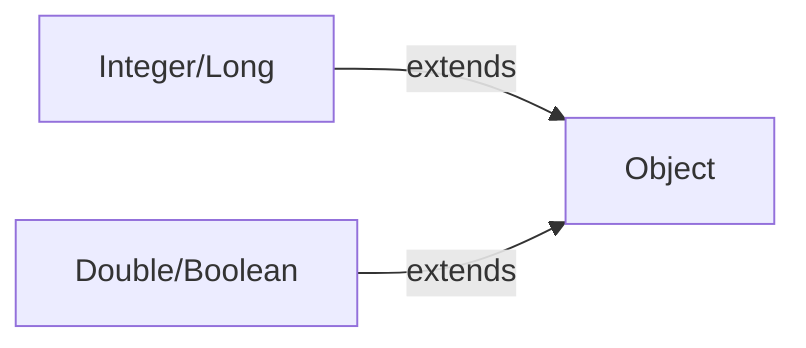
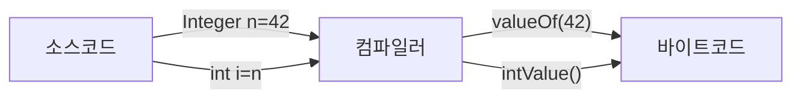
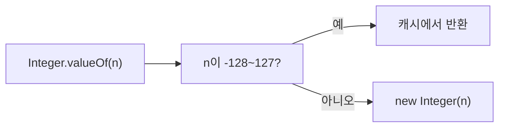
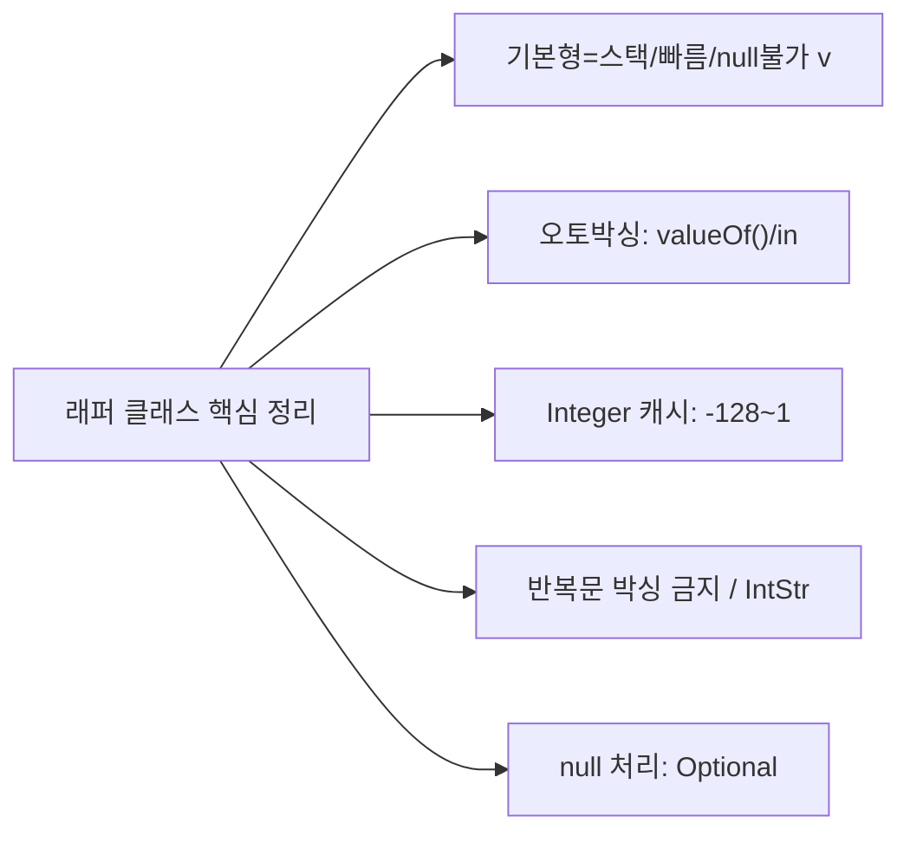

Java는 기본형(primitive type)과 참조형(reference type)이라는 두 가지 타입 체계를 가집니다. 이 둘 사이의 간극을 메우는 것이 래퍼 클래스(Wrapper Class)이며, 오토박싱(Auto-boxing)은 이 변환을 자동화한 Java 5의 핵심 기능입니다.

---

## 1. 기본형(primitive) vs 참조형(reference)

### 동작 원리 — 두 타입 체계가 공존하는 이유

Java는 성능과 객체지향이라는 두 가지 목표를 동시에 추구했습니다. 기본형은 스택에 값을 직접 저장해 메모리 접근이 빠르지만 객체 기능(null, 메서드, 제네릭)을 사용할 수 없습니다. 참조형은 힙에 객체를 생성하고 스택에는 주소만 저장해 객체의 모든 기능을 쓸 수 있지만 간접 참조 비용이 발생합니다.

래퍼 클래스는 기본형을 참조형으로 포장해 두 세계를 연결하는 다리 역할을 합니다.



### 메모리 저장 방식 비교

기본형은 스택 프레임에 값 자체가 놓입니다. `int i = 42`라면 스택의 지역 변수 슬롯에 숫자 42가 직접 들어갑니다. 참조형은 힙에 객체가 생성되고 스택에는 그 주소(참조)만 저장됩니다. `Integer n = 42`는 힙에 Integer 객체가 생기고 스택 변수 `n`은 그 주소를 가리킵니다.

```java
int i = 42;          // 스택: [42] — 값 자체
Integer n = 42;      // 스택: [주소] → 힙: Integer{value=42}
```

### 크기와 기본값

| 기본형 | 크기 | 기본값 | 래퍼 클래스 |
|--------|------|--------|-------------|
| `byte` | 1 byte | 0 | `Byte` |
| `short` | 2 bytes | 0 | `Short` |
| `int` | 4 bytes | 0 | `Integer` |
| `long` | 8 bytes | 0L | `Long` |
| `float` | 4 bytes | 0.0f | `Float` |
| `double` | 8 bytes | 0.0d | `Double` |
| `char` | 2 bytes | '\u0000' | `Character` |
| `boolean` | 1 bit (JVM 구현 의존) | false | `Boolean` |

---

## 2. 래퍼 클래스(Wrapper Class)

### 래퍼 클래스가 필요한 이유

```java
// 1. 제네릭은 참조형만 허용
List<int> list = new ArrayList<>();    // 컴파일 에러!
List<Integer> list = new ArrayList<>(); // OK

// 2. null을 표현해야 할 때
int score = null;      // 컴파일 에러!
Integer score = null;  // OK — 값 없음 표현 가능

// 3. Object가 필요한 곳 (다형성)
Object obj = 42;  // 오토박싱 → Integer

// 4. 유틸리티 메서드 활용
Integer.parseInt("42");
Integer.toBinaryString(255);
Integer.MAX_VALUE;
```

### 주요 래퍼 클래스 메서드

```java
// Integer
Integer.parseInt("42")          // String → int
Integer.valueOf("42")           // String → Integer
Integer.toString(42)            // int → String
Integer.toBinaryString(42)      // "101010"
Integer.toHexString(255)        // "ff"
Integer.toOctalString(8)        // "10"
Integer.MAX_VALUE               // 2147483647
Integer.MIN_VALUE               // -2147483648
Integer.bitCount(42)            // 1의 개수 (3)
Integer.reverse(42)             // 비트 역전
Integer.compare(a, b)           // 비교 (Java 7+)
Integer.sum(a, b)               // a + b (메서드 참조용)
Integer.max(a, b)               // 큰 값

// Double
Double.parseDouble("3.14")
Double.isNaN(Double.NaN)        // true
Double.isInfinite(1.0 / 0.0)   // true
Double.MAX_VALUE
Double.MIN_VALUE                // 양수 최솟값 (0에 가장 가까운)

// Character
Character.isDigit('5')          // true
Character.isLetter('A')         // true
Character.isLetterOrDigit('_')  // false
Character.isUpperCase('A')      // true
Character.toLowerCase('A')      // 'a'
Character.toUpperCase('a')      // 'A'

// Boolean
Boolean.parseBoolean("true")    // true
Boolean.parseBoolean("TRUE")    // true (대소문자 무시)
Boolean.parseBoolean("yes")     // false (true/false만 인식)
```

---

## 3. 오토박싱(Auto-boxing) / 언박싱(Unboxing)

### 동작 원리 — 컴파일러가 삽입하는 변환 코드

오토박싱과 언박싱은 **컴파일러 수준의 문법 설탕(Syntactic Sugar)** 입니다. 소스 코드에 타입 불일치가 있으면 컴파일러가 자동으로 `Integer.valueOf()` 또는 `intValue()` 호출을 삽입합니다. 실행 시점에는 이미 명시적 변환 코드가 들어간 상태입니다.



```java
// 오토박싱 — 기본형 → 래퍼 클래스 (컴파일러가 자동 변환)
int i = 42;
Integer boxed = i;  // 컴파일러: Integer.valueOf(i)

// 언박싱 — 래퍼 클래스 → 기본형
Integer n = Integer.valueOf(42);
int unboxed = n;    // 컴파일러: n.intValue()
```

### 오토박싱이 일어나는 상황

```java
// 1. 대입
Integer a = 100;           // 박싱

// 2. 컬렉션에 추가
List<Integer> list = new ArrayList<>();
list.add(1);               // 박싱

// 3. 연산
Integer x = 10;
Integer y = 20;
int sum = x + y;           // 둘 다 언박싱 후 더하기

// 4. 메서드 호출 (파라미터 타입 불일치)
void process(Integer n) { ... }
process(42);               // 박싱

// 5. 조건문
Integer flag = getFlag();
if (flag == 1) { ... }    // flag 언박싱 후 비교
```

### NPE 함정

```java
// 언박싱 시 null이면 NPE!
Integer value = null;
int i = value;  // NullPointerException!

// 실수하기 쉬운 패턴
Map<String, Integer> map = new HashMap<>();
int count = map.get("key");  // key 없으면 null → 언박싱 → NPE!

// 안전한 코드
Integer count = map.get("key");
if (count != null) {
    int c = count;
}
// 또는
int count = map.getOrDefault("key", 0);
```

---

## 4. Integer 캐시 (-128 ~ 127)와 == 비교 함정

### 동작 원리 — JVM이 미리 생성해 두는 객체 풀

JVM은 자주 사용되는 `-128`부터 `127` 범위의 Integer 객체를 **JVM 시작 시 미리 생성해 배열로 캐싱**합니다. `Integer.valueOf(n)`을 호출하면 이 범위 안의 수는 캐시에서 꺼내 반환하고, 범위 밖의 수는 `new Integer(n)`으로 새 객체를 만듭니다.

이 때문에 `-128~127` 범위에서는 `==` 비교가 우연히 true가 되지만, `128` 이상에서는 false가 됩니다. 동일한 코드가 값에 따라 다르게 동작하는 것은 매우 위험한 버그의 원인입니다.



```java
// 캐시 범위 내 (-128 ~ 127) — 같은 객체 반환
Integer a = 127;
Integer b = 127;
System.out.println(a == b);   // true (캐시 객체)
System.out.println(a.equals(b)); // true

// 캐시 범위 초과 — 새 객체 생성
Integer c = 128;
Integer d = 128;
System.out.println(c == d);   // false! (다른 객체)
System.out.println(c.equals(d)); // true
```

### 다른 래퍼 클래스의 캐시

```java
// Byte: 항상 캐시 (-128 ~ 127, 전체 범위)
// Short: -128 ~ 127 캐시
// Long: -128 ~ 127 캐시
// Character: 0 ~ 127 캐시
// Boolean: TRUE, FALSE 두 객체만 캐시
// Float, Double: 캐시 없음!

Boolean t1 = true;
Boolean t2 = true;
System.out.println(t1 == t2);  // true (Boolean.TRUE 캐시)
```

### == vs equals() 결론

```java
// 래퍼 클래스는 절대 == 으로 비교하지 말 것!
Integer a = 1000;
Integer b = 1000;
a == b      // 운이 좋으면 true, 아니면 false → 예측 불가
a.equals(b) // 항상 true → 항상 이것을 사용

// 기본형으로 비교
int x = a;
int y = b;
x == y  // 항상 true — 안전
```

**핵심 요약:** Integer 캐시는 JVM 최적화이지 계약이 아닙니다. `-128~127` 범위에서 `==`가 동작하는 것은 구현 세부사항일 뿐이며, 이에 의존하는 코드는 다른 JVM 구현에서 깨질 수 있습니다.

### JVM 옵션으로 캐시 크기 조정 가능

```bash
# -XX:AutoBoxCacheMax=<size> 로 최대값 조정 가능
# 최소는 항상 -128
java -XX:AutoBoxCacheMax=1000 MyApp
```

---

## 5. 성능 주의사항

### 동작 원리 — 박싱의 숨겨진 비용

박싱은 단순히 값을 감싸는 것이 아닙니다. 힙에 새 객체를 할당하고, GC가 나중에 그 객체를 회수해야 합니다. 반복문 100만 번에서 매번 박싱이 일어나면 100만 개의 단명(short-lived) 객체가 생겨 GC 부담이 급격히 증가합니다.

특히 `Long sum = 0L`처럼 래퍼 타입으로 누산(accumulate)할 때 실수가 잦습니다. `sum += i`에서 sum이 언박싱되고, 더한 결과가 다시 박싱되어 매 반복마다 Long 객체가 새로 생성됩니다.

```java
// 나쁜 예 — 매 반복마다 박싱/언박싱
Long sum = 0L;
for (long i = 0; i < 1_000_000; i++) {
    sum += i;  // sum 언박싱 → 더하기 → 박싱 (반복!)
}
// 약 100만 번의 Long 객체 생성 → GC 부담

// 좋은 예 — 기본형 사용
long sum = 0L;
for (long i = 0; i < 1_000_000; i++) {
    sum += i;  // 기본형 덧셈만
}
```

### 객체 생성 비용 측정

```java
// JMH 벤치마크 결과 (대략적):
// 기본형 연산:     ~1ns
// 박싱된 Integer:  ~5-10ns (객체 생성 + GC 부담)
// 박싱 루프 1M:   기본형 루프 대비 약 6배 느림
```

### 컬렉션에서의 기본형 처리

```java
// 표준 컬렉션 — 박싱 필수
List<Integer> list = new ArrayList<>();
list.add(1); // 박싱

// 기본형 특화 스트림 사용
int[] arr = {1, 2, 3, 4, 5};
int sum = IntStream.of(arr).sum();     // 박싱 없음
int max = IntStream.of(arr).max().getAsInt();

// IntStream, LongStream, DoubleStream
IntStream.range(0, 100).forEach(i -> ...);   // 박싱 없음
IntStream.rangeClosed(1, 100).sum();          // 박싱 없음
```

### 외부 라이브러리: 기본형 컬렉션

```java
// Eclipse Collections (기본형 특화)
IntList intList = IntLists.mutable.of(1, 2, 3);

// Trove / Koloboke (기본형 Map/Set)
TIntIntMap map = new TIntIntHashMap();
map.put(1, 100);
int val = map.get(1);  // 박싱 없음
```

---

## 6. Optional과의 관계

### Optional은 래퍼 클래스의 null 문제를 해결

```java
// Integer null — 의미가 불명확
Integer score = null;  // 점수가 없는 건지, 0인지, 오류인지?

// Optional<Integer> — 의도 명확
Optional<Integer> score = Optional.empty();     // 점수 없음
Optional<Integer> score = Optional.of(95);      // 점수 있음
Optional<Integer> score = Optional.ofNullable(getScore()); // null 가능
```

### 기본형 Optional

```java
// 박싱 비용 없는 기본형 Optional (권장)
OptionalInt    optInt    = OptionalInt.of(42);
OptionalLong   optLong   = OptionalLong.of(100L);
OptionalDouble optDouble = OptionalDouble.of(3.14);

optInt.getAsInt();       // 42
optInt.isPresent();      // true
optInt.orElse(0);        // 42

// Optional<Integer> 보다 OptionalInt 선호 (성능)
OptionalInt result = IntStream.range(1, 100)
    .filter(i -> i % 7 == 0)
    .findFirst();
```

### Optional 활용 패턴

```java
// null 반환 대신 Optional 반환
public Optional<Integer> findScore(String userId) {
    Integer score = db.getScore(userId);
    return Optional.ofNullable(score);
}

// 사용 측
findScore("user123")
    .map(score -> score * 2)
    .filter(score -> score > 100)
    .ifPresent(score -> System.out.println("High score: " + score));

// orElse / orElseGet / orElseThrow
int score = findScore("user123").orElse(0);
int score = findScore("user123").orElseGet(() -> calculateDefault());
int score = findScore("user123").orElseThrow(() -> new RuntimeException("Not found"));
```

---

## 7. 비유와 극한 시나리오

### 비유: 선물 포장

기본형은 물건(값) 자체이고, 래퍼 클래스는 그 물건을 상자(객체)에 넣은 것입니다. 물건을 직접 주고받을 때는 빠르지만, 제네릭 컬렉션이라는 "상자만 넣을 수 있는 창고"에 넣으려면 반드시 상자에 담아야 합니다. 오토박싱은 컴파일러가 대신 포장해주는 서비스입니다.

### 극한 시나리오: 대규모 숫자 처리 서비스

```java
// 주식 가격 계산 서비스 — 잘못된 설계
public class StockCalculator {
    public Long calculateTotalValue(List<Long> prices, List<Integer> quantities) {
        Long total = 0L;  // 래퍼 타입으로 누산 → 치명적 실수!
        for (int i = 0; i < prices.size(); i++) {
            total += prices.get(i) * quantities.get(i);
            // 매 반복: Long 언박싱 + int 언박싱 + long 계산 + Long 박싱
            // 100만 번 반복 → 300만 번 박싱/언박싱, GC 폭증
        }
        return total;
    }
}

// 올바른 설계
public class StockCalculator {
    public long calculateTotalValue(List<Long> prices, List<Integer> quantities) {
        long total = 0L;  // 기본형으로 누산
        for (int i = 0; i < prices.size(); i++) {
            total += prices.get(i) * quantities.get(i);
            // 언박싱은 여전히 발생하지만 누산 자체는 기본형
        }
        return total;
    }
}
```

### 실무 실수

**실수 1: switch 문에서 null Integer 언박싱**

```java
Integer status = getStatus();  // DB에서 가져온 값, null 가능
switch (status) {  // null이면 NullPointerException!
    case 1: ...
    case 2: ...
}
// 해결: switch 전에 null 체크 또는 getOrDefault 패턴 사용
```

**실수 2: == 비교가 테스트 환경에서만 통과**

```java
// 테스트에서는 작은 값(-128~127)만 사용하여 통과
Integer a = 100, b = 100;
assert a == b;  // 테스트: 통과 (캐시 범위)

// 실제 서비스에서 큰 값이 들어오면 실패
Integer a = 1000, b = 1000;
assert a == b;  // 운영: 실패! 다른 객체
```

---

## 왜 이 기술인가? — 기본형 vs 래퍼 클래스 선택 기준

| 비교 항목 | 기본형 (int, long ...) | 래퍼 클래스 (Integer, Long ...) |
|-----------|----------------------|-------------------------------|
| 메모리 | 스택 직접 저장 (4~8 bytes) | 힙 객체 + 참조 (16~24 bytes) |
| 성능 | 빠름 (직접 연산) | 느림 (박싱/언박싱 오버헤드) |
| null 표현 | 불가 | 가능 |
| 제네릭 사용 | 불가 (`List<int>` 컴파일 에러) | 가능 (`List<Integer>`) |
| 유틸리티 메서드 | 없음 | `parseInt`, `toBinaryString` 등 |
| 비교 | `==` 안전 | `==` 위험 (캐시 범위 의존), `equals()` 필수 |

**언제 래퍼 클래스를 써야 하는가?**

컬렉션이나 제네릭 타입의 타입 파라미터로 쓸 때(`List<Integer>`), DB 컬럼이나 외부 API 응답에서 값이 null일 수 있을 때, `Integer.parseInt()` 같은 유틸리티 메서드가 필요할 때입니다.

**언제 기본형을 써야 하는가?**

루프 카운터, 수치 계산, 성능이 중요한 내부 로직에서는 기본형을 사용합니다. 특히 대량의 숫자를 누산하는 코드(`sum += value`)에서 래퍼 타입을 쓰면 GC 부담이 폭발적으로 증가합니다.

---

## 실무에서 자주 하는 실수

**실수 1: 캐시 범위(−128~127)에 의존한 == 비교**

```java
// 개발/테스트 환경: 소량 데이터로 항상 통과
Integer a = 100, b = 100;
if (a == b) { ... } // true — 캐시 범위라 같은 객체

// 운영 환경: DB에서 큰 값 조회 시 실패
Integer userScore = fetchScore(); // 예: 200
Integer threshold = 200;
if (userScore == threshold) { ... } // false! — 캐시 범위 초과, 다른 객체

// 항상 equals() 사용
if (userScore.equals(threshold)) { ... } // 항상 안전
```

**실수 2: null Integer 언박싱으로 NullPointerException**

```java
// DB 조회 결과가 null인 경우
Map<String, Integer> map = fetchFromDb();
int count = map.get("activeUsers"); // key 없으면 null → 언박싱 → NPE!

// 안전한 패턴
int count = map.getOrDefault("activeUsers", 0); // null 대신 0 반환
// 또는
Integer val = map.get("activeUsers");
int count = (val != null) ? val : 0;
```

**실수 3: 래퍼 타입으로 누산하여 GC 부담 폭증**

```java
// 나쁜 예: 매 반복마다 Long 객체 생성
Long total = 0L;
for (Transaction tx : transactions) { // 100만 건
    total += tx.getAmount(); // 언박싱 + 더하기 + 박싱 반복
}
// 약 100만 개의 단명 Long 객체 → GC 빈번 → 성능 저하

// 좋은 예: 기본형으로 누산
long total = 0L;
for (Transaction tx : transactions) {
    total += tx.getAmount(); // getAmount()의 언박싱만 발생
}
```

**실수 4: 삼항 연산자에서 의도치 않은 언박싱**

```java
Integer a = null;
int result = (a != null) ? a : 0; // a가 null이면 언박싱 시도 → NPE!
// 컴파일러가 삼항 연산 결과 타입을 int로 추론, a를 언박싱

// 올바른 패턴
int result = (a != null) ? a.intValue() : 0; // 명시적
// 또는
int result = Objects.requireNonNullElse(a, 0); // Java 9+
```

**실수 5: Stream에서 불필요한 박싱 발생**

```java
int[] arr = {1, 2, 3, 4, 5};

// 나쁜 예: Stream<Integer> — 박싱 발생
int sum = Arrays.stream(arr)
    .boxed()             // int → Integer 박싱
    .reduce(0, Integer::sum); // 불필요한 박싱/언박싱

// 좋은 예: IntStream — 박싱 없음
int sum = Arrays.stream(arr).sum(); // IntStream 직접 사용
int max = IntStream.of(arr).max().getAsInt();
```

---

## 면접 포인트

**Q1. Integer 캐시(-128~127)의 원리와 실무적 위험성을 설명하세요.**

JVM은 시작 시 -128~127 범위의 Integer 객체를 미리 생성해 배열에 캐싱합니다. `Integer.valueOf(n)`은 이 범위라면 캐시에서 반환하므로 `==` 비교가 true가 됩니다. 실무 위험성은 테스트에서 소량의 수를 사용해 `==`가 통과했다가 운영에서 큰 값으로 실패하는 버그입니다. 해결책은 래퍼 클래스는 항상 `equals()`로 비교하는 것입니다.

**Q2. 오토박싱/언박싱이 성능에 미치는 영향과 주의점은?**

오토박싱은 컴파일러가 `Integer.valueOf()`를 삽입하는 문법 설탕으로, 힙에 객체를 생성합니다. 루프 내 반복 박싱은 대량의 단명 객체를 생성해 GC 부담을 증가시킵니다. 특히 `Long sum = 0L`처럼 래퍼 타입으로 누산할 때 매 반복마다 Long 객체가 생성됩니다. 언박싱 시 래퍼 타입이 null이면 NPE가 발생하므로 null 체크가 필요합니다.

**Q3. OptionalInt와 Optional<Integer>의 차이는?**

`Optional<Integer>`는 Integer 객체를 감싸므로 박싱이 발생합니다. `OptionalInt`는 int 기본형을 직접 저장해 박싱이 없습니다. `getAsInt()`로 값을 꺼냅니다. 성능이 중요한 코드에서는 `OptionalInt`/`OptionalLong`/`OptionalDouble`을 사용하세요. Stream에서도 `IntStream.findFirst()`는 `OptionalInt`를 반환합니다.

**Q4. switch 문에서 Integer를 쓸 때 주의사항은?**

switch 표현식에서 Integer를 쓸 때 값이 null이면 자동으로 언박싱이 발생해 NPE가 됩니다. Java 17+ switch 패턴 매칭에서는 null을 명시적으로 처리할 수 있습니다(`case null -> ...`). 안전하게 하려면 switch 전에 null 체크 후 기본형으로 변환하거나 `getOrDefault()`를 활용합니다.

---

## 8. 전체 요약



---
## 면접 포인트

**Q1. 오토박싱이 성능에 미치는 영향과 방지 방법은?**
`List<Integer>`에 int를 add할 때마다 `Integer.valueOf(int)` 호출로 객체가 생성됩니다. 10만 개 루프에서 10만 번 박싱 → GC 압력 증가. 성능 크리티컬한 코드에서 기본형 대신 박싱 타입을 사용하면 처리량이 50% 이상 저하될 수 있습니다. 방지: 기본형 특화 컬렉션(Eclipse Collections의 `IntArrayList`, Trove의 `TIntArrayList`) 사용, 또는 배열(`int[]`)을 직접 사용합니다. JMH로 측정하면 `int[]` vs `Integer[]`의 처리 속도 차이가 3~5배에 달합니다.

**Q2. Integer 캐시 범위(-128~127)가 실무에서 버그를 만드는 경우는?**
```java
Integer a = 127;
Integer b = 127;
System.out.println(a == b);   // true (캐시 범위)

Integer c = 128;
Integer d = 128;
System.out.println(c == d);   // false (새 객체)
```
DB에서 조회한 ID, 사용자 입력 등 런타임 Integer 비교에 `==`를 사용하면 127 이하에서는 우연히 동작하다가 128 이상에서 버그가 발생합니다. 실제로 userId가 100일 때는 정상, 200일 때는 인증 실패하는 버그로 발현됩니다. Integer 비교는 반드시 `equals()` 또는 `Objects.equals()`를 사용합니다.

**Q3. null이 포함된 컬렉션에서 언박싱 시 NPE가 발생하는 이유는?**
```java
Map<String, Integer> map = new HashMap<>();
int value = map.get("nonExistent");  // NPE!
// map.get() → null 반환 → int로 언박싱 → null.intValue() → NPE
```
`Map.getOrDefault("key", 0)`으로 기본값을 지정하거나 `Optional.ofNullable(map.get("key")).orElse(0)`으로 처리합니다. 특히 Stream의 `mapToInt()`에서 null이 포함된 컬렉션을 처리할 때 발생하는 NPE는 원인 파악이 어렵습니다. 박싱 타입이 null일 수 있는 경우 반드시 언박싱 전 null 체크가 필요합니다.

**Q4. 숫자 타입 간 변환 시 정밀도 손실이 발생하는 경우는?**
`long`을 `int`로 좁히는 변환: 상위 32비트가 잘립니다. `Long.MAX_VALUE`를 int로 캐스팅하면 -1이 됩니다. `double`을 `long`으로 변환: 소수점 이하가 잘립니다. `double`을 `int`로: 오버플로우 시 `Integer.MAX_VALUE` 또는 `Integer.MIN_VALUE`로 클램핑됩니다. 안전한 변환: `Math.toIntExact(long)`은 오버플로우 시 `ArithmeticException`을 던집니다. 금융 계산에서 double → int 변환은 절대 금지이며 `BigDecimal`을 유지합니다.

**Q5. Optional과 래퍼 클래스 중 null 표현에 무엇을 사용하는가?**
래퍼 클래스의 null: 값의 부재를 나타내지만 NPE 위험이 있습니다. 메서드 반환 타입으로 `Integer`를 사용하면 호출자가 null 체크를 잊기 쉽습니다. `Optional<Integer>`: null이 아닌 "값이 없을 수 있음"을 명시적으로 표현합니다. 호출자가 `.orElse()`, `.ifPresent()` 등으로 처리를 강제받습니다. 단, Optional은 직렬화되지 않으므로 DTO 필드로는 부적합합니다. 메서드 반환 타입으로는 Optional, 필드와 파라미터에는 기본형 또는 null 허용 주석(`@Nullable`)을 사용합니다.
