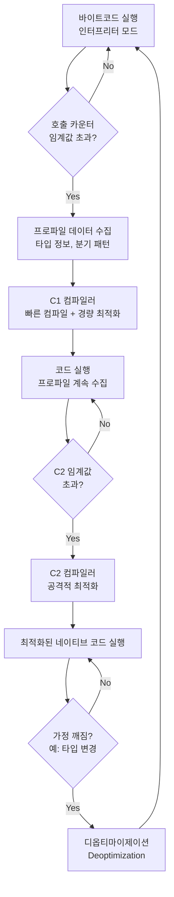

> **한 줄 요약**: JIT(Just-In-Time) 컴파일러는 JVM이 바이트코드를 실행하면서 "자주 실행되는 코드"를 감지해 실시간으로 네이티브 기계어로 변환·최적화하는 엔진이며, 이것이 Java가 인터프리터 언어임에도 고성능을 낼 수 있는 핵심 이유입니다.

---

## 1. 도입 비유 — 동시통역사

국제 회의장의 통역사를 상상해 보세요.

처음에는 연사가 말하는 **문장 하나하나를 실시간으로 번역**합니다. 빠르게 시작할 수 있지만 번역 품질이 다소 거칩니다. 그런데 회의가 계속되면서 "이 연사는 '지속 가능한 개발'이라는 표현을 자주 쓴다"는 것을 알게 됩니다. 통역사는 그 표현을 **암기**해 두고, 다음부터는 즉시 막힘없이 통역합니다. 나중에는 "이 발표자의 논리 흐름까지 파악해서 반 박자 빠르게 통역"하는 수준까지 됩니다.

JVM JIT 컴파일러가 정확히 이 방식으로 동작합니다.

- **통역사가 문장 하나씩 번역** → 인터프리터가 바이트코드를 한 줄씩 실행
- **자주 쓰는 표현 암기** → JIT가 핫스팟 메서드를 감지해 네이티브 코드로 컴파일
- **논리 흐름까지 파악해 최적화** → C2 컴파일러의 공격적 최적화(인라이닝, 루프 언롤링 등)

---

## 2. JIT 컴파일러란 무엇인가?

### 2.1 인터프리터 vs 컴파일러 vs JIT 비교

<table>
  <thead>
    <tr>
      <th>방식</th>
      <th>동작 원리</th>
      <th>장점</th>
      <th>단점</th>
      <th>대표 언어</th>
    </tr>
  </thead>
  <tbody>
    <tr>
      <td><strong>인터프리터</strong></td>
      <td>소스코드(또는 바이트코드)를 한 줄씩 읽고 즉시 실행</td>
      <td>시작 빠름, 플랫폼 독립적</td>
      <td>실행 느림 (매번 해석 비용)</td>
      <td>Python, Ruby (초기)</td>
    </tr>
    <tr>
      <td><strong>정적 컴파일러</strong></td>
      <td>실행 전에 소스 → 기계어 전체 변환</td>
      <td>실행 빠름, 최적화 철저</td>
      <td>컴파일 시간 소요, 플랫폼 종속</td>
      <td>C, C++, Rust</td>
    </tr>
    <tr>
      <td><strong>JIT 컴파일러</strong></td>
      <td>실행 중 자주 사용되는 코드를 감지 → 실시간 기계어 변환</td>
      <td>플랫폼 독립 + 고성능, 런타임 프로파일 기반 최적화</td>
      <td>초기 실행(Cold Start) 느림, 메모리 오버헤드</td>
      <td>Java, C#, JavaScript V8</td>
    </tr>
  </tbody>
</table>

### 2.2 javac vs JIT — 컴파일의 두 단계

Java 코드가 실행되기까지 컴파일은 **두 번** 일어납니다.

```
소스코드(.java)
     │
     ▼  [javac — 정적 컴파일, 개발 시점]
바이트코드(.class)
     │
     ▼  [JVM 클래스로더 — 런타임 시점]
메모리에 로드된 바이트코드
     │
     ├── [인터프리터] 즉시 실행 (느림)
     │
     └── [JIT 컴파일러] 핫스팟 감지 후 네이티브 기계어로 변환 (빠름)
```

**javac (정적 컴파일)**
- 개발 시점에 실행
- Java 소스 → JVM 바이트코드 (.class)
- 플랫폼 독립적인 중간 언어 생성
- 간단한 최적화만 수행 (상수 폴딩 등)

**JIT 컴파일러**
- 런타임에 동작
- JVM 바이트코드 → CPU 네이티브 기계어
- 실제 실행 데이터(프로파일) 기반으로 공격적 최적화
- OS/CPU 아키텍처에 특화된 코드 생성

### 2.3 AOT 컴파일과의 비교

<table>
  <thead>
    <tr>
      <th>항목</th>
      <th>JIT 컴파일</th>
      <th>AOT (Ahead-Of-Time) 컴파일</th>
    </tr>
  </thead>
  <tbody>
    <tr>
      <td><strong>컴파일 시점</strong></td>
      <td>런타임 (실행 중)</td>
      <td>빌드 시점 (배포 전)</td>
    </tr>
    <tr>
      <td><strong>시작 속도</strong></td>
      <td>느림 (Cold Start 존재)</td>
      <td>매우 빠름 (이미 기계어)</td>
    </tr>
    <tr>
      <td><strong>최대 성능</strong></td>
      <td>매우 높음 (런타임 프로파일 기반)</td>
      <td>중간 (정적 분석 한계)</td>
    </tr>
    <tr>
      <td><strong>메모리 사용</strong></td>
      <td>많음 (JVM + 컴파일 캐시)</td>
      <td>적음 (JVM 불필요)</td>
    </tr>
    <tr>
      <td><strong>플랫폼 이식성</strong></td>
      <td>높음 (바이트코드 공유)</td>
      <td>낮음 (OS/CPU별 빌드 필요)</td>
    </tr>
    <tr>
      <td><strong>동적 기능</strong></td>
      <td>완전 지원 (리플렉션, 동적 클래스로딩)</td>
      <td>제한적 (사전 등록 필요)</td>
    </tr>
    <tr>
      <td><strong>대표 구현</strong></td>
      <td>HotSpot JVM, GraalVM JIT</td>
      <td>GraalVM Native Image</td>
    </tr>
    <tr>
      <td><strong>적합한 용도</strong></td>
      <td>장시간 실행 서버 (Spring Boot, 배치)</td>
      <td>서버리스, CLI, 마이크로서비스 (빠른 시작 필요)</td>
    </tr>
  </tbody>
</table>

---

## 3. JIT 컴파일 과정 — 상세 플로우

### 3.1 전체 파이프라인



### 3.2 호출 카운터 (Invocation Counter)

JVM은 각 메서드가 **몇 번 호출되었는지** 추적합니다.

```java
// JVM 내부 동작을 의사코드로 표현
class MethodCounters {
    int invocationCount = 0;    // 메서드 호출 횟수
    int backedgeCount = 0;      // 루프 백엣지 횟수

    void onMethodEntry() {
        invocationCount++;
        if (invocationCount >= CompileThreshold) {
            scheduleJITCompilation(this);
        }
    }
}
```

**호출 카운터 임계값 기본값:**

| JVM 모드 | `-XX:CompileThreshold` 기본값 |
|---------|---------------------------|
| Client (-client) | 1,500 |
| Server (-server) | 10,000 |
| Tiered Compilation | 각 레벨별 별도 임계값 |

### 3.3 백엣지 카운터 (Back-Edge Counter)

루프의 경우 메서드 호출 없이도 오랫동안 실행될 수 있습니다. 이를 위해 JVM은 **루프 뒤로 돌아가는 점프(Back-Edge)**를 카운트합니다.

```java
// 이 메서드는 한 번만 호출되지만
// 루프 백엣지가 1,000,000번 발생
public void processData(int[] data) {
    for (int i = 0; i < 1_000_000; i++) {  // ← 백엣지: 루프가 위로 점프할 때마다 카운트
        data[i] = data[i] * 2 + 1;
    }
}
```

백엣지 카운터가 임계값을 초과하면 루프가 **실행 중에도** JIT 컴파일됩니다. 이를 **OSR(On-Stack Replacement)**이라고 합니다.

### 3.4 OSR — On-Stack Replacement

OSR은 "현재 실행 중인 인터프리터 스택 프레임을 JIT 컴파일된 프레임으로 교체"하는 기술입니다.

```
[인터프리터 스택 프레임]          [JIT 컴파일된 스택 프레임]
━━━━━━━━━━━━━━━━━━━━━━━━        ━━━━━━━━━━━━━━━━━━━━━━━━━
 processData() 실행 중  ──OSR──▶  processData() 계속 실행
 i = 42345 (루프 진행 중)          i = 42345 (상태 그대로 인계)
━━━━━━━━━━━━━━━━━━━━━━━━        ━━━━━━━━━━━━━━━━━━━━━━━━━
     느림 (인터프리터)                  빠름 (네이티브 코드)
```

### 3.5 CompileThreshold 설정

```bash
# 인터프리터 → JIT 전환 임계값 조정
java -XX:CompileThreshold=5000 MyApp

# Tiered Compilation에서 C1 → C2 전환 임계값
java -XX:Tier3InvocationThreshold=200 \
     -XX:Tier4InvocationThreshold=5000 MyApp

# CompileThreshold를 0으로 설정하면 즉시 컴파일 (테스트용)
java -XX:CompileThreshold=0 MyApp

# JIT 컴파일 비활성화 (디버그용)
java -Xint MyApp

# C1만 사용 (빠른 시작이 필요한 경우)
java -client MyApp

# C2만 사용 (최대 성능)
java -server MyApp
```

### 3.6 프로파일링 수집 항목

JIT 컴파일러가 수집하는 프로파일 정보:

| 프로파일 항목 | 설명 | 활용 최적화 |
|------------|-----|----------|
| 타입 프로파일 | 인터페이스/추상클래스의 실제 구현 타입 | 가상 호출 최적화(Devirtualization) |
| 분기 예측 | if/switch 어느 분기가 더 자주 실행되는지 | 핫 패스 최적화 |
| 메서드 호출 빈도 | 어떤 메서드가 자주 호출되는지 | 인라이닝 대상 선정 |
| 루프 반복 횟수 | 루프가 평균 몇 번 실행되는지 | 루프 언롤링 정도 결정 |
| 널 체크 빈도 | 실제로 null이 오는 경우가 있는지 | 불필요한 널 체크 제거 |
| 예외 발생 빈도 | 예외가 실제로 발생하는지 | 예외 처리 코드 최적화 |

---

## 4. C1 vs C2 컴파일러

### 4.1 두 컴파일러 비교

<table>
  <thead>
    <tr>
      <th>항목</th>
      <th>C1 (Client Compiler)</th>
      <th>C2 (Server Compiler)</th>
    </tr>
  </thead>
  <tbody>
    <tr>
      <td><strong>별칭</strong></td>
      <td>Client JIT</td>
      <td>Server JIT, Opto</td>
    </tr>
    <tr>
      <td><strong>컴파일 속도</strong></td>
      <td>빠름 (수십 ms)</td>
      <td>느림 (수백 ms ~ 수 초)</td>
    </tr>
    <tr>
      <td><strong>최적화 수준</strong></td>
      <td>가벼운 최적화</td>
      <td>공격적 최적화</td>
    </tr>
    <tr>
      <td><strong>생성 코드 품질</strong></td>
      <td>중간</td>
      <td>매우 높음</td>
    </tr>
    <tr>
      <td><strong>적합한 상황</strong></td>
      <td>GUI 앱, 단명 프로세스</td>
      <td>장시간 실행 서버</td>
    </tr>
    <tr>
      <td><strong>주요 최적화</strong></td>
      <td>인라이닝, 레지스터 할당</td>
      <td>탈출 분석, 루프 변환, 벡터화</td>
    </tr>
    <tr>
      <td><strong>IR(중간 표현)</strong></td>
      <td>HIR/LIR (High/Low-level IR)</td>
      <td>Sea-of-Nodes (이상적인 그래프)</td>
    </tr>
  </tbody>
</table>

### 4.2 Tiered Compilation — 5단계 컴파일

Java 7부터 기본 활성화된 **Tiered Compilation**은 C1과 C2를 협력시켜 최적의 성능을 제공합니다.


**각 레벨 상세 설명:**

**Level 0 — 인터프리터**
- 모든 코드의 시작점
- 바이트코드를 한 줄씩 해석 실행
- 프로파일링 없음 (가장 느림)
- 매우 드물게 실행되는 코드는 여기서 끝남

**Level 1 — C1, 프로파일링 없음**
- 매우 단순한 메서드(짧고 인라이닝 가능한)에 적용
- 빠르게 컴파일하되 프로파일 수집 비용 없음
- 예: getter/setter, 단순 유틸리티 메서드

**Level 2 — C1, 경량 프로파일링**
- C2 큐가 바쁠 때 대기 중인 메서드에 적용
- 호출 카운터 + 백엣지 카운터만 수집
- Level 3로 전환하기 위한 중간 단계

**Level 3 — C1, 전체 프로파일링**
- **대부분의 메서드가 가장 오래 머무는 단계**
- 타입 프로파일, 분기 예측 등 전체 수집
- C2가 최적화에 활용할 데이터 축적 중
- 충분한 데이터 쌓이면 Level 4로 승격

**Level 4 — C2, 공격적 최적화**
- **최종 목표 레벨**
- 수집된 프로파일 기반 공격적 최적화
- 탈출 분석, 루프 벡터화, 전체 인라이닝
- 가정이 깨지면(타입 변경 등) 디옵티마이제이션으로 Level 0 복귀

```java
// Tiered Compilation 확인 명령어
// -XX:+PrintTieredEvents 로 레벨 전환 출력
// 출력 예시:
// 123 3     java.lang.String::hashCode (55 bytes)   → Level 3 컴파일
// 456 4     java.lang.String::hashCode (55 bytes)   → Level 4 컴파일
```

**트레이드오프 시나리오:**

| 시나리오 | 최적 전략 |
|---------|---------|
| 짧은 CLI 도구 | Tiered 비활성화, C1만 사용 (`-client`) |
| 장시간 실행 API 서버 | 기본 Tiered Compilation (L0→L3→L4) |
| 람다/FaaS (수 초 실행) | GraalVM Native Image 고려 |
| JVM warm-up 후 측정 | 벤치마크는 반드시 L4 안정화 후 |

---

## 5. 주요 최적화 기법

### 5.1 메서드 인라이닝 (Method Inlining)

JIT 최적화 중 **가장 효과가 크고 가장 먼저 적용되는** 기법입니다. 메서드 호출을 호출부에 직접 삽입합니다.

**Before (인라이닝 전):**
```java
// 컴파일된 코드 — add() 호출마다 스택 프레임 생성 비용 발생
public int calculate(int a, int b) {
    return add(a, b) * 2;  // 매번 메서드 호출 오버헤드
}

private int add(int x, int y) {
    return x + y;
}
```

**After (인라이닝 후 — JIT가 자동으로 변환):**
```java
// JIT가 내부적으로 변환한 코드 (실제로는 네이티브 코드)
public int calculate(int a, int b) {
    return (a + b) * 2;  // 메서드 호출 없이 직접 삽입됨
}
```

**인라이닝의 연쇄 효과:**
인라이닝이 되면 추가 최적화가 가능해집니다.

```java
// 원본 코드
public boolean isAdult(Person person) {
    return person.getAge() >= 18;
}

// getAge()가 인라이닝된 후
public boolean isAdult(Person person) {
    return person.age >= 18;  // 이제 person.age가 직접 보임
    // → 추가로 널 체크 제거, 범위 체크 제거 가능
}
```

**인라이닝 제어 JVM 플래그:**
```bash
# 인라이닝 로그 출력
-XX:+PrintInlining

# 인라이닝 최대 크기 (바이트코드 바이트 수, 기본 35)
-XX:MaxInlineSize=35

# 핫 메서드 인라이닝 최대 크기 (기본 325)
-XX:FreqInlineSize=325

# 인라이닝 깊이 제한 (기본 9)
-XX:MaxInlineLevel=9
```

### 5.2 루프 언롤링 (Loop Unrolling)

루프의 반복 횟수를 줄이고 루프 본체를 여러 번 복제합니다. 분기 예측 비용과 루프 카운터 연산을 줄입니다.

**Before:**
```java
// 원본 루프
int sum = 0;
for (int i = 0; i < 1000; i++) {
    sum += array[i];  // 루프 1000번, 조건 체크 1000번
}
```

**After (JIT 루프 언롤링 후):**
```java
// JIT가 내부적으로 변환 (개념적 표현)
int sum = 0;
for (int i = 0; i < 1000; i += 4) {
    sum += array[i];      // 루프 250번, 조건 체크 250번
    sum += array[i + 1];  // 실제 계산은 동일하게 4번씩
    sum += array[i + 2];
    sum += array[i + 3];
}
```

**SIMD 벡터화와의 연계:**
루프 언롤링 후 JIT는 CPU의 SIMD 명령어(AVX, SSE)를 활용한 벡터화도 적용합니다.

```java
// int[] 배열의 합산 — JIT가 SIMD로 최적화
int[] data = new int[1024];
int sum = 0;
for (int i = 0; i < data.length; i++) {
    sum += data[i];
    // JIT: AVX2 명령어로 8개 int를 한 번에 더함
    // 실제로는 128개 int를 한 CPU 사이클에 처리
}
```

### 5.3 탈출 분석 (Escape Analysis)

객체가 메서드 밖으로 "탈출"하지 않는다고 판단되면, **힙 대신 스택에 할당**합니다. 이는 GC 압력을 크게 줄입니다.

**탈출 분석 3가지 케이스:**

```java
// 케이스 1: NoEscape — 메서드 내부에서만 사용 (스택 할당)
public int computeArea() {
    Point p = new Point(3, 4);  // Point가 메서드 밖으로 나가지 않음
    return p.x * p.x + p.y * p.y;
    // JIT: Point 객체를 힙에 할당하지 않고 스택의 레지스터로 처리
    // GC가 이 객체를 추적할 필요 없음
}

// 케이스 2: ArgEscape — 메서드 인자로 전달되지만 저장 안 됨 (제한적 최적화)
public void processPoint(Consumer<Point> consumer) {
    Point p = new Point(1, 2);
    consumer.accept(p);  // consumer가 p를 저장하는지 모름
    // JIT: 보수적으로 힙 할당 유지
}

// 케이스 3: GlobalEscape — 인스턴스 필드에 저장 (최적화 불가)
private Point cachedPoint;

public void cachePoint() {
    cachedPoint = new Point(1, 2);  // 필드에 저장 → 탈출
    // JIT: 반드시 힙 할당 필요
}
```

**Before/After 비교 (탈출 분석):**
```java
// Before: 루프마다 StringBuilder 힙 할당 + GC 대상
public String buildString(int n) {
    StringBuilder result = new StringBuilder();
    for (int i = 0; i < n; i++) {
        StringBuilder sb = new StringBuilder();  // 매번 힙 할당
        sb.append("item").append(i);
        result.append(sb.toString());
    }
    return result.toString();
}

// After: JIT 최적화 후 — 내부 sb는 스택/레지스터에
// (개념적으로, 실제는 네이티브 코드 레벨에서 처리)
public String buildString(int n) {
    StringBuilder result = new StringBuilder();
    for (int i = 0; i < n; i++) {
        // sb가 루프 밖으로 나가지 않으므로 스택에 올림
        // GC가 sb를 추적하지 않아 GC 사이클 단축
        result.append("item").append(i);
    }
    return result.toString();
}
```

**탈출 분석 활성화 확인:**
```bash
# 탈출 분석 로그 출력 (Java 8+)
-XX:+DoEscapeAnalysis          # 기본값: true (Java 6u23+)
-XX:+PrintEscapeAnalysis       # 탈출 분석 결과 출력
-XX:+EliminateAllocations      # 기본값: true
-XX:+PrintEliminateAllocations # 제거된 할당 출력
```

### 5.4 데드코드 제거 (Dead Code Elimination)

실제로 실행되지 않는 코드를 컴파일 결과에서 제거합니다.

```java
// Before: 조건이 항상 false인 분기
public int process(int x) {
    if (x > 0) {
        return x * 2;
    } else if (false) {           // ← 항상 false
        return x - 1;             // ← 데드코드
    }
    return x + 1;
}

// JIT가 컴파일 후: false 분기 완전 제거
public int process(int x) {
    if (x > 0) {
        return x * 2;
    }
    return x + 1;
}
```

**프로파일 기반 데드코드 제거:**
```java
// JIT가 프로파일을 보고 "사실상 데드코드"로 판단
public void handleEvent(Event event) {
    if (event.type == EventType.ERROR) {
        // 10,000번 실행 중 단 0번 실행됨 → 사실상 콜드 패스
        handleError(event);
    } else {
        // 10,000번 실행 중 10,000번 실행됨 → 핫 패스
        handleNormal(event);
    }
}
// JIT: ERROR 분기를 "비개연적(unlikely)" 코드로 마킹
// 핫 패스(handleNormal)가 예측 가능한 분기로 최적화됨
```

### 5.5 널 체크 제거 (Null Check Elimination)

```java
// Before: 매번 null 체크 발생
public int getLength(String s) {
    if (s == null) throw new NullPointerException(); // 묵시적 null 체크
    return s.length();
}

// JIT가 프로파일에서 "s가 null인 경우가 한 번도 없었음"을 확인
// → null 체크를 제거하고 NPE를 CPU 하드웨어 예외로 위임
// → null이 실제로 오면 그때 NPE 발생 (디옵티마이제이션)
```

### 5.6 가상 호출 최적화 (Devirtualization)

Java의 모든 인스턴스 메서드는 기본적으로 가상(virtual) 호출입니다. JIT는 프로파일을 보고 이를 직접 호출로 변환합니다.

```java
// 인터페이스 통한 호출 — 원래는 vtable lookup 필요
interface Animal {
    String sound();
}

class Dog implements Animal {
    public String sound() { return "Woof"; }
}

public void makeSound(Animal animal) {
    System.out.println(animal.sound());
    // 인터프리터: animal의 실제 타입 확인 → vtable → sound() 주소 찾기
}
```

```java
// JIT가 프로파일을 보면:
// - 10,000번 호출 중 10,000번이 Dog 인스턴스
// → "단형성(monomorphic) 호출"로 최적화

// JIT 컴파일 후 (개념적):
public void makeSound(Animal animal) {
    if (animal instanceof Dog) {
        // Dog.sound()를 직접 호출 (인라이닝까지 가능)
        System.out.println("Woof");
    } else {
        // 가드 실패 → 일반 vtable 조회 (드문 경우)
        System.out.println(animal.sound());
    }
}
```

**최적화 수준별 분류:**

| 타입 | 설명 | 최적화 수준 |
|-----|-----|----------|
| **Monomorphic** | 항상 같은 타입 (1종) | vtable 제거 + 인라이닝 가능 |
| **Bimorphic** | 2가지 타입 | if/else로 전개 |
| **Polymorphic** | 3~N가지 타입 | 부분적 최적화 |
| **Megamorphic** | 매우 다양한 타입 | vtable 조회 유지 (최적화 불가) |

---

## 6. Cold Start 문제 — 실무 핵심

### 6.1 Cold Start란?

**Cold Start**는 JVM이 시작된 직후 또는 코드가 처음 실행될 때 성능이 현저히 낮은 현상입니다.

```
응답 시간 (ms)
  │
300┤  ████
250┤  █████
200┤  ██████
150┤  ███████
100┤  █████████
 80┤  ██████████████
 50┤           ███████████████████
 30┤                        ██████████████████████████
 10┤                                              ━━━━━━━━━ (안정화)
  └────────────────────────────────────────────────────── 시간
    0s  10s  20s  30s  1m   2m   5m   10m
    ↑                                    ↑
  Cold Start (느림)              Warm State (빠름)
```

### 6.2 왜 Cold Start가 발생하는가?

Cold Start는 단일 원인이 아니라 **여러 요인의 복합 효과**입니다.

**원인 1: JIT 미작동 (가장 큰 원인)**
```
시작 직후: 모든 코드가 인터프리터 모드로 실행
→ JIT 임계값 도달 전까지 바이트코드 해석 실행
→ 인터프리터는 JIT 네이티브 코드보다 10~100배 느림
```

**원인 2: 클래스 로딩**
```java
// 요청이 들어올 때마다 새 클래스가 처음 로딩됨
// ClassLoader가 .class 파일 → 검증 → 링킹 → 초기화
// 이 과정이 수십 ms 소요
UserService service = new UserService();  // UserService 클래스 최초 로딩
// → 내부에서 사용하는 Repository, EntityManager 등도 연쇄 로딩
```

**원인 3: 프로파일링 미완성**
```
JIT가 있어도 프로파일이 없으면 보수적 최적화만 적용
→ C1 레벨 코드도 처음엔 인라이닝 등 최적화 부족
→ C2로 승격되기까지 수천 번 호출 필요
```

**원인 4: JVM 내부 자료구조 초기화**
```
JIT 컴파일러 자체 초기화
Code Cache 초기화
Symbol Table, String Pool 구성
GC 메타데이터 구성
```

### 6.3 트래픽 규모별 Cold Start 영향

#### 시나리오 A — 저트래픽 (100 TPS)

```
TPS: 100 (요청 사이 평균 10ms 간격)
Cold Start 지속 시간: 약 30~60초

분석:
- 초당 100개 요청이므로 JIT 임계값(10,000번)에 도달하는 데 약 100초
- 그동안 응답 시간이 다소 높지만 (50ms → 200ms)
- 절대적 지연 시간 증가가 작아 사용자 체감 낮음
- 타임아웃(보통 3~5초) 발생 가능성 거의 없음

결론: 큰 문제 없음. 기본 Tiered Compilation으로 충분
```

#### 시나리오 B — 고트래픽 (10,000 TPS)

```
TPS: 10,000 (요청 사이 평균 0.1ms 간격)
배포 시 리스크: 높음

타임라인:
T+0s  배포 완료, 트래픽 유입 시작
T+0~5s  모든 코드가 인터프리터 실행 → 응답시간 300ms~1000ms
T+5~30s  C1 컴파일 시작 → 응답시간 100~300ms
T+30~120s  C2 컴파일 시작 → 응답시간 30~100ms
T+120s+  안정화 → 응답시간 10~30ms

위험 요소:
- T+0~5s 구간: 10,000 TPS × 1000ms = 요청 10,000건이 동시에 대기
- 타임아웃(보통 500ms~1s) 초과로 에러 폭발 가능
- 연쇄 타임아웃으로 업스트림 서비스도 영향받음
- 모니터링에서 배포 직후 에러율 급증 알람 발생

실제 증상:
  배포 후 30초간 5xx 에러율 30~50% 발생
  → 자동 롤백 트리거
  → "배포가 실패했다"고 판단하지만 사실은 Cold Start
```

#### 시나리오 C — 극한 트래픽 (100,000 TPS)

```
TPS: 100,000 (매초 10만 요청)
Cold Start = 장애 수준

시나리오:
T+0s  새 인스턴스 배포, LB에 등록
T+0~3s  인터프리터 모드 → 응답시간 2000ms~5000ms
         → 100,000 TPS × 5000ms = 50만 건 동시 대기
         → 메모리 부족 → OOM 발생
         → 새 인스턴스가 시작과 동시에 죽음
         → LB가 죽은 인스턴스에 계속 트래픽 전송

실제 장애 패턴:
1. 새 인스턴스 배포
2. 헬스체크 통과 (JVM 시작 OK)
3. 트래픽 투입
4. Cold Start로 인한 응답 지연
5. 타임아웃 → 연결 누적 → OOM
6. 인스턴스 크래시
7. 1번으로 반복 (배포 루프)

필수 대책:
- 카나리 배포: 1~5%만 먼저 트래픽 투입
- Warm-up: 실제 트래픽 전에 더미 요청으로 JIT 가열
- 블루/그린 + 점진적 전환: 안정화 확인 후 100% 전환
```

### 6.4 Cold Start 해결 방법

#### 방법 1: JVM Warm-up (가장 보편적)

```java
// Spring Boot 예시: 애플리케이션 시작 후 자동 warm-up
@Component
public class JvmWarmupRunner implements ApplicationRunner {

    private final UserService userService;
    private final OrderService orderService;

    @Override
    public void run(ApplicationArguments args) throws Exception {
        log.info("JVM Warm-up 시작...");

        // 핵심 경로를 미리 실행해서 JIT 임계값 도달
        for (int i = 0; i < 10_000; i++) {
            // 실제 DB 조회는 하지 않고 로직 경로만 타게
            try {
                userService.findById(-1L);  // 존재하지 않는 ID
            } catch (EntityNotFoundException ignored) {
                // 예외도 핫 경로로 만들어줌
            }

            if (i % 1000 == 0) {
                log.info("Warm-up 진행 중: {}/10000", i);
            }
        }

        log.info("JVM Warm-up 완료. LB 등록 준비됨");
        // 이 후에 헬스체크 엔드포인트를 UP으로 전환
    }
}
```

```java
// 헬스체크 기반 warm-up 제어
@Component
public class WarmupHealthIndicator implements HealthIndicator {

    private volatile boolean warmedUp = false;

    @EventListener(ApplicationReadyEvent.class)
    public void onApplicationReady() {
        // 비동기로 warm-up 수행
        CompletableFuture.runAsync(this::performWarmup)
            .thenRun(() -> warmedUp = true);
    }

    private void performWarmup() {
        // 핵심 서비스 메서드를 미리 호출
        // LB의 헬스체크는 warmedUp이 true가 될 때까지 DOWN 반환
    }

    @Override
    public Health health() {
        return warmedUp
            ? Health.up().build()
            : Health.down().withDetail("reason", "warming up").build();
    }
}
```

#### 방법 2: CDS (Class Data Sharing)

```bash
# Step 1: 클래스 목록 생성
java -XX:DumpLoadedClassList=app.classlist -jar myapp.jar

# Step 2: 공유 아카이브 생성
java -Xshare:dump \
     -XX:SharedClassListFile=app.classlist \
     -XX:SharedArchiveFile=app.jsa \
     -jar myapp.jar

# Step 3: 공유 아카이브로 실행
java -Xshare:on \
     -XX:SharedArchiveFile=app.jsa \
     -jar myapp.jar

# 효과: JVM 클래스 로딩 시간 30~50% 단축
# 여러 JVM 인스턴스가 동일 메모리 페이지 공유 → 메모리 절약
```

**AppCDS (Application CDS) — Java 10+:**
```bash
# 애플리케이션 클래스까지 포함한 CDS
java -XX:ArchiveClassesAtExit=myapp-cds.jsa \
     -jar myapp.jar

# CDS 아카이브로 실행
java -XX:SharedArchiveFile=myapp-cds.jsa \
     -jar myapp.jar
```

#### 방법 3: Spring의 Lazy Init vs Eager Init

```java
// application.properties
# 모든 빈을 지연 초기화 (시작 빠름 but 첫 요청 느림)
spring.main.lazy-initialization=true

# 특정 빈만 지연 초기화
@Lazy
@Bean
public ExpensiveService expensiveService() {
    return new ExpensiveService();
}
```

**Lazy Init 트레이드오프:**

| | Eager Init (기본) | Lazy Init |
|--|-----------------|-----------|
| **시작 시간** | 느림 (모든 빈 초기화) | 빠름 |
| **첫 요청** | 정상 (이미 준비됨) | 느림 (빈 초기화 지연) |
| **에러 감지** | 빠름 (시작 시 발견) | 늦음 (첫 요청 시 발견) |
| **권장 용도** | 서버 (안정성 중요) | Lambda, 단명 프로세스 |

#### 방법 4: 카나리 배포 + 점진적 트래픽 전환

```yaml
# Kubernetes + Istio 카나리 배포 예시
apiVersion: networking.istio.io/v1alpha3
kind: VirtualService
metadata:
  name: my-service
spec:
  hosts:
  - my-service
  http:
  - match:
    - headers:
        canary:
          exact: "true"
    route:
    - destination:
        host: my-service
        subset: v2  # 새 버전
  - route:
    - destination:
        host: my-service
        subset: v1  # 기존 버전
      weight: 95    # 95% 기존
    - destination:
        host: my-service
        subset: v2
      weight: 5     # 5% 새 버전 (warm-up 기간)
```

```
배포 단계:
1단계: v2 인스턴스 배포, 트래픽 0% (warm-up 중)
2단계: warm-up 완료 → 트래픽 5% 투입 (지표 모니터링)
3단계: 이상 없으면 → 트래픽 25% (10분 관찰)
4단계: 이상 없으면 → 트래픽 100% (v1 종료)

각 단계에서 확인 지표:
- 응답 시간 p99 < 500ms
- 에러율 < 0.1%
- JVM CPU 사용률 안정화
```

#### 방법 5: Tiered Compilation 조정

```bash
# 빠른 warm-up이 필요한 경우: C1만 사용
java -XX:TieredStopAtLevel=1 -jar myapp.jar
# → 빠르게 컴파일되지만 최대 성능 낮음

# 균형 잡힌 설정: Level 3까지만 (C1 full profiling)
java -XX:TieredStopAtLevel=3 -jar myapp.jar

# 기본 (권장): Level 4까지 (C1 + C2)
# -XX:+TieredCompilation (Java 8+ 기본값)
java -jar myapp.jar
```

---

## 7. GraalVM과 AOT 컴파일

### 7.1 GraalVM 아키텍처

```
GraalVM 에코시스템
├── GraalVM JIT (JVMCI 기반)
│   ├── 기존 HotSpot 대체 JIT 컴파일러
│   ├── Java로 작성된 컴파일러 (self-hosting)
│   └── 더 공격적인 최적화 가능
│
└── Native Image (AOT 컴파일)
    ├── 빌드 시점에 전체 애플리케이션을 네이티브 실행파일로 변환
    ├── JVM 없이 실행 가능
    └── Substrate VM (극소 런타임)
```

### 7.2 GraalVM JIT vs Native Image

<table>
  <thead>
    <tr>
      <th>항목</th>
      <th>GraalVM JIT</th>
      <th>GraalVM Native Image</th>
      <th>HotSpot JIT (표준)</th>
    </tr>
  </thead>
  <tbody>
    <tr>
      <td><strong>실행 방식</strong></td>
      <td>JVM 위에서 JIT</td>
      <td>네이티브 바이너리</td>
      <td>JVM 위에서 JIT</td>
    </tr>
    <tr>
      <td><strong>시작 시간</strong></td>
      <td>느림 (JVM 시작 필요)</td>
      <td>매우 빠름 (수십 ms)</td>
      <td>느림 (JVM 시작 필요)</td>
    </tr>
    <tr>
      <td><strong>최대 처리량</strong></td>
      <td>매우 높음</td>
      <td>중간 (AOT 한계)</td>
      <td>매우 높음</td>
    </tr>
    <tr>
      <td><strong>메모리 사용</strong></td>
      <td>많음</td>
      <td>적음 (10배 차이 가능)</td>
      <td>많음</td>
    </tr>
    <tr>
      <td><strong>빌드 시간</strong></td>
      <td>빠름 (일반 mvn build)</td>
      <td>느림 (5~20분)</td>
      <td>빠름</td>
    </tr>
    <tr>
      <td><strong>리플렉션 지원</strong></td>
      <td>완전 지원</td>
      <td>사전 등록 필요</td>
      <td>완전 지원</td>
    </tr>
    <tr>
      <td><strong>적합한 환경</strong></td>
      <td>장시간 서버</td>
      <td>Lambda, CLI, 마이크로서비스</td>
      <td>장시간 서버</td>
    </tr>
  </tbody>
</table>

### 7.3 Spring Native (Spring Boot 3.x)

```xml
<!-- pom.xml: Spring Boot Native 의존성 -->
<parent>
    <groupId>org.springframework.boot</groupId>
    <artifactId>spring-boot-starter-parent</artifactId>
    <version>3.2.0</version>
</parent>

<build>
    <plugins>
        <plugin>
            <groupId>org.graalvm.buildtools</groupId>
            <artifactId>native-maven-plugin</artifactId>
        </plugin>
    </plugins>
</build>
```

```bash
# Native Image 빌드 (GraalVM 설치 필요)
./mvnw -Pnative native:compile

# 결과: target/myapp (네이티브 실행 파일, ~50MB)
./target/myapp
# 시작 시간: 0.08s (기존 JVM: 2~5s)
```

**Native Image를 위한 힌트 파일:**
```json
// src/main/resources/META-INF/native-image/reflect-config.json
// 리플렉션으로 접근하는 클래스 사전 등록
[
  {
    "name": "com.example.MyDto",
    "allDeclaredFields": true,
    "allDeclaredMethods": true,
    "allDeclaredConstructors": true
  }
]
```

### 7.4 GraalVM Native Image 장단점

**장점:**
- 시작 시간 극단적으로 빠름 (100ms 이하)
- 메모리 사용량 크게 낮음 (RSS 기준 5~10배 차이)
- Docker 이미지 크기 작음 (JVM 불필요)
- Cold Start 문제 원천 해결

**단점:**
- 빌드 시간 5~20분 (CI/CD 파이프라인 영향)
- 동적 기능 제한 (리플렉션, 동적 프록시, 클래스로딩)
- 최대 처리량이 JIT보다 낮음 (장시간 서버에서 약점)
- 라이브러리 호환성 문제 (일부 프레임워크 미지원)
- 디버깅 어려움 (네이티브 디버거 필요)

---

## 8. JIT 모니터링 & 디버깅

### 8.1 PrintCompilation으로 JIT 로그 확인

```bash
# JIT 컴파일 이벤트 출력
java -XX:+PrintCompilation -jar myapp.jar
```

**출력 형식 분석:**
```
timestamp  compile_id  flags  tier  method_name  (byte_size)  [extra info]

예시:
    237    1       3       java.lang.String::hashCode (55 bytes)
    238    2       4       java.lang.String::equals (81 bytes)
    245    3  s    3       java.util.HashMap::get (23 bytes)
    267    4       4       com.example.UserService::findById (120 bytes)
    312    2       4       java.lang.String::equals (81 bytes)   made not entrant

플래그 의미:
  %  : OSR(On-Stack Replacement) 컴파일
  s  : 동기화 메서드(synchronized)
  !  : 예외 핸들러 포함
  b  : 블로킹 컴파일 (백그라운드 아님)
  n  : 네이티브 래퍼 메서드

"made not entrant": 디옵티마이제이션으로 무효화된 코드
"made zombie": GC에 의해 제거 예정인 코드
```

### 8.2 Code Cache 모니터링

```bash
# Code Cache 크기 설정
java -XX:InitialCodeCacheSize=32m \
     -XX:ReservedCodeCacheSize=256m \
     -XX:+UseCodeCacheFlushing \
     -jar myapp.jar

# Code Cache 통계 출력
java -XX:+PrintCodeCache -jar myapp.jar

# Code Cache가 꽉 차면 JIT 중단 → 성능 급락
# 증상: "CodeCache is full. Compiler has been disabled."
# 해결: -XX:ReservedCodeCacheSize 증가 (기본 240MB)
```

### 8.3 JIT 비활성화 옵션 (디버깅용)

```bash
# JIT 완전 비활성화 (인터프리터만)
java -Xint -jar myapp.jar
# → JIT 없이 얼마나 느린지 비교 가능

# C1만 사용 (C2 비활성화)
java -XX:TieredStopAtLevel=3 -jar myapp.jar

# 특정 메서드 JIT 제외
java -XX:CompileCommand=exclude,com/example/MyClass.myMethod -jar myapp.jar

# 특정 메서드만 강제 컴파일
java -XX:CompileCommand=compileonly,com/example/MyClass.myMethod -jar myapp.jar
```

### 8.4 JMH로 JIT 효과 측정

JMH (Java Microbenchmark Harness)는 JIT warm-up을 자동으로 처리하는 정확한 벤치마크 도구입니다.

```xml
<!-- pom.xml -->
<dependency>
    <groupId>org.openjdk.jmh</groupId>
    <artifactId>jmh-core</artifactId>
    <version>1.37</version>
</dependency>
<dependency>
    <groupId>org.openjdk.jmh</groupId>
    <artifactId>jmh-generator-annprocess</artifactId>
    <version>1.37</version>
    <scope>provided</scope>
</dependency>
```

```java
import org.openjdk.jmh.annotations.*;
import java.util.concurrent.TimeUnit;

@BenchmarkMode(Mode.AverageTime)          // 평균 실행 시간 측정
@OutputTimeUnit(TimeUnit.NANOSECONDS)     // 나노초 단위
@State(Scope.Benchmark)
@Warmup(iterations = 5, time = 1)        // 5번 warm-up (JIT 안정화)
@Measurement(iterations = 10, time = 1)  // 10번 실제 측정
@Fork(2)                                  // 2번 JVM fork (통계적 신뢰성)
public class JitBenchmark {

    private int[] data;

    @Setup
    public void setup() {
        data = new int[10_000];
        for (int i = 0; i < data.length; i++) {
            data[i] = i;
        }
    }

    @Benchmark
    public int sumWithLoop() {
        // 루프 언롤링 + SIMD 벡터화 대상
        int sum = 0;
        for (int i = 0; i < data.length; i++) {
            sum += data[i];
        }
        return sum;
    }

    @Benchmark
    public int sumWithStream() {
        // 스트림 내부 최적화 측정
        return java.util.Arrays.stream(data).sum();
    }

    @Benchmark
    @CompilerControl(CompilerControl.Mode.DONT_INLINE)  // 인라이닝 강제 비활성화
    public int sumWithoutInlining() {
        // 인라이닝 없이 측정 (비교 기준)
        return computeSum(data);
    }

    private int computeSum(int[] arr) {
        int sum = 0;
        for (int x : arr) sum += x;
        return sum;
    }
}
```

```bash
# JMH 벤치마크 실행
mvn clean package
java -jar target/benchmarks.jar

# 출력 예시:
# Benchmark                     Mode  Cnt    Score    Error  Units
# JitBenchmark.sumWithLoop       avgt   20   1234.3 ±  12.5  ns/op  ← SIMD 최적화
# JitBenchmark.sumWithStream     avgt   20   1456.7 ±  23.1  ns/op
# JitBenchmark.sumWithoutInlining avgt  20   3891.2 ±  45.8  ns/op  ← 인라이닝 없음
```

**JMH에서 JIT warm-up의 중요성:**
```java
// 잘못된 벤치마크 (warm-up 없음)
public class BadBenchmark {
    public static void main(String[] args) {
        long start = System.nanoTime();
        int sum = 0;
        for (int i = 0; i < 10_000; i++) {
            sum += compute(i);  // JIT가 아직 컴파일 안 됨
        }
        long elapsed = System.nanoTime() - start;
        System.out.println("시간: " + elapsed + "ns");
        // 이 결과는 인터프리터 실행 시간이므로 의미 없음
    }
}

// 올바른 벤치마크 (JMH 사용 또는 수동 warm-up)
public class GoodBenchmark {
    public static void main(String[] args) {
        // Warm-up: JIT 임계값 이상 실행
        for (int i = 0; i < 20_000; i++) {
            compute(i);
        }

        // 실제 측정: 이제 JIT C2 코드로 실행됨
        long start = System.nanoTime();
        int sum = 0;
        for (int i = 0; i < 10_000; i++) {
            sum += compute(i);
        }
        long elapsed = System.nanoTime() - start;
        System.out.println("시간(warm): " + elapsed + "ns");
    }
}
```

### 8.5 JIT 관련 주요 JVM 플래그 모음

```bash
# ===== JIT 컴파일 정보 출력 =====
-XX:+PrintCompilation              # JIT 컴파일 이벤트
-XX:+PrintInlining                 # 인라이닝 결정 출력
-XX:+PrintEscapeAnalysis           # 탈출 분석 결과
-XX:+PrintEliminateAllocations     # 제거된 힙 할당
-XX:+PrintCodeCache                # Code Cache 사용량

# ===== JIT 동작 제어 =====
-Xint                              # JIT 비활성화 (인터프리터만)
-XX:+TieredCompilation             # Tiered Compilation 활성화 (기본값)
-XX:TieredStopAtLevel=N            # N레벨까지만 컴파일
-XX:CompileThreshold=N             # JIT 임계값

# ===== 최적화 제어 =====
-XX:+DoEscapeAnalysis              # 탈출 분석 (기본값: true)
-XX:+EliminateAllocations          # 힙 할당 제거 (기본값: true)
-XX:MaxInlineSize=N                # 인라이닝 최대 바이트 크기
-XX:FreqInlineSize=N               # 핫 메서드 인라이닝 크기

# ===== Code Cache =====
-XX:InitialCodeCacheSize=Nm        # 초기 Code Cache 크기
-XX:ReservedCodeCacheSize=Nm       # 최대 Code Cache 크기 (기본 240MB)
-XX:+UseCodeCacheFlushing          # Code Cache 꽉 찼을 때 정리

# ===== 고급 분석 =====
-XX:+UnlockDiagnosticVMOptions     # 진단 옵션 잠금 해제
-XX:+LogCompilation                # XML 형식 컴파일 로그 (파일로)
-XX:LogFile=jit.log                # 로그 파일 경로
```

---

## 9. 실무에서 자주 하는 실수 TOP 5

### 실수 1: JVM warm-up 없이 벤치마크 측정

```java
// 실수: System.nanoTime()으로 첫 실행을 측정
// → 인터프리터 모드 실행 시간 측정
// → 실제 운영 성능의 10~100배 느린 결과

// 올바른 방법: JMH 사용 또는 20,000회 이상 warm-up 후 측정
// JMH의 @Warmup 어노테이션으로 자동 처리
```

### 실수 2: Cold Start를 버그로 오해

```
상황: 신규 배포 후 모니터링 대시보드에서 p99 응답 시간 급증
잘못된 판단: "배포한 코드에 버그가 있다" → 즉시 롤백
올바른 판단: "Cold Start다" → warm-up 완료까지 대기

구분 방법:
- 에러율이 높다면: 코드 버그 가능성
- 응답 시간만 높고 서서히 정상화된다면: Cold Start
- 정상화 시간: 보통 1~5분 (트래픽, 코드 복잡도에 따라)
```

### 실수 3: 작은 메서드를 불필요하게 크게 만들어 인라이닝 방해

```java
// 실수: 로직을 한 메서드에 몰아넣어 인라이닝 불가
public void processUser(User user) {
    // 300줄짜리 메서드
    // JIT는 기본 35바이트 이하만 인라이닝
    // → 인라이닝 안 됨 → 최적화 기회 손실
}

// 올바른 방법: 책임에 따라 메서드 분리
// 단, 성능 때문에 억지로 분리하는 건 코드 가독성 해침
// 자연스러운 분리가 JIT 최적화에도 유리
public void processUser(User user) {
    validateUser(user);    // 짧은 메서드 → 인라이닝 대상
    enrichUser(user);
    saveUser(user);
}
```

### 실수 4: 리플렉션 남용으로 Megamorphic 호출 유발

```java
// 실수: 루프 안에서 리플렉션으로 메서드 호출
// → 타입이 다양해져 Megamorphic → JIT 최적화 불가
for (Object obj : objects) {
    Method m = obj.getClass().getMethod("process");
    m.invoke(obj);  // Megamorphic 호출 → 최적화 불가
}

// 올바른 방법: 인터페이스 도입
interface Processable {
    void process();
}

for (Processable p : processables) {
    p.process();  // Monomorphic/Bimorphic 가능 → JIT 최적화 가능
}
```

### 실수 5: Code Cache 용량 부족 방치

```bash
# 증상: 운영 중 갑자기 성능 50% 저하, JIT 중단 로그:
# "CodeCache is full. Compiler has been disabled."

# 원인: Code Cache가 꽉 차서 JIT가 새 컴파일 중단
# → 기존 JIT 코드는 유지되지만 새 메서드는 인터프리터 실행

# 해결:
java -XX:ReservedCodeCacheSize=512m \  # 기본 240MB → 512MB로 증가
     -XX:+UseCodeCacheFlushing \       # 오래된 코드 자동 정리
     -jar myapp.jar

# 모니터링 (JMX):
# java.lang:type=MemoryPool,name=CodeCache
# → Usage.used 가 Usage.max의 80% 이상이면 경고
```

---

## 10. 면접 포인트

### Q1: "JIT 컴파일러가 무엇인지 설명해 주세요"

```
핵심 답변 구조:
1. 정의: 런타임에 바이트코드를 네이티브 코드로 변환하는 컴파일러
2. 작동 방식: 호출 카운터 → 임계값 도달 → 프로파일 수집 → 컴파일
3. 왜 유용한가: 플랫폼 독립성 유지하면서 C/C++ 수준 성능 달성
4. 한계: Cold Start 존재

추가 포인트:
- Tiered Compilation으로 C1/C2 협력 설명
- 실제 최적화 기법 1~2개 (인라이닝, 탈출 분석)
```

### Q2: "Cold Start 문제를 어떻게 해결하셨나요?"

```
경험 기반 답변 예시:
- "고트래픽 서비스 배포 시 Cold Start로 에러 발생 경험"
- "ApplicationRunner로 warm-up 로직 구현"
- "헬스체크 연동으로 warm-up 완료 전 LB 등록 차단"
- "카나리 배포로 5% → 100% 점진적 트래픽 전환"
- "결과: 배포 후 에러율 0% 유지"
```

### Q3: "JIT 최적화 중 탈출 분석이란 무엇인가요?"

```
핵심 답변:
1. 정의: 객체가 메서드 범위 밖으로 나가지 않는다면 힙이 아닌 스택에 할당
2. 효과: GC 압력 감소, 메모리 지역성 향상
3. 예시: 루프 내 임시 객체, Builder 패턴의 중간 객체
4. 확인: -XX:+PrintEliminateAllocations
```

### Q4: "Tiered Compilation의 5단계를 설명해 주세요"

```
Level 0: 인터프리터 (프로파일링 없음)
Level 1: C1, 경량 (getter/setter 같은 단순 메서드)
Level 2: C1, 호출/백엣지 카운터만 (C2 큐 대기 중)
Level 3: C1, 전체 프로파일링 (가장 오래 머무는 단계)
Level 4: C2, 공격적 최적화 (최종 목표)

핵심: Level 3에서 축적된 프로파일로 Level 4의 공격적 최적화가 가능
```

### Q5: "JIT와 AOT의 차이점과 언제 각각을 사용해야 하나요?"

```
JIT:
- 런타임 프로파일 기반 최적화 → 최고 처리량
- Cold Start 존재
- 적합: 장시간 실행 서버 (Spring Boot API)

AOT (GraalVM Native Image):
- 빌드 시점 정적 분석 최적화 → 중간 처리량
- 거의 즉시 시작
- 적합: Lambda, CLI, 마이크로서비스 (빠른 시작 필요)

선택 기준:
- 시작 속도 vs 최대 처리량 트레이드오프
- 동적 기능(리플렉션, 동적 프록시) 필요 여부
- 인프라 비용 (메모리 많은 서버 vs 메모리 적은 Lambda)
```

---

## 11. 핵심 포인트 정리

### JIT 컴파일러 핵심

```
1. JIT는 런타임에 "핫스팟" 코드를 감지해 기계어로 변환한다
2. 인터프리터와 JIT가 협력: 처음엔 느리게, 점차 빠르게
3. Tiered Compilation: Level 0(인터프리터) → Level 4(C2 최적화)
4. C1은 빠른 컴파일, C2는 공격적 최적화 (느리지만 고품질)
5. 프로파일 기반 최적화가 정적 컴파일보다 종종 더 효율적
```

### 주요 최적화 기법

```
인라이닝: 메서드 호출을 호출부에 삽입 → 스택 오버헤드 제거 + 추가 최적화 가능
탈출 분석: 지역 객체를 스택에 할당 → GC 압력 감소
루프 언롤링: 루프 횟수 줄이고 본체 복제 → 분기 비용 감소
Devirtualization: 가상 호출을 직접 호출로 → vtable 탐색 제거
데드코드 제거: 실행 안 되는 코드 제거 → 불필요한 연산 없앰
```

### Cold Start 핵심

```
원인: JIT 미작동 + 클래스 로딩 + 프로파일링 미완성
영향: 저트래픽(100 TPS) - 무시 가능
      고트래픽(10,000 TPS) - 배포 시 에러 발생
      극한(100,000 TPS) - 장애 수준, 반드시 대비 필요

해결책 우선순위:
1. 카나리 배포 + 점진적 트래픽 전환 (필수)
2. ApplicationRunner warm-up + 헬스체크 연동 (필수)
3. CDS로 클래스 로딩 단축 (선택)
4. AOT(GraalVM Native Image) — 시작 속도 최우선 시 (선택)
```

### 실무 체크리스트

<table>
  <thead>
    <tr>
      <th>항목</th>
      <th>조치</th>
    </tr>
  </thead>
  <tbody>
    <tr>
      <td>벤치마크 측정</td>
      <td>JMH 사용, warm-up iterations 5 이상</td>
    </tr>
    <tr>
      <td>배포 전략</td>
      <td>카나리 또는 블루/그린 + warm-up</td>
    </tr>
    <tr>
      <td>Code Cache</td>
      <td>-XX:ReservedCodeCacheSize=256m 이상, JMX 모니터링</td>
    </tr>
    <tr>
      <td>JIT 로그</td>
      <td>장애 분석 시 -XX:+PrintCompilation 활성화</td>
    </tr>
    <tr>
      <td>Lambda/FaaS</td>
      <td>GraalVM Native Image 또는 SnapStart 검토</td>
    </tr>
    <tr>
      <td>리플렉션 사용</td>
      <td>루프 내 리플렉션 제거, 인터페이스로 대체</td>
    </tr>
    <tr>
      <td>메서드 크기</td>
      <td>35바이트 이하 유지 (인라이닝 대상)</td>
    </tr>
  </tbody>
</table>

---

> **마무리**: JIT 컴파일러는 "일단 실행하고, 자주 쓰이는 코드를 점점 더 잘 실행하는" 점진적 최적화 시스템입니다. Cold Start는 이 "점진적"이라는 특성에서 비롯되며, 실무에서는 warm-up과 카나리 배포로 반드시 대응해야 합니다. GraalVM Native Image는 Cold Start를 근본적으로 해결하지만 최대 처리량과의 트레이드오프를 이해하고 선택해야 합니다.
