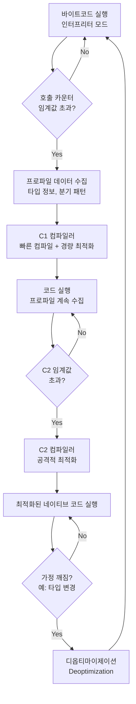
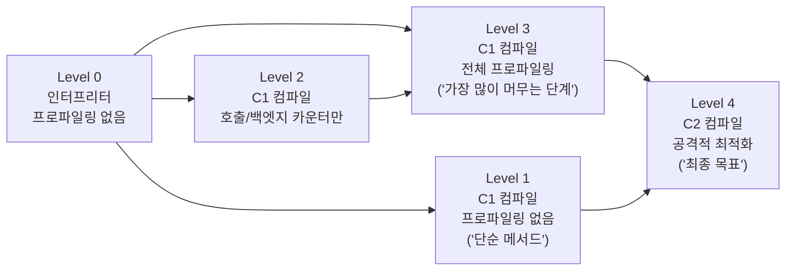

> **한 줄 요약**: JIT(Just-In-Time) 컴파일러는 JVM이 바이트코드를 실행하면서 "자주 실행되는 코드"를 감지해 실시간으로 네이티브 기계어로 변환·최적화하는 엔진이며, 이것이 Java가 인터프리터 언어임에도 고성능을 낼 수 있는 핵심 이유입니다.

---

## 1. 도입 비유 — 동시통역사

국제 회의장의 동시통역사를 상상해 보세요.

처음에는 연사가 말하는 **문장 하나하나를 실시간으로 번역**합니다. 빠르게 시작할 수 있지만 번역 품질이 다소 거칩니다. 그런데 회의가 계속되면서 "이 연사는 '지속 가능한 개발'이라는 표현을 자주 쓴다"는 것을 알게 됩니다. 통역사는 그 표현을 **암기**해 두고, 다음부터는 즉시 막힘없이 통역합니다. 나중에는 "이 발표자의 논리 흐름까지 파악해서 반 박자 빠르게 통역"하는 수준까지 됩니다.

JVM JIT 컴파일러가 정확히 이 방식으로 동작합니다.

- **통역사가 문장 하나씩 번역** → 인터프리터가 바이트코드를 한 줄씩 실행
- **자주 쓰는 표현 암기** → JIT가 핫스팟 메서드를 감지해 네이티브 코드로 컴파일
- **논리 흐름까지 파악해 최적화** → C2 컴파일러의 공격적 최적화 (인라이닝, 루프 언롤링 등)

---

## 2. JIT 컴파일러란 무엇인가?

### 2.1 인터프리터 vs 컴파일러 vs JIT 비교

비유로 먼저 이해해보면: 인터프리터는 "영어 책을 한 문장씩 읽으며 번역하는 사람", 정적 컴파일러는 "책 전체를 먼저 번역해서 한국어 책을 출판하는 사람", JIT는 "읽으면서 번역하는데, 자주 나오는 문장은 암기해서 다음에 즉시 말하는 사람"입니다.

<table>
  <thead>
    <tr>
      <th>방식</th>
      <th>동작 원리</th>
      <th>장점</th>
      <th>단점</th>
      <th>대표 언어</th>
    </tr>
  </thead>
  <tbody>
    <tr>
      <td><strong>인터프리터</strong></td>
      <td>소스코드(또는 바이트코드)를 한 줄씩 읽고 즉시 실행</td>
      <td>시작 빠름, 플랫폼 독립적</td>
      <td>실행 느림 (매번 해석 비용)</td>
      <td>Python, Ruby (초기)</td>
    </tr>
    <tr>
      <td><strong>정적 컴파일러</strong></td>
      <td>실행 전에 소스 → 기계어 전체 변환</td>
      <td>실행 빠름, 최적화 철저</td>
      <td>컴파일 시간 소요, 플랫폼 종속</td>
      <td>C, C++, Rust</td>
    </tr>
    <tr>
      <td><strong>JIT 컴파일러</strong></td>
      <td>실행 중 자주 사용되는 코드를 감지 → 실시간 기계어 변환</td>
      <td>플랫폼 독립 + 고성능, 런타임 프로파일 기반 최적화</td>
      <td>초기 실행(Cold Start) 느림, 메모리 오버헤드</td>
      <td>Java, C#, JavaScript V8</td>
    </tr>
  </tbody>
</table>

### 2.2 javac vs JIT — 컴파일의 두 단계

많은 분들이 "Java는 컴파일 언어 아닌가요?"라고 묻습니다. 맞습니다. 그런데 컴파일이 **두 번** 일어납니다.

```
소스코드(.java)
     │
     ▼  [javac — 개발 시점, 여러분이 'gradle build' 할 때]
바이트코드(.class) ← 이건 CPU가 직접 실행할 수 없는 JVM 전용 명령어
     │
     ▼  [JVM 클래스로더 — 런타임]
메모리에 로드된 바이트코드
     │
     ├── [인터프리터] 즉시 실행 (느림 — 매번 바이트코드 해석)
     │
     └── [JIT 컴파일러] 핫스팟 감지 후 네이티브 기계어로 변환 (빠름)
```

`javac`는 개발 시점에 한 번만 실행됩니다. JIT는 **매번 실행될 때마다** 런타임에서 동작합니다. 그래서 같은 `.class` 파일이 여러 플랫폼(Windows, Linux, macOS)에서 동작할 수 있습니다 — JVM이 각 플랫폼에 맞는 기계어로 변환하니까요.

**왜 javac가 직접 기계어를 생성하지 않는가?** 그렇게 하면 플랫폼마다 다른 `.class` 파일이 필요합니다. "Write Once, Run Anywhere"를 포기해야 합니다.

### 2.3 AOT 컴파일과의 비교

GraalVM Native Image는 빌드 시점에 전체 애플리케이션을 기계어로 변환합니다. JIT가 "달리면서 최적화"한다면, AOT는 "출발 전에 완벽히 준비"하는 방식입니다.

<table>
  <thead>
    <tr>
      <th>항목</th>
      <th>JIT 컴파일</th>
      <th>AOT (Ahead-Of-Time) 컴파일</th>
    </tr>
  </thead>
  <tbody>
    <tr>
      <td><strong>컴파일 시점</strong></td>
      <td>런타임 (실행 중)</td>
      <td>빌드 시점 (배포 전)</td>
    </tr>
    <tr>
      <td><strong>시작 속도</strong></td>
      <td>느림 (Cold Start 존재)</td>
      <td>매우 빠름 (이미 기계어)</td>
    </tr>
    <tr>
      <td><strong>최대 성능</strong></td>
      <td>매우 높음 (런타임 프로파일 기반)</td>
      <td>중간 (정적 분석의 한계)</td>
    </tr>
    <tr>
      <td><strong>왜 JIT가 더 빠를 수 있는가?</strong></td>
      <td>실제 실행 데이터를 보고 최적화 — "실제로는 Dog만 들어온다"는 사실을 알 수 있음</td>
      <td>컴파일 시점에 모든 가능성을 고려해야 해서 보수적</td>
    </tr>
    <tr>
      <td><strong>동적 기능</strong></td>
      <td>완전 지원 (리플렉션, 동적 클래스로딩)</td>
      <td>제한적 (사전 등록 필요)</td>
    </tr>
    <tr>
      <td><strong>적합한 용도</strong></td>
      <td>장시간 실행 서버 (Spring Boot API)</td>
      <td>서버리스, CLI, 마이크로서비스</td>
    </tr>
  </tbody>
</table>

---

## 3. JIT 컴파일 과정 — 상세 플로우

### 3.1 전체 파이프라인



### 3.2 호출 카운터 (Invocation Counter) — JIT의 출발점

"이 메서드가 충분히 자주 호출되는가?"를 판단하는 기준입니다. JVM은 각 메서드가 몇 번 호출됐는지 카운터로 추적합니다.

비유하자면 커피숍 메뉴판입니다. 처음 방문한 손님은 메뉴를 하나하나 읽습니다. 10번 방문하면 "아메리카노 M사이즈"를 외워서 즉시 주문합니다. JIT도 10,000번(기본 임계값) 호출된 메서드를 "이건 외울 만하다"고 판단해서 네이티브 코드로 컴파일합니다.

```java
// JVM 내부 동작을 의사코드로 표현
class MethodCounters {
    int invocationCount = 0;    // 메서드 호출 횟수
    int backedgeCount = 0;      // 루프 백엣지 횟수 (루프가 위로 돌아갈 때마다)

    void onMethodEntry() {
        invocationCount++;
        if (invocationCount >= CompileThreshold) {
            scheduleJITCompilation(this); // 백그라운드 컴파일 스케줄
        }
    }
}
```

**호출 카운터 임계값 기본값:**

| JVM 모드 | `-XX:CompileThreshold` 기본값 |
|---------|---------------------------|
| Client (-client) | 1,500 |
| Server (-server) | 10,000 |
| Tiered Compilation | 각 레벨별 별도 임계값 |

**만약 임계값이 너무 낮으면?** JIT가 너무 일찍 컴파일을 시작합니다. 프로파일 데이터가 충분하지 않은 상태에서 컴파일하면 최적화 품질이 낮아집니다. 게다가 컴파일 자체에도 CPU 시간이 소비됩니다.

### 3.3 백엣지 카운터 (Back-Edge Counter) — 긴 루프의 처리

루프는 메서드 호출 없이도 오랫동안 실행될 수 있습니다.

```java
// 이 메서드는 한 번만 호출되지만
// 루프 백엣지가 1,000,000번 발생 → 카운터가 폭발적으로 증가
public void processData(int[] data) {
    for (int i = 0; i < 1_000_000; i++) {  // ← 루프가 위로 점프할 때마다 카운트
        data[i] = data[i] * 2 + 1;
    }
}
```

백엣지 카운터가 임계값을 초과하면, **루프가 실행 중인 도중에도** JIT 컴파일이 시작됩니다. 이것이 **OSR(On-Stack Replacement)**입니다.

### 3.4 OSR — On-Stack Replacement

"현재 실행 중인 인터프리터 스택 프레임을 JIT 컴파일된 프레임으로 교체"하는 기술입니다. 마치 달리고 있는 차의 엔진을 교체하는 것과 같습니다.

```
[인터프리터 스택 프레임]          [JIT 컴파일된 스택 프레임]
━━━━━━━━━━━━━━━━━━━━━━━━        ━━━━━━━━━━━━━━━━━━━━━━━━━
 processData() 실행 중  ──OSR──▶  processData() 계속 실행
 i = 42345 (루프 진행 중)          i = 42345 (상태 그대로 인계)
━━━━━━━━━━━━━━━━━━━━━━━━        ━━━━━━━━━━━━━━━━━━━━━━━━━
     느림 (인터프리터)                  빠름 (네이티브 코드)
```

---

## 4. C1 vs C2 컴파일러

### 4.1 두 컴파일러 비교

비유: C1은 "빠른 번역가" — 품질은 80점이지만 5분만에 번역 완료. C2는 "완벽주의 번역가" — 품질은 99점이지만 2시간 걸림. 처음엔 빠른 번역가를 쓰다가, 많이 쓰이는 문서는 완벽주의 번역가에게 맡깁니다.

<table>
  <thead>
    <tr>
      <th>항목</th>
      <th>C1 (Client Compiler)</th>
      <th>C2 (Server Compiler)</th>
    </tr>
  </thead>
  <tbody>
    <tr>
      <td><strong>별칭</strong></td>
      <td>Client JIT</td>
      <td>Server JIT, Opto</td>
    </tr>
    <tr>
      <td><strong>컴파일 속도</strong></td>
      <td>빠름 (수십 ms)</td>
      <td>느림 (수백 ms ~ 수 초)</td>
    </tr>
    <tr>
      <td><strong>최적화 수준</strong></td>
      <td>가벼운 최적화</td>
      <td>공격적 최적화</td>
    </tr>
    <tr>
      <td><strong>주요 최적화</strong></td>
      <td>인라이닝, 레지스터 할당</td>
      <td>탈출 분석, 루프 변환, 벡터화</td>
    </tr>
    <tr>
      <td><strong>적합한 상황</strong></td>
      <td>GUI 앱, 단명 프로세스</td>
      <td>장시간 실행 서버</td>
    </tr>
  </tbody>
</table>

### 4.2 Tiered Compilation — 5단계 컴파일

Java 7부터 기본 활성화된 **Tiered Compilation**은 C1과 C2를 협력시킵니다. "일단 빠르게 시작하고, 점점 더 잘 최적화"하는 전략입니다.



**각 레벨 상세 설명:**

**Level 0 — 인터프리터**: 모든 코드의 시작점. 바이트코드를 한 줄씩 해석 실행. 프로파일링 없음. 매우 드물게 실행되는 코드는 여기서 영원히 머뭅니다 (최적화 비용을 지불할 가치가 없음).

**Level 1 — C1, 프로파일링 없음**: getter/setter처럼 단순하고 짧은 메서드. 빠르게 컴파일하되 프로파일 수집 오버헤드 없음.

**Level 2 — C1, 경량 프로파일링**: C2 큐가 바쁠 때 대기 중인 메서드에 적용. Level 3으로 가기 위한 임시 단계.

**Level 3 — C1, 전체 프로파일링**: **대부분의 메서드가 가장 오래 머무는 단계.** 타입 프로파일, 분기 예측 등 전체 수집. C2가 최적화에 활용할 데이터를 쌓는 중.

**Level 4 — C2, 공격적 최적화**: **최종 목표.** 수집된 프로파일 기반으로 탈출 분석, 루프 벡터화, 전체 인라이닝 적용. 가정이 깨지면 (예: 항상 Dog인 줄 알았는데 Cat이 들어옴) Level 0으로 복귀.

**만약 Tiered Compilation이 없었으면?** 처음부터 C2만 쓰면 컴파일 자체가 수 초 걸려서 초기 응답이 더 느립니다. C1만 쓰면 장기 실행 서버의 최대 성능이 낮습니다.

---

## 5. 주요 최적화 기법

### 5.1 메서드 인라이닝 (Method Inlining) — 가장 효과적인 최적화

메서드 호출 자체에는 비용이 있습니다: 새 스택 프레임 생성, 매개변수 복사, 반환 처리. 짧은 메서드를 자주 호출하면 이 오버헤드가 쌓입니다.

인라이닝은 메서드 호출을 아예 없애고, 호출부에 메서드 본체를 직접 삽입합니다.

**Before (인라이닝 전):**
```java
public int calculate(int a, int b) {
    return add(a, b) * 2;  // 매번 스택 프레임 생성 비용 발생
}

private int add(int x, int y) {
    return x + y;
}
```

**After (인라이닝 후 — JIT가 자동으로 변환):**
```java
// JIT가 내부적으로 변환 (실제로는 네이티브 코드)
public int calculate(int a, int b) {
    return (a + b) * 2;  // 메서드 호출 없이 직접 삽입
}
```

**인라이닝이 더 중요한 이유 — 연쇄 효과:**
인라이닝이 되면 컴파일러가 더 많은 정보를 볼 수 있어서, 추가 최적화가 가능합니다.

```java
// 원본 코드
public boolean isAdult(Person person) {
    return person.getAge() >= 18;
}

// getAge()가 인라이닝된 후 — 이제 person.age가 직접 보임
public boolean isAdult(Person person) {
    return person.age >= 18;
    // → 이제 null 체크 제거, 범위 체크 제거 등 추가 최적화 가능
}
```

**만약 인라이닝이 안 되면?** 300줄짜리 메서드는 기본적으로 인라이닝 대상이 아닙니다 (기본 임계값 35바이트코드 바이트). 자주 호출되는 메서드를 작게 유지하는 것이 성능에 중요한 이유입니다.

### 5.2 루프 언롤링 (Loop Unrolling)

루프는 매 반복마다 조건 체크, 인덱스 증가, 분기 명령이 실행됩니다. 이 오버헤드를 줄이는 방법이 루프 언롤링입니다.

```java
// 원본 루프 — 조건 체크 1000번
int sum = 0;
for (int i = 0; i < 1000; i++) {
    sum += array[i];
}

// JIT 루프 언롤링 후 — 조건 체크 250번으로 감소
int sum = 0;
for (int i = 0; i < 1000; i += 4) {
    sum += array[i];      // 실제 계산은 4번씩
    sum += array[i + 1];
    sum += array[i + 2];
    sum += array[i + 3];
}
```

**SIMD 벡터화와의 연계**: 루프 언롤링 후 JIT는 CPU의 SIMD 명령어(AVX, SSE)를 활용합니다. `int[]` 배열의 합산을 AVX2 명령어로 8개 int를 한 번에 더할 수 있습니다 — 실질적으로 8배 빠른 계산.

### 5.3 탈출 분석 (Escape Analysis) — GC 압력 제거

탈출 분석은 객체가 메서드 밖으로 "탈출"하지 않는다고 판단되면, **힙 대신 스택에 할당**합니다.

비유: 회의에서 잠깐 쓸 메모지(객체)를 여기서 쓰고 버릴 것인지, 아니면 파일 캐비닛(힙)에 보관할 것인지 판단합니다. 잠깐 쓰고 버릴 것이라면 포스트잇에 적고 바로 버리면 됩니다 (스택 할당). GC(청소부)가 신경 쓸 필요가 없습니다.

```java
// 케이스 1: NoEscape — 메서드 내부에서만 사용
public int computeArea() {
    Point p = new Point(3, 4);  // p가 이 메서드 밖으로 나가지 않음
    return p.x * p.x + p.y * p.y;
    // JIT: Point 객체를 힙에 할당하지 않고 스택의 레지스터로 처리
    // GC가 이 객체를 추적할 필요 없음 → GC 사이클 단축
}

// 케이스 2: GlobalEscape — 탈출 발생 → 최적화 불가
private Point cachedPoint;

public void cachePoint() {
    cachedPoint = new Point(1, 2);  // 필드에 저장 → 탈출
    // JIT: 반드시 힙 할당 필요
}
```

**만약 탈출 분석이 없었으면?** 루프 안에서 임시 객체를 많이 생성하면 GC가 자주 발생하고, GC는 STW(Stop-The-World)를 유발합니다. 응답 시간이 불규칙하게 튀는 원인이 됩니다.

### 5.4 데드코드 제거 (Dead Code Elimination)

실행되지 않는 코드를 컴파일 결과에서 아예 제거합니다.

```java
// JIT가 프로파일을 보고 "사실상 데드코드"로 판단
public void handleEvent(Event event) {
    if (event.type == EventType.ERROR) {
        // 10,000번 실행 중 단 0번 실행됨 → 콜드 패스(cold path)
        handleError(event);
    } else {
        // 10,000번 실행 중 10,000번 실행됨 → 핫 패스(hot path)
        handleNormal(event);
    }
}
// JIT: ERROR 분기를 비개연적(unlikely) 코드로 마킹
// 핫 패스(handleNormal)가 CPU 명령어 캐시에서 연속적으로 배치됨 → 분기 예측 향상
```

### 5.5 가상 호출 최적화 (Devirtualization)

Java의 모든 인스턴스 메서드는 기본적으로 가상(virtual) 호출입니다. 가상 호출은 실제 타입을 찾아가는 vtable 조회가 필요합니다.

```java
interface Animal {
    String sound();
}

class Dog implements Animal {
    public String sound() { return "Woof"; }
}

public void makeSound(Animal animal) {
    System.out.println(animal.sound()); // vtable lookup 필요
}
```

JIT가 프로파일을 보니 10,000번 호출 중 10,000번이 Dog 인스턴스라면, "이건 항상 Dog다"라고 가정하고 직접 호출로 변환합니다.

```java
// JIT 컴파일 후 (개념적):
public void makeSound(Animal animal) {
    if (animal instanceof Dog) {
        // Dog.sound()를 직접 호출 — vtable 없이
        System.out.println("Woof"); // 인라이닝까지 가능
    } else {
        // 가정이 틀렸을 때의 폴백 (드문 경우)
        System.out.println(animal.sound());
    }
}
```

**최적화 수준별 분류:**

| 타입 | 설명 | 최적화 수준 |
|-----|-----|----------|
| **Monomorphic** | 항상 같은 타입 (1종) | vtable 제거 + 인라이닝 가능 |
| **Bimorphic** | 2가지 타입 | if/else로 전개 |
| **Polymorphic** | 3~N가지 타입 | 부분적 최적화 |
| **Megamorphic** | 매우 다양한 타입 | vtable 조회 유지 (최적화 불가) |

---

## 6. Cold Start 문제 — 실무 핵심

### 6.1 Cold Start란 무엇인가?

레스토랑 비유: 가스 불을 켜면 즉시 뜨겁지 않습니다. 점점 뜨거워지다가 결국 안정적인 온도에 도달합니다. JVM도 같습니다.

```
응답 시간 (ms)
  │
300┤  ████
250┤  █████
200┤  ██████
150┤  ███████
100┤  █████████
 80┤  ██████████████
 50┤           ███████████████████
 30┤                        ██████████████████████████
 10┤                                              ━━━━━━━━━ (안정화)
  └────────────────────────────────────────────────────── 시간
    0s  10s  20s  30s  1m   2m   5m   10m
    ↑                                    ↑
  Cold Start (느림)              Warm State (빠름)
```

### 6.2 왜 Cold Start가 발생하는가?

Cold Start는 단일 원인이 아니라 **여러 요인의 복합 효과**입니다.

**원인 1: JIT 미작동 (가장 큰 원인)**

시작 직후 모든 코드가 인터프리터 모드로 실행됩니다. JIT 임계값(10,000번)에 도달하기 전까지 바이트코드를 해석하며 실행합니다. 인터프리터는 JIT 네이티브 코드보다 **10~100배 느립니다**.

**원인 2: 클래스 로딩**

```java
// 요청이 들어올 때마다 처음 사용하는 클래스가 로딩됨
// ClassLoader가 .class 파일 → 검증 → 링킹 → 초기화 수행
UserService service = new UserService();  // UserService 최초 로딩
// → 내부에서 사용하는 Repository, EntityManager도 연쇄 로딩
// → 각 클래스 로딩에 수십 ms 소요
```

**원인 3: 프로파일링 미완성**

JIT가 있어도 프로파일이 없으면 보수적 최적화만 적용합니다. C1 레벨 코드도 처음엔 인라이닝 등 최적화가 부족합니다. C2로 승격되기까지 수천 번 호출이 필요합니다.

### 6.3 트래픽 규모별 Cold Start 영향

**시나리오 A — 저트래픽 (100 TPS)**

초당 100개 요청이므로 JIT 임계값(10,000번)에 도달하는 데 약 100초. 그동안 응답 시간이 50ms → 200ms로 높아지지만 타임아웃(3~5초)에는 한참 미치지 않습니다. 큰 문제 없음.

**시나리오 B — 고트래픽 (10,000 TPS)**

```
T+0s  배포 완료, 트래픽 유입 시작
T+0~5s  모든 코드가 인터프리터 실행 → 응답시간 300ms~1000ms
T+5~30s  C1 컴파일 시작 → 응답시간 100~300ms
T+30~120s  C2 컴파일 시작 → 응답시간 30~100ms
T+120s+  안정화 → 응답시간 10~30ms

위험 요소:
- T+0~5s 구간: 10,000 TPS × 1000ms = 요청 10,000건이 동시에 대기
- 타임아웃(보통 500ms~1s) 초과로 에러 폭발 가능
- 모니터링에서 배포 직후 에러율 급증 알람 발생

실무에서 흔한 오해:
  "배포가 실패했다" → 실제로는 Cold Start
  → 급하게 롤백
  → 롤백한 버전에서도 같은 Cold Start 발생
  → "뭔가 인프라 문제" 오인
```

**시나리오 C — 극한 트래픽 (100,000 TPS)**

```
T+0s  새 인스턴스 배포, LB에 등록
T+0~3s  인터프리터 모드 → 응답시간 2000ms~5000ms
         → 100,000 TPS × 5000ms = 50만 건 동시 대기
         → 메모리 부족 → OOM 발생
         → 인스턴스가 시작과 동시에 죽음
         → LB가 죽은 인스턴스에 계속 트래픽 전송

장애 패턴:
1. 새 인스턴스 배포 → 헬스체크 통과 (JVM 시작 OK)
2. 트래픽 투입 → Cold Start로 인한 응답 지연
3. 타임아웃 → 연결 누적 → OOM → 인스턴스 크래시
4. 1번으로 반복 (재시작 루프)
```

### 6.4 Cold Start 해결 방법

**방법 1: JVM Warm-up (가장 보편적)**

```java
// Spring Boot: 애플리케이션 시작 후 자동 warm-up
@Component
public class JvmWarmupRunner implements ApplicationRunner {

    private final UserService userService;

    @Override
    public void run(ApplicationArguments args) throws Exception {
        log.info("JVM Warm-up 시작...");

        // 핵심 경로를 미리 10,000번 실행해서 JIT 임계값 도달
        // 왜 존재하지 않는 ID를 쓰는가? 실제 DB를 건드리지 않으면서
        // 코드 경로(if/else, try/catch)를 타게 하기 위함
        for (int i = 0; i < 10_000; i++) {
            try {
                userService.findById(-1L);  // 존재하지 않는 ID
            } catch (EntityNotFoundException ignored) {
                // 예외 처리 경로도 JIT 임계값에 포함됨
            }
        }

        log.info("JVM Warm-up 완료. LB 등록 준비됨");
        // warm-up 완료 후 헬스체크 엔드포인트를 UP으로 전환
    }
}
```

```java
// warm-up이 완료될 때까지 LB 트래픽 차단
@Component
public class WarmupHealthIndicator implements HealthIndicator {

    private volatile boolean warmedUp = false;

    @EventListener(ApplicationReadyEvent.class)
    public void onApplicationReady() {
        CompletableFuture.runAsync(this::performWarmup)
            .thenRun(() -> warmedUp = true);
    }

    @Override
    public Health health() {
        return warmedUp
            ? Health.up().build()
            : Health.down().withDetail("reason", "warming up").build();
        // K8s readinessProbe가 DOWN이면 트래픽을 이 Pod에 보내지 않음
    }
}
```

**방법 2: CDS (Class Data Sharing) — 클래스 로딩 단축**

```bash
# Step 1: 클래스 목록 생성
java -XX:DumpLoadedClassList=app.classlist -jar myapp.jar

# Step 2: 공유 아카이브 생성 (이 파일이 클래스 메타데이터를 미리 처리)
java -Xshare:dump \
     -XX:SharedClassListFile=app.classlist \
     -XX:SharedArchiveFile=app.jsa \
     -jar myapp.jar

# Step 3: 공유 아카이브로 실행
java -Xshare:on \
     -XX:SharedArchiveFile=app.jsa \
     -jar myapp.jar

# 효과: JVM 클래스 로딩 시간 30~50% 단축
# 여러 JVM 인스턴스가 동일 메모리 페이지 공유 → 메모리 절약
```

**CDS의 내부 원리**: 클래스 메타데이터(바이트코드, 상수풀, 메서드 정보)를 파일에 직렬화합니다. 다음 실행 시 이 파일을 메모리에 mmap으로 매핑합니다. 파일에서 읽는 게 더 느리지 않나요? OS가 동일한 파일을 여러 프로세스가 공유할 때 메모리를 공유하므로 실제로 읽기가 빠릅니다.

**방법 3: Lazy Init vs Eager Init**

```java
// 모든 빈을 지연 초기화 — 시작은 빠르지만 첫 요청에서 초기화 비용 지불
spring.main.lazy-initialization=true
```

| | Eager Init (기본) | Lazy Init |
|--|-----------------|-----------|
| **시작 시간** | 느림 (모든 빈 초기화) | 빠름 |
| **첫 요청** | 정상 (이미 준비됨) | 느림 (빈 초기화 지연) |
| **에러 감지** | 빠름 (시작 시 발견) | 늦음 (첫 요청 시 발견) |
| **권장 용도** | 서버 (안정성 중요) | Lambda, 단명 프로세스 |

**방법 4: 카나리 배포 + 점진적 트래픽 전환**

```
배포 단계:
1단계: v2 인스턴스 배포, 트래픽 0% (warm-up 중)
       → warm-up Runner가 JIT 임계값 달성
2단계: warm-up 완료 → 트래픽 5% 투입 (10분 관찰)
       → p99 응답시간, 에러율 확인
3단계: 이상 없으면 → 트래픽 25% (10분 관찰)
4단계: 이상 없으면 → 트래픽 100% (v1 종료)

핵심: 트래픽을 받기 전에 JIT가 충분히 가열(warm-up)됨
```

---

## 7. GraalVM과 AOT 컴파일

### 7.1 GraalVM 아키텍처

```
GraalVM 에코시스템
├── GraalVM JIT (JVMCI 기반)
│   ├── 기존 HotSpot 대체 JIT 컴파일러
│   ├── Java로 작성된 컴파일러 (self-hosting)
│   └── 더 공격적인 최적화 가능
│
└── Native Image (AOT 컴파일)
    ├── 빌드 시점에 전체 애플리케이션을 네이티브 실행파일로 변환
    ├── JVM 없이 실행 가능
    └── Substrate VM (극소 런타임)
```

### 7.2 Spring Native (Spring Boot 3.x)

```bash
# Native Image 빌드 (GraalVM 설치 필요, 5~20분 소요)
./mvnw -Pnative native:compile

# 결과: target/myapp (네이티브 실행 파일, ~50MB)
./target/myapp
# 시작 시간: 0.08s (기존 JVM: 2~5s)
```

**Native Image의 제약 — 왜 리플렉션이 문제인가?**

JIT는 런타임에 어떤 클래스가 로딩되는지 볼 수 있습니다. Native Image는 빌드 시점에 "이 앱이 실행될 때 어떤 클래스가 필요한지"를 정적 분석으로 파악해야 합니다. 리플렉션(`Class.forName()`)은 런타임에 동적으로 클래스 이름을 결정할 수 있어서, 빌드 시점에 어떤 클래스가 필요한지 알 수 없습니다.

```json
// src/main/resources/META-INF/native-image/reflect-config.json
// 리플렉션으로 접근하는 클래스를 사전 등록
[
  {
    "name": "com.example.MyDto",
    "allDeclaredFields": true,
    "allDeclaredMethods": true,
    "allDeclaredConstructors": true
  }
]
```

### 7.3 GraalVM Native Image 장단점

**장점:**
- 시작 시간 100ms 이하 — Kubernetes Cold Start 문제 해결
- 메모리 사용량 5~10배 감소 (JVM 자체가 없으므로)
- Docker 이미지 크기 소형화

**단점:**
- 빌드 시간 5~20분 — CI/CD 파이프라인 부담
- 동적 기능 제한 (리플렉션, 동적 프록시, 동적 클래스로딩)
- 최대 처리량이 JIT보다 낮음 (런타임 프로파일 기반 최적화 불가)
- 일부 라이브러리 호환성 문제

---

## 8. JIT 모니터링 & 디버깅

### 8.1 PrintCompilation으로 JIT 로그 확인

```bash
java -XX:+PrintCompilation -jar myapp.jar
```

**출력 형식 분석:**
```
timestamp  compile_id  flags  tier  method_name  (byte_size)

예시:
    237    1       3       java.lang.String::hashCode (55 bytes)
    238    2       4       java.lang.String::equals (81 bytes)
    245    3  s    3       java.util.HashMap::get (23 bytes)
    267    4       4       com.example.UserService::findById (120 bytes)
    312    2       4       java.lang.String::equals (81 bytes)   made not entrant

플래그 의미:
  %  : OSR(On-Stack Replacement) 컴파일
  s  : 동기화 메서드(synchronized)
  !  : 예외 핸들러 포함

"made not entrant": 디옵티마이제이션으로 무효화된 코드
"made zombie": GC에 의해 제거 예정인 코드
```

**`made not entrant`가 자주 보이면?** 타입 가정이 자주 깨진다는 뜻입니다. 인터페이스를 통한 호출에서 다양한 구현체가 오고 있다는 신호입니다.

### 8.2 Code Cache 모니터링

JIT 컴파일 결과는 Code Cache에 저장됩니다. Code Cache가 가득 차면 JIT 컴파일이 중단됩니다.

```bash
# Code Cache 크기 설정 (기본 240MB, 운영에서는 늘려야 할 때 있음)
java -XX:ReservedCodeCacheSize=512m \
     -XX:+UseCodeCacheFlushing \
     -jar myapp.jar

# Code Cache 통계 출력
java -XX:+PrintCodeCache -jar myapp.jar
```

**"CodeCache is full. Compiler has been disabled." 로그가 나오면:**
기존 JIT 코드는 계속 실행되지만 새 메서드는 인터프리터로 실행됩니다. 운영 중 갑자기 성능이 50% 저하되는 원인이 됩니다. `-XX:ReservedCodeCacheSize`를 늘리세요.

### 8.3 JMH로 JIT 효과 정확하게 측정

JMH가 없으면 "시스템.나노타임으로 측정해보니 빠른데요?"라는 함정에 빠집니다. 그 측정은 인터프리터 실행 결과일 가능성이 높습니다.

```java
@BenchmarkMode(Mode.AverageTime)
@OutputTimeUnit(TimeUnit.NANOSECONDS)
@Warmup(iterations = 5, time = 1)        // 5번 warm-up 반복 — JIT가 안정화될 때까지
@Measurement(iterations = 10, time = 1)  // warm-up 후 10번 실측
@Fork(2)                                  // 2개의 JVM 프로세스로 측정 (통계적 신뢰성)
public class JitBenchmark {

    @Benchmark
    public int sumWithLoop() {
        int sum = 0;
        for (int i = 0; i < data.length; i++) {
            sum += data[i];
        }
        return sum;
    }

    @Benchmark
    @CompilerControl(CompilerControl.Mode.DONT_INLINE)  // 인라이닝 강제 비활성화
    public int sumWithoutInlining() {
        return computeSum(data);  // 인라이닝 없이 측정 (비교 기준)
    }
}
```

**warm-up iterations의 의미**: 5번의 1초짜리 warm-up은 5초 동안 JIT가 최대한 최적화하게 합니다. 그 후 측정하면 진짜 "Warm State" 성능을 봅니다. warm-up 없이 측정하면 Cold State 성능을 측정하게 됩니다.

---

## 9. 실무에서 자주 하는 실수 TOP 5

### 실수 1: JVM warm-up 없이 벤치마크 측정

```java
// 잘못된 벤치마크 — JIT가 아직 컴파일 안 된 상태를 측정
public class BadBenchmark {
    public static void main(String[] args) {
        long start = System.nanoTime();
        int sum = 0;
        for (int i = 0; i < 10_000; i++) {
            sum += compute(i);  // 인터프리터 실행
        }
        // 이 결과는 인터프리터 속도이며, 실제 운영 성능의 10~100배 느림
        System.out.println("시간: " + (System.nanoTime() - start) + "ns");
    }
}

// 올바른 벤치마크
public class GoodBenchmark {
    public static void main(String[] args) {
        // warm-up: JIT 임계값 이상 실행
        for (int i = 0; i < 20_000; i++) {
            compute(i);
        }
        // 이제 JIT C2 코드로 실행됨 — 진짜 성능 측정
        long start = System.nanoTime();
        int sum = 0;
        for (int i = 0; i < 10_000; i++) {
            sum += compute(i);
        }
        System.out.println("시간(warm): " + (System.nanoTime() - start) + "ns");
    }
}
```

### 실수 2: Cold Start를 버그로 오해

```
상황: 신규 배포 후 모니터링 대시보드에서 p99 응답 시간 급증
잘못된 판단: "배포한 코드에 버그가 있다" → 즉시 롤백
올바른 판단: "Cold Start다" → warm-up 완료까지 대기 (보통 1~5분)

구분 방법:
- 에러율이 높고 지속된다면: 코드 버그 가능성
- 응답 시간만 높다가 서서히 정상화된다면: Cold Start
```

### 실수 3: 큰 메서드로 인라이닝 방해

```java
// 잘못: 로직을 한 메서드에 몰아넣어 인라이닝 불가
public void processUser(User user) {
    // 300줄짜리 메서드
    // 기본 인라이닝 임계값 35바이트코드 바이트를 훨씬 초과
    // → 인라이닝 안 됨 → 최적화 기회 손실
}

// 올바름: 책임에 따라 메서드 분리 (자연스러운 분리가 JIT에도 유리)
public void processUser(User user) {
    validateUser(user);    // 짧은 메서드 → 인라이닝 대상
    enrichUser(user);
    saveUser(user);
}
```

### 실수 4: 리플렉션 남용으로 Megamorphic 호출 유발

```java
// 잘못: 루프 안에서 리플렉션으로 메서드 호출
// 타입이 다양해져 Megamorphic → JIT 최적화 불가
for (Object obj : objects) {
    Method m = obj.getClass().getMethod("process");
    m.invoke(obj);  // 매번 다른 클래스 → Megamorphic → 최적화 불가
}

// 올바름: 인터페이스 도입 → Monomorphic/Bimorphic 가능
interface Processable {
    void process();
}

for (Processable p : processables) {
    p.process();  // JIT가 타입 프로파일로 최적화 가능
}
```

### 실수 5: Code Cache 용량 부족 방치

```bash
# 증상: 운영 중 갑자기 성능 50% 저하
# 로그: "CodeCache is full. Compiler has been disabled."

# 해결: Code Cache 크기 증가 + 자동 정리 활성화
java -XX:ReservedCodeCacheSize=512m \   # 기본 240MB → 512MB
     -XX:+UseCodeCacheFlushing \         # 오래된 코드 자동 정리
     -jar myapp.jar

# JMX로 모니터링:
# java.lang:type=MemoryPool,name=CodeCache
# Usage.used가 Usage.max의 80% 이상이면 경고 알람 설정
```

---

## 10. 면접 포인트

### Q1: "JIT 컴파일러가 무엇인지 설명해 주세요"

```
핵심 답변 구조:
1. 정의: 런타임에 "핫스팟" 바이트코드를 네이티브 기계어로 변환하는 컴파일러
2. 작동 방식: 호출 카운터 → 임계값 도달 → 프로파일 수집 → C1 → C2 컴파일
3. 왜 유용한가: 플랫폼 독립성 유지하면서 C/C++ 수준 성능 달성
4. 한계: Cold Start 존재 (처음엔 느리다가 점점 빨라짐)

추가 포인트:
- Tiered Compilation으로 C1/C2 협력 설명
- 실제 최적화 기법 1~2개 (인라이닝, 탈출 분석)
- 프로파일 기반 최적화가 정적 컴파일보다 종종 더 효율적인 이유
```

### Q2: "Cold Start 문제를 어떻게 해결하셨나요?"

```
경험 기반 답변 예시:
- "고트래픽 서비스 배포 시 Cold Start로 에러 발생 경험"
- "ApplicationRunner로 warm-up 로직 구현 (핵심 경로 10,000번 실행)"
- "WarmupHealthIndicator로 warm-up 완료 전 LB 등록 차단"
- "카나리 배포로 5% → 100% 점진적 트래픽 전환"
- "결과: 배포 후 에러율 0% 유지"
```

### Q3: "JIT 최적화 중 탈출 분석이란 무엇인가요?"

```
핵심 답변:
1. 정의: 객체가 메서드 범위 밖으로 나가지 않는다면 힙이 아닌 스택에 할당
2. 효과: GC 압력 감소 (GC가 추적할 객체 수 감소 → STW 빈도 감소)
3. 예시: 루프 내 임시 객체, Builder 패턴의 중간 객체
4. 확인: -XX:+PrintEliminateAllocations
```

### Q4: "Tiered Compilation의 5단계를 설명해 주세요"

```
Level 0: 인터프리터 (프로파일링 없음)
Level 1: C1, 경량 (getter/setter 같은 단순 메서드)
Level 2: C1, 호출/백엣지 카운터만 (C2 큐 대기 중)
Level 3: C1, 전체 프로파일링 (가장 오래 머무는 단계)
Level 4: C2, 공격적 최적화 (최종 목표)

핵심: Level 3에서 축적된 프로파일로 Level 4의 공격적 최적화가 가능
      Level 4에서 가정이 깨지면 Level 0으로 디옵티마이제이션
```

---

## 11. 핵심 포인트 정리

### JIT 컴파일러 핵심

```
1. JIT는 런타임에 "핫스팟" 코드를 감지해 기계어로 변환한다
2. 인터프리터(느리지만 즉시)와 JIT(느리지만 점점 빠름)가 협력
3. Tiered Compilation: Level 0(인터프리터) → Level 4(C2 최적화)
4. C1은 빠른 컴파일, C2는 공격적 최적화
5. 프로파일 기반 최적화 (런타임 정보) > 정적 분석 최적화 (빌드 시점 정보)
```

### 주요 최적화 기법

```
인라이닝: 메서드 호출을 호출부에 삽입 → 스택 오버헤드 제거 + 추가 최적화 가능
탈출 분석: 지역 객체를 스택에 할당 → GC 압력 감소
루프 언롤링: 루프 횟수 줄이고 본체 복제 → 분기 비용 감소, SIMD 벡터화 가능
Devirtualization: 가상 호출을 직접 호출로 → vtable 탐색 제거
데드코드 제거: 실행 안 되는 코드 제거 → 불필요한 연산 없앰
```

### Cold Start 핵심

```
원인: JIT 미작동 + 클래스 로딩 + 프로파일링 미완성
영향: 저트래픽(100 TPS) - 무시 가능
      고트래픽(10,000 TPS) - 배포 시 에러 발생
      극한(100,000 TPS) - 장애 수준, 반드시 대비 필요

해결책 우선순위:
1. 카나리 배포 + 점진적 트래픽 전환 (필수)
2. ApplicationRunner warm-up + 헬스체크 연동 (필수)
3. CDS로 클래스 로딩 단축 (선택)
4. AOT(GraalVM Native Image) — 시작 속도 최우선 시 (선택)
```

---

> **마무리**: JIT 컴파일러는 "일단 실행하고, 자주 쓰이는 코드를 점점 더 잘 실행하는" 점진적 최적화 시스템입니다. Cold Start는 이 "점진적"이라는 특성에서 비롯되며, 실무에서는 warm-up과 카나리 배포로 반드시 대응해야 합니다. GraalVM Native Image는 Cold Start를 근본적으로 해결하지만 최대 처리량과의 트레이드오프를 이해하고 선택해야 합니다.
