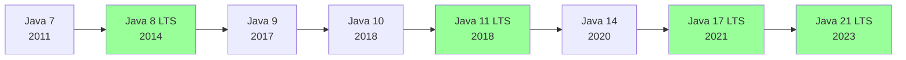
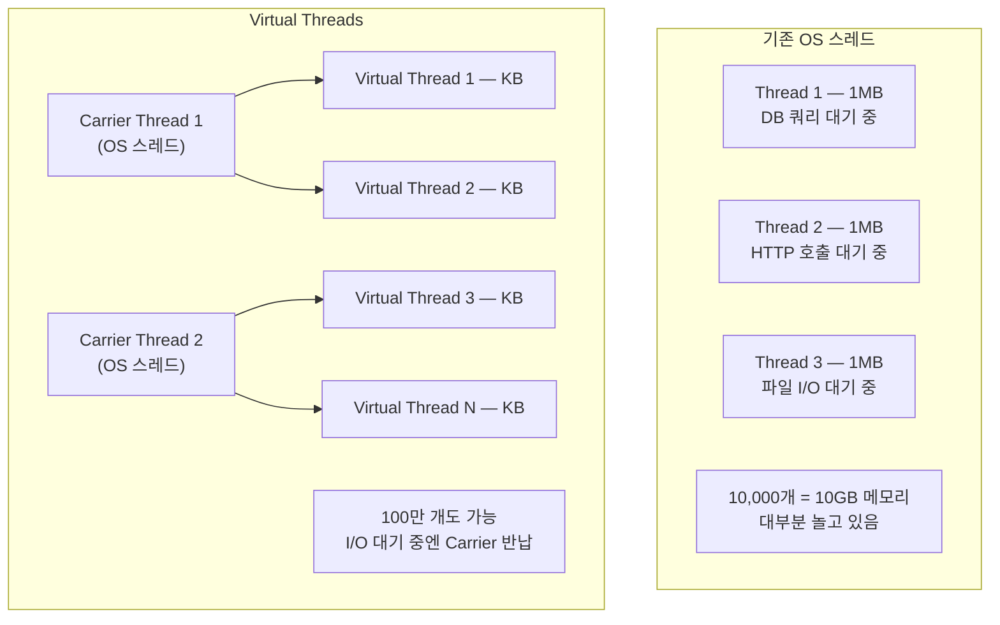
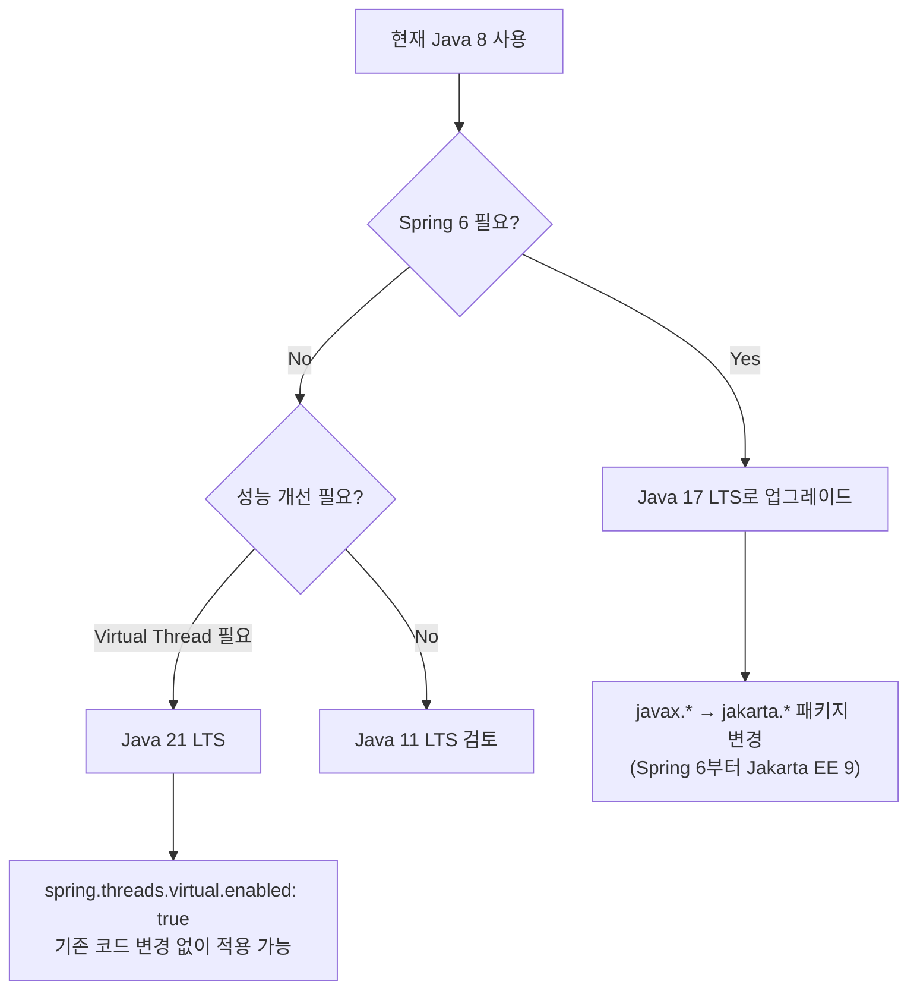

**한 줄 요약**: Java는 버전마다 "개발자가 반복적으로 겪는 고통"을 제거해왔다. 각 기능이 왜 만들어졌는지 이해하면 버전 변화가 하나의 흐름으로 보인다.

---

## 1. 비유 — 스마트폰 OS 업데이트

스마트폰 OS 업데이트를 생각해보세요. iOS 16이 "잠금화면 커스터마이징"을 추가한 건 그냥 된 게 아니라, 수년간 사용자들이 "잠금화면을 바꾸고 싶다"는 불만을 쌓아온 결과입니다.

Java 버전 업그레이드도 마찬가지입니다. 매 버전은 **"지금 개발자들이 어디서 가장 많이 고통받고 있는가"**를 반영합니다.

- Java 7: "리소스 닫는 걸 매번 finally 블록에 써야 해?"
- Java 8: "데이터 필터링할 때 익명 클래스를 매번 써야 해?"
- Java 21: "스레드가 1MB씩 먹으니 동시 처리 10만 개는 포기해야 해?"

이 관점으로 버전을 보면 암기할 필요가 없어집니다. 각 기능이 **어떤 고통**을 제거했는지 이해하면 자연스럽게 기억됩니다.

---

## 2. Java 버전 전략 — LTS를 알아야 하는 이유



**LTS(Long Term Support)**는 최소 8년간 보안 패치와 버그 수정을 받는 버전입니다.

실무에서 Java 9, 10, 12, 13 같은 비LTS 버전을 쓰지 않는 이유가 있습니다. 이 버전들은 6개월 후 다음 버전이 나오면 지원이 끊깁니다. 운영 서버에 올렸다가 보안 취약점이 발견되면 패치 자체가 나오지 않는 상황이 됩니다.

**만약 이걸 안 지키면?** 실제로 2019년 Java 8 지원 종료 이슈가 터졌을 때, 많은 기업이 부랴부랴 업그레이드 계획을 세운 이유도 여기 있습니다.

---

## 3. Java 7 (2011) — "코드 중복 이제 그만"

### 3.1 try-with-resources — 리소스 누수의 종말

Java 7 이전에는 파일, DB 연결 같은 리소스를 열면 반드시 닫아야 했는데, 이걸 안전하게 하려면 `finally` 블록이 필수였습니다.

```java
// Java 7 이전 — 실수하기 너무 쉬운 코드
Connection conn = null;
Statement stmt = null;
try {
    conn = getConnection();
    stmt = conn.createStatement();
    // ...
} catch (SQLException e) {
    // 예외 처리
} finally {
    // 여기서 또 예외가 나면? stmt.close()가 실행 안 될 수도 있음
    if (stmt != null) {
        try { stmt.close(); } catch (SQLException e) { /* 무시 */ }
    }
    if (conn != null) {
        try { conn.close(); } catch (SQLException e) { /* 무시 */ }
    }
}
```

이 패턴을 매번 쓰다 보면 지치고, 지치면 실수합니다. 실수하면 **커넥션 풀이 고갈되고 서비스가 멈춥니다.** 실제로 이 패턴을 잘못 쓴 버그가 운영 장애의 단골 원인이었습니다.

`try-with-resources`는 `AutoCloseable` 인터페이스를 구현한 객체를 자동으로 닫아줍니다. 내부적으로는 컴파일러가 `finally` 블록을 생성해주는 것이지만, 개발자가 직접 작성하는 것보다 훨씬 안전합니다 — 예외가 중첩되어도 모든 리소스를 닫아줍니다.

```java
// Java 7 — AutoCloseable 자동 close
// try 블록을 벗어나는 순간 (정상이든 예외든) close()가 자동 호출됨
try (Connection conn = getConnection();
     Statement stmt = conn.createStatement()) {
    // 비즈니스 로직에만 집중
} // 여기서 stmt.close(), conn.close() 역순으로 자동 호출
```

**왜 역순으로 닫는가?** 나중에 연 것을 먼저 닫아야 의존성 문제가 없습니다. `stmt`는 `conn`에 의존하므로, `stmt`를 먼저 닫고 그다음 `conn`을 닫습니다.

### 3.2 Diamond Operator (<>) — 타입을 두 번 쓰는 고통 제거

```java
// Java 7 이전 — 타입을 두 번 써야 함 (왼쪽에서 이미 명확한데)
Map<String, List<Integer>> map = new HashMap<String, List<Integer>>();

// Java 7 — 컴파일러가 왼쪽 선언에서 타입을 추론
Map<String, List<Integer>> map = new HashMap<>();
```

**내부 동작**: 컴파일러가 왼쪽의 타입 선언을 보고 `<>` 안에 들어갈 타입을 자동으로 채웁니다. 런타임에는 아무 차이가 없습니다.

### 3.3 Switch에서 String — 해시코드 기반 분기

```java
// Java 7 이전 — if-else 체인만 가능
// Java 7
switch (dayOfWeek) {
    case "MONDAY": return "월요일";
    case "TUESDAY": return "화요일";
    default: return "기타";
}
```

**내부 동작**: String switch는 컴파일 시 `hashCode()`를 비교한 후 `equals()`로 재확인하는 코드로 변환됩니다. 해시 충돌이 발생하면 `equals()`가 틀린 케이스를 걸러냅니다.

**만약 이게 없었으면?** 10가지 상태를 처리하는 코드가 if-else 체인이 됩니다. 읽기 어렵고, 새 케이스 추가할 때 실수하기 쉽습니다.

### 3.4 숫자 리터럴 언더스코어 — 읽기 어려운 숫자의 해방

```java
int million = 1_000_000;        // 1000000보다 훨씬 읽기 쉬움
long creditCard = 1234_5678_9012_3456L;
double pi = 3.14_15_92_65;
```

---

## 4. Java 8 LTS (2014) — 가장 혁신적인 버전, 왜?

Java 8은 Java 역사에서 가장 큰 변화입니다. 핵심은 하나입니다: **함수형 프로그래밍 패러다임의 도입.**

왜 이게 필요했냐고요? 데이터를 처리하는 코드를 보면 이해가 됩니다.

### 4.1 람다 표현식 — 익명 클래스의 고통

버튼 클릭 이벤트를 처리할 때, Java 7까지는 이랬습니다:

```java
// Java 7 이전 — 단 한 줄의 로직을 위해 6줄의 상용구 코드
button.addActionListener(new ActionListener() {
    @Override
    public void actionPerformed(ActionEvent e) {
        System.out.println("클릭!");
    }
});
```

`ActionListener`는 메서드가 하나뿐인 인터페이스입니다. 그런데 그 한 줄을 쓰기 위해 6줄을 써야 했습니다.

**함수형 인터페이스**는 추상 메서드가 정확히 하나인 인터페이스입니다. 람다는 이 인터페이스의 인스턴스를 간결하게 만드는 문법입니다.

```java
// Java 8 — 람다 (메서드 하나짜리 인터페이스는 람다로 대체 가능)
button.addActionListener(e -> System.out.println("클릭!"));

// 내장 함수형 인터페이스들
Predicate<String> isLong = s -> s.length() > 5;      // T → boolean
Function<String, Integer> length = String::length;    // T → R
Consumer<String> printer = System.out::println;       // T → void
Supplier<List<String>> factory = ArrayList::new;      // () → T
BiFunction<Integer, Integer, Integer> add = (a, b) -> a + b; // T, U → R
```

**`String::length`는 무엇인가?** 메서드 참조입니다. `s -> s.length()`와 완전히 같습니다. 컴파일러가 `Function<String, Integer>`라는 타입으로부터 "String 인스턴스를 받아 Integer를 반환하는 함수"임을 추론하고, `String.length()`가 그 형태와 맞으니까 연결합니다.

### 4.2 Stream API — 데이터 처리의 혁명

Stream 이전에는 컬렉션을 처리할 때 어떻게 했을까요?

```java
// Java 7 이전 — 명령형 방식 (어떻게 처리할지를 직접 기술)
List<String> result = new ArrayList<>();
for (Person person : people) {
    if (person.getAge() >= 28) {
        result.add(person.getName());
    }
}
Collections.sort(result);
// 코드를 읽으려면 루프 전체를 머릿속에서 실행해봐야 의미가 파악됨
```

```java
// Java 8 — 선언형 방식 (무엇을 원하는지를 기술)
List<String> result = people.stream()
    .filter(p -> p.getAge() >= 28)               // 조건
    .sorted(Comparator.comparing(Person::getAge)) // 정렬
    .map(Person::getName)                          // 변환
    .collect(Collectors.toList());                 // 수집
// 코드 자체가 의도를 설명함
```

**Stream의 내부 동작**: Stream은 **지연 평가(Lazy Evaluation)**를 사용합니다. `filter()`, `map()` 같은 중간 연산은 호출해도 바로 실행되지 않습니다. `collect()` 같은 최종 연산이 호출될 때 비로소 파이프라인 전체가 실행됩니다.

```java
// 이 코드에서 filter와 map은 아직 실행 안 됨
Stream<String> stream = people.stream()
    .filter(p -> { System.out.println("filter: " + p.getName()); return p.getAge() >= 28; })
    .map(p -> { System.out.println("map: " + p.getName()); return p.getName(); });

// 여기서 처음으로 실행됨
List<String> result = stream.collect(Collectors.toList());
```

**만약 이게 없었으면?** 지연 평가 덕분에 불필요한 계산을 건너뜁니다. 100만 명 중 조건에 맞는 첫 1명만 필요하다면 `findFirst()`로 단락 평가(short-circuit)가 됩니다.

```java
// 통계 — Stream으로 한번에
IntSummaryStatistics stats = people.stream()
    .mapToInt(Person::getAge)
    .summaryStatistics();
// count=4, sum=118, min=25, max=35, average=29.5

// 그룹핑 — SQL의 GROUP BY와 동일한 개념
Map<String, List<Person>> byGender = people.stream()
    .collect(Collectors.groupingBy(Person::getGender));

// flatMap — 중첩 리스트를 평탄화
List<List<Integer>> nested = List.of(List.of(1,2), List.of(3,4), List.of(5,6));
List<Integer> flat = nested.stream()
    .flatMap(Collection::stream)
    .collect(Collectors.toList()); // [1,2,3,4,5,6]
```

**병렬 스트림 주의사항**: `parallelStream()`은 ForkJoinPool을 사용합니다. CPU 집약적인 연산에는 효과적이지만, I/O 집약적인 연산(DB 조회, HTTP 호출)에 사용하면 스레드를 블로킹하여 오히려 느려질 수 있습니다.

### 4.3 Optional — NullPointerException의 명시적 처리

Java에서 가장 흔한 예외는 `NullPointerException`입니다. 런타임에 터지고, 스택 트레이스만 봐서는 어디서 null이 왔는지 추적하기 어렵습니다.

`Optional`은 "이 값이 없을 수도 있다"는 사실을 **타입 시스템 수준**에서 표현합니다.

```java
// Optional 없이 — null 체크를 빠뜨리면 NPE
User user = findUserByEmail("test@example.com"); // null일 수 있음
String city = user.getAddress().getCity();        // NPE 가능
```

```java
// Optional 사용 — null 가능성이 타입에 명시됨
public Optional<User> findUserByEmail(String email) {
    return userRepository.findByEmail(email);
}

// 체이닝 — 중간에 null이 있어도 안전
String city = findUserByEmail("test@example.com")
    .map(User::getAddress)       // User가 없으면 Optional.empty() 전파
    .map(Address::getCity)       // Address가 없어도 안전
    .orElse("도시 정보 없음");    // 없으면 기본값

// 조건부 실행
findUserByEmail("test@example.com")
    .ifPresent(u -> log.info("로그인: {}", u.getName()));

// 예외
User user = findUserByEmail("test@example.com")
    .orElseThrow(() -> new UserNotFoundException("사용자 없음"));
```

**Optional의 잘못된 사용**: `Optional`은 반환 타입으로만 쓰는 것이 권장됩니다. 메서드 파라미터나 필드에 쓰면 오히려 코드가 복잡해집니다.

### 4.4 날짜/시간 API (java.time) — java.util.Date의 결함

`java.util.Date`는 설계가 처음부터 잘못되었습니다:
- **불변이 아님**: `setMonth()`처럼 수정 메서드가 있어서 멀티스레드 환경에서 위험
- **월이 0부터 시작**: 1월 = 0, 12월 = 11 → 항상 +1/-1 실수 유발
- **날짜만이나 시간만** 표현하는 타입이 없음

```java
// Java 7 이전 — 월이 0부터 시작하는 끔찍한 API
Date date = new Date(2024 - 1900, 0, 15); // 2024년 1월 15일 (연도는 1900 기준, 월은 0 기준)
```

```java
// Java 8 — 직관적이고 불변인 날짜/시간 API
LocalDate today = LocalDate.now();           // 날짜만 (타임존 없음)
LocalTime now = LocalTime.now();             // 시간만
LocalDateTime datetime = LocalDateTime.now(); // 날짜+시간 (타임존 없음)
ZonedDateTime seoul = ZonedDateTime.now(ZoneId.of("Asia/Seoul")); // 타임존 포함

// 날짜 계산 — 불변이라 기존 객체를 수정하지 않고 새 객체 반환
LocalDate nextWeek = today.plusDays(7);
LocalDate lastMonth = today.minusMonths(1);
long daysBetween = ChronoUnit.DAYS.between(today, nextWeek); // 7

// 날짜 파싱/포맷팅
LocalDate parsed = LocalDate.parse("2026-05-02");
String formatted = today.format(DateTimeFormatter.ofPattern("yyyy년 MM월 dd일"));

// 성능 측정 — Instant + Duration 조합
Instant start = Instant.now();
// ... 처리 ...
Instant end = Instant.now();
long ms = Duration.between(start, end).toMillis();
```

**`LocalDate`와 `ZonedDateTime`의 차이**: 서울에서 "2026-05-02"는 LA에서도 "2026-05-02"입니다. 타임존이 없는 날짜입니다. 반면 "2026-05-02 09:00:00 KST"는 타임존이 있어서 LA 기준으로는 다른 시각입니다. DB 저장 시 어떤 타입을 쓸지 선택이 중요합니다.

### 4.5 인터페이스 default / static 메서드 — 인터페이스 진화의 문제

Java 8에서 `List.sort()`, `Collection.forEach()` 같은 메서드가 추가될 때 문제가 있었습니다. 기존 모든 `List` 구현체(ArrayList, LinkedList, 서드파티 구현체 등)가 새 메서드를 구현해야 했습니다.

`default` 메서드는 이 호환성 문제를 해결했습니다. 인터페이스에 기본 구현을 제공하므로, 기존 구현체들은 오버라이드하지 않아도 됩니다.

```java
public interface Validator<T> {

    boolean validate(T value); // 추상 메서드 (반드시 구현해야 함)

    // default 메서드 — 기본 구현 제공, 필요시 오버라이드 가능
    default Validator<T> and(Validator<T> other) {
        return value -> this.validate(value) && other.validate(value);
    }

    default Validator<T> or(Validator<T> other) {
        return value -> this.validate(value) || other.validate(value);
    }

    // static 메서드 — 유틸리티 메서드
    static <T> Validator<T> of(Predicate<T> predicate) {
        return predicate::test;
    }
}

// 조합 가능 — 빌더 패턴처럼 체이닝
Validator<String> notEmpty = s -> !s.isEmpty();
Validator<String> notTooLong = s -> s.length() <= 50;
Validator<String> emailValidator = notEmpty
    .and(notTooLong)
    .and(s -> s.contains("@"));

boolean valid = emailValidator.validate("user@example.com"); // true
```

---

## 5. Java 9 (2017) — 모듈 시스템

### 5.1 모듈 시스템 (Project Jigsaw)

Java 9 이전에는 JVM이 시작될 때 `rt.jar` 전체를 메모리에 올렸습니다. XML 처리도, 암호화도, 네트워크도 전부 로드됩니다. 애플리케이션이 그 중 10%만 쓰더라도요.

모듈 시스템은 애플리케이션이 어떤 JDK 모듈에 의존하는지 명시하게 합니다. `jlink`로 필요한 모듈만 포함한 커스텀 JRE를 만들 수 있어서 Docker 이미지를 수십 MB로 줄일 수 있습니다.

```java
// module-info.java
module com.example.myapp {
    requires java.sql;          // 어떤 모듈이 필요한지 명시
    requires spring.core;
    exports com.example.api;    // 어떤 패키지를 외부에 공개할지
    opens com.example.model;    // 리플렉션 허용 (Spring, Jackson 등이 필요)
}
```

**실무에서 모듈 시스템의 현실**: Spring Boot 같은 대형 프레임워크가 리플렉션을 광범위하게 사용하기 때문에, 완전한 모듈화는 여전히 어렵습니다. 하지만 `--add-opens` 옵션으로 필요한 부분만 열어주는 방식으로 많이 씁니다.

### 5.2 컬렉션 팩토리 메서드 — 불변 컬렉션 쉽게 만들기

```java
// Java 9 이전 — 불변 리스트를 만드는 게 왜 이렇게 복잡한가
List<String> list = Collections.unmodifiableList(
    Arrays.asList("a", "b", "c"));

// Java 9 — 한 줄로
List<String> list = List.of("a", "b", "c");          // 불변 리스트
Set<String> set = Set.of("x", "y", "z");              // 불변 셋 (순서 없음, 중복 불가)
Map<String, Integer> map = Map.of("one", 1, "two", 2); // 불변 맵
```

**`List.of()`와 `Arrays.asList()`의 차이**: `Arrays.asList()`는 크기는 고정이지만 요소 변경은 가능합니다(`set()` 허용). `List.of()`는 완전히 불변입니다(`set()`도 예외 발생). 또한 `List.of()`는 null 요소를 허용하지 않습니다.

**왜 불변 컬렉션이 중요한가?** 불변 객체는 스레드 안전하고, 예상치 못한 수정이 없으므로 버그 추적이 쉽습니다. 컬렉션을 메서드에 전달할 때 방어적 복사가 필요 없어집니다.

---

## 6. Java 10 (2018) — var 타입 추론

```java
// var — 지역 변수의 타입을 컴파일러가 추론
var list = new ArrayList<String>();          // 타입: ArrayList<String>
var map = new HashMap<String, Integer>();    // 타입: HashMap<String, Integer>

// for-each에서도 사용
for (var item : list) {
    System.out.println(item.toUpperCase()); // item은 String으로 추론
}
```

**`var`는 동적 타입이 아닙니다.** JavaScript의 `var`와 다릅니다. Java의 `var`는 컴파일 시점에 타입이 결정되며, 런타임에는 일반 타입과 동일합니다. 타입 안전성이 그대로 보장됩니다.

**`var`를 써야 할 때와 쓰지 말아야 할 때:**
```java
// 좋은 사용 — 오른쪽에서 타입이 명확함
var entry = map.entrySet().iterator().next(); // Map.Entry<String, Integer>로 추론

// 나쁜 사용 — 오른쪽만 봐서는 타입을 모름
var result = getResult(); // result가 무슨 타입인지 바로 모름
```

**제약사항**: 람다, 메서드 파라미터, 반환 타입, 필드에는 사용 불가합니다. 컴파일러가 추론할 충분한 정보가 없기 때문입니다.

---

## 7. Java 11 LTS (2018)

### 7.1 String 새 메서드 — 자주 쓰던 유틸리티 메서드 내장

```java
// isBlank — null 아닌 빈 문자열/공백 확인
// isEmpty()는 ""만 true, isBlank()는 "  "도 true
"  ".isBlank();   // true (공백만 있는 경우)
"".isBlank();     // true
"hi".isBlank();   // false

// strip — 유니코드 인식 공백 제거 (trim()보다 권장)
// trim()은 ASCII 공백(0~32)만 제거, strip()은 유니코드 공백 전체 제거
"  hello  ".strip();       // "hello"
"  hello  ".stripLeading(); // "hello  " (앞만 제거)
"  hello  ".stripTrailing(); // "  hello" (뒤만 제거)

// lines — 플랫폼 독립적 줄 분리 (\n, \r\n, \r 모두 처리)
"line1\nline2\nline3"
    .lines()
    .forEach(System.out::println);

// repeat — 반복 문자열
"ha".repeat(3); // "hahaha"
```

### 7.2 HTTP Client (표준화) — HttpURLConnection의 고통

Java 11 이전에는 `HttpURLConnection`을 써야 했는데, 이 API는 1990년대 설계로 불편했습니다:
- HTTP/2 미지원
- 비동기 요청 불편
- API가 장황하고 직관적이지 않음

```java
HttpClient client = HttpClient.newBuilder()
    .version(HttpClient.Version.HTTP_2)     // HTTP/2 사용
    .connectTimeout(Duration.ofSeconds(10))
    .build();

HttpRequest request = HttpRequest.newBuilder()
    .uri(URI.create("https://api.example.com/users"))
    .header("Authorization", "Bearer " + token)
    .timeout(Duration.ofSeconds(30))
    .GET()
    .build();

// 동기 요청 — 응답 올 때까지 블로킹
HttpResponse<String> response = client.send(request, BodyHandlers.ofString());
System.out.println(response.statusCode()); // 200

// 비동기 요청 — CompletableFuture 반환, 블로킹 없음
CompletableFuture<String> future = client
    .sendAsync(request, BodyHandlers.ofString())
    .thenApply(HttpResponse::body);
```

---

## 8. Java 14 (2020) — Records와 Switch 표현식

### 8.1 Records — DTO의 상용구 코드 종말

DTO(Data Transfer Object)를 만들 때마다 얼마나 많은 코드를 썼나요?

```java
// Java 14 이전 — 단순한 데이터 홀더에 이 모든 코드가 필요
public class Point {
    private final double x;
    private final double y;

    public Point(double x, double y) {
        this.x = x;
        this.y = y;
    }

    public double x() { return x; }
    public double y() { return y; }

    @Override
    public boolean equals(Object o) { /* 10줄 */ }

    @Override
    public int hashCode() { /* 5줄 */ }

    @Override
    public String toString() { return "Point[x=" + x + ", y=" + y + "]"; }
}
```

```java
// Java 16 정식 (14 Preview) — 위의 코드와 완전히 동일한 효과
public record Point(double x, double y) {
    // 자동 생성: 생성자, getter(x(), y()), equals, hashCode, toString

    // 컴팩트 생성자 — 검증 로직 추가
    public Point {
        if (x < 0 || y < 0) throw new IllegalArgumentException("좌표는 양수여야 합니다");
    }

    // 커스텀 메서드 추가 가능
    public double distanceTo(Point other) {
        return Math.sqrt(Math.pow(x - other.x, 2) + Math.pow(y - other.y, 2));
    }
}
```

**Records는 불변입니다.** 컴파일러가 생성하는 필드는 `private final`이며, setter가 없습니다. 이것이 의도된 설계입니다. 데이터 객체는 불변이어야 안전합니다.

**DTO로 활용:**
```java
public record UserDto(Long id, String name, String email) {}
public record CreateOrderCommand(Long memberId, Long itemId, int quantity) {}

// Jackson이 자동으로 직렬화/역직렬화 가능 (Spring Boot 2.5+)
```

### 8.2 Switch 표현식 — fall-through 버그의 종말

기존 switch 문의 가장 큰 문제는 `break`를 빠뜨리면 다음 케이스로 흘러내려가는 "fall-through"였습니다. 의도적인 경우도 있지만, 실수인 경우가 훨씬 많았습니다.

```java
// 기존 Switch 문 — break 빠뜨리면 다음 케이스 실행
int result;
switch (day) {
    case MONDAY:
    case TUESDAY:
        result = 1;
        break;    // 이 break를 빠뜨리면 result = 2도 실행됨
    case WEDNESDAY:
        result = 2;
        break;
    default:
        result = 0;
}
```

```java
// Java 14 Switch 표현식 — 화살표 문법으로 fall-through 불가
int result = switch (day) {
    case MONDAY, TUESDAY -> 1;      // 여러 케이스를 콤마로 묶을 수 있음
    case WEDNESDAY -> 2;
    case THURSDAY -> {
        int x = compute();
        yield x * 2;               // 블록 안에서는 yield로 값 반환
    }
    default -> 0;
};
// switch가 "문"이 아니라 "표현식" → 값을 반환하고 변수에 할당 가능
```

---

## 9. Java 15 (2020) — Text Block과 Sealed Class

### 9.1 Text Block — 여러 줄 문자열의 고통

```java
// Java 15 이전 — JSON 문자열 하나 쓰는 게 왜 이렇게 힘든가
String json = "{\n" +
              "    \"name\": \"홍길동\",\n" +
              "    \"age\": 30\n" +
              "}";
// \n, \", + 연산자 ... 실수하기 너무 쉬움
```

```java
// Java 15 Text Block — 보이는 대로가 결과
String json = """
        {
            "name": "홍길동",
            "age": 30
        }
        """;

// SQL 쿼리
String sql = """
        SELECT u.id, u.name, o.total_price
        FROM users u
        JOIN orders o ON u.id = o.user_id
        WHERE u.status = 'ACTIVE'
        ORDER BY o.created_at DESC
        """;
```

**들여쓰기 처리 규칙**: `"""` 닫는 기호의 위치가 공통 들여쓰기 기준입니다. 닫는 `"""`를 내용과 같은 줄에 맞추면 해당 칸 수만큼 앞의 공백이 제거됩니다.

### 9.2 Sealed Classes — 상속을 통제하는 이유

상속을 열어두면 누군가 예기치 못한 서브클래스를 만들 수 있습니다. `Shape`를 상속한 `WeirdShape`가 `area()` 계산을 잘못 구현하면 버그가 생깁니다.

`sealed` 키워드로 허용된 서브클래스를 명시합니다. 컴파일러가 이 목록을 알기 때문에, `switch`에서 모든 케이스를 처리했는지 확인할 수 있습니다.

```java
// Sealed Class — Circle, Rectangle, Triangle 만 상속 가능
public sealed class Shape permits Circle, Rectangle, Triangle {
    abstract double area();
}

public final class Circle extends Shape { /* ... */ }
public final class Rectangle extends Shape { /* ... */ }

// 패턴 매칭과 함께 사용 — 컴파일러가 누락 케이스 감지
double calculateArea(Shape shape) {
    return switch (shape) {
        case Circle c -> Math.PI * c.radius() * c.radius();
        case Rectangle r -> r.width() * r.height();
        case Triangle t -> 0.5 * t.base() * t.height();
        // default 없어도 됨 — 컴파일러가 모든 케이스를 처리했음을 검증
    };
}
```

---

## 10. Java 17 LTS (2021) — Pattern Matching

### 10.1 Pattern Matching for instanceof — 형변환 반복의 제거

```java
// Java 16 이전 — instanceof 확인 후 형변환을 또 해야 함 (같은 타입을 두 번 씀)
if (obj instanceof String) {
    String s = (String) obj; // 방금 String인 걸 확인했는데 또 캐스팅해야 함
    System.out.println(s.toUpperCase());
}
```

```java
// Java 17 — instanceof + 변수 바인딩 한번에
if (obj instanceof String s) {    // 조건이 true면 s는 String으로 바인딩됨
    System.out.println(s.toUpperCase());
}

// 조건 추가도 가능
if (obj instanceof String s && s.length() > 5) {
    System.out.println("긴 문자열: " + s);
}
```

**switch와 조합하면 강력해집니다:**
```java
String describe(Object obj) {
    return switch (obj) {
        case Integer i -> "정수: " + i;
        case String s -> "문자열: " + s;
        case Double d when d > 0 -> "양수 실수: " + d;  // when 가드
        case null -> "null";
        default -> "기타: " + obj;
    };
}
```

### 10.2 Sealed + Pattern Matching — "닫힌 타입 계층" + "전체 처리 보장"

```java
sealed interface Animal permits Dog, Cat, Bird {}
record Dog(String name) implements Animal {}
record Cat(String name, boolean indoor) implements Animal {}
record Bird(String name, boolean canFly) implements Animal {}

String describe(Animal animal) {
    return switch (animal) {
        case Dog d -> d.name() + "는 강아지입니다";
        case Cat c when c.indoor() -> c.name() + "는 실내 고양이입니다";
        case Cat c -> c.name() + "는 실외 고양이입니다";
        case Bird b when b.canFly() -> b.name() + "는 날 수 있는 새입니다";
        case Bird b -> b.name() + "는 날 수 없는 새입니다";
    }; // Animal의 모든 구현체를 처리했으므로 default 불필요
}
// 나중에 Animal에 Fish를 추가하면? 컴파일 에러 → 누락된 케이스를 컴파일 시점에 발견
```

---

## 11. Java 21 LTS (2023) — 가장 큰 변화: Virtual Threads

### 11.1 Virtual Threads (Project Loom) — 동시성의 패러다임 전환

**문제**: I/O 집약적인 웹 서버에서 Thread-Per-Request 모델의 한계

Spring MVC의 기본 모델은 HTTP 요청 하나당 OS 스레드 하나입니다. OS 스레드는 **메모리를 1MB 씩 사용합니다.** 동시 요청 10,000개라면 10GB RAM이 스레드 스택에 소비됩니다.

더 큰 문제는 그 스레드의 대부분이 **DB 응답을 기다리면서 아무것도 안 하고 있다는 것입니다.**



**Virtual Thread의 핵심 아이디어**: I/O 블로킹이 발생하면 Virtual Thread를 OS 스레드(Carrier Thread)에서 분리(unmount)하고, 다른 Virtual Thread가 그 Carrier를 사용합니다. I/O가 완료되면 다시 어떤 Carrier에든 올라탑니다(remount).

```java
// 기존 — OS 스레드 (무거움)
Thread thread = new Thread(() -> processRequest());
thread.start();

// Java 21 — 가상 스레드 (가벼움, 킬로바이트 단위)
Thread vThread = Thread.ofVirtual().start(() -> processRequest());

// ExecutorService로 사용 — 100,000개도 문제없음
try (ExecutorService executor = Executors.newVirtualThreadPerTaskExecutor()) {
    for (int i = 0; i < 100_000; i++) {
        executor.submit(() -> {
            // DB 조회, HTTP 호출 같은 I/O 작업 — 블로킹해도 OK
            // Virtual Thread가 I/O 대기 중 Carrier Thread를 반납하기 때문
            Thread.sleep(Duration.ofSeconds(1));
            return processRequest();
        });
    }
}

// Spring Boot 3.2+ — application.yml
// spring.threads.virtual.enabled: true
```

**주의사항**: Virtual Thread는 CPU 집약적인 작업에는 적합하지 않습니다. CPU를 오래 점유하면 Carrier Thread도 오래 점유되어 다른 Virtual Thread를 실행할 수 없습니다. 또한 `synchronized` 블록 안에서 블로킹 I/O를 하면 Carrier Thread가 고정(pinned)되어 Virtual Thread의 이점이 사라집니다.

### 11.2 Sequenced Collections — "첫 번째와 마지막" 접근의 통일

```java
// Java 21 이전 — 컬렉션마다 방법이 달랐음
list.get(0);                          // List의 첫 번째
deque.peekFirst();                    // Deque의 첫 번째
sortedSet.first();                    // SortedSet의 첫 번째

// Java 21 — SequencedCollection 인터페이스로 통일
String first = list.getFirst();       // "a"
String last = list.getLast();         // "c"
list.addFirst("z");                   // 앞에 추가
list.addLast("x");                    // 뒤에 추가
List<String> reversed = list.reversed(); // 뒤집힌 뷰
```

### 11.3 Record Patterns — 구조 분해 패턴 매칭

```java
record Point(int x, int y) {}
record Line(Point start, Point end) {}

// Java 21 — 중첩 레코드를 한번에 분해
void printLine(Object obj) {
    if (obj instanceof Line(Point(int x1, int y1), Point(int x2, int y2))) {
        // x1, y1, x2, y2가 바로 사용 가능
        System.out.printf("(%d,%d) → (%d,%d)%n", x1, y1, x2, y2);
    }
}
```

---

## 12. 버전별 마이그레이션 가이드



### 마이그레이션 시 주의사항

**Java 8 → 17 마이그레이션의 핵심 이슈:**

| 변경 항목 | 설명 | 대응 방법 |
|-----------|------|-----------|
| `javax.*` → `jakarta.*` | Spring 6, Tomcat 10에서 Jakarta EE 9 채택 | 임포트 일괄 변경 |
| 모듈 시스템 강화 | 내부 API(`sun.*`) 직접 접근 제한 | `--add-opens` 옵션 또는 대체 API 사용 |
| 리플렉션 제한 | 일부 내부 클래스 접근 차단 | 공개 API로 교체 |
| PermGen 제거 | Java 8에서 이미 Metaspace로 변경됨 | `-XX:MaxMetaspaceSize` 설정 |

---

## 13. 전체 버전 핵심 기능 요약

| 버전 | LTS | 고통 제거 | 핵심 기능 |
|------|-----|-----------|---------|
| Java 7 | X | 리소스 누수, 타입 중복 | try-with-resources, Diamond, String switch |
| Java 8 | O | 익명 클래스 장황함, null 처리 | Lambda, Stream, Optional, java.time |
| Java 9 | X | JVM 모놀리식 구조, 불변 컬렉션 생성 | 모듈, `List.of()` |
| Java 10 | X | 타입 반복 | `var` |
| Java 11 | O | HTTP Client 불편함, String 유틸 부재 | HTTP Client, String 메서드 |
| Java 14 | X | DTO 상용구, switch fall-through | Record (preview), Switch 표현식 |
| Java 15 | X | 여러 줄 문자열 | Text Block, Sealed (preview) |
| Java 17 | O | instanceof 캐스팅 반복 | Pattern Matching, Sealed Classes 정식 |
| Java 21 | O | I/O 대기 스레드 낭비 | Virtual Thread, Sequenced Collections |
