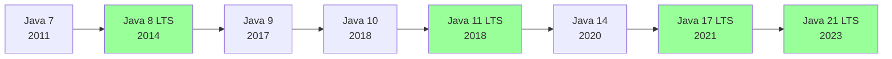
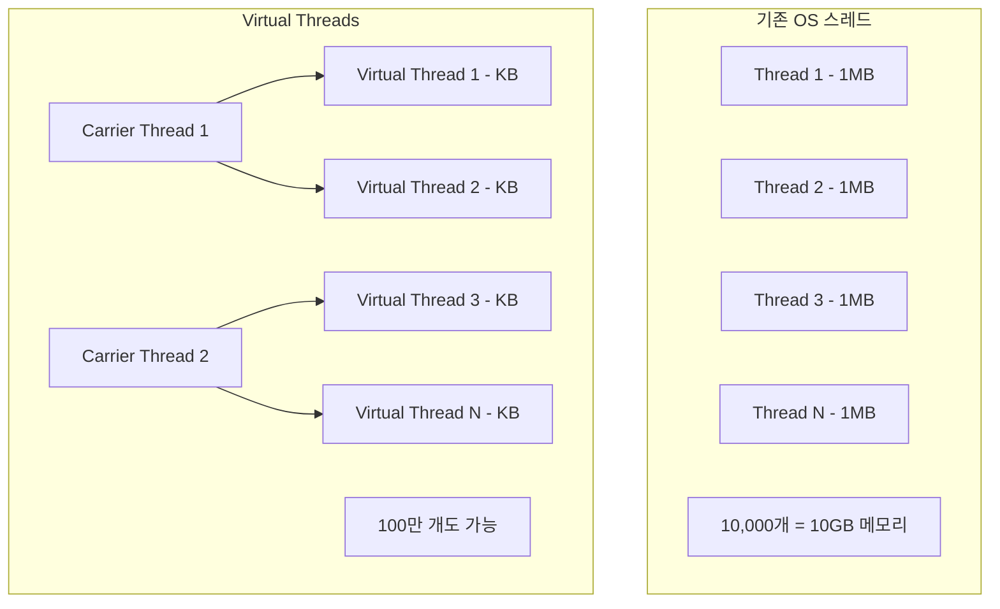
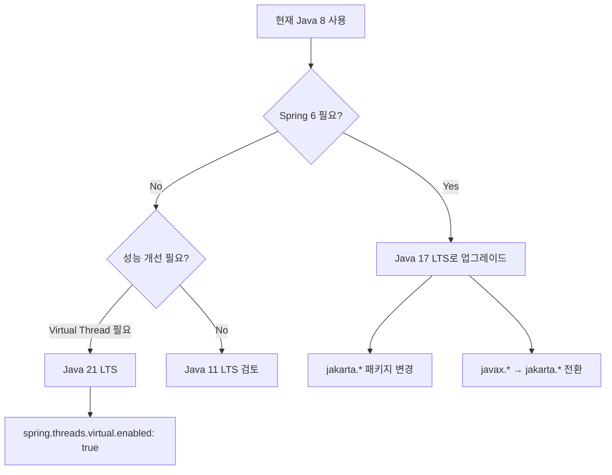

## 1. 비유 — 스마트폰 OS 업데이트

Java 버전 업그레이드는 스마트폰 OS 업데이트와 같습니다. 매 버전마다 새 기능이 추가되고, 개발자의 작업 방식이 편리해집니다. 중요한 것은 각 버전의 핵심 변화를 이해하고, 필요에 따라 활용하는 것입니다.

---

## 2. Java 버전 전략



LTS(Long Term Support): 장기 지원 버전. 실무에서는 LTS를 사용합니다.

---

## 3. Java 7 (2011)

### 3.1 try-with-resources

```java
// Java 7 이전 — 리소스 닫기 반복
Connection conn = null;
Statement stmt = null;
try {
    conn = getConnection();
    stmt = conn.createStatement();
    // ...
} finally {
    if (stmt != null) stmt.close();
    if (conn != null) conn.close();
}

// Java 7 — AutoCloseable 자동 close
try (Connection conn = getConnection();
     Statement stmt = conn.createStatement()) {
    // close()가 자동 호출됨
}
```

### 3.2 Diamond Operator (<>)

```java
// Java 7 이전
Map<String, List<Integer>> map = new HashMap<String, List<Integer>>();

// Java 7
Map<String, List<Integer>> map = new HashMap<>(); // 타입 추론
```

### 3.3 Switch에서 String

```java
// Java 7 이전 — switch에 String 사용 불가
// Java 7
switch (dayOfWeek) {
    case "MONDAY": return "월요일";
    case "TUESDAY": return "화요일";
    default: return "기타";
}
```

### 3.4 숫자 리터럴 언더스코어

```java
int million = 1_000_000;        // 읽기 쉬움
long creditCard = 1234_5678_9012_3456L;
double pi = 3.14_15_92_65;
```

---

## 4. Java 8 LTS (2014) — 가장 혁신적인 버전

### 4.1 람다 표현식

```java
// Java 7 이전 — 익명 클래스
Runnable runnable = new Runnable() {
    @Override
    public void run() {
        System.out.println("Hello");
    }
};

// Java 8 — 람다
Runnable runnable = () -> System.out.println("Hello");

// 함수형 인터페이스들
Predicate<String> isLong = s -> s.length() > 5;
Function<String, Integer> length = String::length;
Consumer<String> printer = System.out::println;
Supplier<List<String>> listFactory = ArrayList::new;
BiFunction<Integer, Integer, Integer> add = (a, b) -> a + b;
```

### 4.2 Stream API

```java
List<Person> people = Arrays.asList(
    new Person("Alice", 30, "FEMALE"),
    new Person("Bob", 25, "MALE"),
    new Person("Charlie", 35, "MALE"),
    new Person("Diana", 28, "FEMALE")
);

// 복잡한 데이터 처리를 선언형으로
List<String> result = people.stream()
    .filter(p -> p.getAge() >= 28)               // 필터링
    .sorted(Comparator.comparing(Person::getAge)) // 정렬
    .map(Person::getName)                          // 변환
    .collect(Collectors.toList());                 // 수집

// 통계
IntSummaryStatistics stats = people.stream()
    .mapToInt(Person::getAge)
    .summaryStatistics();
// count=4, sum=118, min=25, max=35, average=29.5

// 그룹핑
Map<String, List<Person>> byGender = people.stream()
    .collect(Collectors.groupingBy(Person::getGender));

// 집계
Map<String, Double> avgAgeByGender = people.stream()
    .collect(Collectors.groupingBy(
        Person::getGender,
        Collectors.averagingInt(Person::getAge)
    ));

// flatMap
List<List<Integer>> nested = List.of(List.of(1,2), List.of(3,4), List.of(5,6));
List<Integer> flat = nested.stream()
    .flatMap(Collection::stream)
    .collect(Collectors.toList()); // [1,2,3,4,5,6]

// 병렬 스트림
long count = people.parallelStream()
    .filter(p -> p.getAge() > 25)
    .count();
```

### 4.3 Optional

```java
// null 안전 코드 작성
public Optional<User> findUserByEmail(String email) {
    return userRepository.findByEmail(email); // Optional 반환
}

// 사용
Optional<User> optUser = findUserByEmail("test@example.com");

// 기본값
String name = optUser.map(User::getName).orElse("Unknown");

// 예외
User user = optUser.orElseThrow(() -> new UserNotFoundException("사용자 없음"));

// 조건부 실행
optUser.ifPresent(u -> log.info("로그인: {}", u.getName()));

// 체이닝
String city = optUser
    .map(User::getAddress)
    .map(Address::getCity)
    .orElse("도시 정보 없음");
```

### 4.4 날짜/시간 API (java.time)

```java
// Java 7 이전 — java.util.Date/Calendar 문제점
// - 불변이 아님, 스레드 불안전
// - 월이 0부터 시작 (1월 = 0)
Date date = new Date(2024 - 1900, 0, 15); // 2024년 1월 15일

// Java 8 — java.time
LocalDate today = LocalDate.now();                           // 날짜만
LocalTime now = LocalTime.now();                             // 시간만
LocalDateTime datetime = LocalDateTime.now();                // 날짜+시간
ZonedDateTime seoul = ZonedDateTime.now(ZoneId.of("Asia/Seoul")); // 타임존 포함

// 날짜 계산
LocalDate nextWeek = today.plusDays(7);
LocalDate lastMonth = today.minusMonths(1);
long daysBetween = ChronoUnit.DAYS.between(today, nextWeek); // 7

// 날짜 파싱/포맷팅
LocalDate parsed = LocalDate.parse("2026-05-02");
String formatted = today.format(DateTimeFormatter.ofPattern("yyyy년 MM월 dd일"));

// Period & Duration
Period period = Period.between(LocalDate.of(2000, 1, 1), today);
System.out.println(period.getYears() + "년 " + period.getMonths() + "개월");

Duration duration = Duration.between(LocalTime.of(9, 0), LocalTime.of(18, 0));
System.out.println(duration.toHours() + "시간"); // 9시간

// Instant (Unix 타임스탬프)
Instant start = Instant.now();
// ... 처리 ...
Instant end = Instant.now();
long ms = Duration.between(start, end).toMillis();
```

### 4.5 인터페이스 default / static 메서드

```java
public interface Validator<T> {

    boolean validate(T value);

    // default 메서드 — 구현 제공
    default Validator<T> and(Validator<T> other) {
        return value -> this.validate(value) && other.validate(value);
    }

    default Validator<T> or(Validator<T> other) {
        return value -> this.validate(value) || other.validate(value);
    }

    // static 메서드
    static <T> Validator<T> of(Predicate<T> predicate) {
        return predicate::test;
    }
}

// 사용
Validator<String> notEmpty = s -> !s.isEmpty();
Validator<String> notTooLong = s -> s.length() <= 50;
Validator<String> emailValidator = notEmpty.and(notTooLong).and(s -> s.contains("@"));
```

---

## 5. Java 9 (2017) — 모듈 시스템

### 5.1 모듈 시스템 (Project Jigsaw)

```java
// module-info.java
module com.example.myapp {
    requires java.sql;          // 다른 모듈 의존
    requires spring.core;
    exports com.example.api;    // 외부에 공개
    opens com.example.model;    // 리플렉션 허용
}
```

### 5.2 컬렉션 팩토리 메서드

```java
// Java 9 이전
List<String> list = Collections.unmodifiableList(
    Arrays.asList("a", "b", "c"));

// Java 9
List<String> list = List.of("a", "b", "c");          // 불변 리스트
Set<String> set = Set.of("x", "y", "z");              // 불변 셋
Map<String, Integer> map = Map.of("one", 1, "two", 2); // 불변 맵

// Map.ofEntries (9개 초과 시)
Map<String, Integer> bigMap = Map.ofEntries(
    Map.entry("one", 1),
    Map.entry("two", 2),
    Map.entry("three", 3)
);
```

### 5.3 Optional 개선

```java
// Java 9 추가
Optional<String> opt = Optional.of("hello");

// ifPresentOrElse
opt.ifPresentOrElse(
    s -> System.out.println("값: " + s),
    () -> System.out.println("비어있음")
);

// or() — Optional 반환
Optional<String> result = opt.or(() -> Optional.of("기본값"));

// stream() 변환
opt.stream().forEach(System.out::println);
```

---

## 6. Java 10 (2018) — var 타입 추론

```java
// var — 지역 변수 타입 추론
var list = new ArrayList<String>();          // ArrayList<String>
var map = new HashMap<String, Integer>();    // HashMap<String, Integer>
var entry = map.entrySet().iterator().next(); // Map.Entry<String, Integer>

// for-each에서도 사용
for (var item : list) {
    System.out.println(item.toUpperCase()); // item은 String으로 추론
}

// 주의: 람다, 메서드 파라미터, 리턴 타입에는 사용 불가
// var lambda = (String s) -> s.length(); // 컴파일 에러
```

---

## 7. Java 11 LTS (2018)

### 7.1 String 새 메서드

```java
// isBlank — null 아닌 빈 문자열/공백 확인
"  ".isBlank();   // true
"".isBlank();     // true
"hi".isBlank();   // false

// strip — 유니코드 공백 포함 제거
"  hello  ".strip();       // "hello"
"  hello  ".stripLeading(); // "hello  "
"  hello  ".stripTrailing(); // "  hello"

// lines — 라인 스트림
"line1\nline2\nline3"
    .lines()
    .forEach(System.out::println);

// repeat
"ha".repeat(3); // "hahaha"
```

### 7.2 HTTP Client (표준화)

```java
HttpClient client = HttpClient.newBuilder()
    .version(HttpClient.Version.HTTP_2)
    .connectTimeout(Duration.ofSeconds(10))
    .build();

// 동기 요청
HttpRequest request = HttpRequest.newBuilder()
    .uri(URI.create("https://api.example.com/users"))
    .header("Authorization", "Bearer " + token)
    .timeout(Duration.ofSeconds(30))
    .GET()
    .build();

HttpResponse<String> response = client.send(request, BodyHandlers.ofString());
System.out.println(response.statusCode()); // 200
System.out.println(response.body());

// 비동기 요청
CompletableFuture<HttpResponse<String>> futureResponse =
    client.sendAsync(request, BodyHandlers.ofString());
futureResponse.thenApply(HttpResponse::body)
    .thenAccept(System.out::println);
```

### 7.3 var in Lambda Parameters

```java
// Java 11 — 람다 파라미터에 var 사용 가능 (어노테이션 붙이기 위해)
(@NotNull var x, @NotNull var y) -> x + y;
```

---

## 8. Java 14 (2020) — Records와 Switch 표현식

### 8.1 Records (Preview)

```java
// Java 14 Preview, Java 16 정식
// 불변 데이터 클래스를 간결하게
public record Point(double x, double y) {
    // 자동 생성: 생성자, getter(x(), y()), equals, hashCode, toString

    // 컴팩트 생성자 — 검증
    public Point {
        if (x < 0 || y < 0) throw new IllegalArgumentException("좌표는 양수여야 합니다");
    }

    // 커스텀 메서드 추가 가능
    public double distanceTo(Point other) {
        return Math.sqrt(Math.pow(x - other.x, 2) + Math.pow(y - other.y, 2));
    }
}

// 사용
Point p1 = new Point(3.0, 4.0);
Point p2 = new Point(0.0, 0.0);
System.out.println(p1.x());          // 3.0
System.out.println(p1.distanceTo(p2)); // 5.0

// DTO로 활용
public record UserDto(Long id, String name, String email) {}
public record CreateOrderCommand(Long memberId, Long itemId, int quantity) {}
```

### 8.2 Switch 표현식

```java
// 기존 Switch 문 — fall-through 위험
int result;
switch (day) {
    case MONDAY:
    case TUESDAY:
        result = 1;
        break;
    case WEDNESDAY:
        result = 2;
        break;
    default:
        result = 0;
}

// Java 14 Switch 표현식
int result = switch (day) {
    case MONDAY, TUESDAY -> 1;      // 화살표 문법
    case WEDNESDAY -> 2;
    case THURSDAY -> {
        int x = compute();
        yield x * 2;               // yield로 값 반환
    }
    default -> 0;
};
```

---

## 9. Java 15 (2020) — Text Block과 Sealed Class

### 9.1 Text Block

```java
// Java 15 이전 — 여러 줄 문자열의 고통
String json = "{\n" +
              "    \"name\": \"홍길동\",\n" +
              "    \"age\": 30\n" +
              "}";

// Java 15 Text Block
String json = """
        {
            "name": "홍길동",
            "age": 30
        }
        """;

// SQL 쿼리
String sql = """
        SELECT u.id, u.name, o.total_price
        FROM users u
        JOIN orders o ON u.id = o.user_id
        WHERE u.status = 'ACTIVE'
        ORDER BY o.created_at DESC
        """;

// HTML
String html = """
        <html>
            <body>
                <h1>안녕하세요</h1>
            </body>
        </html>
        """;
```

### 9.2 Sealed Classes (Preview)

```java
// Sealed Class — 상속 가능한 클래스를 명시적으로 제한
public sealed class Shape permits Circle, Rectangle, Triangle {
    abstract double area();
}

public final class Circle extends Shape {
    private final double radius;

    public Circle(double radius) { this.radius = radius; }

    @Override
    public double area() { return Math.PI * radius * radius; }
}

public final class Rectangle extends Shape {
    private final double width, height;

    @Override
    public double area() { return width * height; }
}

// 패턴 매칭과 함께 사용
double calculateArea(Shape shape) {
    return switch (shape) {
        case Circle c -> Math.PI * c.radius() * c.radius();
        case Rectangle r -> r.width() * r.height();
        case Triangle t -> 0.5 * t.base() * t.height();
    };
}
```

---

## 10. Java 17 LTS (2021) — Pattern Matching

### 10.1 Pattern Matching for instanceof

```java
// Java 16 이전
if (obj instanceof String) {
    String s = (String) obj; // 명시적 형변환 필요
    System.out.println(s.toUpperCase());
}

// Java 17 — 패턴 매칭
if (obj instanceof String s) {     // 조건과 형변환 동시에
    System.out.println(s.toUpperCase());
}

// 더 복잡한 조건
if (obj instanceof String s && s.length() > 5) {
    System.out.println("긴 문자열: " + s);
}

// switch와 조합
String describe(Object obj) {
    return switch (obj) {
        case Integer i -> "정수: " + i;
        case String s -> "문자열: " + s;
        case Double d when d > 0 -> "양수 실수: " + d;  // when 가드
        case null -> "null";
        default -> "기타: " + obj;
    };
}
```

### 10.2 Sealed + Pattern Matching 완성

```java
sealed interface Animal permits Dog, Cat, Bird {}
record Dog(String name) implements Animal {}
record Cat(String name, boolean indoor) implements Animal {}
record Bird(String name, boolean canFly) implements Animal {}

String describe(Animal animal) {
    return switch (animal) {
        case Dog d -> d.name() + "는 강아지입니다";
        case Cat c when c.indoor() -> c.name() + "는 실내 고양이입니다";
        case Cat c -> c.name() + "는 실외 고양이입니다";
        case Bird b when b.canFly() -> b.name() + "는 날 수 있는 새입니다";
        case Bird b -> b.name() + "는 날 수 없는 새입니다";
    }; // 컴파일러가 완전성 검사 가능!
}
```

---

## 11. Java 21 LTS (2023) — 가장 큰 변화

### 11.1 Virtual Threads (Project Loom)



```java
// 기존 — OS 스레드 (무거움)
Thread thread = new Thread(() -> processRequest());
thread.start();

// Java 21 — 가상 스레드 (가벼움)
Thread vThread = Thread.ofVirtual().start(() -> processRequest());

// ExecutorService로 사용
try (ExecutorService executor = Executors.newVirtualThreadPerTaskExecutor()) {
    for (int i = 0; i < 100_000; i++) {
        executor.submit(() -> {
            // DB 조회, HTTP 호출 등 I/O 작업
            Thread.sleep(Duration.ofSeconds(1)); // 가상 스레드는 블로킹해도 OK!
            return processRequest();
        });
    }
}

// Spring Boot 3.2+에서 활성화
// application.yml
// spring.threads.virtual.enabled: true
```

### 11.2 Sequenced Collections

```java
// Java 21 — 순서가 있는 컬렉션의 통일된 인터페이스
List<String> list = new ArrayList<>(List.of("a", "b", "c"));

// SequencedCollection 메서드
String first = list.getFirst();   // "a"
String last = list.getLast();     // "c"
list.addFirst("z");               // ["z", "a", "b", "c"]
list.addLast("x");                // ["z", "a", "b", "c", "x"]
list.removeFirst();               // "z"
list.removeLast();                // "x"
List<String> reversed = list.reversed(); // ["c", "b", "a"]
```

### 11.3 Record Patterns

```java
record Point(int x, int y) {}
record Line(Point start, Point end) {}

// Java 21 — 중첩 레코드 패턴 매칭
void printLine(Object obj) {
    if (obj instanceof Line(Point(int x1, int y1), Point(int x2, int y2))) {
        System.out.printf("(%d,%d) → (%d,%d)%n", x1, y1, x2, y2);
    }
}

// Switch와 함께
String format(Object obj) {
    return switch (obj) {
        case Point(int x, int y) -> "점: (" + x + "," + y + ")";
        case Line(Point(int x1, int y1), Point(int x2, int y2)) ->
            "선: (%d,%d)→(%d,%d)".formatted(x1, y1, x2, y2);
        default -> obj.toString();
    };
}
```

---

## 12. 버전별 마이그레이션 가이드



### 마이그레이션 체크리스트

| Java 8 → 17 | 확인 항목 |
|-------------|---------|
| javax → jakarta | Spring 6, Tomcat 10 사용 시 |
| sun.misc.Unsafe | 직접 사용 금지됨 |
| --add-opens | 모듈 접근 필요 시 JVM 옵션 |
| 반사(Reflection) | 일부 제한 강화 |

---

## 13. 전체 버전 핵심 기능 요약

| 버전 | LTS | 핵심 기능 |
|------|-----|---------|
| Java 7 | X | try-with-resources, Diamond |
| Java 8 | O | Lambda, Stream, Optional, java.time |
| Java 9 | X | 모듈, 컬렉션 팩토리 메서드 |
| Java 10 | X | var |
| Java 11 | O | HTTP Client, String 메서드 |
| Java 14 | X | Record (preview), Switch 표현식 |
| Java 15 | X | Text Block, Sealed (preview) |
| Java 17 | O | Pattern Matching, Sealed Classes 정식 |
| Java 21 | O | Virtual Thread, Sequenced Collections |
