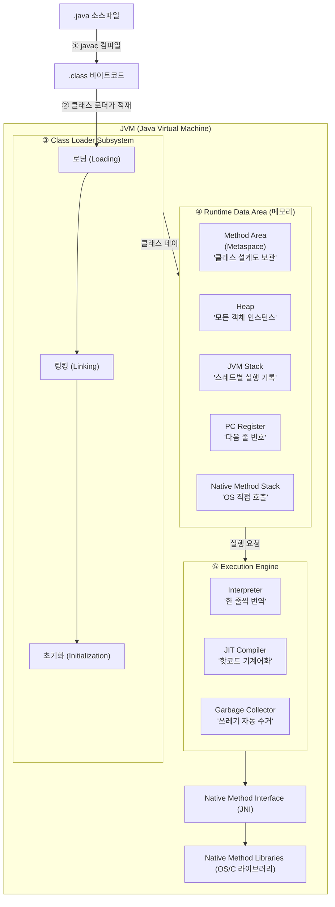
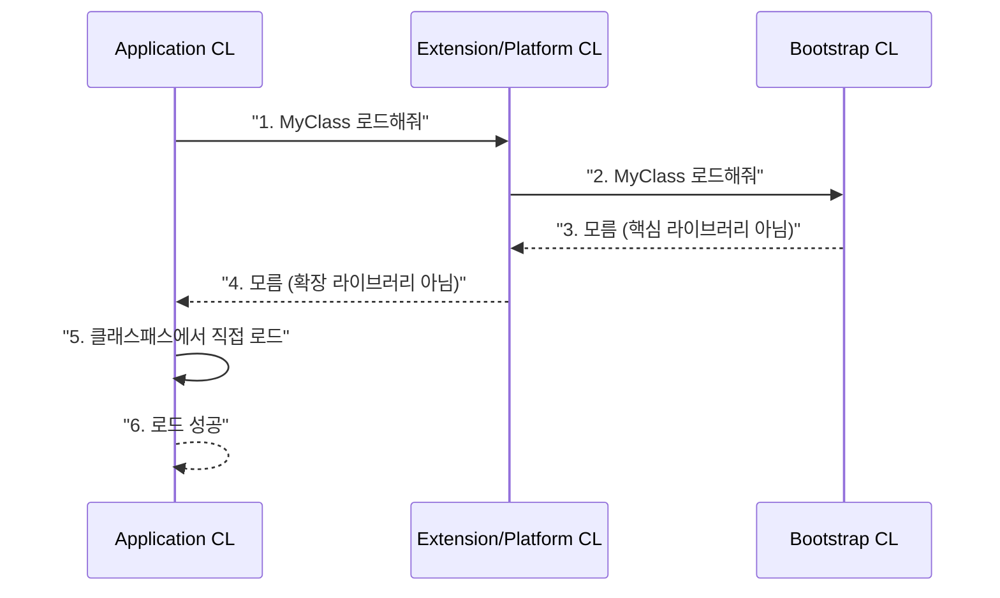
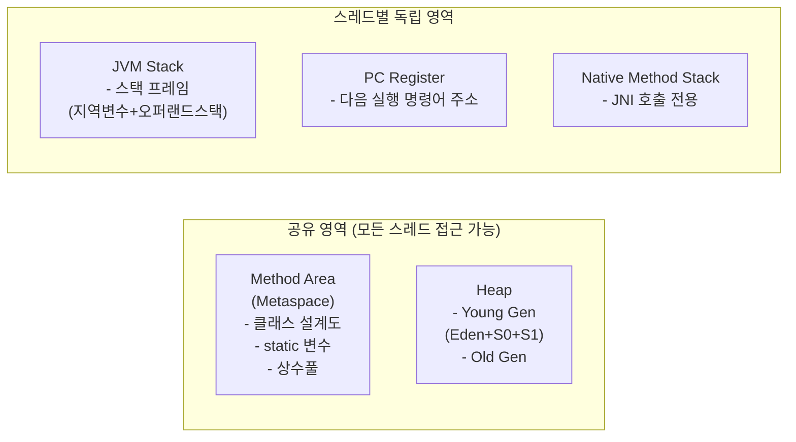
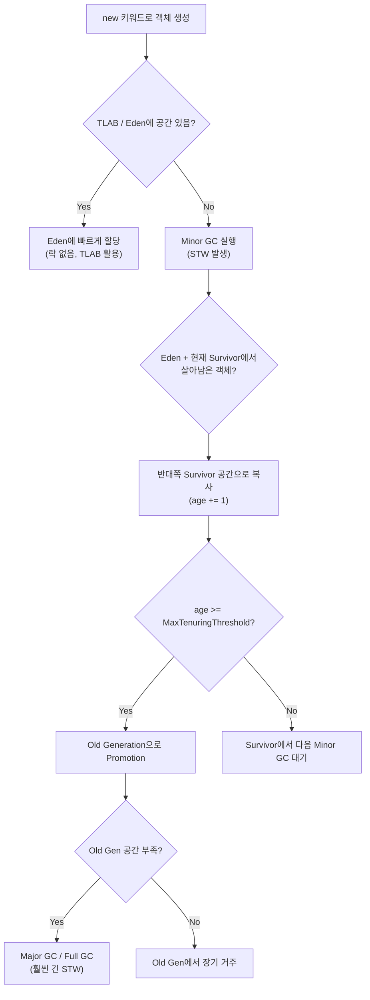
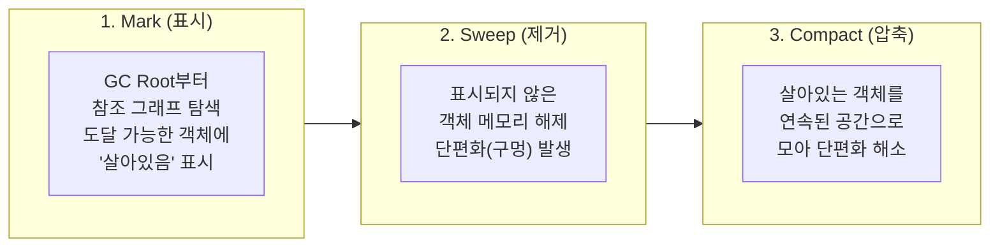
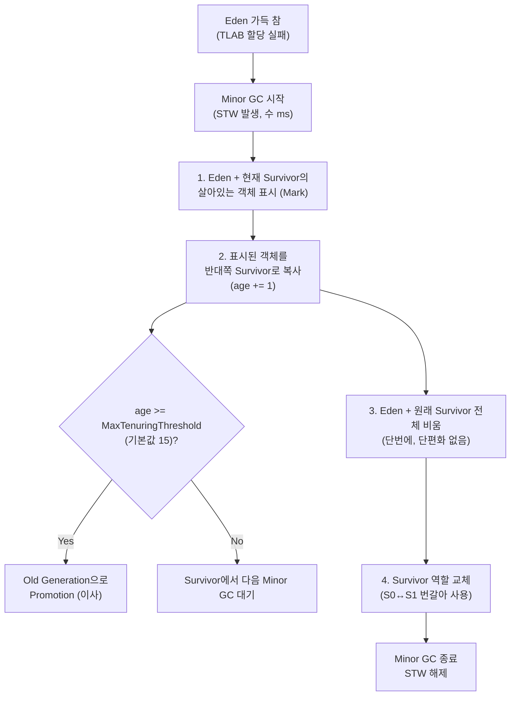
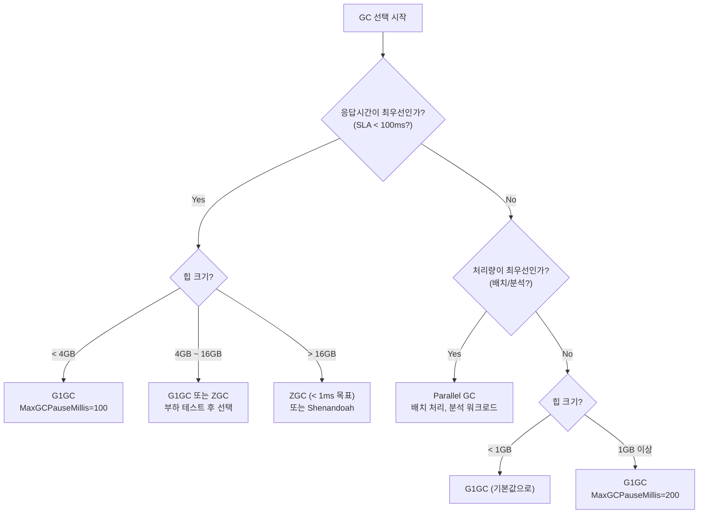

**한 줄 요약**: JVM은 바이트코드를 받아 메모리에 올리고, 실행하고, 더 이상 필요 없는 객체를 자동으로 정리하는 가상 머신이다.

---

## 도입 비유 — JVM은 하나의 공장이다

JVM을 거대한 제조 공장에 비유해 보겠습니다.

- **원자재(바이트코드)**: `.java` 파일을 컴파일한 `.class` 파일이 공장 입구로 들어옵니다.
- **자재 입고팀(Class Loader)**: 원자재를 검수하고, 적절한 창고에 배치합니다.
- **창고(Runtime Data Area)**: 메서드 영역, 힙, 스택 등 각 부서가 자재를 보관합니다.
- **생산팀(Execution Engine)**: 인터프리터와 JIT 컴파일러가 실제 작업을 수행해 제품(실행 결과)을 만들어냅니다.
- **청소팀(Garbage Collector)**: 작업이 끝난 뒤 불필요한 쓰레기(더 이상 참조되지 않는 객체)를 주기적으로 수거합니다.

이 공장의 비유를 머릿속에 담아두고, 각 팀이 어떻게 돌아가는지 구석구석 살펴보겠습니다.

---

## 1. JVM이란?

### 1.1 Write Once, Run Anywhere — 왜 이 철학이 필요했나?

비유를 하나 드리겠습니다. 1990년대 초 소프트웨어 개발자의 상황은 마치 **전 세계 각지의 콘센트 규격이 다 다른데, 전자제품 하나를 팔려면 나라마다 별도 제품을 만들어야 했던 것**과 같습니다. Windows용 바이너리, Linux용 바이너리, SPARC용 바이너리를 따로 빌드해야 했습니다.

Java는 이 문제를 **중간 어댑터** 개념으로 해결했습니다. 전 세계 공통 규격인 "바이트코드"를 만들고, 각 플랫폼마다 그 어댑터 역할을 하는 JVM을 설치하게 한 겁니다.

```
Java 소스코드(.java)
        ↓  javac 컴파일 (개발자 PC에서 1회)
바이트코드(.class)  ← 어떤 플랫폼에서도 동일한 파일
        ↓  JVM이 실행 (각 플랫폼의 JVM이 처리)
  OS/CPU에 맞는 네이티브 코드
```

**만약 JVM이 없었으면?** C/C++처럼 운영체제와 CPU 아키텍처 조합(Windows x64, Linux ARM64, macOS M1 등) 마다 별도 빌드 파이프라인을 유지해야 합니다. 현대의 클라우드 환경에서 x86과 ARM이 혼재한다는 걸 생각하면, 이게 얼마나 큰 편의인지 실감할 수 있습니다.

### 1.2 JDK vs JRE vs JVM 관계 — 러시아 마트료시카 인형

이 세 가지는 **마트료시카 인형**처럼 중첩된 구조입니다. 가장 작은 인형이 JVM, 그걸 감싸는 게 JRE, 가장 큰 인형이 JDK입니다.

| 구성 요소 | 포함 내용 | 역할 |
|-----------|-----------|------|
| **JVM** (Java Virtual Machine) | 실행 엔진, GC, 메모리 관리 | 바이트코드 실행 |
| **JRE** (Java Runtime Environment) | JVM + 표준 라이브러리(rt.jar 등) | Java 프로그램 실행 환경 |
| **JDK** (Java Development Kit) | JRE + javac, javadoc, jdb, jstat 등 개발 도구 | Java 개발 환경 |

```
JDK
├── JRE
│   ├── JVM
│   └── 표준 라이브러리 (java.lang, java.util 등)
└── 개발 도구 (javac, javap, jconsole, jstack ...)
```

실무 팁: Java 9 이후로 JRE가 별도 배포되지 않고 `jlink`로 커스텀 런타임을 만드는 방식으로 변경되었습니다. 도커 이미지를 최소화할 때 `jlink`로 필요한 모듈만 담은 경량 JRE를 만들 수 있습니다.

### 1.3 JVM 벤더별 차이 — 명세서만 있으면 누구나 만들 수 있다

JVM은 Oracle이 관리하는 **명세서(specification)**만 따르면 누구든 구현할 수 있습니다. 마치 TCP/IP 프로토콜 명세만 따르면 어느 회사든 네트워크 장비를 만들 수 있는 것과 같습니다.

| JVM | 개발사 | 특징 |
|-----|--------|------|
| **HotSpot** | Oracle (원 Sun) | 가장 널리 사용. C1/C2 JIT. OpenJDK의 기본 JVM |
| **OpenJ9** | Eclipse / IBM | 낮은 메모리 사용량, 빠른 시작. IBM WebSphere 계열 |
| **GraalVM** | Oracle | 폴리글랏(Java, JS, Python 등), AOT 컴파일(Native Image) 지원 |
| **Azul Zing / Zulu** | Azul Systems | C4 GC(무중단), 초저지연. 금융권에서 선호 |
| **Amazon Corretto** | Amazon | OpenJDK 기반, AWS 최적화, LTS 지원 확장 |
| **Microsoft OpenJDK** | Microsoft | Azure 최적화 빌드 |

실무에서는 대부분 **HotSpot(OpenJDK 또는 Oracle JDK)**를 사용합니다. 클라우드 환경에서는 빠른 시작이 중요해 OpenJ9나 GraalVM Native Image가 주목받고 있습니다.

---

## 2. JVM 아키텍처 전체 구조



각 구성 요소를 순서대로, 내부 동작 원리와 함께 살펴보겠습니다.

---

## 3. Class Loader (클래스 로더) — 공장의 자재 입고팀

### 비유: 수입통관 절차

클래스 로더는 공항 수입통관팀과 같습니다. 해외에서 화물(바이트코드)이 도착하면:
1. **세관 검사(Verification)**: 규격에 맞는지 확인
2. **창고 배정(Preparation)**: 보관할 공간 확보
3. **송장 연결(Resolution)**: 관련 서류(다른 클래스 참조) 연결
4. **실제 입고(Initialization)**: 창고에 실제 물건 배치

단순히 파일을 읽는 것이 아니라 **Loading → Linking → Initialization** 세 단계를 거칩니다.

### 3.1 Loading (로딩) — 파일을 메모리로

클래스 파일을 찾아 바이너리 데이터를 읽고 `java.lang.Class` 객체를 생성합니다.

내부 동작 순서:
1. 완전한 클래스 이름(Fully Qualified Name)으로 `.class` 파일 탐색
2. 파일의 바이너리 데이터를 읽어 **Method Area**에 저장
3. 해당 클래스를 나타내는 `Class` 객체를 **Heap**에 생성

**왜 Class 객체를 Heap에 만드는가?** 나중에 `MyClass.class`, `getClass()`, 리플렉션 등으로 클래스 메타데이터에 접근해야 하기 때문입니다. Heap에 있어야 일반 객체처럼 참조할 수 있습니다.

### 3.2 Linking (링킹) — 검증하고 연결하기

링킹은 세 단계로 나뉩니다.

**Verification (검증) — "이 화물은 위험물이 아닌가?"**

바이트코드가 JVM 명세에 맞는지 확인합니다. 단순 문법 검사가 아닙니다. 예를 들어:
- 스택 오버플로우를 유발할 수 있는 구조인지
- 접근 제어(private/protected)를 우회하려는 코드인지
- 포인터 조작 같은 위험한 코드가 없는지

**만약 Verification이 없다면?** 악의적으로 조작된 `.class` 파일을 JVM에 올려서 메모리를 직접 건드리거나, String 클래스를 내 마음대로 교체하는 보안 공격이 가능해집니다.

**Preparation (준비) — "창고 공간 먼저 확보"**

클래스의 `static` 변수를 위한 메모리를 할당하고, **타입 기본값**으로 초기화합니다. 코드에서 지정한 값이 아닙니다.

```java
static int count = 5;
// Preparation 단계: count = 0  ← 아직 5가 아님! int의 기본값
// Initialization 단계: count = 5  ← 이제 5
```

**Resolution (해석) — "물류 송장 번호를 실제 주소로 변환"**

심볼릭 참조(Symbolic Reference)를 실제 메모리 참조로 변환합니다.

바이트코드 안에는 `"java/lang/String"` 같은 문자열로 다른 클래스를 참조합니다. 이 문자열을 실제 `String` 클래스가 올라간 메모리 주소로 교체하는 작업입니다.

**왜냐하면** 컴파일 시점에는 다른 클래스가 런타임에 어느 메모리 주소에 올라갈지 알 수 없기 때문입니다. 이 변환은 클래스가 처음 사용될 때 수행됩니다(Lazy Resolution).

### 3.3 Initialization (초기화) — "실제 물건 창고에 배치"

드디어 코드에서 지정한 실제 값이 할당됩니다.

```java
public class Example {
    // Preparation 단계: count = 0 (기본값)
    // Initialization 단계: count = 5 (지정값 할당)
    static int count = 5;

    // Initialization 단계에서 static 블록 실행
    static {
        System.out.println("클래스 초기화: " + count);  // "클래스 초기화: 5" 출력
    }
}
```

**초기화는 언제 일어나는가?** 클래스를 처음 사용하는 시점 — 즉, 정적 필드에 처음 접근하거나, 인스턴스를 처음 생성하거나, 정적 메서드를 처음 호출할 때입니다. `Class.forName("...")` 호출 시에도 초기화됩니다.

**만약 초기화 중 예외가 발생하면?** `ExceptionInInitializerError`가 발생하고, 이 클래스는 다시는 초기화되지 않습니다. 이후 해당 클래스 사용 시도는 `NoClassDefFoundError`가 발생합니다. 이건 실무에서 "왜 멀쩡한 클래스에서 NoClassDefFoundError가?" 하는 미스터리의 원인 중 하나입니다.

### 3.4 클래스 로더 계층 구조 — 상하 위계질서

```
Bootstrap ClassLoader (최상위, JVM 내장)
        ↑ 부모
Extension/Platform ClassLoader
        ↑ 부모
Application ClassLoader (= System ClassLoader)
        ↑ 부모
Custom ClassLoader (사용자 정의)
```

| 클래스 로더 | 로드 대상 | 구현 |
|-------------|-----------|------|
| **Bootstrap** | `java.lang.*`, `java.util.*` 등 핵심 라이브러리 | C/C++로 구현 (JVM 내장) |
| **Extension / Platform** | `$JAVA_HOME/lib/ext` 또는 `java.se` 등 확장 모듈 | Java로 구현 |
| **Application** | 클래스패스(classpath)에 있는 사용자 클래스, 라이브러리 | Java로 구현 |

### 3.5 부모 위임 모델 — "윗선에 먼저 보고한다"

비유: 군대에서 새로운 명령이 내려오면 말단 병사가 독자적으로 처리하기 전에 위로 보고하는 것과 같습니다. 상급자가 처리할 수 없는 경우에만 하급자가 직접 처리합니다.



**부모 위임 모델의 장점:**

1. **보안**: `java.lang.String`을 악의적으로 교체하는 것을 방지합니다. 누군가 `java.lang.String`이라는 이름의 악성 클래스를 만들어도, Bootstrap CL이 먼저 진짜 String을 로드해버립니다.
2. **중복 방지**: 같은 클래스가 여러 ClassLoader에 의해 중복 로드되지 않습니다.
3. **일관성**: 핵심 클래스는 항상 Bootstrap CL이 로드하므로 JVM 전체에서 동일한 클래스 객체가 보장됩니다.

**만약 부모 위임 모델을 우회하면?** OSGi, Tomcat 같은 컨테이너는 실제로 이를 우회합니다(웹앱별 클래스 격리). 하지만 잘못 구현하면 `ClassCastException: com.example.Foo cannot be cast to com.example.Foo` 같은 기이한 오류가 발생합니다. 이름은 같지만 다른 ClassLoader가 로드한 두 개의 클래스는 JVM 입장에서 **완전히 다른 타입**이기 때문입니다.

### 3.6 커스텀 클래스 로더 — 어디서 쓰는가?

```java
public class CustomClassLoader extends ClassLoader {

    private final String classPath;

    public CustomClassLoader(String classPath) {
        this.classPath = classPath;
    }

    @Override
    protected Class<?> findClass(String name) throws ClassNotFoundException {
        byte[] classData = loadClassData(name);
        if (classData == null) {
            throw new ClassNotFoundException("클래스를 찾을 수 없습니다: " + name);
        }
        // 바이트 배열을 Class 객체로 변환 — 이 시점에 Linking까지 진행
        return defineClass(name, classData, 0, classData.length);
    }

    private byte[] loadClassData(String className) {
        String fileName = classPath + "/" + className.replace('.', '/') + ".class";
        try (InputStream is = new FileInputStream(fileName)) {
            return is.readAllBytes();
        } catch (IOException e) {
            return null;
        }
    }
}
```

**커스텀 클래스 로더 실제 활용 사례:**
- Tomcat, Spring Boot: 웹 애플리케이션별 클래스 격리 (다른 버전의 라이브러리 공존)
- Eclipse/IntelliJ 플러그인 시스템: 플러그인별 독립 클래스 공간
- 핫 리로딩: 개발 중 코드 변경 즉시 반영 (devtools)
- 암호화된 `.class` 파일: 복호화 후 `defineClass`로 로드 (DRM)

---

## 4. Runtime Data Area (메모리 구조) — 공장의 창고 시스템

### 비유: 사무실 공간 배치

JVM 메모리는 회사 사무실과 같습니다.
- **공용 회의실(Method Area/Heap)**: 모든 직원(스레드)이 공유
- **개인 책상(JVM Stack)**: 직원(스레드)마다 독립적
- **포스트잇(PC Register)**: "나 지금 몇 페이지 읽고 있었지?" 기록
- **외부 전화기(Native Method Stack)**: OS와 통화할 때만 사용



### 4.1 Method Area (메서드 영역) — "클래스 설계도 보관소"

비유: 건축 사무소의 설계도 파일 캐비닛입니다. 실제 건물(객체)이 만들어지기 전에, 설계도(클래스 정보)를 보관합니다. 모든 직원이 공유하는 캐비닛이므로 동시 접근 시 락 관리가 필요합니다.

**모든 스레드가 공유하는 영역**입니다. 클래스 수준의 데이터를 저장합니다.

저장 내용:
- **클래스 메타데이터**: 클래스 이름, 부모 클래스, 구현한 인터페이스, 메서드/필드 정보
- **런타임 상수풀(Runtime Constant Pool)**: `"Hello"` 같은 문자열 리터럴, 클래스/메서드 참조
- **static 변수**: `static int count = 0` 같은 클래스 수준 변수
- **메서드 바이트코드**: 각 메서드의 실제 JVM 명령어 시퀀스

#### PermGen → Metaspace 전환의 내부 원리

**Java 7 이하 (PermGen)**: Heap과 같은 JVM 관리 메모리. 크기가 고정(`-XX:MaxPermSize`).

```
[ JVM Heap ]
┌────────────┬──────────────────┬──────────────────┐
│  Young Gen │    Old Gen       │    PermGen        │
│            │                  │  (고정 크기)      │
└────────────┴──────────────────┴──────────────────┘
```

**Java 8 이후 (Metaspace)**: OS의 Native Memory 직접 사용. 기본적으로 자동 확장.

```
[ JVM Heap ]                  [ Native Memory ]
┌────────────┬──────────────┐  ┌───────────────────┐
│  Young Gen │    Old Gen   │  │    Metaspace       │
│            │              │  │  (동적 확장 가능)  │
└────────────┴──────────────┘  └───────────────────┘
```

**왜 바꿨는가?** PermGen 시절 가장 많이 본 에러가 `OutOfMemoryError: PermGen space`였습니다. 원인은 보통 세 가지:
1. Spring 같은 프레임워크가 동적으로 클래스를 많이 생성
2. Tomcat에서 웹앱을 재배포할 때 클래스 로더가 제대로 GC되지 않음
3. 개발자가 적절한 `-XX:MaxPermSize`를 설정하지 않음

Metaspace는 OS 메모리를 직접 써서 "필요한 만큼 늘어난다"는 문제를 해결했습니다.

**그런데 새로운 위험**: `-XX:MaxMetaspaceSize`를 설정하지 않으면 Metaspace가 OS 전체 메모리를 다 먹을 수 있습니다. 특히 리플렉션, 바이트코드 조작 프레임워크(ASM, ByteBuddy), 동적 프록시(Spring AOP, Hibernate)를 많이 쓰는 애플리케이션에서 클래스 로더 누수가 발생하면 Metaspace OOM이 천천히 진행됩니다.

```bash
# Metaspace 설정 예시 — 운영 환경에서는 반드시 상한선 설정
-XX:MetaspaceSize=256m        # 초기 크기 (이 값 초과 시 GC 트리거)
-XX:MaxMetaspaceSize=512m     # 최대 크기 (설정 안 하면 무제한 — 위험!)
```

### 4.2 Heap (힙) — "모든 객체가 사는 도시"

비유: Heap은 아파트 단지입니다. 새로 태어난 주민(객체)은 신도시(Young Gen)에 배정되고, 오래 살아남은 주민은 구도심(Old Gen)으로 이사 갑니다. 청소팀(GC)은 주기적으로 빈 집을 정리합니다.

**가장 큰 메모리 영역**으로, `new` 키워드로 생성되는 모든 객체와 배열이 저장됩니다. 모든 스레드가 공유합니다.

#### 힙 구조 (HotSpot JVM 기준)

```
┌─────────────────────────────────────────────────────┐
│                      Heap                           │
├─────────────────────────────┬───────────────────────┤
│        Young Generation     │    Old Generation      │
├──────────┬────────┬─────────┤    (Tenured Space)     │
│  Eden    │   S0   │   S1    │  오래 살아남은 객체    │
│  Space   │(Survivor)│(Survivor)│  (age >= 15)       │
│ 새 객체  │살아남은 │  대기   │                       │
└──────────┴────────┴─────────┴───────────────────────┘
```

**Young Generation의 내부 동작 원리:**

새 객체는 **TLAB(Thread-Local Allocation Buffer)**를 통해 Eden에 할당됩니다. TLAB이란 스레드마다 Eden의 일부를 미리 예약해두는 공간으로, 멀티스레드 환경에서 할당 시 락 경합 없이 빠르게 객체를 생성할 수 있게 해줍니다.

**S0과 S1 중 하나는 항상 비어있는 이유**: GC는 살아남은 객체를 비어있는 Survivor로 복사(Copy 알고리즘)합니다. 이후 원래 Survivor를 통째로 비웁니다. 이렇게 하면 메모리 단편화(fragmentation) 없이 연속된 공간을 유지할 수 있습니다.

**만약 Survivor 공간이 없다면?** Eden에서 살아남은 객체를 Old Gen으로 바로 올려야 합니다. Old Gen GC는 훨씬 느리므로, 전체 GC 빈도가 폭발적으로 늘어납니다.

#### 힙 크기 설정

```bash
# 힙 초기/최대 크기 (운영 환경에서는 동일하게 설정해 리사이즈 오버헤드 제거)
-Xms2g          # 힙 초기 크기 2GB
-Xmx4g          # 힙 최대 크기 4GB

# Young Generation 크기
-Xmn1g          # Young Gen 고정 크기 1GB
-XX:NewRatio=2  # Old:Young = 2:1 비율 (Young = 전체의 1/3)

# Survivor 비율
-XX:SurvivorRatio=8  # Eden:S0:S1 = 8:1:1

# 객체가 Old Gen으로 이동하는 기준 (Minor GC 생존 횟수)
-XX:MaxTenuringThreshold=15
```

#### 객체 할당 및 GC 트리거 흐름



### 4.3 JVM Stack (스택) — "스레드의 실행 일지"

비유: JVM Stack은 요리사의 작업 메모장입니다. 새 요리(메서드 호출)를 시작하면 새 페이지를 펼치고(스택 프레임 push), 요리가 끝나면 그 페이지를 찢어버립니다(스택 프레임 pop). 요리사마다 메모장이 따로 있습니다(스레드마다 독립).

**스레드마다 독립적으로 생성**됩니다. 메서드 호출 시 **스택 프레임(Stack Frame)**이 push되고, 메서드가 종료되면 pop됩니다.

#### 스택 프레임의 내부 구조

```
┌─────────────────────────────────┐
│          Stack Frame            │
├─────────────────────────────────┤
│    Local Variable Array         │  ← 지역변수, 매개변수, this 참조
│    [0]=this, [1]=arg1, [2]=x    │
├─────────────────────────────────┤
│    Operand Stack                │  ← 연산을 위한 임시 저장 (CPU 레지스터 대신)
│    LIFO 구조                    │
├─────────────────────────────────┤
│    Frame Data                   │  ← 상수풀 참조, 예외처리 테이블, 반환 주소
└─────────────────────────────────┘
```

**오퍼랜드 스택이 왜 필요한가?** JVM은 레지스터 기반이 아닌 **스택 기반** 아키텍처입니다. CPU 레지스터를 직접 사용하지 않고 스택에서 값을 pop/push하며 연산합니다. 이렇게 하면 CPU 아키텍처에 독립적인 바이트코드를 만들 수 있습니다.

실제 바이트코드 예시: `int result = a + b`

```
1. iload_1  → 지역변수 배열 index 1 (변수 a)를 오퍼랜드 스택에 push
2. iload_2  → 지역변수 배열 index 2 (변수 b)를 오퍼랜드 스택에 push
3. iadd     → 스택에서 두 값 pop → 더함 → 결과를 스택에 push
4. istore_3 → 스택에서 결과 pop → 지역변수 배열 index 3에 저장
```

#### StackOverflowError의 메커니즘

```bash
-Xss512k    # 스레드당 스택 크기 512KB (기본값: 512KB~1MB)
```

스택 프레임은 호출마다 쌓입니다. 재귀 호출이 끝없이 계속되면 스택이 꽉 차서 `StackOverflowError`가 발생합니다.

```java
// StackOverflowError 시나리오 — 탈출 조건 없는 무한 재귀
public int factorial(int n) {
    return n * factorial(n - 1); // n=0이 되도 멈추지 않음 → 스택 꽉 참
}
```

**스택 크기 설정의 트레이드오프**: `-Xss`를 크게 잡으면 깊은 재귀에 안전하지만, 스레드 10,000개를 만들면 그만큼 메모리를 더 씁니다. Virtual Thread(Java 21)는 이 문제를 다르게 해결합니다 — 스택이 힙에서 동적으로 관리됩니다.

### 4.4 PC Register (프로그램 카운터 레지스터) — "북마크"

비유: 두꺼운 책을 읽다가 잠깐 쉬러 갈 때 책갈피를 꽂아두는 것과 같습니다. 컨텍스트 스위칭 후 "어디까지 읽었더라?"를 알기 위한 기록입니다.

**스레드마다 독립적으로 생성**됩니다. 현재 실행 중인 JVM 명령어(바이트코드)의 주소를 저장합니다.

CPU의 PC 레지스터와 개념이 같지만, JVM 레벨에서 추상화된 것입니다. 멀티스레드 환경에서 스레드가 번갈아 실행될 때, 다시 내 차례가 됐을 때 정확히 이전 실행 지점부터 재개하기 위해 필요합니다.

- Java 메서드 실행 중: 현재 실행 중인 바이트코드 명령어 주소
- Native 메서드 실행 중: undefined (Native Method가 자체적으로 관리)

### 4.5 Native Method Stack — "외부 통화 전용 전화기"

Java가 아닌 네이티브 코드(C, C++)를 실행할 때 사용하는 스택입니다. JNI(Java Native Interface)를 통해 네이티브 메서드가 호출될 때 사용됩니다.

자주 쓰이는 곳:
- `System.currentTimeMillis()` — OS 시스템 콜로 현재 시간 획득
- `Object.hashCode()` — 기본 구현이 객체 주소 기반 네이티브 계산
- JDBC 드라이버의 소켓 통신 — OS 소켓 API 직접 호출
- `Thread.sleep()` — OS 스케줄러에게 직접 요청

### 4.6 OOM 발생 시나리오별 원인과 해결 — 증상별 진단표

OutOfMemoryError는 메모리 영역별로 원인이 다릅니다. "OOM 났다"는 말만 해서는 진단이 안 됩니다.

| OOM 메시지 | 발생 영역 | 주요 원인 | 해결 방법 |
|------------|-----------|-----------|-----------|
| `Java heap space` | Heap | 객체 누수, 힙 너무 작음 | `-Xmx` 증가, 누수 분석 |
| `GC overhead limit exceeded` | Heap | GC가 실행 시간의 98% 차지 | 힙 증가, 객체 생성 패턴 개선 |
| `Metaspace` | Metaspace | 동적 클래스 과다 생성, 클래스 로더 누수 | `MaxMetaspaceSize` 증가, 로더 누수 확인 |
| `unable to create new native thread` | Native Memory | 스레드 과다 생성 | 스레드 풀 사용, `-Xss` 감소 |
| `Direct buffer memory` | Native Memory | NIO DirectByteBuffer 과다 | `MaxDirectMemorySize` 증가, 명시적 해제 |
| `StackOverflowError` | Stack | 무한 재귀 | 재귀→반복 전환, `-Xss` 증가 |

```java
// 힙 OOM 시나리오 1: static 컬렉션에 계속 추가 (가장 흔한 메모리 누수)
public class MemoryLeakExample {
    // static 필드 = JVM 종료까지 GC 안 됨
    private static final List<byte[]> leakList = new ArrayList<>();

    public void doSomething() {
        leakList.add(new byte[1024 * 1024]);  // 1MB씩 쌓임, 해제 없음
    }
}

// 힙 OOM 시나리오 2: DB에서 수백만 건 한 번에 로드
public void loadAllData() {
    // findAll()은 결과 전체를 List로 메모리에 적재
    List<Order> allOrders = orderRepository.findAll(); // 100만 건 = OOM

    // 해결: 스트림/페이지 단위 처리
    orderRepository.findAllByPage(page, size).forEach(this::process);
}

// Metaspace OOM 시나리오: URLClassLoader를 close() 없이 계속 생성
public class ClassLoaderLeak {
    void loadPlugin(URL[] urls) throws Exception {
        URLClassLoader cl = new URLClassLoader(urls);
        // ... 사용 후 cl.close() 호출 없음
        // → 이 ClassLoader가 로드한 모든 클래스가 Metaspace에 잔류
        // → Metaspace 점진적 증가 → OOM
    }
}
```

---

## 5. Execution Engine (실행 엔진) — 공장의 생산팀

### 5.1 Interpreter (인터프리터) — "실시간 통역사"

바이트코드를 **한 명령어씩** 읽어 해석하고 실행합니다.

- **장점**: JVM 시작 직후 바로 실행 가능 (사전 컴파일 불필요)
- **단점**: 같은 메서드를 1000번 호출해도 1000번 해석 → 느림

비유: 외국 손님이 한국어로 말할 때마다 그 자리에서 즉시 통역하는 것과 같습니다. 매번 새로 통역하므로 빠르게 시작하지만 반복적인 내용도 매번 통역해야 합니다.

### 5.2 JIT Compiler — 자세한 내용은 별도 포스트 참조

JIT 컴파일러에 대한 심층 분석(C1/C2, Tiered Compilation, 인라이닝, 탈출 분석 등)은 [JVM JIT 컴파일러 완전 가이드](/java/2026-05-02-java-jit-compiler/) 포스트를 참고하세요.

요약만 하면: 자주 실행되는 핫코드를 네이티브 기계어로 컴파일해두고 재사용하여, 인터프리터의 반복 해석 비용을 없앱니다.

### 5.3 Garbage Collector — 다음 섹션에서 상세히

---

## 6. Garbage Collection (가비지 컬렉션) — 공장 청소팀

### 6.1 GC 기본 원리 — "살아있는 것을 추적한다"

비유: GC는 아파트 관리사무소의 빈 집 점검 방식과 같습니다. 관리사무소에서 알고 있는 입주민 목록(GC Root)에서 시작해, 각 입주민의 가족/지인 관계를 따라가며 실제로 사는 집을 표시합니다. 표시되지 않은 집은 빈 집으로 판단해 철거합니다.

GC는 **더 이상 참조되지 않는 객체**를 찾아 메모리를 회수합니다.

#### GC Root — "출발점을 정해야 탐색이 가능하다"

**GC Root**란 살아있음이 확실한 객체들의 집합입니다. 여기서 참조 그래프를 탐색해 닿을 수 있는 객체는 살아있다고 판단합니다.

GC Root가 될 수 있는 것들:
- JVM Stack의 지역변수/매개변수가 참조하는 객체 (실행 중인 메서드가 쓰는 객체)
- Method Area의 static 변수가 참조하는 객체 (전역 상태)
- JNI 참조로 유지되는 객체 (C/C++ 코드가 들고 있는 객체)
- 활성 스레드 객체 자체

**왜냐하면**: 참조 카운팅 방식(Swift, Python에서 사용)은 순환 참조를 처리하지 못합니다. A→B→A처럼 서로 참조하면 카운트가 0이 되지 않아 영원히 해제되지 않습니다. GC Root에서 탐색하는 방식(Mark and Sweep)은 순환 참조도 정확히 탐지합니다.

#### Mark → Sweep → Compact 내부 동작



- **Mark**: GC Root에서 시작해 도달 가능한 객체에 표시. STW(Stop-The-World) 중 수행.
- **Sweep**: 표시되지 않은 객체의 메모리 해제. 이 과정에서 메모리에 구멍이 생깁니다(단편화).
- **Compact**: 살아있는 객체를 한쪽으로 모아 연속된 빈 공간을 만듭니다. 가장 비싼 연산.

**STW(Stop-The-World)**: GC가 실행되는 동안 모든 애플리케이션 스레드가 멈추는 현상. "내 서버가 주기적으로 몇 초씩 응답 안 한다"의 직접 원인입니다.

### 6.2 Minor GC vs Major GC vs Full GC — "동네 청소 vs 도시 전체 청소"

| GC 종류 | 대상 영역 | 발생 조건 | STW 시간 |
|---------|-----------|-----------|----------|
| **Minor GC** | Young Generation | Eden이 꽉 찼을 때 | 짧음 (수 ms) |
| **Major GC** | Old Generation | Old Gen이 부족할 때 | 길음 (수십 ms ~ 수 초) |
| **Full GC** | Heap 전체 + Metaspace | Major GC 실패, `System.gc()` 등 | 매우 길음 (수 초 이상) |

**Minor GC가 빠른 이유**: Young Gen은 대부분의 객체가 금방 죽는다(Weak Generational Hypothesis)는 가정을 기반으로 설계됐습니다. 짧게 살다 죽는 객체가 대부분이므로, 살아남은 소수의 객체만 복사하면 됩니다. Copy 알고리즘은 단편화도 없고 빠릅니다.

**Full GC 시나리오와 방지법**:

```java
// Full GC를 유발하는 코드 패턴들

// 1. System.gc() 직접 호출 — 절대 하지 말 것
System.gc();  // 동작이 보장되지도 않고 Full GC를 강제할 수 있음

// 2. 큰 객체를 대량 생성 (Humongous 객체 → Old Gen 직행)
byte[] bigArray = new byte[20 * 1024 * 1024];  // 20MB → Old Gen 직행

// 3. Old Gen이 천천히 채워지는 경우 — 장기 캐시 누수
// static Map에 계속 추가하면 Minor GC 때마다 Old Gen으로 이동
// Old Gen이 꽉 차면 Major/Full GC 발생
```

#### Minor GC 동작 상세



### 6.3 GC 알고리즘 — 시대별 진화 과정

#### Serial GC — "혼자 다 하는 청소부"

```bash
-XX:+UseSerialGC
```

단일 스레드로 GC를 수행합니다. STW 동안 애플리케이션은 완전히 멈추고 GC 스레드 하나만 돌아갑니다.

- Young Gen: Copy 알고리즘 (단편화 없음)
- Old Gen: Mark-Sweep-Compact (느리지만 단편화 해소)

**언제 쓰는가**: 클라이언트 머신, 테스트 환경, CPU가 1개인 컨테이너. 단일 프로세스로 GC 스레드를 추가하는 오버헤드가 없으므로 아주 작은 힙에서는 오히려 빠를 수 있습니다.

**서버에서 쓰면 안 되는 이유**: 100ms짜리 GC가 단일 스레드로 처리되면, 멀티코어 CPU가 있어도 다른 코어는 놀고 있습니다. 그 시간이 전부 레이턴시 스파이크로 나타납니다.

#### Parallel GC (Throughput Collector) — "여러 청소부가 동시에"

```bash
-XX:+UseParallelGC
-XX:ParallelGCThreads=4  # GC 스레드 수 (기본: CPU 코어 수에 따라 자동)
```

여러 스레드로 GC를 병렬 수행합니다. STW는 여전히 발생하지만 CPU 코어를 모두 활용하므로 더 빠릅니다.

**처리량(Throughput) 극대화**가 목표입니다. 즉, GC 총 시간을 줄여서 애플리케이션 실행 시간 비율을 높이는 것이 목적입니다.

- Java 8 이하의 기본 GC 알고리즘
- 배치 처리, 과학 계산 등 응답 시간보다 처리량이 중요한 경우 적합

**만약 웹 서버에서 Parallel GC를 쓰면?** 배치가 아닌 요청/응답 환경에서는 GC 중 몇 초씩 레이턴시 스파이크가 발생합니다. "가끔씩 서버가 멈추는 것 같다"는 클레임의 원인입니다.

#### CMS (Concurrent Mark Sweep) GC — "청소하면서 영업도 하는"

```bash
-XX:+UseConcMarkSweepGC
-XX:CMSInitiatingOccupancyFraction=75  # Old Gen 75% 찼을 때 시작
```

Old Gen GC의 대부분을 **애플리케이션 스레드와 동시에** 수행합니다. STW를 최소화하는 저지연 목표 GC입니다.

**CMS 동작 단계의 내부 원리**:

1. **Initial Mark** (STW, 매우 짧음): GC Root에서 직접 참조하는 객체만 표시. "첫 번째 홉만 확인"이므로 빠름.
2. **Concurrent Mark** (Concurrent): 애플리케이션과 동시에 나머지 참조 그래프 탐색. 이 사이에 새 객체 생성/수정 가능.
3. **Concurrent Preclean** (Concurrent): 2단계 중 변경된 객체 선별 정리.
4. **Remark** (STW): Concurrent Mark 중 놓친 객체 재표시. 짧지만 STW 발생.
5. **Concurrent Sweep** (Concurrent): 애플리케이션과 동시에 메모리 해제.
6. **Concurrent Reset** (Concurrent): 다음 CMS 사이클 준비.

**CMS의 치명적 단점**:
- **Compact 없음**: Sweep만 하므로 메모리 단편화가 계속 쌓입니다.
- **단편화 누적 → Full GC**: 결국 연속된 공간이 없어 큰 객체 할당 실패 → Serial Full GC로 폴백 → 수 초짜리 STW.
- **Concurrent Mode Failure**: CMS가 진행 중인데 Old Gen이 꽉 차버리면 긴급 Serial GC 발동.

**왜 삭제됐는가**: 위 단점들로 인해 Java 9에서 Deprecated, Java 14에서 완전 제거됐습니다. 대안은 G1 GC입니다.

#### G1 GC (Garbage First) — "쓰레기 많은 곳부터 청소한다"

```bash
-XX:+UseG1GC          # Java 9+부터 기본값
-Xms4g -Xmx4g
-XX:G1HeapRegionSize=16m     # Region 크기 (1~32MB, 2의 거듭제곱)
-XX:MaxGCPauseMillis=200     # 목표 최대 STW 시간 (ms) — 보장은 아님, 목표
-XX:InitiatingHeapOccupancyPercent=45  # Old Gen GC 시작 임계값
```

**G1의 핵심 아이디어 — Region 기반 힙**:

비유: 기존 GC는 "도시의 특정 구역(Young/Old Gen) 전체를 청소한다"는 방식이었습니다. G1은 "도시를 동일한 크기의 블록으로 나누고, 쓰레기가 가장 많은 블록부터 청소한다"는 방식입니다. 이름 그대로 **Garbage First(쓰레기 먼저)** 입니다.

```
힙을 동일한 크기의 Region으로 분할 (예: 1MB ~ 32MB)
┌───┬───┬───┬───┬───┬───┬───┬───┐
│ E │ E │ S │ O │ E │ H │ O │ E │
├───┼───┼───┼───┼───┼───┼───┼───┤
│ O │ F │ E │ O │ S │ E │ O │ F │
└───┴───┴───┴───┴───┴───┴───┴───┘
E=Eden, S=Survivor, O=Old, H=Humongous, F=Free
각 Region의 역할은 동적으로 변함
```

**G1 GC 동작 단계의 내부 원리**:

1. **Young GC (Evacuation Pause, STW)**: Eden Region이 꽉 차면 실행. 살아있는 객체를 Survivor Region으로 이동. 기존 Eden Region은 즉시 Free가 됨. 이것이 G1의 "Compact가 내장된" 핵심입니다.

2. **Concurrent Marking Cycle**: Old Gen 점유율이 IHOP(45%) 초과 시 시작.
   - Initial Mark: GC Root 표시 (STW, Young GC와 함께 실행)
   - Concurrent Mark: 전체 힙 참조 그래프 탐색 (애플리케이션과 동시)
   - Remark: 놓친 객체 보완 (STW, 짧음)
   - Cleanup: 완전히 빈 Region 즉시 회수 (STW, 짧음) + 다음 Mixed GC 대상 선정

3. **Mixed GC**: Young Region + **쓰레기가 많은 Old Region** 동시 수거. 여기서 "Garbage First"가 동작합니다. 쓰레기 비율이 높은 Region부터 골라 처리하므로 효율적입니다.

4. **Full GC (폴백)**: 힙이 너무 빨리 채워지면 G1이 처리를 포기하고 Serial Full GC 실행. 반드시 피해야 합니다. 로그에 `"Pause Full (G1 Evacuation Pause)"` 가 보이면 조치 필요.

**Humongous Region**: Region 크기의 50% 이상인 큰 객체는 직접 Old Region 여러 개에 연속 할당(Humongous 객체). 큰 배열, 큰 String이 해당.

**만약 MaxGCPauseMillis를 너무 작게 잡으면?** G1이 목표를 달성하기 위해 GC를 더 자주 실행합니다. GC 빈도가 높아져 처리량(Throughput)이 감소합니다. 200ms 정도가 일반적인 출발점입니다.

```bash
# G1 GC 실전 튜닝
-XX:MaxGCPauseMillis=200           # STW 목표 (너무 작게 잡으면 GC 빈도 증가)
-XX:G1HeapRegionSize=32m           # 큰 객체가 많으면 Region 크기 키워 Humongous 방지
-XX:ConcGCThreads=4                # Concurrent 단계 GC 스레드 수 (CPU 코어의 1/4 권장)
-XX:G1MixedGCLiveThresholdPercent=65  # 살아있는 객체가 65% 이하인 Region만 Mixed GC 대상
```

#### ZGC (Z Garbage Collector) — "STW 1ms 이하, 힙 크기 무관"

```bash
-XX:+UseZGC              # Java 11+, Java 15부터 프로덕션 안정화
-Xms16g -Xmx16g
```

**ZGC의 목표**: 힙이 GB든 TB든 **STW 시간을 1ms 이하로 유지**.

이게 어떻게 가능한가? 두 가지 핵심 기술:

**① Colored Pointers (착색 포인터)**

비유: 물류 창고에서 박스 주소 라벨에 "이동 중", "검사 완료" 같은 색깔 스티커를 붙이는 것과 같습니다.

64bit 포인터에서 실제 주소에는 42~44비트면 충분합니다. ZGC는 남는 비트에 GC 상태 정보를 인코딩합니다.

```
64-bit 포인터 구조 (ZGC)
bit 63..46: 미사용
bit 45:     Remapped  (이미 재배치 완료)
bit 44:     Marked1   (GC 사이클 1에서 살아있음)
bit 43:     Marked0   (GC 사이클 0에서 살아있음)
bit 42:     Finalizable (finalize 필요)
bit 41..0:  실제 객체 주소
```

**② Load Barriers (읽기 배리어)**

비유: 창고에서 물건을 꺼낼 때마다 "이 물건 현재 위치 맞나?" 라벨을 확인하는 직원처럼.

객체를 참조할 때마다 JIT 컴파일러가 삽입한 작은 코드가 "이 포인터가 현재 유효한가?"를 확인합니다. 객체가 이동 중이라면 새 위치로 포인터를 업데이트합니다. 이 덕분에 객체 이동을 애플리케이션 실행과 동시에(Concurrent) 진행할 수 있습니다.

```
ZGC STW 단계 — 세 번만, 각각 1ms 미만:
1. Pause Mark Start: GC Root 표시 시작
2. Pause Mark End:   마킹 완료 확인
3. Pause Relocate Start: 재배치 시작 선언

나머지 모든 작업 (탐색, 이동, 참조 업데이트): Concurrent 수행
```

**ZGC 적합 환경**:
- TB급 힙 (최대 4TB 지원)
- 1ms 이하 응답 시간이 필요한 실시간 시스템
- 금융 거래, 게임 서버, 실시간 데이터 분석

**ZGC 단점**:
- CPU 오버헤드 높음 (Load Barrier 삽입, Concurrent 작업)
- 처리량(Throughput)이 G1보다 10~15% 낮을 수 있음
- 64bit 시스템에서만 동작 (Colored Pointers가 64bit 전제)

#### Shenandoah GC — "ZGC의 경쟁자, Red Hat 스타일"

```bash
-XX:+UseShenandoahGC     # OpenJDK 12+, Red Hat 개발
```

ZGC와 비슷하게 STW 최소화가 목표지만 다른 접근 방식입니다.

**Brooks Pointer**: 각 객체 앞에 "포워딩 포인터"를 하나 추가합니다. 객체가 이동하면 원래 위치의 포워딩 포인터만 업데이트합니다. ZGC의 Colored Pointer보다 단순하지만 오브젝트마다 1개 포인터 추가 비용이 있습니다.

| 항목 | ZGC | Shenandoah |
|------|-----|------------|
| STW 목표 | < 1ms | < 10ms |
| 최대 힙 | 4TB | 제한 없음 |
| 핵심 기술 | Colored Pointers + Load Barrier | Brooks Pointer + Load/Store Barrier |
| 개발사 | Oracle | Red Hat |
| 추가 메모리 | 없음 | 오브젝트당 포인터 1개 |
| 아키텍처 제한 | 64bit 전용 | 32bit도 가능 |

### 6.4 GC 알고리즘 전체 비교

| GC | Java 기본 버전 | STW | 처리량 | 지연시간 | 힙 크기 | 추천 환경 |
|----|---------------|-----|--------|----------|---------|-----------|
| Serial | - | 긴 STW | 낮음 | 나쁨 | 소형 | 클라이언트, 테스트 |
| Parallel | Java 8 이하 | STW (짧음) | 높음 | 나쁨 | 중형 | 배치, 처리량 우선 |
| CMS | 제거됨 (Java 14) | 짧은 STW | 중간 | 좋음 | 중형 | (레거시) |
| G1 | Java 9+ | 짧은 STW | 높음 | 좋음 | 4GB~16GB | 일반 서버 앱 |
| ZGC | Java 15+ | < 1ms | 중간 | 매우 좋음 | 1GB~4TB | 초저지연 |
| Shenandoah | OpenJDK 12+ | < 10ms | 중간 | 좋음 | 제한 없음 | 저지연 |

### 6.5 GC 선택 가이드



### 6.6 GC 튜닝 주요 파라미터

```bash
# ===== G1 GC 기본 튜닝 (가장 많이 씀) =====
-XX:+UseG1GC
-Xms4g -Xmx4g                          # 힙 초기=최대 (리사이즈 오버헤드 제거)
-XX:MaxGCPauseMillis=200               # STW 목표 시간 (200ms 권장 시작점)
-XX:G1HeapRegionSize=16m               # Region 크기 (큰 객체 많으면 32m)
-XX:InitiatingHeapOccupancyPercent=45  # Concurrent Mark 시작 임계값
-XX:G1ReservePercent=15                # Old Gen 예비 공간

# ===== GC 로그 설정 (Java 9+) — 반드시 활성화 =====
-Xlog:gc*:file=/var/log/app/gc.log:time,uptime,level,tags:filecount=10,filesize=100m

# ===== OOM 발생 시 힙 덤프 자동 생성 — 운영에서 필수 =====
-XX:+HeapDumpOnOutOfMemoryError
-XX:HeapDumpPath=/var/log/app/heapdump.hprof

# ===== 진단 옵션 =====
-XX:+PrintGCApplicationStoppedTime  # 실제 STW 시간 출력 (GC 외 STW도 포함)
-XX:+PrintAdaptiveSizePolicy        # Young/Old Gen 자동 조정 내역
-XX:+PrintTenuringDistribution      # 객체 age 분포 (Survivor 크기 튜닝 기준)
```

---

## 7. 트래픽별 JVM 설정

### 7.1 소규모 서비스 (100 TPS 이하)

**특성**: 동시 접속자 적음, 힙 요구량 적음, 기본 설정으로 충분

```bash
java -jar \
  -Xms512m \                      # 힙 초기 크기 512MB
  -Xmx1g \                        # 힙 최대 크기 1GB
  -XX:+UseG1GC \                  # G1GC (Java 9+ 기본값)
  -XX:MaxGCPauseMillis=250 \      # 250ms 이내 STW 목표
  -Xlog:gc:file=/logs/gc.log \    # GC 로그
  app.jar
```

**주의사항**: 힙을 너무 크게 잡으면 Full GC 시 오히려 STW가 길어집니다. 컨테이너 환경에서는 `-XX:+UseContainerSupport` (Java 8u191+ 기본 활성화) 확인. 이게 없으면 컨테이너 메모리 제한을 무시하고 호스트 전체 메모리를 기준으로 힙을 잡습니다.

### 7.2 중규모 서비스 (1,000 ~ 10,000 TPS)

**특성**: 동시 접속자 수백~수천, 힙 2~8GB, GC 로그 모니터링 필수

```bash
java -jar \
  -Xms4g \                                    # 힙 초기=최대 (리사이즈 방지)
  -Xmx4g \
  -XX:+UseG1GC \
  -XX:G1HeapRegionSize=16m \                  # Region 크기 16MB
  -XX:MaxGCPauseMillis=200 \                  # 200ms 이내 STW 목표
  -XX:InitiatingHeapOccupancyPercent=40 \     # Old Gen 40%에서 Concurrent Mark 시작
  -XX:G1ReservePercent=15 \                   # 15% 예비 공간
  -XX:ConcGCThreads=4 \                       # Concurrent GC 스레드 4개
  -XX:+HeapDumpOnOutOfMemoryError \
  -XX:HeapDumpPath=/logs/heapdump.hprof \
  -Xlog:gc*:file=/logs/gc.log:time,uptime:filecount=10,filesize=50m \
  app.jar
```

**모니터링 필수 지표**:
- Minor GC 빈도 및 STW 시간 (목표: < 100ms)
- Full GC 횟수 (목표: 0)
- Old Gen 점유율 추이 (80% 넘으면 주의)
- Metaspace 사용량 (무한 증가는 클래스 로더 누수 의심)

### 7.3 대규모 서비스 (100,000 TPS 이상)

**특성**: 응답 시간 SLA 엄격, 힙 16GB+, ZGC 또는 G1 극한 튜닝

```bash
java -jar \
  -Xms16g \
  -Xmx16g \
  -XX:+UseZGC \                               # ZGC: 1ms 이하 STW 목표
  -XX:ZCollectionInterval=1 \                 # 1초마다 GC 주기 실행
  -XX:ConcGCThreads=8 \                       # Concurrent GC 스레드 8개
  -XX:+ZProactive \                           # 미리 GC 수행 (여유 있을 때)
  -XX:ZUncommitDelay=300 \                    # 미사용 메모리 OS 반환 300초 지연
  -XX:+HeapDumpOnOutOfMemoryError \
  -XX:HeapDumpPath=/logs/heapdump.hprof \
  -Xlog:gc*:file=/logs/gc.log:time,uptime:filecount=20,filesize=100m \
  app.jar
```

**추가 고려사항**:
- **NUMA 지원**: `+UseNUMA` (멀티소켓 서버에서 메모리 지역성 향상)
- **Large Pages**: `+UseLargePages` (TLB 캐시 효율 향상)
- **코드 캐시**: `-XX:ReservedCodeCacheSize=512m` (JIT 컴파일 결과 저장 공간, 부족하면 JIT 중단됨)

---

## 8. JVM 모니터링 & 트러블슈팅

### 8.1 jstat — 실시간 GC 통계

```bash
# GC 통계를 1초마다 출력 (가장 빠른 진단)
jstat -gcutil <pid> 1000

# 출력 예시 (단위: %)
# S0   S1    E    O    M   CCS  YGC  YGCT  FGC  FGCT   GCT
#  0.0 12.3 45.2 32.1 95.2 92.3  123  2.456   1  0.234  2.690
#
# S0/S1: Survivor 사용률   E: Eden 사용률
# O: Old Gen 사용률        M: Metaspace 사용률
# YGC/YGCT: Young GC 횟수/누적시간  FGC/FGCT: Full GC 횟수/누적시간

# 상세 통계 (KB 단위)
jstat -gc <pid> 1000

# JIT 컴파일 통계
jstat -compiler <pid>
```

### 8.2 jmap — 힙 분석

```bash
# 힙 사용 현황 요약
jmap -heap <pid>

# 힙 히스토그램 — 어떤 타입이 메모리를 먹고 있나?
jmap -histo:live <pid> | head -30

# 힙 덤프 생성 (파일이 크므로 여유 디스크 공간 확인 필수)
jmap -dump:live,format=b,file=/tmp/heap-live.hprof <pid>
```

### 8.3 jstack — 스레드 덤프

```bash
# 스레드 덤프 (데드락 포함)
jstack -l <pid> > /tmp/threaddump.txt

# 빠른 데드락 확인
jstack <pid> | grep -A 20 "Found deadlock"
```

### 8.4 jcmd — 다목적 진단 (추천)

```bash
# 사용 가능한 진단 명령 목록
jcmd <pid> help

# 힙 덤프
jcmd <pid> GC.heap_dump /tmp/heap.hprof

# 스레드 덤프
jcmd <pid> Thread.print

# JVM 플래그 확인
jcmd <pid> VM.flags

# Native 메모리 추적 (Metaspace 누수 진단)
jcmd <pid> VM.native_memory summary
```

### 8.5 힙 덤프 분석 — Eclipse MAT 활용

힙 덤프는 특정 시점의 힙 메모리 스냅샷입니다. OOM 발생 원인 분석에 필수입니다.

**MAT(Eclipse Memory Analyzer)에서 확인할 것:**
1. **Leak Suspects**: 자동으로 메모리 누수 의심 항목을 분석해줌
2. **Dominator Tree**: 메모리를 가장 많이 점유하는 객체 트리
3. **Histogram**: 클래스별 인스턴스 수와 점유 메모리
4. **OQL**: `SELECT * FROM java.util.ArrayList WHERE size > 10000` — 비정상적으로 큰 컬렉션 찾기

### 8.6 OOM 디버깅 실전 5단계

```bash
# 1단계: OOM 발생 즉시 힙 덤프 확보 (시작 옵션으로 미리 설정)
-XX:+HeapDumpOnOutOfMemoryError -XX:HeapDumpPath=/logs/oom-dump.hprof

# 2단계: jstat으로 Old Gen 추이 확인
jstat -gcutil <pid> 1000 60  # 1초마다 60회 출력

# 3단계: 힙 히스토그램 빠른 확인
jmap -histo:live <pid> | head -20

# 4단계: MAT로 힙 덤프 분석
# Open Heap Dump → Leak Suspects Report → 가장 큰 리테이너 확인

# 5단계: 코드에서 해당 클래스 생성 경로 추적
# GC Roots to Object 기능으로 왜 GC 안 되는지 참조 체인 확인
```

**스레드 덤프 읽기 — 상태별 의미**:

| 스레드 상태 | 의미 | 문제일 가능성 |
|------------|------|--------------|
| `RUNNABLE` | 실행 중 또는 실행 대기 | CPU 100%이면 무한루프 의심 |
| `WAITING` | 무기한 대기 (`park()`, `wait()`) | 정상이면 스레드 풀 대기, 비정상이면 데드락 |
| `TIMED_WAITING` | 시간 제한 대기 (`sleep`, `wait(timeout)`) | 보통 정상 |
| `BLOCKED` | 모니터 락 획득 대기 | 락 경합 → 성능 저하 원인 |

---

## 9. 실무에서 자주 하는 실수 TOP 5

### 실수 1: 힙 크기를 너무 크게 설정

```bash
# 잘못된 예: 32GB 힙 → Full GC 발생 시 수십 초 STW
-Xmx32g

# 올바른 접근: GC 알고리즘에 맞는 적절한 크기
-Xmx8g -XX:+UseG1GC -XX:MaxGCPauseMillis=200
# GC가 STW 목표를 지킬 수 없으면 더 자주 실행해서 보완
```

**왜냐하면**: G1 GC도 Full GC로 폴백하면 힙 전체를 Serial로 스캔합니다. 힙이 32GB면 수십 초가 걸릴 수 있습니다.

### 실수 2: -Xms와 -Xmx를 다르게 설정

```bash
# 잘못된 예: JVM이 힙을 512m에서 4g까지 리사이즈
-Xms512m -Xmx4g

# 올바른 예: 운영 서버에서는 동일하게 설정
-Xms4g -Xmx4g  # 힙 리사이즈 비용 제거
```

힙 리사이즈 자체가 GC를 유발하고 STW를 발생시킵니다. 단, 개발/테스트 환경이나 메모리가 제한된 컨테이너에서는 다르게 설정할 수 있습니다.

### 실수 3: static 컬렉션에 무제한 데이터 추가

```java
// 가장 흔한 메모리 누수 패턴
public class CacheManager {
    private static final Map<String, Object> cache = new HashMap<>();

    public static void put(String key, Object value) {
        cache.put(key, value);  // 추가만 하고 제거 없음 → 무한 증가 → OOM
    }
}

// 해결: 크기 제한 캐시 사용
private static final Map<String, Object> cache = Collections.synchronizedMap(
    new LinkedHashMap<>(100, 0.75f, true) {
        @Override
        protected boolean removeEldestEntry(Map.Entry<String, Object> eldest) {
            return size() > 100;  // 100개 초과 시 오래된 것 제거
        }
    }
);
// 또는 Caffeine 캐시 사용 (maximumSize, expireAfterWrite 설정 가능)
```

### 실수 4: try-with-resources 미사용으로 리소스 누수

```java
// 잘못된 예: 예외 발생 시 InputStream이 영원히 닫히지 않음
public void readFile(String path) throws IOException {
    InputStream is = new FileInputStream(path);
    processData(is);  // 여기서 예외 발생 시 is.close() 호출 안 됨
    is.close();       // 도달하지 못함
}

// 올바른 예: try-with-resources 사용
public void readFile(String path) throws IOException {
    try (InputStream is = new FileInputStream(path)) {
        processData(is);
    }  // 예외 발생해도 자동으로 close() 호출됨
}
```

**만약 close()가 안 되면?** 파일 디스크립터(FD) 누수가 발생합니다. 리눅스 기본 FD 제한(1024)에 도달하면 `Too many open files` 에러가 발생하고 더 이상 파일/소켓을 열 수 없습니다.

### 실수 5: finalize() 사용

```java
// 잘못된 예: finalize()에 중요 로직 작성
public class ResourceHolder {
    @Override
    protected void finalize() throws Throwable {
        cleanup();  // GC 실행 전까지 호출 보장 안 됨, 순서도 보장 안 됨
        // GC 성능 저하의 원인 (GC가 finalize 대상 객체를 별도로 추적해야 함)
    }
}

// 올바른 예: AutoCloseable + try-with-resources
public class ResourceHolder implements AutoCloseable {
    @Override
    public void close() {
        cleanup();  // 호출 시점과 순서가 명확
    }
}
// 사용
try (ResourceHolder rh = new ResourceHolder()) {
    rh.doSomething();
}
```

**만약 finalize()를 쓰면?** 두 가지 문제가 생깁니다. 첫째, finalize 대상 객체는 GC가 즉시 수거하지 못하고 Finalization Queue에 넣어둔 후 별도 스레드가 finalize()를 실행한 뒤 다음 GC에서야 수거됩니다. 즉 GC 사이클이 최소 1회 더 필요합니다. 둘째, finalize()가 실행되지 않고 JVM이 종료되면 cleanup이 누락됩니다.

---

## 10. 면접 포인트

### Q1. JVM, JRE, JDK의 차이를 설명하세요.

JVM은 바이트코드를 실행하는 가상 머신입니다. JRE는 JVM에 표준 라이브러리를 추가한 실행 환경으로, Java 프로그램을 실행만 할 수 있습니다. JDK는 JRE에 컴파일러(javac), 디버거(jdb), 프로파일러(jstat, jmap 등) 개발 도구를 추가한 개발 키트입니다. Java 9 이후에는 JRE가 별도 배포되지 않고 jlink로 커스텀 런타임 이미지를 만드는 방식으로 변경됐습니다.

### Q2. Java의 메모리 구조를 설명하세요.

JVM 메모리는 5가지 영역으로 나뉩니다. Method Area(Metaspace)는 클래스 메타데이터, static 변수, 런타임 상수풀을 저장하며 모든 스레드가 공유합니다. Heap은 new로 생성된 모든 객체를 저장하며 Young Gen(Eden+Survivor)과 Old Gen으로 나뉩니다. JVM Stack은 스레드별 독립 영역으로 메서드 호출 시 스택 프레임이 쌓입니다. PC Register는 스레드별로 현재 실행 중인 바이트코드 명령어 주소를 저장합니다. Native Method Stack은 JNI 호출 시 사용됩니다.

### Q3. Minor GC와 Full GC의 차이를 설명하세요.

Minor GC는 Young Generation(Eden + Survivor)을 대상으로 합니다. 대부분의 객체가 Eden에서 빨리 죽는다는 가정(Weak Generational Hypothesis)을 기반으로 하며, Copy 알고리즘으로 살아남은 소수의 객체만 Survivor로 이동시킵니다. STW가 수 ms로 짧습니다.

Full GC는 Heap 전체(Young + Old)와 Metaspace까지 정리하며 STW가 수 초에 달할 수 있습니다. `System.gc()` 호출, Old Gen 부족, G1 GC의 Evacuation 실패 등이 원인입니다. 서비스에 직접적인 응답 지연을 유발하므로 반드시 최소화해야 합니다.

### Q4. G1 GC와 ZGC의 차이를 설명하세요.

G1 GC는 힙을 동일한 크기의 Region으로 나눕니다. 쓰레기가 가장 많은 Region부터 수거(Garbage First)하며, MaxGCPauseMillis로 STW 목표 시간을 설정할 수 있습니다(보장은 아님). Java 9+ 기본 GC이며 4~16GB 힙에서 일반 서버 앱에 적합합니다.

ZGC는 STW를 1ms 이하로 유지하는 것이 목표입니다. Colored Pointers와 Load Barriers 기술로 GC 대부분을 Concurrent하게 수행합니다. TB급 힙을 지원하며 초저지연이 요구되는 환경에 적합하지만 CPU 오버헤드가 있습니다.

### Q5. 클래스 로더의 부모 위임 모델이란?

클래스 로드 요청이 들어오면 자신이 먼저 로드하지 않고 부모 클래스 로더에게 위임합니다. 부모가 로드하지 못할 때만 자신이 로드합니다. 장점 세 가지: ① java.lang.String을 악의적으로 교체하는 보안 공격 방지, ② 같은 클래스가 중복 로드되지 않음, ③ 핵심 클래스는 JVM 전체에서 동일한 객체 보장.

단, Tomcat, OSGi 같은 컨테이너는 웹앱별 클래스 격리를 위해 부모 위임 모델을 의도적으로 우회합니다. 이때 잘못하면 같은 이름이지만 다른 ClassLoader가 로드한 클래스끼리 캐스팅 시 ClassCastException이 발생하는 문제가 있습니다.

### Q6. PermGen이 Java 8에서 Metaspace로 바뀐 이유는?

PermGen은 고정 크기 JVM Heap 영역이었기 때문에 `OutOfMemoryError: PermGen space`가 자주 발생했습니다. 특히 동적 클래스 생성이 많은 프레임워크 환경, Tomcat에서 웹앱 재배포 시 클래스 로더 누수가 원인이었습니다. Metaspace는 OS의 Native Memory를 직접 사용하므로 기본적으로 자동 확장됩니다. 다만 `-XX:MaxMetaspaceSize`를 설정하지 않으면 OS 전체 메모리를 소비할 수 있어 운영 환경에서는 상한선 설정이 필수입니다.

### Q7. `OutOfMemoryError: Java heap space`와 `GC overhead limit exceeded`의 차이는?

`Java heap space`는 힙에 새 객체를 할당할 공간이 없을 때 발생합니다. `GC overhead limit exceeded`는 GC가 전체 실행 시간의 98% 이상을 차지하면서도 2% 미만의 메모리만 회수할 때 JVM이 "이건 무한루프야"라고 판단해 던지는 예외입니다. 후자는 힙 크기가 너무 작거나 메모리 누수로 인해 GC를 계속해도 메모리를 확보할 수 없는 상황입니다. 힙 증가와 함께 메모리 누수 분석을 병행해야 합니다.

---

## 11. 핵심 포인트 정리

| 항목 | 핵심 내용 | 왜 중요한가 |
|------|-----------|------------|
| **JVM 구성** | Class Loader → Runtime Data Area → Execution Engine | 장애 원인 파악의 출발점 |
| **클래스 로딩 순서** | Loading → Linking(Verify→Prepare→Resolve) → Initialization | 초기화 순서 오해 = 버그 |
| **부모 위임 모델** | 부모에게 먼저 위임, 실패 시 자신이 처리 | 보안 + 중복 방지 |
| **PermGen → Metaspace** | Java 8+, Native Memory 사용, 자동 확장 | MaxMetaspaceSize 설정 필수 |
| **힙 구조** | Young Gen (Eden+S0+S1) + Old Gen | GC 동작 이해의 기반 |
| **Minor GC** | Eden 꽉 찰 때, Copy 알고리즘, 수 ms | 빈번해도 괜찮음 |
| **Full GC** | Old Gen 부족 시, 전체 힙, 수 초 | 절대 최소화 필요 |
| **G1 GC** | Java 9+ 기본, Region 기반, MaxGCPauseMillis | 일반 서버 앱의 기본 선택 |
| **ZGC** | Java 15+ 안정화, 1ms STW, TB급 힙 | 초저지연 요구 환경 |
| **OOM 대응** | HeapDumpOnOutOfMemoryError 활성화, MAT 분석 | 원인 파악 없이 힙만 늘리면 재발 |
| **GC 모니터링** | `jstat -gcutil <pid> 1000` 실시간 확인 | Old Gen 추이로 Full GC 예측 |
| **힙 설정 원칙** | 운영 환경에서 `-Xms == -Xmx` | 리사이즈 STW 제거 |

---

## 참고 자료

- [OpenJDK 공식 문서](https://openjdk.org/)
- [Java Virtual Machine Specification](https://docs.oracle.com/javase/specs/jvms/se21/html/index.html)
- [GraalVM 공식 문서](https://www.graalvm.org/latest/docs/)
- [ZGC 설계 문서](https://wiki.openjdk.org/display/zgc)
- [G1 GC 튜닝 가이드 (Oracle)](https://docs.oracle.com/en/java/javase/21/gctuning/garbage-first-g1-garbage-collector.html)
- Eclipse Memory Analyzer (MAT): [https://eclipse.dev/mat/](https://eclipse.dev/mat/)
