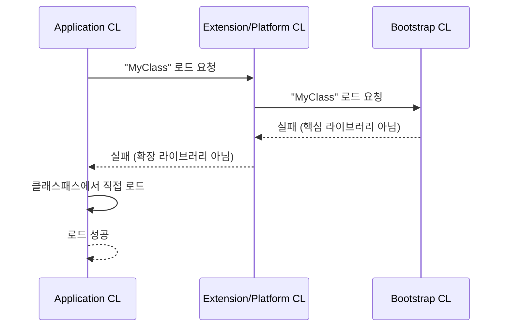
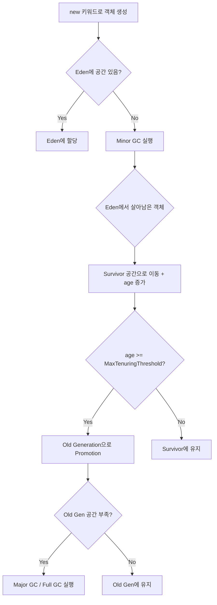
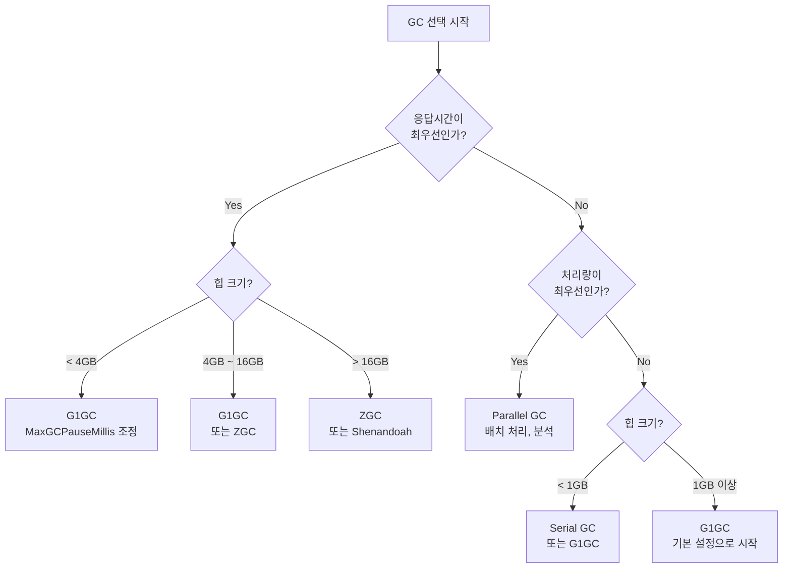

**한 줄 요약**: JVM은 바이트코드를 받아 메모리에 올리고, 실행하고, 더 이상 필요 없는 객체를 자동으로 정리하는 가상 머신이다.

---

## 도입 비유 — JVM은 하나의 공장이다

JVM을 거대한 제조 공장에 비유해 보겠습니다.

- **원자재(바이트코드)**: `.java` 파일을 컴파일한 `.class` 파일이 공장 입구로 들어옵니다.
- **자재 입고팀(Class Loader)**: 원자재를 검수하고, 적절한 창고에 배치합니다.
- **창고(Runtime Data Area)**: 메서드 영역, 힙, 스택 등 각 부서가 자재를 보관합니다.
- **생산팀(Execution Engine)**: 인터프리터와 JIT 컴파일러가 실제 작업을 수행해 제품(실행 결과)을 만들어냅니다.
- **청소팀(Garbage Collector)**: 작업이 끝난 뒤 불필요한 쓰레기(더 이상 참조되지 않는 객체)를 주기적으로 수거합니다.

이 공장이 어떻게 돌아가는지 구석구석 살펴보겠습니다.

---

## 1. JVM이란?

### 1.1 Write Once, Run Anywhere

Java는 1995년 Sun Microsystems에서 "Write Once, Run Anywhere(WORA)"를 목표로 만들어졌습니다. 전통적인 언어(C, C++)는 OS와 CPU 아키텍처에 맞춰 따로 컴파일해야 했습니다. Java는 이 문제를 **중간 언어(바이트코드)**와 **JVM**으로 해결했습니다.

```
Java 소스코드(.java)
        ↓  javac 컴파일
바이트코드(.class)
        ↓  JVM이 실행
  OS/CPU에 맞는 네이티브 코드
```

바이트코드는 어떤 플랫폼에서도 동일합니다. JVM이 각 플랫폼에 맞는 네이티브 코드로 해석·실행합니다. 따라서 개발자는 플랫폼을 신경 쓰지 않고 한 번만 작성하면 됩니다.

### 1.2 JDK vs JRE vs JVM 관계

| 구성 요소 | 포함 내용 | 역할 |
|-----------|-----------|------|
| **JVM** (Java Virtual Machine) | 실행 엔진, GC, 메모리 관리 | 바이트코드 실행 |
| **JRE** (Java Runtime Environment) | JVM + 표준 라이브러리(rt.jar 등) | Java 프로그램 실행 환경 |
| **JDK** (Java Development Kit) | JRE + javac, javadoc, jdb, jstat 등 개발 도구 | Java 개발 환경 |

```
JDK
├── JRE
│   ├── JVM
│   └── 표준 라이브러리 (java.lang, java.util 등)
└── 개발 도구 (javac, javap, jconsole, jstack ...)
```

Java 9 이후로 JRE가 별도 배포되지 않고 `jlink`로 커스텀 런타임을 만드는 방식으로 변경되었습니다.

### 1.3 JVM 벤더별 차이

JVM은 명세(specification)만 있으면 누구든 구현할 수 있습니다. 대표적인 구현체는 다음과 같습니다.

| JVM | 개발사 | 특징 |
|-----|--------|------|
| **HotSpot** | Oracle (원 Sun) | 가장 널리 사용. C1/C2 JIT. OpenJDK의 기본 JVM |
| **OpenJ9** | Eclipse / IBM | 낮은 메모리 사용량, 빠른 시작. IBM WebSphere 계열 |
| **GraalVM** | Oracle | 폴리글랏(Java, JS, Python 등), AOT 컴파일(Native Image) 지원 |
| **Azul Zing / Zulu** | Azul Systems | C4 GC(무중단), 초저지연. 금융권에서 선호 |
| **Amazon Corretto** | Amazon | OpenJDK 기반, AWS 최적화, LTS 지원 확장 |
| **Microsoft OpenJDK** | Microsoft | Azure 최적화 빌드 |

실무에서는 대부분 **HotSpot(OpenJDK 또는 Oracle JDK)**를 사용합니다. 클라우드 환경에서는 빠른 시작이 중요해 OpenJ9나 GraalVM Native Image가 주목받고 있습니다.

---

## 2. JVM 아키텍처 전체 구조

```mermaid
flowchart TD
    A[".java 소스파일"] -->|"javac 컴파일"| B[".class 바이트코드"]
    B --> C

    subgraph JVM["JVM (Java Virtual Machine)"]
        subgraph CL["Class Loader Subsystem"]
            C["로딩 (Loading)"]
            D["링킹 (Linking)"]
            E["초기화 (Initialization)"]
            C --> D --> E
        end

        subgraph "RDA["Runtime Data Area (메모리)"]"
            F["Method Area\n("클래스 메타데이터, static")"]
            G["Heap\n("객체 인스턴스")"]
            H["JVM Stack\n("스레드별 프레임")"]
            I["PC Register\n("명령어 주소")"]
            J["Native Method Stack\n(JNI)"]
        end

        subgraph EE["Execution Engine"]
            K["Interpreter"]
            L["JIT Compiler\n("C1 / C2")"]
            M["Garbage Collector"]
        end

        N["Native Method Interface (JNI)"]
        O["Native Method Libraries"]

        CL -->|"클래스 데이터 저장"| RDA
        RDA -->|"실행 요청"| EE
        EE --> N --> O
    end
```

각 구성 요소를 순서대로 살펴보겠습니다.

---

## 3. Class Loader (클래스 로더)

클래스 로더는 `.class` 파일을 읽어 JVM 메모리에 올리는 역할을 합니다. 단순히 파일을 읽는 것이 아니라 **Loading → Linking → Initialization** 세 단계를 거칩니다.

### 3.1 Loading (로딩)

클래스 파일을 찾아 바이너리 데이터를 읽고 `java.lang.Class` 객체를 생성합니다.

- 클래스의 완전한 이름(Fully Qualified Name)으로 클래스 파일을 찾습니다.
- 읽은 데이터를 **Method Area**에 저장합니다.
- 해당 클래스를 나타내는 `Class` 객체를 **Heap**에 생성합니다.

### 3.2 Linking (링킹)

링킹은 세 단계로 나뉩니다.

**Verification (검증)**
- 바이트코드가 JVM 명세에 맞는지 확인합니다.
- 잘못된 바이트코드, 스택 오버플로우 가능성 등을 미리 검사합니다.
- 보안상 중요한 단계입니다.

**Preparation (준비)**
- 클래스의 `static` 변수를 위한 메모리를 할당하고, **기본값(default value)**으로 초기화합니다.
- `static int count` → 0으로 설정 (코드에서 지정한 값이 아닌 타입 기본값)

**Resolution (해석)**
- 심볼릭 참조(Symbolic Reference)를 실제 메모리 참조로 변환합니다.
- 예: `"java/lang/String"` 문자열 참조 → 실제 `String` 클래스 메모리 주소

### 3.3 Initialization (초기화)

- `static` 변수에 코드에서 지정한 실제 값을 할당합니다.
- `static` 블록이 실행됩니다.
- 이 시점에서야 `static int count = 5`가 5가 됩니다.

```java
public class Example {
    // Preparation 단계: count = 0 (기본값)
    // Initialization 단계: count = 5 (지정값)
    static int count = 5;

    // Initialization 단계에서 실행
    static {
        System.out.println("클래스 초기화: " + count);
    }
}
```

### 3.4 클래스 로더 계층 구조

JVM에는 세 가지 기본 클래스 로더가 있으며 계층 구조를 이룹니다.

```
Bootstrap ClassLoader (최상위)
        ↑ 부모
Extension ClassLoader (Java 8 이하) / Platform ClassLoader (Java 9+)
        ↑ 부모
Application ClassLoader (= System ClassLoader)
        ↑ 부모
Custom ClassLoader (사용자 정의)
```

| 클래스 로더 | 로드 대상 | 구현 |
|-------------|-----------|------|
| **Bootstrap** | `java.lang.*`, `java.util.*` 등 핵심 라이브러리 (`rt.jar` / `java.base` 모듈) | C/C++로 구현 (JVM 내장) |
| **Extension / Platform** | `$JAVA_HOME/lib/ext` 또는 `java.se` 등 확장 모듈 | Java로 구현 |
| **Application** | 클래스패스(classpath)에 있는 사용자 클래스, 라이브러리 | Java로 구현 |

### 3.5 부모 위임 모델 (Parent Delegation Model)

클래스 로더는 클래스를 로드할 때 **먼저 부모에게 위임**합니다. 부모가 로드하지 못할 때만 자신이 로드합니다.



**부모 위임 모델의 장점:**
1. **보안**: `java.lang.String`을 악의적으로 교체하는 것을 방지합니다.
2. **중복 방지**: 같은 클래스가 여러 번 로드되지 않습니다.
3. **일관성**: 핵심 클래스는 항상 Bootstrap CL이 로드하므로 동일한 클래스가 보장됩니다.

### 3.6 커스텀 클래스 로더

`ClassLoader`를 상속하면 커스텀 클래스 로더를 만들 수 있습니다.

```java
public class CustomClassLoader extends ClassLoader {

    private final String classPath;

    public CustomClassLoader(String classPath) {
        this.classPath = classPath;
    }

    @Override
    protected Class<?> findClass(String name) throws ClassNotFoundException {
        byte[] classData = loadClassData(name);
        if (classData == null) {
            throw new ClassNotFoundException("클래스를 찾을 수 없습니다: " + name);
        }
        // 바이트 배열을 Class 객체로 변환
        return defineClass(name, classData, 0, classData.length);
    }

    private byte[] loadClassData(String className) {
        String fileName = classPath + "/" + className.replace('.', '/') + ".class";
        try (InputStream is = new FileInputStream(fileName)) {
            return is.readAllBytes();
        } catch (IOException e) {
            return null;
        }
    }
}

// 사용
ClassLoader cl = new CustomClassLoader("/custom/path");
Class<?> clazz = cl.loadClass("com.example.MyClass");
Object instance = clazz.getDeclaredConstructor().newInstance();
```

**커스텀 클래스 로더 활용 사례:**
- WAS(Tomcat, Spring Boot)에서 웹 애플리케이션별 클래스 격리
- 플러그인 시스템 (Eclipse 플러그인, IntelliJ 플러그인)
- 동적 클래스 재로드 (핫 리로딩)
- 암호화된 클래스 파일 복호화 후 로드

---

## 4. Runtime Data Area (메모리 구조)

JVM이 프로그램을 실행하면서 사용하는 메모리 영역입니다. 이 부분이 JVM의 핵심이며, 성능 튜닝의 출발점입니다.

```mermaid
flowchart LR
    subgraph "JVM_MEM["JVM 메모리 구조"]"
        subgraph "SHARED["스레드 공유 영역"]"
            MA["Method Area\n(Metaspace)\n- 클래스 메타데이터\n- static 변수\n- 상수풀"]
            HP["Heap\n- Young Gen\n  (Eden+S0+S1)\n- Old Gen"]
        end
        subgraph "THREAD["스레드별 독립 영역"]"
            ST["JVM Stack\n- 프레임\n  ("지역변수+오퍼랜드스택")"]
            PC["PC Register\n- 다음 실행 명령어"]
            NS["Native Method Stack\n- JNI 호출"]
        end
    end
```

### 4.1 Method Area (메서드 영역)

**모든 스레드가 공유하는 영역**입니다. 클래스 수준의 데이터를 저장합니다.

저장 내용:
- **클래스 메타데이터**: 클래스 이름, 부모 클래스, 구현한 인터페이스, 메서드 정보, 필드 정보
- **런타임 상수풀(Runtime Constant Pool)**: 클래스/인터페이스의 상수, 메서드/필드 참조
- **static 변수**: 클래스 수준의 정적 변수
- **메서드 바이트코드**: 메서드의 실제 코드

**Java 7 이하**: PermGen(Permanent Generation)이라 불렸으며 Heap의 일부였습니다.
**Java 8 이후**: **Metaspace**로 변경되었으며, JVM Heap이 아닌 **Native Memory(OS 메모리)**를 사용합니다.

PermGen → Metaspace 변경 이유:
- PermGen은 고정 크기로 `java.lang.OutOfMemoryError: PermGen space` 오류가 빈번했습니다.
- Metaspace는 기본적으로 필요에 따라 자동 확장됩니다 (최대값 설정 가능).

```bash
# Metaspace 설정 예시
-XX:MetaspaceSize=256m        # 초기 Metaspace 크기 (GC 트리거 임계값)
-XX:MaxMetaspaceSize=512m     # 최대 Metaspace 크기 (설정 안 하면 무제한)
-XX:MinMetaspaceFreeRatio=40  # GC 후 여유 공간 최소 비율
-XX:MaxMetaspaceFreeRatio=70  # GC 후 여유 공간 최대 비율
```

### 4.2 Heap (힙)

**가장 큰 메모리 영역**으로, `new` 키워드로 생성되는 모든 객체와 배열이 저장됩니다. 모든 스레드가 공유합니다. GC가 주로 관리하는 영역입니다.

#### 힙 구조 (HotSpot JVM 기준)

```
┌─────────────────────────────────────────────────────┐
│                      Heap                           │
├─────────────────────────────┬───────────────────────┤
│        Young Generation     │    Old Generation      │
├──────────┬────────┬─────────┤    (Tenured Space)     │
│  Eden    │   S0   │   S1    │                        │
│  Space   │(Survivor)│(Survivor)│                   │
└──────────┴────────┴─────────┴───────────────────────┘
```

**Young Generation (신생대)**
- **Eden Space**: 새로 생성된 객체가 최초로 할당되는 공간
- **Survivor 0 (S0)**: Eden에서 살아남은 객체
- **Survivor 1 (S1)**: S0에서 살아남은 객체 (S0과 S1 중 하나는 항상 비어 있음)
- Young Gen에서 발생하는 GC: **Minor GC**

**Old Generation (구세대 / Tenured Space)**
- Young Gen에서 일정 횟수(기본 15회) 이상 살아남은 객체가 이동
- 오래 살아남은 객체, 큰 객체가 위치
- Old Gen에서 발생하는 GC: **Major GC** (Full GC의 일부)

#### 힙 크기 설정

```bash
# 힙 초기/최대 크기 (동일하게 설정하면 리사이즈 오버헤드 제거)
-Xms2g          # 힙 초기 크기 2GB
-Xmx4g          # 힙 최대 크기 4GB

# Young Generation 크기
-Xmn1g          # Young Gen 고정 크기 1GB
-XX:NewRatio=2  # Old:Young = 2:1 비율 (Young = 전체의 1/3)

# Survivor 비율
-XX:SurvivorRatio=8  # Eden:S0:S1 = 8:1:1

# 객체가 Old Gen으로 이동하는 기준 (Minor GC 생존 횟수)
-XX:MaxTenuringThreshold=15
```

#### 객체 할당 과정



### 4.3 JVM Stack (스택)

**스레드마다 독립적으로 생성**됩니다. 메서드 호출 시 **스택 프레임(Stack Frame)**이 push되고, 메서드가 종료되면 pop됩니다.

#### 스택 프레임 구조

```
┌─────────────────────────────────┐
│          Stack Frame            │
├─────────────────────────────────┤
│    Local Variable Array         │  ← 지역변수, 매개변수, this 참조
├─────────────────────────────────┤
│    Operand Stack                │  ← 연산을 위한 임시 저장 공간
├─────────────────────────────────┤
│    Frame Data                   │  ← 상수풀 참조, 예외처리 정보, 반환 주소
└─────────────────────────────────┘
```

**Local Variable Array (지역 변수 배열)**
- 인덱스로 접근하는 배열
- 인스턴스 메서드: index 0 = `this`, index 1부터 매개변수, 그 다음 지역변수
- 정적 메서드: index 0부터 매개변수

**Operand Stack (오퍼랜드 스택)**
- 연산을 수행하기 위한 LIFO 스택
- 연산 시 피연산자를 push, 연산 후 결과를 push

예시: `int result = a + b`
```
1. iload_1  → a를 오퍼랜드 스택에 push
2. iload_2  → b를 오퍼랜드 스택에 push
3. iadd     → 두 값 pop 후 덧셈, 결과 push
4. istore_3 → 결과를 지역변수 배열 index 3에 저장
```

#### 스택 크기 설정

```bash
-Xss512k    # 스레드당 스택 크기 512KB (기본값: 512KB~1MB)
```

스택 크기가 너무 작으면 `StackOverflowError`, 너무 크면 스레드를 많이 생성할 때 메모리 낭비가 발생합니다.

```java
// StackOverflowError 예시 - 무한 재귀
public int factorial(int n) {
    return n * factorial(n - 1); // 탈출 조건 없음 → StackOverflowError
}
```

### 4.4 PC Register (프로그램 카운터 레지스터)

**스레드마다 독립적으로 생성**됩니다. 현재 실행 중인 JVM 명령어(바이트코드)의 주소를 저장합니다.

- Java 메서드 실행 중: 현재 실행 중인 바이트코드 명령어 주소
- Native 메서드 실행 중: undefined (Native Method가 자체적으로 관리)

CPU의 PC 레지스터와 개념이 같지만, JVM 레벨에서 추상화된 것입니다. 멀티스레드 환경에서 컨텍스트 스위칭 후 어디서부터 실행을 재개해야 하는지 알기 위해 필요합니다.

### 4.5 Native Method Stack

Java가 아닌 네이티브 코드(C, C++)를 실행할 때 사용하는 스택입니다. JNI(Java Native Interface)를 통해 네이티브 메서드가 호출될 때 사용됩니다.

- `System.currentTimeMillis()` — OS 시스템 콜 사용
- `Object.hashCode()` — 기본 구현이 네이티브
- JDBC 드라이버의 일부 — OS 소켓 API 직접 호출

### 4.6 OOM 발생 시나리오별 원인과 해결법

OutOfMemoryError는 메모리 영역별로 다양한 원인이 있습니다.

| OOM 메시지 | 발생 영역 | 주요 원인 | 해결 방법 |
|------------|-----------|-----------|-----------|
| `java.lang.OutOfMemoryError: Java heap space` | Heap | 객체 누수, 힙 크기 부족, 너무 큰 데이터 | `-Xmx` 증가, 메모리 누수 분석 |
| `java.lang.OutOfMemoryError: GC overhead limit exceeded` | Heap | GC가 너무 빈번 (98% 시간을 GC에 소비) | 힙 증가, 객체 생성 패턴 개선 |
| `java.lang.OutOfMemoryError: Metaspace` | Metaspace | 클래스 로딩 과다 (동적 클래스 생성, 프레임워크 남용) | `-XX:MaxMetaspaceSize` 증가, 클래스 로더 누수 확인 |
| `java.lang.OutOfMemoryError: unable to create new native thread` | Native Memory | 스레드 과다 생성, 스택 크기 과대 설정 | 스레드 풀 사용, `-Xss` 감소 |
| `java.lang.OutOfMemoryError: Direct buffer memory` | Native Memory | NIO DirectByteBuffer 과다 사용 | `-XX:MaxDirectMemorySize` 증가, 명시적 해제 |
| `java.lang.StackOverflowError` | Stack | 무한 재귀, 깊은 재귀 | 재귀 → 반복문 전환, `-Xss` 증가 |

```java
// 힙 OOM 시나리오 1: 메모리 누수 (리스트에 계속 추가)
public class MemoryLeakExample {
    private static final List<byte[]> leakList = new ArrayList<>();

    public void doSomething() {
        // 호출될 때마다 1MB를 추가하고 해제하지 않음
        leakList.add(new byte[1024 * 1024]);
    }
}

// 힙 OOM 시나리오 2: 너무 큰 데이터 한 번에 로드
public void loadAllData() {
    // DB에서 수백만 건을 한 번에 메모리에 올림
    List<Order> allOrders = orderRepository.findAll(); // OOM 위험!

    // 해결: 페이지 단위로 처리
    orderRepository.findAllByPage(page, size).forEach(this::process);
}

// Metaspace OOM 시나리오: 동적 클래스 생성
public class DynamicClassGeneration {
    // CGLib, ASM 등으로 클래스를 계속 생성하고 클래스 로더를 해제하지 않으면 Metaspace 고갈
    ClassLoader cl = new URLClassLoader(urls); // 사용 후 close() 호출 필요
}
```

---

## 5. Execution Engine (실행 엔진)

실행 엔진은 메모리에 올라온 바이트코드를 실제로 실행합니다.

### 5.1 Interpreter (인터프리터)

바이트코드를 **한 명령어씩** 읽어 해석하고 실행합니다.

- **장점**: 시작이 빠름 (별도 컴파일 불필요)
- **단점**: 같은 메서드를 반복 호출해도 매번 해석 → 느림

### 5.2 JIT Compiler (Just-In-Time 컴파일러)

자주 실행되는 코드(**Hotspot**)를 감지하여 **네이티브 기계어로 컴파일**해두고 재사용합니다.

HotSpot JVM은 두 개의 JIT 컴파일러를 사용합니다.

| 컴파일러 | 특징 | 최적화 수준 |
|----------|------|-------------|
| **C1 (Client Compiler)** | 빠른 컴파일, 낮은 최적화 | 낮음 (빠른 시작 목적) |
| **C2 (Server Compiler)** | 느린 컴파일, 공격적 최적화 | 높음 (장기 성능 목적) |

**Tiered Compilation (계층형 컴파일, Java 7+)**
```
Level 0: Interpreter (인터프리터)
Level 1: C1 컴파일 (프로파일링 없음)
Level 2: C1 컴파일 (가벼운 프로파일링)
Level 3: C1 컴파일 (전체 프로파일링)
Level 4: C2 컴파일 (프로파일 기반 공격적 최적화)
```

처음엔 인터프리터로 실행하다가 C1으로, 충분히 프로파일링이 쌓이면 C2로 진화합니다. JIT 컴파일에 대한 자세한 내용은 별도의 JIT 포스트에서 다룹니다.

### 5.3 Garbage Collector

사용하지 않는 객체를 자동으로 메모리에서 제거합니다. 다음 섹션에서 상세히 다룹니다.

---

## 6. Garbage Collection (가비지 컬렉션)

### 6.1 GC 기본 원리

GC는 **더 이상 참조되지 않는 객체**를 찾아 메모리를 회수합니다.

#### GC Root

GC는 특정 시작점(**GC Root**)에서 참조 관계를 따라가며 살아있는 객체를 표시합니다.

GC Root가 될 수 있는 것들:
- JVM Stack의 지역변수/매개변수가 참조하는 객체
- Method Area의 static 변수가 참조하는 객체
- JNI 참조로 유지되는 객체
- 활성 스레드 객체

#### Mark → Sweep → Compact

```mermaid
flowchart LR
    subgraph "MARK["1. Mark (표시)"]"
        A["GC Root부터\n참조 그래프 탐색\n살아있는 객체 표시"]
    end
    subgraph "SWEEP["2. Sweep (제거)"]"
        B["표시되지 않은\n객체 메모리 해제\n("단편화 발생")"]
    end
    subgraph "COMPACT["3. Compact (압축)"]"
        C["살아있는 객체를\n한쪽으로 모아\n단편화 해소"]
    end
    MARK --> SWEEP --> COMPACT
```

- **Mark**: GC Root에서 시작해 도달 가능한 객체에 표시를 남깁니다.
- **Sweep**: 표시되지 않은 객체의 메모리를 해제합니다. 이 과정에서 메모리 단편화 발생.
- **Compact**: 살아있는 객체를 연속된 메모리 공간으로 압축합니다. (모든 GC가 수행하지는 않음)

### 6.2 Minor GC vs Major GC vs Full GC

| GC 종류 | 대상 영역 | 발생 조건 | STW 시간 |
|---------|-----------|-----------|----------|
| **Minor GC** | Young Generation | Eden이 꽉 찼을 때 | 짧음 (수 ms) |
| **Major GC** | Old Generation | Old Gen이 부족할 때 | 길음 (수십 ms ~ 수 초) |
| **Full GC** | Heap 전체 + Metaspace | Major GC 실패, `System.gc()` 호출 등 | 매우 길음 (수 초 이상) |

**STW (Stop-The-World)**: GC 실행 중 모든 애플리케이션 스레드가 멈추는 현상. 응답 지연의 직접적 원인입니다.

#### Minor GC 동작 상세

```mermaid
flowchart TD
    A["Eden 가득 참"] --> B["Minor GC 시작 (STW)"]
    B --> C["Eden + S0의 살아있는 객체 표시"]
    C --> D["표시된 객체를 S1으로 이동\n(age += 1)"]
    D --> E{"age >= MaxTenuringThreshold\n("기본 15")?"}
    E -->|Yes| F["Old Generation으로 Promotion"]
    E -->|No| G["S1에 유지"]
    D --> H["Eden과 S0 메모리 해제"]
    H --> I["S0 ↔ S1 역할 교체"]
    I --> J["Minor GC 종료"]
```

### 6.3 GC 알고리즘

#### Serial GC

```bash
-XX:+UseSerialGC
```

- 단일 스레드로 GC 수행
- STW 동안 하나의 CPU만 사용
- Young Gen: Copy 알고리즘, Old Gen: Mark-Sweep-Compact
- 클라이언트 머신, 소규모 앱, 단일 CPU 환경에 적합
- 서버 환경에서는 사용하지 않음

#### Parallel GC (Throughput Collector)

```bash
-XX:+UseParallelGC
-XX:ParallelGCThreads=4  # GC 스레드 수
```

- 여러 스레드로 GC 수행 (CPU 코어 활용)
- STW는 여전히 발생하지만 시간 단축
- 처리량(Throughput) 극대화가 목표
- Java 8 이하의 서버 기본값
- 배치 처리, 과학 계산 등 응답 시간보다 처리량이 중요한 경우

| 구분 | Serial GC | Parallel GC |
|------|-----------|-------------|
| GC 스레드 | 1개 | 여러 개 |
| STW | 발생 | 발생 (더 짧음) |
| CPU 활용 | 낮음 | 높음 |
| 적합한 환경 | 소규모 | 배치 처리 |

#### CMS (Concurrent Mark Sweep) GC

```bash
-XX:+UseConcMarkSweepGC
-XX:CMSInitiatingOccupancyFraction=75  # Old Gen 75% 찼을 때 시작
```

- Old Gen GC 대부분을 **애플리케이션 스레드와 동시에** 수행
- STW 시간을 최소화 (저지연 목표)
- Java 9에서 Deprecated, Java 14에서 제거됨

**CMS 동작 단계:**
1. **Initial Mark** (STW): GC Root에서 직접 참조하는 객체만 표시 (빠름)
2. **Concurrent Mark**: 애플리케이션과 동시에 참조 그래프 전체 탐색
3. **Concurrent Preclean**: 동시 표시 중 변경된 객체 재검사
4. **Remark** (STW): Concurrent 단계에서 누락된 객체 재표시
5. **Concurrent Sweep**: 애플리케이션과 동시에 메모리 해제
6. **Concurrent Reset**: CMS 내부 데이터 구조 초기화

**CMS의 단점:**
- Compact(압축) 없음 → 메모리 단편화 → 결국 Full GC 필요
- CPU 사용량 높음 (동시 실행이므로)
- Concurrent Mode Failure 발생 시 Serial Full GC로 폴백 → 매우 긴 STW

#### G1 GC (Garbage First)

```bash
-XX:+UseG1GC          # Java 9+부터 기본값
-Xms4g -Xmx4g
-XX:G1HeapRegionSize=16m     # Region 크기 (1~32MB, 2의 거듭제곱)
-XX:MaxGCPauseMillis=200     # 목표 최대 STW 시간 (ms)
-XX:G1NewSizePercent=5       # Young Gen 최소 비율
-XX:G1MaxNewSizePercent=60   # Young Gen 최대 비율
-XX:G1ReservePercent=10      # 예비 공간 비율
-XX:InitiatingHeapOccupancyPercent=45  # Old Gen GC 시작 임계값
```

**G1 GC의 핵심: Region 기반 힙**

기존 GC처럼 Young/Old Gen이 연속된 메모리 공간이 아닙니다. 힙을 **동일한 크기의 Region**으로 나누고, 각 Region의 역할(Eden/Survivor/Old/Humongous)을 동적으로 할당합니다.

```
┌───┬───┬───┬───┬───┬───┬───┬───┐
│ E │ E │ S │ O │ E │ H │ O │ E │
├───┼───┼───┼───┼───┼───┼───┼───┤
│ O │ F │ E │ O │ S │ E │ O │ F │
└───┴───┴───┴───┴───┴───┴───┴───┘
E=Eden, S=Survivor, O=Old, H=Humongous, F=Free
```

**G1 GC 동작 단계:**

1. **Young GC (Evacuation Pause, STW)**: Eden Region들이 꽉 차면 실행. 살아있는 객체를 Survivor Region으로 이동.

2. **Concurrent Marking Cycle**: Old Gen 점유율이 IHOP(기본 45%) 초과 시 시작
   - Initial Mark (STW, Young GC와 함께 수행)
   - Root Region Scan (Concurrent)
   - Concurrent Mark (Concurrent)
   - Remark (STW)
   - Cleanup (STW + Concurrent)

3. **Mixed GC**: Young Region + 쓰레기가 많은 Old Region들을 동시에 수거. 이 단계가 G1의 핵심 (Garbage First: 쓰레기가 많은 Region을 우선 수거)

4. **Full GC (폴백)**: 힙이 너무 빨리 채워지면 Serial Full GC로 폴백 → 피해야 함

**Humongous Region**: Region 크기의 50% 이상인 큰 객체는 직접 Old Region에 연속 할당. 큰 배열, 큰 String 등이 해당.

**G1 GC의 장점:**
- 소프트 실시간 목표 (`MaxGCPauseMillis`)를 지향
- 단편화 없음 (Region 단위 이동 및 Compact)
- 큰 힙(4GB~)에서 효율적
- Java 9+의 기본 GC

**G1 GC 튜닝 팁:**
```bash
# STW 목표 시간 설정 (너무 작게 잡으면 GC 빈도 증가)
-XX:MaxGCPauseMillis=200

# Region 크기 (큰 객체가 많으면 Region 크기를 키워 Humongous 방지)
-XX:G1HeapRegionSize=32m

# Concurrent GC 스레드 수 (CPU 코어의 1/4 정도 권장)
-XX:ConcGCThreads=4

# Mixed GC에서 처리할 Old Region 최대 비율
-XX:G1MixedGCLiveThresholdPercent=65
```

#### ZGC (Z Garbage Collector)

```bash
-XX:+UseZGC              # Java 11+, Java 15부터 프로덕션
-Xms16g -Xmx16g
-XX:ZCollectionInterval=5  # 주기적 GC 간격 (초)
-XX:ZUncommitDelay=300     # 미사용 메모리 OS 반환 지연 (초)
```

**ZGC의 목표: STW 시간 1ms 이하 (힙 크기와 무관)**

핵심 기술:
- **Colored Pointers**: 객체 참조 포인터의 비트를 이용해 메타데이터 인코딩 (64bit 시스템에서만 동작)
- **Load Barriers**: 객체를 참조할 때마다 배리어 코드 삽입 → 이동 중인 객체도 안전하게 참조
- **Concurrent Relocation**: 살아있는 객체 이동을 STW 없이 애플리케이션과 동시에 수행

```
ZGC STW 단계 (매우 짧음):
1. Pause Mark Start (< 1ms): GC Root 표시
2. Pause Mark End (< 1ms): 마킹 완료
3. Pause Relocate Start (< 1ms): 재배치 시작

나머지는 모두 Concurrent (애플리케이션과 동시 실행)
```

**ZGC 적합한 환경:**
- TB(테라바이트)급 힙 (최대 4TB 힙 지원)
- 응답 시간이 1ms 이하여야 하는 실시간 시스템
- 금융 거래, 게임 서버, 실시간 분석

**ZGC 단점:**
- CPU 오버헤드 높음 (Load Barrier, Concurrent 작업)
- 처리량(Throughput)이 G1보다 낮을 수 있음

#### Shenandoah GC

```bash
-XX:+UseShenandoahGC     # OpenJDK 12+, Red Hat 개발
-XX:ShenandoahGCMode=iu  # 모드: satb / iu (incremental update)
```

ZGC와 유사하게 STW 최소화가 목표지만 다른 접근 방식을 사용합니다.

- **Brooks Pointer**: 각 객체에 포워딩 포인터를 추가해 이동 중 참조 처리
- ZGC보다 힙 크기 제한이 더 유연 (32bit에서도 동작)
- Concurrent Compact 수행

| 항목 | ZGC | Shenandoah |
|------|-----|------------|
| STW 목표 | < 1ms | < 10ms |
| 최대 힙 | 4TB | 제한 없음 |
| 아키텍처 | Colored Pointers | Brooks Pointer |
| 개발사 | Oracle | Red Hat |
| 추가 메모리 | 없음 | 오브젝트당 포인터 1개 |

### 6.4 GC 알고리즘 전체 비교

| GC | Java 기본 버전 | STW | 처리량 | 지연시간 | 힙 크기 | 추천 환경 |
|----|---------------|-----|--------|----------|---------|-----------|
| Serial | - | 긴 STW | 낮음 | 나쁨 | 소형 | 클라이언트, 테스트 |
| Parallel | Java 8 이하 | STW (짧음) | 높음 | 나쁨 | 중형 | 배치, 처리량 우선 |
| CMS | 제거됨 (Java 14) | 짧은 STW | 중간 | 좋음 | 중형 | (레거시) |
| G1 | Java 9+ | 짧은 STW | 높음 | 좋음 | 4GB~16GB | 일반 서버 앱 |
| ZGC | Java 15+ | < 1ms | 중간 | 매우 좋음 | 1GB~4TB | 초저지연 |
| Shenandoah | OpenJDK 12+ | < 10ms | 중간 | 좋음 | 제한 없음 | 저지연 |

### 6.5 GC 선택 가이드 (워크로드별)



### 6.6 GC 튜닝 주요 파라미터

```bash
# ===== G1 GC 기본 튜닝 =====
-XX:+UseG1GC
-Xms4g -Xmx4g                          # 힙 초기=최대 (리사이즈 오버헤드 제거)
-XX:MaxGCPauseMillis=200               # STW 목표 시간
-XX:G1HeapRegionSize=16m               # Region 크기
-XX:InitiatingHeapOccupancyPercent=45  # Concurrent Mark 시작 임계값
-XX:G1ReservePercent=15                # 예비 공간

# ===== GC 로그 설정 (Java 9+) =====
-Xlog:gc*:file=/var/log/app/gc.log:time,uptime,level,tags:filecount=10,filesize=100m

# ===== GC 로그 설정 (Java 8) =====
-XX:+PrintGCDetails
-XX:+PrintGCDateStamps
-XX:+PrintGCTimeStamps
-Xloggc:/var/log/app/gc.log
-XX:+UseGCLogFileRotation
-XX:NumberOfGCLogFiles=10
-XX:GCLogFileSize=100m

# ===== OOM 발생 시 힙 덤프 자동 생성 =====
-XX:+HeapDumpOnOutOfMemoryError
-XX:HeapDumpPath=/var/log/app/heapdump.hprof

# ===== GC 진단 옵션 =====
-XX:+PrintGCApplicationStoppedTime  # STW 시간 출력
-XX:+PrintGCApplicationConcurrentTime
-XX:+PrintAdaptiveSizePolicy        # Young/Old Gen 크기 조정 내역
-XX:+PrintTenuringDistribution      # 객체 age 분포 출력
```

---

## 7. 트래픽별 JVM 설정

### 7.1 소규모 서비스 (100 TPS 이하)

특성: 동시 접속자 적음, 힙 요구량 적음, 기본 설정으로 충분

```bash
# 기본 설정 (Spring Boot 예시)
java -jar \
  -Xms512m \                      # 힙 초기 크기 512MB
  -Xmx1g \                        # 힙 최대 크기 1GB
  -XX:+UseG1GC \                  # G1GC (Java 9+ 기본값)
  -XX:MaxGCPauseMillis=250 \      # 250ms 이내 STW 목표
  -Xlog:gc:file=/logs/gc.log \    # GC 로그
  app.jar
```

주의 사항:
- 힙을 너무 크게 잡으면 Full GC 시 오히려 STW가 길어집니다.
- 컨테이너 환경에서는 `-XX:+UseContainerSupport` (Java 8u191+ 기본 활성화) 확인.

### 7.2 중규모 서비스 (1,000 ~ 10,000 TPS)

특성: 동시 접속자 수백~수천, 힙 2~8GB, GC 로그 모니터링 필수

```bash
java -jar \
  -Xms4g \                                    # 힙 초기=최대 (리사이즈 방지)
  -Xmx4g \
  -XX:+UseG1GC \
  -XX:G1HeapRegionSize=16m \                  # Region 크기 16MB
  -XX:MaxGCPauseMillis=200 \                  # 200ms 이내 STW 목표
  -XX:InitiatingHeapOccupancyPercent=40 \     # Old Gen 40%에서 Concurrent Mark 시작
  -XX:G1ReservePercent=15 \                   # 15% 예비 공간
  -XX:ConcGCThreads=4 \                       # Concurrent GC 스레드 4개
  -XX:+HeapDumpOnOutOfMemoryError \           # OOM 시 힙 덤프
  -XX:HeapDumpPath=/logs/heapdump.hprof \
  -Xlog:gc*:file=/logs/gc.log:time,uptime:filecount=10,filesize=50m \
  app.jar
```

모니터링 필수 지표:
- GC 빈도 및 STW 시간 (목표: Minor GC < 100ms, Full GC 없음)
- Old Gen 점유율 추이
- Metaspace 사용량

### 7.3 대규모 서비스 (100,000 TPS 이상)

특성: 응답 시간 SLA가 엄격, 힙 16GB+, ZGC 또는 G1 극한 튜닝

```bash
java -jar \
  -Xms16g \                                   # 힙 16GB 고정
  -Xmx16g \
  -XX:+UseZGC \                               # ZGC: 초저지연
  -XX:ZCollectionInterval=1 \                 # 1초마다 GC 주기 (힙이 크므로)
  -XX:ConcGCThreads=8 \                       # Concurrent GC 스레드 8개
  -XX:+UnlockDiagnosticVMOptions \
  -XX:+ZProactive \                           # 사전적 GC (heap 여유 있을 때 미리 수행)
  -XX:ZUncommitDelay=300 \                    # OS 메모리 반환 300초 지연
  -XX:+HeapDumpOnOutOfMemoryError \
  -XX:HeapDumpPath=/logs/heapdump.hprof \
  -Xlog:gc*:file=/logs/gc.log:time,uptime:filecount=20,filesize=100m \
  app.jar
```

추가 고려 사항:
- **NUMA 지원**: `+UseNUMA` (멀티소켓 서버에서 메모리 지역성 향상)
- **Large Pages**: `+UseLargePages` (TLB 캐시 효율 향상)
- **GC 파라미터 A/B 테스트**: 프로덕션과 동일한 부하 테스트 환경에서 검증
- **코드 캐시**: `-XX:ReservedCodeCacheSize=512m` (JIT 컴파일 결과 저장 공간)

---

## 8. JVM 모니터링 & 트러블슈팅

### 8.1 jstat — JVM 통계 모니터링

```bash
# GC 통계를 1초마다 출력
jstat -gc <pid> 1000

# 출력 컬럼 의미:
# S0C, S1C: Survivor 0, 1 용량(KB)
# S0U, S1U: Survivor 0, 1 사용량(KB)
# EC, EU: Eden 용량/사용량(KB)
# OC, OU: Old Gen 용량/사용량(KB)
# MC, MU: Metaspace 용량/사용량(KB)
# YGC, YGCT: Young GC 횟수, 총 시간(초)
# FGC, FGCT: Full GC 횟수, 총 시간(초)
# GCT: 총 GC 시간(초)

# GC 통계를 비율로 출력
jstat -gcutil <pid> 1000

# 클래스 로딩 통계
jstat -class <pid> 1000

# JIT 컴파일 통계
jstat -compiler <pid>
```

### 8.2 jmap — 메모리 맵 & 힙 덤프

```bash
# 힙 사용 현황 요약
jmap -heap <pid>

# 힙 히스토그램 (객체별 개수/크기)
jmap -histo <pid> | head -30

# 살아있는 객체만 (GC 후)
jmap -histo:live <pid> | head -30

# 힙 덤프 생성
jmap -dump:format=b,file=/tmp/heap.hprof <pid>

# 살아있는 객체만 덤프 (파일 크기 줄임)
jmap -dump:live,format=b,file=/tmp/heap-live.hprof <pid>
```

### 8.3 jstack — 스레드 덤프

```bash
# 스레드 덤프 출력 (stdout)
jstack <pid>

# 파일로 저장
jstack <pid> > /tmp/threaddump.txt

# 교착 상태(Deadlock) 포함
jstack -l <pid>

# 반응하지 않는 프로세스에서도 강제 실행
jstack -F <pid>
```

### 8.4 jcmd — 다목적 진단 도구 (Java 7+)

```bash
# 실행 중인 JVM 목록
jcmd

# 사용 가능한 명령 목록
jcmd <pid> help

# VM 정보
jcmd <pid> VM.info

# JVM 플래그 출력
jcmd <pid> VM.flags

# 힙 덤프
jcmd <pid> GC.heap_dump /tmp/heap.hprof

# 힙 히스토그램
jcmd <pid> GC.class_histogram

# 스레드 덤프
jcmd <pid> Thread.print

# GC 실행
jcmd <pid> GC.run

# Native 메모리 추적
jcmd <pid> VM.native_memory summary
```

### 8.5 힙 덤프 분석

힙 덤프는 특정 시점의 힙 메모리 스냅샷입니다.

**분석 도구:**
- **Eclipse Memory Analyzer (MAT)**: 가장 널리 사용, 누수 의심 객체 자동 감지
- **VisualVM**: GUI 기반, 실시간 + 덤프 분석
- **JProfiler, YourKit**: 상용, 강력한 분석 기능

```bash
# MAT 실행 (CLI)
./MemoryAnalyzer -data /workspace -application org.eclipse.mat.api.parse \
  /tmp/heap.hprof org.eclipse.mat.api.leak_report

# VisualVM으로 힙 덤프 열기
visualvm --openfile /tmp/heap.hprof
```

**MAT에서 확인할 것:**
1. **Dominator Tree**: 메모리를 가장 많이 점유하는 객체 트리
2. **Leak Suspects**: 자동 누수 의심 리포트
3. **Histogram**: 클래스별 인스턴스 수/메모리 크기
4. **OQL (Object Query Language)**: `SELECT * FROM java.util.ArrayList WHERE size > 10000`

### 8.6 스레드 덤프 분석

```
"http-nio-8080-exec-1" #25 daemon prio=5 os_prio=0 tid=0x00007f... nid=0x1234 ...
   java.lang.Thread.State: WAITING (parking)
        at sun.misc.Unsafe.park(Native Method)
        at java.util.concurrent.locks.LockSupport.park(LockSupport.java:175)
        at java.util.concurrent.locks.AbstractQueuedSynchronizer$ConditionObject.await(...)
        ...

"http-nio-8080-exec-2" #26 daemon prio=5 os_prio=0 tid=0x00007f... nid=0x1235 ...
   java.lang.Thread.State: BLOCKED (on object monitor)
        - waiting to lock <0x00000000c1234567> (a java.lang.Object)
        - locked by "http-nio-8080-exec-1"
```

**스레드 상태 의미:**
| 상태 | 의미 |
|------|------|
| `RUNNABLE` | 실행 중 또는 실행 대기 |
| `WAITING` | 무기한 대기 (`Object.wait()`, `LockSupport.park()`) |
| `TIMED_WAITING` | 시간 제한 대기 (`sleep()`, `wait(timeout)`) |
| `BLOCKED` | 모니터 락 획득 대기 |

**교착 상태 감지:**
```bash
jstack <pid> | grep -A 20 "Found deadlock"
```

### 8.7 OOM 디버깅 실전

```bash
# 1. OOM 발생 시 자동 힙 덤프 활성화 (시작 옵션)
-XX:+HeapDumpOnOutOfMemoryError -XX:HeapDumpPath=/logs/oom-dump.hprof

# 2. OOM 발생 후 확인
ls -lh /logs/oom-dump.hprof

# 3. jmap으로 빠른 히스토그램 확인
jmap -histo:live <pid> | head -20

# 4. 힙 덤프를 MAT로 분석
# MAT 실행 → Open Heap Dump → Leak Suspects 클릭
```

**OOM 원인 분석 체크리스트:**
1. `jstat -gcutil`로 Old Gen 점유율 추이 확인
2. 힙 히스토그램에서 비정상적으로 많은 객체 타입 확인
3. 해당 클래스의 참조 체인 추적 (MAT의 GC Roots to Object)
4. 코드에서 해당 클래스가 어디서 생성되고 왜 해제되지 않는지 분석

---

## 9. 실무에서 자주 하는 실수 TOP 5

### 실수 1: 힙 크기를 너무 크게 설정

```bash
# 잘못된 예: 32GB 힙으로 Full GC 발생 시 수십 초 STW
-Xmx32g

# 올바른 접근: GC 알고리즘에 맞는 적절한 크기
# G1GC: 4~16GB, ZGC: 필요한 만큼 (STW가 짧으므로 더 크게 가능)
-Xmx8g -XX:+UseG1GC -XX:MaxGCPauseMillis=200
```

### 실수 2: -Xms와 -Xmx를 다르게 설정

```bash
# 잘못된 예: JVM이 실행 중 힙 리사이즈 → 오버헤드 발생
-Xms512m -Xmx4g

# 올바른 예: 운영 서버에서는 동일하게 설정
-Xms4g -Xmx4g
```

단, 개발/테스트 환경이나 메모리가 제한된 컨테이너에서는 다르게 설정할 수 있습니다.

### 실수 3: static 컬렉션에 계속 데이터 추가

```java
// 메모리 누수의 전형적인 패턴
public class CacheManager {
    // static 맵은 JVM 종료 전까지 GC되지 않음
    private static final Map<String, Object> cache = new HashMap<>();

    public static void put(String key, Object value) {
        cache.put(key, value); // 계속 추가, 제거 없음 → 메모리 누수
    }
}

// 해결: Weak Reference 또는 크기 제한 캐시 사용
private static final Map<String, Object> cache = Collections.synchronizedMap(
    new LinkedHashMap<>(100, 0.75f, true) {
        protected boolean removeEldestEntry(Map.Entry eldest) {
            return size() > 100; // 100개 초과 시 오래된 항목 제거
        }
    }
);
// 또는 Caffeine, Guava Cache 같은 라이브러리 사용
```

### 실수 4: try-with-resources 미사용으로 리소스 누수

```java
// 잘못된 예: 예외 발생 시 InputStream이 닫히지 않음
public void readFile(String path) throws IOException {
    InputStream is = new FileInputStream(path);
    // 예외 발생 시 is.close()가 호출되지 않음
    processData(is);
    is.close();
}

// 올바른 예: try-with-resources 사용
public void readFile(String path) throws IOException {
    try (InputStream is = new FileInputStream(path)) {
        processData(is);
    } // 자동으로 close() 호출
}

// DB 커넥션도 마찬가지
try (Connection conn = dataSource.getConnection();
     PreparedStatement ps = conn.prepareStatement(sql)) {
    // 사용
} // 자동 close
```

### 실수 5: finalize() 또는 Cleaner 오용

```java
// 잘못된 예: finalize()에 중요 로직 작성
public class ResourceHolder {
    @Override
    protected void finalize() throws Throwable {
        // GC 실행 전까지 호출 안 될 수 있음 (예측 불가)
        // GC 성능 저하의 원인
        cleanup();
    }
}

// 올바른 예: AutoCloseable + try-with-resources
public class ResourceHolder implements AutoCloseable {
    @Override
    public void close() {
        cleanup(); // 확실하게 호출됨
    }
}
```

---

## 10. 면접 포인트

### Q1. JVM, JRE, JDK의 차이를 설명하세요.

JVM은 바이트코드를 실행하는 가상 머신입니다. JRE는 JVM에 표준 라이브러리를 추가한 실행 환경입니다. JDK는 JRE에 컴파일러, 디버거, 프로파일러 등 개발 도구를 추가한 개발 키트입니다.

### Q2. Java의 메모리 구조를 설명하세요.

JVM 메모리는 크게 5가지 영역으로 나뉩니다. Method Area(Metaspace)는 클래스 메타데이터와 static 변수를 저장합니다. Heap은 new로 생성된 모든 객체가 저장되며 Young/Old Gen으로 나뉩니다. JVM Stack은 스레드별로 독립적으로 생성되며 메서드 호출마다 스택 프레임이 쌓입니다. PC Register는 현재 실행 중인 명령어 주소를 저장합니다. Native Method Stack은 JNI 호출 시 사용됩니다.

### Q3. Minor GC와 Full GC의 차이를 설명하세요.

Minor GC는 Young Generation(Eden + Survivor)을 대상으로 하며 STW 시간이 짧습니다. Full GC는 Heap 전체(Young + Old)와 Metaspace까지 정리하며 STW 시간이 길어 서비스 응답 지연을 유발합니다. Full GC는 Old Gen이 가득 찼거나 `System.gc()` 호출 시 발생합니다.

### Q4. G1 GC와 ZGC의 차이를 설명하세요.

G1 GC는 힙을 동일한 크기의 Region으로 나눠 GC를 수행합니다. Garbage가 많은 Region을 우선 수거하며, 최대 STW 시간을 목표로 설정할 수 있습니다(기본 200ms). 4~16GB 힙에서 일반 서버 앱에 적합합니다.

ZGC는 STW 시간을 1ms 이하로 유지하는 것이 목표입니다. Colored Pointer와 Load Barrier 기술로 GC 대부분을 Concurrent하게 수행합니다. TB급 힙을 지원하며 초저지연이 요구되는 환경에 적합합니다.

### Q5. 클래스 로더의 부모 위임 모델이란 무엇인가요?

클래스 로드 요청이 들어오면 자신이 먼저 로드하지 않고 부모 클래스 로더에게 위임합니다. 부모가 로드하지 못할 때만 자신이 로드합니다. 이를 통해 핵심 클래스(java.lang.String 등)가 악의적으로 교체되는 것을 방지하고, 같은 클래스가 중복 로드되지 않도록 합니다.

### Q6. `OutOfMemoryError: Java heap space`와 `OutOfMemoryError: GC overhead limit exceeded`의 차이는?

`Java heap space`는 힙에 새 객체를 할당할 공간이 없을 때 발생합니다. `GC overhead limit exceeded`는 힙에는 공간이 있지만 GC가 전체 실행 시간의 98% 이상을 차지하면서도 2% 미만의 메모리만 회수할 때 발생합니다. 후자는 힙 크기 증가와 함께 메모리 누수 여부를 반드시 확인해야 합니다.

### Q7. PermGen이 Java 8에서 Metaspace로 바뀐 이유는?

PermGen은 고정 크기였기 때문에 클래스 로딩이 많은 환경(동적 클래스 생성, 많은 라이브러리)에서 `OutOfMemoryError: PermGen space`가 자주 발생했습니다. Metaspace는 Native Memory를 사용하여 기본적으로 자동 확장됩니다. 다만 `-XX:MaxMetaspaceSize`로 상한선을 설정하지 않으면 OS 메모리 전체를 소비할 수 있으므로 운영 환경에서는 설정이 필요합니다.

---

## 11. 핵심 포인트 정리

| 항목 | 핵심 내용 |
|------|-----------|
| **JVM 구성** | Class Loader → Runtime Data Area → Execution Engine |
| **클래스 로딩 순서** | Loading → Linking(Verify→Prepare→Resolve) → Initialization |
| **부모 위임 모델** | 클래스 로드는 부모에게 먼저 위임, 실패 시 자신이 처리 |
| **메서드 영역** | 클래스 메타데이터, static 변수, 상수풀 (Java 8+: Metaspace) |
| **힙 구조** | Young Gen (Eden + S0 + S1) + Old Gen |
| **Minor GC** | Eden이 꽉 찰 때, 짧은 STW, Young Gen 대상 |
| **Full GC** | Old Gen 부족 시, 긴 STW, 전체 힙 대상 → 최소화 필요 |
| **G1 GC** | Java 9+ 기본, Region 기반, 4~16GB 힙, MaxGCPauseMillis 설정 |
| **ZGC** | Java 15+ 안정화, STW < 1ms, TB급 힙 지원, 초저지연 |
| **OOM 대응** | HeapDumpOnOutOfMemoryError 활성화, MAT로 덤프 분석 |
| **GC 모니터링** | `jstat -gcutil <pid> 1000`으로 실시간 확인 |
| **힙 설정 원칙** | 운영 환경에서 `-Xms == -Xmx`, Full GC 없는 게 목표 |

---

## 참고 자료

- [OpenJDK 공식 문서](https://openjdk.org/)
- [Java Virtual Machine Specification](https://docs.oracle.com/javase/specs/jvms/se21/html/index.html)
- [GraalVM 공식 문서](https://www.graalvm.org/latest/docs/)
- [ZGC 설계 문서](https://wiki.openjdk.org/display/zgc)
- [G1 GC 튜닝 가이드 (Oracle)](https://docs.oracle.com/en/java/javase/21/gctuning/garbage-first-g1-garbage-collector.html)
- Eclipse Memory Analyzer (MAT): [https://eclipse.dev/mat/](https://eclipse.dev/mat/)
