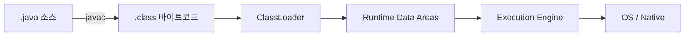
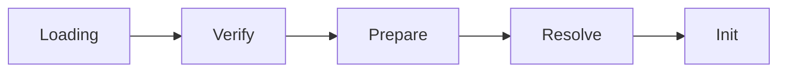
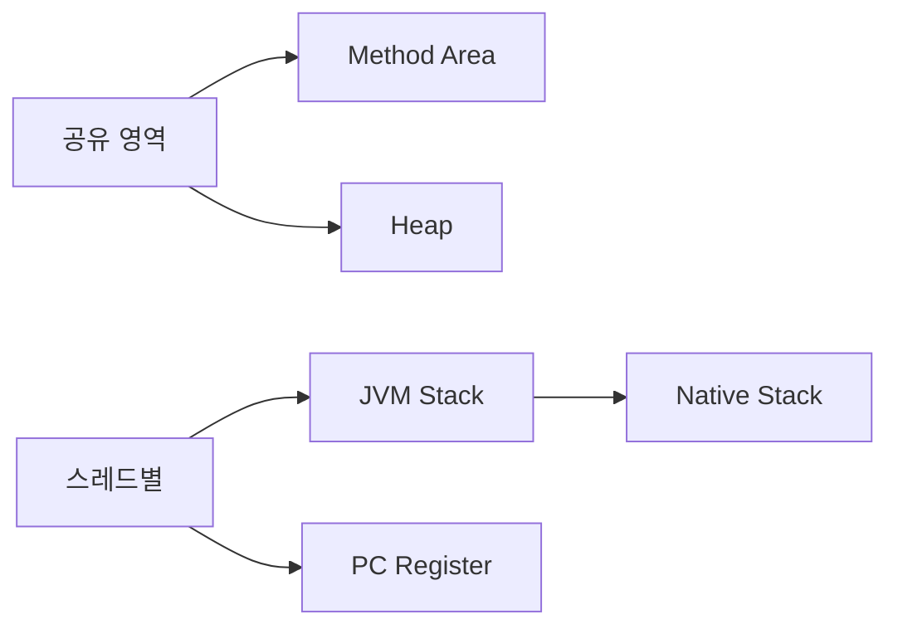
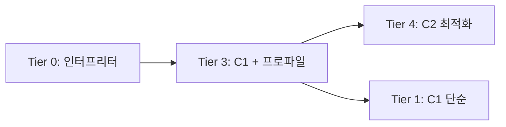
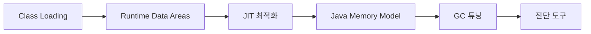

**한 줄 요약**: JVM은 바이트코드를 받아 검증·링킹·초기화 후 메모리에 올리고, 인터프리터와 JIT 컴파일러로 실행하며, GC로 메모리를 자동 회수하는 플랫폼 독립 런타임이다.

---

## 도입 비유 — JVM은 하나의 정밀 제조 공장이다

JVM을 항공기 부품을 생산하는 정밀 제조 공장에 비유해 보겠습니다. 항공기 부품은 규격이 조금만 어긋나도 대형 사고로 이어지기 때문에 입고에서 출고까지 모든 단계에 엄격한 검수가 있습니다.

- **설계 도면(.class 바이트코드)**: 전 세계 어느 공장에 가져가도 똑같이 읽을 수 있는 국제 표준 도면입니다.
- **자재 입고팀(Class Loader)**: 도면을 수령해 위조 여부를 검사하고(Verify), 창고 공간을 예약하고(Prepare), 도면 내 부품 번호를 실제 재고 위치로 매핑합니다(Resolve).
- **창고 시스템(Runtime Data Areas)**: 설계도 캐비닛(Method Area), 완성품 보관소(Heap), 직원별 작업 메모장(Stack), 현재 작업 위치 표시(PC Register).
- **생산팀(Execution Engine)**: 처음에는 도면을 보며 수작업(Interpreter)하고, 자주 반복되는 공정은 자동화 기계로 전환(JIT)합니다. C1 기계는 빠르게 자동화하고, C2 기계는 느리지만 최고 효율로 최적화합니다.
- **청소팀(GC)**: 사용이 끝난 부품과 공간을 주기적으로 정리합니다. 잠깐 멈추고 청소하는 것(STW)이 불가피하지만, 현대 GC는 멈춤 시간을 최소화합니다.

이 공장 비유를 머릿속에 담아두고, 각 팀의 내부 메커니즘을 해부해 보겠습니다.

---

## 1. JVM이란 — WHY부터 시작한다

### 1.1 Write Once, Run Anywhere — 왜 이 철학이 필요했나

1990년대 초 소프트웨어 개발 현장은 운영체제와 CPU 아키텍처 조합마다 별도 바이너리를 빌드해야 했습니다. Windows x86, Solaris SPARC, AIX PowerPC 각각 다른 컴파일러 플래그, 다른 ABI(Application Binary Interface), 다른 라이브러리가 필요했습니다.

Java는 이 문제를 **중간 표현(Intermediate Representation)** 개념으로 해결했습니다. 소스를 플랫폼 독립적인 바이트코드로 컴파일하고, 각 플랫폼에 그 바이트코드를 실행하는 JVM을 설치합니다.

```java
// 개발자 PC에서 딱 한 번 컴파일
// javac Hello.java → Hello.class
public class Hello {
    public static void main(String[] args) {
        System.out.println("Hello, JVM");
    }
}
```

```
[Hello.class 바이트코드 일부 - javap -c Hello]
public static void main(java.lang.String[]);
  Code:
     0: getstatic     #7   // Field java/lang/System.out:Ljava/io/PrintStream;
     3: ldc           #13  // String Hello, JVM
     5: invokevirtual #15  // Method java/io/PrintStream.println:(Ljava/lang/String;)V
     8: return
```

이 `.class` 파일 하나가 Linux ARM, Windows x64, macOS M1 위의 JVM 어디서든 동일하게 실행됩니다. 클라우드 환경에서 x86과 ARM 인스턴스가 혼재하는 지금, 이것이 얼마나 강력한 추상화인지 실감할 수 있습니다.

**만약 JVM이 없었다면?** AWS Lambda에서 x86으로 빌드한 바이너리가 Graviton(ARM) 인스턴스로 이동하는 순간 실행 불가입니다. Java는 이 문제가 없습니다.

### 1.2 JDK vs JRE vs JVM 관계

```
JDK (개발 + 실행)
├── JRE (실행 환경)
│   ├── JVM (바이트코드 실행 엔진)
│   │   ├── Class Loader
│   │   ├── Runtime Data Areas
│   │   ├── Execution Engine (Interpreter + JIT + GC)
│   │   └── JNI
│   └── 표준 라이브러리 (java.lang, java.util, java.io ...)
└── 개발 도구 (javac, javap, jstack, jmap, jstat, JFR ...)
```

Java 9 이후 JRE가 별도 배포 중단되었습니다. 대신 `jlink`로 필요한 모듈만 묶은 커스텀 런타임을 만들 수 있습니다.

```bash
# 필요 모듈만 담은 경량 런타임 생성 (Docker 이미지 크기 최소화)
jlink --module-path $JAVA_HOME/jmods \
      --add-modules java.base,java.logging \
      --output /opt/minimal-jre
# 결과: 수십 MB 수준의 최소 런타임
```

---

## 2. JVM 아키텍처 전체 구조



각 구성 요소를 내부 동작 원리와 함께 순서대로 해부합니다.

---

## 3. Class Loader — 부모 위임 모델과 커스텀 로더

### 3.1 Loading → Linking → Initialization 전체 흐름

클래스 로더는 단순히 파일을 읽는 것이 아닙니다. 세 단계 파이프라인을 거칩니다.



### 3.2 Loading — 바이너리를 Method Area에 적재

```java
// 클래스 로딩을 명시적으로 트리거하는 방법들
Class<?> clazz1 = Class.forName("com.example.MyService"); // 즉시 초기화까지
Class<?> clazz2 = MyService.class;                        // 로딩만, 초기화 X
ClassLoader cl = Thread.currentThread().getContextClassLoader();
Class<?> clazz3 = cl.loadClass("com.example.MyService");  // 로딩만
```

내부 순서:
1. FQCN(Fully Qualified Class Name)으로 `.class` 파일 탐색
2. 바이너리 데이터를 읽어 **Method Area**에 클래스 메타데이터 저장
3. `java.lang.Class` 객체를 **Heap**에 생성 → 리플렉션 API가 이 객체를 통해 메타데이터에 접근

**왜 Class 객체를 Heap에 두는가?** `MyClass.class`, `obj.getClass()`, `Class.forName()` 모두 같은 Class 인스턴스를 반환해야 합니다. Heap에 있어야 일반 객체처럼 GC 관리를 받으면서 참조 가능합니다.

### 3.3 Linking Phase 1 — Verification (검증)

바이트코드가 JVM 명세(JVMS)에 부합하는지 4단계로 검증합니다.

| 검증 단계 | 검사 내용 |
|-----------|-----------|
| File Format | 매직 넘버(`0xCAFEBABE`), 버전, 상수풀 구조 |
| Metadata | 슈퍼클래스 존재 여부, final 클래스 상속 여부 |
| Bytecode | 오퍼랜드 스택 타입 일관성, 로컬 변수 초기화 전 사용 여부 |
| Symbolic References | 참조 대상 클래스/메서드/필드 접근 권한 |

```java
// Verification이 막아주는 공격 시나리오
// 악의적으로 조작한 .class: private 필드에 직접 접근하는 바이트코드
// → Bytecode verification 단계에서 IllegalAccessError로 차단

// 실제로 매직 넘버 확인 코드 (학습 목적)
try (FileInputStream fis = new FileInputStream("MyClass.class")) {
    byte[] magic = fis.readNBytes(4);
    // magic = {0xCA, 0xFE, 0xBA, 0xBE}
    System.out.printf("Magic: %02X%02X%02X%02X%n",
        magic[0], magic[1], magic[2], magic[3]); // CAFEBABE
}
```

**왜 Verification이 필수인가?** C/C++에서는 조작된 코드가 그대로 실행되어 메모리 훼손이 발생합니다. JVM은 Verification으로 이 위협을 원천 차단합니다. `-Xverify:none`으로 끌 수 있지만, 보안과 안정성을 포기하는 것입니다.

**성능 고려**: Java 9 이후 부트스트랩 클래스(rt.jar 역할을 하는 모듈)는 신뢰할 수 있다고 간주해 검증을 건너뜁니다. 사용자 클래스만 전체 검증합니다.

### 3.4 Linking Phase 2 — Preparation (준비)

static 필드를 위한 메모리를 할당하고 **타입 기본값**으로 초기화합니다. 소스에 작성한 값이 아닙니다.

```java
public class Config {
    static int timeout    = 5000;   // Preparation: 0 (int 기본값)
    static String host    = "db";   // Preparation: null (참조 기본값)
    static boolean active = true;   // Preparation: false (boolean 기본값)
    // ↑ 이 값들은 Initialization 단계에서야 비로소 5000/"db"/true가 됨
}
```

**왜 두 단계로 나누는가?** Preparation 시점에는 상수풀 Resolution이 아직 완료되지 않아 실제 값 계산이 불가능할 수 있습니다. 단계를 나눠 의존성을 순서대로 처리합니다. 단, `static final` 컴파일 타임 상수는 예외적으로 Preparation 단계에 값이 설정됩니다.

```java
static final int MAX = 100;   // Preparation 단계에 이미 100으로 설정
static final String HOST = "db"; // 컴파일 타임 상수 → 역시 Preparation에 설정
static final List<String> LIST = new ArrayList<>(); // 런타임 계산 → Initialization에 설정
```

### 3.5 Linking Phase 3 — Resolution (해석)

심볼릭 참조(문자열)를 실제 메모리 참조로 교체합니다.

```
// 바이트코드 상수풀 내 심볼릭 참조 (문자열)
#5 = Class    "java/lang/String"
#6 = Methodref "java/io/PrintStream.println:(Ljava/lang/String;)V"

// Resolution 이후
// 위 문자열 → String 클래스가 실제로 올라간 Method Area 메모리 주소
//           → println 메서드의 바이트코드 시작 주소
```

**왜 컴파일 시점에 주소를 박지 않는가?** 클래스가 메모리에 올라가는 주소는 런타임에 결정됩니다. 매번 JVM을 시작할 때마다 달라집니다. 심볼릭 참조를 중간에 두어야 플랫폼 독립성과 동적 로딩이 가능합니다.

**Lazy vs Eager Resolution**: 기본적으로 클래스가 처음 사용되는 시점(Lazy)에 Resolution이 일어납니다. 참조 대상 클래스가 없으면 이 시점에 `NoClassDefFoundError`가 발생합니다.

### 3.6 Initialization — static 초기화 코드 실행

드디어 소스에 작성한 실제 값이 할당되고 static 블록이 실행됩니다.

```java
public class DatabasePool {
    static final int MAX_CONN;
    static final DataSource dataSource;

    static {
        // static 블록 = <clinit> 메서드로 컴파일됨
        MAX_CONN = Integer.parseInt(System.getenv("MAX_CONN"));
        dataSource = buildDataSource();
        System.out.println("DB Pool 초기화 완료");
    }

    // 초기화 순서: Preparation(0/null) → static 블록 실행 → 실제 값 할당
}
```

**초기화 트리거 조건 (JLS §12.4.1)**:
1. 인스턴스 생성: `new DatabasePool()`
2. static 필드 최초 접근: `DatabasePool.MAX_CONN`
3. static 메서드 최초 호출: `DatabasePool.getConnection()`
4. 리플렉션: `Class.forName("DatabasePool")`
5. JVM 시작 클래스 (main 메서드를 가진 클래스)

**극한 시나리오 — 초기화 중 예외**:

```java
public class BrokenService {
    static {
        if (true) throw new RuntimeException("초기화 실패");
    }
}

// 첫 번째 사용
try {
    new BrokenService(); // → ExceptionInInitializerError
} catch (ExceptionInInitializerError e) { /* ... */ }

// 두 번째 사용 — 클래스 자체가 오염됨
try {
    new BrokenService(); // → NoClassDefFoundError! (ExceptionInInitializerError 아님)
} catch (NoClassDefFoundError e) {
    // "클래스가 없는데?" 하며 당황하는 상황
    // 실제로는 초기화 실패로 클래스가 broken 상태로 마킹된 것
}
```

이것이 실무에서 "멀쩡한 클래스에서 NoClassDefFoundError가 왜?"라는 미스터리의 원인입니다.

**초기화 순서 함정**:

```java
// 순환 의존 초기화 — 결과가 직관에 반함
class A {
    static int x = B.y + 1;  // B를 먼저 초기화
}
class B {
    static int y = A.x + 1;  // A가 아직 초기화 중이므로 A.x = 0 (Preparation 기본값)
}
// A.x = 0 + 1 + 1 = 2, B.y = 0 + 1 = 1 (초기화 순서에 따라 달라짐)
// static 순환 의존은 반드시 피해야 함
```

### 3.7 부모 위임 모델(Parent Delegation Model) — WHY

클래스 로더 계층:

```
Bootstrap ClassLoader  ← C++로 구현, JVM 내장
      ↑ parent
Platform ClassLoader   ← Java 9+ (이전: Extension CL)
      ↑ parent
Application ClassLoader ← 클래스패스 담당
      ↑ parent
Custom ClassLoader     ← 사용자 정의
```

로딩 요청이 들어오면 **자신이 먼저 처리하지 않고 부모에게 위임**합니다. 부모가 실패할 때만 자신이 처리합니다.

```java
// ClassLoader.loadClass() 의 핵심 로직 (OpenJDK 소스 기반)
protected Class<?> loadClass(String name, boolean resolve) throws ClassNotFoundException {
    synchronized (getClassLoadingLock(name)) {
        // 1. 이미 로드된 클래스인지 캐시 확인
        Class<?> c = findLoadedClass(name);
        if (c == null) {
            try {
                // 2. 부모에게 먼저 위임 (재귀)
                if (parent != null) {
                    c = parent.loadClass(name, false);
                } else {
                    // 부모가 null = Bootstrap CL에게 위임
                    c = findBootstrapClassOrNull(name);
                }
            } catch (ClassNotFoundException e) {
                // 부모가 못 찾음 → 내가 직접 찾음
            }
            if (c == null) {
                // 3. 직접 탐색 (각 CL의 구현 영역)
                c = findClass(name);
            }
        }
        if (resolve) resolveClass(c);
        return c;
    }
}
```

**부모 위임 모델의 WHY:**

1. **보안**: `java.lang.String` 이름의 악성 클래스를 만들어도, Bootstrap CL이 진짜 String을 먼저 반환합니다. 악성 클래스는 절대 Application CL에 도달하지 못합니다.

2. **유일성**: 같은 클래스가 여러 CL에 의해 중복 로드되지 않습니다. 이미 로드된 클래스는 캐시에서 반환합니다.

3. **일관성**: `instanceof`, `ClassCastException` 판단 기준이 되는 Class 객체가 JVM 전체에서 하나임을 보장합니다.

**부모 위임 모델 위반 시 나타나는 현상**:

```java
// Tomcat, OSGi 등 웹 컨테이너는 부모 위임을 역전(Child-First)합니다
// 각 웹앱이 자신의 라이브러리 버전을 독립적으로 가질 수 있도록
// 이 역전이 잘못되면:

// 시나리오: WebApp A가 com.example.Foo를 CL_A로 로드
//          WebApp B가 com.example.Foo를 CL_B로 로드
// WebApp A의 Foo 인스턴스를 WebApp B에 전달하면:
Object fooFromA = ...; // CL_A가 로드한 Foo 인스턴스
com.example.Foo casted = (com.example.Foo) fooFromA;
// → ClassCastException: com.example.Foo cannot be cast to com.example.Foo
// 이름은 같지만 다른 CL이 로드한 클래스 = JVM 입장에서 다른 타입
```

### 3.8 커스텀 클래스 로더 — 실전 구현

```java
// 암호화된 .class 파일을 복호화해서 로드하는 커스텀 클래스 로더
public class SecureClassLoader extends ClassLoader {

    private final Path classDir;
    private final SecretKey decryptKey;

    public SecureClassLoader(Path classDir, SecretKey key, ClassLoader parent) {
        super(parent); // 부모 위임 유지
        this.classDir = classDir;
        this.decryptKey = key;
    }

    @Override
    protected Class<?> findClass(String name) throws ClassNotFoundException {
        // 부모가 못 찾은 경우에만 여기 도달
        Path classFile = classDir.resolve(name.replace('.', '/') + ".class.enc");
        if (!Files.exists(classFile)) {
            throw new ClassNotFoundException(name);
        }
        try {
            byte[] encrypted = Files.readAllBytes(classFile);
            byte[] classBytes = decrypt(encrypted, decryptKey); // AES 복호화
            // defineClass = Verification + Preparation + 일부 Resolution 수행
            return defineClass(name, classBytes, 0, classBytes.length);
        } catch (Exception e) {
            throw new ClassNotFoundException("복호화 실패: " + name, e);
        }
    }

    // 사용: 이 CL로 로드한 클래스는 외부에서 .class 파일을 훔쳐도 실행 불가
    public static void main(String[] args) throws Exception {
        SecretKey key = loadKey("/secure/app.key");
        SecureClassLoader cl = new SecureClassLoader(Path.of("/encrypted"), key,
                                                      ClassLoader.getSystemClassLoader());
        Class<?> mainClass = cl.loadClass("com.example.SecureMain");
        mainClass.getMethod("run").invoke(null);
    }
}
```

**커스텀 클래스 로더 활용 사례**:
- **Tomcat**: WebApp별 독립 클래스 공간 (다른 버전의 Jackson 공존)
- **Spring Boot DevTools**: 핫 리로딩 (`RestartClassLoader`)
- **OSGi**: 번들별 클래스 격리
- **게임 엔진**: 플러그인 동적 로드/언로드
- **DRM**: 암호화된 바이트코드 보호

---

## 4. Runtime Data Areas — 메모리 구조 해부



### 4.1 Method Area — 클래스 메타데이터 저장소

모든 스레드가 공유하는 영역으로 클래스 수준 데이터를 저장합니다.

저장 내용:
- **클래스 메타데이터**: 클래스/인터페이스 이름, 부모 클래스, 구현 인터페이스, 접근 제어자
- **런타임 상수풀(Runtime Constant Pool)**: 컴파일 타임 상수, 심볼릭 참조 → 실제 참조로 교체됨
- **메서드 바이트코드**: 각 메서드의 JVM 명령어 시퀀스
- **static 필드**: 클래스 수준 변수

#### PermGen → Metaspace 전환 — WHY

**Java 7 이하 (PermGen)**: JVM이 관리하는 힙의 일부로, 크기가 고정되었습니다.

```
Java 7 이하 메모리 레이아웃:
[ JVM Heap ]
┌──────────┬──────────┬──────────┐
│ Young Gen│  Old Gen │  PermGen │  ← 고정 크기, OOM 잦음
└──────────┴──────────┴──────────┘
```

**Java 8 이후 (Metaspace)**: OS 네이티브 메모리 직접 사용, 기본적으로 자동 확장.

```
Java 8+ 메모리 레이아웃:
[ JVM 관리 Heap ]        [ OS Native Memory ]
┌──────────┬──────────┐  ┌──────────────────┐
│ Young Gen│  Old Gen │  │    Metaspace      │  ← 동적 확장
└──────────┴──────────┘  └──────────────────┘
```

**이전하게 된 실제 이유**: `OutOfMemoryError: PermGen space`가 가장 많이 발생하는 OOM이었습니다. Spring Framework, Hibernate, Mockito 같은 라이브러리들이 동적 프록시 클래스를 대량 생성하는데, Tomcat 웹앱 재배포 시 이전 ClassLoader가 GC되지 않으면 PermGen이 점진적으로 가득 찼습니다.

```bash
# Metaspace 운영 설정 (반드시 상한선 설정!)
-XX:MetaspaceSize=256m      # 초기 크기 (이 값 넘으면 GC 트리거)
-XX:MaxMetaspaceSize=512m   # 상한선 (안 설정하면 OS 메모리 전부 소비 가능!)
```

**Metaspace 누수 진단**:

```bash
# Metaspace 사용량 모니터링
jstat -gcmetacapacity <pid>
# 또는 JFR로 클래스 로딩 이벤트 추적
jcmd <pid> JFR.start duration=60s filename=meta.jfr
jfr print --events ClassLoad meta.jfr | grep "ClassLoader"
```

### 4.2 Heap — 객체의 거주지

모든 `new` 키워드로 생성된 객체와 배열이 저장됩니다. 모든 스레드가 공유합니다.

#### 힙 구조와 객체 수명 주기

```
[ Heap ]
┌─────────────────────────────┬───────────────────────────┐
│      Young Generation       │      Old Generation        │
├──────────┬────────┬─────────┤   (Tenured Space)          │
│  Eden    │ Surv0  │ Surv1   │  수명이 긴 객체 (age≥15)   │
│  (새 객체│        │         │                            │
│  TLAB)   │        │         │                            │
└──────────┴────────┴─────────┴───────────────────────────┘
```

**TLAB(Thread-Local Allocation Buffer) — 왜 존재하는가?**

멀티스레드 환경에서 모든 스레드가 Eden의 포인터를 동시에 업데이트하면 CAS(Compare-And-Swap) 경합이 발생합니다. TLAB은 각 스레드에게 Eden 일부를 미리 예약해줍니다. 스레드는 자신의 TLAB 안에서 락 없이 객체를 할당합니다.

```java
// TLAB 할당 내부 의사코드 (실제로는 JVM 내부에서 처리)
// 각 스레드의 TLAB 포인터를 단순 포인터 범핑으로 증가
// ptr += objectSize  ← 이게 전부. CAS도 락도 없음
// TLAB이 꽉 차면 새 TLAB 요청 (이 때만 Eden 전역 락 획득)
```

**Survivor 영역이 2개인 이유**:

Minor GC는 Copy 알고리즘을 사용합니다. 살아있는 객체를 From-Survivor에서 To-Survivor로 복사하고, From-Survivor를 통째로 비웁니다. 이 과정이 끝나면 역할이 바뀝니다. Copy 알고리즘의 장점:
- 단편화 없음: 복사 후 연속된 메모리 공간 확보
- 빠름: 대부분 객체가 죽으므로 소수만 복사하면 됨

```bash
# 힙 설정 (운영 환경 권장)
-Xms4g -Xmx4g          # 초기=최대 동일 설정 (리사이즈 오버헤드 제거)
-XX:NewRatio=2          # Old:Young = 2:1
-XX:SurvivorRatio=8     # Eden:S0:S1 = 8:1:1
-XX:MaxTenuringThreshold=15  # Old Gen 승격 임계값
```

**객체 수명 추적**:

```java
// 수명이 짧은 객체 (이상적) - Minor GC에서 즉시 회수
void processRequest(HttpRequest req) {
    String body = req.getBody();  // 요청 처리 후 GC 대상
    Map<String, String> params = parseParams(body);  // 역시 단명
    // 메서드 종료 → 참조 끊김 → 다음 Minor GC에서 회수
}

// 수명이 긴 객체 (캐시) - Old Gen으로 승격
public class UserCache {
    private static final Map<Long, User> cache = new ConcurrentHashMap<>();
    // static → GC Root 참조 → Minor GC 생존 반복 → Old Gen 승격
    // Old Gen GC는 훨씬 느림 → 캐시 남용 = GC 부담 증가
}
```

### 4.3 JVM Stack — 스레드 실행 기록

스레드마다 독립적으로 생성됩니다. 메서드 호출 시 Stack Frame이 push되고 메서드 종료 시 pop됩니다.

#### Stack Frame 내부 구조 완전 해부

```
┌─────────────────────────────────────┐
│           Stack Frame               │
├─────────────────────────────────────┤
│  Local Variable Array               │
│  [0]=this  [1]=name  [2]=age        │  ← 지역변수·매개변수·this
│  [3]=result                         │
├─────────────────────────────────────┤
│  Operand Stack (LIFO)               │
│  ┌──────┐                           │  ← JVM의 연산 레지스터
│  │  42  │ ← top                     │
│  └──────┘                           │
├─────────────────────────────────────┤
│  Frame Data                         │
│  - Constant Pool Reference          │  ← 현재 클래스 상수풀 포인터
│  - Exception Table                  │  ← try-catch 범위와 핸들러
│  - Return Address                   │  ← 호출자의 다음 명령어 주소
└─────────────────────────────────────┘
```

**로컬 변수 배열 — 왜 0번이 this인가?**

인스턴스 메서드의 바이트코드에서 `this`는 숨겨진 첫 번째 매개변수입니다. `invokevirtual` 명령어가 this를 index 0에 자동으로 배치합니다. static 메서드는 this가 없으므로 0번부터 매개변수가 시작합니다.

```java
// 소스 코드
public int add(int a, int b) {
    int result = a + b;
    return result;
}

// 바이트코드 (javap -c -verbose)
public int add(int, int);
  descriptor: (II)I
  Code:
     0: iload_1        // 로컬변수[1] = a 를 오퍼랜드 스택에 push
     1: iload_2        // 로컬변수[2] = b 를 오퍼랜드 스택에 push
     2: iadd           // 스택에서 두 값 pop → 더함 → 결과 push
     3: istore_3       // 오퍼랜드 스택 pop → 로컬변수[3] = result에 저장
     4: iload_3        // result를 스택에 push
     5: ireturn        // 스택 top 값을 반환값으로 호출자에게 전달
  // 로컬변수: [0]=this, [1]=a, [2]=b, [3]=result
```

**오퍼랜드 스택이 CPU 레지스터 대신 존재하는 이유**:

JVM은 레지스터 기반 아키텍처가 아닌 **스택 기반** 가상 머신입니다. CPU 레지스터 수와 이름은 아키텍처마다 다릅니다(x86: EAX/EBX, ARM: R0/R1, RISC-V: x1/x2). 스택 기반으로 추상화하면 어떤 CPU에서도 동일한 바이트코드가 실행됩니다. JIT 컴파일러가 나중에 이 스택 연산을 실제 CPU 레지스터 명령어로 변환합니다.

**예외 처리 테이블 (Frame Data)**:

```java
// 소스
try {
    riskyOperation(); // PC 범위 [0, 10)
} catch (IOException e) {
    handle(e);        // 핸들러 주소 20
}

// 바이트코드 예외 테이블
Exception table:
   from    to  target type
       0    10      20  Class java/io/IOException
// "PC가 0~10 사이에 IOException 발생 시 PC=20으로 점프"
```

**StackOverflowError 내부 메커니즘**:

```java
// Stack 크기 설정
// -Xss512k  : 스레드당 512KB (기본값 보통 512KB~1MB)

// StackOverflow 재현
public class SOEDemo {
    static int depth = 0;
    public static void recurse() {
        depth++;
        // 매 호출마다 Stack Frame 생성
        // Frame 크기 = 로컬변수 배열 + 오퍼랜드 스택 + 프레임 데이터
        recurse(); // Stack 한계 도달 시 StackOverflowError
    }

    public static void main(String[] args) {
        try {
            recurse();
        } catch (StackOverflowError e) {
            System.out.println("최대 재귀 깊이: " + depth); // 수천 수준
        }
    }
}

// 해결: 재귀 → 반복문 + 명시적 스택 자료구조
public static void iterativeProcess(Node root) {
    Deque<Node> stack = new ArrayDeque<>();
    stack.push(root);
    while (!stack.isEmpty()) {
        Node node = stack.pop();
        process(node);
        node.children().forEach(stack::push);
    }
}
```

**Virtual Thread(Java 21)의 스택 혁신**: OS 스레드당 스택을 미리 할당하는 대신, Virtual Thread는 스택을 힙에 청크 단위로 동적 할당합니다. 블로킹 발생 시 스택 상태를 힙에 저장하고 OS 스레드를 반환합니다. 100만 개 Virtual Thread를 만들어도 메모리 문제가 없는 이유입니다.

### 4.4 PC Register — 스레드의 책갈피

스레드마다 독립적으로 생성됩니다. 현재 실행 중인 바이트코드 명령어의 주소를 저장합니다.

컨텍스트 스위칭이 발생할 때(스레드 A → 스레드 B), OS 스케줄러가 스레드 A의 실행을 잠시 멈춥니다. 나중에 스레드 A가 다시 스케줄되면, PC Register의 주소에서 정확히 이어서 실행합니다. 이 PC Register가 없으면 "내가 어디까지 실행했더라?" 를 알 수 없어 처음부터 다시 시작해야 합니다.

Native 메서드 실행 중에는 undefined입니다. Native 코드는 JVM이 아닌 OS 레벨에서 관리됩니다.

### 4.5 Native Method Stack

JNI(Java Native Interface)를 통해 C/C++ 네이티브 메서드를 호출할 때 사용되는 스택입니다.

```java
// JNI를 사용하는 실제 Java 메서드들
public class NativeExamples {
    // 이 메서드들은 내부적으로 Native Method Stack을 사용
    public static native long currentTimeMillis();    // System.currentTimeMillis()
    public static native void arraycopy(...);         // System.arraycopy()
    public native int hashCode();                    // Object.hashCode() 기본 구현
}

// 직접 JNI 구현 예시
public class FileIO {
    static { System.loadLibrary("fileio"); } // libfileio.so 로드

    public native byte[] readFileNative(String path); // Native Method Stack 사용

    public static void main(String[] args) {
        FileIO fio = new FileIO();
        byte[] data = fio.readFileNative("/etc/hosts");
    }
}
```

---

## 5. JIT 컴파일러 — 티어드 컴파일과 고급 최적화

### 5.1 인터프리터의 한계와 JIT의 등장

JVM은 처음에 바이트코드를 **인터프리터**로 한 줄씩 실행합니다. 빠르게 시작할 수 있지만 반복 실행이 느립니다.

```
인터프리터 실행 비용:
매 invokevirtual마다 → 메서드 디스패치 테이블 조회 → 해당 바이트코드 해석 → 실행
1000번 호출 = 위 과정 1000번 반복

JIT 컴파일 이후:
1000번 호출 감지 → 네이티브 기계어로 컴파일 → 이후 호출은 기계어 직접 실행
→ 인터프리터 대비 10~100배 빠름
```

### 5.2 Tiered Compilation — C1 → C2 단계적 최적화

HotSpot JVM의 **Tiered Compilation**(Java 8부터 기본 활성화)은 5단계로 동작합니다.

| 티어 | 실행 방식 | 프로파일링 | 비고 |
|------|-----------|-----------|------|
| 0 | 인터프리터 | 전체 | 시작 직후 |
| 1 | C1 컴파일 (단순) | 없음 | 최소 최적화, 빠른 컴파일 |
| 2 | C1 컴파일 | 인보케이션·백엣지 카운터 | 경량 프로파일링 |
| 3 | C1 컴파일 | 전체 프로파일 | 타입 정보, 분기 정보 수집 |
| 4 | C2 컴파일 | 없음 (프로파일 기반 최적화) | 최고 최적화, 느린 컴파일 |



**왜 두 단계 컴파일러인가?**

- **C1(Client Compiler)**: 빠르게 컴파일해 즉시 사용. 적극적 최적화 없음. JVM 워밍업 기간 단축.
- **C2(Server Compiler)**: 충분한 프로파일 정보를 바탕으로 공격적 최적화. 컴파일에 시간이 걸리지만 결과물이 훨씬 빠름.

C2가 활성화되기까지 시간이 걸리므로, 그 사이 C1으로 일단 빠른 코드를 실행합니다. 워밍업 전 성능과 최대 성능 사이의 균형입니다.

### 5.3 Hot Spot 감지 — 언제 JIT 컴파일이 트리거되는가

```bash
# HotSpot 감지 임계값
-XX:CompileThreshold=10000   # 기본: 인터프리터 + C1 합산 10000회 호출 시 C2
-XX:Tier3InvocationThreshold=200    # Tier 3으로 올라가는 임계값
-XX:Tier4InvocationThreshold=5000   # Tier 4 (C2)로 올라가는 임계값
```

HotSpot은 두 가지 카운터로 핫 코드를 감지합니다:
- **호출 카운터(Invocation Counter)**: 메서드 호출 횟수
- **백엣지 카운터(Back-Edge Counter)**: 루프 반복 횟수

루프가 많은 코드는 메서드 호출 횟수가 적어도 백엣지 카운터가 임계값을 넘어 JIT 컴파일 대상이 됩니다.

### 5.4 OSR(On-Stack Replacement) — 실행 중 교체

```java
// 이 메서드는 한 번만 호출되지만, 내부 루프가 매우 큼
public long sumToMillion() {
    long sum = 0;
    for (long i = 0; i < 1_000_000; i++) {  // 백엣지 카운터 급증
        sum += i;
    }
    return sum;
}
```

OSR이 없다면: 이 메서드는 한 번만 호출되므로 호출 카운터는 1. JIT 컴파일 안 됨. 100만 번 루프를 인터프리터로 실행.

OSR이 있으면: 루프 백엣지 카운터가 임계값 도달 → 루프 **실행 도중** JIT 컴파일 → 현재 스택 프레임을 컴파일된 코드로 교체 → 이후 루프 반복은 기계어로 실행.

스택 프레임 교체를 위해 로컬 변수와 오퍼랜드 스택 상태를 컴파일된 코드의 레이아웃으로 변환합니다.

### 5.5 메서드 인라이닝 — JIT의 핵심 최적화

```java
// 소스
public int processOrder(Order order) {
    int price = getPrice(order);   // 메서드 호출
    int tax   = getTax(price);     // 메서드 호출
    return price + tax;
}

private int getPrice(Order o) { return o.amount * o.unitPrice; }
private int getTax(int price)  { return (int)(price * 0.1); }

// JIT 인라이닝 후 (개념적으로)
public int processOrder(Order order) {
    // getPrice 인라인
    int price = order.amount * order.unitPrice;
    // getTax 인라인
    int tax = (int)(price * 0.1);
    return price + tax;
}
// 메서드 호출 오버헤드(스택 프레임 생성/소멸, 레지스터 저장/복원) 제거
```

**인라이닝의 연쇄 효과**: 인라이닝 자체보다 인라이닝 후 가능해지는 추가 최적화가 더 큽니다. 상수 폴딩, 죽은 코드 제거, 루프 최적화가 인라이닝된 코드를 대상으로 적용됩니다.

**인라이닝 한계**:

```bash
-XX:MaxInlineSize=35        # 35 바이트코드 이하 메서드만 인라이닝
-XX:FreqInlineSize=325      # 자주 호출되는 경우 325 바이트코드까지
-XX:MaxInlineLevel=9        # 최대 인라이닝 깊이
```

```java
// 인라이닝 방해 요소
// 1. 메서드가 너무 큼 (바이트코드 크기 초과)
// 2. 가상 메서드 - 런타임 타입이 확정되지 않으면 인라이닝 불가
interface Shape { double area(); }
class Circle implements Shape { public double area() { return PI * r * r; } }
class Rect   implements Shape { public double area() { return w * h; } }

// 호출 지점에서 Circle만 실제로 쓰인다면
// → 단일형 인라인 캐시(Monomorphic Inline Cache) → 인라이닝 가능
// 여러 타입이 섞이면 → 이형성(Megamorphic) → 인라이닝 불가
```

### 5.6 탈출 분석(Escape Analysis) — 힙 할당 없애기

```java
// 소스: 힙에 객체 생성처럼 보이지만...
public double calcDistance(double x1, double y1, double x2, double y2) {
    Point p1 = new Point(x1, y1);  // new = 힙 할당?
    Point p2 = new Point(x2, y2);
    return p1.distance(p2);
}

// JIT 탈출 분석: p1, p2가 이 메서드 밖으로 나가지 않음 (escape 안 함)
// → Stack Allocation 또는 Scalar Replacement 적용

// Scalar Replacement 후 (개념적)
public double calcDistance(double x1, double y1, double x2, double y2) {
    // Point 객체 생성 없이 필드를 로컬 변수로 직접 사용
    double p1_x = x1, p1_y = y1;
    double p2_x = x2, p2_y = y2;
    double dx = p1_x - p2_x;
    double dy = p1_y - p2_y;
    return Math.sqrt(dx*dx + dy*dy);
}
// new Point() 할당 없음 → GC 부담 없음 → 훨씬 빠름
```

```bash
# 탈출 분석 확인/제어
-XX:+DoEscapeAnalysis    # 기본 활성화
-XX:+PrintEscapeAnalysis # 탈출 분석 결과 출력 (디버그용)
```

### 5.7 락 제거(Lock Elimination)

```java
// StringBuffer는 synchronized 메서드를 사용함
public String buildMessage(String name, int count) {
    StringBuffer sb = new StringBuffer();  // 지역 변수 = 탈출 안 함
    for (int i = 0; i < count; i++) {
        sb.append(name);  // synchronized append
        sb.append(",");   // synchronized append
    }
    return sb.toString();
}

// 탈출 분석: sb가 이 메서드 밖으로 나가지 않음
// 다른 스레드가 절대 접근 불가 → synchronized 불필요
// JIT: synchronized 모니터 진입/해제 코드 제거
// 결과: StringBuilder 사용과 동일한 성능
```

### 5.8 JIT 컴파일 진단 도구

```bash
# JIT 컴파일 로그 출력
java -XX:+PrintCompilation MyApp
# 출력 예시:
#  timestamp  tier method-name                     size
#    1234  3       b  com.example.Service::process   42  ← Tier 3 C1 컴파일
#    5678  4       com.example.Service::process       42  ← Tier 4 C2 컴파일
#    5700  4      %  com.example.Algo::compute        100 ← % = OSR 컴파일

# 인라이닝 상세 (매우 상세한 로그)
java -XX:+UnlockDiagnosticVMOptions -XX:+PrintInlining MyApp

# JITWatch: JIT 컴파일 시각화 도구
# https://github.com/AdoptOpenJDK/jitwatch
```

---

## 6. String Pool — intern, PermGen→Heap, Compact Strings

### 6.1 String Pool의 존재 이유

문자열은 Java에서 가장 많이 생성되는 객체입니다. "Hello"라는 문자열이 100군데에서 사용된다면, 100개의 동일한 객체를 만드는 것은 낭비입니다. String Pool은 동일한 문자열 리터럴을 **단 하나의 인스턴스**로 공유합니다.

```java
// 리터럴 = String Pool에서 가져옴
String a = "Hello";
String b = "Hello";
System.out.println(a == b);        // true  — 같은 Pool 객체
System.out.println(a.equals(b));   // true

// new = 무조건 Heap에 새 객체 생성
String c = new String("Hello");
System.out.println(a == c);        // false — 다른 객체
System.out.println(a.equals(c));   // true  — 내용은 같음

// intern() = Heap 객체를 Pool에 등록하거나 Pool의 기존 객체 반환
String d = c.intern();
System.out.println(a == d);        // true  — Pool 객체
```

### 6.2 String Pool의 물리적 위치 변화

| Java 버전 | Pool 위치 | GC 대상 |
|-----------|-----------|---------|
| Java 6 이하 | PermGen (고정 크기) | 거의 GC 안 됨 |
| Java 7 이상 | Heap (Old Gen) | 일반 GC 대상 |

**Java 7에서 Heap으로 이동한 이유**: PermGen은 크기가 고정되어 `intern()`을 과다 사용하면 `OutOfMemoryError: PermGen space`가 발생했습니다. Heap으로 이동하면 GC가 참조 없는 interned 문자열을 회수할 수 있고, Heap 크기 설정의 유연성도 얻습니다.

```java
// intern() 남용 주의
public void processLargeFile(BufferedReader reader) {
    String line;
    while ((line = reader.readLine()) != null) {
        // 각 라인을 intern하면 Pool이 무한정 성장할 수 있음
        String interned = line.intern(); // 위험: 파일 라인 수만큼 Pool 증가
    }
}

// 올바른 사용: 반복적으로 같은 값을 가지는 소수의 문자열만 intern
// 예: 국가 코드, 상태 코드 같은 enum-like 값
public static final String KR = "KR".intern();
public static final String US = "US".intern();
```

### 6.3 Compact Strings (Java 9+) — 메모리 절반 절약

Java 8까지 `String` 내부 배열은 `char[]` (UTF-16, 문자당 2바이트)였습니다. 영어/숫자/ASCII는 1바이트로 표현 가능한데 2바이트를 사용했습니다.

```java
// Java 8 이하 String 내부 (개념적)
public final class String {
    private final char[] value;  // UTF-16: 'A' = 2바이트
}

// Java 9+ Compact String
public final class String {
    private final byte[] value;  // Latin-1이면 1바이트, 아니면 UTF-16
    private final byte coder;    // LATIN1 = 0, UTF16 = 1
}
```

```java
// 실제로 어떤 인코딩이 선택되는지
String ascii  = "Hello";           // LATIN1 → 5바이트 (50% 절약)
String korean = "안녕하세요";     // UTF16  → 10바이트 (동일)
String mixed  = "Hello 안녕";     // UTF16  → 한 글자라도 비ASCII면 UTF16

// -XX:-CompactStrings 로 비활성화 가능 (하위 호환 필요 시)
```

**실제 영향**: 대부분의 애플리케이션에서 문자열의 상당수가 ASCII입니다. Compact Strings 적용 후 힙 사용량 약 10~15% 감소, String 연산 성능 향상 보고가 많습니다.

---

## 7. Java Memory Model (JMM) — happens-before와 메모리 배리어

### 7.1 JMM이 왜 필요한가

현대 CPU는 성능을 위해 명령어를 재배열(Reordering)하고, 각 코어는 자체 캐시(L1/L2)에 값을 보관합니다. 스레드 A가 변수를 수정해도, 스레드 B의 코어 캐시에는 이전 값이 남아있을 수 있습니다.

```java
// CPU 캐시 가시성 문제
public class StopFlag {
    static boolean stop = false; // volatile 없음

    public static void main(String[] args) throws InterruptedException {
        Thread worker = new Thread(() -> {
            while (!stop) { /* 무한 루프 가능성 */ }
            System.out.println("멈춤");
        });
        worker.start();
        Thread.sleep(100);
        stop = true;  // 메인 스레드 캐시에만 반영될 수 있음
        // worker 스레드는 캐시에서 stop=false를 계속 읽어 영원히 실행될 수 있음
    }
}
```

JMM(Java Memory Model)은 **어떤 조건에서 한 스레드의 쓰기가 다른 스레드에 보인다**는 규칙을 정의합니다.

### 7.2 happens-before 관계

happens-before는 JMM의 핵심 개념입니다. "A happens-before B"이면 A의 모든 쓰기가 B에서 보임을 보장합니다.

JMM이 정의하는 happens-before 규칙:

| 규칙 | 설명 |
|------|------|
| 프로그램 순서 | 같은 스레드에서 앞의 작업은 뒤의 작업보다 먼저 |
| 모니터 잠금 | unlock → lock (같은 모니터) |
| volatile | volatile 쓰기 → volatile 읽기 (같은 변수) |
| 스레드 시작 | `start()` 이전 → 스레드 내 첫 번째 작업 |
| 스레드 종료 | 스레드 내 마지막 작업 → `join()` 반환 |
| 전이성 | A→B, B→C 이면 A→C |

```java
// volatile이 happens-before를 어떻게 보장하는가
public class Publisher {
    private int data = 0;
    private volatile boolean ready = false; // 핵심

    // 스레드 A
    public void publish() {
        data = 42;           // ①
        ready = true;        // ② volatile 쓰기
        // ①은 ② happens-before 되므로 (프로그램 순서 규칙)
        // ②가 ③에 happens-before 되므로 (volatile 규칙)
        // 따라서 ①은 ④에 happens-before
    }

    // 스레드 B
    public void consume() {
        while (!ready) {}    // ③ volatile 읽기 — ready=true를 확인
        System.out.println(data); // ④ → 반드시 42 출력 보장
    }
}
```

### 7.3 메모리 배리어 — 하드웨어 수준 구현

happens-before는 추상적 개념이고, 실제 구현은 **메모리 배리어(Memory Barrier/Fence)** 명령어입니다.

| 배리어 종류 | 효과 |
|-------------|------|
| LoadLoad | 이후 Load가 이전 Load보다 먼저 실행되지 않음 |
| LoadStore | 이후 Store가 이전 Load보다 먼저 실행되지 않음 |
| StoreStore | 이후 Store가 이전 Store보다 먼저 실행되지 않음 |
| StoreLoad | 이후 Load가 이전 Store보다 먼저 실행되지 않음 (가장 비싼 배리어) |

```java
// volatile 필드 접근이 생성하는 배리어 (개념적)
volatile int v;

// volatile 쓰기
// [StoreStore barrier] ← 이전 모든 쓰기가 먼저 완료됨을 보장
v = 1;
// [StoreLoad barrier]  ← 이후 모든 읽기가 v=1을 본 이후에 실행됨을 보장

// volatile 읽기
// [LoadLoad barrier]
int x = v;
// [LoadStore barrier]
```

### 7.4 volatile, synchronized, AtomicInteger 비교

```java
// 1. volatile — 가시성만 보장, 원자성 보장 안 함
public class Counter {
    volatile int count = 0;
    public void increment() {
        count++;  // read → modify → write = 세 연산. 원자성 X
        // 멀티스레드에서 count++ 동시 실행 시 일부 증가 유실 가능
    }
}

// 2. synchronized — 가시성 + 원자성 보장, 하지만 락 경합 비용
public class SyncCounter {
    int count = 0;
    public synchronized void increment() {
        count++;  // 모니터 락으로 보호 = 원자적
    }
}

// 3. AtomicInteger — CAS(Compare-And-Swap)로 락 없는 원자성
public class AtomicCounter {
    AtomicInteger count = new AtomicInteger(0);
    public void increment() {
        count.incrementAndGet();  // CAS 루프: 원자적, 락 없음
    }
}

// 언제 무엇을 쓰는가:
// - 단순 플래그(쓰기 한 번, 읽기만): volatile
// - 복합 연산(check-then-act): synchronized 또는 AtomicXxx
// - 고경합 카운터: LongAdder (스트라이프 방식, AtomicLong보다 경합 시 빠름)
```

---

## 8. Direct Memory — ByteBuffer, Unsafe, Cleaner

### 8.1 Direct Memory가 필요한 이유

JVM 힙에 있는 데이터를 OS에 전달(네트워크, 파일 I/O)하려면 힙 → OS 커널 버퍼로 **복사**가 필요합니다. GC가 힙 객체를 이동시킬 수 있어 OS가 안정적인 주소를 참조할 수 없기 때문입니다.

```
힙 기반 ByteBuffer (HeapByteBuffer):
Java 힙 → (복사) → OS 커널 버퍼 → 네트워크/파일

Direct ByteBuffer (DirectByteBuffer):
OS 네이티브 메모리 ← Java가 직접 참조
OS가 동일 메모리 사용 → 복사 없음 (Zero-Copy)
```

### 8.2 ByteBuffer — Direct vs Heap

```java
// Heap ByteBuffer — Java 힙에 할당 (GC 관리)
ByteBuffer heap = ByteBuffer.allocate(4096);

// Direct ByteBuffer — OS 네이티브 메모리 할당 (GC 관리 안 됨)
ByteBuffer direct = ByteBuffer.allocateDirect(4096);

// 성능 특성 비교
// Heap:   할당 빠름, 작은 데이터 읽기는 오히려 빠를 수 있음
// Direct: 할당 느림(시스템 콜), 대용량 I/O에서 복사 없어 빠름

// Direct Buffer 해제 — GC가 자동으로 안 함!
// Java 9+ Cleaner 방식
import sun.misc.Cleaner; // 내부 API, 직접 쓰면 안 됨
// 대신 FileChannel, SocketChannel 등을 try-with-resources로 관리
try (FileChannel fc = FileChannel.open(path)) {
    MappedByteBuffer mmap = fc.map(MapMode.READ_ONLY, 0, fc.size());
    // mmap은 fc가 닫혀도 즉시 해제되지 않음 — OS 레벨 매핑
    // Java 14+: MemorySegment (Foreign Memory API)로 명시적 해제 가능
}
```

### 8.3 Direct Memory 누수와 해결

```bash
# Direct Memory 한도 설정
-XX:MaxDirectMemorySize=512m   # 기본: -Xmx와 동일

# Direct Memory 사용량 모니터링
jcmd <pid> VM.native_memory summary | grep Direct
# 또는 JMX
java.lang.management.ManagementFactory.getPlatformMXBeans(BufferPoolMXBean.class)
```

```java
// Direct Buffer 누수 시나리오
public class DirectBufferLeak {
    void sendData(byte[] data) {
        ByteBuffer buf = ByteBuffer.allocateDirect(data.length);
        buf.put(data);
        send(buf);
        // buf에 대한 참조가 없어지면 GC 대상
        // 하지만 GC가 실행되기 전까지 네이티브 메모리 미반환
        // 네이티브 메모리 → OutOfMemoryError: Direct buffer memory
    }
}

// 해결: 재사용 가능한 버퍼 풀 사용
public class DirectBufferPool {
    private final Queue<ByteBuffer> pool = new ConcurrentLinkedQueue<>();
    private final int bufferSize;

    public ByteBuffer acquire() {
        ByteBuffer buf = pool.poll();
        return (buf != null) ? buf.clear() : ByteBuffer.allocateDirect(bufferSize);
    }

    public void release(ByteBuffer buf) {
        pool.offer(buf);
    }
}
```

### 8.4 sun.misc.Unsafe — 극한의 직접 메모리 접근

```java
// Unsafe는 JVM 내부용 API (직접 사용 자제, 개념 이해 목적)
import sun.misc.Unsafe;
import java.lang.reflect.Field;

public class UnsafeDemo {
    private static final Unsafe UNSAFE;

    static {
        try {
            Field f = Unsafe.class.getDeclaredField("theUnsafe");
            f.setAccessible(true);
            UNSAFE = (Unsafe) f.get(null);
        } catch (Exception e) { throw new RuntimeException(e); }
    }

    // 힙 우회: 특정 메모리 주소 직접 읽기/쓰기
    public static void main(String[] args) {
        // 오프힙 메모리 직접 할당 (GC 완전 우회)
        long address = UNSAFE.allocateMemory(1024);
        UNSAFE.putLong(address, 42L);
        long value = UNSAFE.getLong(address);
        System.out.println(value); // 42
        UNSAFE.freeMemory(address); // 반드시 직접 해제

        // CAS 연산 직접 수행
        long[] arr = {0L};
        long offset = UNSAFE.arrayBaseOffset(long[].class);
        boolean success = UNSAFE.compareAndSwapLong(arr, offset, 0L, 100L);
        System.out.println(success + ", " + arr[0]); // true, 100
    }
}

// Java 22+ Foreign Function & Memory API (Unsafe의 공식 대체)
import java.lang.foreign.*;
MemorySegment segment = Arena.ofAuto().allocate(1024);
segment.set(ValueLayout.JAVA_LONG, 0, 42L);
long v = segment.get(ValueLayout.JAVA_LONG, 0);
```

---

## 9. 진단 도구 — jps·jstack·jmap·jstat·JFR·async-profiler

### 9.1 jps — JVM 프로세스 목록

```bash
# 실행 중인 JVM 프로세스 목록
jps -lv
# 출력:
# 12345 com.example.App -Xmx4g -XX:+UseG1GC
# 67890 org.apache.catalina.startup.Bootstrap

jps -l   # 메인 클래스 FQCN
jps -v   # JVM 옵션 포함
jps -m   # main 메서드 인수 포함
```

### 9.2 jstack — 스레드 덤프

스레드 교착 상태(Deadlock), CPU 100% 원인 분석에 필수입니다.

```bash
# 스레드 덤프 생성
jstack <pid>
jstack -l <pid>   # 락 정보 포함 (더 상세)
jstack <pid> > thread_dump.txt  # 파일로 저장

# 전형적인 스레드 덤프 출력 분석
"http-nio-8080-exec-1" #42 daemon prio=5 os_prio=0 tid=0x... nid=0x...
   java.lang.Thread.State: BLOCKED (on object monitor)
        at com.example.Service.getData(Service.java:55)  ← 어디서 블락?
        - waiting to lock <0x...> (a java.util.HashMap)   ← 어떤 락?
        at com.example.Controller.handle(Controller.java:30)
```

```java
// 교착 상태 시나리오 — jstack으로 탐지 가능
// jstack 출력에 "Found one Java-level deadlock:" 섹션이 나타남
public class DeadlockExample {
    static final Object lock1 = new Object();
    static final Object lock2 = new Object();

    Thread t1 = new Thread(() -> {
        synchronized (lock1) {
            sleep(100);
            synchronized (lock2) { /* ... */ } // lock2 기다림
        }
    });

    Thread t2 = new Thread(() -> {
        synchronized (lock2) {
            sleep(100);
            synchronized (lock1) { /* ... */ } // lock1 기다림
        }
    });
    // t1이 lock1을 잡고 lock2를 기다리고
    // t2가 lock2를 잡고 lock1을 기다림 → 교착
}
```

### 9.3 jmap — 힙 덤프와 힙 통계

```bash
# 힙 통계 (객체 수, 메모리 사용량)
jmap -histo <pid> | head -30
# 출력:
#  num     #instances         #bytes  class name
#    1:      12345678      987654321  [B (byte array)
#    2:        234567       12345678  java.lang.String
#    3:         45678        9876543  com.example.UserSession

# 힙 덤프 (OOM 분석용) — 서비스 중단 주의!
jmap -dump:format=b,file=heap.hprof <pid>
jmap -dump:live,format=b,file=heap_live.hprof <pid>  # live 객체만

# 힙 덤프 분석 도구
# Eclipse MAT (Memory Analyzer Tool) — 가장 강력
# VisualVM — GUI 기반
# jhat (JDK 내장, Java 9 이후 제거됨)
```

```bash
# OOM 발생 시 자동 덤프
-XX:+HeapDumpOnOutOfMemoryError
-XX:HeapDumpPath=/var/log/heap.hprof
```

### 9.4 jstat — GC 통계 실시간 모니터링

```bash
# GC 통계 1초 간격으로 10회 출력
jstat -gcutil <pid> 1000 10
# 출력:
#  S0     S1     E      O      M     CCS    YGC     YGCT    FGC    FGCT     GCT
#   0.00  85.12  42.33  33.10  95.20  91.03     412    4.123    2    0.445    4.568
# S0/S1: Survivor 사용률, E: Eden 사용률, O: Old 사용률
# YGC: Minor GC 횟수, YGCT: Minor GC 누적 시간 (초)
# FGC: Full GC 횟수, FGCT: Full GC 누적 시간

jstat -gccause <pid> 1000    # GC 원인도 포함
jstat -gcnew <pid> 1000      # Young Gen 상세
jstat -gcold <pid> 1000      # Old Gen 상세
jstat -class <pid> 1000      # 클래스 로딩 통계
```

### 9.5 JFR (Java Flight Recorder) — 프로덕션 안전 프로파일링

JFR은 오버헤드가 약 1~2%로 **프로덕션 환경에서 상시 활성화** 가능한 프로파일러입니다.

```bash
# 즉시 시작 (운영 중인 서버)
jcmd <pid> JFR.start name=myrecord duration=60s filename=app.jfr

# 기록 상태 확인
jcmd <pid> JFR.check

# 기록 중지 및 저장
jcmd <pid> JFR.stop name=myrecord

# 시작 시 자동 활성화
java -XX:StartFlightRecording=duration=60s,filename=app.jfr MyApp

# JFR 분석 — JDK Mission Control(JMC)로 GUI 분석
# 또는 jfr CLI
jfr print --events GarbageCollection app.jfr
jfr print --events SocketRead,SocketWrite app.jfr | head -50
```

**JFR로 수집할 수 있는 정보**:
- GC 이벤트 (STW 시간, GC 원인, 세대별 크기)
- CPU 사용률, 스레드 상태
- 메서드 프로파일링 (샘플링 기반)
- I/O 대기 시간 (파일, 네트워크)
- 락 경합 (어느 락에서 얼마나 기다리는지)
- JIT 컴파일 이벤트
- 클래스 로딩/언로딩

### 9.6 async-profiler — CPU 병목과 메모리 할당 프로파일링

JFR의 메서드 프로파일링은 세이프포인트(Safepoint)에서만 샘플링해 정확도가 떨어질 수 있습니다. async-profiler는 AsyncGetCallTrace API와 perf_events를 조합해 **세이프포인트 편향 없이** 정확하게 샘플링합니다.

```bash
# async-profiler 다운로드 및 실행
# https://github.com/async-profiler/async-profiler

# CPU 프로파일링 30초, Flame Graph 생성
./asprof -d 30 -f flamegraph.html <pid>

# 메모리 할당 핫스팟 분석
./asprof -e alloc -d 30 -f alloc.html <pid>

# 락 경합 분석
./asprof -e lock -d 30 -f lock.html <pid>

# Wall-clock 프로파일링 (I/O 대기 포함)
./asprof -e wall -d 30 -f wall.html <pid>
```

**Flame Graph 읽는 법**:

```
넓은 블록 = 그 메서드에서 시간을 많이 보냄
세로 방향 = 콜 스택 (아래가 호출자, 위가 피호출자)
색상 = 의미 없음 (구분용)

[main]
  [processOrders]              ← 넓으면 이 메서드 자체가 느림
    [fetchFromDB]   [serialize] ← 하위 메서드로 시간이 분산됨
```

---

## 10. 면접 포인트 5개 — 극한 WHY 답변

### 면접 포인트 1 — 부모 위임 모델을 왜 사용하는가? 직접 하면 안 되나?

**표면 답변**: 보안, 중복 방지, 일관성을 위해서입니다.

**심층 답변**: 세 가지 문제를 동시에 해결합니다.

첫째, 보안. `java.lang.String`이라는 이름의 악성 클래스를 ApplicationClassLoader가 먼저 로드해버리면 JVM 전체가 위험해집니다. 부모 위임 모델에서 Bootstrap CL이 먼저 진짜 String을 반환하므로 악성 클래스는 로드되지 않습니다.

둘째, 유일성. `instanceof`, `ClassCastException` 판단의 기준은 Class 객체 동일성입니다. 같은 이름의 클래스가 다른 CL에 의해 두 번 로드되면 JVM이 다른 타입으로 인식합니다. `com.example.Foo cannot be cast to com.example.Foo` 오류가 이것입니다.

셋째, 성능. 이미 로드된 클래스는 캐시에서 즉시 반환합니다. 매번 파일시스템을 탐색하지 않습니다.

**극한 시나리오**: Tomcat에서 WebApp A와 B가 같은 Jackson 버전을 각각 들고 있을 때, Tomcat은 부모 위임을 **역전(WebApp-First)** 해서 각 앱이 자신의 Jackson을 사용합니다. 이 역전이 올바르게 구현되지 않으면 ClassCastException 미스터리가 발생합니다.

---

### 면접 포인트 2 — volatile은 어떻게 가시성을 보장하는가? synchronized와 차이는?

**표면 답변**: volatile은 캐시를 우회해 메인 메모리에서 직접 읽고 씁니다.

**심층 답변**: 엄밀히 말해 "메인 메모리에서 직접"은 과도한 단순화입니다. JMM 관점에서 volatile 쓰기는 StoreStore·StoreLoad 메모리 배리어를 삽입합니다. 배리어 이전의 모든 쓰기가 완료된 후 volatile 쓰기가 실행되고, 이후의 읽기는 이 volatile 쓰기를 반드시 봅니다. 이것이 happens-before 체인을 만듭니다.

`synchronized`와 차이:
- volatile: 가시성만 보장. `count++`처럼 read-modify-write 복합 연산은 원자적이지 않음.
- synchronized: 가시성 + 원자성 + 상호배제. 하지만 모니터 진입/해제 비용.
- AtomicXxx: CAS로 락 없이 원자성 보장. 고경합 환경에서 synchronized보다 빠름.

**극한 시나리오**: 출판-구독 패턴에서 `boolean ready = false`에 volatile이 없으면, JIT 컴파일러가 루프를 최적화해 `while(!ready)`가 `while(true)`로 변환될 수 있습니다. 컴파일 타임에 ready가 루프 안에서 변경되지 않는다고 판단하기 때문입니다. volatile이 있으면 이 최적화가 금지됩니다.

---

### 면접 포인트 3 — JIT 티어드 컴파일에서 C1과 C2의 역할 분담은?

**표면 답변**: C1은 빠르게, C2는 강하게 컴파일합니다.

**심층 답변**: Tiered Compilation(Java 8부터 기본)은 워밍업 시간과 최대 성능 사이의 균형입니다.

Tier 0(인터프리터)에서 시작해 호출 횟수와 루프 백엣지 카운터를 수집합니다. Tier 3(C1 + 전체 프로파일링)에서 **타입 피드백 정보**(어떤 구체 타입이 실제로 쓰이는지)를 수집합니다. Tier 4(C2)는 이 프로파일 정보를 바탕으로 **투기적 최적화(Speculative Optimization)** 를 합니다. 예를 들어 `Shape.area()`가 항상 `Circle`로 호출되는 것을 프로파일에서 확인하면, C2는 `Circle.area()`를 인라이닝합니다.

만약 나중에 `Rectangle`이 전달되면? C2 코드가 역최적화(Deoptimization)되어 인터프리터로 복귀합니다. 이것이 JVM이 시간이 지날수록 빨라지는 이유입니다 — 실제 실행 패턴에 적응합니다.

**극한 시나리오**: 마이크로서비스 컨테이너에서 JVM이 워밍업되기 전에 트래픽이 몰리면(Lambda cold start, Pod 재시작) Tier 0~3에서 느린 응답이 발생합니다. GraalVM Native Image는 AOT 컴파일로 이 문제를 해결하지만, 프로파일 기반 최적화를 포기하므로 최대 성능은 HotSpot JIT보다 낮을 수 있습니다.

---

### 면접 포인트 4 — PermGen이 Metaspace로 바뀐 이유와 Metaspace OOM은 어떻게 진단하는가?

**표면 답변**: PermGen은 크기가 고정되어 OOM이 잦았고, Metaspace는 OS 메모리를 동적으로 사용합니다.

**심층 답변**: PermGen OOM의 근본 원인은 두 가지였습니다.

첫째, 고정 크기 + 동적 클래스 생성. Spring AOP, Hibernate, Mockito 등이 런타임에 동적 프록시 클래스를 생성합니다. 애플리케이션 규모가 커질수록 클래스 수가 예측 불가능하게 늘었습니다.

둘째, 클래스 로더 누수. Tomcat에서 웹앱을 재배포할 때, 이전 ClassLoader가 GC되지 않으면 해당 CL이 로드한 모든 클래스가 PermGen에 잔류합니다. ClassLoader가 살아있는 한 클래스가 GC되지 않기 때문입니다.

Metaspace로 전환하면서 동적 확장 문제는 해결됐지만, 클래스 로더 누수 문제는 여전합니다. 다만 누수가 있어도 Heap OOM이 아닌 Native Memory를 소비하므로 서버 전체 메모리가 압박을 받습니다.

**Metaspace OOM 진단**:

```bash
# 클래스 로더 수와 로드된 클래스 수 추적
jstat -class <pid> 5000 20
# ClassLoader 수가 계속 증가 → 누수 의심

# 힙 덤프 후 MAT에서 ClassLoader 분석
jmap -dump:live,format=b,file=heap.hprof <pid>
# MAT: "Leak Suspects" → "ClassLoader" 검색
# 살아있는 ClassLoader 수 확인
```

---

### 면접 포인트 5 — 탈출 분석은 무엇이고, 왜 new가 항상 힙 할당이 아닐 수 있는가?

**표면 답변**: 탈출 분석으로 객체가 메서드 밖으로 나가지 않으면 힙에 안 올릴 수 있습니다.

**심층 답변**: 탈출 분석(Escape Analysis)은 C2 컴파일러가 수행하는 정적 분석입니다. 객체가 메서드 범위를 벗어나는지(탈출하는지) 분석합니다.

탈출하지 않는 객체에 적용되는 최적화:

1. **스칼라 치환(Scalar Replacement)**: 객체를 필드 단위 로컬 변수로 분해. 객체 자체가 생성되지 않습니다.
2. **스택 할당(Stack Allocation)**: 힙 대신 스택에 할당. 메서드 종료 시 자동 해제, GC 부담 없음.
3. **락 제거(Lock Elimination)**: 지역 객체의 synchronized 블록 제거. `StringBuffer`의 synchronized가 사라집니다.

**극한 시나리오**: 탈출 분석은 추론이므로 틀릴 수 있습니다. 리플렉션, JNI, 직렬화가 개입하면 객체가 예상치 못한 방식으로 탈출할 수 있습니다. JIT는 보수적으로 이런 경우 힙 할당을 유지합니다. 따라서 리플렉션을 많이 쓰는 코드는 탈출 분석 효과를 덜 받습니다.

또한 인라이닝과 탈출 분석은 연계됩니다. 메서드가 인라이닝되면 인라인된 코드 내 객체들이 더 큰 컨텍스트에서 탈출 분석을 받습니다. 인라이닝 → 탈출 분석 → 스칼라 치환 → 힙 할당 제거의 연쇄가 JVM 성능의 핵심입니다.

---

## 11. OOM 발생 시나리오별 진단 매트릭스

| OOM 메시지 | 영역 | 주요 원인 | 진단 도구 | 해결 방향 |
|-----------|------|-----------|-----------|----------|
| `Java heap space` | Heap | 객체 누수, 힙 너무 작음 | jmap, MAT | `-Xmx` 증가, 누수 수정 |
| `GC overhead limit` | Heap | GC가 CPU 98% 점유 | jstat, JFR | 힙 증가, 객체 패턴 개선 |
| `Metaspace` | Metaspace | ClassLoader 누수 | jstat -class | CL 생명주기 관리 |
| `Direct buffer memory` | Native | DirectByteBuffer 과다 | JMX BufferPool | 버퍼 풀 도입, `MaxDirectMemorySize` 증가 |
| `unable to create native thread` | Native | 스레드 과다 생성 | jstack, OS ulimit | 스레드 풀 사용, Virtual Thread 검토 |
| `StackOverflowError` | Stack | 무한 재귀 | jstack | 재귀→반복 전환, `-Xss` 증가 |

```java
// GC 오버헤드 상한 예외 발생 시나리오
public class GCOverheadDemo {
    public static void main(String[] args) {
        List<String> list = new ArrayList<>();
        while (true) {
            // 계속 String을 추가하면서 일부를 제거해 GC가 바빠지게 함
            for (int i = 0; i < 1000; i++) {
                list.add("data" + i); // GC 압박
            }
            if (list.size() > 500_000) {
                list.subList(0, 100_000).clear(); // 일부 제거
            }
            // GC가 연속으로 실행되고 회수량이 적으면
            // "GC overhead limit exceeded" 발생
        }
    }
}
```

---

## 12. 정리 — JVM 지식의 계층



JVM을 깊이 이해하면 장애 상황에서 원인을 빠르게 좁힐 수 있습니다.

- **CPU 100%**: jstack으로 스레드 상태 확인 → RUNNABLE 스레드 다수면 연산 병목, JFR/async-profiler로 핫메서드 찾기
- **응답 지연 스파이크**: jstat으로 GC 빈도/시간 확인 → Full GC가 원인이면 힙 튜닝 또는 GC 알고리즘 변경
- **메모리 증가**: jmap histo로 증가하는 클래스 확인 → MAT로 GC Root까지 참조 체인 추적
- **Metaspace 증가**: jstat -class로 클래스 로딩 통계 → ClassLoader 누수 여부 확인

면접에서 JVM을 묻는 이유는 단순 암기가 아니라, **런타임 동작을 예측하고 문제를 진단하는 능력**을 보기 위해서입니다. "이 코드가 실제로 어떻게 실행되는가"를 JVM 메커니즘으로 설명할 수 있어야 시니어 개발자입니다.
