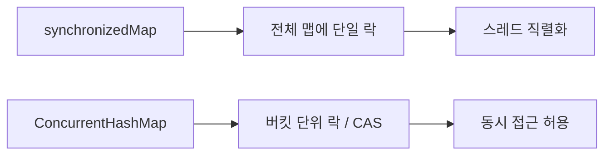
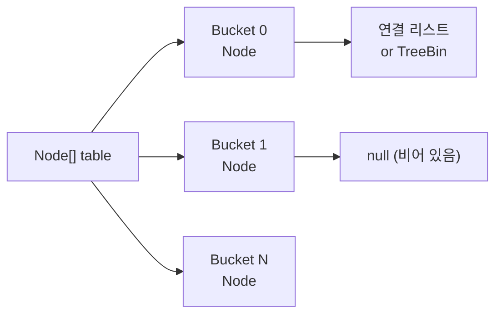
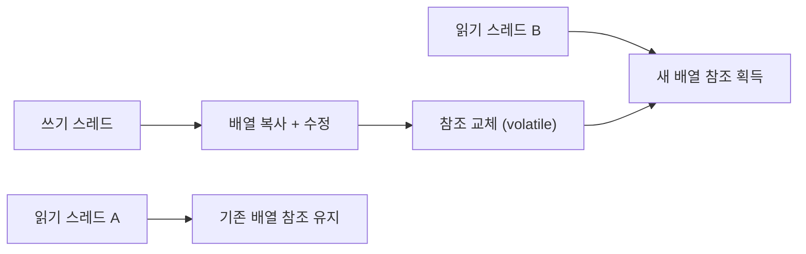
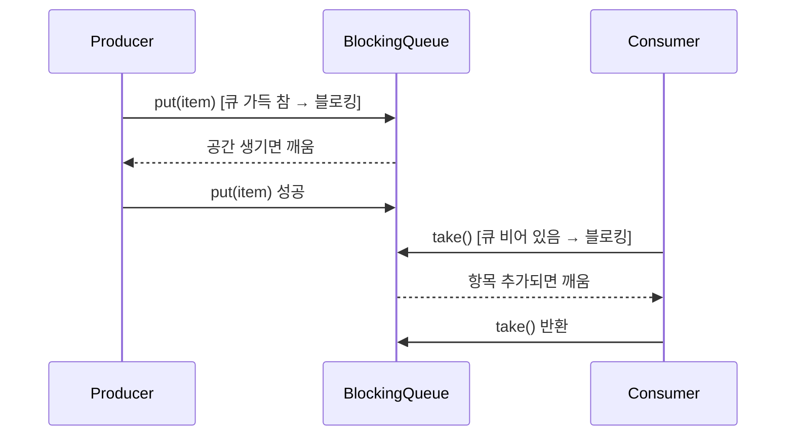
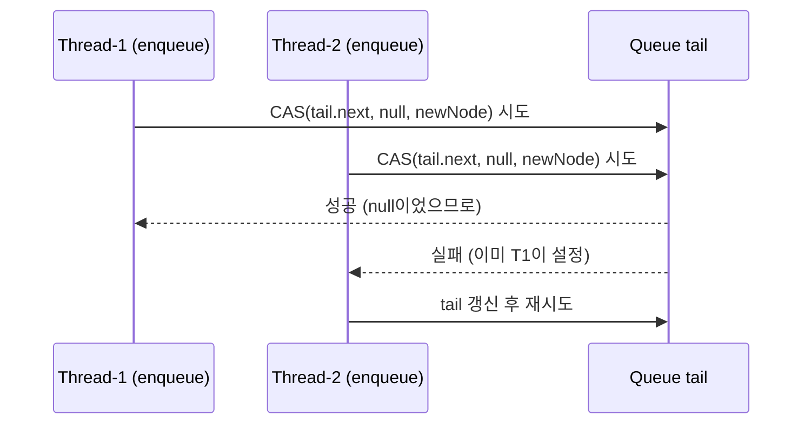
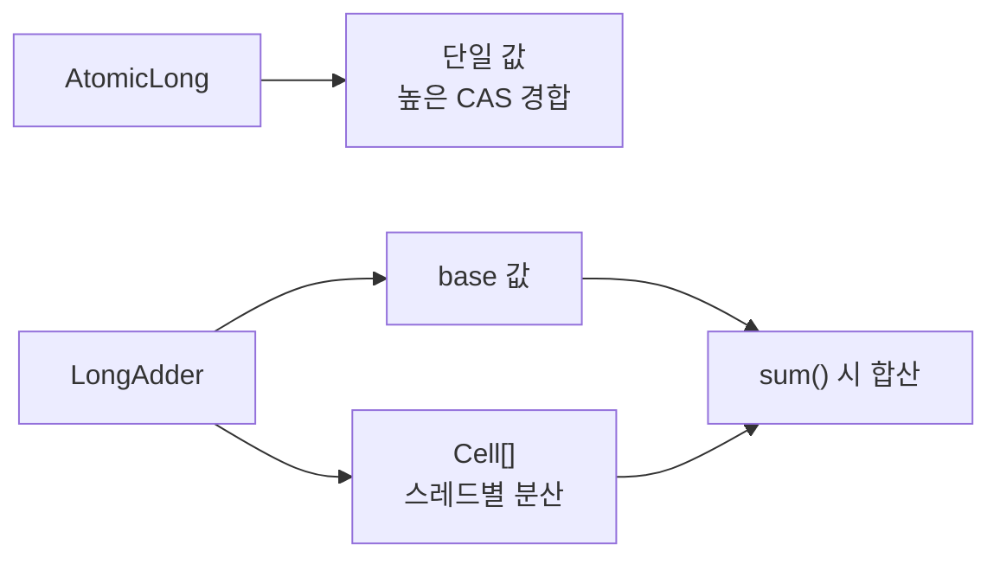
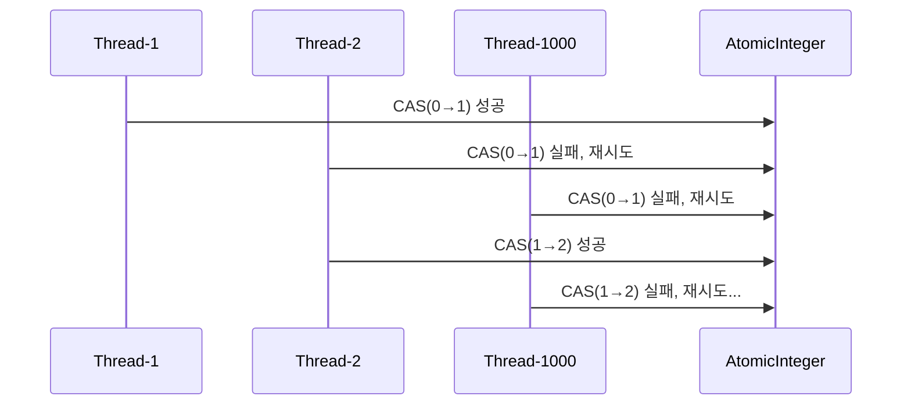
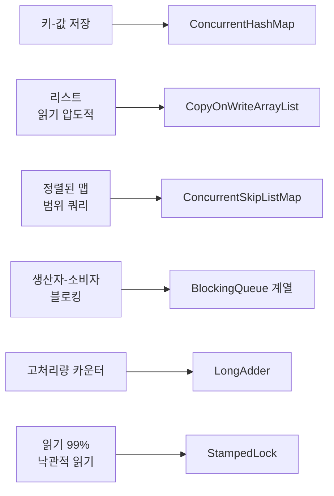

결제 서버에서 HashMap을 공유 캐시로 썼더니 트래픽이 몰린 순간 CPU가 100%로 치솟고 응답이 멈췄다. GC 로그에는 이상이 없었다. 원인은 Java 7 HashMap의 resize 과정에서 두 스레드가 동시에 버킷 포인터를 조작해 발생한 **순환 연결 리스트(Circular Linked List)** 였다. 무한 루프다.

> **한 줄 요약**: 동시성 자료구조는 "락을 어디에, 얼마나 작게 잡느냐"의 싸움이다. ConcurrentHashMap은 버킷 단위 락으로 HashMap 대비 10배 처리량을, BlockingQueue는 생산자-소비자 사이의 안전한 핸드오프를, Lock-Free 구조는 락 없이 CAS만으로 스레드 안전성을 달성한다.

대규모 트래픽 환경에서 시니어 리드 개발자가 반드시 알아야 하는 동시성 자료구조를 내부 구조부터 실무 패턴까지 완전히 정리합니다.

---

## 1. 실제 사고 — HashMap 멀티스레드 재앙

### Java 7 HashMap resize 무한 루프

Java 7 이하의 HashMap은 resize(재해싱) 시 연결 리스트를 **역순**으로 재연결합니다. 두 스레드가 동시에 resize에 진입하면 아래 상황이 발생합니다.

```
초기 상태: A → B → null

Thread-1: A의 next를 B로 저장 후 일시 중단
Thread-2: resize 완료 → 역순 재연결: B → A → null

Thread-1 재개: A의 next(B)를 처리 → B.next = A (이미 A가 B를 가리킴)
결과: A ↔ B 순환 참조 → get() 호출 시 무한 루프
```

Java 8에서 HashMap은 테일 삽입 방식으로 수정됐지만, **멀티스레드 환경에서는 여전히 데이터 유실과 NPE가 발생**합니다. HashMap은 설계 자체가 단일 스레드용입니다.

### synchronized Collections vs Concurrent Collections

"그냥 `Collections.synchronizedMap()` 쓰면 안 되나?"는 자주 나오는 질문입니다. 안전하긴 하지만 성능이 문제입니다.



| 비교 항목 | Collections.synchronizedMap | ConcurrentHashMap |
|-----------|----------------------------|-------------------|
| 락 범위 | 맵 전체 | 버킷(Node) 단위 |
| 읽기 성능 | 락 필요 | 락 불필요 (volatile 읽기) |
| 쓰기 성능 | 전체 직렬화 | 다른 버킷은 동시 진행 |
| null 키/값 | 허용 | 불허 |
| size() 정확도 | 정확 | 근사값 |
| 복합 연산 원자성 | 외부 동기화 필요 | computeIfAbsent 등 내장 |
| 권장 상황 | 레거시 호환 | 신규 멀티스레드 코드 |

JMH 벤치마크 기준 32코어 환경에서 `synchronizedMap`은 `ConcurrentHashMap` 대비 **약 1/10 처리량**입니다. 스레드가 많아질수록 격차는 더 벌어집니다.

---

## 2. ConcurrentHashMap

### Java 7: Segment 락 구조

Java 7 ConcurrentHashMap은 맵을 **16개의 Segment**로 분할합니다. 각 Segment는 독립적인 `ReentrantLock`을 보유합니다. 서로 다른 Segment에 접근하는 스레드는 동시에 쓸 수 있습니다.

```
ConcurrentHashMap (Java 7)
├── Segment[0]  (ReentrantLock) → HashEntry[]
├── Segment[1]  (ReentrantLock) → HashEntry[]
├── ...
└── Segment[15] (ReentrantLock) → HashEntry[]
```

기본 동시성 레벨(concurrencyLevel)이 16이므로 최대 16개 스레드가 동시에 쓸 수 있습니다. 단, 같은 Segment 내에서는 여전히 직렬화됩니다.

### Java 8+: CAS + synchronized per bucket

Java 8에서 Segment 구조를 완전히 폐기하고 **Node 배열 + CAS + synchronized**로 재설계했습니다.



**put() 동작 원리 (Java 8):**

1. 빈 버킷이면 CAS로 첫 Node를 삽입 (락 없음)
2. 버킷에 이미 Node가 있으면 해당 버킷의 헤드 Node에 `synchronized` 진입
3. 같은 키면 값 교체, 다른 키면 체인 끝에 추가
4. 체인 길이가 **8 이상** + 전체 테이블 크기 **64 이상**이면 Red-Black Tree(`TreeBin`)로 변환

```java
// 핵심 put 로직 (Java 8 OpenJDK 단순화 버전)
final V putVal(K key, V value, boolean onlyIfAbsent) {
    int hash = spread(key.hashCode());
    for (Node<K,V>[] tab = table;;) {
        Node<K,V> f; int n, i, fh;
        if (tab == null || (n = tab.length) == 0)
            tab = initTable();                          // CAS로 초기화
        else if ((f = tabAt(tab, i = (n-1) & hash)) == null) {
            if (casTabAt(tab, i, null, new Node<>(hash, key, value, null)))
                break;                                  // CAS 성공: 락 없이 삽입
        } else if ((fh = f.hash) == MOVED)
            tab = helpTransfer(tab, f);                 // resize 중: 도움
        else {
            synchronized (f) {                          // 버킷 헤드에만 락
                // 체인 탐색 후 삽입 or 교체
            }
        }
    }
    addCount(1L, binCount);
    return null;
}
```

**TreeBin(Red-Black Tree) 변환 조건:**

체인 길이 임계값(TREEIFY_THRESHOLD=8)은 확률 계산에서 나왔습니다. 해시가 균일하게 분포한다면 체인 길이가 8이 될 확률은 `0.00000006`(6e-8)입니다. 빈번히 발생한다면 해시 함수에 문제가 있는 것입니다.

```
체인 길이 별 탐색 비용:
- 연결 리스트: O(n) → 길이 8에서 최악 8번 비교
- Red-Black Tree: O(log n) → 길이 8에서 최악 3번 비교
```

### size()가 정확하지 않은 이유

Java 8 ConcurrentHashMap의 `size()`는 `baseCount`와 `CounterCell[]` 배열을 합산합니다.

```java
// 실제 합산 로직
final long sumCount() {
    CounterCell[] as = counterCells;
    long sum = baseCount;
    if (as != null) {
        for (CounterCell a : as)
            if (a != null) sum += a.value;
    }
    return sum;
}
```

CAS 경합이 심할 때 각 스레드는 자신의 `CounterCell`에 카운트를 분산 기록합니다. `size()`를 호출하는 시점에 다른 스레드가 동시에 put/remove 중이면 합산값이 그 순간의 정확한 수치가 아닐 수 있습니다. 정확한 카운트가 필요하다면 외부에서 별도 AtomicLong을 관리해야 합니다.

### 복합 연산 활용

```java
ConcurrentHashMap<String, List<String>> map = new ConcurrentHashMap<>();

// ❌ 잘못된 방법: get → null 체크 → put이 원자적이지 않음
if (!map.containsKey("key")) {
    map.put("key", new ArrayList<>());
}

// ✅ 올바른 방법: computeIfAbsent는 원자적
map.computeIfAbsent("key", k -> new ArrayList<>()).add("value");

// merge: 기존 값과 새 값을 결합
map.merge("counter", 1, Integer::sum);

// compute: 기존 값을 기반으로 업데이트
map.compute("score", (k, v) -> v == null ? 100 : v + 10);
```

**주의:** `computeIfAbsent`에 전달하는 람다 안에서 같은 맵의 다른 키를 수정하면 데드락이 발생할 수 있습니다. 람다는 최대한 단순하게 유지하세요.

---

## 3. CopyOnWriteArrayList / CopyOnWriteArraySet

### 쓰기 시 전체 배열 복사 — 왜 이렇게 설계했는가

`CopyOnWriteArrayList`는 쓰기 연산이 발생할 때마다 **내부 배열 전체를 복사**해 새 배열에 수정 후 참조를 교체합니다.

```java
// add() 내부 구조 (단순화)
public boolean add(E e) {
    synchronized (lock) {
        Object[] elements = getArray();
        int len = elements.length;
        Object[] newElements = Arrays.copyOf(elements, len + 1); // 전체 복사
        newElements[len] = e;
        setArray(newElements);  // volatile write → 즉시 가시성
        return true;
    }
}
```

읽기는 현재 배열 참조를 volatile로 읽기만 하므로 **락이 전혀 없습니다.** 이터레이터는 생성 시점의 배열 스냅샷을 보유하므로 이후 변경이 반영되지 않고, `ConcurrentModificationException`도 발생하지 않습니다.



### 읽기 무잠금, 쓰기 비용 O(n)

| 연산 | 비용 | 설명 |
|------|------|------|
| get() | O(1), 락 없음 | volatile 배열 참조 읽기 |
| iterator() | O(1), 락 없음 | 스냅샷 배열 참조 |
| add() | O(n), synchronized | 전체 복사 후 삽입 |
| remove() | O(n), synchronized | 전체 복사 후 삭제 |

### 적합한 상황

설정 캐시, 이벤트 리스너 목록처럼 **읽기 99%, 쓰기 1%** 패턴에 최적입니다.

```java
// 이벤트 리스너 관리: 등록은 드물게, 발행은 매우 자주
CopyOnWriteArrayList<EventListener> listeners = new CopyOnWriteArrayList<>();

// 리스너 등록 (드물게 발생)
listeners.add(new OrderListener());

// 이벤트 발행 (초당 수천 번, 락 없이 안전하게 반복)
for (EventListener listener : listeners) {  // 스냅샷 기반 반복
    listener.onEvent(event);
}
```

**주의:** 요소가 수만 개인 리스트에 쓰기가 빈번하면 GC 압력이 폭발합니다. 이 경우 `ConcurrentHashMap`을 Set처럼 사용하거나 `ReadWriteLock`으로 직접 구현하는 편이 낫습니다.

---

## 4. BlockingQueue 4종 완전 비교

### 생산자-소비자 패턴의 핵심

`BlockingQueue`는 큐가 가득 차면 생산자를 **블로킹**하고, 비어 있으면 소비자를 **블로킹**합니다. 직접 `wait()`/`notify()`로 구현하던 고전 패턴을 안전하고 간결하게 대체합니다.



### ArrayBlockingQueue: 고정 크기 + 공정 락

```java
// 생성 시 용량을 반드시 지정, 이후 변경 불가
BlockingQueue<Task> queue = new ArrayBlockingQueue<>(1000);

// fair=true: 대기 스레드 FIFO 순서 보장 (성능 대신 공정성)
BlockingQueue<Task> fairQueue = new ArrayBlockingQueue<>(1000, true);
```

내부적으로 `ReentrantLock` 하나와 `notFull`, `notEmpty` 두 개의 `Condition`을 사용합니다. put과 take가 **같은 락**을 공유하므로 동시에 하나만 진행됩니다. 메모리를 예측 가능하게 쓰는 대신 처리량이 제한됩니다.

### LinkedBlockingQueue: 분리 락으로 높은 처리량

```java
// 용량 미지정 시 Integer.MAX_VALUE (사실상 무제한 → 주의)
BlockingQueue<Task> queue = new LinkedBlockingQueue<>(10_000);
```

`LinkedBlockingQueue`의 핵심은 **put 락과 take 락이 분리**되어 있다는 점입니다.

```
putLock  → 꼬리(tail)에 노드 추가
takeLock → 머리(head)에서 노드 제거
```

생산자와 소비자가 **동시에 동작**할 수 있어 `ArrayBlockingQueue`보다 처리량이 높습니다. 다만 Node 객체를 매번 생성하므로 GC 부담이 있습니다.

### PriorityBlockingQueue: 우선순위 + 블로킹

```java
// Comparable 구현 또는 Comparator 제공 필수
BlockingQueue<Task> queue = new PriorityBlockingQueue<>(
    100,
    Comparator.comparingInt(Task::getPriority).reversed()
);

// take()는 가장 높은 우선순위 항목을 반환
Task highestPriority = queue.take();
```

내부 구조는 min-heap 기반 배열입니다. 삽입 O(log n), 꺼내기 O(log n). 용량 제한이 없어(자동 확장) 생산자가 절대 블로킹되지 않습니다. 큐가 비어 있을 때만 소비자가 블로킹됩니다.

**주의:** 우선순위가 같은 요소들 사이의 순서는 보장되지 않습니다. FIFO가 필요하면 순서 카운터를 추가해야 합니다.

### SynchronousQueue: 버퍼 없는 직접 핸드오프

`SynchronousQueue`는 내부에 아무것도 저장하지 않습니다. `put()`을 호출한 생산자는 소비자가 `take()`를 호출할 때까지 블로킹됩니다. 정확히 **1:1 직접 전달(핸드오프)**입니다.

```java
SynchronousQueue<Task> handoff = new SynchronousQueue<>();

// 생산자 스레드
handoff.put(task);  // 소비자가 받을 때까지 블로킹

// 소비자 스레드
Task t = handoff.take();  // 생산자가 줄 때까지 블로킹
```

`Executors.newCachedThreadPool()`이 내부적으로 `SynchronousQueue`를 사용합니다. 큐에 쌓이지 않고 바로 새 스레드를 생성하거나 유휴 스레드에 전달합니다.

### DelayQueue: 지연 실행 스케줄링

```java
class DelayedTask implements Delayed {
    private final long executeAt;

    @Override
    public long getDelay(TimeUnit unit) {
        return unit.convert(executeAt - System.nanoTime(), TimeUnit.NANOSECONDS);
    }

    @Override
    public int compareTo(Delayed other) {
        return Long.compare(this.executeAt, ((DelayedTask) other).executeAt);
    }
}

DelayQueue<DelayedTask> queue = new DelayQueue<>();
queue.put(new DelayedTask(5, TimeUnit.SECONDS));  // 5초 뒤 실행 가능
DelayedTask task = queue.take();  // 5초 후 반환
```

만료된 항목만 꺼낼 수 있습니다. 내부는 `PriorityQueue` 기반으로 만료 시간이 가장 임박한 항목이 앞에 옵니다. 세션 만료 처리, 재시도 큐에 활용됩니다.

### 4종 종합 비교 테이블

| 자료구조 | 용량 | 순서 | 락 방식 | 블로킹 조건 | 적합 상황 |
|---------|------|------|---------|-----------|-----------|
| ArrayBlockingQueue | 고정 | FIFO | 단일 락 | 가득 참 / 비어 있음 | 메모리 제한 필요 시 |
| LinkedBlockingQueue | 가변 (기본 무제한) | FIFO | 분리 락 (put/take) | 설정 용량 초과 / 비어 있음 | 높은 처리량 |
| PriorityBlockingQueue | 무제한 | 우선순위 | 단일 락 | 비어 있음만 | 작업 우선순위 필요 시 |
| SynchronousQueue | 0 (버퍼 없음) | N/A | CAS / 전송 | 항상 (파트너 대기) | 직접 핸드오프, cachedThreadPool |
| DelayQueue | 무제한 | 만료 시간 | 단일 락 | 만료 항목 없음 | 지연 실행, 세션 만료 |

---

## 5. ConcurrentLinkedQueue — Lock-Free 알고리즘

### Michael & Scott 알고리즘

`ConcurrentLinkedQueue`는 `Michael & Scott(1996)` 알고리즘을 구현한 **Lock-Free** 큐입니다. 락 없이 CAS(Compare-And-Swap)만으로 스레드 안전성을 달성합니다.



```java
// enqueue 핵심 로직 (단순화)
public boolean offer(E e) {
    final Node<E> newNode = new Node<E>(e);
    for (Node<E> t = tail, p = t;;) {
        Node<E> q = p.next;
        if (q == null) {
            // p가 마지막 노드: CAS로 newNode 연결
            if (p.casNext(null, newNode)) {
                if (p != t) casTail(t, newNode);  // tail 갱신 시도
                return true;
            }
            // CAS 실패: 다른 스레드가 먼저 삽입 → 재시도
        } else if (p == q) {
            // 자기 참조 노드: 큐가 비어 있거나 GC됨
            p = (t != (t = tail)) ? t : head;
        } else {
            p = (p != t && t != (t = tail)) ? t : q;
        }
    }
}
```

### ABA 문제와 해결

CAS의 치명적 취약점은 **ABA 문제**입니다.

```
초기 상태: head → A → B → C

Thread-1: head를 A에서 C로 변경하려고 CAS 준비
          (old=A, new=C)

Thread-2: A를 제거 → head는 B
Thread-3: 새로운 A'(같은 주소 재활용)를 head에 삽입

Thread-1: CAS 실행 → head가 여전히 A처럼 보임 → 성공
          but 실제로는 A'→C로 연결 (B를 건너뜀) → 데이터 손실!
```

Java의 `ConcurrentLinkedQueue`는 노드를 재활용하지 않고 GC에 위임해 ABA 문제를 회피합니다. 명시적으로 해결하려면 `AtomicStampedReference`를 사용합니다.

```java
// 버전(stamp)을 함께 관리해 ABA 방지
AtomicStampedReference<Node> head = new AtomicStampedReference<>(initialNode, 0);

int[] stampHolder = new int[1];
Node current = head.get(stampHolder);
int currentStamp = stampHolder[0];

// old값과 stamp가 모두 일치할 때만 성공
head.compareAndSet(current, newNode, currentStamp, currentStamp + 1);
```

---

## 6. ConcurrentSkipListMap — 동시성 정렬 맵

### Skip List 내부 구조

`ConcurrentSkipListMap`은 **Skip List(스킵 리스트)** 자료구조 위에 구현된 동시성 정렬 맵입니다. 왜 `TreeMap`의 Red-Black Tree가 아닌 Skip List를 선택했을까요?

Red-Black Tree의 삽입/삭제는 **트리 회전(rotation)과 재색칠(recoloring)** 이 필요합니다. 여러 포인터를 원자적으로 수정해야 하므로 동시성 환경에서 구현이 매우 복잡합니다.

Skip List는 계층적 연결 리스트로 구성되며, 각 노드의 레벨은 확률적으로 결정됩니다(기본 50% 확률로 상위 레벨에 포함).

```
Level 3: head ──────────────────────── 50 ──── tail
Level 2: head ──────── 20 ──────────── 50 ──── tail
Level 1: head ── 10 ── 20 ── 30 ── 40 ── 50 ── tail
```

삽입 시 단일 노드의 `next` 포인터만 CAS로 수정하면 되므로 동시성 구현이 훨씬 단순합니다.

```java
// 정렬된 동시성 맵이 필요할 때
ConcurrentSkipListMap<Long, Order> orderBook = new ConcurrentSkipListMap<>();
orderBook.put(timestamp, order);

// 범위 쿼리: 특정 시간 범위의 주문 조회 (스냅샷 뷰, 동시 수정 안전)
NavigableMap<Long, Order> recent = orderBook.subMap(
    System.currentTimeMillis() - 60_000L, true,  // 1분 전부터
    System.currentTimeMillis(), true               // 현재까지
);
```

`subMap()`, `headMap()`, `tailMap()`이 반환하는 뷰는 원본 맵의 **라이브 뷰(live view)**입니다. 뷰를 통한 연산도 완전히 스레드 안전합니다.

| 비교 항목 | TreeMap | ConcurrentSkipListMap |
|-----------|---------|----------------------|
| 동시성 | 비안전 | 안전 (Lock-Free) |
| 삽입/조회 | O(log n) | O(log n) 기댓값 |
| 정렬 | 보장 | 보장 |
| null 키 | 불허 (기본 Comparator) | 불허 |
| 범위 쿼리 | 가능 | 가능 (동시 수정 안전) |
| 메모리 | 낮음 | 높음 (레벨별 포인터) |

---

## 7. StampedLock — 낙관적 읽기의 진화

### ReadWriteLock의 한계

`ReadWriteLock`은 읽기 스레드가 많을 때 쓰기 스레드가 무한정 대기하는 **쓰기 기아(Writer Starvation)** 가 발생할 수 있습니다. 또한 읽기 락도 실제로 락을 획득하므로 CAS 비용이 발생합니다.

### StampedLock 3가지 모드

```java
StampedLock lock = new StampedLock();
double x, y;  // 공유 상태

// 1. 낙관적 읽기 (락 없이 시도)
double distanceFromOrigin() {
    long stamp = lock.tryOptimisticRead();  // 락 획득 없이 스탬프만 발급
    double currentX = x;
    double currentY = y;

    if (!lock.validate(stamp)) {  // 읽는 사이에 쓰기가 있었는가?
        stamp = lock.readLock();  // 실패 시 정식 읽기 락으로 폴백
        try {
            currentX = x;
            currentY = y;
        } finally {
            lock.unlockRead(stamp);
        }
    }
    return Math.sqrt(currentX * currentX + currentY * currentY);
}

// 2. 정식 읽기 락
void readWithLock() {
    long stamp = lock.readLock();
    try {
        // 읽기 작업
    } finally {
        lock.unlockRead(stamp);
    }
}

// 3. 쓰기 락
void move(double deltaX, double deltaY) {
    long stamp = lock.writeLock();
    try {
        x += deltaX;
        y += deltaY;
    } finally {
        lock.unlockWrite(stamp);
    }
}
```

`tryOptimisticRead()`는 락을 획득하지 않고 **버전 스탬프**만 발급합니다. `validate(stamp)`는 스탬프 발급 이후 쓰기가 발생했는지 확인합니다. 읽기 작업 대부분이 쓰기 없이 성공하는 상황에서 **락 획득 비용을 완전히 제거**할 수 있습니다.

**주의사항:**
- `StampedLock`은 재진입(reentrant)을 지원하지 않습니다. 같은 스레드가 중첩으로 락을 획득하면 데드락입니다.
- 조건 변수(Condition)를 지원하지 않습니다.
- 낙관적 읽기 구간에서 읽은 데이터는 반드시 `validate()` 전에 지역 변수에 복사해야 합니다.

---

## 8. Atomic 클래스 — CAS의 모든 것

### CAS(Compare-And-Swap) 동작 원리

CAS는 CPU가 하드웨어 수준에서 지원하는 **원자적 명령어**입니다. `x86`의 `CMPXCHG`, ARM의 `LDREX/STREX`가 그 구현입니다.

```
CAS(메모리 주소, 기대값, 새 값):
  현재 값 == 기대값이면 → 새 값으로 교체 후 성공 반환
  현재 값 != 기대값이면 → 아무것도 하지 않고 실패 반환
```

```java
AtomicInteger counter = new AtomicInteger(0);

// incrementAndGet() 내부 동작
public final int incrementAndGet() {
    return unsafe.getAndAddInt(this, valueOffset, 1) + 1;
    // x86: LOCK XADD 명령어 (원자적 페치 후 증가)
}

// compareAndSet 직접 사용: lock-free 링크드 리스트 등
AtomicReference<Node> head = new AtomicReference<>(null);
Node newHead = new Node(value, head.get());
while (!head.compareAndSet(newHead.next, newHead)) {
    newHead.next = head.get();  // 실패 시 현재값 갱신 후 재시도
}
```

### LongAdder가 AtomicLong보다 빠른 이유



경합이 심할 때 `LongAdder`는 스레드를 서로 다른 `Cell`에 분산시킵니다. 각 스레드는 자신의 Cell에만 CAS를 수행하므로 충돌이 극적으로 줄어듭니다. `sum()`을 호출할 때 모든 Cell과 base를 합산합니다.

```java
LongAdder hitCount = new LongAdder();

// 쓰기: 매우 빠름 (분산 Cell에 기록)
hitCount.increment();

// 읽기: 합산 필요 (순간적 부정확성 가능)
long total = hitCount.sum();

// vs AtomicLong: 쓰기에서 경합, 읽기는 정확
AtomicLong atomicCount = new AtomicLong();
atomicCount.incrementAndGet();
long exact = atomicCount.get();  // 항상 정확
```

**선택 기준:** 카운터 값의 정확한 순간 스냅샷이 중요하면 `AtomicLong`, 처리량이 중요하고 최종 합산만 필요하면 `LongAdder`.

### VarHandle (Java 9+)

`VarHandle`은 `Unsafe`의 공식 후계자입니다. 리플렉션 없이 필드에 대한 원자적 연산을 제공합니다.

```java
class Node<V> {
    volatile Node<V> next;
    V value;

    // 클래스 로딩 시 VarHandle 획득
    private static final VarHandle NEXT;
    static {
        try {
            NEXT = MethodHandles.lookup()
                .findVarHandle(Node.class, "next", Node.class);
        } catch (ReflectiveOperationException e) {
            throw new ExceptionInInitializerError(e);
        }
    }

    // CAS로 next 필드 원자적 교체
    boolean casNext(Node<V> expected, Node<V> update) {
        return NEXT.compareAndSet(this, expected, update);
    }
}
```

---

## 9. 극한 시나리오 3가지

### 시나리오 1: ConcurrentHashMap resize 중 성능 저하

**상황:** 초기 용량 16으로 생성한 맵에 1,000만 건을 연속 삽입 중 갑자기 응답 지연 발생.

**원인:** resize(재해싱)는 새 배열로 기존 버킷을 이전(transfer)하는 과정입니다. 이전 중인 버킷은 `ForwardingNode`(hash=-1)로 표시되고, 이 버킷에 접근하는 스레드는 이전 작업을 **도와줍니다(helpTransfer)**. 모든 스레드가 이전 작업에 참여하면 실제 삽입이 지연됩니다.

**해결:** 예상 크기를 `initialCapacity = (expectedSize / loadFactor) + 1`로 계산해 초기 용량을 충분히 설정합니다.

```java
// 100만 건 예상, loadFactor 0.75 기본값
int expectedSize = 1_000_000;
ConcurrentHashMap<K, V> map = new ConcurrentHashMap<>(
    (int)(expectedSize / 0.75) + 1  // 약 1,333,334
);
```

### 시나리오 2: LinkedBlockingQueue 용량 미설정 → OOM

**상황:** `new LinkedBlockingQueue<>()`로 생성 후 소비자가 생산자를 따라가지 못하는 상황이 발생. 메모리 사용량이 수 GB로 치솟고 OOM 발생.

**원인:** 기본 용량이 `Integer.MAX_VALUE`(21억)이므로 생산자는 절대 블로킹되지 않고 계속 삽입합니다.

**해결:** 항상 명시적 용량을 설정하고, 거부 정책(RejectedExecutionHandler)을 정의합니다.

```java
// ❌ 위험: 무제한 큐
new LinkedBlockingQueue<>()

// ✅ 안전: 명시적 용량 + 거부 정책
BlockingQueue<Runnable> queue = new LinkedBlockingQueue<>(10_000);
ThreadPoolExecutor executor = new ThreadPoolExecutor(
    8, 16, 60L, TimeUnit.SECONDS,
    queue,
    new ThreadPoolExecutor.CallerRunsPolicy()  // 가득 차면 호출 스레드가 직접 실행
);
```

### 시나리오 3: CAS 충돌 폭풍 (Thundering Herd)

**상황:** 1,000개 스레드가 동시에 `AtomicInteger.incrementAndGet()`을 호출. CPU 사용률은 100%인데 실제 처리량이 낮음.

**원인:** CAS 실패 시 스핀 재시도(spin-retry)가 발생합니다. 경합이 심할수록 재시도 횟수가 폭증하고 CPU 자원을 소모합니다.



**해결:** `LongAdder`로 교체합니다. 경합을 Cell 배열로 분산시켜 충돌 자체를 줄입니다.

---

## 10. 면접 포인트 5개

### 면접 포인트 1️⃣ — ConcurrentHashMap의 null 미허용 이유

`HashMap`은 null 키/값을 허용하지만 `ConcurrentHashMap`은 허용하지 않습니다. 멀티스레드 환경에서 `get(key)`가 null을 반환할 때 "키가 없는 것인가, 값이 null인 것인가"를 구분할 수 없습니다. 확인-행동 사이에 다른 스레드가 개입할 수 있기 때문입니다. Doug Lea(설계자)는 "동시성 맵에서 null은 명확성을 해친다"고 설명했습니다.

### 면접 포인트 2️⃣ — computeIfAbsent의 람다 주의사항

`computeIfAbsent` 실행 중 버킷에 `synchronized` 락이 잡혀 있습니다. 람다 안에서 같은 `ConcurrentHashMap`의 다른 키에 대해 `computeIfAbsent`를 호출하면 데드락이 발생할 수 있습니다(Java 8에서 실제로 무한루프 버그가 존재했고 Java 9에서 수정됨). 람다는 단순 객체 생성만 하는 것이 원칙입니다.

### 면접 포인트 3️⃣ — CopyOnWriteArrayList 이터레이터의 일관성

`CopyOnWriteArrayList`의 이터레이터는 생성 시점의 배열 스냅샷을 봅니다. 이터레이션 도중 다른 스레드가 요소를 추가하거나 제거해도 이터레이터는 영향받지 않고 `ConcurrentModificationException`도 발생하지 않습니다. 단, 이터레이터를 통한 `remove()`는 `UnsupportedOperationException`을 던집니다.

### 면접 포인트 4️⃣ — BlockingQueue vs ConcurrentLinkedQueue

`BlockingQueue`는 큐가 비어 있을 때 소비자를 **블로킹**합니다. `ConcurrentLinkedQueue`는 블로킹하지 않고 null을 반환합니다. 생산자-소비자 패턴처럼 소비자가 항목이 생길 때까지 기다려야 한다면 `BlockingQueue`가 적합합니다. 폴링(polling) 방식이나 이미 항목이 있음을 보장하는 상황이라면 `ConcurrentLinkedQueue`의 Lock-Free 특성이 더 높은 처리량을 줍니다.

### 면접 포인트 5️⃣ — StampedLock은 재진입 불가

`ReentrantLock`은 이름처럼 같은 스레드가 여러 번 락을 획득할 수 있습니다. `StampedLock`은 재진입을 지원하지 않으며, 중첩 획득 시 데드락이 발생합니다. 또한 `StampedLock`은 인터럽트를 통한 락 해제를 지원하지 않으므로 `readLockInterruptibly()`, `writeLockInterruptibly()`를 명시적으로 사용해야 합니다.

---

## 11. 실무 실수 Top 5

### 실수 1: HashMap을 멀티스레드에서 직접 사용

트래픽 급증 시 HashMap resize가 무한 루프를 일으킬 수 있습니다. 심지어 Java 8 이후에도 데이터 유실과 NPE가 발생합니다. `ConcurrentHashMap`으로 교체하세요.

### 실수 2: size()의 정확도 오해

```java
ConcurrentHashMap<K, V> map = new ConcurrentHashMap<>();
// 다른 스레드가 동시에 put/remove 중
int size = map.size();  // 이 값을 "정확한 현재 크기"로 믿으면 안 됨
if (size == 0) {
    // 실제로는 0이 아닐 수 있음
}
```

정확한 크기 확인이 필요하다면 별도의 `AtomicInteger` 카운터를 유지하거나, `isEmpty()`(내부적으로 최적화됨)를 사용하세요.

### 실수 3: CopyOnWriteArrayList에 대량 쓰기

리스너가 10만 개인 `CopyOnWriteArrayList`에 초당 100회 추가가 발생하면 초당 10만 개 요소 배열을 100번 복사합니다. GC가 감당하지 못하고 OOM이 발생합니다. 읽기 비중이 낮다면 `ConcurrentHashMap` 또는 `ReadWriteLock` 기반 구조로 교체하세요.

### 실수 4: BlockingQueue 용량 미설정

```java
// ❌ 매우 위험: Integer.MAX_VALUE 용량
ExecutorService executor = new ThreadPoolExecutor(
    4, 4, 0L, TimeUnit.MILLISECONDS,
    new LinkedBlockingQueue<>()  // 무제한
);
```

소비자가 생산자를 따라가지 못하면 메모리가 고갈됩니다. 항상 명시적 용량을 설정하고 거부 정책을 정의하세요.

### 실수 5: 복합 연산을 개별 원자 연산으로 분해

```java
ConcurrentHashMap<String, Integer> scores = new ConcurrentHashMap<>();

// ❌ 틀린 방법: 두 연산 사이에 다른 스레드가 개입 가능
Integer current = scores.get("player1");
scores.put("player1", current == null ? 1 : current + 1);

// ✅ 올바른 방법: 단일 원자 연산
scores.merge("player1", 1, Integer::sum);
```

`get` 후 `put`은 원자적이지 않습니다. 항상 `compute`, `merge`, `computeIfAbsent`를 사용하세요.

---

## 12. 종합 비교 테이블

| 자료구조 | 읽기 성능 | 쓰기 성능 | 락 방식 | 정렬 | null 허용 | 적합 상황 |
|---------|---------|---------|--------|------|---------|---------|
| ConcurrentHashMap | 매우 높음 (무락) | 높음 (버킷 락/CAS) | 버킷 단위 | X | 불허 | 범용 동시성 맵 |
| CopyOnWriteArrayList | 매우 높음 (무락) | 매우 낮음 O(n) | 쓰기 시 전체 락 | 삽입 순서 | 허용 | 읽기 압도적, 리스너 목록 |
| ConcurrentSkipListMap | 높음 | 높음 (CAS) | Lock-Free | 정렬 보장 | 불허 | 정렬된 동시성 맵, 범위 쿼리 |
| ConcurrentLinkedQueue | 높음 | 높음 (CAS) | Lock-Free | FIFO | 불허 | 비블로킹 큐, 폴링 패턴 |
| ArrayBlockingQueue | 중간 | 중간 | 단일 락 | FIFO | 불허 | 고정 크기 생산자-소비자 |
| LinkedBlockingQueue | 중간-높음 | 중간-높음 | 분리 락 | FIFO | 불허 | 유연한 생산자-소비자 |
| PriorityBlockingQueue | 중간 | 중간 | 단일 락 | 우선순위 | 불허 | 우선순위 기반 처리 |
| SynchronousQueue | N/A | N/A | CAS/Transfer | N/A | 불허 | 직접 핸드오프, cachedPool |
| AtomicLong | 매우 높음 | 높음 (CAS) | Lock-Free | N/A | N/A | 정확한 카운터, 순서 보장 |
| LongAdder | 높음 | 매우 높음 (분산) | Lock-Free | N/A | N/A | 고처리량 카운터, 통계 집계 |
| StampedLock | 매우 높음 (낙관) | 높음 | 낙관적/비관적 | N/A | N/A | 읽기 빈번, 쓰기 희소 |

---

## 13. 선택 가이드

상황별 최적 선택을 정리합니다.



동시성 자료구조의 선택은 "읽기와 쓰기의 비율", "블로킹 허용 여부", "정렬/순서 필요 여부" 세 가지 축으로 결정됩니다. 가장 흔한 실수는 `HashMap`을 그대로 두거나 `synchronizedMap`으로 감싸는 것입니다. `ConcurrentHashMap`은 거의 모든 범용 케이스에서 최선의 선택이며, 특수한 요구사항이 있을 때만 다른 자료구조를 검토하면 됩니다.

---

## 14. 실무 패턴 — 코드로 보는 조합 사례

### 패턴 1: 멀티스레드 안전 캐시 (ConcurrentHashMap + computeIfAbsent)

서비스 레이어에서 DB 조회 결과를 캐싱할 때 가장 흔히 사용하는 패턴입니다.

```java
public class UserCache {
    private final ConcurrentHashMap<Long, User> cache = new ConcurrentHashMap<>();
    private final UserRepository repository;

    public User get(Long userId) {
        // 없을 때만 DB 조회, 전체 과정이 원자적
        return cache.computeIfAbsent(userId, id -> repository.findById(id)
            .orElseThrow(() -> new EntityNotFoundException("userId=" + id)));
    }

    public void invalidate(Long userId) {
        cache.remove(userId);
    }

    // 만료 처리: ScheduledExecutorService로 주기적 실행
    public void evictAll() {
        cache.clear();
    }
}
```

### 패턴 2: 고성능 생산자-소비자 파이프라인

이벤트 수집 → 비동기 처리 파이프라인에서 `LinkedBlockingQueue`와 스레드 풀을 조합합니다.

```java
public class EventPipeline {
    private final BlockingQueue<Event> queue = new LinkedBlockingQueue<>(50_000);
    private final ExecutorService consumers = Executors.newFixedThreadPool(8);
    private volatile boolean running = true;

    public void start() {
        for (int i = 0; i < 8; i++) {
            consumers.submit(() -> {
                while (running || !queue.isEmpty()) {
                    try {
                        // 100ms 타임아웃: shutdown 신호 감지 가능
                        Event event = queue.poll(100, TimeUnit.MILLISECONDS);
                        if (event != null) process(event);
                    } catch (InterruptedException e) {
                        Thread.currentThread().interrupt();
                        break;
                    }
                }
            });
        }
    }

    public boolean publish(Event event) {
        // 블로킹 없이 시도, 가득 찼으면 false 반환 (배압 신호)
        return queue.offer(event);
    }

    public void shutdown() {
        running = false;
        consumers.shutdown();
    }
}
```

### 패턴 3: AtomicReference를 이용한 Lock-Free 설정 교체

설정 객체 전체를 원자적으로 교체하는 패턴입니다. 읽기가 매우 빈번하고 쓰기(설정 갱신)가 드문 상황에 적합합니다.

```java
public class ConfigHolder {
    // 불변 설정 객체를 원자적으로 교체
    private final AtomicReference<AppConfig> config;

    public ConfigHolder(AppConfig initial) {
        this.config = new AtomicReference<>(initial);
    }

    // 락 없이 현재 설정 읽기 (매우 빠름)
    public AppConfig get() {
        return config.get();
    }

    // 설정 전체 교체 (드물게 발생)
    public void reload(AppConfig newConfig) {
        config.set(newConfig);  // volatile write → 즉시 모든 스레드에 가시
    }

    // CAS 기반 조건부 교체: 예상한 설정과 현재가 같을 때만 교체
    public boolean updateIfUnchanged(AppConfig expected, AppConfig updated) {
        return config.compareAndSet(expected, updated);
    }
}
```

**핵심 원칙**: `AppConfig`는 반드시 **불변 객체(Immutable)**여야 합니다. 참조만 교체하므로 교체 이전에 참조를 얻은 스레드는 기존 설정을 계속 안전하게 사용합니다.

---

동시성 자료구조는 잘못 쓰면 데이터 손실, 무한 루프, OOM, 데드락으로 이어집니다. "스레드 안전하다"는 말이 "모든 상황에서 정확하다"를 의미하지 않는다는 점을 항상 기억하세요. `size()`의 근사값, `computeIfAbsent` 람다의 제약, `LinkedBlockingQueue`의 기본 무제한 용량 — 이 세 가지만 체득해도 동시성 관련 장애의 절반은 예방할 수 있습니다.
