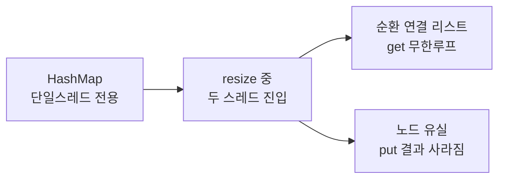
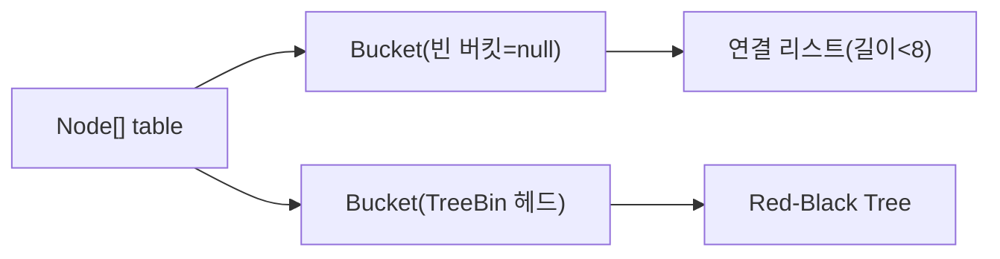
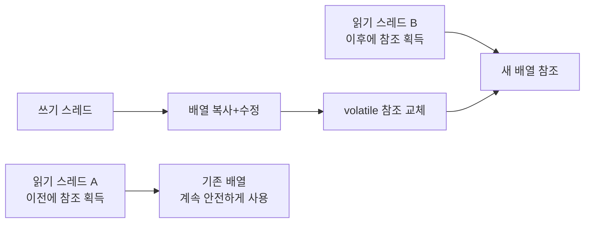
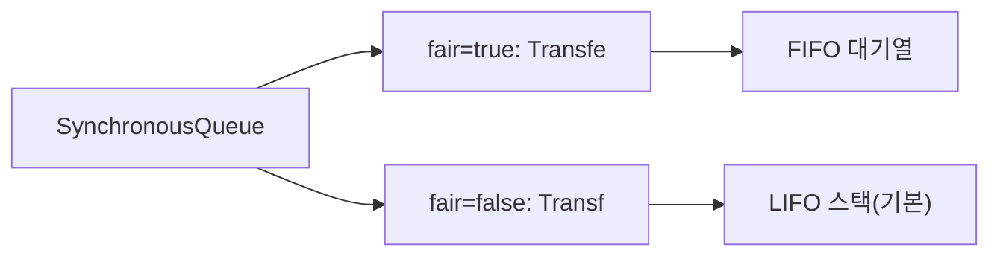
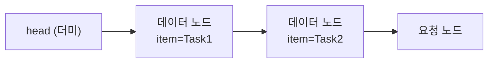
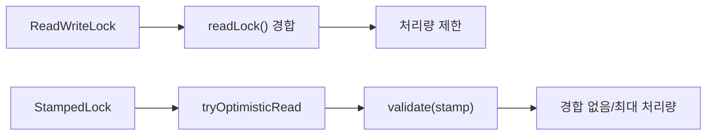
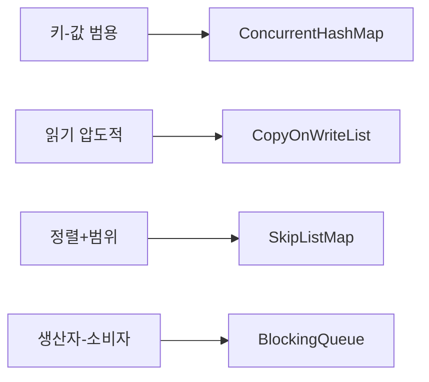

결제 서버에서 `HashMap`을 공유 캐시로 사용했다. 트래픽이 몰린 순간 CPU가 100%에 박히고 모든 응답이 멈췄다. GC 로그에는 이상이 없었다. 원인은 Java 7 `HashMap`의 `resize()` 과정에서 두 스레드가 동시에 버킷 포인터를 조작해 형성된 **순환 연결 리스트** 였다. `get()`이 무한 루프에 빠진 것이다. 개발자는 "단지 캐시로만 썼을 뿐"이라고 했다.

> **핵심 요약**: 동시성 자료구조는 "락을 어디에, 얼마나 작게 잡느냐"의 싸움이다. `ConcurrentHashMap`은 버킷 단위 CAS+`synchronized`로 전역 락을 버렸고, `ConcurrentLinkedQueue`는 Michael-Scott 알고리즘으로 락 자체를 없앴으며, `BlockingQueue` 계열은 생산자-소비자 간 안전한 핸드오프를 조건 변수로 구현한다. 어떤 구조를 왜 선택하는지 내부 메커니즘 수준으로 설명할 수 있어야 시니어다.

---

## 1. HashMap 멀티스레드 재앙 — 무엇이 왜 터지는가

### Java 7 resize 무한 루프의 물리적 원인

Java 7 `HashMap`의 `resize()` 중 연결 리스트 재연결 코드는 **역순 삽입** 방식이었다. 두 스레드가 동시에 `resize()`에 진입하면 다음 일이 벌어진다.

```java
// Java 7 HashMap transfer() — 단순화 재현
void transfer(Entry[] newTable) {
    Entry[] src = table;
    for (int j = 0; j < src.length; j++) {
        Entry e = src[j];
        while (e != null) {
            Entry next = e.next;          // (1) next 저장
            int i = indexFor(e.hash, newTable.length);
            e.next = newTable[i];         // (2) 역순 삽입: 기존 헤드가 e의 next
            newTable[i] = e;              // (3) 헤드 교체
            e = next;                     // (4) 다음 순회
        }
    }
}
```

```
초기: A → B → null  (같은 버킷)

Thread-1: (1) next = B 저장 후 일시 중단 (스케줄러에 의해)
Thread-2: resize 완료 → 역순 삽입 → B → A → null

Thread-1 재개:
  (2) A.next = newTable[i] = B  → A → B
  (3) newTable[i] = A           → head = A → B
  (4) e = next = B, 다음 반복
  (2) B.next = newTable[i] = A  → B → A  ← 여기서 순환!
  (3) newTable[i] = B           → head = B → A → B → A → ...
```

Java 8은 테일 삽입으로 수정해 순환 참조는 없애졌지만, **두 스레드가 동시에 같은 버킷에 쓰면 한쪽 삽입이 소실**된다. `get()` 중에 `resize()`가 일어나도 `null` 반환이나 잘못된 값 반환이 가능하다. HashMap은 태생적으로 단일 스레드 전용이다.



### synchronizedMap vs ConcurrentHashMap — 왜 10배 차이인가

`Collections.synchronizedMap()`은 모든 메서드 앞에 `synchronized(mutex)`를 붙인다. 뮤텍스는 맵 객체 자체다. 32코어 서버에서 32개 스레드가 동시에 서로 다른 키에 접근해도 **전부 직렬화**된다.

```java
// synchronizedMap 내부 — 모든 연산이 같은 뮤텍스
public V get(Object key) {
    synchronized (mutex) { return m.get(key); }
}
public V put(K key, V value) {
    synchronized (mutex) { return m.put(key, value); }
}
```

`ConcurrentHashMap`은 읽기에 락이 없고, 쓰기는 해당 버킷 하나에만 락을 잡는다. 32코어 환경에서 서로 다른 버킷에 접근하는 32개 스레드는 완전히 동시에 실행된다.

| 항목 | synchronizedMap | ConcurrentHashMap |
|------|-----------------|-------------------|
| 읽기 | 전역 락 필요 | volatile 읽기만 (락 없음) |
| 쓰기 | 전역 락 | 버킷 헤드 Node에만 synchronized |
| 동시 접근 스레드 수 | 1 | 버킷 수만큼 (기본 16→증가) |
| null 키/값 | 허용 | 불허 (설계 의도) |
| 복합 연산 원자성 | 외부 동기화 필요 | compute/merge 내장 |
| 32코어 처리량 비율 | 1x | 약 10~15x |

---

## 2. ConcurrentHashMap — CAS + synchronized per-node 완전 해부

### Java 7 Segment 구조의 한계

Java 7은 맵을 `Segment` 배열로 분할했다. 각 `Segment`는 독립 `ReentrantLock`을 가졌고, 기본 동시성 레벨은 16이었다.

```
Java 7 ConcurrentHashMap:
├── Segment[0]  (ReentrantLock) → HashEntry[]
├── Segment[1]  (ReentrantLock) → HashEntry[]
│   ...
└── Segment[15] (ReentrantLock) → HashEntry[]
```

문제는 `Segment` 수가 생성 시점에 고정된다는 점이었다. 동시성 레벨을 16으로 생성하면 최대 16개 스레드만 동시에 쓸 수 있다. 64코어 서버에서도 16개 이상은 대기한다.

### Java 8 재설계 — Node 배열 + CAS + synchronized

Java 8에서 `Segment`를 완전히 폐기하고 `Node<K,V>[] table` 배열 + CAS + `synchronized` 조합으로 전면 재설계했다.



**put() 완전 분석:**

```java
// Java 8 ConcurrentHashMap.putVal() — 핵심 경로 단순화
final V putVal(K key, V value, boolean onlyIfAbsent) {
    if (key == null || value == null) throw new NullPointerException();
    int hash = spread(key.hashCode());  // 상위 비트 XOR 하위 비트로 균등 분포

    for (Node<K,V>[] tab = table;;) {
        Node<K,V> f; int n, i, fh;

        // 경로 1: 테이블 미초기화 → CAS 기반 lazy init
        if (tab == null || (n = tab.length) == 0)
            tab = initTable();

        // 경로 2: 빈 버킷 → CAS 원자적 삽입 (락 없음)
        else if ((f = tabAt(tab, i = (n - 1) & hash)) == null) {
            if (casTabAt(tab, i, null, new Node<>(hash, key, value, null)))
                break;  // 성공: 락 획득 없이 삽입 완료
            // 실패: 다른 스레드가 먼저 삽입 → 루프 재시도
        }

        // 경로 3: resize 진행 중 → 이 스레드도 이전 작업에 참여
        else if ((fh = f.hash) == MOVED)
            tab = helpTransfer(tab, f);

        // 경로 4: 버킷에 노드 존재 → 버킷 헤드에만 synchronized
        else {
            V oldVal = null;
            synchronized (f) {           // 오직 이 버킷의 헤드 노드만 락
                if (tabAt(tab, i) == f) {  // 락 획득 후 재검증 (다른 스레드가 바꿨을 수 있음)
                    if (fh >= 0) {         // 일반 연결 리스트
                        // 체인 탐색: 같은 키면 교체, 없으면 꼬리에 추가
                    } else if (f instanceof TreeBin) {
                        // Red-Black Tree 삽입
                    }
                }
            }
            // 체인 길이 임계값 초과 시 treeifyBin() 호출
        }
    }
    addCount(1L, binCount);  // CounterCell 기반 크기 갱신
    return null;
}
```

**핵심 포인트:** `synchronized (f)`는 버킷 헤드 Node 객체 하나만 락을 잡는다. Bucket 0의 락이 잡혀 있어도 Bucket 1에 접근하는 스레드는 전혀 대기하지 않는다.

### TreeBin 변환 조건의 수학적 근거

체인이 길이 8을 초과하면 Red-Black Tree(`TreeBin`)로 변환한다(TREEIFY_THRESHOLD=8). 이 숫자는 임의가 아니다.

해시가 균일하게 분포할 때 특정 버킷에 k개의 키가 들어갈 확률은 푸아송 분포를 따른다. λ=0.5(로드 팩터 0.75 기준 평균 체인 길이)일 때 체인 길이가 8이 될 확률은 `e^(-0.5) × 0.5^8 / 8! ≈ 0.00000006`. 즉 6천만 번에 한 번꼴이다.

체인 길이가 8에 도달한다면 거의 확실히 해시 함수에 결함이 있거나 의도적인 해시 충돌 공격이다. 이 경우 O(n)인 연결 리스트 탐색을 O(log n)인 트리 탐색으로 전환해 최악의 경우를 방어한다.

```java
// spread(): 상위 16비트를 하위 16비트와 XOR → 버킷 분포 균등화
static final int spread(int h) {
    return (h ^ (h >>> 16)) & HASH_BITS;  // HASH_BITS = 0x7fffffff
}
```

### CounterCell @Contended — size()가 근사값인 이유

`ConcurrentHashMap.size()`는 정확한 값이 아니다. 왜 근사값을 반환하도록 설계했는지 이해하려면 `addCount()` 내부를 봐야 한다.

```java
// 크기 추적의 핵심: baseCount + CounterCell[]
@sun.misc.Contended  // false sharing 방지: 각 Cell이 독립 캐시 라인에 배치
static final class CounterCell {
    volatile long value;
    CounterCell(long x) { value = x; }
}

private final void addCount(long x, int check) {
    CounterCell[] as; long b, s;

    // CAS 경합이 없으면 baseCount에 직접 누산 (빠른 경로)
    if ((as = counterCells) == null &&
        U.compareAndSwapLong(this, BASECOUNT, b = baseCount, s = b + x))
        // 성공: 완료
    else {
        // CAS 경합 발생 → 스레드를 특정 CounterCell로 분산
        // 자신의 CounterCell에만 CAS → 충돌 극소화
        CounterCell a;
        boolean uncontended = true;
        if (as == null || (m = as.length - 1) < 0 ||
            (a = as[ThreadLocalRandom.getProbe() & m]) == null ||
            !(uncontended = U.compareAndSwapLong(a, CELLVALUE, v = a.value, v + x))) {
            fullAddCount(x, uncontended);  // Cell 초기화 또는 확장
        }
    }
}

// sumCount(): baseCount + 모든 CounterCell 합산
final long sumCount() {
    CounterCell[] as = counterCells;
    long sum = baseCount;
    if (as != null)
        for (CounterCell a : as)
            if (a != null) sum += a.value;
    return sum;
}
```

**왜 근사값인가:** `sumCount()`가 합산하는 동안 다른 스레드가 `addCount()`를 호출해 `CounterCell` 값을 변경할 수 있다. 합산은 원자적이지 않다. 정확한 크기가 필요하다면 외부 `AtomicLong`을 별도 유지해야 한다.

**`@Contended`의 역할:** CPU 캐시 라인은 보통 64바이트다. 여러 `CounterCell`이 같은 캐시 라인에 들어가면 한 스레드가 Cell을 수정할 때 다른 Cell을 사용하는 스레드의 캐시도 무효화된다(false sharing). `@Contended`는 각 `CounterCell`을 독립 캐시 라인에 패딩해 이 현상을 방지한다.

### compute/merge 원자성 — 왜 안전한가

```java
ConcurrentHashMap<String, Integer> scores = new ConcurrentHashMap<>();

// 1. merge: 기존 값과 새 값을 이항 함수로 결합
// "player1"이 없으면 1로 초기화, 있으면 기존 값 + 1
scores.merge("player1", 1, Integer::sum);

// 2. compute: 기존 값(또는 null)을 보고 새 값 계산
scores.compute("player1", (k, v) -> v == null ? 100 : v + 10);

// 3. computeIfAbsent: 없을 때만 람다 실행
scores.computeIfAbsent("player1", k -> expensiveCompute(k));

// 4. computeIfPresent: 있을 때만 람다 실행
scores.computeIfPresent("player1", (k, v) -> v > 0 ? v - 1 : null);
```

이 메서드들이 원자적인 이유는 `putVal()`와 동일한 경로를 통해 해당 버킷의 `synchronized (f)` 안에서 람다를 실행하기 때문이다. 람다 실행 중 다른 스레드는 같은 버킷에 접근하지 못한다.

**데드락 위험:** 람다 안에서 같은 `ConcurrentHashMap`의 다른 키에 대해 `compute` 계열을 호출하면 데드락이 발생할 수 있다. Java 8에서는 실제로 무한 루프 버그가 존재했고 Java 9에서 수정됐다. 람다는 단순 객체 생성 수준으로 제한하라.

```java
// ❌ 위험: 람다 안에서 동일 맵의 다른 키 수정
map.computeIfAbsent("A", k -> {
    map.put("B", "value");  // 데드락 가능 (Java 8)
    return "a";
});

// ✅ 안전: 람다는 단순 생성만
map.computeIfAbsent("A", k -> new ArrayList<>());
```

---

## 3. CopyOnWriteArrayList — 불변 스냅샷의 철학

### 왜 쓰기마다 배열 전체를 복사하는가

`CopyOnWriteArrayList`의 설계 철학은 단순하다. **읽기는 절대 블로킹하지 않는다.** 이를 위해 쓰기 연산이 모든 비용을 부담한다.

```java
// add() 내부 — 단순화
public boolean add(E e) {
    synchronized (lock) {                           // 쓰기 직렬화
        Object[] elements = getArray();             // 현재 배열 참조
        int len = elements.length;
        Object[] newElements = Arrays.copyOf(elements, len + 1);  // 전체 복사 O(n)
        newElements[len] = e;
        setArray(newElements);                      // volatile write → 즉시 가시성
        return true;
    }
}

// get() 내부 — 락 전혀 없음
public E get(int index) {
    return elementAt(getArray(), index);  // volatile read 후 배열 인덱스 접근
}

// iterator() — 스냅샷 기반
public Iterator<E> iterator() {
    return new COWIterator<E>(getArray(), 0);  // 현재 배열 참조를 로컬로 보유
}
```

`setArray(newElements)`는 `volatile` 필드 쓰기다. Java 메모리 모델에서 `volatile` 쓰기는 모든 이후 `volatile` 읽기에 대해 happens-before 관계를 보장한다. `add()`가 완료되는 순간 모든 스레드의 다음 `get()`은 새 배열을 본다.

### 스냅샷 이터레이터의 동작

```java
private static class COWIterator<E> implements ListIterator<E> {
    private final Object[] snapshot;  // 생성 시점의 배열 참조 (이후 변경 무관)
    private int cursor;

    private COWIterator(Object[] elements, int initialCursor) {
        cursor = initialCursor;
        snapshot = elements;  // 이 참조는 불변
    }

    // 이터레이터 생성 이후 add/remove가 발생해도 snapshot은 그대로
    // ConcurrentModificationException 발생하지 않음
    // 단, 이터레이터를 통한 remove()는 UnsupportedOperationException
}
```



### 메모리 비용과 GC 압력

`CopyOnWriteArrayList`에 N개 요소가 있을 때 `add()`를 한 번 호출하면 N개 요소 배열이 GC 대상으로 올라간다. 리스너 목록에 10만 개 요소가 있고 초당 100회 `add()`가 호출되면 초당 10만 개 요소 배열 100개가 GC 압력을 만든다. Young GC가 감당하지 못하면 Full GC로 번진다.

```java
// 적합: 읽기 압도적, 쓰기 드문 경우
CopyOnWriteArrayList<EventListener> listeners = new CopyOnWriteArrayList<>();

// 리스너 등록 — 애플리케이션 초기화 시점에 소수 호출
listeners.add(new OrderProcessListener());
listeners.add(new AuditListener());

// 이벤트 발행 — 초당 수천 번, 락 없이 스냅샷 반복
for (EventListener listener : listeners) {
    listener.onEvent(event);  // 이터레이션 중 add/remove 가능, CME 없음
}
```

```java
// 부적합: 쓰기가 빈번한 경우
// → ConcurrentHashMap을 Set처럼 사용하거나 ReadWriteLock 구현 고려

// ConcurrentHashMap을 Set으로 사용
Set<EventListener> listeners = ConcurrentHashMap.newKeySet();
listeners.add(listener);
listeners.remove(listener);
for (EventListener l : listeners) { /* 락 없이 반복 가능 */ }
```

### CopyOnWriteArraySet

`CopyOnWriteArraySet`은 내부적으로 `CopyOnWriteArrayList`를 보유한다. `add()` 시 중복 검사를 위해 전체 배열을 선형 탐색(`contains()`)하므로 삽입이 O(n)이다. 요소가 수십 개 이하인 소형 집합에서만 실용적이다.

---

## 4. ConcurrentLinkedQueue — Michael-Scott 비차단 알고리즘

### 왜 Lock-Free인가 — 용어 정확히 이해하기

동시성 용어를 혼동하는 경우가 많다.

- **Blocking**: 스레드가 락이나 조건을 기다리며 대기 (OS 스케줄러에 제어 반납)
- **Non-blocking**: 어떤 스레드도 다른 스레드의 지연으로 인해 무한정 대기하지 않음
- **Lock-Free**: 전체 시스템이 항상 진전한다. 일부 스레드가 CAS 재시도 중이더라도 다른 스레드 중 적어도 하나는 완료된다.
- **Wait-Free**: 모든 스레드가 유한 스텝 안에 완료된다. (가장 강한 보장, 구현 복잡)

`ConcurrentLinkedQueue`는 Lock-Free다. 어떤 스레드도 OS 수준에서 블로킹되지 않는다. CAS 실패 시 스핀으로 재시도하지만, 적어도 하나의 스레드는 항상 진전한다.

### Michael-Scott 알고리즘 enqueue 분석

```java
// ConcurrentLinkedQueue.offer() — 핵심 구조 단순화
public boolean offer(E e) {
    checkNotNull(e);
    final Node<E> newNode = new Node<E>(e);

    // tail이 실제 마지막 노드가 아닐 수 있음 (lazy tail 갱신)
    for (Node<E> t = tail, p = t;;) {
        Node<E> q = p.next;

        if (q == null) {
            // 케이스 1: p가 실제 마지막 노드
            // CAS: p.next == null이면 newNode로 설정
            if (p.casNext(null, newNode)) {
                // tail과 실제 마지막 노드 간 거리가 2 이상이면 tail 갱신
                if (p != t)
                    casTail(t, newNode);  // 실패해도 무방 (다른 스레드가 갱신)
                return true;
            }
            // CAS 실패: 다른 스레드가 먼저 삽입 → q가 그 노드 → 루프 계속
        } else if (p == q) {
            // 케이스 2: 자기 참조 (GC된 노드, 큐 재구성 필요)
            p = (t != (t = tail)) ? t : head;
        } else {
            // 케이스 3: p가 마지막이 아님 → 앞으로 이동
            p = (p != t && t != (t = tail)) ? t : q;
        }
    }
}
```

**Lazy tail 갱신의 이유:** `tail`을 매 삽입마다 정확하게 유지하려면 두 번의 CAS(p.next 설정 + tail 갱신)가 필요하다. 두 CAS를 원자적으로 묶을 수 없다. 대신 `tail`은 최대 1~2 노드 뒤처지게 허용하고, 삽입 후 필요할 때만 갱신한다. 이로 인해 `tail`에서 실제 마지막 노드까지 `next`를 따라가는 추가 순회가 발생하지만, CAS 충돌 횟수가 줄어든다.

### dequeue 분석

```java
public E poll() {
    restartFromHead:
    for (;;) {
        for (Node<E> h = head, p = h, q;;) {
            E item = p.item;

            // 케이스 1: 현재 헤드에 유효한 아이템 → CAS로 null로 표시
            if (item != null && p.casItem(item, null)) {
                // head와 실제 first 노드 간 거리가 2 이상이면 head 갱신
                if (p != h)
                    updateHead(h, ((q = p.next) != null) ? q : p);
                return item;
            }
            // 케이스 2: 큐 비어 있음
            else if ((q = p.next) == null) {
                updateHead(h, p);
                return null;
            }
            // 케이스 3: 자기 참조 → head부터 재시작
            else if (p == q)
                continue restartFromHead;
            else
                p = q;  // 앞으로 이동
        }
    }
}
```

노드 제거는 `item` 필드를 `null`로 CAS하는 방식이다. 노드 자체를 즉시 제거하지 않고 나중에 `head` 갱신 시 함께 정리한다.

### ABA 문제와 Java의 회피 전략

```
ABA 시나리오:
초기: head → A → B → C

Thread-1: A를 제거하려고 CAS 준비 (expected = A)
Thread-2: A 제거 → head는 B
Thread-3: 새 노드 A'를 head에 삽입 (A와 같은 메모리 주소 재활용)

Thread-1: CAS(head, A, C) 실행 → head가 A처럼 보임 → CAS 성공
          실제로는 A' → C로 연결, B가 소실됨
```

Java의 `ConcurrentLinkedQueue`는 노드를 재활용하지 않고 GC에 맡긴다. GC가 A를 회수하면 같은 주소가 A'에 재사용될 수 없다(Java 힙 관리 방식). 따라서 ABA 문제가 자연스럽게 회피된다.

명시적 ABA 방지가 필요한 경우(예: 네이티브 메모리 기반 자료구조):

```java
// AtomicStampedReference: 값과 버전 스탬프를 함께 CAS
AtomicStampedReference<Node<Integer>> head =
    new AtomicStampedReference<>(initialNode, 0);

int[] stampHolder = new int[1];
Node<Integer> current = head.get(stampHolder);
int currentStamp = stampHolder[0];

// 값과 스탬프가 모두 일치할 때만 CAS 성공
boolean success = head.compareAndSet(
    current, newNode,
    currentStamp, currentStamp + 1
);
```

---

## 5. BlockingQueue 4종 심층 분석

### 생산자-소비자 패턴에서 BlockingQueue가 필요한 이유

고전적인 생산자-소비자 패턴을 `wait()`/`notifyAll()`로 구현하면 다음 문제들이 생긴다.

1. `notifyAll()`은 조건을 충족하지 않은 스레드도 깨워 불필요한 context switch를 유발한다.
2. `while (condition) wait()` 루프를 빠뜨리면 spurious wakeup으로 오동작한다.
3. 생산자/소비자 조건이 분리되지 않아 생산자가 생산자를 깨울 수도 있다.

`BlockingQueue`는 이 복잡성을 내부에 캡슐화한다.

### ArrayBlockingQueue — ReentrantLock + 2 Conditions

`ArrayBlockingQueue`는 고정 크기 원형 배열과 단일 `ReentrantLock`, 두 개의 `Condition`으로 구현된다.

```java
// ArrayBlockingQueue 내부 필드
final Object[] items;           // 원형 배열
int takeIndex;                  // 다음 take 위치
int putIndex;                   // 다음 put 위치
int count;                      // 현재 요소 수

final ReentrantLock lock;       // 단일 락 (put/take 공유)
private final Condition notEmpty;  // take() 대기 조건
private final Condition notFull;   // put() 대기 조건
```

```java
// put() 내부
public void put(E e) throws InterruptedException {
    checkNotNull(e);
    final ReentrantLock lock = this.lock;
    lock.lockInterruptibly();
    try {
        while (count == items.length)
            notFull.await();       // 가득 참 → notFull 조건에서 대기
        enqueue(e);                // 배열에 삽입, putIndex 갱신
    } finally {
        lock.unlock();
    }
}

private void enqueue(E x) {
    final Object[] items = this.items;
    items[putIndex] = x;
    if (++putIndex == items.length) putIndex = 0;  // 원형 배열
    count++;
    notEmpty.signal();  // take() 대기 스레드 하나 깨움
}

// take() 내부
public E take() throws InterruptedException {
    final ReentrantLock lock = this.lock;
    lock.lockInterruptibly();
    try {
        while (count == 0)
            notEmpty.await();  // 비어 있음 → notEmpty 조건에서 대기
        return dequeue();
    } finally {
        lock.unlock();
    }
}
```

**put과 take가 같은 락을 공유하는 의미:** 동시에 하나의 스레드만 put 또는 take를 실행할 수 있다. 생산자가 put 중이면 소비자의 take는 락 획득을 기다린다. 메모리 예측 가능성(고정 배열)과 공정성(fair=true 시 FIFO 대기열)이 장점이다.

**공정 모드(fair=true)의 비용:**

```java
// 공정 모드: 대기 스레드 FIFO 순서 보장
ArrayBlockingQueue<Task> fairQueue = new ArrayBlockingQueue<>(1000, true);
```

`ReentrantLock(true)`는 내부에 CLH 큐를 사용해 대기 스레드를 순서대로 깨운다. 공정성 보장은 처리량을 약 10~20% 낮춘다. 기아(starvation)가 실제 문제인 경우에만 사용하라.

### LinkedBlockingQueue — 분리 락으로 put/take 동시 실행

`LinkedBlockingQueue`의 핵심 차별점은 **put 락과 take 락이 완전히 독립**이라는 점이다.

```java
// LinkedBlockingQueue 핵심 내부 필드
private final int capacity;
private final AtomicInteger count = new AtomicInteger();

// 연결 리스트 구조
transient Node<E> head;  // 더미 헤드
private transient Node<E> last;

// ★ 분리된 두 개의 락
private final ReentrantLock takeLock = new ReentrantLock();
private final Condition notEmpty = takeLock.newCondition();

private final ReentrantLock putLock = new ReentrantLock();
private final Condition notFull = putLock.newCondition();
```

```java
// put: putLock만 획득
public void put(E e) throws InterruptedException {
    // ...
    final ReentrantLock putLock = this.putLock;
    final AtomicInteger count = this.count;
    putLock.lockInterruptibly();
    try {
        while (count.get() == capacity)
            notFull.await();
        enqueue(new Node<E>(e));
        c = count.getAndIncrement();
        if (c + 1 < capacity)
            notFull.signal();  // 다른 생산자도 깨울 수 있음
    } finally {
        putLock.unlock();
    }
    if (c == 0)
        signalNotEmpty();  // takeLock 획득 후 notEmpty.signal()
}

// take: takeLock만 획득
public E take() throws InterruptedException {
    // ...
    final ReentrantLock takeLock = this.takeLock;
    takeLock.lockInterruptibly();
    try {
        while (count.get() == 0)
            notEmpty.await();
        x = dequeue();
        c = count.getAndDecrement();
        if (c > 1)
            notEmpty.signal();
    } finally {
        takeLock.unlock();
    }
    if (c == capacity)
        signalNotFull();  // putLock 획득 후 notFull.signal()
}
```

생산자가 `put` 중일 때 소비자가 `take`를 동시에 실행할 수 있다. `ArrayBlockingQueue` 대비 처리량이 높다. 단, Node 객체를 매 삽입마다 생성하므로 GC 부담이 있다.

**무제한 용량의 함정:**

```java
// ❌ 치명적 실수: 기본 용량 = Integer.MAX_VALUE
BlockingQueue<Task> queue = new LinkedBlockingQueue<>();
// 소비자가 느리면 생산자는 절대 블로킹 안 됨 → OOM 직행

// ✅ 반드시 명시적 용량
BlockingQueue<Task> queue = new LinkedBlockingQueue<>(10_000);
```

### SynchronousQueue — 직접 핸드오프와 Transferer 내부

`SynchronousQueue`는 내부에 아무것도 저장하지 않는다. `put()` 스레드는 `take()` 스레드가 나타날 때까지 블로킹되고, `take()` 스레드는 `put()` 스레드가 나타날 때까지 블로킹된다. 정확히 1:1 동기 핸드오프다.

```java
SynchronousQueue<byte[]> channel = new SynchronousQueue<>();

// Thread A (생산자)
byte[] data = fetchFromNetwork();
channel.put(data);   // Thread B가 take()를 호출할 때까지 블로킹

// Thread B (소비자)
byte[] received = channel.take();  // Thread A가 put()을 호출할 때까지 블로킹
```

내부적으로 두 가지 `Transferer` 구현체를 가진다.



**TransferStack (기본, fair=false):** 스택 기반. 나중에 대기한 스레드가 먼저 매칭된다. 처리량이 높지만 일부 스레드가 오래 기다릴 수 있다.

**TransferQueue (fair=true):** 큐 기반. 먼저 대기한 스레드가 먼저 매칭된다. 공정하지만 처리량이 약간 낮다.

```java
// Executors.newCachedThreadPool() 내부
public static ExecutorService newCachedThreadPool() {
    return new ThreadPoolExecutor(
        0,                         // corePoolSize: 유휴 스레드 없음
        Integer.MAX_VALUE,         // maximumPoolSize
        60L, TimeUnit.SECONDS,
        new SynchronousQueue<Runnable>()  // 버퍼 없음: 즉시 새 스레드 생성
    );
}
```

태스크 제출 시 유휴 스레드가 없으면 큐에 쌓이지 않고 즉시 새 스레드를 생성한다. 태스크 수가 폭증하면 스레드 수도 폭증해 `OutOfMemoryError`가 발생할 수 있다.

### PriorityBlockingQueue — 힙 + ReentrantLock

```java
// 내부 구조: min-heap 배열 + ReentrantLock
private transient Object[] queue;   // 힙 배열
private transient int size;
private transient Comparator<? super E> comparator;
private final ReentrantLock lock;
private final Condition notEmpty;

// 삽입: siftUp으로 힙 복구 O(log n)
private static <T> void siftUpComparable(int k, T x, Object[] array) {
    Comparable<? super T> key = (Comparable<? super T>) x;
    while (k > 0) {
        int parent = (k - 1) >>> 1;  // 부모 인덱스
        Object e = array[parent];
        if (key.compareTo((T) e) >= 0) break;  // 힙 조건 만족
        array[k] = e;
        k = parent;
    }
    array[k] = x;
}
```

```java
// 사용 예: 우선순위 태스크 처리
PriorityBlockingQueue<Task> taskQueue = new PriorityBlockingQueue<>(
    100,
    Comparator.comparingInt(Task::getPriority).reversed()  // 높은 우선순위 먼저
);

// 용량 제한 없음(자동 확장) → 생산자는 절대 블로킹되지 않음
// put()은 항상 즉시 반환 (offer()와 동일)
taskQueue.put(new Task("CRITICAL", 100));
taskQueue.put(new Task("LOW", 1));

// take()는 우선순위 최고 항목 반환 (큐가 비면 블로킹)
Task next = taskQueue.take();  // "CRITICAL" 반환
```

**동순위 항목 간 순서 미보장:** 우선순위가 같은 요소들의 순서는 힙 구조에 의해 결정되며 FIFO가 아니다. 동순위 FIFO가 필요하면 삽입 순번을 보조 정렬 키로 추가해야 한다.

### DelayQueue — Delayed 인터페이스와 Leader-Follower 패턴

`DelayQueue`는 `Delayed` 인터페이스를 구현한 요소만 받으며, `getDelay()` 반환값이 0 이하인 요소만 꺼낼 수 있다.

```java
class RetryTask implements Delayed {
    private final String taskId;
    private final long executeAfterNanos;  // System.nanoTime() 기준

    public RetryTask(String taskId, long delayMillis) {
        this.taskId = taskId;
        this.executeAfterNanos = System.nanoTime()
            + TimeUnit.MILLISECONDS.toNanos(delayMillis);
    }

    @Override
    public long getDelay(TimeUnit unit) {
        long remaining = executeAfterNanos - System.nanoTime();
        return unit.convert(remaining, TimeUnit.NANOSECONDS);
    }

    @Override
    public int compareTo(Delayed other) {
        // PriorityQueue 힙 정렬 기준: 만료 시간 임박한 것이 먼저
        RetryTask o = (RetryTask) other;
        return Long.compare(this.executeAfterNanos, o.executeAfterNanos);
    }
}

// 사용: 지수 백오프 재시도 큐
DelayQueue<RetryTask> retryQueue = new DelayQueue<>();
retryQueue.put(new RetryTask("order-123", 1000));   // 1초 후 재시도
retryQueue.put(new RetryTask("order-456", 5000));   // 5초 후 재시도

// 별도 처리 스레드
while (true) {
    RetryTask task = retryQueue.take();  // 가장 임박한 만료 항목 대기
    process(task);
}
```

**Leader-Follower 패턴:** 여러 소비자 스레드가 `take()`로 대기할 때 중복 대기를 막는 최적화다. 가장 먼저 대기한 스레드가 "leader"가 되어 다음 만료 시간까지 `awaitNanos(delay)`로 정확히 대기한다. 나머지 스레드는 무조건 `notEmpty.await()`로 대기하며 leader가 깨워줄 때까지 기다린다.

```java
// DelayQueue.take() — Leader-Follower 핵심 부분
public E take() throws InterruptedException {
    final ReentrantLock lock = this.lock;
    lock.lockInterruptibly();
    try {
        for (;;) {
            E first = q.peek();
            if (first == null)
                available.await();  // 큐 비어 있음
            else {
                long delay = first.getDelay(NANOSECONDS);
                if (delay <= 0)
                    return q.poll();  // 만료됨, 즉시 반환

                first = null;  // GC 방지: 참조 해제 (leader가 되지 않는 스레드)
                if (leader != null)
                    available.await();  // 다른 스레드가 leader → 무조건 대기
                else {
                    Thread thisThread = Thread.currentThread();
                    leader = thisThread;  // 이 스레드가 leader
                    try {
                        available.awaitNanos(delay);  // 정확한 만료 시간까지 대기
                    } finally {
                        if (leader == thisThread)
                            leader = null;
                    }
                }
            }
        }
    } finally {
        if (leader == null && q.peek() != null)
            available.signal();  // 다음 leader 깨우기
        lock.unlock();
    }
}
```

---

## 6. TransferQueue — 배압 제어가 가능한 핸드오프

### transfer vs put — 차이와 용도

`TransferQueue`는 `BlockingQueue`를 확장한 인터페이스다. 핵심은 `transfer()` 메서드다.

```java
public interface TransferQueue<E> extends BlockingQueue<E> {
    // 소비자가 직접 받아갈 때까지 블로킹 (SynchronousQueue.put과 유사)
    void transfer(E e) throws InterruptedException;

    // 지정 시간 안에 소비자가 받아가지 않으면 false 반환
    boolean tryTransfer(E e, long timeout, TimeUnit unit) throws InterruptedException;

    // 즉시 소비자가 대기 중이면 전달, 없으면 false (블로킹 없음)
    boolean tryTransfer(E e);

    // 현재 transfer()를 기다리는 소비자 수
    int getWaitingConsumerCount();
    boolean hasWaitingConsumer();
}
```

`put()`은 큐에 요소를 추가하고 즉시 반환한다. 소비자가 나타날 때까지 기다리지 않는다. `transfer()`는 소비자가 직접 요소를 받아갈 때까지 블로킹한다.

```java
// 배압 제어 패턴: 소비자 처리 속도에 맞춰 생산 속도 자동 조절
LinkedTransferQueue<WorkItem> queue = new LinkedTransferQueue<>();

// 생산자: 소비자가 받아갈 때까지 기다림 → 자연스러운 배압
producer.submit(() -> {
    while (hasMore()) {
        WorkItem item = produce();
        queue.transfer(item);  // 소비자가 처리 완료 전까지 다음 생산 안 함
    }
});

// 소비자: 일반 take()로 수신
consumer.submit(() -> {
    while (true) {
        WorkItem item = queue.take();
        process(item);  // 처리 완료 후 transfer()가 해제됨
    }
});
```

### LinkedTransferQueue 내부 — 이중 큐(Dual Queue)

`LinkedTransferQueue`는 "이중 큐(Dual Queue)" 또는 "이중 스택" 개념으로 구현된다. 노드는 두 가지 종류가 될 수 있다.

- **데이터 노드**: 생산자가 넣은 요소를 보유
- **요청 노드**: 소비자가 `take()/transfer()`로 대기 중인 슬롯



소비자가 빈 큐에 `take()`를 호출하면 요청 노드가 추가된다. 이후 생산자가 `put()`을 호출하면 요청 노드와 직접 매칭돼 소비자를 깨운다. 큐에 실제로 저장되지 않고 직접 핸드오프된다.

---

## 7. ConcurrentSkipListMap — 락 없는 정렬 맵

### Skip List vs Red-Black Tree — 왜 동시성에서 Skip List가 유리한가

`TreeMap`의 Red-Black Tree는 삽입/삭제 시 **트리 회전**이 필요하다. 트리 회전은 여러 노드의 포인터를 동시에 변경해야 한다. 예를 들어 좌회전 시 3개 노드의 parent/left/right 포인터를 수정해야 한다. 이 다중 포인터 수정을 원자적으로 수행하려면 구간 전체에 락이 필요하다.

Skip List 삽입/삭제는 **단일 노드의 `next` 포인터 하나**만 CAS로 수정하면 된다. 인접 노드를 건드리지 않으므로 다른 스레드가 다른 키 범위에서 동시에 수정할 수 있다.

```
Skip List 구조:
Level 4: sentinel ─────────────────────────── 50 ─ sentinel
Level 3: sentinel ─────────────── 30 ───────── 50 ─ sentinel
Level 2: sentinel ──── 10 ──────── 30 ─── 40 ── 50 ─ sentinel
Level 1: sentinel ─ 5 ─ 10 ─ 20 ─ 30 ─ 35 ─ 40 ─ 50 ─ sentinel
```

각 노드는 확률적으로 레벨이 결정된다(기본 50%). 높은 레벨 노드는 적고, 낮은 레벨 노드는 많다. 평균 탐색 복잡도는 O(log n)이다.

```java
// 정렬 보장 + 동시성이 필요한 오더북
ConcurrentSkipListMap<Long, Order> orderBook = new ConcurrentSkipListMap<>();

// 삽입: Lock-Free, O(log n)
orderBook.put(10050L, new Order("BUY", 100));
orderBook.put(10030L, new Order("BUY", 200));
orderBook.put(10070L, new Order("SELL", 150));

// 범위 조회: 10030 이상 10060 이하 주문들 (라이브 뷰, 스레드 안전)
NavigableMap<Long, Order> range = orderBook.subMap(10030L, true, 10060L, true);

// 가장 높은 매수가: lastKey() O(log n)
long highestBid = orderBook.headMap(10060L).lastKey();

// 동시에 다른 스레드가 삽입/삭제해도 라이브 뷰는 안전
for (Map.Entry<Long, Order> entry : range.entrySet()) {
    processOrder(entry.getValue());
}
```

```java
// ConcurrentSkipListSet: 동시성 정렬 집합
ConcurrentSkipListSet<String> sortedSet = new ConcurrentSkipListSet<>();
sortedSet.add("banana");
sortedSet.add("apple");
sortedSet.first();  // "apple" — 정렬 보장, 스레드 안전
```

| 비교 항목 | TreeMap | ConcurrentSkipListMap |
|-----------|---------|----------------------|
| 스레드 안전 | 아니오 | 예 (Lock-Free) |
| 삽입/삭제 복잡도 | O(log n) + 트리 회전 | O(log n) 기댓값, CAS만 |
| 정렬 보장 | 예 | 예 |
| null 키 | 불허 | 불허 |
| 메모리 오버헤드 | 낮음 | 높음 (레벨별 forward 포인터) |
| 최악 복잡도 | O(log n) | O(n) (극히 드문 불운한 레벨 결정) |

---

## 8. StampedLock — 낙관적 읽기의 내부 원리

### ReadWriteLock의 두 가지 한계

`ReentrantReadWriteLock`은 두 가지 문제가 있다.

**첫째, 쓰기 기아(Writer Starvation):** 읽기 스레드가 계속 들어오면 쓰기 스레드는 읽기 스레드가 완전히 빠질 때까지 대기해야 한다. 트래픽이 높은 서버에서 쓰기 스레드가 수십 초간 대기하는 상황이 발생한다.

**둘째, 읽기 락 획득 비용:** `readLock().lock()`은 읽기 스레드 카운터를 원자적으로 증가시켜야 한다. 읽기 스레드가 많아질수록 이 CAS 자체가 경합 지점이 된다.

`StampedLock`은 세 가지 모드로 이 두 문제를 모두 해결한다.

### tryOptimisticRead — 락 없는 낙관적 읽기

```java
class Point {
    private double x, y;
    private final StampedLock sl = new StampedLock();

    // 낙관적 읽기: 락 획득 없이 버전 스탬프만 발급
    double distanceFromOrigin() {
        // tryOptimisticRead(): 현재 쓰기 락이 없으면 유효 스탬프 반환
        // 쓰기 락이 있으면 0 반환 (즉시 폴백)
        long stamp = sl.tryOptimisticRead();

        // 락 없이 읽음: 메모리 가시성은 validate()로 보장
        double currentX = x;
        double currentY = y;

        // validate(): 스탬프 발급 이후 쓰기가 발생했는가?
        // 쓰기 발생 → 읽은 값이 일관성 없을 수 있음 → 폴백
        if (!sl.validate(stamp)) {
            // 낙관적 읽기 실패 → 정식 읽기 락으로 재시도
            stamp = sl.readLock();
            try {
                currentX = x;
                currentY = y;
            } finally {
                sl.unlockRead(stamp);
            }
        }
        // 성공 경로: 락 획득 없이 읽기 완료
        return Math.sqrt(currentX * currentX + currentY * currentY);
    }

    void move(double deltaX, double deltaY) {
        long stamp = sl.writeLock();  // 배타적 쓰기 락
        try {
            x += deltaX;
            y += deltaY;
        } finally {
            sl.unlockWrite(stamp);
        }
    }

    // 읽기 락 → 쓰기 락 업그레이드
    void moveIfOrigin() {
        long stamp = sl.readLock();
        try {
            while (x == 0.0 && y == 0.0) {
                // tryConvertToWriteLock(): 다른 읽기 스레드가 없으면 즉시 쓰기 락으로 전환
                long ws = sl.tryConvertToWriteLock(stamp);
                if (ws != 0L) {
                    stamp = ws;  // 전환 성공
                    x = 1.0;
                    y = 1.0;
                    break;
                } else {
                    // 전환 실패: 읽기 락 해제 후 쓰기 락 획득
                    sl.unlockRead(stamp);
                    stamp = sl.writeLock();
                }
            }
        } finally {
            sl.unlock(stamp);
        }
    }
}
```

### StampedLock 스탬프 내부 구조

스탬프는 `long` 값이다. 내부적으로 하위 비트는 락 상태(읽기 카운트 또는 쓰기 락 여부)를 나타내고, 상위 비트는 버전 카운터다.

```
스탬프 비트 레이아웃 (단순화):
[63...8] 버전 카운터 (쓰기가 발생할 때마다 증가)
[7]      쓰기 락 비트
[6...0]  읽기 락 카운터
```

`validate(stamp)`는 현재 내부 상태의 버전 비트와 스탬프의 버전 비트를 비교한다. 버전이 다르면 그 사이에 쓰기가 있었다는 의미다. 이 확인은 단순 `long` 비교이므로 매우 빠르다.

### ReadWriteLock vs StampedLock 성능 비교

읽기가 99%, 쓰기가 1%인 시나리오에서:



JMH 벤치마크 기준 읽기 비중 높은 워크로드에서 `StampedLock` 낙관적 읽기는 `ReadWriteLock`의 읽기 락보다 **2~5배 빠르다**.

**주의사항 3가지:**

1. **재진입 불가(non-reentrant)**: 같은 스레드가 쓰기 락 보유 중 다시 쓰기 락 요청 → 데드락
2. **Condition 미지원**: `await()`/`signal()` 사용 불가. `Condition`이 필요하면 `ReentrantLock` 사용
3. **낙관적 읽기 구간의 데이터 복사**: `validate()` 전에 필드 값을 지역 변수에 복사해야 한다. 그렇지 않으면 `validate()` 실패 후에도 불일관된 값을 사용할 수 있다

```java
// ❌ 위험: validate 후에도 필드 직접 접근
long stamp = sl.tryOptimisticRead();
double result = Math.sqrt(x * x + y * y);  // 이미 사용함
if (!sl.validate(stamp)) { /* 늦음 */ }

// ✅ 안전: 지역 변수에 먼저 복사
long stamp = sl.tryOptimisticRead();
double cx = x;  // 지역 변수 복사
double cy = y;
if (!sl.validate(stamp)) {
    // 폴백: 복사된 cx, cy 사용 안 함 → 읽기 락으로 재시도
}
double result = Math.sqrt(cx * cx + cy * cy);
```

---

## 9. 극한 시나리오 4가지

### 시나리오 1: ConcurrentHashMap resize 폭풍

**상황:** 주문 처리 서버에서 초당 10만 건의 주문 ID를 캐싱 중이다. 오전 장 시작 30초 후 응답 레이턴시가 갑자기 300ms → 3000ms로 10배 폭등했다. CPU는 100%이고 GC는 정상이다.

**진단:** `ConcurrentHashMap`을 기본 초기 용량(16)으로 생성했다. 초당 10만 건이 들어오면 resize가 연속 발생한다. resize 중인 버킷은 `ForwardingNode`(hash=-1)로 표시된다. 이 버킷에 접근하는 모든 스레드가 `helpTransfer()`를 호출해 이전 작업에 참여한다. 전체 스레드 풀이 데이터 삽입 대신 resize 지원에 소모된다.

```java
// ❌ 기본 용량: resize 폭풍
ConcurrentHashMap<String, Order> cache = new ConcurrentHashMap<>();

// ✅ 예상 크기 기반 초기 용량 계산
// 공식: (예상 최대 크기 / 로드팩터) + 1
// 로드팩터 기본값 = 0.75
int expectedMax = 1_000_000;
ConcurrentHashMap<String, Order> cache = new ConcurrentHashMap<>(
    (int)(expectedMax / 0.75f) + 1,  // ≈ 1,333,334
    0.75f,
    Runtime.getRuntime().availableProcessors()  // 동시성 힌트
);
```

**추가 최적화:** `computeIfAbsent`로 캐시를 관리할 때 값 계산이 비싸면 `Caffeine` 같은 전문 캐시 라이브러리를 고려하라. `ConcurrentHashMap`은 eviction 정책이 없다.

### 시나리오 2: CopyOnWriteArrayList + 대용량 데이터 OOM

**상황:** 실시간 주가 구독 서비스에서 티커별 리스너 목록을 `CopyOnWriteArrayList`로 관리한다. 구독자가 증가해 리스너가 50만 개가 됐다. 주기적으로 GC가 15초간 정지하며 응답이 멈춘다.

**원인:** 신규 구독자가 등록될 때마다 50만 개 요소 배열이 복사된다. 배열 하나에 `Object` 참조 50만 개 × 8바이트 = 4MB. 초당 100회 등록이 발생하면 초당 400MB의 단명 객체가 생성된다. Young GC가 이를 처리하지 못하면 Old Gen으로 승격되고 결국 Full GC가 발생한다.

```java
// ❌ 대용량에서 위험
CopyOnWriteArrayList<MarketDataListener> listeners = new CopyOnWriteArrayList<>();

// ✅ 대용량 + 잦은 쓰기: ConcurrentHashMap을 Set으로 사용
// 키=리스너 식별자, 값=리스너 인스턴스
ConcurrentHashMap<String, MarketDataListener> listenerMap = new ConcurrentHashMap<>();

// 등록/해제: O(1), 복사 없음
listenerMap.put(listener.getId(), listener);
listenerMap.remove(listener.getId());

// 발행: snapshot 없이 안전한 반복
for (MarketDataListener l : listenerMap.values()) {
    l.onTick(tick);
}
```

### 시나리오 3: SynchronousQueue + cachedThreadPool 스레드 폭발

**상황:** `Executors.newCachedThreadPool()`을 사용하는 API 서버에서 외부 의존 서비스가 응답을 3초 이상 지연시켰다. 순간적으로 스레드 수가 8000개를 넘었고 `OutOfMemoryError: unable to create new native thread`가 발생했다.

**원인:** `newCachedThreadPool()`은 내부적으로 `SynchronousQueue`를 사용한다. 유휴 스레드가 없으면 큐에 적재하지 않고 즉시 새 스레드를 생성한다. 외부 서비스 응답 지연으로 스레드가 블로킹되는 동안 새 요청이 계속 들어오면 스레드 수가 선형으로 증가한다.

```java
// ❌ 위험: 스레드 수 무제한
ExecutorService executor = Executors.newCachedThreadPool();

// ✅ 안전: 고정 스레드 풀 + 명시적 큐 + 거부 정책
int coreThreads = Runtime.getRuntime().availableProcessors() * 2;
BlockingQueue<Runnable> workQueue = new LinkedBlockingQueue<>(1000);

ThreadPoolExecutor executor = new ThreadPoolExecutor(
    coreThreads,
    coreThreads * 4,       // 최대 스레드 수 제한
    60L, TimeUnit.SECONDS,
    workQueue,
    new ThreadFactory() { /* 데몬 스레드, 이름 지정 */ },
    (r, pool) -> {
        // 큐와 스레드 모두 가득 찬 경우
        log.warn("Task rejected, queue size={}", workQueue.size());
        throw new RejectedExecutionException("Server overloaded");
    }
);
```

### 시나리오 4: DelayQueue Leader-Follower 없이 정밀도 저하

**상황:** 세션 만료 처리를 `DelayQueue`로 구현했다. 소비자 스레드를 10개로 늘렸더니 예상 만료 시간보다 최대 500ms 늦게 처리됐다.

**원인:** `DelayQueue`의 Leader-Follower 패턴을 이해하지 못하고 소비자를 단순히 늘렸다. Leader가 없는 경우 여러 스레드가 모두 `available.await()`에 빠지고, 만료된 항목이 없어도 `signal()`을 기다린다. 실제로는 하나의 소비자가 leader로 정확히 만료 시간에 깨어나면 충분하다.

```java
// 효율적인 DelayQueue 소비자: 싱글 스레드로도 충분
// (DelayQueue 내부 Leader-Follower가 정밀도 보장)
ScheduledExecutorService scheduler = Executors.newSingleThreadScheduledExecutor();

Executors.newSingleThreadExecutor().submit(() -> {
    while (!Thread.currentThread().isInterrupted()) {
        try {
            DelayedSession expired = sessionQueue.take();
            // take()는 Leader-Follower로 정확한 만료 시간에 반환
            invalidateSession(expired.getSessionId());
        } catch (InterruptedException e) {
            Thread.currentThread().interrupt();
        }
    }
});
```

---

## 10. 면접 포인트 5개 — 깊은 WHY 답변

### 면접 포인트 1 — ConcurrentHashMap이 null을 허용하지 않는 이유

단순히 "설계 결정"이라고 답하면 안 된다. 구체적인 동시성 이유가 있다.

`HashMap`에서 `get(key)`가 `null`을 반환하면 두 가지 의미다: 키가 없거나, 값이 `null`이거나. 단일 스레드에서는 `containsKey()`로 구분하면 된다.

멀티스레드에서는 `containsKey()` 후 `get()` 사이에 다른 스레드가 `remove(key)`를 실행할 수 있다. `containsKey()` 결과가 true여도 `get()`이 `null`을 반환할 수 있다. null의 의미가 확정되지 않는다.

Doug Lea(ConcurrentHashMap 설계자)는 "동시성 맵에서 null은 모호성을 낳고, 모호성은 버그를 낳는다"고 설명했다. `NullPointerException`으로 즉시 실패하는 것이 잠재적인 경쟁 조건 버그보다 낫다.

```java
// 명시적 null 대신 Optional이나 sentinel 값 사용
ConcurrentHashMap<String, Optional<User>> cache = new ConcurrentHashMap<>();
cache.put("key", Optional.empty());    // 명시적으로 "없음" 표현
cache.put("key", Optional.of(user));   // 값 있음
```

### 면접 포인트 2 — LinkedBlockingQueue가 ArrayBlockingQueue보다 처리량이 높은 이유

`ArrayBlockingQueue`는 put과 take가 같은 락을 공유한다. 생산자가 `put` 중이면 소비자의 `take`가 블로킹된다.

`LinkedBlockingQueue`는 `putLock`과 `takeLock`이 분리됐다. 생산자가 꼬리에 노드를 추가하는 동안 소비자가 머리에서 노드를 제거할 수 있다. 이 두 연산은 서로 다른 메모리 위치를 건드리므로 물리적으로 충돌하지 않는다.

단, 두 락 사이의 조율이 필요한 경우(큐가 꽉 찼을 때 생산자 깨우기, 비어 있을 때 소비자 깨우기)는 각 락에서 `signal()`을 호출해 처리한다. `count`는 `AtomicInteger`로 두 락 사이에서 안전하게 공유된다.

### 면접 포인트 3 — ConcurrentSkipListMap이 Red-Black Tree보다 동시성에서 유리한 이유

Red-Black Tree의 삽입/삭제는 트리 균형 유지를 위해 여러 노드의 parent/child/color 포인터를 동시에 수정해야 한다. 이 다중 수정이 원자적이어야 하므로 구간 전체에 락이 필요하다. 락 범위가 크면 동시성이 낮아진다.

Skip List 삽입/삭제는 목표 노드의 `next` 포인터 하나만 CAS로 수정한다. 다른 레벨의 포인터 갱신도 순차적으로 각각 CAS할 수 있다. 일부 CAS가 실패해도 재시도하면 된다. Lock-Free 구현이 자연스럽다.

또한 Skip List는 확률적 균형(probabilistic balancing)이므로 최악 균형 조정이 없다. Red-Black Tree는 결정론적 균형으로 최악의 경우에도 O(log n)을 보장하지만, 균형 조정 과정이 동시성 구현을 어렵게 한다.

### 면접 포인트 4 — SynchronousQueue의 내부 구조와 cachedThreadPool 연관성

`SynchronousQueue`는 두 `Transferer` 구현체를 가진다. `fair=false`(기본)는 `TransferStack`으로 LIFO, `fair=true`는 `TransferQueue`로 FIFO다.

`Transferer.transfer()` 메서드는 put과 take 양쪽에서 호출된다. 매칭 파트너(반대 타입 대기 스레드)가 있으면 직접 데이터를 전달하고 파트너를 깨운다. 없으면 자신이 대기 노드가 되어 파트너가 올 때까지 스핀 후 park한다.

`newCachedThreadPool()`이 `SynchronousQueue`를 쓰는 이유: 태스크를 큐에 저장하지 않고 유휴 스레드에 즉시 전달(핸드오프)하거나, 없으면 새 스레드를 생성하기 위해서다. 큐 용량이 0이므로 `offer()`가 실패하면(유휴 스레드 없음) `ThreadPoolExecutor`는 `addWorker()`로 새 스레드를 생성한다.

### 면접 포인트 5 — StampedLock 낙관적 읽기의 validate() 메모리 의미론

`tryOptimisticRead()`는 현재 쓰기 락이 없음을 확인하고 스탬프를 반환한다. 이때 **메모리 펜스(fence)가 발행**된다. 이후 읽기 연산은 이 펜스 이후의 최신 메모리 값을 보게 된다.

`validate(stamp)`는 스탬프 발급 이후 쓰기 락이 획득됐는지 확인한다. 내부적으로 `state & RBITS == 0 && (stamp & SBITS) == (state & SBITS)` 조건을 검사한다. 여기서 `SBITS`는 버전 비트 마스크다. 쓰기가 발생하면 `unlockWrite()` 시 버전 카운터가 증가하므로 스탬프의 버전과 현재 버전이 달라진다.

낙관적 읽기가 안전한 이유: `validate()`가 성공하면 읽기 구간 동안 쓰기가 없었다는 의미이므로 읽은 값이 일관성 있는 상태를 반영한다.

단, `validate()` 자체가 성공해도 **읽은 데이터의 타입이나 크기가 원자적이지 않으면 문제**가 생길 수 있다. `double`이나 `long` 필드는 JVM에 따라 32비트씩 두 번 읽힐 수 있다(비원자적 64비트 읽기). `volatile`로 선언하거나 `StampedLock`의 낙관적 읽기를 신중히 사용해야 한다.

---

## 11. 종합 비교 테이블

| 자료구조 | 락 방식 | 읽기 성능 | 쓰기 성능 | 정렬 | null | 블로킹 | 주 용도 |
|---------|---------|---------|---------|------|------|-------|---------|
| ConcurrentHashMap | 버킷 CAS+sync | 매우 높음 | 높음 | 없음 | 불허 | 없음 | 범용 동시성 맵 |
| CopyOnWriteArrayList | 쓰기 전역 sync | 매우 높음 | 매우 낮음 O(n) | 삽입순 | 허용 | 없음 | 읽기 압도적 리스트 |
| ConcurrentLinkedQueue | Lock-Free CAS | 높음 | 높음 | FIFO | 불허 | 없음 | 비차단 큐 |
| ConcurrentSkipListMap | Lock-Free CAS | 높음 | 높음 | 정렬 | 불허 | 없음 | 정렬+범위쿼리 |
| ArrayBlockingQueue | 단일 ReentrantLock | 중간 | 중간 | FIFO | 불허 | 양방향 | 고정 크기 P-C |
| LinkedBlockingQueue | 분리 락 (put/take) | 중간 높음 | 중간 높음 | FIFO | 불허 | 양방향 | 유연한 P-C |
| SynchronousQueue | CAS Transferer | N/A | N/A | N/A | 불허 | 양방향 | 직접 핸드오프 |
| PriorityBlockingQueue | 단일 ReentrantLock | 중간 | 중간 | 우선순위 | 불허 | 소비자만 | 우선순위 처리 |
| DelayQueue | ReentrantLock+Leader | 중간 | 중간 | 만료시간 | 불허 | 소비자만 | 지연 실행 |
| LinkedTransferQueue | Lock-Free 이중 큐 | 높음 | 높음 | FIFO | 불허 | 선택적 | 배압 제어 |
| StampedLock | 낙관적/비관적 | 매우 높음 | 높음 | N/A | N/A | 없음 | 읽기 집중 도메인 |
| LongAdder | Lock-Free Cell | 높음 | 매우 높음 | N/A | N/A | 없음 | 고처리량 카운터 |

---

## 12. 실무 선택 가이드



**BlockingQueue 계열 선택 세부 기준:**

- 메모리 예측 가능 + 공정성 필요 → `ArrayBlockingQueue(n, true)`
- 높은 처리량 + 유연한 크기 → `LinkedBlockingQueue(n)` (용량 반드시 명시)
- 버퍼 없이 즉시 핸드오프 → `SynchronousQueue`
- 우선순위 기반 처리 → `PriorityBlockingQueue`
- 지연 실행, 세션 만료 → `DelayQueue`
- 배압 제어가 필요한 P-C → `LinkedTransferQueue`

---

## 13. 실무 패턴 코드

### 패턴 1: 스레드 안전 지수 백오프 재시도 큐

```java
public class ExponentialRetryQueue {
    private final DelayQueue<RetryTask> queue = new DelayQueue<>();
    private final ExecutorService worker = Executors.newSingleThreadExecutor(
        r -> { Thread t = new Thread(r, "retry-worker"); t.setDaemon(true); return t; }
    );

    public static class RetryTask implements Delayed {
        final Runnable task;
        final int attempt;
        private final long runAfterNanos;

        RetryTask(Runnable task, int attempt, long delayMs) {
            this.task = task;
            this.attempt = attempt;
            this.runAfterNanos = System.nanoTime()
                + TimeUnit.MILLISECONDS.toNanos(delayMs);
        }

        @Override
        public long getDelay(TimeUnit unit) {
            return unit.convert(runAfterNanos - System.nanoTime(), TimeUnit.NANOSECONDS);
        }

        @Override
        public int compareTo(Delayed o) {
            return Long.compare(runAfterNanos, ((RetryTask) o).runAfterNanos);
        }
    }

    public void start() {
        worker.submit(() -> {
            while (!Thread.currentThread().isInterrupted()) {
                try {
                    RetryTask t = queue.take();  // Leader-Follower: 정확한 만료 대기
                    try {
                        t.task.run();
                    } catch (Exception e) {
                        if (t.attempt < 5) {
                            long delay = (long) Math.pow(2, t.attempt) * 1000; // 지수 백오프
                            queue.put(new RetryTask(t.task, t.attempt + 1, delay));
                        }
                    }
                } catch (InterruptedException e) {
                    Thread.currentThread().interrupt();
                }
            }
        });
    }

    public void submit(Runnable task) {
        queue.put(new RetryTask(task, 0, 0));  // 즉시 실행
    }
}
```

### 패턴 2: 배압 제어 데이터 파이프라인

```java
public class BackpressurePipeline<T> {
    private final LinkedTransferQueue<T> queue = new LinkedTransferQueue<>();
    private final int maxPendingItems;

    public BackpressurePipeline(int maxPendingItems) {
        this.maxPendingItems = maxPendingItems;
    }

    // 생산자: 소비자가 처리 중이거나 큐 항목이 임계값 초과 시 배압 적용
    public void produce(T item) throws InterruptedException {
        if (queue.hasWaitingConsumer()) {
            // 대기 중인 소비자에게 직접 핸드오프 (큐에 쌓이지 않음)
            queue.transfer(item);
        } else if (queue.size() < maxPendingItems) {
            queue.put(item);  // 버퍼에 추가
        } else {
            // 배압: 소비자가 처리할 때까지 블로킹
            queue.transfer(item);
        }
    }

    public T consume() throws InterruptedException {
        return queue.take();
    }
}
```

### 패턴 3: 낙관적 읽기 기반 고성능 환율 캐시

```java
public class ExchangeRateCache {
    // 불변 스냅샷으로 교체
    private volatile Map<String, Double> rates = Map.of();
    private final StampedLock lock = new StampedLock();

    // 읽기: 낙관적으로 시도, 실패 시 읽기 락으로 폴백
    public double getRate(String pair) {
        long stamp = lock.tryOptimisticRead();
        Map<String, Double> snapshot = rates;  // 참조 복사 (원자적)
        if (!lock.validate(stamp)) {
            stamp = lock.readLock();
            try {
                snapshot = rates;
            } finally {
                lock.unlockRead(stamp);
            }
        }
        Double rate = snapshot.get(pair);
        return rate != null ? rate : 0.0;
    }

    // 쓰기: 전체 맵을 새 불변 맵으로 교체 (드물게 발생)
    public void updateRates(Map<String, Double> newRates) {
        long stamp = lock.writeLock();
        try {
            rates = Map.copyOf(newRates);  // 불변 복사본
        } finally {
            lock.unlockWrite(stamp);
        }
    }
}
```

### 패턴 4: ConcurrentHashMap compute로 원자적 집계

```java
public class MetricsAggregator {
    // 키: 메트릭 이름, 값: [합계, 카운트, 최솟값, 최댓값]
    private final ConcurrentHashMap<String, long[]> metrics = new ConcurrentHashMap<>();

    public void record(String metric, long value) {
        metrics.compute(metric, (k, existing) -> {
            if (existing == null) {
                // 첫 번째 기록: [합계, 카운트, 최솟값, 최댓값]
                return new long[]{value, 1L, value, value};
            }
            // 원자적 갱신: 이 람다는 버킷 락 안에서 실행됨
            existing[0] += value;
            existing[1]++;
            if (value < existing[2]) existing[2] = value;
            if (value > existing[3]) existing[3] = value;
            return existing;
        });
    }

    public OptionalDouble average(String metric) {
        long[] data = metrics.get(metric);
        if (data == null || data[1] == 0) return OptionalDouble.empty();
        return OptionalDouble.of((double) data[0] / data[1]);
    }
}
```

---

동시성 자료구조의 선택은 단순히 "스레드 안전한가"를 넘어선다. 읽기와 쓰기의 비율, 블로킹 허용 여부, 정렬 필요성, 메모리 제약, GC 압력, 배압 요구사항까지 고려해야 한다. `ConcurrentHashMap`의 `size()`가 근사값이라는 사실, `computeIfAbsent` 람다 안에서 같은 맵을 수정하면 데드락이 생긴다는 사실, `LinkedBlockingQueue`의 기본 용량이 `Integer.MAX_VALUE`라는 사실 — 이 세 가지를 모르면 운영 환경에서 반드시 사고를 낸다. 내부 메커니즘을 이해한 개발자는 자료구조를 도구로 사용하고, 모르는 개발자는 자료구조에 지배당한다.
