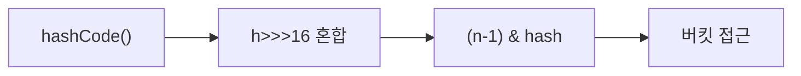
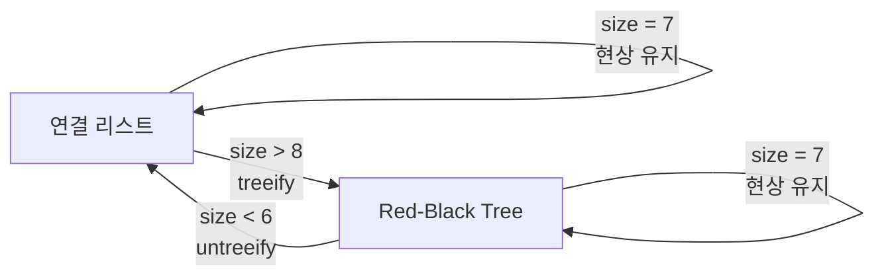
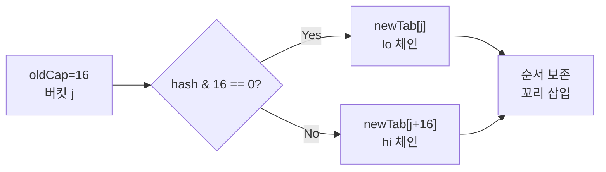
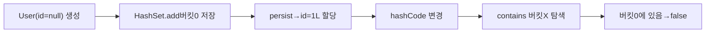
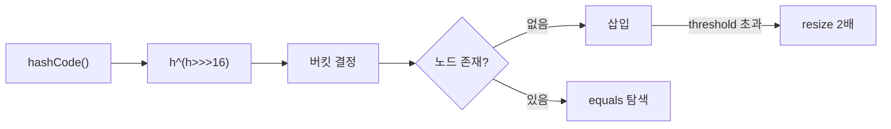

> **한 줄 요약**: HashMap은 `h ^ (h >>> 16)` 보조 해시로 비트를 섞고, `(n-1) & hash` 비트 AND로 버킷 인덱스를 구하며, 충돌이 8개를 넘으면 Red-Black Tree로 전환하고, 로드 팩터 0.75를 넘으면 2배 resize한다. 이 네 가지 원리의 "왜"를 이해하면 HashMap의 모든 동작이 예측 가능해진다.

---

## 서막 — 서버를 먹통으로 만든 HashMap 한 줄

2012년 국내 대형 커머스 서비스의 배포 직후, 특정 API가 CPU 100%를 점유하며 응답을 멈췄습니다. 스레드 덤프에는 수십 개의 스레드가 `HashMap.get()` 내부 `while` 루프에서 탈출하지 못하는 장면이 찍혀 있었습니다. 원인은 단 한 줄이었습니다.

```java
// 싱글턴 Spring 빈 — 멀티스레드가 공유하는 HashMap
private Map<String, Object> cache = new HashMap<>();
```

Java 7의 resize 로직은 연결 리스트를 역순으로 재구성합니다. 두 스레드가 동시에 resize에 진입하면 역전 과정에서 순환 참조가 발생하고, 이후 모든 `get()`이 무한 루프에 빠집니다. 이 사고를 이해하려면 HashMap 내부를 바닥부터 파고들어야 합니다.

이 글은 그 바닥부터 시작합니다.

---

## 1. 해시 함수 — `h ^ (h >>> 16)` 의 물리학

### 1.1 왜 해시 함수가 필요한가

배열의 임의 위치에 O(1)으로 접근하려면 **키를 정수 인덱스로 변환**하는 함수가 필요합니다. 이것이 해시 함수입니다. 그런데 `hashCode()`가 반환하는 값은 32비트 정수 전체 범위(-2^31 ~ 2^31-1)에 걸쳐 있습니다. 배열 크기가 16이라면 인덱스로 쓸 수 있는 범위는 0~15뿐입니다.

가장 단순한 변환은 나머지 연산(`hash % n`)입니다. 그런데 Java HashMap은 이 대신 비트 AND를 씁니다. 이 선택이 해시 함수 설계 전체를 바꾸는 출발점입니다.

### 1.2 `(n-1) & hash` — 왜 나머지 대신 비트 AND인가

배열 크기 `n`이 **2의 거듭제곱**일 때, `n - 1`을 이진수로 쓰면 하위 비트가 모두 1인 마스크가 됩니다.

```
n = 16  이진: 0001_0000
n-1= 15  이진: 0000_1111  ← 하위 4비트 마스크

hash = 1010_1100_1111_0000_0101_0011_1000_1111
(n-1) & hash
     = 0000_0000_0000_0000_0000_0000_0000_1111
                                              ↑ 하위 4비트만 추출 = 15
```

`%` 연산은 내부적으로 정수 나눗셈(IDIV 명령어)을 포함합니다. x86에서 IDIV는 20~100 사이클이 소요됩니다. AND 연산은 1 사이클입니다. HashMap이 초당 수백만 번 호출되는 환경에서 이 차이는 실측 가능한 성능 차이로 이어집니다.

**바로 여기에서 n이 반드시 2의 거듭제곱이어야 하는 이유가 생깁니다.** n이 2의 거듭제곱이 아니면 `n-1`이 마스크 형태가 되지 않아 `&` 연산이 균등한 인덱스를 만들지 못합니다.

```java
// HashMap 생성자 내부: 입력받은 capacity를 다음 2의 거듭제곱으로 올림
static final int tableSizeFor(int cap) {
    int n = -1 >>> Integer.numberOfLeadingZeros(cap - 1);
    return (n < 0) ? 1 : (n >= MAXIMUM_CAPACITY) ? MAXIMUM_CAPACITY : n + 1;
}

// new HashMap<>(13) → tableSizeFor(13) = 16
// new HashMap<>(17) → tableSizeFor(17) = 32
// new HashMap<>(65) → tableSizeFor(65) = 128
```

### 1.3 상위 비트 손실 문제 — 왜 XOR spread가 필요한가

`(n-1) & hash`의 구조적 결함이 있습니다. 배열이 작을수록 더 심각합니다.

n=16일 때 인덱스 계산에 사용되는 비트는 **하위 4비트뿐**입니다. 상위 28비트는 완전히 무시됩니다. 다음 두 해시값을 봅니다.

```
hashA = 0000_0001_1010_0011_0000_0000_0000_0101  (상위 달라도)
hashB = 1111_1110_0101_1100_0000_0000_0000_0101  (하위 동일)

(16-1) & hashA = 0101 = 5
(16-1) & hashB = 0101 = 5  ← 같은 버킷! 충돌
```

hashA와 hashB는 32비트 중 28비트가 다른데 같은 버킷으로 배정됩니다. 사용자 정의 `hashCode()`가 상위 비트에 정보를 몰아넣는 구조라면 실제로 이런 충돌이 발생합니다.

**Java 8의 해결책이 `h ^ (h >>> 16)`입니다.**

```java
// JDK 8 HashMap.hash() 실제 소스
static final int hash(Object key) {
    int h;
    return (key == null) ? 0 : (h = key.hashCode()) ^ (h >>> 16);
}
```

작동 원리를 비트 수준에서 추적합니다.

```
원본 h:      1010_1100_1111_0000  |  0101_0011_1000_1111
             ↑ 상위 16비트           ↑ 하위 16비트

h >>> 16:    0000_0000_0000_0000  |  1010_1100_1111_0000
             (상위 16비트를 하위로 밀어내림)

h ^ (h>>>16):
상위 16비트: 1010_1100_1111_0000  (변경 없음)
하위 16비트: 0101_0011_1000_1111
           XOR
             1010_1100_1111_0000
           = 1111_1111_0111_1111  ← 상위 정보가 하위에 섞임
```

이제 하위 4비트만 써도 원래 상위 비트 정보가 녹아 있습니다. XOR을 선택한 이유는 세 가지입니다.

1. **비가역성**: AND나 OR와 달리 XOR은 정보 손실이 없습니다. 결과에서 한쪽 피연산자를 알면 다른 쪽을 복원할 수 있습니다.
2. **균등 분포**: XOR은 두 비트가 같으면 0, 다르면 1을 만듭니다. 입력이 균등하면 출력도 균등합니다.
3. **속도**: 단일 XOR 명령어 1사이클.

**왜 16번 시프트인가?** int는 32비트입니다. 16번 시프트하면 상위 절반이 정확히 하위 절반 자리로 내려옵니다. 상위와 하위가 대칭적으로 섞이는 가장 단순한 지점입니다. 8번이면 상위 8비트만 내려오고, 24번이면 최상위 8비트만 살아남습니다. 16번이 전체 상위 정보를 하위에 완전히 반영하는 최소한의 시프트입니다.



### 1.4 String.hashCode() 내부 — 왜 31을 곱하는가

Java에서 가장 많이 쓰이는 키는 `String`입니다. String의 `hashCode()` 공식입니다.

```
s[0]*31^(n-1) + s[1]*31^(n-2) + ... + s[n-1]
```

```java
// JDK String.hashCode() 실제 구현
public int hashCode() {
    int h = hash;
    if (h == 0 && !hashIsZero) {
        byte[] val = this.value;
        for (int i = 0; i < val.length; i++) {
            h = 31 * h + (val[i] & 0xff);
        }
        if (h == 0) {
            hashIsZero = true;
        } else {
            hash = h;
        }
    }
    return h;
}
```

**왜 31인가?**

- **홀수**: 짝수(특히 2의 거듭제곱) 승수는 비트를 왼쪽으로 밀어내 정보를 손실시킵니다. 31은 홀수라서 정보를 보존합니다.
- **소수**: 소수 승수는 분산이 균등합니다. 소수가 아닌 승수는 특정 패턴에서 충돌이 집중됩니다.
- **JIT 최적화**: `31 * h`는 `(h << 5) - h`로 대체됩니다. 곱셈 대신 시프트+뺄셈 — 구형 JVM에서 중요했던 최적화입니다.

**해시 캐싱**: String은 한 번 계산한 `hashCode()`를 내부 `hash` 필드에 저장합니다. 두 번째 호출부터는 재계산 없이 즉시 반환합니다. String이 불변(immutable)이기 때문에 가능한 최적화입니다.

```java
// String 내부 구조 (단순화)
public final class String {
    private final byte[] value;  // 실제 문자 데이터 (Java 9+: compact strings)
    private int hash;            // 캐시된 hashCode. 초기값 0
    private boolean hashIsZero;  // hash==0인 문자열 식별 (재계산 방지)
}
```

### 1.5 null 키의 특별 처리

`hash(null)`은 0을 반환합니다. 따라서 null 키는 항상 `table[0]` 버킷에 저장됩니다.

```java
static final int hash(Object key) {
    int h;
    return (key == null) ? 0 : (h = key.hashCode()) ^ (h >>> 16);
    //     ↑ null이면 즉시 0 반환 — 버킷[0] 배정
}
```

HashMap이 null 키를 허용하는 이유는 설계 철학의 차이입니다. null은 "값이 없음"을 표현하는 유효한 상태이고, HashMap은 이를 허용합니다. 반면 `ConcurrentHashMap`은 null 키를 금지합니다. 멀티스레드 환경에서 `get(key) == null`이 "키 없음"인지 "값이 null"인지 구별할 방법이 없기 때문입니다.

---

## 2. 버킷 — 배열에서 연결 리스트, 그리고 Red-Black Tree

### 2.1 HashMap 내부 자료구조 전체 구조

```java
// JDK 8 HashMap 핵심 필드
public class HashMap<K,V> extends AbstractMap<K,V> {

    // 버킷 배열. 각 원소는 체인의 첫 노드(또는 트리 루트)
    transient Node<K,V>[] table;

    // 현재 저장된 키-값 쌍의 수 (배열 길이와 무관)
    transient int size;

    // 다음 resize 임계값 = capacity * loadFactor
    int threshold;

    // 로드 팩터 (기본 0.75)
    final float loadFactor;

    // 구조 변경 횟수 — Iterator fail-fast 감지용
    transient int modCount;

    // 연결 리스트 노드
    static class Node<K,V> implements Map.Entry<K,V> {
        final int hash;    // 해시값 캐시 (resize 시 재계산 방지)
        final K key;       // 키는 final — 변경 불가
        V value;           // 값은 가변
        Node<K,V> next;    // 다음 노드 포인터
    }

    // 트리 노드 (Node 확장)
    static final class TreeNode<K,V> extends LinkedHashMap.Entry<K,V> {
        TreeNode<K,V> parent;  // 부모
        TreeNode<K,V> left;    // 왼쪽 자식
        TreeNode<K,V> right;   // 오른쪽 자식
        TreeNode<K,V> prev;    // 이전 (unlink 시 필요)
        boolean red;           // 색상
    }
}
```

**왜 `hash`를 Node에 저장하는가?** resize 시마다 `key.hashCode()`를 재호출하는 비용을 없애기 위해서입니다. 특히 사용자 정의 `hashCode()`가 DB 조회 등 무거운 연산을 포함할 때 이 캐싱이 결정적입니다. 단, 이 캐싱은 키가 불변임을 전제합니다. **가변 객체를 HashMap 키로 쓰면 안 되는 두 번째 이유가 여기 있습니다** (첫 번째 이유는 hashCode 변경 후 버킷을 못 찾는 것).

### 2.2 put() 내부 동작 — 단계별 추적

```java
// JDK 8 HashMap.putVal() 핵심 로직 (주석 추가)
final V putVal(int hash, K key, V value, boolean onlyIfAbsent, boolean evict) {
    Node<K,V>[] tab = table;
    int n, i;

    // 1단계: 첫 put이면 배열 초기화 (지연 초기화 — 생성자에서 배열 할당 안 함)
    if (tab == null || (n = tab.length) == 0)
        n = (tab = resize()).length;

    // 2단계: 버킷 인덱스 계산. 비어있으면 바로 삽입
    if ((p = tab[i = (n - 1) & hash]) == null)
        tab[i] = newNode(hash, key, value, null);

    else {
        Node<K,V> e;
        K k;

        // 3단계: 버킷 첫 노드가 이 키인지 확인 (가장 빠른 경로)
        if (p.hash == hash &&
            ((k = p.key) == key || (key != null && key.equals(k))))
            e = p;

        // 4단계: TreeNode이면 트리 삽입
        else if (p instanceof TreeNode)
            e = ((TreeNode<K,V>)p).putTreeVal(this, tab, hash, key, value);

        // 5단계: 연결 리스트 순회
        else {
            for (int binCount = 0; ; ++binCount) {
                if ((e = p.next) == null) {
                    p.next = newNode(hash, key, value, null);  // 꼬리에 추가
                    // 8번째 노드가 추가되면 트리 변환
                    if (binCount >= TREEIFY_THRESHOLD - 1)
                        treeifyBin(tab, hash);
                    break;
                }
                if (e.hash == hash &&
                    ((k = e.key) == key || (key != null && key.equals(k))))
                    break;  // 동일 키 발견
                p = e;
            }
        }

        // 6단계: 기존 키 발견 → 값 업데이트
        if (e != null) {
            V oldValue = e.value;
            if (!onlyIfAbsent || oldValue == null)
                e.value = value;
            return oldValue;
        }
    }

    // 7단계: 구조 변경 카운트 증가, size 증가, resize 여부 확인
    ++modCount;
    if (++size > threshold)
        resize();
    return null;
}
```

**왜 `hash` 비교 후 `equals` 비교인가?** `int` 비교(`==`)는 CPU 한 명령으로 끝납니다. `equals()`는 메서드 호출 오버헤드가 있고, String이면 문자 하나씩 비교합니다. 같은 버킷의 노드들 중 hash 값이 다른 것을 먼저 필터링하면 `equals()` 호출 횟수가 크게 줄어듭니다.

### 2.3 연결 리스트 → Red-Black Tree: treeifyBin의 조건

`TREEIFY_THRESHOLD = 8`에 도달했다고 즉시 트리가 되는 것은 아닙니다.

```java
final void treeifyBin(Node<K,V>[] tab, int hash) {
    int n, index;
    Node<K,V> e;
    // 배열 크기가 64 미만이면 트리 변환 대신 resize를 먼저 시도
    if (tab == null || (n = tab.length) < MIN_TREEIFY_CAPACITY)  // 64
        resize();
    else if ((e = tab[index = (n - 1) & hash]) != null) {
        // 이 버킷의 연결 리스트를 TreeNode 체인으로 변환
        TreeNode<K,V> hd = null, tl = null;
        do {
            TreeNode<K,V> p = replacementTreeNode(e, null);
            if (tl == null) hd = p;
            else { p.prev = tl; tl.next = p; }
            tl = p;
        } while ((e = e.next) != null);
        // TreeNode 체인을 실제 트리로 구성
        if ((tab[index] = hd) != null)
            hd.treeify(tab);
    }
}
```

**`MIN_TREEIFY_CAPACITY = 64`의 이유**: 배열이 작을 때(< 64) 충돌이 8개 몰린 것은 배열 크기 자체가 작아서일 가능성이 높습니다. 이 경우 트리로 만드는 것보다 배열을 2배로 늘리면 충돌이 분산됩니다. 트리 변환 비용(노드 포인터 재구성, 트리 균형 맞추기)보다 resize가 장기적으로 더 효율적입니다.

### 2.4 TREEIFY_THRESHOLD = 8의 수학적 근거 — 포아송 분포

JDK JavaDoc은 이 임계값의 근거를 명시합니다.

> 이상적인 랜덤 `hashCode()`에서, 로드 팩터 0.75일 때 버킷의 노드 수 k의 확률은 포아송 분포를 따른다. 평균 λ = 0.5일 때:

| k (노드 수) | P(X = k) |
|------------|----------|
| 0 | 0.60653066 |
| 1 | 0.30326533 |
| 2 | 0.07581633 |
| 3 | 0.01263606 |
| 4 | 0.00157952 |
| 5 | 0.00015795 |
| 6 | 0.00001316 |
| 7 | 0.00000094 |
| **8** | **0.00000006** |

8개 이상의 노드가 하나의 버킷에 몰릴 확률은 **약 6×10⁻⁸** (0.000006%)입니다. 이 확률 수준에서만 트리로 전환하는 이유는 트리의 비용입니다.

`TreeNode`는 `Node`의 서브클래스로, 포인터 필드가 4개(`parent`, `left`, `right`, `prev`) 더 있습니다. 64비트 JVM에서 포인터 하나는 8바이트(압축 OOP 미사용 시)입니다. `Node` 하나가 32바이트라면 `TreeNode`는 64바이트, **2배** 메모리를 씁니다. 모든 버킷을 항상 트리로 유지하면 HashMap 전체 메모리가 두 배로 늘어납니다. 6×10⁻⁸ 확률의 상황을 위해 일상적인 메모리 비용을 두 배로 낼 이유가 없습니다.

### 2.5 UNTREEIFY_THRESHOLD = 6 — 히스테리시스

트리에서 연결 리스트로 돌아가는 임계값은 6입니다.

**왜 8이 아니라 6인가?** 삽입 임계값(8)과 삭제 임계값을 같은 숫자로 맞추면 스래싱이 발생합니다.

```
시나리오: 노드 8개인 버킷에서 삽입/삭제 반복

임계값 동일(8) 시:
  put → size=8 → treeify → remove → size=7 → untreeify → put → size=8 → treeify...
  매번 트리-리스트 전환 발생 (전환 비용 O(n) per treeify)

임계값 차이(8/6) 시:
  size가 7이면 현재 구조(트리 또는 리스트) 유지
  8이 되어야 treeify, 6이 되어야 untreeify
  7 근처에서 삽입/삭제를 아무리 반복해도 구조 전환 없음
```

이 2의 간격이 **히스테리시스(hysteresis)** 구간입니다. 전자 회로의 슈미트 트리거와 같은 원리입니다. 노이즈(경계 근처의 사소한 변화)에 의해 상태가 요동치는 것을 방지합니다.



---

## 3. Red-Black Tree — 왜 AVL이 아닌가

### 3.1 Red-Black Tree의 5가지 속성

Red-Black Tree(RBT)는 다음 5가지 속성을 만족하는 자기균형 이진 탐색 트리입니다.

1. **모든 노드는 빨간색 또는 검은색이다.**
2. **루트는 항상 검은색이다.**
3. **모든 리프(NIL 노드)는 검은색이다.**
4. **빨간색 노드의 자식은 반드시 검은색이다.** (빨간색이 연속으로 나타날 수 없다)
5. **루트에서 모든 리프까지의 경로에는 같은 수의 검은색 노드가 있다.**

이 5가지 속성으로부터 RBT의 높이 보장이 수학적으로 도출됩니다. n개 노드의 RBT 높이는 최대 **2log₂(n+1)**입니다. 가장 짧은 경로(모두 검정)와 가장 긴 경로(빨간-검정 교대)의 비율이 최대 2:1을 넘지 않기 때문입니다.

```
검색 경로 예시 (n=15):
최단 경로: 루트→B→B→B→NIL (검은색 4개)
최장 경로: 루트→B→R→B→R→B (검은색 3개, 빨간색 2개 포함)
→ 최장/최단 비율: 5/4 = 1.25배 (2배 이내)
```

### 3.2 RBT 삽입 시 균형 복원 — 회전과 재색칠

RBT에 노드를 삽입하면 속성 4(빨간색 연속 금지)나 속성 5(검은색 높이 균등)가 깨질 수 있습니다. 이를 복원하는 두 가지 연산입니다.

**좌회전(Left Rotation)**:

```
회전 전:        회전 후:
    x               y
   / \             / \
  a   y    →      x   c
     / \         / \
    b   c       a   b
```

x를 y의 왼쪽 자식으로 내리고, y가 x 자리를 차지합니다. b가 x의 오른쪽 자식으로 이동합니다.

**재색칠(Recoloring)**:

삽입된 노드의 삼촌(uncle)이 빨간색이면 회전 없이 부모와 삼촌을 검은색으로, 조부모를 빨간색으로 바꿉니다.

Java 8 HashMap의 `TreeNode.putTreeVal()` 내부에서 이 균형 복원 로직이 동작합니다.

```java
// JDK 8 TreeNode.balanceInsertion() 핵심 패턴 (단순화)
static <K,V> TreeNode<K,V> balanceInsertion(TreeNode<K,V> root, TreeNode<K,V> x) {
    x.red = true;  // 새 노드는 항상 빨간색으로 삽입
    for (TreeNode<K,V> xp, xpp, xppl, xppr;;) {
        if ((xp = x.parent) == null) {
            x.red = false;  // 루트는 검은색
            return x;
        }
        if (!xp.red || (xpp = xp.parent) == null)
            return root;  // 부모가 검은색이면 속성 유지, 종료

        // 삼촌(uncle) 확인 후 재색칠 또는 회전
        if (xp == (xppl = xpp.left)) {
            if ((xppr = xpp.right) != null && xppr.red) {
                // Case 1: 삼촌이 빨간색 → 재색칠
                xppr.red = false;
                xp.red = false;
                xpp.red = true;
                x = xpp;
            } else {
                // Case 2/3: 삼촌이 검은색 → 회전
                if (x == xp.right) {
                    root = rotateLeft(root, x = xp);
                    xpp = (xp = x.parent) == null ? null : xp.parent;
                }
                if (xp != null) {
                    xp.red = false;
                    if (xpp != null) {
                        xpp.red = true;
                        root = rotateRight(root, xpp);
                    }
                }
            }
        }
        // 대칭 케이스(우측)는 생략
    }
}
```

### 3.3 왜 AVL Tree가 아닌가

AVL Tree는 RBT보다 균형이 더 엄격합니다. 모든 노드의 왼쪽과 오른쪽 서브트리 높이 차이가 최대 1입니다.

| 특성 | AVL Tree | Red-Black Tree |
|------|----------|----------------|
| 높이 보장 | 1.44log₂(n) | 2log₂(n) |
| 검색 속도 | 약간 더 빠름 | 약간 더 느림 |
| 삽입 회전 횟수 | 최대 2회 | 최대 2회 |
| 삭제 회전 횟수 | **O(log n)회** | **최대 3회** |
| 재색칠 횟수 | 없음 | O(log n)회 (빠름) |

**결론**: HashMap의 버킷에서 삽입과 삭제가 빈번합니다. AVL은 삭제 시 O(log n)번의 회전이 필요하고, 회전은 포인터 4~6개를 바꾸는 비용 있는 연산입니다. RBT는 삭제 시 최대 3회 회전과 O(log n)번의 재색칠로 끝납니다. 재색칠은 `boolean` 필드 하나를 바꾸는 것이므로 회전보다 훨씬 가볍습니다. 쓰기가 많은 HashMap 환경에서 RBT가 AVL보다 유리합니다.

또한 Java `TreeMap`도 내부적으로 RBT를 씁니다. 동일한 구현체를 재사용할 수 있다는 실용적 이유도 있습니다.

### 3.4 treeify 과정 — 연결 리스트를 트리로

```java
// TreeNode.treeify() 핵심 로직 (단순화)
final void treeify(Node<K,V>[] tab) {
    TreeNode<K,V> root = null;
    for (TreeNode<K,V> x = this, next; x != null; x = next) {
        next = (TreeNode<K,V>)x.next;
        x.left = x.right = null;
        if (root == null) {
            x.parent = null;
            x.red = false;   // 루트는 검은색
            root = x;
        } else {
            K k = x.key;
            int h = x.hash;
            Class<?> kc = null;
            // 트리에 삽입 위치 찾기 (hash 비교)
            for (TreeNode<K,V> p = root;;) {
                int ph, dir;
                K pk = p.key;
                if ((ph = p.hash) > h)       dir = -1;  // 왼쪽
                else if (ph < h)             dir = 1;   // 오른쪽
                // hash 같으면 Comparable, System.identityHashCode 순으로 비교
                else if (...) dir = ...;
                // 삽입 후 균형 복원
                x = balanceInsertion(root, x);
            }
        }
    }
    moveRootToFront(tab, root);  // 루트를 버킷 첫 위치로 이동
}
```

**`moveRootToFront()`의 이유**: 버킷 배열 원소(`tab[i]`)는 항상 체인의 첫 노드여야 합니다. treeify 후 RBT의 루트는 원래 연결 리스트의 순서와 무관하게 결정됩니다. 따라서 루트를 배열 원소 자리로 명시적으로 옮겨야 합니다.

---

## 4. Resize — `(e.hash & oldCap) == 0` 의 비트 마법

### 4.1 로드 팩터 0.75의 수학적 근거

```
threshold = capacity × loadFactor
기본: 16 × 0.75 = 12 → 12번째 put 시 resize
```

**왜 0.75인가?** 이것은 경험적 값이지만 정보 이론과 연결됩니다.

이상적인 랜덤 해시에서 n개의 슬롯에 m개의 원소를 채울 때, 비어있는 버킷 비율은 `e^(-m/n)` (자연 지수 함수)에 수렴합니다. 로드 팩터 α = m/n일 때:

```
α = 0.5 → 빈 버킷 비율 ≈ e^(-0.5) ≈ 60.6%  (공간 낭비 심함)
α = 0.75 → 빈 버킷 비율 ≈ e^(-0.75) ≈ 47.2% (균형)
α = 1.0 → 빈 버킷 비율 ≈ e^(-1) ≈ 36.8%    (충돌 증가)
```

0.75는 "공간 효율"과 "시간 효율" 사이의 균형점입니다. 추가로 `log(2) ≈ 0.693`에 가깝다는 점도 있습니다. 이상적인 해시에서 버킷이 비어있을 확률이 50%를 넘는 마지막 지점이 log(2)입니다.

### 4.2 왜 2배로 늘리는가 — 비트 연산의 우아함

resize 시 새 크기를 2배로 선택하는 이유는 재배치 로직을 극단적으로 단순화할 수 있기 때문입니다.

n=16 → n=32로 resize할 때 인덱스 계산 변화를 봅니다.

```
구 인덱스: hash & (16-1) = hash & 0000_1111  ← 하위 4비트
신 인덱스: hash & (32-1) = hash & 0001_1111  ← 하위 5비트

차이: 5번째 비트(= 구 capacity 16 = 0001_0000의 위치)가 추가됨

이 5번째 비트가 0이면 → 신 인덱스 = 구 인덱스 (같은 자리)
이 5번째 비트가 1이면 → 신 인덱스 = 구 인덱스 + 16 (구 capacity 만큼 이동)
```

따라서 각 노드의 이동 여부는 `hash & oldCap`으로 결정됩니다.

```java
// Java 8 resize 핵심 로직 — lo/hi split
do {
    next = e.next;
    if ((e.hash & oldCap) == 0) {
        // 5번째 비트가 0 → 같은 자리 유지 (lo 체인)
        if (loTail == null) loHead = e;
        else loTail.next = e;
        loTail = e;
    } else {
        // 5번째 비트가 1 → oldCap 만큼 이동 (hi 체인)
        if (hiTail == null) hiHead = e;
        else hiTail.next = e;
        hiTail = e;
    }
} while ((e = next) != null);

if (loTail != null) { loTail.next = null; newTab[j] = loHead; }
if (hiTail != null) { hiTail.next = null; newTab[j + oldCap] = hiHead; }
```

**이 알고리즘의 세 가지 장점**:

1. `key.hashCode()`를 재호출하지 않습니다. 이미 `Node.hash`에 캐시된 값을 씁니다.
2. `% newCapacity` 나머지 연산 없이 비트 AND 한 번으로 이동 여부가 결정됩니다.
3. 꼬리 삽입이므로 원래 순서가 보존됩니다 → 순환 참조 없음.



### 4.3 Java 7 무한 루프 — 코드 수준 재현

Java 7 `transfer()` 메서드는 헤드 삽입 방식이었습니다.

```java
// Java 7 HashMap.transfer() (실제 소스, 주석 추가)
void transfer(Entry[] newTable, boolean rehash) {
    int newCapacity = newTable.length;
    for (Entry<K,V> e : table) {
        while(null != e) {
            Entry<K,V> next = e.next;  // ← 스레드 T1이 여기서 멈춤
            if (rehash) {
                e.hash = null == e.key ? 0 : hash(e.key);
            }
            int i = indexFor(e.hash, newCapacity);
            e.next = newTable[i];   // ← 헤드 삽입: 역전 발생
            newTable[i] = e;
            e = next;
        }
    }
}
```

무한 루프 발생 과정 단계별 추적:

```
초기: 버킷[3] = A → B → null
      (A.next = B, B.next = null)

T2가 resize 완료: B → A → null
      (B.next = A, A.next = null)  ← 역순으로 재구성됨

T1이 재개 (e = A, next = B):
  A.next = newTable[3] = null (T1 기준 newTable은 아직 비어있다고 봄)
  newTable[3] = A
  e = next = B

  B.next = newTable[3] = A   ← 여기서 B → A 연결
  newTable[3] = B
  e = B.next = A

  A.next = newTable[3] = B   ← A → B 연결
  newTable[3] = A

결과: A.next = B, B.next = A → 순환 참조!
```

이후 `get(anyKey)`이 이 버킷을 탐색하면 `while(e != null)` 루프가 `A → B → A → B → ...`로 영원히 돕니다.

### 4.4 Java 8에서 무한 루프 수정 후에도 남은 위험

Java 8은 꼬리 삽입으로 순환 참조를 제거했지만, `HashMap`이 thread-safe해진 것은 아닙니다. 동시 `put`이 가능한 버그들이 남아 있습니다.

**데이터 유실 시나리오**:

```java
// T1과 T2가 동시에 같은 버킷의 빈 슬롯에 삽입 시도
if ((p = tab[i = (n - 1) & hash]) == null)
    tab[i] = newNode(hash, key, value, null);
// T1이 null 확인 후 T2가 먼저 삽입
// T1이 T2의 노드를 덮어써서 T2 데이터 유실
```

**size 오염 시나리오**:

```java
++size;  // 이 연산은 비원자적: load → increment → store
// T1이 size=10 읽음
// T2가 size=10 읽음
// T1이 11 저장
// T2가 11 저장
// 실제로는 12여야 하는데 11로 기록 → size 불일치
```

멀티스레드 환경에서 `HashMap`을 쓰면 안 되는 이유가 이것입니다. Java 8에서 무한 루프 버그가 수정되었더라도, 데이터 유실과 size 불일치는 여전히 발생합니다.

### 4.5 초기 용량 공식 — resize 0회로 만들기

```java
// 예상 데이터 수 n건 → resize 없이 수용하려면?
// threshold = capacity × 0.75 >= n
// capacity >= n / 0.75 = n × 4/3
// capacity는 2의 거듭제곱이어야 함 → 올림 처리

// 실용 공식
int initialCapacity = (int) Math.ceil(expectedSize / 0.75);
// 다음 2의 거듭제곱으로 tableSizeFor()가 처리

// 예: 10만 건
// 100_000 / 0.75 = 133_334 → 다음 2^n = 262_144
Map<String, Object> map = new HashMap<>(262_144);

// Guava 사용 시 (내부적으로 동일 계산)
Map<String, Object> map = Maps.newHashMapWithExpectedSize(100_000);
```

**resize 13번 vs 0번의 실제 비용 차이**: 10만 건을 기본 용량(16)으로 시작하면 총 ~26만 번의 노드 재배치가 일어납니다. 각 resize 시점마다 GC Young Generation에 새 배열 객체가 생성됩니다. 배치 작업에서 이것이 GC 일시정지(stop-the-world) 빈도를 높여 응답 지연으로 나타날 수 있습니다.

---

## 5. 스레드 안전성 — Java 7/8 비교와 ConcurrentHashMap

### 5.1 ConcurrentHashMap의 버킷 단위 락

```java
// ConcurrentHashMap.putVal() 핵심 구조 (Java 8)
final V putVal(K key, V value, boolean onlyIfAbsent) {
    // null 키/값 즉시 거부
    if (key == null || value == null) throw new NullPointerException();

    int hash = spread(key.hashCode());  // 보조 해시 (HASH_BITS 마스크 포함)
    for (Node<K,V>[] tab = table;;) {
        Node<K,V> f; int n, i, fh;

        if (tab == null || (n = tab.length) == 0)
            tab = initTable();  // CAS로 초기화 (락 없음)

        // 빈 버킷: CAS로 락 없이 삽입
        else if ((f = tabAt(tab, i = (n - 1) & hash)) == null) {
            if (casTabAt(tab, i, null, new Node<K,V>(hash, key, value, null)))
                break;  // CAS 성공 → 락 없이 삽입 완료
            // CAS 실패 → 다른 스레드가 먼저 삽입 → 루프 재시도
        }

        // resize 진행 중
        else if ((fh = f.hash) == MOVED)
            tab = helpTransfer(tab, f);

        // 이미 노드 있음: 버킷 헤드에만 synchronized
        else {
            synchronized (f) {
                // 버킷 내부 삽입/갱신 로직
            }
        }
    }
}
```

**CAS(Compare-And-Swap)란?** 하드웨어 수준의 원자적 연산입니다. "현재 값이 기대값과 같으면 새 값으로 바꾸고 true, 다르면 false"를 한 명령어로 처리합니다. 락 없이 원자성을 보장합니다.

```
casTabAt(tab, i, null, newNode):
  원자적으로: tab[i] == null이면 tab[i] = newNode, return true
              tab[i] != null이면 아무것도 안 함, return false
```

**Hashtable vs ConcurrentHashMap 병렬성 비교**:

```
Hashtable (1개 락):
  T1 → get("a") → synchronized(this) → 전체 테이블 잠금
  T2 → get("z") → 대기 (T1 완료까지)
  T3 → put("m") → 대기

ConcurrentHashMap (버킷 단위 락):
  T1 → put("a") → bucket[3] 헤드에만 synchronized
  T2 → put("z") → bucket[25] 헤드에만 synchronized → T1과 병렬 실행
  T3 → get("m") → volatile read → 락 없음 → T1, T2와 병렬 실행
```

128개 버킷에서 이론적 최대 쓰기 병렬성: 128배. 실제로는 해시 충돌에 따라 달라집니다.

### 5.2 ConcurrentHashMap의 size() 계산 — LongAdder

단순한 `volatile int size`는 동시 증가 시 경쟁이 발생합니다. Java 8 `ConcurrentHashMap`은 `LongAdder` 패턴을 씁니다.

```java
// ConcurrentHashMap 내부 (단순화)
private transient volatile CounterCell[] counterCells;
private transient volatile long baseCount;

// size() 계산
public int size() {
    long n = sumCount();
    return ((n < 0L) ? 0 :
            (n > (long)Integer.MAX_VALUE) ? Integer.MAX_VALUE : (int)n);
}

final long sumCount() {
    CounterCell[] as = counterCells; CounterCell a;
    long sum = baseCount;
    if (as != null) {
        for (int i = 0; i < as.length; ++i) {
            if ((a = as[i]) != null)
                sum += a.value;
        }
    }
    return sum;
}
```

각 스레드가 별도 `CounterCell`에 카운터를 증가시키고, `size()` 호출 시 모두 합산합니다. 이를 **Striped Counter** 패턴이라 합니다. 경합 없는 카운팅이 가능하지만, `size()`가 O(countercell 수)가 됩니다. 따라서 `ConcurrentHashMap.size()`는 정확한 값이 아닌 근사값일 수 있습니다.

---

## 6. WeakHashMap, EnumMap, IdentityHashMap 내부

### 6.1 WeakHashMap — GC가 키를 지운다

`WeakHashMap`은 키를 `WeakReference`로 감싸서 저장합니다. JVM GC가 해당 키 객체를 더 이상 강한 참조(strong reference)로 가리키는 곳이 없다고 판단하면, **WeakHashMap의 참조를 무시하고** 키를 수집합니다.

```java
// WeakHashMap 내부 구조
private static class Entry<K,V> extends WeakReference<Object>
                                implements Map.Entry<K,V> {
    // WeakReference가 키를 감쌈 → GC 대상 가능
    V value;
    final int hash;
    Entry<K,V> next;
    ReferenceQueue<Object> queue;  // GC 후 알림 큐
}
```

GC가 키를 수집하면 해당 `WeakReference`가 `ReferenceQueue`에 추가됩니다. `WeakHashMap`은 `get()`, `put()`, `size()` 등 주요 연산 시마다 이 큐를 폴링해서 수집된 키의 엔트리를 정리합니다(`expungeStaleEntries()`).

```java
private void expungeStaleEntries() {
    for (Object x; (x = queue.poll()) != null; ) {
        synchronized (queue) {
            Entry<K,V> e = (Entry<K,V>) x;
            int i = indexFor(e.hash, table.length);
            // 연결 리스트에서 해당 엔트리 제거
            Entry<K,V> prev = table[i];
            Entry<K,V> p = prev;
            while (p != null) {
                Entry<K,V> next = p.next;
                if (p == e) {
                    if (prev == e) table[i] = next;
                    else prev.next = next;
                    e.value = null; // GC 돕기
                    size--;
                    break;
                }
                prev = p;
                p = next;
            }
        }
    }
}
```

**언제 쓰는가?** 클래스를 키로 쓰는 메타데이터 캐시입니다. 클래스 언로딩 시 자동으로 캐시에서 제거됩니다. 일반 `HashMap`을 쓰면 언로드된 클래스도 강한 참조로 잡혀 있어 메모리 누수가 발생합니다.

```java
// 메타데이터 캐시 예시
Map<Class<?>, SomeMetadata> metaCache = new WeakHashMap<>();
// 플러그인 클래스가 언로드되면 자동으로 캐시에서 제거됨
```

**WeakHashMap의 함정**: 값(value)이 강한 참조로 키를 가리키면 GC가 키를 수집할 수 없습니다. 자기 참조 구조가 생기기 때문입니다.

```java
// 잘못된 사용 — 값이 키를 강한 참조
WeakHashMap<MyObject, Object[]> map = new WeakHashMap<>();
MyObject key = new MyObject();
map.put(key, new Object[]{key});  // 값이 키를 참조 → GC 불가
```

### 6.2 EnumMap — 배열 인덱스가 곧 ordinal

`EnumMap`은 Enum 타입을 키로 갖는 Map입니다. 내부에 해시 배열 대신 **단순 Object 배열** 하나를 씁니다.

```java
// EnumMap 내부 구조
public class EnumMap<K extends Enum<K>, V> {
    private final Class<K> keyType;
    private transient K[] keyUniverse;  // Enum 상수 배열
    private transient Object[] vals;    // 값 저장 배열 (크기 = Enum 상수 수)
    private transient int size = 0;

    // put: ordinal을 인덱스로 직접 사용
    public V put(K key, V value) {
        int index = key.ordinal();  // Enum 상수의 선언 순서
        Object oldValue = vals[index];
        vals[index] = maskNull(value);
        if (oldValue == null)
            size++;
        return unmaskNull(oldValue);
    }

    // get: 해시 계산 없이 배열 직접 접근
    public V get(Object key) {
        return (isValidKey(key) ?
                unmaskNull(vals[((Enum<?>)key).ordinal()]) : null);
    }
}
```

**왜 EnumMap이 HashMap보다 빠른가?**

1. 해시 함수 계산 없음 (`ordinal()` 호출은 O(1) 필드 접근)
2. 충돌 없음 (각 Enum 상수의 ordinal이 유일)
3. 배열 연속 메모리 → CPU 캐시 히트율 높음
4. 크기가 고정 → resize 없음

Enum을 키로 쓴다면 `HashMap<MyEnum, V>` 대신 `EnumMap<MyEnum, V>`를 써야 합니다. 성능이 3~5배 차이날 수 있습니다.

```java
// 나쁜 예
Map<DayOfWeek, List<Task>> schedule = new HashMap<>();

// 좋은 예 — EnumMap이 항상 우선
Map<DayOfWeek, List<Task>> schedule = new EnumMap<>(DayOfWeek.class);
```

### 6.3 IdentityHashMap — equals 대신 == 비교

`IdentityHashMap`은 키 비교에 `equals()` 대신 `==`(참조 동일성)을 씁니다. 또한 해시값으로 `hashCode()` 대신 `System.identityHashCode()`를 씁니다.

```java
// IdentityHashMap의 핵심 차이
// 일반 HashMap: key1.equals(key2)이면 같은 키
// IdentityHashMap: key1 == key2이어야 같은 키 (같은 객체)

String a = new String("hello");
String b = new String("hello");

// 일반 HashMap
Map<String, String> hashMap = new HashMap<>();
hashMap.put(a, "A");
hashMap.put(b, "B");
System.out.println(hashMap.size()); // 1 (a.equals(b)이므로 b가 a를 덮어씀)

// IdentityHashMap
Map<String, String> idMap = new IdentityHashMap<>();
idMap.put(a, "A");
idMap.put(b, "B");
System.out.println(idMap.size()); // 2 (a != b이므로 다른 키로 취급)
```

내부적으로 `IdentityHashMap`은 충돌 해결에 **Linear Probing(선형 탐사)** 방식을 씁니다. Separate Chaining이 아닙니다. 키와 값을 번갈아 저장하는 단일 배열을 씁니다.

```java
// IdentityHashMap 내부 배열 구조
// table = [key0, val0, key1, val1, key2, val2, ...]
// 버킷 크기: 2 (키+값 쌍)
// 인덱스 계산: System.identityHashCode(key) & (length - 2)
// 충돌: 다음 슬롯으로 선형 탐사
```

**언제 쓰는가?** 객체 그래프 순환 감지, 직렬화/역직렬화 중 이미 처리한 객체 추적 등 **객체 동일성(identity)**이 핵심인 경우입니다. 예를 들어 Java 직렬화 구현체가 이미 직렬화한 객체를 추적하는데 `IdentityHashMap`을 씁니다.

---

## 7. JPA에서의 equals/hashCode — 엔티티의 함정

### 7.1 JPA 엔티티를 Set에 넣으면 생기는 일

JPA 엔티티를 `HashSet`에 담거나 `HashMap`의 키로 쓸 때 equals/hashCode 구현이 잘못되면 데이터가 사라집니다.

```java
@Entity
public class User {
    @Id
    @GeneratedValue
    private Long id;
    private String email;

    // 잘못된 구현 1: id 기반 hashCode (영속화 전 id = null)
    @Override
    public int hashCode() {
        return Objects.hash(id);  // id가 null이면 모두 같은 버킷!
    }

    @Override
    public boolean equals(Object o) {
        if (!(o instanceof User)) return false;
        User u = (User) o;
        return Objects.equals(id, u.id);
    }
}

Set<User> users = new HashSet<>();
User user = new User("kim@example.com");

// 1단계: 영속화 전 (id = null)
users.add(user);
System.out.println(users.contains(user)); // true

// 2단계: 영속화 (id = 1L 할당)
entityManager.persist(user);

// 3단계: 영속화 후 (id 변경 → hashCode 변경 → 버킷 이동)
System.out.println(users.contains(user)); // false !!
// 버킷이 null-hashCode에서 1L-hashCode로 달라짐
// HashSet이 새 버킷에서 찾으니 없음
```

### 7.2 JPA 엔티티의 올바른 equals/hashCode 전략

**전략 1: 비즈니스 키(자연키) 기반**

```java
@Entity
public class User {
    @Id
    @GeneratedValue
    private Long id;

    @Column(unique = true, nullable = false)
    private String email;  // 자연키 — 불변, 유일

    @Override
    public boolean equals(Object o) {
        if (this == o) return true;
        if (!(o instanceof User)) return false;
        User user = (User) o;
        return email != null && email.equals(user.email);
    }

    @Override
    public int hashCode() {
        // 자연키가 불변이므로 hashCode도 불변
        return Objects.hash(email);
    }
}
```

**전략 2: UUID 사용 (DB 할당 대신 앱에서 생성)**

```java
@Entity
public class Order {
    @Id
    private UUID id = UUID.randomUUID();  // 생성 시점에 할당 — 불변

    @Override
    public boolean equals(Object o) {
        if (this == o) return true;
        if (!(o instanceof Order)) return false;
        Order order = (Order) o;
        return id.equals(order.id);
    }

    @Override
    public int hashCode() {
        return id.hashCode();  // UUID 기반 — 영속화 전후 동일
    }
}
```

**전략 3: Hibernate 권장 패턴 — id null 처리 포함**

```java
@Entity
public class Product {
    @Id
    @GeneratedValue
    private Long id;

    @Override
    public boolean equals(Object o) {
        if (this == o) return true;
        if (!(o instanceof Product)) return false;
        Product product = (Product) o;
        // id가 null이면 같은 인스턴스만 동일
        return id != null && id.equals(product.id);
    }

    @Override
    public int hashCode() {
        // 항상 고정값 반환 — hashCode가 변하지 않음
        // 단점: 모든 엔티티가 같은 버킷 → 연결 리스트 O(n) 탐색
        // 장점: id 변경 전후 hashCode 불변
        return getClass().hashCode();
    }
}
```

전략 3의 단점은 모든 `Product`가 같은 버킷에 몰린다는 것입니다. 그러나 JPA 컨텍스트에서 `Set<Product>`의 크기는 보통 수십~수백이므로 성능 영향이 제한적입니다. 이 패턴은 Hibernate 공식 문서에서 권장합니다.

### 7.3 Lombok @EqualsAndHashCode의 JPA 함정

```java
// 위험한 조합
@Entity
@Data  // 내부적으로 @EqualsAndHashCode 포함
public class Member {
    @Id
    @GeneratedValue
    private Long id;
    private String name;
}

// @Data는 모든 필드(id 포함)로 equals/hashCode 생성
// id가 영속화 전 null → 영속화 후 1L → hashCode 변경
// → Set에서 사라지는 버그 발생

// JPA 엔티티에서 @Data 금지
// @Getter, @Setter, @ToString 개별 사용
@Entity
@Getter
@Setter
@ToString(exclude = "orders")  // 순환 참조 방지
public class Member {
    @Id
    @GeneratedValue
    private Long id;
    private String name;

    // equals/hashCode 직접 구현 (위 전략 중 선택)
}
```

---

## 8. 면접 포인트 5개 — 깊은 WHY 답변과 극한 시나리오

### 면접 포인트 1: "HashMap의 시간 복잡도를 설명하라"

**얕은 답변**: "O(1) 평균, O(n) 최악."

**깊은 답변**:

평균 O(1)은 해시 함수가 균등 분포를 만든다는 전제 하의 amortized 분석입니다. 실제 복잡도는 상황마다 다릅니다.

```
get/put 평균:   O(1)          — 버킷 직접 접근
get/put 최악:   O(log n)      — Java 8 RBT 체인 (모든 키가 같은 버킷)
                O(n)          — Java 7 연결 리스트 (모든 키가 같은 버킷)
resize:         O(n)          — 전체 노드 재배치
treeify:        O(n log n)    — 버킷 내 RBT 구성 (퀵소트와 유사)
```

**극한 시나리오**: 모든 키가 `hashCode() { return 42; }`를 반환하면 Java 8에서도 O(log n) 탐색이 됩니다. 10만 건이면 `get()` 하나에 17번 비교가 필요합니다(log₂(100000) ≈ 17). 이것이 HashDoS 공격의 원리입니다. Java 7은 이것이 O(n) = 10만 번 비교였습니다. RBT 도입으로 공격 효과가 크게 감소했지만 완전히 차단되지는 않았습니다.

### 면접 포인트 2: "`h ^ (h >>> 16)` 이 왜 필요한가"

**얕은 답변**: "상위 비트 정보를 하위에 섞기 위해서."

**깊은 답변**:

`(n-1) & hash`에서 n=16이면 하위 4비트만 사용됩니다. 두 키의 hashCode가 하위 4비트만 같고 나머지 28비트가 달라도 같은 버킷에 배정됩니다. 해시 충돌의 구조적 원인입니다.

`h ^ (h >>> 16)`은 이 문제를 해결합니다. 32비트의 정중앙(16비트)을 기준으로 상위를 하위에 XOR합니다. XOR은 비가역적이며 균등 분포를 보존합니다. AND나 OR은 정보를 파괴합니다(AND는 0으로, OR은 1로 수렴).

**왜 Java 7과 Java 8의 보조 해시가 다른가?** Java 7은 4번의 XOR shift를 사용한 복잡한 보조 해시였습니다. Java 8은 이것을 단 한 번의 `h ^ (h >>> 16)`으로 단순화했습니다. Java 8에서 RBT가 도입되었기 때문입니다. 설령 보조 해시가 불완전해 충돌이 많아도, RBT가 O(log n)으로 방어합니다. 복잡한 보조 해시의 계산 비용이 RBT로 절감할 수 있는 비용보다 크다고 판단한 것입니다.

### 면접 포인트 3: "Java 7에서 HashMap 무한 루프가 왜 생기는가"

**얕은 답변**: "멀티스레드 환경에서 resize 중 순환 참조가 생깁니다."

**깊은 답변**:

Java 7의 `transfer()` 메서드는 헤드 삽입 방식으로 연결 리스트를 재구성합니다. 헤드 삽입은 구조적으로 리스트를 역순으로 만듭니다.

```
원본: A → B → null
transfer 후: B → A → null  (역전)
```

두 스레드 T1, T2가 동시에 resize에 진입하면:

1. T1이 `e = A, next = B`를 읽고 멈춤
2. T2가 완료: `B → A → null` (B.next = A)
3. T1 재개: `A.next = newTable[i]`, `newTable[i] = A`, `e = B`
4. T1: `B.next = newTable[i] = A` (B가 A를 가리킴)
5. 결과: A.next = B(이미 설정됨, 단계 4에서 T2가 설정), B.next = A → 순환

이후 해당 버킷의 `get()`은 `A → B → A → B → ...`로 무한 루프.

**Java 8에서 수정된 원리**: 꼬리 삽입(tail insertion)으로 변경했습니다. 꼬리 삽입은 원래 순서를 보존합니다. T2가 완료해도 T1이 보는 순서가 바뀌지 않아 순환 참조가 생기지 않습니다.

**극한 시나리오**: 이 버그는 재현이 어렵습니다. T1이 정확히 `next = e.next` 직후 컨텍스트 스위치되어야 합니다. 실제 운영에서는 GC 일시정지 후 스레드가 재개될 때 발생 확률이 높습니다. GC가 T1을 멈추는 사이 T2가 resize를 완료하는 타이밍입니다.

### 면접 포인트 4: "로드 팩터 0.75를 언제 바꾸는가"

**얕은 답변**: "메모리가 충분하면 낮추고, 부족하면 높입니다."

**깊은 답변**:

로드 팩터를 바꾸는 것은 드문 최적화입니다. 대부분의 경우 기본값 0.75가 최적입니다. 바꿔야 하는 상황과 트레이드오프를 정확히 알아야 합니다.

**낮추는 경우 (예: 0.5)**:
- 상황: `get()` 응답 지연이 hashCode 충돌로 확인된 경우
- 효과: 더 일찍 resize → 버킷당 평균 노드 수 감소 → 충돌 감소
- 비용: 메모리 사용량 증가 (같은 데이터를 2배 큰 배열에 저장)
- 피해야 할 상황: 메모리 제한 환경, 데이터 크기가 클 때

**높이는 경우 (예: 0.9)**:
- 상황: 메모리가 극도로 제한되고 쓰기보다 읽기가 압도적인 경우
- 효과: resize 덜 발생 → 메모리 효율 증가
- 비용: 충돌 증가 → 연결 리스트/트리 순회 증가 → get() 느려짐
- 피해야 할 상황: 쓰기가 많은 경우, 응답 시간이 중요한 경우

**극한 시나리오**: 로드 팩터를 0.9로 높이고 데이터 100만 건을 넣으면, hashCode 품질이 나쁜 경우 평균 버킷 체인 길이가 9.6이 됩니다. Java 8에서는 RBT로 전환되지만, RBT 구성 자체가 O(n log n) 비용입니다. 일시적으로 put() 응답 시간이 급증합니다.

### 면접 포인트 5: "equals를 오버라이드하면 hashCode도 오버라이드해야 하는 이유"

**얕은 답변**: "Java 계약(contract)에서 요구합니다."

**깊은 답변**:

HashMap의 `get(key)` 동작을 추적하면 이유가 명확해집니다.

```
1. hash = HashMap.hash(key.hashCode()) 로 해시 계산
2. index = (n-1) & hash 로 버킷 위치 결정
3. 해당 버킷의 노드들을 순회하며 e.hash == hash && e.key.equals(key) 인 노드 탐색
```

`equals`만 오버라이드하고 `hashCode`는 `Object`의 기본 구현(메모리 주소 기반)을 쓰면:

```java
User u1 = new User("Kim", 30);
User u2 = new User("Kim", 30);

u1.equals(u2);    // true (오버라이드한 equals)
u1.hashCode();    // 예: 12345678 (메모리 주소 기반)
u2.hashCode();    // 예: 87654321 (다른 객체 → 다른 주소)
```

`map.put(u1, "A")`는 버킷 X에 저장합니다. `map.get(u2)`는 u2의 hashCode로 버킷 Y를 계산합니다. X ≠ Y이므로 Y에서 u1을 찾지 못하고 null을 반환합니다.

**극한 시나리오**: Hibernate 2차 캐시에서 이 버그가 발생하면 엔티티가 캐시에 있어도 항상 DB를 조회합니다. 요청마다 DB hit가 발생하고, 부하 증가 시 DB 커넥션 풀이 고갈됩니다. 애플리케이션 전체가 다운되는 경우가 있었습니다.

---

## 9. 극한 시나리오 3가지

### 시나리오 1: HashDoS — 공격자가 서버를 O(n²)으로 만드는 방법

```java
// 공격자가 만든 충돌 키들
// String에서 hashCode가 같은 문자열 쌍 예시
"Aa".hashCode() == "BB".hashCode()  // 둘 다 2112
"AaAa".hashCode() == "AaBB".hashCode() == "BBAa".hashCode() == "BBBB".hashCode()
// 이런 충돌 쌍을 2^n개 생성하면 n×log2 개의 충돌 문자열 제조 가능
```

공격자가 `n`개의 충돌하는 키를 전송하면:

- Java 7: get() 하나가 O(n) → 전체 처리 O(n²) → 서버 응답 불능
- Java 8: get() 하나가 O(log n) → 전체 처리 O(n log n) → 심각하지만 복구 가능

방어 방법:

```java
// 1. 외부 입력 키의 길이 제한
if (key.length() > MAX_KEY_LENGTH) throw new IllegalArgumentException();

// 2. 랜덤 해시 시드 (Java 8은 String에 이미 적용)
// JVM 옵션: -XX:+UseStringDeduplication (Java 8+)

// 3. 외부 입력 파싱 결과를 HashMap으로 직접 받지 않기
// Jackson의 경우 maxNestingDepth, maxStringLength 설정
ObjectMapper mapper = new ObjectMapper();
mapper.configure(StreamReadConstraints.builder()
    .maxStringLength(10_000)
    .build());
```

### 시나리오 2: 10만 건 삽입 시 resize 비용 측정

```java
import java.lang.reflect.Field;

public class ResizeBenchmark {
    public static void main(String[] args) throws Exception {
        // 기본 용량으로 시작
        Map<Integer, Integer> map1 = new HashMap<>();
        // 최적 용량으로 시작
        Map<Integer, Integer> map2 = new HashMap<>(131_072);

        Field modCountField = HashMap.class.getDeclaredField("modCount");
        modCountField.setAccessible(true);

        long start1 = System.nanoTime();
        for (int i = 0; i < 100_000; i++) map1.put(i, i);
        long time1 = System.nanoTime() - start1;
        int modCount1 = (int) modCountField.get(map1);

        long start2 = System.nanoTime();
        for (int i = 0; i < 100_000; i++) map2.put(i, i);
        long time2 = System.nanoTime() - start2;
        int modCount2 = (int) modCountField.get(map2);

        System.out.printf("기본 용량: %d ms, modCount=%d%n", time1/1_000_000, modCount1);
        System.out.printf("최적 용량: %d ms, modCount=%d%n", time2/1_000_000, modCount2);
        // 일반적으로 최적 용량이 30~50% 빠름
        // modCount 차이가 resize 횟수와 비례
    }
}
```

resize가 13번 발생할 때 각 resize의 비용:

```
용량 16→32: 12개 노드 재배치
용량 32→64: 24개 노드 재배치
...
용량 65536→131072: 49152개 노드 재배치

총 재배치 횟수: 12+24+48+96+192+384+768+1536+3072+6144+12288+24576+49152
             = 98,292번 (원본 데이터 100,000건과 맞먹는 추가 작업)
```

### 시나리오 3: JPA 엔티티가 HashSet에서 사라지는 버그

```java
@Test
void entityDisappearsFromSet() {
    Set<User> users = new HashSet<>();

    User user = new User();  // id = null
    users.add(user);
    assertTrue(users.contains(user));  // true

    entityManager.persist(user);       // id = 1L 할당됨
    entityManager.flush();

    // 영속화 후 id 기반 hashCode가 변경
    // Set 내부 버킷 위치가 달라짐
    assertFalse(users.contains(user)); // true?? false??

    // Objects.hash(null) = 0 → 버킷[0]에 저장됨
    // Objects.hash(1L) = 1234567 → 버킷[X]에서 찾음
    // 버킷[0]에 있는 user를 버킷[X]에서 찾으니 없음 → false!
}
```

이 버그는 실제로 Hibernate 이슈 트래커에 여러 차례 보고되었습니다. 해결책은 앞서 설명한 세 가지 전략 중 하나를 선택하는 것입니다.



---

## 10. 실무 선택 가이드

### 10.1 Map 구현체 결정 트리

```
단일 스레드?
├── Yes → 순서 필요?
│         ├── 삽입/접근 순서 → LinkedHashMap
│         ├── 키 정렬 순서 → TreeMap
│         ├── Enum 키 → EnumMap
│         ├── 참조 동일성 키 → IdentityHashMap
│         ├── 키 약참조 필요 → WeakHashMap
│         └── 나머지 → HashMap
└── No → ConcurrentHashMap (Hashtable, synchronizedMap 금지)
```

### 10.2 초기 용량 설정 가이드

```java
// 1. 크기를 아는 경우
int expectedSize = 10_000;
Map<K, V> map = new HashMap<>((int)(expectedSize / 0.75) + 1);

// 2. Guava 사용 가능한 경우
Map<K, V> map = Maps.newHashMapWithExpectedSize(expectedSize);

// 3. 크기를 모르는 경우 — 기본값 사용
Map<K, V> map = new HashMap<>();  // capacity=16, loadFactor=0.75

// 4. 읽기 전용으로 굳혀야 하는 경우 (Java 9+)
Map<K, V> map = Map.of(k1, v1, k2, v2, ...);  // 불변, 최적화된 내부 구조

// 5. 대용량 데이터 (> 1M 건)
// resize 비용이 큼 → 초기 용량 필수
// GC Young Gen 압박 → 배치 삽입 시 GC 로그 모니터링
```

### 10.3 hashCode 품질 진단

```java
public static <K, V> Map<String, Object> diagnoseHashMap(HashMap<K, V> map)
        throws Exception {
    Field tableField = HashMap.class.getDeclaredField("table");
    tableField.setAccessible(true);
    Object[] table = (Object[]) tableField.get(map);

    if (table == null) return Map.of("status", "empty");

    int emptyBuckets = 0, maxChain = 0, totalChain = 0, usedBuckets = 0;

    for (Object bucket : table) {
        if (bucket == null) { emptyBuckets++; continue; }
        usedBuckets++;
        int len = 0;
        Object node = bucket;
        while (node != null) {
            len++;
            Field nextField = node.getClass().getSuperclass() == Object.class
                ? node.getClass().getDeclaredField("next")
                : node.getClass().getSuperclass().getDeclaredField("next");
            nextField.setAccessible(true);
            node = nextField.get(node);
        }
        maxChain = Math.max(maxChain, len);
        totalChain += len;
    }

    double avgChain = usedBuckets > 0 ? (double) totalChain / usedBuckets : 0;

    System.out.printf("배열 크기: %d, 사용 버킷: %d, 빈 버킷: %d%n",
            table.length, usedBuckets, emptyBuckets);
    System.out.printf("최대 체인: %d, 평균 체인: %.2f%n", maxChain, avgChain);
    System.out.printf("로드 팩터: %.2f%n", (double) map.size() / table.length);

    if (maxChain >= 8)
        System.out.println("[경고] RBT 변환 발생 — hashCode 분산 불량 또는 HashDoS 의심");
    if (avgChain > 2.0)
        System.out.println("[경고] 평균 체인 2 초과 — hashCode 품질 개선 필요");

    return Map.of("maxChain", maxChain, "avgChain", avgChain);
}
```

---

## 11. Java 버전별 HashMap 핵심 변화

| 버전 | 변화 | 이유 |
|------|------|------|
| Java 1.2 | HashMap 최초 도입 | Hashtable은 전체 락 → 성능 문제 |
| Java 5 | ConcurrentHashMap, 제네릭 | 멀티코어 대응, 타입 안전성 |
| Java 8 | **RBT 도입**, lo/hi split resize, `h ^ (h>>>16)` | HashDoS 방어, 무한루프 수정, 함수형 API |
| Java 9 | `Map.of()` 불변 팩토리 | 간결한 불변 Map 생성 |
| Java 17 | 내부 최적화(JEP 없음) | JVM 성능 개선 |
| Java 21 | SequencedMap 인터페이스 | 첫/마지막 접근 표준화 |

**Java 8 변화의 핵심**은 단순히 기능 추가가 아닙니다. RBT 도입으로 HashDoS 방어 계층이 생겼고, resize 알고리즘 변경으로 6년간 존재하던 무한루프 버그가 수정됐으며, 보조 해시를 단순화해 계산 비용을 줄였습니다. Java 8 HashMap은 단순 개선이 아닌 설계 재검토였습니다.

---

## 12. 한 장 정리



HashMap의 모든 설계 결정은 "왜"에서 출발합니다.

- `h ^ (h >>> 16)` → 작은 배열에서도 상위 비트 정보를 활용하기 위해
- `(n-1) & hash` → 나머지보다 100배 빠른 비트 AND를 쓰기 위해 n을 2의 거듭제곱으로 강제
- 연결 리스트 → Separate Chaining이 삭제와 로드 팩터 유연성에서 유리
- RBT 전환 임계값 8 → 포아송 분포 P(k≥8) ≈ 6×10⁻⁸의 극한 상황에서만 메모리 2배 비용 감수
- 히스테리시스 8/6 → 경계 근처 스래싱 방지
- 로드 팩터 0.75 → 공간/시간 효율의 균형점 e^(-0.75)
- resize 2배 → `hash & oldCap` 비트 하나로 재배치 여부 결정
- 꼬리 삽입 → 순서 보존으로 순환 참조 제거

이 원리들이 연결되어 있다는 것을 이해하면, 면접에서 어떤 각도로 질문이 들어와도 핵심을 풀어낼 수 있습니다.
