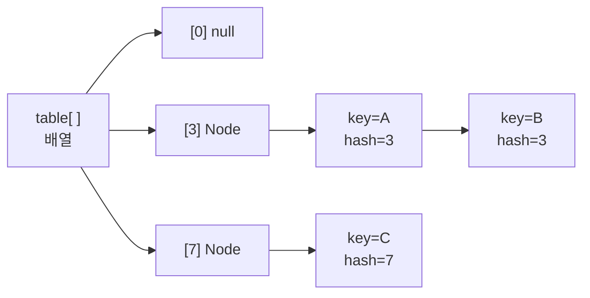
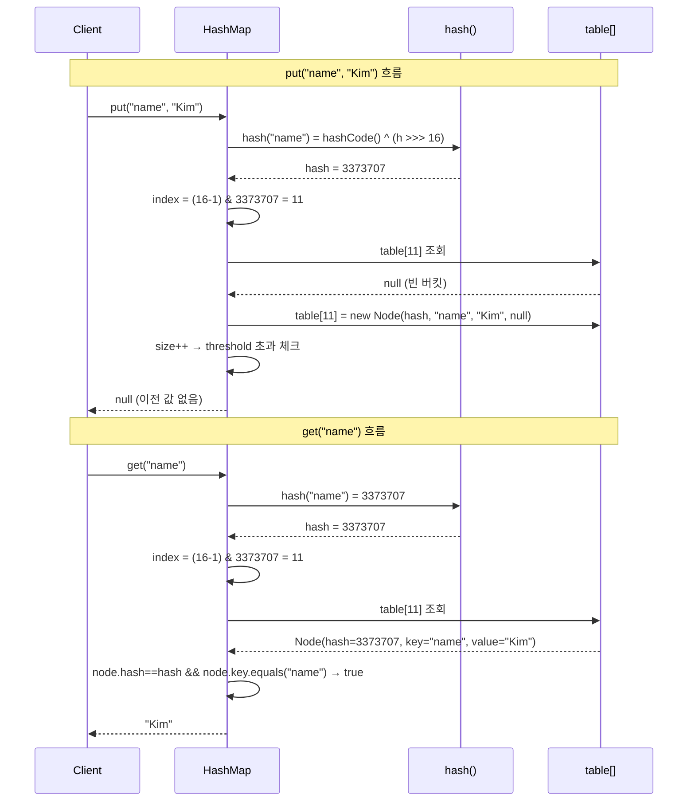
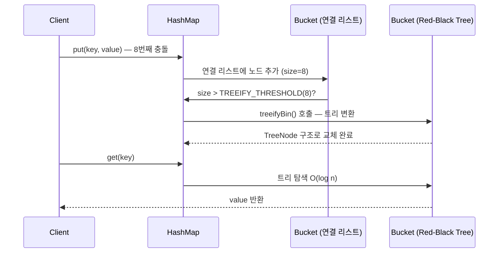
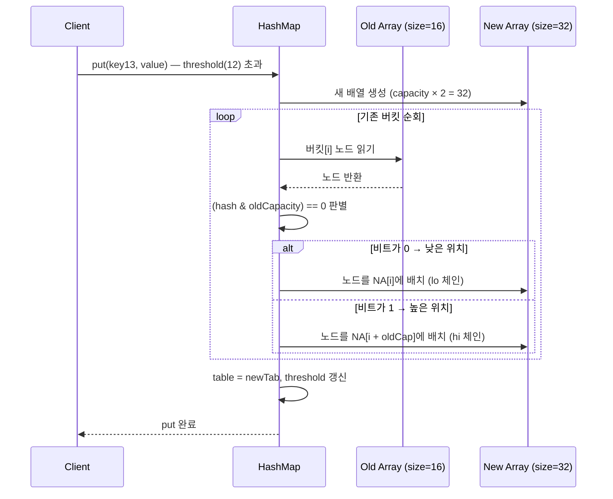
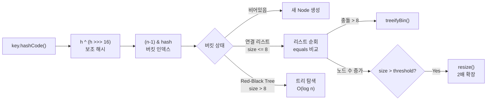

> **한 줄 요약**: HashMap은 해시 함수로 키를 배열 인덱스로 변환하고, 충돌 시 연결 리스트(→ 8개 초과 시 Red-Black Tree)로 해결하며, 로드 팩터 0.75를 초과하면 2배 resize하는 O(1) 평균 자료구조다.

---

## 실제 사고 — 멀티스레드 HashMap이 서버를 먹통으로 만들다

2012년 한 대형 커머스 서비스에서 배포 직후 특정 API가 100% CPU를 점유하며 응답을 멈추는 사고가 발생했습니다. 스레드 덤프를 보니 여러 스레드가 `HashMap.get()` 내부의 `while` 루프에서 영원히 빠져나오지 못하고 있었습니다. 원인은 단 하나, **싱글턴 빈으로 관리되던 `HashMap`을 멀티스레드 환경에서 동기화 없이 공유**한 것이었습니다.

왜 무한 루프가 생기는지, Java 7과 Java 8에서 어떻게 다르게 동작하는지는 이 글의 핵심 주제입니다. 결론부터 말하면, Java 7의 resize 로직은 연결 리스트를 **역순으로 재구성**하는 구조적 결함을 가지고 있었고, 멀티스레드 환경에서 이 역전이 순환 참조(cycle)를 만들어 무한 루프를 일으킵니다. Java 8에서 이 설계를 고쳤지만, 그렇다고 `HashMap`이 thread-safe해진 것은 아닙니다.

이 글은 이 사고를 이해하기 위해 필요한 모든 내부 동작 원리를 밑바닥부터 정리합니다.

---

## 1. 해싱의 근본 원리 — 왜 O(1)이 가능한가

### 1.1 해시 함수란 무엇인가

해시 함수(hash function)는 임의 크기의 입력을 **고정 크기의 정수**로 변환하는 함수입니다. 도서관 비유가 직관적입니다. 책 제목(키)이 무엇이든 간에, 사서는 책의 제목을 계산 공식에 넣어 서가 번호(인덱스)를 즉시 도출합니다. 책 제목을 처음부터 끝까지 스캔하는 게 아니라 **공식 하나로 위치를 직접 계산**하는 것이 핵심입니다.

Java에서 `hashCode()`는 모든 `Object`에 정의된 메서드로, 객체를 `int` 타입의 해시 값으로 변환합니다.

```java
// String의 hashCode 계산 방식 (JDK 실제 구현)
// s[0]*31^(n-1) + s[1]*31^(n-2) + ... + s[n-1]
// 왜 31인가? 홀수이면서 소수, 2의 거듭제곱에 가까워 JIT이 최적화하기 좋음
// 31 * i == (i << 5) - i 로 비트 연산으로 대체 가능
"hello".hashCode(); // 99162322
"world".hashCode(); // 113318802
```

좋은 해시 함수가 갖추어야 할 속성은 세 가지입니다.

- **결정론(Deterministic)**: 동일한 입력에 대해 항상 동일한 값을 반환해야 합니다. `hashCode()`는 같은 JVM 세션 안에서 항상 같은 값을 반환합니다(단, JVM 재시작 시 String의 해시값이 달라질 수 있습니다 — Java 8u20 이후 `String.hashCode()`는 값이 고정되지만, 사용자 정의 클래스에서 `System.identityHashCode()`에 의존하면 재시작마다 달라집니다).
- **균등 분포(Uniform Distribution)**: 입력이 고르게 퍼져 있을 때 출력도 고르게 분포해야 합니다. 특정 버킷에 편중되면 해당 버킷의 연결 리스트가 길어집니다.
- **고속(Fast)**: 해시 계산 자체가 느리면 HashMap의 O(1) 이점이 사라집니다. String의 `hashCode()`는 길이에 비례하지만, 한 번 계산된 후 캐시됩니다(`hash` 필드에 저장).

```java
// String 내부: 해시값 캐싱 구조
public final class String {
    private int hash; // 0이 기본값. 계산 전까지 0
    // hashCode() 호출 시 hash 필드가 0이면 계산 후 저장
    // 이후 호출은 저장된 값 즉시 반환 (재계산 없음)
    public int hashCode() {
        int h = hash;
        if (h == 0 && value.length > 0) {
            h = computeHashCode();
            hash = h;
        }
        return h;
    }
}
```

### 1.2 hashCode() → 배열 인덱스 변환: `(n-1) & hash`

`hashCode()`가 반환하는 값은 `int` 범위(-2^31 ~ 2^31-1)의 정수입니다. 이것을 배열 크기 `n`에 맞는 인덱스로 변환해야 합니다. 가장 직관적인 방법은 나머지 연산입니다.

```
index = hash % n
```

그런데 Java HashMap은 `%` 대신 비트 AND를 사용합니다.

```
index = (n - 1) & hash
```

**왜 `%` 대신 `&`인가?** 이것이 바로 `n`이 반드시 2의 거듭제곱이어야 하는 이유입니다. `n`이 2의 거듭제곱일 때, `n - 1`은 이진수로 표현하면 하위 비트가 모두 1인 마스크가 됩니다.

```
n = 16  → 이진수: 0001 0000
n-1 = 15 → 이진수: 0000 1111  (마스크)

hash = 99162322 → 이진수: 0101 1110 .... 0001 0010
(n-1) & hash    → 이진수: 0000 0000 .... 0000 0010 = 2 (인덱스)
```

`&` 연산은 `%` 연산보다 수십 배 빠릅니다. 나머지 연산은 내부적으로 나눗셈(division)을 포함하지만, 비트 AND는 단일 클록 사이클에 처리됩니다. HashMap이 수백만 번의 `put`/`get`을 처리하는 환경에서 이 차이가 누적되면 의미 있는 성능 차이로 이어집니다.

### 1.3 왜 상위 비트를 하위 비트에 XOR하는가 — 보조 해시 함수

`(n-1) & hash`에는 한 가지 문제가 있습니다. 배열 크기가 작을 때(예: n=16), 하위 4비트만 인덱스 계산에 사용됩니다. 상위 28비트는 완전히 무시됩니다. 만약 서로 다른 키들의 `hashCode()`가 하위 4비트만 다르고 나머지가 같다면 충돌이 집중됩니다.

이 문제를 해결하기 위해 Java 8의 HashMap은 `hash()` 보조 함수를 통해 상위 16비트 정보를 하위 16비트에 섞어줍니다.

```java
// JDK 8 HashMap.hash() 메서드 (실제 소스)
static final int hash(Object key) {
    int h;
    return (key == null) ? 0 : (h = key.hashCode()) ^ (h >>> 16);
}
```

**왜 `>>> 16` XOR인가?** `int`는 32비트입니다. 상위 16비트를 오른쪽으로 16번 밀어서 하위 16비트 자리로 내린 뒤, 원래 하위 16비트와 XOR합니다. 이렇게 하면 원본 해시값의 **상위 비트 정보가 하위 비트에 반영**되어, 배열 크기가 작아도 해시 분산이 고르게 유지됩니다.

```
원본 hash:        1010 1100 1111 0000 | 0101 0011 1000 1111
h >>> 16:         0000 0000 0000 0000 | 1010 1100 1111 0000
XOR 결과:         1010 1100 1111 0000 | 1111 1111 0111 1111
                                        ↑↑↑↑ 상위 비트 정보가 섞임
```

비유하자면, 전화번호부에서 성만 보고 서랍을 배정하지 않고 성+이름의 조합으로 서랍을 정하는 것과 같습니다. 성이 "김"인 사람이 아무리 많아도 이름까지 조합하면 분산이 고르게 됩니다.

---

### 1.4 HashMap의 내부 구조 — Node 배열과 체인

HashMap의 실제 내부 구조를 코드 수준에서 이해하면 나머지 개념이 훨씬 명확해집니다.

```java
// JDK 8 HashMap 핵심 필드 (단순화)
public class HashMap<K,V> {
    // 1) 버킷 배열 — 실제 데이터 저장소
    //    각 슬롯은 Node(연결 리스트 헤드) 또는 TreeNode(트리 루트)
    transient Node<K,V>[] table;

    // 2) 저장된 엔트리 수 (배열 크기와 다름)
    transient int size;

    // 3) resize 임계값: capacity * loadFactor
    int threshold;

    // 4) 로드 팩터 (기본 0.75)
    final float loadFactor;

    // 5) 구조 변경 횟수 — Iterator의 fail-fast를 위해 사용
    transient int modCount;

    // 연결 리스트 노드
    static class Node<K,V> implements Map.Entry<K,V> {
        final int hash;   // 키의 해시값 캐시 (재계산 방지)
        final K key;      // 키 (불변)
        V value;          // 값 (가변)
        Node<K,V> next;   // 다음 노드 포인터
    }
}
```

**왜 `hash`를 Node에 저장하는가?** resize 시마다 `key.hashCode()`를 재호출하는 것을 피하기 위해서입니다. 특히 사용자 정의 `hashCode()`가 비용이 클 때 이 캐싱이 중요합니다. 단, 이 캐시는 키가 불변임을 전제합니다. 가변 객체를 키로 쓰면 안 되는 이유가 여기에도 있습니다.



---

## 2. 충돌 해결 전략 — 왜 Separate Chaining인가

### 2.0 put()과 get() 동작 흐름 — 단계별 추적

HashMap의 핵심 연산인 `put()`과 `get()`이 내부적으로 어떤 단계를 거치는지 sequenceDiagram으로 먼저 확인합니다.



**왜 `equals()`를 호출하는가?** `(n-1) & hash`는 인덱스를 찾을 뿐, 해당 버킷에 여러 키가 있을 수 있습니다(충돌). 같은 버킷의 노드들을 순회하며 `hash` 값이 일치하고 `key.equals(targetKey)`가 `true`인 노드를 찾습니다. `hash` 비교를 먼저 하는 이유는 `int` 비교가 `equals()` 호출보다 훨씬 빠르기 때문입니다. 즉, 해시가 다르면 `equals()`를 아예 호출하지 않아 불필요한 비교를 스킵합니다.

```java
// JDK 8 HashMap.getNode() 핵심 로직 (단순화)
final Node<K,V> getNode(int hash, Object key) {
    Node<K,V>[] tab = table;
    Node<K,V> first = tab[(tab.length - 1) & hash];

    if (first != null) {
        // 1) 첫 번째 노드 먼저 확인 (가장 흔한 케이스)
        if (first.hash == hash &&
            (first.key == key || (key != null && key.equals(first.key))))
            return first;

        // 2) 충돌이 있으면 체인/트리 순회
        Node<K,V> e = first.next;
        if (first instanceof TreeNode)
            return ((TreeNode<K,V>)first).getTreeNode(hash, key);
        do {
            if (e.hash == hash &&
                (e.key == key || (key != null && key.equals(e.key))))
                return e;
        } while ((e = e.next) != null);
    }
    return null;
}
```

### 2.1 Open Addressing vs Separate Chaining

해시 충돌(같은 인덱스에 두 키가 배정되는 상황)을 해결하는 방법은 크게 두 가지입니다.

| 전략 | 방식 | 장점 | 단점 |
|------|------|------|------|
| **Open Addressing** | 충돌 시 다음 빈 슬롯을 찾아 이동 (linear/quadratic/double hashing) | 캐시 지역성 좋음, 포인터 오버헤드 없음 | 삭제가 복잡, 클러스터링 발생, 로드 팩터에 민감 |
| **Separate Chaining** | 같은 인덱스에 연결 리스트(또는 트리)로 이어 붙임 | 삭제 단순, 로드 팩터 유연, 구현 단순 | 포인터 오버헤드, 캐시 미스 가능 |

### 2.2 왜 Java는 Separate Chaining을 선택했는가

Java HashMap의 설계 목표는 **범용성**입니다. Open Addressing은 로드 팩터가 0.7~0.8을 넘어가면 클러스터링이 급격히 악화되어 성능이 떨어집니다. 반면 Separate Chaining은 로드 팩터가 1을 넘어도 동작은 하며, 성능 저하가 선형적입니다.

또한 **삭제 연산**에서 Open Addressing은 삭제된 슬롯에 특수 마커(tombstone)를 남겨야 하는 복잡성이 생깁니다. Map에서 삭제는 빈번한 연산이므로, 이 복잡성을 피하기 위해 Separate Chaining이 선택되었습니다.

### 2.3 왜 8개 초과 시 Red-Black Tree로 변환하는가 — 포아송 분포

Java 8부터 하나의 버킷에 연결 리스트의 노드가 8개를 초과하면 자동으로 **Red-Black Tree**로 변환됩니다(`TREEIFY_THRESHOLD = 8`). 이 숫자는 임의로 정한 것이 아닙니다.

HashMap의 JavaDoc에는 이렇게 기술되어 있습니다.

> 이상적인 랜덤 hashCode를 사용할 때, 버킷의 노드 수가 포아송 분포를 따르며, 로드 팩터 0.75에서 노드가 k개일 확률은 다음과 같다.
>
> - 0개: 0.60653066
> - 1개: 0.30326533
> - 2개: 0.07581633
> - 3개: 0.01263606
> - 4개: 0.00157952
> - 5개: 0.00015795
> - 6개: 0.00001316
> - 7개: 0.00000094
> - **8개: 0.00000006**

8개의 노드가 하나의 버킷에 몰릴 확률은 약 **0.000006%**입니다. 이 정도 극단적인 상황에서만 트리로 변환하는 이유는 트리 자체의 오버헤드가 있기 때문입니다. `TreeNode`는 일반 `Node`보다 약 **2배** 메모리를 사용합니다(`Node`는 4개 필드, `TreeNode`는 6개 필드 + 레드/블랙 마커). 충돌이 적은 정상 상황에서 모든 버킷을 트리로 유지하면 메모리 낭비가 심합니다.



**Red-Black Tree를 선택한 이유**는 AVL Tree와의 비교에서 나옵니다. AVL Tree는 삽입/삭제 시 회전이 더 자주 발생해 쓰기가 많은 HashMap 환경에서 불리합니다. Red-Black Tree는 약간 균형이 덜 맞지만(최악의 경우 높이 2log n) 삽입/삭제가 빠릅니다.

### 2.4 왜 6개 이하로 줄면 다시 연결 리스트로 돌아가는가

트리에서 연결 리스트로 돌아가는 임계값은 `UNTREEIFY_THRESHOLD = 6`입니다. 왜 8이 아니라 6인가?

만약 변환 임계값이 같다면(예: 8/8), 노드가 8개인 상태에서 삽입과 삭제가 반복될 때마다 리스트→트리→리스트→트리 전환이 계속 발생하는 **스래싱(thrashing)** 문제가 생깁니다. 8과 6 사이의 2 차이는 이 스래싱을 방지하는 **히스테리시스(hysteresis) 구간**입니다. 노드가 7개일 때는 현재 상태(트리 또는 리스트)를 유지하며, 극단적인 경계에서 구조 전환이 반복되는 것을 막습니다.

---

## 3. resize (동적 확장) — 왜 2배로 늘리는가

### 3.1 로드 팩터 0.75의 의미

**로드 팩터(load factor)**는 HashMap이 얼마나 찼을 때 배열을 확장할지 결정하는 기준입니다.

```
임계값(threshold) = 현재 배열 크기(capacity) × 로드 팩터(load factor)
기본: threshold = 16 × 0.75 = 12  →  노드가 12개 들어오면 resize 시작
```

왜 0.75인가? 이것은 공간 효율(메모리)과 시간 효율(탐색 성능) 사이의 트레이드오프입니다.

- **로드 팩터가 낮으면(예: 0.5)**: 배열 슬롯의 절반만 채워도 확장. 충돌이 적어 빠르지만 메모리 낭비가 심합니다.
- **로드 팩터가 높으면(예: 1.0)**: 배열이 꽉 찰 때까지 확장 안 함. 메모리는 효율적이지만 충돌이 많아 연결 리스트가 길어집니다.
- **0.75**: 수학적으로 랜덤 해시 분포에서 충돌 확률과 메모리 사용률의 균형이 가장 좋은 값으로 알려져 있습니다. 정보 이론에서 log 2 ≈ 0.693에 가깝기도 합니다.

### 3.2 왜 2배로 늘리는가

resize 시 새 배열 크기를 2배로 하는 이유는 `(n-1) & hash` 인덱스 계산과 직결됩니다. 크기를 2배로 늘리면 **기존 노드의 새 인덱스는 두 가지 중 하나**입니다.

```
기존 인덱스: oldIndex
새 인덱스:  oldIndex  (상위 비트가 0인 경우)
         또는 oldIndex + oldCapacity  (상위 비트가 1인 경우)
```

예를 들어 배열 크기가 16 → 32로 늘면, 인덱스 계산에 사용하는 비트가 4비트에서 5비트로 늘어납니다. 추가된 1비트가 0이면 기존 자리, 1이면 기존 자리 + 16입니다. 이 특성 덕분에 재해싱 시 **해시 값을 재계산하지 않고** 비트 하나만 확인하면 됩니다. Java 8의 resize 로직이 이 방식을 사용합니다.

### 3.3 resize 과정 단계별



### 3.4 Java 7 resize 버그 — 연결 리스트 역전으로 무한 루프

Java 7의 `transfer()` 메서드는 연결 리스트를 순회하면서 새 배열에 삽입할 때 **헤드 삽입(head insertion)** 방식을 사용했습니다. 헤드 삽입은 기존 연결 리스트를 자동으로 역순으로 만듭니다.

```
Java 7 transfer() 핵심 코드:
  Entry<K,V> next = e.next;
  int i = indexFor(e.hash, newCapacity);
  e.next = newTable[i];   // 새 배열의 헤드를 e의 다음으로 (역전!)
  newTable[i] = e;        // e를 헤드로
  e = next;
```

멀티스레드 환경에서 두 스레드가 동시에 resize에 진입하면:

1. 스레드 A가 `A → B` 순서의 리스트를 역전시켜 `B → A`를 만드는 중
2. 스레드 B가 이미 A가 처리한 부분에서 `A.next = B` (A가 B를 가리킴)
3. 스레드 A가 완료하면 `B → A`이고, B는 이미 A를 가리키므로 `A → B → A → B → ...` **순환 참조 발생**
4. 이후 `get(key)` 시 해당 버킷 순회 중 무한 루프

### 3.5 Java 8에서 어떻게 고쳤는가 — 순서 보존 lo/hi split

Java 8은 `transfer()` 대신 각 버킷을 lo/hi 두 체인으로 분리하면서 **꼬리 삽입(tail insertion)**을 사용합니다. 꼬리 삽입은 원래 순서를 그대로 유지합니다.

```java
// Java 8 resize 핵심 로직 (단순화)
Node<K,V> loHead = null, loTail = null;  // 낮은 인덱스 체인
Node<K,V> hiHead = null, hiTail = null;  // 높은 인덱스 체인

do {
    next = e.next;
    if ((e.hash & oldCap) == 0) {
        if (loTail == null) loHead = e;
        else loTail.next = e;   // 꼬리에 붙임 → 순서 보존
        loTail = e;
    } else {
        if (hiTail == null) hiHead = e;
        else hiTail.next = e;   // 꼬리에 붙임 → 순서 보존
        hiTail = e;
    }
} while ((e = next) != null);

if (loTail != null) { loTail.next = null; newTab[j] = loHead; }
if (hiTail != null) { hiTail.next = null; newTab[j + oldCap] = hiHead; }
```

순서가 보존되므로 순환 참조가 생기지 않습니다. 단, Java 8에서도 동시 접근은 여전히 안전하지 않으며, 단지 무한 루프 버그만 수정된 것입니다. **데이터 유실, 중복 삽입, 스테일 뷰** 등의 문제는 여전히 발생할 수 있습니다.

### 3.6 resize 중 성능 저하 — 초기 용량을 잘 잡아야 하는 이유

resize는 새 배열 할당, 기존 노드 전체 재배치, GC 압박을 동반하는 **비싼 연산**입니다. 10만 건의 데이터를 초기 용량 16으로 시작하면 몇 번의 resize가 발생할까요?

```
16 → 32 → 64 → 128 → 256 → 512 → 1024 → 2048 → 4096 → 8192 → 16384 → 32768 → 65536 → 131072
총 13번 resize 발생
```

각 resize마다 기존 데이터를 전부 재배치하므로, 100,000건 기준으로 합산하면 약 **200,000건 이상의 불필요한 노드 이동**이 발생합니다. 데이터 크기를 미리 알면 초기 용량을 지정해 resize를 최소화해야 합니다.

```java
// 나쁜 예 — 기본 초기 용량 16으로 시작
Map<String, Object> map = new HashMap<>();

// 좋은 예 — 예상 데이터 수 / 로드 팩터로 초기 용량 계산
// 100,000건 예상 → 100,000 / 0.75 ≈ 133,334 → 다음 2의 거듭제곱 = 262,144
Map<String, Object> map = new HashMap<>(262144);

// 또는 Guava의 Maps.newHashMapWithExpectedSize(n) 활용
// 내부적으로 n / 0.75 + 1 계산
Map<String, Object> map = Maps.newHashMapWithExpectedSize(100_000);
```

---

## 4. equals()와 hashCode() 계약

### 4.1 왜 equals를 오버라이드하면 hashCode도 오버라이드해야 하는가

Java의 `Object` 계약(contract)에는 다음 규칙이 있습니다.

> `a.equals(b)` 가 `true`이면, `a.hashCode() == b.hashCode()` 이어야 한다.

이 규칙을 어기면 HashMap에서 **같은 키가 다른 버킷에 들어가는 참사**가 발생합니다.

```java
public class User {
    String name;
    int age;

    // equals만 오버라이드하고 hashCode는 기본값(Object의 메모리 주소 기반) 사용
    @Override
    public boolean equals(Object o) {
        User u = (User) o;
        return this.name.equals(u.name) && this.age == u.age;
    }
    // hashCode 오버라이드 없음 → 치명적 버그
}

User u1 = new User("Kim", 30);
User u2 = new User("Kim", 30);

System.out.println(u1.equals(u2)); // true → 논리적으로 같은 키

Map<User, String> map = new HashMap<>();
map.put(u1, "developer");
map.get(u2); // null !!
// 이유: u1과 u2는 hashCode가 다르므로 다른 버킷에 들어감
//      get(u2)는 u2의 버킷에서 찾는데, u1은 다른 버킷에 있음
```

반대 방향은 어떨까요? `hashCode`가 같은데 `equals`가 `false`인 경우(일반 충돌)는 허용됩니다. 다만 충돌이 많으면 성능이 저하될 뿐입니다.

### 4.2 올바른 hashCode 구현

```java
public class User {
    String name;
    int age;

    @Override
    public boolean equals(Object o) {
        if (this == o) return true;
        if (!(o instanceof User)) return false;
        User u = (User) o;
        return age == u.age && Objects.equals(name, u.name);
    }

    @Override
    public int hashCode() {
        // Java 7+: Objects.hash() 사용
        // 내부적으로 Arrays.hashCode(new Object[]{name, age}) 호출
        return Objects.hash(name, age);
    }
}
```

**왜 `Objects.hash()`가 좋은가?** `31` 승수를 사용한 전통적인 패턴(`result = 31 * result + field.hashCode()`)과 동일한 효과를 내면서, `null` 안전성을 자동으로 보장합니다. 직접 구현하면 필드가 `null`일 때 `NullPointerException`이 터질 수 있습니다.

### 4.3 Lombok @EqualsAndHashCode의 함정 — 상속 시 문제

Lombok의 `@EqualsAndHashCode`는 편리하지만, 상속 구조에서 주의가 필요합니다.

```java
@EqualsAndHashCode  // callSuper 기본값: false
public class Employee extends User {
    String department;
    // callSuper=false이면 부모 클래스 필드(name, age)를 무시
    // Employee("Kim", 30, "Engineering").equals(Employee("Park", 25, "Engineering"))
    // → department만 비교하므로 true가 될 수 있음!
}

// 올바른 사용
@EqualsAndHashCode(callSuper = true)  // 부모 필드도 포함
public class Employee extends User {
    String department;
}
```

또한 `@EqualsAndHashCode`가 붙은 엔티티를 JPA `Set`에 담을 때, 영속화 전후로 `hashCode`가 바뀌는 문제가 있습니다. JPA 엔티티에는 `id` 필드만으로 `hashCode`를 계산하거나, 불변 자연키(natural key)를 사용하는 것이 안전합니다.

---

## 5. HashMap vs HashSet vs Hashtable vs LinkedHashMap vs TreeMap

### 5.1 종합 비교 테이블

| 클래스 | 내부 구조 | 동기화 | 순서 보장 | null 키 | null 값 | 평균 시간 복잡도 |
|--------|----------|--------|----------|---------|---------|----------------|
| **HashMap** | 배열 + 체인/트리 | X | X | O (1개) | O | O(1) |
| **HashSet** | HashMap 내부 사용 | X | X | O (1개) | — | O(1) |
| **Hashtable** | 배열 + 체인 | O (전체 락) | X | X | X | O(1) but 느림 |
| **LinkedHashMap** | HashMap + 이중 연결 리스트 | X | 삽입순/접근순 | O (1개) | O | O(1) |
| **TreeMap** | Red-Black Tree | X | 키 정렬순 | X | O | O(log n) |
| **ConcurrentHashMap** | 세그먼트/버킷 락 | O (세분화 락) | X | X | X | O(1) |

### 5.2 왜 Hashtable을 쓰면 안 되는가

`Hashtable`은 Java 1.0부터 존재한 레거시 클래스입니다. `synchronized` 키워드가 모든 public 메서드에 붙어 있어, **전체 테이블에 단일 락**을 겁니다.

```
Hashtable.get() 호출 → 전체 테이블 락 → 다른 모든 스레드 대기
```

`ConcurrentHashMap`은 Java 8부터 **버킷 단위 락**(`synchronized` on bin head)을 사용합니다. 서로 다른 버킷에 접근하는 스레드들은 완전히 병렬로 동작합니다. 128개 버킷에서 이론적으로 최대 128배의 쓰기 병렬성을 가집니다.

```java
// 나쁜 예 — Hashtable (레거시, 성능 저하)
Map<String, String> table = new Hashtable<>();

// 좋은 예 — ConcurrentHashMap (thread-safe, 고성능)
Map<String, String> map = new ConcurrentHashMap<>();
```

### 5.3 LinkedHashMap의 accessOrder — LRU 캐시 구현

`LinkedHashMap`은 내부적으로 이중 연결 리스트를 유지해 삽입 순서(기본) 또는 접근 순서(accessOrder=true)로 순회할 수 있습니다. `removeEldestEntry()`를 오버라이드하면 **LRU(Least Recently Used) 캐시**를 단 몇 줄로 구현할 수 있습니다.

```java
// accessOrder=true로 LRU 캐시 구현
public class LRUCache<K, V> extends LinkedHashMap<K, V> {
    private final int maxSize;

    public LRUCache(int maxSize) {
        // accessOrder=true: get/put 시 해당 엔트리가 연결 리스트 맨 뒤로 이동
        super(maxSize, 0.75f, true);
        this.maxSize = maxSize;
    }

    // 엔트리 추가 후 호출됨 — true 반환 시 가장 오래된 엔트리 자동 삭제
    @Override
    protected boolean removeEldestEntry(Map.Entry<K, V> eldest) {
        return size() > maxSize;
    }
}

LRUCache<String, String> cache = new LRUCache<>(3);
cache.put("a", "1"); cache.put("b", "2"); cache.put("c", "3");
cache.get("a");      // a가 최근 접근으로 갱신
cache.put("d", "4"); // 가장 오래된 b가 제거됨
System.out.println(cache.containsKey("b")); // false
```

### 5.4 TreeMap의 Red-Black Tree — 정렬 순서 유지

`TreeMap`은 키를 자연 순서(`Comparable`) 또는 지정한 `Comparator`로 정렬해 저장합니다. 내부는 Red-Black Tree이므로 `get`/`put`/`remove`가 모두 O(log n)입니다.

```java
TreeMap<String, Integer> scores = new TreeMap<>();
scores.put("Charlie", 85);
scores.put("Alice", 92);
scores.put("Bob", 78);

// 항상 키 알파벳 순 반환
scores.forEach((k, v) -> System.out.println(k + ": " + v));
// Alice: 92 / Bob: 78 / Charlie: 85

// 범위 조회 — HashMap으로는 불가능한 기능
System.out.println(scores.subMap("Alice", "Charlie")); // {Alice=92, Bob=78}
System.out.println(scores.floorKey("B")); // Alice
```

**언제 TreeMap을 쓰는가?** 키 순서 기반 범위 조회(`subMap`, `headMap`, `tailMap`), 최솟값/최댓값 조회(`firstKey`, `lastKey`)가 필요할 때입니다. 단순한 키-값 조회라면 HashMap이 O(1)으로 훨씬 빠릅니다.

---

## 6. 극한 시나리오 3개

### 시나리오 1: 모든 키의 hashCode가 같으면? — HashDoS 공격

모든 키의 `hashCode()`가 동일한 값을 반환하면 HashMap의 모든 데이터가 **하나의 버킷**에 몰립니다.

- Java 7: 연결 리스트 O(n) 탐색 → `get()` 하나가 O(n) → 10만 건이면 10만 번 비교
- Java 8: 8개 초과 시 Red-Black Tree로 변환 → O(log n)으로 개선 → 그래도 O(1)이 아님

**HashDoS(Hash Denial of Service)** 공격은 이 원리를 이용합니다. 공격자가 서버의 해시 함수를 분석해 충돌을 유발하는 키들을 대량으로 전송하면, 서버의 HashMap 처리가 O(n²)으로 폭발합니다. 실제로 2011년 PHP, Python, Java 등 여러 언어의 웹 프레임워크가 이 공격에 취약함이 밝혀졌습니다.

Java 8+는 트리 변환으로 최악의 경우를 O(log n)으로 제한하지만, 완전한 방어는 아닙니다. 외부 입력을 키로 사용하는 HashMap은 추가 방어 계층(키 길이 제한, 입력 검증)이 필요합니다.

```java
// 최악의 hashCode 구현 예시 (절대 하면 안 됨)
@Override
public int hashCode() {
    return 42; // 항상 같은 값 → 모든 노드가 같은 버킷에 집중
}
```

### 시나리오 2: resize 중 다른 스레드가 put하면? — Java 7 무한 루프 재현

앞서 설명한 Java 7 무한 루프 시나리오를 단계별로 추적합니다.

```
초기 상태: 버킷[3] = A → B → null (A.next = B, B.next = null)

스레드 T1이 resize 시작:
  e = A, next = B
  → newTable[3] = A, A.next = null

스레드 T2가 끼어들어 resize 완료:
  B → A (역전 완료) → B.next = A, A.next = null

T1이 다시 실행 재개:
  e = next = B
  newTable[3]의 head = A이므로
  B.next = A    ← 이미 A.next = null 아님 (T2가 건드림)
  newTable[3] = B

이제 A.next = B, B.next = A → 순환 참조!
이후 get() 시 while (e != null) 루프가 영원히 순환
```

### 시나리오 3: 10만 건을 초기 용량 16으로 넣으면? — resize 13번

```
용량 16, threshold 12:
  12번째 put → resize → 32
  24번째 put → resize → 64
  48번째 put → resize → 128
  96번째 put → resize → 256
  192번째 put → resize → 512
  384번째 put → resize → 1024
  768번째 put → resize → 2048
  1,536번째 put → resize → 4096
  3,072번째 put → resize → 8192
  6,144번째 put → resize → 16384
  12,288번째 put → resize → 32768
  24,576번째 put → resize → 65536
  49,152번째 put → resize → 131072  ← 13번째 resize
```

각 resize 시 기존 데이터를 전체 재배치하는 비용을 합산하면 약 26만 번의 노드 이동이 발생합니다. 초기에 `new HashMap<>(131072)` 또는 `new HashMap<>(100_000, 0.75f)`로 선언하면 resize 횟수를 0~1회로 줄일 수 있습니다.

실무에서 Redis, 캐시 레이어 없이 HashMap으로 대용량 데이터를 처리할 때 이 초기화 비용이 응답 시간 피크로 나타나는 경우가 있습니다.

---

## 7. 면접 포인트

### 면접 포인트 1️⃣ "HashMap의 시간 복잡도가 항상 O(1)인가?"

**아닙니다.** O(1)은 평균(amortized average) 복잡도입니다. 최악의 경우는 다음과 같습니다.

- 모든 키가 같은 버킷에 충돌: Java 7에서는 O(n), Java 8에서는 O(log n)
- resize 시점: O(n) (전체 재배치)

면접에서 "O(1) 평균, O(log n) 최악(Java 8+), resize 시 O(n)"으로 답하면 정확합니다.

### 면접 포인트 2️⃣ "hashCode()와 equals() 계약을 설명하라"

핵심 규칙은 두 가지입니다.

1. `a.equals(b)` → 반드시 `a.hashCode() == b.hashCode()` (필수)
2. `a.hashCode() == b.hashCode()` → `a.equals(b)` 일 수도 있고 아닐 수도 있음 (충돌 허용)

이 규칙을 어기면 HashMap에서 동일 키가 다른 버킷에 들어가 `get()`이 `null`을 반환합니다. `equals`를 오버라이드하면 반드시 `hashCode`도 오버라이드해야 합니다.

### 면접 포인트 3️⃣ "HashMap은 왜 thread-safe하지 않은가?"

`HashMap`의 내부 연산(버킷 접근, 연결 리스트 조작, resize)은 원자적이지 않습니다. 두 스레드가 동시에 같은 버킷에 접근하면 구조가 깨집니다.

- **Java 7**: resize 시 연결 리스트 역전으로 순환 참조 → 무한 루프
- **Java 8**: 순환 참조 버그는 수정됐지만 데이터 유실, 중복 삽입 가능

thread-safe가 필요하면 `ConcurrentHashMap`을 사용합니다. `Collections.synchronizedMap()`은 `Hashtable`과 마찬가지로 전체 락이므로 권장하지 않습니다.

### 면접 포인트 4️⃣ "초기 용량과 로드 팩터를 어떻게 설정하는가?"

- **초기 용량**: 예상 데이터 수를 로드 팩터로 나눈 값의 다음 2의 거듭제곱. 예상 데이터 n건이면 `new HashMap<>((int)(n / 0.75) + 1)` 또는 Guava의 `Maps.newHashMapWithExpectedSize(n)`
- **로드 팩터**: 기본 0.75가 대부분의 경우 최적. 메모리가 충분하고 읽기가 많으면 0.5로 낮춰 충돌 최소화. 메모리가 빠듯하면 0.9까지 높일 수 있지만 성능 저하 주의

### 면접 포인트 5️⃣ "Java 8에서 HashMap이 어떻게 바뀌었는가?"

1. **Red-Black Tree 도입**: 버킷 크기 8 초과 시 연결 리스트 → 트리 자동 변환 (최악 O(n) → O(log n))
2. **보조 해시 함수 변경**: Java 7은 4번의 XOR shift를 사용한 복잡한 보조 해시. Java 8은 단순한 `h ^ (h >>> 16)`으로 단순화 (트리 변환이 성능 보호를 담당)
3. **resize 로직 개선**: 헤드 삽입 → 꼬리 삽입으로 변경, 순서 보존으로 순환 참조 버그 수정
4. **인덱스 재계산 최적화**: resize 시 `hash % newCapacity` 대신 비트 마스크로 lo/hi 체인 분리

---

### 면접 포인트 보충 — ConcurrentHashMap 세분화 락 원리

면접에서 "왜 `ConcurrentHashMap`이 `Hashtable`보다 빠른가"를 물으면, 락 범위의 차이를 구체적으로 설명해야 합니다.

```
Hashtable:
  스레드 T1 → get("a") → 전체 테이블 락(synchronized) → T2, T3, T4 모두 대기

ConcurrentHashMap (Java 8):
  스레드 T1 → put("a", ...) → bucket[3] 헤드 노드에만 synchronized
  스레드 T2 → put("z", ...) → bucket[25] 헤드 노드에만 synchronized
  → T1과 T2는 완전히 병렬 실행 가능
```

Java 8의 `ConcurrentHashMap`은 버킷이 비어있을 때 `CAS(Compare-And-Swap)` 연산으로 락 없이 삽입하고, 충돌 시에만 해당 버킷의 헤드 노드를 `synchronized`로 잠급니다. 읽기(`get()`)는 `volatile` 필드를 통해 락 없이 수행됩니다.

```java
// ConcurrentHashMap.putVal() 핵심 로직 (단순화)
if (tab == null || (n = tab.length) == 0)
    tab = initTable();                          // 초기화는 CAS

// 빈 버킷: CAS로 락 없이 삽입
if (casTabAt(tab, i, null, new Node<>(hash, key, value, null)))
    break;

// 이미 노드 있음: 버킷 헤드에 synchronized
synchronized (f) { ... }
```

이 구조 덕분에 `ConcurrentHashMap`은 읽기가 많은 환경에서 사실상 락 경합이 없으며, 쓰기도 버킷 단위 충돌이 없으면 무락(lock-free) 삽입이 가능합니다.

---

## 8. 실무 실수 Top 5

| 순위 | 실수 | 증상 | 올바른 방법 |
|------|------|------|-------------|
| 1 | `HashMap`을 멀티스레드 환경에서 공유 | 무한 루프, 데이터 유실 | `ConcurrentHashMap` 사용 |
| 2 | `equals` 오버라이드 후 `hashCode` 미구현 | `get()`이 항상 `null` 반환 | 두 메서드 항상 함께 오버라이드 |
| 3 | 초기 용량 미설정으로 대용량 데이터 삽입 | 잦은 resize, GC 압박, 응답 지연 | `new HashMap<>((int)(n / 0.75) + 1)` |
| 4 | 가변 객체(mutable object)를 키로 사용 | 키 변경 후 `get()`으로 찾을 수 없음 | 불변 객체(String, Integer 등)를 키로 사용 |
| 5 | `Hashtable` 또는 `synchronizedMap` 사용 | 불필요한 전체 락으로 처리량 저하 | `ConcurrentHashMap` 사용 |

**가변 객체 키 문제**는 특히 교묘합니다. 키를 `put()` 후 내부 상태를 변경하면 `hashCode()`가 바뀌어 원래 버킷을 찾지 못합니다.

```java
List<String> mutableKey = new ArrayList<>(Arrays.asList("a", "b"));
Map<List<String>, String> map = new HashMap<>();
map.put(mutableKey, "value");

mutableKey.add("c"); // 키 변경 → hashCode 변경!
map.get(mutableKey); // null!! 버킷이 달라짐
```

**실무 실수 6번**: `HashMap`에서 `null` 키 동작을 모르고 버그를 낸다.

```java
Map<String, Integer> map = new HashMap<>();
map.put(null, 100);       // null 키 허용 — 항상 버킷[0]에 저장
map.get(null);            // 100
map.containsKey(null);    // true

// ConcurrentHashMap은 null 키/값 모두 불허
Map<String, Integer> concMap = new ConcurrentHashMap<>();
concMap.put(null, 100);   // NullPointerException!
```

왜 `ConcurrentHashMap`은 `null`을 불허하는가? 멀티스레드 환경에서 `map.get(key)`가 `null`을 반환했을 때, 해당 키가 없는 것인지(not present) 아니면 값이 `null`인 것인지(present but null) 구별할 수 없기 때문입니다. 단일 스레드에서는 `containsKey()`로 확인하면 되지만, 멀티스레드에서는 그 사이에 다른 스레드가 값을 변경할 수 있습니다.

---

## 9. 정리 — HashMap 동작 원리 한 장 요약



HashMap을 쓸 때 머릿속에 이 흐름이 그려진다면, 성능 이슈가 생겼을 때 어디서 병목이 발생하는지, 어떻게 해결해야 하는지 즉각 판단할 수 있습니다. `hashCode`가 나쁘면 버킷 집중 문제, 초기 용량이 작으면 resize 문제, 멀티스레드라면 ConcurrentHashMap으로 교체 — 원인과 해결책이 내부 구조에서 자연스럽게 도출됩니다.

---

## 10. 성능 진단 — 실무에서 HashMap 병목을 찾는 법

운영 환경에서 HashMap 관련 성능 이슈를 진단하는 실용적인 접근입니다.

### 10.1 버킷 분포 확인 — hashCode 품질 측정

```java
// HashMap의 버킷 분포를 직접 확인하는 유틸리티
public static <K, V> void diagnoseHashMap(HashMap<K, V> map) throws Exception {
    // 리플렉션으로 내부 table 접근 (진단 목적으로만 사용)
    java.lang.reflect.Field tableField = HashMap.class.getDeclaredField("table");
    tableField.setAccessible(true);
    Object[] table = (Object[]) tableField.get(map);

    int emptyBuckets = 0;
    int maxChainLength = 0;
    int totalChainLength = 0;
    int usedBuckets = 0;

    for (Object bucket : table) {
        if (bucket == null) { emptyBuckets++; continue; }
        usedBuckets++;
        int chainLen = 0;
        // Node의 next 필드를 따라 체인 길이 계산
        Object node = bucket;
        while (node != null) {
            chainLen++;
            java.lang.reflect.Field nextField = node.getClass().getDeclaredField("next");
            nextField.setAccessible(true);
            node = nextField.get(node);
        }
        maxChainLength = Math.max(maxChainLength, chainLen);
        totalChainLength += chainLen;
    }

    System.out.printf("총 버킷: %d, 사용 버킷: %d, 빈 버킷: %d%n",
        table.length, usedBuckets, emptyBuckets);
    System.out.printf("최대 체인 길이: %d, 평균 체인 길이: %.2f%n",
        maxChainLength, (double) totalChainLength / usedBuckets);
    // 최대 체인 길이가 8 이상이면 hashCode 품질 문제 의심
    if (maxChainLength >= 8)
        System.out.println("[경고] 체인 길이 >= 8 — hashCode 분산 불량 또는 HashDoS 의심");
}
```

**언제 이 진단이 필요한가?** `get()` 응답 시간이 예상보다 훨씬 느리거나, 특정 키 패턴에서 CPU 사용률이 급등할 때입니다. 최대 체인 길이가 8 이상이면 Red-Black Tree 변환이 발생했다는 뜻이고, 이는 hashCode 품질 문제 또는 의도적인 HashDoS 공격 신호입니다.

### 10.2 resize 횟수 모니터링

```java
// modCount를 활용해 resize 발생 여부 감지
HashMap<String, String> map = new HashMap<>(16);
java.lang.reflect.Field modCountField = HashMap.class.getDeclaredField("modCount");
modCountField.setAccessible(true);

int prevModCount = (int) modCountField.get(map);
// ... put 연산들 ...
int currModCount = (int) modCountField.get(map);

// modCount 차이가 put 횟수보다 훨씬 크면 resize가 발생한 것
// (resize 시 modCount가 1 증가)
```

실제 운영 환경에서는 JVM의 GC 로그와 함께 Old Generation 크기 급등을 관찰하는 것이 더 실용적입니다. 대규모 resize는 대량의 단기 객체(새 `Node[]` 배열)를 생성해 Young GC를 자주 유발합니다.

### 10.3 올바른 Map 선택 가이드

```
단일 스레드 + 순서 무관 + 빠른 조회/삽입   →  HashMap
단일 스레드 + 삽입/접근 순서 유지          →  LinkedHashMap
단일 스레드 + 키 정렬 순서 필요            →  TreeMap
멀티스레드 + 높은 동시성                   →  ConcurrentHashMap
멀티스레드 + 읽기 압도적 많음             →  ConcurrentHashMap (읽기 무락)
멀티스레드 + 스냅샷 순회 필요             →  CopyOnWriteArrayList 고려
레거시 코드 유지보수                       →  Hashtable → ConcurrentHashMap 마이그레이션
```

---

## 11. Java 버전별 HashMap 진화 타임라인

HashMap은 Java 버전마다 중요한 변화를 거쳤습니다. 각 변화의 **이유**에 집중합니다.

| Java 버전 | 변경 내용 | 왜 변경했는가 |
|-----------|----------|--------------|
| Java 1.2 | HashMap 최초 도입 (Hashtable 대체) | 동기화 없는 고성능 Map 필요 |
| Java 4 | `LinkedHashMap` 추가 | 삽입 순서 유지 요구 증가 |
| Java 5 | `ConcurrentHashMap` 추가, 제네릭 도입 | 멀티코어 서버 환경 대응 |
| Java 6 | `NavigableMap` 인터페이스, `TreeMap` 강화 | 범위 조회 API 표준화 |
| Java 7 | `HashMap` 내부 최적화 (다수의 소규모 개선) | 성능 미세 조정 |
| Java 8 | **Red-Black Tree 도입**, resize lo/hi split, `forEach`/`merge`/`compute` 추가 | HashDoS 방어, 함수형 API |
| Java 9 | `Map.of()`, `Map.copyOf()` (불변 Map 팩토리) | 불변 컬렉션 생성 편의성 |
| Java 11 | 내부 최적화, `Map.entry()` | 소규모 개선 |
| Java 21 | Sequenced Collections — `LinkedHashMap`이 `SequencedMap` 구현 | 첫/마지막 엔트리 접근 표준화 |

**Java 21의 `SequencedMap`** 은 특히 주목할 만합니다. `LinkedHashMap`에서 첫 번째/마지막 엔트리를 가져오려면 기존에는 `entrySet().iterator().next()` 같은 우회 코드가 필요했습니다. Java 21부터는 다음처럼 명시적인 API로 접근합니다.

```java
// Java 21+
LinkedHashMap<String, Integer> lhm = new LinkedHashMap<>();
lhm.put("first", 1);
lhm.put("second", 2);
lhm.put("third", 3);

Map.Entry<String, Integer> first = lhm.firstEntry();   // {first=1}
Map.Entry<String, Integer> last  = lhm.lastEntry();    // {third=3}
lhm.putFirst("zero", 0);  // 맨 앞에 삽입
lhm.putLast("fourth", 4); // 맨 뒤에 삽입
```
