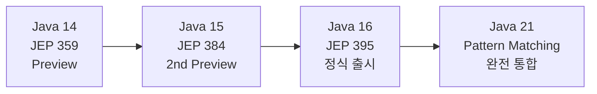
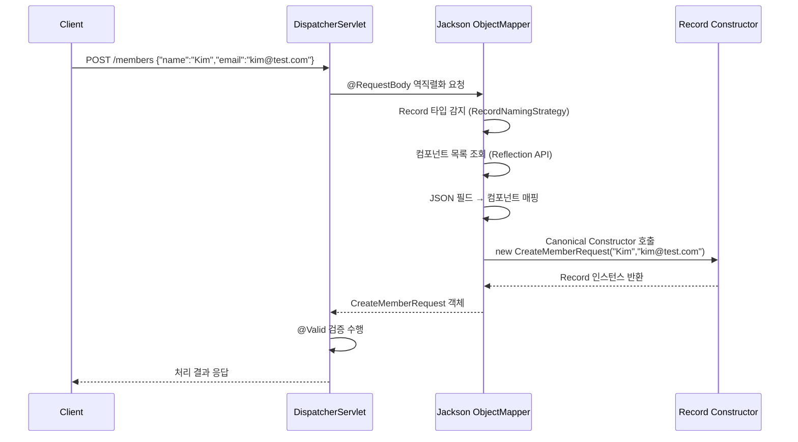

> **한 줄 요약**: Record는 "데이터를 운반하는 투명한 캐리어"를 만들기 위해 Java 16에서 정식 도입된 언어 구조체로, 컴파일러가 필드·접근자·equals·hashCode·toString을 자동 생성하여 보일러플레이트를 언어 수준에서 제거한다.

---

## 1. 실제 문제 — DTO 하나를 위한 6중 고통

Java 개발자라면 이 상황을 한 번쯤 경험했을 겁니다. 사용자 이름과 이메일만 담는 간단한 DTO가 필요한데, 코드가 이렇게 됩니다.

```java
// 단순한 데이터 2개를 담는 클래스인데...
public class UserDto {
    private final String name;
    private final String email;

    // 1) 생성자
    public UserDto(String name, String email) {
        this.name = name;
        this.email = email;
    }

    // 2) getter
    public String getName() { return name; }
    public String getEmail() { return email; }

    // 3) equals
    @Override
    public boolean equals(Object o) {
        if (this == o) return true;
        if (!(o instanceof UserDto)) return false;
        UserDto that = (UserDto) o;
        return Objects.equals(name, that.name) &&
               Objects.equals(email, that.email);
    }

    // 4) hashCode
    @Override
    public int hashCode() {
        return Objects.hash(name, email);
    }

    // 5) toString
    @Override
    public String toString() {
        return "UserDto{name='" + name + "', email='" + email + "'}";
    }
}
```

필드 2개짜리 클래스에 코드가 40줄을 넘습니다. 필드가 10개라면 `equals`와 `hashCode`만으로도 수십 줄이 추가됩니다. 더 심각한 문제는 **실수 가능성**입니다. 나중에 필드를 하나 추가했는데 `equals`에 빠뜨리면, 컬렉션에서 비교가 엉터리로 동작하는 버그가 생깁니다. 이 버그는 런타임에서만 발견되고, 원인을 추적하기도 어렵습니다.

이것을 **보일러플레이트(boilerplate) 지옥**이라고 부릅니다. 핵심 의도(이름과 이메일을 함께 담겠다)는 2줄인데, 부수적인 코드가 40줄을 차지하는 역전 현상입니다.

Lombok의 `@Value`로 이 문제를 해결할 수 있지만, Lombok은 어노테이션 프로세서를 통한 코드 생성이므로 컴파일러 플러그인에 의존하는 **외부 도구**입니다. IDE 설정, 빌드 툴 연동, 버전 호환성 관리가 추가로 필요합니다. Java 언어 자체가 이 문제를 해결할 수 없냐는 수년간의 요구가 Record로 이어졌습니다.

---

## 2. Record란 무엇인가

### 2.1 도입 역사

Record는 하루아침에 만들어진 기능이 아닙니다. JEP(Java Enhancement Proposal) 프로세스를 거쳐 단계적으로 안정화되었습니다.



Java 14에서 처음 프리뷰로 등장했을 때 커뮤니티 반응은 뜨거웠습니다. 그러나 JDK 팀은 2번의 프리뷰를 거치며 피드백을 수렴하고 Java 16에서야 정식 기능으로 확정했습니다. 서두르지 않은 이유는 **언어에 한 번 들어간 기능은 뒤로 돌릴 수 없기 때문**입니다.

### 2.2 설계 철학 — "투명한 캐리어"

JEP 395 문서에 나온 Record의 핵심 설계 철학은 **"aggregate of values"**, 즉 값들의 묶음입니다. Record는 다음 두 가지를 언어 수준에서 보장하기 위해 만들어졌습니다.

첫째, **투명성(transparency)**: Record의 상태는 컴포넌트 필드 전체로 완전히 표현됩니다. 숨겨진 상태가 없습니다. `equals`가 "이 두 레코드가 같은가"를 판단할 때 반드시 모든 컴포넌트를 비교합니다.

둘째, **불변성(immutability)**: 모든 컴포넌트는 `private final`입니다. 생성 이후 상태를 바꿀 수 없습니다. 이는 다중 스레드 환경에서 Record 인스턴스를 락 없이 공유할 수 있음을 의미합니다.

이 두 원칙 때문에 Record는 범용 클래스가 아닙니다. **"데이터를 만들어서 전달하고, 읽기만 하는"** 용도에 특화된 구조체입니다.

### 2.3 컴파일러가 자동 생성하는 것들

```java
// 개발자가 작성하는 코드 — 딱 1줄
record UserDto(String name, String email) {}
```

이 1줄이 컴파일러에 의해 다음 모두로 확장됩니다.

| 자동 생성 항목 | 내용 |
|---|---|
| `private final` 필드 | `private final String name`, `private final String email` |
| Canonical Constructor | 모든 컴포넌트를 받는 생성자 |
| 접근자 메서드 | `name()`, `email()` |
| `equals` | 모든 컴포넌트를 비교 |
| `hashCode` | 모든 컴포넌트 기반 해시 |
| `toString` | `UserDto[name=..., email=...]` 형식 |

### 2.4 왜 getter가 아니라 접근자 메서드인가

`getName()` 대신 `name()`을 쓰는 것은 단순한 취향 차이가 아닙니다. **의도적인 설계 결정**입니다.

JavaBeans 컨벤션의 `getXxx()` 패턴은 "이 클래스는 가변 상태를 가지고, getter와 setter가 쌍으로 존재한다"는 암묵적 계약을 담고 있습니다. Record는 setter가 존재할 수 없습니다. `getName()`처럼 쓴다면 "setter인 `setName()`도 있을 것"이라는 잘못된 기대를 심어줄 수 있습니다.

`name()`이라는 형태는 "이 컴포넌트의 값을 반환한다"는 의미만 담습니다. Record가 JavaBeans가 아님을 명시적으로 선언하는 것입니다. Jackson 같은 라이브러리들은 이미 `name()` 형태의 접근자를 인식하도록 업데이트되었습니다.

---

## 3. 내부 동작 원리 — 바이트코드 레벨

### 3.1 javap로 확인하는 실제 생성 코드

`record Point(int x, int y) {}`를 컴파일하고 `javap -c -p Point.class`로 역어셈블하면 다음과 같은 구조가 나옵니다.

```
// 실제 javap 출력 요약
public final class Point extends java.lang.Record {
  private final int x;
  private final int y;

  // Canonical Constructor
  public Point(int, int);
    Code:
       0: aload_0
       1: invokespecial #1  // java.lang.Record."<init>"
       4: aload_0
       5: iload_1
       6: putfield      #7  // Point.x
       9: aload_0
      10: iload_2
      11: putfield      #13 // Point.y
      14: return

  // 접근자
  public int x();
    Code:
       0: aload_0
       1: getfield      #7  // Point.x
       4: ireturn

  // equals — invokedynamic 사용
  public final boolean equals(java.lang.Object);
    Code:
       0: aload_0
       1: aload_1
       2: invokedynamic #21 // equals
       7: ireturn
}
```

주목할 점은 `equals`, `hashCode`, `toString`이 직접 구현 코드가 아닌 **`invokedynamic`** 명령어를 통해 구현된다는 것입니다.

### 3.2 왜 invokedynamic인가

`invokedynamic`은 Java 7에서 람다 지원을 위해 도입된 바이트코드 명령어입니다. 호출 대상을 **런타임에 동적으로 연결**합니다. Record의 `equals/hashCode/toString`이 `invokedynamic`을 사용하는 이유는 두 가지입니다.

첫째, **향후 JVM 최적화 여지**입니다. JVM이 업그레이드될 때 Record의 `equals` 구현을 더 효율적인 방식으로 교체하더라도, 기존에 컴파일된 `.class` 파일을 다시 컴파일할 필요가 없습니다. 런타임에서 자동으로 새 구현을 사용합니다.

둘째, **클래스 파일 크기 절감**입니다. 각 Record마다 `equals/hashCode/toString` 전체 바이트코드를 생성하는 대신, `invokedynamic`을 통해 `ObjectMethods.bootstrap`이라는 공유 부트스트랩 메서드를 재사용합니다.

### 3.3 왜 다른 클래스를 상속할 수 없는가

Record는 컴파일 시 `java.lang.Record`를 자동으로 상속합니다. Java는 단일 상속만 지원하므로, Record는 이미 상속 슬롯을 사용한 셈입니다. 따라서 다른 클래스를 `extends`하는 것이 언어 규칙상 불가능합니다.

이는 제약처럼 보이지만, 사실 **설계상 올바른 결정**입니다. Record가 다른 클래스를 상속하여 상태를 추가하면, "컴포넌트 전체가 상태 전체"라는 투명성 원칙이 깨집니다. 인터페이스 구현(`implements`)은 제한이 없습니다.

---

## 4. Record vs 기존 방식 비교

| 방식 | 보일러플레이트 | 불변성 | equals/hashCode | 용도 |
|------|:---:|:---:|:---:|------|
| 일반 클래스 | 많음 | 직접 구현 | 직접 구현 | 범용 |
| Lombok @Data | 없음 | @Value 필요 | 자동 | 범용 (컴파일 의존) |
| Lombok @Value | 없음 | 보장 | 자동 | 불변 객체 |
| **Record** | **없음** | **언어 수준 보장** | 자동 (invokedynamic) | 데이터 캐리어 |

Lombok과 Record의 결정적 차이는 **의존성** 문제입니다. Lombok은 어노테이션 프로세서를 통해 동작하므로 빌드 툴(Maven/Gradle)과 IDE 양쪽에 설정이 필요하고, Lombok 버전과 Java 버전 호환성을 관리해야 합니다. 신규 입사자가 Lombok 없이 코드를 열면 컴파일 에러가 납니다.

Record는 언어 기능입니다. Java 16 이상이면 추가 의존성 없이 어디서나 동작합니다.

또 한 가지 차이점은 **의미의 명시성**입니다. `record UserDto(...)`를 보면 "이 클래스는 데이터 캐리어다"라는 의도가 즉시 전달됩니다. `@Value class UserDto`는 Lombok을 모르는 사람에게는 의도가 불분명합니다.

---

## 5. Record를 써야 하는 곳 / 쓰면 안 되는 곳

### 5.1 써야 하는 곳

**DTO (Data Transfer Object)**가 Record의 핵심 사용처입니다. API 계층에서 받아서 서비스로 넘기는 요청/응답 객체는 대부분 생성 후 읽기만 합니다. 이 객체들이 가변이어야 할 이유가 없습니다.

```java
// API 요청 DTO
record CreateOrderRequest(String productId, int quantity, String address) {}

// API 응답 DTO
record OrderResponse(String orderId, String status, LocalDateTime createdAt) {}

// 이벤트 페이로드 — 이벤트는 불변이어야 한다
record OrderCreatedEvent(String orderId, String userId, Instant occurredAt) {}

// 설정 값 — 애플리케이션 시작 후 변경되지 않는다
record DatabaseConfig(String host, int port, String database) {}

// 메서드 반환값 묶음
record PageResult<T>(List<T> items, long totalCount, int page) {}
```

이 경우들의 공통점은 **"만들어서 전달하고, 읽기만 하는"** 패턴입니다. 불변성이 보장되면 메서드 간 공유 시 방어적 복사가 필요 없고, 멀티스레드 환경에서도 안전합니다.

### 5.2 쓰면 안 되는 곳

**JPA Entity에는 Record를 절대 사용하지 마세요.** 이유가 세 가지입니다.

첫째, JPA는 인수 없는 기본 생성자(no-args constructor)를 요구합니다. Record의 Canonical Constructor는 모든 컴포넌트를 받으며, 기본 생성자는 존재하지 않습니다.

둘째, Hibernate는 지연 로딩(lazy loading)을 위해 **프록시 객체**를 생성합니다. 프록시는 Entity 클래스를 상속하여 만들어지는데, Record는 `final class`이므로 상속이 불가능합니다.

셋째, JPA는 영속성 컨텍스트에서 엔티티 상태를 변경(dirty checking)합니다. Record는 불변이므로 필드를 바꿀 수 없습니다.

**Spring Bean(서비스, 리포지토리 등)**도 Record로 만들면 안 됩니다. Spring Bean은 싱글톤으로 관리되며 의존성 주입을 받는데, Record의 불변성과 상태 없는 설계가 충돌합니다. 기술적으로 불가능한 것은 아니지만, 의도에 맞지 않습니다.

```java
// ❌ 절대 하지 마세요
@Entity
record Member(Long id, String name) {} // JPA Entity로 Record 사용

// ❌ 이것도 안 됩니다
@Service
record MemberService(MemberRepository repo) {} // Spring Bean으로 Record 사용

// ✅ 이렇게 사용하세요
@Entity
@Table(name = "member")
class Member {  // Entity는 일반 클래스
    @Id Long id;
    String name;
    // setter 필요
}

record MemberDto(Long id, String name) {} // DTO는 Record
```

### 5.3 MapStruct / ModelMapper 연동 주의사항

MapStruct는 `getXxx()` 패턴의 getter를 기본으로 인식합니다. Record의 접근자는 `name()` 형태이므로 추가 설정이 필요할 수 있습니다. MapStruct 1.5+ 버전은 Record를 공식 지원하며, 자동으로 `name()` 형태의 접근자를 인식합니다.

ModelMapper는 `getXxx()` 패턴에 의존도가 높아, Record와 함께 사용할 때 커스텀 컨버터를 작성해야 하는 경우가 생깁니다. 신규 프로젝트라면 MapStruct를 권장합니다.

---

## 6. Record 심화 기능

### 6.1 Compact Canonical Constructor — 유효성 검증

Compact Canonical Constructor는 매개변수 목록을 생략하는 특별한 문법입니다. 매개변수는 그대로 컴포넌트 이름으로 자동 바인딩됩니다. 주로 유효성 검증에 사용합니다.

```java
record Product(String name, int price) {
    // Compact Canonical Constructor — 파라미터 목록 없음
    Product {
        // this.name = name 같은 할당은 하지 않아도 됨 (컴파일러가 자동 추가)
        if (name == null || name.isBlank()) {
            throw new IllegalArgumentException("상품명은 비어있을 수 없습니다");
        }
        if (price < 0) {
            throw new IllegalArgumentException("가격은 0 이상이어야 합니다: " + price);
        }
        // 값 정규화도 가능 — 단, 컴포넌트에 재할당하는 방식으로
        name = name.trim(); // 이렇게 하면 컴파일러가 this.name = name.trim()으로 처리
    }
}

// 사용
var p1 = new Product("노트북", 1_500_000); // 정상
var p2 = new Product("  ", 1000);          // IllegalArgumentException 발생
var p3 = new Product("마우스", -100);       // IllegalArgumentException 발생
```

이 패턴은 **값 객체(Value Object)**를 만들 때 특히 강력합니다. 생성자에서 유효성 검증을 통과한 인스턴스는 이후 어떤 시점에도 불변하므로, "인스턴스가 존재한다면 항상 유효한 상태"임이 보장됩니다.

### 6.2 Custom Constructor — 추가 생성자

기본 Canonical Constructor 외에 편의용 생성자를 추가할 수 있습니다. 단, 추가 생성자는 반드시 Canonical Constructor를 호출해야 합니다.

```java
record DateRange(LocalDate start, LocalDate end) {
    // Compact Canonical Constructor로 검증
    DateRange {
        if (start.isAfter(end)) {
            throw new IllegalArgumentException("시작일이 종료일보다 늦을 수 없습니다");
        }
    }

    // 추가 편의 생성자 — String 파라미터 받기
    DateRange(String start, String end) {
        this(LocalDate.parse(start), LocalDate.parse(end)); // 반드시 this() 호출
    }

    // 오늘부터 N일까지의 범위를 만드는 정적 팩토리
    static DateRange fromToday(int days) {
        LocalDate today = LocalDate.now();
        return new DateRange(today, today.plusDays(days));
    }

    // 커스텀 메서드도 추가 가능
    long durationDays() {
        return ChronoUnit.DAYS.between(start, end);
    }
}
```

### 6.3 인터페이스 구현 — 대수적 데이터 타입

Record는 인터페이스를 구현할 수 있습니다. 이 기능은 `sealed interface`와 결합할 때 진가를 발휘합니다. 이 패턴은 함수형 언어의 **대수적 데이터 타입(Algebraic Data Type, ADT)**을 Java에서 표현하는 방법입니다.

```java
sealed interface PaymentResult permits Success, Failure, Pending {}

record Success(String transactionId, BigDecimal amount) implements PaymentResult {}
record Failure(String errorCode, String message) implements PaymentResult {}
record Pending(String referenceId, Instant estimatedTime) implements PaymentResult {}

// Java 21 switch pattern matching으로 exhaustive 처리
String processResult(PaymentResult result) {
    return switch (result) {
        case Success s -> "결제 완료: " + s.transactionId();
        case Failure f -> "결제 실패: " + f.message();
        case Pending p -> "처리 중: " + p.referenceId();
        // 컴파일러가 모든 경우를 처리했는지 검증 — default 불필요
    };
}
```

이 패턴의 강력함은 `sealed`가 허용된 구현체 목록을 컴파일 타임에 고정한다는 데 있습니다. `switch`에서 한 경우라도 빠뜨리면 **컴파일 에러**가 납니다. 런타임 버그가 아니라 컴파일 에러로 잡을 수 있는 것입니다.

### 6.4 로컬 Record

메서드 안에서 임시 데이터 구조가 필요할 때 로컬 클래스처럼 Record를 선언할 수 있습니다.

```java
List<String> topProducts(List<Order> orders) {
    // 메서드 안에서만 필요한 임시 집계 구조
    record ProductStat(String productId, long count) {}

    return orders.stream()
        .collect(Collectors.groupingBy(Order::productId, Collectors.counting()))
        .entrySet().stream()
        .map(e -> new ProductStat(e.getKey(), e.getValue()))
        .sorted(Comparator.comparingLong(ProductStat::count).reversed())
        .limit(5)
        .map(ProductStat::productId)
        .toList();
}
```

이 패턴은 람다나 스트림 중간 단계에서 임시로 여러 값을 묶어야 할 때 익명 클래스나 `Map.Entry`보다 훨씬 가독성이 좋습니다.

### 6.5 제네릭 Record

```java
// 페이지네이션 응답을 제네릭으로 표현
record Page<T>(List<T> content, long totalElements, int totalPages, int currentPage) {
    // 빈 페이지 팩토리
    static <T> Page<T> empty() {
        return new Page<>(List.of(), 0, 0, 0);
    }

    boolean hasNext() {
        return currentPage < totalPages - 1;
    }
}

// 사용
Page<UserDto> userPage = new Page<>(users, 100L, 10, 0);
Page<OrderDto> orderPage = new Page<>(orders, 50L, 5, 2);
```

### 6.6 Record + Pattern Matching (Java 21)

Java 21의 record pattern은 `instanceof`와 `switch`에서 Record의 컴포넌트를 즉시 분해할 수 있게 합니다.

```java
record Point(int x, int y) {}
record Circle(Point center, double radius) {}

// instanceof pattern
Object obj = new Circle(new Point(1, 2), 5.0);

if (obj instanceof Circle(Point(int x, int y), double r)) {
    // x, y, r 변수가 자동으로 바인딩됨
    System.out.println("중심: (%d, %d), 반지름: %.1f".formatted(x, y, r));
}

// switch pattern
String describe(Object shape) {
    return switch (shape) {
        case Circle(Point(int x, int y), double r) when r > 10 ->
            "큰 원: 중심(%d,%d), 반지름=%.1f".formatted(x, y, r);
        case Circle(Point(int x, int y), double r) ->
            "작은 원: 중심(%d,%d), 반지름=%.1f".formatted(x, y, r);
        default -> "알 수 없는 도형";
    };
}
```

중첩 레코드도 한 번에 분해(destructure)되는 것이 핵심입니다. `circle.center().x()`를 체이닝 없이 바로 `x` 변수로 받을 수 있습니다.

---

## 7. sealed interface + Record 패턴 — 왜 이 조합이 강력한가

앞에서 간략히 소개했지만, 이 조합이 왜 강력한지를 더 깊이 살펴보겠습니다.

```java
sealed interface Shape permits Circle, Rectangle, Triangle {}
record Circle(double radius) implements Shape {}
record Rectangle(double w, double h) implements Shape {}
record Triangle(double base, double height) implements Shape {}

// Java 21 switch pattern matching
double area(Shape shape) {
    return switch (shape) {
        case Circle c    -> Math.PI * c.radius() * c.radius();
        case Rectangle r -> r.w() * r.h();
        case Triangle t  -> 0.5 * t.base() * t.height();
        // default 없어도 됨 — sealed가 모든 경우를 보장
    };
}
```

이 패턴의 가치는 **"새로운 타입을 추가했을 때 처리를 빠뜨릴 수 없다"**는 점입니다. 나중에 `Hexagon`을 `Shape`에 추가하면, `area()` 메서드가 **컴파일 에러**를 냅니다. `switch`가 `Hexagon` 케이스를 처리하지 않기 때문입니다.

반면 상속 기반의 전통적인 다형성에서는 `shape.area()`처럼 메서드를 호출하는 방식이라, 새 타입을 추가할 때 `area()` 구현을 빠뜨려도 컴파일이 됩니다. 추상 메서드가 없다면 런타임 버그로 이어집니다.

`sealed + record` 조합은 **"데이터와 그 데이터를 처리하는 로직을 분리"**하는 함수형 스타일을 Java에서 타입 안전하게 구현합니다. 이 패턴은 상태 머신, 명령 패턴, 이벤트 소싱 등에서 매우 유용합니다.

---

## 8. Spring Boot에서 Record 실전 활용

### 8.1 @RequestBody Record (Jackson 역직렬화)

Jackson 2.12+는 Record를 공식 지원합니다. 별도 설정 없이 `@RequestBody`로 Record를 받을 수 있습니다.

```java
// 요청 DTO — Record
record CreateMemberRequest(
    @NotBlank String name,
    @Email String email,
    @Min(0) int age
) {}

// 응답 DTO — Record
record MemberResponse(Long id, String name, String email) {}

@RestController
@RequestMapping("/members")
class MemberController {

    private final MemberService memberService;

    MemberController(MemberService memberService) {
        this.memberService = memberService;
    }

    @PostMapping
    @ResponseStatus(HttpStatus.CREATED)
    MemberResponse create(@RequestBody @Valid CreateMemberRequest request) {
        return memberService.create(request);
    }
}
```

Jackson이 Record를 역직렬화할 때는 Canonical Constructor를 사용합니다. JSON 필드명을 Record 컴포넌트명으로 매핑합니다. 필드명이 다르면 `@JsonProperty`를 컴포넌트에 직접 붙입니다.

```java
record ExternalApiResponse(
    @JsonProperty("user_id") Long userId,
    @JsonProperty("full_name") String fullName
) {}
```

### 8.2 @ConfigurationProperties Record (Spring Boot 2.6+)

Spring Boot 2.6 이상에서는 `@ConfigurationProperties`를 Record에 적용할 수 있습니다. 설정 값을 불변 객체로 바인딩하는 가장 안전한 방법입니다.

```java
// application.yml:
// payment:
//   api-url: https://payment.example.com
//   api-key: secret-key
//   timeout-ms: 3000

@ConfigurationProperties(prefix = "payment")
record PaymentConfig(String apiUrl, String apiKey, int timeoutMs) {}

// Spring Boot 3.x에서는 @EnableConfigurationProperties 또는
// @ConfigurationPropertiesScan으로 등록
@SpringBootApplication
@ConfigurationPropertiesScan
class Application {}

// 사용 — 주입받아서 사용
@Service
class PaymentService {
    private final PaymentConfig config;

    PaymentService(PaymentConfig config) {
        this.config = config;
    }

    void pay() {
        // config.apiUrl(), config.apiKey() 사용
    }
}
```

기존의 `@ConfigurationProperties`가 붙은 가변 클래스를 Record로 교체하면, 설정 값이 절대 변경되지 않음이 언어 수준에서 보장됩니다. 설정 객체를 실수로 수정하는 버그를 원천 차단합니다.

### 8.3 Record를 응답 DTO로 사용

서비스 계층에서 Entity를 Record DTO로 변환하는 패턴입니다.

```java
// Entity
@Entity
class Member {
    @Id @GeneratedValue Long id;
    String name;
    String email;
    // getter, setter, 기본 생성자...
}

// DTO — Record
record MemberDto(Long id, String name, String email) {
    // Entity로부터 변환하는 정적 팩토리
    static MemberDto from(Member member) {
        return new MemberDto(member.getId(), member.getName(), member.getEmail());
    }
}

// Repository — JPQL로 바로 Record에 매핑
interface MemberRepository extends JpaRepository<Member, Long> {

    @Query("SELECT new com.example.MemberDto(m.id, m.name, m.email) FROM Member m WHERE m.name = :name")
    List<MemberDto> findDtoByName(@Param("name") String name);
}
```

JPQL의 `new` 표현식은 Record의 Canonical Constructor를 호출합니다. Hibernate 6 이상에서는 `Tuple` 대신 Record에 직접 프로젝션하는 것도 지원합니다.

---

## 9. 극한 시나리오 3개

### 시나리오 1: Record를 JPA Entity로 쓰면?

```java
// 이 코드를 실행하면 어떻게 될까?
@Entity
record BadEntity(Long id, String name) {}
```

**Hibernate 초기화 시점에 예외가 발생합니다.** Hibernate가 `BadEntity` 프록시를 생성하려고 할 때 `java.lang.reflect.Proxy` 또는 바이트 코드 조작(ByteBuddy/CGLIB)으로 서브클래스를 만들려 하지만, Record는 `final class`이므로 상속이 불가능합니다. `org.hibernate.HibernateException: Unable to create proxy for class` 예외가 발생하며 애플리케이션이 시작조차 안 됩니다.

기본 생성자 부재도 문제입니다. Hibernate가 조회 결과를 매핑할 때 기본 생성자로 인스턴스를 만든 뒤 필드를 채우는 방식을 사용하는데, Record에는 그 생성자가 없습니다. JPA + Record 조합은 "Record를 DTO 프로젝션 대상으로만" 사용할 때 의미가 있습니다.

### 시나리오 2: Record 필드에 가변 객체(List)를 넣으면?

```java
record Order(String id, List<String> items) {}

Order order = new Order("O-001", new ArrayList<>(List.of("상품A", "상품B")));

// Record 참조는 불변 — 다른 List로 교체 불가
// order = new Order("O-001", List.of("상품C")); // 이건 새 인스턴스 생성이라 OK

// 하지만! 내부 List는 가변 — 외부에서 접근 가능
order.items().add("상품C"); // 컴파일 OK, 런타임 OK — items가 변경됨!
System.out.println(order.items()); // [상품A, 상품B, 상품C]
```

Record의 `private final`은 **참조(reference)를 바꾸지 못하게** 할 뿐, 참조가 가리키는 객체의 내부 상태는 막지 않습니다. `equals`와 `hashCode`도 `List` 내용을 기준으로 동작하므로, `items`가 바뀌면 같은 `order` 인스턴스의 `hashCode`가 달라져 `HashMap`에서 찾지 못하는 심각한 버그가 생깁니다.

올바른 해법은 두 가지입니다.

```java
// 방법 1: Compact Canonical Constructor에서 방어적 복사
record Order(String id, List<String> items) {
    Order {
        items = List.copyOf(items); // 불변 리스트로 복사
    }
}

// 방법 2: 처음부터 불변 컬렉션으로 받기
record Order(String id, List<String> items) {
    Order {
        items = Collections.unmodifiableList(new ArrayList<>(items));
    }
}

// 이제 외부 수정 시도가 UnsupportedOperationException 발생
order.items().add("상품C"); // UnsupportedOperationException
```

### 시나리오 3: Record의 equals가 기대와 다를 때 — 배열 필드의 함정

```java
record Matrix(int[] data, int rows, int cols) {}

Matrix m1 = new Matrix(new int[]{1, 2, 3, 4}, 2, 2);
Matrix m2 = new Matrix(new int[]{1, 2, 3, 4}, 2, 2);

System.out.println(m1.equals(m2)); // false !! 왜?
System.out.println(m1.hashCode() == m2.hashCode()); // false
```

Record의 `equals`는 컴포넌트를 `Objects.equals()`로 비교합니다. 배열의 `Object.equals()`는 참조 비교(`==`)이므로, 내용이 같아도 다른 배열 인스턴스면 `false`가 됩니다. `Arrays.equals()`나 `Arrays.deepEquals()`가 아닙니다.

이 함정을 피하려면 배열 대신 `List`를 쓰거나, `equals`와 `hashCode`를 직접 오버라이드해야 합니다.

```java
record Matrix(int[] data, int rows, int cols) {
    @Override
    public boolean equals(Object o) {
        if (!(o instanceof Matrix m)) return false;
        return Arrays.equals(data, m.data) && rows == m.rows && cols == m.cols;
    }

    @Override
    public int hashCode() {
        return Objects.hash(Arrays.hashCode(data), rows, cols);
    }
}

Matrix m1 = new Matrix(new int[]{1, 2, 3, 4}, 2, 2);
Matrix m2 = new Matrix(new int[]{1, 2, 3, 4}, 2, 2);
System.out.println(m1.equals(m2)); // true
```

또는 처음부터 `List<Integer>`를 사용하면 이 문제를 피할 수 있습니다.

---

## 10. Record 역직렬화 흐름

Jackson이 HTTP 요청 Body의 JSON을 Record로 변환하는 과정을 살펴보겠습니다.



Jackson이 일반 클래스를 역직렬화할 때는 "기본 생성자로 인스턴스 생성 → setter로 필드 주입"하는 2단계 방식을 씁니다. Record에는 기본 생성자와 setter가 없으므로, Jackson은 **Canonical Constructor 한 번 호출**로 모든 것을 처리합니다. 이 방식은 생성 직후 유효하지 않은 상태가 존재하지 않으므로 오히려 더 안전합니다.

---

## 11. 면접 포인트

### 면접 포인트 1️⃣ — Record가 자동으로 생성하지 않는 것은?

setter를 생성하지 않습니다. Record의 불변성 원칙 때문입니다. 또한 `clone()` 메서드도 자동 생성하지 않습니다. `java.lang.Record`가 `Cloneable`을 구현하지 않기 때문입니다. getter가 아닌 `name()` 형태의 접근자를 생성하는 점도 JavaBeans 컨벤션과 다릅니다.

### 면접 포인트 2️⃣ — Record에서 equals를 커스터마이징해야 하는 경우는?

배열 타입 컴포넌트를 포함할 때입니다. 기본 `equals`는 `Object.equals()`를 사용하므로 배열은 참조 비교를 합니다. 또한 equals 비교 시 특정 컴포넌트를 제외하거나 정규화된 값으로 비교해야 할 때도 직접 오버라이드합니다.

### 면접 포인트 3️⃣ — Record와 Lombok @Value의 차이점은?

세 가지로 요약할 수 있습니다. 첫째, 의존성: Lombok은 어노테이션 프로세서 의존이 필요하고, Record는 언어 기능입니다. 둘째, 접근자 형태: Lombok은 `getXxx()`, Record는 `xxx()` 형태입니다. 셋째, equals/hashCode 구현 방식: Lombok은 직접 코드를 생성하고, Record는 `invokedynamic`을 사용하여 JVM 수준에서 최적화 여지를 남깁니다.

### 면접 포인트 4️⃣ — Record를 JPA Entity로 쓸 수 없는 근본 이유는?

두 가지 제약입니다. 첫째, `final class`이므로 Hibernate의 프록시 생성(서브클래싱)이 불가능합니다. 둘째, 기본 생성자(no-args constructor)가 없어 JPA가 조회 결과를 인스턴스로 재구성할 수 없습니다. 이는 JPA의 설계 전제인 "가변 영속 객체"와 Record의 "불변 데이터 캐리어"가 근본적으로 충돌하기 때문입니다.

### 면접 포인트 5️⃣ — sealed interface + Record 패턴의 장점은?

컴파일 타임 완전성(exhaustiveness) 검사입니다. `sealed`가 허용된 구현체를 고정하면, `switch` 표현식에서 한 가지 케이스라도 빠뜨리면 컴파일 에러가 납니다. 런타임이 아닌 컴파일 타임에 버그를 잡습니다. 또한 새 케이스를 추가했을 때 처리가 필요한 `switch`가 어디 있는지 컴파일러가 알려주므로, 누락 없이 전파할 수 있습니다.

---

## 12. 실무 실수 Top 5

| # | 실수 | 증상 | 해결 방법 |
|---|------|------|-----------|
| 1 | Record를 JPA Entity로 사용 | 앱 시작 시 `HibernateException` | Entity는 일반 클래스, DTO만 Record로 |
| 2 | 가변 컬렉션 컴포넌트를 방어적 복사 없이 사용 | `hashCode` 변경으로 `HashMap` 유실 | Compact Constructor에서 `List.copyOf()` |
| 3 | 배열 컴포넌트의 equals 함정 | 내용이 같아도 `equals` false | `Arrays.equals()`로 직접 오버라이드 |
| 4 | MapStruct 구버전과 연동 시 접근자 미인식 | 매핑 오류, 필드 null | MapStruct 1.5+ 업그레이드 또는 커스텀 매퍼 |
| 5 | `@ConfigurationProperties` Record에서 기본값 설정 불가 오해 | 바인딩 실패 | Compact Constructor 내 조건부 기본값, 또는 `@DefaultValue` 활용 |

---

## 13. 정리 — Record를 도입할 기준

Record 도입을 판단하는 간단한 기준입니다.

이 객체가 **"만들어지고 나서 상태가 바뀌어야 하는가?"**라는 질문에 "아니오"라면 Record 후보입니다. 추가로 **"이 객체의 의미는 담고 있는 값 전체로 결정되는가?"**라는 질문에도 "그렇다"면 Record가 적합합니다.

DTO, API 응답, 이벤트 페이로드, 설정 값, 메서드 반환용 임시 묶음이 여기에 해당합니다. 반면 JPA Entity, Spring Bean, 빌더 패턴이 필요한 복잡한 객체는 일반 클래스가 맞습니다.

Record는 Java 언어가 수십 년간 외면하던 문제를 마침내 언어 수준에서 해결한 결과물입니다. Lombok이라는 우회로 없이도, 간결하고 안전한 데이터 캐리어를 만들 수 있습니다. Java 17 이상을 사용하는 신규 프로젝트라면, DTO 레이어는 전면 Record 전환을 적극 고려할 만합니다.
