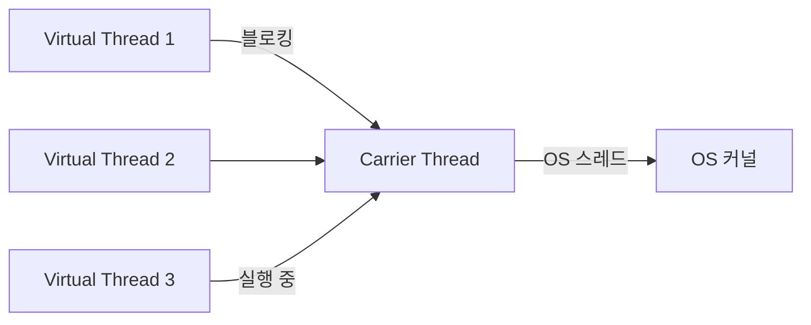
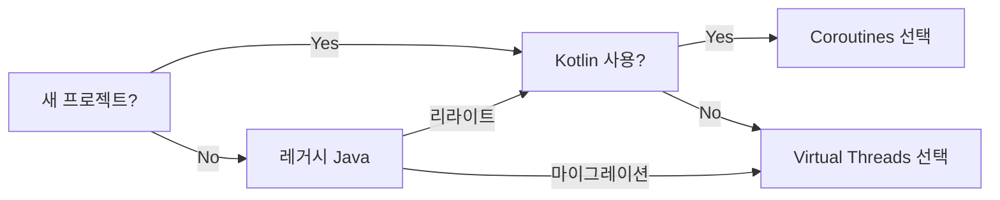

서버가 초당 10만 개의 HTTP 요청을 처리해야 한다. 전통적인 스레드 풀로는 불가능하다. 스레드 하나에 1MB 스택이 필요하면 10만 개는 100GB 메모리가 필요하다. 이 문제를 해결하기 위해 Java는 Project Loom의 Virtual Threads를, Kotlin은 Coroutines를 내놓았다. 두 접근법은 같은 문제를 완전히 다른 방식으로 해결한다. **어떤 것이 내 프로젝트에 맞는가**를 이 포스트에서 명확히 답한다.

---

## 전통적 스레드 모델의 한계

먼저 왜 이 기술이 필요한지부터 이해해야 한다.

```java
// 전통적 블로킹 I/O — 스레드가 잠든다
@GetMapping("/users/{id}")
public UserDto getUser(@PathVariable Long id) {
    // DB 쿼리 중 스레드는 아무것도 안 하고 기다린다
    User user = userRepository.findById(id).orElseThrow(); // ~5ms 대기
    // 외부 API 호출 중 또 기다린다
    Profile profile = profileClient.getProfile(id);        // ~20ms 대기
    return UserDto.of(user, profile);
}
```

이 메서드가 처리되는 25ms 동안 OS 스레드는 잠들어 있다. Tomcat 기본 스레드 풀이 200개라면, 동시에 200개의 요청만 처리할 수 있다. 201번째 요청은 큐에서 기다린다. 스레드가 CPU를 쓰지 않는데도 리소스를 점유하는 것이다.

> **비유**: 200명의 은행 직원이 있는데, 고객이 서류 작성하는 동안 직원이 옆에서 그냥 서 있다. 직원이 고객 서류 작성 완료를 기다리는 동안 다른 고객을 처리하지 못한다. 이것이 블로킹 I/O의 낭비다.

---

## Java Virtual Threads — Project Loom

### 핵심 개념

Virtual Thread는 JVM이 관리하는 경량 스레드다. OS 스레드(플랫폼 스레드) 위에서 동작하지만, 1:1 매핑이 아니라 M:N 매핑이다.

```
OS 스레드 (플랫폼 스레드): 수십 개
        ↕ M:N 매핑
Virtual Thread: 수백만 개
```

Virtual Thread가 블로킹 연산(I/O, sleep 등)을 만나면, JVM이 자동으로 해당 Virtual Thread를 OS 스레드에서 **언마운트(unmount)**한다. OS 스레드는 다른 Virtual Thread를 실행한다. I/O가 완료되면 Virtual Thread가 다시 **마운트(mount)**되어 실행을 재개한다.



### Virtual Thread 사용법

```java
// Java 21 — Virtual Thread 생성
// 방법 1: 직접 생성
Thread vt = Thread.ofVirtual().start(() -> {
    System.out.println("Virtual Thread: " + Thread.currentThread().isVirtual());
});

// 방법 2: ExecutorService
try (ExecutorService executor = Executors.newVirtualThreadPerTaskExecutor()) {
    for (int i = 0; i < 100_000; i++) {
        executor.submit(() -> {
            // 각 작업이 별도의 Virtual Thread에서 실행
            Thread.sleep(Duration.ofMillis(100)); // 블로킹이지만 OS 스레드는 해방
            return fetchData();
        });
    }
}

// 방법 3: Spring Boot 3.2+ 자동 설정
// application.yml
// spring:
//   threads:
//     virtual:
//       enabled: true
```

### Spring Boot에서 Virtual Thread 적용

```java
// Spring Boot 3.2+
@SpringBootApplication
public class Application {

    // Virtual Thread 실행자 등록
    @Bean
    public TomcatProtocolHandlerCustomizer<?> virtualThreadTomcat() {
        return protocolHandler ->
            protocolHandler.setExecutor(
                Executors.newVirtualThreadPerTaskExecutor()
            );
    }
}
```

```java
// 기존 블로킹 코드 — 변경 없이 Virtual Thread 혜택
@Service
public class UserService {

    public UserDto getUser(Long id) {
        // 이 블로킹 코드가 Virtual Thread에서 실행됨
        // OS 스레드를 블록하지 않고 Virtual Thread만 일시 중단
        User user = userRepository.findById(id).orElseThrow();
        Profile profile = profileClient.getProfile(id);
        return UserDto.of(user, profile);
    }
}
```

**핵심 장점**: 기존 블로킹 코드를 그대로 쓸 수 있다. 비동기 프로그래밍 패러다임으로 전환할 필요가 없다.

---

## Kotlin Coroutines — 협력적 멀티태스킹

### 핵심 개념

Coroutine은 **일시 중단 가능한 함수(suspend function)**를 기반으로 한다. 컴파일러가 `suspend` 함수를 상태 머신으로 변환한다. 실행 중 `suspend` 지점에서 현재 상태를 저장하고 다른 Coroutine에게 제어를 양보한다.

```kotlin
// suspend 함수 — 일시 중단 가능한 함수
suspend fun getUser(id: Long): UserDto {
    val user = userRepository.findById(id)       // 일시 중단 지점
    val profile = profileClient.getProfile(id)   // 일시 중단 지점
    return UserDto.of(user, profile)
}
```

`suspend` 키워드가 붙으면 이 함수는 블로킹 없이 일시 중단될 수 있다. 함수가 I/O를 기다리는 동안 스레드는 다른 Coroutine을 실행한다.

> **비유**: Coroutine은 능숙한 멀티태스킹 직원이다. 고객 서류를 인쇄 중인 동안 다른 고객의 전화를 받는다. 인쇄가 끝나면 다시 원래 고객으로 돌아온다. 여러 일을 번갈아가며 처리하지만, 한 번에 한 가지만 집중한다.

### Coroutine 기초 사용법

```kotlin
// CoroutineScope와 Dispatcher
class UserService {

    // IO Dispatcher — I/O 작업용 스레드 풀
    suspend fun getUser(id: Long): UserDto = coroutineScope {
        // async로 병렬 실행
        val userDeferred = async(Dispatchers.IO) {
            userRepository.findById(id)
        }
        val profileDeferred = async(Dispatchers.IO) {
            profileClient.getProfile(id)
        }

        // 두 작업이 완료될 때까지 대기 (병렬 실행)
        UserDto.of(userDeferred.await(), profileDeferred.await())
    }
}
```

```kotlin
// Flow — 비동기 스트림
fun getUserStream(ids: List<Long>): Flow<UserDto> = flow {
    for (id in ids) {
        val user = userRepository.findById(id)  // 일시 중단
        emit(UserDto.of(user))                   // 값 발행
        delay(100)                               // 비블로킹 대기
    }
}

// 수집
getUserStream(listOf(1L, 2L, 3L))
    .filter { it.isActive }
    .map { it.toResponse() }
    .collect { response ->
        println(response)
    }
```

### Spring WebFlux + Coroutines

```kotlin
// Spring WebFlux — Coroutine 기반 컨트롤러
@RestController
class UserController(private val userService: UserService) {

    @GetMapping("/users/{id}")
    suspend fun getUser(@PathVariable id: Long): UserDto {
        return userService.getUser(id)  // suspend 함수 직접 호출
    }

    @GetMapping("/users/stream", produces = [MediaType.TEXT_EVENT_STREAM_VALUE])
    fun getUserStream(): Flow<UserDto> {
        return userService.getUserStream()
    }
}
```

---

## 구현 원리 비교

### Virtual Thread의 Continuation

Virtual Thread는 JVM 레벨에서 구현된다. 블로킹 발생 시 현재 스택 프레임을 **힙 메모리**에 저장(Continuation)하고, 플랫폼 스레드를 해방한다.

```
Virtual Thread 블로킹 시:
1. 현재 실행 상태(스택)를 힙에 직렬화
2. 플랫폼 스레드(Carrier Thread)에서 언마운트
3. Carrier Thread가 다른 Virtual Thread 실행
4. I/O 완료 시 → 힙에서 상태 복원 → 다시 마운트
```

개발자는 이 과정을 전혀 인식할 필요가 없다. JVM이 투명하게 처리한다.

### Coroutine의 상태 머신 변환

Kotlin 컴파일러가 `suspend` 함수를 상태 머신(CPS, Continuation Passing Style)으로 변환한다.

```kotlin
// 개발자가 작성하는 코드
suspend fun fetchData(): String {
    val a = fetchA()  // 일시 중단 지점 1
    val b = fetchB()  // 일시 중단 지점 2
    return "$a$b"
}
```

```java
// 컴파일러가 변환하는 코드 (의사코드)
Object fetchData(Continuation<String> completion) {
    switch (label) {
        case 0:
            label = 1;
            return fetchA(new Continuation() {  // 상태 저장 후 반환
                void resume(String a) {
                    label = 1;
                    // a 저장
                    fetchData(completion);  // 재진입
                }
            });
        case 1:
            label = 2;
            return fetchB(new Continuation() {
                void resume(String b) {
                    completion.resume(a + b);
                }
            });
    }
}
```

이 변환은 컴파일 타임에 이루어지며, 런타임에 리플렉션이나 바이트코드 조작이 없다.

---

## 스케줄러 비교

### Virtual Thread 스케줄러

Java는 `ForkJoinPool`을 기반으로 한 Work Stealing 스케줄러를 사용한다.

```java
// Virtual Thread 스케줄러 설정 (고급)
System.setProperty("jdk.virtualThreadScheduler.parallelism", "8");
// 기본값: CPU 코어 수

// Carrier Thread 수 확인
System.setProperty("jdk.virtualThreadScheduler.maxPoolSize", "256");
```

개발자가 스케줄러를 직접 제어할 일은 거의 없다. JVM이 자동으로 관리한다.

### Coroutine Dispatcher

Kotlin은 명시적으로 Dispatcher를 선택한다.

```kotlin
// 주요 Dispatcher
Dispatchers.Default    // CPU 집약적 작업 (코어 수만큼 스레드)
Dispatchers.IO         // I/O 작업 (기본 64개, 조정 가능)
Dispatchers.Main       // UI 스레드 (Android, JavaFX)
Dispatchers.Unconfined // 제한 없음 (테스트용)

// 커스텀 Dispatcher
val myDispatcher = Executors.newFixedThreadPool(4)
    .asCoroutineDispatcher()

// Dispatcher 전환
suspend fun mixed() {
    val result = withContext(Dispatchers.IO) {
        // IO 스레드에서 실행
        db.query()
    }
    // 다시 원래 Dispatcher로 복귀
    processResult(result)
}
```

Dispatcher를 명시적으로 다루면 코드가 복잡해지지만, **어떤 스레드 풀에서 실행될지 정확히 제어**할 수 있다.

---

## 블로킹 처리 방식

### Virtual Thread의 자동 핀닝 감지

Virtual Thread도 모든 블로킹에서 자동으로 언마운트되는 것은 아니다. **핀닝(pinning)**이 발생하는 경우는 Carrier Thread에 고정된다.

```java
// 핀닝이 발생하는 경우 — synchronized 블록 내 블로킹
synchronized (lock) {
    Thread.sleep(1000);  // Virtual Thread가 Carrier Thread에 핀닝됨!
}

// 해결책 1: ReentrantLock 사용
ReentrantLock lock = new ReentrantLock();
lock.lock();
try {
    Thread.sleep(1000);  // Virtual Thread 언마운트 정상 동작
} finally {
    lock.unlock();
}

// 핀닝 감지 JVM 플래그
// -Djdk.tracePinnedThreads=full
```

Java 24부터 `synchronized` 내 블로킹도 핀닝 없이 동작하도록 개선 중이다.

### Coroutine의 블로킹 함수 처리

```kotlin
// 블로킹 함수를 Coroutine 내에서 안전하게 호출
suspend fun legacyBlocking() {
    // withContext(Dispatchers.IO)로 블로킹 함수를 IO 스레드에서 실행
    val result = withContext(Dispatchers.IO) {
        legacyBlockingLibrary.fetch()  // 블로킹 함수
    }
    process(result)
}

// 절대 하지 말 것 — suspend 함수에서 직접 블로킹
suspend fun bad() {
    Thread.sleep(1000)  // Coroutine 스레드를 블록 — 성능 저하
    legacyBlockingLibrary.fetch()  // Dispatcher.IO 없이 블로킹
}
```

---

## 에러 핸들링 비교

### Virtual Thread — 표준 예외 처리

```java
// Virtual Thread — 익숙한 try-catch
try (ExecutorService executor = Executors.newVirtualThreadPerTaskExecutor()) {
    Future<UserDto> future = executor.submit(() -> {
        try {
            return userService.getUser(id);
        } catch (UserNotFoundException e) {
            throw new CompletionException(e);
        }
    });

    try {
        return future.get(5, TimeUnit.SECONDS);
    } catch (TimeoutException e) {
        future.cancel(true);
        throw new ServiceException("타임아웃");
    } catch (ExecutionException e) {
        throw unwrap(e.getCause());
    }
}
```

### Coroutine — 구조화된 동시성

```kotlin
// Coroutine — 구조화된 동시성으로 에러 전파
suspend fun getEnrichedUser(id: Long): UserDto {
    return coroutineScope {  // 자식 Coroutine 실패 시 모두 취소
        val userJob = async { userService.getUser(id) }
        val profileJob = async { profileService.getProfile(id) }

        try {
            UserDto.of(userJob.await(), profileJob.await())
        } catch (e: CancellationException) {
            throw e  // CancellationException은 반드시 재던지기
        } catch (e: Exception) {
            log.error("사용자 조회 실패", e)
            throw ServiceException("사용자 조회 실패", e)
        }
    }
}

// SupervisorScope — 하나의 실패가 다른 것을 취소하지 않음
suspend fun fetchAll(ids: List<Long>): List<Result<UserDto>> {
    return supervisorScope {
        ids.map { id ->
            async {
                runCatching { userService.getUser(id) }
            }
        }.awaitAll()
    }
}
```

Coroutine의 구조화된 동시성(Structured Concurrency)은 부모 Coroutine이 취소되면 모든 자식이 자동으로 취소된다. 리소스 누수가 없다.

---

## 성능 벤치마크

같은 조건: 10,000개의 동시 HTTP 요청, 각 요청이 DB 쿼리(20ms) + 외부 API(30ms) 처리.

```
전통적 스레드 풀 (200 스레드):
  처리 시간: ~2,500ms
  메모리: ~200MB (스레드 스택)
  CPU 활용: 5% (대부분 I/O 대기)

Virtual Threads:
  처리 시간: ~55ms
  메모리: ~100MB (힙 Continuation)
  CPU 활용: 80%+
  설정 변경: application.yml 1줄

Kotlin Coroutines (Dispatchers.IO):
  처리 시간: ~60ms
  메모리: ~80MB
  CPU 활용: 75%+
  설정 변경: suspend 키워드 + Dispatcher 설정
```

두 방식 모두 전통적 스레드 풀 대비 30-40배 처리량 향상. 서로 간 차이는 미미하다.

---

## 디버깅 비교

### Virtual Thread 디버깅

```java
// Virtual Thread 이름 지정으로 디버깅 용이
Thread.ofVirtual()
    .name("user-fetch-", 0)  // user-fetch-0, user-fetch-1, ...
    .start(task);

// 스택 트레이스 — 일반 스레드와 동일
Exception in thread "user-fetch-42" java.lang.RuntimeException: DB 연결 실패
    at com.example.UserRepository.findById(UserRepository.java:45)
    at com.example.UserService.getUser(UserService.java:23)
    ...
```

IntelliJ, JDK Flight Recorder 등 기존 Java 도구가 Virtual Thread를 네이티브로 지원한다.

### Coroutine 디버깅

```kotlin
// Coroutine 디버깅 모드 활성화
System.setProperty("kotlinx.coroutines.debug", "on")

// 스택 트레이스 — Coroutine 정보 포함
Exception in thread "DefaultDispatcher-worker-1 @getUser#1" ...
    at com.example.UserService.getUser(UserService.kt:23)
    at com.example.UserController.getUser(UserController.kt:15)
    -- coroutine continuation --
    at kotlin.coroutines.jvm.internal.BaseContinuationImpl.resumeWith(...)
```

```kotlin
// CoroutineExceptionHandler — 미처리 예외 캡처
val handler = CoroutineExceptionHandler { context, exception ->
    log.error("미처리 Coroutine 예외: ${context[CoroutineName]}", exception)
}

val scope = CoroutineScope(Dispatchers.IO + handler + CoroutineName("main"))
```

Coroutine의 스택 트레이스는 이어진 실행 흐름을 보여주지 못하는 경우가 있다. `kotlinx-coroutines-debug` 라이브러리가 개선을 도와준다.

---

## 실무 적용 시나리오

### 시나리오 1: 기존 Java Spring 서비스 마이그레이션

```java
// Before: 블로킹 서비스
@Service
public class OrderService {
    public OrderDto processOrder(Long orderId) {
        Order order = orderRepository.findById(orderId).orElseThrow();
        Inventory inventory = inventoryClient.check(order.getProductId());
        Payment payment = paymentClient.charge(order);
        return OrderDto.of(order, inventory, payment);
    }
}

// After: Virtual Thread 적용 — 코드 변경 없음!
// application.yml에 spring.threads.virtual.enabled=true 추가
// Tomcat이 자동으로 Virtual Thread 사용
```

Virtual Thread의 킬러 기능은 **코드 변경 없는 마이그레이션**이다.

### 시나리오 2: 신규 Kotlin 서비스 — 완전한 비동기

```kotlin
// Coroutine 기반 신규 서비스
@Service
class OrderService(
    private val orderRepository: OrderRepository,
    private val inventoryClient: InventoryClient,
    private val paymentClient: PaymentClient
) {
    suspend fun processOrder(orderId: Long): OrderDto {
        val order = orderRepository.findById(orderId)
            ?: throw OrderNotFoundException(orderId)

        // 재고 확인과 결제를 병렬 실행
        coroutineScope {
            val inventoryCheck = async { inventoryClient.check(order.productId) }
            val paymentResult = async { paymentClient.charge(order) }

            OrderDto.of(order, inventoryCheck.await(), paymentResult.await())
        }
    }

    // 주문 스트림 처리
    fun processOrderStream(orderIds: Flow<Long>): Flow<OrderDto> {
        return orderIds
            .map { id -> processOrder(id) }
            .catch { e -> log.error("주문 처리 실패", e) }
    }
}
```

Coroutine은 `async/await` 병렬 실행, Flow 스트림, 취소 처리가 언어 수준으로 자연스럽다.

### 시나리오 3: CPU 집약적 작업

```java
// Virtual Thread — CPU 작업에는 부적합
// CPU 집약적 작업은 Virtual Thread를 많이 만들어도 OS 스레드 수가 병목
try (ExecutorService executor = Executors.newVirtualThreadPerTaskExecutor()) {
    List<Future<Long>> futures = new ArrayList<>();
    for (int i = 0; i < 1000; i++) {
        futures.add(executor.submit(() -> computeHash(data)));
    }
    // CPU 바운드라면 물리 코어 수 이상의 Virtual Thread는 의미 없음
}
```

```kotlin
// Coroutine — CPU 집약적 작업은 Default Dispatcher
suspend fun computeAll(dataList: List<Data>): List<Long> {
    return coroutineScope {
        dataList.map { data ->
            async(Dispatchers.Default) {  // CPU 바운드 → Default
                computeHash(data)
            }
        }.awaitAll()
    }
}
```

CPU 집약적 작업에서는 두 방식 모두 OS 스레드 수가 한계다. 코어 수를 초과하는 병렬화는 의미 없다.

---

## 극한 시나리오

### 시나리오 1: 100만 동시 연결 WebSocket

소셜 게임 서버. 100만 명의 유저가 동시에 WebSocket으로 연결.

**Virtual Thread 방식**:
```java
// 각 WebSocket 연결에 Virtual Thread 하나
ServerWebSocketHandler handler = session -> {
    // 이 람다가 별도의 Virtual Thread에서 실행
    while (session.isOpen()) {
        WebSocketMessage msg = session.receive().blockFirst(); // 블로킹
        session.send(Mono.just(processMessage(msg))).block();
    }
};
// 100만 개의 Virtual Thread = 힙에 100만 개의 Continuation
// 메모리: ~1GB (각 Continuation ~1KB)
```

**Coroutine 방식**:
```kotlin
// 각 WebSocket 세션에 Coroutine
webSocketHandler { session ->
    val receiveJob = launch {
        session.incoming.consumeEach { frame ->
            process(frame)
        }
    }
    receiveJob.join()
}
// 메모리: ~500MB (Coroutine 객체 더 가벼움)
```

이 규모에서 Coroutine이 메모리 효율에서 약간 유리하다. 하지만 둘 다 이전 스레드 모델 대비 100배 개선이다.

### 시나리오 2: Virtual Thread 핀닝 대규모 발생

레거시 코드에 `synchronized` 블록이 수백 개다. Virtual Thread를 도입했더니 오히려 성능이 나빠졌다.

```bash
# 핀닝 감지
java -Djdk.tracePinnedThreads=full -jar app.jar

# 로그
Thread[#42,ForkJoinPool-1-worker-1,5,CarrierThreads]
    com.example.LegacyService.process(LegacyService.java:87) <-- PINNED
    synchronized 블록 내 블로킹 감지
```

```java
// 핀닝 수를 모니터링
MBeanServer server = ManagementFactory.getPlatformMBeanServer();
ObjectName name = new ObjectName("java.lang:type=Threading");
long pinnedCount = (Long) server.getAttribute(name, "PinnedVirtualThreadCount");
```

Java 24의 `synchronized` 개선 전까지 레거시 코드가 많은 프로젝트에서 Virtual Thread 도입은 신중해야 한다.

### 시나리오 3: Coroutine 취소가 전파되지 않는 문제

```kotlin
// 잘못된 패턴 — CancellationException을 삼킴
suspend fun bad() = coroutineScope {
    try {
        delay(10_000)
    } catch (e: Exception) {  // CancellationException도 catch됨
        log.error("오류", e)
        // 취소 신호가 전파되지 않음 → 메모리 누수
    }
}

// 올바른 패턴 — CancellationException 재던지기
suspend fun good() = coroutineScope {
    try {
        delay(10_000)
    } catch (e: CancellationException) {
        throw e  // 반드시 재던지기
    } catch (e: Exception) {
        log.error("오류", e)
    }
}
```

Coroutine에서 가장 흔한 실수. 취소 신호를 삼키면 전체 구조화된 동시성이 깨진다.

---

## 선택 가이드



| 상황 | 권장 |
|------|------|
| Java 레거시 코드 마이그레이션 | Virtual Threads |
| 신규 Java 프로젝트 | Virtual Threads |
| 신규 Kotlin 프로젝트 | Coroutines |
| 비동기 스트림 처리 | Coroutines (Flow) |
| 복잡한 병렬성 제어 | Coroutines (구조화된 동시성) |
| 팀이 비동기에 익숙하지 않음 | Virtual Threads |
| Android 개발 | Coroutines (플랫폼 표준) |

---

## 면접 포인트

### Q. Virtual Thread와 OS 스레드의 차이점은?

OS 스레드는 커널이 관리하며 생성/전환에 비용이 크고 스택에 ~1MB 메모리를 사용합니다. Virtual Thread는 JVM이 관리하며, OS 스레드 위에서 M:N 매핑으로 동작합니다. 블로킹 시 자동으로 OS 스레드에서 언마운트되어 OS 스레드를 해방하고, 상태는 힙에 저장합니다. 수백만 개를 생성해도 메모리와 스케줄링 오버헤드가 적습니다.

### Q. Kotlin Coroutine의 suspend 함수를 컴파일러가 어떻게 처리하는가?

CPS(Continuation Passing Style) 변환을 수행합니다. `suspend` 함수는 `Continuation<T>` 파라미터를 추가로 받는 함수로 변환됩니다. 내부적으로 상태 머신으로 구현되어, 각 `suspend` 지점이 상태로 표현됩니다. 함수가 일시 중단되면 현재 상태를 `Continuation` 객체에 저장하고 반환합니다. I/O 완료 시 `Continuation.resume()`을 호출해 다음 상태로 전환합니다. 런타임 리플렉션이나 바이트코드 조작 없이 컴파일 타임에 이루어집니다.

### Q. Virtual Thread에서 핀닝(Pinning)이 발생하는 상황과 해결책은?

`synchronized` 블록이나 `native` 메서드 내에서 블로킹 연산이 발생하면 Virtual Thread가 Carrier Thread(OS 스레드)에 고정(핀닝)됩니다. 이 경우 OS 스레드가 해방되지 않아 Virtual Thread의 이점이 사라집니다. 해결책은 `synchronized`를 `ReentrantLock`으로 교체하는 것입니다. `-Djdk.tracePinnedThreads=full` JVM 플래그로 핀닝 발생 위치를 진단할 수 있습니다.

### Q. Coroutine의 구조화된 동시성(Structured Concurrency)이란?

Coroutine은 항상 `CoroutineScope` 안에서 실행됩니다. 자식 Coroutine은 부모 Scope보다 오래 살 수 없습니다. 부모 Scope가 취소되면 모든 자식 Coroutine이 자동으로 취소됩니다. 이를 통해 리소스 누수 없이 Coroutine의 생명주기가 관리됩니다. `coroutineScope {}` 블록은 모든 자식이 완료될 때까지 대기하고, 하나가 실패하면 나머지를 취소합니다.

### Q. Virtual Thread가 CPU 집약적 작업에 부적합한 이유는?

Virtual Thread의 이점은 I/O 대기 시간에 OS 스레드를 해방하는 것입니다. CPU 집약적 작업은 계속 실행 중이라 OS 스레드를 해방할 기회가 없습니다. 실제로 동작하는 OS 스레드 수는 CPU 코어 수와 같습니다. Virtual Thread를 100만 개 만들어도 물리적으로 동시에 실행되는 것은 코어 수뿐입니다. CPU 바운드 작업은 병렬 스트림이나 ForkJoinPool이 더 적합합니다.

---

## 결론

두 기술 모두 같은 문제(블로킹 I/O로 인한 스레드 낭비)를 해결하지만, 철학이 다르다.

**Virtual Threads**: 기존 블로킹 코드를 그대로 사용. JVM이 투명하게 처리. Java 개발자의 학습 비용이 거의 없다. 레거시 코드 마이그레이션에 최적.

**Kotlin Coroutines**: 명시적 비동기 모델. 더 세밀한 제어. Flow로 반응형 스트림. 구조화된 동시성으로 안전한 병렬성. 새로 설계하는 Kotlin 서비스에 최적.

Java 백엔드를 운영 중이라면 Virtual Thread로 시작하라. Kotlin을 사용 중이라면 Coroutine이 언어의 표준이다.
