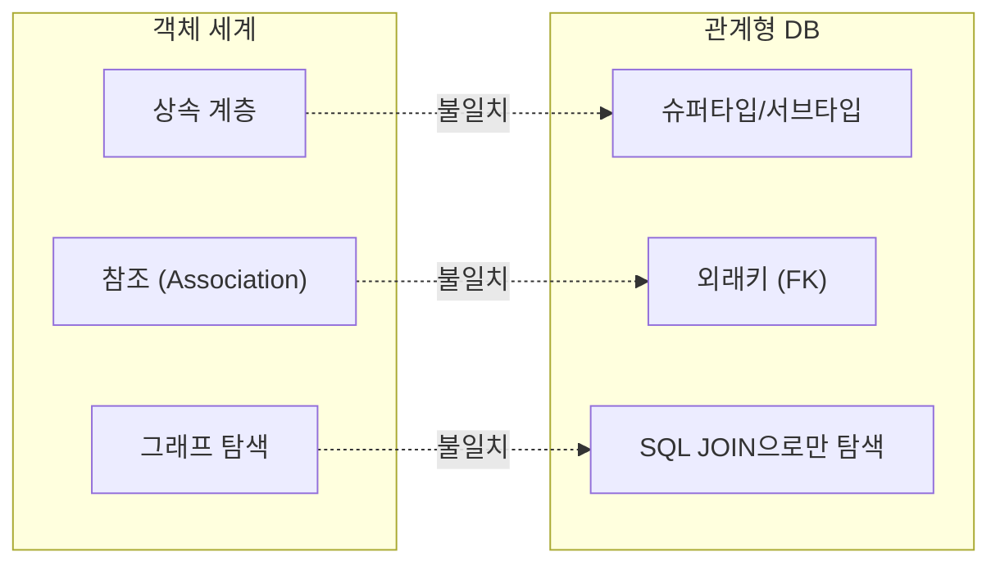
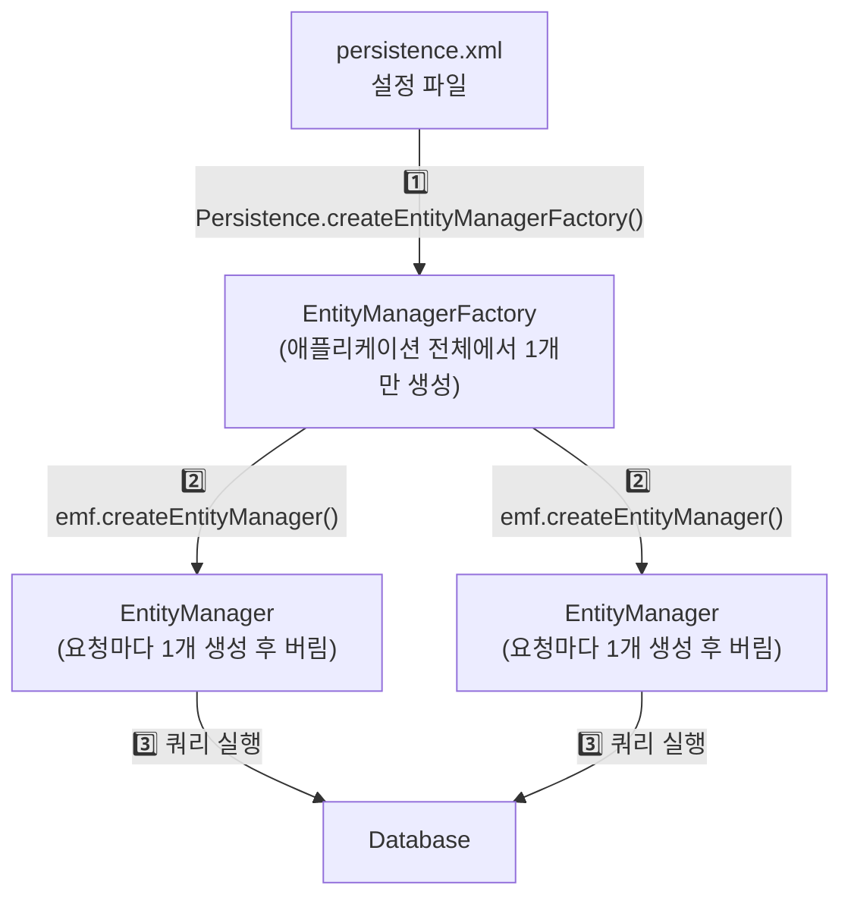

과거에는 객체를 데이터베이스에 저장하려면 복잡한 JDBC API와 SQL을 직접 작성해야 했다. MyBatis 등이 생겨나면서 JDBC API 코드는 사라졌지만 SQL을 한 땀 한 땀 작성해야 하는 번거로움은 남아있었다. JPA를 사용하면 SQL조차 작성할 필요가 없어진다.

> **비유**: JDBC는 자전거, MyBatis는 오토바이, JPA는 자율주행 자동차와 같다. 자율주행 자동차를 올바르게 이용하려면 내부 동작 원리를 이해해야 한다. 그냥 타면 엉뚱한 곳으로 간다.

---

## 1단계: JPA란?

### SQL 중심 개발의 문제점

객체를 데이터베이스에 저장·조회하려면 수많은 SQL과 매핑 코드가 필요하다.

```java
// SQL 중심 개발: Member 필드가 추가되면 모든 SQL을 수정해야 함
String sql = "SELECT ID, NAME, TEL FROM MEMBER WHERE ID = ?";
// → age 필드 추가 시 SELECT, INSERT, UPDATE 모두 수정 필요
```

**객체와 DB의 패러다임 불일치**


```mermaid
graph LR
    subgraph OBJ["객체 세계"]
        O1["상속 계층"]
        O2["참조 (Association)"]
        O3["그래프 탐색"]
    end
    subgraph DB["관계형 DB"]
        D1["슈퍼타입/서브타입"]
        D2["외래키 (FK)"]
        D3["SQL JOIN으로만 탐색"]
    end
    O1 -.->|"불일치"| D1
    O2 -.->|"불일치"| D2
    O3 -.->|"불일치"| D3
```

### JPA (Java Persistence API)

JPA는 자바 진영의 **ORM(Object-Relational Mapping) 기술 표준**이다. 개발자가 자바 객체를 조작하면 JPA가 적절한 SQL을 자동으로 생성해 실행한다.

### JPA가 실무에서 어려운 이유

단순 CRUD만으로 시작하면 쉬워 보이지만, 실무에서는 수십 개 이상의 복잡한 객체와 테이블이 사용된다. N+1 문제, 지연 로딩 예외, 벌크 연산 불일치 등 JPA 내부 동작을 모르면 예상치 못한 버그를 만나게 된다.

---

## 2단계: 프로젝트 설정

### 의존성 추가 (pom.xml)

```xml
<!-- Hibernate (JPA 구현체) -->
<dependency>
    <groupId>org.hibernate</groupId>
    <artifactId>hibernate-entitymanager</artifactId>
    <version>5.6.15.Final</version>
</dependency>

<!-- H2 데이터베이스 (개발/테스트용) -->
<dependency>
    <groupId>com.h2database</groupId>
    <artifactId>h2</artifactId>
    <version>2.2.224</version>
</dependency>
```

### JPA 환경설정 (persistence.xml)

`src/main/resources/META-INF/persistence.xml` 경로에 생성한다.

```xml
<?xml version="1.0" encoding="UTF-8"?>
<persistence version="2.2"
             xmlns="http://xmlns.jcp.org/xml/ns/persistence"
             xmlns:xsi="http://www.w3.org/2001/XMLSchema-instance"
             xsi:schemaLocation="http://xmlns.jcp.org/xml/ns/persistence
                 http://xmlns.jcp.org/xml/ns/persistence/persistence_2_2.xsd">
    <persistence-unit name="hello">
        <properties>
            <!-- 필수 속성: DB 연결 정보 -->
            <property name="javax.persistence.jdbc.driver" value="org.h2.Driver"/>
            <property name="javax.persistence.jdbc.user" value="sa"/>
            <property name="javax.persistence.jdbc.password" value=""/>
            <property name="javax.persistence.jdbc.url" value="jdbc:h2:tcp://localhost/~/test"/>
            <!-- 방언: 각 DB에 맞는 SQL 자동 생성 -->
            <property name="hibernate.dialect" value="org.hibernate.dialect.H2Dialect"/>

            <!-- 옵션: 개발 편의 설정 -->
            <property name="hibernate.show_sql" value="true"/>
            <property name="hibernate.format_sql" value="true"/>
            <property name="hibernate.use_sql_comments" value="true"/>
        </properties>
    </persistence-unit>
</persistence>
```

**dialect(방언)이란?** 각 데이터베이스가 제공하는 SQL 문법과 함수는 조금씩 다르다. Hibernate는 방언 설정에 따라 각 DB에 맞는 SQL을 자동으로 생성해준다. MySQL이면 `MySQLDialect`, Oracle이면 `OracleDialect`를 사용한다.

### JPA 구동 방식


```mermaid
graph TD
    XML["persistence.xml\n설정 파일"]
    EMF["EntityManagerFactory\n(애플리케이션 전체에서 1개만 생성)"]
    EM1["EntityManager\n(요청마다 1개 생성 후 버림)"]
    EM2["EntityManager\n(요청마다 1개 생성 후 버림)"]
    DB["Database"]

    XML -->|"1️⃣ Persistence.createEntityManagerFactory()"| EMF
    EMF -->|"2️⃣ emf.createEntityManager()"| EM1
    EMF -->|"2️⃣ emf.createEntityManager()"| EM2
    EM1 -->|"3️⃣ 쿼리 실행"| DB
    EM2 -->|"3️⃣ 쿼리 실행"| DB
```

---

## 3단계: 기본 CRUD 구현

### 엔티티 클래스 작성

H2 데이터베이스에 Member 테이블을 생성한다.

```sql
create table Member (
    id bigint not null,
    name varchar(255),
    primary key(id)
);
```

테이블과 매핑되는 엔티티 클래스를 작성한다.

```java
package hellojpa;

import javax.persistence.Entity;
import javax.persistence.Id;

@Entity // JPA가 관리하는 클래스 — 반드시 필요
public class Member {
    @Id // 기본키 매핑
    private Long id;
    private String name;

    // 기본 생성자 필수 (JPA가 리플렉션으로 객체 생성)
    public Member() {}

    public Member(Long id, String name) {
        this.id = id;
        this.name = name;
    }

    // getter, setter 생략
}
```

### JPA로 CRUD 실행

```java
public class JpaMain {

    public static void main(String[] args) {
        // EntityManagerFactory: 애플리케이션 전체에서 딱 1개만 생성
        EntityManagerFactory emf = Persistence.createEntityManagerFactory("hello");

        // EntityManager: DB 작업 단위마다 새로 생성, 스레드 간 공유 금지!
        EntityManager em = emf.createEntityManager();
        EntityTransaction tx = em.getTransaction();
        tx.begin();

        try {
            // CREATE — persist()로 영속성 컨텍스트에 저장
            Member member = new Member(1L, "HelloA");
            em.persist(member); // DB에 저장은 아직 안됨 (쓰기 지연)

            // READ — find()로 1차 캐시에서 먼저 조회
            Member findMember = em.find(Member.class, 1L);
            System.out.println("name = " + findMember.getName());

            // UPDATE — setter 호출만으로 자동 반영 (변경 감지)
            findMember.setName("HelloB"); // em.update() 불필요!

            // DELETE — remove()로 삭제 예약
            // em.remove(findMember);

            tx.commit(); // flush() 실행 → SQL 전송 → DB 커밋
        } catch (Exception e) {
            tx.rollback();
        } finally {
            em.close(); // EntityManager 반환
        }

        emf.close(); // 애플리케이션 종료 시 호출
    }
}
```

**실행 로그**

```sql
-- em.persist(member) → tx.commit() 시점에 INSERT 실행
Hibernate:
    /* insert hellojpa.Member */
    insert into Member (name, id) values (?, ?)

-- findMember.setName("HelloB") → tx.commit() 시점에 UPDATE 실행
Hibernate:
    /* update hellojpa.Member */
    update Member set name=? where id=?
```

---

## 4단계: 주의사항

### EntityManagerFactory vs EntityManager

```java
// EntityManagerFactory: 1개만 생성, 비용이 크므로 재사용
EntityManagerFactory emf = Persistence.createEntityManagerFactory("hello");

// EntityManager: 요청마다 새로 생성, 절대 스레드 간 공유 금지!
// (EntityManager는 Thread-safe하지 않음)
EntityManager em = emf.createEntityManager(); // 요청 시작
// ... 작업 수행 ...
em.close(); // 요청 종료 시 반드시 닫기
```

### 트랜잭션 필수

```java
// JPA의 모든 데이터 변경은 트랜잭션 안에서 실행해야 한다
EntityTransaction tx = em.getTransaction();
tx.begin();
try {
    // 데이터 변경 작업
    tx.commit();
} catch (Exception e) {
    tx.rollback(); // 예외 발생 시 반드시 롤백
} finally {
    em.close();
}
```

### Spring 환경에서는 자동 관리

실무에서는 Spring이 EntityManagerFactory, EntityManager, 트랜잭션을 모두 자동으로 관리해준다.

```java
@Service
@Transactional // Spring이 트랜잭션 + EntityManager를 자동으로 관리
public class MemberService {

    @Autowired
    private MemberRepository memberRepository;

    public void save(Member member) {
        memberRepository.save(member); // EntityManager.persist() 내부 호출
    }
}
```

---

<details class="extreme-scenario-details" ontoggle="if(this.open){var ad=this.querySelector('.extreme-scenario-ad');if(ad&&!ad.dataset.loaded){ad.dataset.loaded='1';(adsbygoogle=window.adsbygoogle||[]).push({});}}">
<summary class="extreme-scenario-summary">
<span class="extreme-scenario-icon">🔥</span>
<span class="extreme-scenario-label">극한 시나리오 — 클릭하여 펼치기</span>
<span class="extreme-scenario-toggle"></span>
</summary>
<div class="extreme-scenario-body">
<div class="extreme-scenario-ad" style="text-align:center; margin-bottom:1.5em;">
<ins class="adsbygoogle"
     style="display:block"
     data-ad-client="ca-pub-7225106491387870"
     data-ad-slot="0000000000"
     data-ad-format="auto"
     data-full-width-responsive="true"></ins>
</div>
<div class="extreme-scenario-content" markdown="1">

### 시나리오 1: EntityManager를 스레드 간 공유했을 때

```java
// 잘못된 코드: static 필드로 EntityManager를 공유
public class BadMemberService {
    private static EntityManager em = emf.createEntityManager(); // 위험!

    public void save(Member member) {
        em.persist(member); // 다른 스레드의 작업과 충돌 → 데이터 오염, 예외 발생
    }
}
// EntityManager는 Transaction 경계를 가지므로
// 여러 스레드가 공유하면 서로 다른 트랜잭션의 데이터가 섞임
```

### 시나리오 2: 트랜잭션 없이 데이터 변경

```java
// 트랜잭션 없이 변경 시 예외 발생
EntityManager em = emf.createEntityManager();
Member member = em.find(Member.class, 1L);
member.setName("changed"); // 변경 감지는 트랜잭션 안에서만 동작
em.flush(); // javax.persistence.TransactionRequiredException 발생!
```

### 시나리오 3: IDENTITY 전략의 특수성

```java
@Entity
public class Member {
    @Id @GeneratedValue(strategy = GenerationType.IDENTITY)
    private Long id; // DB가 AUTO_INCREMENT로 생성
}

// IDENTITY 전략은 persist() 시점에 즉시 INSERT 실행!
// 이유: INSERT 후에야 DB가 생성한 id값을 알 수 있기 때문에
// 쓰기 지연 최적화(배치 INSERT)가 적용되지 않는다는 점 주의
em.persist(new Member()); // 이 시점에 즉시 INSERT SQL 실행
```

---
</div>
</div>
</details>

## 실무 체크리스트

```
□ EntityManagerFactory는 애플리케이션 전체에서 1개만 생성
□ EntityManager는 요청(트랜잭션)마다 새로 생성, 스레드 간 공유 금지
□ 모든 데이터 변경은 트랜잭션 안에서 실행
□ Spring 환경에서는 @Transactional로 자동 관리 활용
□ dialect는 실제 사용하는 DB에 맞게 설정
□ 운영 환경에서 hibernate.hbm2ddl.auto=create 절대 금지
```

---

```
참조 - 자바 ORM 표준 JPA 프로그래밍 By 김영한
```
