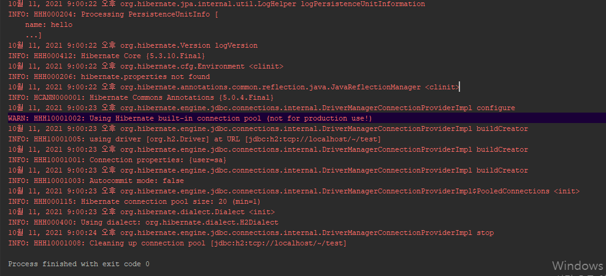

## Step 1:  JPA? - Java Persistence API

과거에는 객체를 데이터베이스에 저장을 하려면 복잡한 JDBC API와 SQL을 직접 작성하였다.

후에 Mybatis 등이 생겨나면서 JDBC API 코드를 직접 코딩해야하는 부분은 사라졌지만 여전히 SQL을 한땀 한땀 작성하여야 하는 번거로움이 남아있다.


그 후에 JPA가 생겨났는데 JPA를 사용하게 되면 SQL 조차도 작성할 필요가 없다! [100%는 아님..]


<span style="color:red">**그러나**</span> JPA는 실무에서 사용하기 상당히 어렵다고 한다. 

필자도 여태 MyBatis만 실무에서 사용하고 JPA도 단순 CRUD만 공부용으로 하고 실무에선 사용하지 않아보았다.

지금부터는 Deep~ 하게 JPA를 배워보자


**JPA 실무에서 어려운 이유!! By  김영한님****

* 처음 JPA나 스프링 데이터 JPA를 만나면?
* SQL 자동화, 수십줄의 코드가 한 두줄로?
* 실무에 바로 도입하면?
* 예제들은 보통 테이블이 한 두개로 단순함
* 실무는 수십 개 이상의 복잡한 객체와 테이블 사용


자 그럼  대망의 첫 출발을 시작해보자.

 

## Step 2:  프로젝트 생성 및 환경설정


#### 1-1. 프로젝트 생성 - Maven

###### 


1-2. 프로젝트 생성 GroupId, ArtifactId 대충 작성!!

1-3. NEXT -> FINISH 프로젝트 생성 완료


#### 2. 라이브러리 추가

pom.xml을 열어 JPA Interface의 구현체인 하이버네이트 프레임워크와  H2 데이터베이스 라이브러리를 추가한다!.


#### 3. JPA 환경설정

프로젝트 src/main/resources/META-INF/ 경로 아래에 persistence.xml 파일을 생성 후 아래와 같이 입력한다.


**복붙용 소스**

```
<?xml version="1.0" encoding="UTF-8"?>
<persistence version="2.2"
             xmlns="http://xmlns.jcp.org/xml/ns/persistence" xmlns:xsi="http://www.w3.org/2001/XMLSchema-instance"
             xsi:schemaLocation="http://xmlns.jcp.org/xml/ns/persistence http://xmlns.jcp.org/xml/ns/persistence/persistence_2_2.xsd">
    <persistence-unit name="hello">
        <properties>
            <!-- 필수 속성 -->
            <property name="javax.persistence.jdbc.driver" value="org.h2.Driver"/>
            <property name="javax.persistence.jdbc.user" value="sa"/>
            <property name="javax.persistence.jdbc.password" value=""/>
            <property name="javax.persistence.jdbc.url" value="jdbc:h2:tcp://localhost/~/test"/>
            <property name="hibernate.dialect" value="org.hibernate.dialect.H2Dialect"/>

            <!-- 옵션 -->
            <property name="hibernate.show_sql" value="true"/>
            <property name="hibernate.format_sql" value="true"/>
            <property name="hibernate.use_sql_comments" value="true"/>
            <!--<property name="hibernate.hbm2ddl.auto" value="create" />-->
        </properties>
    </persistence-unit>
</persistence>
```

persistence.xml 내용중 property 중 dialect라는 흥미로운 내용이 있다.

말그대로 방언이라는 뜻으로 각각의 데이터베이스가 제공하는 SQL 문법과 함수는 조금 씩 다르다.

JPA는 특정 데이터베이스에 종속 되지않기 때문에, JPA 구현체를 제공하는 하이버네이트에서 자동으로 방언을 제공해주는 기능이 있다.


위에 보면 h2 데이터베이스 user와 password를 꼭 기억하자.


데이터베이스는 H2를 사용할 것이다. 다운로드는 아래의 경로에서 하시고

https://www.h2database.com/html/main.html


관련 포스팅은 여길 참조하면 될 듯 

https://atoz-develop.tistory.com/entry/H2-Database-%EC%84%A4%EC%B9%98-%EC%84%9C%EB%B2%84-%EC%8B%A4%ED%96%89-%EC%A0%91%EC%86%8D-%EB%B0%A9%EB%B2%95


#### JPA 구동방식


## Step 3:  Main 실행

본격적으로 프로젝트를 실행해보기 위해

src/main/java/

아래 경로에 패키지를 만들고 JpaMain이라는 클래스를 만들었다!


이제 실행을 해보자 



실행하면 위와 같은 로그가 나온다.


<span style="color:red">참고로 아래와 같이 h2 database를 실행 시키지 않고 JpaMain을 실행하면 오류난다.</span>


**실행해서 접속해야함!!!!**


## Step 4:  객체와 테이블을 생성하고 매핑하기

데이터베이스에 실제 데이터를 넣어봐야 아 내가 JPA 설정을 제대로 했구나 라고 느낄 거 같다.

이번엔 객체와 테이블을 생성하고 매핑해보자!.

h2 database에 접속하여 아래의 Member 테이블을 생성하자.

```
create table Member (
        id bigint not null,
        name varchar(255),
        primary key(id)
);
```


위의 테이블과 매핑되는 객체를 만들어보자!!

```
package hellojpa;

import javax.persistence.Entity;
import javax.persistence.Id;

@Entity
public class Member {

    @Id
    private Long id;
    private String name;

    public Long getId() {
        return id;
    }

    public void setId(Long id) {
        this.id = id;
    }

    public String getName() {
        return name;
    }

    public void setName(String name) {
        this.name = name;
    }
}
```


이제 Member 객체를 만들어서 h2 데이터베이스에 넣어보자.

```
package hellojpa;

import javax.persistence.*;

public class JpaMain {

    public static void main(String[] args) {
        //persistenceUnitName은 persistence.xml에 작성된 persistence-unit을 적으면 된다!!!
        EntityManagerFactory emf = Persistence.createEntityManagerFactory("hello");
        //EntityManagerFactory는 로딩시점에 딱 하나만 만들어져야 한다.

        //디비 커넥션 얻어서 쿼리를 날리고 종료되는 일관적인 단위를 할 떄마다 entityManager를 만들어야한다.
        EntityManager entitymanager = emf.createEntityManager();

        //JPA에서 모든 데이터 작업은 트랜잭션 안에서 이루어져야 한다.
        EntityTransaction tx = entitymanager.getTransaction();
        tx.begin();
        try {
       

            Member member = new Member();
            member.setId(1L);
            member.setName("HelloA");
            entitymanager.persist(member);

            tx.commit();
        }
        catch (Exception ex) {
            tx.rollback();
        }
        finally {
            entitymanager.close();
        }
        emf.close();
    }
}
```


실행하게 되면 아래와 같이 INSERT 로그가 출력된다.


H2 DATABASE에 접속하여 SELECT 쿼리를 날려보면 데이터가 저장된 것을 확인 할 수 있다.


**JPA 조회 방법**

방금 전 DB에 넣은 데이터를 JPA상에서 조회해보자. 매우 간단하다.


실행 결과


**JPA 수정 [수정이 개인적으론 가장 흥미로웠는데 별도의 persist 저장 없이 수정이 되버린다.]**


**JPA 삭제**


위에서 주석으로 작성해놨지만 

**주의사항** 

* EntityManagerFactory는 하나만 생성해서 애플리케이션 전체에서 공유
* EntityManager는 쓰레드간에 공유 x(사용하고 버려야 한다.)
* JPA의 모든 데이터 변경은 트랜잭션 안에서 실행.


자세한 개념들은 이후의 포스팅에서 작성하겠다.

솔직히 이번 한번에 너무 많이 작성한 거 같아 힘들다.

```
참조 - 자바 ORM 표준 JPA 프로그래밍 By 김영한
```
