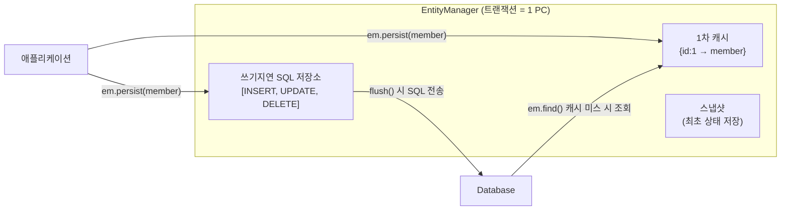
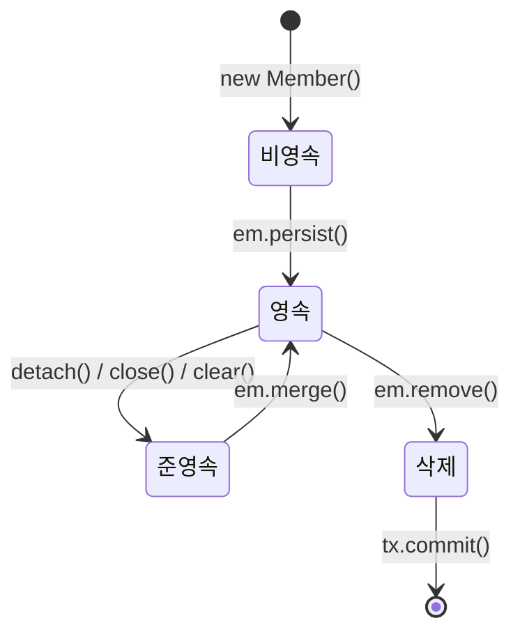
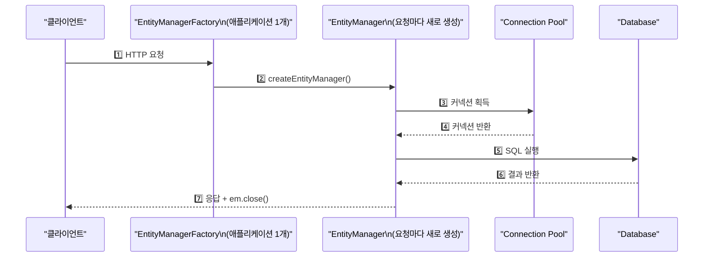
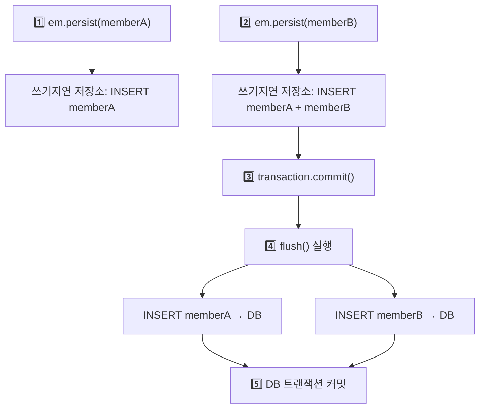
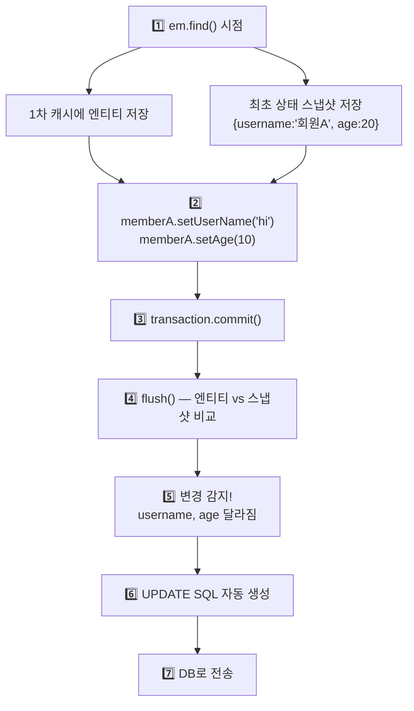

JPA가 내부적으로 어떻게 동작하는지를 이해하지 못하면 "분명히 값을 바꿨는데 DB에 반영이 안 된다", "분명히 저장했는데 조회가 안 된다"는 혼란을 겪게 된다. 영속성 컨텍스트가 JPA의 모든 마법의 원천이다.

> **비유**: 영속성 컨텍스트는 회사의 임시 결재함과 같다. 문서(엔티티)가 오면 바로 본사(DB)로 보내는 게 아니라 일단 수신함에 모아두었다가 결재(commit) 시점에 한꺼번에 처리한다.

---

## 1단계: 영속성 컨텍스트란?

**"엔티티를 영구 저장하는 환경"**이다. JPA를 이해하는 데 있어 가장 핵심적인 개념이다.

`EntityManager.persist(entity)`는 DB에 저장하는 것이 아니라 **영속성 컨텍스트에 엔티티를 저장**하는 것이다. 실제 DB 저장은 트랜잭션 커밋 시점에 이루어진다.



EntityManager는 영속성 컨텍스트에 접근하는 창구 역할을 한다. Spring에서 `@Transactional`이 시작되면 EntityManager가 생성되고, 트랜잭션이 종료되면 영속성 컨텍스트도 함께 종료된다.

---

## 2단계: 엔티티 생명주기

> **비유**: 사람의 고용 상태와 같다. 입사 지원서만 낸 상태(비영속), 재직 중(영속), 퇴직(준영속), 인사 말소(삭제)로 나뉜다.



### 비영속 (new / transient)
영속성 컨텍스트와 전혀 관계 없는 순수 자바 객체 상태다.

```java
Member member = new Member();
member.setId("member1");
member.setUsername("회원1");
// 변경해도 DB 반영 없음
```

### 영속 (managed)
영속성 컨텍스트에 의해 관리되는 상태다. 1차 캐시에 저장되며, 변경 감지·쓰기 지연의 이점을 누릴 수 있다.

```java
EntityManager em = emf.createEntityManager();
EntityTransaction tx = em.getTransaction();
tx.begin();

em.persist(member); // 영속 상태로 전환 — 아직 DB에 저장 안됨

tx.commit(); // 이 시점에 쓰기지연 SQL 저장소의 INSERT가 DB로 전송
```

### 준영속 (detached)
영속성 컨텍스트에서 분리된 상태다. **변경 감지가 동작하지 않는다.**

```java
em.detach(member); // 특정 엔티티만 분리
em.clear();        // 영속성 컨텍스트 전체 초기화
em.close();        // 영속성 컨텍스트 종료
```

### 삭제 (removed)
삭제가 예약된 상태다. 트랜잭션 커밋 시 실제 DELETE SQL이 실행된다.

```java
em.remove(member); // DELETE 예약
tx.commit();       // DELETE FROM Member WHERE id=?
```

---

## 3단계: JPA Request Flow

고객이 요청할 때마다 EntityManagerFactory를 통해 EntityManager를 생성한다. 생성된 EntityManager는 내부적으로 Database Connection Pool을 사용해 DB와 통신한다.



---

## 4단계: 영속성 컨텍스트의 이점

### 4-1. 1차 캐시 — DB 왕복 최소화

영속성 컨텍스트 내부에 Map 형태의 1차 캐시가 존재한다. 키는 `@Id`, 값은 엔티티 인스턴스다.

```java
Member member1 = new Member();
member1.setId("member1");
member1.setUsername("회원1");

// 1차 캐시에 저장 (DB에는 아직 저장 안됨)
em.persist(member1);

// 1차 캐시 HIT → DB 쿼리 없음
Member findMember = em.find(Member.class, "member1");

// 1차 캐시 MISS → DB 조회 후 1차 캐시에 저장
Member findMember2 = em.find(Member.class, "member2");
```

**SQL 로그 확인**

```sql
-- em.find(Member.class, "member1") → 1차 캐시 HIT → 쿼리 없음
-- em.find(Member.class, "member2") → DB 조회
Hibernate:
    select member0_.id, member0_.username
    from Member member0_
    where member0_.id=?
```

1차 캐시는 **트랜잭션 단위로 존재**한다. 트랜잭션이 종료되면 사라진다.

### 4-2. 동일성 보장 — 같은 인스턴스 반환

동일한 트랜잭션 내에서 같은 식별자로 조회한 엔티티는 항상 **동일한 인스턴스**를 반환한다.

```java
Member a = em.find(Member.class, "member1");
Member b = em.find(Member.class, "member1"); // DB 쿼리 없음, 1차 캐시 반환

System.out.println(a == b); // true — 완전히 동일한 인스턴스
// 자바 컬렉션에서 꺼낸 것처럼 같은 참조
```

### 4-3. 쓰기 지연 — 커밋 시점에 한꺼번에 처리



```java
EntityTransaction transaction = em.getTransaction();
transaction.begin();

em.persist(memberA); // 쓰기지연 저장소에 INSERT memberA 등록
em.persist(memberB); // 쓰기지연 저장소에 INSERT memberB 등록
// 여기까지 INSERT SQL을 데이터베이스에 보내지 않는다.

transaction.commit(); // 이 시점에 INSERT SQL 2개가 한꺼번에 DB로 전송
```

`hibernate.jdbc.batch_size`를 설정하면 여러 SQL을 배치로 한꺼번에 전송해 성능을 최적화할 수 있다.

### 4-4. 변경 감지 (Dirty Checking) — em.update() 없이 자동 반영

JPA에서 엔티티를 수정할 때 `em.update()` 같은 메서드는 없다. 필드 값만 변경하면 트랜잭션 커밋 시점에 자동으로 UPDATE SQL이 실행된다.



```java
EntityTransaction transaction = em.getTransaction();
transaction.begin();

// 영속 엔티티 조회
Member memberA = em.find(Member.class, "memberA");

// 영속 엔티티 데이터 수정 — em.update() 없이도 자동 반영!
memberA.setUserName("hi");
memberA.setAge(10);

transaction.commit(); // UPDATE SQL 자동 실행
```

**스냅샷**이란 영속성 컨텍스트에서 1차 캐시에 최초로 들어온 상태(최초 조회 시점의 값)를 말한다. flush() 시점에 현재 엔티티 상태와 스냅샷을 비교해 변경된 필드가 있으면 UPDATE SQL을 자동으로 생성한다.

**왜 em.update()가 없는가?** JPA의 목적은 자바 컬렉션을 다루듯이 객체를 다루는 것이기 때문이다. 컬렉션에서 꺼낸 값을 수정하면 별도로 "저장"을 호출하지 않아도 수정된 상태가 유지되는 것처럼, JPA도 같은 방식으로 동작한다.

### 4-5. 지연 로딩 (Lazy Loading)

연관된 엔티티를 즉시 조회하지 않고, 실제로 접근하는 시점에 DB 쿼리를 실행하는 방식이다. N+1 문제와 함께 별도 포스팅에서 상세히 다룬다.

---

## 5단계: 플러시 (Flush)

**플러시**란 영속성 컨텍스트의 변경내용을 데이터베이스에 동기화하는 작업이다. **영속성 컨텍스트를 비우지 않으며**, 커밋 직전에만 동기화하면 된다.

플러시가 발생하면 세 가지 일이 일어난다.

1. 변경 감지 실행 (Dirty Checking)
2. 수정된 엔티티를 쓰기지연 SQL 저장소에 등록
3. 쓰기지연 SQL 저장소의 쿼리를 DB로 전송

**플러시 발생 시점 3가지**

```java
// 1. 직접 호출
em.flush();

// 2. 트랜잭션 커밋 시 자동 호출 (가장 일반적)
transaction.commit(); // 내부적으로 flush() 먼저 실행

// 3. JPQL 쿼리 실행 전 자동 호출
em.persist(memberA);
em.persist(memberB);
// 여기까지 DB에 없는 상태

// JPQL 실행 전 flush() 자동 호출 → memberA, memberB가 결과에 포함됨
List<Member> members = em.createQuery("select m from Member m", Member.class)
        .getResultList();
// (flush 없으면 방금 persist한 엔티티가 조회 결과에서 빠짐)
```

| 구분 | flush | commit |
|------|-------|--------|
| 역할 | 변경내용을 DB에 동기화 | DB 트랜잭션 최종 확정 |
| 1차 캐시 | **유지됨** | 종료됨 |
| 롤백 | flush 후에도 롤백 가능 | 커밋 후 롤백 불가 |

---

## 6단계: 준영속 상태

영속 상태의 엔티티가 영속성 컨텍스트에서 분리된 상태다. 영속성 컨텍스트가 제공하는 기능(변경 감지, 1차 캐시, 지연 로딩)을 사용할 수 없다.

```java
// 준영속으로 전환하는 방법
em.detach(member); // 특정 엔티티만 분리
em.clear();        // 영속성 컨텍스트 전체 초기화 (1차 캐시 전체 삭제)
em.close();        // 영속성 컨텍스트 종료

// 준영속 상태에서 변경 시 → DB 반영 안됨
member.setName("changed"); // 변경 감지 동작 안함
transaction.commit();      // UPDATE 실행 안됨
```

**LazyInitializationException의 원인**: Spring에서 `@Transactional` 없는 Service/Controller에서 지연 로딩을 시도하면 이미 영속성 컨텍스트가 종료(준영속 상태)된 상태이므로 예외가 발생한다.

```java
// 트랜잭션 없는 메서드에서 지연 로딩 시도 → 예외
Member member = memberRepository.findById(1L).get(); // 트랜잭션 종료됨
member.getTeam().getName(); // LazyInitializationException!
// 해결: @Transactional 추가 또는 Fetch Join으로 미리 로딩
```

---

<details class="extreme-scenario-details">
<summary class="extreme-scenario-summary">
<span class="extreme-scenario-icon">🔥</span>
<span class="extreme-scenario-label">극한 시나리오 — 클릭하여 펼치기</span>
<span class="extreme-scenario-toggle"></span>
</summary>
<div class="extreme-scenario-body">

<div class="extreme-scenario-content" markdown="1">

### 시나리오 1: 준영속 상태에서 merge() 함정

```java
// merge()는 UPDATE가 아니라 전체 필드를 덮어쓴다
Member detached = new Member();
detached.setId(1L);
detached.setUsername("newName");
// age, email 등 다른 필드는 null

Member merged = em.merge(detached);
// 1차 캐시에서 id=1 조회 → 없으면 DB 조회 후
// detached의 모든 필드로 덮어씀
// → null 필드가 있으면 DB에 null로 UPDATE됨!
// 안전한 방법: em.find() 후 필드 하나씩 변경
```

### 시나리오 2: clear() 후 동일성 보장 깨짐

```java
Member a = em.find(Member.class, 1L);
em.clear(); // 1차 캐시 전체 초기화

Member b = em.find(Member.class, 1L); // DB 재조회

System.out.println(a == b); // false! (clear 후 새로 조회한 인스턴스)
// → 동일한 데이터이지만 다른 인스턴스
// 트랜잭션 내에서 불필요하게 clear()를 호출하면 안 되는 이유
```

### 시나리오 3: flush()와 commit()의 차이 — 롤백

```java
tx.begin();
em.persist(new Member(1L, "kim"));
em.flush(); // SQL이 DB로 전송됨 (다른 커넥션에서 격리 수준에 따라 보일 수도 있음)
// 하지만 아직 트랜잭션 커밋 전

tx.rollback(); // 롤백하면 flush된 데이터도 취소됨
// DB에 member가 없음 — flush가 commit이 아님을 확인
```

---
</div>
</div>
</details>

## 실무 체크리스트

```
□ em.persist()는 DB 저장이 아닌 영속성 컨텍스트 저장임을 인지
□ 변경 감지는 영속 상태에서만 동작 — 준영속 상태에서는 동작 안함
□ flush()는 영속성 컨텍스트를 비우지 않음 (1차 캐시 유지)
□ LazyInitializationException 발생 시 준영속 상태인지 확인
□ merge()는 null 필드도 덮어씀 — find() 후 필드 변경이 더 안전
□ @Transactional(readOnly=true) 조회 전용 서비스에 적용 (스냅샷 저장 생략)
```

---

```
참조 - 자바 ORM 표준 JPA 프로그래밍 By 김영한
```
