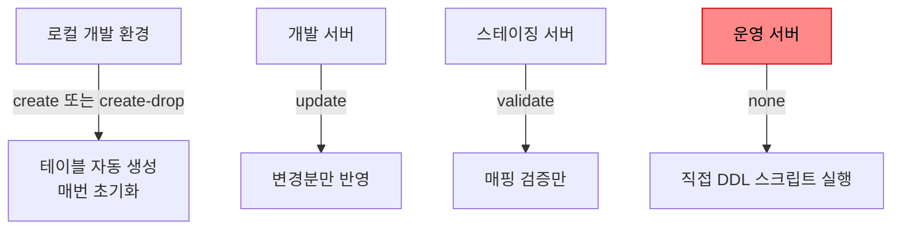
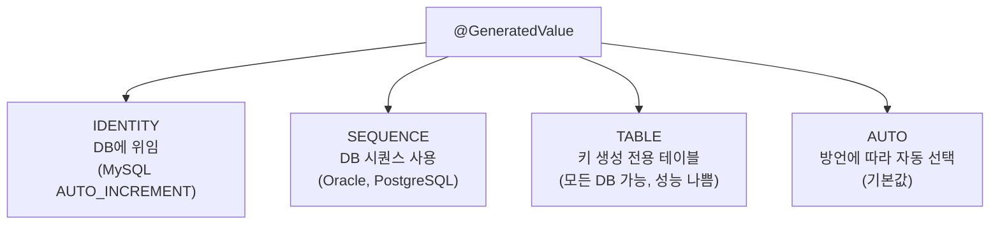

JPA에서 엔티티 매핑은 객체와 DB 테이블을 연결하는 설계 작업이다. 어노테이션 하나를 잘못 사용하면 운영 DB 데이터가 날아가거나, 타입 변경으로 기존 데이터가 오염되는 사고가 발생한다. 각 어노테이션의 의미와 주의사항을 정확히 이해해야 한다.

> **비유**: 엔티티 매핑은 건물 설계도와 같다. 설계도(어노테이션)가 잘못되면 실제 건물(DB 스키마)이 엉망이 된다. 특히 운영 중인 건물의 설계도를 바꾸는 것(스키마 변경)은 매우 신중해야 한다.

---

## 1단계: 객체와 테이블 매핑

### @Entity — JPA 관리 대상 선언

```java
@Entity // JPA가 관리하는 클래스 — 반드시 필요
@Table(name = "member") // 테이블명 지정 (기본값: 클래스명)
public class Member {
    // 기본 생성자 필수 (파라미터 없는 public 또는 protected)
    protected Member() {}

    @Id
    private Long id;
    private String name;
}
```

**@Entity 주의사항**

| 금지 사항 | 이유 |
|-----------|------|
| 기본 생성자 없음 | JPA가 리플렉션으로 객체 생성 시 기본 생성자 필요 |
| final 클래스 | 지연 로딩 프록시 생성 불가 (Hibernate가 서브클래스로 프록시 생성) |
| enum, interface, inner 클래스 | JPA 엔티티로 사용 불가 |
| 필드에 final | 변경 감지가 final 필드에 대해 동작하지 않음 |

---

## 2단계: 데이터베이스 스키마 자동 생성

JPA는 애플리케이션 실행 시점에 DDL을 자동으로 생성하는 기능을 제공한다.

```xml
<property name="hibernate.hbm2ddl.auto" value="create"/>
```

```yaml
# Spring Boot 환경 (application.yml)
spring:
  jpa:
    hibernate:
      ddl-auto: create
```

| 옵션 | 동작 | 사용 환경 |
|------|------|-----------|
| `create` | 기존 테이블 삭제 후 재생성 (DROP + CREATE) | **로컬 개발만** |
| `create-drop` | create와 동일, 애플리케이션 종료 시 DROP | **로컬 테스트만** |
| `update` | 변경분만 반영 (컬럼 추가는 되지만 삭제는 안됨) | **개발 서버만** |
| `validate` | 엔티티와 테이블 매핑이 맞는지 확인만 | 스테이징 |
| `none` | 스키마 자동 생성 사용 안함 | **운영 서버 필수** |

**절대 지켜야 할 규칙**

```
운영 서버: create, create-drop, update 절대 사용 금지!
→ create: 모든 테이블 DROP → 데이터 전체 삭제
→ update: 예상치 못한 스키마 변경으로 서비스 장애 가능
```



---

## 3단계: 필드와 컬럼 매핑

### @Column — 컬럼 상세 설정

```java
@Entity
public class Member {
    @Id
    private Long id;

    @Column(name = "member_name",      // DB 컬럼명 (기본값: 필드명)
            nullable = false,           // NOT NULL 제약 조건
            length = 50,                // VARCHAR(50) — String 타입에만 적용
            unique = true,              // UNIQUE 제약 조건 (단일 컬럼)
            insertable = true,          // INSERT 시 포함 여부 (기본값 true)
            updatable = false)          // UPDATE 시 포함 여부 — 등록 후 변경 금지 컬럼에 사용
    private String username;

    @Column(columnDefinition = "varchar(100) default 'EMPTY'") // DB 컬럼 정의 직접 지정
    private String description;

    @Column(precision = 10, scale = 2) // BigDecimal: 전체 자릿수 10, 소수 자릿수 2
    private BigDecimal price;
}
```

**주의**: `@Column(unique = true)`는 제약 조건 이름이 알아보기 힘들게 생성된다. 운영에서는 `@Table(uniqueConstraints = ...)` 방식으로 이름을 직접 지정하는 것이 권장된다.

```java
@Table(uniqueConstraints = {
    @UniqueConstraint(name = "uk_member_name", columnNames = {"member_name"})
})
public class Member { ... }
```

### @Enumerated — Enum 타입 매핑

```java
public enum RoleType { USER, ADMIN }

@Entity
public class Member {
    // ORDINAL (기본값): enum 순서(0, 1, 2...)를 DB에 저장 — 절대 사용 금지!
    // STRING: enum 이름("USER", "ADMIN")을 DB에 저장
    @Enumerated(EnumType.STRING) // 반드시 STRING 사용
    private RoleType roleType;
}
```

**ORDINAL을 절대 사용하면 안 되는 이유**

```java
// 기존 enum
public enum RoleType { USER, ADMIN }
// DB: USER=0, ADMIN=1 저장

// 중간에 GUEST 추가
public enum RoleType { GUEST, USER, ADMIN } // GUEST=0, USER=1, ADMIN=2 로 순서 변경
// 기존 DB의 0은 USER였지만 이제 GUEST가 됨 → 데이터 오염!
// STRING 방식이었으면: "USER", "ADMIN" 문자열이 저장되므로 문제 없음
```

### @Temporal — 날짜 타입 매핑

```java
@Entity
public class Member {
    // Java 8 이전 방식
    @Temporal(TemporalType.DATE)      // DATE: 날짜 (2024-01-01)
    private Date birthDate;

    @Temporal(TemporalType.TIME)      // TIME: 시간 (12:00:00)
    private Date loginTime;

    @Temporal(TemporalType.TIMESTAMP) // TIMESTAMP: 날짜+시간 (2024-01-01 12:00:00)
    private Date createdAt;

    // Java 8 이후 — @Temporal 생략 가능 (최신 Hibernate 지원)
    private LocalDate birthday;        // DATE
    private LocalDateTime createdDate; // TIMESTAMP — 실무에서 이 방식 사용
}
```

### @Lob — 대용량 데이터

```java
@Entity
public class Article {
    // String, char[], java.sql.CLOB → CLOB 타입
    @Lob
    private String content; // VARCHAR를 넘어서는 긴 텍스트

    // byte[], java.sql.BLOB → BLOB 타입
    @Lob
    private byte[] thumbnail; // 이미지 등 바이너리 데이터
}
```

### @Transient — DB와 무관한 필드

```java
@Entity
public class Member {
    @Transient // DB에 저장/조회하지 않음 — 메모리에만 존재
    private int hashTemp; // 임시 계산값 등
}
```

---

## 4단계: 기본 키 매핑

### 직접 할당 vs 자동 생성

```java
// 직접 할당: @Id만 사용
@Id
private String id; // 코드로 직접 id 값을 넣음

// 자동 생성: @GeneratedValue 추가
@Id
@GeneratedValue(strategy = GenerationType.IDENTITY) // 전략 선택
private Long id;
```

### GenerationType별 동작 방식



**IDENTITY 전략**

```java
@Entity
public class Member {
    @Id
    @GeneratedValue(strategy = GenerationType.IDENTITY)
    private Long id; // MySQL AUTO_INCREMENT
}

// 주의: IDENTITY 전략은 persist() 시점에 즉시 INSERT 실행!
// 이유: id는 INSERT 후 DB가 생성하므로, 1차 캐시에 id를 넣으려면
//       미리 INSERT를 실행해 id를 알아와야 함
em.persist(new Member()); // 즉시 INSERT SQL 실행 + 생성된 id 조회
// → 쓰기 지연(배치 INSERT) 최적화가 적용되지 않음
```

**SEQUENCE 전략**

```java
@Entity
@SequenceGenerator(
    name = "member_seq_generator",
    sequenceName = "member_seq",  // DB에 등록된 시퀀스 이름
    initialValue = 1,
    allocationSize = 50           // 시퀀스 한 번 호출에 증가하는 수
                                  // (성능 최적화: 50개를 미리 메모리에 확보)
)
public class Member {
    @Id
    @GeneratedValue(strategy = GenerationType.SEQUENCE,
                    generator = "member_seq_generator")
    private Long id;
}

// SEQUENCE 전략은 em.persist() 전에 시퀀스를 미리 가져옴
// allocationSize=50이면 DB 시퀀스 호출 횟수를 1/50으로 줄일 수 있음
```

**TABLE 전략 — 운영에서는 비추천**

```java
// 키 생성 전용 테이블을 만들어 시퀀스를 흉내내는 전략
// 모든 DB에서 사용 가능하지만 테이블 락으로 성능이 나쁨
// 운영에서는 사용 지양
@TableGenerator(
    name = "member_table_generator",
    table = "MY_SEQUENCES",
    pkColumnValue = "MEMBER_SEQ",
    allocationSize = 50
)
```

### 권장 식별자 전략

```java
// 권장: Long + 대체키 + IDENTITY 또는 SEQUENCE 전략
@Id
@GeneratedValue(strategy = GenerationType.IDENTITY)
private Long id; // Long 타입 (int는 범위 부족 위험)

// 자연키(주민번호, 이메일 등)를 PK로 사용하지 말 것
// 이유: 정책이 바뀌면 변경 불가 — PK는 변하면 안됨
// ex) 주민번호를 PK로 쓰다가 주민번호 저장 금지 정책 시 대규모 수정 필요
```

| 조건 | 이유 |
|------|------|
| NULL 불가 | JPA 식별자 기본 조건 |
| 유일 | 1차 캐시 키 |
| 변하면 안됨 | 영속성 컨텍스트와 DB 정합성 |

---

## 극한 시나리오

### 시나리오 1: 운영에서 create 옵션 사용 — 데이터 전체 삭제

```
# 운영 서버 application.yml에 실수로 create 설정
spring.jpa.hibernate.ddl-auto: create

# 애플리케이션 재시작 시:
# 1. DROP TABLE member (기존 데이터 전체 삭제!)
# 2. CREATE TABLE member
# → 회원 데이터 수백만 건 삭제 → 서비스 불능

# 방어 방법: 운영 배포 전 application-prod.yml 별도 관리
# spring.jpa.hibernate.ddl-auto: validate (또는 none)
```

### 시나리오 2: @Enumerated(EnumType.ORDINAL) 데이터 오염

```java
// 출시 시점
public enum OrderStatus { PENDING, PAID, SHIPPED }
// DB에 PENDING=0, PAID=1, SHIPPED=2 저장

// 6개월 후 CANCELLED 중간 삽입
public enum OrderStatus { PENDING, CANCELLED, PAID, SHIPPED }
// CANCELLED=1, PAID=2, SHIPPED=3 으로 순서 변경
// 기존 DB의 1(PAID)이 이제 CANCELLED로 읽힘 → 결제된 주문이 취소로 오염!

// 해결: @Enumerated(EnumType.STRING) 항상 사용
```

### 시나리오 3: IDENTITY 전략과 배치 INSERT 불가

```java
// IDENTITY 전략은 배치 INSERT 최적화 불가
// 대규모 bulk insert 필요 시 SEQUENCE + allocationSize 사용

@Id
@GeneratedValue(strategy = GenerationType.SEQUENCE,
    generator = "member_seq")
@SequenceGenerator(name = "member_seq", allocationSize = 1000) // 1000개씩 미리 확보
private Long id;

// spring.jpa.properties.hibernate.jdbc.batch_size: 1000 설정과 함께 사용
// → DB 시퀀스 호출은 1000건당 1번, INSERT는 배치로 한꺼번에
```

### 시나리오 4: @Column(updatable=false) 누락으로 등록일 변경

```java
// createdAt이 update 대상에 포함되어 변경됨
@Column
private LocalDateTime createdAt; // 위험: UPDATE 시 변경될 수 있음

// 올바른 방법: updatable=false로 UPDATE에서 제외
@Column(updatable = false)
private LocalDateTime createdAt; // INSERT 시에만 설정, 이후 변경 불가

// 또는 @CreationTimestamp (Hibernate 전용) 또는
// @EntityListeners(AuditingEntityListener.class) + @CreatedDate (Spring Data)
```

---

## 실무 체크리스트

```
□ @Enumerated는 반드시 EnumType.STRING 사용 (ORDINAL 금지)
□ 운영 서버는 ddl-auto: none 또는 validate 설정
□ 날짜 타입은 LocalDate, LocalDateTime 사용 (Java 8+)
□ PK는 Long + @GeneratedValue 사용 (자연키 PK 금지)
□ unique 제약조건은 @Table(uniqueConstraints)로 이름 명시
□ 변경 불가 컬럼은 @Column(updatable = false) 설정
□ 대규모 bulk insert 시 SEQUENCE + allocationSize + batch_size 조합 사용
```

---

```
참조 - 자바 ORM 표준 JPA 프로그래밍 By 김영한
```
