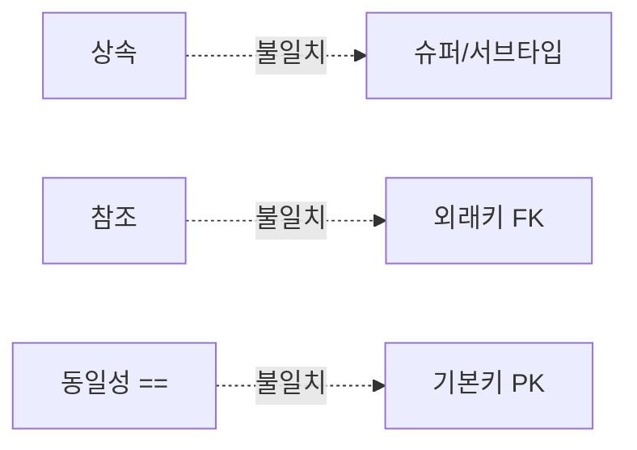
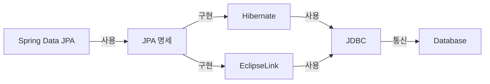
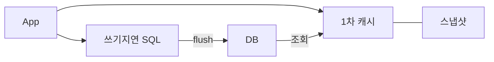
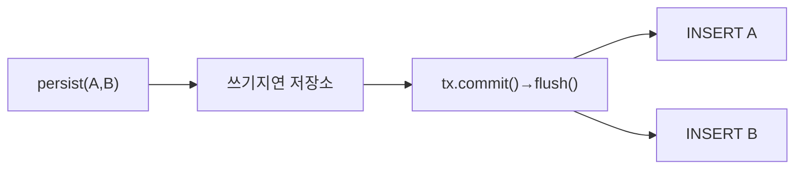
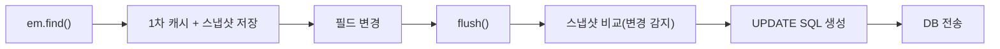
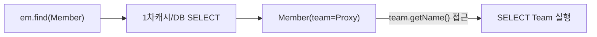
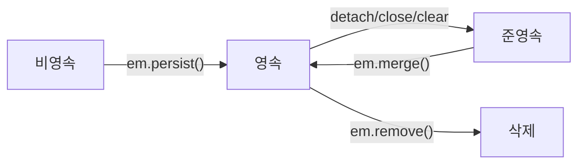
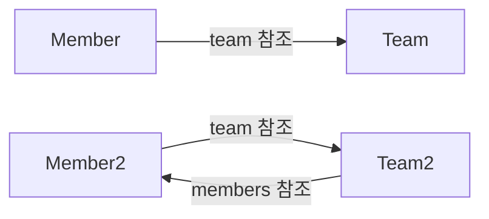
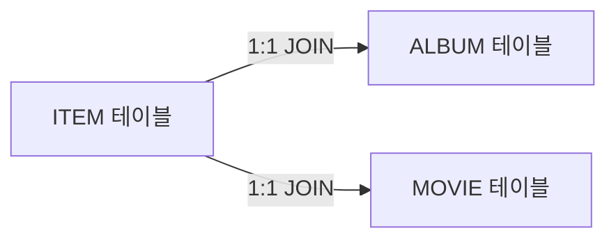
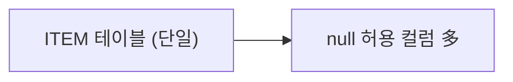

Spring Boot로 애플리케이션을 만들다 보면 SQL 한 줄 짜지 않았는데 쿼리가 수십 번 나가거나, 분명히 값을 바꿨는데 DB에 반영이 안 되는 경험을 하게 된다. 이런 문제의 뿌리는 대부분 JPA 내부 동작을 모르는 데 있다.

> **비유**: JPA는 번역사와 같다. 개발자가 자바 객체 언어로 말하면, JPA가 데이터베이스가 이해하는 SQL로 통역해준다. 단, 번역사의 작업 방식을 모르면 엉뚱한 번역이 나오거나 같은 말을 여러 번 반복하게 된다.

---

## 1단계: JPA란? ORM이란?

### ORM (Object-Relational Mapping)

객체지향 언어에서 사용하는 **객체(Object)**와 관계형 데이터베이스의 **테이블(Relation)** 사이의 불일치를 자동으로 해결해주는 기술이다. 개발자가 SQL을 직접 작성하는 대신, 객체를 조작하면 ORM 프레임워크가 적절한 SQL을 자동으로 생성하고 실행한다.

**객체와 테이블의 패러다임 불일치 문제**



ORM 없이 이 불일치를 직접 해결하면 반복적인 JDBC 코드, 매핑 오류, 유지보수 어려움이 생긴다.

### JPA (Java Persistence API)

JPA는 자바 진영의 **ORM 기술 표준 명세(Specification)**다. JPA 자체는 인터페이스의 모음이며 실제 구현체가 별도로 존재한다.

```java
// JPA는 인터페이스다 — 실제 동작은 Hibernate 같은 구현체가 담당
public interface EntityManager {
    public void persist(Object entity);
    public <T> T find(Class<T> entityClass, Object primaryKey);
    public <T> T merge(T entity);
    public void remove(Object entity);
}
```

### JPA vs Hibernate vs Spring Data JPA 계층 구조

세 가지를 혼동하는 경우가 많다. 상하 관계를 명확히 이해해야 한다.



- **JPA**: 표준 인터페이스. 어떻게 동작해야 하는지 규약만 정의한다.
- **Hibernate**: JPA의 가장 대표적인 구현체. 실제로 SQL을 생성하고 실행한다.
- **Spring Data JPA**: Hibernate 위에서 더 편리하게 사용하도록 추상화한 스프링 모듈. `JpaRepository`를 상속하면 기본 CRUD, 페이징, 정렬이 자동 제공된다.

```java
// Spring Data JPA 사용 예시
public interface MemberRepository extends JpaRepository<Member, Long> {
    // 메서드 이름만으로 쿼리 자동 생성
    List<Member> findByUsername(String username);
    List<Member> findByAgeGreaterThan(int age);
    // → SELECT m FROM Member m WHERE m.age > :age
}
```

실무에서 대부분은 Spring Data JPA를 사용하지만, 내부적으로 Hibernate가 동작한다. **Hibernate의 동작 원리를 이해하지 못하면 N+1, LazyInitializationException 같은 예상치 못한 버그를 만나게 된다.**

---

## 2단계: 영속성 컨텍스트 동작 원리

> **비유**: 회사의 임시 결재함과 같다. 문서(엔티티)가 오면 바로 본사(DB)로 보내는 게 아니라 일단 수신함(1차 캐시)에 모아두었다가 결재(commit) 시점에 한꺼번에 처리한다.

영속성 컨텍스트(Persistence Context)는 **"엔티티를 영구 저장하는 환경"**이다. JPA를 이해하는 데 있어 가장 핵심적인 개념이다.



영속성 컨텍스트는 **트랜잭션 단위로 생성·소멸**된다. Spring에서 `@Transactional`이 시작되면 EntityManager가 생성되고, 트랜잭션이 종료되면 영속성 컨텍스트도 함께 종료된다.

### 2-1. 1차 캐시 — DB 왕복 최소화

영속성 컨텍스트 내부에는 **1차 캐시**라는 Map이 존재한다. 키는 `@Id`로 매핑한 식별자, 값은 엔티티 인스턴스다.

```java
// 1차 캐시에 저장 (DB에는 아직 저장 안됨)
Member member = new Member();
member.setId(1L);
member.setUsername("kim");
em.persist(member);

// 1차 캐시 HIT → DB 쿼리 없음
Member findMember1 = em.find(Member.class, 1L);

// 1차 캐시 MISS → DB 조회 후 1차 캐시에 저장
Member findMember2 = em.find(Member.class, 2L);
```

**SQL 로그 확인**

```sql
-- em.find(Member.class, 1L) → 1차 캐시 HIT → 쿼리 없음
-- em.find(Member.class, 2L) → 1차 캐시 MISS → DB 조회
Hibernate:
    select member0_.id, member0_.username
    from Member member0_
    where member0_.id=?
```

1차 캐시는 **트랜잭션 단위로 존재**하기 때문에 트랜잭션이 종료되면 사라진다. 전체 애플리케이션에서 공유하는 Redis 같은 2차 캐시와는 다르다.

### 2-2. 동일성 보장 — 같은 인스턴스 반환

동일한 트랜잭션 내에서 같은 식별자로 조회한 엔티티는 항상 **동일한 인스턴스**를 반환한다.

```java
Member a = em.find(Member.class, 1L);
Member b = em.find(Member.class, 1L); // DB 쿼리 없음, 1차 캐시 반환

System.out.println(a == b); // true — 완전히 동일한 인스턴스
```

자바 컬렉션에서 같은 객체를 두 번 꺼내도 동일한 참조를 갖는 것과 같다. JPA가 1차 캐시를 통해 **반복 가능한 읽기(Repeatable Read)** 수준의 격리를 애플리케이션 레벨에서 제공한다.

### 2-3. 쓰기 지연 — 커밋 시점까지 SQL 모으기

`em.persist()`를 호출할 때마다 즉시 SQL을 날리지 않는다. **쓰기 지연 SQL 저장소**에 SQL을 모아두었다가 트랜잭션 커밋 시점에 한꺼번에 DB로 전송한다.



**핵심 포인트**: `persist()` 시점에는 DB에 아무것도 들어가지 않는다. `commit()` 직전 `flush()`가 호출될 때 비로소 SQL이 전송된다.

```java
tx.begin();
em.persist(memberA);  // 쓰기지연 저장소에 INSERT 등록
em.persist(memberB);  // 쓰기지연 저장소에 INSERT 등록
// 여기까지 DB에 쿼리 없음
tx.commit();
// flush() 호출 → INSERT 2개 전송 → DB 커밋
```

`hibernate.jdbc.batch_size` 설정으로 여러 SQL을 배치로 한꺼번에 전송해 네트워크 왕복을 줄일 수 있다.

```yaml
# application.yml
spring:
  jpa:
    properties:
      hibernate:
        jdbc:
          batch_size: 50
```

### 2-4. 변경 감지 — 스냅샷 비교 메커니즘

JPA에서 엔티티를 수정할 때 `em.update()` 같은 메서드는 없다. 필드 값만 변경하면 트랜잭션 커밋 시점에 자동으로 UPDATE SQL이 실행된다.



```java
// 영속 엔티티 조회
Member member = em.find(Member.class, 1L);

// 필드 값 변경만 하면 됨 — em.update() 불필요
member.setUsername("newName");
member.setAge(30);

tx.commit(); // 자동으로 UPDATE 실행됨
```

```sql
Hibernate:
    update Member
    set age=?, username=?
    where id=?
```

**주의**: Hibernate 기본 설정에서는 변경된 필드만이 아니라 **모든 필드를 UPDATE**한다. `@DynamicUpdate`를 사용하면 변경된 필드만 UPDATE한다.

```java
@Entity
@DynamicUpdate // 변경된 필드만 UPDATE — 컬럼이 많고 일부만 바꿀 때 유용
public class Member { ... }
```

### 2-5. 지연 로딩 — 프록시 동작 원리

연관된 엔티티를 즉시 로딩하지 않고, 실제로 접근하는 시점에 쿼리를 실행하는 방식이다.

```java
@Entity
public class Member {
    @ManyToOne(fetch = FetchType.LAZY) // 지연 로딩 설정
    @JoinColumn(name = "team_id")
    private Team team; // 조회 시 진짜 Team이 아닌 프록시 객체가 들어옴
}
```



**핵심**: `getTeam()`을 호출해도 DB에 쿼리가 나가지 않는다. `team.getName()` 처럼 **실제 필드에 접근하는 시점**에 비로소 SELECT가 실행된다.

**주의사항**: 영속성 컨텍스트가 종료된 후(준영속 상태)에 지연 로딩을 시도하면 `LazyInitializationException`이 발생한다.

```java
// 트랜잭션 종료 후 (Service에서 반환된 준영속 엔티티)
Member member = memberRepository.findById(1L).get();
// 트랜잭션 끝남 — 영속성 컨텍스트 소멸

member.getTeam().getName(); // LazyInitializationException 발생!
// 해결책: Fetch Join, @EntityGraph, DTO 조회로 미리 로딩
```

---

## 3단계: 엔티티 생명주기

> **비유**: 사람의 고용 상태와 같다. 입사 지원서만 낸 상태(비영속), 재직 중(영속), 퇴직(준영속), 인사 말소(삭제)로 나뉜다. 재직 중인 직원(영속 상태)만 회사 시스템(영속성 컨텍스트)이 관리한다.



### 비영속 (new / transient)
영속성 컨텍스트와 전혀 관계 없는 순수 자바 객체 상태다.

```java
Member member = new Member();
member.setId(1L);
member.setUsername("kim");
// 변경해도 DB 반영 없음 — 영속성 컨텍스트가 관리하지 않음
```

### 영속 (managed)
영속성 컨텍스트에 의해 관리되는 상태다. 1차 캐시에 저장되며, 변경 감지, 쓰기 지연의 이점을 모두 누릴 수 있다.

```java
em.persist(member);                          // persist()로 영속 상태로 전환
Member findMember = em.find(Member.class, 1L); // 조회한 엔티티는 영속 상태
```

### 준영속 (detached)
영속성 컨텍스트에서 분리된 상태다. **변경 감지가 동작하지 않는다.** LazyInitializationException의 주된 원인이다.

```java
em.detach(member); // 특정 엔티티만 준영속으로 전환
em.clear();        // 영속성 컨텍스트 전체 초기화
em.close();        // 영속성 컨텍스트 종료
```

### 삭제 (removed)
삭제가 예약된 상태다. 트랜잭션 커밋 시 실제 DELETE SQL이 실행된다.

```java
em.remove(member); // 삭제 예약
tx.commit();       // DELETE FROM Member WHERE id=?
```

---

## 4단계: flush vs commit 차이

> **비유**: flush는 초안 문서를 상대방에게 전달하는 것이고, commit은 최종 서명까지 완료하는 것이다. 전달 후에도 서명 전이면 회수(롤백)할 수 있다.

두 개념은 자주 혼동된다.

| 구분 | flush | commit |
|------|-------|--------|
| 역할 | 영속성 컨텍스트의 변경내용을 DB에 동기화 | DB 트랜잭션을 최종 확정 |
| 1차 캐시 | **유지됨** | 종료됨 (트랜잭션 범위에 따라) |
| 발생 시점 | commit 직전, JPQL 실행 전, 직접 호출 | 명시적 tx.commit() 호출 |
| 롤백 가능 | flush 후에도 롤백 가능 | 커밋 후 롤백 불가 |

```java
tx.begin();
em.persist(memberA);
em.flush(); // SQL이 DB로 전송되지만 트랜잭션 미커밋
            // → 다른 트랜잭션에서는 memberA가 보이지 않음
            // → 이 트랜잭션에서 롤백하면 취소됨
tx.commit(); // 이제 DB에 영구 반영
```

**flush 자동 발생 시점 3가지**

```java
// 1. 직접 호출
em.flush();

// 2. 트랜잭션 커밋 시 자동 호출
tx.commit(); // 내부적으로 flush() 먼저 실행

// 3. JPQL 쿼리 실행 전 자동 호출
em.persist(memberA);
em.persist(memberB); // 아직 DB에 없는 상태

List<Member> members = em.createQuery("select m from Member m", Member.class)
        .getResultList();
// JPQL 실행 전 flush() 자동 호출 → memberA, memberB가 결과에 포함됨
// (flush 없으면 방금 persist한 엔티티가 조회 안 됨)
```

---

## 5단계: 연관관계 매핑

> **비유**: 직원(Member)이 팀(Team)을 참조하는 것은 명함에 소속 부서명을 적는 것과 같다. DB에서는 직원 테이블의 team_id(외래키)가 그 역할을 한다.

### 기본 어노테이션

**@ManyToOne — 가장 많이 사용**

```java
@Entity
public class Member {
    @Id @GeneratedValue
    private Long id;
    private String username;

    @ManyToOne(fetch = FetchType.LAZY) // 항상 LAZY 권장
    @JoinColumn(name = "team_id")      // FK 컬럼명 지정
    private Team team;
}
```

**@OneToMany — 컬렉션 매핑**

```java
@Entity
public class Team {
    @Id @GeneratedValue
    private Long id;
    private String name;

    @OneToMany(mappedBy = "team") // Member.team 필드를 따라감 (읽기 전용)
    private List<Member> members = new ArrayList<>();
}
```

**@ManyToMany — 실무에서는 사용 지양**

```java
// 실무에서는 중간 테이블에 추가 컬럼이 필요해 @ManyToMany 대신
// 중간 엔티티를 만들어 @ManyToOne, @OneToMany로 풀어낸다
@Entity
public class MemberProduct { // 중간 엔티티
    @ManyToOne @JoinColumn(name = "member_id")
    private Member member;

    @ManyToOne @JoinColumn(name = "product_id")
    private Product product;

    private int orderAmount;     // 추가 컬럼 — @ManyToMany로는 불가
    private LocalDateTime orderDate;
}
```

### 단방향 vs 양방향



### 연관관계 주인 (Owner)

양방향 매핑에서 **FK를 직접 관리하는 쪽**이 연관관계의 주인이다.

- **주인**: `mappedBy` 없음. FK를 직접 관리. DB에 실제로 반영됨.
- **반대쪽**: `mappedBy` 있음. 읽기 전용. DB에 반영 안됨.

```java
// FK(team_id)가 Member 테이블에 있으므로 Member.team이 주인
@Entity
public class Member {
    @ManyToOne
    @JoinColumn(name = "team_id") // 주인 — FK 관리
    private Team team;
}

@Entity
public class Team {
    @OneToMany(mappedBy = "team") // 주인 아님 — 읽기 전용
    private List<Member> members = new ArrayList<>();
}
```

**흔한 실수**: 주인이 아닌 쪽에만 설정하면 DB에 반영되지 않는다.

```java
// 잘못된 코드: 주인이 아닌 쪽만 설정
team.getMembers().add(member);
// member.setTeam(team)이 없으면 team_id = null로 저장됨!

// 올바른 코드: 편의 메서드로 양쪽 동기화
public void changeTeam(Team team) {
    this.team = team;
    team.getMembers().add(this); // 반대쪽도 동기화
}
```

---

## 6단계: 상속 매핑 전략

> **비유**: '상품'이라는 대분류 아래 '음반'과 '영화'가 있을 때, DB에 표현하는 방법은 세 가지다. 공통 테이블 하나에 모두 넣거나, 분리하거나, 각자 독립 테이블로 만들거나.

객체는 상속이 있지만 DB에는 상속이 없다. JPA는 이를 3가지 전략으로 해결한다.

```java
@Entity
@Inheritance(strategy = InheritanceType.JOINED) // 전략 선택
@DiscriminatorColumn(name = "DTYPE")
public abstract class Item {
    @Id @GeneratedValue
    private Long id;
    private String name;
    private int price;
}

@Entity
@DiscriminatorValue("A")
public class Album extends Item {
    private String artist;
}

@Entity
@DiscriminatorValue("M")
public class Movie extends Item {
    private String director;
    private String actor;
}
```

### 전략 1: JOINED (조인 전략) — 기본 추천



- 장점: 정규화, 외래키 무결성, 저장 공간 효율
- 단점: 조회 시 JOIN 필요, 쿼리 복잡

### 전략 2: SINGLE_TABLE (단일 테이블 전략) — 단순 구조 시



- 장점: JOIN 없어 조회 성능 빠름, 쿼리 단순
- 단점: null 허용 컬럼 多, 테이블 비대해질 수 있음

### 전략 3: TABLE_PER_CLASS (구현 클래스마다 테이블) — 미추천

- 단점: 여러 테이블 함께 조회 시 UNION 사용, 성능 나쁨

| 전략 | 조회 성능 | 정규화 | NULL 허용 | 추천 여부 |
|------|-----------|--------|-----------|-----------|
| JOINED | 보통 (JOIN) | O | X | 기본 추천 |
| SINGLE_TABLE | 빠름 | X | O (서브타입 컬럼) | 단순 구조 시 |
| TABLE_PER_CLASS | 나쁨 (UNION) | - | X | 미추천 |

---

## 7단계: JPQL vs Criteria API vs QueryDSL

> **비유**: JPQL은 손으로 쓴 SQL 메모(오타가 있어도 실행 전엔 모름), Criteria API는 복잡한 양식지, QueryDSL은 자동완성이 되는 워드프로세서다. 실무에서는 자동완성이 되는 QueryDSL을 가장 많이 쓴다.

### JPQL — 객체 기반 쿼리 언어

SQL과 유사하지만 **테이블이 아닌 엔티티 객체**를 대상으로 쿼리한다.

```java
// JPQL: 엔티티 이름(Member)과 필드명(username) 기준으로 작성
String jpql = "select m from Member m where m.username = :username";
List<Member> result = em.createQuery(jpql, Member.class)
        .setParameter("username", "kim")
        .getResultList();

// 페이징
List<Member> paged = em.createQuery("select m from Member m", Member.class)
        .setFirstResult(10) // 시작 위치
        .setMaxResults(20)  // 최대 개수
        .getResultList();
```

**단점**: 문자열이라 컴파일 시점에 오류를 잡을 수 없다. 오타가 있어도 런타임에서야 알 수 있다.

### Criteria API — 컴파일 타임 안전, 코드 복잡

```java
CriteriaBuilder cb = em.getCriteriaBuilder();
CriteriaQuery<Member> query = cb.createQuery(Member.class);
Root<Member> m = query.from(Member.class);
query.select(m).where(cb.equal(m.get("username"), "kim"));
List<Member> result = em.createQuery(query).getResultList();
// 컴파일 시점에 오류 감지 가능하지만 코드가 너무 복잡
```

### QueryDSL — 실무 표준

타입 안전하게 JPQL을 작성할 수 있는 라이브러리다. **실무에서 가장 많이 사용한다.**

```java
JPAQueryFactory queryFactory = new JPAQueryFactory(em);
QMember m = QMember.member;

List<Member> result = queryFactory
        .selectFrom(m)
        .where(m.username.eq("kim")
                .and(m.age.gt(20)))
        .orderBy(m.username.asc())
        .offset(0).limit(10)
        .fetch();

// 동적 쿼리 — 조건이 있을 때만 where 추가
BooleanBuilder builder = new BooleanBuilder();
if (username != null) builder.and(m.username.eq(username));
if (ageGoe != null) builder.and(m.age.goe(ageGoe));

List<Member> dynamicResult = queryFactory
        .selectFrom(m)
        .where(builder)
        .fetch();
```

**장점**: 타입 안전, IDE 자동완성, 동적 쿼리 작성 용이, JPQL과 1:1 매핑.

---

## 8단계: 벌크 연산 주의사항

> **비유**: 영속성 컨텍스트(1차 캐시)는 직원의 개인 메모장이다. 벌크 연산은 본사(DB)에 직접 공문을 보내는 것이라 메모장을 거치지 않는다. 공문을 보낸 후에는 메모장을 비워야(clear) 최신 내용을 다시 받아볼 수 있다.

벌크 연산은 여러 행을 한 번의 쿼리로 수정/삭제하는 연산이다. **영속성 컨텍스트를 무시하고 DB에 직접 쿼리한다.**

```java
Member member = em.find(Member.class, 1L); // age=20, 1차 캐시에 로드됨

// 벌크 연산 실행 → DB: age=21
em.createQuery("update Member m set m.age = m.age + 1 where m.age >= 20")
  .executeUpdate();

// 1차 캐시는 여전히 age=20 (DB와 불일치!)
Member findMember = em.find(Member.class, 1L);
System.out.println(findMember.getAge()); // 20 — 잘못된 값!
```

**해결책**: 벌크 연산 후 반드시 영속성 컨텍스트를 초기화한다.

```java
// 방법 1: em.clear()로 초기화
em.createQuery("update Member m set m.age = m.age + 1 where m.age >= 20")
  .executeUpdate();
em.clear(); // 영속성 컨텍스트 초기화
Member findMember = em.find(Member.class, 1L); // DB에서 새로 조회 → age=21

// 방법 2: Spring Data JPA에서 @Modifying(clearAutomatically = true)
@Modifying(clearAutomatically = true) // 실행 후 자동으로 em.clear() 호출
@Query("update Member m set m.age = m.age + 1 where m.age >= :age")
int bulkAgePlus(@Param("age") int age);
```

---


## 극한 시나리오

### 시나리오 1: 트랜잭션 없이 save() 호출 — LazyInitializationException

```java
// 잘못된 코드: @Transactional 없는 컨트롤러에서 바로 호출
@RestController
public class MemberController {
    @GetMapping("/members/{id}")
    public String getMemberTeam(@PathVariable Long id) {
        Member member = memberRepository.findById(id).get(); // 트랜잭션 종료됨
        return member.getTeam().getName(); // LazyInitializationException!
    }
}
```

```java
// 해결책: Service에서 @Transactional로 감싸거나 DTO로 미리 로딩
@Service
@Transactional(readOnly = true)
public class MemberService {
    public MemberDto getMemberWithTeam(Long id) {
        Member member = memberRepository.findById(id).orElseThrow();
        // 트랜잭션 안에서 team.getName() 호출 가능
        return new MemberDto(member.getUsername(), member.getTeam().getName());
    }
}
```

### 시나리오 2: save() 후 바로 find() — 1차 캐시 vs DB

```java
Member saved = memberRepository.save(new Member("kim")); // INSERT 예약 (flush 안됨)
em.flush(); // 없으면 아래 쿼리 전에 자동 flush

// JPQL 실행 전 자동 flush 발생 → 방금 저장한 엔티티도 조회됨
List<Member> members = em.createQuery("select m from Member m", Member.class)
    .getResultList();
// 이 중에 "kim"이 포함됨 (flush 덕분에 DB에 있음)
```

### 시나리오 3: merge()의 함정 — 준영속 엔티티 병합

```java
// 잘못된 이해: merge()가 UPDATE를 실행한다고 착각
Member detachedMember = new Member();
detachedMember.setId(1L);
detachedMember.setUsername("newName");

Member mergedMember = em.merge(detachedMember);
// merge()는 1차 캐시에서 id=1 조회 → 없으면 DB 조회
// 조회된 엔티티의 모든 필드를 detachedMember로 덮어씀
// → null 필드가 있으면 null로 UPDATE됨!
// 해결: 가능하면 merge() 대신 find() + 필드 변경으로 대체
```

### 시나리오 4: @Transactional(readOnly=true)의 효과

```java
@Transactional(readOnly = true) // 조회 전용 트랜잭션
public List<Member> getMembers() {
    return memberRepository.findAll();
    // 영속성 컨텍스트에서 스냅샷 저장 생략 → 메모리 절약
    // flush 모드 = NEVER → 실수로 변경해도 DB 반영 안됨
    // DB Replication 환경에서 읽기 전용 DB로 라우팅 가능
}
```

---
## 실무 체크리스트

```
□ 모든 연관관계에 FetchType.LAZY 설정
□ @OneToMany, @ManyToOne에서 주인(mappedBy 없는 쪽) 명확히 구분
□ 벌크 연산 후 @Modifying(clearAutomatically = true) 또는 em.clear() 호출
□ 양방향 연관관계에 편의 메서드 작성 (양쪽 동기화)
□ 조회 전용 서비스에 @Transactional(readOnly = true)
□ JPQL/QueryDSL로 필요한 데이터만 DTO로 조회 (엔티티 전체 불필요 시)
□ @ManyToMany 대신 중간 엔티티 사용
□ 상속 전략은 기본 JOINED, 단순 구조라면 SINGLE_TABLE 검토
```

---

```
참조 - 자바 ORM 표준 JPA 프로그래밍 By 김영한
```

---

## 왜 JPA인가? (vs MyBatis vs JDBC)

| 방식 | 생산성 | 유연성 | 학습 곡선 | 선택 기준 |
|------|--------|--------|---------|---------|
| **JPA/Hibernate** | 높음 | 낮음 (복잡 쿼리) | 높음 | 도메인 모델 중심, 객체지향 설계 |
| **MyBatis** | 중간 | 높음 | 낮음 | SQL 완전 제어 필요, 복잡 쿼리 |
| **JDBC Template** | 낮음 | 매우 높음 | 낮음 | 레거시, 성능 극한 튜닝 |
| **JOOQ** | 중간 | 높음 | 중간 | 타입 안전 SQL, 복잡 쿼리 + 객체 매핑 |

```
JPA를 선택하는 이유:
1. 생산성: 단순 CRUD를 자동 생성 (findById, save, delete)
2. 객체지향: 테이블이 아닌 객체 중심으로 코딩
3. DB 종류 추상화: MySQL → PostgreSQL 전환 시 코드 최소 변경
4. 1차 캐시: 같은 트랜잭션 내 동일 조회 시 DB 재조회 없음

MyBatis를 선택하는 경우:
- 복잡한 JOIN, 동적 SQL이 많은 경우 (통계, 리포트)
- DBA가 SQL을 직접 작성/최적화해야 하는 경우
- 레거시 DB 스키마와 객체 모델이 크게 다른 경우

실무 조합: JPA (단순 CRUD) + QueryDSL (복잡 조회) + Native SQL (극한 튜닝)
```

---

## 실무에서 자주 하는 실수

#### 실수 1: 영속성 컨텍스트 외부에서 Lazy 로딩

```java
// 나쁜 예 — 트랜잭션 종료 후 Lazy 접근
@Service
public class OrderService {
    public Order getOrder(Long id) {
        return orderRepository.findById(id).orElseThrow();
        // 트랜잭션 없이 반환 → 영속성 컨텍스트 종료
    }
}

@RestController
public class OrderController {
    public OrderResponse getOrder(Long id) {
        Order order = orderService.getOrder(id);
        order.getCustomer().getName(); // LazyInitializationException!
    }
}

// 해결 1: 트랜잭션 범위 내에서 접근
@Transactional(readOnly = true)
public OrderDto getOrder(Long id) {
    Order order = orderRepository.findById(id).orElseThrow();
    return OrderDto.from(order);  // 트랜잭션 내에서 변환 완료
}

// 해결 2: fetch join으로 즉시 로딩
@Query("SELECT o FROM Order o JOIN FETCH o.customer WHERE o.id = :id")
Optional<Order> findByIdWithCustomer(@Param("id") Long id);
```

#### 실수 2: 양방향 연관관계 주인 설정 오류

```java
// 나쁜 예 — 주인이 아닌 쪽에서 값 설정
@Entity
public class Order {
    @OneToMany(mappedBy = "order")  // 주인이 아님 (mappedBy 있음)
    private List<OrderItem> items;
}

@Entity
public class OrderItem {
    @ManyToOne
    @JoinColumn(name = "order_id")  // 진짜 주인 (FK 보유)
    private Order order;
}

// 나쁜 예 — 주인이 아닌 쪽에서만 설정
order.getItems().add(item);  // DB에 반영 안 됨! mappedBy 쪽은 읽기 전용

// 좋은 예 — 주인(item)에서 설정 + 편의 메서드
item.setOrder(order);  // 주인에서 설정 → DB에 반영

// 편의 메서드로 양방향 동기화
public void addItem(OrderItem item) {
    items.add(item);
    item.setOrder(this);  // 주인 쪽도 같이 설정
}
```

#### 실수 3: @Transactional readOnly 미사용

```java
// 나쁜 예 — 조회 메서드에 readOnly 없음
@Transactional  // 쓰기 트랜잭션으로 동작 → 스냅샷 저장, dirty checking
public List<Order> getOrders(Long userId) {
    return orderRepository.findByUserId(userId);
}

// 좋은 예 — 조회는 readOnly=true
@Transactional(readOnly = true)
public List<Order> getOrders(Long userId) {
    return orderRepository.findByUserId(userId);
    // readOnly: dirty checking 비활성화 → 약 15~20% 성능 향상
    // 읽기 전용 DB 복제본으로 라우팅 가능 (DataSource 분리 시)
}
```

#### 실수 4: 대량 데이터를 findAll()로 한 번에 로딩

```java
// 나쁜 예 — 전체 데이터를 메모리에 로드
List<Order> allOrders = orderRepository.findAll();  // 100만 건 → OOM

// 좋은 예 1 — 페이지네이션
Page<Order> orders = orderRepository.findAll(PageRequest.of(0, 100));

// 좋은 예 2 — Stream 사용 (커서 기반)
@Query("SELECT o FROM Order o WHERE o.status = 'PENDING'")
Stream<Order> findPendingOrders();

@Transactional(readOnly = true)
public void processPendingOrders() {
    try (Stream<Order> stream = orderRepository.findPendingOrders()) {
        stream.forEach(this::processOrder);
    }
}
```

#### 실수 5: 엔티티를 API 응답에 직접 노출

```java
// 나쁜 예 — Entity를 그대로 반환
@GetMapping("/orders/{id}")
public Order getOrder(@PathVariable Long id) {
    return orderRepository.findById(id).orElseThrow();
    // 문제 1: Lazy 필드 직렬화 시 LazyInitializationException
    // 문제 2: 비밀번호, 내부 데이터 등 민감정보 노출
    // 문제 3: 양방향 관계 Jackson 무한 순환 참조
}

// 좋은 예 — DTO로 변환
@GetMapping("/orders/{id}")
public OrderResponse getOrder(@PathVariable Long id) {
    return orderService.getOrder(id);  // Service에서 DTO 변환
}
```

---

## 면접 포인트

#### Q. JPA 영속성 컨텍스트란 무엇이며 어떤 이점이 있나요?

```
영속성 컨텍스트: 엔티티를 관리하는 1차 캐시 (메모리 내)

이점:
1. 1차 캐시: 같은 트랜잭션에서 동일 ID 조회 시 DB 재조회 없음
   em.find(Order.class, 1L);  // DB 조회
   em.find(Order.class, 1L);  // 1차 캐시에서 반환 (DB 조회 없음)

2. 동일성 보장: 같은 트랜잭션, 같은 ID → 항상 같은 인스턴스
   order1 == order2  // true (Java == 비교)

3. 쓰기 지연: 트랜잭션 커밋 직전에 모아서 INSERT/UPDATE 실행
   → 네트워크 라운드트립 최소화

4. 변경 감지(Dirty Checking): 엔티티 수정 시 update() 없어도 자동 반영
   order.setStatus(CANCELLED);
   // 트랜잭션 커밋 시 UPDATE 자동 실행

5. 지연 로딩: 실제 접근 시점에 DB 조회 → 불필요한 조회 방지
```

#### Q. JPQL과 Native Query의 차이점은?

```
JPQL (Java Persistence Query Language):
  - 엔티티 클래스와 필드명 기준으로 쿼리
  - "SELECT o FROM Order o WHERE o.status = 'PENDING'"
  - DB 종류에 독립적 (MySQL → PostgreSQL 이식 가능)
  - JPA가 DB에 맞는 SQL로 변환

Native Query:
  - 실제 SQL 사용 (테이블명, 컬럼명)
  - "SELECT * FROM orders WHERE status = 'PENDING'"
  - DB 종류에 종속 (DB 변경 시 수정 필요)
  - 복잡한 쿼리, DB 특화 함수 사용 시 필요

실무:
  단순 조회 → JPQL 또는 Spring Data 메서드
  복잡 조회 → QueryDSL (타입 안전 + 동적 쿼리)
  극한 최적화 → Native Query
```

#### Q. 즉시 로딩(EAGER)과 지연 로딩(LAZY)의 차이와 선택 기준은?

```
EAGER (즉시 로딩):
  연관 엔티티를 주 엔티티 조회 시 즉시 함께 조회
  @ManyToOne(fetch = FetchType.EAGER)  // 기본값
  → 항상 조인 쿼리 → 불필요한 데이터도 매번 로딩
  → N+1 문제 발생 위험 높음

LAZY (지연 로딩):
  연관 엔티티를 실제 접근 시점에 조회
  @OneToMany(fetch = FetchType.LAZY)  // 기본값
  → 필요할 때만 조회 → 성능 유리
  → 트랜잭션 외부 접근 시 LazyInitializationException

실무 권장:
  모든 연관관계를 LAZY로 기본 설정
  필요한 경우에만 fetch join으로 즉시 로딩
  @ManyToOne도 LAZY로 변경 권장
```
