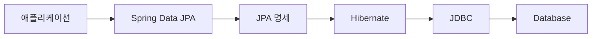
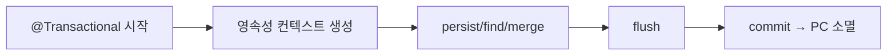
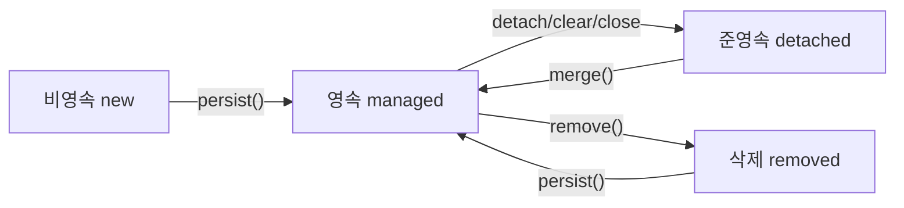
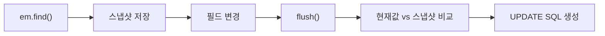
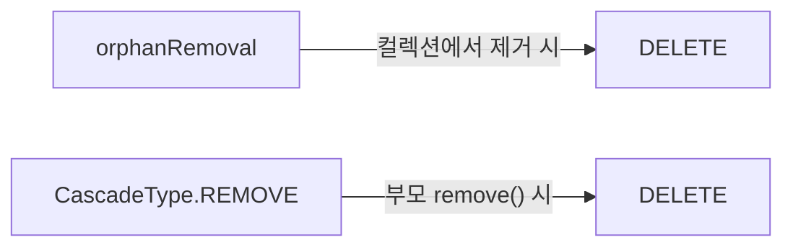
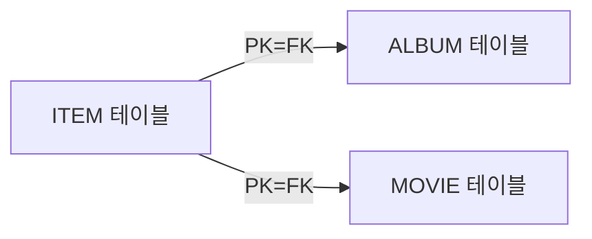
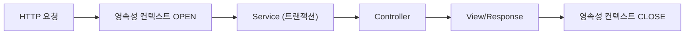

Spring Boot 프로젝트에서 JPA를 쓴다고 해서 JPA를 안다고 할 수 없다. `JpaRepository`를 상속하고 `findById`를 호출하는 것은 시작일 뿐이다. N+1 쿼리가 왜 터지는지, `merge()`가 왜 null 필드를 덮어쓰는지, OSIV가 왜 운영 서버에서 문제가 되는지를 설명할 수 없다면 JPA를 모른다고 봐야 한다.

> **핵심 비유**: JPA는 번역사가 아니라 **외교관**이다. 외교관은 단순히 말을 옮기는 게 아니라 양측(객체 세계와 DB 세계)의 프로토콜 차이를 이해하고, 최적의 시점에 최적의 방식으로 중재한다. 외교관의 판단 기준을 모르면 협상(트랜잭션)이 언제 어떻게 끝나는지 알 수 없다.

이 글은 시니어 면접에서 "왜?"라는 질문에 답할 수 있는 깊이를 목표로 한다.

---

## 1. JPA vs Hibernate vs Spring Data JPA: 추상화 계층의 존재 이유

세 가지를 혼동하는 개발자가 많다. 단순히 "계층이 다르다"가 아니라, 각 계층이 **왜 존재하는지** 이해해야 한다.

### 1-1. 추상화 계층 구조



각 계층이 존재하는 이유가 다르다.

**JPA (Jakarta Persistence API) — 표준 명세가 왜 필요한가?**

2006년 이전 Java EE 진영에는 TopLink, Hibernate, Kodo 등 ORM 구현체가 난립했다. 구현체마다 API가 달랐고, 벤더 종속이 심각했다. JPA는 이 문제를 해결하기 위한 **JSR-220, JSR-317 표준 명세**다. JPA 자체는 인터페이스와 어노테이션만 존재하고, 실제 동작 코드는 없다.

```java
// javax.persistence (또는 jakarta.persistence) 패키지 — 인터페이스만 존재
public interface EntityManager {
    void persist(Object entity);
    <T> T find(Class<T> entityClass, Object primaryKey);
    <T> T merge(T entity);
    void remove(Object entity);
    void flush();
    Query createQuery(String qlString);
}
```

**Hibernate — 구현체가 왜 필요한가?**

JPA 명세는 "무엇을 해야 하는지"만 정의한다. "어떻게 할 것인지"는 구현체의 몫이다. Hibernate는 JPA 명세의 가장 대표적인 구현체로, 실제로 SQL을 생성하고, 1차 캐시를 관리하고, 더티 체킹을 수행한다. Hibernate는 JPA 표준보다 많은 기능을 제공한다 (예: `@BatchSize`, `@Filter`, `@NaturalId`).

```java
// hibernate-core 의존성만 있으면 JPA 없이도 사용 가능 (하지만 권장 안 함)
// SessionFactory (Hibernate 고유) vs EntityManagerFactory (JPA 표준)
SessionFactory sf = new Configuration().buildSessionFactory();
Session session = sf.openSession(); // Hibernate 고유 API

// JPA 표준으로 동일한 동작
EntityManagerFactory emf = Persistence.createEntityManagerFactory("myPU");
EntityManager em = emf.createEntityManager(); // JPA 표준 API
```

**Spring Data JPA — 한 번 더 추상화하는 이유는?**

Hibernate만 써도 JPA는 사용할 수 있다. 그런데 Spring Data JPA가 한 계층 더 존재하는 이유는 **반복 코드 제거**다. 모든 Repository에서 `EntityManager`를 주입받고 `em.find()`, `em.persist()`, 페이징 처리를 직접 구현하는 건 엄청난 보일러플레이트다. Spring Data JPA의 `SimpleJpaRepository`가 이 구현을 기본 제공한다.

```java
// Spring Data JPA 없이 직접 구현 (지루한 반복)
@Repository
public class MemberRepositoryImpl {
    @PersistenceContext
    private EntityManager em;

    public Member findById(Long id) { return em.find(Member.class, id); }
    public void save(Member member) { em.persist(member); }
    public List<Member> findAll() {
        return em.createQuery("select m from Member m", Member.class).getResultList();
    }
    // 페이징, 정렬, 카운트 쿼리... 전부 직접 구현
}

// Spring Data JPA — 인터페이스만 선언하면 SimpleJpaRepository가 구현 제공
public interface MemberRepository extends JpaRepository<Member, Long> {
    // findById, save, delete, findAll, count — 전부 자동 제공
    List<Member> findByUsername(String username); // 쿼리 파생도 자동 생성
}
```

### 1-2. SimpleJpaRepository 내부 동작

`JpaRepository`를 상속한 인터페이스는 런타임에 `SimpleJpaRepository`의 인스턴스가 주입된다. Spring이 JDK Proxy 또는 CGLIB를 통해 동적으로 구현체를 생성한다.

```java
// SimpleJpaRepository의 핵심 코드 (Spring Data JPA 소스)
@Repository
@Transactional(readOnly = true) // 기본이 readOnly — 중요!
public class SimpleJpaRepository<T, ID> implements JpaRepository<T, ID> {

    private final EntityManager em;

    @Override
    @Transactional // 쓰기는 명시적 @Transactional
    public <S extends T> S save(S entity) {
        if (entityInformation.isNew(entity)) {
            em.persist(entity); // 새 엔티티면 persist
            return entity;
        } else {
            return em.merge(entity); // 기존 엔티티면 merge — 함정!
        }
    }

    @Override
    public Optional<T> findById(ID id) {
        return Optional.ofNullable(em.find(domainClass, id));
    }
}
```

**핵심 포인트**: `save()`는 새 엔티티면 `persist()`, 기존 엔티티면 `merge()`를 호출한다. `isNew()` 판단 기준은 `@Id` 필드가 null인지 여부다. `@GeneratedValue`를 쓰지 않고 ID를 직접 할당하면 항상 `merge()`가 호출되어 불필요한 SELECT가 발생한다.

### 1-3. 쿼리 파생 메커니즘

Spring Data JPA가 메서드 이름을 어떻게 쿼리로 변환하는지 이해해야 한다.

```java
public interface MemberRepository extends JpaRepository<Member, Long> {
    // 파생 쿼리 — 메서드 이름을 파싱해 JPQL 생성
    List<Member> findByUsernameAndAgeGreaterThan(String username, int age);
    // → SELECT m FROM Member m WHERE m.username = ?1 AND m.age > ?2

    Optional<Member> findFirstByOrderByCreatedAtDesc();
    // → SELECT m FROM Member m ORDER BY m.createdAt DESC LIMIT 1

    long countByStatus(MemberStatus status);
    // → SELECT COUNT(m) FROM Member m WHERE m.status = ?1

    // @Query — JPQL 직접 작성 (파생 쿼리보다 명확)
    @Query("SELECT m FROM Member m WHERE m.email = :email AND m.status = 'ACTIVE'")
    Optional<Member> findActiveByEmail(@Param("email") String email);

    // Native Query — 실제 SQL (DB 종속, 복잡한 쿼리에 사용)
    @Query(value = "SELECT * FROM member WHERE MATCH(username) AGAINST(:keyword)",
           nativeQuery = true)
    List<Member> searchByFullText(@Param("keyword") String keyword);
}
```

파생 쿼리 파싱은 `PartTreeJpaQuery`가 담당한다. 메서드명을 토큰으로 분해 (`find`, `By`, `Username`, `And`, `Age`, `GreaterThan`)하고 AST를 생성한 뒤 JPQL로 변환한다. 조건이 복잡해지면 파생 쿼리는 가독성이 떨어지므로 4개 이상의 조건이면 `@Query`를 쓰는 것이 좋다.

---

## 2. EntityManager: 영속성 컨텍스트 생명주기

### 2-1. Transaction-Scoped vs Extended 영속성 컨텍스트

영속성 컨텍스트에는 두 가지 범위가 있다. Spring에서는 대부분 Transaction-Scoped를 사용하지만, 차이를 알아야 한다.

**Transaction-Scoped (기본, Spring 표준)**



트랜잭션이 시작될 때 영속성 컨텍스트가 생성되고, 트랜잭션이 종료될 때 함께 소멸한다. Spring의 `@Transactional`이 이 범위를 관리한다. 가장 안전하고 예측 가능한 방식이다.

```java
@Service
public class MemberService {
    @PersistenceContext // Spring이 트랜잭션에 바인딩된 EM을 주입
    private EntityManager em;

    @Transactional
    public void doWork() {
        // 트랜잭션 시작 → 영속성 컨텍스트 생성
        Member m = em.find(Member.class, 1L); // 영속 상태
        m.setUsername("changed");
        // 메서드 종료 → flush → commit → 영속성 컨텍스트 소멸
    }
    // 이 시점에서 m은 준영속 상태
}
```

**Extended (Java EE, Stateful Bean 전용)**

Extended 영속성 컨텍스트는 여러 트랜잭션에 걸쳐 살아있다. Stateful EJB나 Spring의 `@PersistenceContext(type = PersistenceContextType.EXTENDED)`로 사용한다. Spring Boot 환경에서는 거의 사용하지 않는다. 메모리 누수 위험이 있어 주의가 필요하다.

### 2-2. flush != commit: 내부 동작 차이

가장 많이 혼동하는 개념이다. 면접에서 자주 나온다.

| 항목 | flush | commit |
|------|-------|--------|
| 역할 | 영속성 컨텍스트 → DB 동기화 | DB 트랜잭션 최종 확정 |
| 1차 캐시 | **유지됨** | 종료 (트랜잭션 스코프 기준) |
| 롤백 가능 여부 | flush 후에도 롤백 가능 | commit 후 롤백 불가 |
| 다른 트랜잭션에서 가시성 | 기본 격리 수준에 따라 다름 | commit 후 가시 |
| 자동 발생 시점 | ① commit 직전 ② JPQL 실행 전 ③ 직접 호출 | 명시적 호출 또는 @Transactional 종료 시 |

```java
@Transactional
public void flushVsCommit() {
    Member m = new Member("kim");
    em.persist(m); // 쓰기 지연 저장소에 INSERT 등록, DB에는 아직 없음

    em.flush();    // INSERT SQL을 DB로 전송. 그러나 트랜잭션 미커밋
                   // → 격리 수준 READ_COMMITTED 환경에서 다른 트랜잭션은 못봄
                   // → 1차 캐시는 그대로 유지됨 (m은 여전히 영속 상태)
                   // → 이 시점에서 예외 발생 + rollback하면 INSERT 취소됨

    // ... 추가 작업
} // 메서드 종료 → @Transactional이 commit() 호출 → DB 영구 반영
```

**JPQL 실행 전 자동 flush가 필요한 이유**: JPQL은 DB에 직접 쿼리를 날린다. 만약 영속성 컨텍스트에 아직 flush되지 않은 변경사항이 있다면, JPQL 결과와 영속성 컨텍스트의 상태가 불일치하게 된다. Hibernate는 이를 방지하기 위해 JPQL 실행 전 자동으로 flush한다.

```java
@Transactional
public void autoFlushBeforeJpql() {
    Member m = new Member("kim");
    em.persist(m); // DB에 아직 없음

    // JPQL 실행 → 자동 flush 발생 → INSERT 후 SELECT
    List<Member> all = em.createQuery("select m from Member m", Member.class)
                         .getResultList();
    // all에 "kim"이 포함됨 (flush 덕분)
}
```

---

## 3. 엔티티 상태: 4단계 생명주기

### 3-1. 상태 전이 전체 흐름



### 3-2. 비영속 (new / transient)

JPA와 전혀 관계없는 순수 자바 객체 상태다. 변경해도 DB에 아무 영향이 없다.

```java
Member member = new Member(); // 비영속 — 영속성 컨텍스트 모름
member.setId(1L);
member.setUsername("kim");
// 이 시점에서 아무것도 하지 않으면 GC 대상일 뿐
```

### 3-3. 영속 (managed)

영속성 컨텍스트가 관리하는 상태다. 1차 캐시에 등록되며, 더티 체킹, 쓰기 지연의 혜택을 누린다.

```java
// 방법 1: persist()
em.persist(member); // 영속 상태로 전환. 1차 캐시 등록 + 스냅샷 저장

// 방법 2: find()로 조회한 엔티티는 자동으로 영속 상태
Member found = em.find(Member.class, 1L); // 조회 즉시 영속 상태

// 방법 3: JPQL 결과
List<Member> list = em.createQuery("select m from Member m", Member.class)
                      .getResultList(); // 결과 엔티티들 모두 영속 상태
```

### 3-4. 준영속 (detached)과 그 의미

영속성 컨텍스트에서 분리된 상태다. **더티 체킹이 동작하지 않는다.** 이 상태를 이해하는 것이 `LazyInitializationException` 해결의 핵심이다.

```java
em.detach(member); // 특정 엔티티만 분리
em.clear();        // 영속성 컨텍스트 전체 초기화 (모든 엔티티 준영속)
em.close();        // 영속성 컨텍스트 종료
// @Transactional 종료 시에도 영속성 컨텍스트가 닫히며 모든 엔티티가 준영속
```

준영속 상태의 엔티티를 다시 영속 상태로 만들려면 `merge()`를 사용한다.

### 3-5. merge() vs persist() — 결정적 차이

이 둘을 혼동하면 심각한 버그가 발생한다.

```java
// persist() — 비영속 → 영속 (새 엔티티 저장)
Member newMember = new Member(); // @Id 필드가 null 또는 새 ID
em.persist(newMember); // 1차 캐시에 등록, INSERT 예약
// persist()는 영속 상태가 된 엔티티 자체를 반환하지 않음 (void)
// 파라미터로 넘긴 인스턴스 자체가 영속 상태가 됨

// merge() — 준영속/비영속 → 영속 (복사본 반환!)
Member detached = new Member();
detached.setId(1L); // 기존 ID 설정
detached.setUsername("updated");

Member managed = em.merge(detached);
// merge() 내부 동작:
// 1. 1차 캐시에서 id=1인 엔티티 탐색
// 2. 없으면 DB에서 SELECT id=1
// 3. 조회한 영속 엔티티에 detached의 모든 필드를 복사
// 4. 영속 상태의 복사본(managed)을 반환
// 핵심: detached는 여전히 준영속! managed만 영속 상태!

detached.setUsername("will-not-update"); // 준영속 — DB 반영 안 됨
managed.setUsername("will-update");     // 영속 — DB에 반영됨
```

**merge()의 함정**: 준영속 엔티티의 필드 중 null인 필드도 그대로 복사된다. DB에 값이 있어도 null로 덮어쓸 수 있다.

```java
// 위험한 merge() 사용
Member detached = new Member();
detached.setId(1L);
detached.setUsername("new-name");
// email 필드는 null — DB에는 "kim@example.com"이 있음

Member merged = em.merge(detached);
// email = null로 UPDATE됨! 기존 값 유실!

// 안전한 대안: find() + 필드 변경
@Transactional
public void update(Long id, String username) {
    Member member = em.find(Member.class, id); // 영속 상태
    member.setUsername(username); // 더티 체킹으로 업데이트
    // 변경한 필드만 UPDATE됨 (다른 필드 유실 없음)
}
```

### 3-6. 삭제 (removed)

`remove()`를 호출하면 삭제 예약 상태가 되고, flush 시 DELETE SQL이 전송된다.

```java
Member member = em.find(Member.class, 1L); // 영속 상태
em.remove(member); // 삭제 예약 (removed 상태)
// 여기서 em.persist(member)를 다시 호출하면 영속 상태로 복귀
tx.commit(); // DELETE FROM member WHERE id=1 실행
```

---

## 4. 더티 체킹: 스냅샷 비교의 내부 메커니즘

### 4-1. 스냅샷 비교 방식

Hibernate의 기본 더티 체킹은 **스냅샷 비교** 방식이다. 엔티티가 영속 상태가 될 때 (persist, find, merge) 필드 값의 복사본(스냅샷)을 1차 캐시에 함께 저장한다. flush 시점에 현재 필드 값과 스냅샷을 비교해 변경된 엔티티만 UPDATE SQL을 생성한다.



```java
@Transactional
public void dirtyCheckingDemo() {
    Member m = em.find(Member.class, 1L);
    // 내부적으로: snapshot["username"] = "kim", snapshot["age"] = 25 저장

    m.setUsername("lee"); // 현재값: username="lee"
    // flush 시: "lee" != "kim" → 변경 감지

    // Hibernate 기본: 변경 여부와 관계없이 모든 필드 UPDATE
    // UPDATE member SET username=?, age=?, email=?, ... WHERE id=?
    // → age, email 등 변경 안 해도 모든 컬럼이 SET에 포함됨
}
```

**왜 모든 필드를 UPDATE하는가?** Hibernate가 모든 필드를 UPDATE하는 이유는 **SQL 재사용성**이다. 컬럼 조합이 달라지면 매번 다른 PreparedStatement가 생성된다. 항상 동일한 UPDATE SQL을 사용하면 DB의 PreparedStatement 캐시를 효율적으로 활용할 수 있다.

### 4-2. @DynamicUpdate — 변경 필드만 UPDATE

컬럼이 많은 엔티티에서 일부 필드만 변경할 때, 모든 필드를 UPDATE하면 불필요한 네트워크 트래픽과 DB 부하가 발생한다.

```java
@Entity
@DynamicUpdate // 변경된 필드만 UPDATE SQL에 포함
public class LargeEntity {
    @Id @GeneratedValue
    private Long id;

    private String field1;
    private String field2;
    // ... 50개 컬럼 ...
    private String field50;
}

// @DynamicUpdate 없을 때: UPDATE large_entity SET field1=?, field2=?, ..., field50=? WHERE id=?
// @DynamicUpdate 있을 때 field1만 변경: UPDATE large_entity SET field1=? WHERE id=?
```

**단점**: 매 flush마다 변경 필드를 파악하고 동적으로 SQL을 생성해야 하므로 SQL 캐시 히트율이 낮아진다. 컬럼이 적거나 대부분의 컬럼이 함께 변경되는 경우에는 사용하지 않는 것이 좋다.

### 4-3. 바이트코드 향상 (Bytecode Enhancement) — 대안적 더티 체킹

Hibernate는 스냅샷 비교 외에 **바이트코드 향상** 방식도 지원한다. 빌드 시점에 엔티티 클래스의 setter에 변경 추적 코드를 삽입한다. 스냅샷 비교가 필요 없으므로 메모리 사용이 줄고 flush 성능이 향상된다.

```xml
<!-- Maven 플러그인으로 빌드 시 바이트코드 삽입 -->
<plugin>
    <groupId>org.hibernate.orm.tooling</groupId>
    <artifactId>hibernate-enhance-maven-plugin</artifactId>
    <configuration>
        <enableDirtyTracking>true</enableDirtyTracking>
    </configuration>
</plugin>
```

실무에서는 바이트코드 향상이 디버깅을 어렵게 만들고 빌드 파이프라인을 복잡하게 만들기 때문에, 대부분 기본 스냅샷 비교 방식을 사용한다.

---

## 5. Cascade 타입: 각각의 의미와 위험 시나리오

### 5-1. Cascade 타입 전체 정리

Cascade는 부모 엔티티의 상태 변화를 자식 엔티티에 전파하는 옵션이다. 각 타입이 어떤 상황에서 전파되는지 정확히 알아야 한다.

| CascadeType | 전파 시점 | 의미 |
|-------------|-----------|------|
| PERSIST | em.persist() | 부모 persist 시 자식도 persist |
| MERGE | em.merge() | 부모 merge 시 자식도 merge |
| REMOVE | em.remove() | 부모 remove 시 자식도 remove |
| REFRESH | em.refresh() | 부모 refresh 시 자식도 DB에서 재로딩 |
| DETACH | em.detach() | 부모 detach 시 자식도 준영속 |
| ALL | 모든 경우 | 위 5가지 모두 |

```java
@Entity
public class Order {
    @Id @GeneratedValue
    private Long id;

    @OneToMany(mappedBy = "order", cascade = CascadeType.ALL)
    private List<OrderItem> items = new ArrayList<>();
}

@Transactional
public void createOrder() {
    Order order = new Order();
    OrderItem item1 = new OrderItem("상품A", 10000);
    OrderItem item2 = new OrderItem("상품B", 20000);
    order.getItems().add(item1);
    order.getItems().add(item2);

    em.persist(order);
    // CascadeType.PERSIST 때문에 item1, item2도 자동으로 persist됨
    // em.persist(item1), em.persist(item2) 불필요
}
```

### 5-2. CascadeType.PERSIST vs REMOVE — 위험 시나리오

**PERSIST 위험 시나리오**: 의도하지 않은 엔티티가 저장된다.

```java
@Entity
public class Team {
    @OneToMany(cascade = CascadeType.PERSIST)
    private List<Member> members;
}

// 문제 상황
Member existingMember = em.find(Member.class, 1L); // 이미 DB에 있는 영속 엔티티
Team newTeam = new Team();
newTeam.getMembers().add(existingMember); // 이미 있는 멤버를 팀에 추가

em.persist(newTeam); // PERSIST 전파 → existingMember에도 persist 호출
// 이미 영속 상태인 엔티티에 persist 호출 → 문제없음 (Hibernate가 무시)
// 하지만 준영속 상태의 existingMember라면 예외 발생 가능
```

**REMOVE 위험 시나리오**: 예상치 못한 연쇄 삭제.

```java
@Entity
public class Category {
    @OneToMany(cascade = CascadeType.REMOVE)
    private List<Product> products;
}

// 카테고리 삭제 시 모든 상품도 삭제됨!
em.remove(category); // DELETE category → DELETE product WHERE category_id=?
// 만약 상품이 다른 테이블(주문 항목)에서 참조되고 있다면 FK 제약 위반!
```

**CascadeType.ALL의 위험**: ALL을 무분별하게 사용하면 예상치 못한 연쇄 변경이 발생한다. 부모-자식 관계가 명확하고, 자식이 반드시 부모와 함께 생성/삭제되는 경우에만 사용해야 한다.

### 5-3. orphanRemoval vs CascadeType.REMOVE — 미묘한 차이

이 둘은 비슷해 보이지만 결정적 차이가 있다.



```java
@Entity
public class Order {
    @OneToMany(mappedBy = "order",
               cascade = CascadeType.ALL,
               orphanRemoval = true) // 핵심 옵션
    private List<OrderItem> items = new ArrayList<>();
}

@Transactional
public void removeItemTest() {
    Order order = em.find(Order.class, 1L);

    // CascadeType.REMOVE만 있을 때:
    // order.getItems().remove(item); → 컬렉션에서만 제거, DB 삭제 안됨
    // em.remove(order); 해야만 item도 삭제

    // orphanRemoval = true일 때:
    order.getItems().remove(item); // 컬렉션에서 제거 → 자동으로 DELETE 실행
    // 부모(Order)와의 관계가 끊어진 고아(orphan) 자식을 자동 삭제
}
```

**orphanRemoval이 예상치 못한 삭제를 유발하는 시나리오**:

```java
@Entity
public class Post {
    @OneToMany(cascade = CascadeType.ALL, orphanRemoval = true)
    private List<Comment> comments;
}

// 위험: 리스트를 새 리스트로 교체
post.setComments(new ArrayList<>()); // 모든 기존 comment가 orphan → 전부 DELETE!

// 안전: 개별 제거
post.getComments().remove(comment); // 특정 comment만 삭제
post.getComments().clear();         // 모든 comment 삭제 (의도적이라면 OK)
```

`orphanRemoval`은 자식이 반드시 한 부모에만 속하고, 부모 없이는 존재할 수 없는 경우에만 사용해야 한다. `OrderItem`(주문 항목)은 `Order`(주문) 없이 존재할 수 없으므로 적합하다. `Member`처럼 여러 곳에서 참조될 수 있는 엔티티에는 사용하면 안 된다.

---

## 6. @GeneratedValue 전략: 내부 메커니즘과 성능 트레이드오프

### 6-1. IDENTITY 전략 — 배치 INSERT가 불가능한 이유

```java
@Entity
public class Member {
    @Id
    @GeneratedValue(strategy = GenerationType.IDENTITY)
    private Long id; // AUTO_INCREMENT (MySQL, MariaDB, PostgreSQL SERIAL)
}
```

IDENTITY 전략은 DB의 AUTO_INCREMENT에 위임한다. 문제는 **INSERT를 실행해야만 ID를 알 수 있다는 점**이다. JPA의 1차 캐시는 ID를 키로 사용하므로, ID를 알아야 1차 캐시에 등록할 수 있다. 따라서 `persist()` 호출 즉시 INSERT SQL이 실행된다 — 쓰기 지연이 동작하지 않는다.

```java
// IDENTITY 전략
em.persist(memberA); // 즉시 INSERT 실행 → DB가 ID 생성 → 1차 캐시 등록
em.persist(memberB); // 즉시 INSERT 실행
// 쓰기 지연 불가 → 배치 INSERT 불가
```

**배치 INSERT가 불가능한 이유**: Hibernate JDBC 배치는 여러 INSERT를 한 번에 전송한다. 그러나 IDENTITY 전략은 각 INSERT 후 생성된 ID를 즉시 받아와야 하므로, 배치로 묶어 전송할 수 없다.

### 6-2. SEQUENCE 전략 — allocationSize와 hi/lo 알고리즘

```java
@Entity
@SequenceGenerator(
    name = "member_seq_generator",
    sequenceName = "member_seq",    // DB 시퀀스 이름
    initialValue = 1,
    allocationSize = 50             // 핵심: 한 번에 50개 예약
)
public class Member {
    @Id
    @GeneratedValue(strategy = GenerationType.SEQUENCE,
                    generator = "member_seq_generator")
    private Long id;
}
```

SEQUENCE 전략은 INSERT 전에 시퀀스에서 ID를 먼저 받아올 수 있다. 쓰기 지연과 배치 INSERT가 가능하다.

**allocationSize와 hi/lo 알고리즘의 동작**:

```
allocationSize = 50일 때:
1. DB 시퀀스 호출: CALL NEXT VALUE FOR member_seq → 1 반환
2. Hibernate 메모리에서 1~50 예약 (DB 시퀀스는 다음에 51 반환)
3. 1, 2, 3, ... 50까지 INSERT할 때 DB 시퀀스 호출 없음
4. 51번째 INSERT 시 CALL NEXT VALUE FOR member_seq → 51 반환
5. 51~100 예약
```

50개 INSERT 시 DB 시퀀스 호출 횟수: 1회 (allocationSize 없으면 50회). 네트워크 왕복을 대폭 줄인다.

```java
// allocationSize 설정 효과 (50개 persist 시)
em.persist(m1); // 시퀀스 호출 → 1~50 예약, id=1
em.persist(m2); // 메모리에서 id=2 (DB 호출 없음)
em.persist(m3); // 메모리에서 id=3
// ... 50번째까지 DB 시퀀스 호출 없음
em.persist(m51); // 다시 시퀀스 호출 → 51~100 예약
```

**주의**: 서버를 재시작하면 예약했던 번호가 사라진다. `allocationSize=50`이고 id=25까지 사용 후 재시작하면, 다음 시작은 51부터다. 26~50은 사용되지 않는 gap이 생긴다. PK에 gap이 있어도 문제없지만, 연속된 ID를 기대하는 로직이 있다면 주의해야 한다.

### 6-3. TABLE 전략 — 비관적 잠금 오버헤드

```java
@Entity
@TableGenerator(
    name = "member_table_generator",
    table = "id_generator",
    pkColumnName = "gen_name",
    valueColumnName = "gen_value",
    pkColumnValue = "member_id",
    allocationSize = 1
)
public class Member {
    @Id
    @GeneratedValue(strategy = GenerationType.TABLE,
                    generator = "member_table_generator")
    private Long id;
}
```

TABLE 전략은 키 생성 전용 테이블을 사용한다. DB에 독립적이라 어떤 DB에서도 동작하지만, **성능이 가장 나쁘다**.

**오버헤드 이유**: ID를 얻을 때마다 `id_generator` 테이블에서 SELECT → UPDATE가 필요하다. 동시성 문제를 방지하기 위해 비관적 잠금(SELECT FOR UPDATE)을 사용한다. 이는 락 경합을 일으켜 고트래픽 환경에서 병목이 된다. 실무에서는 거의 사용하지 않는다.

### 6-4. UUID 전략 — 분산 환경에서의 선택

```java
@Entity
public class Event {
    @Id
    @GeneratedValue(strategy = GenerationType.UUID) // Hibernate 6.x+
    private UUID id;

    // 또는 직접 생성
    @Id
    private String id = UUID.randomUUID().toString();
}
```

UUID는 분산 환경에서 DB 없이 ID를 생성할 수 있어, 마이크로서비스 아키텍처에서 유용하다. 단, 128비트 크기로 인덱스 효율이 낮고, 정렬 불가 UUID(v4)는 B-Tree 인덱스 성능이 떨어진다. MySQL에서는 BINARY(16) 또는 UUID_TO_BIN()으로 저장하거나, 시간 순서가 있는 UUID v7을 사용하는 것이 좋다.

---

## 7. 상속 매핑 전략: 내부 동작과 성능 트레이드오프

### 7-1. SINGLE_TABLE — 왜 성능이 가장 좋은가

```java
@Entity
@Inheritance(strategy = InheritanceType.SINGLE_TABLE) // 기본값
@DiscriminatorColumn(name = "dtype") // 타입 구분 컬럼
public abstract class Item {
    @Id @GeneratedValue
    private Long id;
    private String name;
    private int price;
}

@Entity
@DiscriminatorValue("ALBUM")
public class Album extends Item {
    private String artist;
}

@Entity
@DiscriminatorValue("MOVIE")
public class Movie extends Item {
    private String director;
    @Column(nullable = true) // 다른 타입은 null → 단점
    private String actor;
}
```

DB 테이블은 하나(`ITEM`)이고, `dtype` 컬럼으로 타입을 구분한다. 조회 시 JOIN이 전혀 없어 성능이 가장 빠르다.

```sql
-- SINGLE_TABLE 조회 — 단일 테이블, 단순 WHERE
SELECT id, name, price, dtype, artist, director, actor
FROM item
WHERE dtype = 'ALBUM';

-- 부모 타입으로 전체 조회도 JOIN 없음
SELECT id, name, price, dtype, artist, director, actor
FROM item;
```

**단점**: 자식 타입 고유 컬럼은 다른 타입에서 null이어야 한다. DB 수준의 NOT NULL 제약을 걸 수 없다. 컬럼이 많아져 테이블이 비대해질 수 있다.

### 7-2. JOINED — 정규화되지만 N+1 문제



```java
@Entity
@Inheritance(strategy = InheritanceType.JOINED)
@DiscriminatorColumn(name = "dtype")
public abstract class Item { ... }
```

```sql
-- JOINED 단건 조회 — JOIN 발생
SELECT i.id, i.name, i.price, a.artist
FROM item i
INNER JOIN album a ON i.id = a.id
WHERE i.id = 1 AND i.dtype = 'ALBUM';

-- 부모 타입으로 전체 조회 — OUTER JOIN 발생 (모든 자식 테이블과)
SELECT i.id, i.name, i.price, i.dtype,
       a.artist, m.director, m.actor
FROM item i
LEFT OUTER JOIN album a ON i.id = a.id
LEFT OUTER JOIN movie m ON i.id = m.id;
```

정규화되어 있고 FK 무결성을 유지할 수 있지만, 모든 조회에 JOIN이 필요하다. 자식 타입이 많고 부모 타입으로 다형적 쿼리가 많은 경우 성능 이슈가 발생한다.

### 7-3. TABLE_PER_CLASS — 다형성 쿼리의 UNION 문제

```java
@Entity
@Inheritance(strategy = InheritanceType.TABLE_PER_CLASS)
public abstract class Item { ... }
// Album 테이블: id, name, price, artist
// Movie 테이블: id, name, price, director, actor
// 공통 컬럼이 각 테이블에 중복 저장
```

```sql
-- 부모 타입(Item)으로 전체 조회 — UNION ALL 발생
SELECT id, name, price, 'ALBUM' as dtype, artist, null as director, null as actor
FROM album
UNION ALL
SELECT id, name, price, 'MOVIE' as dtype, null as artist, director, actor
FROM movie;
```

다형적 쿼리(`SELECT i FROM Item i`)를 실행하면 모든 자식 테이블을 UNION ALL로 합쳐야 한다. 자식이 많을수록 성능이 급격히 저하된다. JPA 명세에서도 이 전략은 권장하지 않는다.

### 7-4. 전략 선택 기준

| 상황 | 추천 전략 |
|------|-----------|
| 자식 타입이 적고 단순 | SINGLE_TABLE |
| 데이터 정규화가 중요, 자식 타입별 조회 위주 | JOINED |
| 자식 타입 독립적으로 사용, 다형성 쿼리 없음 | TABLE_PER_CLASS (비추천) |
| 부모 타입으로 다형 쿼리 많음 | SINGLE_TABLE |

---

## 8. @Embeddable / @Embedded: 값 타입과 도메인 모델링

### 8-1. 값 타입(Value Object) 패턴

`@Embeddable`은 별도 테이블 없이 소유 엔티티의 테이블에 컬럼을 추가하는 방식이다. 도메인 모델에서 값 타입(Value Object)을 표현할 때 사용한다.

```java
// 값 타입 — 독립적 생명주기 없음, 식별자 없음
@Embeddable
public class Address {
    @Column(name = "city")
    private String city;

    @Column(name = "street")
    private String street;

    @Column(name = "zipcode")
    private String zipcode;

    // 값 타입은 불변(immutable)으로 만드는 것이 안전
    protected Address() {} // JPA 기본 생성자
    public Address(String city, String street, String zipcode) {
        this.city = city;
        this.street = street;
        this.zipcode = zipcode;
    }
    // getter만 제공, setter 없음
}

@Entity
public class Member {
    @Id @GeneratedValue
    private Long id;

    @Embedded // Address의 city, street, zipcode 컬럼이 member 테이블에 추가됨
    private Address homeAddress;

    @Embedded
    @AttributeOverrides({ // 컬럼명 충돌 해결
        @AttributeOverride(name = "city",    column = @Column(name = "work_city")),
        @AttributeOverride(name = "street",  column = @Column(name = "work_street")),
        @AttributeOverride(name = "zipcode", column = @Column(name = "work_zipcode"))
    })
    private Address workAddress; // 같은 타입을 두 번 임베드
}
```

```sql
-- Member 테이블 DDL (별도 테이블 없음)
CREATE TABLE member (
    id          BIGINT PRIMARY KEY,
    -- homeAddress
    city        VARCHAR(100),
    street      VARCHAR(100),
    zipcode     VARCHAR(10),
    -- workAddress
    work_city   VARCHAR(100),
    work_street VARCHAR(100),
    work_zipcode VARCHAR(10)
);
```

### 8-2. @Embeddable vs 별도 엔티티 선택 기준

```
@Embeddable을 사용해야 할 때:
- 독립적 생명주기가 없을 때 (주소는 멤버 없이 존재하지 않음)
- 식별자(ID)가 필요 없을 때
- 여러 엔티티에서 재사용되는 개념 (Address, Money, Period)
- DB에서 별도 테이블로 분리할 필요가 없을 때

별도 엔티티를 사용해야 할 때:
- 독립적 생명주기가 있을 때 (상품 카테고리는 상품 없이도 존재)
- 고유 식별자가 필요할 때
- 다른 엔티티에서 FK로 참조될 때
- 개별 조회/수정이 필요할 때
```

**값 타입 공유 참조 문제**:

```java
// 위험: 값 타입 공유
Address address = new Address("서울", "강남대로", "12345");
memberA.setHomeAddress(address);
memberB.setHomeAddress(address); // 같은 인스턴스 공유!

// memberA의 주소를 변경하면 memberB도 변경됨 (사이드 이펙트!)
address.setCity("부산"); // memberA, memberB 모두 "부산"이 됨

// 안전: 값 타입은 불변으로 설계 (setter 없음)
// 새 값이 필요하면 새 인스턴스 생성
memberA.setHomeAddress(new Address("부산", "해운대로", "48000"));
```

---

## 9. OSIV (Open Session In View): 논란의 이유

### 9-1. OSIV가 왜 존재하는가

OSIV는 HTTP 요청 시작 시 영속성 컨텍스트를 열고, HTTP 응답이 완료될 때까지 유지하는 패턴이다. Spring Boot는 기본으로 OSIV를 활성화한다 (`spring.jpa.open-in-view=true`).



**OSIV 없이 지연 로딩을 쓰면 발생하는 문제**:

```java
// OSIV 비활성화 상태
@Service
@Transactional(readOnly = true)
public class MemberService {
    public Member getMember(Long id) {
        return memberRepository.findById(id).orElseThrow();
        // 트랜잭션(+영속성 컨텍스트) 종료
    }
}

@RestController
public class MemberController {
    @GetMapping("/members/{id}")
    public MemberResponse getMember(@PathVariable Long id) {
        Member member = memberService.getMember(id); // 준영속 상태
        // 여기서 team은 지연 로딩 프록시
        String teamName = member.getTeam().getName(); // LazyInitializationException!
        return new MemberResponse(member.getUsername(), teamName);
    }
}
```

OSIV를 활성화하면 Controller에서도 영속성 컨텍스트가 살아있으므로 지연 로딩이 가능하다.

### 9-2. OSIV가 왜 논란인가

OSIV의 장점은 편의성이지만, 실무에서는 심각한 문제를 야기한다.

**문제 1: DB 커넥션을 오래 점유**

```
OSIV 활성화 시 커넥션 점유 범위:
HTTP 요청 시작 → [DB 커넥션 획득] → Service → Controller → View 렌더링 → [DB 커넥션 반환] → HTTP 응답

뷰 렌더링이 느리거나 Controller에서 외부 API 호출이 있으면,
그 시간 동안 DB 커넥션이 낭비된다.

고트래픽 서버에서 커넥션 풀(기본 10개)이 고갈될 수 있다.
```

**문제 2: 영속성 컨텍스트 활성화 상태에서 지연 로딩 발동**

```java
// OSIV 활성화 상태
@RestController
public class OrderController {
    @GetMapping("/orders")
    public List<OrderResponse> getOrders() {
        List<Order> orders = orderService.getOrders(); // 트랜잭션 종료
        // 영속성 컨텍스트는 아직 살아있음 (OSIV)

        return orders.stream()
                .map(o -> new OrderResponse(
                        o.getId(),
                        o.getCustomer().getName(), // 지연 로딩 — 쿼리 발생!
                        o.getItems().size()        // 지연 로딩 — 쿼리 발생!
                ))
                .collect(Collectors.toList());
        // 주문 100개 → Customer 100번 + Items 100번 쿼리 = N+1!
        // Service에 @Transactional이 있어도 Controller에서 발동
    }
}
```

OSIV가 없다면 Controller에서 지연 로딩을 시도하면 예외가 발생해 N+1을 바로 발견할 수 있다. OSIV가 있으면 예외 없이 쿼리가 추가 발생하므로, N+1이 숨어있어 발견이 늦어진다.

### 9-3. OSIV 비활성화 권장 + 대안

```yaml
# application.yml
spring:
  jpa:
    open-in-view: false # OSIV 비활성화 권장
```

OSIV를 비활성화하면 Controller에서 지연 로딩이 불가능하다. 대신 다음 패턴으로 대응해야 한다.

```java
// 대안 1: Service에서 DTO로 변환 (가장 권장)
@Service
@Transactional(readOnly = true)
public class OrderService {
    public List<OrderDto> getOrders() {
        List<Order> orders = orderRepository.findAll();
        // 트랜잭션 안에서 지연 로딩 + DTO 변환 완료
        return orders.stream()
                .map(o -> new OrderDto(
                        o.getId(),
                        o.getCustomer().getName(), // 트랜잭션 안 — 가능
                        o.getItems().size()
                ))
                .collect(Collectors.toList());
    }
}

// 대안 2: Fetch Join으로 필요한 연관관계 미리 로딩
@Query("SELECT DISTINCT o FROM Order o " +
       "JOIN FETCH o.customer " +
       "JOIN FETCH o.items")
List<Order> findAllWithDetails();

// 대안 3: @EntityGraph 사용
@EntityGraph(attributePaths = {"customer", "items"})
List<Order> findAll();
```

---

## 10. Spring Data JPA Repository 심화

### 10-1. @Query JPQL vs Native Query

```java
public interface OrderRepository extends JpaRepository<Order, Long> {

    // JPQL — 엔티티와 필드 기준, DB 독립적
    @Query("SELECT o FROM Order o " +
           "JOIN FETCH o.customer c " +
           "WHERE c.grade = :grade " +
           "AND o.createdAt >= :since")
    List<Order> findByCustomerGradeAndCreatedAfter(
            @Param("grade") CustomerGrade grade,
            @Param("since") LocalDateTime since);

    // Native Query — 실제 SQL, 복잡한 쿼리나 DB 특화 함수 필요 시
    @Query(value = """
            SELECT o.*, c.name AS customer_name
            FROM orders o
            JOIN customer c ON o.customer_id = c.id
            WHERE o.total_amount >= :minAmount
            AND YEAR(o.created_at) = YEAR(CURDATE())
            ORDER BY o.total_amount DESC
            LIMIT :limit
            """,
           nativeQuery = true)
    List<Map<String, Object>> findTopOrdersThisYear(
            @Param("minAmount") BigDecimal minAmount,
            @Param("limit") int limit);

    // Projection — 엔티티 일부 필드만 조회 (성능 최적화)
    @Query("SELECT o.id AS id, o.status AS status, c.name AS customerName " +
           "FROM Order o JOIN o.customer c WHERE o.status = :status")
    List<OrderSummary> findOrderSummaryByStatus(@Param("status") OrderStatus status);
}

// Projection 인터페이스
public interface OrderSummary {
    Long getId();
    OrderStatus getStatus();
    String getCustomerName(); // JOIN한 customer.name 매핑
}
```

### 10-2. @Modifying — 벌크 연산의 필수 설정

```java
public interface MemberRepository extends JpaRepository<Member, Long> {

    // clearAutomatically = true: 실행 후 영속성 컨텍스트 자동 clear
    // flushAutomatically = true: 실행 전 자동 flush (기본 false, FlushMode 따름)
    @Modifying(clearAutomatically = true, flushAutomatically = true)
    @Query("UPDATE Member m SET m.status = :status WHERE m.grade = :grade")
    int bulkUpdateStatusByGrade(
            @Param("status") MemberStatus status,
            @Param("grade") MemberGrade grade);

    @Modifying(clearAutomatically = true)
    @Query("DELETE FROM Member m WHERE m.createdAt < :cutoff AND m.status = 'INACTIVE'")
    int bulkDeleteInactiveMembers(@Param("cutoff") LocalDateTime cutoff);
}
```

**왜 `clearAutomatically = true`가 필요한가?** 벌크 연산은 영속성 컨텍스트를 우회해 DB에 직접 SQL을 실행한다. 이후 영속성 컨텍스트에 캐시된 엔티티의 상태가 DB와 불일치하게 된다. `clearAutomatically`가 이를 자동으로 초기화한다.

```java
@Service
@Transactional
public class MemberService {
    public void updateAllActiveMembers() {
        Member m = memberRepository.findById(1L).get(); // 영속 상태, status=ACTIVE
        memberRepository.bulkUpdateStatusByGrade(MemberStatus.PREMIUM, MemberGrade.VIP);
        // clearAutomatically = true → 영속성 컨텍스트 초기화

        Member reloaded = memberRepository.findById(1L).get(); // DB에서 새로 조회
        // reloaded.getStatus() = PREMIUM (올바른 값)
    }
}
```

### 10-3. Slice vs Page — 페이징의 차이

```java
public interface OrderRepository extends JpaRepository<Order, Long> {
    // Page: COUNT 쿼리 추가 실행 (전체 개수 파악)
    Page<Order> findByStatus(OrderStatus status, Pageable pageable);
    // → SELECT o FROM Order o WHERE o.status = ? (데이터 쿼리)
    // → SELECT COUNT(o) FROM Order o WHERE o.status = ? (카운트 쿼리)

    // Slice: COUNT 쿼리 없음 (다음 페이지 존재 여부만 확인)
    Slice<Order> findByCustomerId(Long customerId, Pageable pageable);
    // → SELECT o FROM Order o WHERE o.customer_id = ? LIMIT 11 (limit+1 요청)
    // 11개가 오면 다음 페이지 있음, 10개 이하면 마지막 페이지
}

@Service
public class OrderService {
    public PagedResponse<OrderDto> getOrdersByStatus(OrderStatus status, int page, int size) {
        Pageable pageable = PageRequest.of(page, size, Sort.by("createdAt").descending());
        Page<Order> orderPage = orderRepository.findByStatus(status, pageable);

        return new PagedResponse<>(
                orderPage.getContent().stream().map(OrderDto::from).toList(),
                orderPage.getTotalElements(), // COUNT 쿼리 결과
                orderPage.getTotalPages(),
                orderPage.isLast()
        );
    }

    // 무한 스크롤: Slice 사용 (COUNT 쿼리 불필요)
    public SliceResponse<OrderDto> getOrdersByCustomer(Long customerId, int page, int size) {
        Pageable pageable = PageRequest.of(page, size);
        Slice<Order> slice = orderRepository.findByCustomerId(customerId, pageable);

        return new SliceResponse<>(
                slice.getContent().stream().map(OrderDto::from).toList(),
                slice.hasNext()
        );
    }
}
```

---

## 11. N+1 문제: 원인과 완벽한 해결책

### 11-1. N+1이 발생하는 근본 이유

```java
@Entity
public class Order {
    @OneToMany(mappedBy = "order", fetch = FetchType.LAZY)
    private List<OrderItem> items;
}

// N+1 발생
@Transactional(readOnly = true)
public List<OrderDto> getAllOrders() {
    List<Order> orders = orderRepository.findAll(); // 1번 쿼리: SELECT * FROM orders

    return orders.stream().map(o -> {
        // o.getItems() 접근 시 각 Order마다 SELECT 실행
        int total = o.getItems().stream() // N번 쿼리: SELECT * FROM order_item WHERE order_id=?
                     .mapToInt(OrderItem::getPrice).sum();
        return new OrderDto(o.getId(), total);
    }).toList(); // 주문 100개 → 1 + 100 = 101번 쿼리
}
```

N+1은 지연 로딩(LAZY) 때문이 아니다. **즉시 로딩(EAGER)에서도 발생한다.** JPQL은 작성한 쿼리 그대로 실행하고, 연관관계 로딩은 별도로 처리하기 때문이다.

```java
// EAGER로 바꿔도 N+1 발생!
@OneToMany(mappedBy = "order", fetch = FetchType.EAGER) // EAGER로 변경
// findAll() → SELECT orders → 각 order마다 SELECT order_items 실행 (N+1 동일)
```

### 11-2. 해결책 1: Fetch Join

```java
// JPQL Fetch Join
@Query("SELECT DISTINCT o FROM Order o JOIN FETCH o.items WHERE o.status = :status")
List<Order> findByStatusWithItems(@Param("status") OrderStatus status);
// → SELECT DISTINCT o.*, oi.* FROM orders o INNER JOIN order_item oi ON oi.order_id = o.id

// 주의: 컬렉션 Fetch Join + 페이징은 경고 발생
// Hibernate가 전체 데이터를 메모리에 로드 후 페이징 (OOM 위험)
@Query("SELECT o FROM Order o JOIN FETCH o.items") // 페이징 불가!
Page<Order> findAllWithItems(Pageable pageable); // WARNING: HHH90003004
```

### 11-3. 해결책 2: @EntityGraph

```java
@EntityGraph(attributePaths = {"items", "customer"}) // 명시적 Eager 로딩
List<Order> findByStatus(OrderStatus status);
// → LEFT OUTER JOIN으로 items, customer를 함께 조회
```

### 11-4. 해결책 3: @BatchSize

```java
@Entity
public class Order {
    @BatchSize(size = 100) // IN 쿼리로 배치 로딩
    @OneToMany(mappedBy = "order")
    private List<OrderItem> items;
}
// 주문 100개 조회 시:
// SELECT * FROM orders (1번)
// SELECT * FROM order_item WHERE order_id IN (1,2,...,100) (1번)
// 총 2번 쿼리 — N+1 해결!
```

### 11-5. 해결책 4: DTO 직접 조회

```java
@Query("SELECT new com.example.dto.OrderSummaryDto(o.id, o.status, SUM(oi.price)) " +
       "FROM Order o JOIN o.items oi GROUP BY o.id, o.status")
List<OrderSummaryDto> findOrderSummaries();
// 엔티티를 거치지 않고 DTO로 직접 조회
// 필요한 데이터만 SELECT → 성능 최적화
```

---

## 12. 극한 시나리오

### 시나리오 1: 분산 트랜잭션에서 merge()가 데이터를 날리는 상황

```java
// API 서버가 외부에서 받은 DTO를 그대로 merge()
@RestController
public class ProductController {
    @PutMapping("/products/{id}")
    @Transactional
    public Product updateProduct(@PathVariable Long id, @RequestBody ProductDto dto) {
        // dto.getStock()이 null이면?
        Product product = new Product();
        product.setId(id);
        product.setName(dto.getName());
        product.setPrice(dto.getPrice());
        // stock 필드 설정 안 함 → null

        return productRepository.save(product); // merge() 호출
        // DB의 stock=1000이 null로 덮어써짐!
    }
}

// 올바른 패턴
@PutMapping("/products/{id}")
@Transactional
public Product updateProduct(@PathVariable Long id, @RequestBody ProductDto dto) {
    Product product = productRepository.findById(id)
                                       .orElseThrow(() -> new EntityNotFoundException());
    // 변경할 필드만 명시적으로 업데이트
    product.updateNameAndPrice(dto.getName(), dto.getPrice());
    // stock은 건드리지 않음 → DB 값 유지
    return product; // dirty checking으로 UPDATE
}
```

### 시나리오 2: allocationSize 설정과 서버 재시작이 만들어내는 ID 충돌

```java
// 잘못된 설정: allocationSize와 DB 시퀀스 increment가 불일치
@SequenceGenerator(
    name = "member_seq",
    sequenceName = "member_seq",
    allocationSize = 50  // JPA는 50개씩 예약
)
// DB: CREATE SEQUENCE member_seq INCREMENT BY 1; ← 1씩 증가!

// 동작:
// JPA: 시퀀스 → 1 반환. 1~50 예약 (50개 INSERT 가능)
// JPA: 시퀀스 → 2 반환. 2~51 예약
// ID 충돌! (1 이미 사용, 2도 이미 사용...)
// → DB 시퀀스의 INCREMENT BY를 allocationSize와 동일하게 설정해야 함
// DB: CREATE SEQUENCE member_seq INCREMENT BY 50;
```

### 시나리오 3: OSIV + 외부 API 호출 = 커넥션 풀 고갈

```java
// OSIV 활성화 상태
@RestController
public class ReportController {
    @GetMapping("/report")
    public ReportDto generateReport() {
        List<Order> orders = orderService.getOrders();
        // 영속성 컨텍스트 열림 + DB 커넥션 점유 중

        // 외부 API 호출 — 3초 소요
        ExternalData data = externalApiClient.fetchData(); // 3초 대기

        // 3초 동안 DB 커넥션 낭비!
        // 동시 요청 10개 → 커넥션 풀 10개 모두 점유
        // 11번째 요청 → 커넥션 풀 고갈 → 타임아웃

        return buildReport(orders, data);
    }
}

// 해결: OSIV 비활성화 + Service에서 데이터 먼저 로딩
@Service
@Transactional(readOnly = true)
public class ReportService {
    public ReportData getReportData() {
        // 트랜잭션 안에서 필요한 데이터 모두 로딩 → DTO 변환
        List<OrderDto> orders = orderRepository.findAllAsDto(); // 트랜잭션 종료
        return new ReportData(orders); // DB 커넥션 반환
        // 이후 외부 API 호출은 커넥션 없이 진행
    }
}
```

### 시나리오 4: 영속성 컨텍스트 무한 성장 — 배치 처리의 함정

```java
// 잘못된 배치 처리
@Transactional
public void processBatch() {
    List<Member> all = memberRepository.findAll(); // 100만 건 → 영속성 컨텍스트에 100만 엔티티
    for (Member m : all) {
        m.processAndUpdate(); // 스냅샷 100만 개 + 엔티티 100만 개 → OOM
    }
}

// 올바른 배치 처리
@Transactional
public void processInChunks() {
    int pageSize = 1000;
    int page = 0;
    Slice<Member> slice;

    do {
        slice = memberRepository.findAll(PageRequest.of(page++, pageSize));
        for (Member m : slice.getContent()) {
            m.processAndUpdate();
        }
        em.flush();  // 변경사항 DB 전송
        em.clear();  // 영속성 컨텍스트 초기화 — 메모리 해제
    } while (slice.hasNext());
}
```

### 시나리오 5: orphanRemoval + 컬렉션 재할당으로 전체 데이터 삭제

```java
@Entity
public class Survey {
    @OneToMany(cascade = CascadeType.ALL, orphanRemoval = true)
    private List<Question> questions = new ArrayList<>();

    // 위험: setter가 공개되어 있음
    public void setQuestions(List<Question> questions) {
        this.questions = questions; // 기존 리스트 버림 → 모든 기존 question이 orphan → DELETE!
    }
}

// 클라이언트 코드
@Transactional
public void replaceQuestions(Long surveyId, List<QuestionDto> dtos) {
    Survey survey = surveyRepository.findById(surveyId).orElseThrow();
    List<Question> newQuestions = dtos.stream().map(Question::from).toList();
    survey.setQuestions(newQuestions); // 기존 10개 질문 전부 삭제됨!
}

// 안전한 패턴
public void setQuestions(List<Question> newQuestions) {
    this.questions.clear(); // 명시적 clear (이미 orphanRemoval로 삭제)
    this.questions.addAll(newQuestions); // 새 항목 추가
}
```

---

## 13. 면접 포인트 5개

<details>
<summary>펼쳐보기</summary>


### Q1. 영속성 컨텍스트에서 flush와 commit의 차이를 설명하고, flush가 자동으로 발생하는 시점 3가지를 말하시오.

```
flush: 영속성 컨텍스트의 변경사항을 DB에 동기화하는 작업.
       SQL이 DB로 전송되지만 트랜잭션은 아직 커밋되지 않음.
       롤백 가능. 1차 캐시 유지.

commit: DB 트랜잭션을 최종 확정. 롤백 불가. 1차 캐시 소멸.
        commit 내부적으로 flush를 먼저 호출한다.

flush 자동 발생 시점:
1. 트랜잭션 커밋 직전 (@Transactional 종료 시)
2. JPQL/Criteria 쿼리 실행 직전
   (이유: 영속성 컨텍스트와 DB 상태를 동기화해야 JPQL 결과가 정확함)
3. em.flush() 직접 호출

핵심: flush는 SQL 전송이고, commit은 DB 확정이다.
flush 후 예외가 발생해 rollback하면 전송된 SQL도 취소된다.
```

### Q2. persist()와 merge()의 차이를 설명하고, save()가 내부에서 어떻게 동작하는지 설명하시오.

```
persist(entity):
- 비영속 → 영속 상태 전환
- 파라미터로 넘긴 인스턴스 자체가 영속 상태가 됨 (반환값 void)
- 이미 영속 상태면 무시, 이미 DB에 있으면 EntityExistsException
- INSERT 예약

merge(entity):
- 준영속/비영속 → 영속 상태의 새 인스턴스 반환
- 내부 동작: 1차캐시 탐색 → DB 탐색 → 영속 엔티티에 파라미터 필드 복사 → 반환
- 파라미터 인스턴스는 여전히 준영속! 반환된 인스턴스가 영속
- null 필드도 그대로 복사 → 기존 데이터 유실 위험

SimpleJpaRepository.save():
- entityInformation.isNew(entity)가 true → persist()
- isNew() 기준: @Id 필드가 null이면 새 엔티티
- @GeneratedValue 없이 ID 직접 할당하면 isNew()=false → merge() 호출
  → 불필요한 SELECT 발생 (DB에서 기존 엔티티 탐색)
- 직접 ID 할당 시 Persistable 인터페이스로 isNew() 로직 커스터마이즈 가능
```

### Q3. OSIV가 무엇이고, Spring Boot에서 기본 활성화되는 이유와 비활성화해야 하는 이유를 설명하시오.

```
OSIV (Open Session In View):
HTTP 요청 시작 시 영속성 컨텍스트를 열고,
HTTP 응답 완료 시까지 유지하는 패턴.
OpenEntityManagerInViewInterceptor가 처리.

Spring Boot 기본 활성화 이유:
개발 편의성 — Controller, View에서도 지연 로딩 사용 가능.
트랜잭션 없는 영역에서도 LazyInitializationException 방지.
초보 개발자가 지연 로딩 문제를 만나지 않도록.

비활성화해야 하는 이유:
1. DB 커넥션 장시간 점유:
   HTTP 응답 완료까지 커넥션을 반환하지 않음.
   뷰 렌더링, 외부 API 호출 시간 동안 낭비.
   고트래픽 서버에서 커넥션 풀 고갈 위험.

2. 지연 로딩이 Service 외부(Controller)에서 발동:
   N+1이 숨어서 발생. 성능 문제 발견이 늦어짐.
   Service 계층에서 데이터 접근을 강제할 수 없음.

권장: spring.jpa.open-in-view=false + Service에서 DTO 변환
```

### Q4. 상속 매핑 3가지 전략의 차이를 설명하고, SINGLE_TABLE이 성능이 좋은 이유와 JOINED의 단점을 말하시오.

```
SINGLE_TABLE:
- 모든 자식 타입을 하나의 테이블에 저장
- 조회 시 JOIN 없음 → 단일 테이블 SELECT → 성능 최고
- 자식 고유 컬럼은 null 허용 → DB 무결성 제약 불가
- 컬럼이 많아져 테이블이 비대해질 수 있음
- 자식 타입이 적고 단순한 경우 최적

JOINED:
- 부모 테이블 + 자식별 테이블로 정규화
- 조회 시 부모+자식 JOIN 필요
- 부모 타입으로 다형 조회 시 모든 자식과 OUTER JOIN
- 정규화, FK 무결성 유지 가능
- 조인 오버헤드: 특히 자식 타입이 많거나 다형 쿼리 빈번 시 성능 이슈

TABLE_PER_CLASS:
- 자식마다 독립 테이블 (공통 컬럼 중복 저장)
- 부모 타입으로 조회 시 UNION ALL → 성능 최악
- JPA 명세에서도 비권장

선택 기준:
- 자식 많고 단순 → SINGLE_TABLE
- 데이터 정규화 필요, 자식별 조회 위주 → JOINED
- 다형성 쿼리가 자주 발생하면 SINGLE_TABLE 우선 검토
```

### Q5. 더티 체킹(Dirty Checking)의 내부 동작을 설명하고, @DynamicUpdate가 필요한 경우와 단점을 말하시오.

```
더티 체킹 내부 동작:
1. 엔티티가 영속 상태가 될 때 (find, persist, merge)
   필드 값의 스냅샷을 1차 캐시에 함께 저장
2. flush() 시점에 현재 필드 값과 스냅샷을 모든 영속 엔티티에 대해 비교
3. 변경된 엔티티에 대해 UPDATE SQL 생성
4. 기본: 변경된 필드 여부와 관계없이 모든 컬럼 UPDATE

모든 컬럼 UPDATE 이유:
PreparedStatement 재사용 (SQL 캐시 히트율 향상).
항상 동일한 UPDATE SQL → DB 파서가 캐시된 실행계획 재사용.

@DynamicUpdate 동작:
flush 시 현재 값과 스냅샷을 비교해 변경된 컬럼만 UPDATE 포함.
→ UPDATE member SET username=? WHERE id=? (price 변경 없으면 제외)

@DynamicUpdate 필요한 경우:
- 컬럼이 매우 많은 테이블 (50개+)에서 일부 컬럼만 자주 변경
- 컬럼 크기가 커서 UPDATE 트래픽이 문제될 때

@DynamicUpdate 단점:
- 매 flush마다 변경 컬럼 파악 후 동적 SQL 생성 → SQL 캐시 히트율 하락
- 실행계획이 달라져 DB 옵티마이저 캐시 효율 감소
- 컬럼이 적거나 대부분 함께 변경되면 오히려 성능 손해
```

---

## 실무 체크리스트

```
영속성 컨텍스트:
□ 모든 연관관계 기본 FetchType.LAZY 설정
□ 쓰기 서비스는 @Transactional, 조회 서비스는 @Transactional(readOnly = true)
□ 벌크 연산 후 @Modifying(clearAutomatically = true) 또는 em.clear()
□ OSIV 비활성화 (spring.jpa.open-in-view=false)
□ Service 레이어에서 DTO 변환 완료 후 반환

엔티티 설계:
□ 값 타입은 @Embeddable + 불변 클래스로 설계
□ 양방향 연관관계에 편의 메서드 작성 (양쪽 동기화)
□ @ManyToMany 대신 중간 엔티티 사용
□ orphanRemoval은 자식이 부모 없이 존재할 수 없을 때만 사용
□ CascadeType.ALL은 단일 소유자 관계에서만 사용

ID 전략:
□ MySQL/MariaDB: IDENTITY (AUTO_INCREMENT)
□ Oracle/PostgreSQL: SEQUENCE + allocationSize 설정
□ DB 시퀀스 INCREMENT BY = allocationSize 일치 확인
□ 분산 환경: UUID v7 또는 ULID 검토

N+1 방지:
□ 컬렉션 Fetch Join 시 DISTINCT 사용
□ 컬렉션 + 페이징은 @BatchSize로 처리
□ 필요한 데이터만 DTO 프로젝션으로 조회
□ @EntityGraph 또는 Fetch Join으로 필요한 연관관계 명시적 로딩

배치 처리:
□ 대량 처리 시 페이지 단위로 분할
□ 각 페이지 처리 후 em.flush() + em.clear()
□ @Transactional(readOnly = true) + Stream 사용 검토
□ 배치 INSERT: SEQUENCE 전략 + hibernate.jdbc.batch_size 설정
```

---

```
참조 - 자바 ORM 표준 JPA 프로그래밍 (김영한)
참조 - High-Performance Java Persistence (Vlad Mihalcea)
참조 - Spring Data JPA Reference Documentation
```

</details>
