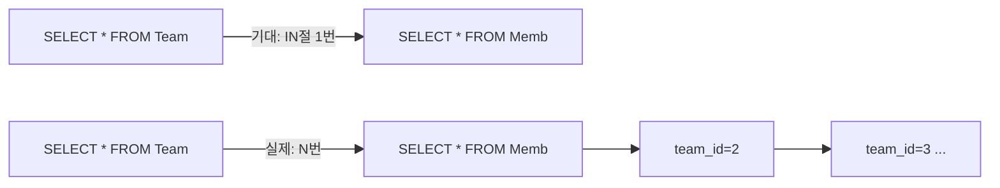
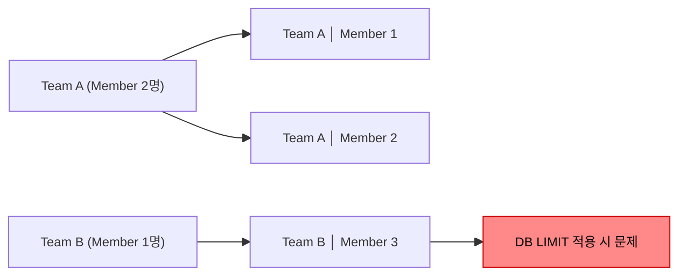
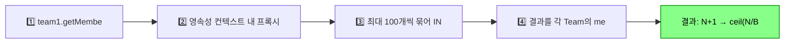
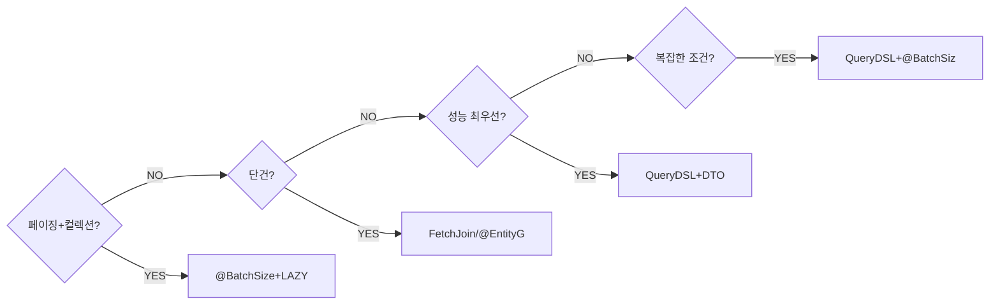
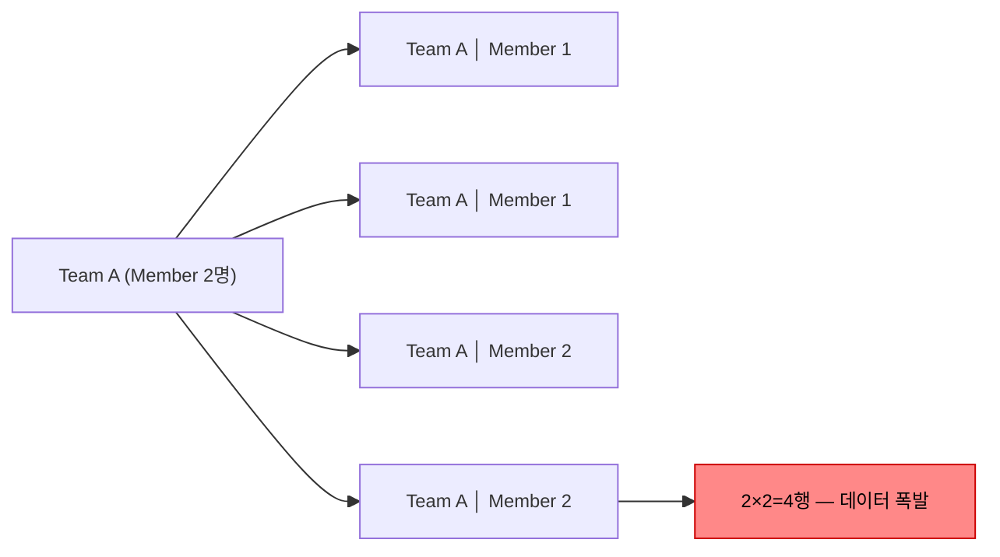
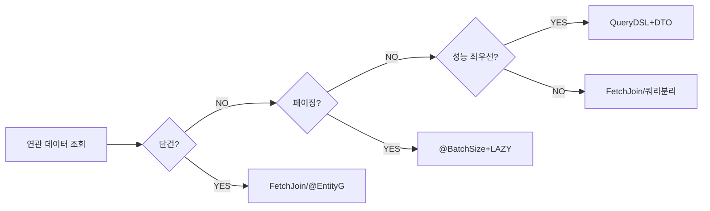

팀 목록을 조회하는 API가 개발 환경에서는 멀쩡하다가 운영에서 수백 ms가 걸린다면, 열에 아홉은 N+1 문제다. 데이터가 적을 때는 보이지 않다가 데이터가 쌓이면서 DB 쿼리가 폭발적으로 늘어나는 것이 이 문제의 특징이다.

> **비유**: 학급 명단(1번 쿼리)을 조회한 뒤, 학생 한 명씩 교무실에 가서 성적을 따로 물어보는(N번 쿼리) 것이다. 처음부터 "학생 전체 성적표 주세요"라고 했으면 한 번에 끝날 일이다.

---

## 1단계: N+1 문제란?

**1번의 쿼리를 실행했더니 결과 행의 수(N)만큼 추가 쿼리가 실행되는 현상**이다. 팀 목록을 조회했더니 각 팀의 멤버를 가져오기 위해 팀 수만큼 추가 SELECT가 발생하는 것이 대표적인 예다.



팀이 100개면 101번, 1000개면 1001번의 쿼리가 실행된다. 각 쿼리는 DB 커넥션을 사용하고 네트워크 왕복이 발생하기 때문에 **서비스 응답 시간이 급격히 느려지고 DB에 부하**가 걸린다.

**이 포스트 전체에서 사용하는 엔티티 구조**

```java
@Entity
public class Team {
    @Id @GeneratedValue
    private Long id;
    private String name;

    @OneToMany(mappedBy = "team", fetch = FetchType.LAZY)
    private List<Member> members = new ArrayList<>();
}

@Entity
public class Member {
    @Id @GeneratedValue
    private Long id;
    private String username;
    private int age;

    @ManyToOne(fetch = FetchType.LAZY)
    @JoinColumn(name = "team_id")
    private Team team;
}
```

---

## 2단계: EAGER 로딩에서의 N+1

`FetchType.EAGER`로 설정하면 연관 엔티티를 항상 즉시 조회한다.

```java
@ManyToOne(fetch = FetchType.EAGER) // EAGER 설정
@JoinColumn(name = "team_id")
private Team team;
```

```java
// JPQL로 Member 전체 조회
List<Member> members = em.createQuery(
        "select m from Member m", Member.class)
        .getResultList();
```

**실행되는 SQL 로그**

```sql
-- 1. Member 전체 조회 (JPQL 그대로 번역)
Hibernate:
    select member0_.id, member0_.username, member0_.age, member0_.team_id
    from Member member0_

-- 2. EAGER이므로 각 Member의 Team을 즉시 로딩 (N번 실행)
Hibernate:
    select team0_.id, team0_.name from Team team0_ where team0_.id=?
Hibernate:
    select team0_.id, team0_.name from Team team0_ where team0_.id=?
-- ... Member 수(N)만큼 반복
```

**왜 JOIN으로 한 번에 가져오지 않는가?**

JPQL은 작성한 쿼리를 그대로 SQL로 번역한다. `"select m from Member m"`에는 JOIN이 없으므로 Member만 조회한다. 그런데 EAGER 설정 때문에 조회 후 연관 엔티티를 즉시 가져오기 위해 Team을 각각 추가 조회하는 것이다.

`em.find()`는 JPA가 내부적으로 JOIN을 활용해 한 번에 가져오지만, JPQL은 다르게 동작한다.

---

## 3단계: LAZY 로딩에서의 N+1

지연 로딩으로 설정해도 N+1 문제가 발생할 수 있다.

```java
@ManyToOne(fetch = FetchType.LAZY) // LAZY 설정
@JoinColumn(name = "team_id")
private Team team;
```

```java
List<Member> members = em.createQuery(
        "select m from Member m", Member.class)
        .getResultList();
// 이 시점에는 쿼리 1번만 실행됨 (team은 프록시)

for (Member member : members) {
    System.out.println(member.getTeam().getName()); // 여기서 N번 실행!
}
```

**실행되는 SQL 로그**

```sql
-- 1. Member 전체 조회
Hibernate:
    select member0_.id, member0_.username, member0_.age, member0_.team_id
    from Member member0_

-- 2. 루프에서 team.getName() 호출 시마다 각각 조회
Hibernate:
    select team0_.id, team0_.name from Team team0_ where team0_.id=?
-- binding parameter [1] as [LONG] - [1]
Hibernate:
    select team0_.id, team0_.name from Team team0_ where team0_.id=?
-- binding parameter [1] as [LONG] - [2]
-- ... N번 반복
```

LAZY라서 최초 조회 시에는 문제가 없어 보이지만, **실제로 연관 엔티티에 접근하는 시점에 N번의 쿼리가 발생**한다. 개발 환경에서는 데이터가 적어 눈에 띄지 않다가 운영 환경에서 폭발하는 경우가 많다.

---

## 4단계: 해결 방법 1 — Fetch Join

### 동작 원리

JPQL에 `JOIN FETCH`를 사용하면 연관 엔티티를 **한 번의 쿼리로 함께 조회**한다.

```java
List<Member> members = em.createQuery(
        "select m from Member m join fetch m.team", Member.class)
        .getResultList();

for (Member member : members) {
    System.out.println(member.getTeam().getName()); // 추가 쿼리 없음
}
```

**실행되는 SQL 로그**

```sql
-- 단 1번의 쿼리로 Member + Team 모두 조회
Hibernate:
    select
        member0_.id, member0_.username, member0_.age, member0_.team_id,
        team1_.id, team1_.name
    from Member member0_
        inner join Team team1_ on member0_.team_id=team1_.id
```

**컬렉션 Fetch Join (Team → members 방향)**

```java
List<Team> teams = em.createQuery(
        "select distinct t from Team t join fetch t.members", Team.class)
        .getResultList();
// distinct: SQL DISTINCT + JPA 애플리케이션 레벨 중복 제거 모두 수행
```

### Fetch Join 한계: 컬렉션 페치 조인 + 페이징 불가

컬렉션(OneToMany)에 Fetch Join을 사용하면서 페이징을 적용하면 심각한 문제가 발생한다.

```java
// 위험! 메모리에서 페이징 처리됨
List<Team> teams = em.createQuery(
        "select t from Team t join fetch t.members", Team.class)
        .setFirstResult(0)
        .setMaxResults(10)
        .getResultList();
// WARN: HHH90003004: firstResult/maxResults specified with collection fetch;
//       applying in memory!
```



**핵심 요약**: 컬렉션 Fetch Join은 JOIN 결과가 카테시안 곱이 되므로 DB 레벨의 LIMIT/OFFSET이 팀 단위가 아닌 JOIN 행 단위로 적용된다. Hibernate는 이를 해결하려고 전체 데이터를 메모리에 올린 뒤 페이징을 처리하는데, 데이터가 많으면 OOM이 발생한다.

**해결책**: 컬렉션 페이징에는 Fetch Join 대신 `@BatchSize`를 사용한다.

---

## 5단계: 해결 방법 2 — @EntityGraph

Spring Data JPA에서 JPQL 없이 메서드 이름만으로 Fetch Join 효과를 낼 수 있다.

```java
public interface MemberRepository extends JpaRepository<Member, Long> {

    @EntityGraph(attributePaths = {"team"}) // team을 함께 로딩
    List<Member> findAll();

    @EntityGraph(attributePaths = {"team"})
    @Query("select m from Member m where m.age > :age")
    List<Member> findByAgeWithTeam(@Param("age") int age);
}
```

**실행되는 SQL 로그**

```sql
-- LEFT OUTER JOIN으로 실행됨 (Fetch Join은 INNER JOIN)
Hibernate:
    select member0_.id, member0_.username, member0_.team_id,
           team1_.id, team1_.name
    from Member member0_
        left outer join Team team1_ on member0_.team_id=team1_.id
    where member0_.age > ?
```

**Named EntityGraph — 재사용 가능한 그래프 정의**

```java
@Entity
@NamedEntityGraph(
    name = "Member.withTeam",
    attributeNodes = @NamedAttributeNode("team")
)
public class Member { ... }

// Repository에서 이름으로 참조
public interface MemberRepository extends JpaRepository<Member, Long> {
    @EntityGraph("Member.withTeam")
    List<Member> findByUsername(String username);
}
```

**@EntityGraph vs Fetch Join 차이점**

| 구분 | Fetch Join | @EntityGraph |
|------|-----------|--------------|
| JOIN 방식 | INNER JOIN | LEFT OUTER JOIN |
| 사용 방식 | JPQL 직접 작성 | 어노테이션 선언 |
| 동적 조건 | 자유롭게 작성 | 제한적 |
| NULL 연관 엔티티 | 제외됨 | 포함됨 (LEFT JOIN) |

---

## 6단계: 해결 방법 3 — @BatchSize

### IN 절 최적화 동작 원리

> **비유**: 편의점을 N번 따로 방문하는 대신 "1번, 5번, 7번 상품 한꺼번에 주세요"라고 한 번에 주문하는 것이다.

`@BatchSize`는 지연 로딩 시 프록시를 초기화할 때 **개별 SELECT 대신 IN 절을 사용해 한 번에 여러 행을 조회**하는 방식이다.



```java
@Entity
public class Team {
    @BatchSize(size = 100) // 최대 100개씩 IN 절로 조회
    @OneToMany(mappedBy = "team", fetch = FetchType.LAZY)
    private List<Member> members = new ArrayList<>();
}
```

**실행되는 SQL 로그 (N+1 없음)**

```sql
-- 1. Team 전체 조회
Hibernate:
    select team0_.id, team0_.name from Team team0_

-- 2. 첫 번째 members 접근 시 → 최대 100개 team_id를 IN으로 한 번에 조회
Hibernate:
    select members0_.team_id, members0_.id, members0_.username
    from Member members0_
    where members0_.team_id in (?, ?, ?, ?, ?, ...)
```

### 글로벌 설정 — 실무 표준

모든 연관관계에 일일이 `@BatchSize`를 붙이는 대신 전역 설정을 사용한다. **실무에서 가장 많이 사용하는 방식**이다.

```yaml
# application.yml
spring:
  jpa:
    properties:
      hibernate:
        default_batch_fetch_size: 1000
```

`default_batch_fetch_size`의 적정값은 보통 **100~1000** 사이다. DB 파라미터 수 제한과 IN 절 성능을 고려해 설정한다. 이 설정 하나로 대부분의 N+1 문제가 자동으로 완화된다.

---

## 7단계: 해결 방법 4 — @Fetch(FetchMode.SUBSELECT)

IN 절 대신 서브쿼리를 사용해 한 번에 조회하는 방식이다.

```java
@Entity
public class Team {
    @OneToMany(mappedBy = "team", fetch = FetchType.LAZY)
    @Fetch(FetchMode.SUBSELECT) // Hibernate 전용 어노테이션
    private List<Member> members = new ArrayList<>();
}
```

**실행되는 SQL 로그**

```sql
-- 1. Team 전체 조회
Hibernate:
    select team0_.id, team0_.name from Team team0_

-- 2. members 접근 시 → 서브쿼리로 한 번에 모두 조회 (항상 전체)
Hibernate:
    select members0_.team_id, members0_.id, members0_.username
    from Member members0_
    where members0_.team_id in (
        select team0_.id from Team team0_
    )
```

| 구분 | @BatchSize | @Fetch(SUBSELECT) |
|------|-----------|-------------------|
| 쿼리 방식 | IN (?, ?, ...) | IN (SELECT ...) |
| 쿼리 횟수 | ceil(N/size) + 1 | 항상 2번 |
| 메모리 사용 | 배치 단위 | 전체 한 번에 |
| 표준 여부 | JPA 표준 | Hibernate 전용 |

대용량 데이터에서는 서브쿼리가 부담이 될 수 있으므로 `@BatchSize`가 더 유연하다.

---

## 8단계: 해결 방법 5 — QueryDSL + DTO 직접 조회

연관 엔티티를 엔티티 그래프로 로딩하는 대신, 필요한 데이터만 DTO로 직접 프로젝션하는 방식이다. **가장 성능이 뛰어난 방법**이다.

```java
@QueryProjection // 컴파일 타임에 QMemberTeamDto 생성
public class MemberTeamDto {
    private Long memberId;
    private String username;
    private String teamName;

    public MemberTeamDto(Long memberId, String username, String teamName) {
        this.memberId = memberId;
        this.username = username;
        this.teamName = teamName;
    }
}
```

```java
// QueryDSL로 JOIN + DTO 직접 조회
List<MemberTeamDto> result = queryFactory
        .select(new QMemberTeamDto(
                member.id,
                member.username,
                team.name))
        .from(member)
        .join(member.team, team)
        .where(member.age.gt(20))
        .fetch();
```

**실행되는 SQL 로그**

```sql
-- 단 1번의 쿼리, 필요한 컬럼만 조회
Hibernate:
    select member0_.id, member0_.username, team1_.name
    from Member member0_
        inner join Team team1_ on member0_.team_id=team1_.id
    where member0_.age > ?
```

**단점**: 엔티티가 아닌 DTO를 반환하므로 변경 감지(Dirty Checking)가 동작하지 않는다. 조회 전용으로만 사용해야 한다.

---

## 9단계: 해결 방법 비교

| 방법 | 성능 | 편의성 | 페이징 지원 | 제약사항 |
|------|------|--------|-------------|----------|
| Fetch Join | 높음 | 중간 | 컬렉션 불가 | JPQL 직접 작성 |
| @EntityGraph | 높음 | 높음 | 컬렉션 불가 | LEFT JOIN 고정 |
| @BatchSize | 중간~높음 | 높음 | 가능 | 쿼리 2번 이상 |
| SUBSELECT | 중간 | 중간 | 가능 | Hibernate 전용 |
| DTO 직접 조회 | 최고 | 낮음 | 가능 | 엔티티 아님, 코드량 多 |

**선택 기준 의사결정 흐름**



---


## 극한 시나리오

### 시나리오 1: 다단계 연관관계 N+1 (Order → OrderItem → Item)

```java
@Entity
public class Order {
    @OneToMany(mappedBy = "order", fetch = FetchType.LAZY)
    private List<OrderItem> orderItems;
}

@Entity
public class OrderItem {
    @ManyToOne(fetch = FetchType.LAZY)
    private Item item;
}
```

```java
List<Order> orders = orderRepository.findAll();

for (Order order : orders) {
    for (OrderItem orderItem : order.getOrderItems()) { // N번 쿼리
        System.out.println(orderItem.getItem().getName()); // N*M번 쿼리
    }
}
// Order 10개, 각 Order당 OrderItem 5개:
// Order 조회: 1번
// OrderItem 조회: 10번
// Item 조회: 10 × 5 = 50번
// 총 61번 쿼리 발생!
```

**해결: 중첩 Fetch Join 또는 global BatchSize**

```java
// 중첩 Fetch Join
List<Order> orders = em.createQuery(
        "select distinct o from Order o " +
        "join fetch o.orderItems oi " +
        "join fetch oi.item", Order.class)
        .getResultList();
// 단 1번 쿼리

// 또는 global batch size 설정으로 각 단계 자동 배치 조회
// spring.jpa.properties.hibernate.default_batch_fetch_size=1000
```

### 시나리오 2: MultipleBagFetchException

컬렉션(List) Fetch Join을 2개 이상 동시에 사용하면 예외가 발생한다.

```java
// 예외 발생!
List<Team> teams = em.createQuery(
        "select t from Team t " +
        "join fetch t.members " +
        "join fetch t.coaches", Team.class)
        .getResultList();
// MultipleBagFetchException:
// cannot simultaneously fetch multiple bags: [Team.members, Team.coaches]
```



**해결 방법**

```java
// 방법 1: List → Set으로 변경 (순서 불필요 시)
@OneToMany(mappedBy = "team")
private Set<Member> members = new HashSet<>(); // Set은 중복 제거 가능

// 방법 2: Fetch Join 1개 + @BatchSize 조합
// members는 Fetch Join, coaches는 BatchSize로 자동 배치 조회
List<Team> teams = em.createQuery(
        "select t from Team t join fetch t.members", Team.class)
        .getResultList();
// coaches는 default_batch_fetch_size로 자동 IN 조회

// 방법 3: 쿼리 분리
// members와 coaches를 별도 쿼리로 로딩 후 병합
```

### 시나리오 3: 컬렉션 페치 조인 + 페이징 OOM

```java
// 위험한 코드: 데이터 전체를 메모리에 올린 후 페이징
List<Team> teams = em.createQuery(
        "select t from Team t join fetch t.members", Team.class)
        .setFirstResult(0)
        .setMaxResults(10)
        .getResultList();
// HHH90003004: applying in memory!
// 팀이 10만 개면 10만 개 × 멤버 수를 모두 메모리에 올려 자름 → OOM
```

**올바른 해결: 페이징 시 컬렉션 Fetch Join 금지, @BatchSize 사용**

```java
// application.yml
spring.jpa.properties.hibernate.default_batch_fetch_size: 1000

// Repository
Page<Team> findAll(Pageable pageable);
// Team만 페이징 조회 (1번, DB LIMIT 적용)
// members는 IN 절 배치 조회 (1번)
// 총 2번 쿼리, 메모리 안전
```

### 시나리오 4: 카테시안 곱 — 컬렉션 Fetch Join 중복 결과

```java
List<Team> teams = em.createQuery(
        "select t from Team t join fetch t.members", Team.class)
        .getResultList();

System.out.println(teams.size()); // 팀 2개인데 5가 나올 수 있음!
// (Member 수만큼 Team이 중복 반환)
```

**해결: distinct 사용**

```java
// JPQL의 distinct = SQL DISTINCT + 애플리케이션 레벨 엔티티 중복 제거
List<Team> teams = em.createQuery(
        "select distinct t from Team t join fetch t.members", Team.class)
        .getResultList();

// Spring Data JPA + @EntityGraph
@EntityGraph(attributePaths = {"members"})
@Query("select distinct t from Team t")
List<Team> findAllWithMembers();
```

---
## 실무 Best Practice

### 기본 전략: LAZY + global BatchSize

```java
// 1. 모든 연관관계에 LAZY 설정
@ManyToOne(fetch = FetchType.LAZY)
@OneToOne(fetch = FetchType.LAZY)
@OneToMany(fetch = FetchType.LAZY) // @OneToMany 기본값이 LAZY이긴 함

// 2. application.yml에 global 설정
spring.jpa.properties.hibernate.default_batch_fetch_size: 1000
// → 지연 로딩 시 IN 절 최적화 자동 적용, 대부분의 N+1 완화
```

### Spring Data JPA 통합 적용

```java
public interface TeamRepository extends JpaRepository<Team, Long> {

    // 페이징: @BatchSize 글로벌 설정 활용
    Page<Team> findAll(Pageable pageable);

    // 단건 조회 시 Fetch Join: @EntityGraph 활용
    @EntityGraph(attributePaths = {"members"})
    Optional<Team> findWithMembersById(Long id);
}

// Custom Repository: 복잡한 조건 조회는 QueryDSL
public class TeamRepositoryCustomImpl implements TeamRepositoryCustom {

    @Transactional(readOnly = true)
    public List<TeamDto> searchTeams(TeamSearchCondition condition) {
        return queryFactory
                .select(new QTeamDto(team.id, team.name, member.count()))
                .from(team)
                .leftJoin(team.members, member)
                .groupBy(team.id)
                .where(teamNameContains(condition.getTeamName()))
                .fetch();
    }
}
```

### 최종 의사결정 흐름



---

```
참조 - 자바 ORM 표준 JPA 프로그래밍 By 김영한
참조 - 실전! 스프링 부트와 JPA 활용 By 김영한
참조 - 실전! Querydsl By 김영한
```

---

## 왜 N+1이 치명적인가? (극한 시나리오)

```
시나리오: 주문 목록 100건 조회 API
  1번 쿼리: SELECT * FROM orders LIMIT 100
  N번 쿼리: SELECT * FROM customers WHERE id = ? (100번 반복)
  총 쿼리: 101번

트래픽 1,000 TPS에서:
  초당 1,000번 × 101 쿼리 = 초당 101,000 DB 쿼리
  → DB 커넥션 풀 고갈 → 전체 서비스 응답 지연/장애

반면 fetch join 사용 시:
  1번 쿼리: SELECT o.*, c.* FROM orders o JOIN customers c ON o.customer_id = c.id
  초당 1,000번 × 1 쿼리 = 초당 1,000 DB 쿼리
  → 100배 부하 차이
```

---

## 실무에서 자주 하는 실수

#### 실수 1: N+1인지 인지하지 못하고 배포

```java
// 코드만 보면 문제 없어 보임
@Transactional(readOnly = true)
public List<OrderDto> getOrders() {
    List<Order> orders = orderRepository.findAll();
    return orders.stream()
        .map(o -> new OrderDto(
            o.getId(),
            o.getCustomer().getName(),  // 여기서 N+1 발생!
            o.getItems().size()          // 여기서도 N+1 발생!
        ))
        .toList();
}

// 탐지 방법: hibernate.show_sql=true + 쿼리 수 카운트
// 또는 p6spy, datasource-proxy로 쿼리 로깅
```

#### 실수 2: @EntityGraph와 fetch join을 동시에 사용

```java
// @EntityGraph와 fetch join 중복 사용 → Hibernate 경고/오류
@EntityGraph(attributePaths = {"customer"})
@Query("SELECT o FROM Order o JOIN FETCH o.customer")  // 중복!
List<Order> findAllWithCustomer();

// 하나만 선택:
// 간단한 경우 → @EntityGraph
// 복잡한 조건 → fetch join (JPQL)
```

#### 실수 3: 컬렉션 fetch join + 페이징 동시 사용

```java
// 위험한 패턴 — HibernateJpaDialect 경고 발생
@Query("SELECT o FROM Order o JOIN FETCH o.items")
Page<Order> findAllWithItems(Pageable pageable);
// → Hibernate: "HHH90003004: firstResult/maxResults specified with collection fetch"
// → 전체 데이터를 메모리에 로드 후 페이징 → OOM 위험

// 해결: default_batch_fetch_size 설정 + 페이징은 별도로
@Query("SELECT o FROM Order o")
Page<Order> findAll(Pageable pageable);
// application.yml: spring.jpa.properties.hibernate.default_batch_fetch_size=100
// → 100개씩 IN 쿼리로 items 일괄 조회 (N+1 → 1+1)
```

#### 실수 4: fetch join에 alias 남용

```java
// 나쁜 예 — fetch join 대상에 alias 사용 + WHERE 조건
@Query("SELECT o FROM Order o JOIN FETCH o.items i WHERE i.price > 10000")
List<Order> findOrdersWithExpensiveItems();
// → 필터링된 items만 로딩 → 엔티티 불완전 (일부 items만 있는 Order)
// → 이후 order.getItems()가 DB와 다른 결과 반환

// 좋은 예 — fetch join은 필터 없이, 조건은 다른 방법으로
@Query("SELECT DISTINCT o FROM Order o JOIN FETCH o.items WHERE o.id IN :ids")
List<Order> findByIdsWithItems(@Param("ids") List<Long> ids);
```

#### 실수 5: DTO 프로젝션을 사용하지 않고 불필요한 컬럼 전체 조회

```java
// 나쁜 예 — 10개 컬럼 중 2개만 필요한데 전체 조회
List<Order> orders = orderRepository.findAll();
// → 모든 컬럼, 모든 연관관계를 메모리에 로드

// 좋은 예 — 필요한 컬럼만 DTO로 조회
@Query("SELECT new com.example.OrderSummary(o.id, o.status) FROM Order o")
List<OrderSummary> findOrderSummaries();

// 또는 Interface Projection
public interface OrderSummary {
    Long getId();
    String getStatus();
}
List<OrderSummary> findAllProjectedBy();
```

---

## 면접 포인트

#### Q. N+1 문제란 무엇이고 어떻게 해결하나요?

```
N+1 문제:
  1개의 쿼리(1)로 N개의 엔티티를 조회한 후
  각 엔티티의 연관 엔티티를 N번 추가 조회하는 현상
  총 쿼리: 1 + N번

원인:
  Lazy Loading: 연관 엔티티를 실제 접근 시점에 각각 조회
  EAGER + 컬렉션: 주 쿼리 후 각 엔티티마다 서브쿼리

해결 방법:
1. fetch join: JOIN FETCH로 한 번의 쿼리로 즉시 로딩
2. @EntityGraph: 어노테이션으로 fetch join 설정
3. default_batch_fetch_size: IN 쿼리로 N개를 1번에 조회 (1+1)
4. DTO 프로젝션: 필요한 컬럼만 선택 조회
```

#### Q. fetch join과 일반 join의 차이는?

```sql
-- 일반 JOIN (JPQL)
SELECT o FROM Order o JOIN o.customer c WHERE c.name = '김철수'
-- → order만 영속성 컨텍스트에 로딩 (customer는 Lazy 상태)
-- → 이후 o.getCustomer().getName() 시 추가 쿼리 발생

-- fetch JOIN
SELECT o FROM Order o JOIN FETCH o.customer c WHERE c.name = '김철수'
-- → order와 customer 모두 즉시 로딩 (단일 쿼리)
-- → 이후 o.getCustomer().getName() 시 추가 쿼리 없음

핵심 차이: fetch join은 연관 엔티티를 영속성 컨텍스트에 함께 로딩
```

#### Q. default_batch_fetch_size는 어떻게 동작하나요?

```java
// 설정
spring.jpa.properties.hibernate.default_batch_fetch_size=100

// 동작 방식:
// 1번 쿼리: SELECT * FROM orders LIMIT 100 → order 100건
// N번 대신: SELECT * FROM order_items WHERE order_id IN (1,2,3,...,100)
// → N+1이 1+1로 감소 (IN 쿼리 1번으로 100개 연관 엔티티 조회)

// batch_fetch_size와 컬렉션 페이징의 조합:
// 페이징: SELECT * FROM orders LIMIT 10 OFFSET 0 → 10건
// batch:  SELECT * FROM order_items WHERE order_id IN (1,2,...,10) → 1번
// → 페이징 + N+1 동시 해결 (fetch join + 페이징 조합 대비 안전)
```
