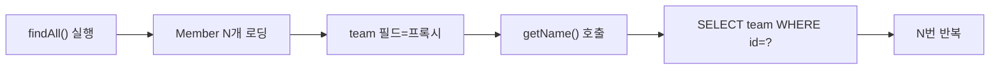
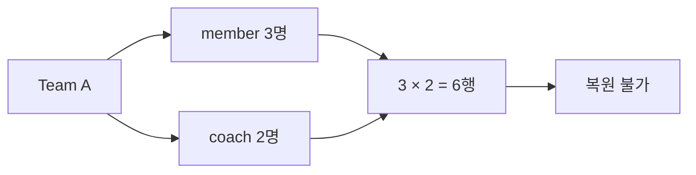
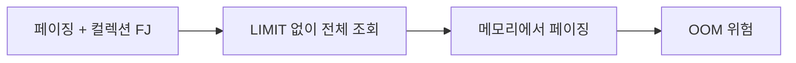
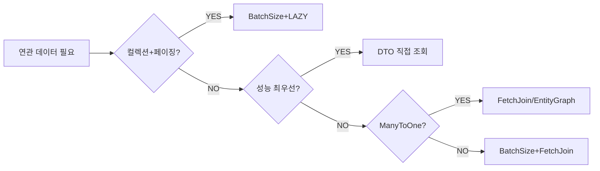

개발 환경에서 멀쩡하던 API가 운영 트래픽에서 수백 ms 이상 걸린다면, 열에 아홉은 N+1 문제다. 단순히 `JOIN FETCH`를 쓰면 된다는 레시피는 누구나 안다. 하지만 면접관이 진짜 묻는 것은 **왜** Hibernate가 N번 쿼리를 발생시키는지, 프록시가 내부에서 어떻게 동작하는지, 그리고 왜 컬렉션 Fetch Join과 페이징을 동시에 쓰면 OOM이 나는지다. 이 글은 그 WHY를 파고든다.

> **비유**: 학급 명단(1번 쿼리)을 받은 뒤, 학생 한 명씩 교무실을 방문해 성적을 따로 묻는(N번 쿼리) 상황이다. "전체 학생 성적표를 한꺼번에 주세요"라고 했으면 1번으로 끝날 일이다. 문제는 이 비효율이 코드만 보면 보이지 않는다는 점이다.

---

## 1. 엔티티 구조 — 이 글 전체의 기준

```java
@Entity
@Table(name = "team")
public class Team {

    @Id @GeneratedValue(strategy = GenerationType.IDENTITY)
    private Long id;

    private String name;

    @OneToMany(mappedBy = "team", fetch = FetchType.LAZY)
    private List<Member> members = new ArrayList<>();

    @OneToMany(mappedBy = "team", fetch = FetchType.LAZY)
    private List<Coach> coaches = new ArrayList<>();
}

@Entity
@Table(name = "member")
public class Member {

    @Id @GeneratedValue(strategy = GenerationType.IDENTITY)
    private Long id;

    private String username;
    private int age;

    @ManyToOne(fetch = FetchType.LAZY)
    @JoinColumn(name = "team_id")
    private Team team;
}
```

> **JPA 스펙이 `@OneToMany`의 기본값을 LAZY로 정한 이유**: 컬렉션은 레코드가 몇 개인지 알 수 없다. 즉시 로딩하면 예상치 못한 대량 데이터가 메모리에 올라온다. 반대로 `@ManyToOne`은 단일 레코드이므로 JPA 스펙 기본은 EAGER다. 그러나 실무에서는 **모든 연관관계를 LAZY로 설정**하는 것이 표준이다. EAGER는 JPQL·Criteria 수행 후 추가 쿼리를 강제해 오히려 N+1을 유발한다.

---

## 2. N+1 문제의 뿌리 — Hibernate 프록시 메커니즘

N+1을 이해하려면 Hibernate가 LAZY 연관관계를 어떻게 구현하는지 알아야 한다.

### 2-1. 프록시 객체의 생성 원리

Hibernate는 엔티티를 로딩할 때 연관 엔티티가 LAZY이면 **실제 객체 대신 프록시 객체**를 반환한다. 이 프록시는 Hibernate가 런타임에 바이트코드를 조작해 생성하는 서브클래스다(기본 구현은 ByteBuddy 라이브러리 사용).

```java
// Hibernate 내부 동작 (개념적 표현)
// Member 조회 시 team은 실제 Team 인스턴스가 아닌 Team$HibernateProxy 반환
Member member = em.find(Member.class, 1L);

// team 필드에 들어있는 것:
// Team$HibernateProxy@xxxx {
//     id: 1L,                        // FK 값은 이미 알고 있음
//     __hibernateLazyInitializer: ... // 초기화 트리거 포함
//     name: null                      // 아직 로딩 안 됨
// }
Team proxy = member.getTeam(); // 이 시점엔 SELECT 없음
String name = proxy.getName(); // 이 시점에 SELECT team WHERE id=1 실행
```

프록시 객체는 두 가지 상태를 가진다.

- **미초기화(uninitialized)**: `id` 값만 가지고 있으며 나머지 필드는 null
- **초기화(initialized)**: 실제 DB에서 데이터를 가져와 채워진 상태

`getName()` 같은 **식별자가 아닌 필드에 처음 접근할 때** Hibernate는 `LazyInitializer`를 호출해 SELECT 쿼리를 실행한다. 이것이 N+1의 근본 원인이다.

### 2-2. 바이트코드 향상(Bytecode Enhancement) vs 스냅샷 비교

Hibernate에는 두 가지 LAZY 구현 방식이 있다.

**방식 A: 프록시 서브클래스 (기본)**

```java
// Hibernate가 런타임에 생성하는 클래스 (개념적 표현)
public class Member$HibernateProxy extends Member {
    private LazyInitializer handler;

    @Override
    public Team getTeam() {
        handler.initialize(); // 미초기화이면 SELECT 실행
        return super.getTeam();
    }
}
```

**방식 B: 빌드타임 바이트코드 향상 (Bytecode Enhancement)**

```xml
<!-- pom.xml -->
<plugin>
    <groupId>org.hibernate.orm.tooling</groupId>
    <artifactId>hibernate-enhance-maven-plugin</artifactId>
    <configuration>
        <enableLazyInitialization>true</enableLazyInitialization>
        <enableDirtyTracking>true</enableDirtyTracking>
    </configuration>
</plugin>
```

바이트코드 향상을 적용하면 **엔티티 클래스 자체에 인터셉터 코드가 삽입**된다. 프록시 서브클래스가 필요 없어 `final` 클래스나 `private` 필드에도 LAZY가 가능하다. 또한 Dirty Checking에서 스냅샷 비교가 아닌 **필드 변경 추적**을 필드 수정 시점에 즉시 수행해 flush 성능이 올라간다.

```
[스냅샷 비교 방식]
1차 캐시에 엔티티 원본 스냅샷 보관
flush 시점에 현재 상태 vs 스냅샷 전체 비교
→ 엔티티 수가 많을수록 비교 비용 증가

[바이트코드 향상 방식]
필드 setter 호출 시점에 "이 필드가 변경됨" 플래그 기록
flush 시점에 플래그된 필드만 UPDATE
→ O(변경된 필드 수), 스냅샷 메모리 불필요
```

### 2-3. N+1이 발생하는 정확한 시점

```java
// 트랜잭션 내부
@Transactional(readOnly = true)
public List<String> getMemberTeamNames() {
    // 1번 쿼리: SELECT * FROM member
    List<Member> members = memberRepository.findAll();
    // 이 시점: members 리스트에는 실제 Member 객체들이 있고
    //          각 member.team 필드는 Team$HibernateProxy (미초기화)

    return members.stream()
        .map(m -> m.getTeam().getName()) // 여기서 N번 쿼리 폭발
        // m.getTeam() → 프록시 반환 (쿼리 없음)
        // .getName() → LazyInitializer.initialize() → SELECT team WHERE id=?
        .collect(Collectors.toList());
}
// 총 쿼리: 1 + N (member 수만큼)
```



---

## 3. 영속성 컨텍스트 — 1차 캐시와 Identity Map

N+1 해결책을 이해하려면 영속성 컨텍스트의 내부 구조를 알아야 한다.

### 3-1. 1차 캐시와 Identity Map

영속성 컨텍스트는 내부적으로 `Map<EntityKey, Object>` 형태의 **Identity Map**을 유지한다.

```java
// EntityKey = (entityClass, primaryKey) 쌍
// 영속성 컨텍스트 내부 구조 (개념적 표현)
Map<EntityKey, Object> firstLevelCache = new HashMap<>();
// key: EntityKey{Team.class, 1L}
// value: 실제 Team 인스턴스 or 프록시

// 같은 트랜잭션 내에서 같은 PK로 조회하면 캐시에서 반환
Team t1 = em.find(Team.class, 1L); // SELECT 실행
Team t2 = em.find(Team.class, 1L); // 캐시에서 반환, SELECT 없음
System.out.println(t1 == t2);      // true — 동일 인스턴스
```

이 Identity Map이 N+1 부분 완화에 어떻게 기여하는지 살펴보자.

```java
List<Member> members = memberRepository.findAll();
// members 중 여러 명이 같은 team_id를 공유한다고 가정

for (Member m : members) {
    m.getTeam().getName();
}
// team_id=1인 Member가 3명이어도
// 첫 번째 접근 시 SELECT team WHERE id=1 실행 → 1차 캐시에 저장
// 두 번째, 세 번째 접근 시 캐시에서 반환 → SELECT 없음
// → 서로 다른 team_id 수만큼만 쿼리 발생 (팀 종류 수 = K)
// 결론: 실제 쿼리는 1 + K (K ≤ N, K = 유니크한 team_id 수)
```

> **중요**: 1차 캐시 덕분에 같은 팀을 참조하는 멤버가 많으면 실제 쿼리 수는 줄어든다. 그러나 팀이 모두 다르다면 여전히 1+N이다. 근본 해결책이 될 수 없다.

### 3-2. Dirty Checking (변경 감지) 메커니즘

```java
@Transactional
public void updateMemberAge(Long memberId, int newAge) {
    Member member = em.find(Member.class, memberId);
    // 1차 캐시에 저장 + 스냅샷 복사본 보관

    member.setAge(newAge); // setter 호출, 별도 UPDATE 없음

    // 트랜잭션 커밋 or flush 시점에:
    // 현재 member 상태 vs 스냅샷 비교
    // age 필드가 다름 → UPDATE member SET age=? WHERE id=?
    // em.update() 같은 메서드 호출 불필요
}
```

스냅샷 비교는 flush 시점에 영속성 컨텍스트 내 모든 엔티티를 순회한다. 엔티티가 수천 개라면 이 비교 자체가 부담이 된다. 이것이 **조회 전용 트랜잭션에서 `@Transactional(readOnly=true)`를 사용해야 하는 이유**다. readOnly 트랜잭션은 스냅샷을 생성하지 않아 메모리와 flush 비용이 줄어든다.

---

## 4. Fetch Join — 단일 쿼리로 연관 엔티티 로딩

### 4-1. 왜 Fetch Join은 단일 SQL을 생성하는가

JPQL의 `JOIN FETCH`는 JPA 스펙에 정의된 특별한 조인이다. Hibernate는 이를 파싱할 때 **해당 연관 엔티티를 SELECT 절에 포함**시키고, 결과 ResultSet에서 양쪽 엔티티를 동시에 인스턴스화한다.

```java
// JPQL
List<Member> members = em.createQuery(
    "SELECT m FROM Member m JOIN FETCH m.team", Member.class)
    .getResultList();
```

```sql
-- Hibernate가 생성하는 SQL
SELECT
    m.id, m.username, m.age, m.team_id,
    t.id, t.name                          -- team 컬럼도 포함
FROM member m
INNER JOIN team t ON m.team_id = t.id
```

Hibernate는 ResultSet의 각 행을 처리할 때:
1. `m.*` 컬럼으로 Member 인스턴스 생성 → 1차 캐시에 저장
2. `t.*` 컬럼으로 Team 인스턴스 생성 → 1차 캐시에 저장
3. Member의 `team` 필드에 **실제 Team 인스턴스 주입** (프록시가 아님)

이후 `member.getTeam().getName()` 호출 시 프록시 초기화가 불필요하므로 추가 쿼리가 없다.

### 4-2. 일반 JOIN과의 결정적 차이

```java
// 일반 JOIN — filtering 목적
List<Member> members = em.createQuery(
    "SELECT m FROM Member m JOIN m.team t WHERE t.name = '개발팀'",
    Member.class).getResultList();
// 생성 SQL:
// SELECT m.* FROM member m INNER JOIN team t ON m.team_id=t.id WHERE t.name=?
// → team은 SELECT 절에 없음, member만 로딩
// → 이후 m.getTeam().getName() 시 추가 쿼리 발생

// Fetch JOIN — 로딩 목적
List<Member> members = em.createQuery(
    "SELECT m FROM Member m JOIN FETCH m.team t WHERE t.name = '개발팀'",
    Member.class).getResultList();
// 생성 SQL:
// SELECT m.*, t.* FROM member m INNER JOIN team t ON m.team_id=t.id WHERE t.name=?
// → team도 SELECT 절에 포함, 둘 다 즉시 로딩
// → 이후 추가 쿼리 없음
```

### 4-3. 컬렉션 Fetch Join과 카테시안 곱 문제

`@ManyToOne` 방향(Member → Team)의 Fetch Join은 결과 행 수가 변하지 않는다. 그러나 `@OneToMany` 방향(Team → members)은 다르다.

```java
List<Team> teams = em.createQuery(
    "SELECT t FROM Team t JOIN FETCH t.members", Team.class)
    .getResultList();
```

```sql
SELECT t.id, t.name, m.id, m.username, m.age, m.team_id
FROM team t
INNER JOIN member m ON t.id = m.team_id
```

팀 A에 멤버 3명, 팀 B에 멤버 2명이면 ResultSet은 5행이다.

```
t.id | t.name | m.id | m.username
-----|--------|------|----------
1    | 팀A    | 10   | 홍길동
1    | 팀A    | 11   | 이몽룡
1    | 팀A    | 12   | 성춘향
2    | 팀B    | 13   | 변학도
2    | 팀B    | 14   | 방자
```

Hibernate는 이 5행을 처리해 Team 인스턴스 2개를 만들지만, **`getResultList()` 반환값은 5개**다. 같은 Team 인스턴스가 중복으로 들어간다.

```java
List<Team> result = ...; // size() = 5 ← 팀이 2개인데 5개!
System.out.println(result.get(0) == result.get(1)); // true — 같은 인스턴스
```

이를 해결하는 것이 JPQL의 `distinct`다.

```java
List<Team> teams = em.createQuery(
    "SELECT DISTINCT t FROM Team t JOIN FETCH t.members", Team.class)
    .getResultList();
// JPQL distinct의 두 가지 효과:
// 1. SQL에 DISTINCT 추가 (DB 레벨 중복 제거)
// 2. 애플리케이션 레벨에서 같은 식별자 엔티티 중복 제거
// → result.size() = 2 (팀 수)
```

> Hibernate 6부터는 `SELECT t FROM Team t JOIN FETCH t.members`만으로도 자동으로 애플리케이션 레벨 중복 제거가 적용된다. `DISTINCT` 없이도 컬렉션 Fetch Join 결과가 올바르게 반환된다.

---

## 5. @EntityGraph — 어노테이션 기반 Fetch Join

### 5-1. Ad-hoc EntityGraph

```java
public interface MemberRepository extends JpaRepository<Member, Long> {

    // ad-hoc: 그 자리에서 바로 정의
    @EntityGraph(attributePaths = {"team"})
    List<Member> findAll();

    @EntityGraph(attributePaths = {"team"})
    @Query("SELECT m FROM Member m WHERE m.age > :age")
    List<Member> findOlderThan(@Param("age") int age);
}
```

`attributePaths = {"team"}`은 Hibernate에게 "team 연관관계를 EAGER처럼 처리하라"는 힌트다. Hibernate는 이를 **LEFT OUTER JOIN**으로 변환한다.

```sql
-- @EntityGraph가 생성하는 SQL
SELECT m.id, m.username, m.age, m.team_id,
       t.id, t.name
FROM member m
LEFT OUTER JOIN team t ON m.team_id = t.id   -- LEFT JOIN (Fetch Join은 INNER)
WHERE m.age > ?
```

**Fetch Join과의 JOIN 방향 차이가 중요한 이유**: Fetch Join(INNER JOIN)은 team이 null인 Member를 결과에서 제외한다. @EntityGraph(LEFT OUTER JOIN)는 team이 없는 Member도 포함한다. 비즈니스 요구사항에 따라 선택해야 한다.

### 5-2. Named EntityGraph — 재사용 가능한 그래프

```java
@Entity
@NamedEntityGraph(
    name = "Member.withTeamAndOrders",
    attributeNodes = {
        @NamedAttributeNode("team"),
        @NamedAttributeNode(value = "orders", subgraph = "orders-subgraph")
    },
    subgraphs = {
        @NamedSubgraph(
            name = "orders-subgraph",
            attributeNodes = @NamedAttributeNode("orderItems")
        )
    }
)
public class Member { ... }
```

```java
public interface MemberRepository extends JpaRepository<Member, Long> {

    // 이름으로 Named EntityGraph 참조
    @EntityGraph("Member.withTeamAndOrders")
    List<Member> findByUsername(String username);
}
```

Named EntityGraph는 엔티티 클래스에 그래프를 정의하고 여러 Repository 메서드에서 재사용한다. 하위 그래프(subgraph)를 통해 **2단계 이상의 연관관계**도 선언적으로 로딩할 수 있다.

### 5-3. Hibernate가 EntityGraph를 SQL로 변환하는 과정

```
1. Spring Data JPA가 @EntityGraph 메타데이터를 읽어
   EntityGraph 객체를 생성

2. EntityManager.find() 또는 Query 실행 시
   EntityGraph를 javax.persistence.fetchgraph 힌트로 전달

3. Hibernate의 QueryTranslator가
   fetchgraph 힌트를 해석해 JOIN 전략 결정
   - attributeNodes의 각 경로 → LEFT OUTER JOIN 추가
   - subgraph → 중첩 LEFT OUTER JOIN

4. SQL 생성 및 실행
   ResultSet에서 그래프의 모든 엔티티를 동시에 인스턴스화
```

```java
// fetchgraph vs loadgraph 힌트 차이
// fetchgraph: 명시된 속성만 EAGER, 나머지는 LAZY
// loadgraph:  명시된 속성은 EAGER, 나머지는 엔티티 기본 fetch 전략 유지

Map<String, Object> hints = new HashMap<>();
hints.put("javax.persistence.fetchgraph", entityGraph);
Member member = em.find(Member.class, id, hints);
```

---

## 6. @BatchSize — IN 절 배치와 Batch Fetch Style

### 6-1. IN 절 배치의 동작 원리

> **비유**: 편의점을 각 상품마다 따로 방문하는 대신 "1번, 5번, 7번 상품 한꺼번에 주세요"라고 한 번에 주문하는 것이다.

```java
@Entity
public class Team {

    @BatchSize(size = 100)
    @OneToMany(mappedBy = "team", fetch = FetchType.LAZY)
    private List<Member> members = new ArrayList<>();
}
```

동작 흐름을 단계별로 살펴보자.

```java
List<Team> teams = teamRepository.findAll(); // SELECT * FROM team → 팀 150개 로딩

// 첫 번째 members 접근 시:
Team firstTeam = teams.get(0);
firstTeam.getMembers(); // 이 시점에 배치 처리 발동
```

Hibernate는 첫 번째 members 접근 시 현재 영속성 컨텍스트에서 **미초기화 상태인 모든 members 프록시**를 수집한다. 그리고 최대 `size`개씩 묶어 IN 절로 쿼리한다.

```sql
-- 팀 150개 → 배치 사이즈 100
-- 1차 배치: team_id 1~100
SELECT m.team_id, m.id, m.username, m.age
FROM member m
WHERE m.team_id IN (1, 2, 3, ... , 100)   -- 100개

-- 2차 배치: team_id 101~150
SELECT m.team_id, m.id, m.username, m.age
FROM member m
WHERE m.team_id IN (101, 102, ... , 150)  -- 50개

-- 총 쿼리: 1(팀 조회) + ceil(150/100) = 3번
```

### 6-2. Hibernate Batch Fetch Style

Hibernate는 IN 절의 파라미터 수를 어떻게 결정할지 4가지 전략을 제공한다.

```yaml
spring:
  jpa:
    properties:
      hibernate:
        batch_fetch_style: PADDED   # 기본값 (Hibernate 6.x)
        default_batch_fetch_size: 100
```

**LEGACY 방식**: 2의 거듭제곱과 몇 가지 고정 수열을 사전에 계산해 IN 절 크기를 정한다.

```
요청 10개 → IN (?, ?, ..., ?) 10개
요청 11개 → IN (?, ..., ?) 12개 (2의 제곱수 올림)
요청 99개 → IN (?, ..., ?) 100개
→ 매번 다른 크기의 IN 절 → DB 쿼리 플랜 캐시 미스 발생
```

**IN 방식**: 실제 필요한 수만큼 정확히 IN 절을 생성한다.

```
요청 10개 → IN (?, ?, ...) 10개
요청 11개 → IN (?, ?, ...) 11개
→ 매번 다른 파라미터 수 → 쿼리 플랜 캐시 미스
```

**PADDED 방식 (권장)**: 항상 `default_batch_fetch_size`와 같은 크기의 IN 절을 생성하고, 남는 자리는 마지막 값으로 채운다.

```sql
-- 팀 10개, batch_size=100
SELECT ... WHERE team_id IN (1, 2, 3, ..., 10, 10, 10, ..., 10)
--                                         ^^^^^^^^^^^^^^^ 90개를 10으로 패딩

-- 항상 IN 절 크기가 100으로 고정 → DB 쿼리 플랜 캐시 히트율 최대화
```

**DYNAMIC 방식**: 배치 크기를 동적으로 계산. SQL 문자열이 달라질 수 있다.

PADDED가 기본값인 이유는 **PostgreSQL, MySQL 같은 DB의 Prepared Statement 캐시를 최대한 활용**하기 때문이다. 파라미터 수가 항상 동일하면 동일한 실행 계획을 재사용한다.

### 6-3. 글로벌 설정 — 실무 표준

```yaml
spring:
  jpa:
    properties:
      hibernate:
        default_batch_fetch_size: 1000
```

이 설정 하나가 코드 변경 없이 대부분의 N+1을 완화한다. 적정값은 **100~1000** 사이다.

- 너무 작으면: ceil(N/size) 횟수가 늘어남
- 너무 크면: IN 절이 길어져 DB 파서 부하, 일부 DB의 파라미터 수 제한(Oracle: 1000, MySQL: 제한 없음)

```java
// 글로벌 설정과 @BatchSize 어노테이션이 동시에 있으면
// @BatchSize 어노테이션이 우선함
@BatchSize(size = 50)   // 이 연관관계만 50으로 오버라이드
@OneToMany(...)
private List<Member> members;
```

---

## 7. @Fetch(FetchMode.SUBSELECT) — 서브쿼리 배치

### 7-1. 동작 원리와 생성 SQL 구조

```java
@Entity
public class Team {

    @OneToMany(mappedBy = "team", fetch = FetchType.LAZY)
    @Fetch(FetchMode.SUBSELECT)   // Hibernate 전용
    private List<Member> members = new ArrayList<>();
}
```

```java
List<Team> teams = teamRepository.findAll(); // SELECT * FROM team

teams.get(0).getMembers(); // 첫 번째 접근 시 서브쿼리 실행
```

```sql
-- 1번: 팀 조회
SELECT t.id, t.name FROM team t

-- 2번: 첫 번째 members 접근 시 → 원본 팀 쿼리를 서브쿼리로 재사용
SELECT m.team_id, m.id, m.username, m.age
FROM member m
WHERE m.team_id IN (
    SELECT t.id FROM team t     -- 원본 쿼리 재사용
)
-- 나머지 팀의 members 접근 시 추가 쿼리 없음 (이미 모두 로딩됨)
```

**SUBSELECT의 특징**: `@BatchSize`와 달리 **항상 전체를 한 번에 로딩**한다. 팀이 10만 개라도 서브쿼리 1번으로 모든 members를 가져온다.

### 7-2. @BatchSize vs SUBSELECT 선택 기준

| 구분 | @BatchSize | SUBSELECT |
|------|-----------|-----------|
| 쿼리 방식 | IN (?, ?, ...) | IN (SELECT ...) |
| 쿼리 횟수 | 1 + ceil(N/size) | 항상 2번 |
| 부분 로딩 가능 | 가능 | 불가 (항상 전체) |
| 메모리 사용 | 배치 단위 | 전체 한 번에 |
| 페이징과 조합 | 안전 | 서브쿼리 성능 주의 |
| JPA 표준 여부 | 표준 | Hibernate 전용 |

SUBSELECT는 **페이지네이션 없이 전체 목록을 조회하는 경우**에 유용하다. 배치 분할이 없어 쿼리 횟수가 정확히 2번으로 고정된다.

---

## 8. DTO 프로젝션 — 왜 엔티티보다 빠른가

### 8-1. 엔티티 조회와 DTO 조회의 내부 차이

DTO 프로젝션이 엔티티 조회보다 빠른 이유는 세 가지다.

**이유 1: 영속성 컨텍스트 관리 비용 없음**

엔티티는 로딩 시 1차 캐시에 등록되고, 스냅샷이 생성되며, flush 시 Dirty Checking 대상이 된다. DTO는 이 모든 과정을 건너뛴다.

**이유 2: 프록시 생성 없음**

DTO는 연관 엔티티를 참조하지 않으므로 프록시 객체 자체가 필요 없다. ByteBuddy 프록시 생성 비용이 없다.

**이유 3: 필요한 컬럼만 SELECT**

엔티티 조회는 매핑된 모든 컬럼을 가져온다. DTO는 필요한 컬럼만 선택해 네트워크 전송량과 ResultSet 처리 비용을 줄인다.

### 8-2. JPQL new 연산자를 사용한 DTO 조회

```java
public class MemberTeamDto {
    private Long memberId;
    private String username;
    private String teamName;

    // JPQL new 연산자는 이 생성자를 호출
    public MemberTeamDto(Long memberId, String username, String teamName) {
        this.memberId = memberId;
        this.username = username;
        this.teamName = teamName;
    }
}
```

```java
List<MemberTeamDto> result = em.createQuery(
    "SELECT new com.example.dto.MemberTeamDto(m.id, m.username, t.name) " +
    "FROM Member m JOIN m.team t " +
    "WHERE m.age > :age",
    MemberTeamDto.class)
    .setParameter("age", 20)
    .getResultList();
```

```sql
-- 생성 SQL: 필요한 컬럼만 조회
SELECT m.id, m.username, t.name
FROM member m
INNER JOIN team t ON m.team_id = t.id
WHERE m.age > ?
-- member.age, member.team_id 같은 불필요한 컬럼은 SELECT 안 함
```

### 8-3. Spring Data JPA Interface Projection

```java
// 인터페이스 프로젝션: 구현체 없이 선언만
public interface MemberSummary {
    Long getId();
    String getUsername();

    // 중첩 프로젝션: 연관 엔티티 접근
    TeamInfo getTeam();

    interface TeamInfo {
        String getName();
    }
}
```

```java
public interface MemberRepository extends JpaRepository<Member, Long> {
    List<MemberSummary> findByAgeGreaterThan(int age);
}
```

인터페이스 프로젝션은 Spring Data JPA가 런타임에 프록시 구현체를 생성한다. **Closed Projection**(인터페이스가 엔티티 속성을 정확히 지정)은 필요한 컬럼만 SELECT한다. **Open Projection**(SpEL 표현식 사용)은 엔티티 전체를 로딩한 뒤 SpEL을 평가한다.

```java
// Open Projection — 주의 필요
public interface MemberSummary {
    @Value("#{target.username + ' (' + target.age + ')'}")
    String getFullInfo(); // 이 경우 엔티티 전체가 로딩됨
}
```

### 8-4. QueryDSL @QueryProjection — 컴파일 타임 안전성

```java
@QueryProjection  // 이 어노테이션이 Q클래스 생성을 지시
public class MemberTeamDto {
    private Long memberId;
    private String username;
    private int age;
    private String teamName;

    @QueryProjection
    public MemberTeamDto(Long memberId, String username, int age, String teamName) {
        this.memberId = memberId;
        this.username = username;
        this.age = age;
        this.teamName = teamName;
    }
}
```

```java
// QueryDSL로 컴파일 타임 타입 안전 DTO 조회
List<MemberTeamDto> result = queryFactory
    .select(new QMemberTeamDto(
        member.id,
        member.username,
        member.age,
        team.name))
    .from(member)
    .join(member.team, team)
    .where(
        member.age.gt(20),
        team.name.startsWith("개발")
    )
    .orderBy(member.username.asc())
    .fetch();
```

```sql
SELECT m.id, m.username, m.age, t.name
FROM member m
INNER JOIN team t ON m.team_id = t.id
WHERE m.age > 20
  AND t.name LIKE '개발%'
ORDER BY m.username ASC
```

**DTO 조회의 단점**: 엔티티가 아니므로 변경 감지가 동작하지 않는다. 수정이 필요하다면 별도로 엔티티를 로딩해야 한다. 조회 전용 API에 적합하다.

---

## 9. MultipleBagFetchException — 두 List를 동시에 Fetch Join할 수 없는 이유

### 9-1. 왜 두 List 컬렉션을 동시에 JOIN FETCH할 수 없는가

```java
// 이 코드는 MultipleBagFetchException을 던진다
List<Team> teams = em.createQuery(
    "SELECT t FROM Team t " +
    "JOIN FETCH t.members " +       // List 컬렉션 1
    "JOIN FETCH t.coaches",         // List 컬렉션 2
    Team.class)
    .getResultList();
// javax.persistence.PersistenceException:
// org.hibernate.loader.MultipleBagFetchException:
// cannot simultaneously fetch multiple bags: [Team.members, Team.coaches]
```

**Bag**이란 JPA 명세에서 순서가 없고 중복을 허용하는 컬렉션이다. Java의 `List`는 순서가 있지만, JPA 내부에서는 `@OrderColumn`이 없으면 Bag으로 취급한다.

**카테시안 곱이 왜 문제인가**:

팀 A에 멤버 3명, 코치 2명이 있다고 하자. 두 컬렉션을 동시에 JOIN하면:

```sql
SELECT t.*, m.*, c.*
FROM team t
JOIN member m ON t.id = m.team_id
JOIN coach c ON t.id = c.team_id
-- 결과 행 수: 3 × 2 = 6행 (카테시안 곱)
```

```
t.id | t.name | m.id | m.username | c.id | c.name
-----|--------|------|-----------|------|-------
1    | 팀A   | 10   | 홍길동    | 20   | 김코치
1    | 팀A   | 10   | 홍길동    | 21   | 이코치
1    | 팀A   | 11   | 이몽룡    | 20   | 김코치
1    | 팀A   | 11   | 이몽룡    | 21   | 이코치
1    | 팀A   | 12   | 성춘향    | 20   | 김코치
1    | 팀A   | 12   | 성춘향    | 21   | 이코치
```

Hibernate는 이 6행에서 멤버 3개와 코치 2개를 정확히 복원할 수 없다. 어느 행이 "진짜" 조합인지 알 수 없기 때문이다(멤버와 코치 사이에는 직접적인 연관이 없다). 이 불확실성 때문에 Hibernate는 예외를 던지도록 설계되었다.



### 9-2. 해결 방법 3가지

**방법 1: List를 Set으로 변경**

```java
@Entity
public class Team {

    @OneToMany(mappedBy = "team", fetch = FetchType.LAZY)
    private Set<Member> members = new HashSet<>();  // Set

    @OneToMany(mappedBy = "team", fetch = FetchType.LAZY)
    private Set<Coach> coaches = new HashSet<>();   // Set
}
```

Set은 중복을 허용하지 않으므로 Hibernate가 카테시안 곱 결과에서도 올바르게 복원할 수 있다. 단, **순서가 보장되지 않고** `HashSet`은 `equals`/`hashCode` 구현이 필요하다.

**방법 2: @OrderColumn으로 List를 인덱스 컬렉션으로 변환**

```java
@Entity
public class Team {

    @OneToMany(mappedBy = "team")
    @OrderColumn(name = "member_position")  // DB 컬럼 추가 필요
    private List<Member> members = new ArrayList<>();
}
```

`@OrderColumn`은 List에 인덱스 컬럼을 추가해 Hibernate가 정확한 위치를 복원할 수 있게 한다. 그러나 **스키마 변경이 필요**하고 삽입/삭제 시 인덱스 재계산이 발생한다.

**방법 3 (권장): 하나는 Fetch Join, 나머지는 @BatchSize**

```java
// members만 Fetch Join
List<Team> teams = em.createQuery(
    "SELECT DISTINCT t FROM Team t JOIN FETCH t.members",
    Team.class)
    .getResultList();

// coaches는 default_batch_fetch_size로 자동 IN 배치 조회
// → 총 쿼리: 1(팀 조회) + 1(members Fetch Join 포함) + ceil(N/100)(coaches IN 배치)
```

이 방법이 실무에서 가장 많이 사용된다. 중요한 컬렉션 하나만 Fetch Join하고, 나머지는 BatchSize로 처리한다.

---

## 10. 페이징 + Fetch Join — HHH000104 경고와 메모리 페이징 위험

### 10-1. 왜 HHH000104 경고가 발생하는가

```java
// 위험한 코드
List<Team> teams = em.createQuery(
    "SELECT t FROM Team t JOIN FETCH t.members",
    Team.class)
    .setFirstResult(0)
    .setMaxResults(10)
    .getResultList();
```

```
WARN  o.h.h.internal.ast.QueryTranslatorImpl - HHH000104:
firstResult/maxResults specified with collection fetch;
applying in memory!
```

**왜 이 경고가 발생하는가**: DB 레벨의 `LIMIT/OFFSET`은 **행(row) 단위**로 작동한다. 컬렉션 Fetch Join 결과는 카테시안 곱이므로 행이 팀 단위가 아닌 멤버 단위다.

```sql
-- 원하는 것: 팀 10개 조회
-- DB LIMIT 10이 적용하면:
SELECT t.id, t.name, m.id, m.username
FROM team t
JOIN member m ON t.id = m.team_id
LIMIT 10
-- → 행 10개를 가져오는데, 팀 A의 멤버가 10명이면 팀 A만 나옴
-- → "팀 10개"가 아닌 "첫 번째 팀의 멤버 10명"이 될 수 있음
```

Hibernate는 이 잘못된 결과를 피하기 위해 **LIMIT 없이 전체 데이터를 가져온 뒤 메모리에서 페이징**한다. 팀이 10만 개, 멤버가 100만 개라면 모든 데이터가 메모리에 올라온다.



### 10-2. 올바른 해결책 — CountQuery 분리 + BatchSize

```java
public interface TeamRepository extends JpaRepository<Team, Long> {

    // 페이징: Team만 페이징 (members는 LAZY)
    @Query(
        value = "SELECT t FROM Team t",
        countQuery = "SELECT COUNT(t) FROM Team t"
    )
    Page<Team> findAllWithPaging(Pageable pageable);
}
```

```java
@Service
@Transactional(readOnly = true)
public class TeamService {

    public Page<TeamDto> getTeams(Pageable pageable) {
        Page<Team> teamPage = teamRepository.findAllWithPaging(pageable);
        // 이 시점: Team만 로딩 (LIMIT/OFFSET DB에서 처리)
        // members는 프록시 상태

        // members 접근 시 default_batch_fetch_size로 IN 배치 조회
        // Page의 content를 순회하면서 자동으로 IN 절 발동
        return teamPage.map(team -> new TeamDto(
            team.getId(),
            team.getName(),
            team.getMembers().size()  // 여기서 IN 절 1번 실행 (전체 페이지 한꺼번에)
        ));
    }
}
```

```sql
-- 1번: 팀 페이징 조회 (DB LIMIT 적용)
SELECT t.id, t.name FROM team t LIMIT 10 OFFSET 0

-- 2번: count 쿼리
SELECT COUNT(t.id) FROM team t

-- 3번: 페이지의 10개 팀에 대한 members 일괄 배치 조회
SELECT m.team_id, m.id, m.username
FROM member m
WHERE m.team_id IN (1, 2, 3, 4, 5, 6, 7, 8, 9, 10)
-- 총 3번의 쿼리, 메모리 안전
```

### 10-3. @ManyToOne Fetch Join + 페이징은 안전하다

컬렉션(OneToMany)이 문제이고, 단일 엔티티(ManyToOne)는 행 수를 늘리지 않으므로 안전하다.

```java
// 안전: ManyToOne 방향 Fetch Join + 페이징
@Query("SELECT m FROM Member m JOIN FETCH m.team")
Page<Member> findAllWithTeam(Pageable pageable);
// → member 행 수가 늘어나지 않으므로 DB LIMIT 올바르게 적용
```

---

## 11. Hibernate Statistics — 운영 환경에서 N+1 탐지

### 11-1. hibernate.generate_statistics 활성화

```yaml
spring:
  jpa:
    properties:
      hibernate:
        generate_statistics: true
  logging:
    level:
      org.hibernate.stat: DEBUG
      org.hibernate.SQL: DEBUG
      org.hibernate.type.descriptor.sql: TRACE  # 파라미터 바인딩
```

활성화하면 세션 종료 시 통계가 출력된다.

```
Session Metrics {
    2517620 nanoseconds spent acquiring 1 JDBC connections;
    0 nanoseconds spent releasing 0 JDBC connections;
    56478 nanoseconds spent preparing 11 JDBC statements;   ← 쿼리 수
    4207891 nanoseconds spent executing 11 JDBC statements; ← 실행 시간
    0 nanoseconds spent executing 0 JDBC batches;
    0 nanoseconds spent performing 0 L2C puts;
    0 nanoseconds spent performing 0 L2C hits;
    0 nanoseconds spent performing 0 L2C misses;
    3432273 nanoseconds spent executing 1 flushes (flushing a total of 10 entities ...);
}
```

`preparing 11 JDBC statements` 같은 숫자가 예상보다 크면 N+1을 의심한다.

### 11-2. StatisticsService로 테스트에서 N+1 탐지

```java
@SpringBootTest
@Transactional
class MemberServiceTest {

    @Autowired
    private EntityManagerFactory emf;

    @Autowired
    private MemberService memberService;

    @Test
    void shouldNotCauseNPlusOne() {
        // given: 테스트 데이터 준비
        // when
        Statistics stats = emf.unwrap(SessionFactory.class).getStatistics();
        stats.setStatisticsEnabled(true);
        stats.clear();

        memberService.getMemberTeamNames(); // 테스트 대상

        long queryCount = stats.getPrepareStatementCount();
        System.out.println("실행된 쿼리 수: " + queryCount);

        // then: 쿼리가 3번 이하여야 함 (팀 조회 + members 배치)
        assertThat(queryCount).isLessThanOrEqualTo(3);
    }
}
```

### 11-3. p6spy / datasource-proxy로 슬로우 쿼리 로그

```xml
<!-- pom.xml -->
<dependency>
    <groupId>com.github.gavlyukovskiy</groupId>
    <artifactId>p6spy-spring-boot-starter</artifactId>
    <version>1.9.0</version>
</dependency>
```

```
# spy.properties
appender=com.p6spy.engine.spy.appender.Slf4JLogger
logMessageFormat=com.p6spy.engine.spy.appender.CustomLineFormat
customLogMessageFormat=%(currentTime)|%(executionTime)ms|%(sql)
```

p6spy는 JDBC 드라이버를 래핑해 **실제 실행된 SQL과 소요 시간**을 로깅한다. 동일한 패턴의 쿼리가 반복되면 N+1이다.

```
1716000000001|2ms|select t.id, t.name from team t
1716000000003|1ms|select m.team_id, m.id from member m where m.team_id=1
1716000000004|1ms|select m.team_id, m.id from member m where m.team_id=2
1716000000005|1ms|select m.team_id, m.id from member m where m.team_id=3
↑ 동일 패턴 반복 = N+1 확인
```

---

## 12. 극한 시나리오

### 시나리오 1: 3단계 연관관계 N+1 (Order → OrderItem → Product)

```java
@Entity
public class Order {
    @Id @GeneratedValue
    private Long id;

    @ManyToOne(fetch = FetchType.LAZY)
    private Customer customer;

    @OneToMany(mappedBy = "order", fetch = FetchType.LAZY)
    private List<OrderItem> orderItems = new ArrayList<>();
}

@Entity
public class OrderItem {
    @Id @GeneratedValue
    private Long id;

    @ManyToOne(fetch = FetchType.LAZY)
    private Order order;

    @ManyToOne(fetch = FetchType.LAZY)
    private Product product;

    private int quantity;
    private int price;
}

@Entity
public class Product {
    @Id @GeneratedValue
    private Long id;
    private String name;
    private int stockQuantity;
}
```

```java
// 악몽의 코드
@Transactional(readOnly = true)
public List<OrderSummaryDto> getOrderSummaries() {
    List<Order> orders = orderRepository.findAll(); // 1번

    return orders.stream().map(order -> {
        String customerName = order.getCustomer().getName(); // N번 (customer)

        List<String> productNames = order.getOrderItems().stream() // N번 (orderItems)
            .map(item -> item.getProduct().getName()) // N×M번 (product)
            .collect(Collectors.toList());

        return new OrderSummaryDto(customerName, productNames);
    }).collect(Collectors.toList());
}
// 주문 10건, 주문당 평균 5개 상품:
// orders: 1번
// customers: 10번 (각 주문의 customer)
// orderItems: 10번 (각 주문의 orderItems)
// products: 10 × 5 = 50번
// 총: 71번 쿼리!
```

**해결 방법 A: 중첩 Fetch Join**

```java
List<Order> orders = em.createQuery(
    "SELECT DISTINCT o FROM Order o " +
    "JOIN FETCH o.customer " +
    "JOIN FETCH o.orderItems oi " +
    "JOIN FETCH oi.product",
    Order.class)
    .getResultList();
// 단 1번의 SQL — 카테시안 곱 주의 (주문 × 아이템 행 수)
// DISTINCT 필수
```

**해결 방법 B: 글로벌 BatchSize + 단계별 쿼리**

```yaml
# application.yml
spring.jpa.properties.hibernate.default_batch_fetch_size: 1000
```

```java
// 쿼리 계획:
// 1번: orders 조회
// 2번: IN(order_ids) → customers 배치 조회
// 3번: IN(order_ids) → orderItems 배치 조회
// 4번: IN(product_ids) → products 배치 조회
// 총: 4번 쿼리
```

**해결 방법 C: DTO 직접 조회 (최고 성능)**

```java
@Repository
public class OrderQueryRepository {

    private final JPAQueryFactory queryFactory;

    // 루트 엔티티 조회
    public List<OrderQueryDto> findOrderQueryDtos() {
        List<OrderQueryDto> orders = queryFactory
            .select(new QOrderQueryDto(
                order.id,
                customer.name,
                order.orderDate,
                order.status))
            .from(order)
            .join(order.customer, customer)
            .fetch();

        // 주문 ID 목록 추출
        List<Long> orderIds = orders.stream()
            .map(OrderQueryDto::getOrderId)
            .collect(Collectors.toList());

        // 컬렉션 IN 조회
        Map<Long, List<OrderItemQueryDto>> orderItemMap = queryFactory
            .select(new QOrderItemQueryDto(
                orderItem.order.id,
                product.name,
                orderItem.orderPrice,
                orderItem.count))
            .from(orderItem)
            .join(orderItem.product, product)
            .where(orderItem.order.id.in(orderIds))  // IN 절
            .fetch()
            .stream()
            .collect(Collectors.groupingBy(OrderItemQueryDto::getOrderId));

        // 조립
        orders.forEach(o -> o.setOrderItems(
            orderItemMap.getOrDefault(o.getOrderId(), Collections.emptyList())));

        return orders;
        // 총 쿼리: 2번 (orders + orderItems IN 조회), 컬럼 최소화
    }
}
```

### 시나리오 2: MultipleBagFetchException 실전 해결

```java
@Entity
public class Team {
    @OneToMany(mappedBy = "team")
    private List<Member> members = new ArrayList<>();

    @OneToMany(mappedBy = "team")
    private List<Coach> coaches = new ArrayList<>();
}

// 잘못된 접근
List<Team> teams = em.createQuery(
    "SELECT t FROM Team t JOIN FETCH t.members JOIN FETCH t.coaches",
    Team.class).getResultList();
// → MultipleBagFetchException 발생!
```

**실전 해결: Fetch Join 1개 + 나머지 BatchSize**

```java
// application.yml: default_batch_fetch_size=1000

// 1단계: members만 Fetch Join으로 로딩
List<Team> teams = em.createQuery(
    "SELECT DISTINCT t FROM Team t JOIN FETCH t.members",
    Team.class).getResultList();

// 2단계: coaches는 첫 접근 시 자동으로 IN 배치 조회
teams.get(0).getCoaches(); // 이 시점에 IN (team_id1, team_id2, ...) 실행

// 총 쿼리:
// 1번: SELECT t.*, m.* FROM team t JOIN member m (Fetch Join)
// 2번: SELECT c.* FROM coach c WHERE team_id IN (...) (BatchSize 자동)
// 총 2번
```

**대안: 쿼리 분리 후 Map으로 조립**

```java
// 쿼리 1: 팀 + members
List<Team> teams = em.createQuery(
    "SELECT DISTINCT t FROM Team t JOIN FETCH t.members",
    Team.class).getResultList();

List<Long> teamIds = teams.stream()
    .map(Team::getId)
    .collect(Collectors.toList());

// 쿼리 2: 해당 팀들의 coaches IN 조회
List<Coach> coaches = em.createQuery(
    "SELECT c FROM Coach c WHERE c.team.id IN :teamIds",
    Coach.class)
    .setParameter("teamIds", teamIds)
    .getResultList();

// 조립
Map<Long, List<Coach>> coachMap = coaches.stream()
    .collect(Collectors.groupingBy(c -> c.getTeam().getId()));

// 총 쿼리: 2번, MultipleBagFetchException 없음
```

### 시나리오 3: 1000 TPS에서 N+1 폭발

```
상황: 주문 목록 API (orders JOIN customers)
데이터: order 100건/요청, customer는 각기 다름

[N+1 미해결]
요청 1건: 1(orders) + 100(customers) = 101 쿼리
TPS 1,000: 초당 101,000 DB 쿼리
커넥션 풀 20개 기준: 쿼리당 평균 대기 시간 = 5ms
→ 응답시간 500ms+, 커넥션 풀 고갈 → 장애

[Fetch Join 적용 후]
요청 1건: 1(orders JOIN customers) = 1 쿼리
TPS 1,000: 초당 1,000 DB 쿼리
커넥션 풀 20개: 여유, 응답시간 10ms 이하

[개선 비율: 100배 DB 부하 감소]
```

```java
// 운영 환경 탐지: Micrometer + Actuator로 쿼리 수 모니터링
@Bean
public DataSourceProxyBeanPostProcessor dataSourceProxyBeanPostProcessor() {
    return new DataSourceProxyBeanPostProcessor();
    // 모든 쿼리를 인터셉트해 Micrometer 메트릭으로 기록
}

// Prometheus 메트릭: jdbc.queries.total
// Grafana 알림: 단일 HTTP 요청당 쿼리 수 > 10 → N+1 의심
```

### 시나리오 4: 컬렉션 Fetch Join + 페이징 OOM

```
상황: Team 10만 개, 팀당 평균 멤버 50명
페이징: 팀 10개씩

[잘못된 코드]
List<Team> = query("SELECT t FROM Team t JOIN FETCH t.members")
             .setFirstResult(0).setMaxResults(10)
             .getResultList()

Hibernate 동작:
1. LIMIT 없이 전체 JOIN 실행
   → 10만 팀 × 50멤버 = 500만 행 ResultSet
2. 500만 행을 메모리에 로딩
   → 각 행 500byte 가정: 2.5GB 메모리 사용
3. 메모리에서 팀 10개만 잘라 반환
→ OOM: Java heap space
```

```java
// 올바른 코드: 카운트 쿼리 분리 + BatchSize
@Query(
    value = "SELECT t FROM Team t",
    countQuery = "SELECT COUNT(t.id) FROM Team t"
)
Page<Team> findAll(Pageable pageable);

// 서비스 레이어
Page<Team> teamPage = teamRepository.findAll(PageRequest.of(0, 10));
// SQL: SELECT t.* FROM team LIMIT 10 OFFSET 0  (DB에서 10개만)
// members는 default_batch_fetch_size로 IN 배치 조회
// 총 메모리: 10팀 × 50멤버 = 500개 엔티티만 로딩
```

---

## 13. 해결 방법 종합 비교

| 방법 | 적합한 상황 | 쿼리 수 | 페이징 | 주의사항 |
|------|-----------|---------|--------|----------|
| JOIN FETCH | 단건, 소량, ManyToOne | 1 | ManyToOne만 가능 | INNER JOIN, Distinct 필요 |
| @EntityGraph | 메서드 선언형, 재사용 | 1 | ManyToOne만 가능 | LEFT JOIN, 복잡한 조건 제한 |
| @BatchSize (글로벌) | 페이징, 컬렉션, 범용 | 2~3 | 안전 | 쿼리 추가 발생 |
| SUBSELECT | 전체 목록, 서브쿼리 유리 DB | 2 | 주의 | 항상 전체 로딩 |
| DTO 직접 조회 | 조회 전용, 고성능 API | 1 | 안전 | 변경 감지 없음, 코드량 |
| 쿼리 분리 + Map 조립 | Multi-bag 해결, 대량 | 2+ | 안전 | 코드 복잡도 |

**의사결정 가이드**



---

## 14. 면접 포인트 5가지

### Q1. N+1 문제가 발생하는 근본 원인은 무엇인가?

**핵심 답변**: Hibernate의 프록시 메커니즘이다.

LAZY 연관관계를 설정하면 Hibernate는 연관 엔티티 자리에 **ByteBuddy로 생성한 프록시 서브클래스**를 배치한다. 이 프록시는 식별자(PK)만 알고 나머지 필드는 비어있다. 엔티티 컬렉션을 순회하며 각 프록시의 `getName()` 같은 비식별자 필드에 접근하면 `LazyInitializer.initialize()`가 호출되어 개별 SELECT가 실행된다.

N개의 엔티티에 대해 각각 초기화가 발생하므로 1(루트 쿼리) + N(프록시 초기화)이 된다. EAGER의 경우 JPQL은 작성된 쿼리를 그대로 번역하므로 JOIN 없이 루트만 조회한 뒤, EAGER 설정 때문에 연관 엔티티를 N번 추가 조회한다.

**왜 JPA 스펙이 컬렉션 기본값을 LAZY로 했는가**: 컬렉션은 레코드 수를 예측할 수 없어 EAGER이면 의도치 않은 대량 데이터 로딩이 발생하기 때문이다.

### Q2. Fetch Join과 @EntityGraph의 차이를 설명하라

**JOIN 방식**: Fetch Join은 `INNER JOIN`, @EntityGraph는 `LEFT OUTER JOIN`을 생성한다. team이 null인 Member를 포함해야 하면 @EntityGraph를 써야 한다.

**선언 방식**: Fetch Join은 JPQL에 직접 작성하므로 복잡한 WHERE 조건과 동적 조합이 자유롭다. @EntityGraph는 어노테이션 선언으로 Repository 메서드에 적용한다.

**SQL 생성**: @EntityGraph는 내부적으로 `javax.persistence.fetchgraph` 힌트를 통해 Hibernate의 QueryTranslator가 LEFT OUTER JOIN을 추가하는 방식이다.

**Named EntityGraph vs Ad-hoc**: Named는 엔티티에 정의해 여러 Repository에서 재사용한다. Ad-hoc(`attributePaths`)은 특정 메서드에만 적용하는 인라인 방식이다.

### Q3. @BatchSize의 PADDED 전략이 기본값인 이유는?

Hibernate는 LAZY 컬렉션 접근 시 미초기화 프록시를 수집해 IN 절로 배치 조회한다. IN 절의 파라미터 수가 매번 달라지면(LEGACY, IN 방식) DB의 Prepared Statement 캐시가 매번 미스된다.

PADDED는 항상 `default_batch_fetch_size`와 동일한 수의 파라미터를 가지는 IN 절을 생성하고, 빈 자리는 마지막 값으로 채운다. SQL 문자열이 항상 동일하므로 DB가 동일한 실행 계획을 재사용한다. PostgreSQL의 `pg_stat_statements`, MySQL의 `performance_schema`에서 실행 계획 캐시 히트율을 높인다.

### Q4. MultipleBagFetchException이 발생하는 이유와 해결책은?

**원인**: Java List는 JPA에서 `@OrderColumn` 없으면 Bag으로 취급된다. 두 Bag 컬렉션을 동시에 JOIN FETCH하면 카테시안 곱이 발생해 행 수가 폭발한다. Hibernate는 이 결과에서 어떤 행이 "실제" 조합인지 판별할 수 없어 예외를 던진다.

예: 팀 A에 멤버 3명, 코치 2명 → JOIN 결과 6행. 멤버와 코치 사이 연관이 없으므로 6행 중 어느 조합이 올바른지 알 수 없다.

**해결책**: (1) List를 Set으로 변경 — Set은 중복 불허이므로 카테시안 곱에서도 복원 가능. (2) 하나만 Fetch Join + 나머지 `default_batch_fetch_size`로 IN 배치 조회. (3) 쿼리 분리 후 애플리케이션에서 Map으로 조립.

실무에서는 (2)가 가장 많이 사용된다.

### Q5. 컬렉션 Fetch Join + 페이징을 동시에 쓰면 왜 위험한가? 해결책은?

**원인**: DB의 `LIMIT/OFFSET`은 행 단위다. 컬렉션 Fetch Join 결과는 카테시안 곱이므로 행이 팀 단위가 아닌 멤버 단위다. LIMIT 10이 "팀 10개"가 아닌 "행 10개"를 자르므로 결과가 잘못된다. Hibernate는 이를 피하기 위해 **LIMIT 없이 전체 데이터를 메모리에 로딩한 뒤 애플리케이션에서 페이징**한다. 이것이 HHH000104 경고의 원인이며, 대용량 데이터에서 OOM을 유발한다.

**해결책**: 페이징은 컬렉션 없이 루트 엔티티만 조회하고, 컬렉션은 `default_batch_fetch_size`로 별도 IN 배치 조회한다.

```java
// 안전한 패턴
@Query("SELECT t FROM Team t")
Page<Team> findAll(Pageable pageable);
// + application.yml: default_batch_fetch_size=1000
// 총 쿼리: 1(팀 페이징) + 1(members IN 배치) + 1(count) = 3번
```

`@ManyToOne` 방향은 행 수가 늘어나지 않으므로 Fetch Join + 페이징이 안전하다.

---

## 15. 실무 Best Practice 정리

### 15-1. 기본 전략 — LAZY + 글로벌 BatchSize

```yaml
# application.yml — 이 설정이 기본
spring:
  jpa:
    properties:
      hibernate:
        default_batch_fetch_size: 1000
        generate_statistics: false       # 운영에서는 false, 개발에서만 true
        format_sql: true
    show-sql: false                      # 운영에서 false, p6spy 사용
```

```java
// 모든 연관관계에 LAZY 명시 (기본값이 EAGER인 @ManyToOne, @OneToOne 주의)
@ManyToOne(fetch = FetchType.LAZY)
@JoinColumn(name = "team_id")
private Team team;

@OneToOne(fetch = FetchType.LAZY)
@JoinColumn(name = "profile_id")
private Profile profile;
```

### 15-2. Spring Data JPA 패턴별 적용

```java
public interface TeamRepository extends JpaRepository<Team, Long> {

    // 1. 페이징 — BatchSize 자동 활용
    @Query(
        value = "SELECT t FROM Team t ORDER BY t.name",
        countQuery = "SELECT COUNT(t.id) FROM Team t"
    )
    Page<Team> findAllPaged(Pageable pageable);

    // 2. 단건 조회 — Fetch Join (ManyToOne 방향)
    @EntityGraph(attributePaths = {"members"})
    Optional<Team> findWithMembersById(Long id);

    // 3. 다건 필터 조회 — Fetch Join
    @Query("SELECT DISTINCT t FROM Team t JOIN FETCH t.members WHERE t.name LIKE :name%")
    List<Team> findWithMembersByNameStartsWith(@Param("name") String name);
}
```

### 15-3. 테스트에서 N+1 자동 탐지

```java
@SpringBootTest
class NplusOneDetectionTest {

    @Autowired
    private EntityManagerFactory emf;

    @Autowired
    private TeamService teamService;

    private Statistics stats;

    @BeforeEach
    void setUp() {
        stats = emf.unwrap(SessionFactory.class).getStatistics();
        stats.setStatisticsEnabled(true);
        stats.clear();
    }

    @Test
    @Transactional
    void getTeamList_shouldUseAtMost3Queries() {
        teamService.getTeamList(PageRequest.of(0, 10));

        long queryCount = stats.getPrepareStatementCount();
        assertThat(queryCount)
            .as("N+1 발생 의심: 쿼리 수 %d", queryCount)
            .isLessThanOrEqualTo(3);
    }
}
```

---

## 참고

```
자바 ORM 표준 JPA 프로그래밍 — 김영한
실전! 스프링 부트와 JPA 활용 1, 2 — 김영한
실전! Querydsl — 김영한
Hibernate ORM 6.x User Guide — https://docs.jboss.org/hibernate/orm/6.6/userguide/html_single/Hibernate_User_Guide.html
Hibernate Batch Fetching — https://docs.jboss.org/hibernate/orm/6.6/userguide/html_single/Hibernate_User_Guide.html#fetching-batch
```
