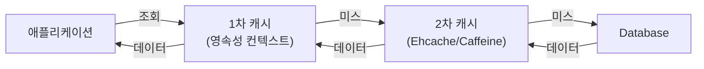
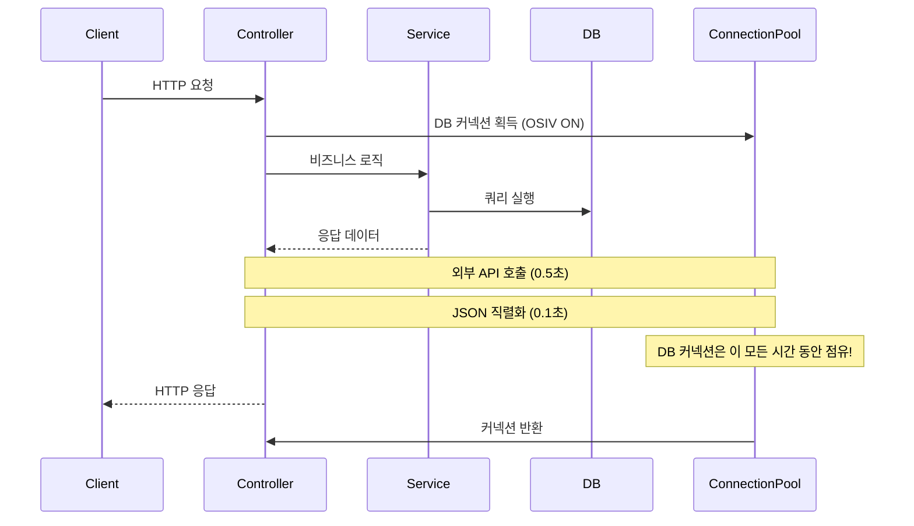
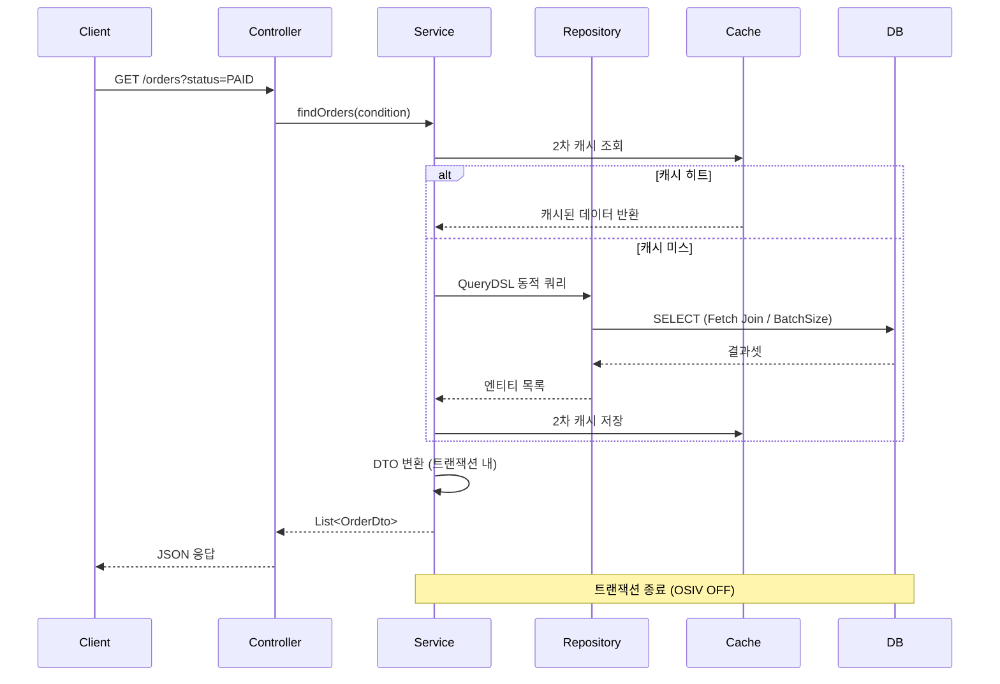
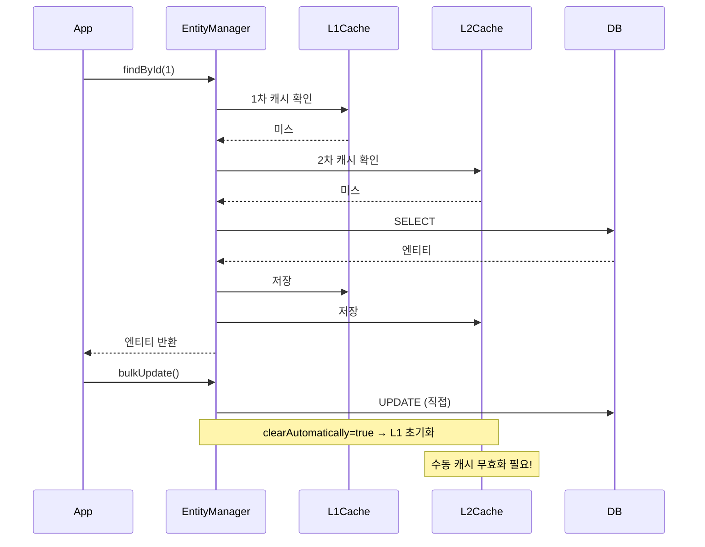

JPA는 편리하지만 잘못 쓰면 조용히 데이터베이스를 폭격합니다. 화면에 주문 목록 100건을 표시하는데 쿼리가 101번 나가고, 읽기 전용 API가 쓰기 전용 트랜잭션을 열며, OSIV가 켜진 채로 HTTP 응답을 반환하면서 DB 커넥션을 붙들고 있습니다. 이 포스트에서는 JPA 성능 문제의 근본 원인과 실전 해결책을 하나씩 해부합니다.

---

## 1. N+1 문제 — 조용한 성능 킬러

### 문제의 본질

N+1은 JPA가 연관 관계를 **필요한 시점에 하나씩** 불러오는 지연 로딩(Lazy Loading) 전략에서 비롯됩니다. 마치 도서관에서 책 100권의 목록을 가져온 뒤, 각 책의 저자 정보를 얻기 위해 책마다 도서관을 100번 더 방문하는 것과 같습니다.

```java
// 엔티티 구조
@Entity
public class Order {
    @Id @GeneratedValue
    private Long id;

    @ManyToOne(fetch = FetchType.LAZY) // 기본 전략
    private Member member;

    @OneToMany(mappedBy = "order", fetch = FetchType.LAZY)
    private List<OrderItem> orderItems;
}
```

```java
// N+1이 발생하는 코드
List<Order> orders = orderRepository.findAll(); // 쿼리 1번
for (Order order : orders) {
    // 각 주문마다 member 조회 쿼리 발생 → N번
    System.out.println(order.getMember().getName());
}
// 총 쿼리 수: 1 + N (주문이 100개면 101번)
```

실제 로그를 확인하면 이렇게 됩니다.

```sql
-- 1번: 전체 주문 조회
SELECT * FROM orders;

-- N번: 각 주문의 멤버 조회
SELECT * FROM member WHERE id = 1;
SELECT * FROM member WHERE id = 2;
SELECT * FROM member WHERE id = 3;
-- ...100번 반복
```

### 해결책 1 — Fetch Join

JPQL에서 `JOIN FETCH`를 사용하면 연관 엔티티를 한 번의 쿼리로 가져옵니다.

```java
// Repository
public interface OrderRepository extends JpaRepository<Order, Long> {

    @Query("SELECT o FROM Order o JOIN FETCH o.member")
    List<Order> findAllWithMember();

    // 컬렉션 Fetch Join — 중복 주의
    @Query("SELECT DISTINCT o FROM Order o JOIN FETCH o.orderItems")
    List<Order> findAllWithOrderItems();
}
```

생성되는 SQL:

```sql
SELECT DISTINCT o.*, m.*, oi.*
FROM orders o
INNER JOIN member m ON o.member_id = m.id
INNER JOIN order_item oi ON oi.order_id = o.id;
```

**Fetch Join의 한계:** 컬렉션을 2개 이상 `JOIN FETCH`하면 `MultipleBagFetchException`이 발생합니다. `List`를 `Set`으로 바꾸거나, 한 번에 하나씩 Fetch Join해야 합니다.

```java
// 잘못된 사용: 2개 컬렉션 동시 Fetch Join
@Query("SELECT o FROM Order o JOIN FETCH o.orderItems JOIN FETCH o.coupons")
List<Order> findAll(); // MultipleBagFetchException!

// 해결책 A: Set으로 변경
@OneToMany(mappedBy = "order")
private Set<OrderItem> orderItems; // List → Set

// 해결책 B: @BatchSize 적용 (아래에서 설명)
```

### 해결책 2 — @EntityGraph

어노테이션 기반으로 Fetch Join을 선언합니다. JPQL 없이 메서드 이름 쿼리와 함께 쓸 수 있습니다.

```java
public interface OrderRepository extends JpaRepository<Order, Long> {

    // attributePaths에 명시된 연관관계를 Eager 로딩
    @EntityGraph(attributePaths = {"member", "orderItems"})
    List<Order> findAll();

    // 조건과 함께 사용
    @EntityGraph(attributePaths = {"member"})
    List<Order> findByStatus(OrderStatus status);
}
```

내부적으로는 Fetch Join과 동일한 SQL을 생성합니다. 그러나 컬렉션 2개 동시 Fetch 시 동일한 `MultipleBagFetchException`이 발생합니다.

### 해결책 3 — @BatchSize (가장 실용적)

`@BatchSize`는 연관 엔티티를 **IN 절**로 묶어 조회합니다. N개의 쿼리를 `ceil(N/batchSize)`개로 줄여줍니다.

```java
@Entity
public class Order {
    @Id @GeneratedValue
    private Long id;

    @ManyToOne(fetch = FetchType.LAZY)
    private Member member;

    @BatchSize(size = 100) // 한 번에 100개씩 IN 절로 조회
    @OneToMany(mappedBy = "order", fetch = FetchType.LAZY)
    private List<OrderItem> orderItems;
}
```

생성 SQL:

```sql
SELECT * FROM orders;
-- orderItems를 100개씩 IN 절로 묶어 조회
SELECT * FROM order_item WHERE order_id IN (1, 2, 3, ..., 100);
```

전역 설정으로 적용하면 모든 연관관계에 일괄 적용됩니다.

```yaml
# application.yml
spring:
  jpa:
    properties:
      hibernate:
        default_batch_fetch_size: 100
```

**실전 권장:** `default_batch_fetch_size: 100`을 전역으로 걸고, 특별히 성능이 중요한 쿼리에만 Fetch Join을 적용하는 혼합 전략이 가장 효과적입니다.

---

## 2. QueryDSL 실전 — 타입 안전한 동적 쿼리

### 왜 QueryDSL인가

JPQL 문자열은 컴파일 시점에 오류를 잡을 수 없습니다. 컬럼명 오타, 잘못된 조인 — 모두 런타임에 터집니다. QueryDSL은 엔티티 구조에서 `Q 타입`을 생성해 **타입 안전한 쿼리**를 작성하게 해줍니다.

```java
// JPQL — 컴파일 시점 오류 불가
@Query("SELECT o FROM Order o WHERE o.stauts = :status") // 오타!
List<Order> findByStatus(OrderStatus status);

// QueryDSL — 컴파일 시점 오류 검출
QOrder order = QOrder.order;
queryFactory.selectFrom(order)
    .where(order.stauts.eq(status)) // 컴파일 오류 발생!
    .fetch();
```

### 설정

```groovy
// build.gradle
plugins {
    id "com.ewerk.gradle.plugins.querydsl" version "1.0.10"
}

dependencies {
    implementation "com.querydsl:querydsl-jpa:${queryDslVersion}"
    annotationProcessor "com.querydsl:querydsl-apt:${queryDslVersion}:jpa"
    annotationProcessor "jakarta.annotation:jakarta.annotation-api"
    annotationProcessor "jakarta.persistence:jakarta.persistence-api"
}
```

### 기본 쿼리 작성

```java
@Repository
@RequiredArgsConstructor
public class OrderQueryRepository {

    private final JPAQueryFactory queryFactory;

    public List<Order> findCompletedOrders(LocalDate from, LocalDate to) {
        QOrder order = QOrder.order;
        QMember member = QMember.member;

        return queryFactory
            .selectFrom(order)
            .join(order.member, member).fetchJoin()
            .where(
                order.status.eq(OrderStatus.COMPLETED),
                order.createdAt.between(from.atStartOfDay(), to.atTime(23, 59, 59))
            )
            .orderBy(order.createdAt.desc())
            .fetch();
    }
}
```

### 동적 쿼리 — BooleanExpression

동적 쿼리의 핵심은 조건이 없을 때 `null`을 반환해 `where` 절에서 자동으로 무시되게 하는 것입니다.

```java
@Repository
@RequiredArgsConstructor
public class OrderQueryRepository {

    private final JPAQueryFactory queryFactory;

    // 검색 조건 DTO
    public record OrderSearchCondition(
        String memberName,
        OrderStatus status,
        LocalDate fromDate,
        LocalDate toDate,
        Long minAmount
    ) {}

    public List<OrderDto> search(OrderSearchCondition condition) {
        QOrder order = QOrder.order;
        QMember member = QMember.member;

        return queryFactory
            .select(new QOrderDto(
                order.id,
                member.name,
                order.totalAmount,
                order.status,
                order.createdAt
            ))
            .from(order)
            .join(order.member, member)
            .where(
                memberNameContains(condition.memberName()),
                statusEq(condition.status()),
                dateRange(condition.fromDate(), condition.toDate()),
                minAmountGoe(condition.minAmount())
            )
            .orderBy(order.createdAt.desc())
            .fetch();
    }

    // null을 반환하면 where에서 자동 무시
    private BooleanExpression memberNameContains(String name) {
        return StringUtils.hasText(name)
            ? QMember.member.name.contains(name)
            : null;
    }

    private BooleanExpression statusEq(OrderStatus status) {
        return status != null ? QOrder.order.status.eq(status) : null;
    }

    private BooleanExpression dateRange(LocalDate from, LocalDate to) {
        if (from == null && to == null) return null;
        if (from == null) return QOrder.order.createdAt.loe(to.atTime(23, 59, 59));
        if (to == null) return QOrder.order.createdAt.goe(from.atStartOfDay());
        return QOrder.order.createdAt.between(from.atStartOfDay(), to.atTime(23, 59, 59));
    }

    private BooleanExpression minAmountGoe(Long minAmount) {
        return minAmount != null ? QOrder.order.totalAmount.goe(minAmount) : null;
    }
}
```

**BooleanExpression 조합:** 여러 조건을 `and()`, `or()`로 묶을 수 있습니다.

```java
// 두 조건을 합쳐서 재사용 가능한 표현식 생성
private BooleanExpression isActiveVip(String name, Long minAmount) {
    return memberNameContains(name).and(minAmountGoe(minAmount));
}
```

### Projection — DTO 직접 조회

엔티티 전체를 가져오지 않고 필요한 컬럼만 DTO로 받으면 성능이 향상됩니다.

```java
// @QueryProjection — 컴파일 타임 타입 체크
@QueryProjection
public record OrderDto(
    Long orderId,
    String memberName,
    Long totalAmount,
    OrderStatus status,
    LocalDateTime createdAt
) {}

// 사용
queryFactory
    .select(new QOrderDto(
        order.id,
        member.name,
        order.totalAmount,
        order.status,
        order.createdAt
    ))
    .from(order)
    .join(order.member, member)
    .fetch();
```

### 페이지네이션 with QueryDSL

```java
public Page<OrderDto> searchPage(OrderSearchCondition condition, Pageable pageable) {
    QOrder order = QOrder.order;
    QMember member = QMember.member;

    List<OrderDto> content = queryFactory
        .select(new QOrderDto(order.id, member.name, order.totalAmount, order.status, order.createdAt))
        .from(order)
        .join(order.member, member)
        .where(statusEq(condition.status()))
        .orderBy(order.createdAt.desc())
        .offset(pageable.getOffset())
        .limit(pageable.getPageSize())
        .fetch();

    // Count 쿼리 분리 — 불필요한 JOIN 제거
    JPAQuery<Long> countQuery = queryFactory
        .select(order.count())
        .from(order)
        .where(statusEq(condition.status()));

    // count 쿼리 최적화: 마지막 페이지라면 count 쿼리 생략
    return PageableExecutionUtils.getPage(content, pageable, countQuery::fetchOne);
}
```

---

## 3. 벌크 연산 — 영속성 컨텍스트 함정

### 벌크 연산이란

JPA로 수천 개 엔티티를 하나씩 `save()`하면 수천 번의 INSERT/UPDATE가 발생합니다. 벌크 연산은 단 한 번의 SQL로 다수의 레코드를 처리합니다.

```java
// Bad: 엔티티를 하나씩 수정 — N번 UPDATE
List<Member> vipMembers = memberRepository.findByGrade(Grade.VIP);
for (Member member : vipMembers) {
    member.addPoints(1000); // 변경 감지 → flush 시 UPDATE
}
// VIP 회원이 10,000명이면 10,000번 UPDATE 발생
```

```java
// Good: 벌크 연산 — 단 1번 UPDATE
@Modifying
@Query("UPDATE Member m SET m.points = m.points + 1000 WHERE m.grade = :grade")
int addPointsByGrade(@Param("grade") Grade grade);
```

### 영속성 컨텍스트 주의사항

벌크 연산은 **영속성 컨텍스트를 거치지 않고** 직접 DB에 반영됩니다. 이로 인해 영속성 컨텍스트와 DB 사이에 데이터 불일치가 발생합니다.

```java
// 위험한 코드
Member member = memberRepository.findById(1L).get();
System.out.println(member.getPoints()); // 500

// 벌크 연산: DB는 1500으로 업데이트
memberRepository.addPointsByGrade(Grade.VIP);

// 영속성 컨텍스트는 여전히 500을 갖고 있음!
System.out.println(member.getPoints()); // 500 (잘못된 값)
```

해결책은 두 가지입니다.

```java
// 해결책 1: @Modifying(clearAutomatically = true)
// 벌크 연산 후 영속성 컨텍스트 자동 초기화
@Modifying(clearAutomatically = true, flushAutomatically = true)
@Query("UPDATE Member m SET m.points = m.points + 1000 WHERE m.grade = :grade")
int addPointsByGrade(@Param("grade") Grade grade);

// 해결책 2: 수동으로 EntityManager.clear() 호출
@Transactional
public void bulkUpdatePoints() {
    memberRepository.addPointsByGrade(Grade.VIP);
    entityManager.clear(); // 영속성 컨텍스트 초기화
    // 이후 조회는 DB에서 새로 읽어옴
    Member member = memberRepository.findById(1L).get();
    System.out.println(member.getPoints()); // 1500 (정확한 값)
}
```

### QueryDSL로 벌크 연산

```java
// QueryDSL UPDATE
public long deactivateOldMembers(LocalDateTime cutoffDate) {
    QMember member = QMember.member;
    return queryFactory
        .update(member)
        .set(member.active, false)
        .set(member.deactivatedAt, LocalDateTime.now())
        .where(member.lastLoginAt.lt(cutoffDate))
        .execute();
}

// QueryDSL DELETE
public long deleteExpiredTokens(LocalDateTime expiredBefore) {
    QRefreshToken token = QRefreshToken.refreshToken;
    return queryFactory
        .delete(token)
        .where(token.expiresAt.lt(expiredBefore))
        .execute();
}
```

---

## 4. 읽기 전용 쿼리 최적화

### @QueryHints로 읽기 전용 선언

Hibernate는 기본적으로 조회한 엔티티의 **스냅샷**을 만들어 변경 감지에 사용합니다. 읽기만 할 것이라면 이 스냅샷 생성을 건너뛸 수 있습니다.

```java
public interface MemberRepository extends JpaRepository<Member, Long> {

    @QueryHints(value = @QueryHint(
        name = "org.hibernate.readOnly",
        value = "true"
    ))
    @Query("SELECT m FROM Member m WHERE m.grade = :grade")
    List<Member> findReadOnlyByGrade(@Param("grade") Grade grade);
}
```

### @Transactional(readOnly = true) — 반드시 걸어야 하는 이유

```java
@Service
public class MemberQueryService {

    // readOnly = true의 효과:
    // 1. 영속성 컨텍스트 flush 모드를 NEVER로 설정 → flush 생략
    // 2. 변경 감지(Dirty Checking) 스냅샷 생성 생략 → 메모리 절약
    // 3. DB 드라이버에 읽기 전용 힌트 전달 → 읽기 전용 DB 라우팅 가능
    @Transactional(readOnly = true)
    public List<MemberDto> findAllMembers() {
        return memberRepository.findAll().stream()
            .map(MemberDto::from)
            .collect(Collectors.toList());
    }
}
```

**읽기/쓰기 DB 분리 환경에서의 효과:**

```java
// DataSource 라우팅 설정
public class ReadWriteDataSourceRouter extends AbstractRoutingDataSource {
    @Override
    protected Object determineCurrentLookupKey() {
        // readOnly = true 트랜잭션이면 REPLICA, 아니면 PRIMARY
        return TransactionSynchronizationManager.isCurrentTransactionReadOnly()
            ? "REPLICA"
            : "PRIMARY";
    }
}
```

---

## 5. 2차 캐시 — Ehcache/Caffeine 연동

### 1차 vs 2차 캐시

1차 캐시는 **영속성 컨텍스트(트랜잭션 범위)** 의 캐시입니다. 트랜잭션이 끝나면 사라집니다. 2차 캐시는 **애플리케이션 전체** 에서 공유되는 캐시입니다. JVM이 살아있는 동안 유지됩니다.



### Caffeine 캐시 연동

```yaml
# application.yml
spring:
  jpa:
    properties:
      hibernate:
        cache:
          use_second_level_cache: true
          use_query_cache: true
          region:
            factory_class: org.hibernate.cache.jcache.JCacheCacheRegionFactory
```

```java
// 엔티티에 캐시 적용
@Entity
@Cache(usage = CacheConcurrencyStrategy.READ_WRITE)
public class Category {
    @Id @GeneratedValue
    private Long id;
    private String name;

    @OneToMany(mappedBy = "category")
    @Cache(usage = CacheConcurrencyStrategy.READ_WRITE) // 컬렉션도 캐시 가능
    private List<Product> products;
}
```

```java
// 쿼리 캐시 적용
public interface CategoryRepository extends JpaRepository<Category, Long> {

    @QueryHints(value = {
        @QueryHint(name = "org.hibernate.cacheable", value = "true"),
        @QueryHint(name = "org.hibernate.cacheRegion", value = "category.findAll")
    })
    List<Category> findAll();
}
```

**주의:** 쓰기가 잦은 엔티티에 2차 캐시를 적용하면 캐시 무효화 비용이 성능 이점을 압도합니다. **자주 읽히고 거의 변하지 않는 데이터**(공통 코드, 카테고리, 설정값)에만 적용하세요.

---

## 6. OSIV — 왜 끄는 게 답인가

### OSIV란

Open Session In View. Spring MVC에서 HTTP 요청이 들어오면 영속성 컨텍스트를 열고, **HTTP 응답이 나갈 때까지** 유지하는 패턴입니다.

```
HTTP 요청 → [영속성 컨텍스트 열림] → Controller → Service → Repository → View/Response → [영속성 컨텍스트 닫힘]
```

**장점:** 지연 로딩을 Controller나 View에서도 자유롭게 사용할 수 있습니다.

**단점:** 이것이 문제입니다.



OSIV가 켜져 있으면 DB 커넥션을 **외부 API 호출 시간, JSON 직렬화 시간까지 포함해** 붙들고 있습니다. 트래픽이 몰리면 커넥션 풀이 고갈됩니다.

### OSIV 끄기

```yaml
# application.yml
spring:
  jpa:
    open-in-view: false  # 기본값 true를 끔 (경고 로그 제거)
```

OSIV를 끄면 영속성 컨텍스트는 `@Transactional` 범위 안에서만 유지됩니다. Service를 벗어나면 지연 로딩이 불가능합니다.

```java
// OSIV OFF 환경에서의 올바른 패턴
@Service
@RequiredArgsConstructor
public class OrderService {

    private final OrderRepository orderRepository;

    // 트랜잭션 내에서 모든 데이터를 DTO로 변환
    @Transactional(readOnly = true)
    public OrderDetailDto getOrderDetail(Long orderId) {
        Order order = orderRepository.findWithMemberAndItems(orderId)
            .orElseThrow(() -> new OrderNotFoundException(orderId));

        // 트랜잭션 내에서 DTO 변환 완료
        return OrderDetailDto.from(order);
        // 여기서 트랜잭션 종료 → 이후 Controller에서 지연 로딩 없음
    }
}
```

**Command/Query 분리 패턴(CQRS-Lite) 적용:**

```java
// OrderCommandService: 쓰기 전용 (OSIV와 무관)
@Service
@Transactional
public class OrderCommandService { ... }

// OrderQueryService: 읽기 전용 DTO 반환
@Service
@Transactional(readOnly = true)
public class OrderQueryService {
    // 모든 메서드는 트랜잭션 내에서 DTO 변환까지 완료
    public OrderDetailDto findDetail(Long id) { ... }
    public Page<OrderListDto> findList(Pageable pageable) { ... }
}
```

---

## 7. 페이지네이션 — Offset vs Cursor/Keyset

### Offset 페이지네이션의 함정

```java
// Offset 방식
SELECT * FROM orders ORDER BY created_at DESC LIMIT 20 OFFSET 10000;
```

`OFFSET 10000`은 DB가 10,000개 행을 읽고 버린 뒤 20개를 반환합니다. 페이지가 뒤로 갈수록 성능이 선형으로 나빠집니다. 1억 건 테이블에서 마지막 페이지를 요청하면 1억 건을 스캔합니다.

### Keyset(Cursor) 페이지네이션

마지막으로 읽은 레코드의 키를 기준으로 `WHERE` 절을 사용합니다. 항상 인덱스 범위 스캔으로 처리됩니다.

```java
// Keyset 페이지네이션 Repository
public interface OrderRepository extends JpaRepository<Order, Long> {

    // 마지막으로 읽은 ID 이후의 데이터를 가져옴
    @Query("SELECT o FROM Order o WHERE o.id < :lastId ORDER BY o.id DESC")
    List<Order> findNextPage(@Param("lastId") Long lastId, Pageable pageable);
}

// Service에서 사용
@Transactional(readOnly = true)
public CursorPageResult<OrderDto> findOrdersAfter(Long cursorId, int size) {
    Pageable pageable = PageRequest.of(0, size + 1); // size+1개 조회
    List<Order> orders = orderRepository.findNextPage(cursorId, pageable);

    boolean hasNext = orders.size() > size;
    if (hasNext) {
        orders = orders.subList(0, size); // 마지막 1개 제거
    }

    Long nextCursor = hasNext ? orders.get(orders.size() - 1).getId() : null;

    return new CursorPageResult<>(
        orders.stream().map(OrderDto::from).collect(Collectors.toList()),
        nextCursor,
        hasNext
    );
}
```

**언제 어떤 방법을 쓸 것인가:**

| 구분 | Offset | Keyset/Cursor |
|---|---|---|
| 임의 페이지 이동 | 가능 | 불가능 |
| 대용량 데이터 | 성능 저하 | 일정 성능 유지 |
| 구현 복잡도 | 단순 | 복잡 |
| 사용 예 | 관리자 페이지 | 무한 스크롤, 피드 |

---

## 극한 시나리오 3가지

### 시나리오 1: 페이징 + Fetch Join = MultipleBagFetchException + 카테시안 곱

```java
// 이 코드는 두 가지 문제를 동시에 가짐
@Query("SELECT o FROM Order o JOIN FETCH o.orderItems JOIN FETCH o.coupons")
Page<Order> findAll(Pageable pageable);
```

**문제 1:** `orderItems`와 `coupons` 두 컬렉션을 동시에 Fetch Join하면 `MultipleBagFetchException`.

**문제 2:** 컬렉션 Fetch Join + Paging을 함께 쓰면 Hibernate가 메모리에서 페이징합니다. `HHH90003004: firstResult/maxResults specified with collection fetch; applying in memory!` 경고가 뜨면서 **전체 데이터를 메모리에 올린 뒤** 자름.

**해결책:** ToOne 관계만 Fetch Join으로 페이징하고, 컬렉션은 `@BatchSize`로 처리합니다.

```java
// 안전한 패턴
@Query("SELECT o FROM Order o JOIN FETCH o.member") // ToOne만 Fetch Join
Page<Order> findAllWithMember(Pageable pageable);
// orderItems는 @BatchSize(size=100)으로 IN 절 처리
```

### 시나리오 2: 벌크 연산 후 2차 캐시 불일치

벌크 연산으로 DB를 직접 수정했을 때 2차 캐시가 무효화되지 않으면 오래된 데이터가 계속 반환됩니다.

```java
@Modifying(clearAutomatically = true)
@Query("UPDATE Member m SET m.grade = 'VIP' WHERE m.totalPurchase >= 1000000")
int upgradeToVip();
// clearAutomatically: 1차 캐시는 지워짐
// 하지만 2차 캐시(Ehcache)는 여전히 이전 grade 값을 갖고 있음!
```

**해결책:** 벌크 연산 후 2차 캐시를 명시적으로 무효화합니다.

```java
@Autowired
private Cache memberCache; // Ehcache/Caffeine Cache

@Transactional
public void upgradeVipMembers() {
    memberRepository.upgradeToVip();
    entityManager.clear();
    memberCache.clear(); // 2차 캐시 전체 무효화
}
```

### 시나리오 3: OSIV 끄고 나서 LazyInitializationException 폭발

OSIV를 끄자마자 프로덕션에서 `LazyInitializationException: could not initialize proxy` 에러가 쏟아지는 상황. 원인은 Service에서 엔티티를 반환하고 Controller에서 지연 로딩을 시도하는 코드가 전체에 산재해 있기 때문입니다.

```java
// 문제: Service가 엔티티를 그대로 반환
@Transactional(readOnly = true)
public Order getOrder(Long id) {
    return orderRepository.findById(id).get(); // 엔티티 반환
}

// Controller에서 지연 로딩 시도 — OSIV OFF면 예외
@GetMapping("/orders/{id}")
public OrderResponse getOrder(@PathVariable Long id) {
    Order order = orderService.getOrder(id);
    return new OrderResponse(order.getMember().getName()); // LazyInitializationException!
}
```

**해결책:** OSIV를 끄기 전, Service 계층이 항상 DTO를 반환하도록 리팩토링합니다. 점진적 마이그레이션이 필요하다면 OSIV를 유지하되 커넥션 풀 크기를 늘리는 임시 조치를 먼저 적용합니다.

---

## 실무 실수 Top 5

**1. 양방향 연관관계에서 연관관계 편의 메서드 누락**

```java
// 잘못된 패턴
order.getOrderItems().add(item); // Order에만 추가
// item.setOrder(order) 누락 → DB에는 order_id가 NULL

// 올바른 패턴 — 편의 메서드
public void addOrderItem(OrderItem item) {
    this.orderItems.add(item);
    item.setOrder(this); // 양쪽 동시 설정
}
```

**2. @Transactional이 없는 Service에서 변경 감지 기대**

`@Transactional`이 없으면 영속성 컨텍스트가 없고, 변경 감지도 없습니다. 엔티티를 수정해도 DB에 반영되지 않습니다. 조회 메서드에는 `readOnly = true`, 쓰기 메서드에는 `@Transactional`을 반드시 붙이세요.

**3. toString()에서 지연 로딩 트리거**

Lombok의 `@ToString`은 모든 필드를 포함합니다. 연관관계 필드가 포함되면 로그를 찍을 때마다 N+1이 발생합니다.

```java
@Entity
@ToString(exclude = {"orderItems", "member"}) // 연관관계 필드 제외
public class Order { ... }
```

**4. save() 후 flush() 없이 벌크 연산 실행**

```java
orderRepository.save(newOrder); // 1차 캐시에만 존재
orderRepository.bulkUpdateStatus(); // DB에는 newOrder 없음 → 잘못된 결과

// 해결: flush 후 벌크 연산
orderRepository.saveAndFlush(newOrder);
orderRepository.bulkUpdateStatus();
```

**5. count 쿼리에도 Fetch Join 적용**

Spring Data의 `Page<T>` 반환 시 자동으로 count 쿼리가 날아갑니다. 이때 불필요한 JOIN이 포함되면 성능이 저하됩니다.

```java
// 잘못된 패턴: countQuery에도 JOIN FETCH 포함
@Query("SELECT o FROM Order o JOIN FETCH o.member WHERE o.status = :status")
Page<Order> findByStatus(@Param("status") OrderStatus status, Pageable pageable);

// 올바른 패턴: countQuery 분리
@Query(
    value = "SELECT o FROM Order o JOIN FETCH o.member WHERE o.status = :status",
    countQuery = "SELECT COUNT(o) FROM Order o WHERE o.status = :status"
)
Page<Order> findByStatus(@Param("status") OrderStatus status, Pageable pageable);
```

---

## 면접 포인트 5가지

### Q1. N+1 문제를 해결하는 방법 3가지와 각각의 트레이드오프는?

**Fetch Join:** 한 번의 쿼리로 해결. 단, 컬렉션 2개 이상 동시 적용 불가, 페이징과 함께 쓰면 메모리 페이징 발생.

**@EntityGraph:** Fetch Join의 어노테이션 버전. 간결하지만 동일한 한계.

**@BatchSize:** IN 절로 묶어 쿼리 수를 줄임. 컬렉션 여러 개에 동시 적용 가능, 페이징과도 안전하게 사용 가능. 다만 완전한 단일 쿼리가 아님.

**실무 권장:** `default_batch_fetch_size: 100`을 전역으로 설정하고, 성능 임계 API에만 Fetch Join을 추가 적용하는 혼합 전략.

### Q2. OSIV를 꺼야 하는 이유와 끄면 발생하는 문제 해결 방법은?

OSIV가 켜져 있으면 DB 커넥션을 View 렌더링이나 외부 API 호출 시간까지 점유합니다. 트래픽이 몰리면 커넥션 풀 고갈로 이어집니다. 끄면 `LazyInitializationException`이 발생할 수 있는데, Service 계층에서 트랜잭션 내에 DTO 변환을 완료하는 패턴으로 해결합니다. Command/Query 서비스를 분리하고 Query 서비스는 항상 DTO를 반환하도록 설계합니다.

### Q3. 벌크 연산 후 반드시 해야 할 것은?

`@Modifying(clearAutomatically = true)`로 1차 캐시를 초기화하거나 `entityManager.clear()`를 수동으로 호출해야 합니다. 2차 캐시를 사용 중이라면 해당 캐시도 함께 무효화해야 합니다. 그렇지 않으면 영속성 컨텍스트나 캐시가 이전 데이터를 반환합니다.

### Q4. QueryDSL에서 BooleanExpression이 null을 반환하면 어떻게 되는가?

QueryDSL의 `where()` 절은 `null`이 전달되면 해당 조건을 무시합니다. 이 특성을 이용해 동적 쿼리를 구현합니다. 조건이 없으면 `null`을 반환하는 메서드를 만들고, `where(조건1, 조건2, 조건3)`처럼 나열하면 null이 아닌 조건만 AND로 연결됩니다.

### Q5. 1차 캐시와 2차 캐시의 차이 및 2차 캐시가 위험한 이유는?

1차 캐시는 트랜잭션(영속성 컨텍스트) 범위입니다. 트랜잭션이 끝나면 사라지므로 항상 최신 데이터를 보장합니다. 2차 캐시는 JVM 전체에서 공유됩니다. 쓰기가 발생하면 캐시를 무효화해야 하는데, 벌크 연산이나 외부 시스템이 DB를 직접 변경하면 캐시가 무효화되지 않아 오래된 데이터가 반환됩니다. 자주 변경되는 엔티티에는 적용하지 말고, 쓰기가 거의 없는 마스터 데이터에만 사용하세요.

---

## JPA 성능 최적화 흐름 한눈에 보기





---

JPA 성능 최적화의 핵심은 "얼마나 많은 쿼리가 나가는가"를 항상 인식하는 것입니다. `spring.jpa.show-sql: true`와 `p6spy` 같은 쿼리 로깅 도구를 개발 환경에서 반드시 활성화하고, 쿼리 수가 예상과 다르면 즉시 원인을 찾아야 합니다. 성능 문제는 항상 프로덕션이 아닌 개발 단계에서 발견하는 것이 원칙입니다.
