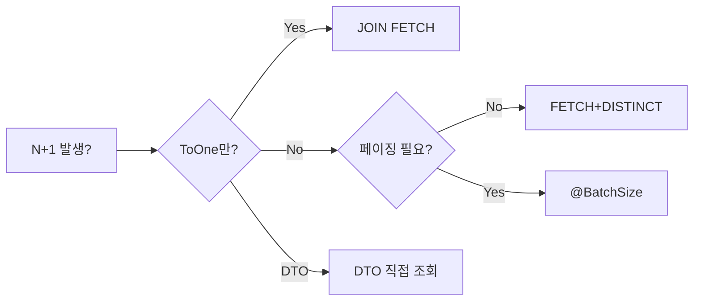
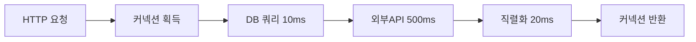
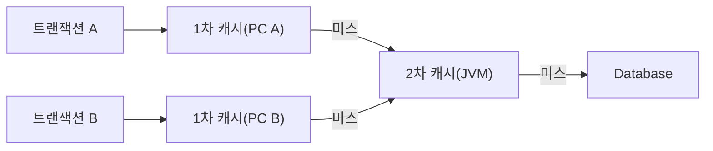
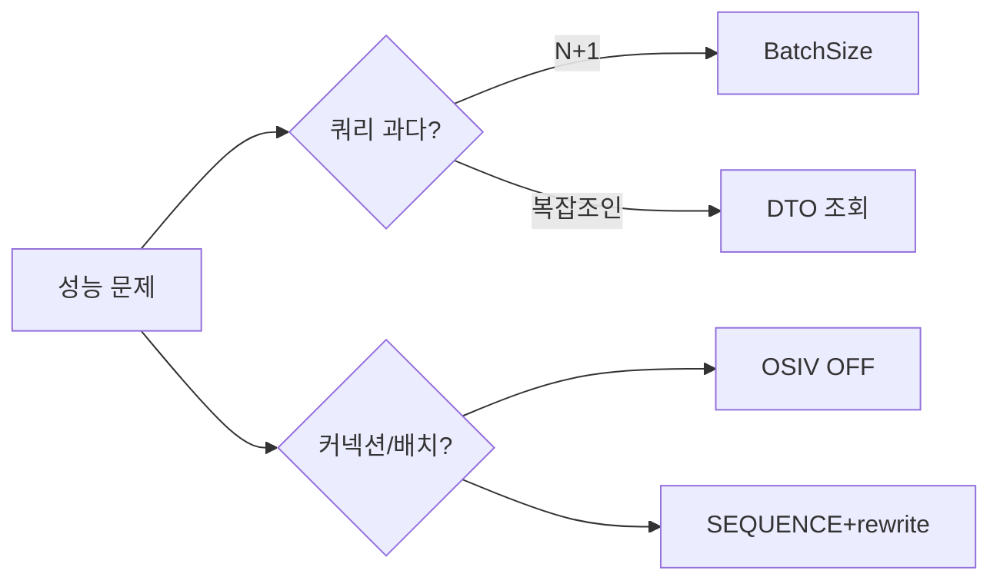

JPA는 편리한 추상화지만 그 추상화 아래에서 어떤 일이 벌어지는지 모르면 조용히 데이터베이스를 폭격합니다. 주문 목록 100건에 쿼리 101번, 읽기 API가 더티 체킹 스냅샷을 만들고, IDENTITY 전략이 배치 INSERT를 무력화하고, 2차 캐시가 벌크 연산 직후 낡은 데이터를 돌려줍니다. 이 글은 각 문제의 **왜(WHY)**를 내부 메커니즘 수준에서 해부하고, 현장에서 검증된 해결책을 제시합니다.

---

## 1. N+1 문제 — 완전 방지 체크리스트

### 왜 발생하는가 — Hibernate 프록시 내부 동작

Hibernate는 `@ManyToOne(fetch = LAZY)`로 선언된 연관 객체를 즉시 조회하지 않고 **ByteBuddy(또는 cglib)로 생성한 프록시**로 대체합니다. 프록시는 실제 필드에 접근하는 순간 `LazyInitializer.initialize()`를 호출해 별도 SELECT를 실행합니다. 컬렉션(`@OneToMany`)은 `PersistentBag` 같은 래퍼가 `iterator()` 또는 `size()` 호출 시점에 SQL을 날립니다.

```java
@Entity
public class Order {
    @Id @GeneratedValue(strategy = GenerationType.IDENTITY)
    private Long id;

    @ManyToOne(fetch = FetchType.LAZY)   // 프록시 생성 대상
    @JoinColumn(name = "member_id")
    private Member member;

    @OneToMany(mappedBy = "order", fetch = FetchType.LAZY)
    private List<OrderItem> orderItems;  // PersistentBag 래퍼
}
```

```java
// N+1이 발생하는 코드 — 100개 주문 조회 시 101번 쿼리
List<Order> orders = orderRepository.findAll();      // 쿼리 1회
for (Order order : orders) {
    // 이 줄에서 LazyInitializer.initialize() 호출 → 쿼리 N회
    log.info(order.getMember().getName());
}
```

```sql
-- 실제 발생 SQL
SELECT * FROM orders;                        -- 1번
SELECT * FROM member WHERE id = 1;           -- 프록시 초기화
SELECT * FROM member WHERE id = 2;
-- ... 주문 건수만큼 반복 (N번)
```

### 해결책 1 — JOIN FETCH (즉시 로딩, 단일 쿼리)

```java
public interface OrderRepository extends JpaRepository<Order, Long> {

    // ToOne 관계: JOIN FETCH 안전
    @Query("SELECT o FROM Order o JOIN FETCH o.member WHERE o.status = :status")
    List<Order> findWithMemberByStatus(@Param("status") OrderStatus status);

    // 컬렉션 JOIN FETCH: DISTINCT 필수 (카테시안 곱 중복 제거)
    @Query("SELECT DISTINCT o FROM Order o JOIN FETCH o.orderItems")
    List<Order> findWithOrderItems();
}
```

**왜 DISTINCT가 필요한가:** JOIN FETCH로 컬렉션을 가져오면 SQL 결과는 `(주문 수) × (아이템 수)` 행이 됩니다. 주문 1개에 아이템 3개면 같은 Order 행이 3번 나옵니다. JPQL `DISTINCT`는 SQL에도 DISTINCT를 붙이지만, 더 중요하게는 **Hibernate 결과 세트에서 엔티티 중복을 제거**합니다.

**컬렉션 2개 동시 JOIN FETCH는 금지:**

```java
// MultipleBagFetchException 발생
@Query("SELECT o FROM Order o JOIN FETCH o.orderItems JOIN FETCH o.coupons")
List<Order> findAll();  // 두 List 컬렉션 동시 Fetch 불가
```

Hibernate가 `List` 타입 두 개를 동시에 Fetch하면 어떤 행이 어느 컬렉션 소속인지 추적할 `Bag`이 충돌합니다. `Set`으로 바꾸면 회피 가능하지만 순서 보장이 사라집니다. **현실적 해결책은 @BatchSize입니다.**

### 해결책 2 — @BatchSize (IN 절 묶음, 가장 실용적)

```java
@Entity
public class Order {
    @Id @GeneratedValue
    private Long id;

    @ManyToOne(fetch = FetchType.LAZY)
    private Member member;

    @BatchSize(size = 100)  // IN 절로 최대 100개씩 묶어 조회
    @OneToMany(mappedBy = "order", fetch = FetchType.LAZY)
    private List<OrderItem> orderItems;
}
```

```sql
-- 주문 200개 조회 후 orderItems 접근 시 발생 SQL (batchSize=100)
SELECT * FROM orders;
-- N번 대신 2번으로 줄어듦
SELECT * FROM order_item WHERE order_id IN (1,2,3,...,100);
SELECT * FROM order_item WHERE order_id IN (101,102,...,200);
```

전역 설정으로 한 번에 적용:

```yaml
# application.yml
spring:
  jpa:
    properties:
      hibernate:
        default_batch_fetch_size: 100
```

**왜 100이 적절한가:** IN 절 파라미터 수가 너무 적으면 쿼리 횟수가 많고, 너무 많으면 DB 파라미터 파싱 비용과 네트워크 페이로드가 커집니다. 100~500이 일반적인 스위트 스팟이며, Oracle은 IN 절 최대 1000개 제한이 있습니다.

### 해결책 3 — @Fetch(SUBSELECT)

```java
@OneToMany(mappedBy = "order", fetch = FetchType.LAZY)
@Fetch(FetchMode.SUBSELECT)  // 서브쿼리로 한 번에 조회
private List<OrderItem> orderItems;
```

```sql
-- 생성 SQL: 서브쿼리로 전체 order_id를 한 번에 조회
SELECT * FROM order_item
WHERE order_id IN (SELECT id FROM orders WHERE ...);
```

SUBSELECT는 IN 절과 달리 파라미터 개수 제한이 없지만, 원본 쿼리가 복잡할수록 서브쿼리도 복잡해지고 쿼리 플랜 재사용이 어렵습니다.

### 해결책 4 — @EntityGraph

```java
public interface OrderRepository extends JpaRepository<Order, Long> {

    @EntityGraph(attributePaths = {"member", "member.address"})
    List<Order> findByStatus(OrderStatus status);

    // 네임드 EntityGraph
    @EntityGraph("Order.withMemberAndItems")
    Page<Order> findAll(Pageable pageable);
}

@Entity
@NamedEntityGraph(
    name = "Order.withMemberAndItems",
    attributeNodes = {
        @NamedAttributeNode("member"),
        @NamedAttributeNode(value = "orderItems", subgraph = "items")
    },
    subgraphs = @NamedSubgraph(name = "items", attributeNodes = @NamedAttributeNode("product"))
)
public class Order { ... }
```

EntityGraph는 내부적으로 JOIN FETCH와 동일한 SQL을 생성합니다. 차이는 JPQL 없이 메서드 이름 쿼리에 적용 가능하다는 점입니다.

### N+1 방지 의사결정 트리



### DTO 직접 조회 — 엔티티를 아예 안 만드는 방법

엔티티를 조회하면 Hibernate는 1차 캐시 등록, 스냅샷 생성, 프록시 연결 등 부가 작업을 수행합니다. 읽기 전용 API에서 이 오버헤드가 불필요하다면 DTO를 직접 조회하세요.

```java
// JPQL Constructor Expression
@Query("""
    SELECT new com.example.dto.OrderSummaryDto(
        o.id, m.name, o.totalAmount, o.status, o.createdAt
    )
    FROM Order o JOIN o.member m
    WHERE o.status = :status
    """)
List<OrderSummaryDto> findSummaryByStatus(@Param("status") OrderStatus status);
```

---

## 2. 배치 INSERT/UPDATE — JDBC Batch의 내부와 함정

### JDBC Batch가 빠른 이유

JDBC `addBatch()` / `executeBatch()`는 여러 SQL을 **하나의 네트워크 패킷**에 묶어 전송합니다. 개별 `executeUpdate()` 100번은 TCP 왕복 100번이지만, 배치는 1번입니다. MySQL의 경우 `rewriteBatchedStatements=true` 옵션을 추가하면 드라이버가 INSERT 100개를 단일 `INSERT INTO ... VALUES (...), (...), ...` 구문으로 재작성합니다. 이 차이가 수십 배 성능 차이를 만듭니다.

```yaml
# application.yml — MySQL 배치 활성화
spring:
  datasource:
    url: jdbc:mysql://localhost:3306/mydb?rewriteBatchedStatements=true&profileSQL=false
  jpa:
    properties:
      hibernate:
        jdbc:
          batch_size: 50          # 한 배치에 묶을 SQL 수
          order_inserts: true     # 같은 테이블 INSERT를 모아서 실행
          order_updates: true     # 같은 테이블 UPDATE를 모아서 실행
        cache:
          use_query_cache: false
```

### IDENTITY 전략이 배치를 망가뜨리는 이유

```java
// IDENTITY 전략 — 배치 INSERT 불가
@Entity
public class Order {
    @Id
    @GeneratedValue(strategy = GenerationType.IDENTITY)  // AUTO_INCREMENT
    private Long id;
}
```

**왜 IDENTITY는 배치가 안 되는가:** Hibernate는 엔티티를 저장할 때 영속성 컨텍스트에 등록하기 위해 **INSERT 직후 생성된 ID**가 필요합니다. IDENTITY 전략은 DB의 AUTO_INCREMENT가 ID를 생성하므로 INSERT 실행 전에는 ID를 알 수 없습니다. 따라서 Hibernate는 엔티티마다 즉시 INSERT를 실행하고 `getGeneratedKeys()`로 ID를 가져와야 합니다. 결과적으로 `executeBatch()`를 사용할 수 없게 됩니다.

```java
// SEQUENCE 전략 — 배치 INSERT 가능
@Entity
public class Order {
    @Id
    @GeneratedValue(strategy = GenerationType.SEQUENCE, generator = "order_seq")
    @SequenceGenerator(
        name = "order_seq",
        sequenceName = "order_sequence",
        allocationSize = 50    // DB 시퀀스를 50씩 미리 가져와 메모리에서 할당
    )
    private Long id;
}
```

SEQUENCE 전략은 `allocationSize`만큼 시퀀스를 미리 가져와 메모리에서 ID를 할당합니다. INSERT 전에 ID를 알 수 있으므로 배치가 가능합니다. `allocationSize=50`이면 시퀀스 조회 1번으로 50개 엔티티 ID를 확보합니다.

**TABLE 전략은 더 나쁩니다:** 별도의 키 테이블에 SELECT/UPDATE 락을 걸어 ID를 발급합니다. 동시성이 높은 환경에서 병목이 됩니다. 실무에서는 SEQUENCE(PostgreSQL, Oracle) 또는 UUID v7 / Snowflake ID(MySQL)를 사용합니다.

### 배치 저장 실전 패턴

```java
@Service
@RequiredArgsConstructor
public class OrderBatchService {

    private final EntityManager em;
    private static final int BATCH_SIZE = 50;

    @Transactional
    public void saveOrdersInBatch(List<Order> orders) {
        for (int i = 0; i < orders.size(); i++) {
            em.persist(orders.get(i));

            // BATCH_SIZE마다 flush + clear
            if (i % BATCH_SIZE == 0 && i > 0) {
                em.flush();   // SQL 배치 전송
                em.clear();   // 1차 캐시 비우기 → OutOfMemoryError 방지
            }
        }
        em.flush(); // 나머지 처리
    }
}
```

**왜 flush + clear 패턴이 필요한가:** `em.persist()`는 엔티티를 1차 캐시에 누적합니다. 1만 개를 flush 없이 persist하면 1만 개 엔티티와 스냅샷이 모두 힙에 쌓입니다. `BATCH_SIZE`마다 flush로 SQL을 내보내고 clear로 1차 캐시를 비워야 메모리가 일정하게 유지됩니다.

```java
// Spring Data JPA saveAll()은 내부적으로 loop save()
// IDENTITY 전략이면 배치 미적용 → SEQUENCE로 바꾸거나 직접 EntityManager 사용
orderRepository.saveAll(orders);  // IDENTITY 전략이면 N번 INSERT 개별 실행
```

---

## 3. 커넥션 풀 — HikariCP 사이징 공식

### 왜 커넥션을 많이 열면 오히려 느려지는가

커넥션 풀을 크게 잡으면 처리량이 늘 것 같지만 실제는 반대입니다. DB 서버의 스레드는 CPU 코어 개수에 의해 물리적으로 제한됩니다. 커넥션 수가 코어 수를 넘으면 OS 스케줄러가 스레드를 컨텍스트 스위칭해야 하고, 이 오버헤드가 처리량을 깎아냅니다. 커넥션 자체도 메모리(기본 ~8MB/커넥션, MySQL)를 소비합니다.

**PostgreSQL 팀의 HikariCP 권장 공식:**

```
커넥션 수 = (코어_수 × 2) + 유효_스핀들_수
```

- **코어 수**: DB 서버의 CPU 코어 수
- **유효 스핀들 수**: 하드 디스크면 디스크 수, SSD/NVMe면 1 (I/O 대기가 없으므로)
- 예: 4코어 SSD DB 서버 → `(4 × 2) + 1 = 9`

```yaml
# application.yml
spring:
  datasource:
    hikari:
      maximum-pool-size: 10        # 위 공식 기반
      minimum-idle: 5              # 최소 유지 커넥션
      connection-timeout: 30000    # 30초: 커넥션 획득 대기 최대
      idle-timeout: 600000         # 10분: 유휴 커넥션 반환
      max-lifetime: 1800000        # 30분: 커넥션 최대 수명 (DB 타임아웃보다 짧게)
      keepalive-time: 60000        # DB가 유휴 커넥션을 끊기 전에 유지 패킷 전송
      pool-name: HikariPool-Primary
      # 진단: 커넥션 누수 감지 (개발 환경만)
      leak-detection-threshold: 10000  # 10초 이상 반환 안 되면 경고
```

### OSIV와 커넥션 풀의 관계

OSIV(Open Session In View)가 켜진 상태에서 커넥션 풀이 고갈되는 이유:

```
요청 1개 커넥션 점유 시간
= DB 쿼리 시간 + 외부 API 호출 시간 + JSON 직렬화 시간 + View 렌더링 시간
```



OSIV OFF 시 커넥션 점유 시간은 `DB 쿼리 시간`만입니다. 동일 풀 크기로 훨씬 많은 요청을 처리할 수 있습니다.

```yaml
# OSIV 반드시 끄기
spring:
  jpa:
    open-in-view: false
```

---

## 4. 읽기 전용 트랜잭션 — flush MANUAL과 슬레이브 라우팅

### readOnly = true가 내부에서 하는 일

```java
@Service
public class OrderQueryService {

    @Transactional(readOnly = true)
    public List<OrderSummaryDto> findRecentOrders() {
        return orderRepository.findAll().stream()
            .map(OrderSummaryDto::from)
            .toList();
    }
}
```

`@Transactional(readOnly = true)`가 하는 일은 세 가지입니다.

**1. FlushMode를 MANUAL로 설정:** 기본 FlushMode는 `AUTO`로, JPQL 쿼리 실행 전이나 트랜잭션 커밋 시점에 자동으로 flush합니다. MANUAL로 바꾸면 명시적 `em.flush()` 호출 전까지 flush하지 않습니다. 읽기 전용 메서드에서 불필요한 flush 비용을 제거합니다.

**2. 더티 체킹 스냅샷 생략:** Hibernate는 엔티티를 1차 캐시에 올릴 때 변경 감지를 위해 **원본 상태의 딥 카피(스냅샷)**를 만듭니다. readOnly 힌트가 있으면 이 스냅샷 생성을 건너뜁니다. 엔티티가 많을수록 메모리와 시간 절감이 큽니다.

**3. JDBC 드라이버에 읽기 전용 힌트 전달:** `Connection.setReadOnly(true)`를 호출합니다. 이 힌트를 기반으로 DataSource 라우터가 레플리카 DB를 선택할 수 있습니다.

### 레플리카 라우팅 구현

```java
// LazyConnectionDataSourceProxy 필수 — 실제 커넥션 획득을 첫 SQL 시점으로 지연
@Configuration
public class DataSourceConfig {

    @Bean
    @Primary
    public DataSource routingDataSource(
        @Qualifier("primaryDataSource") DataSource primary,
        @Qualifier("replicaDataSource") DataSource replica
    ) {
        ReadWriteRoutingDataSource routing = new ReadWriteRoutingDataSource();
        routing.setDefaultTargetDataSource(primary);
        routing.setTargetDataSources(Map.of("primary", primary, "replica", replica));
        routing.afterPropertiesSet();

        // LazyConnectionDataSourceProxy: 트랜잭션 시작 시점이 아닌
        // 실제 첫 SQL 실행 시점에 커넥션을 가져옴
        // → readOnly 힌트가 DataSource 선택에 반영됨
        return new LazyConnectionDataSourceProxy(routing);
    }
}

public class ReadWriteRoutingDataSource extends AbstractRoutingDataSource {
    @Override
    protected Object determineCurrentLookupKey() {
        boolean isReadOnly = TransactionSynchronizationManager.isCurrentTransactionReadOnly();
        return isReadOnly ? "replica" : "primary";
    }
}
```

**왜 LazyConnectionDataSourceProxy가 필요한가:** Spring의 트랜잭션 인터셉터는 `@Transactional` 메서드 진입 시 커넥션을 획득합니다. 이 시점에 아직 `setReadOnly()`가 호출되기 전이라 라우팅 결정이 잘못될 수 있습니다. `LazyConnectionDataSourceProxy`는 실제 SQL 실행 직전까지 커넥션 획득을 미루므로 readOnly 상태가 결정된 후 올바른 DataSource가 선택됩니다.

---

## 5. 벌크 연산 — 영속성 컨텍스트 stale 문제의 완전한 이해

### @Modifying + @Query 내부 동작

```java
public interface MemberRepository extends JpaRepository<Member, Long> {

    // flushAutomatically: 벌크 연산 전 1차 캐시를 flush → DB와 동기화
    // clearAutomatically: 벌크 연산 후 1차 캐시 초기화 → stale 방지
    @Modifying(flushAutomatically = true, clearAutomatically = true)
    @Query("UPDATE Member m SET m.points = m.points + :delta WHERE m.grade = :grade")
    int addPointsByGrade(@Param("delta") int delta, @Param("grade") Grade grade);

    @Modifying(clearAutomatically = true)
    @Query("DELETE FROM Member m WHERE m.lastLoginAt < :cutoff")
    int deleteInactiveMembers(@Param("cutoff") LocalDateTime cutoff);
}
```

**왜 영속성 컨텍스트가 stale해지는가:** JPQL 벌크 연산은 SQL로 직접 변환되어 DB에 실행됩니다. 1차 캐시에 이미 올라와 있는 엔티티는 업데이트되지 않습니다. `clearAutomatically = true`가 없으면 같은 트랜잭션 내에서 벌크 연산 후 조회 시 1차 캐시의 낡은 값을 반환합니다.

```java
// clearAutomatically 없을 때의 버그
@Transactional
public void dangerousUpdate() {
    Member m = memberRepository.findById(1L).get();
    log.info("before: {}", m.getPoints());  // 500

    memberRepository.addPointsByGrade(1000, Grade.VIP);  // DB: 1500

    Member m2 = memberRepository.findById(1L).get();
    // 1차 캐시 히트 → DB 조회 없음 → 여전히 500!
    log.info("after: {}", m2.getPoints());  // 500 (버그!)
}
```

```java
// clearAutomatically = true 적용 후 올바른 동작
@Transactional
public void safeUpdate() {
    memberRepository.addPointsByGrade(1000, Grade.VIP);  // clear 자동 수행

    Member m = memberRepository.findById(1L).get();
    // 1차 캐시 비어있음 → DB 재조회 → 정확한 값
    log.info("after: {}", m.getPoints());  // 1500 (정확)
}
```

### QueryDSL 벌크 연산

```java
@Repository
@RequiredArgsConstructor
public class MemberBulkRepository {

    private final JPAQueryFactory queryFactory;
    private final EntityManager em;

    @Transactional
    public long deactivateOldMembers(LocalDateTime cutoff) {
        QMember m = QMember.member;
        long affected = queryFactory
            .update(m)
            .set(m.active, false)
            .set(m.deactivatedAt, LocalDateTime.now())
            .where(m.lastLoginAt.lt(cutoff))
            .execute();

        em.flush();
        em.clear();  // QueryDSL 벌크에는 clearAutomatically 없으므로 수동 clear 필수
        return affected;
    }

    @Transactional
    public long purgeExpiredSessions(LocalDateTime before) {
        QRefreshToken t = QRefreshToken.refreshToken;
        long deleted = queryFactory
            .delete(t)
            .where(t.expiresAt.lt(before))
            .execute();

        em.clear();
        return deleted;
    }
}
```

---

## 6. 2차 캐시 — Hibernate L2 Cache 아키텍처와 CacheConcurrencyStrategy

### L2 Cache의 구조



2차 캐시는 엔티티 데이터를 ID 기준으로 저장합니다. **엔티티 자체가 아닌 해체된 상태(disassembled state)**를 저장합니다. 캐시에서 꺼낼 때 새 엔티티 인스턴스를 만들어 조립합니다. 따라서 여러 트랜잭션이 같은 캐시 항목을 공유해도 각자의 인스턴스를 갖습니다.

### CacheConcurrencyStrategy 4가지

```java
// READ_ONLY: 절대 변경 없는 마스터 데이터 (국가 코드, 통화 코드)
// 가장 빠름. 수정 시도 시 예외 발생
@Entity
@Cache(usage = CacheConcurrencyStrategy.READ_ONLY)
public class Country {
    @Id private String code;
    private String name;
}

// READ_WRITE: 읽기+쓰기 모두 발생하는 일반 엔티티
// 소프트 락(soft lock)으로 캐시 항목을 보호
// 업데이트 시: 캐시 항목을 lock → DB 업데이트 → 캐시 갱신
@Entity
@Cache(usage = CacheConcurrencyStrategy.READ_WRITE)
public class Product {
    @Id @GeneratedValue private Long id;
    private String name;
    private int stock;
}

// NONSTRICT_READ_WRITE: 짧은 불일치를 허용 가능한 경우
// lock 없음 → READ_WRITE보다 빠름, 순간적 stale 가능
@Entity
@Cache(usage = CacheConcurrencyStrategy.NONSTRICT_READ_WRITE)
public class Article {
    @Id @GeneratedValue private Long id;
    private String title;
    private int viewCount;  // 순간적 오차 허용 가능
}

// TRANSACTIONAL: JTA 트랜잭션과 완전 동기화
// XA 트랜잭션 매니저 필요. 분산 환경에서만 의미 있음
@Entity
@Cache(usage = CacheConcurrencyStrategy.TRANSACTIONAL)
public class BankAccount { ... }
```

### 쿼리 캐시와 그 함정

```java
// 쿼리 캐시 적용
public interface CategoryRepository extends JpaRepository<Category, Long> {

    @QueryHints({
        @QueryHint(name = "org.hibernate.cacheable", value = "true"),
        @QueryHint(name = "org.hibernate.cacheRegion", value = "category.findRoots")
    })
    @Query("SELECT c FROM Category c WHERE c.parent IS NULL ORDER BY c.sortOrder")
    List<Category> findRootCategories();
}
```

**쿼리 캐시의 치명적 함정:** 쿼리 캐시는 실제 데이터가 아닌 **엔티티 ID 목록**만 저장합니다. 쿼리 캐시 히트 시에도 각 ID로 2차 캐시(또는 DB)를 조회해 엔티티를 조립합니다. 게다가 연관 테이블 중 어느 하나라도 업데이트되면 쿼리 캐시 전체 영역이 무효화됩니다.

```
쿼리 캐시 무효화 규칙:
"SELECT c FROM Category c JOIN c.products p WHERE p.price > 10000"
→ Category 테이블 또는 Product 테이블에 변경 발생 시 전체 캐시 영역 무효화
```

**결론:** 쿼리 캐시는 **조회 전용 + 극히 변경 빈도가 낮은 쿼리**에만 적합합니다. 그 외에는 Redis/Caffeine 애플리케이션 레벨 캐시가 낫습니다.

### Hibernate 통계로 캐시 효율 측정

```yaml
spring:
  jpa:
    properties:
      hibernate:
        generate_statistics: true
        session:
          events:
            log:
              LOG_QUERIES_SLOWER_THAN_MS: 100
```

```java
@Component
@RequiredArgsConstructor
public class HibernateStatsLogger {

    private final EntityManagerFactory emf;

    @Scheduled(fixedDelay = 60000)
    public void logStats() {
        Statistics stats = emf.unwrap(SessionFactory.class).getStatistics();

        log.info("=== Hibernate Statistics ===");
        log.info("Query count: {}", stats.getQueryExecutionCount());
        log.info("Slow queries: {}", stats.getQueryExecutionMaxTime());

        // 2차 캐시 히트율
        log.info("L2 Hit ratio: {}/{}",
            stats.getSecondLevelCacheHitCount(),
            stats.getSecondLevelCacheMissCount() + stats.getSecondLevelCacheHitCount());

        // 쿼리 캐시 히트율
        log.info("Query cache hit ratio: {}/{}",
            stats.getQueryCacheHitCount(),
            stats.getQueryCacheMissCount() + stats.getQueryCacheHitCount());

        // QueryPlanCache 크기 (메모리 누수 감지)
        // JPQL이 다를 때마다 새 plan이 캐시됨 → 파라미터 바인딩 vs 리터럴 확인
        log.info("QueryPlanCache size: {}", stats.getQueryPlanCacheHitCount());

        stats.clear();
    }
}
```

**QueryPlanCache 메모리 누수:** JPQL에 파라미터 바인딩(`:param`) 대신 리터럴 값을 직접 넣으면 쿼리마다 새 plan이 캐시됩니다.

```java
// 나쁜 패턴: 리터럴 직접 삽입 → QueryPlanCache 폭발
String jpql = "SELECT m FROM Member m WHERE m.grade = '" + grade.name() + "'";

// 올바른 패턴: 파라미터 바인딩 → 같은 plan 재사용
@Query("SELECT m FROM Member m WHERE m.grade = :grade")
List<Member> findByGrade(@Param("grade") Grade grade);
```

---

## 7. 쿼리 최적화 — EXPLAIN ANALYZE 읽기와 커버링 인덱스

### EXPLAIN ANALYZE 읽는 법 (MySQL)

```sql
EXPLAIN ANALYZE
SELECT o.id, m.name, o.total_amount
FROM orders o
JOIN member m ON o.member_id = m.id
WHERE o.status = 'PAID'
  AND o.created_at >= '2026-01-01'
ORDER BY o.created_at DESC
LIMIT 20;
```

출력 해석:

```
-> Limit: 20 row(s)  (cost=450.12 rows=20) (actual time=15.3..15.4 rows=20 loops=1)
    -> Nested loop inner join  (cost=450.12 rows=120) (actual time=15.3..15.4 rows=20)
        -> Filter: (o.status='PAID' and o.created_at>='2026-01-01')
           -> Index range scan on orders using idx_orders_status_created
              (cost=120.5 rows=1200) (actual time=0.8..12.1 rows=1200 loops=1)
        -> Single-row index lookup on member using PRIMARY (id=o.member_id)
           (cost=0.25 rows=1) (actual time=0.002..0.002 rows=1 loops=1200)
```

핵심 지표:
- `rows=1200 loops=1` vs `actual rows=1200`: 추정과 실제가 일치 → 통계 최신
- `actual time=0.8..12.1`: 첫 행~마지막 행 시간 (ms). 12ms 소요
- `Nested loop inner join`: `member` 조회가 1200번 발생 → N+1 구조. 인덱스 있어서 빠르지만 JOIN FETCH 고려

### 커버링 인덱스 (Covering Index)

쿼리에 필요한 모든 컬럼이 인덱스에 포함되면 테이블 접근 없이 인덱스만으로 결과를 반환합니다.

```sql
-- 쿼리
SELECT id, status, created_at FROM orders WHERE member_id = 1 ORDER BY created_at DESC;

-- 커버링 인덱스: (member_id, created_at, id, status) 포함
-- 인덱스만으로 모든 컬럼 제공 → "Using index" 표시
CREATE INDEX idx_order_covering ON orders (member_id, created_at DESC, status, id);
```

```java
// Spring Data JPA에서 커버링 인덱스 힌트
public interface OrderRepository extends JpaRepository<Order, Long> {

    @Query(value = """
        SELECT o.id, o.status, o.created_at
        FROM orders o FORCE INDEX (idx_order_covering)
        WHERE o.member_id = :memberId
        ORDER BY o.created_at DESC
        LIMIT :limit
        """, nativeQuery = true)
    List<Object[]> findOrderCoveringByMemberId(
        @Param("memberId") Long memberId,
        @Param("limit") int limit
    );
}
```

### Index Condition Pushdown (ICP)

MySQL 5.6+에서 스토리지 엔진 레벨에서 WHERE 조건을 필터링합니다. 인덱스 범위를 스캔할 때 엔진이 불필요한 행을 테이블 접근 없이 걸러냅니다.

```sql
-- 인덱스: (status, amount)
-- ICP 적용: status='PAID'로 인덱스 범위 후 amount >= 10000 필터를
--           스토리지 엔진에서 처리 → 테이블 I/O 감소
SELECT * FROM orders WHERE status = 'PAID' AND amount >= 10000;

-- EXPLAIN에서 "Using index condition" 표시되면 ICP 작동 중
```

---

## 8. 페이지네이션 — Offset의 느린 이유와 커서 방식

### Offset이 느린 내부 메커니즘

```sql
SELECT * FROM orders ORDER BY created_at DESC LIMIT 20 OFFSET 100000;
```

DB는 이 쿼리를 처리할 때 **100,020개 행을 읽고 100,000개를 버린 뒤** 20개를 반환합니다. 인덱스가 있어도 인덱스 스캔 범위는 줄지 않습니다. 1억 건 테이블 마지막 페이지는 1억 건 스캔과 같습니다.

```java
// Offset 방식 — 깊은 페이지에서 성능 저하
@Query("SELECT o FROM Order o ORDER BY o.createdAt DESC")
Page<Order> findAll(Pageable pageable);

// Spring Page vs Slice
// Page: count 쿼리 추가 실행 (전체 건수 필요 시)
// Slice: count 쿼리 없음, hasNext만 판단 (무한 스크롤에 적합)
@Query("SELECT o FROM Order o ORDER BY o.createdAt DESC")
Slice<Order> findAllAsSlice(Pageable pageable);
```

### 커서 기반 페이지네이션 (Keyset Pagination)

```java
public interface OrderRepository extends JpaRepository<Order, Long> {

    // 단일 컬럼 커서 (id가 유니크할 때)
    @Query("""
        SELECT o FROM Order o
        WHERE o.id < :lastId
        ORDER BY o.id DESC
        """)
    List<Order> findNextById(@Param("lastId") Long lastId, Pageable pageable);

    // 복합 커서 (정렬 기준이 유니크하지 않을 때)
    // created_at이 같을 수 있으므로 id로 타이브레이킹
    @Query("""
        SELECT o FROM Order o
        WHERE (o.createdAt < :lastCreatedAt)
           OR (o.createdAt = :lastCreatedAt AND o.id < :lastId)
        ORDER BY o.createdAt DESC, o.id DESC
        """)
    List<Order> findNextByCreatedAt(
        @Param("lastCreatedAt") LocalDateTime lastCreatedAt,
        @Param("lastId") Long lastId,
        Pageable pageable
    );
}
```

```java
@Service
@RequiredArgsConstructor
public class OrderCursorService {

    private final OrderRepository orderRepository;

    public record CursorPage<T>(
        List<T> content,
        String nextCursor,  // Base64 인코딩된 커서
        boolean hasNext
    ) {}

    @Transactional(readOnly = true)
    public CursorPage<OrderDto> findOrders(String encodedCursor, int size) {
        CursorData cursor = decodeCursor(encodedCursor);

        Pageable pageable = PageRequest.of(0, size + 1);
        List<Order> orders = (cursor == null)
            ? orderRepository.findTop(pageable)
            : orderRepository.findNextByCreatedAt(cursor.createdAt(), cursor.id(), pageable);

        boolean hasNext = orders.size() > size;
        if (hasNext) orders = orders.subList(0, size);

        String nextCursor = hasNext
            ? encodeCursor(orders.get(orders.size() - 1))
            : null;

        return new CursorPage<>(
            orders.stream().map(OrderDto::from).toList(),
            nextCursor,
            hasNext
        );
    }

    private String encodeCursor(Order last) {
        String raw = last.getCreatedAt() + "," + last.getId();
        return Base64.getEncoder().encodeToString(raw.getBytes());
    }

    private CursorData decodeCursor(String encoded) {
        if (encoded == null) return null;
        String raw = new String(Base64.getDecoder().decode(encoded));
        String[] parts = raw.split(",");
        return new CursorData(LocalDateTime.parse(parts[0]), Long.parseLong(parts[1]));
    }

    record CursorData(LocalDateTime createdAt, Long id) {}
}
```

| 비교 항목 | Offset 방식 | Keyset 방식 |
|---|---|---|
| 임의 페이지 이동 | 가능 | 불가 (순차만) |
| 1억 건 마지막 페이지 | 1억 건 스캔 | 인덱스 범위 스캔만 |
| 데이터 삽입 중 중복/누락 | 발생 가능 | 없음 |
| 정렬 기준 변경 | 쉬움 | 복합 커서 필요 |
| 적합한 UI | 관리자 목록, 검색 | 무한 스크롤, 피드 |

---

## 9. DTO Projection 성능 비교

### 4가지 방식과 내부 동작

```java
@Entity
public class Order {
    @Id @GeneratedValue private Long id;
    @ManyToOne(fetch = LAZY) private Member member;
    private Long totalAmount;
    private OrderStatus status;
    private LocalDateTime createdAt;
}
```

**방식 1 — 인터페이스 기반 (Interface Projection)**

```java
// 인터페이스 선언
public interface OrderSummary {
    Long getId();
    String getMemberName();  // member.name → Nested: getMember().getName()
    Long getTotalAmount();
    OrderStatus getStatus();
}

// Repository
List<OrderSummary> findByStatus(OrderStatus status);
```

내부 동작: Spring Data JPA가 **JDK 동적 프록시**를 생성해 인터페이스를 구현합니다. 중첩 프로퍼티(`getMemberName()`이 member.name을 가리키면)는 JOIN 없이 작동하지 않습니다. `@Value("#{target.member.name}")`으로 SpEL을 쓰면 JOIN이 추가됩니다. 성능보다 편의성 중심.

**방식 2 — 클래스 기반 (Class Projection, DTO)**

```java
// DTO 클래스
public record OrderSummaryDto(
    Long id,
    String memberName,
    Long totalAmount,
    OrderStatus status
) {}

// JPQL Constructor Expression
@Query("""
    SELECT new com.example.dto.OrderSummaryDto(
        o.id, m.name, o.totalAmount, o.status
    )
    FROM Order o JOIN o.member m
    WHERE o.status = :status
    """)
List<OrderSummaryDto> findSummaryDtoByStatus(@Param("status") OrderStatus status);
```

영속성 컨텍스트에 등록되지 않습니다. 스냅샷도 없습니다. **엔티티 조회 대비 메모리 절감 + 더티 체킹 오버헤드 없음.**

**방식 3 — Tuple (QueryDSL)**

```java
List<Tuple> results = queryFactory
    .select(order.id, member.name, order.totalAmount)
    .from(order)
    .join(order.member, member)
    .where(order.status.eq(status))
    .fetch();

results.forEach(t -> {
    Long id = t.get(order.id);
    String name = t.get(member.name);
    Long amount = t.get(order.totalAmount);
});
```

타입 안전하지만 각 컬럼을 개별 접근해야 합니다. QueryDSL `@QueryProjection`과 함께 쓰면 타입 안전 DTO로 직접 수신 가능.

**방식 4 — Native Query + SqlResultSetMapping**

```java
@SqlResultSetMapping(
    name = "OrderSummaryMapping",
    classes = @ConstructorResult(
        targetClass = OrderSummaryDto.class,
        columns = {
            @ColumnResult(name = "id", type = Long.class),
            @ColumnResult(name = "member_name", type = String.class),
            @ColumnResult(name = "total_amount", type = Long.class)
        }
    )
)
@Entity
public class Order { ... }

// Repository
@Query(
    value = """
        SELECT o.id, m.name AS member_name, o.total_amount
        FROM orders o
        JOIN member m ON o.member_id = m.id
        WHERE o.status = :status
        """,
    resultSetMapping = "OrderSummaryMapping",
    nativeQuery = true
)
List<OrderSummaryDto> findSummaryNative(@Param("status") String status);
```

DB 특화 SQL 최적화가 가능합니다. 단, JPQL이 아니므로 DB 이식성이 없습니다.

### 성능 결론

엔티티 전체 조회 > 인터페이스 프로젝션 > 클래스 프로젝션 ≈ Native Query

읽기 전용 API에서 다량 데이터를 조회할 때는 클래스 기반 DTO 프로젝션을 기본으로 사용하세요.

---

## 10. 면접 포인트 5가지 — 깊은 WHY 답변

<details>
<summary>펼쳐보기</summary>


### Q1. IDENTITY 전략에서 Hibernate 배치 INSERT가 왜 불가능한가?

**답변:** Hibernate는 `persist()` 시 엔티티를 1차 캐시에 등록해야 합니다. 이때 키로 사용할 ID가 반드시 필요합니다. IDENTITY 전략은 DB의 AUTO_INCREMENT가 ID를 생성하므로 INSERT가 실행되고 나서야 `ResultSet.getGeneratedKeys()`로 ID를 얻을 수 있습니다.

반면 JDBC 배치는 여러 `addBatch()`를 모아 한 번에 `executeBatch()`를 실행하므로 각 INSERT 직후 ID를 얻는 것이 불가능합니다. Hibernate는 이 구조적 문제를 해결할 수 없어 IDENTITY 전략에서 배치를 비활성화합니다(`hibernate.jdbc.batch_size` 설정이 있어도 무시됩니다).

SEQUENCE 전략은 `allocationSize`만큼 시퀀스를 미리 가져와 메모리에서 ID를 할당하므로 INSERT 전에 ID를 알 수 있어 배치가 가능합니다.

### Q2. readOnly = true가 성능을 높이는 정확한 메커니즘 3가지는?

**답변:**

1. **FlushMode MANUAL**: 기본 FlushMode AUTO는 JPQL 실행 전과 트랜잭션 커밋 시 자동 flush합니다. readOnly는 이를 MANUAL로 바꿔 명시적 호출 전까지 flush하지 않습니다. 읽기 전용 메서드에서 불필요한 DB 동기화를 생략합니다.

2. **스냅샷 생략**: Hibernate는 엔티티를 1차 캐시에 올릴 때 변경 감지를 위한 딥 카피 스냅샷을 만듭니다. readOnly 힌트로 이 스냅샷 생성을 생략합니다. 엔티티 수가 많을수록 메모리와 GC 부담이 줄어듭니다.

3. **Connection.setReadOnly(true)**: JDBC 드라이버에 읽기 전용 힌트를 전달합니다. `AbstractRoutingDataSource` + `LazyConnectionDataSourceProxy` 조합으로 레플리카 DB로 라우팅하거나, MySQL 드라이버가 마스터에서 불필요한 redo 로그 생성을 생략하는 최적화가 가능합니다.

### Q3. 쿼리 캐시(Query Cache)를 함부로 쓰면 안 되는 이유는?

**답변:** 쿼리 캐시는 쿼리 결과 자체가 아닌 **엔티티 ID 목록**만 캐시합니다. 실제 엔티티 데이터는 2차 캐시 또는 DB에서 별도로 가져옵니다. 따라서 쿼리 캐시 히트가 일어나도 엔티티 수만큼 추가 조회가 발생할 수 있습니다.

더 심각한 문제는 **무효화 범위**입니다. 쿼리가 참조하는 테이블 중 어느 하나라도 INSERT/UPDATE/DELETE가 발생하면 그 테이블과 연관된 **모든 쿼리 캐시 영역이 무효화**됩니다. 주문 테이블을 참조하는 쿼리 캐시는 주문이 1건만 입력돼도 전체 무효화됩니다. 쓰기가 빈번한 시스템에서는 캐시 히트율이 0에 가까워지고 무효화 비용만 남습니다.

### Q4. HikariCP 커넥션 풀이 클수록 왜 성능이 떨어질 수 있는가?

**답변:** DB 서버의 처리 능력은 CPU 코어 수로 물리적으로 제한됩니다. 각 커넥션 요청은 DB 서버 스레드를 소비하는데, 스레드 수가 코어 수를 초과하면 OS 스케줄러가 컨텍스트 스위칭을 해야 합니다. 컨텍스트 스위칭은 CPU 캐시를 무효화하고 스케줄러 오버헤드를 추가합니다.

또한 커넥션 자체가 DB 서버 메모리를 소비합니다(MySQL 기준 기본 ~8MB/커넥션). 100개 커넥션이면 800MB입니다. 애플리케이션 서버 측에서도 각 커넥션 유지를 위한 소켓 리소스가 필요합니다.

`(코어 수 × 2) + 스핀들 수` 공식은 CPU 연산과 I/O 대기 간의 균형을 반영한 것으로, 이 값 이상의 커넥션은 실제 처리량을 높이지 않고 오히려 경쟁만 늘립니다.

### Q5. @BatchSize(size=N)에서 N을 결정하는 기준은 무엇인가?

**답변:** 두 가지 제약 사이의 균형입니다.

첫째, **DB의 IN 절 파라미터 제한**: Oracle은 최대 1,000개, MySQL/PostgreSQL은 사실상 제한 없지만 쿼리 파서 부담이 있습니다.

둘째, **쿼리 플랜 캐시 활용**: Hibernate는 배치 사이즈를 동적으로 조절하지 않고, 총 개수를 사이즈 이하의 배치로 나눕니다. 예를 들어 size=100이고 조회 대상이 250개면 `IN (100개)`, `IN (100개)`, `IN (50개)` 세 번 실행됩니다. 각 IN 절 크기가 다르면 쿼리 플랜이 다르게 캐시됩니다. Hibernate는 이를 최적화하기 위해 내부적으로 1, 2, 4, 8, 16, ...처럼 2의 거듭제곱으로 사이즈를 조정합니다.

실무 권장: `default_batch_fetch_size: 100`을 전역으로 설정하고 시작합니다. EXPLAIN ANALYZE로 실제 IN 절 크기를 확인하면서 조정합니다.

---

## 11. 극한 시나리오

### 시나리오 1: IDENTITY 전략 + 대용량 배치 저장 → 처리율 10분의 1

상황: 하루 100만 건 주문을 야간 배치로 적재해야 합니다. IDENTITY 전략 + `saveAll()` 조합으로 시간당 10만 건 처리가 한계입니다.

원인: IDENTITY 전략은 `executeBatch()` 불가. `saveAll()`은 내부적으로 `save()` 루프. 100만 건 = 100만 번 개별 INSERT + `getGeneratedKeys()` 100만 번.

해결:

```java
// 1단계: SEQUENCE 전략으로 전환 + allocationSize 조정
@Id
@GeneratedValue(strategy = GenerationType.SEQUENCE, generator = "order_seq")
@SequenceGenerator(name = "order_seq", sequenceName = "order_seq", allocationSize = 500)
private Long id;

// 2단계: rewriteBatchedStatements=true (MySQL)
// jdbc:mysql://...?rewriteBatchedStatements=true

// 3단계: EntityManager 직접 배치
@Transactional
public void bulkInsert(List<Order> orders) {
    for (int i = 0; i < orders.size(); i++) {
        em.persist(orders.get(i));
        if (i % 500 == 499) {
            em.flush();
            em.clear();
        }
    }
}
```

결과: 100만 건을 500개씩 묶어 MySQL이 단일 INSERT ... VALUES(...),(...),... 구문으로 처리. 처리율 10배 이상 향상.

### 시나리오 2: 컬렉션 Fetch Join + 페이징 → 메모리 OOM

상황: 관리자 화면에서 주문 목록 페이징 API가 점점 느려지다 OOM으로 서버가 죽습니다.

```java
// 문제 코드
@Query("SELECT DISTINCT o FROM Order o JOIN FETCH o.orderItems")
Page<Order> findAll(Pageable pageable);
```

원인: Hibernate 경고 `HHH90003004: firstResult/maxResults specified with collection fetch; applying in memory!`. 컬렉션 Fetch Join + 페이징은 **전체 데이터를 메모리에 올린 뒤 애플리케이션에서 잘라냅니다.** 페이지 1개 요청에 수백만 건이 힙에 올라옵니다.

해결:

```java
// ToOne 관계만 Fetch Join으로 페이징 (안전)
@Query("SELECT o FROM Order o JOIN FETCH o.member")
Page<Order> findAllWithMember(Pageable pageable);
// orderItems는 @BatchSize(size=100)으로 IN 절 처리
```

또는 2-쿼리 패턴:

```java
@Transactional(readOnly = true)
public Page<OrderDto> findOrdersWithItems(Pageable pageable) {
    // 1) ID만 페이징
    Page<Long> idPage = orderRepository.findAllIds(pageable);

    // 2) 해당 ID로 컬렉션 포함 조회
    List<Order> orders = orderRepository.findWithItemsByIds(idPage.getContent());

    return idPage.map(id -> OrderDto.from(
        orders.stream().filter(o -> o.getId().equals(id)).findFirst().orElseThrow()
    ));
}
```

### 시나리오 3: 쿼리 캐시 + 벌크 연산 → 결제 완료 후 주문 상태 미반영

상황: 주문 상태를 벌크 업데이트했는데 API가 계속 이전 상태를 반환합니다. 고객 문의가 폭주합니다.

```java
// 쿼리 캐시 적용된 조회
@QueryHints(@QueryHint(name = "org.hibernate.cacheable", value = "true"))
List<Order> findByMemberIdOrderByCreatedAtDesc(Long memberId);

// 벌크 상태 업데이트
@Modifying(clearAutomatically = true)
@Query("UPDATE Order o SET o.status = :status WHERE o.id IN :ids")
int updateStatuses(@Param("ids") List<Long> ids, @Param("status") OrderStatus status);
```

원인: `clearAutomatically`로 1차 캐시는 지워졌지만 **쿼리 캐시 영역은 무효화되지 않음**. 벌크 연산이 영속성 컨텍스트를 통하지 않으므로 Hibernate의 캐시 무효화 이벤트가 발생하지 않습니다.

해결:

```java
@Transactional
public void updateOrderStatuses(List<Long> ids, OrderStatus status) {
    orderRepository.updateStatuses(ids, status);

    // 쿼리 캐시 명시적 무효화
    Cache queryCache = cacheManager.getCache("org.hibernate.cache.spi.QueryResultsRegion");
    if (queryCache != null) queryCache.clear();

    // 또는 엔티티별 2차 캐시 무효화
    emf.getCache().evictAll();
}
```

**근본 해결:** 쓰기가 발생하는 테이블은 쿼리 캐시를 적용하지 않습니다. 읽기 전용 마스터 데이터(카테고리, 코드 테이블)에만 쿼리 캐시를 사용합니다.

### 시나리오 4: 커넥션 풀 고갈 — 트래픽 2배에 응답 없음

상황: 트래픽이 평소의 2배가 되자 API 응답이 30초 타임아웃으로 전부 실패합니다. DB CPU는 20%인데 HikariCP `getConnection()` 타임아웃 로그가 가득합니다.

진단:

```yaml
# HikariCP 진단 로그 활성화
logging:
  level:
    com.zaxxer.hikari: DEBUG
    com.zaxxer.hikari.pool.HikariPool: DEBUG
```

```
HikariPool-1 - Connection is not available, request timed out after 30000ms
```

원인: OSIV ON 상태. 각 요청이 외부 API 호출(평균 800ms)과 JSON 직렬화 시간 동안 커넥션을 점유. 동시 요청 50개 × 1초 점유 = 풀 크기 50 필요. 하지만 설정은 10.

해결 순서:

```yaml
# 즉시 조치: 풀 크기 임시 확대
spring:
  datasource:
    hikari:
      maximum-pool-size: 30

# 근본 해결: OSIV 끄기
  jpa:
    open-in-view: false
```

```java
// OSIV 끈 후 Service에서 DTO 변환 완료
@Transactional(readOnly = true)
public OrderDetailDto getOrderDetail(Long orderId) {
    Order order = orderRepository.findWithAllRelations(orderId)
        .orElseThrow(() -> new OrderNotFoundException(orderId));
    return OrderDetailDto.from(order);  // 트랜잭션 내에서 변환 완료
}
```

OSIV OFF 후 커넥션 점유 시간 = DB 쿼리 시간만. 동일 풀로 10배 이상 처리량 확보.

### 시나리오 5: LazyInitializationException + OSIV OFF 마이그레이션

상황: OSIV를 끄자마자 수백 개 엔드포인트에서 `LazyInitializationException`이 터집니다. 롤백 불가. 마이그레이션 전략이 필요합니다.

단계적 해결:

```java
// 1단계: 문제 엔드포인트 탐지 — Hibernate 통계 활용
Statistics stats = sessionFactory.getStatistics();
// LazyInitializationException은 통계에 잡히지 않으므로
// 로그 패턴 탐지: grep "LazyInitializationException" 프로덕션 로그

// 2단계: Service 계층 패턴 전환
// Before (엔티티 반환)
public Order getOrder(Long id) {
    return orderRepository.findById(id).orElseThrow();
}

// After (DTO 반환, 트랜잭션 내 변환 완료)
@Transactional(readOnly = true)
public OrderDetailDto getOrder(Long id) {
    return orderRepository.findWithRelations(id)
        .map(OrderDetailDto::from)
        .orElseThrow(() -> new OrderNotFoundException(id));
}

// 3단계: Controller에서 직접 트랜잭션이 필요한 경우
// @Transactional을 Controller에 붙이는 것은 안티패턴
// → QueryService를 Command/Query로 분리
@Service
@Transactional(readOnly = true)
public class OrderQueryService {
    public OrderDetailDto getDetail(Long id) { ... }
    public Page<OrderListDto> getList(Pageable pageable) { ... }
    public CursorPage<OrderDto> getListByCursor(String cursor, int size) { ... }
}
```

---

## 12. Hibernate Statistics로 성능 진단하기

### 핵심 지표와 임계값

```java
@RestController
@RequiredArgsConstructor
@RequestMapping("/internal/stats")
public class HibernateStatsController {

    private final EntityManagerFactory emf;

    @GetMapping
    public Map<String, Object> getStats() {
        Statistics s = emf.unwrap(SessionFactory.class).getStatistics();

        return Map.of(
            // 쿼리 통계
            "queryCount", s.getQueryExecutionCount(),
            "queryMaxTime", s.getQueryExecutionMaxTime() + "ms",
            "slowestQuery", s.getQueryExecutionMaxTimeQueryString(),

            // 엔티티 통계
            "entityLoadCount", s.getEntityLoadCount(),
            "entityFetchCount", s.getEntityFetchCount(),   // N+1 발생 시 급증

            // 2차 캐시 통계
            "l2HitCount", s.getSecondLevelCacheHitCount(),
            "l2MissCount", s.getSecondLevelCacheMissCount(),
            "l2HitRatio", computeRatio(s.getSecondLevelCacheHitCount(),
                s.getSecondLevelCacheMissCount()),

            // 커넥션 통계
            "connectCount", s.getConnectCount(),
            "sessionOpenCount", s.getSessionOpenCount()
        );
    }

    private String computeRatio(long hit, long miss) {
        long total = hit + miss;
        if (total == 0) return "N/A";
        return String.format("%.1f%%", (double) hit / total * 100);
    }
}
```

**entityFetchCount 해석:** `entityLoadCount`(findAll 등으로 로드된 수)와 `entityFetchCount`(프록시 초기화로 추가 로드된 수)의 비율이 높으면 N+1이 발생 중입니다.

```
entityFetchCount / entityLoadCount > 0.1 → N+1 조사 필요
```

---

## JPA 성능 최적화 전략 한눈에 보기



JPA 성능 최적화의 핵심 원칙은 세 가지입니다. 첫째, **쿼리 수를 인식하라.** `show-sql: true`와 p6spy로 개발 단계에서 항상 쿼리 수를 확인합니다. entityFetchCount가 급등하면 즉시 N+1을 조사합니다. 둘째, **읽기와 쓰기를 분리하라.** `@Transactional(readOnly = true)`는 성능 힌트이자 레플리카 라우팅의 트리거입니다. 모든 조회 메서드에 기본으로 붙입니다. 셋째, **추상화 아래를 이해하라.** Hibernate가 생성하는 SQL, 영속성 컨텍스트의 스냅샷 생성 비용, HikariCP의 커넥션 점유 시간을 모르면 JPA는 블랙박스가 됩니다. 각 선택의 내부 메커니즘을 이해할 때 비로소 올바른 트레이드오프를 결정할 수 있습니다.

</details>
