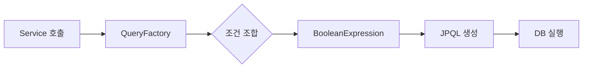

JPQL 쿼리를 문자열로 작성하다 오타 하나에 런타임 예외를 만난 경험이 있다면, QueryDSL이 왜 필요한지 바로 이해할 수 있다. QueryDSL은 컴파일 시점에 쿼리 오류를 잡아주는 타입 세이프 쿼리 빌더다. 이 글에서는 설정부터 실전 패턴까지 전부 다룬다.

---

## 1. JPQL 문자열의 한계

### 1-1. 문자열 쿼리의 문제점

JPQL을 문자열로 작성하면 세 가지 문제가 생긴다.

```java
// 이 쿼리의 문제를 컴파일 시점에 알 수 없다
String jpql = "SELECT m FROM Meber m WHERE m.age > :age";
//                          ↑ 오타! Member가 아니라 Meber
```

첫째, 오타가 런타임에서야 발각된다. 둘째, 컬럼명 변경 시 IDE가 영향 범위를 추적하지 못한다. 셋째, 동적 쿼리를 문자열 조합으로 만들면 코드가 폭발한다.

```java
// 동적 쿼리를 문자열로 만드는 고통
StringBuilder sb = new StringBuilder("SELECT m FROM Member m WHERE 1=1");
if (name != null) sb.append(" AND m.name = :name");
if (age != null) sb.append(" AND m.age > :age");
if (city != null) sb.append(" AND m.address.city = :city");
// WHERE 1=1 트릭, 공백 실수, 파라미터 바인딩 누락... 지옥이다
```

### 1-2. QueryDSL이 제공하는 것

QueryDSL은 엔티티에서 Q클래스를 생성하고, 그 Q클래스를 통해 자바 코드로 쿼리를 작성한다. 비유하자면 **SQL을 자바 함수 호출처럼** 쓰는 것이다.

```java
// 위 문자열 쿼리를 QueryDSL로
QMember m = QMember.member;
List<Member> result = queryFactory
    .selectFrom(m)
    .where(m.name.eq(name)
        .and(m.age.gt(age)))
    .fetch();
```

컴파일 시점 타입 체크, IDE 자동완성, 리팩토링 추적까지 전부 된다.

---

## 2. 설정

### 2-1. Gradle 설정 (Spring Boot 3.x / Jakarta)

```groovy
// build.gradle
plugins {
    id 'java'
    id 'org.springframework.boot' version '3.2.0'
}

dependencies {
    implementation 'com.querydsl:querydsl-jpa:5.1.0:jakarta'
    annotationProcessor 'com.querydsl:querydsl-apt:5.1.0:jakarta'
    annotationProcessor 'jakarta.annotation:jakarta.annotation-api'
    annotationProcessor 'jakarta.persistence:jakarta.persistence-api'
}

// Q클래스 생성 경로 설정
def generated = 'src/main/generated'

tasks.withType(JavaCompile).configureEach {
    options.getGeneratedSourceOutputDirectory().set(file(generated))
}

sourceSets {
    main.java.srcDirs += [generated]
}

clean {
    delete file(generated)
}
```

빌드 후 `src/main/generated` 디렉토리에 Q클래스가 생성된다. 예를 들어 `Member` 엔티티라면 `QMember`가 만들어진다.

### 2-2. JPAQueryFactory 빈 등록

```java
@Configuration
public class QueryDSLConfig {

    @PersistenceContext
    private EntityManager entityManager;

    @Bean
    public JPAQueryFactory jpaQueryFactory() {
        return new JPAQueryFactory(entityManager);
    }
}
```

`JPAQueryFactory`는 쿼리를 생성하는 팩토리다. `EntityManager`를 내부에 들고 있으며, 스프링이 트랜잭션 범위에 맞는 EM을 주입해준다.

### 2-3. Q클래스 이해

```java
// Member 엔티티
@Entity
public class Member {
    @Id @GeneratedValue
    private Long id;
    private String name;
    private int age;

    @ManyToOne(fetch = FetchType.LAZY)
    @JoinColumn(name = "team_id")
    private Team team;
}

// 자동 생성된 QMember (핵심 필드만 발췌)
public class QMember extends EntityPathBase<Member> {
    public static final QMember member = new QMember("member");

    public final NumberPath<Long> id = createNumber("id", Long.class);
    public final StringPath name = createString("name");
    public final NumberPath<Integer> age = createNumber("age", Integer.class);
    public final QTeam team = new QTeam("team");
}
```

각 필드가 `Path` 타입으로 표현된다. `StringPath`는 문자열 연산(`eq`, `contains`, `startsWith` 등)을 제공하고, `NumberPath`는 수치 비교(`gt`, `lt`, `between` 등)를 제공한다.

---

## 3. JPAQueryFactory 기본 사용

### 3-1. 기본 조회

```java
@Repository
@RequiredArgsConstructor
public class MemberRepositoryImpl {

    private final JPAQueryFactory queryFactory;

    // 단건 조회
    public Member findByName(String name) {
        QMember m = QMember.member;
        return queryFactory
            .selectFrom(m)
            .where(m.name.eq(name))
            .fetchOne();  // 결과 없으면 null, 2개 이상이면 예외
    }

    // 목록 조회
    public List<Member> findByAgeGt(int age) {
        QMember m = QMember.member;
        return queryFactory
            .selectFrom(m)
            .where(m.age.gt(age))
            .orderBy(m.age.desc())
            .fetch();
    }

    // 개수 조회
    public long countByTeam(Long teamId) {
        QMember m = QMember.member;
        return queryFactory
            .select(m.count())
            .from(m)
            .where(m.team.id.eq(teamId))
            .fetchOne();
    }
}
```

`fetch()`는 리스트, `fetchOne()`은 단건, `fetchFirst()`는 첫 번째 결과(LIMIT 1)를 반환한다.

### 3-2. 조인

```java
public List<Member> findMemberWithTeam(String teamName) {
    QMember m = QMember.member;
    QTeam t = QTeam.team;

    return queryFactory
        .selectFrom(m)
        .join(m.team, t)          // 내부 조인
        .where(t.name.eq(teamName))
        .fetch();
}

public List<Member> findMemberLeftJoin() {
    QMember m = QMember.member;
    QTeam t = QTeam.team;

    return queryFactory
        .selectFrom(m)
        .leftJoin(m.team, t)      // 외부 조인
        .fetch();
}

// on절 활용 - 조인 대상 필터링
public List<Member> findMemberWithActiveTeam() {
    QMember m = QMember.member;
    QTeam t = QTeam.team;

    return queryFactory
        .selectFrom(m)
        .leftJoin(m.team, t).on(t.active.eq(true))
        .fetch();
}
```

---

## 4. 동적 쿼리 — QueryDSL의 진가

### 4-1. BooleanBuilder

`BooleanBuilder`는 조건을 동적으로 쌓아가는 빌더다.

```java
public List<Member> searchV1(String name, Integer ageMin, String city) {
    QMember m = QMember.member;
    BooleanBuilder builder = new BooleanBuilder();

    if (name != null && !name.isEmpty()) {
        builder.and(m.name.contains(name));
    }
    if (ageMin != null) {
        builder.and(m.age.goe(ageMin));  // goe = greater or equal
    }
    if (city != null) {
        builder.and(m.address.city.eq(city));
    }

    return queryFactory
        .selectFrom(m)
        .where(builder)
        .fetch();
}
```

동작은 하지만, 조건 로직이 메서드 안에 흩어져 재사용이 어렵다.

### 4-2. BooleanExpression (권장 방식)

`BooleanExpression`을 반환하는 메서드로 조건을 분리하면, **재사용 가능하고 가독성이 높은** 동적 쿼리가 된다.

```java
public List<Member> searchV2(String name, Integer ageMin, String city) {
    QMember m = QMember.member;
    return queryFactory
        .selectFrom(m)
        .where(
            nameContains(name),
            ageGoe(ageMin),
            cityEq(city)
        )
        .fetch();
}

// null을 반환하면 QueryDSL이 해당 조건을 무시한다
private BooleanExpression nameContains(String name) {
    return (name != null && !name.isEmpty()) ? QMember.member.name.contains(name) : null;
}

private BooleanExpression ageGoe(Integer ageMin) {
    return ageMin != null ? QMember.member.age.goe(ageMin) : null;
}

private BooleanExpression cityEq(String city) {
    return city != null ? QMember.member.address.city.eq(city) : null;
}
```

`where()`에 `null`을 전달하면 QueryDSL이 자동으로 무시한다. 덕분에 null 체크 없이 깔끔하게 조합할 수 있다.

### 4-3. 조건 조합

`BooleanExpression`은 서로 `and()`, `or()`로 조합할 수 있다.

```java
// 나이 범위 조건을 조합한 단일 표현식
private BooleanExpression ageBetween(Integer ageMin, Integer ageMax) {
    if (ageMin == null && ageMax == null) return null;
    if (ageMin == null) return QMember.member.age.loe(ageMax);
    if (ageMax == null) return QMember.member.age.goe(ageMin);
    return QMember.member.age.between(ageMin, ageMax);
}

// VIP 조건 조합 (재사용 가능)
private BooleanExpression isVip() {
    QMember m = QMember.member;
    return m.age.goe(30).and(m.grade.eq("GOLD"));
}
```

비유하자면 레고 블록처럼 조건을 조립하는 것이다. 각 블록(BooleanExpression)은 독립적으로 테스트할 수 있고, 다른 쿼리에서도 재사용할 수 있다.

---

## 5. Projection — 원하는 컬럼만 조회

엔티티 전체를 조회하면 불필요한 컬럼까지 SELECT한다. Projection을 사용하면 필요한 컬럼만 추출할 수 있다.

### 5-1. Tuple

```java
public List<Tuple> findNameAndAge() {
    QMember m = QMember.member;
    List<Tuple> result = queryFactory
        .select(m.name, m.age)
        .from(m)
        .fetch();

    for (Tuple tuple : result) {
        String name = tuple.get(m.name);
        Integer age = tuple.get(m.age);
        System.out.println(name + " / " + age);
    }
    return result;
}
```

Tuple은 간단한 조회에 유용하지만, 리포지토리 외부로 노출하기에는 좋지 않다. `Tuple`은 QueryDSL 의존성이 있기 때문이다.

### 5-2. DTO Projection

```java
// DTO 정의
@Data
@NoArgsConstructor
@AllArgsConstructor
public class MemberDto {
    private String name;
    private int age;
    private String teamName;
}
```

DTO로 조회하는 방법은 세 가지다.

```java
// 1. Setter 기반 (기본 생성자 + setter 필요)
List<MemberDto> result1 = queryFactory
    .select(Projections.bean(MemberDto.class,
        m.name,
        m.age,
        t.name.as("teamName")))  // 필드명이 다르면 as()로 맞춰준다
    .from(m)
    .join(m.team, t)
    .fetch();

// 2. 필드 직접 접근 (getter/setter 불필요, 필드명으로 매핑)
List<MemberDto> result2 = queryFactory
    .select(Projections.fields(MemberDto.class,
        m.name,
        m.age,
        t.name.as("teamName")))
    .from(m)
    .join(m.team, t)
    .fetch();

// 3. 생성자 기반 (타입 순서로 매핑)
List<MemberDto> result3 = queryFactory
    .select(Projections.constructor(MemberDto.class,
        m.name,
        m.age,
        t.name))
    .from(m)
    .join(m.team, t)
    .fetch();
```

### 5-3. @QueryProjection (가장 안전한 방식)

```java
@Data
public class MemberDto {
    private String name;
    private int age;

    @QueryProjection  // ← 이 애노테이션 추가
    public MemberDto(String name, int age) {
        this.name = name;
        this.age = age;
    }
}
```

빌드하면 `QMemberDto`가 생성된다. 이를 사용하면 생성자 파라미터까지 타입 체크가 된다.

```java
List<MemberDto> result = queryFactory
    .select(new QMemberDto(m.name, m.age))  // 컴파일 타임 타입 체크
    .from(m)
    .fetch();
```

단점은 DTO가 QueryDSL에 의존한다는 점이다. DTO가 `@QueryProjection`을 가지면 QueryDSL 없이는 컴파일이 안 된다. 아키텍처 레이어를 엄격히 분리해야 한다면 `Projections.constructor`를 쓰는 것이 낫다.

---

## 6. 페이징과 정렬

### 6-1. 기본 페이징

```java
public Page<Member> findWithPaging(Pageable pageable) {
    QMember m = QMember.member;

    List<Member> content = queryFactory
        .selectFrom(m)
        .orderBy(m.age.desc(), m.name.asc())
        .offset(pageable.getOffset())
        .limit(pageable.getPageSize())
        .fetch();

    // count 쿼리 (별도로 실행)
    long total = queryFactory
        .select(m.count())
        .from(m)
        .fetchOne();

    return new PageImpl<>(content, pageable, total);
}
```

### 6-2. count 쿼리 최적화

마지막 페이지나 데이터가 없을 때 count 쿼리를 생략하면 성능이 개선된다. `PageableExecutionUtils`를 활용한다.

```java
public Page<Member> findWithOptimizedPaging(MemberSearchCond cond, Pageable pageable) {
    QMember m = QMember.member;

    List<Member> content = queryFactory
        .selectFrom(m)
        .where(nameContains(cond.getName()), ageGoe(cond.getAgeMin()))
        .orderBy(m.name.asc())
        .offset(pageable.getOffset())
        .limit(pageable.getPageSize())
        .fetch();

    // count 쿼리를 JPAQuery로 분리
    JPAQuery<Long> countQuery = queryFactory
        .select(m.count())
        .from(m)
        .where(nameContains(cond.getName()), ageGoe(cond.getAgeMin()));

    // 마지막 페이지면 count 쿼리를 실행하지 않는다
    return PageableExecutionUtils.getPage(content, pageable, countQuery::fetchOne);
}
```

### 6-3. 동적 정렬

```java
public List<Member> findWithDynamicSort(Pageable pageable) {
    QMember m = QMember.member;

    // Pageable의 Sort 정보를 QueryDSL OrderSpecifier로 변환
    List<OrderSpecifier<?>> orders = pageable.getSort().stream()
        .map(order -> {
            Order direction = order.isAscending() ? Order.ASC : Order.DESC;
            return switch (order.getProperty()) {
                case "name" -> new OrderSpecifier<>(direction, m.name);
                case "age" -> new OrderSpecifier<>(direction, m.age);
                default -> new OrderSpecifier<>(direction, m.id);
            };
        })
        .toList();

    return queryFactory
        .selectFrom(m)
        .orderBy(orders.toArray(new OrderSpecifier[0]))
        .fetch();
}
```

---

## 7. 서브쿼리

JPQL 서브쿼리는 FROM 절에서 사용 불가능하지만, WHERE/SELECT 절에서는 쓸 수 있다.

```java
public List<Member> findAboveAvgAge() {
    QMember m = QMember.member;
    QMember mSub = new QMember("mSub");  // 서브쿼리용 별칭

    return queryFactory
        .selectFrom(m)
        .where(m.age.gt(
            JPAExpressions
                .select(mSub.age.avg())
                .from(mSub)
        ))
        .fetch();
}

// SELECT 절 서브쿼리 (스칼라 서브쿼리)
public List<Tuple> findWithRank() {
    QMember m = QMember.member;
    QMember mSub = new QMember("mSub");

    return queryFactory
        .select(m.name,
            JPAExpressions
                .select(mSub.count())
                .from(mSub)
                .where(mSub.age.loe(m.age))
                .as("rank"))
        .from(m)
        .orderBy(m.age.asc())
        .fetch();
}
```

---

## 8. 벌크 연산

### 8-1. 일괄 수정/삭제

```java
// 일괄 업데이트
public long updateBulkAge(int agePlus, int ageGoe) {
    QMember m = QMember.member;
    return queryFactory
        .update(m)
        .set(m.age, m.age.add(agePlus))
        .where(m.age.goe(ageGoe))
        .execute();
}

// 일괄 삭제
public long deleteBulkByAge(int ageLt) {
    QMember m = QMember.member;
    return queryFactory
        .delete(m)
        .where(m.age.lt(ageLt))
        .execute();
}
```

벌크 연산은 영속성 컨텍스트를 우회해서 DB를 직접 변경한다. 실행 후 `entityManager.clear()`를 호출하지 않으면 1차 캐시의 데이터가 DB와 달라진다.

```java
@Transactional
public void bulkUpdate() {
    queryFactory
        .update(QMember.member)
        .set(QMember.member.age, QMember.member.age.add(1))
        .execute();

    entityManager.flush();
    entityManager.clear();  // 영속성 컨텍스트 초기화 필수
}
```

---

## 9. 성능 최적화

### 9-1. fetchJoin

N+1 문제를 해결하는 가장 직접적인 방법이다.

```java
// fetchJoin 없이: Member 10명 조회 시 Team 쿼리 10번 추가 실행
public List<Member> findAllWithoutFetch() {
    return queryFactory
        .selectFrom(QMember.member)
        .fetch();  // Team은 LAZY → 각 Member.getTeam() 시 추가 쿼리
}

// fetchJoin 적용: 쿼리 1번에 Member + Team 함께 조회
public List<Member> findAllWithFetchJoin() {
    QMember m = QMember.member;
    QTeam t = QTeam.team;
    return queryFactory
        .selectFrom(m)
        .join(m.team, t).fetchJoin()
        .fetch();
}
```

### 9-2. 커버링 인덱스 쿼리

페이징 쿼리에서 인덱스만으로 조회하고, 실제 데이터는 조인으로 가져오는 패턴이다. 대용량 테이블에서 OFFSET이 클 때 효과적이다.

```java
public Page<MemberDto> findWithCoveringIndex(Pageable pageable) {
    QMember m = QMember.member;

    // 1단계: 인덱스만 사용해 ID 목록 추출 (빠름)
    List<Long> ids = queryFactory
        .select(m.id)
        .from(m)
        .orderBy(m.createdAt.desc())
        .offset(pageable.getOffset())
        .limit(pageable.getPageSize())
        .fetch();

    if (ids.isEmpty()) return Page.empty();

    // 2단계: ID 목록으로 실제 데이터 조회 (IN 쿼리)
    List<MemberDto> content = queryFactory
        .select(new QMemberDto(m.name, m.age))
        .from(m)
        .where(m.id.in(ids))
        .orderBy(m.createdAt.desc())
        .fetch();

    long total = queryFactory.select(m.count()).from(m).fetchOne();
    return new PageImpl<>(content, pageable, total);
}
```

---

## 10. Spring Data JPA와 통합

### 10-1. Custom Repository 패턴

Spring Data JPA의 `JpaRepository`와 QueryDSL을 함께 쓰려면 Custom Repository 패턴을 사용한다.

```java
// 1. 커스텀 인터페이스 정의
public interface MemberRepositoryCustom {
    List<MemberDto> search(MemberSearchCond cond);
    Page<MemberDto> searchWithPaging(MemberSearchCond cond, Pageable pageable);
}

// 2. QueryDSL로 구현
@Repository
@RequiredArgsConstructor
public class MemberRepositoryCustomImpl implements MemberRepositoryCustom {

    private final JPAQueryFactory queryFactory;

    @Override
    public List<MemberDto> search(MemberSearchCond cond) {
        QMember m = QMember.member;
        QTeam t = QTeam.team;

        return queryFactory
            .select(new QMemberDto(m.name, m.age))
            .from(m)
            .leftJoin(m.team, t)
            .where(nameContains(cond.getName()), ageGoe(cond.getAgeMin()))
            .fetch();
    }

    @Override
    public Page<MemberDto> searchWithPaging(MemberSearchCond cond, Pageable pageable) {
        QMember m = QMember.member;

        List<MemberDto> content = queryFactory
            .select(new QMemberDto(m.name, m.age))
            .from(m)
            .where(nameContains(cond.getName()), ageGoe(cond.getAgeMin()))
            .offset(pageable.getOffset())
            .limit(pageable.getPageSize())
            .fetch();

        JPAQuery<Long> countQuery = queryFactory
            .select(m.count())
            .from(m)
            .where(nameContains(cond.getName()), ageGoe(cond.getAgeMin()));

        return PageableExecutionUtils.getPage(content, pageable, countQuery::fetchOne);
    }

    private BooleanExpression nameContains(String name) {
        return name != null ? QMember.member.name.contains(name) : null;
    }

    private BooleanExpression ageGoe(Integer age) {
        return age != null ? QMember.member.age.goe(age) : null;
    }
}

// 3. 메인 리포지토리에서 상속
public interface MemberRepository extends JpaRepository<Member, Long>, MemberRepositoryCustom {
    // JpaRepository 기본 메서드 + 커스텀 메서드를 함께 사용
    Optional<Member> findByEmail(String email);
}
```

### 10-2. QuerydslPredicateExecutor

더 간단한 통합 방법이다. 단, 조인이나 복잡한 쿼리에는 적합하지 않다.

```java
public interface MemberRepository extends
    JpaRepository<Member, Long>,
    QuerydslPredicateExecutor<Member> {
}

// 사용
QMember m = QMember.member;
Predicate predicate = m.name.contains("kim").and(m.age.goe(20));
List<Member> result = (List<Member>) memberRepository.findAll(predicate);
```

---

## 11. 전체 흐름 다이어그램



---

## 12. 극한 시나리오

### 시나리오 1: QueryDSL fetchJoin + 페이징 동시 사용

fetchJoin과 페이징을 함께 사용하면 Hibernate가 경고를 내뿜으며 전체 데이터를 메모리로 올린다.

```
HHH90003004: firstResult/maxResults specified with collection fetch;
applying in memory!
```

원인은 컬렉션 fetchJoin 시 실제 row 수가 예측 불가능하기 때문이다. 예를 들어 Member 10명이 각 3개의 Order를 가지면, JOIN 결과는 30행이다. DB 레벨 LIMIT는 의미가 없어진다.

해결책은 두 가지다.

```java
// 방법 1: ToOne 관계는 fetchJoin + 페이징 가능
public Page<Member> findWithTeamPaging(Pageable pageable) {
    QMember m = QMember.member;
    QTeam t = QTeam.team;

    // Team은 @ManyToOne → fetchJoin 가능
    List<Member> content = queryFactory
        .selectFrom(m)
        .join(m.team, t).fetchJoin()  // ToOne만 OK
        .offset(pageable.getOffset())
        .limit(pageable.getPageSize())
        .fetch();

    long total = queryFactory.select(m.count()).from(m).fetchOne();
    return new PageImpl<>(content, pageable, total);
}

// 방법 2: ToMany 관계는 배치 사이즈로 해결
// application.yml
// spring.jpa.properties.hibernate.default_batch_fetch_size: 100
```

`default_batch_fetch_size`를 설정하면 Hibernate가 컬렉션 로딩 시 IN 쿼리로 일괄 조회한다. fetchJoin보다 쿼리 수는 늘어나지만, 페이징과 안전하게 함께 쓸 수 있다.

### 시나리오 2: 대용량 페이징 (OFFSET 100만)

`OFFSET 1000000 LIMIT 10`은 DB가 100만 건을 읽고 버린 뒤 10건을 반환한다. 느릴 수밖에 없다.

```java
// No-offset 페이징으로 해결
public List<Member> findWithNoOffset(Long lastId, int pageSize) {
    QMember m = QMember.member;

    return queryFactory
        .selectFrom(m)
        .where(
            lastId != null ? m.id.lt(lastId) : null  // 커서 기반
        )
        .orderBy(m.id.desc())
        .limit(pageSize)
        .fetch();
}
```

No-offset(커서 기반) 페이징은 마지막으로 읽은 ID를 기준으로 다음 페이지를 조회한다. OFFSET을 전혀 사용하지 않으므로 1억 건 테이블에서도 항상 동일한 속도를 보장한다.

### 시나리오 3: Q클래스 충돌

같은 엔티티를 서브쿼리에서 다시 참조할 때 alias 충돌이 발생한다.

```java
// 잘못된 방법: 동일한 Q클래스를 두 번 사용
QMember m = QMember.member;
// 서브쿼리에서 m 다시 사용 → "member"라는 alias 충돌

// 올바른 방법: 서브쿼리용 별칭 생성
QMember m = QMember.member;
QMember mSub = new QMember("mSub");  // 새로운 alias로 인스턴스 생성

queryFactory
    .selectFrom(m)
    .where(m.age.gt(
        JPAExpressions.select(mSub.age.avg()).from(mSub)
    ))
    .fetch();
```

Q클래스의 정적 인스턴스(`QMember.member`)는 alias가 고정되어 있다. 같은 테이블을 두 번 참조해야 할 때는 반드시 `new QMember("alias")` 형태로 새 인스턴스를 만든다.

---

## 면접 포인트

### Q. QueryDSL의 BooleanBuilder와 BooleanExpression의 차이점은?

BooleanBuilder는 조건을 누적하는 가변 객체다. 내부 상태가 바뀌기 때문에 여러 곳에서 동시에 사용하면 문제가 생길 수 있다. BooleanExpression은 불변 객체이며, null을 반환하면 QueryDSL이 해당 조건을 무시한다. BooleanExpression을 별도 메서드로 분리하면 단위 테스트와 재사용이 쉬워진다. 실무에서는 BooleanExpression 방식이 권장된다.

### Q. QueryDSL fetchJoin과 페이징을 함께 쓰면 어떤 문제가 발생하는가?

컬렉션(OneToMany) 관계에서 fetchJoin과 페이징을 함께 쓰면 Hibernate가 전체 데이터를 메모리에 올린 뒤 애플리케이션 레벨에서 페이징한다. 이를 `HHH90003004` 경고로 알 수 있다. 대용량 데이터에서 OutOfMemoryError로 이어질 수 있다. 해결책은 ToOne 관계는 fetchJoin을 유지하고, ToMany는 `@BatchSize` 또는 `default_batch_fetch_size`로 처리하는 것이다.

### Q. @QueryProjection과 Projections.constructor의 차이는?

`@QueryProjection`은 DTO 생성자에 애노테이션을 붙여 Q클래스를 생성한다. 파라미터 타입까지 컴파일 타임에 검증되어 가장 안전하다. 단, DTO가 QueryDSL에 의존하게 된다. `Projections.constructor`는 타입 순서로 생성자를 찾기 때문에 타입이 맞으면 컴파일이 통과하지만 파라미터 순서가 바뀌어도 컴파일 에러가 나지 않는다. 아키텍처 레이어 분리를 엄격히 해야 한다면 `Projections.constructor`를, 최대한 타입 안전성을 원하면 `@QueryProjection`을 선택한다.

### Q. count 쿼리를 최적화하는 방법은?

`PageableExecutionUtils.getPage()`를 사용하면 두 가지 최적화가 적용된다. 첫째, 마지막 페이지인 경우(content 크기 < pageSize이면 offset + content.size()가 total이므로) count 쿼리를 실행하지 않는다. 둘째, 첫 페이지이면서 pageSize보다 적은 결과가 나오면 count 쿼리를 생략한다. 대량 데이터 페이징에서 count 쿼리는 전체 테이블 스캔이 될 수 있어 성능에 민감하다.

### Q. QueryDSL에서 N+1 문제를 어떻게 해결하는가?

ToOne 관계는 `.join(m.team, t).fetchJoin()`으로 한 번의 쿼리에 조인해서 해결한다. ToMany 관계(컬렉션)는 fetchJoin과 페이징을 함께 쓸 수 없으므로 `default_batch_fetch_size`를 설정해 IN 쿼리로 배치 조회한다. 만약 페이징이 없다면 ToMany도 fetchJoin을 써도 되지만, 중복 결과를 제거하기 위해 `distinct()`를 함께 사용해야 한다.
