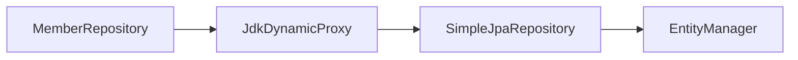
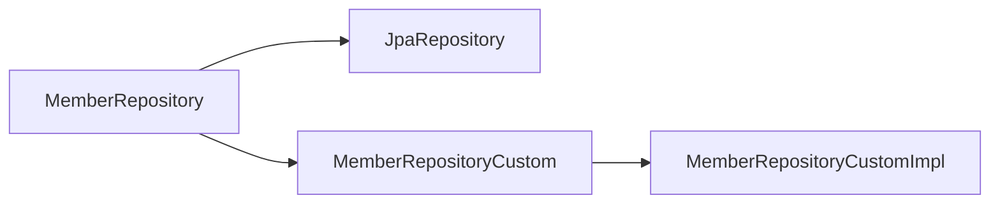
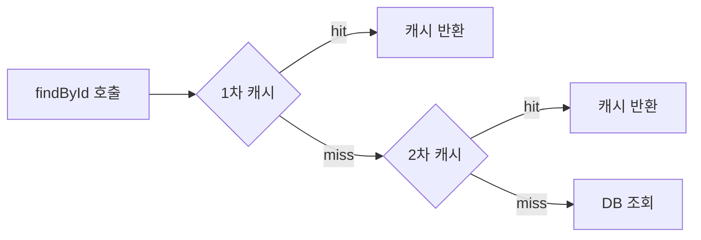
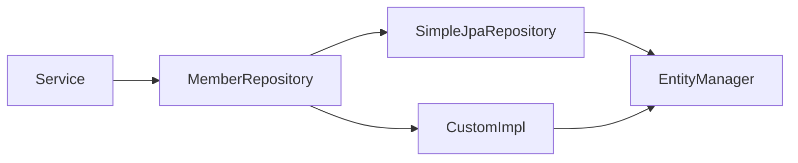

Spring Data JPA를 쓰면서 `JpaRepository`가 어떻게 구현체 없이 동작하는지 궁금했던 적이 있다면, 이 글이 그 궁금증을 해소해준다. 인터페이스를 선언하면 알아서 동작하는 마법의 원리부터 Specification, Projection, Auditing, 벌크 연산까지 심화 내용을 다룬다.

---

## 1. Repository 인터페이스가 동작하는 원리

### 1-1. 프록시 생성 메커니즘

Spring Data JPA는 애플리케이션 시작 시점에 `JpaRepository`를 구현한 **동적 프록시**를 생성한다. 비유하자면 **비서 대행 서비스**다. 고객(개발자)이 요구사항(인터페이스)만 제시하면, 대행사(Spring Data)가 실제 일하는 직원(프록시)을 채용해 투입한다.



구체적인 과정은 다음과 같다.

1. `@EnableJpaRepositories`가 컴포넌트 스캔 범위의 Repository 인터페이스를 탐색한다.
2. `JpaRepositoryFactoryBean`이 각 인터페이스에 대한 `JpaRepositoryFactory`를 생성한다.
3. `JpaRepositoryFactory`가 `SimpleJpaRepository`를 기반으로 동적 프록시를 생성한다.
4. 생성된 프록시가 스프링 빈으로 등록된다.

### 1-2. SimpleJpaRepository

모든 기본 메서드(`findById`, `save`, `delete` 등)의 실제 구현체다.

```java
// SimpleJpaRepository의 핵심 구조 (발췌)
@Repository
@Transactional(readOnly = true)
public class SimpleJpaRepository<T, ID> implements JpaRepositoryImplementation<T, ID> {

    private final EntityManager em;
    private final JpaEntityInformation<T, ?> entityInformation;

    @Override
    @Transactional
    public <S extends T> S save(S entity) {
        if (entityInformation.isNew(entity)) {
            em.persist(entity);
            return entity;
        } else {
            return em.merge(entity);
        }
    }

    @Override
    public Optional<T> findById(ID id) {
        return Optional.ofNullable(
            em.find(getDomainClass(), id)
        );
    }
}
```

주목할 점은 클래스 레벨에 `@Transactional(readOnly = true)`가 걸려 있다는 것이다. 조회 메서드 전체에 읽기 전용 트랜잭션이 적용되어 플러시 체크와 스냅샷 비교 비용이 절감된다. `save`처럼 쓰기 메서드에는 `@Transactional`이 별도로 붙어 있어 읽기 전용을 덮어쓴다.

### 1-3. isNew() 판단 로직

`save()` 내부에서 `persist`와 `merge` 중 무엇을 호출할지 `isNew()`로 판단한다.

```java
// 기본 전략: @Id 필드가 null이면 new, 아니면 existing
// Long id → null이면 새 엔티티
// @GeneratedValue 사용 시 자동으로 null → persist

// 문제 상황: String 타입 또는 직접 ID 할당
@Entity
public class Order {
    @Id
    private String orderId;  // UUID 등 직접 할당

    // orderId를 직접 할당하면 isNew()가 false를 반환 → merge 호출
    // → DB에 없는 ID로 merge 시 SELECT 후 INSERT (비효율)
}

// 해결책: Persistable 구현
@Entity
public class Order implements Persistable<String> {

    @Id
    private String orderId;

    @CreatedDate
    @Column(updatable = false)
    private LocalDateTime createdAt;

    @Override
    public String getId() {
        return orderId;
    }

    @Override
    public boolean isNew() {
        return createdAt == null;  // 생성 시간이 없으면 새 엔티티
    }
}
```

---

## 2. 쿼리 메서드 파싱 메커니즘

### 2-1. 메서드 이름 파싱

Spring Data JPA는 메서드 이름을 파싱해서 JPQL을 자동 생성한다. 비유하자면 **메뉴판 주문 시스템**이다. "등심 200g, 굽기 미디엄, 소스 없음"처럼 규칙에 맞게 주문하면 주방이 알아서 요리한다.

```java
public interface MemberRepository extends JpaRepository<Member, Long> {

    // SELECT m FROM Member m WHERE m.name = ?1
    List<Member> findByName(String name);

    // SELECT m FROM Member m WHERE m.age > ?1 ORDER BY m.name ASC
    List<Member> findByAgeGreaterThanOrderByNameAsc(int age);

    // SELECT m FROM Member m WHERE m.name = ?1 AND m.age BETWEEN ?2 AND ?3
    List<Member> findByNameAndAgeBetween(String name, int ageMin, int ageMax);

    // SELECT COUNT(m) FROM Member m WHERE m.team.name = ?1
    long countByTeamName(String teamName);

    // DELETE FROM Member m WHERE m.age < ?1
    @Modifying
    @Query("DELETE FROM Member m WHERE m.age < :age")
    int deleteByAgeLessThan(@Param("age") int age);

    // 존재 여부 확인
    boolean existsByEmail(String email);
}
```

파싱 키워드 일부를 정리하면:

| 키워드 | 의미 | 예시 |
|--------|------|------|
| `findBy` | SELECT WHERE | `findByName` |
| `countBy` | COUNT WHERE | `countByStatus` |
| `deleteBy` | DELETE WHERE | `deleteByExpiredTrue` |
| `existsBy` | EXISTS | `existsByEmail` |
| `And` | AND 조건 | `findByNameAndAge` |
| `Or` | OR 조건 | `findByNameOrEmail` |
| `Between` | BETWEEN | `findByAgeBetween` |
| `LessThan` | < | `findByAgeLessThan` |
| `GreaterThanEqual` | >= | `findByAgeGreaterThanEqual` |
| `Like` | LIKE | `findByNameLike` |
| `Containing` | LIKE %...% | `findByNameContaining` |
| `StartingWith` | LIKE ...% | `findByNameStartingWith` |
| `IgnoreCase` | 대소문자 무시 | `findByNameIgnoreCase` |
| `OrderBy` | ORDER BY | `findByAgeOrderByNameDesc` |
| `Top` / `First` | LIMIT | `findTop3ByAge` |

### 2-2. @Query

메서드 이름이 너무 길어지거나 복잡한 쿼리가 필요할 때 `@Query`를 사용한다.

```java
public interface MemberRepository extends JpaRepository<Member, Long> {

    // JPQL
    @Query("SELECT m FROM Member m WHERE m.name = :name AND m.age >= :age")
    List<Member> findByNameAndAgeGoe(@Param("name") String name, @Param("age") int age);

    // 네이티브 쿼리 (실제 SQL)
    @Query(value = "SELECT * FROM member WHERE name = :name", nativeQuery = true)
    List<Member> findByNameNative(@Param("name") String name);

    // 페이징 + 네이티브 (count 쿼리 별도 지정 가능)
    @Query(
        value = "SELECT * FROM member WHERE team_id = :teamId",
        countQuery = "SELECT COUNT(*) FROM member WHERE team_id = :teamId",
        nativeQuery = true
    )
    Page<Member> findByTeamIdNative(@Param("teamId") Long teamId, Pageable pageable);

    // DTO 직접 조회 (JPQL new 키워드)
    @Query("SELECT new com.example.dto.MemberDto(m.name, m.age) FROM Member m WHERE m.age > :age")
    List<MemberDto> findDtoByAge(@Param("age") int age);
}
```

---

## 3. Specification — 동적 검색 조건 조합

### 3-1. Specification 개념

Specification은 JPA Criteria API를 래핑한 함수형 인터페이스다. 검색 조건 하나를 하나의 Specification 객체로 캡슐화하고, 이를 AND/OR로 조합한다.

비유하자면 **필터 조각 모음**이다. 각 필터(`isAdult`, `nameContains`, `cityEq`)를 독립적으로 만들어 두고, 요청마다 필요한 필터를 조합해 끼운다.

```java
// JpaSpecificationExecutor 추가
public interface MemberRepository extends
    JpaRepository<Member, Long>,
    JpaSpecificationExecutor<Member> {
}
```

### 3-2. Specification 구현

```java
public class MemberSpec {

    // 이름 포함 검색
    public static Specification<Member> nameContains(String name) {
        return (root, query, cb) ->
            name == null ? null : cb.like(root.get("name"), "%" + name + "%");
    }

    // 나이 이상
    public static Specification<Member> ageGoe(Integer age) {
        return (root, query, cb) ->
            age == null ? null : cb.greaterThanOrEqualTo(root.get("age"), age);
    }

    // 특정 팀 소속
    public static Specification<Member> teamNameEq(String teamName) {
        return (root, query, cb) -> {
            if (teamName == null) return null;
            Join<Member, Team> team = root.join("team", JoinType.LEFT);
            return cb.equal(team.get("name"), teamName);
        };
    }
}
```

`(root, query, cb)` 람다는 `Specification.toPredicate()`의 구현이다. `root`는 FROM 절 엔티티, `query`는 쿼리 객체, `cb`는 `CriteriaBuilder`로 술어(predicate)를 만드는 팩토리다.

### 3-3. Specification 조합

```java
@Service
@RequiredArgsConstructor
public class MemberSearchService {

    private final MemberRepository memberRepository;

    public Page<Member> search(MemberSearchCond cond, Pageable pageable) {
        Specification<Member> spec = Specification
            .where(MemberSpec.nameContains(cond.getName()))
            .and(MemberSpec.ageGoe(cond.getAgeMin()))
            .and(MemberSpec.teamNameEq(cond.getTeamName()));

        return memberRepository.findAll(spec, pageable);
    }
}
```

각 Specification이 null을 반환하면 해당 조건은 무시된다. 빌더 패턴처럼 조건을 체인으로 연결할 수 있다.

### 3-4. Specification vs QueryDSL

Specification은 JPA 표준이라 별도 라이브러리가 필요 없다는 장점이 있다. 그러나 Criteria API 기반이라 코드가 장황하고, 복잡한 서브쿼리나 GROUP BY에서 가독성이 급격히 떨어진다. 단순한 동적 검색에는 Specification, 복잡한 통계/집계 쿼리에는 QueryDSL을 선택하는 것이 일반적이다.

---

## 4. Projection — 필요한 컬럼만 조회

비유: 전체 이력서(엔티티) 대신 이름과 연락처만 적힌 명함(Projection)을 건네는 것이다. Spring Data JPA는 인터페이스만 정의하면 그 인터페이스를 구현한 프록시를 자동 생성해 필요한 컬럼만 SELECT한다. **왜 중요한가**: 엔티티에 컬럼이 50개 있어도 화면에 3개만 필요하다면, 나머지 47개는 네트워크와 메모리를 낭비한다. Projection은 이 낭비를 없앤다.

### 4-1. 인터페이스 기반 Projection

```java
// 인터페이스만 정의하면 Spring Data가 프록시를 생성해 구현
public interface MemberNameOnly {
    String getName();
    int getAge();
}

// 사용
public interface MemberRepository extends JpaRepository<Member, Long> {
    List<MemberNameOnly> findProjectionByAgeGt(int age);
}
```

Spring Data JPA가 `MemberNameOnly`를 구현한 프록시를 생성하고, `getName()` 호출 시 `member.name` 컬럼을 반환한다. 내부적으로 인터페이스 메서드명을 파싱해 엔티티 필드명에 매핑한다.

### 4-2. 중첩 Projection

```java
public interface MemberWithTeam {
    String getName();
    int getAge();
    TeamInfo getTeam();  // 중첩 인터페이스

    interface TeamInfo {
        String getName();
    }
}

// SELECT m.name, m.age, t.name FROM Member m LEFT JOIN m.team t
List<MemberWithTeam> result = memberRepository.findAll(MemberWithTeam.class);
```

중첩 인터페이스를 사용하면 연관 엔티티의 특정 컬럼도 쿼리에 포함된다. 단, 중첩 인터페이스가 있으면 엔티티 전체를 SELECT한 뒤 매핑하는 경우가 있으므로 실제 실행 쿼리를 확인해야 한다.

### 4-3. 클래스 기반 Projection (DTO)

```java
@Value  // Lombok 불변 DTO
public class MemberSummary {
    String name;
    int age;

    // Spring Data JPA가 이 생성자를 사용해 결과를 매핑
    public MemberSummary(String name, int age) {
        this.name = name;
        this.age = age;
    }
}

// 사용
List<MemberSummary> findSummaryByAgeGt(int age);
```

클래스 기반 Projection은 실제 DTO 인스턴스를 생성해 반환하므로 인터페이스 프록시 오버헤드가 없다. 다만 Spring Data가 생성자 파라미터 순서와 타입으로 매핑하기 때문에 컬럼 순서가 중요하다.

### 4-4. 동적 Projection

```java
// 반환 타입을 제네릭으로 선언
public interface MemberRepository extends JpaRepository<Member, Long> {
    <T> List<T> findByAge(int age, Class<T> type);
}

// 호출 시 원하는 타입 지정
List<MemberNameOnly> projections = memberRepository.findByAge(20, MemberNameOnly.class);
List<MemberSummary> dtos = memberRepository.findByAge(20, MemberSummary.class);
List<Member> entities = memberRepository.findByAge(20, Member.class);
```

---

## 5. Auditing

비유: 회사 문서의 결재란이다. 문서를 만든 사람(createdBy), 만든 시각(createdAt), 마지막으로 수정한 사람(updatedBy), 수정 시각(updatedAt)이 자동으로 찍힌다. **개발자가 매번 직접 채울 필요 없이** `@EnableJpaAuditing` 하나로 모든 엔티티에 자동 적용된다. 이 정보가 없으면 "누가 언제 이 데이터를 바꿨는지" 추적이 불가능해 운영 장애 시 원인 파악이 어려워진다.

### 5-1. 설정

```java
@Configuration
@EnableJpaAuditing
public class JpaAuditingConfig {

    // 현재 로그인 사용자를 반환하는 빈
    @Bean
    public AuditorAware<String> auditorProvider() {
        return () -> Optional.ofNullable(
            SecurityContextHolder.getContext()
                .getAuthentication()
        )
        .map(Authentication::getName)
        .or(() -> Optional.of("system"));
    }
}
```

### 5-2. Auditing 엔티티 기반 클래스

```java
@EntityListeners(AuditingEntityListener.class)
@MappedSuperclass
@Getter
public abstract class BaseTimeEntity {

    @CreatedDate
    @Column(updatable = false)
    private LocalDateTime createdAt;

    @LastModifiedDate
    private LocalDateTime updatedAt;
}

@EntityListeners(AuditingEntityListener.class)
@MappedSuperclass
@Getter
public abstract class BaseEntity extends BaseTimeEntity {

    @CreatedBy
    @Column(updatable = false)
    private String createdBy;

    @LastModifiedBy
    private String updatedBy;
}

// 엔티티에 적용
@Entity
public class Member extends BaseEntity {
    @Id @GeneratedValue
    private Long id;
    private String name;
    // createdAt, updatedAt, createdBy, updatedBy 자동 관리
}
```

`@CreatedDate`, `@LastModifiedDate`는 `LocalDateTime`에, `@CreatedBy`, `@LastModifiedBy`는 `AuditorAware`가 반환하는 타입과 맞는 필드에 적용한다.

### 5-3. Hibernate Envers로 변경 이력 추적

```java
// 의존성 추가
// implementation 'org.springframework.data:spring-data-envers'

@Entity
@Audited  // 이 엔티티의 변경 이력을 audit 테이블에 기록
public class Member extends BaseEntity {
    // ...
}

// 이력 조회
@Repository
@RequiredArgsConstructor
public class MemberHistoryRepository {

    @PersistenceContext
    private EntityManager em;

    public List<Member> findRevisions(Long memberId) {
        AuditReader reader = AuditReaderFactory.get(em);
        return reader.createQuery()
            .forRevisionsOfEntity(Member.class, true, true)
            .add(AuditEntity.id().eq(memberId))
            .getResultList();
    }
}
```

---

## 6. Custom Repository 구현

### 6-1. 패턴 개요



Spring Data JPA는 `{리포지토리이름}Impl` 네이밍 규칙으로 커스텀 구현체를 자동으로 찾아 통합한다.

```java
// 1. 커스텀 메서드 인터페이스
public interface MemberRepositoryCustom {
    List<Member> findComplexQuery(MemberSearchCond cond);
}

// 2. 구현체 — 이름이 MemberRepositoryCustomImpl이어야 한다
@RequiredArgsConstructor
public class MemberRepositoryCustomImpl implements MemberRepositoryCustom {

    private final EntityManager em;  // 또는 JPAQueryFactory

    @Override
    public List<Member> findComplexQuery(MemberSearchCond cond) {
        // EntityManager 직접 사용 또는 QueryDSL
        return em.createQuery(
            "SELECT m FROM Member m WHERE m.age > :age",
            Member.class
        )
        .setParameter("age", cond.getAgeMin())
        .getResultList();
    }
}

// 3. 메인 리포지토리
public interface MemberRepository extends
    JpaRepository<Member, Long>,
    MemberRepositoryCustom {

    List<Member> findByName(String name);
    // + findComplexQuery() 커스텀 메서드 사용 가능
}
```

### 6-2. 별도 Repository로 분리하는 전략

복잡한 통계 쿼리나 읽기 전용 쿼리는 아예 별도 Repository로 분리하는 것이 낫다. 커스텀 패턴은 인터페이스 하나에 구현이 뭉쳐 관심사가 흐려질 수 있다.

```java
// 커맨드/쿼리 분리 (CQRS 경량 버전)
public interface MemberRepository extends JpaRepository<Member, Long> {
    // 저장, 삭제, 단순 조회
}

@Repository
@RequiredArgsConstructor
public class MemberQueryRepository {
    // 복잡한 통계, 페이징, 리포팅 쿼리만 담당
    private final JPAQueryFactory queryFactory;

    public List<MemberStatDto> findStatsByTeam() { ... }
}
```

---

## 7. 벌크 연산과 영속성 컨텍스트

**왜 벌크 연산이 필요한가**: JPA 기본 동작은 엔티티를 하나씩 로드해 변경 감지로 UPDATE를 실행한다. 10만 건을 수정하면 10만 번의 SQL이 나간다. 벌크 연산은 DB에 SQL 한 방을 날려 처리한다. **주의할 점은** 벌크 연산이 영속성 컨텍스트를 건너뛰기 때문에, 1차 캐시에 올라와 있는 엔티티와 DB 상태가 불일치해진다. `clearAutomatically = true`가 이를 자동으로 해결하는 이유다.

### 7-1. @Modifying

```java
public interface MemberRepository extends JpaRepository<Member, Long> {

    @Modifying
    @Query("UPDATE Member m SET m.age = m.age + 1 WHERE m.age >= :age")
    int bulkAgeUp(@Param("age") int age);

    @Modifying
    @Query("DELETE FROM Member m WHERE m.status = 'WITHDRAWN'")
    int deleteWithdrawnMembers();
}
```

`@Modifying`이 없으면 Spring Data가 UPDATE/DELETE를 SELECT로 잘못 인식해 예외가 발생한다.

### 7-2. clearAutomatically

벌크 연산은 영속성 컨텍스트를 우회한다. 연산 전에 영속화된 엔티티가 있다면 1차 캐시가 오래된 데이터를 들고 있게 된다.

```java
@Modifying(clearAutomatically = true)  // 실행 후 영속성 컨텍스트 자동 clear
@Query("UPDATE Member m SET m.age = m.age + 1 WHERE m.age >= :age")
int bulkAgeUp(@Param("age") int age);
```

`clearAutomatically = true`를 설정하면 `@Modifying` 쿼리 실행 후 EntityManager의 `clear()`를 자동 호출한다. 다만 아직 flush되지 않은 변경사항도 날아가므로, 벌크 연산 전에 flush가 완료됐는지 확인해야 한다. `flushAutomatically = true`를 함께 설정하면 실행 전 flush를 강제한다.

```java
@Modifying(flushAutomatically = true, clearAutomatically = true)
@Query("UPDATE Member m SET m.age = m.age + 1 WHERE m.age >= :age")
int bulkAgeUp(@Param("age") int age);
```

---

## 8. 2차 캐시

### 8-1. 2차 캐시 개념

비유: 도서관(DB)과 개인 책상(1차 캐시), 그리고 층별 자료실(2차 캐시)을 생각해보자. 개인 책상에서 찾는 게 가장 빠르지만 내 트랜잭션이 끝나면 책상이 치워진다. 층별 자료실은 모든 직원이 공유하고, 자주 쓰는 자료는 항상 꺼내놓는다. 도서관(DB)까지 가는 왕복 시간을 절약할 수 있다. **단, 자료실 자료가 도서관 원본과 다를 수 있다 — 이것이 2차 캐시의 일관성 문제다.**

JPA의 1차 캐시는 영속성 컨텍스트 범위, 즉 트랜잭션 범위다. 2차 캐시는 EntityManagerFactory 범위, 즉 애플리케이션 전체 범위다.



### 8-2. Ehcache 설정

```xml
<!-- pom.xml -->
<dependency>
    <groupId>org.springframework.boot</groupId>
    <artifactId>spring-boot-starter-cache</artifactId>
</dependency>
<dependency>
    <groupId>org.hibernate.orm</groupId>
    <artifactId>hibernate-jcache</artifactId>
</dependency>
<dependency>
    <groupId>org.ehcache</groupId>
    <artifactId>ehcache</artifactId>
    <classifier>jakarta</classifier>
</dependency>
```

```yaml
# application.yml
spring:
  jpa:
    properties:
      hibernate:
        cache:
          use_second_level_cache: true
          use_query_cache: true
          region:
            factory_class: org.hibernate.cache.jcache.JCacheRegionFactory
        javax:
          cache:
            uri: classpath:ehcache.xml
```

```xml
<!-- ehcache.xml -->
<config xmlns="http://www.ehcache.org/v3">
    <cache alias="com.example.entity.Member">
        <expiry>
            <ttl unit="minutes">10</ttl>
        </expiry>
        <heap>1000</heap>
    </cache>
</config>
```

```java
@Entity
@Cache(usage = CacheConcurrencyStrategy.READ_WRITE)  // 2차 캐시 활성화
public class Member {
    // ...
}
```

### 8-3. 2차 캐시 함정

2차 캐시는 다음 상황에서 위험하다.

첫째, 캐시된 엔티티는 직렬화/역직렬화로 복사본을 반환한다. `==` 비교가 false가 되므로 동등성 비교는 `equals()`를 써야 한다.

둘째, 벌크 연산은 2차 캐시를 갱신하지 않는다. 대량 업데이트 후 캐시가 오래된 데이터를 반환할 수 있다.

```java
// 벌크 연산 후 캐시 무효화
@Modifying
@Query("UPDATE Member m SET m.age = m.age + 1")
int bulkAgeUp();

// 서비스 레이어에서 캐시 무효화
@CacheEvict(value = "members", allEntries = true)
public int bulkAgeUp() {
    return memberRepository.bulkAgeUp();
}
```

셋째, 쓰기 빈도가 높은 엔티티에 2차 캐시를 적용하면 캐시 갱신 오버헤드가 조회 성능 개선보다 클 수 있다. 읽기 비율이 90% 이상인 엔티티에만 적용하는 것이 권장된다.

---

## 9. 전체 구조 다이어그램



---

## 10. 극한 시나리오

### 시나리오 1: 대용량 배치 insert

Spring Data JPA의 `saveAll()`은 `save()`를 반복 호출한다. 10만 건 insert 시 10만 번의 persist + flush가 발생한다.

```java
// 나쁜 방법: saveAll()을 10만 건에 그대로 사용
memberRepository.saveAll(largeList);
// EntityManager.persist()가 10만 번 호출됨
// flush 시점마다 1차 캐시에 10만 개 엔티티가 쌓임 → OOM 위험
```

```java
// 좋은 방법 1: 청크 단위 처리
@Transactional
public void bulkInsert(List<Member> members) {
    int batchSize = 500;
    for (int i = 0; i < members.size(); i++) {
        em.persist(members.get(i));
        if (i % batchSize == 0 || i == members.size() - 1) {
            em.flush();
            em.clear();  // 1차 캐시 비워서 메모리 확보
        }
    }
}

// 좋은 방법 2: JDBC bulk insert (가장 빠름)
@Repository
@RequiredArgsConstructor
public class MemberBulkRepository {

    private final JdbcTemplate jdbcTemplate;

    public void bulkInsert(List<Member> members) {
        jdbcTemplate.batchUpdate(
            "INSERT INTO member (name, age, team_id) VALUES (?, ?, ?)",
            members,
            500,
            (ps, member) -> {
                ps.setString(1, member.getName());
                ps.setInt(2, member.getAge());
                ps.setLong(3, member.getTeam().getId());
            }
        );
    }
}
```

`@GeneratedValue(strategy = IDENTITY)`를 사용하면 Hibernate가 배치 insert를 비활성화한다. 배치 insert가 필요하다면 `SEQUENCE` 전략을 사용하거나 JDBC를 직접 써야 한다.

### 시나리오 2: OSIV와 LazyInitializationException

OSIV(Open Session In View)는 뷰 렌더링까지 영속성 컨텍스트를 유지하는 설정이다.

```yaml
# application.yml
spring:
  jpa:
    open-in-view: true  # 기본값 (Spring Boot)
```

OSIV가 켜져 있으면 뷰에서 지연 로딩이 가능하다. 그러나 DB 커넥션을 HTTP 요청 전체 시간 동안 점유하므로, 트래픽이 높아지면 커넥션 풀이 고갈된다.

```yaml
spring:
  jpa:
    open-in-view: false  # 권장 (프로덕션)
```

OSIV를 끄면 트랜잭션 범위 밖에서 지연 로딩 시 `LazyInitializationException`이 발생한다.

```java
// OSIV off 환경에서의 해결책

// 방법 1: fetch join으로 필요한 연관관계를 미리 로딩
@Transactional(readOnly = true)
public MemberDto findWithTeam(Long id) {
    Member member = memberRepository.findByIdWithTeam(id)  // fetch join 쿼리
        .orElseThrow();
    // 여기서 트랜잭션 종료 전에 DTO로 변환
    return new MemberDto(member.getName(), member.getTeam().getName());
}

// 방법 2: Projection으로 필요한 데이터만 바로 DTO 조회
@Transactional(readOnly = true)
public MemberDto findProjection(Long id) {
    return memberRepository.findMemberDtoById(id)  // @Query + DTO 직접 조회
        .orElseThrow();
}
```

### 시나리오 3: Specification + Projection 동시 사용의 함정

Specification과 인터페이스 Projection을 함께 쓰면 Spring Data가 예상과 다르게 동작할 수 있다.

```java
// 이 쿼리는 SELECT * FROM member를 실행할 수 있다
Page<MemberNameOnly> result = memberRepository.findAll(spec, pageable, MemberNameOnly.class);
// → 중첩 인터페이스가 있거나, 연관 엔티티 필드를 참조하면
//    Spring Data가 최적화를 포기하고 엔티티 전체를 조회한다
```

```java
// 안전한 방법: Specification + 클래스 기반 DTO Projection
// 또는 CustomRepository에서 QueryDSL + QMemberDto로 직접 제어
```

복잡한 조건과 특정 컬럼 조회를 동시에 원한다면 Specification이나 인터페이스 Projection보다 QueryDSL + `@QueryProjection`이 더 안정적으로 동작한다.

---

## 면접 포인트

### Q. Spring Data JPA가 Repository 인터페이스를 구현체 없이 동작시키는 원리는?

스프링이 `@EnableJpaRepositories`를 처리할 때 `JpaRepositoryFactory`가 각 Repository 인터페이스에 대해 `SimpleJpaRepository`를 기반으로 JDK 동적 프록시를 생성한다. 이 프록시가 스프링 빈으로 등록되고, 메서드 호출 시 `RepositoryFactorySupport`의 `QueryExecutorMethodInterceptor`가 가로채서 쿼리 메서드 파싱, `@Query` 처리, 커스텀 구현 위임 등을 처리한다.

### Q. save() 메서드가 persist와 merge 중 무엇을 호출하는지 어떻게 결정하는가?

`SimpleJpaRepository.save()`는 `entityInformation.isNew(entity)`로 판단한다. 기본 전략은 `@Id` 필드가 null이면 새 엔티티(persist), 아니면 기존 엔티티(merge)다. `@GeneratedValue`를 사용하면 id가 null 상태로 저장되어 persist가 호출된다. UUID 등 직접 ID를 할당하는 경우 `Persistable` 인터페이스를 구현해 `isNew()` 로직을 재정의해야 한다. 그렇지 않으면 새 엔티티인데 merge가 호출되어 불필요한 SELECT가 발생한다.

### Q. @Modifying의 clearAutomatically와 flushAutomatically 옵션의 차이는?

`clearAutomatically = true`는 벌크 쿼리 실행 후 영속성 컨텍스트를 clear한다. DB는 변경됐지만 1차 캐시에 남은 엔티티가 오래된 데이터를 반환하는 문제를 막는다. `flushAutomatically = true`는 벌크 쿼리 실행 전에 flush를 강제한다. 트랜잭션 내에서 엔티티를 변경한 뒤 벌크 연산을 하면, flush 없이 벌크 연산이 먼저 실행되어 변경사항이 반영 안 될 수 있다. 두 옵션을 함께 설정하면 순서는 flush → 벌크 연산 실행 → clear다.

### Q. OSIV를 끄면 어떤 문제가 생기고 어떻게 대응하는가?

OSIV를 끄면 트랜잭션이 종료된 후 지연 로딩이 불가능하다. 컨트롤러나 뷰에서 연관 엔티티에 접근하면 `LazyInitializationException`이 발생한다. 대응 방법은 세 가지다. 첫째, 트랜잭션 내에서 필요한 연관관계를 fetch join으로 미리 로딩한다. 둘째, 서비스 레이어에서 DTO로 변환해 엔티티 대신 DTO를 반환한다. 셋째, Projection을 사용해 처음부터 필요한 데이터만 조회한다. OSIV를 켜두면 DB 커넥션 점유 시간이 늘어나 고트래픽에서 커넥션 풀 고갈이 발생할 수 있으므로, 프로덕션 환경에서는 끄고 명시적으로 관리하는 것이 권장된다.

### Q. Specification과 QueryDSL 중 어느 것을 선택하는가?

선택 기준은 복잡도와 의존성이다. Specification은 JPA 표준이라 추가 라이브러리 없이 사용 가능하고, 단순한 동적 검색 조건에 적합하다. 그러나 Criteria API 기반이라 코드가 장황하고, GROUP BY, HAVING, 서브쿼리가 들어가면 가독성이 급격히 떨어진다. QueryDSL은 초기 설정(Q클래스 생성, Gradle 설정)이 필요하지만, 타입 세이프하고 코드가 JPQL과 유사하게 읽혀 복잡한 쿼리에서 유리하다. 단순한 조건 조합은 Specification, 복잡한 통계/집계/보고서 쿼리는 QueryDSL을 쓰는 혼합 전략이 실무에서 많이 사용된다.

### Q. 대용량 배치 insert 시 saveAll()의 문제점은?

`saveAll()`은 내부적으로 `save()`를 반복 호출하므로 각 엔티티마다 `persist()`가 실행되고 1차 캐시에 쌓인다. 10만 건이면 영속성 컨텍스트에 10만 개의 엔티티 스냅샷이 쌓여 메모리 압박과 flush 시 dirty checking 비용이 커진다. 해결책은 청크 단위로 `flush() + clear()`를 반복하거나, JdbcTemplate의 `batchUpdate()`를 사용하는 것이다. 또한 `@GeneratedValue(strategy = IDENTITY)` 전략은 Hibernate가 ID를 insert 전에 알 수 없어 배치 insert가 비활성화되므로, 대용량 insert가 필요하면 SEQUENCE 전략을 검토해야 한다.
