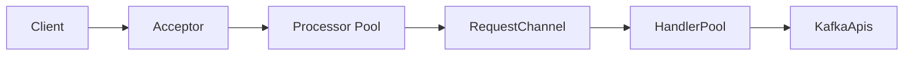
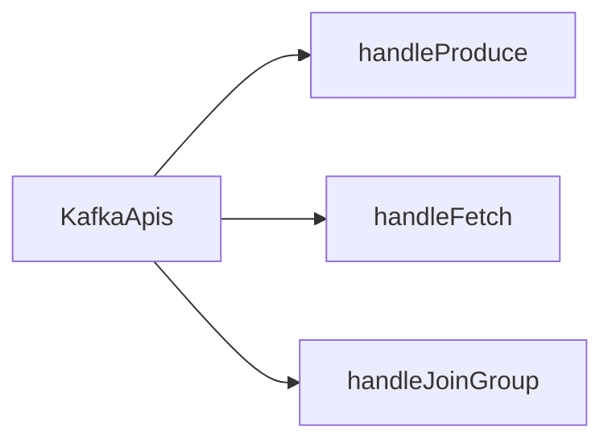
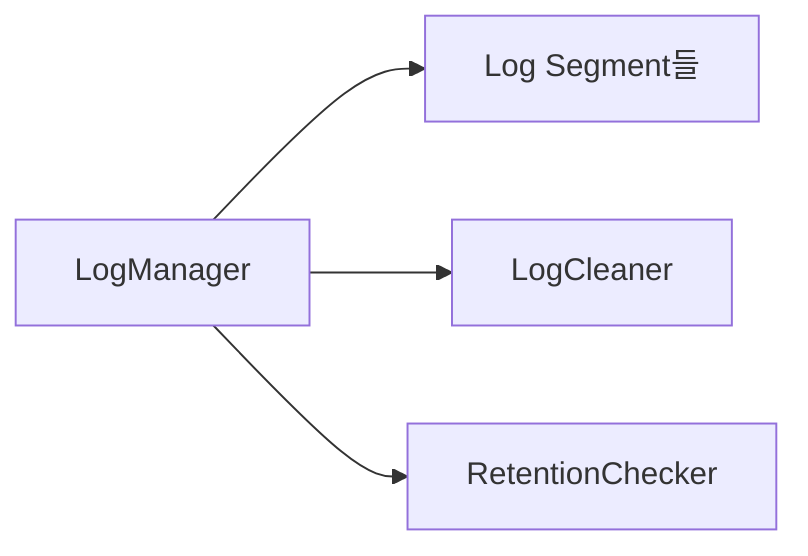
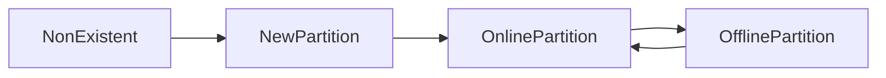
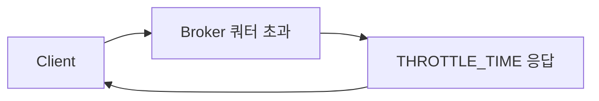
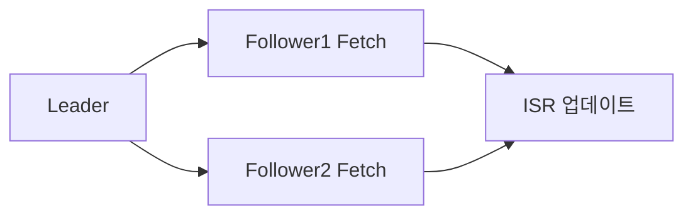

초당 수백만 메시지를 처리하는 Kafka 브로커는 어떤 내부 구조로 동작하는가? 단순히 "빠르다"는 사실이 아니라, SocketServer의 Acceptor/Processor 분리부터 Purgatory의 TimingWheel, Controller의 상태 머신까지 — 면접관이 원하는 답은 "왜 그렇게 설계했는가"이다. 이 글은 그 WHY를 코드 레벨로 추적한다.

## 왜 내부 구조를 알아야 하는가

운영 중인 Kafka 클러스터에서 다음 증상이 나타난다고 하자.

- Produce 지연이 P99 기준 500ms를 넘는다
- UnderReplicatedPartitions가 0이 아니다
- 특정 브로커의 CPU는 낮은데 Request Queue 길이가 계속 증가한다

이 세 가지는 모두 원인이 다르다. 첫 번째는 `num.io.threads` 부족, 두 번째는 복제 경로 문제, 세 번째는 `num.network.threads` 포화다. 내부 구조를 모르면 어디를 봐야 할지조차 알 수 없다.

---

## 1. 브로커 요청 처리 파이프라인

### 전체 흐름

클라이언트 요청은 브로커 안에서 다음 경로를 거친다.



이 설계는 단순한 스레드 분리가 아니다. 각 레이어가 분리된 이유를 이해하는 것이 핵심이다.

### 1-1. SocketServer — Acceptor와 Processor

**Acceptor**는 단 하나의 스레드다. `ServerSocketChannel`을 열고 `accept()`를 호출해 연결을 수락한 뒤, 즉시 Processor 중 하나에게 연결을 넘긴다. Acceptor가 하는 일은 딱 여기까지다.

**왜 Acceptor를 하나로 두는가?** TCP `accept()`는 커널이 이미 완성한 연결을 큐에서 꺼내는 작업이다. 커널 레벨 작업이라 CPU 사용량이 극히 낮고, 다중 스레드로 경쟁시키면 오히려 오버헤드가 생긴다. 단일 스레드로 충분하다.

**Processor**는 `num.network.threads`(기본 3) 개만큼 존재하는 NIO 스레드다. 각 Processor는 자신에게 할당된 소켓에서 `Selector.select()`를 돌면서 읽기/쓰기 이벤트를 처리한다. 요청 바이트를 읽어 완성된 Request 객체를 만들고, RequestChannel의 큐에 넣는다. 응답이 오면 소켓에 write한다.

**왜 Processor를 여러 개 두는가?** 하나의 Processor가 느린 클라이언트(네트워크 지연)에 의해 블로킹되면 다른 클라이언트가 대기한다. 여러 Processor가 각자 다른 소켓 집합을 담당해 이 문제를 해결한다. Processor는 순수 I/O만 담당하므로 디스크 작업 없이 빠르게 돌 수 있다.

```properties
# num.network.threads: Processor 스레드 수
# NIC 처리량 / 평균 요청 크기로 산정
# CPU 코어 수와 동일하게 맞추는 것이 일반적 시작점
num.network.threads=8
```

### 1-2. RequestChannel

Processor와 HandlerPool 사이의 버퍼다. Processor가 완성한 Request를 넣고, RequestHandler가 꺼내간다. 내부적으로 `ArrayBlockingQueue`로 구현된다.

**왜 별도 채널이 필요한가?** Processor(I/O 스레드)와 RequestHandler(비즈니스 로직 스레드)의 처리 속도가 다르기 때문이다. 채널이 버퍼 역할을 해 속도 차이를 흡수한다. `queued.max.requests`(기본 500)로 큐 최대 크기를 설정한다. 큐가 가득 차면 Processor가 새 요청을 받지 않아 자연스러운 백프레셔가 형성된다.

### 1-3. KafkaRequestHandlerPool

`num.io.threads`(기본 8) 개의 RequestHandler 스레드 풀이다. 각 스레드는 RequestChannel에서 Request를 꺼내 KafkaApis에 위임한다. 여기서 실제 디스크 I/O, 복제 조율, 오프셋 관리가 일어난다.

**왜 network threads와 io threads를 분리하는가?** 디스크 I/O는 블로킹 작업이다. NIO Processor가 디스크 I/O까지 담당하면 디스크가 느릴 때 네트워크 읽기/쓰기까지 멈춘다. 분리함으로써 네트워크 레이어는 항상 빠르게 돌고, 디스크 대기는 io.threads에서 격리된다.

```properties
# num.io.threads: RequestHandler 스레드 수
# 디스크 I/O 병렬도를 결정한다
# SSD 환경: num.network.threads와 동일하거나 2배
# HDD 환경: 디스크 수 * 2 이상 권장
num.io.threads=16
```

**num.io.threads 포화 진단:**

```java
// JMX로 확인할 지표
// kafka.server:type=KafkaRequestHandlerPool,name=RequestHandlerAvgIdlePercent
// 이 값이 0.1 미만이면 io.threads 포화 상태
MBeanServer mbs = ManagementFactory.getPlatformMBeanServer();
ObjectName name = new ObjectName(
    "kafka.server:type=KafkaRequestHandlerPool,name=RequestHandlerAvgIdlePercent"
);
Double idlePercent = (Double) mbs.getAttribute(name, "Value");
// idlePercent < 0.1 → num.io.threads 증가 검토
```

### 1-4. KafkaApis — 요청 종류별 분기

KafkaApis는 `ApiKeys`로 요청 타입을 구분한다. Produce, Fetch, FindCoordinator, JoinGroup, SyncGroup, OffsetCommit 등 수십 가지 API를 처리한다.



Produce 요청의 경우 KafkaApis는 `ReplicaManager.appendRecords()`를 호출한다. `acks=-1`이면 즉시 응답하지 않고 Purgatory에 DelayedProduce를 등록한다 — 여기서 Purgatory가 등장한다.

---

## 2. Purgatory — 지연 응답의 설계

### 2-1. 왜 Purgatory가 필요한가

`acks=all`로 Produce 요청이 들어오면 리더는 데이터를 로컬 로그에 append한 뒤, 모든 ISR 팔로워가 복제를 완료할 때까지 기다려야 한다. 이 "기다림"을 어떻게 구현할까?

**단순한 방법:** RequestHandler 스레드가 루프를 돌며 복제 완료를 확인하고 응답을 보낸다. 문제는 스레드가 묶여 다른 요청을 처리할 수 없다.

**Kafka의 방법:** 요청을 Purgatory에 보관하고 RequestHandler 스레드는 즉시 다른 요청을 처리한다. 완료 조건이 충족되면(팔로워 fetch 도착) 비동기로 완료 처리한다.

Purgatory는 `DelayedOperationPurgatory<T>` 클래스로 구현된다. `DelayedProduce`, `DelayedFetch`, `DelayedDeleteRecords`, `DelayedElectLeader` 등 여러 지연 작업 타입이 있다.

### 2-2. TimingWheel — O(1) 타임아웃 관리

Purgatory에 들어간 DelayedOperation은 타임아웃이 지나면 자동으로 만료(expire)된다. 수천 개의 요청 타임아웃을 효율적으로 관리하는 방법이 TimingWheel이다.

**왜 `PriorityQueue`(힙)가 아닌가?** 힙은 insert/delete 모두 O(log n)이다. 초당 수만 건 요청이 들어오면 타임아웃 관리만으로 CPU를 상당히 소모한다. TimingWheel은 insert O(1), 타임아웃 처리 O(1)이다.

**TimingWheel 동작 원리:**

시계처럼 생긴 원형 배열이다. 각 슬롯은 일정 시간 간격(tickMs)을 나타낸다. 전체 슬롯 수는 wheelSize다.

```
tickMs=1ms, wheelSize=20이면 한 바퀴=20ms
작업이 8ms 후 만료 → 현재 슬롯+8 위치에 삽입 → O(1)
포인터가 해당 슬롯에 도달하면 작업 만료 → O(1)
```

**왜 계층형 휠(Hierarchical TimingWheel)인가?** 단일 휠로 1ms~30초 범위를 커버하려면 슬롯이 30,000개 필요하다. 계층형은 레벨 1이 ms 단위, 레벨 2가 초 단위, 레벨 3이 분 단위로 동작한다. 상위 레벨의 슬롯이 만료되면 하위 레벨로 재배치(requeue)된다.

```
Level 1: tickMs=1ms,   wheelSize=20 → 20ms 커버
Level 2: tickMs=20ms,  wheelSize=20 → 400ms 커버
Level 3: tickMs=400ms, wheelSize=20 → 8000ms 커버
```

8초 타임아웃 요청 → Level 3 슬롯에 삽입(O(1)). Level 3 포인터가 해당 슬롯 도달 → Level 2로 재배치. Level 2 포인터 도달 → Level 1으로 재배치. Level 1 포인터 도달 → 만료 처리.

**완료 조건 충족 시 취소(cancel)도 O(1):** 타임어휠 슬롯에서 연결 리스트로 직접 제거한다.


### 2-3. DelayedProduce 동작

```
1. Producer가 acks=all로 Produce 요청 전송
2. KafkaApis → ReplicaManager.appendRecords()
3. 로컬 로그에 append 완료
4. ISR의 모든 팔로워가 복제하지 않음 → 즉시 응답 불가
5. DelayedProduce 생성, Purgatory에 등록
6. RequestHandler 스레드 반환 (다른 요청 처리)
7. 팔로워가 Fetch 요청으로 데이터 가져감
8. 팔로워의 LEO(Log End Offset) 갱신됨
9. Purgatory의 DelayedProduce.tryComplete() 호출
10. 모든 ISR의 LEO ≥ 요청 오프셋 → 완료 → Producer에 응답
11. 타임아웃(request.timeout.ms) 내 미완료 → expire → 오류 응답
```

### 2-4. DelayedFetch 동작

Consumer가 Fetch 요청을 보냈을 때 브로커에 새 메시지가 없다면?

**폴링 방식(Bad):** Consumer가 계속 요청을 보낸다 → 브로커 CPU 낭비, 불필요한 요청 폭증.

**DelayedFetch(Good):** `fetch.min.bytes`만큼 데이터가 없으면 요청을 Purgatory에 보관한다. 새 메시지가 append되거나 `fetch.max.wait.ms`(기본 500ms)가 지나면 응답한다. Long Polling 패턴이다.

```java
// Spring Kafka Consumer 설정 예시
@Configuration
public class KafkaConsumerConfig {

    @Bean
    public ConsumerFactory<String, String> consumerFactory() {
        Map<String, Object> props = new HashMap<>();
        props.put(ConsumerConfig.BOOTSTRAP_SERVERS_CONFIG, "kafka:9092");
        props.put(ConsumerConfig.GROUP_ID_CONFIG, "order-group");
        // fetch.min.bytes: 브로커가 최소 이만큼 데이터가 쌓일 때까지 대기
        // DelayedFetch의 완료 조건에 직접 영향
        props.put(ConsumerConfig.FETCH_MIN_BYTES_CONFIG, 1024);
        // fetch.max.wait.ms: DelayedFetch 타임아웃
        props.put(ConsumerConfig.FETCH_MAX_WAIT_MS_CONFIG, 500);
        return new DefaultKafkaConsumerFactory<>(props,
            new StringDeserializer(), new StringDeserializer());
    }
}
```

---

## 3. 로그 관리 — LogManager

### 3-1. LogManager의 책임

LogManager는 브로커가 시작될 때 `log.dirs`의 모든 파티션 디렉토리를 스캔하고 각 파티션의 Log 객체를 메모리에 로드한다. 이후 LogCleaner, LogRetentionChecker를 주기적으로 실행한다.



### 3-2. 파티션 저장 구조

```
/kafka-logs/orders-0/
├── 00000000000000000000.log        ← 메시지 배치 (순차 append)
├── 00000000000000000000.index      ← 오프셋 → 파일 위치 (희소 인덱스)
├── 00000000000000000000.timeindex  ← 타임스탬프 → 오프셋 (희소 인덱스)
├── 00000000000001048576.log        ← 다음 세그먼트 (시작 오프셋=1048576)
├── 00000000000001048576.index
├── 00000000000001048576.timeindex
├── leader-epoch-checkpoint         ← 리더 에폭 기록 (truncate 기준)
└── partition.metadata              ← 파티션 메타데이터
```

파일명의 20자리 숫자가 해당 세그먼트의 **시작 오프셋(base offset)**이다.

**왜 파일명이 오프셋인가?** Consumer가 오프셋 N을 요청하면 세그먼트 파일 목록에서 이진 탐색으로 `base_offset ≤ N`을 만족하는 파일을 O(log n)으로 찾는다. 이름이 숫자이기 때문에 정렬과 탐색이 단순해진다.

### 3-3. 인덱스 파일 — 희소 인덱스

`.index` 파일은 모든 메시지의 위치를 기록하지 않는다. `log.index.interval.bytes`(기본 4096) 바이트마다 하나씩 기록한다.

```
.index 내용 예시:
relative_offset=0    → file_position=0
relative_offset=50   → file_position=4096
relative_offset=103  → file_position=8192

조회 과정:
1. 이진 탐색으로 target_offset 이하의 가장 가까운 항목 찾기
2. 해당 file_position부터 순차 스캔해 정확한 오프셋 찾기
```

**왜 희소 인덱스인가?** 모든 메시지 위치를 기록하면 인덱스 파일이 커서 메모리(mmap)에 올리는 비용이 크다. 희소 인덱스는 메모리를 절약하면서 탐색을 O(log n) + 소량 순차 스캔으로 처리한다.

**왜 mmap(메모리 맵 파일)을 사용하는가?** 인덱스 파일을 mmap으로 열면 OS가 페이지 캐시와 자동으로 연동한다. 인덱스 읽기가 시스템 콜 없이 메모리 접근처럼 동작한다.

### 3-4. 세그먼트 Rolling

```properties
# 크기 기반: 세그먼트가 이 크기를 넘으면 새 세그먼트 시작
log.segment.bytes=1073741824        # 1GB (기본값)

# 시간 기반: 이 시간이 지나면 새 세그먼트 시작 (크기 무관)
log.roll.hours=168                  # 7일 (기본값)
log.roll.ms=604800000               # ms 단위 (우선)

# 지터: 여러 파티션의 세그먼트 전환 시점 분산
# 0이면 모든 파티션이 동시에 rolling → 디스크 spike
log.roll.jitter.hours=1
```

**왜 세그먼트를 분할하는가?** 단일 파일이면 오래된 데이터 삭제 시 파일 앞부분을 잘라내야 한다. 파일 앞 자르기는 O(n) 복사 작업이다. 세그먼트 단위로 분할하면 오래된 세그먼트 파일을 파일 단위로 삭제(O(1))할 수 있다.

### 3-5. 보존 정책 — delete

```properties
# 시간 기반 (세그먼트의 마지막 메시지 타임스탬프 기준)
log.retention.hours=168             # 7일 (기본값)
log.retention.ms=604800000          # ms 우선

# 크기 기반 (파티션 전체 크기 기준)
log.retention.bytes=107374182400    # 100GB

# 두 조건 모두 설정: 먼저 충족되는 조건으로 삭제
# 시간도 안 됐지만 크기가 넘으면 → 크기 기준으로 삭제

# 삭제 확인 주기
log.retention.check.interval.ms=300000  # 5분마다 체크 (기본값)
```

**삭제 대상 선정 방식:** 현재 active 세그먼트(가장 최근)는 삭제하지 않는다. 나머지 세그먼트를 가장 오래된 것부터 확인해 보존 조건을 벗어난 것을 삭제한다.

### 3-6. 보존 정책 — compact

Log Compaction은 같은 키의 메시지 중 가장 최신 값만 남긴다. Null 값은 tombstone으로 해당 키를 완전 삭제한다.

```properties
log.cleanup.policy=compact

# compaction 대상이 되기 위한 최소 경과 시간
log.min.cleanable.dirty.ratio=0.5   # dirty 비율 50% 이상일 때 compaction
log.cleaner.min.compaction.lag.ms=0 # 최소 이 시간 이상 된 메시지만 compaction
log.cleaner.max.compaction.lag.ms=Long.MAX_VALUE

# 두 정책 병행 가능
log.cleanup.policy=delete,compact   # compact 후 오래된 세그먼트는 delete
```

**LogCleaner 동작:**

```
1. CleanerThread가 가장 dirty ratio가 높은 파티션 선택
2. "dirty" 구간 (마지막 clean point 이후) 스캔
3. 키별 최신 오프셋을 OffsetMap에 기록 (메모리)
4. "clean" 구간과 dirty 구간을 병합하며 오래된 중복 제거
5. 새 세그먼트 파일 생성 후 교체
```

**언제 compact를 쓰는가:**
- 사용자 프로파일 토픽: 키=userId, 값=최신 프로파일
- CDC (Change Data Capture): 키=PK, 값=최신 row
- 설정 토픽: 키=설정명, 값=최신 설정값

```java
// AdminClient로 compact 토픽 생성
@Component
public class KafkaTopicInitializer {

    private final AdminClient adminClient;

    public KafkaTopicInitializer(AdminClient adminClient) {
        this.adminClient = adminClient;
    }

    public void createCompactedTopic(String topicName, int partitions) {
        Map<String, String> configs = new HashMap<>();
        configs.put(TopicConfig.CLEANUP_POLICY_CONFIG,
            TopicConfig.CLEANUP_POLICY_COMPACT);
        configs.put(TopicConfig.MIN_CLEANABLE_DIRTY_RATIO_CONFIG, "0.1");
        configs.put(TopicConfig.SEGMENT_BYTES_CONFIG,
            String.valueOf(100 * 1024 * 1024)); // 100MB 세그먼트

        NewTopic topic = new NewTopic(topicName, partitions, (short) 3)
            .configs(configs);

        adminClient.createTopics(List.of(topic))
            .all()
            .whenComplete((result, ex) -> {
                if (ex != null) {
                    log.error("토픽 생성 실패: {}", topicName, ex);
                } else {
                    log.info("Compact 토픽 생성 완료: {}", topicName);
                }
            });
    }
}
```

### 3-7. 페이지 캐시 — 진짜 캐시

Kafka는 별도의 인메모리 메시지 캐시를 두지 않는다. OS의 페이지 캐시가 그 역할을 한다.

**왜 직접 캐시를 두지 않는가?**

1. JVM 힙에 메시지를 캐싱하면 GC 대상이 된다. GC pause가 수백 ms 동안 처리를 멈춘다.
2. OS 페이지 캐시는 JVM 힙 외부다. Kafka가 재시작돼도 페이지 캐시는 유지된다. 재시작 직후에도 캐시 히트가 가능하다.
3. Producer가 write하면 OS가 자동으로 페이지 캐시에 올린다. Consumer가 바로 read하면 디스크 I/O 없이 페이지 캐시에서 응답한다 — 이것이 Consumer Lag이 0에 가까울 때의 동작이다.

**제로 카피(Zero-Copy):**

Consumer Fetch 시 일반적인 경로:

```
디스크 → 커널 버퍼 → JVM 힙 → 소켓 버퍼 → 네트워크
(4회 복사 + 2회 시스템 콜)
```

Kafka의 제로 카피(sendfile 시스템 콜):

```
디스크/페이지 캐시 → 소켓 버퍼 → 네트워크
(1회 복사 + 1회 시스템 콜)
```

JVM 힙을 경유하지 않으므로 CPU, 메모리 복사 비용이 대폭 절감된다.

```properties
# 소켓 버퍼 크기: 네트워크 대역폭이 높은 환경에서 늘린다
# OS 기본값보다 크면 커널이 자동으로 OS 기본값으로 적용
socket.send.buffer.bytes=131072      # 128KB (기본 102400)
socket.receive.buffer.bytes=131072   # 128KB (기본 102400)

# -1이면 OS 기본값 사용 (권장)
socket.send.buffer.bytes=-1
socket.receive.buffer.bytes=-1
```

**buffer.memory vs 페이지 캐시:**

`buffer.memory`는 Producer 클라이언트 측 설정이다. 브로커의 페이지 캐시와 별개다.

```java
// Producer 측 buffer.memory
@Configuration
public class KafkaProducerConfig {

    @Bean
    public ProducerFactory<String, String> producerFactory() {
        Map<String, Object> props = new HashMap<>();
        props.put(ProducerConfig.BOOTSTRAP_SERVERS_CONFIG, "kafka:9092");
        // buffer.memory: Producer가 브로커로 보내기 전 로컬에 버퍼링할 최대 바이트
        // 이 크기를 초과하면 max.block.ms 동안 block 후 TimeoutException
        props.put(ProducerConfig.BUFFER_MEMORY_CONFIG, 67108864L); // 64MB
        // batch.size: 배치로 묶어 보낼 최대 크기
        props.put(ProducerConfig.BATCH_SIZE_CONFIG, 65536); // 64KB
        // linger.ms: 배치가 batch.size에 안 차도 이 시간 후 전송
        props.put(ProducerConfig.LINGER_MS_CONFIG, 5);
        props.put(ProducerConfig.ACKS_CONFIG, "all");
        return new DefaultKafkaProducerFactory<>(props,
            new StringSerializer(), new StringSerializer());
    }
}
```

---

## 4. Controller — 클러스터 두뇌

### 4-1. Controller의 책임

Kafka 클러스터에서 단 하나의 브로커만이 Controller다. Controller는 다음을 담당한다.

- 브로커 장애 감지 및 리더 재선출
- 토픽/파티션 생성/삭제 처리
- ISR 변경 전파
- Partition State Machine과 Replica State Machine 운영

### 4-2. Partition State Machine

파티션은 4가지 상태를 가진다.



- **NonExistent:** 파티션이 존재하지 않음
- **NewPartition:** 파티션이 생성됐지만 리더가 아직 없음
- **OnlinePartition:** 리더가 선출되어 정상 동작 중
- **OfflinePartition:** 리더 브로커 장애 또는 명시적 offline

Controller가 `OnlinePartition → OfflinePartition` 전환을 감지하면 즉시 ISR에서 새 리더를 선출하고 `OfflinePartition → OnlinePartition` 전환을 수행한다.

### 4-3. Replica State Machine

레플리카는 7가지 상태를 가진다. 핵심 상태만 보면:

```
NewReplica     → 브로커에 새 레플리카 할당됨
OnlineReplica  → 정상 동작 중 (ISR 멤버 가능)
OfflineReplica → 브로커 장애로 오프라인
ReplicaDeletionStarted → 삭제 진행 중
ReplicaDeletionSuccessful → 삭제 완료
ReplicaDeletionIneligible → 삭제 불가 (브로커 오프라인)
NonExistentReplica → 존재하지 않음
```

### 4-4. 리더 선출 알고리즘

Controller가 새 리더를 선출할 때 기본 전략은 `OfflinePartitionLeaderElectionStrategy`다.

```
1. 해당 파티션의 assigned replicas 목록 조회 (순서 보장됨)
2. 목록을 순서대로 순회하며 첫 번째 "live" + "in ISR" 브로커 선택
3. ISR이 비어 있고 unclean.leader.election.enable=true이면
   live 브로커 중 아무나 선출 (데이터 유실 가능)
4. ISR도 비고 unclean.leader.election.enable=false이면
   파티션 unavailable (서비스 중단, 데이터 정합성 우선)
```

```java
// AdminClient로 파티션 리더 상태 확인
@Component
public class KafkaClusterInspector {

    private final AdminClient adminClient;

    public void checkUnderReplicatedPartitions(String topicName)
            throws ExecutionException, InterruptedException {

        DescribeTopicsResult result = adminClient.describeTopics(
            List.of(topicName)
        );
        TopicDescription desc = result.topicNameValues()
            .get(topicName).get();

        for (TopicPartitionInfo p : desc.partitions()) {
            int replicationFactor = p.replicas().size();
            int isrSize = p.isr().size();
            if (isrSize < replicationFactor) {
                log.warn("UnderReplicated: {}-{} ISR={}/RF={}",
                    topicName, p.partition(), isrSize, replicationFactor);
            }
            if (p.leader() == null) {
                log.error("NoLeader: {}-{}", topicName, p.partition());
            }
        }
    }
}
```

### 4-5. KRaft 마이그레이션 경로

ZooKeeper 기반 클러스터를 KRaft로 전환하는 공식 경로:

```
Phase 1: ZooKeeper 모드로 운영 (Kafka < 3.3)
Phase 2: KRaft Controller만 별도 띄우고 ZooKeeper와 병행
         (Migration mode: process.roles=controller)
Phase 3: 브로커를 KRaft 모드로 순차 재시작
Phase 4: ZooKeeper 제거
```

```properties
# KRaft 전용 Controller 노드 설정
process.roles=controller
node.id=10
controller.quorum.voters=10@ctrl1:9093,11@ctrl2:9093,12@ctrl3:9093
listeners=CONTROLLER://ctrl1:9093
controller.listener.names=CONTROLLER

# 일반 Broker 노드 설정 (KRaft 모드)
process.roles=broker
node.id=1
controller.quorum.voters=10@ctrl1:9093,11@ctrl2:9093,12@ctrl3:9093
listeners=PLAINTEXT://broker1:9092
inter.broker.listener.name=PLAINTEXT
```

**왜 Controller를 별도 노드로 분리하는가?**

Controller는 클러스터 상태 변경을 처리하는 핵심 경로다. 브로커와 같은 노드에 두면 브로커 부하가 Controller 응답에 영향을 준다. 프로덕션에서는 Controller 3개를 전용 노드로 분리하는 것이 권장된다.

---

## 5. Quota 관리 — 클라이언트 스로틀링

### 5-1. 왜 쿼터가 필요한가

멀티테넌트 Kafka에서 특정 클라이언트가 Produce를 과하게 보내면 다른 클라이언트의 Produce에도 영향이 간다. 브로커는 CPU, 네트워크, 디스크를 공유하기 때문이다. 쿼터는 클라이언트별로 사용량을 제한해 공정한 자원 배분을 보장한다.

### 5-2. 쿼터 종류

**Produce Quota:** Producer가 브로커로 전송하는 바이트/초 제한
**Fetch Quota:** Consumer가 브로커에서 가져가는 바이트/초 제한
**Request Quota:** 클라이언트가 사용하는 브로커 I/O 스레드 시간 비율 제한

### 5-3. 쿼터 동작 메커니즘

브로커는 클라이언트의 사용량을 sliding window(기본 30개의 1초 윈도우)로 측정한다. 쿼터를 초과하면 다음 요청에 `THROTTLE_TIME_MS`를 포함해 응답한다.

**THROTTLE_TIME_MS:** "나는 X ms 후에 다음 요청을 받겠다"는 신호다. 클라이언트는 이 시간 동안 전송을 멈춘다. 브로커가 강제로 연결을 끊지 않고 클라이언트 측에서 자율적으로 속도를 줄인다.



### 5-4. 쿼터 설정

```bash
# user + client-id 조합 쿼터 설정 (가장 세밀한 단위)
kafka-configs.sh --bootstrap-server kafka:9092 \
  --alter \
  --add-config 'producer_byte_rate=10485760,consumer_byte_rate=20971520' \
  --entity-type users --entity-name alice \
  --entity-type clients --entity-name order-producer

# user 단위 쿼터
kafka-configs.sh --bootstrap-server kafka:9092 \
  --alter \
  --add-config 'producer_byte_rate=52428800' \
  --entity-type users --entity-name bob

# 기본 쿼터 (모든 사용자에 적용)
kafka-configs.sh --bootstrap-server kafka:9092 \
  --alter \
  --add-config 'producer_byte_rate=10485760,request_percentage=25' \
  --entity-type users --entity-default

# 쿼터 확인
kafka-configs.sh --bootstrap-server kafka:9092 \
  --describe --entity-type users --entity-name alice
```

### 5-5. Spring Kafka에서 쿼터 모니터링

```java
@Component
public class KafkaQuotaMonitor {

    private final AdminClient adminClient;

    // Producer에서 throttle 감지
    public void monitorThrottleMetrics() {
        // Producer 메트릭에서 produce-throttle-time-avg 확인
        // kafka.producer:type=producer-metrics,client-id=<id>
        // produce-throttle-time-avg > 0 이면 쿼터 초과 중
    }

    // AdminClient로 쿼터 설정 조회
    public void describeQuotas() throws ExecutionException, InterruptedException {
        ClientQuotaFilter filter = ClientQuotaFilter.all();
        DescribeClientQuotasResult result = adminClient.describeClientQuotas(filter);
        Map<ClientQuotaEntity, Map<String, Double>> quotas = result.entities().get();
        quotas.forEach((entity, configs) -> {
            log.info("Entity: {} → Quotas: {}", entity, configs);
        });
    }
}
```

### 5-6. request_percentage 쿼터

produce/fetch 쿼터는 바이트 단위다. request_percentage는 브로커 I/O 스레드 시간 비율로 제한한다. CPU 집약적인 요청(복잡한 필터링, 대용량 배치)에 대한 보호다.

```bash
# 특정 클라이언트가 I/O 스레드 시간의 25% 이상 사용 못하도록
kafka-configs.sh --bootstrap-server kafka:9092 \
  --alter \
  --add-config 'request_percentage=25' \
  --entity-type clients --entity-name heavy-consumer
```

---

## 6. 브로커 네트워크 설정 — 왜 advertised.listeners가 따로 있는가

### 6-1. listeners vs advertised.listeners

```properties
# listeners: 브로커가 실제로 바인딩하는 주소
# 브로커 내부에서 소켓을 여는 주소
listeners=PLAINTEXT://0.0.0.0:9092

# advertised.listeners: 클라이언트에게 알려주는 주소
# ZooKeeper/KRaft 메타데이터에 등록되어 클라이언트가 접속할 때 사용
advertised.listeners=PLAINTEXT://broker1.internal:9092
```

**왜 이 둘이 다른가?**

1. **Docker/Kubernetes 환경:** 브로커 컨테이너는 `0.0.0.0:9092`에 바인딩하지만 외부에서 접근할 때는 호스트의 IP나 LoadBalancer IP를 써야 한다. listeners는 컨테이너 내부, advertised.listeners는 외부 접근 주소다.

2. **NAT 환경:** 브로커가 사설 IP에 바인딩하더라도 클라이언트는 공인 IP로 접근해야 한다.

**실수 사례:** Docker 환경에서 `advertised.listeners`를 설정하지 않으면 클라이언트가 메타데이터를 받아 `0.0.0.0:9092`로 접속을 시도한다. 클라이언트 입장에서 `0.0.0.0`은 유효하지 않아 연결 실패한다.

```yaml
# Docker Compose 예시
services:
  kafka:
    environment:
      # 내부(컨테이너 내): PLAINTEXT, 외부(호스트): EXTERNAL
      KAFKA_LISTENERS: >-
        PLAINTEXT://0.0.0.0:9092,
        EXTERNAL://0.0.0.0:29092
      KAFKA_ADVERTISED_LISTENERS: >-
        PLAINTEXT://kafka:9092,
        EXTERNAL://localhost:29092
      KAFKA_LISTENER_SECURITY_PROTOCOL_MAP: >-
        PLAINTEXT:PLAINTEXT,
        EXTERNAL:PLAINTEXT
      # 브로커 간 통신: 내부 리스너 사용
      KAFKA_INTER_BROKER_LISTENER_NAME: PLAINTEXT
```

**Kubernetes 환경:**

```yaml
# kafka broker pod env
- name: KAFKA_ADVERTISED_LISTENERS
  value: "PLAINTEXT://$(POD_IP):9092,EXTERNAL://kafka-broker-0.kafka-headless.kafka.svc.cluster.local:9092"
- name: POD_IP
  valueFrom:
    fieldRef:
      fieldPath: status.podIP
```

### 6-2. 브로커 ID 설정

```properties
# 정적 설정 (전통적 방식)
broker.id=1

# 자동 생성 (broker.id=-1로 설정)
broker.id=-1
reserved.broker.max.id=1000  # 자동 생성 ID는 이 값 초과로 할당

# KRaft에서는 node.id 사용 (broker.id와 동일 역할)
node.id=1
```

**broker.id가 중복되면?** 동일 broker.id를 가진 브로커가 클러스터에 합류하려 하면 기존 브로커가 종료된다. 운영 실수로 발생 가능한 심각한 문제다.

---

## 7. 브로커 간 통신 — 복제와 Rolling Upgrade

### 7-1. 복제 프로토콜

팔로워 브로커는 리더에게 Fetch 요청을 보내 데이터를 복제한다. 이것은 Consumer Fetch와 동일한 프로토콜을 사용한다. 리더 입장에서 팔로워는 특수한 Consumer다.



팔로워의 Fetch 요청이 도착하면 리더는 팔로워의 LEO(Log End Offset)를 갱신한다. 모든 ISR의 LEO 중 최솟값이 HW(High Watermark)가 된다. Consumer는 HW 이하의 메시지만 읽을 수 있다.

**왜 HW까지만 Consumer가 읽는가?** HW 이상의 메시지는 아직 일부 팔로워에 복제되지 않았다. 이 메시지를 Consumer가 읽었다가 리더가 장애나고 팔로워가 리더가 되면 해당 메시지가 사라진다. 읽었지만 사라진 메시지 — 데이터 불일치가 발생한다. HW를 기준으로 읽어야 복제된 메시지만 Consumer에게 전달된다.

### 7-2. inter.broker.protocol.version

브로커 간 통신 프로토콜 버전이다. Rolling Upgrade 시 핵심 설정이다.

```properties
# 현재 클러스터의 모든 브로커가 지원하는 최소 버전으로 설정
inter.broker.protocol.version=3.5

# log.message.format.version: 디스크에 저장하는 메시지 포맷 버전
# Kafka 3.0부터 제거됨 (inter.broker.protocol.version과 통합)
```

### 7-3. Rolling Upgrade 절차

```
시나리오: Kafka 3.4 → 3.6으로 업그레이드

Step 1: inter.broker.protocol.version=3.4 유지 상태로 브로커 순차 업그레이드
  - Broker1 종료 → 3.6 바이너리로 교체 → 재시작 (IBP=3.4)
  - Broker2, Broker3 동일 반복

Step 2: 모든 브로커가 3.6 바이너리로 동작 확인

Step 3: inter.broker.protocol.version=3.6으로 변경
  - 모든 브로커에 적용 (순차 재시작 필요)

Step 4: 새 기능(3.6 전용) 활성화 가능
```

**왜 IBP를 먼저 유지하는가?** 업그레이드 중간에 3.4 브로커와 3.6 브로커가 공존한다. 3.6 브로커가 3.6 프로토콜을 쓰면 3.4 브로커가 이해하지 못해 복제가 깨진다. IBP를 3.4로 유지해 모든 브로커가 같은 언어를 쓰도록 한다.

---

## 8. 메모리 관리

### 8-1. 브로커 JVM 힙 설정

```bash
# KAFKA_HEAP_OPTS 환경변수
export KAFKA_HEAP_OPTS="-Xmx6g -Xms6g"
# 최소=최대로 맞추는 이유: GC로 인한 힙 크기 변동을 막아 예측 가능한 성능 보장

# G1GC 설정 (Kafka 공식 권장)
export KAFKA_JVM_PERFORMANCE_OPTS="-server \
  -XX:+UseG1GC \
  -XX:MaxGCPauseMillis=20 \
  -XX:InitiatingHeapOccupancyPercent=35 \
  -XX:+ExplicitGCInvokesConcurrent \
  -XX:+UnlockDiagnosticVMOptions \
  -XX:G1HeapRegionSize=16m"
```

**왜 힙을 6GB 이하로 제한하는가?** 힙이 클수록 GC 대상 객체가 많고 Full GC pause가 길어진다. Kafka 메시지 자체는 JVM 힙에 올라오지 않는다 (페이지 캐시 사용). 힙에 올라오는 것은 메타데이터, 오프셋 인덱스, 요청 객체 등이다. 6GB면 충분하고 나머지 RAM은 페이지 캐시로 남겨두는 것이 올바른 설계다.

**OS 메모리 설정:**

```bash
# 스왑 최소화: 스왑이 발생하면 GC pause가 예측 불가 수준으로 증가
sysctl -w vm.swappiness=1

# 더티 페이지 플러시 설정
# dirty_background_ratio: 백그라운드 플러시 시작 임계값 (전체 RAM 대비 %)
sysctl -w vm.dirty_background_ratio=5
# dirty_ratio: 동기 플러시 강제 임계값 — 이 이상이면 write가 블로킹됨
sysctl -w vm.dirty_ratio=60
# Kafka는 순차 append이므로 dirty_ratio를 높여 OS 플러시 주도권을 Kafka에 넘김

# 투명한 대용량 페이지(THP) 비활성화
# THP는 GC pause를 불규칙하게 만든다
echo never > /sys/kernel/mm/transparent_hugepage/enabled
```

### 8-2. 네트워크 버퍼 최적화

```bash
# TCP 소켓 수신/송신 버퍼 최대값
sysctl -w net.core.rmem_max=134217728   # 128MB
sysctl -w net.core.wmem_max=134217728   # 128MB

# TCP 자동 튜닝 범위 (min, default, max)
sysctl -w net.ipv4.tcp_rmem="4096 65536 134217728"
sysctl -w net.ipv4.tcp_wmem="4096 65536 134217728"
```

`socket.send.buffer.bytes=-1`(Kafka 기본)로 설정하면 위 OS 설정이 그대로 적용된다. 명시적으로 설정하면 OS 값을 덮는다.

---

## 9. 모니터링 지표

### 9-1. 핵심 JMX 지표

| 분류 | JMX MBean | 의미 | 정상 범위 |
|------|-----------|------|----------|
| 복제 | `kafka.server:type=ReplicaManager,name=UnderReplicatedPartitions` | ISR < RF인 파티션 수 | 0 |
| 복제 | `kafka.server:type=ReplicaManager,name=IsrShrinksPerSec` | ISR 축소 빈도 | 0에 가깝게 |
| 컨트롤러 | `kafka.controller:type=KafkaController,name=ActiveControllerCount` | 액티브 컨트롤러 수 | 정확히 1 |
| 컨트롤러 | `kafka.controller:type=KafkaController,name=OfflinePartitionsCount` | 리더 없는 파티션 | 0 |
| 요청 처리 | `kafka.server:type=KafkaRequestHandlerPool,name=RequestHandlerAvgIdlePercent` | IO 스레드 유휴 비율 | > 0.3 |
| 요청 처리 | `kafka.network:type=RequestMetrics,name=TotalTimeMs,request=Produce` | Produce 처리 시간 | P99 < 500ms |
| 요청 처리 | `kafka.network:type=RequestMetrics,name=RequestQueueTimeMs` | 요청 큐 대기 시간 | P99 < 100ms |
| 처리량 | `kafka.server:type=BrokerTopicMetrics,name=BytesInPerSec` | 초당 수신 바이트 | - |
| 처리량 | `kafka.server:type=BrokerTopicMetrics,name=MessagesInPerSec` | 초당 메시지 수 | - |
| 로그 | `kafka.log:type=LogFlushStats,name=LogFlushRateAndTimeMs` | 로그 플러시 시간 | - |

### 9-2. Spring Kafka + Micrometer 통합

```java
@Configuration
public class KafkaMetricsConfig {

    @Bean
    public MeterRegistryCustomizer<MeterRegistry> kafkaMetrics(
            KafkaAdmin kafkaAdmin) {
        return registry -> {
            // Spring Kafka 자동으로 producer/consumer 메트릭을 Micrometer에 등록
            // spring.kafka.producer.metrics-enabled=true (기본 true)
        };
    }
}

@Component
public class KafkaHealthChecker {

    private final AdminClient adminClient;
    private final MeterRegistry meterRegistry;

    @Scheduled(fixedDelay = 30000)
    public void checkUnderReplicatedPartitions()
            throws ExecutionException, InterruptedException {

        // 전체 토픽의 Under-Replicated Partitions 수집
        ListTopicsResult topicsResult = adminClient.listTopics();
        Set<String> topics = topicsResult.names().get();

        DescribeTopicsResult descResult = adminClient.describeTopics(topics);
        Map<String, TopicDescription> descriptions = descResult.allTopicNames().get();

        long underReplicated = descriptions.values().stream()
            .flatMap(td -> td.partitions().stream())
            .filter(p -> p.isr().size() < p.replicas().size())
            .count();

        // Gauge로 등록: Prometheus에서 수집 가능
        Gauge.builder("kafka.under.replicated.partitions",
                () -> underReplicated)
            .description("Number of under-replicated partitions")
            .register(meterRegistry);

        if (underReplicated > 0) {
            log.warn("Under-replicated partitions detected: {}", underReplicated);
        }
    }
}
```

### 9-3. Request Latency Percentile 모니터링

```java
@Component
public class KafkaLatencyMonitor {

    // Produce 지연을 추적하는 Producer Interceptor
    public static class LatencyInterceptor
            implements ProducerInterceptor<String, String> {

        private final Timer produceTimer;

        public LatencyInterceptor() {
            this.produceTimer = Timer.builder("kafka.produce.latency")
                .percentiles(0.5, 0.95, 0.99)
                .publishPercentileHistogram()
                .register(Metrics.globalRegistry);
        }

        private final ThreadLocal<Long> sendTime = new ThreadLocal<>();

        @Override
        public ProducerRecord<String, String> onSend(
                ProducerRecord<String, String> record) {
            sendTime.set(System.nanoTime());
            return record;
        }

        @Override
        public void onAcknowledgement(
                RecordMetadata metadata, Exception exception) {
            long elapsed = System.nanoTime() - sendTime.get();
            produceTimer.record(elapsed, TimeUnit.NANOSECONDS);
            sendTime.remove();
        }

        @Override public void close() {}
        @Override public void configure(Map<String, ?> configs) {}
    }
}

// Producer에 Interceptor 적용
@Configuration
public class KafkaProducerConfig {

    @Bean
    public ProducerFactory<String, String> producerFactory() {
        Map<String, Object> props = new HashMap<>();
        props.put(ProducerConfig.BOOTSTRAP_SERVERS_CONFIG, "kafka:9092");
        props.put(ProducerConfig.INTERCEPTOR_CLASSES_CONFIG,
            KafkaLatencyMonitor.LatencyInterceptor.class.getName());
        return new DefaultKafkaProducerFactory<>(props,
            new StringSerializer(), new StringSerializer());
    }
}
```

### 9-4. AdminClient로 클러스터 상태 전체 조회

```java
@Component
public class KafkaClusterHealthReport {

    private final AdminClient adminClient;

    public ClusterHealthSnapshot snapshot()
            throws ExecutionException, InterruptedException {

        // 1. 브로커 목록
        DescribeClusterResult clusterResult = adminClient.describeCluster();
        Collection<Node> brokers = clusterResult.nodes().get();
        Node controller = clusterResult.controller().get();

        // 2. 파티션 상태
        ListTopicsOptions opts = new ListTopicsOptions().listInternal(false);
        Set<String> topics = adminClient.listTopics(opts).names().get();

        Map<String, TopicDescription> topicDescs =
            adminClient.describeTopics(topics).allTopicNames().get();

        long totalPartitions = 0;
        long underReplicated = 0;
        long offlinePartitions = 0;

        for (TopicDescription td : topicDescs.values()) {
            for (TopicPartitionInfo p : td.partitions()) {
                totalPartitions++;
                if (p.leader() == null) {
                    offlinePartitions++;
                } else if (p.isr().size() < p.replicas().size()) {
                    underReplicated++;
                }
            }
        }

        return ClusterHealthSnapshot.builder()
            .brokerCount(brokers.size())
            .controllerId(controller.id())
            .totalPartitions(totalPartitions)
            .underReplicatedPartitions(underReplicated)
            .offlinePartitions(offlinePartitions)
            .build();
    }
}
```

---

## 10. 브로커 설정 전체 레퍼런스

### 10-1. 필수 설정

```properties
# ===== 브로커 기본 =====
broker.id=1
# KRaft에서는 node.id=1

# 리스너
listeners=PLAINTEXT://0.0.0.0:9092
advertised.listeners=PLAINTEXT://broker1.example.com:9092
listener.security.protocol.map=PLAINTEXT:PLAINTEXT

# 로그 저장 경로 (여러 디스크: 콤마 구분)
log.dirs=/data1/kafka-logs,/data2/kafka-logs

# ZooKeeper (ZK 모드만)
zookeeper.connect=zk1:2181,zk2:2181,zk3:2181/kafka
zookeeper.session.timeout.ms=18000

# KRaft (KRaft 모드만)
process.roles=broker
node.id=1
controller.quorum.voters=10@ctrl1:9093,11@ctrl2:9093,12@ctrl3:9093

# ===== 스레드 =====
num.network.threads=8           # NIO Processor 수
num.io.threads=16               # RequestHandler 수
num.replica.fetchers=4          # 복제 Fetch 스레드 (파티션 수가 많으면 늘림)
background.threads=10           # 로그 삭제, compaction 등 백그라운드 스레드

# ===== 요청 큐 =====
queued.max.requests=500         # RequestChannel 큐 최대 크기

# ===== 네트워크 =====
socket.send.buffer.bytes=-1          # OS 기본값 사용
socket.receive.buffer.bytes=-1
socket.request.max.bytes=104857600   # 100MB: 단일 요청 최대 크기

# ===== 복제 =====
default.replication.factor=3
min.insync.replicas=2           # acks=all 시 최소 동기화 레플리카 수
unclean.leader.election.enable=false  # 데이터 정합성 우선

# ===== 로그 세그먼트 =====
log.segment.bytes=1073741824    # 1GB
log.roll.hours=168              # 7일
log.roll.jitter.hours=1         # 세그먼트 전환 분산

# ===== 보존 =====
log.retention.hours=168
log.retention.bytes=107374182400  # 100GB/파티션
log.cleanup.policy=delete
log.retention.check.interval.ms=300000

# ===== 인덱스 =====
log.index.interval.bytes=4096
log.index.size.max.bytes=10485760  # 10MB

# ===== ISR =====
replica.lag.time.max.ms=30000   # 이 시간 내 Fetch 없으면 ISR 탈락

# ===== 컨트롤러 =====
auto.leader.rebalance.enable=true
leader.imbalance.per.broker.percentage=10
leader.imbalance.check.interval.seconds=300

# ===== 브로커 간 통신 =====
inter.broker.protocol.version=3.6
inter.broker.listener.name=PLAINTEXT
```

---

## 11. 실무 Spring Kafka 구성 예시

### 11-1. 완전한 Producer 설정

```java
@Configuration
public class KafkaProducerConfiguration {

    @Value("${kafka.bootstrap-servers}")
    private String bootstrapServers;

    @Bean
    public ProducerFactory<String, Object> producerFactory() {
        Map<String, Object> props = new HashMap<>();

        // ===== 연결 =====
        props.put(ProducerConfig.BOOTSTRAP_SERVERS_CONFIG, bootstrapServers);
        props.put(ProducerConfig.CLIENT_ID_CONFIG, "order-service-producer");

        // ===== 직렬화 =====
        props.put(ProducerConfig.KEY_SERIALIZER_CLASS_CONFIG,
            StringSerializer.class);
        props.put(ProducerConfig.VALUE_SERIALIZER_CLASS_CONFIG,
            JsonSerializer.class);

        // ===== 신뢰성 =====
        // acks=all: ISR 모든 레플리카 확인 후 ack (DelayedProduce 활성화)
        props.put(ProducerConfig.ACKS_CONFIG, "all");
        // enable.idempotence: exactly-once semantics
        // 내부적으로 acks=all, max.in.flight.requests.per.connection=5 이하,
        // retries > 0 자동 설정
        props.put(ProducerConfig.ENABLE_IDEMPOTENCE_CONFIG, true);
        props.put(ProducerConfig.RETRIES_CONFIG, Integer.MAX_VALUE);

        // ===== 처리량 =====
        // batch.size: 이 크기를 채울 때까지 메시지를 묶음
        props.put(ProducerConfig.BATCH_SIZE_CONFIG, 65536);  // 64KB
        // linger.ms: 배치가 안 차도 이 시간 후 전송 (지연 허용 vs 처리량 트레이드오프)
        props.put(ProducerConfig.LINGER_MS_CONFIG, 5);
        // compression.type: 네트워크+디스크 절약 (CPU 비용 트레이드오프)
        props.put(ProducerConfig.COMPRESSION_TYPE_CONFIG, "lz4");
        // buffer.memory: 브로커로 전송 전 로컬 버퍼
        props.put(ProducerConfig.BUFFER_MEMORY_CONFIG, 67108864L);  // 64MB

        // ===== 타임아웃 =====
        // request.timeout.ms: 브로커 응답 대기 시간 (Purgatory DelayedProduce 연관)
        props.put(ProducerConfig.REQUEST_TIMEOUT_MS_CONFIG, 30000);
        // delivery.timeout.ms: 전체 전송 시도 제한 시간
        props.put(ProducerConfig.DELIVERY_TIMEOUT_MS_CONFIG, 120000);

        return new DefaultKafkaProducerFactory<>(props);
    }

    @Bean
    public KafkaTemplate<String, Object> kafkaTemplate(
            ProducerFactory<String, Object> producerFactory) {
        KafkaTemplate<String, Object> template =
            new KafkaTemplate<>(producerFactory);
        // 전송 실패 처리
        template.setObservationEnabled(true);
        return template;
    }
}
```

### 11-2. 완전한 Consumer 설정

```java
@Configuration
@EnableKafka
public class KafkaConsumerConfiguration {

    @Value("${kafka.bootstrap-servers}")
    private String bootstrapServers;

    @Bean
    public ConsumerFactory<String, Object> consumerFactory() {
        Map<String, Object> props = new HashMap<>();

        props.put(ConsumerConfig.BOOTSTRAP_SERVERS_CONFIG, bootstrapServers);
        props.put(ConsumerConfig.GROUP_ID_CONFIG, "order-processing-group");
        props.put(ConsumerConfig.CLIENT_ID_CONFIG, "order-consumer");

        props.put(ConsumerConfig.KEY_DESERIALIZER_CLASS_CONFIG,
            StringDeserializer.class);
        props.put(ConsumerConfig.VALUE_DESERIALIZER_CLASS_CONFIG,
            JsonDeserializer.class);
        props.put(JsonDeserializer.TRUSTED_PACKAGES, "com.example.domain");

        // ===== 오프셋 =====
        // auto.offset.reset: 커밋된 오프셋 없을 때 동작
        // earliest: 파티션 처음부터 | latest: 이후 메시지만
        props.put(ConsumerConfig.AUTO_OFFSET_RESET_CONFIG, "earliest");
        // enable.auto.commit=false: 수동 커밋 (at-least-once 보장)
        props.put(ConsumerConfig.ENABLE_AUTO_COMMIT_CONFIG, false);

        // ===== Fetch 설정 (DelayedFetch 관련) =====
        // fetch.min.bytes: 브로커가 이만큼 쌓일 때까지 DelayedFetch 유지
        props.put(ConsumerConfig.FETCH_MIN_BYTES_CONFIG, 1024);
        // fetch.max.wait.ms: DelayedFetch 최대 대기 시간
        props.put(ConsumerConfig.FETCH_MAX_WAIT_MS_CONFIG, 500);
        // max.poll.records: 한 번 poll()에서 가져올 최대 메시지 수
        props.put(ConsumerConfig.MAX_POLL_RECORDS_CONFIG, 500);
        // max.poll.interval.ms: poll() 호출 간 최대 간격 (초과 시 리밸런스)
        props.put(ConsumerConfig.MAX_POLL_INTERVAL_MS_CONFIG, 300000);

        // ===== 세션 =====
        // session.timeout.ms: 이 시간 내 heartbeat 없으면 리밸런스
        props.put(ConsumerConfig.SESSION_TIMEOUT_MS_CONFIG, 30000);
        props.put(ConsumerConfig.HEARTBEAT_INTERVAL_MS_CONFIG, 3000);

        return new DefaultKafkaConsumerFactory<>(props);
    }

    @Bean
    public ConcurrentKafkaListenerContainerFactory<String, Object>
            kafkaListenerContainerFactory(
                ConsumerFactory<String, Object> consumerFactory) {

        ConcurrentKafkaListenerContainerFactory<String, Object> factory =
            new ConcurrentKafkaListenerContainerFactory<>();
        factory.setConsumerFactory(consumerFactory);
        // concurrency: 이 컨테이너가 생성할 Consumer 스레드 수
        // 파티션 수 이하로 설정 (초과하면 유휴 스레드 발생)
        factory.setConcurrency(3);
        // AckMode.MANUAL_IMMEDIATE: @KafkaListener에서 수동으로 ack
        factory.getContainerProperties()
            .setAckMode(ContainerProperties.AckMode.MANUAL_IMMEDIATE);
        return factory;
    }
}

// 실제 리스너
@Component
public class OrderEventConsumer {

    @KafkaListener(
        topics = "orders",
        groupId = "order-processing-group",
        containerFactory = "kafkaListenerContainerFactory"
    )
    public void handleOrderEvent(
            ConsumerRecord<String, OrderEvent> record,
            Acknowledgment acknowledgment) {

        log.info("Received: partition={}, offset={}, key={}",
            record.partition(), record.offset(), record.key());

        try {
            processOrder(record.value());
            // 처리 성공 시 커밋
            acknowledgment.acknowledge();
        } catch (RetryableException e) {
            // 재처리 가능: 커밋 안 함 → 재처리
            log.warn("Retryable error, will retry: {}", e.getMessage());
        } catch (Exception e) {
            // 재처리 불가: 커밋하고 DLQ로 전송
            log.error("Fatal error, sending to DLQ: {}", e.getMessage());
            sendToDlq(record);
            acknowledgment.acknowledge();
        }
    }

    private void processOrder(OrderEvent event) { /* ... */ }
    private void sendToDlq(ConsumerRecord<?, ?> record) { /* ... */ }
}
```

### 11-3. AdminClient 토픽 관리

```java
@Configuration
public class KafkaAdminConfiguration {

    @Bean
    public AdminClient adminClient(KafkaProperties kafkaProperties) {
        Map<String, Object> props = new HashMap<>();
        props.put(AdminClientConfig.BOOTSTRAP_SERVERS_CONFIG,
            kafkaProperties.getBootstrapServers());
        props.put(AdminClientConfig.REQUEST_TIMEOUT_MS_CONFIG, 30000);
        props.put(AdminClientConfig.DEFAULT_API_TIMEOUT_MS_CONFIG, 60000);
        return AdminClient.create(props);
    }
}

@Component
public class KafkaTopicManager {

    private final AdminClient adminClient;

    // 토픽 생성 (이미 존재하면 무시)
    public void ensureTopic(String topicName, int partitions,
            short replicationFactor, Map<String, String> configs)
            throws ExecutionException, InterruptedException {

        NewTopic newTopic = new NewTopic(topicName, partitions, replicationFactor)
            .configs(configs);

        CreateTopicsResult result = adminClient.createTopics(
            List.of(newTopic),
            new CreateTopicsOptions().validateOnly(false)
        );

        try {
            result.all().get();
            log.info("Created topic: {}", topicName);
        } catch (ExecutionException e) {
            if (e.getCause() instanceof TopicExistsException) {
                log.info("Topic already exists: {}", topicName);
            } else {
                throw e;
            }
        }
    }

    // 토픽 설정 변경 (min.insync.replicas 등 운영 중 변경 가능)
    public void updateTopicConfig(String topicName, String key, String value)
            throws ExecutionException, InterruptedException {

        ConfigResource resource = new ConfigResource(
            ConfigResource.Type.TOPIC, topicName);
        AlterConfigOp op = new AlterConfigOp(
            new ConfigEntry(key, value), AlterConfigOp.OpType.SET);

        adminClient.incrementalAlterConfigs(
            Map.of(resource, List.of(op))
        ).all().get();

        log.info("Updated {}={} for topic {}", key, value, topicName);
    }

    // 파티션 추가 (감소 불가)
    public void increasePartitions(String topicName, int newPartitionCount)
            throws ExecutionException, InterruptedException {

        adminClient.createPartitions(
            Map.of(topicName, NewPartitions.increaseTo(newPartitionCount))
        ).all().get();

        log.info("Increased partitions to {} for topic {}", newPartitionCount, topicName);
    }

    // 브로커 설정 조회
    public void describeBrokerConfig(int brokerId)
            throws ExecutionException, InterruptedException {

        ConfigResource resource = new ConfigResource(
            ConfigResource.Type.BROKER, String.valueOf(brokerId));
        Map<ConfigResource, Config> configs =
            adminClient.describeConfigs(List.of(resource)).all().get();

        configs.get(resource).entries().stream()
            .filter(e -> e.source() == ConfigEntry.ConfigSource.DYNAMIC_BROKER_CONFIG)
            .forEach(e -> log.info("Dynamic config: {}={}", e.name(), e.value()));
    }
}
```

---

## 12. 극한 시나리오 분석

### 시나리오 1: num.io.threads 포화 — Request Queue 폭증

**증상:** 브로커 CPU는 30%인데 Produce P99 지연이 2초를 넘고, `RequestQueueTimeMs` P99가 1.5초.

**원인:** io.threads가 디스크 I/O 대기로 묶여 있다. RequestChannel 큐가 가득 차지 않았지만 처리 속도가 떨어진 상태다.

**진단:**

```bash
# JMX 확인
kafka.server:type=KafkaRequestHandlerPool,name=RequestHandlerAvgIdlePercent
# 값이 0.05 (5%) → io.threads 거의 100% 사용 중

# 디스크 I/O 확인
iostat -x 1
# await 시간이 높으면 디스크 병목
```

**해결:**

```properties
# num.io.threads 증가 (재시작 필요)
num.io.threads=32

# 디스크가 병목이면 log.dirs에 추가 디스크 마운트
log.dirs=/data1/kafka-logs,/data2/kafka-logs,/data3/kafka-logs
```

**장기 해결:** HDD → SSD NVMe 교체. NVMe는 random I/O 지연이 <1ms이므로 io.threads가 블로킹되는 시간이 급감한다.

### 시나리오 2: ISR 수축 → min.insync.replicas 위반 → 서비스 중단

**증상:** `NotEnoughReplicasException`, Producer가 전부 실패.

**원인 체인:**

```
팔로워 브로커 GC pause (긴 stop-the-world)
→ replica.lag.time.max.ms(30초) 초과
→ ISR에서 팔로워 제거 (ISR 수축)
→ ISR 크기가 min.insync.replicas(2)보다 작아짐
→ acks=all Produce 전부 NotEnoughReplicasException
```

**진단:**

```java
// 실시간 ISR 상태 확인
@Scheduled(fixedDelay = 5000)
public void alertIsrShrink() throws Exception {
    // IsrShrinksPerSec > 0 이면 경보
    // UnderReplicatedPartitions > 0 이면 심각
}
```

**해결:**

```properties
# 단기: min.insync.replicas 임시 완화 (데이터 유실 위험 있음)
min.insync.replicas=1

# 장기: GC 튜닝으로 pause 감소
# MaxGCPauseMillis=20 적용
# 힙 크기 검토 (너무 크면 GC pause 증가)

# replica.lag.time.max.ms 증가 (일시적 GC pause 허용)
replica.lag.time.max.ms=60000
```

### 시나리오 3: Controller 재선출 — 파티션 리더십 폭풍

**증상:** Controller가 장애나 재시작될 때 클러스터 전체 파티션 리더십이 재조정된다. 수만 개 파티션이 있으면 재선출에 수십 초가 걸리고 그동안 일부 파티션이 unavailable 상태다.

**ZooKeeper 모드 문제점:**

```
브로커 수: 10, 파티션 수: 10,000
Controller 장애 → ZK 세션 만료 (18초) →
새 Controller 선출 → 10,000 파티션 리더십 정보 ZK에서 로드 →
각 파티션에 리더 알림 전송 → 완료까지 30~60초
```

**KRaft 해결:**

```
Controller 장애 → Raft 로그 기반으로 즉시 선출 (수 초) →
메타데이터가 이미 KRaft 로그에 있음 → 로드 불필요 →
완료까지 수 초
```

```properties
# KRaft 컨트롤러 쿼럼 타임아웃 설정
controller.quorum.election.timeout.ms=1000
controller.quorum.fetch.timeout.ms=2000
```

### 시나리오 4: Purgatory 폭발 — 메모리 OOM

**증상:** DelayedProduce가 대량으로 쌓이고 브로커가 OutOfMemoryError로 사망.

**원인:** 팔로워가 복제를 못 따라오는 상태에서 acks=all Produce가 폭주하면 Purgatory에 DelayedProduce가 무한히 쌓인다. 각 DelayedProduce는 메시지 배치 레퍼런스를 들고 있어 메모리를 소모한다.

**방어:**

```java
// Producer 측: request.timeout.ms 타임아웃으로 빠르게 실패 반환
props.put(ProducerConfig.REQUEST_TIMEOUT_MS_CONFIG, 5000);  // 5초

// 브로커 측: 복제 지연 원인 해결 (네트워크, 디스크, GC)
// num.replica.fetchers 증가로 복제 속도 향상
```

```properties
num.replica.fetchers=8    # 파티션이 많으면 더 늘림
replica.fetch.min.bytes=1
replica.fetch.wait.max.ms=500
```

### 시나리오 5: Quota 스로틀링 미설정 — 노이지 네이버

**증상:** 특정 서비스가 Produce를 폭발적으로 늘려 같은 브로커의 다른 서비스 지연 급증.

**방어:**

```bash
# 서비스별 쿼터 설정 (배포 파이프라인에 포함)
kafka-configs.sh --bootstrap-server kafka:9092 \
  --alter \
  --add-config 'producer_byte_rate=52428800' \  # 50MB/s
  --entity-type clients \
  --entity-name high-volume-service

# 쿼터 초과 모니터링 (THROTTLE_TIME_MS 메트릭)
# kafka.server:type=Request,name=ThrottleTimeMs
```

---

## 13. 면접 포인트 5개 — 깊은 WHY 답변

### Q1. Kafka 브로커에서 num.network.threads와 num.io.threads를 왜 분리했는가?

**단순 답변 (불합격):** "네트워크와 IO를 분리하면 효율적이다."

**깊은 답변:**

네트워크 I/O(Processor 스레드)는 논블로킹 NIO 기반이다. 소켓 read/write 자체는 매우 빠르고 디스크 대기가 없다. 반면 요청 처리(RequestHandler 스레드)는 디스크 write(log append), 디스크 read(fetch), ISR 동기화 대기가 포함된 블로킹 작업이다.

이 둘을 같은 스레드 풀에 두면 디스크 I/O가 느릴 때 네트워크 소켓 읽기도 멈춘다. 분리함으로써 네트워크 레이어는 항상 빠르게 응답하고, 디스크 블로킹은 io.threads에 격리된다. 이것이 RequestChannel이 두 풀 사이의 버퍼로 존재하는 이유다.

추가로, io.threads는 디스크 수에 맞춰 조정할 수 있다. 디스크 4개면 디스크마다 4개씩 16개의 io.threads가 동시에 I/O를 낼 수 있다. network.threads는 NIC 처리량에 맞춰 조정한다. 두 자원의 조정 기준이 다르기 때문에 분리가 필요하다.

### Q2. Purgatory의 TimingWheel이 일반 힙보다 왜 유리한가?

**깊은 답변:**

초당 수만 건의 Produce 요청이 들어오면 각 요청마다 타임아웃 관리가 필요하다. 힙(PriorityQueue)은 insert O(log n), delete O(log n)이다. 10,000개 요청이면 log2(10000)≈13번의 비교가 매 insert마다 필요하다.

TimingWheel은 insert O(1)이다. 타임아웃 시각을 슬롯 번호로 변환(나머지 연산 한 번)해 해당 슬롯의 연결 리스트에 append한다. 취소(완료)도 연결 리스트에서 제거라 O(1)이다.

Kafka의 계층형 TimingWheel은 세 레벨로 1ms~수분 범위를 커버한다. 상위 레벨에서 하위 레벨로 재배치(promotion)가 필요하지만 이 비용도 O(1)이다.

실제 Purgatory에는 `SystemTimer`가 TimingWheel을 감싸고, 만료된 작업을 `DelayQueue`를 통해 ExpiredOperationReaper 스레드가 처리한다. `DelayQueue`의 head는 항상 가장 빨리 만료되는 버킷이라 불필요한 wake-up이 없다.

### Q3. OS 페이지 캐시를 Kafka가 직접 캐시 대신 쓰는 이유는?

**깊은 답변:**

JVM 힙에 메시지를 캐싱하면 세 가지 문제가 생긴다.

첫째, GC 압력이다. 수GB의 메시지가 힙에 올라오면 GC 대상 객체가 폭발적으로 증가한다. G1GC도 수백 ms의 pause가 발생할 수 있고, 이 pause 동안 Produce/Fetch가 모두 멈춘다.

둘째, 브로커 재시작 시 캐시가 사라진다. OS 페이지 캐시는 프로세스와 무관하게 유지된다. Kafka가 재시작돼도 OS 페이지 캐시는 그대로여서 재시작 직후에도 hot data의 캐시 히트가 가능하다.

셋째, 이중 복사 비용이다. OS가 디스크를 읽어 페이지 캐시에 올린 데이터를 다시 JVM 힙으로 복사하면 메모리 복사가 두 번 일어난다. 페이지 캐시에서 직접 sendfile로 소켓에 보내면 복사 횟수가 1회로 줄어든다 — 제로 카피의 본질이다.

따라서 Kafka의 JVM 힙은 메시지를 담지 않는다. 메타데이터, 인덱스, 요청 객체만 담기 때문에 6GB 힙으로 충분하고, 나머지 RAM 수십 GB를 페이지 캐시로 남겨두는 것이 최적이다.

### Q4. advertised.listeners를 listeners와 다르게 설정해야 하는 이유는?

**깊은 답변:**

Kafka 클라이언트는 처음 연결 시 메타데이터 요청을 보내고, 브로커는 각 파티션의 리더 브로커 주소를 응답한다. 클라이언트는 이 주소로 실제 Produce/Fetch 연결을 맺는다.

여기서 브로커가 응답하는 주소가 `advertised.listeners`다. `listeners`는 소켓을 여는 로컬 주소다.

Docker에서 브로커는 `0.0.0.0:9092`에 바인딩하지만 컨테이너 외부에서 접근하는 주소는 `호스트IP:29092`다. `advertised.listeners`를 설정하지 않으면 클라이언트가 메타데이터에서 `0.0.0.0:9092`를 받아 접속을 시도한다. `0.0.0.0`은 클라이언트에서 유효하지 않아 연결 실패한다.

Kubernetes에서는 Pod IP가 매번 바뀌므로 Headless Service의 DNS 이름을 `advertised.listeners`에 설정해야 한다. StatefulSet이라면 `kafka-broker-0.kafka-headless.kafka.svc.cluster.local:9092` 형태다.

두 리스너를 분리하는 또 다른 이유는 내부/외부 트래픽을 다른 포트로 격리하기 위해서다. 내부 브로커 간 통신은 PLAINTEXT, 외부 클라이언트는 SSL 리스너로 분리하면 보안과 성능을 동시에 최적화할 수 있다.

### Q5. inter.broker.protocol.version을 Rolling Upgrade 시 왜 먼저 유지해야 하는가?

**깊은 답변:**

Rolling Upgrade는 클러스터 무중단 업그레이드다. 브로커를 하나씩 업그레이드하므로 중간에 구버전과 신버전 브로커가 공존한다.

브로커 간 통신 — 특히 복제 Fetch 요청 — 은 `inter.broker.protocol.version`에 따라 메시지 포맷이 결정된다. Broker1이 3.6 IBP로 동작하면서 아직 3.4 바이너리인 Broker2에게 3.6 포맷의 데이터를 복제하려 하면 Broker2가 이해하지 못한다. 복제가 깨지고 UnderReplicatedPartitions가 폭증한다.

IBP를 구버전(3.4)으로 유지한 채 바이너리만 3.6으로 교체하면, 모든 브로커가 3.4 포맷으로 통신하므로 공존 기간 동안 안전하다. 모든 브로커 업그레이드가 완료된 후 IBP를 3.6으로 올리면 신기능을 활성화할 수 있다.

Rolling Upgrade의 전체 철칙: **바이너리 업그레이드(무중단) → IBP 업그레이드(재시작 필요)를 반드시 분리**한다.

---

## 마무리

Kafka 브로커의 설계는 세 가지 원칙으로 수렴한다.

**첫째, 블로킹 작업의 격리.** 네트워크(Processor)와 디스크(RequestHandler)를 분리하고, 장기 대기(acks=all, fetch.min.bytes)를 Purgatory로 격리해 스레드가 블로킹 없이 다음 요청을 처리한다.

**둘째, OS 자원 최대 활용.** JVM 힙 대신 OS 페이지 캐시, JVM 복사 대신 sendfile 제로 카피. JVM의 약점(GC)을 우회하고 OS의 강점(페이지 캐시, 커널 I/O 최적화)을 최대한 빌린다.

**셋째, 단순한 구조로 확장성 확보.** 순차 append, 세그먼트 분할, 희소 인덱스 — 복잡한 자료구조 없이도 O(1) 삽입과 O(log n) 탐색을 달성한다.

---

## 면접 포인트

### Q1. Kafka가 높은 처리량을 달성할 수 있는 핵심 설계 원칙 세 가지는?

첫째, 순차 디스크 쓰기다. 로그를 파티션 파일 끝에 순차 append한다. HDD에서 순차 I/O는 랜덤 I/O보다 100배 이상 빠르다. 둘째, OS 페이지 캐시 활용이다. JVM 힙 대신 OS가 관리하는 페이지 캐시에 데이터를 올린다. GC 오버헤드 없이 대용량 캐시를 활용한다. 셋째, Zero-Copy 전송이다. Consumer에게 데이터를 보낼 때 `sendfile()` 시스템 콜로 페이지 캐시에서 소켓 버퍼로 직접 복사한다. 커널 → 유저 공간 → 커널 복사를 생략해 CPU 사용량을 대폭 줄인다. 세 가지가 결합되어 단일 브로커가 초당 수백 MB 처리를 달성한다.

### Q2. Kafka의 네트워크 스레드(Processor)와 요청 처리 스레드(RequestHandler)가 분리된 이유는?

Processor는 클라이언트 소켓의 읽기/쓰기만 담당한다. 요청을 파싱해 RequestQueue에 넣고 완료된 응답을 ResponseQueue에서 꺼내 전송한다. I/O 블로킹 없이 가능한 한 많은 연결을 처리한다. RequestHandler(I/O 스레드)는 디스크 쓰기, 복제 대기, acks=all 처리 등 실제 처리를 담당한다. 이 분리가 없으면 디스크 I/O 대기 중 네트워크 처리가 멈춰 모든 클라이언트 연결이 지연된다. Delayed Operation Purgatory는 acks=all 대기처럼 즉시 완료할 수 없는 요청을 별도 구조에서 비동기 처리해 RequestHandler 스레드가 블로킹 없이 다음 요청을 처리하게 한다.

### Q3. Kafka 로그 세그먼트와 희소 인덱스 구조가 O(log n) 탐색을 가능하게 하는 원리는?

파티션 로그는 1GB 단위 세그먼트 파일로 분할된다. 각 세그먼트마다 `.index`(오프셋→파일 위치)와 `.timeindex`(타임스탬프→오프셋) 파일이 존재한다. 인덱스는 4KB마다 항목 하나를 저장하는 희소 인덱스다. 모든 메시지를 인덱싱하지 않아 파일 크기가 작고 메모리 매핑(mmap)으로 전체를 RAM에 올릴 수 있다. 특정 오프셋 탐색 시 세그먼트 목록에서 이진 탐색 → 해당 세그먼트 인덱스에서 이진 탐색 → 파일 위치 근처로 이동 후 선형 스캔으로 O(log n) 탐색을 달성한다.

### Q4. `min.insync.replicas`와 `acks=all`의 관계는? 각각을 잘못 설정했을 때 발생하는 문제는?

`acks=all`은 Producer가 ISR(In-Sync Replica) 전체의 확인을 기다리겠다는 설정이다. `min.insync.replicas=2`는 ISR에 최소 2개 브로커가 있어야 쓰기를 허용한다는 설정이다. 둘을 함께 사용해야 의미가 있다. `acks=all`만 있고 `min.insync.replicas=1`이면 ISR에 리더 1개만 남아도 쓰기가 성공 — 리더 장애 시 데이터 유실 가능. `min.insync.replicas=2`만 있고 `acks=1`이면 리더 응답만 확인 후 복제 전에 리더 장애 시 유실. 올바른 설정: `acks=all` + `min.insync.replicas=2` + 복제 인수 3.

### Q5. Rolling Upgrade 시 `inter.broker.protocol.version`을 먼저 낮게 유지해야 하는 이유는?

Rolling Upgrade는 클러스터 무중단 업그레이드로 업그레이드 중간에 구버전과 신버전 브로커가 공존한다. 브로커 간 복제 요청은 `inter.broker.protocol.version`에 따라 메시지 포맷이 결정된다. IBP를 신버전으로 올린 채 바이너리를 교체하면 신버전 브로커가 구버전 브로커에게 이해할 수 없는 포맷으로 데이터를 전송한다. 복제가 실패하고 UnderReplicatedPartitions가 폭증한다. 올바른 순서: 모든 브로커 바이너리를 구버전 IBP 유지한 채 교체 완료 → 이후 IBP를 신버전으로 일괄 업그레이드. 바이너리 업그레이드와 프로토콜 업그레이드를 반드시 분리한다.

면접에서 "Kafka는 빠르다"는 말 대신 이 세 원칙을 이유와 함께 설명하면 시니어 레벨의 답변이 된다.
