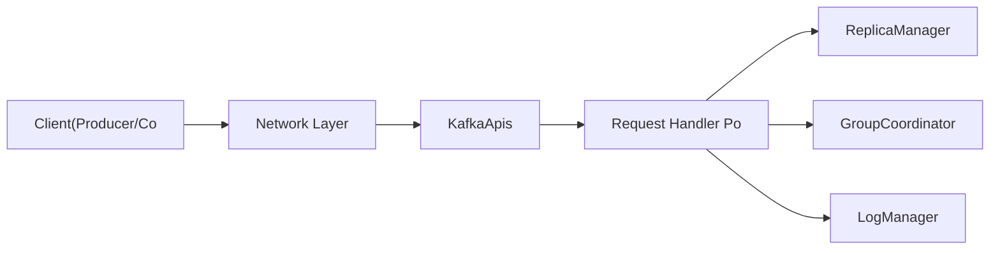
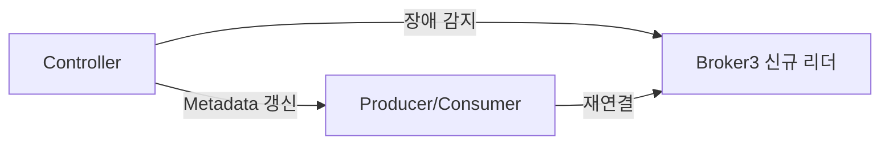
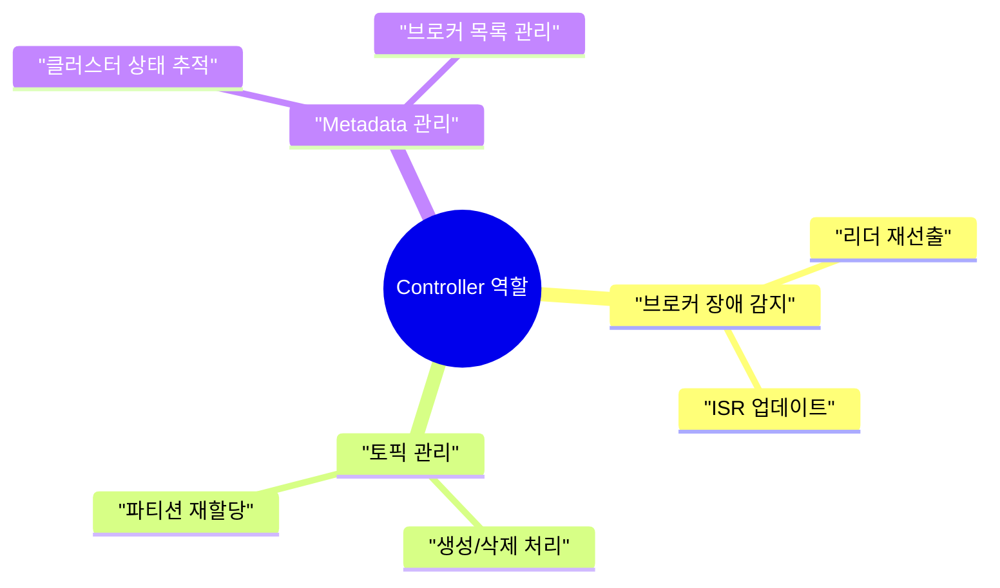
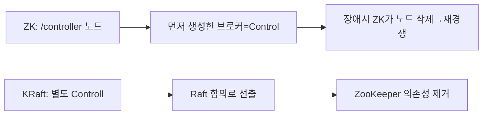
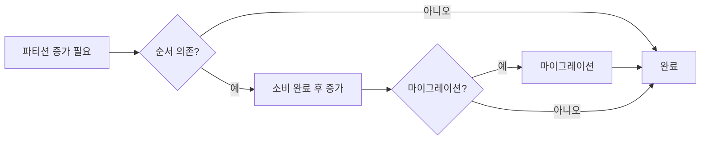

Kafka가 초당 수백만 메시지를 처리하면서도 디스크 기반임에도 빠른 이유는 무엇일까? 비결은 브로커 내부의 로그 세그먼트 구조, 페이지 캐시 활용, 제로카피 전송에 있다. 브로커 내부를 이해하면 성능 튜닝 방향이 보인다.

## 왜 이게 중요한가?

Kafka 브로커 내부 구조를 모르면 장애 발생 시 어디가 문제인지 알 수 없다. 디스크 I/O가 높은지, 복제가 지연되는지, 스레드 풀이 부족한지 — 이 구분은 모니터링 지표 해석과 튜닝 방향을 결정한다. 또한 파티션 수를 늘리거나 브로커를 추가할 때 예상치 못한 부작용을 방지하려면 내부 동작 원리를 알아야 한다.

## 브로커 아키텍처

### 비유로 이해하기

> 브로커는 대형 물류 창고다. 물건(메시지)이 들어오면 종류별로 선반(파티션)에 차곡차곡 쌓아두고, 택배기사(Consumer)가 찾아오면 해당 선반에서 꺼내준다. 창고가 여러 동(브로커 클러스터)으로 이루어져 있어 한 동이 불타도 다른 동의 사본으로 업무가 이어진다. 창고 총괄 관리자(Controller)는 단 한 명이며, 어느 선반이 어느 동에 있는지 파악하고 장애 발생 시 즉시 대체 선반을 지정한다.

### 브로커란?

Kafka 클러스터를 구성하는 개별 서버 노드다. 각 브로커는 파티션 데이터 저장, 클라이언트 요청 처리, 복제 참여를 담당한다. 브로커 여러 대가 모여 하나의 Kafka 클러스터를 이룬다.

```mermaid
sequenceDiagram
    Broker1Controller-->>Broker2:_P1-Leader: P0 복제
    Broker1Controller-->>Broker3:_P2-Leader: P0 복제
    Broker2:_P1-Leader-->>Broker1Controller: P1 복제
    Broker2:_P1-Leader-->>Broker3:_P2-Leader: P1 복제
    Broker3:_P2-Leader-->>Broker1Controller: P2 복제
    Broker3:_P2-Leader-->>Broker2:_P1-Leader: P2 복제
```

각 파티션은 단 하나의 Leader와 나머지 Follower로 구성된다. Leader가 읽기/쓰기를 전담하고, Follower는 Leader로부터 데이터를 복제한다.

### 브로커 내부 컴포넌트

브로커 안에서 메시지가 어떤 경로로 처리되는지 이해하면 성능 병목을 찾을 수 있다.



각 레이어의 역할을 이해하면 튜닝 포인트가 명확해진다. `num.network.threads`는 Network Layer, `num.io.threads`는 Request Handler Pool의 스레드 수를 조정한다.

---

## 로그 세그먼트

### 파티션 저장 구조

각 파티션은 디스크에 여러 세그먼트 파일로 저장된다. 하나의 거대한 파일 대신 일정 크기/시간 단위로 분할하여 오래된 데이터 삭제와 인덱스 조회를 효율적으로 처리한다.

```
/kafka-logs/orders-0/          (orders 토픽, 파티션 0)
├── 00000000000000000000.log   (세그먼트 파일: 메시지 본문)
├── 00000000000000000000.index (오프셋 → 파일 위치 인덱스)
├── 00000000000000000000.timeindex (타임스탬프 → 오프셋 인덱스)
├── 00000000000001048576.log   (다음 세그먼트: offset 1048576부터)
├── 00000000000001048576.index
├── 00000000000001048576.timeindex
└── leader-epoch-checkpoint
```

파일명의 숫자는 해당 세그먼트의 **시작 오프셋**이다. 이 숫자를 이진 탐색하면 특정 오프셋이 어느 파일에 있는지 O(log n)으로 찾을 수 있다.

### 세그먼트 전환 (Rolling)

```properties
log.segment.bytes=1073741824   # 1GB 초과 시 새 세그먼트
log.roll.hours=168             # 7일 경과 시 새 세그먼트
log.roll.jitter.hours=0        # 세그먼트 전환 시간 분산 (0이면 동시 전환)
```

### 메시지 조회 방식

Consumer가 특정 오프셋을 요청하면 Kafka는 세 단계로 빠르게 찾아낸다.


### 인덱스 구조 (희소 인덱스)

인덱스는 모든 메시지마다 만들지 않는다. `log.index.interval.bytes=4096` 설정에 따라 4KB마다 하나씩 생성한다. 메모리를 아끼면서도 탐색 성능을 유지하는 절충점이다.

```
인덱스 파일:
offset=0       → file_pos=0
offset=50      → file_pos=4096
offset=103     → file_pos=8192
...

조회: 이진 탐색으로 가장 가까운 인덱스 항목 찾은 후
      로그 파일에서 순차 스캔으로 정확한 offset 찾기
```

### 데이터 보존 정책

```properties
# 시간 기반
log.retention.hours=168          # 7일 보존 (기본값)
log.retention.ms=604800000       # ms 단위 (우선순위 높음)

# 크기 기반
log.retention.bytes=1073741824   # 파티션당 최대 1GB

# 정리 방식
log.cleanup.policy=delete        # 만료 세그먼트 삭제 (기본)
log.cleanup.policy=compact       # 키별 마지막 값만 유지
log.cleanup.policy=delete,compact # 두 가지 병행

# 삭제되지 않는 최소 보존 시간 (compact 사용 시)
log.retention.minutes=1440       # 최소 1일 보존 후 compaction
```

---

## 파티션 리더 선출

### 정상적인 리더 분산

토픽 생성 시 파티션 리더는 브로커에 균등 분산된다. 이렇게 하면 각 브로커의 부하가 균형을 이룬다.

```
파티션 0: Leader=Broker1, ISR=[1,2,3]
파티션 1: Leader=Broker2, ISR=[2,3,1]
파티션 2: Leader=Broker3, ISR=[3,1,2]
```

### 리더 장애 시 선출 과정

리더 브로커가 장애 나면 Controller가 즉시 새 리더를 선출한다. ZooKeeper 기반과 KRaft 기반의 처리 방식이 다르다.



**KRaft 기반 (Kafka 3.x+)** 은 ZooKeeper 없이 Raft 합의로 처리하므로 ZooKeeper 세션 만료 대기 없이 수십 ms 안에 선출이 완료된다.

### Preferred Leader 선출

각 파티션에는 최초 지정된 Preferred Leader가 있다. 장애 후 복구 시 Preferred Leader로 다시 리더를 이전해 부하 균형을 회복한다.

```bash
# Preferred Leader 선출 트리거
kafka-leader-election.sh --bootstrap-server kafka:9092 \
  --election-type PREFERRED \
  --all-topic-partitions

# 설정으로 자동화
auto.leader.rebalance.enable=true           # 자동 Preferred Leader 복귀 (기본 true)
leader.imbalance.check.interval.seconds=300  # 5분마다 체크
leader.imbalance.per.broker.percentage=10    # 10% 이상 불균형 시 재조정
```

---

## Controller

### Controller의 역할

클러스터 내 단 하나의 브로커가 Controller 역할을 담당한다. 클러스터 관리의 핵심 두뇌다.

Controller가 담당하는 업무는 다음과 같다.



### Controller 선출



---

## KRaft

### ZooKeeper vs KRaft 비교

| 구분 | ZooKeeper 기반 | KRaft |
|------|---------------|-------|
| **Metadata 저장** | ZooKeeper 외부 시스템 | Kafka 내부 Raft 로그 |
| **Controller 선출** | ZooKeeper ephemeral node | Raft 합의 |
| **확장성** | 파티션 수 수만 개 한계 | 수백만 파티션 지원 |
| **운영 복잡도** | ZooKeeper 별도 관리 | 단일 시스템 관리 |
| **장애 복구** | 수십 초 | 수 초 |
| **Kafka 버전** | 3.x까지 지원, 4.0에서 제거 | 2.8+ 지원, 3.3+에서 프로덕션 |

ZooKeeper 의존성이 사라지면 운영 인프라가 단순해진다. ZooKeeper 클러스터를 별도 관리할 필요가 없고, 장애 복구 속도도 빨라진다.

### KRaft 설정

```properties
# KRaft 모드 server.properties
process.roles=broker,controller          # broker 또는 controller 또는 둘 다
node.id=1
controller.quorum.voters=1@kafka1:9093,2@kafka2:9093,3@kafka3:9093
listeners=PLAINTEXT://kafka1:9092,CONTROLLER://kafka1:9093
inter.broker.listener.name=PLAINTEXT
controller.listener.names=CONTROLLER

# Cluster ID 생성 (최초 1회)
kafka-storage.sh random-uuid

# 스토리지 초기화
kafka-storage.sh format \
  --config /etc/kafka/server.properties \
  --cluster-id <UUID>
```

---

## 브로커 장애 시 동작

### 장애 감지

```
ZooKeeper 기반:
  - 브로커가 ZooKeeper에 heartbeat 전송 (zookeeper.session.timeout.ms)
  - 기본 18초 내 heartbeat 없으면 장애로 판단
  - ZooKeeper가 해당 브로커의 임시 노드 삭제

KRaft 기반:
  - 브로커가 Controller에 heartbeat 전송
  - 기본 9초(broker.session.timeout.ms) 내 없으면 장애로 판단
```

### 장애 복구 전체 흐름


### 장애 브로커 복구 후 처리

브로커가 재시작되면 단순히 클러스터에 합류하는 것이 아니라 로그 정합성 검증을 먼저 수행한다.

```
브로커 재시작:
1. 로그 복구 (Log Recovery)
   - 마지막 checkpoint 이후 로그 일관성 확인
   - Leader Epoch 기반으로 불일치 로그 truncate
2. Controller에 재등록
3. 각 파티션의 Leader에게 fetch 시작
4. Leader의 LEO까지 따라잡으면 ISR 재진입
5. 필요시 Preferred Leader 복귀
```

---

## 파티션 증설 시 주의사항

### 파티션 추가 방법

```bash
# 파티션 수 늘리기 (6 → 9)
kafka-topics.sh --bootstrap-server kafka:9092 \
  --alter --topic orders \
  --partitions 9
```

파티션 **감소는 불가능**하다. 증가만 가능하며, 기존 메시지는 재배치되지 않는다. 새 파티션에는 새 메시지만 들어간다.

### 키 기반 파티셔닝 영향

파티션 수를 늘리면 키 해시의 모듈러 연산 결과가 바뀌어 같은 키가 다른 파티션으로 라우팅된다. 순서 보장이 필요한 경우 반드시 고려해야 한다.

```
파티션 3개일 때:
  key="order-123" → murmur2(key) % 3 = 1 → Partition 1

파티션 9개로 증가 후:
  key="order-123" → murmur2(key) % 9 = 7 → Partition 7

결과: 같은 키가 다른 파티션으로 → 순서 보장 깨짐
      기존 데이터(P1)와 새 데이터(P7)가 분산됨
```

안전한 파티션 증가 절차는 다음과 같다.



### 파티션 재할당 (Partition Reassignment)

브로커를 추가했을 때 기존 파티션을 새 브로커에 재분산한다.

```bash
# 재할당 계획 생성
kafka-reassign-partitions.sh --bootstrap-server kafka:9092 \
  --broker-list "1,2,3,4" \
  --topics-to-move-json-file topics.json \
  --generate

# 재할당 실행
kafka-reassign-partitions.sh --bootstrap-server kafka:9092 \
  --reassignment-json-file reassignment.json \
  --execute

# 재할당 상태 확인
kafka-reassign-partitions.sh --bootstrap-server kafka:9092 \
  --reassignment-json-file reassignment.json \
  --verify
```

재할당 시 대용량 데이터 이동으로 네트워크/디스크 I/O가 급증하므로 운영 시간 외에 실행하거나 throttle을 적용한다.

```bash
# throttle 적용 (10MB/s 제한)
kafka-configs.sh --bootstrap-server kafka:9092 \
  --entity-type brokers \
  --entity-name 1 \
  --alter \
  --add-config leader.replication.throttled.rate=10485760
```

---

## 브로커 성능 튜닝

### OS 수준 설정

Kafka는 페이지 캐시를 적극적으로 활용하므로 OS 메모리 설정이 성능에 직접 영향을 준다.

```bash
# 파일 디스크립터 한도
ulimit -n 100000
echo "kafka soft nofile 100000" >> /etc/security/limits.conf
echo "kafka hard nofile 100000" >> /etc/security/limits.conf

# 가상 메모리 (Kafka는 페이지 캐시를 적극 활용)
sysctl -w vm.swappiness=1             # 스왑 거의 사용 안 함
sysctl -w vm.dirty_background_ratio=5 # 백그라운드 플러시 시작 임계값
sysctl -w vm.dirty_ratio=80           # 동기 플러시 임계값

# 네트워크 버퍼
sysctl -w net.core.rmem_max=16777216
sysctl -w net.core.wmem_max=16777216
```

### 브로커 핵심 설정

```properties
# 스레드 설정
num.network.threads=8       # 네트워크 I/O 스레드 (CPU 코어 수 기준)
num.io.threads=16           # 디스크 I/O 스레드 (num.network.threads * 2 권장)
num.replica.fetchers=4      # 복제 fetch 스레드

# 로그 설정
log.dirs=/data/kafka-logs   # 여러 디스크: /data1/kafka,/data2/kafka
log.segment.bytes=1073741824
log.retention.hours=168

# 소켓 버퍼
socket.send.buffer.bytes=102400
socket.receive.buffer.bytes=102400
socket.request.max.bytes=104857600
```

### JVM 설정

```bash
# kafka-server-start.sh 수정 또는 KAFKA_HEAP_OPTS 환경변수
export KAFKA_HEAP_OPTS="-Xmx6g -Xms6g"

# G1GC 설정 (대용량 힙 권장)
export KAFKA_JVM_PERFORMANCE_OPTS="-server \
  -XX:+UseG1GC \
  -XX:MaxGCPauseMillis=20 \
  -XX:InitiatingHeapOccupancyPercent=35 \
  -XX:+ExplicitGCInvokesConcurrent \
  -Djava.awt.headless=true"
```

### 모니터링 핵심 지표

| 분류 | 지표 | 의미 |
|------|------|------|
| 브로커 헬스 | `BytesInPerSec` | 초당 수신 바이트 |
| 브로커 헬스 | `BytesOutPerSec` | 초당 송신 바이트 |
| 브로커 헬스 | `MessagesInPerSec` | 초당 메시지 수 |
| 요청 처리 | `TotalTimeMs (Produce)` | Produce 지연 |
| 요청 처리 | `RequestsPerSec` | 초당 요청 수 |
| 복제 | `UnderReplicatedPartitions` | 복제 지연 파티션 수 (0이어야 정상) |
| 복제 | `LeaderCount` | 이 브로커가 리더인 파티션 수 |
| 복제 | `ActiveControllerCount` | 1이면 정상 |

---


## 극한 시나리오

### 시나리오 1: 브로커 재시작 중 파티션 리더 쏠림

브로커 하나가 재시작되면 해당 브로커의 Preferred Leader 파티션들이 다른 브로커로 이동한다. 여러 브로커를 순차 재시작할 때 특정 브로커에 리더가 집중될 수 있다.

```
방어:
auto.leader.rebalance.enable=true 설정
재시작 완료 후 kafka-leader-election.sh --election-type PREFERRED 실행
```

### 시나리오 2: Controller 장애 + ZooKeeper 연결 단절 동시 발생

Controller가 ZooKeeper와 연결이 끊기면 자신이 Controller인지 확인할 수 없다. 잘못된 Controller가 두 개 동작하는 Split Brain 가능성이 있다.

```
방어:
KRaft로 마이그레이션 (Raft 합의 기반 → Split Brain 방지 내장)
ZooKeeper 클러스터 앙상블을 3대 이상으로 구성
```

### 시나리오 3: 파티션 재할당 중 브로커 장애

재할당이 진행 중인 파티션의 데이터가 아직 완전히 복사되지 않은 상태에서 소스 브로커에 장애가 발생하면 재할당이 중단된다.

```
방어:
재할당 전 Under-Replicated Partitions가 0임을 확인
throttle 적용으로 재할당 속도 제한 (과도한 I/O 방지)
재할당 완료 후 verify 명령으로 검증
```

---

## 왜 Kafka Broker 내부를 알아야 하는가?

브로커 설정값(`log.retention.hours`, `num.io.threads`, `socket.send.buffer.bytes`)의 의미를 모르면 성능 튜닝이 불가능하고 장애 원인을 파악할 수 없다. "왜 특정 브로커에만 부하가 몰리는가?", "왜 Consumer Lag이 특정 파티션에서만 쌓이는가?"는 브로커 내부를 알아야 답할 수 있다.

---

## 실무에서 자주 하는 실수

**실수 1: num.partitions을 너무 많이 설정**
파티션 수는 병렬 처리량을 결정하지만 브로커당 파티션이 많으면 ① 컨트롤러 메타데이터 증가 ② 파일 핸들 수 증가 ③ 리더 선출 시간 증가. Kafka 공식 권장은 브로커당 4,000개 미만, 클러스터 전체 200,000개 미만이다.

**실수 2: log.retention.bytes 미설정으로 디스크 풀**
`log.retention.hours`만 설정하고 `log.retention.bytes`를 설정하지 않는다. 트래픽이 급증하면 시간 내에 디스크가 가득 찬다. 두 가지를 모두 설정해 먼저 도달한 조건에서 삭제가 일어나도록 해야 한다.

**실수 3: replication.factor=1로 운영**
단일 브로커 복제로 해당 브로커 장애 시 해당 파티션의 데이터가 유실되고 서비스가 중단된다. 운영 환경에서는 최소 `replication.factor=3`이 필수다.

**실수 4: Controller 브로커에 부하 집중 모름**
KRaft 이전에는 ZooKeeper와 통신하는 Controller가 단일 브로커였다. Controller 브로커가 과부하 상태면 리더 선출, 파티션 재할당이 지연된다. Controller 브로커를 모니터링하고 과부하 시 재선출(`kafka-leader-election.sh`)을 고려한다.

**실수 5: 브로커 재시작 시 Unclean Leader Election 발생**
`unclean.leader.election.enable=true`(기본 false) 상태에서 ISR 외 레플리카가 리더가 되면 데이터가 유실된다. 기본값 false를 변경하지 말고, ISR이 비어 서비스가 중단되더라도 데이터 정합성을 우선해야 한다.

---

## 면접 포인트

**Q1. Kafka 브로커가 메시지를 저장하는 방식은?**
토픽-파티션별로 세그먼트 파일(`.log`)에 순차 append한다. 각 메시지는 오프셋, 타임스탬프, 키, 값으로 구성된다. 인덱스 파일(`.index`, `.timeindex`)로 오프셋/시간 기반 탐색을 지원한다. 파일 시스템의 페이지 캐시를 최대한 활용해 디스크 I/O를 줄인다.

**Q2. ISR(In-Sync Replicas)이란?**
리더와 동기화된 레플리카 집합이다. `replica.lag.time.max.ms`(기본 30초) 이내에 리더를 따라가는 레플리카만 ISR에 포함된다. `acks=all`은 ISR의 모든 레플리카가 확인할 때까지 대기한다. ISR이 줄어들면 내구성이 약해진다.

**Q3. Log Compaction은 어떻게 동작하는가?**
같은 키의 메시지 중 최신 값만 보존하고 나머지를 삭제한다. Cleaner 스레드가 백그라운드에서 세그먼트를 병합하며 중복 키를 제거한다. 이벤트 소싱의 스냅샷, CDC의 최신 상태 유지에 활용된다. `cleanup.policy=compact`로 설정한다.

**Q4. KRaft 모드가 ZooKeeper를 대체하는 이유는?**
ZooKeeper 의존성 제거로 ① 운영 인프라 단순화 ② 메타데이터 변경 속도 향상(ZooKeeper 왕복 없음) ③ 수백만 파티션 지원(ZooKeeper는 수만 파티션이 한계) ④ 단일 장애점(ZooKeeper 앙상블) 제거. Kafka 3.3부터 프로덕션 권장, Kafka 4.0부터 ZooKeeper 지원 종료.

**Q5. 브로커 리밸런싱이 필요한 상황과 방법은?**
파티션 리더가 특정 브로커에 집중되면(`kafka-topics.sh --describe`로 확인) 부하 불균형이 발생한다. `kafka-leader-election.sh --election-type PREFERRED`로 각 파티션의 선호 리더(첫 번째 레플리카)로 복원한다. 브로커 추가 후 파티션 재할당은 `kafka-reassign-partitions.sh`를 사용한다.
